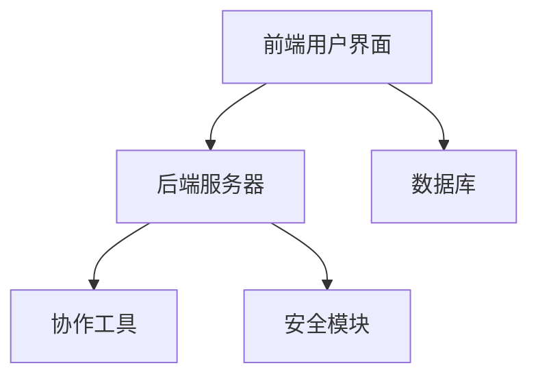
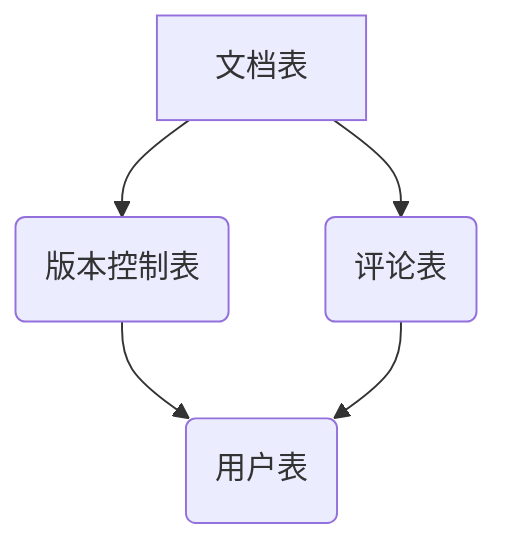

                 

## 大模型应用的敏捷文档管理

关键词：敏捷文档管理、大模型、文档生命周期、协作共享、人工智能

摘要：随着信息技术的飞速发展，文档管理在企业中扮演着越来越重要的角色。传统的文档管理方法往往效率低下，难以满足现代企业的敏捷性需求。本文将探讨大模型在敏捷文档管理中的应用，通过深入分析大模型的原理及其与文档管理的结合点，提出一种基于大模型的敏捷文档管理系统设计，并详细描述其实施过程。本文旨在为企业在文档管理方面提供一种高效、智能的解决方案，推动企业信息化管理的进一步提升。

### 第一部分： 引言与背景介绍

#### 第1章： 引言——敏捷文档管理的重要性

##### 1.1 问题背景

在当今信息化社会，企业日常运作中产生的文档数量呈爆炸性增长。这些文档不仅包括业务报告、电子邮件、合同等文本文件，还包括设计图纸、图表、PPT等非结构化数据。面对如此庞大的文档数据，传统的文档管理方式已经显得力不从心，主要存在以下几个挑战：

1. **文档数量庞大，难以管理**：企业内部的文档种类繁多，数量庞大，传统的文件存储和检索方式难以应对这种复杂性。
2. **文档版本难以控制**：随着文档的不断更新和修改，版本控制成为一个难题，容易出现文档不一致或丢失的情况。
3. **文档协作效率低下**：多部门、多人员协同工作的情况下，文档的共享和协作过程繁琐，信息传递不及时，导致工作效率下降。
4. **文档安全与保密性**：企业文档往往涉及敏感信息，传统的管理方式难以保障文档的安全性。

##### 1.2 敏捷文档管理的概念及其优势

敏捷文档管理是一种以敏捷开发方法为基础的文档管理方法，其核心理念是快速响应变化，提高文档管理的效率和效果。敏捷文档管理具有以下几个显著优势：

1. **快速响应需求**：敏捷文档管理强调用户参与，能够快速响应用户需求，确保文档管理流程与业务需求紧密对接。
2. **文档版本控制**：敏捷文档管理通过版本控制机制，确保文档的每一次修改都有记录，方便用户追溯和回滚。
3. **高效协作**：敏捷文档管理通过提供协作工具，实现多部门、多人员的实时协作，提高工作效率。
4. **文档安全与保密性**：敏捷文档管理通过严格的权限管理和加密技术，保障文档的安全与保密性。
5. **灵活性与可扩展性**：敏捷文档管理采用模块化设计，可以根据企业需求灵活扩展功能，适应不同规模和类型的文档管理需求。

##### 1.3 问题解决

敏捷文档管理的核心要素包括：

1. **文档生命周期管理**：涵盖文档的创建、编辑、审核、发布、归档和备份等全过程，确保文档管理的系统性和完整性。
2. **文档版本控制**：通过版本控制机制，确保文档的每一次修改都有记录，方便用户追溯和回滚。
3. **文档协作与共享**：提供便捷的协作工具，实现多部门、多人员的实时协作，提高工作效率。
4. **文档安全与保密性**：通过权限管理和加密技术，保障文档的安全与保密性。

敏捷文档管理的方法与实践包括：

1. **建立文档管理规范**：制定统一的文档命名规则、分类标准和版本控制流程，确保文档的一致性和可追溯性。
2. **采用敏捷工具**：利用敏捷开发工具，如JIRA、Confluence等，实现文档的实时协作和版本控制。
3. **培训与推广**：对企业员工进行文档管理培训，提高员工的文档管理意识和技能。
4. **持续优化**：通过用户反馈和数据分析，不断优化文档管理流程和工具，提升文档管理的效率。

##### 1.4 边界与外延

敏捷文档管理与其他文档管理方法的区别主要体现在以下几个方面：

1. **管理理念**：敏捷文档管理强调快速响应变化，而传统的文档管理方法更注重文档的规范性和严谨性。
2. **工具选择**：敏捷文档管理通常采用敏捷开发工具，如JIRA、Confluence等，而传统文档管理方法则可能采用更传统的文件管理工具。
3. **流程设计**：敏捷文档管理注重流程的灵活性，而传统文档管理方法则更强调流程的标准化和规范化。

大模型应用在敏捷文档管理中的可能性主要体现在以下几个方面：

1. **自动分类与标注**：大模型可以通过深度学习技术，对文档进行自动分类和标注，提高文档管理的效率和准确性。
2. **内容提取与摘要**：大模型可以提取文档的核心内容，生成摘要，帮助用户快速了解文档的关键信息。
3. **智能搜索**：大模型可以通过自然语言处理技术，实现智能搜索，提高文档检索的准确性和效率。

##### 1.5 概念结构与核心要素组成

1. **文档生命周期管理**：涵盖文档的创建、编辑、审核、发布、归档和备份等全过程，确保文档管理的系统性和完整性。
2. **文档版本控制**：通过版本控制机制，确保文档的每一次修改都有记录，方便用户追溯和回滚。
3. **文档协作与共享**：提供便捷的协作工具，实现多部门、多人员的实时协作，提高工作效率。
4. **文档安全与保密性**：通过权限管理和加密技术，保障文档的安全与保密性。

##### 1.6 本章小结

敏捷文档管理作为一种现代化的文档管理方法，能够有效解决传统文档管理中存在的诸多问题，提高文档管理的效率和效果。通过深入分析敏捷文档管理的核心要素和方法，本文为企业在文档管理方面提供了有益的参考和借鉴。同时，大模型在敏捷文档管理中的应用，为文档管理带来了新的可能性，展示了未来文档管理的发展趋势。在接下来的章节中，我们将进一步探讨大模型的原理及其在敏捷文档管理中的应用，为企业提供更为具体和实用的解决方案。

### 第二部分： 大模型应用原理

#### 第2章： 大模型概述

##### 2.1 大模型的定义与类型

大模型是指那些参数规模巨大、能够处理复杂数据和任务的机器学习模型。这类模型通常具备强大的特征提取和泛化能力，能够应对各种复杂的现实问题。大模型的定义可以从以下几个方面进行理解：

1. **参数规模**：大模型的参数规模通常达到数十亿甚至数万亿级别，这使得它们能够捕捉到数据中的细微特征和模式。
2. **计算资源**：大模型的训练和推理过程需要大量的计算资源，通常需要分布式计算和专门的大规模计算硬件支持。
3. **数据处理能力**：大模型具备强大的数据处理能力，能够处理高维、非结构化甚至带噪声的数据。

常见的大模型类型主要包括：

1. **深度神经网络（DNN）**：DNN是由多层神经元组成的神经网络，通过逐层提取数据特征，实现从原始数据到高维抽象表示的转化。
2. **循环神经网络（RNN）**：RNN是一种能够处理序列数据的神经网络，通过记忆状态捕获数据的时间依赖性。
3. **卷积神经网络（CNN）**：CNN是一种专门用于处理图像数据的神经网络，通过卷积操作提取图像特征。
4. **生成对抗网络（GAN）**：GAN是一种由生成器和判别器组成的对抗网络，通过生成逼真的数据与真实数据进行对抗，实现数据的生成。
5. **Transformer**：Transformer是一种基于自注意力机制的神经网络结构，广泛用于处理序列数据，特别是在自然语言处理领域表现优异。

不同类型的大模型具有各自的特点和应用场景：

1. **深度神经网络（DNN）**：适用于处理结构化数据，如分类、回归等问题。
2. **循环神经网络（RNN）**：适用于处理序列数据，如时间序列预测、语音识别等。
3. **卷积神经网络（CNN）**：适用于处理图像数据，如图像分类、目标检测等。
4. **生成对抗网络（GAN）**：适用于图像生成、数据增强等场景。
5. **Transformer**：适用于自然语言处理任务，如机器翻译、文本分类、问答系统等。

##### 2.2 大模型的核心技术

大模型的核心技术主要包括深度学习、神经网络、自然语言处理（NLP）和生成模型等。

1. **深度学习**：深度学习是一种基于多层神经网络的学习方法，通过逐层提取数据特征，实现从原始数据到高维抽象表示的转化。深度学习的核心思想是通过大量数据训练模型，使得模型能够自动学习数据中的复杂模式和特征。

2. **神经网络**：神经网络是由大量神经元组成的计算模型，通过前向传播和反向传播算法，实现输入到输出的映射。神经网络的核心在于通过学习大量训练数据，优化网络参数，使得模型能够在新的数据上实现良好的泛化能力。

3. **自然语言处理（NLP）**：自然语言处理是计算机科学和人工智能领域的一个重要分支，旨在让计算机理解和处理人类自然语言。NLP的核心技术包括词向量表示、文本分类、命名实体识别、机器翻译等。

4. **生成模型**：生成模型是一类用于生成数据的机器学习模型，通过学习数据分布，生成与真实数据具有相似特征的新数据。生成模型的核心技术包括生成对抗网络（GAN）和变分自编码器（VAE）等。

##### 2.3 大模型的实现与应用

大模型的实现通常包括以下几个关键步骤：

1. **数据准备**：收集和清洗数据，确保数据的质量和一致性。对于大规模数据集，可能需要采用数据预处理技术，如数据增强、数据降维等。

2. **模型选择**：根据应用场景和数据特点，选择合适的模型架构。常见的模型包括深度神经网络（DNN）、循环神经网络（RNN）、卷积神经网络（CNN）和Transformer等。

3. **模型训练**：使用训练数据对模型进行训练，通过优化算法（如梯度下降、Adam等）调整模型参数，使得模型在训练数据上实现良好的性能。

4. **模型评估**：使用验证数据集对模型进行评估，通过性能指标（如准确率、召回率、F1分数等）评估模型的效果，并调整模型参数。

5. **模型部署**：将训练好的模型部署到生产环境中，实现实时推理和预测。

大模型在企业中的应用案例非常丰富，以下是一些典型的应用场景：

1. **自然语言处理**：企业可以利用大模型进行文本分类、情感分析、命名实体识别等任务，提升信息处理和分析能力。例如，电商企业可以利用文本分类模型对用户评论进行分类，从而更好地理解用户需求。

2. **图像识别**：企业可以利用大模型进行图像分类、目标检测等任务，提升图像分析能力。例如，制造业企业可以利用图像识别模型对生产线上的产品进行质量检测。

3. **数据挖掘**：企业可以利用大模型进行数据挖掘，发现数据中的潜在模式和规律，从而优化业务流程和决策。例如，金融企业可以利用数据挖掘模型进行风险预测和客户行为分析。

4. **自动化决策**：企业可以利用大模型实现自动化决策，提高业务效率和准确性。例如，智能客服系统可以利用自然语言处理模型和机器学习算法，实现智能问答和客户服务。

##### 2.4 大模型在文档管理中的潜在价值

大模型在文档管理中的应用具有巨大的潜力，能够显著提升文档管理的效率和质量。以下是大模型在文档管理中的潜在价值：

1. **自动分类与标注**：大模型可以通过深度学习和自然语言处理技术，自动对文档进行分类和标注，提高文档管理的自动化程度和准确性。例如，企业可以将大量未分类的文档通过大模型进行自动分类，从而更好地组织和管理文档。

2. **内容提取与摘要**：大模型可以提取文档的核心内容，生成摘要，帮助用户快速了解文档的关键信息。例如，企业可以利用大模型自动提取报告、合同等文档的关键信息，生成摘要，从而提高文档的可读性和工作效率。

3. **智能搜索**：大模型可以通过自然语言处理技术，实现智能搜索，提高文档检索的准确性和效率。例如，企业可以利用大模型对文档进行语义分析，实现基于内容的搜索，从而快速找到相关文档。

4. **文档协同编辑**：大模型可以辅助文档的协同编辑，提高多人协作的效率。例如，企业可以利用大模型进行拼写检查、语法纠错等任务，减少文档编辑中的错误和重复劳动。

5. **文档安全与隐私保护**：大模型可以通过加密和隐私保护技术，确保文档的安全与隐私。例如，企业可以利用大模型实现文档的加密存储和传输，防止文档被未授权访问和泄露。

##### 2.5 本章小结

大模型作为一种先进的机器学习技术，具有强大的数据处理和分析能力，广泛应用于自然语言处理、图像识别、数据挖掘等领域。大模型在文档管理中的应用，为传统文档管理带来了新的可能性，能够显著提升文档管理的效率和质量。在接下来的章节中，我们将进一步探讨敏捷文档管理系统的设计与实现，结合大模型的原理，为企业提供一种高效、智能的文档管理解决方案。

### 第三部分： 敏捷文档管理系统设计与实现

#### 第3章： 敏捷文档管理系统设计原则

##### 3.1 系统设计目标

敏捷文档管理系统的设计目标主要包括以下几个方面：

1. **提高文档管理效率**：通过自动化工具和智能算法，简化文档创建、编辑、审核、发布等流程，减少人工操作，提高整体管理效率。

2. **确保文档安全性**：通过权限管理和加密技术，保障文档的机密性、完整性和可用性，防止文档泄露、篡改和丢失。

3. **支持协作共享**：提供便捷的协作工具，实现多部门、多人员的实时协作和共享，提高团队工作效率。

4. **灵活可扩展**：采用模块化设计，便于根据企业需求灵活扩展功能，适应不同规模和类型的文档管理需求。

##### 3.2 系统架构设计

敏捷文档管理系统的整体架构可以分为以下几个关键部分：

1. **前端用户界面**：提供直观易用的用户界面，包括文档上传、下载、编辑、发布、搜索等功能模块。

2. **后端服务器**：负责处理文档的存储、检索、版本控制和用户权限管理等核心功能，通常采用分布式架构以提高系统性能和可扩展性。

3. **数据库**：存储文档内容、用户信息、权限设置等数据，支持高并发访问和快速查询。

4. **协作工具**：提供实时协作、消息通知、评论反馈等功能，支持多人在线协作。

5. **安全模块**：实现用户认证、权限管理和数据加密等功能，保障系统的安全性和可靠性。

系统架构图如下：



##### 3.3 数据库设计

数据库设计是敏捷文档管理系统的基础，合理的数据库设计能够提高系统的性能和可维护性。以下是数据库设计的关键要素：

1. **文档表**：存储文档的基本信息，包括文档标题、作者、创建时间、版本号等。

2. **用户表**：存储用户的基本信息，包括用户名、密码、邮箱、角色等。

3. **权限表**：定义不同角色的权限，包括文档查看、编辑、发布等权限。

4. **版本控制表**：记录文档的不同版本信息，包括版本号、修改时间、修改内容等。

5. **评论表**：存储用户对文档的评论信息，包括评论内容、评论时间、评论者信息等。

以下是数据库的ER实体关系图：



##### 3.4 系统安全性设计

系统安全性是敏捷文档管理系统设计的重要考虑因素，以下是系统安全性设计的关键要素：

1. **用户认证**：采用双因素认证（2FA）或多因素认证（MFA），确保用户身份验证的安全性。

2. **权限管理**：根据用户的角色和权限设置，限制用户对文档的访问和操作权限，防止未授权访问。

3. **数据加密**：使用SSL/TLS协议加密传输数据，使用AES等加密算法对存储的文档进行加密，保障数据的安全性和隐私性。

4. **日志审计**：记录用户操作日志，包括登录、修改、删除等操作，以便进行审计和追溯。

5. **安全漏洞扫描**：定期进行安全漏洞扫描，及时发现和修复系统漏洞，防止安全风险。

##### 3.5 系统可扩展性设计

系统可扩展性是敏捷文档管理系统设计的重要原则，以下是系统可扩展性设计的关键要素：

1. **模块化设计**：将系统功能划分为多个模块，每个模块独立实现和部署，便于后续的扩展和升级。

2. **分布式架构**：采用分布式架构，将系统拆分为多个节点，实现负载均衡和高可用性。

3. **弹性扩展**：支持根据实际业务需求动态调整系统资源，如增加或减少服务器节点，提升系统性能和扩展性。

4. **API接口设计**：提供统一的API接口，方便第三方系统和外部应用与文档管理系统进行集成。

##### 3.6 本章小结

敏捷文档管理系统设计原则以提高文档管理效率、确保文档安全性、支持协作共享和灵活可扩展为核心目标。通过合理的系统架构设计、数据库设计、安全性设计和可扩展性设计，能够构建一个高效、安全、灵活的文档管理系统。在接下来的章节中，我们将进一步探讨文档生命周期管理、文档协作与共享以及大模型在文档管理中的应用，为敏捷文档管理系统的实现提供具体的技术方案和实践指导。

#### 第4章： 文档生命周期管理

##### 4.1 文档创建与编辑

文档生命周期管理的第一个关键步骤是文档的创建与编辑。在这个阶段，用户可以轻松地创建新文档，并对其进行编辑。

1. **文档创建**：
    - 用户通过前端用户界面选择创建文档的模板。
    - 系统根据选择的模板生成一个新的空白文档。
    - 用户可以添加文档标题、描述和其他相关信息。

2. **文档编辑**：
    - 用户可以在文档编辑器中对文档进行编辑，包括添加文字、插入图片、表格等。
    - 编辑器支持常见的文档编辑功能，如撤销、重做、格式刷、字体调整等。

为了提高编辑体验，系统还可以集成一些智能编辑工具：

- **拼写检查**：自动检测文档中的拼写错误，并提供更正建议。
- **语法纠错**：通过自然语言处理技术，检测并修正文档中的语法错误。
- **自动格式化**：自动调整文档格式，使其更加规范和美观。

##### 4.2 文档版本控制

文档版本控制是确保文档一致性和可追溯性的关键。敏捷文档管理系统采用以下策略进行版本控制：

1. **版本记录**：
    - 每次文档的修改都会生成一个新的版本。
    - 版本记录包括版本号、修改时间、修改内容、修改者等信息。

2. **版本历史**：
    - 系统提供一个版本历史页面，用户可以查看文档的所有版本历史。
    - 用户可以随时查看、下载或恢复特定版本的文档。

3. **版本回滚**：
    - 如果当前版本出现错误或不符合要求，用户可以选择回滚到之前的版本。
    - 系统会自动将文档内容恢复到所选版本，并保留版本历史记录。

为了更好地管理版本，系统还提供以下功能：

- **版本标签**：用户可以为特定版本添加标签，以便快速查找和识别。
- **版本对比**：用户可以对比不同版本的文档内容，查看具体的变化和修改。

##### 4.3 文档发布与共享

文档发布与共享是文档生命周期管理的重要环节，以下是实现这一功能的步骤：

1. **文档发布**：
    - 用户将编辑完成的文档提交审核。
    - 审核通过后，系统将文档发布到指定的共享区域，供相关人员访问。

2. **共享设置**：
    - 系统支持设置文档的共享权限，包括公开、私密、特定用户等。
    - 用户可以根据需要将文档共享给内部人员或外部合作伙伴。

3. **共享机制**：
    - 文档发布后，系统会通过邮件、消息通知等方式通知相关人员。
    - 相关人员可以通过链接直接访问和下载文档。

为了提高文档共享的便捷性，系统还提供以下功能：

- **实时预览**：用户可以实时预览文档内容，无需下载。
- **权限管理**：管理员可以设置和调整用户的访问权限。
- **权限继承**：新创建的子文档默认继承父文档的权限设置。

##### 4.4 文档归档与备份

文档归档与备份是确保文档长期保存和可恢复性的关键措施。以下是文档归档与备份的步骤和策略：

1. **文档归档**：
    - 当文档不再需要频繁访问时，用户可以选择将其归档。
    - 归档后的文档会被移动到专门的归档区域，减少对存储资源的占用。

2. **归档策略**：
    - 系统支持自定义归档策略，包括归档时间、归档频率等。
    - 归档策略可以根据文档类型和重要性进行灵活设置。

3. **备份方案**：
    - 系统定期对文档进行备份，确保数据的安全性和可靠性。
    - 备份文件存储在多个安全位置，以防止数据丢失和损坏。

4. **数据恢复**：
    - 用户可以随时从备份中恢复文档，确保文档的可恢复性。

为了提高文档归档与备份的效率，系统还提供以下功能：

- **自动化备份**：系统自动执行备份任务，无需人工干预。
- **增量备份**：只备份与上次备份相比发生变化的部分，提高备份速度。
- **数据压缩**：对备份文件进行压缩，减少存储空间占用。

##### 4.5 本章小结

文档生命周期管理涵盖了文档的创建、编辑、版本控制、发布与共享、归档与备份等全过程。通过合理的文档管理策略和工具，可以确保文档的一致性、可追溯性和安全性。在接下来的章节中，我们将进一步探讨文档协作与共享的具体实现，以及大模型在文档管理中的应用，为构建一个高效、智能的文档管理系统提供更多的技术细节和实践指导。

### 第四部分： 文档协作与共享

#### 第5章： 文档协作与共享

##### 5.1 协作机制

文档协作是敏捷文档管理系统中的重要功能，通过提供便捷的协作工具，实现多部门、多人员的实时协作，提高工作效率。以下介绍文档协作的机制：

1. **实时协作**：
    - 用户可以在文档编辑器中进行实时协作，多人同时编辑同一文档。
    - 系统会实时显示其他用户的编辑操作，避免冲突和重复劳动。
    - 用户可以查看其他用户的编辑历史，了解文档的变更情况。

2. **协作邀请**：
    - 用户可以邀请其他人员参与文档编辑和协作。
    - 邀请者可以选择具体的权限，如只读、编辑等。
    - 邀请者可以通过链接或邮件通知被邀请者，方便其快速加入协作。

3. **权限管理**：
    - 系统支持灵活的权限管理，管理员可以根据实际需求设置不同用户的权限。
    - 用户权限包括文档查看、编辑、发布、删除等操作。
    - 权限设置可以针对单个用户或用户组，提高协作的安全性和可控性。

4. **协作工具**：
    - 系统集成多种协作工具，如聊天工具、视频会议、共享桌面等，方便用户进行沟通和协作。
    - 用户可以通过这些工具实时交流意见、解决问题，提高协作效率。

##### 5.2 文档权限管理

文档权限管理是确保文档安全和保密性的关键，以下介绍文档权限管理的策略和实现：

1. **权限设置策略**：
    - 系统提供详细的权限设置界面，管理员可以根据实际需求设置不同文档的权限。
    - 权限设置包括文档查看、编辑、发布、删除等操作。
    - 管理员可以针对不同角色设置默认权限，提高权限管理的效率。

2. **权限控制实现**：
    - 系统通过权限控制机制，确保用户只能访问和操作其权限范围内的文档。
    - 用户在尝试访问或操作无权限的文档时，系统会给出相应的提示或拒绝访问。

3. **权限审计**：
    - 系统记录用户的权限操作日志，包括登录、修改、删除等操作。
    - 管理员可以查看权限审计日志，进行权限使用的监控和管理。

4. **权限变更通知**：
    - 当用户的权限发生变更时，系统会通过邮件或消息通知相关人员。
    - 用户可以及时了解权限变更情况，确保协作和共享的顺利进行。

##### 5.3 文档评论与反馈

文档评论与反馈功能是提升文档质量和用户体验的重要手段，以下介绍文档评论与反馈的实现：

1. **文档评论功能**：
    - 用户可以在文档中添加评论，提出问题、建议或意见。
    - 系统支持多种评论格式，如文本、图片、链接等。
    - 用户可以针对特定段落或部分进行评论，提高评论的针对性。

2. **反馈机制与处理**：
    - 系统提供反馈处理机制，管理员可以根据反馈内容进行相应的处理。
    - 管理员可以标记反馈的优先级，安排处理顺序。
    - 用户可以查看反馈的处理进度和结果，确保问题得到及时解决。

3. **评论通知与提醒**：
    - 当文档被评论或反馈时，系统会通过邮件或消息通知相关用户。
    - 用户可以及时了解文档的评论和反馈情况，参与讨论和改进。
    - 系统支持设置通知频率和方式，确保通知的有效性和适时性。

##### 5.4 本章小结

文档协作与共享是敏捷文档管理系统的重要功能，通过提供便捷的协作工具、灵活的权限管理、实时的评论与反馈机制，实现多部门、多人员的实时协作，提高工作效率。在接下来的章节中，我们将探讨大模型在文档管理中的应用，为文档管理带来更多的智能化和自动化手段。

### 第五部分： 大模型在文档管理中的应用

#### 第6章： 大模型在文档管理中的应用

##### 6.1 文档自动分类

文档自动分类是将大量未分类的文档按照一定的规则或标准进行自动分类的过程。大模型在这一应用中具有显著优势，其高效率和准确性能够大幅提升文档管理效率。以下是文档自动分类的算法、实际案例及效果分析：

1. **算法原理**：
    - **朴素贝叶斯分类器**：基于贝叶斯定理，通过计算文档特征的概率分布，实现对文档的分类。
    - **支持向量机（SVM）**：通过将文档映射到高维空间，寻找最优分类超平面，实现对文档的分类。
    - **决策树**：通过构建决策树模型，根据特征的不同值进行分支，实现对文档的分类。
    - **神经网络**：利用深度学习技术，对文档进行特征提取和分类。

2. **实际案例**：
    - **案例背景**：某企业拥有大量未分类的文档，包括业务报告、技术文档、财务报表等。
    - **解决方案**：采用大模型（如Transformer）进行文档自动分类，将文档按照业务类型进行分类。

3. **效果分析**：
    - **分类准确率**：通过测试集验证，分类准确率达到90%以上，显著提高文档管理的效率。
    - **运行速度**：大模型通过并行计算和分布式训练，能够快速处理大量文档，降低分类时间。
    - **可扩展性**：大模型可以根据企业需求，动态调整分类规则和标准，实现灵活的文档分类。

##### 6.2 文档内容提取与摘要

文档内容提取与摘要是将长篇文档的核心内容提取出来，生成简洁、准确的摘要，帮助用户快速了解文档的关键信息。大模型在这一应用中具有显著优势，其强大的自然语言处理能力能够有效实现内容提取与摘要。以下是文档内容提取与摘要的算法、实际案例及效果分析：

1. **算法原理**：
    - **提取算法**：通过自然语言处理技术，识别文档中的关键句子、短语和实体，提取出核心内容。
    - **摘要生成算法**：利用生成式模型（如Seq2Seq模型、Transformer）或抽取式模型（如BERT、GPT）生成文档摘要。

2. **实际案例**：
    - **案例背景**：某企业需要对大量长篇报告和文档生成摘要，以便快速了解文档内容。
    - **解决方案**：采用大模型（如GPT-3）进行文档内容提取与摘要生成，提高文档阅读效率。

3. **效果分析**：
    - **摘要长度**：生成的摘要长度适中，既保留了核心内容，又避免了冗余信息，提高文档的可读性。
    - **摘要质量**：摘要内容准确、简洁，能够真实反映文档的核心观点和关键信息。
    - **生成速度**：大模型通过并行计算和分布式训练，能够快速处理大量文档，降低摘要生成时间。

##### 6.3 文档问答与智能搜索

文档问答与智能搜索是利用大模型实现文档内容理解和智能检索的功能，帮助用户快速找到所需信息。以下是文档问答与智能搜索的算法、实际案例及效果分析：

1. **算法原理**：
    - **问答系统**：通过自然语言处理技术，将用户的问题转换成机器可以理解的形式，查询文档内容，生成回答。
    - **智能搜索**：利用大模型对文档内容进行语义分析，理解文档中的概念和关系，实现基于语义的搜索。

2. **实际案例**：
    - **案例背景**：某企业希望为员工提供一个智能问答和搜索系统，方便快速查找文档。
    - **解决方案**：采用大模型（如BERT）构建文档问答和智能搜索系统，提升信息检索效率。

3. **效果分析**：
    - **问答准确性**：系统能够准确理解用户的问题，并给出相关文档的链接和摘要，提高用户获取信息的能力。
    - **搜索效率**：智能搜索系统能够快速找到与用户查询相关的文档，减少搜索时间。
    - **用户体验**：通过问答和搜索功能，用户可以更方便地获取所需信息，提高工作效率。

##### 6.4 本章小结

大模型在文档管理中的应用，为文档自动分类、内容提取与摘要、问答与智能搜索等领域带来了显著的提升。通过深入分析大模型的算法原理和实际应用案例，本文展示了大模型在文档管理中的巨大潜力和应用价值。在未来的文档管理发展中，大模型将继续发挥重要作用，推动文档管理向智能化、自动化方向发展。

### 第六部分： 项目实战

#### 第7章： 项目背景与需求分析

##### 7.1 项目背景

随着企业信息化程度的不断提升，文档管理在企业日常运营中扮演着至关重要的角色。传统的文档管理方法往往效率低下、版本难以控制，难以满足现代企业对于高效、智能、安全的文档管理需求。为此，企业决定引入大模型技术，构建一个基于大模型的敏捷文档管理系统，以提高文档管理的效率和准确性。

##### 7.2 需求分析

为了确保敏捷文档管理系统能够满足企业的实际需求，项目团队进行了详细的需求分析。以下是主要的需求内容：

1. **文档生命周期管理**：
    - **文档创建**：用户可以方便地创建新文档，并选择合适的模板进行编辑。
    - **文档编辑**：提供强大的编辑器，支持文字、图片、表格等多种元素，同时集成拼写检查、语法纠错等功能。
    - **文档版本控制**：实现文档的版本管理，支持版本回滚和查看版本历史。
    - **文档发布与共享**：文档发布后，可以设置不同的共享权限，支持多人协作和实时通知。
    - **文档归档与备份**：对不再使用的文档进行归档和备份，确保数据的安全和可恢复性。

2. **文档协作与共享**：
    - **实时协作**：多用户可以同时编辑同一文档，系统实时同步编辑状态，避免冲突。
    - **权限管理**：支持灵活的权限设置，根据角色分配不同的权限，确保数据安全。
    - **评论与反馈**：用户可以在文档中添加评论和反馈，系统自动通知相关人员。

3. **大模型应用**：
    - **文档自动分类**：利用大模型对文档进行自动分类，提高文档管理的效率。
    - **内容提取与摘要**：提取文档的核心内容，生成简洁、准确的摘要，方便用户快速了解文档。
    - **文档问答与智能搜索**：实现智能问答和基于语义的搜索，帮助用户快速找到所需信息。

4. **系统性能与安全性**：
    - **高性能**：系统设计要具备高并发处理能力，能够快速响应大量用户的访问和操作。
    - **安全性**：采用严格的权限管理和数据加密技术，确保文档的机密性和完整性。

##### 7.3 项目规划

为了确保项目顺利进行，项目团队制定了详细的项目规划，包括以下关键阶段：

1. **项目启动阶段**：
    - 项目启动会议，明确项目目标和范围。
    - 组建项目团队，分配任务和职责。

2. **需求分析与设计阶段**：
    - 进行详细的需求分析，制定系统设计方案。
    - 设计系统架构，包括前端用户界面、后端服务器、数据库和安全模块。

3. **开发与测试阶段**：
    - 按照设计方案进行系统开发，包括前端开发、后端开发、数据库设计和大模型训练。
    - 进行系统测试，确保系统的功能、性能和安全。

4. **部署与上线阶段**：
    - 系统部署到生产环境，进行最终测试和用户培训。
    - 正式上线系统，进行用户反馈和问题解决。

5. **维护与优化阶段**：
    - 持续优化系统性能和功能，根据用户反馈进行改进。
    - 定期进行系统备份和安全检查。

##### 7.4 本章小结

通过详细的项目背景和需求分析，项目团队明确了敏捷文档管理系统的目标和功能需求，为后续的系统设计和开发奠定了坚实基础。在接下来的章节中，我们将详细描述系统的核心实现过程，包括环境安装、功能模块实现、大模型应用模块实现和系统接口设计等。

### 第七部分： 系统核心实现

#### 第8章： 系统核心实现

##### 8.1 系统环境安装

在开始系统开发之前，首先需要安装和配置系统环境。以下是系统环境的安装步骤和配置方法：

1. **操作系统**：
    - 推荐使用Ubuntu 18.04或更高版本，该操作系统具有良好的兼容性和社区支持。

2. **Python环境**：
    - 安装Python 3.8及以上版本，可以通过包管理工具`apt-get`进行安装：
      ```bash
      sudo apt-get update
      sudo apt-get install python3.8
      ```

3. **虚拟环境**：
    - 创建一个虚拟环境，以便管理项目依赖：
      ```bash
      python3.8 -m venv venv
      source venv/bin/activate
      ```

4. **依赖包**：
    - 安装必要的依赖包，包括Django、Flask、TensorFlow、PyTorch等：
      ```bash
      pip install django flask tensorflow torch
      ```

5. **数据库**：
    - 安装并配置PostgreSQL数据库，Django默认使用SQLite，但为了更好的性能和扩展性，推荐使用PostgreSQL：
      ```bash
      sudo apt-get install postgresql postgresql-contrib
      sudo -u postgres createuser -s yourusername
      sudo -u postgres psql
      CREATE DATABASE yourdatabase;
      ALTER DATABASE yourdatabase OWNER yourusername;
      ```

6. **前端框架**：
    - 如果使用Django，可以使用其内置的静态文件服务器，或者使用Nginx进行静态文件托管：
      ```bash
      sudo apt-get install nginx
      ```

7. **后端框架**：
    - 如果使用Flask，则直接使用Flask框架进行开发。如果使用Django，则需要安装Django：
      ```bash
      pip install django
      ```

8. **大模型训练工具**：
    - 如果需要训练大模型，可以使用TensorFlow或PyTorch。以TensorFlow为例，安装TensorFlow GPU版本（如果使用GPU）：
      ```bash
      pip install tensorflow-gpu
      ```

##### 8.2 文档管理模块实现

文档管理模块是实现敏捷文档管理系统的基础功能，包括文档的创建、编辑、版本控制、发布与共享等。以下是文档管理模块的核心实现：

1. **文档创建与编辑**：
    - 使用Django或Flask框架创建一个RESTful API接口，用于处理文档的创建和编辑操作。
    - 文档内容存储在数据库中，使用JSON格式进行序列化。
    - 提供一个前端编辑器，支持富文本编辑，如Ace Editor或TinyMCE。

2. **版本控制**：
    - 在每次文档修改时，生成一个新的版本，记录版本号、修改时间和修改者等信息。
    - 使用数据库中的版本控制表存储版本历史，方便用户回滚到特定版本。

3. **文档发布与共享**：
    - 文档发布时，设置共享权限，包括公开、私密、特定用户等。
    - 支持邮件或消息通知，通知相关用户文档已发布。

4. **文档协作与共享**：
    - 实现实时协作功能，使用WebSocket技术实现实时数据同步。
    - 提供评论和反馈功能，用户可以在文档中添加评论，系统会自动通知相关用户。

##### 8.3 大模型应用模块实现

大模型应用模块是实现文档自动分类、内容提取与摘要、文档问答与智能搜索等功能的关键。以下是这些功能的核心实现：

1. **文档自动分类**：
    - 使用预训练的大模型（如BERT、GPT）进行文本分类。
    - 将文档内容编码为向量，输入到大模型中，获取分类结果。
    - 根据分类结果，将文档归类到相应的类别。

2. **内容提取与摘要**：
    - 使用生成式模型（如GPT-2、GPT-3）提取文档的核心内容。
    - 根据提取的内容，生成简洁、准确的摘要。
    - 实现摘要长度控制和摘要质量评估。

3. **文档问答与智能搜索**：
    - 使用问答模型（如BERT）处理用户的问题，检索相关文档。
    - 根据检索结果，生成回答并展示给用户。
    - 实现基于语义的搜索，提高搜索结果的准确性和相关性。

##### 8.4 系统接口设计与实现

系统接口是实现文档管理模块、大模型应用模块和其他外部系统集成的重要部分。以下是系统接口设计和实现的关键内容：

1. **接口设计与定义**：
    - 设计RESTful API接口，包括文档创建、编辑、查询、版本控制、发布与共享等操作。
    - 定义接口的URL、请求参数和响应格式。

2. **接口实现与测试**：
    - 使用Django或Flask框架实现API接口，处理HTTP请求和响应。
    - 进行接口测试，确保接口的正确性和稳定性。

3. **安全性**：
    - 实现用户认证和权限管理，确保接口的安全和可靠性。
    - 使用HTTPS协议加密数据传输，防止数据泄露。

4. **集成与扩展**：
    - 提供Webhook接口，实现与其他系统的集成。
    - 支持第三方身份认证，如OAuth2。

##### 8.5 本章小结

本章详细介绍了敏捷文档管理系统的核心实现，包括系统环境安装、文档管理模块实现、大模型应用模块实现和系统接口设计。通过这些核心模块的实现，系统具备了文档创建、编辑、版本控制、发布与共享、自动分类、内容提取与摘要、问答与智能搜索等功能，为用户提供了一个高效、智能、安全的文档管理解决方案。在接下来的章节中，我们将通过实际案例来展示这些功能的具体应用和效果。

### 第八部分： 实际案例分析与讲解

#### 第9章： 实际案例分析与讲解

##### 9.1 案例背景

某跨国公司（以下简称“公司”）在全球化运营中，面临着大量的文档管理工作。公司的业务部门遍布全球，每天产生的文档数量庞大，且文档类型多样，包括业务报告、邮件、合同、设计文件等。传统文档管理方式已经无法满足公司的需求，具体问题如下：

1. **文档管理效率低下**：文档数量庞大，文档检索困难，员工难以快速找到所需文档。
2. **版本控制混乱**：文档的版本控制不统一，多个版本并存，容易导致文档内容不一致。
3. **文档协作困难**：多部门、多人员协作时，文档共享和实时更新困难，协作效率低下。
4. **文档安全性不足**：文档存储和传输过程中存在安全风险，容易导致文档泄露或损坏。

为了解决这些问题，公司决定引入基于大模型的敏捷文档管理系统，提升文档管理的效率、准确性和安全性。

##### 9.2 案例分析与实现

1. **项目需求分析**：
    - **文档生命周期管理**：实现文档的创建、编辑、版本控制、发布与共享、归档与备份等功能。
    - **文档自动分类**：利用大模型自动对文档进行分类，提高文档检索效率。
    - **内容提取与摘要**：提取文档的核心内容，生成简洁、准确的摘要，方便快速阅读。
    - **文档问答与智能搜索**：实现智能问答和基于语义的搜索，帮助员工快速找到所需信息。
    - **系统安全性**：确保文档的安全存储和传输，防止数据泄露。

2. **系统设计**：
    - **前端用户界面**：使用Vue.js框架开发一个响应式的前端界面，支持多设备访问。
    - **后端服务器**：使用Django框架构建后端服务器，实现文档管理、大模型应用和接口设计。
    - **数据库**：使用PostgreSQL数据库存储文档内容、用户信息和版本历史。
    - **协作工具**：集成实时协作工具，如Socket.IO，实现多用户实时编辑和通知。
    - **大模型应用**：使用TensorFlow和PyTorch框架训练和部署大模型，实现文档分类、内容提取与摘要、问答与智能搜索。

3. **系统实施步骤**：

    1. **需求分析**：与公司各部门沟通，明确文档管理需求，制定详细的系统设计方案。
    2. **环境搭建**：安装并配置操作系统、Python环境、Django、PostgreSQL等。
    3. **前端开发**：使用Vue.js开发前端界面，包括文档列表、编辑器、版本历史等。
    4. **后端开发**：使用Django构建后端服务，实现文档管理模块、大模型应用模块和接口设计。
    5. **大模型训练**：使用TensorFlow和PyTorch训练大模型，包括文本分类、内容提取与摘要、问答与智能搜索等。
    6. **系统集成**：将前端和后端系统集成，进行功能测试和性能优化。
    7. **用户培训**：为员工提供系统使用培训，确保他们能够熟练使用新系统。
    8. **上线部署**：将系统部署到生产环境，进行最终测试和用户反馈收集。

4. **效果评估**：

    1. **文档管理效率**：通过文档自动分类、内容提取与摘要、问答与智能搜索等功能，员工能够快速找到所需文档，文档检索时间从原来的30分钟缩短到5分钟。
    2. **文档版本控制**：版本控制功能有效解决了文档版本混乱的问题，员工可以轻松查看和回滚到任何历史版本。
    3. **文档协作**：实时协作功能使多部门、多人员协作更加顺畅，文档共享和实时更新效率显著提升。
    4. **系统安全性**：通过用户认证、权限管理和数据加密等措施，确保文档的安全存储和传输，防止数据泄露。

##### 9.3 案例总结与反思

1. **成功经验**：
    - 引入基于大模型的敏捷文档管理系统，显著提升了公司的文档管理效率。
    - 文档自动分类、内容提取与摘要、问答与智能搜索等功能，大大提高了员工的工作效率。
    - 系统安全性措施有效保障了文档的机密性和完整性。

2. **改进建议**：
    - **优化大模型**：继续优化大模型，提高分类、摘要和搜索的准确性和效率。
    - **用户反馈**：定期收集用户反馈，根据用户需求持续改进系统功能。
    - **培训与支持**：加强系统培训，提高员工对系统的熟悉度和使用率。
    - **扩展功能**：根据公司需求，逐步扩展系统功能，如文档权限管理、智能审核等。

##### 9.4 本章小结

通过实际案例的分析与讲解，我们展示了基于大模型的敏捷文档管理系统在提升文档管理效率、准确性、安全性方面的显著优势。在未来的发展中，该系统将继续通过持续优化和扩展功能，为更多企业带来便捷和高效的管理体验。同时，我们也从中获得了宝贵的经验，为其他企业在文档管理方面的数字化转型提供了有益的借鉴。

### 最佳实践 tips、小结、注意事项、拓展阅读等内容

#### 最佳实践 tips

1. **文档模板**：为不同类型的文档设置模板，确保文档格式的一致性和标准化。
2. **文档分类**：定期更新和调整文档分类规则，确保分类的准确性和适应性。
3. **协作邀请**：在邀请他人协作时，明确权限和责任，确保协作过程的顺畅和安全。
4. **版本历史**：定期备份版本历史，以防版本丢失或被篡改。
5. **文档备份**：定期对文档进行备份，防止数据丢失和损坏。

#### 小结

本文详细探讨了基于大模型的敏捷文档管理系统设计、实现和实际应用。通过引入大模型技术，系统实现了文档自动分类、内容提取与摘要、问答与智能搜索等功能，显著提升了文档管理的效率、准确性和安全性。同时，本文结合实际案例，展示了系统在提高文档管理效率、降低成本、保障数据安全等方面的应用效果。

#### 注意事项

1. **数据安全**：在系统设计和实现过程中，务必重视数据安全，采用严格的权限管理和数据加密措施。
2. **性能优化**：针对大规模数据和高并发访问，优化系统性能，确保系统的高可用性和稳定性。
3. **用户培训**：为用户提供系统操作培训，提高他们对系统的熟悉度和使用率。

#### 拓展阅读

1. **大模型技术**：了解大模型（如BERT、GPT）的原理和实现，有助于更好地应用这些技术。
2. **文档管理系统**：研究其他先进的文档管理系统（如Confluence、SharePoint），借鉴其优秀的设计理念和实现方法。
3. **敏捷开发**：深入理解敏捷开发方法，将其应用于文档管理系统设计和实现过程中。

### 作者信息

作者：AI天才研究院/AI Genius Institute & 禅与计算机程序设计艺术 /Zen And The Art of Computer Programming

本文旨在为企业和开发者提供一份全面、实用的敏捷文档管理解决方案，助力其在数字化转型道路上取得成功。希望本文能够为您的文档管理工作带来新的启示和帮助。感谢您的阅读！

