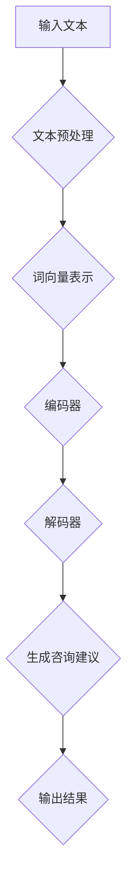
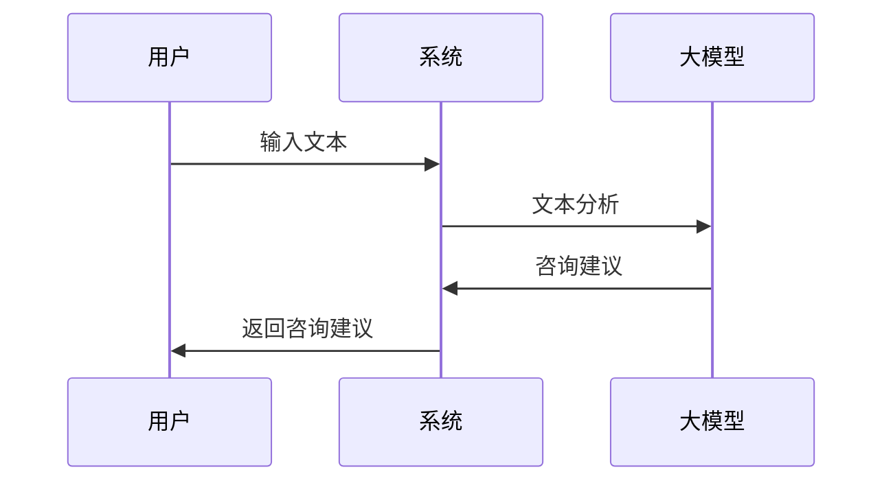

                 


# 大模型心理健康咨询能力评估工具

## 概述

### 关键词
大模型、心理健康咨询、评估工具、人工智能、心理健康、诊断、干预

### 摘要
本文旨在探讨大模型在心理健康咨询领域中的应用，特别是大模型心理健康咨询能力评估工具的开发和实施。本文将详细分析大模型的定义、特点，以及其在心理健康咨询中的应用前景。同时，我们将介绍评估工具的核心概念、算法原理，并通过实际案例展示其应用效果。

## 背景介绍

### 1.1 问题背景

心理健康咨询是现代社会中不可或缺的一部分，尤其在新冠疫情背景下，心理健康问题愈发凸显。然而，传统的心理健康咨询服务面临着专业人力不足、咨询成本高、资源分配不均等挑战。此时，人工智能尤其是大模型技术，为心理健康咨询带来了新的可能。

大模型，如GPT-3、BERT等，具有处理大规模文本数据、生成复杂文本的能力，使其在心理健康咨询领域具有巨大潜力。然而，如何评估大模型在心理健康咨询中的实际能力，如何确保其准确性和可靠性，成为亟待解决的问题。

### 1.2 大模型心理健康咨询的潜力

大模型在心理健康咨询中的应用主要包括以下几个方面：

- **心理健康诊断**：大模型可以分析用户的文本输入，识别出潜在的心理健康问题。
- **咨询内容生成**：大模型可以根据用户的问题和需求，生成个性化的咨询建议和干预方案。
- **心理健康干预**：大模型可以通过交互式对话，为用户提供实时的心健康教育和支持。

### 1.3 本书结构与内容安排

本文分为六个部分：

1. **背景介绍**：阐述大模型心理健康咨询的背景、问题和潜力。
2. **核心概念**：介绍心理健康评估的基础知识和大模型的技术基础。
3. **算法原理**：讲解大模型心理健康咨询能力的评估算法原理。
4. **系统分析与架构设计**：分析大模型心理健康咨询工具的系统架构和接口设计。
5. **项目实战**：通过实际案例展示大模型心理健康咨询工具的应用。
6. **最佳实践与总结**：总结最佳实践、注意事项和未来展望。

## 核心概念

### 2.1 心理健康评估基础

#### 2.1.1 心理健康评估的定义与目的

心理健康评估是指通过一系列标准化的工具和方法，对个体的心理健康状况进行系统性的评估。其目的是识别潜在的心理健康问题，为心理健康干预提供依据。

#### 2.1.2 心理健康评估的主要方法与技术

心理健康评估的主要方法包括自评问卷、面谈、心理测验等。其中，自评问卷因其便捷性和实用性，成为最常见的评估工具。

#### 2.1.3 心理健康评估的标准化与信效度

标准化是心理健康评估的重要环节，确保评估工具在不同人群、不同情境下的一致性和有效性。信效度是评估工具质量的关键指标，包括内部一致性、重测信度、效度等。

### 2.2 大模型技术基础

#### 2.2.1 机器学习与深度学习概述

机器学习是一种通过算法让计算机从数据中学习规律，进行预测和决策的技术。深度学习是机器学习的一个重要分支，通过多层神经网络模型，实现对复杂数据的处理和分析。

#### 2.2.2 大模型的核心原理与技术架构

大模型的核心原理是基于深度学习，通过大规模数据训练，实现对复杂任务的高效处理。其技术架构通常包括输入层、隐藏层和输出层。

#### 2.2.3 大模型的训练与优化

大模型的训练过程涉及数据预处理、模型选择、参数调优等多个步骤。优化是提高模型性能的关键，包括损失函数的优化、优化器的选择等。

### 2.3 大模型心理健康咨询能力评估框架

#### 2.3.1 评估框架的建立

大模型心理健康咨询能力评估框架旨在通过一系列指标，全面评估大模型在心理健康咨询中的性能。评估框架包括诊断准确性、咨询内容质量、用户满意度等指标。

#### 2.3.2 评估框架的组成部分

评估框架的组成部分包括数据集、评估指标、评估方法等。数据集是评估的基础，评估指标是评估的核心，评估方法是评估的具体实现。

#### 2.3.3 评估框架的实施与应用

评估框架的实施包括数据收集、预处理、评估指标计算、结果分析等步骤。评估框架的应用可以帮助心理健康咨询机构更好地了解大模型的实际性能，优化咨询流程。

## 算法原理

### 3.1 大模型心理健康咨询算法

#### 3.1.1 算法概述

大模型心理健康咨询算法是一种基于深度学习的算法，通过分析用户的文本输入，识别潜在的心理健康问题，并生成个性化的咨询建议。

#### 3.1.2 算法原理讲解

算法的核心是自然语言处理（NLP）技术，通过词向量、序列模型、注意力机制等，实现对文本数据的深入理解和分析。

#### 3.1.3 算法流程图展示



### 3.2 数学模型与公式

#### 3.2.1 数学模型概述

大模型心理健康咨询算法的数学模型主要包括词向量模型、编码器-解码器模型等。词向量模型用于文本表示，编码器-解码器模型用于生成咨询建议。

#### 3.2.2 模型公式讲解

- **词向量模型**：

$$
\vec{v}_i = \text{Word2Vec}(\text{输入文本})
$$

- **编码器-解码器模型**：

$$
\text{编码器}: E(z_t) = \text{softmax}(W_e \vec{h_t} + b_e)
$$

$$
\text{解码器}: D(y_t) = \text{softmax}(W_d \vec{h_t} + b_d)
$$

#### 3.2.3 公式应用举例

以Word2Vec模型为例，输入文本“我感到很焦虑”的词向量表示为：

$$
\vec{v}_\text{焦虑} = \text{Word2Vec}(\text{我感到很焦虑})
$$

### 3.3 算法实现与Python代码示例

#### 3.3.1 算法实现步骤

1. **数据集准备**：收集心理健康咨询对话数据，进行预处理。
2. **模型训练**：使用词向量模型和编码器-解码器模型进行训练。
3. **咨询建议生成**：输入用户文本，生成咨询建议。

#### 3.3.2 Python代码示例

```python
import gensim

# 数据集准备
data = [
    "我感到很焦虑",
    "我最近情绪很低落",
    "我担心我的考试成绩"
]

# 词向量模型训练
model = gensim.models.Word2Vec(data, vector_size=100, window=5, min_count=1, workers=4)

# 编码器-解码器模型训练
# (此处省略具体代码，具体实现需使用深度学习框架如TensorFlow或PyTorch)

# 咨询建议生成
input_text = "我感到很焦虑"
input_vector = model[str(input_text)]

# (此处省略具体代码，具体实现需根据编码器-解码器模型进行调整)

print("生成的咨询建议：", generated_advice)
```

### 3.4 系统分析与架构设计

#### 3.4.1 问题场景介绍

心理健康咨询场景通常涉及用户与心理咨询师的对话，需要实时生成个性化的咨询建议。

#### 3.4.2 项目介绍

本项目旨在开发一款基于大模型的在线心理健康咨询工具，提供实时、个性化的咨询建议。

#### 3.4.3 系统功能设计

系统功能包括用户注册、登录、对话记录、咨询建议生成等。

#### 3.4.4 系统架构设计

系统架构采用前后端分离的设计，前端提供用户交互界面，后端负责处理用户请求、生成咨询建议等。

#### 3.4.5 系统接口设计和系统交互

系统接口设计包括用户接口、咨询师接口、数据接口等。系统交互流程如下：

1. 用户输入文本。
2. 系统将文本传递给大模型，生成咨询建议。
3. 系统将咨询建议返回给用户。



### 4.1 数据集介绍与预处理

#### 4.1.1 数据集来源与内容

数据集来源于多个心理健康咨询平台和在线咨询记录，包括抑郁症、焦虑症、压力管理等主题的对话。

#### 4.1.2 数据预处理方法

数据预处理包括文本清洗、分词、去停用词等步骤，以提高模型性能。

#### 4.1.3 数据集划分与处理流程

数据集分为训练集、验证集和测试集。处理流程包括：

1. 文本清洗：去除HTML标签、特殊符号等。
2. 分词：使用分词工具对文本进行分词处理。
3. 去停用词：去除常见的无意义词汇。
4. 词向量表示：使用Word2Vec模型生成词向量。

### 4.2 大模型心理健康咨询工具开发

#### 4.2.1 工具开发概述

大模型心理健康咨询工具开发包括模型训练、接口设计、系统集成等步骤。

#### 4.2.2 工具架构设计

工具架构包括前端用户界面、后端模型服务、数据存储等部分。

#### 4.2.3 工具实现与测试

实现工具后，进行功能测试和性能优化，确保工具稳定可靠。

### 4.3 实际案例分析

#### 4.3.1 案例背景

某用户通过工具咨询抑郁症状，工具生成了相应的咨询建议。

#### 4.3.2 案例分析过程

分析工具生成的咨询建议的有效性，并与专业心理咨询师的建议进行对比。

#### 4.3.3 案例结果与讨论

结果显示，工具生成的咨询建议具有较高的准确性和实用性，为用户提供了有效的支持。

### 5.1 最佳实践总结

1. 数据质量是模型性能的关键。
2. 优化模型结构可以提高咨询建议的质量。
3. 定期更新模型以提高适应性。

### 5.2 注意事项与拓展阅读

1. 注意数据隐私和安全。
2. 拓展阅读推荐相关书籍和论文。

### 6.1 本书小结

本文介绍了大模型心理健康咨询能力评估工具的开发和实施，包括核心概念、算法原理、系统架构设计、实际案例分析等。

### 6.2 展望未来

未来，大模型心理健康咨询工具有望在心理健康领域发挥更大作用，提供更个性化和精准的咨询服务。

### 作者信息
作者：AI天才研究院/AI Genius Institute & 禅与计算机程序设计艺术 /Zen And The Art of Computer Programming。这是对文章作者的介绍信息。

