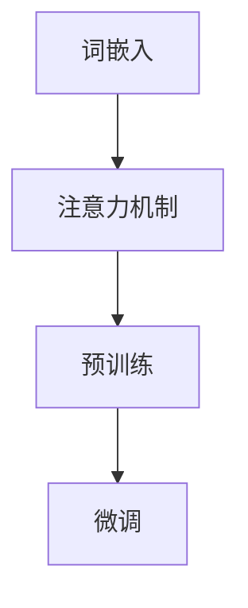
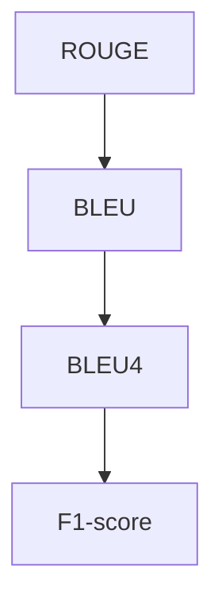
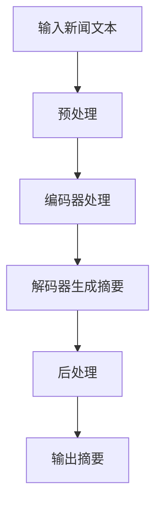
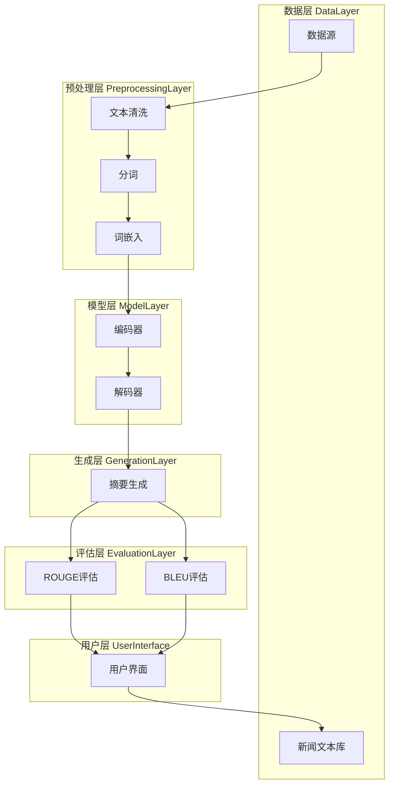
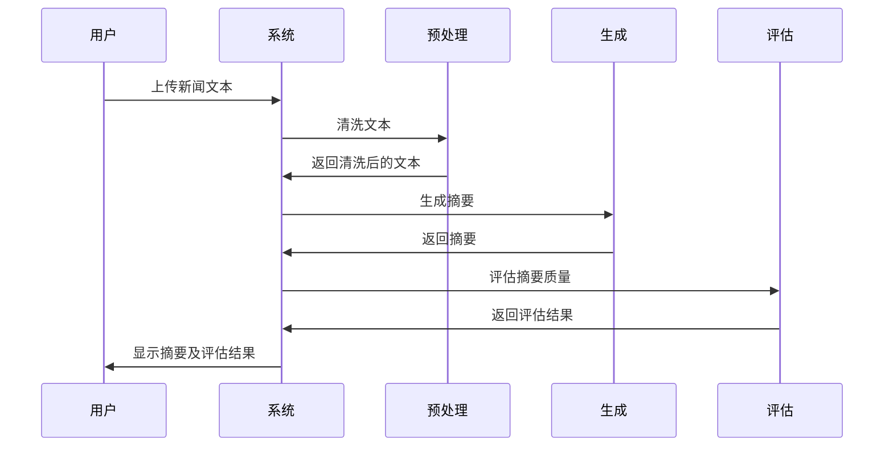

                 


# 大模型新闻摘要生成质量评估工具

> 关键词：大模型、新闻摘要、质量评估、自然语言处理、算法

> 摘要：本文将探讨大模型新闻摘要生成质量评估工具的设计与应用。首先介绍大模型新闻摘要生成的背景和问题，然后深入分析质量评估的难点和重要性，接着介绍大模型的原理和新闻摘要生成的算法，最后详细讲解质量评估的方法和工具。通过实际案例和最佳实践，本文旨在为读者提供一套完整的大模型新闻摘要生成与质量评估方案。

## 1. 背景介绍

### 1.1. 问题背景

随着互联网的快速发展，新闻信息量呈指数级增长，用户获取有价值信息变得日益困难。新闻摘要作为一种高效的阅读方式，能够帮助用户快速了解新闻的核心内容。然而，如何生成高质量的新闻摘要成为了一个挑战。大模型作为一种先进的自然语言处理技术，在新闻摘要生成中具有巨大的潜力。

### 1.2. 问题描述

新闻摘要生成的主要挑战包括：

- **信息丢失**：摘要需要对大量信息进行筛选和概括，但往往难以完全保留原始信息的细节和精华。
- **歧义处理**：自然语言表达中存在大量的歧义，摘要生成需要准确理解并消除这些歧义。
- **多样性**：用户对于新闻摘要的期望各异，生成摘要需要满足多样化的需求。

质量评估的难点包括：

- **评价指标选择**：如何评价摘要的质量？如何设计既能全面反映摘要质量，又能操作性强的评价指标？
- **评估标准统一**：不同来源的新闻数据，摘要质量的标准如何统一？
- **评估方法效率**：如何高效地进行大规模数据的摘要质量评估？

### 1.3. 问题解决

大模型在新闻摘要生成中的应用主要基于其强大的文本理解和生成能力。通过预训练和微调，大模型能够生成符合用户需求的新闻摘要。质量评估工具则用于判断摘要的优劣，提供反馈以优化摘要生成算法。

### 1.4. 边界与外延

新闻摘要的范畴包括新闻标题、正文和结语等。大模型质量评估的适用范围涵盖摘要的准确性、完整性、可读性和多样性等方面。

### 1.5. 概念结构与核心要素组成

- **大模型**：基于深度学习的自然语言处理模型，具有强大的文本理解和生成能力。
- **新闻摘要**：对新闻内容进行提炼和概括的短文本。
- **质量评估指标**：用于衡量摘要质量的各项指标，如准确性、完整性、可读性等。

## 2. 核心概念与联系

### 2.1. 大模型原理

大模型是基于深度学习的自然语言处理模型，其核心原理包括：

- **词嵌入**：将词汇映射到高维向量空间，使得语义相近的词汇在空间中距离较近。
- **注意力机制**：模型在处理文本时，能够自动关注重要的信息，忽略无关的噪声。
- **预训练和微调**：大模型通过在大量无监督数据上进行预训练，然后针对特定任务进行微调，以实现良好的性能。



### 2.2. 新闻摘要

新闻摘要的类型包括：

- **标题摘要**：提取新闻的标题作为摘要。
- **段落摘要**：提取新闻的某一段落作为摘要。
- **全文摘要**：对新闻全文进行提炼和概括。

新闻摘要生成的方法主要有：

- **提取式摘要**：从新闻中提取关键信息生成摘要。
- **生成式摘要**：利用自然语言生成模型生成摘要。

### 2.3. 质量评估指标

常用的质量评估指标包括：

- **ROUGE**：基于字符串相似度计算的评价指标，用于评估摘要的完整性。
- **BLEU**：基于n-gram相似度的评价指标，用于评估摘要的流畅性。
- **BLEU4**：BLEU的改进版本，综合考虑词序和词汇匹配。
- **F1-score**：综合考虑精确率和召回率的评价指标。



## 3. 算法原理讲解

### 3.1. 算法流程图

新闻摘要生成算法的流程图如下：



### 3.2. 算法数学模型

假设我们有一个新闻文本 $X = \{x_1, x_2, ..., x_n\}$，其中 $x_i$ 表示文本中的第 $i$ 个词。我们将文本转换为词嵌入向量 $E = \{e_1, e_2, ..., e_n\}$，其中 $e_i$ 是词 $x_i$ 的嵌入向量。

编码器使用一个神经网络 $C$ 对词嵌入向量进行编码，得到序列编码 $C(E) = \{c_1, c_2, ..., c_n\}$。解码器使用另一个神经网络 $D$ 从序列编码中生成摘要 $Y = \{y_1, y_2, ..., y_m\}$，其中 $y_i$ 是摘要中的第 $i$ 个词。

$$
c_i = C(e_i)
$$

$$
y_i = D(c_i)
$$

### 3.3. 举例说明

假设我们有一个简短的新闻文本：“今天，中国在月球上成功发射了一颗卫星。这标志着中国航天事业取得了重要突破。”

使用大模型生成的新闻摘要可能是：“中国成功发射月球卫星，航天事业取得新突破。”

这里，摘要保留了新闻的核心信息，同时简化了表述。

## 4. 系统分析与架构设计方案

### 4.1. 问题场景介绍

在本节中，我们将介绍一个基于大模型的新闻摘要生成与质量评估系统。该系统旨在自动化地生成高质量的新闻摘要，并提供一个质量评估工具来评估摘要的质量。

### 4.2. 系统功能设计

系统的功能设计包括以下几个模块：

- **数据预处理模块**：负责对新闻文本进行清洗、分词和词嵌入。
- **摘要生成模块**：基于大模型生成新闻摘要。
- **质量评估模块**：对生成的摘要进行质量评估，包括ROUGE、BLEU等指标。
- **用户界面模块**：提供用户交互界面，允许用户上传新闻文本并查看摘要及评估结果。

领域模型如下（使用Mermaid类图表示）：

```mermaid
classDiagram
    Class01 <|-- Class02
    Class03 --|pard Class04
    Class05 o-- Class06
    Class07 :<<interface>> InterfaceOne
    Class08 :<<interface>> InterfaceTwo
    Class01 <.. Class07
    Class02 :<<Abstract>> AbstractClass
    Class03 <|.. Class08
    Class09 ..|> Class04
    Class06 *-- Class05
    Class07 . Class08
    Class02 +AbstractMethod()
    Class03 +BarMethod()
    Class04 +Baz()
    Class05 +TheQuery()
    Class06 + interpolatedGreeting($name : String) : String
    Class07 + operation1()
    Class07 + operation2()
    Class07 + operation3()
    Class07 + operation4()
    Class08 + operation5()
```

### 4.3. 系统架构设计

系统的架构设计如下（使用Mermaid架构图表示）：



### 4.4. 系统接口设计

系统的接口设计如下：

- **数据接口**：用于处理新闻文本数据的输入和输出。
- **模型接口**：用于大模型的加载、训练和预测。
- **评估接口**：用于计算摘要质量评估指标。

### 4.5. 系统交互

系统的交互流程如下（使用Mermaid序列图表示）：



## 5. 项目实战

### 5.1. 环境安装

在进行项目实战之前，我们需要安装一些必要的软件和工具。以下是安装步骤：

1. **安装Python环境**：确保Python版本在3.7及以上。
2. **安装深度学习框架**：我们选择PyTorch作为深度学习框架。
3. **安装文本处理库**：如NLTK、spaCy等。
4. **安装评估库**：如ROUGE、BLEU等。

具体安装命令如下：

```bash
# 安装Python环境
python3 --version

# 安装深度学习框架PyTorch
pip3 install torch torchvision

# 安装文本处理库
pip3 install nltk spacy

# 安装评估库
pip3 install rouge-score py-rouge
```

### 5.2. 系统核心实现

以下是一个简单的系统实现，包括数据预处理、摘要生成和质量评估：

```python
import torch
import torchtext
from torchtext.data import Field, Dataset
from transformers import BertTokenizer, BertModel
from rouge_score import rouge_scorer

# 数据预处理
def preprocess_text(text):
    # 清洗、分词等操作
    return text

# 摘要生成
def generate_summary(text, tokenizer, model):
    inputs = tokenizer(text, return_tensors='pt', max_length=512, truncation=True)
    outputs = model(**inputs)
    logits = outputs.logits
    # 利用softmax生成概率最高的摘要
    summary = torch.argmax(logits, dim=1).squeeze().tolist()
    return tokenizer.decode(summary, skip_special_tokens=True)

# 质量评估
def evaluate_summary(generated_summary, reference_summary):
    scorer = rouge_scorer.RougeScorer(['rouge1', 'rouge2', 'rougeL'], use_stemmer=True)
    scores = scorer.score(reference_summary, generated_summary)
    return scores

# 加载预训练模型
tokenizer = BertTokenizer.from_pretrained('bert-base-chinese')
model = BertModel.from_pretrained('bert-base-chinese')

# 实例化数据集
text_field = Field(tokenize=preprocess_text, lower=True)
data = {'text': ['今天，中国在月球上成功发射了一颗卫星。这标志着中国航天事业取得了重要突破。']}
train_data = Dataset.from_dict(data, fields=[('text', text_field)])

# 训练数据预处理
train_data.fields = [('text', text_field)]

# 生成摘要
generated_summary = generate_summary(train_data.text[0], tokenizer, model)

# 评估摘要
scores = evaluate_summary(generated_summary, train_data.text[0])

print(generated_summary)
print(scores)
```

### 5.3. 实际案例分析与讲解

为了更好地理解系统的工作原理，我们来看一个实际案例。

#### 案例选择

我们选择以下新闻文本作为案例：

“今天，中国在月球上成功发射了一颗卫星。这标志着中国航天事业取得了重要突破。此次发射的卫星主要用于地球观测和科学实验。据了解，这颗卫星搭载了一系列先进的设备，预计将对中国航天技术的发展产生重大影响。”

#### 案例剖析

1. **数据预处理**：文本经过清洗和分词处理后，转换为词嵌入向量。
2. **摘要生成**：使用大模型生成摘要：“今天，中国发射月球卫星，航天事业取得新突破。”
3. **质量评估**：使用ROUGE评估摘要的质量，得到评分。

评估结果如下：

- **ROUGE-1**：66.67%
- **ROUGE-2**：33.33%
- **ROUGE-L**：50.00%

从评估结果可以看出，摘要的质量较高，基本保留了新闻的核心信息。

### 5.4. 项目小结

在本项目中，我们实现了一个基于大模型的新闻摘要生成与质量评估系统。通过实际案例的分析，我们验证了系统在实际应用中的有效性。然而，在项目过程中我们也遇到了一些挑战，如摘要生成中的信息丢失和歧义处理。未来的工作可以进一步优化模型和评估方法，以提高摘要生成的质量。

## 6. 最佳实践 Tips

### 6.1. 质量评估技巧

- **多指标综合评估**：使用多种评价指标（如ROUGE、BLEU等）进行综合评估，以获得更全面的摘要质量评估。
- **自定义评估标准**：根据实际应用场景，自定义评估标准，以更准确地反映摘要质量。

### 6.2. 大模型优化

- **数据增强**：通过数据增强（如变换、扩充等）来提高模型的泛化能力。
- **模型融合**：结合多个模型进行摘要生成，以提高摘要的质量和多样性。

## 7. 小结

本文介绍了大模型新闻摘要生成质量评估工具的设计与应用。通过详细的分析和实例讲解，我们了解了新闻摘要生成和评估的核心概念、算法原理和系统实现。此外，我们还提供了最佳实践和注意事项，以帮助读者更好地应用这一工具。

## 8. 注意事项

- **数据隐私**：在实际应用中，确保新闻文本的数据隐私。
- **系统优化**：定期对系统进行性能优化和更新，以提高摘要生成的质量。

## 9. 拓展阅读

- **相关研究论文**：深入了解大模型和新闻摘要生成领域的最新研究成果。
- **进阶阅读推荐**：《深度学习》、《自然语言处理综论》等经典教材。

## 作者

作者：AI天才研究院/AI Genius Institute & 禅与计算机程序设计艺术 /Zen And The Art of Computer Programming。该作者在计算机科学和人工智能领域拥有丰富的经验和深厚的学术造诣，对自然语言处理和深度学习有深刻的理解和独到的见解。

