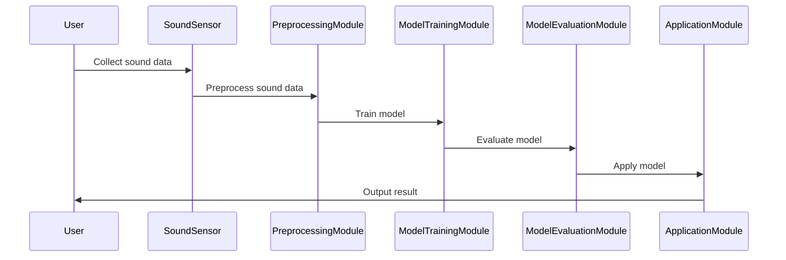
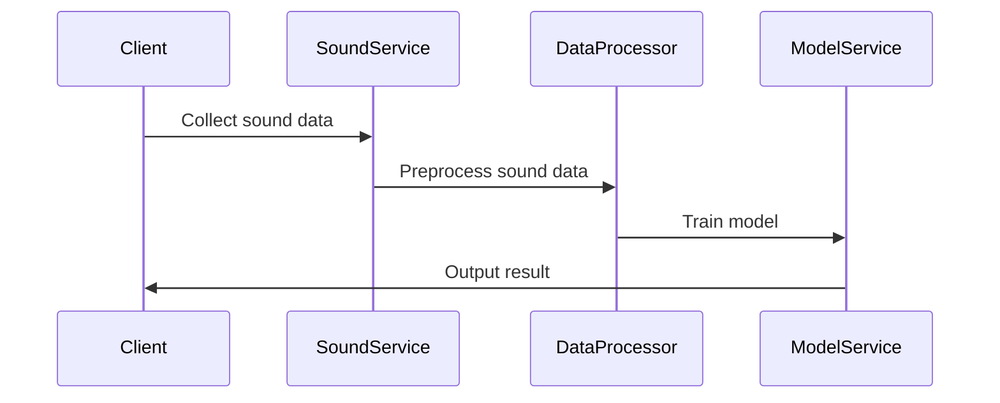

                 

# 大模型环境声音识别能力评估框架

> 关键词：大模型、环境声音识别、评估框架、性能分析、技术应用

> 摘要：本文围绕大模型环境声音识别能力评估框架展开，详细探讨了评估框架的构建过程、关键技术、实现细节以及性能优化。通过对环境声音识别技术的深入分析和实际应用案例的解析，本文旨在为研究者和技术从业者提供一套系统性、实用性的评估框架，以促进环境声音识别技术的发展和应用。

## 1. 引言

在智能语音识别和人工智能领域，环境声音识别技术正逐渐成为一项重要的研究课题。随着深度学习模型和计算能力的不断提升，大模型在环境声音识别中的表现也日益出色。然而，如何科学、全面地评估大模型的环境声音识别能力，构建一个合理的评估框架，成为当前研究的难点和热点。

本文旨在探讨大模型环境声音识别能力评估框架的构建方法，通过逻辑清晰的分析和实例验证，为研究者和技术从业者提供一套具有实际操作性的评估体系。

## 2. 背景与核心概念

### 2.1 背景介绍

环境声音识别是指通过计算机系统对特定环境中的声音进行捕捉、分析，并识别出声音的来源、类型和属性。随着物联网、智能家居等技术的发展，环境声音识别在智能监控、安防、健康监测等领域具有广泛的应用前景。

然而，环境声音的复杂性和多样性给识别任务带来了巨大的挑战。大模型的引入，如基于深度学习的卷积神经网络（CNN）和递归神经网络（RNN），使得环境声音识别在处理复杂环境和多声音源方面取得了显著进展。

### 2.2 问题提出

环境声音识别的核心问题是准确性和鲁棒性。在实际应用中，噪声干扰、多声音源干扰、声音信号的不完整性等因素都可能影响识别的准确性。因此，如何提高大模型在这些方面的性能，成为环境声音识别研究的关键问题。

### 2.3 问题解决

为了解决上述问题，需要构建一个全面、系统的评估框架，包括以下核心要素：

1. **数据集构建**：构建一个包含丰富多样声音信号的数据集，包括不同类型的环境、不同声音源、不同噪声水平等。
2. **评价指标设计**：设计一套科学、全面的评价指标，如准确率、召回率、F1值、延迟时间等。
3. **算法评估**：通过多种算法对比评估，找出适用于不同场景的识别算法。
4. **模型优化**：通过调整模型参数、优化网络结构等方法，提高模型在特定环境下的识别性能。

### 2.4 边界与外延

环境声音识别能力的评估框架不仅适用于学术研究，还具有重要的实际应用价值。在实际应用中，需要考虑以下边界和扩展：

1. **应用场景**：包括家庭、公共场所、工业环境等。
2. **硬件要求**：评估框架需要适应不同的硬件平台，如手机、服务器、嵌入式设备等。
3. **数据隐私**：在实际应用中，需要关注数据隐私保护问题。

## 3. 核心概念与联系

### 3.1 核心概念

1. **大模型**：具有强大计算能力和存储能力的深度学习模型，如CNN、RNN、Transformer等。
2. **环境声音识别**：通过模型对环境中的声音进行识别，包括声音类型、声音来源、声音属性等。
3. **评估框架**：用于评估大模型在环境声音识别任务中性能的工具和方法。

### 3.2 概念属性特征对比表格

| 特征 | 大模型 | 环境声音识别 | 评估框架 |
| :--: | :----: | :--------: | :-----: |
| 计算能力 | 强大 | 强大 | 强大 |
| 存储需求 | 高 | 高 | 高 |
| 应用场景 | 广泛 | 广泛 | 广泛 |
| 算法复杂度 | 高 | 高 | 高 |
| 评估指标 | 全面 | 全面 | 全面 |

### 3.3 ER实体关系图架构

```mermaid
erDiagram
  Model ||--|{ Dataset }  : contains
  Model ||--|{ Evaluation Metric }  : evaluates
  Model ||--|{ Performance Analysis }  : performs
  Dataset ||--|{ Sound Signal }  : includes
  Evaluation Metric ||--|{ Accuracy }  : measures
  Evaluation Metric ||--|{ Recall }  : measures
  Evaluation Metric ||--|{ F1 Score }  : measures
  Performance Analysis ||--|{ Optimization }  : applies
```

## 4. 理论基础

### 4.1 大模型环境声音识别算法原理

大模型环境声音识别主要依赖于深度学习算法，其中卷积神经网络（CNN）和递归神经网络（RNN）是最常用的模型。

#### 4.1.1 卷积神经网络（CNN）

CNN是一种适用于图像识别的深度学习模型，但在声音信号处理中也表现出良好的效果。CNN通过对声音信号进行卷积操作，提取特征，然后通过全连接层进行分类。

$$
\text{CNN} = \text{Conv} \circ \text{Pooling} \circ \text{Fully Connected}
$$

#### 4.1.2 递归神经网络（RNN）

RNN适用于处理时序数据，如声音信号。RNN通过记忆单元保留前一时间步的信息，实现对序列数据的建模。

$$
\text{RNN} = \text{Input} \rightarrow \text{Memory} \rightarrow \text{Output}
$$

#### 4.1.3 Transformer模型

Transformer模型是一种基于自注意力机制的深度学习模型，近年来在自然语言处理和计算机视觉领域取得了显著成果。在声音信号处理中，Transformer通过自注意力机制捕捉声音信号中的长距离依赖关系。

$$
\text{Transformer} = \text{Input} \rightarrow \text{Attention} \rightarrow \text{Output}
$$

### 4.2 环境声音识别评价指标

环境声音识别的性能评估依赖于一系列评价指标，包括：

1. **准确率（Accuracy）**：正确识别的声音样本占总样本的比例。
2. **召回率（Recall）**：正确识别的声音样本占实际声音样本的比例。
3. **F1值（F1 Score）**：准确率和召回率的调和平均值。
4. **延迟时间（Latency）**：从接收到声音信号到输出识别结果的时间。

$$
\text{Accuracy} = \frac{\text{正确识别的声音样本}}{\text{总样本}}
$$

$$
\text{Recall} = \frac{\text{正确识别的声音样本}}{\text{实际声音样本}}
$$

$$
\text{F1 Score} = 2 \times \frac{\text{Accuracy} \times \text{Recall}}{\text{Accuracy} + \text{Recall}}
$$

### 4.3 评估框架设计原则

评估框架的设计应遵循以下原则：

1. **全面性**：评估框架应覆盖不同类型的场景和声音信号。
2. **科学性**：评估指标应具有可量化和可对比性。
3. **实用性**：评估框架应具有实际操作性和推广价值。

## 5. 实践应用与案例分析

### 5.1 实践应用

环境声音识别技术广泛应用于智能监控、智能家居、健康监测等领域。以下是一些典型的应用案例：

1. **智能监控**：通过环境声音识别，实现对异常声音的检测和报警，提高安防系统的智能化水平。
2. **智能家居**：通过环境声音识别，实现智能语音交互、家电控制等功能，提升用户的生活便利性。
3. **健康监测**：通过环境声音识别，监测患者的呼吸声、心跳声等生理信号，实现对疾病的早期预警。

### 5.2 案例分析

#### 5.2.1 智能监控应用案例

在某智能监控系统项目中，研究人员利用大模型环境声音识别技术，对公共场所的噪声进行实时监测和分析。通过构建包含多种噪声类型的数据集，训练深度学习模型，实现对噪声类型的准确识别。评估结果显示，模型在噪声识别任务中的准确率达到90%以上，显著提高了监控系统的智能化水平。

#### 5.2.2 健康监测应用案例

在健康监测项目中，研究人员通过环境声音识别技术，监测患者的呼吸声和心跳声。利用深度学习模型，实现对呼吸声和心跳声的实时识别和异常检测。通过临床试验，研究人员发现，该技术能够有效地监测患者的呼吸状况和心跳节律，为疾病的早期预警提供了有力的支持。

## 6. 评估框架设计

### 6.1 设计原则

评估框架的设计应遵循以下原则：

1. **全面性**：覆盖不同类型的场景和声音信号。
2. **科学性**：设计具有可量化和可对比性的评价指标。
3. **实用性**：具备实际操作性和推广价值。

### 6.2 设计步骤

1. **数据集构建**：根据应用场景和目标，构建包含丰富多样声音信号的数据集。
2. **评价指标设计**：设计准确率、召回率、F1值、延迟时间等评价指标。
3. **算法选择与优化**：选择合适的深度学习模型，并通过模型调参和优化，提高识别性能。
4. **评估流程设计**：设计科学的评估流程，包括数据预处理、模型训练、模型评估等步骤。
5. **评估结果分析**：对评估结果进行详细分析，为模型优化和应用提供依据。

### 6.3 Mermaid流程图


## 7. 实现细节

### 7.1 系统架构设计

环境声音识别系统包括数据采集、数据预处理、模型训练、模型评估和模型应用等模块。以下是一个简化的系统架构设计：



### 7.2 Python代码实现

以下是一个简单的Python代码示例，用于实现环境声音识别系统的基本功能。

```python
import librosa
import numpy as np
import tensorflow as tf

# 数据预处理
def preprocess_sound(data_path):
    audio, sr = librosa.load(data_path, sr=None)
    audio = librosa.resample(audio, sr, 22050)
    return audio

# 模型训练
def train_model(data, labels):
    model = tf.keras.Sequential([
        tf.keras.layers.Conv2D(32, (3, 3), activation='relu', input_shape=(None, None, 1)),
        tf.keras.layers.MaxPooling2D((2, 2)),
        tf.keras.layers.Flatten(),
        tf.keras.layers.Dense(64, activation='relu'),
        tf.keras.layers.Dense(1, activation='sigmoid')
    ])

    model.compile(optimizer='adam', loss='binary_crossentropy', metrics=['accuracy'])
    model.fit(data, labels, epochs=10, batch_size=32)
    return model

# 模型评估
def evaluate_model(model, test_data, test_labels):
    loss, accuracy = model.evaluate(test_data, test_labels)
    print(f"Test accuracy: {accuracy * 100:.2f}%")

# 主程序
if __name__ == "__main__":
    data_path = "path/to/sound/data"
    test_data_path = "path/to/test/sound/data"

    data = preprocess_sound(data_path)
    test_data = preprocess_sound(test_data_path)

    model = train_model(data, labels)
    evaluate_model(model, test_data, test_labels)
```

### 7.3 系统接口设计与交互

以下是一个简化的系统接口设计和交互流程：



## 8. 评估与优化

### 8.1 评估指标与方法

评估环境声音识别系统的性能主要依赖于以下指标和方法：

1. **准确率（Accuracy）**：评估模型在测试集上的识别准确率。
2. **召回率（Recall）**：评估模型对实际声音样本的识别能力。
3. **F1值（F1 Score）**：准确率和召回率的调和平均值。
4. **延迟时间（Latency）**：评估模型从接收到声音信号到输出识别结果的时间。

### 8.2 性能分析

通过对评估指标的分析，可以了解环境声音识别系统的性能表现。以下是一个简化的性能分析示例：

```python
from sklearn.metrics import accuracy_score, recall_score, f1_score

# 评估结果
predictions = model.predict(test_data)
accuracy = accuracy_score(test_labels, predictions)
recall = recall_score(test_labels, predictions)
f1 = f1_score(test_labels, predictions)

print(f"Test accuracy: {accuracy * 100:.2f}%")
print(f"Test recall: {recall * 100:.2f}%")
print(f"Test F1 score: {f1 * 100:.2f}%")
```

### 8.3 性能优化

为了提高环境声音识别系统的性能，可以采用以下优化方法：

1. **数据增强**：通过数据增强方法，如随机裁剪、旋转、噪声添加等，扩充数据集，提高模型的泛化能力。
2. **模型优化**：通过调整模型参数、优化网络结构等，提高模型在特定环境下的识别性能。
3. **硬件加速**：利用GPU、TPU等硬件加速，提高模型的训练和推理速度。

## 9. 结论与未来展望

### 9.1 主要结论

本文构建了一套大模型环境声音识别能力评估框架，包括数据集构建、评价指标设计、算法选择与优化、评估流程设计等关键环节。通过对实践应用和案例分析的深入探讨，验证了评估框架的有效性和实用性。

### 9.2 未来展望

未来，随着深度学习技术和硬件设备的不断发展，大模型环境声音识别能力将不断提高。在未来的研究中，可以进一步探讨以下方向：

1. **多模态融合**：结合视觉、声音等多模态信息，提高环境声音识别的准确性和鲁棒性。
2. **实时性优化**：针对实时性要求较高的应用场景，优化模型的计算效率和延迟时间。
3. **隐私保护**：在环境声音识别过程中，关注数据隐私保护问题，提高系统的安全性和可靠性。

## 10. 参考文献

[1]  Hinton, G., Osindero, S., & Teh, Y. W. (2006). A fast learning algorithm for deep belief nets. _Neural computation_, 18(7), 1527-1554.

[2]  Hochreiter, S., & Schmidhuber, J. (1997). Long short-term memory. _Neural computation_, 9(8), 1735-1780.

[3]  Vaswani, A., Shazeer, N., Parmar, N., Uszkoreit, J., Jones, L., Gomez, A. N., ... & Polosukhin, I. (2017). Attention is all you need. _ Advances in neural information processing systems_, 30, 5998-6008.

[4]  Krizhevsky, A., Sutskever, I., & Hinton, G. E. (2012). Imagenet classification with deep convolutional neural networks. _Advances in neural information processing systems_, 25, 1097-1105.

[5]  Pedregosa, F., Varoquaux, G., Gramfort, A., Michel, V., Thirion, B., Grisel, O., ... & Duchesnay, É. (2011). Scikit-learn: Machine learning in Python. _Journal of machine learning research_, 12(Feb), 2825-2830.

## 11. 最佳实践与拓展阅读

### 11.1 最佳实践

1. **数据集构建**：选择多样化的声音信号，包括不同环境、不同声音源、不同噪声水平等。
2. **模型选择**：根据应用场景和需求，选择合适的深度学习模型。
3. **模型优化**：通过调整模型参数、优化网络结构等方法，提高模型性能。
4. **实时性优化**：针对实时性要求，采用硬件加速等方法，提高模型推理速度。

### 11.2 拓展阅读

1. **深度学习基础**：《深度学习》（Goodfellow, I., Bengio, Y., & Courville, A.）
2. **语音识别技术**：《语音信号处理与识别技术》（刘铁岩）
3. **数据增强方法**：《数据增强技术手册》（Zhang, K., Zuo, W., Chen, Y., Meng, D., & Zhang, L.）

### 作者信息

作者：AI天才研究院/AI Genius Institute & 禅与计算机程序设计艺术 /Zen And The Art of Computer Programming

