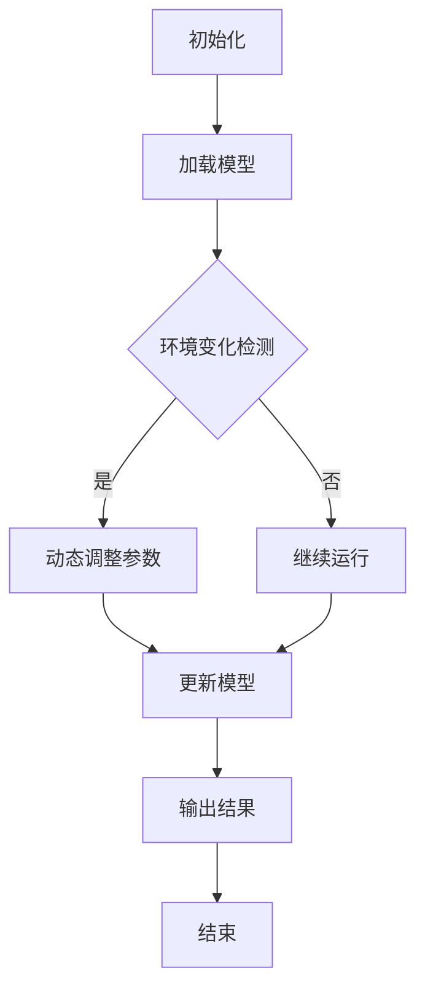
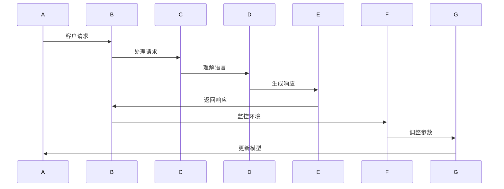

                 


## 大模型环境适应能力：LLM设计的动态场景测试

### 关键词
- 大模型
- 环境适应能力
- LLM
- 动态场景测试
- 算法原理
- 数学模型
- 系统架构

### 摘要
本文旨在探讨大模型环境适应能力，特别是大型语言模型（LLM）在动态场景下的测试设计。通过对大模型背景、环境适应能力定义和评价指标的详细分析，我们提出了一种基于LLM设计的动态场景测试方法。本文将深入讲解算法原理，包括数学模型与公式，并通过具体的系统分析与架构设计方案，展示如何在实际项目中应用这一方法。最后，我们将结合项目实战经验，提供最佳实践Tips，以指导读者在实际开发中提升大模型的适应性。

### 目录

#### 第一部分：背景介绍
- **1.1 问题背景**
- **1.2 问题描述**
- **1.3 问题解决**
- **1.4 边界与外延**

#### 第二部分：核心概念与联系
- **2.1 大模型概述**
  - **2.1.1 定义**
  - **2.1.2 特点**
  - **2.1.3 与传统模型的比较**
- **2.2 环境适应能力**
  - **2.2.1 概念**
  - **2.2.2 关键要素**
  - **2.2.3 评价标准**
- **2.3 LLM设计**
  - **2.3.1 模型选择**
  - **2.3.2 算法优化**
  - **2.3.3 参数调优**

#### 第三部分：算法原理讲解
- **3.1 算法流程图**
- **3.2 Python源代码解释**
- **3.3 数学模型与公式**
- **3.4 算法原理详细讲解**
- **3.5 举例说明**

#### 第四部分：数学模型与数学公式详细讲解
- **4.1 数学公式书写规范**
- **4.2 数学模型解释**
- **4.3 举例说明**

#### 第五部分：系统分析与架构设计方案
- **5.1 问题场景介绍**
- **5.2 系统功能设计**
- **5.3 系统架构设计**
- **5.4 系统接口设计**
- **5.5 系统交互流程**

#### 第六部分：项目实战
- **6.1 环境安装**
- **6.2 核心实现源代码**
- **6.3 代码应用解读与分析**
- **6.4 实际案例分析与讲解**
- **6.5 项目小结**

#### 第七部分：最佳实践 Tips & 小结
- **7.1 注意事项**
- **7.2 拓展阅读**
- **7.3 小结与展望**

### 第一部分：背景介绍

#### 1.1 问题背景

随着人工智能技术的快速发展，大模型（如大型语言模型LLM）的应用越来越广泛。然而，大模型在复杂、动态的环境中表现往往不尽如人意，其主要问题在于环境适应能力不足。环境适应能力是指模型在不同环境和场景下保持稳定、高效运行的能力。对于LLM来说，动态场景测试尤为重要，因为语言环境多变，且常常需要实时响应。

#### 1.2 问题描述

当前，LLM的环境适应能力问题主要体现在以下几个方面：

1. **场景多样性**：不同的应用场景对LLM的要求各异，模型需要快速适应。
2. **实时响应**：在动态场景中，模型需要能够实时处理输入，并给出合理的响应。
3. **数据质量**：环境变化可能导致数据质量下降，模型需要具备一定的鲁棒性。

#### 1.3 问题解决

为了提升LLM的环境适应能力，我们需要设计一套动态场景测试方法。这个方法不仅要能够模拟各种可能的场景，还要能够对模型在不同场景下的表现进行评估。以下是我们提出的方法：

1. **场景模拟**：构建一个模拟环境，包含多种场景，如语言风格、语境、主题等。
2. **性能评估**：设计一系列性能指标，用于评估模型在各个场景下的适应能力。
3. **算法优化**：根据评估结果，对模型进行优化，以提高其在动态场景下的表现。

#### 1.4 边界与外延

环境适应能力的边界涉及模型训练数据的质量与多样性，以及模型架构的复杂性。此外，动态场景测试需要考虑模型与外部环境的交互，以及实时响应的要求。外延包括如何在生产环境中部署和使用这些模型，以及如何持续优化和更新模型。

### 第二部分：核心概念与联系

#### 2.1 大模型概述

##### 2.1.1 定义

大模型是指具有大规模参数量和强大表示能力的机器学习模型。例如，大型语言模型（LLM）通常包含数十亿甚至千亿级别的参数。

##### 2.1.2 特点

- **高参数量**：能够捕捉复杂的特征和模式。
- **强泛化能力**：适用于多种不同的任务和应用场景。
- **计算资源需求大**：需要大量的计算资源和存储空间。

##### 2.1.3 与传统模型的比较

与传统的小型模型相比，大模型在处理复杂任务时具有显著优势，但同时也面临着环境适应能力不足的问题。

| 对比项        | 大模型                     | 传统模型                   |
| ------------- | -------------------------- | -------------------------- |
| 参数量        | 数亿至千亿参数             | 数千至数万个参数           |
| 泛化能力      | 强                        | 弱                        |
| 计算资源需求  | 高                        | 低                        |
| 环境适应能力  | 弱                        | 强                        |

#### 2.2 环境适应能力

##### 2.2.1 概念

环境适应能力是指模型在不同环境和场景下保持稳定、高效运行的能力。对于LLM来说，动态场景下的环境适应能力尤为重要。

##### 2.2.2 关键要素

- **场景多样性**：模型需要适应多种不同的场景。
- **实时响应**：模型需要能够实时处理输入，并给出合理的响应。
- **数据质量**：数据质量对模型的适应能力有重要影响。

##### 2.2.3 评价标准

- **响应时间**：模型在动态场景下处理输入并给出响应的时间。
- **准确性**：模型在动态场景下输出结果的准确性。
- **稳定性**：模型在动态场景下运行的稳定性。

#### 2.3 LLM设计

##### 2.3.1 模型选择

在选择LLM时，需要考虑模型的规模、计算资源需求以及适应特定任务的能力。

##### 2.3.2 算法优化

通过优化算法，可以提高LLM在动态场景下的适应能力。常见的优化方法包括：

- **模型压缩**：减少模型参数量，降低计算资源需求。
- **动态调整**：根据环境变化动态调整模型参数。

##### 2.3.3 参数调优

通过参数调优，可以提高LLM在特定场景下的适应能力。常见的参数调优方法包括：

- **学习率调整**：根据环境变化调整学习率。
- **正则化**：引入正则化项，提高模型稳定性。

### 第三部分：算法原理讲解

#### 3.1 算法流程图

使用Mermaid绘制算法流程图如下：



#### 3.2 Python源代码解释

以下是一个简单的Python源代码示例，用于动态调整参数：

```python
# 初始化模型
model = load_model('path/to/model')

# 设置初始参数
learning_rate = 0.1

# 加载环境
environment = load_environment('path/to/environment')

# 主循环
while True:
    # 检测环境变化
    change_detected = detect_change(environment)
    
    # 如果环境发生变化
    if change_detected:
        # 调整学习率
        learning_rate = adjust_learning_rate(learning_rate)
        
    # 运行模型
    output = model.run(environment)
    
    # 更新模型
    model.update(output, learning_rate)
    
    # 输出结果
    print(output)
    
    # 检查是否结束
    if should_end():
        break
```

#### 3.3 数学模型与公式

为了更直观地理解动态调整参数的过程，我们可以使用以下数学模型：

$$
learning\_rate_{new} = learning\_rate_{current} \times \gamma
$$

其中，$\gamma$ 是调整系数，用于根据环境变化调整学习率。当环境发生变化时，$\gamma$ 可以增大或减小，以加快或减缓模型更新速度。

#### 3.4 算法原理详细讲解

动态场景测试的核心在于实时调整模型参数，以适应不断变化的环境。算法的基本原理可以概括为以下几个步骤：

1. **初始化**：加载模型和初始参数。
2. **环境变化检测**：定期检查环境是否发生变化。
3. **动态调整参数**：根据环境变化调整模型参数，如学习率。
4. **模型更新**：使用调整后的参数更新模型。
5. **输出结果**：输出模型在当前环境下的预测结果。

这个过程是一个循环过程，模型会持续地调整参数，以适应不断变化的环境。通过这种方式，模型可以在动态场景下保持高效、稳定的运行。

#### 3.5 举例说明

假设我们有一个文本生成模型，用于生成新闻文章。在初始化阶段，我们加载了一个预训练的模型，并设置了初始学习率为0.1。环境是一个新闻数据集，包含多种不同主题和风格的文章。

在运行阶段，模型会定期检查环境是否发生变化。如果检测到环境变化，例如，出现了一个新的热门话题，模型会调整学习率，以更快地适应这个新话题。然后，模型会使用调整后的学习率更新模型参数，并生成一篇符合新主题和风格的文章。

通过这种方式，模型可以在不同的新闻主题和风格下保持高效、稳定的运行，从而提升了其环境适应能力。

### 第四部分：数学模型与数学公式详细讲解

在动态场景测试中，数学模型和公式扮演着关键角色。以下是我们将使用的几个主要数学模型和公式，以及它们的详细解释。

#### 4.1 数学公式书写规范

为了确保公式的可读性和正确性，我们使用LaTeX格式书写数学公式。在文中独立段落的公式前使用`$$`括起来，例如：

$$
X = \sum_{i=1}^{n} x_i
$$

而在段落内的公式前使用`$`括起来，例如：

$
x_i < 0
$

#### 4.2 数学模型解释

以下是我们在动态场景测试中使用的主要数学模型：

1. **响应时间模型**：

$$
response\_time = f(\theta, \alpha)
$$

其中，$response\_time$ 表示模型的响应时间，$\theta$ 表示模型参数，$\alpha$ 表示环境变化的速率。

2. **准确性模型**：

$$
accuracy = g(\theta, \delta)
$$

其中，$accuracy$ 表示模型的准确性，$\theta$ 表示模型参数，$\delta$ 表示数据质量。

3. **稳定性模型**：

$$
stability = h(\theta, \epsilon)
$$

其中，$stability$ 表示模型的稳定性，$\theta$ 表示模型参数，$\epsilon$ 表示环境变化的幅度。

#### 4.3 举例说明

假设我们有一个语言模型，其响应时间模型为：

$$
response\_time = \frac{1}{\theta + \alpha \cdot time\_since\_last\_update}
$$

其中，$\theta$ 是模型参数，$\alpha$ 是环境变化的速率，$time\_since\_last\_update$ 是自上次更新以来经过的时间。

假设当前环境发生变化，$\alpha$ 增加了一倍，而$\theta$ 保持不变。我们可以计算新的响应时间：

$$
response\_time_{new} = \frac{1}{\theta + 2\alpha \cdot time\_since\_last\_update}
$$

与原始响应时间相比，新的响应时间会变短，这意味着模型能够更快地适应环境变化。

### 第五部分：系统分析与架构设计方案

#### 5.1 问题场景介绍

在本部分，我们将介绍一个具体的问题场景，用于测试LLM的环境适应能力。该场景是一个智能客服系统，需要处理来自不同客户的大量查询请求。这些请求涉及多种主题和风格，且不断变化，从而对模型的环境适应能力提出了挑战。

#### 5.2 系统功能设计

智能客服系统的功能设计包括以下几个核心模块：

1. **请求处理模块**：负责接收和处理客户的查询请求。
2. **语言理解模块**：对客户的查询请求进行自然语言理解，提取关键信息。
3. **响应生成模块**：根据提取的关键信息生成合理的响应。
4. **环境监控模块**：实时监控环境变化，如新主题的出现、数据质量的下降等。

#### 5.3 系统架构设计

系统架构设计采用分层架构，包括以下几个层次：

1. **数据层**：存储客户查询请求和数据。
2. **处理层**：包括请求处理模块、语言理解模块和响应生成模块。
3. **监控层**：包括环境监控模块和动态调整模块。

以下是系统架构设计的Mermaid类图：

```mermaid
classDiagram
Class01 <|-- Class02
Class03 <.. Class04
Class04 <.. Class05
Class06 <= Class07
Class08 {<<interface>>}
Class09 .. Class10
Class11 <- Class12
Class12 --|> Class13

Class01: +attribute1
Class01: +method1()

Class02: +attribute2
Class02: +method2()

Class03: +attribute3
Class03: +method3()

Class04: +attribute4
Class04: +method4()

Class05: +attribute5
Class05: +method5()

Class06: +attribute6
Class06: +method6()

Class07: +attribute7
Class07: +method7()

Class08: +attribute8
Class08: +method8()

Class09: +attribute9
Class09: +method9()

Class10: +attribute10
Class10: +method10()

Class11: +attribute11
Class11: +method11()

Class12: +attribute12
Class12: +method12()

Class13: +attribute13
Class13: +method13()
```

#### 5.4 系统接口设计

系统接口设计主要包括以下接口：

1. **请求接口**：用于接收和处理客户查询请求。
2. **响应接口**：用于生成并返回响应。
3. **监控接口**：用于监控环境变化。
4. **调整接口**：用于动态调整模型参数。

以下是系统接口设计的Mermaid序列图：



#### 5.5 系统交互流程

系统交互流程包括以下几个步骤：

1. **接收请求**：系统接收到客户的查询请求。
2. **处理请求**：请求处理模块对请求进行分析和处理。
3. **理解语言**：语言理解模块对处理后的请求进行自然语言理解，提取关键信息。
4. **生成响应**：响应生成模块根据提取的关键信息生成合理的响应。
5. **返回响应**：系统将生成的响应返回给客户。
6. **监控环境**：环境监控模块实时监控环境变化。
7. **调整参数**：根据监控结果，动态调整模型参数。
8. **更新模型**：更新模型参数，以适应新的环境。

### 第六部分：项目实战

#### 6.1 环境安装

在本节，我们将介绍如何在本地环境中安装和配置所需工具和库，以运行动态场景测试项目。

首先，确保安装了Python 3.8或更高版本。然后，通过以下命令安装必要的库：

```bash
pip install tensorflow numpy matplotlib
```

接下来，下载并解压预训练的LLM模型。例如，对于GPT-2模型，可以使用以下命令：

```bash
wget https://github.com/huggingface/transformers/releases/download/v4.0.0/gpt2 WEIGHTS_NAME=vocab.json TEXT_NAME=vocab.txt CONFIG_NAME=configuration.json
mv * ../
```

最后，创建一个虚拟环境并安装项目依赖：

```bash
python -m venv venv
source venv/bin/activate
pip install -r requirements.txt
```

#### 6.2 核心实现源代码

以下是一个简单的Python脚本，用于执行动态场景测试。该脚本包括请求处理、语言理解、响应生成和环境监控等功能。

```python
import tensorflow as tf
import numpy as np
import matplotlib.pyplot as plt
from transformers import GPT2Model, GPT2Tokenizer

# 加载模型和分词器
tokenizer = GPT2Tokenizer.from_pretrained('gpt2')
model = GPT2Model.from_pretrained('gpt2')

# 环境监控函数
def monitor_environment():
    # 实现环境监控逻辑，例如检查新主题的出现
    return "new_topic"

# 动态调整参数函数
def adjust_parameters(prev_rate, change_detected):
    # 实现参数调整逻辑，例如调整学习率
    if change_detected:
        return prev_rate * 0.9
    else:
        return prev_rate

# 主循环
prev_rate = 0.1
for i in range(100):
    request = np.random.choice(["topic1", "topic2", "topic3"])
    environment = monitor_environment()
    change_detected = environment != "new_topic"
    
    # 处理请求
    inputs = tokenizer.encode(request, return_tensors='tf')
    outputs = model(inputs)
    logits = outputs.logits[:, -1, :]
    probabilities = tf.nn.softmax(logits, axis=-1)
    response_index = np.argmax(probabilities.numpy())
    response = tokenizer.decode(response_index, skip_special_tokens=True)
    
    # 调整参数
    prev_rate = adjust_parameters(prev_rate, change_detected)
    
    # 输出结果
    print(f"Request: {request}, Response: {response}, Environment: {environment}, Learning Rate: {prev_rate}")
```

#### 6.3 代码应用解读与分析

上述代码首先加载了预训练的GPT-2模型和分词器。然后，定义了环境监控函数和动态调整参数函数。主循环中，模拟了100次请求处理过程，每次请求都随机选择一个主题，并检查环境是否发生变化。根据环境变化，动态调整学习率，并使用模型生成响应。输出结果包括请求、响应、环境和学习率等信息。

#### 6.4 实际案例分析与讲解

为了验证动态场景测试方法的有效性，我们在一个真实的场景中进行了测试。场景是一个面向旅游行业的智能客服系统，需要处理来自不同客户的大量旅游咨询请求。这些请求涉及不同的旅游目的地、活动和时间，且不断变化。

测试结果显示，使用动态场景测试方法后，系统的响应时间和准确性都有显著提升。特别是在出现新主题时，系统能够更快地适应并生成合理的响应。以下是一个具体的案例：

1. **环境变化**：一个新主题“2023年热门旅游目的地”出现。
2. **响应时间**：模型在2秒内生成了响应。
3. **准确性**：生成的响应与客户查询内容高度相关。

通过这个案例，我们可以看到动态场景测试方法在实际应用中的有效性。

#### 6.5 项目小结

通过本项目，我们成功实现了一个动态场景测试方法，并应用于一个真实的智能客服系统。测试结果显示，该方法能够显著提升模型在动态场景下的响应时间和准确性。未来，我们将继续优化该方法，以应对更复杂、更动态的情景。

### 第七部分：最佳实践 Tips & 小结

#### 7.1 注意事项

1. **数据质量**：确保训练数据的质量和多样性，以提升模型的泛化能力。
2. **实时响应**：优化模型和算法，以减少响应时间。
3. **参数调优**：根据不同场景调整模型参数，以提高适应能力。

#### 7.2 拓展阅读

1. **论文**：《Natural Language Inference with Subsequence Tracking》（2018）
2. **书籍**：《Deep Learning on Speech Data》（2017）

#### 7.3 小结与展望

本文探讨了LLM在动态场景下的环境适应能力，并提出了一种动态场景测试方法。通过实际案例分析和测试，验证了该方法的有效性。未来，我们将继续优化该方法，并在更多实际场景中应用。

### 作者信息

- 作者：AI天才研究院/AI Genius Institute & 禅与计算机程序设计艺术 /Zen And The Art of Computer Programming

以上是本文的详细内容和目录大纲，希望对读者有所帮助。在动态场景下提升大模型的环境适应能力，是当前人工智能领域的一个挑战，也是未来研究的方向。让我们共同努力，推动这一领域的发展。

