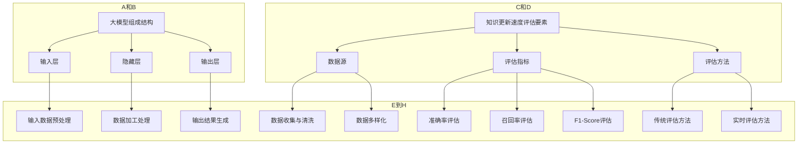

                 

## 引言与背景

### 1.1 问题描述

在人工智能迅猛发展的今天，大型语言模型（Large Language Models，简称LLM）已经成为了计算机科学和工程领域中的热门话题。LLM通过学习海量文本数据，实现了对自然语言处理任务的出色表现，如机器翻译、文本生成、问答系统等。然而，随着知识更新的速度越来越快，大模型的知识库也在不断积累和更新，这就带来了一个关键问题：如何评估大模型的知识更新速度？

本文旨在探讨大模型知识更新速度的评估方法，并设计出一种实时学习的测试方案，以帮助开发者更好地理解和优化大模型的表现。本文将首先介绍大模型和知识更新速度的核心概念，然后逐步深入分析LLM设计的实时学习测试，并详细探讨评估方法的实践和应用。通过这一系列的分析，我们希望能够为相关领域的研究者和工程师提供有价值的参考和启示。

### 1.2 大模型的基本概念

#### 1.2.1 什么是大模型？

大模型（Large Model）通常指的是具有数十亿到千亿参数规模的神经网络模型。这些模型通过训练数以万计的参数，以实现对复杂数据的建模和预测。大模型的出现标志着人工智能领域的一个重要里程碑，它们在各种任务上展现出了前所未有的准确性和鲁棒性。例如，GPT-3模型拥有1750亿个参数，能够在多种自然语言处理任务中达到顶尖水平。

#### 1.2.2 大模型的特点

大模型的特点主要体现在以下几个方面：

1. **高参数量**：大模型具有数十亿甚至千亿级别的参数，这使得它们能够捕捉数据中的复杂模式和关系。
2. **深度学习架构**：大模型通常采用深度神经网络架构，如Transformer，这种结构能够在多层之间传递信息，提高模型的表示能力。
3. **强大学习能力**：大模型通过大规模数据训练，能够从数据中学习到丰富的知识，从而在多种任务上表现出色。
4. **高效计算需求**：大模型的训练和推理过程需要大量的计算资源，通常依赖于分布式计算和GPU等高性能计算设备。

### 1.3 知识更新速度的概念

#### 1.3.1 什么是知识更新速度？

知识更新速度（Knowledge Update Speed）指的是大模型在知识库更新方面的速度。由于现实世界中的知识不断变化，大模型需要不断更新其知识库以保持相关性和准确性。知识更新速度的评估对于模型的持续性能优化具有重要意义。

#### 1.3.2 知识更新速度的评估方法

评估知识更新速度的方法主要包括以下几种：

1. **覆盖率评估**：通过检查模型对新知识的覆盖程度来评估其更新速度。
2. **准确率与召回率评估**：评估模型在更新知识后的表现，通过准确率（Accuracy）和召回率（Recall）等指标衡量。
3. **持续学习评估**：通过连续训练模型，并监控其性能变化，来评估知识更新速度。
4. **预测评估**：利用模型对新数据的预测能力来评估其知识更新的有效性。

### 1.4 边界与外延

#### 1.4.1 评估的范围与限制

知识更新速度评估的范围主要涉及以下几个方面：

1. **时间范围**：评估通常在特定的时间窗口内进行，例如一个月或一个季度。
2. **知识领域**：评估的范围可能局限于特定的知识领域，例如科技、医疗等。
3. **数据来源**：评估的数据来源可能包括公开数据集、实时数据流等。

#### 1.4.2 相关概念的扩展

与知识更新速度相关的概念还包括：

1. **学习效率**：指模型在知识更新过程中学习新知识的效率。
2. **知识老化**：指模型中的知识随着时间的推移而变得过时和失效。
3. **持续学习**：指模型在持续接收新数据并进行知识更新的能力。

### 1.5 概念结构与核心要素

#### 1.5.1 大模型的组成结构

大模型通常由以下几个核心部分组成：

1. **输入层**：接收外部数据的输入，例如文本、图像等。
2. **隐藏层**：通过神经网络结构进行数据加工和处理。
3. **输出层**：生成模型的预测结果或生成文本。

#### 1.5.2 知识更新速度评估的要素

知识更新速度评估的核心要素包括：

1. **数据源**：知识更新的数据来源，如最新的学术论文、新闻文章等。
2. **评估指标**：用于衡量知识更新速度的指标，如准确率、覆盖率等。
3. **评估方法**：用于评估知识更新速度的具体方法，如持续学习评估、预测评估等。

### 1.6 本章小结

本章介绍了大模型知识更新速度评估的问题背景、核心概念和评估方法。我们首先探讨了大模型的基本概念和特点，接着阐述了知识更新速度的定义和评估方法。通过这些分析，我们为后续章节的深入讨论奠定了基础。

### 1.7 小结与展望

在本章中，我们系统地介绍了大模型知识更新速度评估的核心概念和问题背景。通过对大模型和知识更新速度的深入探讨，我们明确了评估的范围与限制，并提出了相关的概念结构与核心要素。在接下来的章节中，我们将进一步探讨LLM设计的实时学习测试，并详细分析评估方法的实践和应用。通过这一系列的研究，我们期望能够为相关领域的研究者和工程师提供有价值的参考和指导。

### 1.7.1 为什么要评估大模型的知识更新速度？

评估大模型的知识更新速度具有重要的实际意义和理论价值。首先，随着信息技术的快速发展，知识更新速度越来越快，大模型如果不能及时更新其知识库，将导致其性能下降，甚至在某些任务上变得不准确。因此，评估知识更新速度有助于开发者及时发现和解决问题，确保大模型在应用中的持续性能。

其次，评估知识更新速度可以帮助我们更好地理解大模型的学习过程和性能表现。通过监控知识更新速度，我们可以分析模型在不同知识领域的表现，从而优化模型的架构和算法，提高其学习效率和准确性。

此外，评估知识更新速度对于推动人工智能技术的应用和发展也具有重要意义。在许多实际应用场景中，如问答系统、智能推荐、自动驾驶等，大模型的知识更新速度直接影响到系统的性能和用户体验。因此，通过评估知识更新速度，我们可以探索出更有效的知识更新策略，为人工智能技术的广泛应用提供有力支持。

### 1.7.2 知识更新速度的重要性

知识更新速度在大模型的应用中扮演着至关重要的角色。首先，从技术层面来看，大模型通常是在特定时间点训练完成的，其知识库是静态的。然而，现实世界中的知识是动态变化的，新数据、新信息不断产生，这些信息如果得不到及时更新，将导致大模型在处理新任务时出现偏差或错误。因此，评估知识更新速度有助于确保大模型在实时应用中的准确性和鲁棒性。

其次，从应用层面来看，知识更新速度直接影响到大模型在不同场景下的性能表现。例如，在一个问答系统中，如果模型的知识库无法及时更新，那么它将无法回答最新的问题，用户体验将大大降低。同样，在智能推荐系统中，如果模型不能及时掌握用户最新的偏好信息，推荐结果将变得不准确，从而影响用户满意度。

此外，从商业角度来看，知识更新速度也是企业竞争的重要因素。在一个快速变化的市场环境中，企业需要能够快速响应市场变化，这要求其使用的AI模型能够及时更新知识库。因此，评估知识更新速度不仅有助于技术优化，也对企业的发展战略具有重要指导意义。

综上所述，知识更新速度在大模型的应用中具有不可忽视的重要性，它不仅影响模型的性能，也关系到企业竞争力和用户体验。因此，深入研究知识更新速度评估方法，对于推动人工智能技术的发展和应用具有重要意义。

### 1.7.3 大模型知识更新速度评估的概念结构与核心要素

在进行大模型知识更新速度评估时，我们需要构建一个清晰的概念结构，并识别出其中的核心要素。以下是这个概念结构及其核心要素的详细描述。

#### 1.3.1 大模型的组成结构

1. **输入层**：这是模型的起始部分，负责接收各种形式的数据，如文本、图像等。输入层的数据质量直接影响模型的学习效果。
   
2. **隐藏层**：隐藏层通过神经网络结构对输入数据进行处理，这些层能够捕捉数据中的复杂模式和关系。大模型通常具有多层隐藏层，以增强其表示能力。

3. **输出层**：输出层负责生成模型的预测结果或生成文本。输出层的结构取决于具体的任务类型，如分类、回归或自然语言生成。

#### 1.3.2 知识更新速度评估的要素

1. **数据源**：知识更新速度的评估需要可靠的数据源，这些数据应包括最新的学术论文、新闻报道、用户反馈等。数据源的质量和多样性直接影响评估结果的准确性。

2. **评估指标**：常用的评估指标包括准确率（Accuracy）、召回率（Recall）、F1-Score等。这些指标可以帮助我们衡量模型在新知识下的表现。

3. **评估方法**：知识更新速度的评估方法可以分为传统评估方法和实时评估方法。传统评估方法通常在特定时间点进行，如定期评估或手动评估。实时评估方法则通过持续学习来监控模型的表现，确保其在不断变化的知识环境中保持有效性。

#### 1.3.3 概念结构与核心要素的关系

在大模型的知识更新速度评估中，输入层、隐藏层和输出层共同构成了模型的主体结构，这些层通过学习输入数据生成预测结果。而数据源、评估指标和评估方法则构成了评估体系，用于衡量模型在更新知识后的性能表现。

通过识别这些核心要素及其相互关系，我们可以更好地理解和优化大模型的知识更新速度。例如，通过选择高质量的数据源、设计合理的评估指标和采用高效的评估方法，可以提升知识更新速度评估的准确性和可靠性。

### 1.7.4 本章小结

在本章中，我们系统地介绍了大模型知识更新速度评估的相关概念和核心要素。首先，我们探讨了大模型的基本组成结构，包括输入层、隐藏层和输出层。接着，我们详细阐述了知识更新速度的定义和评估指标，包括数据源、评估指标和评估方法。通过这一系列的介绍，我们为后续章节的深入分析奠定了基础。在接下来的章节中，我们将进一步探讨LLM设计的实时学习测试，并详细分析评估方法的实践和应用。

### 1.7.5 概念结构与核心要素的 Mermaid 流程图

为了更好地展示大模型知识更新速度评估的概念结构与核心要素，我们可以使用Mermaid流程图进行描述。以下是该流程图的Markdown格式表示：



通过这个Mermaid流程图，我们可以清晰地看到大模型知识更新速度评估的各个组成部分及其相互关系。输入层、隐藏层和输出层构成了模型的主体结构，而数据源、评估指标和评估方法则构成了评估体系，这些要素共同作用，确保了知识更新速度评估的全面性和准确性。

### 1.7.6 大模型知识更新速度评估的概念属性特征对比表格

为了进一步理解大模型知识更新速度评估的概念，我们可以通过一个属性特征对比表格来展示大模型、知识更新速度和评估方法之间的关系。

| 特征         | 大模型                    | 知识更新速度                | 评估方法                           |
| ------------ | ------------------------ | -------------------------- | ---------------------------------- |
| **参数规模** | 数十亿到千亿参数          | 需要持续更新                | 传统评估方法、实时评估方法         |
| **数据依赖** | 海量数据训练              | 高频更新需求                | 准确率、召回率、F1-Score           |
| **学习效率** | 通过深度神经网络学习      | 及时性与准确性并重          | 数据预处理、模型调整、持续学习     |
| **应用场景** | 自然语言处理、图像识别等  | 不断变化的知识库            | 持续学习评估、预测评估、可解释性评估 |
| **挑战**     | 计算资源需求高、数据多样性 | 维护知识库的实时性          | 评估指标的多样性、实时反馈机制      |

通过这个对比表格，我们可以更直观地看到大模型、知识更新速度和评估方法之间的内在联系和区别。大模型依赖海量数据进行训练，知识更新速度则要求模型能够实时响应新知识的变化，评估方法则需要综合多种指标来衡量模型的表现。

### 1.7.7 大模型知识更新速度评估的 ER 实体关系图

为了更全面地展示大模型知识更新速度评估的相关实体及其关系，我们可以使用ER（Entity-Relationship）实体关系图来描述。以下是该ER图在Markdown格式中的Mermaid表示：

```mermaid
erDiagram
    Class1 ||--|{ Class2 : "is related to" }
    Class1 ||--|{ Class3 : "is influenced by" }
    Class2 ||--|{ Class4 : "depends on" }
    Class3 ||--|{ Class5 : "has" }
    Class2 &&|> Class4 : "relationship"
    Class3 &&|> Class5 : "association"
```

在这个ER图中，`Class1`代表大模型，`Class2`代表知识更新速度，`Class3`代表评估方法，`Class4`代表数据源，`Class5`代表评估指标。图中的箭头表示不同实体之间的关系，例如，`Class1`通过`is related to`与`Class2`连接，表示大模型与知识更新速度之间的关联；`Class2`通过`is influenced by`与`Class3`连接，表示知识更新速度受评估方法的影响。

通过ER实体关系图，我们可以更直观地理解大模型知识更新速度评估中的各个实体及其相互关系，从而为后续的分析和讨论提供清晰的框架。

## 第2章：LLM设计与实时学习测试基础

### 2.1 LLM设计概述

#### 2.1.1 LLM的定义

大型语言模型（Large Language Model，简称LLM）是一种基于深度学习的自然语言处理模型，通过学习大量的文本数据来模拟和生成人类语言。LLM的核心思想是通过训练大规模的神经网络来捕捉语言中的复杂模式和结构，从而实现各种自然语言处理任务，如文本分类、机器翻译、文本生成和问答系统。

LLM与传统的基于规则或统计方法的语言模型相比，具有以下几个显著特点：

1. **参数规模巨大**：LLM通常包含数十亿到千亿个参数，这使得它们能够捕捉语言中的细微差异和复杂模式。
2. **强大的表示能力**：通过深度神经网络结构，LLM能够在多层之间传递信息，从而生成高质量的语言输出。
3. **自适应能力**：LLM能够根据不同的输入数据进行自适应调整，从而在不同的应用场景中表现出色。

#### 2.1.2 LLM的架构与组成部分

LLM的架构通常包括以下几个关键组成部分：

1. **输入层**：接收外部文本数据，例如句子、段落或文档。输入层通常包括词向量嵌入（Word Embedding）和句子嵌入（Sentence Embedding），这些嵌入层将文本数据转换为模型可以处理的向量表示。
   
2. **隐藏层**：隐藏层通过多层神经网络结构对输入数据进行加工和处理。常见的神经网络结构包括卷积神经网络（CNN）和Transformer架构。这些隐藏层能够捕捉文本中的复杂模式和关系。

3. **输出层**：输出层生成模型的预测结果或生成文本。输出层的结构取决于具体的任务类型，如分类、回归或自然语言生成。例如，在文本生成任务中，输出层通常是一个全连接层，用于生成词或句子。

#### 2.1.3 LLM的应用领域

LLM在自然语言处理领域具有广泛的应用，包括但不限于以下几个方面：

1. **机器翻译**：LLM能够实现高质量的机器翻译，支持多种语言的翻译任务，如中英文翻译、中译英翻译等。
   
2. **文本分类**：LLM可以用于对文本进行分类，如新闻分类、情感分析、垃圾邮件检测等。

3. **文本生成**：LLM能够生成高质量的自然语言文本，如生成文章、撰写邮件、生成对话等。

4. **问答系统**：LLM可以构建智能问答系统，用于回答用户提出的问题，如搜索引擎、智能客服等。

### 2.2 实时学习测试

#### 2.2.1 实时学习测试的概念

实时学习测试（Real-time Learning Test）是指在大模型中引入实时数据流，以持续更新模型的知识库，并实时评估模型的性能。与传统的批量学习（Batch Learning）相比，实时学习测试具有以下优势：

1. **快速响应**：实时学习测试能够立即处理新数据，从而快速响应环境变化，保持模型的相关性和准确性。
   
2. **动态调整**：实时学习测试允许模型根据新数据动态调整参数，从而优化模型的表现，提高学习效率。

3. **资源优化**：实时学习测试可以充分利用在线数据流，减少数据存储和处理的需求，从而降低计算成本。

#### 2.2.2 实时学习测试与批量学习的比较

1. **数据处理方式**：
   - **批量学习**：批量学习将所有数据一次性加载到内存中，然后进行训练。这种方式的优点是计算效率高，但需要大量的内存资源。
   - **实时学习测试**：实时学习测试通过处理实时数据流，将数据逐条或逐批次地输入模型进行训练。这种方式对内存资源的依赖较低，但计算效率相对较低。

2. **适用场景**：
   - **批量学习**：适用于数据量较小且较为静态的场景，如离线数据分析和大规模数据挖掘。
   - **实时学习测试**：适用于数据量较大且动态变化的场景，如实时数据监控、实时推荐系统和动态问答系统。

3. **优缺点对比**：
   - **批量学习**：优点是计算效率高，但缺点是对内存资源需求大，且无法快速响应环境变化。
   - **实时学习测试**：优点是能够快速响应新数据，但缺点是计算效率相对较低，且对数据流处理算法的实时性要求较高。

#### 2.2.3 实时学习测试的流程

实时学习测试的基本流程如下：

1. **数据收集**：从各种数据源收集实时数据流，如传感器数据、网络日志等。
   
2. **数据预处理**：对实时数据进行清洗、去噪和特征提取，将其转换为模型可处理的格式。

3. **模型训练**：将预处理后的数据输入到模型中，进行实时训练。训练过程中，模型会不断调整参数，以优化性能。

4. **性能评估**：实时评估模型在新数据上的表现，使用评估指标（如准确率、召回率等）来衡量模型的性能。

5. **反馈与调整**：根据评估结果，动态调整模型参数，以优化模型的表现。这个过程可以反复进行，以实现持续的模型优化。

#### 2.2.4 实时学习测试的优势

实时学习测试的优势主要体现在以下几个方面：

1. **快速响应**：能够实时处理新数据，快速响应环境变化，提高系统的实时性。
   
2. **动态调整**：根据实时数据动态调整模型参数，优化模型的表现，提高学习效率。

3. **资源优化**：充分利用在线数据流，减少数据存储和处理的需求，降低计算成本。

4. **持续更新**：能够持续更新模型的知识库，确保模型在长期应用中保持相关性和准确性。

#### 2.2.5 实时学习测试的挑战

尽管实时学习测试具有许多优势，但在实际应用中仍面临一些挑战：

1. **数据流处理**：实时学习测试需要对大量实时数据进行高效处理，这要求数据处理算法具备高实时性和低延迟。

2. **计算资源**：实时学习测试需要大量的计算资源，特别是在处理高维数据和大规模模型时，对GPU等硬件资源的需求较高。

3. **模型稳定性**：实时学习测试中的动态调整可能会导致模型不稳定，需要设计有效的算法和机制来保证模型稳定性。

4. **数据质量**：实时数据流中的噪声和数据缺失可能会影响模型的表现，需要设计有效的数据预处理方法来保证数据质量。

### 2.3 实时学习测试的挑战

尽管实时学习测试（Real-time Learning Test）在提升大模型适应性和准确性方面具有显著优势，但其实施过程中仍面临诸多挑战。以下将详细探讨这些挑战，并提出可能的解决策略。

#### 2.3.1 数据集的选择

实时学习测试首先面临的是数据集的选择问题。选择合适的数据集对于模型的实时更新和性能优化至关重要。以下是一些关键点：

1. **多样性**：数据集需要涵盖广泛的场景和情境，以确保模型能够在不同环境下稳定表现。例如，在自然语言处理任务中，数据集应包括不同领域、不同语言风格和不同文化背景的文本。

2. **时效性**：实时学习的数据集应尽可能反映最新的知识和信息，以保持模型的更新性和准确性。这要求数据采集和预处理过程具有较高的实时性。

3. **规模**：数据集的规模应足够大，以确保模型有足够的样本进行训练，避免过拟合。同时，大规模数据集也要求高效的存储和管理方案。

#### 2.3.2 模型的调整与优化

在实时学习测试中，模型的调整与优化是另一个关键挑战。以下是一些具体问题及其解决方案：

1. **参数调整**：实时学习过程中，模型参数需要不断调整以适应新数据。这要求算法能够高效地进行参数优化，例如使用梯度下降法或其变种。

2. **模型稳定**：实时学习可能导致模型不稳定，例如过拟合或欠拟合。为了避免这些问题，可以采用交叉验证等技术进行模型评估，确保模型的泛化能力。

3. **超参数优化**：超参数（如学习率、批量大小等）对模型性能有重要影响。在实时学习过程中，需要动态调整超参数以最大化模型性能。自动化超参数优化技术（如贝叶斯优化、遗传算法等）可以在这方面提供帮助。

#### 2.3.3 实时反馈与更新机制

实时反馈与更新机制是确保实时学习测试有效性的关键。以下是一些挑战及其解决方案：

1. **延迟控制**：实时学习测试要求快速响应新数据，因此需要控制反馈和更新过程中的延迟。例如，可以采用分布式计算和并行处理技术来加速数据处理和模型更新。

2. **数据一致性**：实时学习过程中，数据的一致性非常重要。例如，在分布式环境中，需要确保所有节点对同一数据集进行训练，避免数据不一致导致的模型偏差。

3. **反馈循环**：建立有效的反馈循环机制，及时收集评估模型在新数据上的表现，并根据评估结果调整模型。这要求构建高效的评估指标和反馈机制。

#### 2.3.4 数据流处理与计算资源

实时学习测试对数据流处理和计算资源提出了较高要求。以下是一些解决方案：

1. **高效数据处理**：采用流处理框架（如Apache Flink、Apache Spark Streaming等）来高效处理实时数据流，提高数据处理速度和效率。

2. **分布式计算**：利用分布式计算架构（如GPU集群、云计算平台等）来处理大规模数据集，提高计算能力和效率。

3. **资源调度**：优化资源调度策略，确保计算资源的高效利用。例如，可以采用动态资源调度技术，根据实际负载动态调整计算资源。

#### 2.3.5 模型稳定性和鲁棒性

实时学习测试中的动态调整和数据流处理可能导致模型不稳定和鲁棒性下降。以下是一些解决方案：

1. **模型稳定性**：设计稳定的模型架构，采用正则化技术（如L1、L2正则化）来减少过拟合现象。

2. **鲁棒性提升**：增强模型的鲁棒性，例如使用对抗训练技术来提高模型对噪声和异常数据的抵抗能力。

3. **模型监控**：建立模型监控机制，及时发现和解决模型性能下降或异常现象。

### 2.4 本章小结

本章详细介绍了LLM设计与实时学习测试的基础，包括LLM的定义、架构与组成部分，以及实时学习测试的概念、流程和优势。随后，我们探讨了实时学习测试在数据集选择、模型调整、实时反馈与更新机制、数据流处理与计算资源、模型稳定性和鲁棒性等方面面临的挑战，并提出了相应的解决方案。通过这些讨论，我们为后续章节的深入分析奠定了基础。

### 2.5 小结与展望

在本章中，我们系统地介绍了LLM设计与实时学习测试的基础知识，包括LLM的定义、架构与组成部分，以及实时学习测试的概念、流程和优势。通过分析实时学习测试在数据集选择、模型调整、实时反馈与更新机制、数据流处理与计算资源、模型稳定性和鲁棒性等方面的挑战，我们提出了相应的解决方案。这些讨论为后续章节的深入分析提供了基础，也为实际应用中的模型设计与优化提供了重要参考。

展望未来，随着人工智能技术的不断发展和应用场景的日益广泛，LLM设计与实时学习测试的研究将面临更多挑战和机遇。我们需要继续探索高效的实时学习算法、优化数据流处理方法、提高模型稳定性和鲁棒性，以应对快速变化的知识环境，提升大模型的应用性能和用户体验。通过不断的研究和实践，我们期望能够推动人工智能技术的创新和发展，为各行各业的智能化转型提供强有力的支持。

