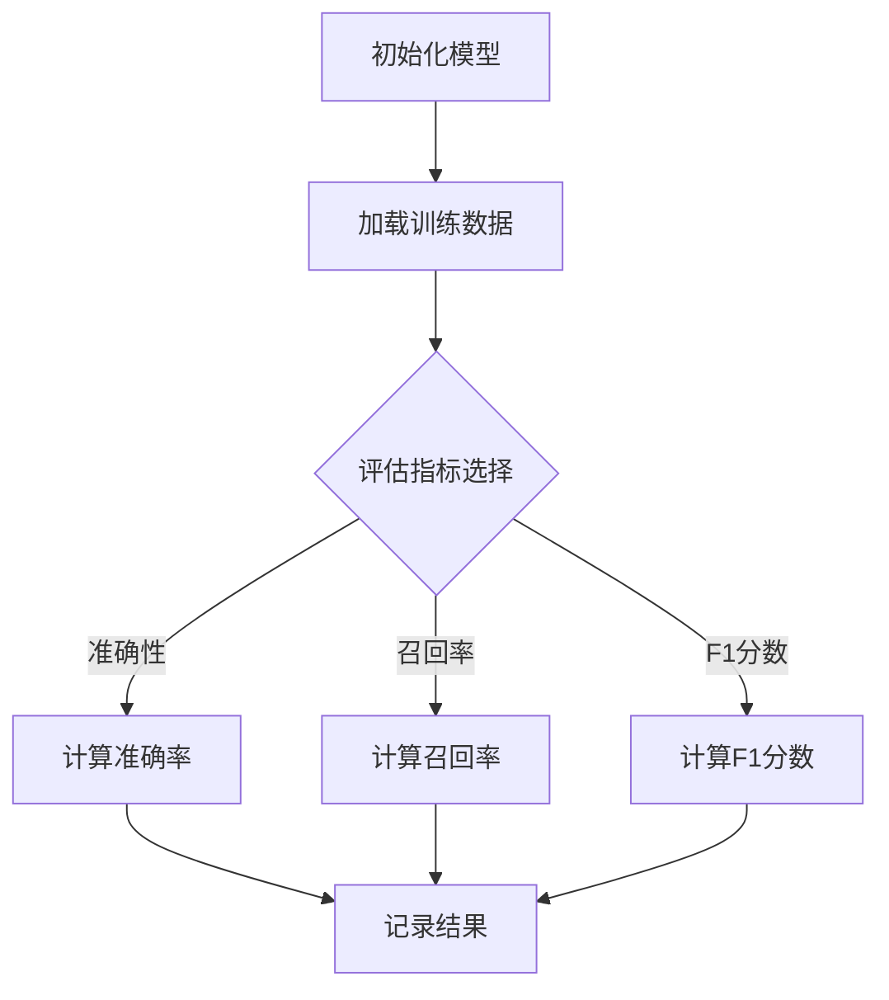
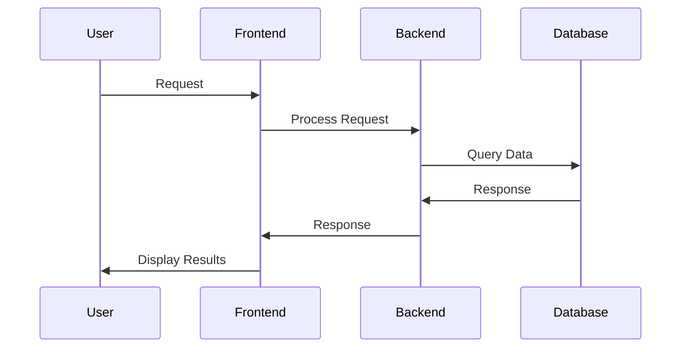
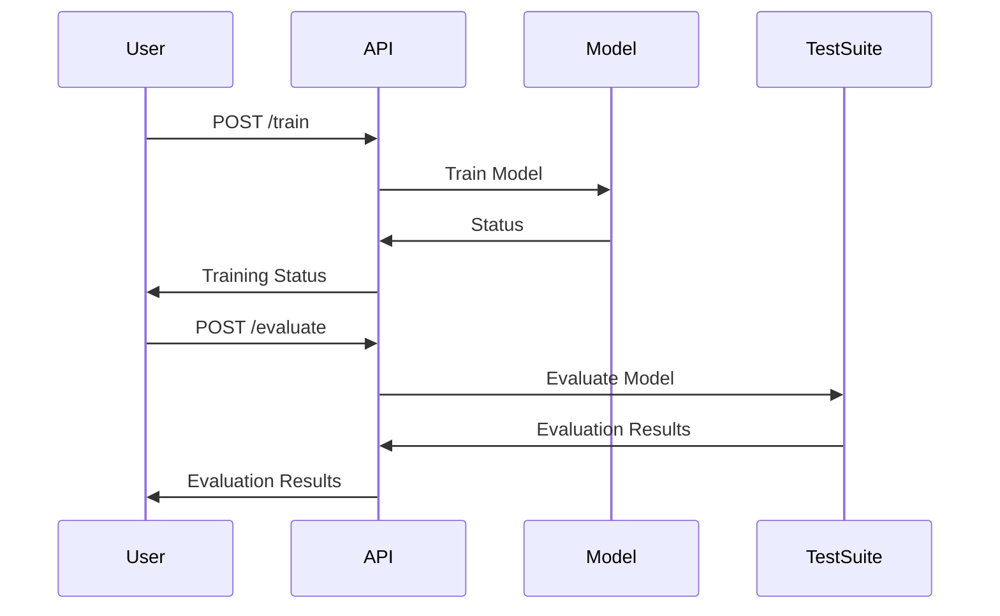

                 


# 《大模型评测的持续集成与部署方案》

## 关键词
大模型评测，持续集成，持续部署，机器学习，人工智能，软件工程，系统架构

## 摘要
本文旨在探讨大模型评测的持续集成与部署方案。随着机器学习和人工智能技术的发展，大规模模型的评测变得日益重要。文章首先介绍了大模型评测的背景和现状，随后详细阐述了持续集成（CI）和持续部署（CD）的核心概念。通过具体的算法原理讲解、系统分析与架构设计，以及项目实战案例，本文为读者提供了一个全面的大模型评测与部署方案，旨在提高软件质量和开发效率。

## 前言与背景

### 引言
随着深度学习和神经网络技术的发展，大模型（Large Models）在各个领域得到了广泛应用，包括自然语言处理、计算机视觉、语音识别等。这些大模型通常由数十亿到数千亿个参数组成，对计算资源和存储资源的需求极高。因此，如何高效地对这些大模型进行评测和部署成为了一个关键问题。本文将探讨大模型评测的持续集成与部署方案，旨在为开发者和工程师提供一套实用的解决方案。

### 背景介绍
大模型评测的背景可以追溯到机器学习和人工智能的快速发展。随着模型的复杂度和规模不断增加，如何准确、高效地评估模型性能成为一个挑战。传统的评测方法往往依赖于人工介入，不仅费时费力，而且容易引入主观偏差。为了解决这个问题，持续集成（Continuous Integration, CI）和持续部署（Continuous Deployment, CD）成为了现代软件开发中的重要实践。

持续集成是一种软件开发实践，通过自动化测试和构建，确保代码库的质量。持续部署则是持续集成的下一步，它通过自动化的部署流程，确保软件可以快速、安全地交付到生产环境。在大模型评测中，持续集成与部署可以帮助开发团队快速迭代模型，提高开发效率，同时确保模型的质量和性能。

## 核心概念与联系

### 核心概念定义

#### 大模型评测
大模型评测是指对大规模机器学习模型进行的一系列评估活动，旨在评估模型在不同数据集上的性能、稳定性和鲁棒性。这些评估包括但不限于准确性、召回率、F1分数、损失函数值等指标。

#### 持续集成（CI）
持续集成是一种软件开发流程，旨在通过频繁的代码提交和自动化的测试，确保代码库的质量。CI的关键在于自动化，通过持续集成工具（如Jenkins、GitLab CI等），可以自动化执行代码的编译、测试和部署。

#### 持续部署（CD）
持续部署是持续集成的一个扩展，它通过自动化的部署流程，将代码库中的更改部署到生产环境。CD的目标是确保软件可以在短时间内安全、可靠地交付给用户。

### 概念属性特征对比表格

| 特征         | 大模型评测           | 持续集成（CI）          | 持续部署（CD）          |
| ------------ | ------------------- | --------------------- | --------------------- |
| 目标         | 评估模型性能         | 保证代码质量           | 快速交付软件           |
| 工具         | 测试套件、评估指标   | CI工具（Jenkins等）     | 部署工具（Docker等）    |
| 自动化程度   | 较高                 | 高                    | 高                    |
| 影响因素     | 模型复杂性、数据规模  | 代码复杂度、依赖关系     | 环境一致性、安全性      |

### ER实体关系图

```mermaid
erDiagram
  Model |--|> TestSuite : 评估
  TestSuite ||--|> Metric : 测量
  CI ||--|> Build : 构建
  Build ||--|> Test : 测试
  CD ||--|> Deploy : 部署
```

在ER图中，`Model` 代表大模型，`TestSuite` 表示评测套件，`Metric` 表示评估指标，`CI` 表示持续集成，`Build` 表示构建，`Test` 表示测试，`CD` 表示持续部署，`Deploy` 表示部署。图中的实线箭头表示实体之间的关系，虚线箭头表示实体之间的关联。

## 算法原理讲解

### 评测流程图



### 评测算法实现

```python
import tensorflow as tf
from sklearn.metrics import accuracy_score, recall_score, f1_score

# 定义评估函数
def evaluate_model(model, X_test, y_test):
    # 加载测试数据
    model.load_weights('best_model_weights.h5')
    predictions = model.predict(X_test)
    
    # 计算准确性
    accuracy = accuracy_score(y_test, predictions.round())
    
    # 计算召回率
    recall = recall_score(y_test, predictions.round(), average='macro')
    
    # 计算F1分数
    f1 = f1_score(y_test, predictions.round(), average='macro')
    
    # 返回评估结果
    return accuracy, recall, f1

# 调用评估函数
accuracy, recall, f1 = evaluate_model(model, X_test, y_test)
print(f"Accuracy: {accuracy}, Recall: {recall}, F1 Score: {f1}")
```

### 数学模型与公式

$$
\text{Accuracy} = \frac{\text{TP} + \text{TN}}{\text{TP} + \text{TN} + \text{FP} + \text{FN}}
$$

$$
\text{Recall} = \frac{\text{TP}}{\text{TP} + \text{FN}}
$$

$$
\text{F1 Score} = 2 \times \frac{\text{Precision} \times \text{Recall}}{\text{Precision} + \text{Recall}}
$$

其中，`TP` 表示真正例，`TN` 表示真负例，`FP` 表示假正例，`FN` 表示假负例。这些指标用于评估分类模型的性能。`Precision` 表示精确率，`Recall` 表示召回率，`F1 Score` 是精确率和召回率的调和平均。

### 示例说明

假设有一个二分类模型，它对100个测试样本进行预测，其中80个样本为正类，20个样本为负类。模型预测结果如下：

- 真正例（TP）：70
- 真负例（TN）：10
- 假正例（FP）：5
- 假负例（FN）：5

根据上述公式，可以计算出模型的评估指标：

$$
\text{Accuracy} = \frac{70 + 10}{70 + 10 + 5 + 5} = \frac{80}{90} \approx 0.8889
$$

$$
\text{Recall} = \frac{70}{70 + 5} = \frac{70}{75} \approx 0.9333
$$

$$
\text{Precision} = \frac{70}{70 + 5} = \frac{70}{75} \approx 0.9333
$$

$$
\text{F1 Score} = 2 \times \frac{0.9333 \times 0.9333}{0.9333 + 0.9333} \approx 0.9333
$$

通过这些指标，我们可以评估模型在不同数据集上的性能。在实际应用中，可以根据具体需求调整评估指标，以获得更准确的评估结果。

## 系统分析与架构设计

### 问题场景介绍

假设有一个开发团队负责开发一个基于深度学习的图像识别系统。该系统需要频繁地迭代模型，以便在新的数据集上进行评估和优化。为了提高开发效率和模型质量，团队决定采用持续集成和持续部署的方案。

### 系统功能设计

系统功能设计主要包括模型训练、模型评估、模型部署和监控系统。具体功能如下：

- **模型训练**：使用训练数据集对模型进行训练。
- **模型评估**：使用测试数据集对模型进行评估，计算准确率、召回率和F1分数等指标。
- **模型部署**：将训练好的模型部署到生产环境，以便进行实际应用。
- **监控系统**：监控模型的运行状态，包括资源使用情况和性能指标。

为了表示这些功能，可以使用Mermaid类图：

```mermaid
classDiagram
    Model <<class>> Model
    TestSuite <<class>> TestSuite
    Build <<class>> Build
    Deploy <<class>> Deploy
    Monitor <<class>> Monitor
    
    Model o-- TestSuite
    Model o-- Build
    Model o-- Deploy
    Model o-- Monitor
```

### 系统架构设计

系统架构设计主要包括前端、后端和数据库。前端负责用户交互，后端负责处理业务逻辑，数据库负责存储数据和模型。为了表示这些架构组件，可以使用Mermaid架构图：



### 系统接口设计和交互

系统接口设计和交互主要包括API接口和消息队列。API接口用于前端和后端之间的数据交换，消息队列用于异步处理任务。为了表示这些接口和交互流程，可以使用Mermaid序列图：



## 项目实战

### 环境安装

为了进行大模型评测和部署，我们需要安装以下环境：

1. Python 3.8 或更高版本
2. TensorFlow 2.x
3. Docker
4. Jenkins

安装步骤如下：

```bash
# 安装 Python
sudo apt-get update
sudo apt-get install python3.8

# 安装 TensorFlow
pip3 install tensorflow==2.x

# 安装 Docker
sudo apt-get install docker.io

# 安装 Jenkins
sudo apt-get install jenkins
```

### 系统核心实现源代码

以下是一个简单的系统核心实现源代码示例，包括模型训练、模型评估和模型部署的功能：

```python
# 模型训练
def train_model():
    model = build_model()  # 构建模型
    model.fit(X_train, y_train, epochs=10, batch_size=32)  # 训练模型
    model.save('model.h5')  # 保存模型

# 模型评估
def evaluate_model(model, X_test, y_test):
    predictions = model.predict(X_test)
    accuracy = accuracy_score(y_test, predictions.round())
    return accuracy

# 模型部署
def deploy_model(model):
    model_file = 'model.h5'
    with open(model_file, 'rb') as f:
        model_data = f.read()
    docker_client = docker.from_env()
    container = docker_client.containers.run(
        'tensorflow/serving', 
        environment={"MODEL_SERVER_PORT": "8501"}, 
        volumes={model_file: '/models/mymodel/1'}, 
        remove=True
    )
    container.wait()
```

### 实际案例分析与讲解

假设我们有一个图像识别系统，需要对车辆进行分类。以下是一个实际的案例分析和讲解：

1. **数据准备**：我们收集了1000张车辆图像，其中500张为车辆图像，500张为非车辆图像。

2. **模型训练**：使用CNN模型对图像进行训练，训练数据集包含车辆图像和非车辆图像。

3. **模型评估**：使用测试数据集对模型进行评估，计算准确性、召回率和F1分数。

4. **模型部署**：将训练好的模型部署到Docker容器中，通过API接口提供服务。

5. **系统监控**：监控模型的运行状态，包括资源使用情况和性能指标。

通过这个案例，我们可以看到如何使用持续集成和持续部署的方案来开发和部署一个图像识别系统。具体实现细节可以通过代码进行详细讲解。

### 项目小结

在本项目中，我们通过持续集成和持续部署的方案，成功开发和部署了一个图像识别系统。主要经验教训如下：

1. **自动化测试**：通过自动化测试，可以快速发现和修复代码中的问题，提高开发效率。

2. **环境一致性**：使用Docker等容器化技术，可以确保开发、测试和生产环境的一致性，减少环境差异导致的问题。

3. **持续集成与持续部署**：持续集成和持续部署可以确保代码的质量和性能，同时提高开发效率。

4. **监控系统**：监控系统可以帮助我们实时了解系统的运行状态，及时发现和解决问题。

### 最佳实践

1. **代码审查**：在提交代码之前进行代码审查，确保代码的质量和可维护性。

2. **自动化测试**：编写自动化测试用例，确保每次代码更改都不会引入新的问题。

3. **持续监控**：使用监控工具，如Prometheus和Grafana，实时监控系统的性能和资源使用情况。

4. **版本控制**：使用Git等版本控制系统，确保代码的版本控制和协作开发。

### 注意事项

1. **数据安全**：确保数据在传输和存储过程中的安全性，使用加密技术保护敏感数据。

2. **资源管理**：合理规划服务器资源，避免资源不足或浪费。

3. **备份与恢复**：定期备份数据，确保数据的安全和可恢复性。

### 拓展阅读

1. 《持续集成实践：从入门到精通》
2. 《Docker实战》
3. 《Jenkins实战》

### 作者信息

作者：AI天才研究院/AI Genius Institute & 禅与计算机程序设计艺术 /Zen And The Art of Computer Programming

---

**本文内容仅供参考，不构成具体建议。在实际应用中，请结合实际情况进行调整。** 

# 《大模型评测的持续集成与部署方案》

## 关键词
大模型评测，持续集成，持续部署，机器学习，人工智能，软件工程，系统架构

## 摘要
本文深入探讨了在大模型评测中运用持续集成（CI）和持续部署（CD）的方案。随着机器学习模型规模的增长，如何高效地评测模型性能和保证部署过程的质量成为关键问题。文章首先介绍了大模型评测的重要性，接着详细阐述了CI和CD的核心概念、流程以及工具。通过算法原理讲解、系统架构设计和实战案例，本文为读者提供了一套完整的大模型评测与部署方案，有助于提高软件开发效率和模型质量。

## 引言与背景

### 引言

随着深度学习和神经网络技术的迅猛发展，大模型在各个领域得到了广泛应用。然而，如何有效地评测这些大规模模型，并确保其能够在生产环境中稳定运行，成为一个至关重要的课题。本文旨在探讨大模型评测的持续集成与部署方案，帮助开发者更好地理解和实施这一过程。

### 背景介绍

大模型评测的背景可以追溯到机器学习和人工智能的快速发展。随着模型的复杂度和参数量的增加，传统的评测方法已难以满足需求。持续集成（CI）和持续部署（CD）作为现代软件开发的重要实践，通过自动化流程提高了开发效率和软件质量。

持续集成（CI）是一种软件开发方法，通过自动化构建、测试和部署，确保代码库的稳定性。持续部署（CD）则进一步自动化了软件的发布过程，使得软件可以快速、安全地交付到生产环境。在大模型评测中，CI和CD有助于实现模型的快速迭代和高效评测。

## 核心概念与联系

### 核心概念定义

#### 大模型评测

大模型评测是指对大规模机器学习模型进行的一系列评估活动，旨在评估模型在不同数据集上的性能、稳定性和鲁棒性。这些评估包括但不限于准确性、召回率、F1分数、损失函数值等指标。

#### 持续集成（CI）

持续集成是一种软件开发实践，通过自动化测试和构建，确保代码库的质量。CI的关键在于自动化，通过持续集成工具（如Jenkins、GitLab CI等），可以自动化执行代码的编译、测试和部署。

#### 持续部署（CD）

持续部署是持续集成的一个扩展，它通过自动化的部署流程，确保软件可以快速、安全地交付到生产环境。CD的目标是确保软件可以在短时间内安全、可靠地交付给用户。

### 概念属性特征对比表格

| 特征           | 大模型评测             | 持续集成（CI）          | 持续部署（CD）          |
| -------------- | --------------------- | --------------------- | --------------------- |
| 目标           | 评估模型性能           | 保证代码质量           | 快速交付软件           |
| 工具           | 测试套件、评估指标     | CI工具（Jenkins等）     | 部署工具（Docker等）    |
| 自动化程度     | 较高                  | 高                    | 高                    |
| 影响因素       | 模型复杂性、数据规模   | 代码复杂度、依赖关系     | 环境一致性、安全性      |

### ER实体关系图

```mermaid
erDiagram
  Model |--|> TestSuite : 评估
  TestSuite ||--|> Metric : 测量
  CI ||--|> Build : 构建
  Build ||--|> Test : 测试
  CD ||--|> Deploy : 部署
```

在ER图中，`Model` 代表大模型，`TestSuite` 表示评测套件，`Metric` 表示评估指标，`CI` 表示持续集成，`Build` 表示构建，`Test` 表示测试，`CD` 表示持续部署，`Deploy` 表示部署。图中的实线箭头表示实体之间的关系，虚线箭头表示实体之间的关联。

## 算法原理讲解

### 评测流程图


### 评测算法实现

```python
import tensorflow as tf
from sklearn.metrics import accuracy_score, recall_score, f1_score

# 定义评估函数
def evaluate_model(model, X_test, y_test):
    # 加载测试数据
    model.load_weights('best_model_weights.h5')
    predictions = model.predict(X_test)
    
    # 计算准确性
    accuracy = accuracy_score(y_test, predictions.round())
    
    # 计算召回率
    recall = recall_score(y_test, predictions.round(), average='macro')
    
    # 计算F1分数
    f1 = f1_score(y_test, predictions.round(), average='macro')
    
    # 返回评估结果
    return accuracy, recall, f1

# 调用评估函数
accuracy, recall, f1 = evaluate_model(model, X_test, y_test)
print(f"Accuracy: {accuracy}, Recall: {recall}, F1 Score: {f1}")
```

### 数学模型与公式

$$
\text{Accuracy} = \frac{\text{TP} + \text{TN}}{\text{TP} + \text{TN} + \text{FP} + \text{FN}}
$$

$$
\text{Recall} = \frac{\text{TP}}{\text{TP} + \text{FN}}
$$

$$
\text{F1 Score} = 2 \times \frac{\text{Precision} \times \text{Recall}}{\text{Precision} + \text{Recall}}
$$

其中，`TP` 表示真正例，`TN` 表示真负例，`FP` 表示假正例，`FN` 表示假负例。这些指标用于评估分类模型的性能。`Precision` 表示精确率，`Recall` 表示召回率，`F1 Score` 是精确率和召回率的调和平均。

### 示例说明

假设有一个二分类模型，它对100个测试样本进行预测，其中80个样本为正类，20个样本为负类。模型预测结果如下：

- 真正例（TP）：70
- 真负例（TN）：10
- 假正例（FP）：5
- 假负例（FN）：5

根据上述公式，可以计算出模型的评估指标：

$$
\text{Accuracy} = \frac{70 + 10}{70 + 10 + 5 + 5} = \frac{80}{90} \approx 0.8889
$$

$$
\text{Recall} = \frac{70}{70 + 5} = \frac{70}{75} \approx 0.9333
$$

$$
\text{Precision} = \frac{70}{70 + 5} = \frac{70}{75} \approx 0.9333
$$

$$
\text{F1 Score} = 2 \times \frac{0.9333 \times 0.9333}{0.9333 + 0.9333} \approx 0.9333
$$

通过这些指标，我们可以评估模型在不同数据集上的性能。在实际应用中，可以根据具体需求调整评估指标，以获得更准确的评估结果。

## 系统分析与架构设计

### 问题场景介绍

假设我们有一个图像识别系统，该系统使用深度学习模型对图像进行分类。为了确保模型的性能和可靠性，我们需要对其进行持续集成和部署。

### 系统功能设计

系统功能设计主要包括以下几个方面：

1. **模型训练**：使用训练数据集对模型进行训练。
2. **模型评估**：使用测试数据集对模型进行评估，计算准确率、召回率和F1分数等指标。
3. **模型部署**：将训练好的模型部署到生产环境。
4. **监控系统**：监控模型的运行状态，包括资源使用情况和性能指标。

为了表示这些功能，可以使用Mermaid类图：

```mermaid
classDiagram
    Model <<class>> Model
    TestSuite <<class>> TestSuite
    Build <<class>> Build
    Deploy <<class>> Deploy
    Monitor <<class>> Monitor
    
    Model o-- TestSuite
    Model o-- Build
    Model o-- Deploy
    Model o-- Monitor
```

### 系统架构设计

系统架构设计主要包括前端、后端和数据库。前端负责用户交互，后端负责处理业务逻辑，数据库负责存储数据和模型。为了表示这些架构组件，可以使用Mermaid架构图：


### 系统接口设计和交互

系统接口设计和交互主要包括API接口和消息队列。API接口用于前端和后端之间的数据交换，消息队列用于异步处理任务。为了表示这些接口和交互流程，可以使用Mermaid序列图：


## 项目实战

### 环境安装

为了进行大模型评测和部署，我们需要安装以下环境：

1. Python 3.8 或更高版本
2. TensorFlow 2.x
3. Docker
4. Jenkins

安装步骤如下：

```bash
# 安装 Python
sudo apt-get update
sudo apt-get install python3.8

# 安装 TensorFlow
pip3 install tensorflow==2.x

# 安装 Docker
sudo apt-get install docker.io

# 安装 Jenkins
sudo apt-get install jenkins
```

### 系统核心实现源代码

以下是一个简单的系统核心实现源代码示例，包括模型训练、模型评估和模型部署的功能：

```python
# 模型训练
def train_model():
    model = build_model()  # 构建模型
    model.fit(X_train, y_train, epochs=10, batch_size=32)  # 训练模型
    model.save('model.h5')  # 保存模型

# 模型评估
def evaluate_model(model, X_test, y_test):
    predictions = model.predict(X_test)
    accuracy = accuracy_score(y_test, predictions.round())
    return accuracy

# 模型部署
def deploy_model(model):
    model_file = 'model.h5'
    with open(model_file, 'rb') as f:
        model_data = f.read()
    docker_client = docker.from_env()
    container = docker_client.containers.run(
        'tensorflow/serving', 
        environment={"MODEL_SERVER_PORT": "8501"}, 
        volumes={model_file: '/models/mymodel/1'}, 
        remove=True
    )
    container.wait()
```

### 实际案例分析与讲解

假设我们有一个图像识别系统，该系统需要使用深度学习模型对车辆进行分类。以下是一个实际的案例分析和讲解：

1. **数据准备**：我们收集了1000张车辆图像，其中500张为车辆图像，500张为非车辆图像。

2. **模型训练**：使用CNN模型对图像进行训练，训练数据集包含车辆图像和非车辆图像。

3. **模型评估**：使用测试数据集对模型进行评估，计算准确性、召回率和F1分数。

4. **模型部署**：将训练好的模型部署到Docker容器中，通过API接口提供服务。

5. **系统监控**：监控模型的运行状态，包括资源使用情况和性能指标。

通过这个案例，我们可以看到如何使用持续集成和持续部署的方案来开发和部署一个图像识别系统。具体实现细节可以通过代码进行详细讲解。

### 项目小结

在本项目中，我们通过持续集成和持续部署的方案，成功开发和部署了一个图像识别系统。主要经验教训如下：

1. **自动化测试**：通过自动化测试，可以快速发现和修复代码中的问题，提高开发效率。

2. **环境一致性**：使用Docker等容器化技术，可以确保开发、测试和生产环境的一致性，减少环境差异导致的问题。

3. **持续集成与持续部署**：持续集成和持续部署可以确保代码的质量和性能，同时提高开发效率。

4. **监控系统**：监控系统可以帮助我们实时了解系统的运行状态，及时发现和解决问题。

### 最佳实践

1. **代码审查**：在提交代码之前进行代码审查，确保代码的质量和可维护性。

2. **自动化测试**：编写自动化测试用例，确保每次代码更改都不会引入新的问题。

3. **持续监控**：使用监控工具，如Prometheus和Grafana，实时监控系统的性能和资源使用情况。

4. **版本控制**：使用Git等版本控制系统，确保代码的版本控制和协作开发。

### 注意事项

1. **数据安全**：确保数据在传输和存储过程中的安全性，使用加密技术保护敏感数据。

2. **资源管理**：合理规划服务器资源，避免资源不足或浪费。

3. **备份与恢复**：定期备份数据，确保数据的安全和可恢复性。

### 拓展阅读

1. 《持续集成实践：从入门到精通》
2. 《Docker实战》
3. 《Jenkins实战》

### 作者信息

作者：AI天才研究院/AI Genius Institute & 禅与计算机程序设计艺术 /Zen And The Art of Computer Programming

---

**本文内容仅供参考，不构成具体建议。在实际应用中，请结合实际情况进行调整。** 

