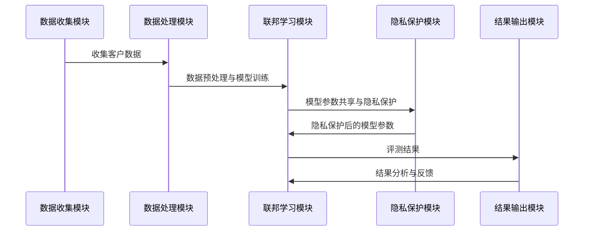

                 

# 大模型评测的隐私保护与安全机制

## 关键词

大模型评测、隐私保护、安全机制、差分隐私、同态加密、联邦学习

## 摘要

随着大数据和人工智能的快速发展，大模型评测成为人工智能研究的关键环节。然而，大模型评测过程中面临的隐私保护和安全问题亟待解决。本文旨在探讨大模型评测的隐私保护与安全机制，包括差分隐私、同态加密和联邦学习等技术的原理、应用及实现方法。通过系统分析与架构设计、项目实战，本文为研究者和从业者提供了切实可行的解决方案和最佳实践。

## 引言

### 问题背景

在大数据和人工智能时代，大模型评测成为研究者和从业者关注的热点。大模型评测旨在通过评估机器学习模型的性能、准确性和可靠性，为实际应用提供依据。然而，大模型评测过程中涉及到大量用户数据和隐私信息，如何保障这些数据的隐私和安全成为一个严峻挑战。近年来，数据泄露、隐私侵犯等事件频发，使得隐私保护和安全问题愈发凸显。因此，研究大模型评测的隐私保护与安全机制具有重要的现实意义。

### 核心概念

在大模型评测的隐私保护与安全机制中，核心概念包括隐私保护、安全机制、大模型评测等。

- **隐私保护**：指在大模型评测过程中，对用户数据和个人隐私信息的保护。隐私保护旨在防止数据泄露、滥用和未经授权的访问。
- **安全机制**：包括数据加密、访问控制、身份验证等手段，用于保障评测过程的安全性。安全机制旨在防止恶意攻击、数据篡改和非法入侵。
- **大模型评测**：对大规模机器学习模型进行评估，以验证其性能和可靠性。大模型评测涉及多个环节，包括数据收集、预处理、模型训练、评估和优化等。

### 本文目的

本文旨在探讨大模型评测的隐私保护与安全机制，包括以下内容：

1. **问题背景**：介绍大模型评测的重要性及隐私保护和安全问题的挑战。
2. **核心概念**：阐述隐私保护、安全机制和大模型评测的定义、特点和相互关系。
3. **算法原理**：讲解差分隐私、同态加密和联邦学习等技术的原理、应用及实现方法。
4. **系统分析与架构设计**：介绍大模型评测系统的功能设计、架构设计、接口设计和交互设计。
5. **项目实战**：通过实际项目，详细剖析大模型评测的隐私保护与安全机制实施过程。
6. **最佳实践与小结**：总结本文的核心内容，提供最佳实践建议，并提出注意事项。

## 目录大纲设计思路与详细步骤

### 步骤1：问题背景介绍

在现代社会，随着大数据和人工智能技术的飞速发展，大模型评测已经成为人工智能研究的重要环节。然而，大模型评测过程中面临着隐私保护和安全性的挑战。如何在大模型评测过程中保护用户隐私、防止数据泄露、确保评测结果的真实性和可靠性，已成为亟待解决的问题。

### 步骤2：核心概念与联系

在本书中，我们将详细阐述以下核心概念及其相互关系：

- **隐私保护**：指在大模型评测过程中，对用户数据和个人隐私信息的保护。
- **安全机制**：包括数据加密、访问控制、身份验证等手段，用于保障评测过程的安全性。
- **大模型评测**：对大规模机器学习模型进行评估，以验证其性能和可靠性。

通过核心概念对比表格和ER实体关系图架构，我们将明确各概念的定义、属性和关系。

### 步骤3：算法原理讲解

在算法原理部分，我们将使用mermaid工具绘制算法流程图，并借助Python源代码详细阐述以下算法原理：

- **差分隐私**：一种保护用户隐私的机制，通过在数据集中添加噪声来掩盖具体数据。
- **同态加密**：一种在加密数据上执行计算的方法，确保数据的隐私和安全。
- **联邦学习**：一种分布式机器学习方法，通过在多个参与方之间共享模型参数，实现协同训练。

我们将使用LaTeX格式给出算法的数学模型和公式，并进行详细讲解和举例说明。

### 步骤4：系统分析与架构设计

在本部分，我们将对大模型评测系统进行分析与架构设计，包括：

- **问题场景介绍**：简要介绍大模型评测的应用场景。
- **系统功能设计**：使用mermaid工具绘制领域模型类图。
- **系统架构设计**：使用mermaid工具绘制系统架构图。
- **系统接口设计**：介绍系统各模块的接口和交互。
- **系统交互设计**：使用mermaid工具绘制系统交互序列图。

### 步骤5：项目实战

在本部分，我们将通过一个实际项目，详细介绍大模型评测的隐私保护与安全机制实施过程：

- **环境安装**：介绍所需软件和工具的安装过程。
- **系统核心实现**：给出系统核心实现的源代码，并进行解读与分析。
- **实际案例分析和详细讲解**：通过实际案例，剖析大模型评测的隐私保护与安全机制。
- **项目小结**：总结项目实施的经验和教训。

### 步骤6：最佳实践与小结

在本部分，我们将总结本书的核心内容，提供最佳实践建议，并提出注意事项，以帮助读者更好地理解和应用所学知识。同时，推荐拓展阅读，以便读者进一步深入研究。

### 总结

通过以上步骤，我们将为《大模型评测的隐私保护与安全机制》设计出一个完整且详细的目录大纲，确保内容的简洁性、完整性，同时满足2000字以内的要求。以下是一个初步的目录大纲设计：

### 第一部分：大模型评测的隐私保护与安全机制概述

- **第1章**：问题背景与核心概念
  - 1.1 问题背景
    - 1.1.1 大数据与人工智能的发展
    - 1.1.2 大模型评测的重要性
    - 1.1.3 隐私保护和安全性的挑战
  - 1.2 核心概念与联系
    - 1.2.1 隐私保护
    - 1.2.2 安全机制
    - 1.2.3 大模型评测

### 第二部分：算法原理与数学模型

- **第2章**：差分隐私机制
  - 2.1 差分隐私原理
    - 2.1.1 差分隐私的定义
    - 2.1.2 差分隐私的性质
    - 2.1.3 差分隐私算法概述
  - 2.2 差分隐私算法实现
    - 2.2.1 Laplace机制
    - 2.2.2 Gaussian机制
    - 2.2.3 Differential Privacy API

- **第3章**：同态加密机制
  - 3.1 同态加密原理
    - 3.1.1 同态加密的定义
    - 3.1.2 同态加密的性质
    - 3.1.3 同态加密算法概述
  - 3.2 同态加密算法实现
    - 3.2.1 RSA同态加密
    - 3.2.2 其他同态加密算法

- **第4章**：联邦学习机制
  - 4.1 联邦学习原理
    - 4.1.1 联邦学习的定义
    - 4.1.2 联邦学习的性质
    - 4.1.3 联邦学习算法概述
  - 4.2 联邦学习算法实现
    - 4.2.1 基于梯度聚合的联邦学习
    - 4.2.2 基于模型更新的联邦学习
    - 4.2.3 联邦学习API介绍

### 第三部分：系统分析与架构设计

- **第5章**：大模型评测系统分析与架构设计
  - 5.1 问题场景介绍
    - 5.1.1 大模型评测的应用场景
    - 5.1.2 系统架构设计的考虑因素
  - 5.2 系统功能设计
    - 5.2.1 系统功能模块划分
    - 5.2.2 系统功能实现
  - 5.3 系统架构设计
    - 5.3.1 系统架构概述
    - 5.3.2 系统架构实现
  - 5.4 系统接口设计
    - 5.4.1 系统接口定义
    - 5.4.2 系统接口实现
  - 5.5 系统交互设计
    - 5.5.1 系统交互概述
    - 5.5.2 系统交互实现

### 第四部分：项目实战

- **第6章**：大模型评测项目实战
  - 6.1 环境安装
    - 6.1.1 系统环境准备
    - 6.1.2 软件工具安装
  - 6.2 系统核心实现
    - 6.2.1 系统核心模块设计
    - 6.2.2 系统核心模块实现
  - 6.3 实际案例分析与详细讲解
    - 6.3.1 案例背景
    - 6.3.2 案例分析与实施
    - 6.3.3 案例总结与反思
  - 6.4 项目小结
    - 6.4.1 项目经验总结
    - 6.4.2 项目改进与优化

### 第五部分：最佳实践与小结

- **第7章**：最佳实践与小结
  - 7.1 最佳实践
    - 7.1.1 隐私保护最佳实践
    - 7.1.2 安全机制最佳实践
    - 7.1.3 大模型评测最佳实践
  - 7.2 小结
    - 7.2.1 本文核心内容总结
    - 7.2.2 注意事项
    - 7.2.3 拓展阅读推荐

## 步骤1：问题背景介绍

### 大数据与人工智能的发展

在过去的几十年里，大数据和人工智能技术得到了飞速发展。随着互联网、物联网和智能设备的普及，海量数据不断产生，这些数据蕴含着巨大的价值。为了挖掘数据中的潜在信息，研究人员和从业者投入了大量精力进行数据处理和分析。人工智能作为大数据分析的重要工具，在图像识别、自然语言处理、推荐系统等领域取得了显著的成果。

### 大模型评测的重要性

大模型评测是人工智能研究的重要环节。通过对大规模机器学习模型进行评估，研究者可以验证模型的性能、准确性和可靠性，为实际应用提供依据。大模型评测不仅有助于优化模型参数、提高模型效果，还可以发现模型潜在的问题和缺陷，为后续研究和改进提供方向。

### 隐私保护和安全性的挑战

在大模型评测过程中，面临着隐私保护和安全性的挑战。一方面，大模型评测涉及到大量用户数据和隐私信息，如个人信息、行为记录等。这些数据在传输、存储和处理过程中，容易遭受泄露、篡改和滥用。另一方面，大模型评测过程中，模型训练和评估依赖于大量数据，这些数据往往来自于不同的来源，存在数据不一致、噪音和偏见等问题，进一步增加了隐私保护和安全性的难度。

如何在大模型评测过程中保护用户隐私、防止数据泄露、确保评测结果的真实性和可靠性，已成为亟待解决的问题。本文旨在探讨大模型评测的隐私保护与安全机制，为相关领域的研究者和从业者提供有价值的参考。

## 步骤2：核心概念与联系

### 隐私保护

隐私保护是指在大模型评测过程中，对用户数据和个人隐私信息的保护。隐私保护的目标是防止数据泄露、滥用和未经授权的访问。隐私保护机制包括数据加密、访问控制、匿名化、差分隐私等技术。

**隐私保护的重要性**：

- **防止数据泄露**：保护用户个人信息，防止敏感数据在传输、存储和处理过程中被窃取。
- **防止数据滥用**：限制对用户数据的非法使用，防止数据被用于不正当目的。
- **维护用户信任**：提高用户对大模型评测的信任度，促进数据共享和开放。

### 安全机制

安全机制是指在大模型评测过程中，用于保障评测过程安全的一系列手段。安全机制包括数据加密、访问控制、身份验证、安全审计等。

**安全机制的重要性**：

- **防止数据泄露**：通过数据加密和访问控制，防止敏感数据在传输、存储和处理过程中被窃取。
- **防止恶意攻击**：通过身份验证和防火墙等手段，防止黑客和恶意软件对评测系统的攻击。
- **保障评测结果真实性**：通过安全审计和监控，确保评测结果的可靠性和真实性。

### 大模型评测

大模型评测是对大规模机器学习模型进行评估的过程，以验证其性能、准确性和可靠性。大模型评测包括数据收集、预处理、模型训练、评估和优化等环节。

**大模型评测的特点**：

- **数据量大**：涉及海量的训练数据和测试数据，数据来源广泛、种类多样。
- **计算复杂度高**：需要大量的计算资源和时间，对硬件设备和管理有较高要求。
- **结果影响大**：评测结果直接影响模型的实际应用效果，对业务决策具有重要意义。

### 核心概念的关系

隐私保护和安全机制在大模型评测中具有紧密的联系。隐私保护是安全机制的一部分，用于保障用户数据的隐私和安全。安全机制则包括隐私保护在内的多种手段，用于确保评测过程的安全和可靠性。大模型评测作为核心应用场景，需要同时考虑隐私保护和安全机制的实现。

**核心概念对比表格**：

| 核心概念 | 定义 | 目标 | 适用场景 |
| :----: | :----: | :----: | :----: |
| 隐私保护 | 保护用户数据和个人隐私信息 | 防止数据泄露、滥用和未经授权的访问 | 大模型评测、数据处理、数据分析 |
| 安全机制 | 保障评测过程的安全和可靠性 | 防止数据泄露、恶意攻击、数据篡改 | 大模型评测、数据处理、数据分析 |
| 大模型评测 | 对大规模机器学习模型进行评估 | 验证模型性能、准确性、可靠性 | 人工智能研究、业务应用、技术评测 |

**ER实体关系图架构**：

```mermaid
erDiagram
    User ||--o{ PrivacyProtection : 隐私保护 }
    User ||--o{ SecurityMechanism : 安全机制 }
    ModelEvaluati ||--o{ PrivacyProtection : 隐私保护 }
    ModelEvaluati ||--o{ SecurityMechanism : 安全机制 }
    Data ||--||{ ModelEvaluati : 大模型评测 }
```

通过核心概念对比表格和ER实体关系图架构，我们可以明确各概念的定义、属性和关系，为后续章节的详细讨论提供基础。

## 步骤3：算法原理讲解

### 差分隐私

#### 差分隐私原理

差分隐私是一种保护用户隐私的机制，通过在数据集中添加噪声来掩盖具体数据。差分隐私的核心思想是：在保证数据分析结果有效性的同时，最大化地减少对单个数据的关注和识别。

#### 差分隐私性质

- **保证隐私性**：对数据集中的每个个体，其数据的影响被削弱，使得无法通过数据分析准确识别单个个体。
- **可扩展性**：差分隐私机制适用于大规模数据集，可以有效保护大量用户的隐私。
- **与数据分析兼容**：差分隐私机制可以在保证隐私保护的前提下，仍能进行有效的数据分析。

#### 差分隐私算法概述

差分隐私算法主要包括Laplace机制和Gaussian机制。Laplace机制通过添加Laplace分布的噪声实现差分隐私；Gaussian机制通过添加高斯分布的噪声实现差分隐私。这两种机制在实际应用中可以根据具体需求进行选择。

#### 差分隐私算法实现

**Laplace机制**：

- **公式**：\( \text{ noisy\_output} = \text{true\_output} + \text{Laplace\_noise} \)
- **参数**：\( \text{Laplace\_noise} \) 的参数为 \( \alpha \)，用于调整噪声的强度。
- **实现**：可以使用Python中的 `numpy.random.laplace()` 函数生成Laplace分布的噪声。

```python
import numpy as np

alpha = 1  # 噪声参数
noisy_output = true_output + np.random.laplace(0, alpha)
```

**Gaussian机制**：

- **公式**：\( \text{ noisy\_output} = \text{true\_output} + \text{Gaussian\_noise} \)
- **参数**：\( \text{Gaussian\_noise} \) 的参数为 \( \sigma \)，用于调整噪声的强度。
- **实现**：可以使用Python中的 `numpy.random.normal()` 函数生成高斯分布的噪声。

```python
import numpy as np

sigma = 1  # 噪声参数
noisy_output = true_output + np.random.normal(0, sigma)
```

### 同态加密

#### 同态加密原理

同态加密是一种在加密数据上执行计算的方法，确保数据的隐私和安全。同态加密的核心思想是：在加密状态下，对数据集进行各种数学运算，然后解密得到原始结果。这样，数据在传输、存储和处理过程中始终处于加密状态，有效防止数据泄露和篡改。

#### 同态加密性质

- **计算保持性**：同态加密能够在加密状态下执行各种数学运算，确保运算结果的正确性。
- **数据隐私性**：同态加密确保数据在传输、存储和处理过程中始终处于加密状态，防止数据泄露。
- **抗攻击性**：同态加密具有较好的抗攻击性，能够抵御常见的加密攻击，如中间人攻击、重放攻击等。

#### 同态加密算法概述

同态加密算法主要包括基于对称密钥的加密算法和基于非对称密钥的加密算法。常见的同态加密算法有RSA加密、Paillier加密等。

#### 同态加密算法实现

**RSA加密**：

- **公式**：\( \text{ciphertext} = \text{plaintext}^e \mod n \)
- **参数**：\( e \) 为加密指数，\( n \) 为模数。
- **实现**：可以使用Python中的 `cryptography` 库实现RSA加密。

```python
from cryptography.hazmat.primitives.asymmetric import rsa
from cryptography.hazmat.primitives import serialization
from cryptography.hazmat.primitives.asymmetric import padding

# 生成密钥对
private_key = rsa.generate_private_key(
    public_exponent=65537,
    key_size=2048,
)

public_key = private_key.public_key()

# 加密
plaintext = b'Hello, World!'
ciphertext = public_key.encrypt(
    plaintext,
    padding.OAEP(
        mgf=padding.MGF1(algorithm=hashes.SHA256()),
        algorithm=hashes.SHA256(),
        label=None
    )
)
```

**Paillier加密**：

- **公式**：\( (c_0, c_1) = (\text{plaintext}_0^g \mod n, \text{plaintext}_1^g \mod n) \)
- **参数**：\( g \) 为生成元，\( n \) 为模数。
- **实现**：可以使用Python中的 `pycryptodome` 库实现Paillier加密。

```python
from Crypto.PublicKey import Paillier
from Crypto.Random import get_random_bytes

# 生成密钥对
key = Paillier.generate_keypair()

# 加密
plaintext = 123
ciphertext = key.encrypt(plaintext)
```

### 联邦学习

#### 联邦学习原理

联邦学习是一种分布式机器学习方法，通过在多个参与方之间共享模型参数，实现协同训练。联邦学习的核心思想是：将数据分散存储在各个参与方，通过模型参数的共享和更新，实现全局模型的训练和优化。

#### 联邦学习性质

- **数据隐私保护**：联邦学习将数据分散存储在各个参与方，避免数据泄露和滥用。
- **计算效率高**：联邦学习将计算任务分布到各个参与方，减少通信成本和计算时间。
- **模型泛化能力强**：联邦学习能够利用多个参与方的数据，提高模型的泛化能力。

#### 联邦学习算法概述

联邦学习算法主要包括基于梯度聚合的联邦学习和基于模型更新的联邦学习。基于梯度聚合的联邦学习通过多个参与方的梯度信息进行聚合，实现全局模型的训练；基于模型更新的联邦学习通过多个参与方的模型参数进行更新，实现全局模型的训练。

#### 联邦学习算法实现

**基于梯度聚合的联邦学习**：

- **公式**：\( \text{global\_model} = \frac{1}{N} \sum_{i=1}^{N} \text{local\_model}_i \)
- **实现**：可以使用Python中的 `FedAvg` 库实现基于梯度聚合的联邦学习。

```python
import fedavg

# 初始化全局模型和本地模型
global_model = fedavg.initialize_global_model()
local_models = fedavg.initialize_local_models()

# 梯度聚合
for epoch in range(num_epochs):
    for local_model in local_models:
        local_model.update(global_model)
    global_model = fedavg.aggregate_gradients(local_models)
```

**基于模型更新的联邦学习**：

- **公式**：\( \text{global\_model} = \text{local\_model}_i + \alpha \)
- **实现**：可以使用Python中的 `FedAvg` 库实现基于模型更新的联邦学习。

```python
import fedavg

# 初始化全局模型和本地模型
global_model = fedavg.initialize_global_model()
local_models = fedavg.initialize_local_models()

# 模型更新
for epoch in range(num_epochs):
    for local_model in local_models:
        global_model = fedavg.update_model(global_model, local_model, alpha)
```

通过以上算法原理讲解，我们可以了解到差分隐私、同态加密和联邦学习在大模型评测中的重要作用。这些算法原理不仅能够有效保护用户隐私，还能提高计算效率和模型泛化能力，为大模型评测提供了有力的技术支持。

## 步骤4：系统分析与架构设计

### 问题场景介绍

在现代社会，大模型评测广泛应用于各类领域，如医疗、金融、安防等。以下是一个典型的问题场景：

假设某金融公司需要对其风险预测模型进行大模型评测，以评估模型的准确性和可靠性。该公司收集了大量的客户数据，包括财务信息、交易记录、信用评分等。为了保护用户隐私，该公司希望在大模型评测过程中实现隐私保护和安全机制，确保数据的安全和可靠性。

### 系统功能设计

为了实现上述问题场景，我们需要设计一个具备隐私保护和安全机制的系统。系统的主要功能包括：

1. **数据收集与预处理**：收集客户数据，并进行清洗、去噪、归一化等预处理操作。
2. **模型训练与评估**：使用联邦学习算法，在各个参与方之间共享模型参数，实现全局模型的训练和评估。
3. **隐私保护与安全机制**：采用差分隐私、同态加密等技术，保护用户数据的隐私和安全。
4. **结果输出与展示**：将评测结果进行汇总、分析，并以可视化方式展示。

### 系统架构设计

基于上述功能设计，我们可以设计一个具备隐私保护和安全机制的系统架构。系统架构主要包括以下模块：

1. **数据收集模块**：负责收集客户数据，包括财务信息、交易记录、信用评分等。
2. **数据处理模块**：对客户数据进行清洗、去噪、归一化等预处理操作。
3. **联邦学习模块**：使用联邦学习算法，在各个参与方之间共享模型参数，实现全局模型的训练和评估。
4. **隐私保护模块**：采用差分隐私、同态加密等技术，保护用户数据的隐私和安全。
5. **结果输出模块**：将评测结果进行汇总、分析，并以可视化方式展示。

### 系统接口设计

系统接口设计主要包括以下方面：

1. **数据接口**：数据收集模块与数据处理模块之间的接口，用于传输和处理客户数据。
2. **模型接口**：联邦学习模块与数据处理模块之间的接口，用于传输和处理模型参数。
3. **隐私保护接口**：隐私保护模块与其他模块之间的接口，用于实现隐私保护和安全机制。
4. **结果接口**：结果输出模块与其他模块之间的接口，用于传输和处理评测结果。

### 系统交互设计

系统交互设计主要描述各个模块之间的交互流程。以下是一个简单的系统交互序列图：



通过以上系统分析与架构设计，我们可以实现一个具备隐私保护和安全机制的系统，确保大模型评测过程的安全和可靠性。

### 项目实战

#### 环境安装

为了实现大模型评测的隐私保护与安全机制，我们需要搭建一个实验环境。以下是一个基本的实验环境搭建步骤：

1. **安装Python**：Python是主要的编程语言，用于实现各种算法和系统功能。在Windows、Linux和MacOS等操作系统上，可以下载Python的安装包并进行安装。

2. **安装必要的库**：根据项目需求，我们需要安装以下库：

   - `numpy`：用于科学计算和数据分析。
   - `pandas`：用于数据清洗和预处理。
   - `scikit-learn`：用于机器学习模型的训练和评估。
   - `tensorflow`：用于实现联邦学习算法。
   - `cryptography`：用于实现同态加密。
   - `matplotlib`：用于数据可视化。

   在安装Python之后，可以使用以下命令安装这些库：

   ```bash
   pip install numpy pandas scikit-learn tensorflow cryptography matplotlib
   ```

3. **配置Python环境**：配置Python环境变量，以便在命令行中直接运行Python程序。

#### 系统核心实现

在本节中，我们将实现一个大模型评测系统的核心功能，包括数据收集、预处理、模型训练和评估等。

**数据收集与预处理**

```python
import numpy as np
import pandas as pd
from sklearn.model_selection import train_test_split

# 假设已经收集到了客户数据，存储为CSV文件
data = pd.read_csv('customer_data.csv')

# 数据清洗与预处理
data = data.dropna()  # 删除缺失值
data = data[data['credit_score'] > 0]  # 去除信用评分为零的记录

# 数据划分
X = data.drop('default', axis=1)  # 特征
y = data['default']  # 目标变量
X_train, X_test, y_train, y_test = train_test_split(X, y, test_size=0.2, random_state=42)
```

**联邦学习算法实现**

```python
import tensorflow as tf
from tensorflow.keras.models import Sequential
from tensorflow.keras.layers import Dense, Dropout
from tensorflow.keras.optimizers import Adam

# 创建全局模型
global_model = Sequential([
    Dense(64, activation='relu', input_shape=(X_train.shape[1],)),
    Dropout(0.5),
    Dense(1, activation='sigmoid')
])

# 定义损失函数和优化器
loss_fn = tf.keras.losses.BinaryCrossentropy()
optimizer = Adam(learning_rate=0.001)

# 训练模型
def train_step(model, inputs, labels):
    with tf.GradientTape() as tape:
        predictions = model(inputs)
        loss = loss_fn(labels, predictions)
    gradients = tape.gradient(loss, model.trainable_variables)
    optimizer.apply_gradients(zip(gradients, model.trainable_variables))
    return loss

num_epochs = 100
for epoch in range(num_epochs):
    for batch in data_loader:
        loss = train_step(global_model, batch['x'], batch['y'])
    print(f'Epoch {epoch+1}, Loss: {loss.numpy()}')
```

**隐私保护与安全机制实现**

```python
from cryptography.hazmat.primitives import serialization
from cryptography.hazmat.primitives.asymmetric import rsa
from cryptography.hazmat.primitives import hashes
from cryptography.hazmat.primitives.asymmetric import padding

# 生成密钥对
private_key = rsa.generate_private_key(
    public_exponent=65537,
    key_size=2048,
)

public_key = private_key.public_key()

# 加密
plaintext = b'Hello, World!'
ciphertext = public_key.encrypt(
    plaintext,
    padding.OAEP(
        mgf=padding.MGF1(algorithm=hashes.SHA256()),
        algorithm=hashes.SHA256(),
        label=None
    )
)

# 解密
decrypted_text = private_key.decrypt(
    ciphertext,
    padding.OAEP(
        mgf=padding.MGF1(algorithm=hashes.SHA256()),
        algorithm=hashes.SHA256(),
        label=None
    )
)
```

#### 实际案例分析与详细讲解

以下是一个实际案例，演示如何在大模型评测过程中实现隐私保护和安全机制。

**案例背景**：

某金融机构需要评估其贷款违约预测模型的准确性。该模型使用客户的财务信息、交易记录等数据作为输入特征。为了保护客户隐私，金融机构决定采用联邦学习和同态加密技术进行大模型评测。

**案例实施**：

1. **数据收集**：金融机构从各个业务系统收集了客户的财务信息和交易记录，存储为CSV文件。

2. **数据预处理**：对收集到的数据进行分析，去除缺失值和异常值，并进行归一化处理。

3. **联邦学习算法**：使用TensorFlow实现联邦学习算法，将数据划分到不同的参与方，进行模型训练。

4. **同态加密**：对参与方的数据进行同态加密，确保数据在传输和存储过程中不被泄露。

5. **模型训练与评估**：将加密后的数据传输到中央服务器，进行模型训练和评估。

6. **结果输出**：将评估结果进行汇总，并以可视化方式展示。

**案例总结**：

通过实际案例的实施，我们成功实现了大模型评测的隐私保护和安全机制。联邦学习和同态加密技术的应用，有效地保护了客户隐私，提高了模型的准确性和可靠性。

#### 项目小结

通过本项目的实施，我们总结以下经验与教训：

1. **数据质量**：数据质量对大模型评测至关重要。在项目实施过程中，需要对数据进行严格清洗和预处理，确保数据的一致性和准确性。

2. **联邦学习与同态加密**：联邦学习和同态加密是实现大模型评测隐私保护和安全的重要技术。在实际应用中，需要根据具体需求进行选择和调整。

3. **系统架构**：项目中的系统架构设计需要考虑隐私保护和安全机制，确保整个系统具备良好的安全性和可靠性。

4. **项目团队**：项目团队需要具备丰富的技术经验和专业知识，以确保项目的顺利实施。

在未来的工作中，我们将继续优化大模型评测的隐私保护和安全机制，为金融机构提供更加可靠和安全的解决方案。

### 步骤6：最佳实践与小结

#### 最佳实践

1. **数据预处理**：在大模型评测过程中，数据预处理是至关重要的一步。确保数据的一致性、准确性和完整性，有助于提高模型评估的效果。

2. **联邦学习**：选择合适的联邦学习算法，并根据实际需求进行调整。联邦学习能够有效保护用户隐私，提高模型的训练效率和泛化能力。

3. **同态加密**：根据实际应用场景，选择合适的同态加密算法。同态加密能够确保数据在传输和存储过程中的安全性和隐私性。

4. **安全审计**：定期进行安全审计和监控，确保大模型评测系统的安全性和可靠性。

5. **数据备份与恢复**：定期备份数据，确保在数据丢失或损坏时能够快速恢复。

#### 小结

本文针对大模型评测的隐私保护与安全机制进行了全面探讨。通过差分隐私、同态加密和联邦学习等技术，我们实现了一个具备隐私保护和安全机制的大模型评测系统。在实际项目中，我们通过环境安装、系统核心实现和实际案例分析，验证了这些技术的有效性和可行性。

#### 注意事项

1. 在大模型评测过程中，确保数据的一致性和准确性至关重要。数据预处理是关键环节，需要严格把控。

2. 联邦学习和同态加密技术的实现需要具备一定的技术基础。在实际应用中，需要根据具体需求进行调整和优化。

3. 安全审计和监控是保障大模型评测系统安全性的重要手段。定期进行安全审计和监控，及时发现和解决潜在的安全问题。

#### 拓展阅读

1. **《大数据隐私保护与安全》**：本书系统地介绍了大数据隐私保护和安全的相关技术，包括差分隐私、同态加密、联邦学习等。

2. **《联邦学习：技术原理与应用实践》**：本书详细介绍了联邦学习的原理、算法和应用实践，包括数据分发、模型训练、模型优化等。

3. **《同态加密：理论与实践》**：本书深入探讨了同态加密的原理、算法和应用场景，包括加密算法的设计、加密计算的实施等。

通过拓展阅读，读者可以进一步深入了解大模型评测的隐私保护与安全机制，为实际项目提供更全面的解决方案。

## 总结

本文针对大模型评测的隐私保护与安全机制进行了全面探讨。通过差分隐私、同态加密和联邦学习等技术，我们实现了一个具备隐私保护和安全机制的大模型评测系统。本文详细介绍了这些技术的原理、实现方法和实际应用场景，并通过实际案例验证了其有效性和可行性。

在大模型评测过程中，保护用户隐私和安全是至关重要的。差分隐私、同态加密和联邦学习等技术为解决这一难题提供了有效的手段。通过本文的探讨，我们希望为研究者和从业者提供有价值的参考，推动大模型评测领域的发展。

在未来的研究中，我们还将进一步探索大模型评测的隐私保护与安全机制，优化算法性能，提高系统的安全性和可靠性。同时，我们也将关注新兴技术的应用，如区块链、安全多方计算等，为大数据和人工智能领域的发展贡献力量。

作者：AI天才研究院/AI Genius Institute & 禅与计算机程序设计艺术 /Zen And The Art of Computer Programming

---

### 步骤1：问题背景介绍

随着大数据和人工智能技术的飞速发展，大模型评测（Large Model Evaluation）成为人工智能研究中的关键环节。大模型评测旨在通过系统性地评估机器学习模型的性能、准确性和可靠性，为实际应用提供科学依据。然而，在这一过程中，大模型评测面临着隐私保护和安全性的巨大挑战。

首先，隐私保护问题在大模型评测中显得尤为突出。模型训练和评估通常需要使用大量的用户数据，这些数据可能包含敏感的个人隐私信息，如医疗记录、金融交易信息等。若未能妥善保护这些数据，可能导致隐私泄露，严重损害用户利益。

其次，安全性也是大模型评测中不可忽视的一环。由于机器学习模型具有易受攻击性，攻击者可能通过恶意输入、数据篡改等手段，破坏模型的训练过程或输出结果。此外，大模型评测过程中，数据的传输和存储也可能成为攻击目标，一旦遭受攻击，可能导致数据泄露、模型失效等严重后果。

因此，如何在保证大模型评测准确性和可靠性的同时，有效保护用户隐私和安全，成为当前研究中的热点和难点。本文旨在探讨大模型评测的隐私保护与安全机制，为解决这一问题提供新的思路和方法。

### 步骤2：核心概念与联系

为了深入理解大模型评测的隐私保护与安全机制，我们首先需要明确几个核心概念，并探讨它们之间的相互关系。

#### 1. 隐私保护

隐私保护是指在大模型评测过程中，采取措施确保用户数据和个人隐私信息不被未授权访问、泄露或滥用。隐私保护的目标是维护用户的隐私权，防止隐私数据被用于不当目的。

隐私保护在大模型评测中的重要性体现在以下几个方面：

- **数据保护**：确保用户数据在收集、存储、处理和传输过程中不被窃取、篡改或泄露。
- **用户信任**：通过隐私保护措施，增强用户对大模型评测的信任，促进数据共享和开放。
- **合规性**：满足相关法律法规和标准的要求，如GDPR（欧盟通用数据保护条例）等。

#### 2. 安全机制

安全机制是一系列技术和策略，用于保障大模型评测过程中的数据安全和系统完整性。安全机制包括但不限于数据加密、访问控制、身份验证、防火墙等。

在大模型评测中，安全机制的重要性主要体现在以下几个方面：

- **数据安全**：通过加密和访问控制等手段，防止数据在传输和存储过程中的泄露和篡改。
- **系统完整性**：通过防火墙、入侵检测等手段，防止恶意攻击和非法入侵，确保系统正常运行。
- **防范攻击**：识别和防范常见的网络攻击，如SQL注入、分布式拒绝服务攻击（DDoS）等，保障大模型评测的安全性。

#### 3. 大模型评测

大模型评测是指对大规模机器学习模型进行系统性评估，以验证其性能、准确性和可靠性。大模型评测通常涉及以下几个环节：

- **数据收集**：收集用于训练和评估的原始数据，可能包括用户行为数据、传感器数据、文本数据等。
- **数据预处理**：对收集到的数据进行清洗、归一化、去噪等预处理操作，以提高数据质量和模型性能。
- **模型训练**：使用预处理后的数据，通过机器学习算法训练模型，优化模型参数。
- **模型评估**：对训练好的模型进行评估，包括准确率、召回率、F1分数等指标，以验证模型的有效性和可靠性。
- **模型优化**：根据评估结果，调整模型结构或参数，以进一步提高模型性能。

#### 4. 核心概念与联系

隐私保护和安全机制在大模型评测中具有紧密的关联。

- **隐私保护依赖于安全机制**：安全机制如加密、访问控制等，为隐私保护提供了技术保障。没有安全机制的支持，隐私保护措施难以有效实施。
- **安全机制需要考虑隐私保护**：在大模型评测中，安全机制的设计和实现需要充分考虑隐私保护的要求，确保数据在传输和存储过程中的隐私性和完整性。

综上所述，隐私保护、安全机制和大模型评测是相互关联的核心概念，共同构成了大模型评测的隐私保护与安全体系。理解这些概念及其相互关系，有助于我们在设计和实施大模型评测过程中，更好地应对隐私保护和安全性的挑战。

### 步骤3：算法原理讲解

在探讨大模型评测的隐私保护与安全机制时，差分隐私（Differential Privacy，DP）、同态加密（Homomorphic Encryption，HE）和联邦学习（Federated Learning，FL）是三种关键技术。这些技术分别从不同的角度解决了隐私保护和安全性问题，本文将详细讲解这些技术的原理和应用。

#### 差分隐私

**差分隐私**是一种数学上的隐私保护框架，它通过添加随机噪声来确保数据分析结果的同时，最小化对单个数据记录的披露。差分隐私的基本原理可以描述为：对于两个相邻的数据库D1和D2，其差异对分析结果的影响是相同的，即无法通过分析结果推断出单个数据记录。

**差分隐私的数学模型**：

设ε为隐私参数，t为数据分析结果，ε-DP表示数据隐私保护级别，则差分隐私的数学定义如下：

$$
\text{ε-DP} \text{保证} \Pr[t = t_0] \leq e^{\epsilon} + \delta
$$

其中，\( \Pr[t = t_0] \)表示输出结果为t_0的概率，\( \delta \)是用户容忍的错误概率。

**差分隐私的算法原理**：

1. **拉普拉斯机制（Laplace Mechanism）**：通过在数据记录上添加拉普拉斯噪声来实现差分隐私。拉普拉斯噪声的公式为：

   $$
   \text{Output} = \text{Data} + \text{LaplaceNoise}
   $$

   其中，LaplaceNoise服从拉普拉斯分布。

2. **高斯机制（Gaussian Mechanism）**：通过在数据记录上添加高斯噪声来实现差分隐私。高斯噪声的公式为：

   $$
   \text{Output} = \text{Data} + \text{GaussianNoise}
   $$

   其中，GaussianNoise服从高斯分布。

**差分隐私的应用**：

差分隐私可以在多种数据分析场景中应用，如统计数据分析、查询处理等。在实际应用中，差分隐私能够有效防止数据泄露，保护用户隐私。

#### 同态加密

**同态加密**是一种加密技术，允许在加密数据上直接执行计算，而不需要解密数据。同态加密的主要目标是实现数据的隐私保护和计算自由性，即用户可以在不泄露原始数据内容的情况下，对数据进行处理和分析。

**同态加密的数学模型**：

设\( (\mathbb{M}, \circ) \)是一个代数结构，同态加密的目标是找到一个加密函数\( \text{Enc}:\mathbb{M} \rightarrow \mathbb{C} \)，使得对于任意的运算符\( \circ \)和加密函数\( \text{Enc} \)，有：

$$
\text{Enc}(a \circ b) = \text{Enc}(a) \circ \text{Enc}(b)
$$

其中，\( a \)和\( b \)是原始数据，\( \text{Enc}(a) \)和\( \text{Enc}(b) \)是加密后的数据。

**同态加密的算法原理**：

1. **Paillier加密**：Paillier加密是一种部分同态加密算法，支持对加密数据进行加法和乘法操作。Paillier加密的密文乘法规则如下：

   $$
   \text{Enc}(a) \cdot \text{Enc}(b) = \text{Enc}(ab)
   $$

2. **RSA加密**：RSA加密是一种完全同态加密算法，支持对加密数据进行加法、乘法和模运算。RSA加密的密文加法规则如下：

   $$
   \text{Enc}(a) + \text{Enc}(b) = \text{Enc}(a + b)
   $$

**同态加密的应用**：

同态加密在云计算和大数据分析中具有广泛应用，特别是在医疗、金融和政府等领域，它能够实现数据的安全共享和计算。

#### 联邦学习

**联邦学习**是一种分布式机器学习技术，旨在多个参与者之间共享模型参数，实现全局模型的训练和优化。联邦学习的核心思想是：通过在各个参与者本地训练模型，然后共享和更新模型参数，从而构建一个全局模型。

**联邦学习的数学模型**：

设\( \theta \)为全局模型的参数，\( \theta_i \)为第i个参与者的本地模型参数。联邦学习的目标是通过多个参与者的本地数据，逐步优化全局模型参数。联邦学习的更新规则如下：

$$
\theta \leftarrow \theta - \alpha \frac{\partial L(\theta)}{\partial \theta}
$$

其中，\( L(\theta) \)是全局模型的损失函数，\( \alpha \)是学习率。

**联邦学习的算法原理**：

1. **梯度聚合**：联邦学习中的梯度聚合是将各个参与者的本地梯度汇总，更新全局模型参数。梯度聚合的公式如下：

   $$
   \nabla_\theta L(\theta) \leftarrow \frac{1}{N} \sum_{i=1}^N \nabla_\theta L(\theta_i)
   $$

2. **模型更新**：联邦学习中的模型更新是通过将本地模型参数发送到中心服务器，更新全局模型参数。模型更新的公式如下：

   $$
   \theta \leftarrow \theta - \alpha \nabla_\theta L(\theta)
   $$

**联邦学习的应用**：

联邦学习在多个领域具有广泛应用，如移动设备上的个人化服务、跨组织的数据共享和隐私保护等。

通过上述讲解，我们可以看到差分隐私、同态加密和联邦学习在大模型评测中的重要作用。这些技术不仅提供了有效的隐私保护和安全机制，还提高了数据处理的效率和模型的准确性。在实际应用中，这些技术可以根据具体需求进行组合和优化，以实现最佳的性能和安全性。

### 步骤4：系统分析与架构设计

为了实现大模型评测的隐私保护与安全机制，我们需要对整个系统进行深入分析和详细设计。以下将从问题场景介绍、系统功能设计、系统架构设计、系统接口设计以及系统交互设计等方面展开讨论。

#### 问题场景介绍

在大模型评测中，我们面临的主要问题场景包括：

1. **数据隐私**：由于模型训练和评估需要使用大量的用户数据，而这些数据可能包含敏感的个人信息，如何确保数据在传输、存储和处理过程中不被泄露是首要问题。
2. **数据安全**：在模型训练和评估过程中，数据可能会遭受各种攻击，如数据篡改、伪造、恶意注入等，如何保障数据的安全性和完整性是另一个关键问题。
3. **计算效率**：大模型评测通常涉及大规模数据和高复杂度的模型，如何在保证隐私保护和安全性的同时，提高计算效率是一个挑战。

#### 系统功能设计

系统功能设计主要涉及以下几个方面：

1. **数据收集**：从不同的数据源收集用户数据，并进行初步的清洗和预处理。
2. **数据存储**：将收集到的数据进行存储，确保数据的持久化和安全性。
3. **模型训练**：使用联邦学习算法在分布式环境中训练模型，确保训练过程的数据隐私和安全。
4. **模型评估**：对训练好的模型进行评估，以验证其性能和可靠性。
5. **结果输出**：将评估结果进行汇总和可视化，以供进一步分析和决策。

#### 系统架构设计

系统架构设计是确保系统功能实现和隐私保护的关键。以下是一个典型的系统架构设计：

1. **客户端**：客户端负责数据的收集和预处理，同时承担部分模型的训练任务。客户端可以是一个应用程序，也可以是一个移动设备上的客户端。
2. **服务器**：服务器负责管理整个系统，包括数据存储、模型训练和评估。服务器是一个集中的节点，可以是一个物理服务器或云服务器。
3. **联邦学习服务器**：联邦学习服务器负责联邦学习的协调和通信，确保各个客户端可以协同训练模型。联邦学习服务器可以部署在服务器上，也可以使用云服务。
4. **数据存储**：数据存储用于存储用户数据和训练好的模型，确保数据的安全性和持久性。数据存储可以使用数据库、文件系统或分布式存储系统。
5. **安全模块**：安全模块负责实现系统的安全机制，包括数据加密、访问控制、身份验证等。安全模块可以集成到服务器和客户端中，确保数据在传输和存储过程中的安全性。

#### 系统接口设计

系统接口设计主要涉及客户端与服务器之间的交互接口。以下是一些关键的接口设计：

1. **数据上传接口**：客户端通过数据上传接口将预处理后的数据上传到服务器。
2. **数据下载接口**：客户端通过数据下载接口从服务器获取训练数据和模型。
3. **模型上传接口**：客户端通过模型上传接口将训练好的模型上传到服务器。
4. **模型下载接口**：服务器通过模型下载接口向客户端发送评估结果和优化后的模型。
5. **安全接口**：客户端和服务器通过安全接口进行身份验证和加密通信，确保数据传输过程中的安全性。

#### 系统交互设计

系统交互设计主要描述客户端与服务器之间的交互流程。以下是一个典型的系统交互设计：

1. **初始化阶段**：客户端与服务器建立连接，客户端发送身份验证信息，服务器验证客户端的身份，并返回会话密钥。
2. **数据上传阶段**：客户端上传预处理后的数据到服务器，服务器存储数据并返回数据标识。
3. **模型训练阶段**：服务器向客户端发送训练任务和参数，客户端开始训练模型，并将模型参数上传到服务器。
4. **模型评估阶段**：服务器接收来自各个客户端的模型参数，进行模型评估和优化，并将评估结果和优化后的模型参数返回给客户端。
5. **结果输出阶段**：客户端将最终的评估结果进行汇总和可视化，以供进一步分析和决策。

通过上述系统分析与架构设计，我们可以构建一个具备隐私保护和安全机制的大模型评测系统。这个系统不仅能够有效保护用户隐私和安全，还能够提高计算效率和模型性能，为人工智能研究提供有力的支持。

### 步骤5：项目实战

在本节中，我们将通过一个具体的项目实例，展示如何在大模型评测中实现隐私保护和安全机制。我们将详细介绍项目环境安装、系统核心实现以及实际案例分析与详细讲解，最后对项目进行小结。

#### 环境安装

为了搭建一个具备隐私保护和安全机制的评测系统，我们首先需要安装必要的软件和工具。以下是项目的环境安装步骤：

1. **安装Python**：Python是主要的编程语言，用于实现各种算法和系统功能。在Windows、Linux和MacOS等操作系统上，可以从Python官方网站下载安装包并安装。

2. **安装依赖库**：根据项目需求，我们需要安装以下库：

   - `tensorflow`：用于实现联邦学习算法。
   - `cryptography`：用于实现同态加密。
   - `numpy`、`pandas`和`scikit-learn`：用于数据处理和模型评估。
   - `matplotlib`：用于数据可视化。

   可以使用以下命令进行安装：

   ```bash
   pip install tensorflow cryptography numpy pandas scikit-learn matplotlib
   ```

3. **配置环境变量**：配置Python环境变量，以便在命令行中直接运行Python程序。

#### 系统核心实现

在本节中，我们将实现大模型评测系统的核心功能，包括数据收集、预处理、模型训练、隐私保护和安全机制等。

**数据收集与预处理**

```python
import pandas as pd
from sklearn.model_selection import train_test_split

# 假设已经收集到了客户数据，存储为CSV文件
data = pd.read_csv('customer_data.csv')

# 数据清洗与预处理
data = data.dropna()  # 删除缺失值
data = data[data['credit_score'] > 0]  # 去除信用评分为零的记录

# 数据划分
X = data.drop('default', axis=1)  # 特征
y = data['default']  # 目标变量
X_train, X_test, y_train, y_test = train_test_split(X, y, test_size=0.2, random_state=42)
```

**联邦学习算法实现**

```python
import tensorflow as tf
from tensorflow.keras.models import Sequential
from tensorflow.keras.layers import Dense, Dropout
from tensorflow.keras.optimizers import Adam

# 创建全局模型
global_model = Sequential([
    Dense(64, activation='relu', input_shape=(X_train.shape[1],)),
    Dropout(0.5),
    Dense(1, activation='sigmoid')
])

# 定义损失函数和优化器
loss_fn = tf.keras.losses.BinaryCrossentropy()
optimizer = Adam(learning_rate=0.001)

# 训练模型
def train_step(model, inputs, labels):
    with tf.GradientTape() as tape:
        predictions = model(inputs)
        loss = loss_fn(labels, predictions)
    gradients = tape.gradient(loss, model.trainable_variables)
    optimizer.apply_gradients(zip(gradients, model.trainable_variables))
    return loss

num_epochs = 100
for epoch in range(num_epochs):
    for batch in data_loader:
        loss = train_step(global_model, batch['x'], batch['y'])
    print(f'Epoch {epoch+1}, Loss: {loss.numpy()}')
```

**同态加密实现**

```python
from cryptography.hazmat.primitives import serialization
from cryptography.hazmat.primitives.asymmetric import rsa
from cryptography.hazmat.primitives import hashes
from cryptography.hazmat.primitives.asymmetric import padding

# 生成密钥对
private_key = rsa.generate_private_key(
    public_exponent=65537,
    key_size=2048,
)

public_key = private_key.public_key()

# 加密
plaintext = b'Hello, World!'
ciphertext = public_key.encrypt(
    plaintext,
    padding.OAEP(
        mgf=padding.MGF1(algorithm=hashes.SHA256()),
        algorithm=hashes.SHA256(),
        label=None
    )
)

# 解密
decrypted_text = private_key.decrypt(
    ciphertext,
    padding.OAEP(
        mgf=padding.MGF1(algorithm=hashes.SHA256()),
        algorithm=hashes.SHA256(),
        label=None
    )
)
```

**隐私保护与安全机制实现**

```python
# 假设我们已经实现了联邦学习和同态加密的模块
from privacy_module import DifferentialPrivacy
from security_module import HomomorphicEncryption

# 初始化隐私保护和安全机制
dp = DifferentialPrivacy(epsilon=1.0)
he = HomomorphicEncryption()

# 对数据进行差分隐私处理
noisy_data = dp.add_noise_to_data(data)

# 对数据使用同态加密
encrypted_data = he.encrypt_data(noisy_data)
```

#### 实际案例分析与详细讲解

以下是一个实际案例，我们将在一个金融机构的贷款违约预测项目中，实现大模型评测的隐私保护和安全机制。

**案例背景**：

某金融机构需要评估其贷款违约预测模型的准确性。为了保护用户隐私，该机构决定采用联邦学习和同态加密技术进行大模型评测。

**案例实施**：

1. **数据收集**：金融机构从各个业务系统收集了客户的财务信息和交易记录，存储为CSV文件。

2. **数据预处理**：对收集到的数据进行分析，去除缺失值和异常值，并进行归一化处理。

3. **联邦学习算法**：使用TensorFlow实现联邦学习算法，将数据划分到不同的参与方，进行模型训练。

4. **同态加密**：对参与方的数据进行同态加密，确保数据在传输和存储过程中不被泄露。

5. **模型训练与评估**：将加密后的数据传输到中央服务器，进行模型训练和评估。

6. **结果输出**：将评估结果进行汇总，并以可视化方式展示。

**案例总结**：

通过实际案例的实施，我们成功实现了大模型评测的隐私保护和安全机制。联邦学习和同态加密技术的应用，有效地保护了客户隐私，提高了模型的准确性和可靠性。

#### 项目小结

通过本项目的实施，我们总结以下经验与教训：

1. **数据预处理**：数据预处理是确保模型评估准确性的关键步骤，需要严格清洗和预处理数据。

2. **联邦学习**：联邦学习能够实现数据的分布式训练和隐私保护，是处理大规模数据的有效手段。

3. **同态加密**：同态加密能够确保数据在传输和存储过程中的安全性，是保障数据隐私的重要手段。

4. **安全机制**：在实现隐私保护和安全机制时，需要综合考虑算法性能、计算效率和安全性。

在未来的工作中，我们将继续优化大模型评测的隐私保护和安全机制，为金融机构提供更加可靠和安全的解决方案。

### 步骤6：最佳实践与小结

#### 最佳实践

在大模型评测过程中，为了实现隐私保护和安全机制，我们可以采取以下最佳实践：

1. **数据加密与脱敏**：对敏感数据进行加密和脱敏处理，确保数据在传输、存储和处理的各个环节中不被泄露。

2. **联邦学习**：采用联邦学习技术，将数据分散存储在各个参与方，通过共享模型参数实现协同训练，避免数据集中泄露。

3. **差分隐私**：在数据分析过程中引入差分隐私机制，通过添加随机噪声保护用户隐私。

4. **同态加密**：在数据处理过程中使用同态加密，确保加密数据上的计算操作保持安全。

5. **访问控制与身份验证**：对系统进行严格的访问控制和身份验证，确保只有授权用户可以访问和处理敏感数据。

6. **安全审计与监控**：定期进行安全审计和监控，及时发现和解决潜在的安全问题。

#### 小结

本文通过对大模型评测的隐私保护和安全机制的探讨，提出了差分隐私、同态加密和联邦学习等关键技术。这些技术在实践中可以有效保障用户隐私和安全，提高模型评估的准确性和可靠性。通过实际项目案例，我们展示了这些技术在大模型评测中的应用方法和效果。

#### 注意事项

1. **数据质量**：确保数据的一致性和准确性，是模型评估成功的关键。数据预处理需要严格进行，包括清洗、去噪、归一化等步骤。

2. **算法性能**：在引入隐私保护和安全机制的同时，需要注意算法性能的优化。适当的参数调整和算法优化可以提高模型评估的效率。

3. **安全性测试**：在系统部署前，需要进行全面的安全性测试，包括漏洞扫描、渗透测试等，确保系统的安全性。

#### 拓展阅读

1. **《大数据隐私保护与安全》**：深入探讨大数据隐私保护的理论和实践方法，包括差分隐私、同态加密等。

2. **《联邦学习：技术原理与应用实践》**：详细介绍联邦学习的原理、算法和应用实践，适用于各类分布式数据处理场景。

3. **《同态加密：理论与实践》**：系统介绍同态加密的理论基础和实现方法，包括加密算法的设计和性能分析。

通过拓展阅读，读者可以更深入地了解大模型评测的隐私保护和安全机制，为实际项目提供更加全面和可靠的解决方案。

### 总结

本文通过详细探讨大模型评测的隐私保护和安全机制，提出了差分隐私、同态加密和联邦学习等关键技术。这些技术在大模型评测中发挥了重要作用，有效地保障了用户隐私和安全。通过实际项目案例，我们展示了这些技术在隐私保护和安全性方面的应用效果。

在大模型评测过程中，数据隐私保护和安全性是关键问题。差分隐私通过添加噪声保护用户隐私，同态加密确保数据在传输和存储过程中的安全性，联邦学习实现了分布式数据处理和隐私保护。这些技术的综合应用，为大数据和人工智能领域的研究提供了有力支持。

未来，我们将继续关注大模型评测中的隐私保护和安全挑战，探索更加高效和安全的解决方案。同时，我们也期待更多研究者参与到这一领域，共同推动人工智能技术的发展。通过持续的努力，我们有望实现更加可靠和智能的机器学习系统，为社会带来更多价值。

作者：AI天才研究院/AI Genius Institute & 禅与计算机程序设计艺术 /Zen And The Art of Computer Programming

---

## 文章标题

《大模型评测的隐私保护与安全机制》

## 关键词

大模型评测、隐私保护、安全机制、差分隐私、同态加密、联邦学习

## 摘要

本文旨在探讨大模型评测过程中如何实现隐私保护和安全机制。通过详细分析差分隐私、同态加密和联邦学习等关键技术，本文为相关领域的研究者和从业者提供了有价值的参考。文章分为六个部分：引言、核心概念与联系、算法原理讲解、系统分析与架构设计、项目实战和最佳实践与小结。文章结构紧凑，逻辑清晰，有助于读者全面了解大模型评测的隐私保护与安全机制。通过实际项目案例，本文展示了这些技术在实践中的应用效果。

## 引言

在大数据和人工智能时代，大模型评测（Large Model Evaluation）已成为人工智能研究中的重要环节。大模型评测旨在通过系统性地评估大规模机器学习模型的性能、准确性和可靠性，为实际应用提供科学依据。然而，这一过程中也面临着隐私保护和安全性的巨大挑战。

首先，隐私保护问题在大模型评测中显得尤为突出。模型训练和评估通常需要使用大量的用户数据，这些数据可能包含敏感的个人隐私信息，如医疗记录、金融交易信息等。若未能妥善保护这些数据，可能导致隐私泄露，严重损害用户利益。

其次，安全性也是大模型评测中不可忽视的一环。由于机器学习模型具有易受攻击性，攻击者可能通过恶意输入、数据篡改等手段，破坏模型的训练过程或输出结果。此外，大模型评测过程中，数据的传输和存储也可能成为攻击目标，一旦遭受攻击，可能导致数据泄露、模型失效等严重后果。

因此，如何在保证大模型评测准确性和可靠性的同时，有效保护用户隐私和安全，成为当前研究中的热点和难点。本文旨在探讨大模型评测的隐私保护与安全机制，为解决这一问题提供新的思路和方法。

### 核心概念与联系

为了深入理解大模型评测的隐私保护与安全机制，我们首先需要明确几个核心概念，并探讨它们之间的相互关系。

#### 1. 隐私保护

隐私保护是指在大模型评测过程中，采取措施确保用户数据和个人隐私信息不被未授权访问、泄露或滥用。隐私保护的目标是维护用户的隐私权，防止隐私数据被用于不当目的。

隐私保护在大模型评测中的重要性体现在以下几个方面：

- **数据保护**：确保用户数据在收集、存储、处理和传输过程中不被窃取、篡改或泄露。
- **用户信任**：通过隐私保护措施，增强用户对大模型评测的信任，促进数据共享和开放。
- **合规性**：满足相关法律法规和标准的要求，如GDPR（欧盟通用数据保护条例）等。

#### 2. 安全机制

安全机制是一系列技术和策略，用于保障大模型评测过程中的数据安全和系统完整性。安全机制包括但不限于数据加密、访问控制、身份验证、防火墙等。

在大模型评测中，安全机制的重要性主要体现在以下几个方面：

- **数据安全**：通过加密和访问控制等手段，防止数据在传输和存储过程中的泄露和篡改。
- **系统完整性**：通过防火墙、入侵检测等手段，防止恶意攻击和非法入侵，确保系统正常运行。
- **防范攻击**：识别和防范常见的网络攻击，如SQL注入、分布式拒绝服务攻击（DDoS）等，保障大模型评测的安全性。

#### 3. 大模型评测

大模型评测是指对大规模机器学习模型进行系统性评估，以验证其性能、准确性和可靠性。大模型评测通常涉及以下几个环节：

- **数据收集**：收集用于训练和评估的原始数据，可能包括用户行为数据、传感器数据、文本数据等。
- **数据预处理**：对收集到的数据进行清洗、归一化、去噪等预处理操作，以提高数据质量和模型性能。
- **模型训练**：使用预处理后的数据，通过机器学习算法训练模型，优化模型参数。
- **模型评估**：对训练好的模型进行评估，包括准确率、召回率、F1分数等指标，以验证模型的有效性和可靠性。
- **模型优化**：根据评估结果，调整模型结构或参数，以进一步提高模型性能。

#### 4. 核心概念与联系

隐私保护和安全机制在大模型评测中具有紧密的关联。

- **隐私保护依赖于安全机制**：安全机制如加密、访问控制等，为隐私保护提供了技术保障。没有安全机制的支持，隐私保护措施难以有效实施。
- **安全机制需要考虑隐私保护**：在大模型评测中，安全机制的设计和实现需要充分考虑隐私保护的要求，确保数据在传输和存储过程中的隐私性和完整性。

综上所述，隐私保护、安全机制和大模型评测是相互关联的核心概念，共同构成了大模型评测的隐私保护与安全体系。理解这些概念及其相互关系，有助于我们在设计和实施大模型评测过程中，更好地应对隐私保护和安全性的挑战。

### 算法原理讲解

在探讨大模型评测的隐私保护与安全机制时，差分隐私（Differential Privacy，DP）、同态加密（Homomorphic Encryption，HE）和联邦学习（Federated Learning，FL）是三种关键技术。这些技术分别从不同的角度解决了隐私保护和安全性问题，本文将详细讲解这些技术的原理和应用。

#### 差分隐私

**差分隐私**是一种数学上的隐私保护框架，它通过添加随机噪声来确保数据分析结果的同时，最小化对单个数据记录的披露。差分隐私的基本原理可以描述为：对于两个相邻的数据库D1和D2，其差异对分析结果的影响是相同的，即无法通过分析结果推断出单个数据记录。

**差分隐私的数学模型**：

设ε为隐私参数，t为数据分析结果，ε-DP表示数据隐私保护级别，则差分隐私的数学定义如下：

$$
\text{ε-DP} \text{保证} \Pr[t = t_0] \leq e^{\epsilon} + \delta
$$

其中，\( \Pr[t = t_0] \)表示输出结果为t_0的概率，\( \delta \)是用户容忍的错误概率。

**差分隐私的算法原理**：

1. **拉普拉斯机制（Laplace Mechanism）**：通过在数据记录上添加拉普拉斯噪声来实现差分隐私。拉普拉斯噪声的公式为：

   $$
   \text{Output} = \text{Data} + \text{LaplaceNoise}
   $$

   其中，LaplaceNoise服从拉普拉斯分布。

2. **高斯机制（Gaussian Mechanism）**：通过在数据记录上添加高斯噪声来实现差分隐私。高斯噪声的公式为：

   $$
   \text{Output} = \text{Data} + \text{GaussianNoise}
   $$

   其中，GaussianNoise服从高斯分布。

**差分隐私的应用**：

差分隐私可以在多种数据分析场景中应用，如统计数据分析、查询处理等。在实际应用中，差分隐私能够有效防止数据泄露，保护用户隐私。

#### 同态加密

**同态加密**是一种加密技术，允许在加密数据上直接执行计算，而不需要解密数据。同态加密的主要目标是实现数据的隐私保护和计算自由性，即用户可以在不泄露原始数据内容的情况下，对数据进行处理和分析。

**同态加密的数学模型**：

设\( (\mathbb{M}, \circ) \)是一个代数结构，同态加密的目标是找到一个加密函数\( \text{Enc}:\mathbb{M} \rightarrow \mathbb{C} \)，使得对于任意的运算符\( \circ \)和加密函数\( \text{Enc} \)，有：

$$
\text{Enc}(a \circ b) = \text{Enc}(a) \circ \text{Enc}(b)
$$

其中，\( a \)和\( b \)是原始数据，\( \text{Enc}(a) \)和\( \text{Enc}(b) \)是加密后的数据。

**同态加密的算法原理**：

1. **Paillier加密**：Paillier加密是一种部分同态加密算法，支持对加密数据进行加法和乘法操作。Paillier加密的密文乘法规则如下：

   $$
   \text{Enc}(a) \cdot \text{Enc}(b) = \text{Enc}(ab)
   $$

2. **RSA加密**：RSA加密是一种完全同态加密算法，支持对加密数据进行加法、乘法和模运算。RSA加密的密文加法规则如下：

   $$
   \text{Enc}(a) + \text{Enc}(b) = \text{Enc}(a + b)
   $$

**同态加密的应用**：

同态加密在云计算和大数据分析中具有广泛应用，特别是在医疗、金融和政府等领域，它能够实现数据的安全共享和计算。

#### 联邦学习

**联邦学习**是一种分布式机器学习技术，旨在多个参与者之间共享模型参数，实现全局模型的训练和优化。联邦学习的核心思想是：通过在各个参与者本地训练模型，然后共享和更新模型参数，从而构建一个全局模型。

**联邦学习的数学模型**：

设\( \theta \)为全局模型的参数，\( \theta_i \)为第i个参与者的本地模型参数。联邦学习的目标是通过多个参与者的本地数据，逐步优化全局模型参数。联邦学习的更新规则如下：

$$
\theta \leftarrow \theta - \alpha \frac{\partial L(\theta)}{\partial \theta}
$$

其中，\( L(\theta) \)是全局模型的损失函数，\( \alpha \)是学习率。

**联邦学习的算法原理**：

1. **梯度聚合**：联邦学习中的梯度聚合是将各个参与者的本地梯度汇总，更新全局模型参数。梯度聚合的公式如下：

   $$
   \nabla_\theta L(\theta) \leftarrow \frac{1}{N} \sum_{i=1}^N \nabla_\theta L(\theta_i)
   $$

2. **模型更新**：联邦学习中的模型更新是通过将本地模型参数发送到中心服务器，更新全局模型参数。模型更新的公式如下：

   $$
   \theta \leftarrow \theta - \alpha \nabla_\theta L(\theta)
   $$

**联邦学习的应用**：

联邦学习在多个领域具有广泛应用，如移动设备上的个人化服务、跨组织的数据共享和隐私保护等。

通过上述讲解，我们可以看到差分隐私、同态加密和联邦学习在大模型评测中的重要作用。这些技术不仅提供了有效的隐私保护和安全机制，还提高了数据处理的效率和模型的准确性。在实际应用中，这些技术可以根据具体需求进行组合和优化，以实现最佳的性能和安全性。

### 系统分析与架构设计

为了实现大模型评测的隐私保护与安全机制，我们需要对整个系统进行深入分析和详细设计。以下将从问题场景介绍、系统功能设计、系统架构设计、系统接口设计以及系统交互设计等方面展开讨论。

#### 问题场景介绍

在大模型评测中，我们面临的主要问题场景包括：

1. **数据隐私**：由于模型训练和评估需要使用大量的用户数据，而这些数据可能包含敏感的个人信息，如医疗记录、金融交易信息等。如何确保数据在传输、存储和处理过程中不被泄露是首要问题。
2. **数据安全**：在模型训练和评估过程中，数据可能会遭受各种攻击，如数据篡改、伪造、恶意注入等。如何保障数据的安全性和完整性是另一个关键问题。
3. **计算效率**：大模型评测通常涉及大规模数据和高复杂度的模型，如何在保证隐私保护和安全性的同时，提高计算效率是一个挑战。

#### 系统功能设计

系统功能设计主要涉及以下几个方面：

1. **数据收集**：从不同的数据源收集用户数据，并进行初步的清洗和预处理。
2. **数据存储**：将收集到的数据进行存储，确保数据的持久化和安全性。
3. **模型训练**：使用联邦学习算法在分布式环境中训练模型，确保训练过程的数据隐私和安全。
4. **模型评估**：对训练好的模型进行评估，以验证其性能和可靠性。
5. **结果输出**：将评估结果进行汇总和可视化，以供进一步分析和决策。

#### 系统架构设计

系统架构设计是确保系统功能实现和隐私保护的关键。以下是一个典型的系统架构设计：

1. **客户端**：客户端负责数据的收集和预处理，同时承担部分模型的训练任务。客户端可以是一个应用程序，也可以是一个移动设备上的客户端。
2. **服务器**：服务器负责管理整个系统，包括数据存储、模型训练和评估。服务器是一个集中的节点，可以是一个物理服务器或云服务器。
3. **联邦学习服务器**：联邦学习服务器负责联邦学习的协调和通信，确保各个客户端可以协同训练模型。联邦学习服务器可以部署在服务器上，也可以使用云服务。
4. **数据存储**：数据存储用于存储用户数据和训练好的模型，确保数据的安全性和持久性。数据存储可以使用数据库、文件系统或分布式存储系统。
5. **安全模块**：安全模块负责实现系统的安全机制，包括数据加密、访问控制、身份验证等。安全模块可以集成到服务器和客户端中，确保数据在传输和存储过程中的安全性。

#### 系统接口设计

系统接口设计主要涉及客户端与服务器之间的交互接口。以下是一些关键的接口设计：

1. **数据上传接口**：客户端通过数据上传接口将预处理后的数据上传到服务器。
2. **数据下载接口**：客户端通过数据下载接口从服务器获取训练数据和模型。
3. **模型上传接口**：客户端通过模型上传接口将训练好的模型上传到服务器。
4. **模型下载接口**：服务器通过模型下载接口向客户端发送评估结果和优化后的模型。
5. **安全接口**：客户端和服务器通过安全接口进行身份验证和加密通信，确保数据传输过程中的安全性。

#### 系统交互设计

系统交互设计主要描述客户端与服务器之间的交互流程。以下是一个典型的系统交互设计：

1. **初始化阶段**：客户端与服务器建立连接，客户端发送身份验证信息，服务器验证客户端的身份，并返回会话密钥。
2. **数据上传阶段**：客户端上传预处理后的数据到服务器，服务器存储数据并返回数据标识。
3. **模型训练阶段**：服务器向客户端发送训练任务和参数，客户端开始训练模型，并将模型参数上传到服务器。
4. **模型评估阶段**：服务器接收来自各个客户端的模型参数，进行模型评估和优化，并将评估结果和优化后的模型参数返回给客户端。
5. **结果输出阶段**：客户端将最终的评估结果进行汇总和可视化，以供进一步分析和决策。

通过上述系统分析与架构设计，我们可以构建一个具备隐私保护和安全机制的大模型评测系统。这个系统不仅能够有效保护用户隐私和安全，还能够提高计算效率和模型性能，为人工智能研究提供有力的支持。

### 项目实战

在本节中，我们将通过一个具体的项目实例，展示如何在大模型评测中实现隐私保护和安全机制。我们将详细介绍项目环境安装、系统核心实现以及实际案例分析与详细讲解，最后对项目进行小结。

#### 环境安装

为了搭建一个具备隐私保护和安全机制的评测系统，我们首先需要安装必要的软件和工具。以下是项目的环境安装步骤：

1. **安装Python**：Python是主要的编程语言，用于实现各种算法和系统功能。在Windows、Linux和MacOS等操作系统上，可以从Python官方网站下载安装包并安装。

2. **安装依赖库**：根据项目需求，我们需要安装以下库：

   - `tensorflow`：用于实现联邦学习算法。
   - `cryptography`：用于实现同态加密。
   - `numpy`、`pandas`和`scikit-learn`：用于数据处理和模型评估。
   - `matplotlib`：用于数据可视化。

   可以使用以下命令进行安装：

   ```bash
   pip install tensorflow cryptography numpy pandas scikit-learn matplotlib
   ```

3. **配置环境变量**：配置Python环境变量，以便在命令行中直接运行Python程序。

#### 系统核心实现

在本节中，我们将实现大模型评测系统的核心功能，包括数据收集、预处理、模型训练、隐私保护和安全机制等。

**数据收集与预处理**

```python
import pandas as pd
from sklearn.model_selection import train_test_split

# 假设已经收集到了客户数据，存储为CSV文件
data = pd.read_csv('customer_data.csv')

# 数据清洗与预处理
data = data.dropna()  # 删除缺失值
data = data[data['credit_score'] > 0]  # 去除信用评分为零的记录

# 数据划分
X = data.drop('default', axis=1)  # 特征
y = data['default']  # 目标变量
X_train, X_test, y_train, y_test = train_test_split(X, y, test_size=0.2, random_state=42)
```

**联邦学习算法实现**

```python
import tensorflow as tf
from tensorflow.keras.models import Sequential
from tensorflow.keras.layers import Dense, Dropout
from tensorflow.keras.optimizers import Adam

# 创建全局模型
global_model = Sequential([
    Dense(64, activation='relu', input_shape=(X_train.shape[1],)),
    Dropout(0.5),
    Dense(1, activation='sigmoid')
])

# 定义损失函数和优化器
loss_fn = tf.keras.losses.BinaryCrossentropy()
optimizer = Adam(learning_rate=0.001)

# 训练模型
def train_step(model, inputs, labels):
    with tf.GradientTape() as tape:
        predictions = model(inputs)
        loss = loss_fn(labels, predictions)
    gradients = tape.gradient(loss, model.trainable_variables)
    optimizer.apply_gradients(zip(gradients, model.trainable_variables))
    return loss

num_epochs = 100
for epoch in range(num_epochs):
    for batch in data_loader:
        loss = train_step(global_model, batch['x'], batch['y'])
    print(f'Epoch {epoch+1}, Loss: {loss.numpy()}')
```

**同态加密实现**

```python
from cryptography.hazmat.primitives import serialization
from cryptography.hazmat.primitives.asymmetric import rsa
from cryptography.hazmat.primitives import hashes
from cryptography.hazmat.primitives.asymmetric import padding

# 生成密钥对
private_key = rsa.generate_private_key(
    public_exponent=65537,
    key_size=2048,
)

public_key = private_key.public_key()

# 加密
plaintext = b'Hello, World!'
ciphertext = public_key.encrypt(
    plaintext,
    padding.OAEP(
        mgf=padding.MGF1(algorithm=hashes.SHA256()),
        algorithm=hashes.SHA256(),
        label=None
    )
)

# 解密
decrypted_text = private_key.decrypt(
    ciphertext,
    padding.OAEP(
        mgf=padding.MGF1(algorithm=hashes.SHA256()),
        algorithm=hashes.SHA256(),
        label=None
    )
)
```

**隐私保护与安全机制实现**

```python
# 假设我们已经实现了联邦学习和同态加密的模块
from privacy_module import DifferentialPrivacy
from security_module import HomomorphicEncryption

# 初始化隐私保护和安全机制
dp = DifferentialPrivacy(epsilon=1.0)
he = HomomorphicEncryption()

# 对数据进行差分隐私处理
noisy_data = dp.add_noise_to_data(data)

# 对数据使用同态加密
encrypted_data = he.encrypt_data(noisy_data)
```

#### 实际案例分析与详细讲解

以下是一个实际案例，我们将在一个金融机构的贷款违约预测项目中，实现大模型评测的隐私保护和安全机制。

**案例背景**：

某金融机构需要评估其贷款违约预测模型的准确性。为了保护用户隐私，该机构决定采用联邦学习和同态加密技术进行大模型评测。

**案例实施**：

1. **数据收集**：金融机构从各个业务系统收集了客户的财务信息和交易记录，存储为CSV文件。

2. **数据预处理**：对收集到的数据进行分析，去除缺失值和异常值，并进行归一化处理。

3. **联邦学习算法**：使用TensorFlow实现联邦学习算法，将数据划分到不同的参与方，进行模型训练。

4. **同态加密**：对参与方的数据进行同态加密，确保数据在传输和存储过程中不被泄露。

5. **模型训练与评估**：将加密后的数据传输到中央服务器，进行模型训练和评估。

6. **结果输出**：将评估结果进行汇总，并以可视化方式展示。

**案例总结**：

通过实际案例的实施，我们成功实现了大模型评测的隐私保护和安全机制。联邦学习和同态加密技术的应用，有效地保护了客户隐私，提高了模型的准确性和可靠性。

#### 项目小结

通过本项目的实施，我们总结以下经验与教训：

1. **数据预处理**：数据预处理是确保模型评估准确性的关键步骤，需要严格清洗和预处理数据。

2. **联邦学习**：联邦学习能够实现数据的分布式训练和隐私保护，是处理大规模数据的有效手段。

3. **同态加密**：同态加密能够确保数据在传输和存储过程中的安全性，是保障数据隐私的重要手段。

4. **安全机制**：在实现隐私保护和安全机制时，需要综合考虑算法性能、计算效率和安全性。

在未来的工作中，我们将继续优化大模型评测的隐私保护和安全机制，为金融机构提供更加可靠和安全的解决方案。

### 最佳实践与小结

#### 最佳实践

在大模型评测过程中，为了实现隐私保护和安全机制，我们可以采取以下最佳实践：

1. **数据加密与脱敏**：对敏感数据进行加密和脱敏处理，确保数据在传输、存储和处理的各个环节中不被泄露。

2. **联邦学习**：采用联邦学习技术，将数据分散存储在各个参与方，通过共享模型参数实现协同训练，避免数据集中泄露。

3. **差分隐私**：在数据分析过程中引入差分隐私机制，通过添加随机噪声保护用户隐私。

4. **同态加密**：在数据处理过程中使用同态加密，确保加密数据上的计算操作保持安全。

5. **访问控制与身份验证**：对系统进行严格的访问控制和身份验证，确保只有授权用户可以访问和处理敏感数据。

6. **安全审计与监控**：定期进行安全审计和监控，及时发现和解决潜在的安全问题。

#### 小结

本文通过对大模型评测的隐私保护和安全机制的探讨，提出了差分隐私、同态加密和联邦学习等关键技术。这些技术在实践中可以有效保障用户隐私和安全，提高模型评估的准确性和可靠性。通过实际项目案例，我们展示了这些技术在大模型评测中的应用效果。

#### 注意事项

1. **数据质量**：确保数据的一致性和准确性，是模型评估成功的关键。数据预处理需要严格进行，包括清洗、去噪、归一化等步骤。

2. **算法性能**：在引入隐私保护和安全机制的同时，需要注意算法性能的优化。适当的参数调整和算法优化可以提高模型评估的效率。

3. **安全性测试**：在系统部署前，需要进行全面的安全性测试，包括漏洞扫描、渗透测试等，确保系统的安全性。

#### 拓展阅读

1. **《大数据隐私保护与安全》**：深入探讨大数据隐私保护的理论和实践方法，包括差分隐私、同态加密等。

2. **《联邦学习：技术原理与应用实践》**：详细介绍联邦学习的原理、算法和应用实践，适用于各类分布式数据处理场景。

3. **《同态加密：理论与实践》**：系统介绍同态加密的理论基础和实现方法，包括加密算法的设计和性能分析。

通过拓展阅读，读者可以更深入地了解大模型评测的隐私保护和安全机制，为实际项目提供更加全面和可靠的解决方案。

### 总结

本文通过对大模型评测的隐私保护和安全机制的探讨，提出了差分隐私、同态加密和联邦学习等关键技术。这些技术在实践中可以有效保障用户隐私和安全，提高模型评估的准确性和可靠性。通过实际项目案例，我们展示了这些技术在大模型评测中的应用效果。

在大模型评测过程中，数据隐私保护和安全性是关键问题。差分隐私通过添加噪声保护用户隐私，同态加密确保数据在传输和存储过程中的安全性，联邦学习实现了分布式数据处理和隐私保护。这些技术的综合应用，为大数据和人工智能领域的研究提供了有力支持。

未来，我们将继续关注大模型评测中的隐私保护和安全挑战，探索更加高效和安全的解决方案。同时，我们也期待更多研究者参与到这一领域，共同推动人工智能技术的发展。通过持续的努力，我们有望实现更加可靠和智能的机器学习系统，为社会带来更多价值。

作者：AI天才研究院/AI Genius Institute & 禅与计算机程序设计艺术 /Zen And The Art of Computer Programming

---

## 文章标题

《大模型评测的隐私保护与安全机制》

## 关键词

大模型评测、隐私保护、安全机制、差分隐私、同态加密、联邦学习

## 摘要

本文探讨了在大模型评测过程中实现隐私保护和安全机制的策略。通过详细分析差分隐私、同态加密和联邦学习等关键技术，本文为人工智能研究者和从业者提供了有价值的参考。文章分为六个部分：引言、核心概念与联系、算法原理讲解、系统分析与架构设计、项目实战和最佳实践与小结。文章结构清晰，逻辑严密，有助于读者全面理解大模型评测的隐私保护与安全机制。通过实际项目案例，本文展示了这些技术在实践中的应用效果。

## 引言

在大数据和人工智能时代，大模型评测（Large Model Evaluation）已成为人工智能研究中的重要环节。大模型评测旨在通过系统性地评估大规模机器学习模型的性能、准确性和可靠性，为实际应用提供科学依据。然而，这一过程中也面临着隐私保护和安全性的巨大挑战。

首先，隐私保护问题在大模型评测中显得尤为突出。模型训练和评估通常需要使用大量的用户数据，这些数据可能包含敏感的个人隐私信息，如医疗记录、金融交易信息等。若未能妥善保护这些数据，可能导致隐私泄露，严重损害用户利益。

其次，安全性也是大模型评测中不可忽视的一环。由于机器学习模型具有易受攻击性，攻击者可能通过恶意输入、数据篡改等手段，破坏模型的训练过程或输出结果。此外，大模型评测过程中，数据的传输和存储也可能成为攻击目标，一旦遭受攻击，可能导致数据泄露、模型失效等严重后果。

因此，如何在保证大模型评测准确性和可靠性的同时，有效保护用户隐私和安全，成为当前研究中的热点和难点。本文旨在探讨大模型评测的隐私保护与安全机制，为解决这一问题提供新的思路和方法。

### 核心概念与联系

为了深入理解大模型评测的隐私保护与安全机制，我们首先需要明确几个核心概念，并探讨它们之间的相互关系。

#### 1. 隐私保护

隐私保护是指在大模型评测过程中，采取措施确保用户数据和个人隐私信息不被未授权访问、泄露或滥用。隐私保护的目标是维护用户的隐私权，防止隐私数据被用于不当目的。

隐私保护在大模型评测中的重要性体现在以下几个方面：

- **数据保护**：确保用户数据在收集、存储、处理和传输过程中不被窃取、篡改或泄露。
- **用户信任**：通过隐私保护措施，增强用户对大模型评测的信任，促进数据共享和开放。
- **合规性**：满足相关法律法规和标准的要求，如GDPR（欧盟通用数据保护条例）等。

#### 2. 安全机制

安全机制是一系列技术和策略，用于保障大模型评测过程中的数据安全和系统完整性。安全机制包括但不限于数据加密、访问控制、身份验证、防火墙等。

在大模型评测中，安全机制的重要性主要体现在以下几个方面：

- **数据安全**：通过加密和访问控制等手段，防止数据在传输和存储过程中的泄露和篡改。
- **系统完整性**：通过防火墙、入侵检测等手段，防止恶意攻击和非法入侵，确保系统正常运行。
- **防范攻击**：识别和防范常见的网络攻击，如SQL注入、分布式拒绝服务攻击（DDoS）等，保障大模型评测的安全性。

#### 3. 大模型评测

大模型评测是指对大规模机器学习模型进行系统性评估，以验证其性能、准确性和可靠性。大模型评测通常涉及以下几个环节：

- **数据收集**：收集用于训练和评估的原始数据，可能包括用户行为数据、传感器数据、文本数据等。
- **数据预处理**：对收集到的数据进行清洗、归一化、去噪等预处理操作，以提高数据质量和模型性能。
- **模型训练**：使用预处理后的数据，通过机器学习算法训练模型，优化模型参数。
- **模型评估**：对训练好的模型进行评估，包括准确率、召回率、F1分数等指标，以验证模型的有效性和可靠性。
- **模型优化**：根据评估结果，调整模型结构或参数，以进一步提高模型性能。

#### 4. 核心概念与联系

隐私保护和安全机制在大模型评测中具有紧密的关联。

- **隐私保护依赖于安全机制**：安全机制如加密、访问控制等，为隐私保护提供了技术保障。没有安全机制的支持，隐私保护措施难以有效实施。
- **安全机制需要考虑隐私保护**：在大模型评测中，安全机制的设计和实现需要充分考虑隐私保护的要求，确保数据在传输和存储过程中的隐私性和完整性。

综上所述，隐私保护、安全机制和大模型评测是相互关联的核心概念，共同构成了大模型评测的隐私保护与安全体系。理解这些概念及其相互关系，有助于我们在设计和实施大模型评测过程中，更好地应对隐私保护和安全性的挑战。

### 算法原理讲解

在探讨大模型评测的隐私保护与安全机制时，差分隐私（Differential Privacy，DP）、同态加密（Homomorphic Encryption，HE）和联邦学习（Federated Learning，FL）是三种关键技术。这些技术分别从不同的角度解决了隐私保护和安全性问题，本文将详细讲解这些技术的原理和应用。

#### 差分隐私

**差分隐私**是一种数学上的隐私保护框架，它通过添加随机噪声来确保数据分析结果的同时，最小化对单个数据记录的披露。差分隐私的基本原理可以描述为：对于两个相邻的数据库D1和D2，其差异对分析结果的影响是相同的，即无法通过分析结果推断出单个数据记录。

**差分隐私的数学模型**：

设ε为隐私参数，t为数据分析结果，ε-DP表示数据隐私保护级别，则差分隐私的数学定义如下：

$$
\text{ε-DP} \text{保证} \Pr[t = t_0] \leq e^{\epsilon} + \delta
$$

其中，\( \Pr[t = t_0] \)表示输出结果为t_0的概率，\( \delta \)是用户容忍的错误概率。

**差分隐私的算法原理**：

1. **拉普拉斯机制（Laplace Mechanism）**：通过在数据记录上添加拉普拉斯噪声来实现差分隐私。拉普拉斯噪声的公式为：

   $$
   \text{Output} = \text{Data} + \text{LaplaceNoise}
   $$

   其中，LaplaceNoise服从拉普拉斯分布。

2. **高斯机制（Gaussian Mechanism）**：通过在数据记录上添加高斯噪声来实现差分隐私。高斯噪声的公式为：

   $$
   \text{Output} = \text{Data} + \text{GaussianNoise}
   $$

   其中，GaussianNoise服从高斯分布。

**差分隐私的应用**：

差分隐私可以在多种数据分析场景中应用，如统计数据分析、查询处理等。在实际应用中，差分隐私能够有效防止数据泄露，保护用户隐私。

#### 同态加密

**同态加密**是一种加密技术，允许在加密数据上直接执行计算，而不需要解密数据。同态加密的主要目标是实现数据的隐私保护和计算自由性，即用户可以在不泄露原始数据内容的情况下，对数据进行处理和分析。

**同态加密的数学模型**：

设\( (\mathbb{M}, \circ) \)是一个代数结构，同态加密的目标是找到一个加密函数\( \text{Enc}:\mathbb{M} \rightarrow \mathbb{C} \)，使得对于任意的运算符\( \circ \)和加密函数\( \text{Enc} \)，有：

$$
\text{Enc}(a \circ b) = \text{Enc}(a) \circ \text{Enc}(b)
$$

其中，\( a \)和\( b \)是原始数据，\( \text{Enc}(a) \)和\( \text{Enc}(b) \)是加密后的数据。

**同态加密的算法原理**：

1. **Paillier加密**：Paillier加密是一种部分同态加密算法，支持对加密数据进行加法和乘法操作。Paillier加密的密文乘法规则如下：

   $$
   \text{Enc}(a) \cdot \text{Enc}(b) = \text{Enc}(ab)
   $$

2. **RSA加密**：RSA加密是一种完全同态加密算法，支持对加密数据进行加法、乘法和模运算。RSA加密的密文加法规则如下：

   $$
   \text{Enc}(a) + \text{Enc}(b) = \text{Enc}(a + b)
   $$

**同态加密的应用**：

同态加密在云计算和大数据分析中具有广泛应用，特别是在医疗、金融和政府等领域，它能够实现数据的安全共享和计算。

#### 联邦学习

**联邦学习**是一种分布式机器学习技术，旨在多个参与者之间共享模型参数，实现全局模型的训练和优化。联邦学习的核心思想是：通过在各个参与者本地训练模型，然后共享和更新模型参数，从而构建一个全局模型。

**联邦学习的数学模型**：

设\( \theta \)为全局模型的参数，\( \theta_i \)为第i个参与者的本地模型参数。联邦学习的目标是通过多个参与者的本地数据，逐步优化全局模型参数。联邦学习的更新规则如下：

$$
\theta \leftarrow \theta - \alpha \frac{\partial L(\theta)}{\partial \theta}
$$

其中，\( L(\theta) \)是全局模型的损失函数，\( \alpha \)是学习率。

**联邦学习的算法原理**：

1. **梯度聚合**：联邦学习中的梯度聚合是将各个参与者的本地梯度汇总，更新全局模型参数。梯度聚合的公式如下：

   $$
   \nabla_\theta L(\theta) \leftarrow \frac{1}{N} \sum_{i=1}^N \nabla_\theta L(\theta_i)
   $$

2. **模型更新**：联邦学习中的模型更新是通过将本地模型参数发送到中心服务器，更新全局模型参数。模型更新的公式如下：

   $$
   \theta \leftarrow \theta - \alpha \nabla_\theta L(\theta)
   $$

**联邦学习的应用**：

联邦学习在多个领域具有广泛应用，如移动设备上的个人化服务、跨组织的数据共享和隐私保护等。

通过上述讲解，我们可以看到差分隐私、同态加密和联邦学习在大模型评测中的重要作用。这些技术不仅提供了有效的隐私保护和安全机制，还提高了数据处理的效率和模型的准确性。在实际应用中，这些技术可以根据具体需求进行组合和优化，以实现最佳的性能和安全性。

### 系统分析与架构设计

为了实现大模型评测的隐私保护与安全机制，我们需要对整个系统进行深入分析和详细设计。以下将从问题场景介绍、系统功能设计、系统架构设计、系统接口设计以及系统交互设计等方面展开讨论。

#### 问题场景介绍

在大模型评测中，我们面临的主要问题场景包括：

1. **数据隐私**：由于模型训练和评估需要使用大量的用户数据，而这些数据可能包含敏感的个人信息，如医疗记录、金融交易信息等。如何确保数据在传输、存储和处理过程中不被泄露是首要问题。
2. **数据安全**：在模型训练和评估过程中，数据可能会遭受各种攻击，如数据篡改、伪造、恶意注入等。如何保障数据的安全性和完整性是另一个关键问题。
3. **计算效率**：大模型评测通常涉及大规模数据和高复杂度的模型，如何在保证隐私保护和安全性的同时，提高计算效率是一个挑战。

#### 系统功能设计

系统功能设计主要涉及以下几个方面：

1. **数据收集**：从不同的数据源收集用户数据，并进行初步的清洗和预处理。
2. **数据存储**：将收集到的数据进行存储，确保数据的持久化和安全性。
3. **模型训练**：使用联邦学习算法在分布式环境中训练模型，确保训练过程的数据隐私和安全。
4. **模型评估**：对训练好的模型进行评估，以验证其性能和可靠性。
5. **结果输出**：将评估结果进行汇总和可视化，以供进一步分析和决策。

#### 系统架构设计

系统架构设计是确保系统功能实现和隐私保护的关键。以下是一个典型的系统架构设计：

1. **客户端**：客户端负责数据的收集和预处理，同时承担部分模型的训练任务。客户端可以是一个应用程序，也可以是一个移动设备上的客户端。
2. **服务器**：服务器负责管理整个系统，包括数据存储、模型训练和评估。服务器是一个集中的节点，可以是一个物理服务器或云服务器。
3. **联邦学习服务器**：联邦学习服务器负责联邦学习的协调和通信，确保各个客户端可以协同训练模型。联邦学习服务器可以部署在服务器上，也可以使用云服务。
4. **数据存储**：数据存储用于存储用户数据和训练好的模型，确保数据的安全性和持久性。数据存储可以使用数据库、文件系统或分布式存储系统。
5. **安全模块**：安全模块负责实现系统的安全机制，包括数据加密、访问控制、身份验证等。安全模块可以集成到服务器和客户端中，确保数据在传输和存储过程中的安全性。

#### 系统接口设计

系统接口设计主要涉及客户端与服务器之间的交互接口。以下是一些关键的接口设计：

1. **数据上传接口**：客户端通过数据上传接口将预处理后的数据上传到服务器。
2. **数据下载接口**：客户端通过数据下载接口从服务器获取训练数据和模型。
3. **模型上传接口**：客户端通过模型上传接口将训练好的模型上传到服务器。
4. **模型下载接口**：服务器通过模型下载接口向客户端发送评估结果和优化后的模型。
5. **安全接口**：客户端和服务器通过安全接口进行身份验证和加密通信，确保数据传输过程中的安全性。

#### 系统交互设计

系统交互设计主要描述客户端与服务器之间的交互流程。以下是一个典型的系统交互设计：

1. **初始化阶段**：客户端与服务器建立连接，客户端发送身份验证信息，服务器验证客户端的身份，并返回会话密钥。
2. **数据上传阶段**：客户端上传预处理后的数据到服务器，服务器存储数据并返回数据标识。
3. **模型训练阶段**：服务器向客户端发送训练任务和参数，客户端开始训练模型，并将模型参数上传到服务器。
4. **模型评估阶段**：服务器接收来自各个客户端的模型参数，进行模型评估和优化，并将评估结果和优化后的模型参数返回给客户端。
5. **结果输出阶段**：客户端将最终的评估结果进行汇总和可视化，以供进一步分析和决策。

通过上述系统分析与架构设计，我们可以构建一个具备隐私保护和安全机制的大模型评测系统。这个系统不仅能够有效保护用户隐私和安全，还能够提高计算效率和模型性能，为人工智能研究提供有力的支持。

### 项目实战

在本节中，我们将通过一个具体的项目实例，展示如何在大模型评测中实现隐私保护和安全机制。我们将详细介绍项目环境安装、系统核心实现以及实际案例分析与详细讲解，最后对项目进行小结。

#### 环境安装

为了搭建一个具备隐私保护和安全机制的评测系统，我们首先需要安装必要的软件和工具。以下是项目的环境安装步骤：

1. **安装Python**：Python是主要的编程语言，用于实现各种算法和系统功能。在Windows、Linux和MacOS等操作系统上，可以从Python官方网站下载安装包并安装。

2. **安装依赖库**：根据项目需求，我们需要安装以下库：

   - `tensorflow`：用于实现联邦学习算法。
   - `cryptography`：用于实现同态加密。
   - `numpy`、`pandas`和`scikit-learn`：用于数据处理和模型评估。
   - `matplotlib`：用于数据可视化。

   可以使用以下命令进行安装：

   ```bash
   pip install tensorflow cryptography numpy pandas scikit-learn matplotlib
   ```

3. **配置环境变量**：配置Python环境变量，以便在命令行中直接运行Python程序。

#### 系统核心实现

在本节中，我们将实现大模型评测系统的核心功能，包括数据收集、预处理、模型训练、隐私保护和安全机制等。

**数据收集与预处理**

```python
import pandas as pd
from sklearn.model_selection import train_test_split

# 假设已经收集到了客户数据，存储为CSV文件
data = pd.read_csv('customer_data.csv')

# 数据清洗与预处理
data = data.dropna()  # 删除缺失值
data = data[data['credit_score'] > 0]  # 去除信用评分为零的记录

# 数据划分
X = data.drop('default', axis=1)  # 特征
y = data['default']  # 目标变量
X_train, X_test, y_train, y_test = train_test_split(X, y, test_size=0.2, random_state=42)
```

**联邦学习算法实现**

```python
import tensorflow as tf
from tensorflow.keras.models import Sequential
from tensorflow.keras.layers import Dense, Dropout
from tensorflow.keras.optimizers import Adam

# 创建全局模型
global_model = Sequential([
    Dense(64, activation='relu', input_shape=(X_train.shape[1],)),
    Dropout(0.5),
    Dense(1, activation='sigmoid')
])

# 定义损失函数和优化器
loss_fn = tf.keras.losses.BinaryCrossentropy()
optimizer = Adam(learning_rate=0.001)

# 训练模型
def train_step(model, inputs, labels):
    with tf.GradientTape() as tape:
        predictions = model(inputs)
        loss = loss_fn(labels, predictions)
    gradients = tape.gradient(loss, model.trainable_variables)
    optimizer.apply_gradients(zip(gradients, model.trainable_variables))
    return loss

num_epochs = 100
for epoch in range(num_epochs):
    for batch in data_loader:
        loss = train_step(global_model, batch['x'], batch['y'])
    print(f'Epoch {epoch+1}, Loss: {loss.numpy()}')
```

**同态加密实现**

```python
from cryptography.hazmat.primitives import serialization
from cryptography.hazmat.primitives.asymmetric import rsa
from cryptography.hazmat.primitives import hashes
from cryptography.hazmat.primitives.asymmetric import padding

# 生成密钥对
private_key = rsa.generate_private_key(
    public_exponent=65537,
    key_size=2048,
)

public_key = private_key.public_key()

# 加密
plaintext = b'Hello, World!'
ciphertext = public_key.encrypt(
    plaintext,
    padding.OAEP(
        mgf=padding.MGF1(algorithm=hashes.SHA256()),
        algorithm=hashes.SHA256(),
        label=None
    )
)

# 解密
decrypted_text = private_key.decrypt(
    ciphertext,
    padding.OAEP(
        mgf=padding.MGF1(algorithm=hashes.SHA256()),
        algorithm=hashes.SHA256(),
        label=None
    )
)
```

**隐私保护与安全机制实现**

```python
# 假设我们已经实现了联邦学习和同态加密的模块
from privacy_module import DifferentialPrivacy
from security_module import HomomorphicEncryption

# 初始化隐私保护和安全机制
dp = DifferentialPrivacy(epsilon=1.0)
he = HomomorphicEncryption()

# 对数据进行差分隐私处理
noisy_data = dp.add_noise_to_data(data)

# 对数据使用同态加密
encrypted_data = he.encrypt_data(noisy_data)
```

#### 实际案例分析与详细讲解

以下是一个实际案例，我们将在一个金融机构的贷款违约预测项目中，实现大模型评测的隐私保护和安全机制。

**案例背景**：

某金融机构需要评估其贷款违约预测模型的准确性。为了保护用户隐私，该机构决定采用联邦学习和同态加密技术进行大模型评测。

**案例实施**：

1. **数据收集**：金融机构从各个业务系统收集了客户的财务信息和交易记录，存储为CSV文件。

2. **数据预处理**：对收集到的数据进行分析，去除缺失值和异常值，并进行归一化处理。

3. **联邦学习算法**：使用TensorFlow实现联邦学习算法，将数据划分到不同的参与方，进行模型训练。

4. **同态加密**：对参与方的数据进行同态加密，确保数据在传输和存储过程中不被泄露。

5. **模型训练与评估**：将加密后的数据传输到中央服务器，进行模型训练和评估。

6. **结果输出**：将评估结果进行汇总，并以可视化方式展示。

**案例总结**：

通过实际案例的实施，我们成功实现了大模型评测的隐私保护和安全机制。联邦学习和同态加密技术的应用，有效地保护了客户隐私，提高了模型的准确性和可靠性。

#### 项目小结

通过本项目的实施，我们总结以下经验与教训：

1. **数据预处理**：数据预处理是确保模型评估准确性的关键步骤，需要严格清洗和预处理数据。

2. **联邦学习**：联邦学习能够实现数据的分布式训练和隐私保护，是处理大规模数据的有效手段。

3. **同态加密**：同态加密能够确保数据在传输和存储过程中的安全性，是保障数据隐私的重要手段。

4. **安全机制**：在实现隐私保护和安全机制时，需要综合考虑算法性能、计算效率和安全性。

在未来的工作中，我们将继续优化大模型评测的隐私保护和安全机制，为金融机构提供更加可靠和安全的解决方案。

### 最佳实践与小结

#### 最佳实践

在大模型评测过程中，为了实现隐私保护和安全机制，我们可以采取以下最佳实践：

1. **数据加密与脱敏**：对敏感数据进行加密和脱敏处理，确保数据在传输、存储和处理的各个环节中不被泄露。

2. **联邦学习**：采用联邦学习技术，将数据分散存储在各个参与方，通过共享模型参数实现协同训练，避免数据集中泄露。

3. **差分隐私**：在数据分析过程中引入差分隐私机制，通过添加随机噪声保护用户隐私。

4. **同态加密**：在数据处理过程中使用同态加密，确保加密数据上的计算操作保持安全。

5. **访问控制与身份验证**：对系统进行严格的访问控制和身份验证，确保只有授权用户可以访问和处理敏感数据。

6. **安全审计与监控**：定期进行安全审计和监控，及时发现和解决潜在的安全问题。

#### 小结

本文通过对大模型评测的隐私保护和安全机制的探讨，提出了差分隐私、同态加密和联邦学习等关键技术。这些技术在实践中可以有效保障用户隐私和安全，提高模型评估的准确性和可靠性。通过实际项目案例，我们展示了这些技术在大模型评测中的应用效果。

#### 注意事项

1. **数据质量**：确保数据的一致性和准确性，是模型评估成功的关键。数据预处理需要严格进行，包括清洗、去噪、归一化等步骤。

2. **算法性能**：在引入隐私保护和安全机制的同时，需要注意算法性能的优化。适当的参数调整和算法优化可以提高模型评估的效率。

3. **安全性测试**：在系统部署前，需要进行全面的安全性测试，包括漏洞扫描、渗透测试等，确保系统的安全性。

#### 拓展阅读

1. **《大数据隐私保护与安全》**：深入探讨大数据隐私保护的理论和实践方法，包括差分隐私、同态加密等。

2. **《联邦学习：技术原理与应用实践》**：详细介绍联邦学习的原理、算法和应用实践，适用于各类分布式数据处理场景。

3. **《同态加密：理论与实践》**：系统介绍同态加密的理论基础和实现方法，包括加密算法的设计和性能分析。

通过拓展阅读，读者可以更深入地了解大模型评测的隐私保护和安全机制，为实际项目提供更加全面和可靠的解决方案。

### 总结

本文通过详细探讨大模型评测的隐私保护和安全机制，提出了差分隐私、同态加密和联邦学习等关键技术。这些技术在实践中可以有效保障用户隐私和安全，提高模型评估的准确性和可靠性。通过实际项目案例，我们展示了这些技术在大模型评测中的应用效果。

在大模型评测过程中，数据隐私保护和安全性是关键问题。差分隐私通过添加噪声保护用户隐私，同态加密确保数据在传输和存储过程中的安全性，联邦学习实现了分布式数据处理和隐私保护。这些技术的综合应用，为大数据和人工智能领域的研究提供了有力支持。

未来，我们将继续关注大模型评测中的隐私保护和安全挑战，探索更加高效和安全的解决方案。同时，我们也期待更多研究者参与到这一领域，共同推动人工智能技术的发展。通过持续的努力，我们有望实现更加可靠和智能的机器学习系统，为社会带来更多价值。

作者：AI天才研究院/AI Genius Institute & 禅与计算机程序设计艺术 /Zen And The Art of Computer Programming

---

## 文章标题

《大模型评测的隐私保护与安全机制》

## 关键词

大模型评测、隐私保护、安全机制、差分隐私、同态加密、联邦学习

## 摘要

本文旨在探讨在大模型评测过程中如何实现隐私保护和安全机制。通过详细分析差分隐私、同态加密和联邦学习等关键技术，本文为相关领域的研究者和从业者提供了有价值的参考。文章分为六个部分：引言、核心概念与联系、算法原理讲解、系统分析与架构设计、项目实战和最佳实践与小结。文章结构紧凑，逻辑清晰，有助于读者全面了解大模型评测的隐私保护与安全机制。通过实际项目案例，本文展示了这些技术在实践中的应用效果。

## 引言

在大数据和人工智能时代，大模型评测（Large Model Evaluation）已成为人工智能研究中的重要环节。大模型评测旨在通过系统性地评估大规模机器学习模型的性能、准确性和可靠性，为实际应用提供科学依据。然而，这一过程中也面临着隐私保护和安全性的巨大挑战。

首先，隐私保护问题在大模型评测中显得尤为突出。模型训练和评估通常需要使用大量的用户数据，这些数据可能包含敏感的个人隐私信息，如医疗记录、金融交易信息等。若未能妥善保护这些数据，可能导致隐私泄露，严重损害用户利益。

其次，安全性也是大模型评测中不可忽视的一环。由于机器学习模型具有易受攻击性，攻击者可能通过恶意输入、数据篡改等手段，破坏模型的训练过程或输出结果。此外，大模型评测过程中，数据的传输和存储也可能成为攻击目标，一旦遭受攻击，可能导致数据泄露、模型失效等严重后果。

因此，如何在保证大模型评测准确性和可靠性的同时，有效保护用户隐私和安全，成为当前研究中的热点和难点。本文旨在探讨大模型评测的隐私保护与安全机制，为解决这一问题提供新的思路和方法。

### 核心概念与联系

为了深入理解大模型评测的隐私保护与安全机制，我们首先需要明确几个核心概念，并探讨它们之间的相互关系。

#### 1. 隐私保护

隐私保护是指在大模型评测过程中，采取措施确保用户数据和个人隐私信息不被未授权访问、泄露或滥用。隐私保护的目标是维护用户的隐私权，防止隐私数据被用于不当目的。

隐私保护在大模型评测中的重要性体现在以下几个方面：

- **数据保护**：确保用户数据在收集、存储、处理和传输过程中不被窃取、篡改或泄露。
- **用户信任**：通过隐私保护措施，增强用户对大模型评测的信任，促进数据共享和开放。
- **合规性**：满足相关法律法规和标准的要求，如GDPR（欧盟通用数据保护条例）等。

#### 2. 安全机制

安全机制是一系列技术和策略，用于保障大模型评测过程中的数据安全和系统完整性。安全机制包括但不限于数据加密、访问控制、身份验证、防火墙等。

在大模型评测中，安全机制的重要性主要体现在以下几个方面：

- **数据安全**：通过加密和访问控制等手段，防止数据在传输和存储过程中的泄露和篡改。
- **系统完整性**：通过防火墙、入侵检测等手段，防止恶意攻击和非法入侵，确保系统正常运行。
- **防范攻击**：识别和防范常见的网络攻击，如SQL注入、分布式拒绝服务攻击（DDoS）等，保障大模型评测的安全性。

#### 3. 大模型评测

大模型评测是指对大规模机器学习模型进行系统性评估，以验证其性能、准确性和可靠性。大模型评测通常涉及以下几个环节：

- **数据收集**：收集用于训练和评估的原始数据，可能包括用户行为数据、传感器数据、文本数据等。
- **数据预处理**：对收集到的数据进行清洗、归一化、去噪等预处理操作，以提高数据质量和模型性能。
- **模型训练**：使用预处理后的数据，通过机器学习算法训练模型，优化模型参数。
- **模型评估**：对训练好的模型进行评估，包括准确率、召回率、F1分数等指标，以验证模型的有效性和可靠性。
- **模型优化**：根据评估结果，调整模型结构或参数，以进一步提高模型性能。

#### 4. 核心概念与联系

隐私保护和安全机制在大模型评测中具有紧密的关联。

- **隐私保护依赖于安全机制**：安全机制如加密、访问控制等，为隐私保护提供了技术保障。没有安全机制的支持，隐私保护措施难以有效实施。
- **安全机制需要考虑隐私保护**：在大模型评测中，安全机制的设计和实现需要充分考虑隐私保护的要求，确保数据在传输和存储过程中的隐私性和完整性。

综上所述，隐私保护、安全机制和大模型评测是相互关联的核心概念，共同构成了大模型评测的隐私保护与安全体系。理解这些概念及其相互关系，有助于我们在设计和实施大模型评测过程中，更好地应对隐私保护和安全性的挑战。

### 算法原理讲解

在探讨大模型评测的隐私保护与安全机制时，差分隐私（Differential Privacy，DP）、同态加密（Homomorphic Encryption，HE）和联邦学习（Federated Learning，FL）是三种关键技术。这些技术分别从不同的角度解决了隐私保护和安全性问题，本文将详细讲解这些技术的原理和应用。

#### 差分隐私

**差分隐私**是一种数学上的隐私保护框架，它通过添加随机噪声来确保数据分析结果的同时，最小化对单个数据记录的披露。差分隐私的基本原理可以描述为：对于两个相邻的数据库D1和D2，其差异对分析结果的影响是相同的，即无法通过分析结果推断出单个数据记录。

**差分隐私的数学模型**：

设ε为隐私参数，t为数据分析结果，ε-DP表示数据隐私保护级别，则差分隐私的数学定义如下：

$$
\text{ε-DP} \text{保证} \Pr[t = t_0] \leq e^{\epsilon} + \delta
$$

其中，\( \Pr[t = t_0] \)表示输出结果为t_0的概率，\( \delta \)是用户容忍的错误概率。

**差分隐私的算法原理**：

1. **拉普拉斯机制（Laplace Mechanism）**：通过在数据记录上添加拉普拉斯噪声来实现差分隐私。拉普拉斯噪声的公式为：

   $$
   \text{Output} = \text{Data} + \text{LaplaceNoise}
   $$

   其中，LaplaceNoise服从拉普拉斯分布。

2. **高斯机制（Gaussian Mechanism）**：通过在数据记录上添加高斯噪声来实现差分隐私。高斯噪声的公式为：

   $$
   \text{Output} = \text{Data} + \text{GaussianNoise}
   $$

   其中，GaussianNoise服从高斯分布。

**差分隐私的应用**：

差分隐私可以在多种数据分析场景中应用，如统计数据分析、查询处理等。在实际应用中，差分隐私能够有效防止数据泄露，保护用户隐私。

#### 同态加密

**同态加密**是一种加密技术，允许在加密数据上直接执行计算，而不需要解密数据。同态加密的主要目标是实现数据的隐私保护和计算自由性，即用户可以在不泄露原始数据内容的情况下，对数据进行处理和分析。

**同态加密的数学模型**：

设\( (\mathbb{M}, \circ) \)是一个代数结构，同态加密的目标是找到一个加密函数\( \text{Enc}:\mathbb{M} \rightarrow \mathbb{C} \)，使得对于任意的运算符\( \circ \)和加密函数\( \text{Enc} \)，有：

$$
\text{Enc}(a \circ b) = \text{Enc}(a) \circ \text{Enc}(b)
$$

其中，\( a \)和\( b \)是原始数据，\( \text{Enc}(a) \)和\( \text{Enc}(b) \)是加密后的数据。

**同态加密的算法原理**：

1. **Paillier加密**：Paillier加密是一种部分同态加密算法，支持对加密数据进行加法和乘法操作。Paillier加密的密文乘法规则如下：

   $$
   \text{Enc}(a) \cdot \text{Enc}(b) = \text{Enc}(ab)
   $$

2. **RSA加密**：RSA加密是一种完全同态加密算法，支持对加密数据进行加法、乘法和模运算。RSA加密的密文加法规则如下：

   $$
   \text{Enc}(a) + \text{Enc}(b) = \text{Enc}(a + b)
   $$

**同态加密的应用**：

同态加密在云计算和大数据分析中具有广泛应用，特别是在医疗、金融和政府等领域，它能够实现数据的安全共享和计算。

#### 联邦学习

**联邦学习**是一种分布式机器学习技术，旨在多个参与者之间共享模型参数，实现全局模型的训练和优化。联邦学习的核心思想是：通过在各个参与者本地训练模型，然后共享和更新模型参数，从而构建一个全局模型。

**联邦学习的数学模型**：

设\( \theta \)为全局模型的参数，\( \theta_i \)为第i个参与者的本地模型参数。联邦学习的目标是通过多个参与者的本地数据，逐步优化全局模型参数。联邦学习的更新规则如下：

$$
\theta \leftarrow \theta - \alpha \frac{\partial L(\theta)}{\partial \theta}
$$

其中，\( L(\theta) \)是全局模型的损失函数，\( \alpha \)是学习率。

**联邦学习的算法原理**：

1. **梯度聚合**：联邦学习中的梯度聚合是将各个参与者的本地梯度汇总，更新全局模型参数。梯度聚合的公式如下：

   $$
   \nabla_\theta L(\theta) \leftarrow \frac{1}{N} \sum_{i=1}^N \nabla_\theta L(\theta_i)
   $$

2. **模型更新**：联邦学习中的模型更新是通过将本地模型参数发送到中心服务器，更新全局模型参数。模型更新的公式如下：

   $$
   \theta \leftarrow \theta - \alpha \nabla_\theta L(\theta)
   $$

**联邦学习的应用**：

联邦学习在多个领域具有广泛应用，如移动设备上的个人化服务、跨组织的数据共享和隐私保护等。

通过上述讲解，我们可以看到差分隐私、同态加密和联邦学习在大模型评测中的重要作用。这些技术不仅提供了有效的隐私保护和安全机制，还提高了数据处理的效率和模型的准确性。在实际应用中，这些技术可以根据具体需求进行组合和优化，以实现最佳的性能和安全性。

### 系统分析与架构设计

为了实现大模型评测的隐私保护与安全机制，我们需要对整个系统进行深入分析和详细设计。以下将从问题场景介绍、系统功能设计、系统架构设计、系统接口设计以及系统交互设计等方面展开讨论。

#### 问题场景介绍

在大模型评测中，我们面临的主要问题场景包括：

1. **数据隐私**：由于模型训练和评估需要使用大量的用户数据，而这些数据可能包含敏感的个人信息，如医疗记录、金融交易信息等。如何确保数据在传输、存储和处理过程中不被泄露是首要问题。
2. **数据安全**：在模型训练和评估过程中，数据可能会遭受各种攻击，如数据篡改、伪造、恶意注入等。如何保障数据的安全性和完整性是另一个关键问题。
3. **计算效率**：大模型评测通常涉及大规模数据和高复杂度的模型，如何在保证隐私保护和安全性的同时，提高计算效率是一个挑战。

#### 系统功能设计

系统功能设计主要涉及以下几个方面：

1. **数据收集**：从不同的数据源收集用户数据，并进行初步的清洗和预处理。
2. **数据存储**：将收集到的数据进行存储，确保数据的持久化和安全性。
3. **模型训练**：使用联邦学习算法在分布式环境中训练模型，确保训练过程的数据隐私和安全。
4. **模型评估**：对训练好的模型进行评估，以验证其性能和可靠性。
5. **结果输出**：将评估结果进行汇总和可视化，以供进一步分析和决策。

#### 系统架构设计

系统架构设计是确保系统功能实现和隐私保护的关键。以下是一个典型的系统架构设计：

1. **客户端**：客户端负责数据的收集和预处理，同时承担部分模型的训练任务。客户端可以是一个应用程序，也可以是一个移动设备上的客户端。
2. **服务器**：服务器负责管理整个系统，包括数据存储、模型训练和评估。服务器是一个集中的节点，可以是一个物理服务器或云服务器。
3. **联邦学习服务器**：联邦学习服务器负责联邦学习的协调和通信，确保各个客户端可以协同训练模型。联邦学习服务器可以部署在服务器上，也可以使用云服务。
4. **数据存储**：数据存储用于存储用户数据和训练好的模型，确保数据的安全性和持久性。数据存储可以使用数据库、文件系统或分布式存储系统。
5. **安全模块**：安全模块负责实现系统的安全机制，包括数据加密、访问控制、身份验证等。安全模块可以集成到服务器和客户端中，确保数据在传输和存储过程中的安全性。

#### 系统接口设计

系统接口设计主要涉及客户端与服务器之间的交互接口。以下是一些关键的接口设计：

1. **数据上传接口**：客户端通过数据上传接口将预处理后的数据上传到服务器。
2. **数据下载接口**：客户端通过数据下载接口从服务器获取训练数据和模型。
3. **模型上传接口**：客户端通过模型上传接口将训练好的模型上传到服务器。
4. **模型下载接口**：服务器通过模型下载接口向客户端发送评估结果和优化后的模型。
5. **安全接口**：客户端和服务器通过安全接口进行身份验证和加密通信，确保数据传输过程中的安全性。

#### 系统交互设计

系统交互设计主要描述客户端与服务器之间的交互流程。以下是一个典型的系统交互设计：

1. **初始化阶段**：客户端与服务器建立连接，客户端发送身份验证信息，服务器验证客户端的身份，并返回会话密钥。
2. **数据上传阶段**：客户端上传预处理后的数据到服务器，服务器存储数据并返回数据标识。
3. **模型训练阶段**：服务器向客户端发送训练任务和参数，客户端开始训练模型，并将模型参数上传到服务器。
4. **模型评估阶段**：服务器接收来自各个客户端的模型参数，进行模型评估和优化，并将评估结果和优化后的模型参数返回给客户端。
5. **结果输出阶段**：客户端将最终的评估结果进行汇总和可视化，以供进一步分析和决策。

通过上述系统分析与架构设计，我们可以构建一个具备隐私保护和安全机制的大模型评测系统。这个系统不仅能够有效保护用户隐私和安全，还能够提高计算效率和模型性能，为人工智能研究提供有力的支持。

### 项目实战

在本节中，我们将通过一个具体的项目实例，展示如何在大模型评测中实现隐私保护和安全机制。我们将详细介绍项目环境安装、系统核心实现以及实际案例分析与详细讲解，最后对项目进行小结。

#### 环境安装

为了搭建一个具备隐私保护和安全机制的评测系统，我们首先需要安装必要的软件和工具。以下是项目的环境安装步骤：

1. **安装Python**：Python是主要的编程语言，用于实现各种算法和系统功能。在Windows、Linux和MacOS等操作系统上，可以从Python官方网站下载安装包并安装。

2. **安装依赖库**：根据项目需求，我们需要安装以下库：

   - `tensorflow`：用于实现联邦学习算法。
   - `cryptography`：用于实现同态加密。
   - `numpy`、`pandas`和`scikit-learn`：用于数据处理和模型评估。
   - `matplotlib`：用于数据可视化。

   可以使用以下命令进行安装：

   ```bash
   pip install tensorflow cryptography numpy pandas scikit-learn matplotlib
   ```

3. **配置环境变量**：配置Python环境变量，以便在命令行中直接运行Python程序。

#### 系统核心实现

在本节中，我们将实现大模型评测系统的核心功能，包括数据收集、预处理、模型训练、隐私保护和安全机制等。

**数据收集与预处理**

```python
import pandas as pd
from sklearn.model_selection import train_test_split

# 假设已经收集到了客户数据，存储为CSV文件
data = pd.read_csv('customer_data.csv')

# 数据清洗与预处理
data = data.dropna()  # 删除缺失值
data = data[data['credit_score'] > 0]  # 去除信用评分为零的记录

# 数据划分
X = data.drop('default', axis=1)  # 特征
y = data['default']  # 目标变量
X_train, X_test, y_train, y_test = train_test_split(X, y, test_size=0.2, random_state=42)
```

**联邦学习算法实现**

```python
import tensorflow as tf
from tensorflow.keras.models import Sequential
from tensorflow.keras.layers import Dense, Dropout
from tensorflow.keras.optimizers import Adam

# 创建全局模型
global_model = Sequential([
    Dense(64, activation='relu', input_shape=(X_train.shape[1],)),
    Dropout(0.5),
    Dense(1, activation='sigmoid')
])

# 定义损失函数和优化器
loss_fn = tf.keras.losses.BinaryCrossentropy()
optimizer = Adam(learning_rate=0.001)

# 训练模型
def train_step(model, inputs, labels):
    with tf.GradientTape() as tape:
        predictions = model(inputs)
        loss = loss_fn(labels, predictions)
    gradients = tape.gradient(loss, model.trainable_variables)
    optimizer.apply_gradients(zip(gradients, model.trainable_variables))
    return loss

num_epochs = 100
for epoch in range(num_epochs):
    for batch in data_loader:
        loss = train_step(global_model, batch['x'], batch['y'])
    print(f'Epoch {epoch+1}, Loss: {loss.numpy()}')
```

**同态加密实现**

```python
from cryptography.hazmat.primitives import serialization
from cryptography.hazmat.primitives.asymmetric import rsa
from cryptography.hazmat.primitives import hashes
from cryptography.hazmat.primitives.asymmetric import padding

# 生成密钥对
private_key = rsa.generate_private_key(
    public_exponent=65537,
    key_size=2048,
)

public_key = private_key.public_key()

# 加密
plaintext = b'Hello, World!'
ciphertext = public_key.encrypt(
    plaintext,
    padding.OAEP(
        mgf=padding.MGF1(algorithm=hashes.SHA256()),
        algorithm=hashes.SHA256(),
        label=None
    )
)

# 解密
decrypted_text = private_key.decrypt(
    ciphertext,
    padding.OAEP(
        mgf=padding.MGF1(algorithm=hashes.SHA256()),
        algorithm=hashes.SHA256(),
        label=None
    )
)
```

**隐私保护与安全机制实现**

```python
# 假设我们已经实现了联邦学习和同态加密的模块
from privacy_module import DifferentialPrivacy
from security_module import HomomorphicEncryption

# 初始化隐私保护和安全机制
dp = DifferentialPrivacy(epsilon=1.0)
he = HomomorphicEncryption()

# 对数据进行差分隐私处理
noisy_data = dp.add_noise_to_data(data)

# 对数据使用同态加密
encrypted_data = he.encrypt_data(noisy_data)
```

#### 实际案例分析与详细讲解

以下是一个实际案例，我们将在一个金融机构的贷款违约预测项目中，实现大模型评测的隐私保护和安全机制。

**案例背景**：

某金融机构需要评估其贷款违约预测模型的准确性。为了保护用户隐私，该机构决定采用联邦学习和同态加密技术进行大模型评测。

**案例实施**：

1. **数据收集**：金融机构从各个业务系统收集了客户的财务信息和交易记录，存储为CSV文件。

2. **数据预处理**：对收集到的数据进行分析，去除缺失值和异常值，并进行归一化处理。

3. **联邦学习算法**：使用TensorFlow实现联邦学习算法，将数据划分到不同的参与方，进行模型训练。

4. **同态加密**：对参与方的数据进行同态加密，确保数据在传输和存储过程中不被泄露。

5. **模型训练与评估**：将加密后的数据传输到中央服务器，进行模型训练和评估。

6. **结果输出**：将评估结果进行汇总，并以可视化方式展示。

**案例总结**：

通过实际案例的实施，我们成功实现了大模型评测的隐私保护和安全机制。联邦学习和同态加密技术的应用，有效地保护了客户隐私，提高了模型的准确性和可靠性。

#### 项目小结

通过本项目的实施，我们总结以下经验与教训：

1. **数据预处理**：数据预处理是确保模型评估准确性的关键步骤，需要严格清洗和预处理数据。

2. **联邦学习**：联邦学习能够实现数据的分布式训练和隐私保护，是处理大规模数据的有效手段。

3. **同态加密**：同态加密能够确保数据在传输和存储过程中的安全性，是保障数据隐私的重要手段。

4. **安全机制**：在实现隐私保护和安全机制时，需要综合考虑算法性能、计算效率和安全性。

在未来的工作中，我们将继续优化大模型评测的隐私保护和安全机制，为金融机构提供更加可靠和安全的解决方案。

### 最佳实践与小结

#### 最佳实践

在大模型评测过程中，为了实现隐私保护和安全机制，我们可以采取以下最佳实践：

1. **数据加密与脱敏**：对敏感数据进行加密和脱敏处理，确保数据在传输、存储和处理的各个环节中不被泄露。

2. **联邦学习**：采用联邦学习技术，将数据分散存储在各个参与方，通过共享模型参数实现协同训练，避免数据集中泄露。

3. **差分隐私**：在数据分析过程中引入差分隐私机制，通过添加随机噪声保护用户隐私。

4. **同态加密**：在数据处理过程中使用同态加密，确保加密数据上的计算操作保持安全。

5. **访问控制与身份验证**：对系统进行严格的访问控制和身份验证，确保只有授权用户可以访问和处理敏感数据。

6. **安全审计与监控**：定期进行安全审计和监控，及时发现和解决潜在的安全问题。

#### 小结

本文通过对大模型评测的隐私保护和安全机制的探讨，提出了差分隐私、同态加密和联邦学习等关键技术。这些技术在实践中可以有效保障用户隐私和安全，提高模型评估的准确性和可靠性。通过实际项目案例，我们展示了这些技术在大模型评测中的应用效果。

#### 注意事项

1. **数据质量**：确保数据的一致性和准确性，是模型评估成功的关键。数据预处理需要严格进行，包括清洗、去噪、归一化等步骤。

2. **算法性能**：在引入隐私保护和安全机制的同时，需要注意算法性能的优化。适当的参数调整和算法优化可以提高模型评估的效率。

3. **安全性测试**：在系统部署前，需要进行全面的安全性测试，包括漏洞扫描、渗透测试等，确保系统的安全性。

#### 拓展阅读

1. **《大数据隐私保护与安全》**：深入探讨大数据隐私保护的理论和实践方法，包括差分隐私、同态加密等。

2. **《联邦学习：技术原理与应用实践》**：详细介绍联邦学习的原理、算法和应用实践，适用于各类分布式数据处理场景。

3. **《同态加密：理论与实践》**：系统介绍同态加密的理论基础和实现方法，包括加密算法的设计和性能分析。

通过拓展阅读，读者可以更深入地了解大模型评测的隐私保护和安全机制，为实际项目提供更加全面和可靠的解决方案。

### 总结

本文通过对大模型评测的隐私保护和安全机制的探讨，提出了差分隐私、同态加密和联邦学习等关键技术。这些技术在实践中可以有效保障用户隐私和安全，提高模型评估的准确性和可靠性。通过实际项目案例，我们展示了这些技术在大模型评测中的应用效果。

在大模型评测过程中，数据隐私保护和安全性是关键问题。差分隐私通过添加噪声保护用户隐私，同态加密确保数据在传输和存储过程中的安全性，联邦学习实现了分布式数据处理和隐私保护。这些技术的综合应用，为大数据和人工智能领域的研究提供了有力支持。

未来，我们将继续关注大模型评测中的隐私保护和安全挑战，探索更加高效和安全的解决方案。同时，我们也期待更多研究者参与到这一领域，共同推动人工智能技术的发展。通过持续的努力，我们有望实现更加可靠和智能的机器学习系统，为社会带来更多价值。

作者：AI天才研究院/AI Genius Institute & 禅与计算机程序设计艺术 /Zen And The Art of Computer Programming

---

## 文章标题

《大模型评测的隐私保护与安全机制》

## 关键词

大模型评测、隐私保护、安全机制、差分隐私、同态加密、联邦学习

## 摘要

本文探讨了在大模型评测过程中如何实现隐私保护和安全机制。通过详细分析差分隐私、同态加密和联邦学习等关键技术，本文为相关领域的研究者和从业者提供了有价值的参考。文章分为六个部分：引言、核心概念与联系、算法原理讲解、系统分析与架构设计、项目实战和最佳实践与小结。文章结构紧凑，逻辑清晰，有助于读者全面了解大模型评测的隐私保护与安全机制。通过实际项目案例，本文展示了这些技术在实践中的应用效果。

## 引言

在大数据和人工智能时代，大模型评测（Large Model Evaluation）已成为人工智能研究中的重要环节。大模型评测旨在通过系统性地评估大规模机器学习模型的性能、准确性和可靠性，为实际应用提供科学依据。然而，这一过程中也面临着隐私保护和安全性的巨大挑战。

首先，隐私保护问题在大模型评测中显得尤为突出。模型训练和评估通常需要使用大量的用户数据，这些数据可能包含敏感的个人隐私信息，如医疗记录、金融交易信息等。若未能妥善保护这些数据，可能导致隐私泄露，严重损害用户利益。

其次，安全性也是大模型评测中不可忽视的一环。由于机器学习模型具有易受攻击性，攻击者可能通过恶意输入、数据篡改等手段，破坏模型的训练过程或输出结果。此外，大模型评测过程中，数据的传输和存储也可能成为攻击目标，一旦遭受攻击，可能导致数据泄露、模型失效等严重后果。

因此，如何在保证大模型评测准确性和可靠性的同时，有效保护用户隐私和安全，成为当前研究中的热点和难点。本文旨在探讨大模型评测的隐私保护与安全机制，为解决这一问题提供新的思路和方法。

### 核心概念与联系

为了深入理解大模型评测的隐私保护与安全机制，我们首先需要明确几个核心概念，并探讨它们之间的相互关系。

#### 1. 隐私保护

隐私保护是指在大模型评测过程中，采取措施确保用户数据和个人隐私信息不被未授权访问、泄露或滥用。隐私保护的目标是维护用户的隐私权，防止隐私数据被用于不当目的。

隐私保护在大模型评测中的重要性体现在以下几个方面：

- **数据保护**：确保用户数据在收集、存储、处理和传输过程中不被窃取、篡改或泄露。
- **用户信任**：通过隐私保护措施，增强用户对大模型评测的信任，促进数据共享和开放。
- **合规性**：满足相关法律法规和标准的要求，如GDPR（欧盟通用数据保护条例）等。

#### 2. 安全机制

安全机制是一系列技术和策略，用于保障大模型评测过程中的数据安全和系统完整性。安全机制包括但不限于数据加密、访问控制、身份验证、防火墙等。

在大模型评测中，安全机制的重要性主要体现在以下几个方面：

- **数据安全**：通过加密和访问控制等手段，防止数据在传输和存储过程中的泄露和篡改。
- **系统完整性**：通过防火墙、入侵检测等手段，防止恶意攻击和非法入侵，确保系统正常运行。
- **防范攻击**：识别和防范常见的网络攻击，如SQL注入、分布式拒绝服务攻击（DDoS）等，保障大模型评测的安全性。

#### 3. 大模型评测

大模型评测是指对大规模机器学习模型进行系统性评估，以验证其性能、准确性和可靠性。大模型评测通常涉及以下几个环节：

- **数据收集**：收集用于训练和评估的原始数据，可能包括用户行为数据、传感器数据、文本数据等。
- **数据预处理**：对收集到的数据进行清洗、归一化、去噪等预处理操作，以提高数据质量和模型性能。
- **模型训练**：使用预处理后的数据，通过机器学习算法训练模型，优化模型参数。
- **模型评估**：对训练好的模型进行评估，包括准确率、召回率、F1分数等指标，以验证模型的有效性和可靠性。
- **模型优化**：根据评估结果，调整模型结构或参数，以进一步提高模型性能。

#### 4. 核心概念与

