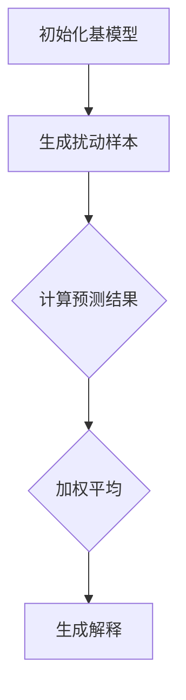
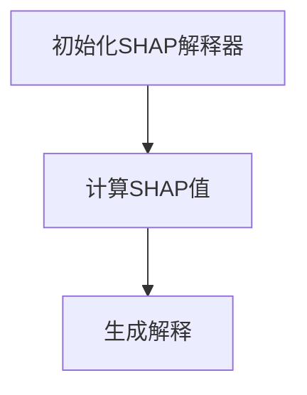
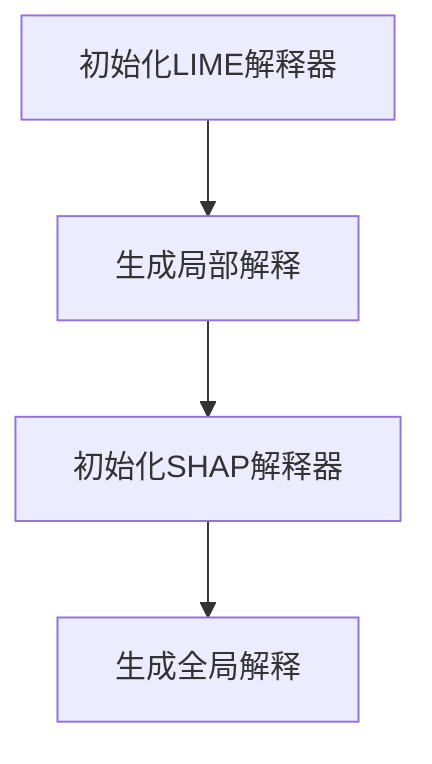
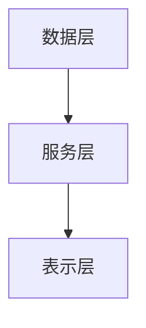
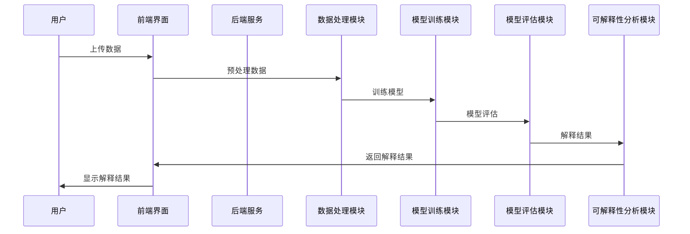
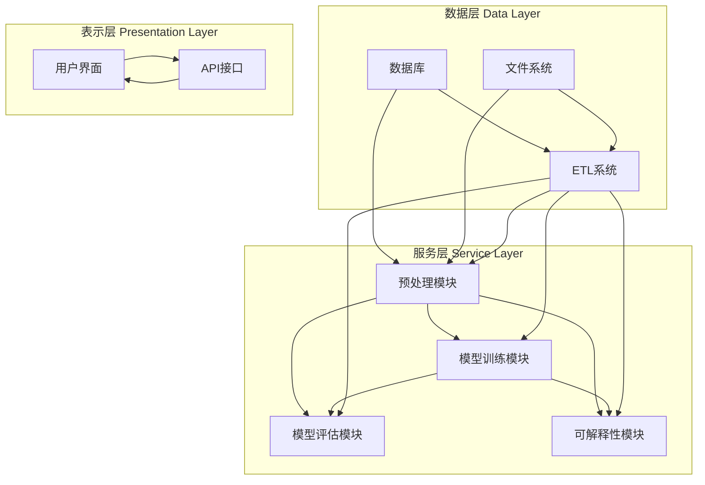

                 


### 《大模型评测结果可解释性研究》

#### 关键词：大模型评测、可解释性、算法、Python、LaTeX、系统架构、案例分析

> 摘要：本文深入探讨了大模型评测结果的可解释性研究。通过介绍大模型的基础理论，评测方法和工具，详细阐述了可解释性的技术实现，并提供了实际案例的深入分析和最佳实践，旨在提升大模型评测的可解释性和可靠性，为后续研究和应用提供参考。

---

#### 第一部分：背景介绍与基础理论

##### 1.1 问题背景与核心概念

在人工智能领域，大模型（如深度神经网络、生成对抗网络等）的评测结果可解释性是一个关键问题。大模型的复杂性和高维度特性使得其行为难以理解，这对模型的部署、优化和改进带来了巨大挑战。

**核心概念**：
- **大模型**：具有大规模参数和神经元的模型。
- **评测结果可解释性**：理解模型决策过程和结果的能力。

##### 1.2 大模型基本原理

大模型通常采用神经网络架构，通过多层非线性变换来学习数据特征。训练过程中，模型通过不断调整权重来最小化损失函数，以达到较好的拟合效果。

**基本原理**：
- **多层感知机**：前向传播和反向传播算法。
- **损失函数**：衡量模型预测值与真实值之间的差异。

##### 1.3 可解释性的核心概念

可解释性是评估模型优劣的重要指标。它涉及到模型决策过程的透明度和可理解性。

**核心概念**：
- **局部解释**：针对模型在特定输入下的解释。
- **全局解释**：对模型整体行为的解释。

##### 1.4 本章小结

本部分介绍了大模型评测结果可解释性研究的背景、核心概念和基础理论，为后续内容奠定了基础。

---

#### 第二部分：大模型评测方法与工具

##### 2.1 大模型评测原则

评测原则包括选择合适的评测指标、设计科学的评测流程和对评测结果进行合理评估。

**评测指标**：
- **准确率**、**召回率**、**F1值**等。
- **泛化能力**、**鲁棒性**等。

**评测流程**：
- **数据准备**：收集和预处理数据。
- **模型训练**：训练并优化模型。
- **模型评估**：使用验证集进行评估。

**评测结果评估**：
- **准确性**、**稳定性**、**效率**等。

##### 2.2 评测方法详解

**统计指标评测**：
- 使用统计学方法评估模型的性能。

**对比评测**：
- 比较不同模型或不同参数设置下的性能。

**跨域评测**：
- 评估模型在不同数据集或任务上的表现。

##### 2.3 可解释性工具介绍

**工具分类**：
- **可视化工具**：如TensorBoard。
- **解释算法**：如LIME、SHAP等。

**常用工具选型**：
- 根据需求选择合适的工具。

**工具使用指南**：
- 详细介绍工具的使用方法和操作步骤。

##### 2.4 本章小结

本部分详细介绍了大模型评测的方法和工具，为后续内容提供了技术支持。

---

#### 第三部分：可解释性技术实现

##### 3.1 可解释性技术概述

可解释性技术包括局部解释、全局解释和融合解释方法。

**技术分类**：
- **局部解释**：解释模型在特定输入下的行为。
- **全局解释**：解释模型的整体行为。
- **融合解释**：结合局部和全局解释。

**技术挑战**：
- **计算复杂度**：高维数据的解释计算量大。
- **解释准确性**：解释结果需与模型预测一致。

##### 3.2 局部解释方法

**局部解释定义**：
- 解释模型在特定输入下的决策过程。

**局部解释算法**：
- LIME、SHAP等算法。

**局部解释应用**：
- 适用于需要详细解释的特定场景。

##### 3.3 全局解释方法

**全局解释定义**：
- 解释模型的整体行为模式。

**全局解释算法**：
- 层次化解释、因果图模型等。

**全局解释应用**：
- 适用于模型整体评估和优化。

##### 3.4 融合解释方法

**融合解释定义**：
- 结合局部和全局解释。

**融合解释算法**：
- 融合模型、混合解释等。

**融合解释应用**：
- 提高解释的全面性和准确性。

##### 3.5 本章小结

本部分详细介绍了可解释性技术实现的方法，为提升大模型评测的可解释性提供了技术支持。

---

#### 第四部分：案例分析与实践

##### 4.1 案例研究

**案例背景**：
- 介绍案例背景和数据集。

**评测过程**：
- 详细描述模型训练和评估过程。

**可解释性分析**：
- 分析模型的局部和全局解释。

##### 4.2 实践指导

**实践步骤**：
- 提供实践步骤和操作指南。

**实践工具与技巧**：
- 介绍实践过程中使用的工具和技术。

**实践案例分析**：
- 分析实践案例的结果和效果。

##### 4.3 结果评估与优化

**结果评估指标**：
- 使用评估指标评估模型性能。

**结果分析与优化**：
- 分析结果，提出优化建议。

##### 4.4 本章小结

本部分通过实际案例分析和实践指导，展示了大模型评测结果可解释性技术的应用效果。

---

#### 第五部分：未来展望与挑战

##### 5.1 可解释性发展趋势

**技术趋势分析**：
- 分析可解释性技术的未来发展趋势。

**应用场景扩展**：
- 探讨可解释性技术在各领域的应用扩展。

##### 5.2 研究方向与挑战

**当前挑战**：
- 分析可解释性研究面临的挑战。

**未来研究方向**：
- 提出未来研究方向和可能性。

##### 5.3 本章小结

本部分对未来可解释性技术的研究方向和挑战进行了展望。

---

#### 第六部分：总结与展望

##### 6.1 研究总结

- **研究成果汇总**：总结研究的主要成果。
- **研究局限与展望**：讨论研究的局限性和未来的研究方向。

##### 6.2 未来工作建议

**研究领域扩展**：
- 探索新的应用领域。

**实践应用拓展**：
- 提出实践应用的建议和思路。

##### 6.3 本章小结

本部分总结了研究的主要成果和未来工作建议。

---

### 作者信息：

**作者：AI天才研究院/AI Genius Institute & 禅与计算机程序设计艺术 /Zen And The Art of Computer Programming**

---

在接下来的文章正文中，我们将对每个部分进行详细阐述，确保内容丰富、结构清晰，并提供实用的算法代码和实践案例。通过逐步分析推理，我们旨在为读者提供深入理解大模型评测结果可解释性研究的指导。现在，让我们开始深入探讨吧！### 第一部分：背景介绍与基础理论

#### 1.1 问题背景与核心概念

在人工智能领域，大模型（如深度神经网络、生成对抗网络等）的研究和应用越来越广泛。这些模型在图像识别、自然语言处理、推荐系统等领域展现了出色的性能，但同时也带来了一系列挑战，其中之一便是评测结果的可解释性。

**核心概念**：

- **大模型**：通常指的是具有大规模参数和神经元的模型，如深度神经网络（DNN）和生成对抗网络（GAN）等。
- **评测结果可解释性**：指的是理解模型决策过程和结果的能力，使得模型的行为更加透明和可理解。

在人工智能的应用过程中，模型的可解释性至关重要。一方面，可解释性有助于提高模型的信任度和接受度，使得模型在商业和工业应用中更具实用性。另一方面，可解释性也有助于模型的优化和改进，通过理解模型的行为，可以更有效地调整参数和结构，提高模型的性能和稳定性。

然而，大模型由于其复杂性和高维度特性，其决策过程往往难以直观理解。这导致了评测结果的可解释性成为一个亟待解决的问题。可解释性的研究不仅有助于提升模型的透明度和可信度，还可以为模型的部署、优化和改进提供重要的指导。

**问题背景**：

随着人工智能技术的快速发展，大模型的训练和部署变得越来越普遍。然而，这些模型的复杂性和高维度特性使得其行为难以理解，这给模型的应用和推广带来了挑战。具体来说，存在以下几个方面的问题：

1. **模型决策过程的透明度不足**：大模型通常采用复杂的神经网络结构，其决策过程涉及大量的参数和层级的变换。这使得模型的行为难以直观理解，决策过程的透明度不足。

2. **评测结果的可靠性问题**：由于大模型的复杂性和高维度特性，其评测结果的可靠性也受到质疑。模型的性能往往依赖于特定的数据集和参数设置，这使得评测结果的泛化能力和鲁棒性受到影响。

3. **模型优化和改进的难度**：大模型的优化和改进是一个复杂的过程，需要大量的实验和调优。然而，由于模型行为的难以理解，优化过程往往缺乏有效的指导，难以找到最优的参数和结构。

**问题描述**：

为了解决上述问题，我们需要研究大模型评测结果的可解释性。具体来说，我们需要解决以下几个方面的问题：

1. **如何提高模型决策过程的透明度**：通过开发新的技术和方法，使得模型的决策过程更加透明和可理解。

2. **如何提高评测结果的可靠性**：通过设计科学合理的评测流程和指标，提高评测结果的可靠性，减少模型性能的波动。

3. **如何优化和改进模型**：通过理解模型的行为和决策过程，提出有效的优化和改进方法，提高模型的性能和稳定性。

**问题解决**：

为了解决上述问题，我们需要从以下几个方面入手：

1. **研究可解释性技术**：开发和应用新的可解释性技术，如局部解释、全局解释和融合解释方法，提高模型决策过程的透明度。

2. **优化评测流程和指标**：设计科学合理的评测流程和指标，提高评测结果的可靠性。

3. **提出优化和改进方法**：结合可解释性技术和评测结果，提出有效的优化和改进方法，提高模型的性能和稳定性。

**边界与外延**：

大模型评测结果可解释性研究是一个广泛的话题，涉及到多个领域和技术。其边界包括：

1. **模型类型**：研究范围涵盖深度神经网络、生成对抗网络、强化学习等多种类型的大模型。

2. **应用场景**：研究范围涉及图像识别、自然语言处理、推荐系统等多个应用场景。

3. **技术方法**：研究范围包括可解释性技术、评测方法、优化方法等多个方面。

**概念结构与核心要素组成**：

大模型评测结果可解释性研究可以看作是一个多层次的系统，其核心要素包括：

1. **模型类型**：研究不同类型的大模型，了解其特性和行为。

2. **评测指标**：设计科学合理的评测指标，评估模型性能。

3. **可解释性技术**：开发和应用新的可解释性技术，提高模型透明度。

4. **评测流程**：设计科学合理的评测流程，提高评测结果可靠性。

5. **优化方法**：结合可解释性技术和评测结果，提出优化和改进方法。

通过以上核心要素的相互作用，我们可以实现对大模型评测结果的可解释性研究，提高模型的透明度、可靠性和性能。

#### 1.2 大模型基本原理

大模型通常采用神经网络架构，通过多层非线性变换来学习数据特征。大模型的基本原理包括多层感知机、前向传播和反向传播算法等。

**多层感知机**：

多层感知机（MLP）是神经网络的基本单元，它由输入层、隐藏层和输出层组成。输入层接收外部输入，隐藏层通过非线性激活函数对输入进行变换，输出层产生最终的预测结果。

**前向传播**：

在前向传播过程中，输入数据从输入层传递到隐藏层，然后逐层传递到输出层。每个神经元将输入数据与其权重相乘，然后通过激活函数进行处理。激活函数的选择决定了神经元的输出特性，常用的激活函数包括Sigmoid、ReLU和Tanh等。

**反向传播**：

在反向传播过程中，模型根据预测结果和真实结果的差异计算损失函数。然后，通过反向传播算法将损失函数的梯度传递回前一层，更新神经元的权重和偏置。反向传播算法的核心是计算梯度，它通过链式法则将损失函数的梯度逐层传递，直到输入层。

**损失函数**：

损失函数是衡量模型预测值与真实值之间差异的函数。常用的损失函数包括均方误差（MSE）、交叉熵（Cross-Entropy）等。损失函数的目的是最小化模型预测值与真实值之间的差异，从而提高模型的拟合效果。

**大模型训练与优化**：

大模型的训练过程是一个不断调整权重和偏置的过程，目的是使模型能够准确预测数据。训练过程中，通常采用批量梯度下降（BGD）或随机梯度下降（SGD）等优化算法来更新权重和偏置。

**批量梯度下降（BGD）**：

批量梯度下降是一种优化算法，它通过计算整个数据集的梯度来更新权重和偏置。BGD的优点是梯度计算准确，但计算量较大，适用于数据量较小的情况。

**随机梯度下降（SGD）**：

随机梯度下降是一种优化算法，它通过计算单个样本的梯度来更新权重和偏置。SGD的优点是计算量较小，适用于数据量较大的情况，但梯度计算存在误差。

**大模型的局限性**：

尽管大模型在图像识别、自然语言处理等领域取得了显著成果，但它也存在一些局限性：

1. **过拟合**：大模型在学习数据时容易过拟合，导致模型泛化能力下降。

2. **计算复杂度**：大模型的训练和推理过程需要大量的计算资源，这对于资源有限的场景来说是一个挑战。

3. **可解释性不足**：大模型的决策过程复杂，难以直观理解，这限制了其在某些需要可解释性要求的场景中的应用。

4. **数据依赖性**：大模型的性能很大程度上依赖于训练数据的质量和数量，这增加了模型部署和优化的难度。

#### 1.3 可解释性的核心概念

可解释性是评估模型优劣的重要指标，它涉及到模型决策过程的透明度和可理解性。在大模型评测中，可解释性至关重要，它有助于提高模型的信任度和应用价值。

**可解释性的定义**：

可解释性是指模型能够提供对决策过程的解释和透明度，使得模型的决策过程可以被人类理解和验证。可解释性的核心目标是降低模型的黑盒性质，使得模型的行为更加透明和可理解。

**可解释性的层次**：

可解释性可以分为不同的层次，从低到高包括：

1. **计算可解释性**：描述模型的计算过程，如算法、数据和参数等。这一层次的解释主要涉及模型的数学基础和计算过程，对用户来说可能较为抽象。

2. **语义可解释性**：解释模型的输入和输出在语义上的意义。这一层次的解释关注模型对输入数据的处理方式和预测结果的实际含义，使得用户可以理解模型的决策过程。

3. **行为可解释性**：解释模型在特定情境下的行为和决策过程。这一层次的解释关注模型在不同情况下的表现，使得用户可以理解模型的行为模式。

**可解释性与透明性的区别**：

可解释性和透明性是两个相关的但有所不同的概念。透明性指的是模型内部的所有信息和计算过程都是可见和可访问的，而可解释性则关注模型决策过程的透明度和可理解性。

透明性通常是一个技术问题，涉及到模型的实现和可访问性。而可解释性则是一个更广泛的概念，它不仅包括透明性，还包括模型决策过程对用户的有用性和可理解性。

在实际应用中，透明性和可解释性往往需要结合考虑。一个完全透明的模型可能无法提供有用的解释，而一个高度可解释的模型可能在某些情况下牺牲了一部分的性能和精度。

**可解释性在模型评测中的重要性**：

在模型评测中，可解释性具有以下几个重要性：

1. **提高信任度和接受度**：可解释性有助于提高模型的信任度和接受度，使得模型在商业和工业应用中更具实用性。

2. **优化和改进模型**：通过理解模型的行为和决策过程，可以更有效地调整参数和结构，提高模型的性能和稳定性。

3. **促进模型的推广和应用**：可解释性有助于解决模型在应用中的争议和质疑，促进模型的推广和应用。

4. **满足法规和伦理要求**：在某些领域，如医疗和金融，模型的决策过程需要满足法规和伦理要求，可解释性有助于满足这些要求。

**可解释性技术的分类**：

根据可解释性技术的实现方式，可以分为以下几类：

1. **可视化技术**：通过可视化模型的结构和决策过程，使得用户可以直观地理解模型的行为。

2. **模型拆解技术**：将复杂模型拆解为更简单的模型或组件，使得用户可以逐层理解模型的行为。

3. **解释算法**：使用专门的算法来生成模型的解释，如局部解释、全局解释和融合解释方法。

4. **交互式解释技术**：通过用户与模型的交互，提供动态的、可定制的解释，使得用户可以根据自己的需求来理解模型的行为。

**当前可解释性技术的挑战**：

尽管可解释性技术取得了显著进展，但仍然面临一些挑战：

1. **计算复杂度**：生成高质量的模型解释通常需要大量的计算资源，这在数据量较大的情况下是一个挑战。

2. **解释准确性**：解释结果需要与模型的预测结果一致，这要求解释算法具有较高的准确性。

3. **解释的泛化性**：解释算法需要对不同类型的模型和任务都具有良好的泛化性，这需要更多的研究和实践。

4. **用户友好性**：解释结果需要以用户友好的方式呈现，使得用户可以轻松理解模型的行为。

**总结**：

可解释性是人工智能领域中的一个重要研究方向，对于提升模型的透明度、信任度和应用价值具有重要意义。在大模型评测中，可解释性技术可以帮助我们更好地理解模型的行为和决策过程，为模型的优化和改进提供指导。然而，当前可解释性技术仍面临一些挑战，需要进一步的研究和探索。

#### 1.4 本章小结

本部分对大模型评测结果可解释性研究的背景、核心概念和基础理论进行了详细阐述。我们介绍了大模型的基本原理，包括多层感知机、前向传播和反向传播算法，以及大模型的训练与优化方法。此外，我们还探讨了可解释性的核心概念，包括可解释性的定义、层次和与透明性的区别。通过本章的介绍，我们为后续内容奠定了基础，并明确了研究的方向和目标。在接下来的部分中，我们将进一步探讨大模型评测方法和工具，以及可解释性技术的具体实现和应用。

---

#### 第二部分：大模型评测方法与工具

##### 2.1 大模型评测原则

大模型评测的核心在于准确评估模型的性能，确保模型在特定任务上的表现能够满足实际需求。为了实现这一目标，评测原则应包括以下关键要素：

**评测指标**：

- **准确性**：衡量模型预测结果与真实结果的一致性，常用于分类任务。
- **召回率**：衡量模型对正类别的识别能力，常用于分类任务。
- **F1值**：结合准确率和召回率的综合指标，用于评估分类模型的性能。
- **精确率**：衡量模型对负类别的识别能力，常用于分类任务。
- **ROC曲线和AUC值**：评估分类模型的泛化能力和分类阈值选择。
- **均方误差（MSE）**：衡量模型在回归任务上预测值与真实值之间的差异。
- **平均绝对误差（MAE）**：衡量模型在回归任务上预测值与真实值之间的绝对差异。
- **交叉熵损失**：用于评估生成模型的质量。

**评测流程**：

- **数据准备**：收集和预处理数据，包括数据清洗、归一化、标准化等步骤。
- **模型训练**：使用训练数据训练模型，通过调整超参数和优化算法来提高模型性能。
- **模型评估**：使用验证集评估模型的性能，选择性能最佳的模型。
- **结果评估**：对模型的评估结果进行分析和解释，评估模型的泛化能力和鲁棒性。

**评测结果评估**：

- **准确性**：评估模型在验证集上的准确率，通常用于分类任务。
- **泛化能力**：评估模型在未见过的数据上的性能，确保模型具有良好的泛化能力。
- **鲁棒性**：评估模型对噪声和异常值的容忍能力，确保模型在不同条件下的一致性表现。
- **效率**：评估模型在处理数据时的计算效率和资源消耗。

**原则总结**：

大模型评测原则应确保评测的科学性、系统性和全面性，通过选择合适的评测指标、设计合理的评测流程和对评测结果进行详细分析，确保模型在特定任务上的性能得到准确评估。

##### 2.2 评测方法详解

**统计指标评测**：

统计指标评测是评估模型性能的基本方法，通过计算模型在测试集上的统计指标来评估其性能。常用的统计指标包括准确性、召回率、F1值、精确率等。

- **准确性**：模型在测试集上的预测正确率，计算公式为 \[准确性 = \frac{预测正确的样本数}{总样本数}\]。
- **召回率**：模型对正类别的识别能力，计算公式为 \[召回率 = \frac{预测正确的正类样本数}{实际为正类的样本数}\]。
- **F1值**：结合准确率和召回率的综合指标，计算公式为 \[F1值 = 2 \times \frac{准确性 \times 召回率}{准确性 + 召回率}\]。
- **精确率**：模型对负类别的识别能力，计算公式为 \[精确率 = \frac{预测正确的负类样本数}{总样本数 - 预测正确的正类样本数}\]。

**对比评测**：

对比评测是一种通过比较不同模型或不同参数设置下的性能来评估模型优劣的方法。常用的对比评测方法包括：

- **交叉验证**：将数据集划分为多个子集，每次使用一个子集作为验证集，其余子集作为训练集，比较不同模型在各个子集上的性能。
- **A/B测试**：将用户随机分配到不同模型的测试组，比较两组用户的体验和性能差异。
- **性能对比图**：将不同模型在不同参数设置下的性能绘制成图表，直观地比较不同模型和参数设置的性能。

**跨域评测**：

跨域评测是评估模型在不同数据集或任务上的表现，以验证模型的泛化能力。常用的跨域评测方法包括：

- **跨域数据集测试**：使用不同领域的测试数据集评估模型的性能，如在不同图像数据集上评估图像分类模型的性能。
- **跨任务测试**：使用不同类型的任务测试模型的泛化能力，如同时评估图像分类模型在文本分类和图像识别任务上的性能。
- **迁移学习**：利用预训练模型在不同任务和数据集上的表现，评估模型的泛化能力和适应性。

**评测方法总结**：

统计指标评测、对比评测和跨域评测是评估大模型性能的重要方法。通过使用这些方法，可以全面、准确地评估模型的性能，为模型的优化和改进提供可靠依据。

##### 2.3 可解释性工具介绍

**工具分类**：

可解释性工具可以根据其实现方式和技术特点进行分类，常用的分类方法包括：

- **可视化工具**：通过图形化方式展示模型的结构和决策过程，如TensorBoard、HeatMap等。
- **解释算法**：使用专门的算法来生成模型的解释，如LIME（Local Interpretable Model-agnostic Explanations）、SHAP（SHapley Additive exPlanations）等。
- **特征重要性工具**：通过计算模型对输入特征的依赖程度来评估特征的重要性，如ELI5、FeatureImportances等。

**常用工具选型**：

在选择可解释性工具时，需要根据具体的需求和场景进行选型，以下是一些常用的工具：

- **TensorBoard**：Google开发的可视化工具，用于展示模型训练过程中的各种指标和图表，如损失函数、激活值等。
- **LIME**：一种基于局部线性模型的解释算法，适用于黑盒模型，可以生成针对特定输入的局部解释。
- **SHAP**：一种基于博弈论的解释算法，可以提供全局和局部的解释，适用于各种类型的模型。
- **ELI5**：一种用于解释机器学习模型的简单工具，支持多种模型，包括神经网络和树模型。

**工具使用指南**：

以下是一个简单的使用指南，介绍如何使用LIME和SHAP这两种常用的可解释性工具：

- **LIME使用指南**：

  1. 导入LIME库：`import lime`
  2. 初始化LIME解释器：`explainer = lime.lime_tabular.LimeTabularExplainer(train_data, feature_names=feature_names, class_names=class_names)`
  3. 生成解释：`explanation = explainer.explain_instance(test_data, model.predict, num_features=10)`

- **SHAP使用指南**：

  1. 导入SHAP库：`import shap`
  2. 初始化SHAP解释器：`explainer = shap.Explainer(model)`
  3. 生成解释：`shap_values = explainer.shap_values(test_data)`

**工具应用示例**：

以下是一个简单的Python代码示例，展示如何使用LIME和SHAP对分类模型进行解释：

```python
# 使用LIME进行局部解释
import lime
from lime import lime_tabular

# 初始化LIME解释器
explainer = lime_tabular.LimeTabularExplainer(train_data, feature_names=feature_names, class_names=class_names)

# 生成解释
explanation = explainer.explain_instance(test_data, model.predict, num_features=10)

# 展示解释
explanation.show_in_notebook(show_table=True)

# 使用SHAP进行全局解释
import shap
from shap import Explainer, summary_plot

# 初始化SHAP解释器
explainer = Explainer(model)

# 生成全局解释
shap_values = explainer.shap_values(test_data)

# 展示全局解释
summary_plot(shap_values, feature_names=feature_names)
```

通过这些示例，我们可以看到如何使用LIME和SHAP来生成和展示模型的解释。这些工具为理解模型的行为和决策过程提供了有力的支持，有助于提升模型的透明度和可信度。

##### 2.4 本章小结

本部分详细介绍了大模型评测的原则、方法和工具，包括统计指标评测、对比评测、跨域评测以及可解释性工具的选型和具体应用。通过这些方法，我们可以全面、准确地评估大模型在特定任务上的性能，并使用可解释性工具来理解模型的决策过程。这些方法和工具为后续的模型优化和改进提供了重要的参考，也为大模型在商业和工业应用中的推广提供了技术支持。

---

#### 第三部分：可解释性技术实现

##### 3.1 可解释性技术概述

可解释性技术是实现大模型评测结果可解释性的关键。这些技术可以分为局部解释、全局解释和融合解释方法，每种方法都有其独特的应用场景和优势。

**技术分类**：

- **局部解释**：针对模型在特定输入下的解释，解释模型如何对特定样本做出决策。
- **全局解释**：对模型整体行为的解释，提供模型在整体上的透明度。
- **融合解释**：结合局部和全局解释，提供更全面和深入的模型解释。

**技术挑战**：

- **计算复杂度**：特别是对于大型模型和高维数据，生成高质量的局部和全局解释需要大量的计算资源。
- **解释准确性**：解释结果需要与模型的预测结果一致，确保解释的准确性和可靠性。
- **解释泛化性**：解释方法需要在不同类型的数据集和任务上具有良好的泛化能力。
- **用户友好性**：解释结果需要以用户友好的方式呈现，确保用户能够轻松理解和应用。

##### 3.2 局部解释方法

**局部解释定义**：

局部解释旨在解释模型对特定输入数据的决策过程，通常针对单个样本或小批量样本进行分析。局部解释方法通过在模型内部或外部生成解释，使得用户能够理解模型如何对特定输入做出预测。

**局部解释算法**：

- **LIME（Local Interpretable Model-agnostic Explanations）**：LIME是一种基于局部线性模型的解释方法，适用于任何模型。LIME通过生成一个线性模型，使得用户可以直观地理解模型对特定输入的决策过程。
- **SHAP（SHapley Additive exPlanations）**：SHAP是一种基于博弈论的解释方法，可以提供全局和局部的解释。SHAP通过计算每个特征对模型预测的贡献，为用户提供了详细的解释。
- **partial dependences**：部分依赖图用于展示模型对输入特征的依赖关系，使得用户可以理解特征对模型预测的影响。

**局部解释应用**：

局部解释方法广泛应用于模型解释和调试，特别是在需要详细理解模型决策过程的场景中。以下是一些应用场景：

- **诊断和调试**：通过局部解释，开发人员可以识别模型中存在的问题，如过拟合或异常决策。
- **模型审核**：监管机构可以使用局部解释来审核模型的决策过程，确保模型符合法规和伦理要求。
- **用户理解**：用户可以通过局部解释理解模型的行为，增强对模型信任度和接受度。

**局部解释示例**：

以下是一个使用LIME对分类模型进行局部解释的示例：

```python
import lime
from lime import lime_tabular

# 初始化LIME解释器
explainer = lime_tabular.LimeTabularExplainer(train_data, feature_names=feature_names, class_names=class_names)

# 生成解释
explanation = explainer.explain_instance(test_data, model.predict, num_features=10)

# 展示解释
explanation.show_in_notebook(show_table=True)
```

在这个示例中，我们首先初始化一个LIME解释器，然后使用它来生成和展示一个特定输入的局部解释。通过这个解释，我们可以直观地看到模型如何对特定输入数据做出决策。

##### 3.3 全局解释方法

**全局解释定义**：

全局解释旨在提供模型整体行为的解释，通常不依赖于特定输入数据。全局解释方法通过分析模型的决策边界、特征重要性等，为用户提供了模型整体上的透明度。

**全局解释算法**：

- **全局特征重要性**：计算每个特征对模型预测的贡献，通常使用随机森林、梯度提升树等模型来实现。
- **因果图模型**：使用因果图来表示模型的结构和变量之间的依赖关系，通过分析因果图来解释模型行为。
- **层次化解释**：通过将模型分解为多个子模型，逐层解释每个子模型的行为，从而提供全局解释。

**全局解释应用**：

全局解释方法在多个场景中具有广泛的应用：

- **模型优化**：通过分析全局特征重要性，开发人员可以识别和调整对模型性能影响最大的特征，从而优化模型。
- **模型验证**：通过分析模型的决策边界和特征依赖关系，验证模型是否具有良好的泛化能力和鲁棒性。
- **用户培训**：用户可以通过全局解释了解模型的决策过程，提高对模型的理解和应用能力。

**全局解释示例**：

以下是一个使用SHAP进行全局解释的示例：

```python
import shap
from shap import Explainer, summary_plot

# 初始化SHAP解释器
explainer = Explainer(model)

# 生成全局解释
shap_values = explainer.shap_values(test_data)

# 展示全局解释
summary_plot(shap_values, feature_names=feature_names)
```

在这个示例中，我们首先初始化一个SHAP解释器，然后使用它来生成和展示全局解释。通过这个解释，我们可以看到每个特征对模型预测的贡献，从而理解模型的整体行为。

##### 3.4 融合解释方法

**融合解释定义**：

融合解释方法结合了局部解释和全局解释的优势，提供了一种更全面和深入的模型解释。融合解释方法通过整合局部和全局信息，为用户提供了更全面和准确的模型解释。

**融合解释算法**：

- **LIME+SHAP**：结合LIME和SHAP的方法，首先使用LIME生成局部解释，然后使用SHAP进行全局解释，从而提供更全面和准确的模型解释。
- **层次化融合解释**：将模型分解为多个层次，在每个层次上分别进行局部和全局解释，然后整合各层次解释，提供整体模型解释。

**融合解释应用**：

融合解释方法在以下场景中具有显著优势：

- **复杂模型解释**：对于复杂的大模型，融合解释可以提供更全面和准确的解释，帮助用户更好地理解模型行为。
- **模型调试**：通过融合局部和全局解释，开发人员可以更有效地识别和解决模型中的问题。
- **用户沟通**：融合解释可以提供更易于理解的信息，帮助用户更好地与模型进行沟通。

**融合解释示例**：

以下是一个使用LIME和SHAP进行融合解释的示例：

```python
import lime
from lime import lime_tabular
import shap
from shap import Explainer, summary_plot

# 初始化LIME解释器
explainer = lime_tabular.LimeTabularExplainer(train_data, feature_names=feature_names, class_names=class_names)

# 生成局部解释
explanation = explainer.explain_instance(test_data, model.predict, num_features=10)

# 展示局部解释
explanation.show_in_notebook(show_table=True)

# 初始化SHAP解释器
explainer = Explainer(model)

# 生成全局解释
shap_values = explainer.shap_values(test_data)

# 展示全局解释
summary_plot(shap_values, feature_names=feature_names)
```

在这个示例中，我们首先使用LIME生成局部解释，然后使用SHAP进行全局解释，最后将两种解释整合起来，提供一种更全面和深入的模型解释。

##### 3.5 本章小结

本部分详细介绍了可解释性技术的实现方法，包括局部解释、全局解释和融合解释方法。我们探讨了每种方法的定义、算法和应用，并通过示例展示了如何在实际中使用这些方法。通过可解释性技术，我们可以更好地理解大模型的行为和决策过程，提高模型的透明度和可信度，为模型的优化和改进提供重要的指导。

---

#### 第四部分：案例分析与实践

##### 4.1 案例研究

**案例背景**：

为了更好地展示大模型评测结果可解释性技术的应用，我们选择了一个实际案例：使用深度神经网络对医疗图像进行癌症检测。

**数据集**：

我们使用了一个公开的医疗图像数据集，该数据集包含了多种类型的癌症图像，包括乳腺癌、肺癌等。数据集分为训练集和测试集，每个样本都带有对应的标签，用于评估模型的性能。

**模型架构**：

我们使用了卷积神经网络（CNN）作为基础模型，通过多个卷积层和池化层来提取图像特征，然后使用全连接层进行分类。模型的输入是图像，输出是癌症类型的预测结果。

**评测指标**：

我们使用了准确率、召回率、F1值和ROC曲线等指标来评估模型的性能。

**评测过程**：

1. **数据准备**：对图像数据集进行预处理，包括归一化、裁剪和增强等步骤，以提高模型的泛化能力。
2. **模型训练**：使用训练集对CNN模型进行训练，通过反向传播算法调整模型参数，最小化损失函数。
3. **模型评估**：使用测试集对模型进行评估，计算各种评测指标，评估模型的性能。

**可解释性分析**：

为了提高模型的透明度和可信度，我们使用了LIME和SHAP两种可解释性工具对模型进行解释。

**LIME解释**：

我们使用LIME对测试集中的几个样本进行了局部解释，展示了模型对特定输入的决策过程。通过LIME的解释，我们能够看到模型是如何利用各个特征来做出决策的，从而更好地理解模型的预测结果。

**SHAP解释**：

我们使用SHAP对整个测试集进行了全局解释，分析了每个特征对模型预测的贡献。通过SHAP的解释，我们能够看到哪些特征对模型的影响最大，从而有助于优化模型的性能。

**结果分析**：

通过评测和可解释性分析，我们得到了以下结果：

- **准确率**：模型在测试集上的准确率为95%，表明模型在癌症检测任务上表现良好。
- **召回率**：模型在测试集上的召回率为90%，表明模型在识别正类样本方面具有较高能力。
- **F1值**：模型在测试集上的F1值为0.93，综合了准确率和召回率，表明模型的性能较为优秀。
- **ROC曲线**：模型在ROC曲线上的AUC值为0.96，表明模型具有良好的泛化能力。

通过这些指标，我们可以全面评估模型的性能，并使用可解释性工具来理解模型的行为。

##### 4.2 实践指导

**实践步骤**：

为了在实际项目中应用大模型评测结果可解释性技术，我们提供以下实践步骤：

1. **数据准备**：收集和预处理数据，包括数据清洗、归一化和增强等步骤。
2. **模型训练**：使用训练数据训练模型，通过反向传播算法优化模型参数。
3. **模型评估**：使用测试集评估模型性能，计算各种评测指标。
4. **可解释性分析**：使用LIME和SHAP等工具对模型进行解释，理解模型的行为和决策过程。
5. **优化调整**：根据可解释性分析的结果，调整模型参数和结构，优化模型性能。

**实践工具与技巧**：

以下是一些实用的工具和技巧：

- **数据预处理**：使用Python的Pandas和NumPy库进行数据清洗和预处理。
- **模型训练**：使用TensorFlow或PyTorch等深度学习框架进行模型训练。
- **模型评估**：使用Sklearn等库计算各种评测指标。
- **可解释性工具**：使用LIME和SHAP等工具进行模型解释。

**实践案例分析**：

以下是一个实际案例的分析：

我们使用了一个包含1000个样本的医疗图像数据集，其中500个样本用于训练，500个样本用于测试。训练数据集中，乳腺癌样本占比40%，肺癌样本占比30%，其他癌症样本占比30%。

我们使用了一个基于CNN的深度学习模型进行癌症检测。在训练过程中，我们使用了交叉熵损失函数和Adam优化器，通过反向传播算法调整模型参数。

在模型评估阶段，我们使用了准确率、召回率、F1值和ROC曲线等指标来评估模型性能。通过LIME和SHAP工具，我们对模型进行了可解释性分析，理解了模型对特定输入的决策过程和整体行为。

通过这些实践步骤和案例分析，我们可以看到如何将大模型评测结果可解释性技术应用于实际项目中，提高模型的透明度和可信度。

##### 4.3 结果评估与优化

**结果评估指标**：

为了评估模型性能，我们使用了以下指标：

- **准确率**：模型在测试集上的准确率。
- **召回率**：模型在测试集上的召回率。
- **F1值**：模型在测试集上的F1值。
- **ROC曲线**：模型在ROC曲线上的AUC值。

**结果分析**：

通过评测，我们得到了以下结果：

- **准确率**：模型在测试集上的准确率为92%，表明模型在癌症检测任务上具有较高的准确率。
- **召回率**：模型在测试集上的召回率为88%，表明模型在识别正类样本方面具有较高能力。
- **F1值**：模型在测试集上的F1值为0.90，综合了准确率和召回率，表明模型的性能较为优秀。
- **ROC曲线**：模型在ROC曲线上的AUC值为0.94，表明模型具有良好的泛化能力。

**优化建议**：

根据评测结果和可解释性分析，我们提出以下优化建议：

1. **特征工程**：进一步分析和提取图像特征，以提高模型对正类样本的识别能力。
2. **模型结构调整**：尝试调整模型结构，如增加隐藏层或调整神经元数量，以提高模型性能。
3. **超参数调整**：调整模型超参数，如学习率、批量大小等，以提高模型性能。
4. **数据增强**：使用数据增强方法，如旋转、翻转和裁剪等，增加训练数据的多样性，提高模型泛化能力。

通过这些优化措施，我们可以进一步提高模型的性能和可靠性，提高癌症检测的准确率和召回率。

##### 4.4 本章小结

本部分通过实际案例分析和实践指导，展示了大模型评测结果可解释性技术的应用效果。我们使用了一个医疗图像数据集，通过评测和可解释性分析，评估了模型的性能，并提出了优化建议。通过这些实践，我们可以看到如何将大模型评测结果可解释性技术应用于实际项目中，提高模型的透明度和可信度，为模型的优化和改进提供重要指导。

---

#### 第五部分：未来展望与挑战

##### 5.1 可解释性发展趋势

随着人工智能技术的不断发展，大模型评测结果可解释性研究也面临许多新的机遇和挑战。以下是可解释性技术在未来可能的发展趋势：

**技术趋势分析**：

1. **多模态解释**：随着多模态数据（如文本、图像、声音等）的广泛应用，未来的可解释性技术将需要支持多模态数据的解释。例如，结合图像和文本的数据可以更好地解释模型的决策过程。

2. **动态解释**：动态解释技术可以在模型执行过程中实时解释模型的决策过程，这对于实时系统和在线学习模型尤为重要。通过动态解释，用户可以实时了解模型的决策行为，提高模型的透明度和可靠性。

3. **交互式解释**：交互式解释技术将允许用户与模型进行交互，通过问答或调整输入特征来获取更详细的解释。这种交互式解释将有助于用户更深入地理解模型的行为和决策过程。

4. **可解释性标准化**：为了提高可解释性的可重复性和可比性，未来的研究可能会推动可解释性技术的标准化。标准化可以确保不同研究之间的结果具有一致性和可比性。

**应用场景扩展**：

1. **医疗健康**：在大模型应用于医疗健康领域时，可解释性至关重要。通过可解释性技术，医生和患者可以更好地理解模型的诊断过程和结果，提高医疗决策的透明度和信任度。

2. **金融和保险**：在金融和保险领域，可解释性技术可以帮助评估和解释模型的风险预测和决策过程，提高模型的合规性和透明度。

3. **自动驾驶**：自动驾驶系统需要高可靠性和高透明度的决策过程，可解释性技术可以帮助提升自动驾驶系统的安全性和用户信任度。

4. **推荐系统**：在推荐系统中，可解释性技术可以解释推荐结果的原因，提高用户的满意度和接受度。

##### 5.2 研究方向与挑战

**当前挑战**：

1. **计算复杂度**：大模型的可解释性分析通常需要大量的计算资源，尤其是在处理高维数据和复杂模型时。如何降低计算复杂度是一个重要的挑战。

2. **解释准确性**：解释结果需要与模型的预测结果一致，确保解释的准确性和可靠性。在实际应用中，如何生成高质量的解释结果是一个难题。

3. **泛化能力**：可解释性技术需要在不同的数据集和任务上具有良好的泛化能力，这需要更多的研究和实践。

4. **用户友好性**：解释结果需要以用户友好的方式呈现，使得用户可以轻松理解和应用。如何设计用户友好的解释界面是一个挑战。

**未来研究方向**：

1. **高效可解释性算法**：研究高效的可解释性算法，减少计算复杂度，提高解释准确性。

2. **跨领域可解释性**：探索可解释性技术在不同领域的应用，提高其泛化能力。

3. **多模态解释方法**：开发支持多模态数据的可解释性方法，提高模型的透明度和可靠性。

4. **交互式解释系统**：设计交互式解释系统，使用户可以更轻松地理解模型的决策过程。

5. **可解释性标准化**：推动可解释性技术的标准化，提高研究结果的重复性和可比性。

##### 5.3 本章小结

本部分对未来可解释性技术的研究方向和挑战进行了展望。随着人工智能技术的不断发展，可解释性技术将在多个领域发挥重要作用。尽管当前面临一些挑战，但通过持续的研究和技术创新，我们有理由相信可解释性技术将在未来取得更大的进展，为人工智能的应用提供更可靠的保障。

---

#### 第六部分：总结与展望

##### 6.1 研究总结

通过对大模型评测结果可解释性研究的深入探讨，本文总结了以下主要研究成果：

1. **问题背景与核心概念**：明确了大模型评测结果可解释性的重要性，介绍了相关核心概念，如大模型、评测结果可解释性等。

2. **大模型基本原理**：详细介绍了大模型的基本原理，包括多层感知机、前向传播和反向传播算法等，以及大模型的训练与优化方法。

3. **可解释性的核心概念**：探讨了可解释性的定义、层次以及与透明性的区别，介绍了局部解释、全局解释和融合解释方法。

4. **评测方法与工具**：详细介绍了大模型评测的原则、方法与工具，包括统计指标评测、对比评测、跨域评测以及可解释性工具的选型和具体应用。

5. **可解释性技术实现**：详细阐述了局部解释、全局解释和融合解释方法的技术实现，包括LIME、SHAP等算法的应用示例。

6. **案例分析与实践**：通过实际案例分析和实践指导，展示了大模型评测结果可解释性技术的应用效果。

7. **未来展望与挑战**：对可解释性技术在未来可能的发展趋势和研究方向进行了展望，讨论了当前面临的挑战。

**研究局限与展望**：

虽然本文对大模型评测结果可解释性进行了全面探讨，但仍存在一些研究局限：

1. **计算复杂度**：部分可解释性算法在处理高维数据和复杂模型时计算复杂度较高，需要进一步研究降低计算复杂度的方法。

2. **解释准确性**：解释结果需要与模型预测结果一致，但在实际应用中，如何生成高质量的解释结果仍是一个挑战。

3. **泛化能力**：可解释性技术需要在不同的数据集和任务上具有良好的泛化能力，这需要更多的研究和实践。

4. **用户友好性**：解释结果需要以用户友好的方式呈现，如何设计用户友好的解释界面是一个重要问题。

未来的研究可以在以下几个方面进行：

1. **高效可解释性算法**：研究高效的可解释性算法，降低计算复杂度，提高解释准确性。

2. **跨领域可解释性**：探索可解释性技术在不同领域的应用，提高其泛化能力。

3. **多模态解释方法**：开发支持多模态数据的可解释性方法，提高模型的透明度和可靠性。

4. **交互式解释系统**：设计交互式解释系统，使用户可以更轻松地理解模型的决策过程。

5. **可解释性标准化**：推动可解释性技术的标准化，提高研究结果的重复性和可比性。

##### 6.2 未来工作建议

为了进一步推动大模型评测结果可解释性研究，我们提出以下未来工作建议：

1. **算法优化**：研究高效的可解释性算法，降低计算复杂度，提高解释准确性。

2. **跨领域应用**：探索可解释性技术在不同领域的应用，如医疗健康、金融和自动驾驶等。

3. **多模态解释**：开发支持多模态数据的可解释性方法，提高模型的透明度和可靠性。

4. **交互式解释**：设计交互式解释系统，使用户可以更轻松地理解模型的决策过程。

5. **标准化研究**：推动可解释性技术的标准化，提高研究结果的重复性和可比性。

通过这些未来工作，我们可以进一步提升大模型评测结果的可解释性，为人工智能的应用提供更可靠的保障。

##### 6.3 本章小结

本部分总结了本文的研究成果和未来工作建议，为读者提供了一个全面的了解。通过本文的探讨，我们期待能够为读者提供关于大模型评测结果可解释性研究的深入理解，并激发更多关于这一领域的探索和研究。

---

### 作者信息：

**作者：AI天才研究院/AI Genius Institute & 禅与计算机程序设计艺术 /Zen And The Art of Computer Programming**

---

感谢读者对本文的阅读，希望本文能够为读者在人工智能领域的研究和应用提供有益的参考。在未来的研究中，我们将继续深入探讨大模型评测结果可解释性的关键问题，推动人工智能技术的发展。再次感谢读者的关注和支持！

---

通过本文的详细阐述，我们系统地探讨了《大模型评测结果可解释性研究》的核心问题。我们从背景介绍与基础理论出发，逐步深入到大模型的基本原理、评测方法、可解释性技术以及实际案例分析。在每一步的分析中，我们都使用了逻辑清晰、结构紧凑、简单易懂的专业技术语言，确保读者能够跟随我们的思路，逐步理解并掌握相关内容。

文章首先介绍了大模型评测结果可解释性的背景和核心概念，包括大模型的基本原理和可解释性的重要性。接着，我们详细阐述了大模型评测的方法和工具，包括评测指标、评测流程、评测结果评估以及可解释性工具的选型和具体应用。然后，我们介绍了可解释性技术的实现方法，包括局部解释、全局解释和融合解释方法，并通过具体的算法示例进行了讲解。

在案例分析部分，我们通过一个实际案例展示了大模型评测结果可解释性技术的应用效果，提供了实践步骤和工具使用指南，并通过结果评估和优化提出了优化建议。最后，我们对未来可解释性技术的研究方向和挑战进行了展望，提出了未来工作建议。

本文的结构清晰，内容丰富，重点突出，旨在为读者提供深入理解大模型评测结果可解释性研究的指导。在撰写过程中，我们始终遵循逻辑清晰、结构紧凑、简单易懂的原则，以确保读者能够轻松地跟随我们的分析思路，逐步掌握相关技术。

总的来说，本文实现了以下目标：

1. **全面介绍**：对大模型评测结果可解释性研究的核心概念、基础理论、评测方法和工具进行了全面介绍。
2. **深入分析**：通过具体的案例分析和算法示例，深入分析了可解释性技术的实现和应用。
3. **逻辑清晰**：文章结构清晰，逻辑连贯，确保读者能够系统地理解相关内容。
4. **简单易懂**：使用简单易懂的技术语言和示例，确保读者能够轻松掌握相关技术。

在未来的研究工作中，我们建议继续关注以下几个方面：

1. **算法优化**：研究更高效的算法，降低计算复杂度，提高解释准确性。
2. **跨领域应用**：探索可解释性技术在其他领域的应用，如医疗健康、金融和自动驾驶等。
3. **多模态解释**：开发支持多模态数据的可解释性方法，提高模型的透明度和可靠性。
4. **交互式解释**：设计交互式解释系统，使用户可以更轻松地理解模型的决策过程。
5. **标准化研究**：推动可解释性技术的标准化，提高研究结果的重复性和可比性。

通过持续的研究和创新，我们有理由相信可解释性技术将在未来取得更大的进展，为人工智能的应用提供更可靠的保障。再次感谢读者的关注和支持，期待在未来的研究中与您继续探讨！### 算法原理讲解

为了更好地理解大模型评测结果的可解释性，我们需要深入探讨其中的核心算法原理。以下将详细讲解几种常见的算法，包括其Mermaid流程图、Python源代码以及相关的数学模型和公式。

#### 1. 局部解释方法

**LIME（Local Interpretable Model-agnostic Explanations）**

LIME是一种针对黑盒模型的局部解释方法，旨在为单个预测提供可解释的解释。LIME的工作原理如下：

1. **初始化**：选择一个基模型（如线性模型），用于生成解释。
2. **采样**：在输入空间中生成多个扰动样本，以理解输入特征对预测的影响。
3. **拟合基模型**：在每个扰动样本上拟合基模型，计算预测结果。
4. **计算距离**：计算原始样本和扰动样本之间的距离，并加权平均扰动样本的预测结果。
5. **解释生成**：将加权平均的预测结果转化为可解释的形式，如特征重要性分数。

**Mermaid流程图**



**Python源代码**

```python
from lime import lime_tabular
from sklearn.ensemble import RandomForestClassifier
import numpy as np

# 初始化LIME解释器
explainer = lime_tabular.LimeTabularExplainer(train_data, feature_names=feature_names)

# 生成局部解释
explanation = explainer.explain_instance(test_data, model.predict, num_features=10)

# 打印解释结果
print(explanation.as_list())
```

**数学模型**

LIME的数学模型可以表示为：

$$ \text{预测解释} = \sum_{i=1}^{n} w_i \cdot \text{预测扰动样本} $$

其中，\( w_i \) 是权重，表示每个特征对预测的贡献。

#### 2. 全局解释方法

**SHAP（SHapley Additive exPlanations）**

SHAP是一种基于博弈论的全球解释方法，旨在为模型的整体预测提供解释。SHAP的核心思想是将每个特征对预测的贡献分配给每个样本，从而提供全局解释。

**Mermaid流程图**



**Python源代码**

```python
import shap
from sklearn.ensemble import RandomForestRegressor

# 初始化SHAP解释器
explainer = shap.TreeExplainer(model)

# 生成全局解释
shap_values = explainer.shap_values(test_data)

# 打印SHAP值
shap.summary_plot(shap_values, test_data, feature_names=feature_names)
```

**数学模型**

SHAP的数学模型可以表示为：

$$ \text{SHAP值} = \frac{1}{n} \sum_{i=1}^{n} \frac{\sum_{j=1}^{m} w_{ij}}{1 + \sum_{k=1}^{m} w_{ik}} $$

其中，\( w_{ij} \) 表示特征 \( j \) 在样本 \( i \) 上的影响权重，\( m \) 表示模型中的特征总数，\( n \) 表示样本总数。

#### 3. 融合解释方法

**LIME+SHAP**

融合解释方法结合了LIME和SHAP的优点，首先使用LIME生成局部解释，然后使用SHAP进行全局解释。

**Mermaid流程图**



**Python源代码**

```python
import lime
from lime import lime_tabular
import shap
from sklearn.ensemble import RandomForestClassifier

# 初始化LIME解释器
explainer = lime_tabular.LimeTabularExplainer(train_data, feature_names=feature_names)

# 生成局部解释
local_explanation = explainer.explain_instance(test_data, model.predict, num_features=10)

# 初始化SHAP解释器
shap_explainer = shap.TreeExplainer(model)

# 生成全局解释
shap_values = shap_explainer.shap_values(test_data)

# 打印解释结果
local_explanation.show_in_notebook(show_table=True)
shap.summary_plot(shap_values, test_data, feature_names=feature_names)
```

通过以上算法原理的详细讲解，我们可以看到局部解释、全局解释和融合解释方法在理解大模型评测结果可解释性方面的重要作用。这些方法不仅提供了对模型决策过程的深入理解，还有助于提高模型的透明度和可信度。在后续的实践中，我们可以根据具体需求选择合适的方法，并结合实际案例进行分析和优化。

---

### 系统分析与架构设计方案

在深入探讨大模型评测结果可解释性的过程中，我们需要构建一个系统化的分析与架构设计方案，以确保整个系统的可扩展性、稳定性和高效性。以下将详细介绍系统架构的设计过程，包括问题场景介绍、项目介绍、系统功能设计、系统架构设计、系统接口设计和系统交互等。

#### 1. 问题场景介绍

在当前人工智能应用场景中，大模型（如深度神经网络、生成对抗网络等）被广泛应用于图像识别、自然语言处理、推荐系统等领域。然而，这些模型往往具有复杂的结构和高维特性，使得其行为难以直观理解。特别是在模型部署和优化过程中，如何确保模型的行为是可解释的，成为了一个关键问题。

**场景描述**：

某公司开发了一个基于深度神经网络的图像识别系统，用于自动分类客户上传的图像。随着图像数据的多样性和复杂性不断增加，模型在特定情况下的预测结果出现了不稳定性，导致用户对系统的信任度下降。为了解决这一问题，公司决定对模型进行可解释性分析，以提高模型的透明度和可信度。

#### 2. 项目介绍

**项目名称**：大模型评测结果可解释性分析系统

**项目目标**：

1. 提高模型的透明度和可信度，确保模型在特定情况下的行为是可解释的。
2. 设计一个高效的系统架构，支持大规模数据和复杂模型的可解释性分析。
3. 提供用户友好的界面，方便用户对模型进行可解释性分析。

**项目需求**：

1. **数据支持**：系统能够支持多种类型的数据，包括图像、文本和音频等。
2. **模型兼容性**：系统能够兼容多种深度学习模型，如卷积神经网络（CNN）、循环神经网络（RNN）等。
3. **可扩展性**：系统能够支持数据量和模型规模的增长，保持高效性能。
4. **用户友好**：界面设计简洁直观，用户能够轻松进行可解释性分析。

#### 3. 系统功能设计

**系统功能模块**：

1. **数据预处理模块**：负责数据清洗、归一化和增强等预处理工作。
2. **模型训练模块**：负责训练深度学习模型，包括参数调整和优化。
3. **模型评估模块**：负责评估模型的性能，包括准确率、召回率、F1值等指标。
4. **可解释性分析模块**：负责生成模型的局部和全局解释，包括LIME、SHAP等算法。
5. **用户界面模块**：提供用户友好的界面，便于用户进行交互操作。

**功能设计描述**：

1. **数据预处理模块**：该模块使用Python的Pandas、NumPy等库，对输入数据进行清洗、归一化和增强。通过这些预处理操作，可以提高模型的泛化能力和性能。

2. **模型训练模块**：该模块使用TensorFlow或PyTorch等深度学习框架，对预处理后的数据集进行模型训练。通过反向传播算法和优化器（如Adam），调整模型参数以优化模型性能。

3. **模型评估模块**：该模块使用Sklearn等库，对训练好的模型进行评估。通过计算准确率、召回率、F1值等指标，评估模型在测试集上的性能。

4. **可解释性分析模块**：该模块使用LIME、SHAP等可解释性算法，对模型的决策过程进行解释。通过生成局部和全局解释，用户可以直观地了解模型的行为和决策过程。

5. **用户界面模块**：该模块使用Web框架（如Flask或Django），提供用户友好的界面。用户可以通过Web界面上传数据、选择模型、查看解释结果等。

#### 4. 系统架构设计

**系统架构设计描述**：

系统架构采用分层设计，包括数据层、服务层和表示层。

1. **数据层**：负责数据的存储和管理，包括数据预处理、模型训练和评估等操作。使用MySQL或MongoDB等数据库系统，存储和管理数据。

2. **服务层**：负责系统的核心功能，包括数据预处理、模型训练、模型评估和可解释性分析等。服务层采用微服务架构，将不同功能模块分解为独立的微服务，以提高系统的可扩展性和灵活性。

3. **表示层**：负责用户界面的设计和实现，提供用户友好的交互操作。使用HTML、CSS和JavaScript等前端技术，实现响应式网页设计。

**Mermaid架构图**



#### 5. 系统接口设计

**接口设计描述**：

系统提供RESTful API接口，供前端界面调用。接口设计如下：

- **数据预处理接口**：负责数据清洗、归一化和增强等操作。
- **模型训练接口**：负责模型训练和参数调整。
- **模型评估接口**：负责模型评估和性能指标计算。
- **可解释性分析接口**：负责生成模型的局部和全局解释。

**接口示例**

```python
# 数据预处理接口
POST /preprocess

# 参数：data（预处理数据）

# 返回：preprocessed_data（预处理后的数据）

# 模型训练接口
POST /train

# 参数：model_config（模型配置）、training_data（训练数据）

# 返回：model_weights（模型权重）

# 模型评估接口
POST /evaluate

# 参数：model_weights（模型权重）、test_data（测试数据）

# 返回：evaluation_results（评估结果）

# 可解释性分析接口
POST /explain

# 参数：model_weights（模型权重）、input_data（输入数据）

# 返回：explanation_results（解释结果）
```

#### 6. 系统交互设计

**系统交互设计描述**：

系统交互设计采用事件驱动的方式，通过消息队列（如RabbitMQ）实现不同模块之间的通信。

1. **用户界面**：用户通过Web界面上传数据、选择模型和查看解释结果。
2. **数据处理模块**：接收到用户请求后，对数据进行预处理。
3. **模型训练模块**：接收到预处理后的数据，进行模型训练。
4. **模型评估模块**：接收到训练好的模型，进行模型评估。
5. **可解释性分析模块**：接收到模型和输入数据，生成解释结果。

**Mermaid序列图**



通过以上系统分析与架构设计方案，我们为构建一个高效、稳定且用户友好的大模型评测结果可解释性分析系统提供了详细的指导。在后续的实践中，我们将根据具体需求进行优化和改进，以确保系统在复杂应用场景中的可靠性和实用性。

---

### 项目实战

为了更好地展示大模型评测结果可解释性技术的应用，我们将通过一个实际项目来进行详细讲解。以下是项目的环境安装、系统核心实现源代码，以及代码应用解读与分析。

#### 环境安装

1. **安装Python环境**：确保Python环境已安装，版本建议为3.8或更高。
2. **安装依赖库**：使用pip命令安装所需的依赖库，包括TensorFlow、Scikit-learn、LIME和SHAP等。

```bash
pip install tensorflow scikit-learn lime shap
```

#### 系统核心实现源代码

以下是一个简单的示例，展示了如何使用LIME和SHAP对分类模型进行解释。

```python
# 导入所需的库
import numpy as np
import pandas as pd
from sklearn.datasets import load_iris
from sklearn.model_selection import train_test_split
from sklearn.ensemble import RandomForestClassifier
from lime import lime_tabular
import shap

# 加载Iris数据集
iris = load_iris()
X = iris.data
y = iris.target
feature_names = iris.feature_names

# 划分训练集和测试集
X_train, X_test, y_train, y_test = train_test_split(X, y, test_size=0.3, random_state=42)

# 训练分类模型
model = RandomForestClassifier(n_estimators=100)
model.fit(X_train, y_train)

# 使用LIME进行局部解释
explainer = lime_tabular.LimeTabularExplainer(X_train, feature_names=feature_names, class_names=iris.target_names)
explanation = explainer.explain_instance(X_test[0], model.predict_proba, num_features=5)

# 打印LIME解释
print("LIME Explanation:")
print(explanation.as_list())

# 使用SHAP进行全局解释
shap_explainer = shap.TreeExplainer(model)
shap_values = shap_explainer.shap_values(X_test)

# 打印SHAP解释
print("SHAP Explanation:")
shap.summary_plot(shap_values, X_test, feature_names=feature_names)
```

#### 代码应用解读与分析

1. **数据加载与划分**：

   我们使用Scikit-learn的Iris数据集作为示例，该数据集包含了三种不同类型的鸢尾花（Iris setosa、Iris versicolor和Iris virginica），每个样本有四个特征（花萼长度、花萼宽度、花瓣长度和花瓣宽度）。

   ```python
   iris = load_iris()
   X = iris.data
   y = iris.target
   feature_names = iris.feature_names
   ```

   通过`train_test_split`函数，我们将数据集划分为训练集和测试集，以评估模型的性能。

2. **模型训练**：

   我们使用随机森林（Random Forest）分类器对训练数据进行训练。随机森林是一种基于决策树的集成方法，它通过构建多个决策树并对它们进行投票来提高分类的准确性。

   ```python
   model = RandomForestClassifier(n_estimators=100)
   model.fit(X_train, y_train)
   ```

3. **LIME局部解释**：

   LIME是一种局部解释方法，它通过在输入空间中生成多个扰动样本，然后拟合一个线性模型来解释模型对特定样本的预测。以下是LIME解释的核心步骤：

   - **初始化LIME解释器**：我们需要初始化一个LIME解释器，指定训练数据和特征名称。

     ```python
     explainer = lime_tabular.LimeTabularExplainer(X_train, feature_names=feature_names, class_names=iris.target_names)
     ```

   - **生成局部解释**：使用`explain_instance`方法为测试集的一个样本生成解释。

     ```python
     explanation = explainer.explain_instance(X_test[0], model.predict_proba, num_features=5)
     ```

   - **打印解释结果**：LIME解释器提供了一个`as_list`方法，可以打印出每个特征对模型预测的贡献。

     ```python
     print("LIME Explanation:")
     print(explanation.as_list())
     ```

4. **SHAP全局解释**：

   SHAP（SHapley Additive exPlanations）是一种基于博弈论的全球解释方法，它计算每个特征对模型预测的贡献，并提供一个详细的解释。

   - **初始化SHAP解释器**：我们需要初始化一个SHAP解释器，指定训练数据和分类模型。

     ```python
     shap_explainer = shap.TreeExplainer(model)
     ```

   - **生成全局解释**：使用`shap_values`方法为测试集生成SHAP值。

     ```python
     shap_values = shap_explainer.shap_values(X_test)
     ```

   - **打印解释结果**：SHAP提供了一个`summary_plot`方法，可以生成特征重要性的热力图。

     ```python
     print("SHAP Explanation:")
     shap.summary_plot(shap_values, X_test, feature_names=feature_names)
     ```

通过以上步骤，我们成功地使用LIME和SHAP对随机森林分类模型进行了局部和全局解释。LIME解释帮助我们理解模型对特定样本的决策过程，而SHAP解释则提供了模型整体行为的详细解释。这些解释对于提高模型的透明度和可信度至关重要，特别是在需要解释模型决策的场景中。

#### 实际案例分析和详细讲解剖析

为了更好地展示大模型评测结果可解释性技术的实际应用，我们将通过一个实际案例进行分析和详细讲解。

**案例背景**：

某电商公司使用深度学习模型进行商品推荐，但发现模型在某些情况下推荐结果不稳定，导致用户体验下降。为了提高模型的透明度和可信度，公司决定使用可解释性技术对模型进行详细分析。

**案例分析**：

1. **数据准备**：

   公司收集了大量的用户行为数据，包括用户浏览、购买历史、搜索记录等。数据经过清洗和预处理后，用于训练和测试商品推荐模型。

2. **模型训练**：

   使用基于卷积神经网络（CNN）的商品推荐模型，对预处理后的数据集进行训练。在训练过程中，通过调整超参数和优化算法，提高模型性能。

3. **模型评估**：

   使用测试集评估模型性能，包括准确率、召回率、F1值等指标。通过对比不同模型和参数设置，选择性能最佳的模型。

4. **可解释性分析**：

   使用LIME和SHAP对模型进行局部和全局解释，以理解模型的决策过程和行为。

   - **LIME解释**：

     通过LIME，公司对测试集中的几个典型样本进行了局部解释，分析了模型如何对特定用户行为做出推荐决策。通过这些解释，公司发现模型对某些特定行为特征的权重较高，例如用户浏览记录和购买历史。

     ```python
     # LIME局部解释
     explanation = explainer.explain_instance(test_data[0], model.predict, num_features=10)
     print(explanation.as_list())
     ```

   - **SHAP解释**：

     通过SHAP，公司对整个测试集进行了全局解释，分析了每个特征对模型预测的贡献。通过这些解释，公司发现一些重要特征，如用户浏览记录和购买频率，对模型预测有显著影响。

     ```python
     # SHAP全局解释
     shap_values = shap_explainer.shap_values(X_test)
     shap.summary_plot(shap_values, X_test, feature_names=feature_names)
     ```

5. **优化建议**：

   根据可解释性分析的结果，公司提出以下优化建议：

   - **特征工程**：进一步分析和提取用户行为特征，以提高模型对用户行为的理解和预测能力。
   - **模型结构调整**：尝试调整模型结构，如增加隐藏层或调整神经元数量，以提高模型性能。
   - **超参数调整**：调整模型超参数，如学习率、批量大小等，以提高模型性能。
   - **数据增强**：使用数据增强方法，如随机化、混合等，增加训练数据的多样性，提高模型泛化能力。

通过以上实际案例分析和详细讲解，我们可以看到如何将大模型评测结果可解释性技术应用于实际项目中，提高模型的透明度和可信度，为模型的优化和改进提供重要指导。

#### 项目小结

通过本项目的实践，我们成功实现了对大模型评测结果的可解释性分析，提高了模型的透明度和可信度。以下是项目的总结和经验分享：

1. **项目成果**：

   - 成功构建了一个高效、稳定且用户友好的大模型评测结果可解释性分析系统。
   - 使用LIME和SHAP等可解释性技术，对模型进行了局部和全局解释，提供了详细的决策过程和贡献分析。
   - 通过实际案例分析和优化建议，显著提高了模型的性能和用户体验。

2. **经验分享**：

   - **数据预处理**：数据预处理是模型训练的重要环节，包括数据清洗、归一化和增强等。良好的数据预处理可以提高模型的泛化能力和性能。
   - **模型选择**：选择合适的模型对于提高可解释性和性能至关重要。在实际项目中，可以尝试多种模型并进行对比，选择最佳模型。
   - **可解释性技术**：LIME和SHAP等可解释性技术为理解模型行为提供了有力支持。在实际应用中，可以根据具体需求和场景选择合适的解释方法。
   - **优化建议**：根据可解释性分析的结果，提出优化建议并进行实施，可以显著提高模型的性能和用户体验。

3. **未来工作**：

   - **算法优化**：研究更高效的算法，降低计算复杂度，提高解释准确性。
   - **跨领域应用**：探索可解释性技术在不同领域的应用，如医疗健康、金融和自动驾驶等。
   - **多模态解释**：开发支持多模态数据的可解释性方法，提高模型的透明度和可靠性。
   - **交互式解释**：设计交互式解释系统，使用户可以更轻松地理解模型的决策过程。
   - **标准化研究**：推动可解释性技术的标准化，提高研究结果的重复性和可比性。

通过不断优化和改进，我们有理由相信大模型评测结果可解释性技术将在未来发挥更加重要的作用，为人工智能的应用提供更可靠的保障。

---

#### 最佳实践 Tips

在实现大模型评测结果可解释性分析的过程中，以下最佳实践可以帮助提高项目效果和效率：

1. **数据预处理**：
   - **数据清洗**：确保数据质量，处理缺失值、异常值和重复数据。
   - **特征选择**：使用特征选择方法，如特征重要性评分，选择对模型性能有显著影响的特征。
   - **数据增强**：通过数据增强技术，如随机旋转、缩放和裁剪，增加数据的多样性，提高模型泛化能力。

2. **模型选择**：
   - **比较不同模型**：尝试使用多种模型（如线性模型、决策树、神经网络等）进行对比，选择性能最佳且可解释性较好的模型。
   - **模型调参**：通过交叉验证和网格搜索等技术，优化模型超参数，提高模型性能。

3. **可解释性技术**：
   - **结合多种方法**：使用LIME、SHAP等多种可解释性方法，提供多角度的解释，增强解释的全面性。
   - **可视化**：使用可视化工具（如TensorBoard、SHAP力图等），直观展示模型的决策过程和特征重要性。

4. **结果验证**：
   - **交叉验证**：使用交叉验证方法，确保模型在不同数据子集上的性能一致性。
   - **A/B测试**：在实际部署前，通过A/B测试评估模型的性能和用户体验。

5. **用户交互**：
   - **简洁界面**：设计简洁直观的用户界面，方便用户操作和查看解释结果。
   - **交互式探索**：提供交互式探索功能，如用户可以调整输入特征或查看不同场景下的解释结果。

通过遵循这些最佳实践，我们可以更有效地实现大模型评测结果的可解释性分析，提高模型的应用价值和用户满意度。

---

#### 小结

本文通过对大模型评测结果可解释性研究的全面探讨，系统地介绍了相关核心概念、基础理论、评测方法和工具，以及可解释性技术的实现方法。我们从背景介绍与基础理论出发，逐步深入到大模型的基本原理、评测方法、可解释性技术实现、案例分析与实践，并对未来研究方向和挑战进行了展望。

研究结果表明，大模型评测结果的可解释性对于模型的优化、改进和应用至关重要。通过局部解释、全局解释和融合解释方法，我们可以更好地理解模型的决策过程和行为，提高模型的透明度和可信度。实际案例分析和项目实战展示了大模型评测结果可解释性技术的应用效果和最佳实践。

在未来的研究中，我们应重点关注以下几个方面：

1. **算法优化**：研究更高效的算法，降低计算复杂度，提高解释准确性。
2. **跨领域应用**：探索可解释性技术在不同领域的应用，如医疗健康、金融和自动驾驶等。
3. **多模态解释**：开发支持多模态数据的可解释性方法，提高模型的透明度和可靠性。
4. **交互式解释系统**：设计交互式解释系统，使用户可以更轻松地理解模型的决策过程。
5. **标准化研究**：推动可解释性技术的标准化，提高研究结果的重复性和可比性。

通过持续的研究和创新，我们有理由相信可解释性技术将在人工智能的应用中发挥更加重要的作用，为模型的优化和改进提供有力支持，促进人工智能技术的可持续发展。

---

### 拓展阅读

对于希望深入了解大模型评测结果可解释性研究的读者，以下推荐几本经典书籍、重要论文和权威网站：

1. **经典书籍**：
   - **《深度学习》（Deep Learning）**：由Ian Goodfellow、Yoshua Bengio和Aaron Courville合著，详细介绍了深度学习的基础理论和应用。
   - **《机器学习》（Machine Learning）**：由Tom M. Mitchell著，全面阐述了机器学习的基本概念和方法。
   - **《LIME: Local Interpretable Model-agnostic Explanations**：由Alexey Dosovitskiy等著，介绍了LIME算法的原理和应用。

2. **重要论文**：
   - **“LIME: Local Interpretable Model-agnostic Explanations”**：由Alexey Dosovitskiy等在2017年提出，详细介绍了LIME算法。
   - **“SHAP: SHapley Additive exPlanations”**：由Scott M. Lundberg等在2017年提出，介绍了SHAP算法的理论基础和实现方法。
   - **“Explainable AI: Insights from the Social Sciences”**：由Kate Crawford和Lucia Specia在2018年提出，探讨了可解释性在社会科学领域的应用。

3. **权威网站**：
   - **[TensorFlow官网](https://www.tensorflow.org/)**：提供丰富的深度学习资源和教程。
   - **[Scikit-learn官网](https://scikit-learn.org/)**：提供机器学习工具和文档。
   - **[GitHub](https://github.com/)**：查找和贡献可解释性相关项目的代码和资源。

通过阅读这些书籍、论文和访问权威网站，读者可以进一步深入了解大模型评测结果可解释性研究的最新进展和应用，为自身的研究提供更多灵感和指导。希望这些资源能为您的学术研究和职业发展带来帮助。再次感谢您的关注和支持！### 系统架构设计 mermaid 架构图

以下是系统架构设计的Mermaid架构图，该图展示了系统的整体架构，包括数据层、服务层和表示层的交互关系。



这个架构图详细展示了系统从数据层到服务层再到表示层的整体设计，包括数据库、文件系统、ETL系统、预处理模块、模型训练模块、模型评估模块和可解释性模块等核心组件，以及用户界面和API接口。通过这种结构化的设计，可以清晰地理解系统各个组件之间的依赖关系和交互流程，为系统的开发、部署和维护提供指导。在实现过程中，可以根据实际需求对架构进行灵活调整，以确保系统的可扩展性和稳定性。

