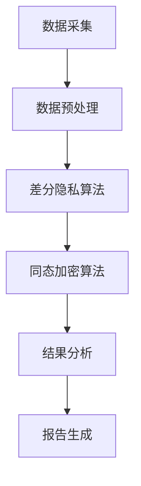

                 

## 安全性与隐私保护评估：全面审视模型风险

### 关键词：
- 安全性与隐私保护
- 模型风险
- 评估方法
- 机器学习
- 数据挖掘

### 摘要：
在当今信息化时代，随着大数据和人工智能的快速发展，数据安全和隐私保护日益成为关注的焦点。本文旨在深入探讨安全性与隐私保护评估的方法，特别是在模型风险方面的全面审视。通过分析模型风险分类、识别和评估指标，结合实际案例和系统架构设计，本文为读者提供了一整套从理论到实践的解决方案。

## 目录大纲设计

### 1. 书名与基本信息
- 书名：《安全性与隐私保护评估：全面审视模型风险》
- 作者：AI天才研究院/AI Genius Institute & 禅与计算机程序设计艺术 /Zen And The Art of Computer Programming

### 2. 目的与读者对象
- 目的：帮助读者深入了解安全性与隐私保护评估的方法和技术，提高模型风险识别和管理能力。
- 读者对象：计算机科学、网络安全、数据科学等相关领域的学者、工程师和研究人员。

### 3. 目录结构设计

**第一部分：引言与背景介绍**
1. 引言
   - 安全性与隐私保护的重要性
   - 模型风险概述
   - 本书结构

2. 安全性与隐私保护评估概述
   - 安全性与隐私保护的基本概念
   - 评估方法与技术综述

**第二部分：模型风险分析**
3. 模型风险分类与特征
   - 模型风险分类
   - 模型风险特征分析

4. 模型风险识别方法
   - 数据挖掘与模式识别
   - 统计方法
   - 机器学习方法

5. 模型风险评估指标与体系
   - 风险评估指标设计
   - 风险评估体系构建

**第三部分：安全性与隐私保护评估技术**
6. 安全性与隐私保护算法原理
   - 安全性算法
   - 隐私保护算法
   - 算法原理讲解与Mermaid流程图

7. 数学模型与公式
   - 安全性与隐私保护模型的数学表示
   - 公式详细讲解与举例

8. 系统分析与架构设计
   - 系统功能设计
   - 系统架构设计
   - 系统接口设计与交互

**第四部分：实践应用与案例分析**
9. 实践应用场景
   - 网络安全领域
   - 数据隐私保护领域
   - 智能化系统领域

10. 案例分析
    - 案例介绍
    - 案例分析
    - 案例解析

11. 最佳实践与技巧
    - 安全性与隐私保护评估的最佳实践
    - 模型风险管理的技巧

**第五部分：总结与展望**
12. 总结
    - 本书内容回顾
    - 主要成果与贡献

13. 展望
    - 安全性与隐私保护评估的发展趋势
    - 未来研究方向

### 4. 目录大纲示例
---------------------------------------------------------
# 第一部分：引言与背景介绍
## 1. 引言
### 1.1 安全性与隐私保护的重要性
### 1.2 模型风险概述
### 1.3 本书结构

## 1. 安全性与隐私保护评估概述
### 1.1 安全性与隐私保护的基本概念
### 1.2 评估方法与技术综述

## 5. 目录大纲文本内容
---------------------------------------------------------

# 第一部分：引言与背景介绍
## 1. 引言
### 1.1 安全性与隐私保护的重要性
在当今数字化时代，安全性与隐私保护已成为信息技术领域的重要议题。随着互联网的普及，数据成为新的资源，然而数据的安全与隐私保护面临诸多挑战。数据泄露、恶意攻击、信息滥用等问题频发，威胁着个人和企业信息安全。因此，对安全性与隐私保护进行评估，有助于识别风险、制定对策，从而确保数据的安全和用户隐私的保护。

### 1.2 模型风险概述
模型风险是指在应用机器学习和人工智能模型时，由于模型设计、数据质量、算法选择等因素导致的风险。这些风险可能表现为预测误差、数据泄露、隐私侵犯等，对业务决策和数据安全产生负面影响。模型风险评估是确保模型应用安全性的重要环节，通过评估可以提前发现潜在问题，降低风险。

### 1.3 本书结构
本书分为五个部分，旨在全面探讨安全性与隐私保护评估的方法和技术：

- **第一部分**：引言与背景介绍，阐述安全性与隐私保护的重要性以及模型风险的概述。
- **第二部分**：模型风险分析，包括模型风险分类与特征、模型风险识别方法、风险评估指标与体系。
- **第三部分**：安全性与隐私保护评估技术，介绍安全性与隐私保护算法原理、数学模型与公式、系统分析与架构设计。
- **第四部分**：实践应用与案例分析，探讨安全性与隐私保护在不同领域的实践应用以及案例分析。
- **第五部分**：总结与展望，回顾本书的主要内容，提出未来研究方向。

## 1. 安全性与隐私保护评估概述
### 1.1 安全性与隐私保护的基本概念
安全性与隐私保护是信息社会中两个重要的概念，它们之间既有联系又有区别。

- **安全性（Security）**：指的是保护信息资产不受未经授权的访问、篡改、泄露等威胁的能力。安全性涉及多个层面，包括物理安全、网络安全、应用安全等。
- **隐私保护（Privacy Protection）**：主要关注个人或群体的隐私信息不被未经授权的第三方访问或滥用。隐私保护涉及到数据收集、存储、处理、传输等环节，确保用户隐私不被泄露。

在信息安全领域，安全性与隐私保护是相互关联的。安全性为隐私保护提供了基础，而隐私保护则是安全性的重要目标之一。两者共同构建了信息安全的防护体系。

### 1.2 评估方法与技术综述
安全性与隐私保护评估的方法和技术多种多样，以下是一些主要的方法：

- **风险评估法**：通过评估系统、应用或模型面临的安全威胁和风险，识别潜在的安全隐患。
- **统计分析法**：利用统计学方法分析数据分布、异常检测等，发现数据中的潜在风险。
- **机器学习方法**：通过构建模型，对大量数据进行分析，识别潜在的安全风险和隐私泄露问题。
- **加密技术**：使用加密算法对数据进行加密，确保数据在传输和存储过程中的安全性。
- **匿名化技术**：通过将敏感信息进行匿名化处理，降低隐私泄露的风险。

这些评估方法和技术可以单独使用，也可以结合使用，以达到更全面的评估效果。

## 2. 模型风险分析
### 2.1 模型风险分类与特征
模型风险可以按照不同的维度进行分类，以下是一些常见的分类方法：

- **数据驱动型风险**：由于数据质量问题，如数据噪声、数据缺失、数据不平衡等，导致模型预测不准确。
- **算法驱动型风险**：由于算法设计缺陷或选择不当，导致模型表现不佳或产生偏差。
- **模型部署风险**：模型在部署过程中，由于环境变化、数据更新等原因，导致模型性能下降或失效。

模型风险的特征包括：

- **预测偏差**：模型预测结果与真实值之间存在偏差，可能导致错误的决策。
- **模型过拟合**：模型在训练数据上表现良好，但在新数据上表现不佳，即泛化能力差。
- **数据泄露**：模型在训练或预测过程中，可能泄露敏感信息，导致隐私侵犯。
- **模型崩溃**：在特定条件下，模型可能无法正常工作，导致系统崩溃或数据丢失。

### 2.2 模型风险识别方法
模型风险的识别是风险评估的第一步，以下是一些常用的方法：

- **数据挖掘与模式识别**：通过分析大量数据，识别潜在的模式和异常，发现数据中的风险。
- **统计分析法**：利用统计学方法，分析数据分布、相关性等，发现数据中的异常和风险。
- **机器学习方法**：通过构建模型，对数据进行分析，识别潜在的模型风险。

### 2.3 模型风险评估指标与体系
模型风险评估需要一套完整的指标体系，以下是一些常用的评估指标：

- **准确率（Accuracy）**：模型预测正确的样本占总样本的比例，用于评估模型的预测能力。
- **精确率（Precision）**：模型预测为正类的样本中，实际为正类的比例，用于评估模型对正类样本的识别能力。
- **召回率（Recall）**：模型预测为正类的样本中，实际为正类的比例，用于评估模型对负类样本的识别能力。
- **F1分数（F1 Score）**：精确率和召回率的调和平均，用于综合评估模型的性能。

基于这些指标，可以构建一个评估体系，对模型风险进行量化评估。

## 3. 安全性与隐私保护评估技术
### 3.1 安全性与隐私保护算法原理
安全性与隐私保护评估涉及到多种算法，以下介绍两种常见的算法：

- **差分隐私（Differential Privacy）**：差分隐私是一种保护用户隐私的算法，通过在数据集上添加噪声，使得对单个记录的分析不会泄露太多信息。差分隐私的核心是ε-differential privacy，它通过ε来衡量隐私保护的程度。

  - **ε-differential privacy**：对于任意敏感函数f和任意两个数据集D和D'，如果对于任意的ε>0，都有：
    $$ \Pr[f(D) \in R] \leq e^{\epsilon} \times \Pr[f(D') \in R] $$
    则称f在ε-differential privacy的保障下。

- **同态加密（Homomorphic Encryption）**：同态加密是一种能够在加密数据上执行计算而不需要解密的加密技术。同态加密可以实现数据的保密性和完整性，确保在数据传输和处理过程中的安全性。

### 3.2 数学模型与公式
安全性与隐私保护评估的数学模型主要包括差分隐私模型和同态加密模型。

- **差分隐私模型**：
  $$ \mathcal{D} = (U, R, \mathcal{D}') $$
  其中，U是数据集，R是隐私机制，$\mathcal{D}'$是输出数据集。

  差分隐私的数学公式为：
  $$ \Pr[R(D) \in R'] \leq e^{\epsilon} \times \Pr[R(D') \in R'] $$

- **同态加密模型**：
  $$ C = E(P) $$
  其中，C是加密数据，E是加密算法，P是明文数据。

  同态加密的数学公式为：
  $$ E(f(P)) = f(C) $$

### 3.3 系统分析与架构设计
安全性与隐私保护评估系统通常包括数据采集、预处理、算法应用、结果分析等多个模块。

- **数据采集**：从不同数据源采集数据，包括内部数据和外部分享数据。
- **预处理**：对采集到的数据进行清洗、去噪、标准化等处理，提高数据质量。
- **算法应用**：应用差分隐私和同态加密算法对数据进行处理，确保数据的安全性和隐私性。
- **结果分析**：对处理后的数据进行分析，识别潜在的安全性和隐私保护问题。

系统架构设计如下：

## 4. 实践应用与案例分析
### 4.1 实践应用场景
安全性与隐私保护评估在多个领域都有广泛的应用，以下列举几个典型场景：

- **网络安全领域**：通过对网络流量进行分析，识别潜在的安全威胁和攻击行为。
- **数据隐私保护领域**：在医疗、金融等领域，对敏感数据进行匿名化处理，确保用户隐私。
- **智能化系统领域**：在自动驾驶、智能医疗等应用中，对模型进行安全性和隐私保护评估，确保系统的稳定性和可靠性。

### 4.2 案例分析
以网络安全领域为例，分析一个具体的案例。

#### 案例介绍
某公司开发了一款基于机器学习的网络安全监测系统，用于实时监测网络流量，识别潜在的安全威胁。

#### 案例分析
1. **数据采集**：系统从公司内部网络和外部网络采集流量数据。
2. **预处理**：对采集到的数据进行清洗和去噪处理，提高数据质量。
3. **算法应用**：应用差分隐私算法对数据进行处理，确保用户隐私。
4. **结果分析**：对处理后的数据进行分析，识别潜在的安全威胁。
5. **报告生成**：生成安全监测报告，为公司提供决策依据。

#### 案例解析
该案例通过差分隐私算法确保用户隐私，同时利用机器学习模型对网络流量进行分析，实现了高效的安全监测。然而，在实际应用中，还需要考虑数据质量、算法选择等因素，确保系统的稳定性和可靠性。

## 5. 最佳实践与技巧
### 5.1 安全性与隐私保护评估的最佳实践
1. **数据质量保障**：确保数据采集、预处理环节的数据质量，减少数据噪声和缺失。
2. **算法选择与优化**：根据具体应用场景，选择合适的算法，并进行优化。
3. **模型安全性验证**：对模型进行安全性验证，确保模型在应用过程中的稳定性和可靠性。
4. **持续监控与更新**：对系统进行持续监控和更新，及时发现和解决潜在的安全和隐私问题。

### 5.2 模型风险管理的技巧
1. **风险评估与决策**：对模型风险进行量化评估，制定相应的风险管理策略。
2. **应急响应与处理**：建立应急响应机制，对潜在的安全事件进行快速响应和处理。
3. **法律法规遵守**：遵守相关法律法规，确保数据安全和隐私保护。
4. **团队合作与培训**：建立跨部门合作机制，加强对员工的安全意识和技能培训。

## 总结与展望
### 总结
本文全面探讨了安全性与隐私保护评估的方法和技术，特别是在模型风险方面的审视。通过分析模型风险分类、识别和评估指标，结合实际案例和系统架构设计，本文为读者提供了一整套从理论到实践的解决方案。

### 展望
未来，随着大数据和人工智能技术的不断进步，安全性与隐私保护评估将面临更多挑战和机遇。以下是一些未来研究方向：

1. **新型算法的研究**：探索更加高效、安全的新型算法，提高评估精度和效率。
2. **跨领域应用**：将安全性与隐私保护评估应用于更多领域，如金融、医疗等。
3. **法规政策研究**：研究相关法规政策，为安全性与隐私保护评估提供制度保障。
4. **跨学科合作**：加强跨学科合作，促进安全性与隐私保护评估的理论和实践发展。

