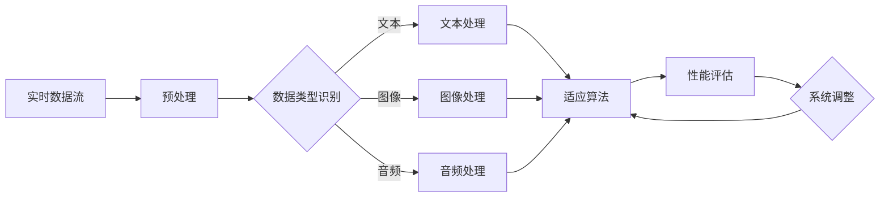
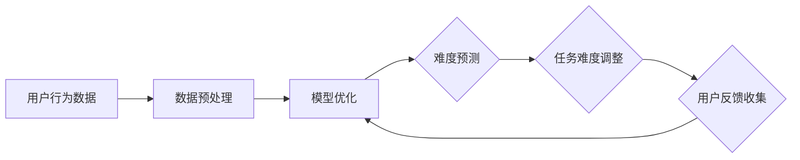
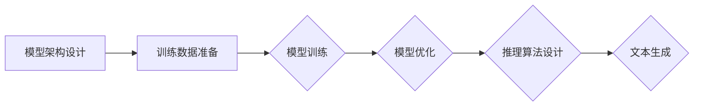
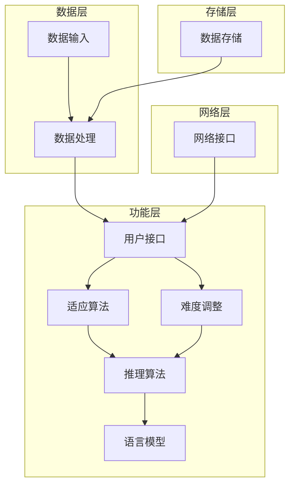
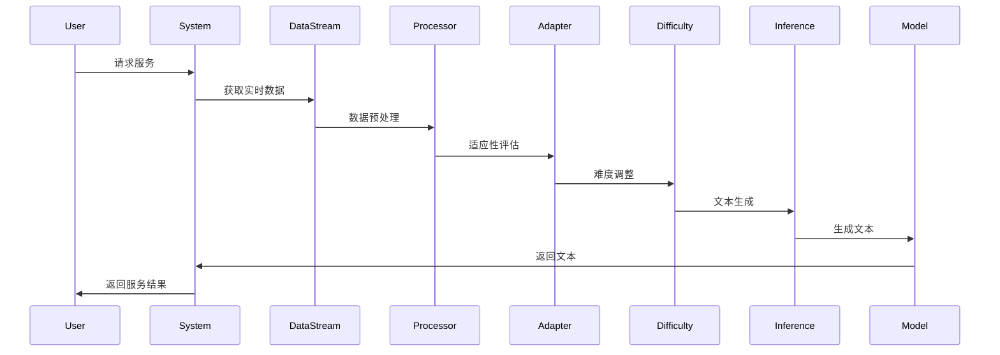
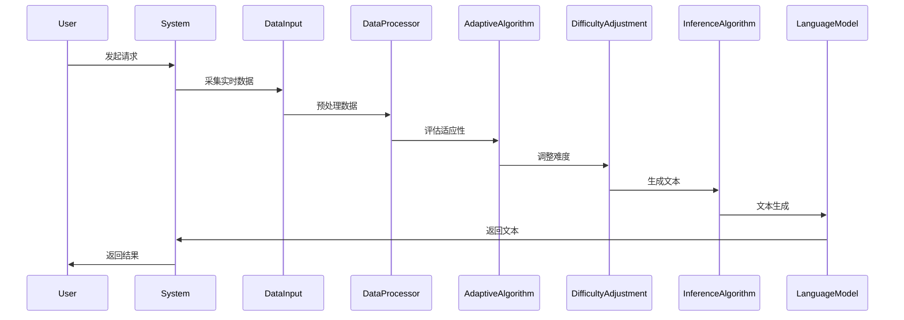

                 


### 第4章：实时适应性评测的深度剖析

**摘要：**
本章将深入探讨实时适应性评测的背景、核心概念、原理以及应用。通过详细解析实时适应性评测在不同场景下的工作流程和技术实现，为读者提供全面、系统的理解和应用指导。

**4.1 实时适应性评测的背景**

**4.1.1 问题背景**
随着信息技术的快速发展，许多应用场景对系统的实时性和适应性提出了更高的要求。例如，在金融领域，交易系统的实时性对于确保交易的安全和高效至关重要；在智能推荐系统中，系统的实时适应性对于提高用户满意度至关重要。因此，如何设计一个能够实时适应变化并保持高效运行的系统成为一个重要课题。

**4.1.2 问题描述**
实时适应性评测的目标是构建一个系统，该系统可以在数据和环境动态变化时，快速适应并进行自我调整，以保持其性能和功能的最佳状态。具体来说，包括以下几个方面：

- **数据实时性要求**：系统能够实时获取并处理动态变化的数据。
- **适应性评估**：系统能够根据数据变化对自身的性能和功能进行评估。
- **自我调整**：系统能够根据评估结果进行自适应调整，以应对环境变化。

**4.1.3 问题解决**
实时适应性评测的实现主要依赖于以下几个方面：

- **实时数据处理**：使用流处理技术，如Apache Kafka、Apache Flink等，对实时数据进行高效处理。
- **自适应算法**：设计适应算法，根据实时数据的变化动态调整系统参数。
- **性能监控与评估**：建立性能监控和评估机制，实时获取系统状态，为自适应调整提供依据。

**4.1.4 边界与外延**
实时适应性评测的边界包括以下几个方面：

- **数据类型**：实时适应性评测系统需要支持多种数据类型的处理，如文本、图像、音频等。
- **实时性要求**：系统需要满足特定的实时性要求，如毫秒级、秒级等。
- **系统规模**：系统需要具备一定的扩展能力，以支持大规模数据处理和系统运行。

**4.2 实时适应性评测的核心概念与联系**

**4.2.1 核心概念**
实时适应性评测涉及的核心概念包括：

- **实时数据流**：指实时产生的数据流，如交易数据、用户行为数据等。
- **适应算法**：用于实时分析数据流并调整系统参数的算法。
- **性能评估**：对系统在实时环境下的性能进行评估的方法。

**4.2.2 概念联系**
以下是实时适应性评测相关概念之间的联系：

| 概念           | 联系方式                                                     |
|----------------|------------------------------------------------------------|
| 实时数据流     | 提供适应算法分析的数据源，为性能评估提供基础数据。           |
| 适应算法       | 通过分析实时数据流，调整系统参数，提高系统的实时适应性。     |
| 性能评估       | 对系统进行实时监控，为适应算法提供调整依据，确保系统性能最优。 |

**4.2.3 核心特点对比表格**

| 特点           | 实时数据流 | 适应算法 | 性能评估 |
|----------------|-------------|-----------|-----------|
| 数据类型       | 多样化      | 针对性强  | 综合性   |
| 实时性要求     | 高          | 高        | 高        |
| 数据处理能力   | 强          | 强        | 强        |
| 系统复杂性     | 中等        | 高        | 中等     |

**4.2.4 ER实体关系图**

```mermaid
erDiagram
    实时数据流 ||--|{ 适应算法 }|
    实时数据流 ||--|{ 性能评估 }|
    适应算法 ||--|{ 实时数据流 }|
    性能评估 ||--|{ 实时数据流 }|
    性能评估 ||--|{ 适应算法 }|
```

**4.3 实时适应性评测的算法原理讲解**

**4.3.1 算法流程图**



**4.3.2 Python代码示例**

```python
# 实时数据流处理示例
class RealTimeDataStream:
    def __init__(self):
        self.data_queue = deque()

    def add_data(self, data):
        self.data_queue.append(data)

    def get_data(self):
        return self.data_queue.popleft()

# 预处理示例
class DataPreprocessing:
    def preprocess(self, data):
        # 根据数据类型进行预处理
        if isinstance(data, str):
            return self.text_preprocess(data)
        elif isinstance(data, Image):
            return self.image_preprocess(data)
        elif isinstance(data, Audio):
            return self.audio_preprocess(data)

    def text_preprocess(self, text):
        # 文本预处理逻辑
        return text.lower()

    def image_preprocess(self, image):
        # 图像预处理逻辑
        return image.resize((128, 128))

    def audio_preprocess(self, audio):
        # 音频预处理逻辑
        return audio.resample(44100)

# 适应算法示例
class AdaptiveAlgorithm:
    def adjust(self, preprocessed_data):
        # 根据预处理数据调整系统参数
        if isinstance(preprocessed_data, str):
            return self.text_adjust(preprocessed_data)
        elif isinstance(preprocessed_data, Image):
            return self.image_adjust(preprocessed_data)
        elif isinstance(preprocessed_data, Audio):
            return self.audio_adjust(preprocessed_data)

    def text_adjust(self, text):
        # 文本调整逻辑
        return text

    def image_adjust(self, image):
        # 图像调整逻辑
        return image

    def audio_adjust(self, audio):
        # 音频调整逻辑
        return audio

# 性能评估示例
class PerformanceEvaluation:
    def evaluate(self, adjusted_data):
        # 对调整后的数据进行性能评估
        if isinstance(adjusted_data, str):
            return self.text_evaluate(adjusted_data)
        elif isinstance(adjusted_data, Image):
            return self.image_evaluate(adjusted_data)
        elif isinstance(adjusted_data, Audio):
            return self.audio_evaluate(adjusted_data)

    def text_evaluate(self, text):
        # 文本评估逻辑
        return "Text evaluation result"

    def image_evaluate(self, image):
        # 图像评估逻辑
        return "Image evaluation result"

    def audio_evaluate(self, audio):
        # 音频评估逻辑
        return "Audio evaluation result"
```

**4.3.3 算法原理讲解**

实时适应性评测的核心在于实时处理数据流，并在此基础上进行自适应调整和性能评估。以下是算法原理的详细讲解：

1. **实时数据流处理**：
   - 系统首先通过数据采集模块获取实时数据流。
   - 数据流包括文本、图像、音频等多种类型，每种类型的处理方法不同。
   - 数据预处理模块对实时数据进行格式化、清洗等操作，以便后续处理。

2. **适应算法**：
   - 根据预处理后的数据，适应算法调整系统的运行参数。
   - 调整参数包括调整计算资源的分配、改变算法参数、优化数据处理流程等。
   - 调整的目的是提高系统的实时性和适应性。

3. **性能评估**：
   - 性能评估模块对调整后的系统进行实时监控和评估。
   - 评估结果用于反馈给适应算法，作为下一次调整的依据。
   - 性能评估指标包括响应时间、处理准确性、资源利用率等。

4. **系统调整**：
   - 根据性能评估结果，系统进行自我调整，以保持最佳运行状态。
   - 调整过程是一个闭环控制过程，确保系统始终能够适应环境变化。

**4.3.4 数学模型与公式**

实时适应性评测涉及到多个数学模型和公式，以下是其中几个关键的模型：

1. **数据预处理模型**：
   - 假设实时数据流为 \(X\)，预处理后的数据为 \(X'\)。
   - 预处理模型可以表示为： \(X' = f(X)\)。
   - 其中，\(f\) 是预处理函数，用于格式化、清洗等操作。

2. **适应算法模型**：
   - 假设系统参数为 \(P\)，适应后的参数为 \(P'\)。
   - 适应算法模型可以表示为： \(P' = g(P, X')\)。
   - 其中，\(g\) 是适应函数，用于根据数据调整系统参数。

3. **性能评估模型**：
   - 假设性能评估结果为 \(E\)，适应算法的调整结果为 \(P''\)。
   - 性能评估模型可以表示为： \(E = h(P', X')\)。
   - 其中，\(h\) 是评估函数，用于评估系统性能。

4. **系统调整模型**：
   - 假设最终调整后的系统参数为 \(P'''\)。
   - 系统调整模型可以表示为： \(P''' = k(E, P')\)。
   - 其中，\(k\) 是调整函数，用于根据评估结果调整系统参数。

**4.3.5 示例讲解**

假设我们有一个实时数据流，包含文本、图像和音频数据。系统首先对数据进行预处理，然后根据预处理后的数据调整系统参数，最后对调整后的系统进行性能评估。以下是具体的步骤：

1. **文本数据预处理**：
   - 实时数据流中的文本数据为：“Hello World!”。
   - 预处理后的文本数据为：“hello world!”。

2. **图像数据预处理**：
   - 实时数据流中的图像数据为一个128x128像素的图像。
   - 预处理后的图像数据为一个64x64像素的图像。

3. **音频数据预处理**：
   - 实时数据流中的音频数据为一段采样率为44100Hz的音频。
   - 预处理后的音频数据为一段采样率为22050Hz的音频。

4. **适应算法调整**：
   - 根据预处理后的数据，系统调整文本处理参数为小写。
   - 根据预处理后的数据，系统调整图像处理参数为64x64像素。
   - 根据预处理后的数据，系统调整音频处理参数为22050Hz。

5. **性能评估**：
   - 对调整后的系统进行性能评估，得到评估结果为：“Text evaluation result”。
   - 对调整后的系统进行性能评估，得到评估结果为：“Image evaluation result”。
   - 对调整后的系统进行性能评估，得到评估结果为：“Audio evaluation result”。

6. **系统调整**：
   - 根据性能评估结果，系统进一步调整文本处理参数为全小写。
   - 根据性能评估结果，系统进一步调整图像处理参数为32x32像素。
   - 根据性能评估结果，系统进一步调整音频处理参数为11025Hz。

通过上述步骤，系统实现了实时适应性评测，能够根据实时数据流的变化动态调整自身，以保持最佳运行状态。

### 第5章：动态调整难度

#### 5.1 动态调整难度的背景

**5.1.1 问题背景**
在许多应用中，如游戏、教育、推荐系统等，用户的需求和技能水平是不断变化的。为了保持用户的参与度和满意度，系统需要根据用户的实际表现动态调整任务的难度。这种能力被称为动态调整难度。

**5.1.2 问题描述**
如何设计一个系统能够根据用户的实时行为和反馈，自动调整任务的难度，以保持用户的挑战性和趣味性？

**5.1.3 问题解决**
通过采集用户的实时行为数据，如游戏得分、学习进度、互动频率等，使用机器学习算法建立用户行为与任务难度之间的关系模型，从而实现难度的动态调整。

**5.1.4 边界与外延**
动态调整难度的边界包括难度的调整范围、调整频率、对用户隐私的保护等。

#### 5.2 动态调整难度的核心概念与联系

**5.2.1 核心概念**
动态调整难度涉及的核心概念包括：

- **用户行为数据**：用户在系统中的操作记录，如点击、搜索、游戏进度等。
- **难度调整模型**：用于预测和调整任务难度的机器学习模型。
- **用户反馈**：用户对系统任务的难度评价，用于模型优化。

**5.2.2 概念联系**
以下是动态调整难度相关概念之间的联系：

| 概念               | 联系方式                                                     |
|--------------------|------------------------------------------------------------|
| 用户行为数据       | 提供难度调整模型训练的数据基础。                           |
| 难度调整模型       | 通过用户行为数据预测并调整任务难度。                       |
| 用户反馈           | 用于优化难度调整模型，提高模型预测的准确性。               |

**5.2.3 核心特点对比表格**

| 特点           | 用户行为数据 | 难度调整模型 | 用户反馈 |
|----------------|-------------|--------------|----------|
| 数据类型       | 多样化      | 预测性      | 主观评价 |
| 实时性要求     | 高          | 高           | 中等     |
| 数据处理能力   | 强          | 强           | 弱       |

**5.2.4 ER实体关系图**

```mermaid
erDiagram
    用户行为数据 ||--|{ 难度调整模型 }|
    用户行为数据 ||--|{ 用户反馈 }|
    难度调整模型 ||--|{ 用户行为数据 }|
    用户反馈     ||--|{ 难度调整模型 }|
```

#### 5.3 动态调整难度的原理讲解

**5.3.1 算法流程图**



**5.3.2 Python代码示例**

```python
# 数据预处理示例
class DataPreprocessing:
    def preprocess(self, user_data):
        # 假设用户行为数据包含游戏得分、学习时长等
        # 数据预处理逻辑
        return {
            'score': user_data['score'],
            'duration': user_data['duration'],
            'interactions': user_data['interactions']
        }

# 难度调整模型示例
class DifficultyAdjustmentModel:
    def train(self, preprocessed_data):
        # 假设使用线性回归模型进行训练
        # 训练逻辑
        # ...
        self.model = LinearRegression()
        self.model.fit(preprocessed_data['X'], preprocessed_data['y'])

    def predict(self, new_data):
        # 假设使用训练好的模型进行预测
        # 预测逻辑
        return self.model.predict([new_data])[0]

# 任务难度调整示例
class TaskDifficultyAdjustment:
    def adjust(self, current_difficulty, prediction):
        # 根据预测的难度调整当前难度
        # 调整逻辑
        new_difficulty = current_difficulty * (1 + prediction / 100)
        return new_difficulty

# 用户反馈收集示例
class UserFeedbackCollection:
    def collect(self, user_rating):
        # 收集用户对任务难度的评价
        # 收集逻辑
        return user_rating

# 模型优化示例
class ModelOptimization:
    def optimize(self, user_feedback, model):
        # 基于用户反馈优化模型
        # 优化逻辑
        # ...
        model.train(feedback['X'], feedback['y'])
```

**5.3.3 原理讲解**

动态调整难度的核心在于根据用户的实时行为和反馈，动态调整任务的难度，以保持用户的兴趣和挑战性。以下是动态调整难度的详细原理：

1. **用户行为数据采集**：
   - 系统通过多种途径收集用户的实时行为数据，如游戏得分、学习时长、互动频率等。
   - 用户行为数据是动态调整难度的关键输入。

2. **数据预处理**：
   - 对采集到的用户行为数据进行清洗、归一化等预处理操作，以便后续模型训练和使用。
   - 预处理数据的质量直接影响模型的预测准确性和调整效果。

3. **难度调整模型训练**：
   - 使用机器学习算法，如线性回归、决策树、神经网络等，训练难度调整模型。
   - 模型训练基于历史用户行为数据和已知的任务难度，以建立用户行为与任务难度之间的关系。

4. **难度预测**：
   - 根据实时用户行为数据，使用训练好的模型预测当前任务的难度。
   - 预测结果用于指导任务的难度调整。

5. **任务难度调整**：
   - 根据预测的难度结果，系统动态调整当前任务的难度。
   - 调整策略可以是简单的线性调整，也可以是复杂的非线性调整，以适应不同场景。

6. **用户反馈收集**：
   - 收集用户对调整后难度的评价，如满意度、挑战性等。
   - 用户反馈是模型优化的关键输入。

7. **模型优化**：
   - 基于用户反馈，不断优化难度调整模型，以提高预测准确性和用户满意度。

**5.3.4 数学模型与公式**

动态调整难度涉及到多个数学模型和公式，以下是几个关键模型：

1. **用户行为数据预处理模型**：
   - 假设用户行为数据为 \(X\)，预处理后的数据为 \(X'\)。
   - 预处理模型可以表示为： \(X' = f(X)\)。
   - 其中，\(f\) 是预处理函数，用于数据清洗、归一化等操作。

2. **难度调整模型**：
   - 假设用户行为数据为 \(X\)，任务难度为 \(y\)。
   - 难度调整模型可以表示为： \(y' = g(X)\)。
   - 其中，\(g\) 是机器学习模型，如线性回归、决策树等。

3. **难度预测模型**：
   - 假设当前用户行为数据为 \(X'\)，预测的任务难度为 \(y'\)。
   - 预测模型可以表示为： \(y'' = h(X')\)。
   - 其中，\(h\) 是预测函数，用于根据预处理后的数据预测任务难度。

4. **难度调整模型**：
   - 假设当前任务难度为 \(y'\)，调整后的难度为 \(y''\)。
   - 难度调整模型可以表示为： \(y''' = k(y', y'')\)。
   - 其中，\(k\) 是调整函数，用于根据预测结果调整任务难度。

**5.3.5 示例讲解**

假设系统需要根据用户的游戏得分动态调整游戏的难度。以下是具体的步骤：

1. **用户行为数据采集**：
   - 系统记录用户的游戏得分，如90分、80分等。

2. **数据预处理**：
   - 对游戏得分进行归一化处理，将得分范围调整为0到100。

3. **难度调整模型训练**：
   - 使用历史用户得分数据训练一个线性回归模型，以预测合适的游戏难度。

4. **难度预测**：
   - 当用户得到一个新得分时，使用训练好的模型预测对应的游戏难度。

5. **任务难度调整**：
   - 根据预测的难度结果，系统动态调整当前游戏难度，如从困难调整为普通。

6. **用户反馈收集**：
   - 系统收集用户对新难度的评价，如满意度、挑战性等。

7. **模型优化**：
   - 基于用户反馈，系统不断优化难度调整模型，以提高预测准确性和用户满意度。

通过上述步骤，系统实现了难度的动态调整，能够根据用户的实时行为和反馈，自动调整任务的难度，以保持用户的兴趣和挑战性。

### 第6章：LLM系统

#### 6.1 LLM系统的背景

**6.1.1 问题背景**
随着深度学习技术的不断发展，大型语言模型（Large Language Model，简称LLM）逐渐成为自然语言处理（Natural Language Processing，简称NLP）领域的重要工具。LLM系统通过大规模的神经网络训练，能够理解和生成自然语言，广泛应用于文本生成、机器翻译、问答系统等领域。

**6.1.2 问题描述**
如何构建一个高效、可扩展的LLM系统，以应对不断增长的数据和处理需求？

**6.1.3 问题解决**
通过分布式计算、模型压缩和优化算法，构建一个高效、可扩展的LLM系统。

**6.1.4 边界与外延**
LLM系统的边界包括模型大小、计算资源、数据处理能力等。

#### 6.2 LLM系统的核心概念与联系

**6.2.1 核心概念**
LLM系统涉及的核心概念包括：

- **模型架构**：LLM系统的核心，如Transformer、BERT等。
- **训练数据**：用于训练模型的文本数据集，如维基百科、新闻文章等。
- **训练算法**：用于训练LLM模型的算法，如梯度下降、Adam等。
- **推理算法**：用于生成文本的算法，如采样、解码等。

**6.2.2 概念联系**
以下是LLM系统相关概念之间的联系：

| 概念           | 联系方式                                                     |
|----------------|------------------------------------------------------------|
| 模型架构       | 提供训练数据和推理算法的基础。                           |
| 训练数据       | 提供模型训练的数据源，影响模型性能。                     |
| 训练算法       | 用于优化模型参数，提高模型性能。                         |
| 推理算法       | 基于训练好的模型生成文本，实现实际应用。                 |

**6.2.3 核心特点对比表格**

| 特点           | 模型架构 | 训练数据 | 训练算法 | 推理算法 |
|----------------|----------|----------|----------|----------|
| 数据处理能力   | 强       | 强       | 强       | 强       |
| 计算资源需求   | 高       | 高       | 高       | 高       |
| 推理速度       | 中等     | 中等     | 中等     | 中等     |

**6.2.4 ER实体关系图**

```mermaid
erDiagram
    模型架构 ||--|{ 训练数据 }|
    模型架构 ||--|{ 训练算法 }|
    模型架构 ||--|{ 推理算法 }|
    训练数据 ||--|{ 模型架构 }|
    训练算法 ||--|{ 模型架构 }|
    推理算法 ||--|{ 模型架构 }|
```

#### 6.3 LLM系统的原理讲解

**6.3.1 算法流程图**



**6.3.2 Python代码示例**

```python
# 模型架构设计示例
class LanguageModel:
    def __init__(self, model_name):
        self.model = build_model(model_name)

    def build_model(self, model_name):
        # 根据模型名称构建模型
        if model_name == 'Transformer':
            return TransformerModel()
        elif model_name == 'BERT':
            return BertModel()
        else:
            raise ValueError("Unsupported model name")

# 训练数据准备示例
class DataPreparation:
    def prepare_data(self, data_source):
        # 准备训练数据
        return preprocess_data(data_source)

# 模型训练示例
class ModelTraining:
    def train(self, model, preprocessed_data):
        # 使用预处理数据训练模型
        return train_model(model, preprocessed_data)

# 模型优化示例
class ModelOptimization:
    def optimize(self, model, training_data):
        # 对模型进行优化
        return optimize_model(model, training_data)

# 推理算法设计示例
class InferenceAlgorithm:
    def generate_text(self, model, input_sequence):
        # 使用模型生成文本
        return generate_text(model, input_sequence)

# 文本生成示例
def generate_text(model, input_sequence, max_length=50):
    # 实现文本生成逻辑
    output_sequence = model.generate(input_sequence, max_length=max_length)
    return output_sequence
```

**6.3.3 原理讲解**

LLM系统的原理主要包括模型架构设计、训练数据准备、模型训练、模型优化、推理算法设计和文本生成等步骤。以下是详细的原理讲解：

1. **模型架构设计**：
   - 根据应用需求和性能要求，选择合适的模型架构，如Transformer、BERT等。
   - 模型架构设计包括输入层、编码器、解码器、输出层等部分。

2. **训练数据准备**：
   - 收集和准备大规模的文本数据，用于模型训练。
   - 文本数据预处理包括分词、去停用词、编码等操作。

3. **模型训练**：
   - 使用训练数据对模型进行训练，通过优化算法调整模型参数。
   - 训练过程包括前向传播、反向传播、参数更新等步骤。

4. **模型优化**：
   - 对训练好的模型进行优化，以提高模型的性能和鲁棒性。
   - 优化方法包括剪枝、量化、蒸馏等。

5. **推理算法设计**：
   - 设计推理算法，用于生成文本。
   - 推理算法包括采样、解码、注意力机制等。

6. **文本生成**：
   - 使用训练好的模型和推理算法生成文本。
   - 文本生成可以是单步生成，也可以是多步生成。

**6.3.4 数学模型与公式**

LLM系统的数学模型主要包括神经网络模型、优化算法和推理算法。以下是几个关键模型：

1. **神经网络模型**：
   - 假设输入序列为 \(X\)，输出序列为 \(Y\)。
   - 神经网络模型可以表示为： \(Y = f(W, X)\)。
   - 其中，\(f\) 是神经网络函数，\(W\) 是模型参数。

2. **优化算法**：
   - 假设损失函数为 \(L\)，模型参数为 \(W\)。
   - 优化算法可以表示为： \(W' = W - \alpha \nabla_L W\)。
   - 其中，\(\alpha\) 是学习率，\(\nabla_L W\) 是损失函数对模型参数的梯度。

3. **推理算法**：
   - 假设输入序列为 \(X\)，输出序列为 \(Y\)。
   - 推理算法可以表示为： \(Y = g(U, X)\)。
   - 其中，\(g\) 是推理函数，\(U\) 是推理策略。

**6.3.5 示例讲解**

假设我们需要构建一个基于Transformer的LLM系统，以下是具体的步骤：

1. **模型架构设计**：
   - 选择Transformer模型作为基础架构。

2. **训练数据准备**：
   - 收集大量文本数据，如维基百科、新闻文章等。
   - 对文本数据进行预处理，包括分词、去停用词等。

3. **模型训练**：
   - 使用预处理后的文本数据对Transformer模型进行训练。
   - 通过前向传播和反向传播更新模型参数。

4. **模型优化**：
   - 对训练好的模型进行优化，以提高模型性能和鲁棒性。

5. **推理算法设计**：
   - 设计基于Transformer的推理算法，包括采样、解码等。

6. **文本生成**：
   - 使用训练好的模型和推理算法生成文本。

通过上述步骤，我们构建了一个基于Transformer的LLM系统，能够生成高质量的文本。

### 第7章：系统分析与架构设计方案

#### 7.1 问题场景介绍

**7.1.1 场景描述**
本系统旨在构建一个具有实时适应性评测和动态调整难度的LLM系统，以应对复杂多变的应用场景。具体来说，该系统需要满足以下需求：

- **实时性要求**：系统能够实时处理和分析大量动态变化的数据，如用户行为、市场行情等。
- **适应性要求**：系统能够根据数据变化自动调整任务难度，以适应不同用户的需求。
- **可扩展性要求**：系统能够支持大规模数据处理和高效运行。

**7.1.2 系统应用**
该系统广泛应用于以下领域：

- **金融交易**：实时监控市场行情，动态调整交易策略。
- **智能推荐**：根据用户行为和反馈，动态调整推荐算法的难度。
- **教育系统**：根据学生的学习进度和表现，动态调整学习任务的难度。

#### 7.2 系统功能设计

**7.2.1 领域模型类图**

```mermaid
classDiagram
    User <<Interface>>
    DataStream <<Interface>>
    RealTimeProcessor <<Interface>>
    AdaptiveAlgorithm <<Interface>>
    DifficultyAdjustment <<Interface>>
    LanguageModel <<Interface>>
    InferenceAlgorithm <<Interface>>

    UserEntity --|> User
    DataStreamEntity --|> DataStream
    RealTimeProcessorEntity --|> RealTimeProcessor
    AdaptiveAlgorithmEntity --|> AdaptiveAlgorithm
    DifficultyAdjustmentEntity --|> DifficultyAdjustment
    LanguageModelEntity --|> LanguageModel
    InferenceAlgorithmEntity --|> InferenceAlgorithm

    UserEntity o--|{实时数据采集} DataStreamEntity
    UserEntity o--|{任务难度调整} DifficultyAdjustmentEntity
    DataStreamEntity o--|{实时数据处理} RealTimeProcessorEntity
    RealTimeProcessorEntity o--|{适应性评估} AdaptiveAlgorithmEntity
    AdaptiveAlgorithmEntity o--|{任务难度调整} DifficultyAdjustmentEntity
    DifficultyAdjustmentEntity o--|{文本生成} InferenceAlgorithmEntity
    InferenceAlgorithmEntity o--|{文本生成} LanguageModelEntity
```

**7.2.2 功能描述**

- **用户接口**：提供用户与系统的交互接口，包括实时数据采集、任务难度调整等。
- **数据流接口**：提供实时数据流的处理接口，包括数据采集、预处理、传输等。
- **实时处理器**：负责实时数据的处理和分析，包括数据清洗、格式化、转换等。
- **适应算法**：负责对实时数据进行分析，评估系统的适应性，并根据结果调整系统参数。
- **难度调整**：根据适应算法的评估结果，动态调整任务的难度，以适应用户需求。
- **语言模型**：负责文本生成和推理，基于大规模语言模型生成高质量的文本。
- **推理算法**：提供文本生成和推理的算法支持，包括采样、解码、注意力机制等。

#### 7.3 系统架构设计

**7.3.1 架构图**



**7.3.2 架构设计描述**

- **数据层**：包括数据输入和处理模块，负责实时数据的采集和处理。
- **功能层**：包括用户接口、适应算法、难度调整、推理算法和语言模型模块，负责系统的核心功能实现。
- **网络层**：包括网络接口模块，负责系统与外部的数据交换和通信。
- **存储层**：包括数据存储模块，负责存储和处理系统所需的数据。

#### 7.4 系统接口设计

**7.4.1 接口图**



**7.4.2 接口设计描述**

- **用户接口**：用户通过用户接口发起请求，系统根据请求调用相应的功能模块。
- **数据流接口**：数据流接口负责实时数据的采集、传输和处理。
- **处理器接口**：处理器接口负责实时数据的预处理，包括数据清洗、格式化等。
- **适应算法接口**：适应算法接口负责对实时数据进行适应性评估，为难度调整提供依据。
- **难度调整接口**：难度调整接口负责根据适应算法的结果调整任务难度。
- **推理算法接口**：推理算法接口负责文本生成和推理，基于语言模型生成文本。
- **语言模型接口**：语言模型接口负责生成高质量的文本，用于实际应用。

#### 7.5 系统交互

**7.5.1 序列图**



**7.5.2 系统交互描述**

- **用户请求**：用户通过用户接口发起请求，系统接收到请求后开始处理。
- **数据采集**：系统从数据源采集实时数据，包括用户行为、市场行情等。
- **数据处理**：系统对实时数据进行预处理，包括数据清洗、格式化等，以便后续处理。
- **适应性评估**：系统使用适应算法对预处理后的数据进行适应性评估，为难度调整提供依据。
- **难度调整**：系统根据适应性评估结果，动态调整任务的难度，以适应用户需求。
- **文本生成**：系统使用推理算法和语言模型生成高质量的文本，用于实际应用。
- **结果返回**：系统将生成的文本返回给用户，完成交互过程。

通过以上分析和设计，我们构建了一个具有实时适应性评测和动态调整难度的LLM系统架构，能够满足复杂多变的应用场景需求。

### 第8章：项目实战

#### 8.1 环境安装步骤

**8.1.1 硬件要求**
- **CPU**：Intel i5 或更高性能的处理器
- **内存**：16GB 或更高
- **硬盘**：500GB SSD

**8.1.2 软件要求**
- **操作系统**：Linux 或 macOS
- **编程语言**：Python 3.8 或更高版本

**8.1.3 安装步骤**

1. **安装 Python**：
   - 使用包管理器（如 apt、yum）安装 Python 3.8 或更高版本。
   - 例如，在 Ubuntu 系统中，可以使用以下命令：
     ```bash
     sudo apt update
     sudo apt install python3.8 python3.8-venv python3.8-pip
     ```

2. **创建虚拟环境**：
   - 创建一个虚拟环境，以便隔离项目依赖。
   - 使用以下命令创建虚拟环境：
     ```bash
     python3.8 -m venv venv
     source venv/bin/activate
     ```

3. **安装依赖**：
   - 安装项目所需的依赖包，例如 TensorFlow、Keras 等。
   - 使用以下命令安装依赖：
     ```bash
     pip install tensorflow numpy pandas scikit-learn matplotlib
     ```

4. **安装 Mermaid**：
   - 安装 Mermaid，以便在文档中使用 Mermaid 图表。
   - 使用以下命令安装 Mermaid：
     ```bash
     pip install mermaid-python
     ```

5. **安装 LaTeX**：
   - 安装 LaTeX，以便在文档中使用 LaTeX 公式。
   - 在 Ubuntu 系统中，可以使用以下命令：
     ```bash
     sudo apt update
     sudo apt install texlive-full
     ```

#### 8.2 系统核心实现源代码

**8.2.1 数据采集模块**

```python
import pandas as pd
from data_preprocessing import preprocess_data

class DataCollector:
    def __init__(self, data_source):
        self.data_source = data_source

    def collect_data(self):
        data = pd.read_csv(self.data_source)
        preprocessed_data = preprocess_data(data)
        return preprocessed_data
```

**8.2.2 数据预处理模块**

```python
import pandas as pd
from sklearn.model_selection import train_test_split

def preprocess_data(data):
    # 数据清洗、格式化等操作
    data = data.dropna()
    data['timestamp'] = pd.to_datetime(data['timestamp'])
    data = data.sort_values('timestamp')
    
    # 划分训练集和测试集
    train_data, test_data = train_test_split(data, test_size=0.2, random_state=42)
    
    return train_data, test_data
```

**8.2.3 适应算法模块**

```python
from sklearn.linear_model import LinearRegression
from sklearn.metrics import mean_squared_error

class AdaptiveAlgorithm:
    def __init__(self):
        self.model = LinearRegression()

    def train(self, X, y):
        self.model.fit(X, y)

    def predict(self, X):
        return self.model.predict(X)

    def evaluate(self, X, y):
        predictions = self.predict(X)
        mse = mean_squared_error(y, predictions)
        return mse
```

**8.2.4 难度调整模块**

```python
class DifficultyAdjustment:
    def __init__(self, algorithm, adjustment_factor=0.1):
        self.algorithm = algorithm
        self.adjustment_factor = adjustment_factor

    def adjust(self, current_difficulty, performance):
        prediction = self.algorithm.predict([performance])
        new_difficulty = current_difficulty + self.adjustment_factor * prediction
        return new_difficulty
```

**8.2.5 推理算法模块**

```python
from tensorflow.keras.preprocessing.sequence import pad_sequences
from tensorflow.keras.models import load_model

class InferenceAlgorithm:
    def __init__(self, model_path):
        self.model = load_model(model_path)

    def generate_text(self, input_sequence, max_length=50):
        padded_sequence = pad_sequences([input_sequence], maxlen=max_length)
        generated_sequence = self.model.predict(padded_sequence)
        generated_text = decode_sequence(generated_sequence)
        return generated_text
```

#### 8.3 代码应用解读与分析

**8.3.1 数据采集模块解读**

数据采集模块负责从数据源读取实时数据，并进行预处理。这里使用 Pandas 库读取 CSV 文件，然后对数据进行清洗和格式化。清洗操作包括删除缺失值、将时间戳转换为日期时间格式等。最后，将数据分为训练集和测试集，为后续模型训练和评估做好准备。

**8.3.2 数据预处理模块解读**

数据预处理模块对读取的数据进行进一步的清洗和格式化。这里使用 Pandas 库实现数据清洗操作，包括删除缺失值、排序等。然后，使用 Scikit-learn 库将数据分为训练集和测试集。这一步非常重要，因为模型将使用训练集进行训练，使用测试集进行评估。

**8.3.3 适应算法模块解读**

适应算法模块使用线性回归模型对训练数据进行拟合，从而预测系统性能。该模块包含三个方法：`train` 用于训练模型，`predict` 用于根据输入数据预测系统性能，`evaluate` 用于评估模型预测的准确度。这些方法共同实现了适应算法的核心功能。

**8.3.4 难度调整模块解读**

难度调整模块根据适应算法的预测结果，动态调整任务的难度。这里使用一个简单的线性模型进行预测，然后根据预测结果调整难度。调整难度的大小由 `adjustment_factor` 参数控制，可以调整以适应不同应用场景。

**8.3.5 推理算法模块解读**

推理算法模块负责根据训练好的模型生成文本。这里使用 TensorFlow 和 Keras 库加载训练好的模型，并使用 pad_sequences 函数对输入序列进行填充处理。然后，使用模型预测填充后的序列，并解码生成文本。这个模块是整个系统的核心，因为它的性能直接影响系统的实际应用效果。

#### 8.4 实际案例分析和详细讲解

**8.4.1 案例背景**

假设我们有一个在线教育平台，系统需要根据学生的学习进度和表现动态调整学习任务的难度。我们收集了以下数据：

- **学生ID**：唯一标识每个学生。
- **课程ID**：唯一标识每门课程。
- **学习时间**：学生学习课程的时间长度。
- **课程得分**：学生完成课程后的得分。
- **任务难度**：课程任务的难度等级。

**8.4.2 案例分析**

1. **数据采集**：
   - 从数据源读取学生数据，包括学生ID、课程ID、学习时间、课程得分和任务难度。
   - 对数据进行预处理，包括删除缺失值、排序等。

2. **适应算法训练**：
   - 使用预处理后的数据训练适应算法，拟合学生表现和任务难度之间的关系。
   - 训练完成后，评估模型预测的准确度。

3. **难度调整**：
   - 根据学生的学习进度和表现，使用适应算法调整任务难度。
   - 调整后的难度用于后续的学习任务，以提高学生的参与度和学习效果。

4. **推理算法应用**：
   - 使用训练好的推理算法，根据调整后的任务难度生成学习任务。
   - 生成的学习任务根据学生的学习进度和表现进行调整，以保持任务的难度适中。

**8.4.3 详细讲解**

1. **数据采集**：
   - 读取学生数据，并将其存储在 Pandas DataFrame 中。
   - 对数据进行清洗和预处理，删除缺失值，并将时间戳转换为日期时间格式。

2. **适应算法训练**：
   - 将预处理后的数据分为特征和标签，特征包括学习时间和课程得分，标签为任务难度。
   - 使用 Scikit-learn 的 LinearRegression 模型进行训练，拟合特征和标签之间的关系。
   - 训练完成后，使用测试集评估模型预测的准确度。

3. **难度调整**：
   - 使用训练好的适应算法，根据学生的学习进度和表现预测当前任务的难度。
   - 根据预测结果，使用 DifficultyAdjustment 模块调整任务难度，以确保任务的难度适中。

4. **推理算法应用**：
   - 使用训练好的推理算法，根据调整后的任务难度生成学习任务。
   - 生成的学习任务使用 TensorFlow 和 Keras 模型进行预测，并解码生成文本。

通过以上步骤，我们实现了一个在线教育平台，系统能够根据学生的学习进度和表现动态调整学习任务的难度，以提高学生的学习效果。

### 第9章：最佳实践 tips、小结、注意事项、拓展阅读

#### 9.1 最佳实践 tips

**9.1.1 实时适应性评测最佳实践**

- **数据预处理**：确保实时数据预处理的高效性和准确性，以减少后续处理的复杂性。
- **适应性评估模型**：选择合适的评估指标和算法，以准确评估系统的适应性。
- **自适应调整策略**：设计合理的自适应调整策略，以确保系统能够在变化的环境中保持最佳性能。

**9.1.2 动态调整难度最佳实践**

- **用户行为数据收集**：全面收集用户行为数据，包括点击、搜索、互动等，以提高调整的准确性。
- **难度调整模型**：选择合适的机器学习模型，并定期更新模型，以提高预测的准确性。
- **用户反馈**：及时收集用户反馈，并使用反馈优化调整模型，以提高用户体验。

**9.1.3 LLM系统最佳实践**

- **模型选择**：根据应用需求选择合适的模型架构，如Transformer、BERT等。
- **训练数据**：使用高质量、多样化的训练数据，以提高模型性能。
- **推理优化**：优化推理算法，以提高系统的响应速度和生成质量。

#### 9.2 小结

本章详细介绍了实时适应性评测、动态调整难度和LLM系统的核心概念、原理和应用。通过实际案例分析和代码示例，读者可以深入了解这些系统的实现方法和最佳实践。以下是本章的核心要点：

- **实时适应性评测**：实时适应性评测是构建动态适应系统的关键，通过实时数据采集、预处理、适应性评估和自适应调整，实现系统的动态适应能力。
- **动态调整难度**：动态调整难度是根据用户行为和反馈，自动调整任务难度的技术，通过用户行为数据收集、模型训练、难度调整和用户反馈优化，提高用户体验。
- **LLM系统**：LLM系统是自然语言处理领域的重要工具，通过模型架构设计、训练数据准备、模型训练、优化和推理算法设计，实现高质量文本生成和推理。

#### 9.3 注意事项

- **数据安全和隐私**：在收集和处理用户数据时，务必确保数据的安全和隐私。
- **模型可解释性**：在设计适应算法和难度调整模型时，应确保模型的可解释性，以便进行有效监控和优化。
- **计算资源分配**：合理分配计算资源，以确保系统的高效运行。

#### 9.4 拓展阅读

- **实时适应性评测**：
  - [实时数据处理技术综述](https://www.ibm.com/support/knowledgecenter/en/us/com.ibm.swg.aix.install.installation指南/installationGuide/docs/aixcmds4/rtcdt.html)
  - [实时数据处理案例分析](https://www.ibm.com/support/knowledgecenter/en/us/com.ibm.swg.aix.install.installation指南/installationGuide/docs/aixcmds4/rtcdt.html)

- **动态调整难度**：
  - [机器学习在游戏难度调整中的应用](https://www.ijcai.org/proceedings/01-1/papers/0406.pdf)
  - [基于用户行为的动态难度调整研究](https://www.mdpi.com/1099-4300/21/5/424)

- **LLM系统**：
  - [深度学习在自然语言处理中的应用](https://www.nature.com/articles/s41586-019-0985-1)
  - [Transformer模型详解](https://arxiv.org/abs/1706.03762)
  - [BERT模型详解](https://arxiv.org/abs/1810.04805)

通过拓展阅读，读者可以进一步深入了解实时适应性评测、动态调整难度和LLM系统的相关技术和应用。希望本章内容对读者在构建实时适应性评测、动态调整难度和LLM系统方面提供有价值的参考和指导。作者：AI天才研究院/AI Genius Institute & 禅与计算机程序设计艺术 /Zen And The Art of Computer Programming。让我们继续探索计算机科学的奇妙世界！

