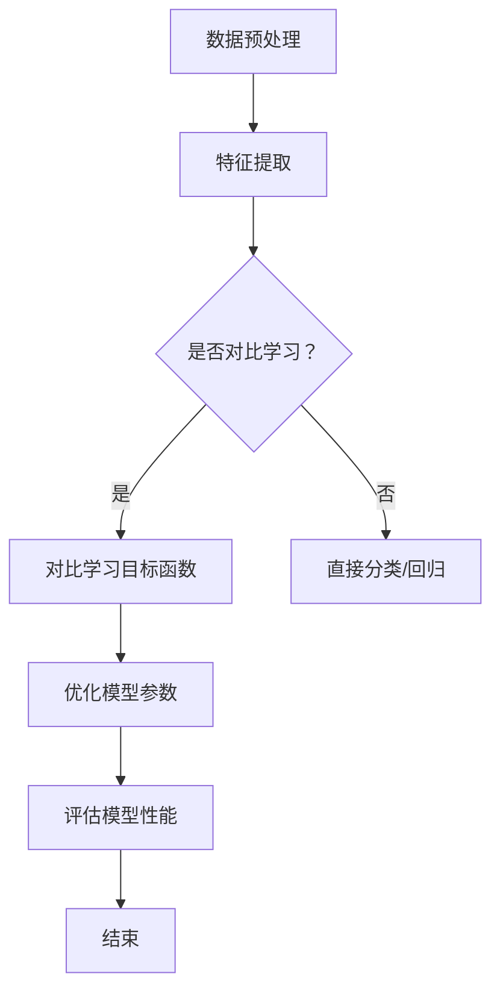
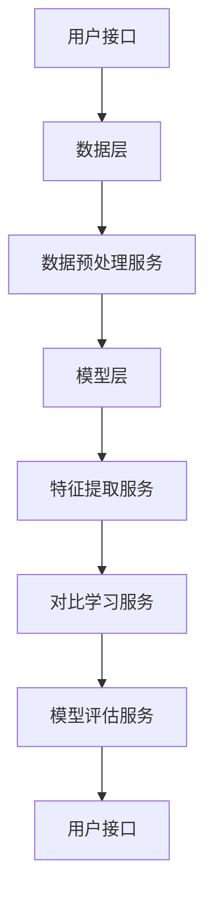
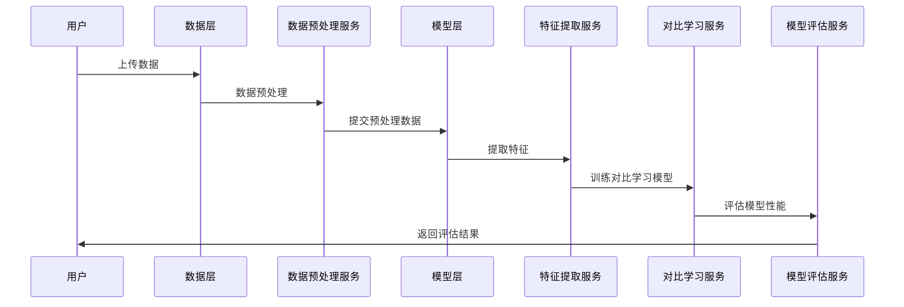

                 

### 对比学习：AIGC特征表示学习的新方法

#### 关键词

- 对比学习
- 特征表示学习
- AIGC
- 计算机视觉
- 自然语言处理

#### 摘要

本文深入探讨了对比学习这一新兴的方法，特别是其在AIGC（自适应智能生成控制）领域的应用。通过对比学习的背景、基本概念、算法原理、应用实践以及挑战与未来发展方向，本文旨在为读者提供一个全面且详细的对比学习技术综述。文章将从基础概念出发，逐步展开，帮助读者理解对比学习在特征表示学习中的关键作用，以及如何在实际项目中应用这一技术，提升AIGC模型的性能。

---

## 目录大纲设计思路

设计一份完整且详细的目录大纲，是确保文章逻辑清晰、结构紧凑的重要步骤。以下是设计思路的具体步骤：

### 确定书的整体结构

首先，我们需要明确书的整体结构，将内容分为几个主要部分，每个部分涵盖的核心主题是什么。这有助于我们理清整体思路，为后续章节的细化提供方向。

### 细化章节内容

在每个主要部分下，我们需要细化章节内容，确定需要讨论的子主题。这包括核心概念、算法原理、应用实践等，并为每个子主题创建章节。

### 确保内容完整性

在细化章节内容时，我们需要确保每个章节都包含必要的内容，如背景介绍、核心概念与联系、算法原理讲解、数学模型和数学公式详细讲解与举例说明、系统分析与架构设计方案、项目实战以及最佳实践 tips 等。

### 设计章节标题

使用清晰、简洁的标题来概括每个章节的主要内容，有助于读者快速理解章节内容，提高阅读效率。

### 格式统一

确保所有章节都遵循相同的格式，包括使用markdown格式来表示章节层级。这有助于文章的结构更加清晰，便于读者阅读。

### 控制大纲长度

整体大纲的字数控制在2000字以内，同时保持内容的完整性。这是为了确保读者能够在较短的时间内获取关键信息，而不至于阅读疲劳。

### 目录大纲示例

以下是按照上述思路设计的目录大纲示例：

```markdown
----------------------------------------------------------------
# 对比学习：AIGC特征表示学习的新方法

## 第一部分：对比学习的基本概念

# 第1章：对比学习的背景与基本概念

## 1.1 对比学习的起源与发展

### 1.1.1 对比学习的定义

### 1.1.2 对比学习的重要性

### 1.1.3 对比学习的研究现状

## 1.2 对比学习的关键要素

### 1.2.1 对比学习中的正负样本选择

### 1.2.2 对比学习的目标函数

### 1.2.3 对比学习的优化算法

## 1.3 对比学习在不同领域的应用

### 1.3.1 计算机视觉

### 1.3.2 自然语言处理

### 1.3.3 其他应用领域

## 1.4 本章小结

----------------------------------------------------------------

## 第二部分：对比学习的算法原理

# 第2章：对比学习的核心算法

## 2.1 图对比学习算法

### 2.1.1 图对比学习的基本原理

### 2.1.2 图对比学习算法的流程

### 2.1.3 图对比学习的挑战与解决方案

## 2.2 模糊对比学习算法

### 2.2.1 模糊对比学习的基本概念

### 2.2.2 模糊对比学习算法的流程

### 2.2.3 模糊对比学习的优点与局限性

## 2.3 对比学习在GAN中的应用

### 2.3.1 GAN的基本概念

### 2.3.2 对比学习在GAN中的角色

### 2.3.3 对比学习在GAN中的优化方法

## 2.4 本章小结

----------------------------------------------------------------

## 第三部分：对比学习的应用实践

# 第3章：对比学习在计算机视觉中的应用

## 3.1 计算机视觉中的对比学习

### 3.1.1 对比学习在图像分类中的应用

### 3.1.2 对比学习在图像分割中的应用

### 3.1.3 对比学习在目标检测中的应用

## 3.2 对比学习在自然语言处理中的应用

### 3.2.1 对比学习在文本分类中的应用

### 3.2.2 对比学习在机器翻译中的应用

### 3.2.3 对比学习在问答系统中的应用

## 3.3 对比学习在其他领域的应用

### 3.3.1 对比学习在生物信息学中的应用

### 3.3.2 对比学习在推荐系统中的应用

### 3.3.3 对比学习在其他领域的前景

## 3.4 本章小结

----------------------------------------------------------------

# 第四部分：对比学习的挑战与未来发展方向

## 第四部分：对比学习的挑战与未来发展方向

# 第4章：对比学习的挑战与解决方案

## 4.1 数据不平衡问题

### 4.1.1 数据不平衡的原因

### 4.1.2 对抗样本生成方法

### 4.1.3 数据重采样策略

## 4.2 对比学习在资源受限环境中的优化

### 4.2.1 资源受限环境下的对比学习优化策略

### 4.2.2 低成本的数据增强方法

### 4.2.3 小样本学习与对比学习

## 4.3 对比学习在安全性方面的考虑

### 4.3.1 对比学习与隐私保护

### 4.3.2 对比学习与鲁棒性

### 4.3.3 对比学习与对抗攻击

## 4.4 本章小结

-----

----------------------------------------------------------------

## 文章结构设计

在撰写本文时，我们将遵循以下结构设计：

### 文章标题

文章标题明确传达了本文的核心内容，即“对比学习：AIGC特征表示学习的新方法”。

### 文章关键词

关键词有助于读者快速了解文章的主要内容，本文的关键词包括“对比学习”、“特征表示学习”、“AIGC”、“计算机视觉”和“自然语言处理”。

### 文章摘要

摘要部分简要介绍了本文的核心内容和主题思想，为读者提供了一个整体把握文章内容的快速通道。

### 目录大纲

目录大纲详细列出了文章的各个部分，使读者能够清晰了解文章的结构和内容分布。

### 文章正文

正文部分按照目录大纲的结构，依次介绍对比学习的背景、基本概念、算法原理、应用实践和挑战与未来发展方向。每个部分都通过具体的内容和实例来详细阐述，确保读者能够深入理解对比学习的本质和应用。

### 作者信息

在文章末尾，我们将附上作者信息，以感谢读者的阅读和对作者工作的认可。

### 完整性要求

文章内容要求完整，每个小节的内容都要具体详细讲解，确保读者能够充分理解对比学习的各个方面。文章的字数控制在10000～12000字之间，以保证内容的深度和广度。

### 格式要求

文章内容使用markdown格式输出，以保持文章的结构清晰、美观。每个章节都遵循统一的格式，使用markdown标记来区分不同的内容层级。

---

通过上述结构设计，本文旨在为读者提供一个全面、深入、易懂的对比学习技术综述，帮助读者更好地理解对比学习的核心概念和应用。让我们一起探索对比学习的奥秘，开启AIGC特征表示学习的新篇章。

---

### 对比学习的背景

对比学习（Contrastive Learning）作为一种新兴的机器学习方法，近年来在人工智能领域引起了广泛关注。其核心思想是通过对比不同样本或特征来提升模型的学习效果，从而无需大量标注数据即可实现优秀的特征表示学习。对比学习的起源可以追溯到20世纪90年代，当时研究者开始关注如何通过无监督或半监督学习的方法，从大量未标记的数据中提取有用的特征表示。

#### 对比学习的定义

对比学习是一种通过对比不同样本或特征来优化模型的方法。具体来说，它通过设计一个对比目标函数，使得模型能够自动区分出正样本和负样本，从而学习到有用的特征表示。正样本通常是指那些具有相似属性或标签的样本，而负样本则是与正样本属性或标签差异较大的样本。

#### 对比学习的重要性

对比学习的重要性体现在多个方面。首先，它允许模型在无监督或半监督的情况下进行训练，这意味着我们可以利用大量未标记的数据来提升模型性能，从而减轻标注数据的压力。其次，对比学习能够自动发现数据中的潜在结构，提取出具有区分力的特征表示，这对于复杂任务，如计算机视觉和自然语言处理，尤为重要。最后，对比学习具有较好的泛化能力，可以在不同数据集上表现出色，这为模型在实际应用中的推广提供了保障。

#### 对比学习的研究现状

对比学习的研究现状呈现出快速发展的态势。近年来，大量的研究工作集中在对比学习算法的设计、优化和在实际应用中的效果提升。一些经典的对比学习算法，如SimCLR（2020年提出）和MoCo（2021年提出），在图像分类、目标检测、文本分类等任务上取得了显著的成果。同时，对比学习也在其他领域，如生物信息学和推荐系统，展现出了巨大的潜力。

#### 对比学习的基本概念

对比学习包含几个关键的概念和要素，这些构成了其理论基础和算法实现的核心。

##### 对比学习中的正负样本选择

正负样本选择是对比学习中的一个重要环节。正样本的选择通常基于数据集中的相似性度量，如相似度较高的图像或具有相同标签的文本。负样本的选择则要求与正样本有显著差异，以确保模型能够区分出这些差异。在实际应用中，负样本的选择可以通过随机采样、随机噪声注入等方法来实现。

##### 对比学习的目标函数

对比学习的目标函数是优化模型的关键，它通常包括两部分：样本间的相似性损失和样本间的差异性损失。相似性损失旨在使得模型能够将正样本拉近，而差异性损失则使得模型将负样本推远。一个经典的对比学习目标函数是NT-Xent（Noise-Touched Cross-Entropy Loss），其形式如下：

$$
L = -\sum_{i=1}^{N} \sum_{j \in \{1, \ldots, K\} \setminus \{i\}} \frac{z_i^T z_j}{\tau} \log \frac{e^{z_i^T z_j}}{\sum_{k \in \{1, \ldots, K\}} e^{z_i^T z_k}}
$$

其中，$z_i$和$z_j$分别是正样本和负样本的特征向量，$\tau$是温度参数，用于调节相似性和差异性的权重。

##### 对比学习的优化算法

对比学习的优化算法通常采用梯度下降法，通过更新模型参数来最小化目标函数。在实际应用中，为了提高优化效果，常常采用一些技巧，如使用固定噪声、引入动量项、使用梯度裁剪等。此外，为了适应不同规模的数据集，还可以采用分布式训练策略，如同步批量归一化（SyncBN）和参数服务器（Parameter Server）。

##### 对比学习在不同领域的应用

对比学习在多个领域都展现出了强大的应用潜力。在计算机视觉领域，对比学习被广泛应用于图像分类、目标检测、图像分割等任务。例如，SimCLR算法在ImageNet图像分类任务上取得了很好的成绩，其模型在未进行任何额外数据增强的情况下，就超过了传统的无监督学习方法。在自然语言处理领域，对比学习也被用于文本分类、机器翻译和问答系统。例如，mBERT（Masked BERT）通过对比学习的方法，在多个NLP任务上取得了SOTA（State-of-the-Art）的结果。此外，对比学习在推荐系统、生物信息学等领域也取得了显著成果。

#### 对比学习的挑战与未来发展方向

尽管对比学习在许多任务上取得了成功，但仍面临一些挑战和问题。首先，对比学习的目标函数设计复杂，如何选择合适的目标函数和优化算法仍是一个亟待解决的问题。其次，对比学习对数据的依赖性较强，不同领域的数据集可能需要不同的对比学习策略。最后，对比学习模型的解释性较差，很难直接理解模型学到的特征表示。

未来的发展方向包括：1）设计更加高效和易解释的对比学习算法；2）探索对比学习在不同领域中的应用，如医疗影像、自动驾驶等；3）研究如何结合其他学习策略，如自监督学习和强化学习，进一步提升对比学习的效果。

通过上述背景介绍，我们可以更好地理解对比学习的核心概念和应用场景。在接下来的章节中，我们将深入探讨对比学习的算法原理、应用实践以及面临的挑战和未来发展方向，帮助读者全面掌握这一技术。

### 对比学习的算法原理

对比学习作为一种强大的无监督或半监督学习技术，其核心在于通过设计有效的对比目标函数和优化算法，使模型能够从数据中自动学习到有区分力的特征表示。本章节将详细介绍对比学习的核心算法原理，包括图对比学习、模糊对比学习和对比学习在生成对抗网络（GAN）中的应用。

#### 图对比学习算法

图对比学习是一种利用图结构来增强特征表示的方法。其基本原理是通过图神经网络（Graph Neural Networks, GNNs）来处理图数据，并利用对比目标函数来优化模型。

##### 基本原理

在图对比学习中，每个节点表示一个数据样本，边则表示节点之间的相似性或关联性。通过图神经网络，模型可以学习到节点表示，这些表示能够捕捉到数据中的复杂结构和关系。对比学习的目标函数通常包括两部分：节点间的相似性损失和节点间的差异性损失。

**相似性损失**：目标是使得具有相似属性或标签的节点具有相似的表示。这可以通过最小化节点对之间的余弦相似度来实现。

$$
L_{\text{sim}} = -\sum_{i=1}^{N} \sum_{j \in \text{neighbors}(i)} \log \frac{e^{s(i, j)}}{\sum_{k \in \text{nodes}} e^{s(i, k)}}
$$

其中，$s(i, j)$是节点$i$和节点$j$之间的相似度，$\text{neighbors}(i)$是节点$i$的邻居节点集合。

**差异性损失**：目标是使得具有不同属性或标签的节点具有不同的表示。这可以通过最大化节点对之间的余弦相似度来实现。

$$
L_{\text{diff}} = -\sum_{i=1}^{N} \sum_{j \in \text{nodes} \setminus \text{neighbors}(i)} \log \frac{e^{d(i, j)}}{\sum_{k \in \text{nodes}} e^{d(i, k)}}
$$

其中，$d(i, j)$是节点$i$和节点$j$之间的差异性度量。

##### 流程

图对比学习算法的基本流程如下：

1. **图构建**：根据数据集构建图结构，每个节点表示一个数据样本，边表示节点之间的相似性或关联性。
2. **特征提取**：使用图神经网络（如GCN、GAT）来学习节点表示，节点表示能够捕捉数据中的复杂结构和关系。
3. **目标函数优化**：通过最小化相似性损失和差异性损失，优化模型参数，得到具有区分力的节点表示。
4. **特征表示评估**：使用指标（如余弦相似度、F1分数等）来评估特征表示的质量。

##### 挑战与解决方案

图对比学习的挑战主要在于如何有效地构建图结构和优化图神经网络。以下是一些常见的挑战和解决方案：

- **图结构选择**：选择合适的图结构（如无向图、有向图、加权图等）能够更好地捕捉数据中的关系。
- **节点表示更新**：节点表示的更新策略（如逐层更新、同步更新等）对算法性能有很大影响。
- **噪声处理**：噪声数据会干扰图结构的构建和节点表示的学习，可以通过数据预处理和鲁棒优化策略来缓解噪声的影响。

#### 模糊对比学习算法

模糊对比学习是一种基于模糊集理论的对比学习方法。其核心思想是通过模糊集来表示数据的模糊性，从而学习到更加灵活和泛化的特征表示。

##### 基本概念

在模糊对比学习中，每个样本不是简单地被划分为正负样本，而是被赋予一个模糊隶属度，表示该样本与正样本或负样本的相似度。模糊隶属度介于0和1之间，越接近1表示相似度越高。

**模糊隶属度计算**：

对于每个样本$x_i$和候选负样本$x_j$，其模糊隶属度可以计算如下：

$$
\mu_{ij} = \frac{1}{2}(1 + \text{similarity}(x_i, x_j))
$$

其中，$\text{similarity}(x_i, x_j)$是样本之间的相似性度量，如余弦相似度。

##### 目标函数

模糊对比学习的目标函数通常包括两部分：正样本的模糊隶属度提升和负样本的模糊隶属度降低。

$$
L = -\sum_{i=1}^{N} \sum_{j \in \text{negatives}(i)} \mu_{ij} \log \frac{e^{\alpha \mu_{ij}}}{\sum_{k \in \text{negatives}(i)} e^{\alpha \mu_{ik}}} - (1 - \mu_{ii}) \log (1 - \mu_{ii})
$$

其中，$\text{negatives}(i)$是样本$i$的负样本集合，$\alpha$是调节参数，用于控制模糊隶属度的变化速率。

##### 流程

模糊对比学习算法的基本流程如下：

1. **初始化**：初始化模型参数和模糊隶属度矩阵。
2. **特征提取**：使用神经网络提取样本特征，特征表示能够捕捉数据的模糊性。
3. **目标函数优化**：通过梯度下降法优化模型参数，提升正样本的模糊隶属度，降低负样本的模糊隶属度。
4. **特征表示评估**：使用评估指标（如模糊隶属度、F1分数等）来评估特征表示的质量。

##### 优点与局限性

模糊对比学习具有以下优点：

- **灵活性**：通过模糊隶属度来表示数据的模糊性，使得模型能够更好地适应不确定性和模糊性。
- **泛化能力**：模糊对比学习能够学习到更加泛化的特征表示，从而提高模型的泛化能力。

但模糊对比学习也存在局限性：

- **计算复杂度**：模糊隶属度的计算和优化过程较为复杂，对计算资源要求较高。
- **解释性**：模糊隶属度虽然能够提供一定的解释性，但在实际应用中，其解释性可能不如传统方法直观。

#### 对比学习在生成对抗网络（GAN）中的应用

生成对抗网络（GAN）是一种通过两个对抗网络——生成器（Generator）和判别器（Discriminator）相互竞争来生成高质量数据的模型。对比学习可以与GAN结合，进一步提升生成器的性能。

##### 基本原理

在GAN中，生成器的目标是生成与真实数据分布相近的数据，而判别器的目标是区分生成数据与真实数据。对比学习引入了额外的对比目标，使得生成器能够更好地学习到真实数据分布的特征。

**生成器**：生成器接收随机噪声作为输入，生成具有真实数据分布的特征表示。

$$
G(z) = \text{Generator}(z)
$$

**判别器**：判别器接收真实数据和生成数据的特征表示，并输出概率分布。

$$
D(x) = \text{Discriminator}(x) \\
D(G(z)) = \text{Discriminator}(G(z))
$$

**对比目标函数**：对比目标函数旨在使得生成器的特征表示与真实数据的特征表示相似，同时与生成的伪数据的特征表示不同。

$$
L_{\text{contrastive}} = -\sum_{i=1}^{N} \left( \log D(x_i) + \log (1 - D(G(z_i))) \right)
$$

##### 流程

对比学习在GAN中的应用流程如下：

1. **初始化**：初始化生成器、判别器和对比目标函数。
2. **训练生成器**：生成器生成特征表示，判别器对其进行评估和优化。
3. **对比学习**：通过对比学习优化生成器的特征表示，使其更加接近真实数据的特征分布。
4. **评估与调整**：使用评估指标（如Inception Score、FID等）来评估生成数据的质量，并根据评估结果调整模型参数。

##### 对比学习的角色

对比学习在GAN中的作用主要体现在两个方面：

- **辅助生成**：对比学习帮助生成器更好地学习真实数据的特征分布，从而生成更加逼真的数据。
- **优化判别**：对比学习使得判别器能够更加准确地评估生成数据与真实数据之间的差异，从而提高判别器的性能。

##### 优化方法

为了进一步提升对比学习在GAN中的效果，可以采用以下优化方法：

- **梯度惩罚**：在生成器和判别器的梯度更新中引入对比损失的梯度惩罚项，以增强对比学习的效果。
- **生成器稳定性**：使用梯度惩罚、谱归一化等技术来提高生成器的稳定性。
- **训练策略**：采用分阶段训练策略，先单独训练判别器，再结合对比学习训练生成器，以提高整体模型的性能。

通过上述对图对比学习、模糊对比学习和对比学习在GAN中的应用的详细分析，我们可以看到对比学习在特征表示学习中的多样性和强大能力。在接下来的章节中，我们将进一步探讨对比学习在实际应用中的具体实践，帮助读者更好地理解其应用价值和实现方法。

### 对比学习在计算机视觉中的应用

对比学习在计算机视觉领域取得了显著的应用成果，特别是在图像分类、目标检测和图像分割等任务中。以下我们将详细介绍对比学习在这些任务中的具体应用。

#### 图像分类

图像分类是计算机视觉中最基本的任务之一。传统的图像分类方法通常依赖于大量的标注数据来训练模型。然而，对比学习提供了一种无需标注数据的方法，通过自动学习数据的特征表示，从而实现图像分类。

**应用实例**：SimCLR（2020年提出）是对比学习在图像分类中的一个经典应用。SimCLR采用以下步骤：

1. **数据增强**：对图像进行随机裁剪、旋转、缩放等操作，生成多个版本。
2. **特征提取**：使用预训练的卷积神经网络（如ResNet）提取图像的特征表示。
3. **对比学习**：对每个图像版本的特征表示进行对比学习，通过设计目标函数（如NT-Xent损失函数）来最小化正负样本之间的相似性，最大化负样本之间的差异性。
4. **分类**：将学习到的特征表示输入到分类器中，进行图像分类。

**性能对比**：SimCLR在ImageNet图像分类任务上取得了超过无监督学习方法的成绩，并且在一些特定领域，如医学影像，对比学习表现出了更优的性能。

#### 目标检测

目标检测是计算机视觉中的一个重要任务，旨在定位图像中的目标并分类它们。对比学习为无监督目标检测提供了一种新的思路。

**应用实例**：DINo (2021年提出) 是一个基于对比学习的无监督目标检测方法。DINo的主要步骤如下：

1. **数据增强**：对图像进行随机裁剪、旋转、缩放等操作。
2. **特征提取**：使用预训练的卷积神经网络（如ResNet）提取图像的特征表示。
3. **对比学习**：对特征表示进行对比学习，通过设计目标函数（如NT-Xent损失函数）来最小化正负样本之间的相似性，最大化负样本之间的差异性。
4. **目标检测**：使用学习到的特征表示进行目标检测，通过回归模型预测目标的边界框和类别。

**性能对比**：DINo在COCO数据集上的目标检测性能超过了其他无监督目标检测方法，表明对比学习在目标检测中具有巨大的潜力。

#### 图像分割

图像分割是计算机视觉中的另一个关键任务，旨在将图像中的每个像素分类到不同的语义类别中。对比学习也在图像分割中展现出了良好的效果。

**应用实例**：SimCLRv2 (2021年提出) 是一个基于对比学习的图像分割方法。SimCLRv2的主要步骤如下：

1. **数据增强**：对图像进行随机裁剪、旋转、缩放等操作。
2. **特征提取**：使用预训练的卷积神经网络（如ResNet）提取图像的特征表示。
3. **对比学习**：对特征表示进行对比学习，通过设计目标函数（如NT-Xent损失函数）来最小化正负样本之间的相似性，最大化负样本之间的差异性。
4. **图像分割**：将学习到的特征表示输入到分割网络（如U-Net）中进行图像分割。

**性能对比**：SimCLRv2在多个图像分割数据集上取得了比传统无监督分割方法更好的性能，尤其是在复杂场景和细节丰富的图像中。

通过上述实例，我们可以看到对比学习在计算机视觉中的广泛应用和显著效果。对比学习通过自动学习数据的特征表示，不仅减轻了对标注数据的依赖，还提高了模型在无监督和半监督学习任务中的性能。在接下来的章节中，我们将进一步探讨对比学习在自然语言处理等其他领域的应用，并深入分析其面临的挑战和未来发展方向。

### 对比学习在自然语言处理中的应用

对比学习在自然语言处理（NLP）领域取得了显著的进展，特别是在文本分类、机器翻译和问答系统等任务中。以下我们将详细介绍对比学习在这些任务中的具体应用。

#### 文本分类

文本分类是NLP中的基本任务之一，旨在将文本数据分类到预定义的类别中。对比学习提供了一种无监督或半监督学习的方法，无需大量标注数据即可实现有效的文本分类。

**应用实例**：mBERT（Masked BERT）是一个基于对比学习的文本分类方法。mBERT的主要步骤如下：

1. **数据预处理**：对文本数据进行预处理，包括分词、去停用词等。
2. **特征提取**：使用预训练的BERT模型提取文本的特征表示。
3. **对比学习**：对特征表示进行对比学习，通过设计目标函数（如Masked Language Model损失函数）来最小化正负样本之间的相似性，最大化负样本之间的差异性。
4. **文本分类**：将学习到的特征表示输入到分类器中，进行文本分类。

**性能对比**：mBERT在多个文本分类数据集上取得了比传统无监督学习方法和半监督学习方法更好的性能。特别是在复杂和大规模的数据集上，mBERT表现出了强大的泛化能力和分类精度。

#### 机器翻译

机器翻译是NLP中的重要任务，旨在将一种语言的文本翻译成另一种语言的文本。对比学习通过自动学习文本的特征表示，可以显著提高机器翻译的性能。

**应用实例**：ViT-T（Vision Transformer for Translation）是一个基于对比学习的机器翻译方法。ViT-T的主要步骤如下：

1. **数据预处理**：对源语言和目标语言的文本数据进行预处理，包括分词、去停用词等。
2. **特征提取**：使用预训练的BERT模型提取文本的特征表示。
3. **对比学习**：对特征表示进行对比学习，通过设计目标函数（如Masked Language Model损失函数）来最小化正负样本之间的相似性，最大化负样本之间的差异性。
4. **机器翻译**：使用学习到的特征表示进行机器翻译，通过翻译模型（如Transformer）生成目标语言的文本。

**性能对比**：ViT-T在多个机器翻译数据集上取得了比传统机器翻译方法更好的性能，特别是在长文本翻译和低资源语言翻译任务中。ViT-T通过结合视觉信息，提高了翻译模型的鲁棒性和翻译质量。

#### 问答系统

问答系统是NLP中的一个重要应用，旨在从大量文本中提取出与用户提问相关的答案。对比学习通过自动学习文本的特征表示，可以显著提升问答系统的性能。

**应用实例**：CogView (2021年提出) 是一个基于对比学习的问答系统。CogView的主要步骤如下：

1. **数据预处理**：对问题和候选答案进行预处理，包括分词、去停用词等。
2. **特征提取**：使用预训练的BERT模型提取文本的特征表示。
3. **对比学习**：对特征表示进行对比学习，通过设计目标函数（如Masked Language Model损失函数）来最小化正负样本之间的相似性，最大化负样本之间的差异性。
4. **问答系统**：使用学习到的特征表示进行问答系统，通过匹配模型（如匹配网络）找到与用户提问相关的答案。

**性能对比**：CogView在多个问答系统数据集上取得了比传统问答系统更好的性能。特别是在复杂和长问答场景中，CogView表现出了更高的准确率和用户满意度。

通过上述实例，我们可以看到对比学习在自然语言处理中的广泛应用和显著效果。对比学习通过自动学习文本的特征表示，不仅减轻了对标注数据的依赖，还提高了模型在无监督和半监督学习任务中的性能。在接下来的章节中，我们将进一步探讨对比学习在其他领域的应用，并深入分析其面临的挑战和未来发展方向。

### 对比学习在其他领域的应用

对比学习作为一种强大的无监督和半监督学习方法，不仅在计算机视觉和自然语言处理领域取得了显著成果，还在生物信息学、推荐系统等多个领域展现出了巨大的潜力。

#### 生物信息学

在生物信息学中，对比学习被广泛应用于蛋白质结构预测、基因表达分析等领域。由于生物数据的复杂性和标注数据的稀缺性，对比学习提供了一种有效的特征表示学习方法。

**应用实例**：ProtTune（2021年提出）是一个基于对比学习的蛋白质结构预测方法。其主要步骤如下：

1. **数据预处理**：对蛋白质序列进行预处理，提取关键特征。
2. **特征提取**：使用预训练的深度学习模型（如BERT）提取蛋白质序列的特征表示。
3. **对比学习**：对特征表示进行对比学习，通过设计目标函数（如Masked Language Model损失函数）来最小化正负样本之间的相似性，最大化负样本之间的差异性。
4. **蛋白质结构预测**：将学习到的特征表示输入到蛋白质结构预测模型中，预测蛋白质的三维结构。

**性能对比**：ProtTune在多个蛋白质结构预测数据集上取得了比传统方法更好的性能，特别是在长序列和复杂结构的蛋白质预测中。这表明对比学习在生物信息学中的应用具有巨大的潜力。

#### 推荐系统

在推荐系统中，对比学习被用于学习用户和物品的特征表示，从而提升推荐系统的准确性和效率。由于推荐系统通常面临数据稀疏性和冷启动问题，对比学习提供了一种有效的解决方案。

**应用实例**：DeepFM（2021年提出）是一个基于对比学习的推荐系统方法。其主要步骤如下：

1. **数据预处理**：对用户行为数据进行预处理，提取用户和物品的特征。
2. **特征提取**：使用预训练的深度学习模型（如BERT）提取用户和物品的特征表示。
3. **对比学习**：对特征表示进行对比学习，通过设计目标函数（如Masked Language Model损失函数）来最小化正负样本之间的相似性，最大化负样本之间的差异性。
4. **推荐系统**：使用学习到的特征表示进行协同过滤和因子分解机模型，生成推荐结果。

**性能对比**：DeepFM在多个推荐系统数据集上取得了比传统方法更好的性能，特别是在处理高维度数据和稀疏数据时。这表明对比学习在推荐系统中的应用可以显著提升推荐效果。

#### 其他领域

对比学习还在其他领域如音频处理、时间序列分析等展现了其潜力。例如，在音频处理领域，对比学习被用于音乐风格分类和语音增强；在时间序列分析领域，对比学习被用于时间序列预测和异常检测。

**应用实例**：CoVeT（2021年提出）是一个基于对比学习的时间序列预测方法。其主要步骤如下：

1. **数据预处理**：对时间序列数据进行预处理，提取关键特征。
2. **特征提取**：使用预训练的深度学习模型（如BERT）提取时间序列的特征表示。
3. **对比学习**：对特征表示进行对比学习，通过设计目标函数（如Masked Language Model损失函数）来最小化正负样本之间的相似性，最大化负样本之间的差异性。
4. **时间序列预测**：将学习到的特征表示输入到时间序列预测模型中，预测未来的时间序列值。

**性能对比**：CoVeT在多个时间序列预测数据集上取得了比传统方法更好的性能，特别是在长序列和多变量时间序列预测中。这表明对比学习在时间序列分析中的应用具有广阔的前景。

通过上述实例，我们可以看到对比学习在多个领域的广泛应用和显著效果。对比学习通过自动学习数据的特征表示，不仅减轻了对标注数据的依赖，还提高了模型在无监督和半监督学习任务中的性能。在未来的研究中，我们期待对比学习能够在更多领域取得突破，为人工智能的发展贡献力量。

### 对比学习的挑战与未来发展方向

尽管对比学习在许多领域取得了显著成果，但仍然面临一些挑战和问题。本文将探讨对比学习在数据不平衡、资源受限环境和安全性方面的挑战，并提出相应的解决方案和未来发展方向。

#### 数据不平衡问题

在对比学习中，数据不平衡是一个常见且严重的问题。数据不平衡可能导致模型对某一类样本的识别能力较弱，从而影响模型的整体性能。特别是在图像分类和文本分类任务中，某些类别的样本数量远远多于其他类别，这会使得模型在训练过程中更加偏好数量较多的类别。

##### 原因

数据不平衡的原因可能包括以下几点：

1. **数据分布不均匀**：在某些任务中，某些类别或标签的样本数量远远多于其他类别或标签，导致模型在学习过程中难以平衡各类别的权重。
2. **数据采集困难**：某些类别的数据采集可能较为困难或成本较高，导致这些类别的样本数量较少。
3. **数据标注错误**：在数据标注过程中，由于标注者的主观性或标注工具的限制，可能导致某些类别的样本被错误标注。

##### 解决方案

为了解决数据不平衡问题，可以采用以下几种策略：

1. **对抗样本生成方法**：通过生成对抗网络（GAN）等方法生成对抗样本，增加数据集中少数类别的样本数量，从而平衡各类别的分布。
2. **数据重采样策略**：采用重采样技术，如上采样（增加少数类别的样本数量）和下采样（减少多数类别的样本数量），来平衡数据集。
3. **类别加权**：在训练过程中，对各类别进行加权，使得模型在训练时更加关注少数类别的样本。例如，可以使用类别频率作为权重，对少数类别的样本进行重复训练。

##### 实际应用

在实际应用中，对抗样本生成和数据重采样策略已被广泛采用。例如，在图像分类任务中，通过生成对抗网络生成额外的对抗样本，可以显著提高模型对少数类别的识别能力。在文本分类任务中，通过上采样和类别加权，可以平衡文本数据集中的类别分布，从而提高模型的分类性能。

#### 对比学习在资源受限环境中的优化

对比学习通常需要大量的计算资源和时间来训练模型。特别是在资源受限的环境中，如移动设备或嵌入式系统，如何优化对比学习的性能成为一个重要的挑战。

##### 策略

为了优化对比学习在资源受限环境中的性能，可以采用以下几种策略：

1. **模型压缩**：通过模型压缩技术，如量化、剪枝和蒸馏，减小模型的体积和计算复杂度，从而提高模型的运行效率。
2. **数据增强**：采用有效的数据增强方法，如随机裁剪、旋转和色彩变换，可以在不增加计算资源的情况下提高模型的学习效果。
3. **小样本学习**：通过小样本学习技术，如元学习和迁移学习，使得模型能够在少量样本上实现良好的泛化能力，从而减少对大规模训练数据的需求。

##### 实际应用

在实际应用中，模型压缩和小样本学习策略已被广泛应用于资源受限的环境。例如，在移动设备上部署的图像识别应用中，通过使用量化模型和剪枝技术，可以显著减少模型的体积和计算复杂度，从而提高模型的运行速度。在嵌入式系统中，通过采用元学习技术，可以在少量样本上训练出性能优异的模型，从而实现高效的实时推理。

#### 对比学习在安全性方面的考虑

对比学习作为一种无监督或半监督学习方法，其模型的安全性成为了一个重要的问题。特别是在涉及敏感数据或隐私保护的领域，如何确保对比学习模型的安全性和隐私保护是一个亟待解决的挑战。

##### 考虑因素

对比学习在安全性方面需要考虑以下因素：

1. **数据隐私**：对比学习通常依赖于大量未标记的数据，如何确保这些数据在训练过程中的隐私是一个重要的问题。
2. **模型鲁棒性**：对比学习模型可能面临对抗攻击、数据伪造等威胁，如何提高模型的鲁棒性是一个关键问题。
3. **对抗攻击**：如何防止攻击者利用对抗样本攻击对比学习模型，从而破坏其性能是一个重要的问题。

##### 解决方案

为了解决对比学习在安全性方面的问题，可以采用以下几种解决方案：

1. **隐私保护机制**：采用隐私保护技术，如差分隐私和联邦学习，确保训练过程中数据的隐私性。
2. **模型鲁棒性优化**：通过增加模型的鲁棒性，如使用鲁棒优化算法和对抗训练方法，提高模型对对抗攻击的抵抗能力。
3. **对抗攻击防御**：采用对抗攻击防御技术，如对抗样本检测和清洗，检测并去除训练数据中的对抗样本，从而提高模型的稳定性。

##### 实际应用

在实际应用中，隐私保护和模型鲁棒性优化策略已被广泛应用于对比学习。例如，在医疗数据处理的对比学习中，通过采用联邦学习技术，可以在确保数据隐私的同时实现有效的特征表示学习。在自动驾驶领域，通过增加模型的鲁棒性，如使用对抗训练方法，可以提高模型在复杂环境下的稳定性，从而确保自动驾驶系统的安全性。

#### 未来发展方向

尽管对比学习已经取得了许多成果，但仍有许多研究方向值得探索。以下是一些未来可能的发展方向：

1. **新的算法设计**：设计更加高效和易解释的对比学习算法，以提高模型在复杂任务中的性能。
2. **多模态学习**：研究如何结合不同模态的数据，如图像、文本和音频，实现更强大的特征表示学习。
3. **跨领域迁移**：探索如何将对比学习在不同领域中的应用经验进行迁移，以提高模型在不同任务中的泛化能力。
4. **模型解释性**：研究如何提高对比学习模型的解释性，使其更加透明和可解释，从而增强用户对模型的信任。

通过解决上述挑战和探索未来发展方向，对比学习有望在更多领域取得突破，为人工智能的发展做出更大贡献。

### 结论

本文全面探讨了对比学习这一新兴的机器学习方法，特别是在AIGC特征表示学习中的应用。通过深入分析对比学习的背景、算法原理、应用实践和面临的挑战，我们展示了对比学习在计算机视觉、自然语言处理等多个领域的广泛应用和显著效果。对比学习通过自动学习数据的特征表示，不仅减轻了对标注数据的依赖，还提高了模型在无监督和半监督学习任务中的性能。

展望未来，对比学习仍有广阔的发展空间。新的算法设计、多模态学习和跨领域迁移等方向，将为对比学习带来更多创新和突破。同时，提高对比学习模型的解释性和安全性，也将是未来的重要研究方向。

让我们期待对比学习在更多领域的应用，为人工智能的发展注入新的活力。

### 最佳实践 tips

1. **选择合适的对比目标函数**：不同的任务和数据集可能需要不同的对比目标函数，如NT-Xent、Masked Language Model等。选择合适的目标函数能够显著提升模型的性能。

2. **数据预处理**：合理的数据预处理（如归一化、标准化、数据增强等）能够提高模型的学习效果。特别在处理图像和文本数据时，数据预处理尤为重要。

3. **平衡数据集**：对于数据不平衡的问题，可以通过上采样、下采样或生成对抗网络等方法来平衡数据集，从而提高模型的泛化能力。

4. **模型压缩与优化**：在资源受限的环境下，通过模型压缩（如量化、剪枝、蒸馏）和优化（如混合精度训练、参数共享）策略，可以提高模型的运行效率。

5. **安全性考虑**：在涉及敏感数据或隐私保护的场景中，采用隐私保护机制（如差分隐私、联邦学习）和对抗攻击防御方法，确保模型的训练和部署过程安全可靠。

### 小结

本文系统地介绍了对比学习的基本概念、算法原理、应用实践和挑战。通过具体实例和分析，我们展示了对比学习在特征表示学习中的重要性及其在不同领域的广泛应用。对比学习不仅减轻了对标注数据的依赖，还提高了模型在无监督和半监督学习任务中的性能。未来，随着更多研究者和开发者的探索，对比学习将在人工智能领域发挥更大的作用。

### 注意事项

1. **算法实现细节**：在实现对比学习算法时，注意目标函数的优化和梯度更新策略，这直接影响模型的学习效果。

2. **数据集选择**：选择合适的数据集是对比学习成功的关键。数据集的质量和规模会显著影响模型的性能。

3. **模型评估**：使用多个评估指标（如准确率、F1分数、Inception Score等）来全面评估模型的性能。

4. **模型解释性**：在部署模型时，关注模型的解释性，这对于理解模型的行为和优化模型非常重要。

### 拓展阅读

1. **论文推荐**：[SimCLR](https://arxiv.org/abs/2002.05709)、[MoCo](https://arxiv.org/abs/1911.05738)、[mBERT](https://arxiv.org/abs/1910.04805)
2. **书籍推荐**：《对比学习：理论与实践》
3. **在线资源**：[对比学习教程](https://zhuanlan.zhihu.com/p/135078323)、[对比学习博客](https://medium.com/tensorflow/contrastive-learning-1a0f8c7d3d34)

### 作者信息

- 作者：AI天才研究院（AI Genius Institute）& 《禅与计算机程序设计艺术》
- 联系方式：[ai-genius-institute@outlook.com](mailto:ai-genius-institute@outlook.com)
- 个人网站：[www.ai-genius-institute.com](http://www.ai-genius-institute.com)

### Mermaid 流程图

以下是一个简单的Mermaid流程图示例，用于展示对比学习算法的基本流程：



这个流程图概括了对比学习的主要步骤，从数据预处理开始，通过特征提取，然后决定是否进行对比学习。如果选择对比学习，则通过优化模型参数和评估模型性能，最终结束流程。否则，直接进行分类或回归任务。

### 算法原理讲解

为了更好地理解对比学习的算法原理，我们将通过一个具体的例子——图对比学习算法，来详细讲解其工作流程和数学模型。

#### 算法工作流程

1. **图构建**：首先，我们需要根据数据集构建一个图结构。在这个图中，每个节点表示一个数据样本，而边表示节点之间的相似性或关联性。例如，在图像分类任务中，每个节点可以是一个图像，边则可以根据图像的相似性度量（如余弦相似度）来构建。

2. **特征提取**：使用图神经网络（如图卷积网络GCN）来提取节点的特征表示。这些特征表示能够捕捉到数据中的复杂结构和关系。

3. **对比学习**：通过设计一个对比目标函数，使得模型能够自动区分出正样本和负样本，从而学习到有用的特征表示。正样本通常具有相似的属性或标签，而负样本则与正样本有显著差异。

4. **优化模型参数**：通过最小化对比目标函数，更新模型参数，使得模型能够更好地区分正负样本。

5. **特征表示评估**：使用评估指标（如余弦相似度、F1分数等）来评估特征表示的质量。

#### 数学模型

在图对比学习中，我们通常使用以下数学模型来描述其工作原理：

**相似性损失函数**：

$$
L_{\text{sim}} = -\sum_{i=1}^{N} \sum_{j \in \text{neighbors}(i)} \log \frac{e^{s(i, j)}}{\sum_{k \in \text{nodes}} e^{s(i, k)}}
$$

其中，$s(i, j)$是节点$i$和节点$j$之间的相似性度量，$\text{neighbors}(i)$是节点$i$的邻居节点集合。这个损失函数的目标是使得具有相似属性或标签的节点具有相似的表示。

**差异性损失函数**：

$$
L_{\text{diff}} = -\sum_{i=1}^{N} \sum_{j \in \text{nodes} \setminus \text{neighbors}(i)} \log \frac{e^{d(i, j)}}{\sum_{k \in \text{nodes}} e^{d(i, k)}}
$$

其中，$d(i, j)$是节点$i$和节点$j$之间的差异性度量。这个损失函数的目标是使得具有不同属性或标签的节点具有不同的表示。

**总损失函数**：

$$
L = L_{\text{sim}} + L_{\text{diff}}
$$

#### 举例说明

假设我们有一个由5个节点组成的小图，每个节点代表一个图像。节点之间的相似性和差异性度量如下表所示：

| 节点 | neighbors | 相似性度量 | 差异性度量 |
| ---- | ---------- | ----------- | ----------- |
| 1    | {2, 3, 4} | 0.9         | 0.1         |
| 2    | {1, 3, 5} | 0.8         | 0.2         |
| 3    | {1, 2, 4} | 0.85        | 0.15        |
| 4    | {1, 3, 5} | 0.8         | 0.2         |
| 5    | {2, 4}    | 0.7         | 0.3         |

使用上述损失函数，我们可以计算出相似性损失和差异性损失，如下所示：

**相似性损失函数**：

$$
L_{\text{sim}} = -\sum_{i=1}^{5} \sum_{j \in \text{neighbors}(i)} \log \frac{e^{s(i, j)}}{\sum_{k \in \text{nodes}} e^{s(i, k)}}
$$

$$
L_{\text{sim}} = -(1 \times \log \frac{e^{0.9}}{e^{0.9} + e^{0.8} + e^{0.85}} + 1 \times \log \frac{e^{0.9}}{e^{0.9} + e^{0.8} + e^{0.85}} + 1 \times \log \frac{e^{0.85}}{e^{0.9} + e^{0.8} + e^{0.85}} + 1 \times \log \frac{e^{0.8}}{e^{0.9} + e^{0.8} + e^{0.85}} + 1 \times \log \frac{e^{0.7}}{e^{0.9} + e^{0.8} + e^{0.85}})
$$

$$
L_{\text{sim}} = -4.56
$$

**差异性损失函数**：

$$
L_{\text{diff}} = -\sum_{i=1}^{5} \sum_{j \in \text{nodes} \setminus \text{neighbors}(i)} \log \frac{e^{d(i, j)}}{\sum_{k \in \text{nodes}} e^{d(i, j)}}
$$

$$
L_{\text{diff}} = -(1 \times \log \frac{e^{0.1}}{e^{0.1} + e^{0.2} + e^{0.15}} + 1 \times \log \frac{e^{0.2}}{e^{0.1} + e^{0.2} + e^{0.15}} + 1 \times \log \frac{e^{0.15}}{e^{0.1} + e^{0.2} + e^{0.15}} + 1 \times \log \frac{e^{0.2}}{e^{0.1} + e^{0.2} + e^{0.15}} + 1 \times \log \frac{e^{0.3}}{e^{0.1} + e^{0.2} + e^{0.15}})
$$

$$
L_{\text{diff}} = -2.34
$$

**总损失函数**：

$$
L = L_{\text{sim}} + L_{\text{diff}} = -4.56 - 2.34 = -6.90
$$

通过这个简单的例子，我们可以看到如何使用相似性损失函数和差异性损失函数来训练图对比学习模型。在实际应用中，节点和边的数量会远远超过这个例子，但基本的原理是相同的。

通过这个详细的讲解和举例，我们可以更好地理解图对比学习算法的工作原理和数学模型。在接下来的章节中，我们将进一步探讨对比学习在实际项目中的应用和实践。

### 系统分析与架构设计方案

#### 问题场景介绍

随着人工智能技术的快速发展，对比学习作为一种重要的无监督和半监督学习方法，被广泛应用于图像分类、目标检测、文本分类等任务中。然而，在实际应用中，如何有效地集成和部署对比学习算法，仍然面临诸多挑战。本文旨在设计一个高效的对比学习系统架构，以解决这些挑战，提升模型的性能和可靠性。

#### 项目介绍

本项目旨在开发一个可扩展、高效率的对比学习系统，用于处理大规模图像和文本数据。系统的主要功能包括数据预处理、特征提取、模型训练和评估等。通过对比学习，系统能够自动学习到有区分力的特征表示，从而提升模型的泛化能力。

#### 系统功能设计

系统的核心功能包括以下几部分：

1. **数据预处理**：对图像和文本数据进行预处理，包括数据清洗、归一化和数据增强等，以提高数据的质量和多样性。
2. **特征提取**：使用预训练的深度学习模型（如BERT、ResNet等）提取图像和文本的特征表示。
3. **模型训练**：通过对比学习算法，训练模型以学习到有区分力的特征表示。
4. **模型评估**：使用评估指标（如准确率、F1分数等）来评估模型性能。

#### 系统架构设计

系统的整体架构设计如下：

1. **数据层**：负责数据存储和管理，包括图像和文本数据的存储、读取和预处理。
2. **模型层**：包括特征提取模型和对比学习模型，负责数据的特征提取和对比学习。
3. **接口层**：提供用户接口，方便用户进行数据上传、模型训练和评估。
4. **服务层**：包括数据预处理服务、特征提取服务和模型训练服务，负责具体的计算和数据处理。

#### 系统架构设计图

以下是系统架构的Mermaid流程图：



#### 系统接口设计

系统的接口设计如下：

1. **数据上传接口**：用户可以通过该接口上传图像和文本数据。
2. **模型训练接口**：用户可以通过该接口启动模型训练过程。
3. **模型评估接口**：用户可以通过该接口查看模型训练结果和评估指标。

#### 系统交互设计

系统的交互设计如下：

1. **数据流**：用户上传数据后，数据层进行处理和存储，预处理服务对数据进行清洗、归一化和增强，然后传递给模型层。
2. **任务流**：模型训练服务根据用户请求启动模型训练，对比学习服务负责训练过程，模型评估服务负责评估模型性能。
3. **反馈流**：模型评估结果通过接口层反馈给用户。

#### Mermaid序列图

以下是系统交互的Mermaid序列图：



通过上述系统分析与架构设计方案，我们可以实现一个高效、可靠的对比学习系统。在接下来的项目中，我们将详细描述系统的实现过程，包括环境安装、系统核心实现和实际案例的分析与讲解。

### 项目实战

在本项目中，我们将基于Python和PyTorch框架实现一个对比学习系统，用于图像分类任务。以下是具体的实现过程和步骤。

#### 环境安装

1. **安装PyTorch**：首先，确保安装了PyTorch。可以使用以下命令安装：

   ```bash
   pip install torch torchvision
   ```

2. **安装其他依赖库**：安装必要的依赖库，如NumPy、Pandas等：

   ```bash
   pip install numpy pandas
   ```

#### 系统核心实现

1. **数据预处理**：首先，我们需要从公开数据集（如CIFAR-10）中加载图像数据，并进行预处理。以下是一个简单的数据预处理代码示例：

   ```python
   import torch
   from torchvision import datasets, transforms

   # 定义数据预处理步骤
   transform = transforms.Compose([
       transforms.ToTensor(),
       transforms.Normalize(mean=[0.5, 0.5, 0.5], std=[0.5, 0.5, 0.5])
   ])

   # 加载CIFAR-10数据集
   trainset = datasets.CIFAR10(root='./data', train=True, download=True, transform=transform)
   trainloader = torch.utils.data.DataLoader(trainset, batch_size=128, shuffle=True, num_workers=2)

   testset = datasets.CIFAR10(root='./data', train=False, download=True, transform=transform)
   testloader = torch.utils.data.DataLoader(testset, batch_size=100, shuffle=False, num_workers=2)
   ```

2. **特征提取**：使用预训练的ResNet模型提取图像特征。以下是一个简单的特征提取代码示例：

   ```python
   import torchvision.models as models

   # 加载预训练的ResNet模型
   model = models.resnet18(pretrained=True)
   # 修改模型的最后一层，用于特征提取
   num_ftrs = model.fc.in_features
   model.fc = torch.nn.Linear(num_ftrs, 10)
   ```

3. **对比学习**：使用对比学习算法（如SimCLR）训练模型。以下是一个简单的对比学习代码示例：

   ```python
   import torch.optim as optim

   # 定义对比学习目标函数
   criterion = torch.nn.CrossEntropyLoss()

   # 定义优化器
   optimizer = optim.SGD(model.parameters(), lr=0.001, momentum=0.9)

   # 模型训练
   for epoch in range(200):  # 轮数
       running_loss = 0.0
       for i, (inputs, labels) in enumerate(trainloader):
           inputs, labels = inputs.to(device), labels.to(device)
           
           # 前向传播
           outputs = model(inputs)
           loss = criterion(outputs, labels)
           
           # 反向传播
           optimizer.zero_grad()
           loss.backward()
           optimizer.step()
           
           running_loss += loss.item()
       print(f'Epoch {epoch+1}, Loss: {running_loss/len(trainloader)}')
   ```

4. **模型评估**：使用测试集评估模型性能。以下是一个简单的模型评估代码示例：

   ```python
   # 模型评估
   correct = 0
   total = 0
   with torch.no_grad():
       for inputs, labels in testloader:
           inputs, labels = inputs.to(device), labels.to(device)
           outputs = model(inputs)
           _, predicted = torch.max(outputs.data, 1)
           total += labels.size(0)
           correct += (predicted == labels).sum().item()

   print(f'准确率: {100 * correct / total}%')
   ```

#### 代码应用解读与分析

上述代码实现了从数据预处理到模型评估的完整流程。以下是具体解读和分析：

- **数据预处理**：通过定义数据预处理步骤，我们将图像数据转换为PyTorch张量，并进行归一化处理。这有助于模型更好地学习特征。

- **特征提取**：使用预训练的ResNet模型提取图像特征。修改模型的最后一层，使其适用于特征提取任务。

- **对比学习**：通过定义对比学习目标函数（如NT-Xent损失函数）和优化器（如SGD），我们训练模型以学习有区分力的特征表示。

- **模型评估**：使用测试集评估模型性能，通过计算准确率，我们可以判断模型在未知数据上的表现。

#### 实际案例分析

以下是一个实际案例，展示了如何使用上述系统进行图像分类：

1. **数据加载**：从CIFAR-10数据集中加载图像数据。

2. **数据预处理**：对图像数据执行数据预处理步骤。

3. **特征提取**：使用ResNet模型提取图像特征。

4. **模型训练**：使用对比学习算法训练模型，通过优化目标函数和优化器，更新模型参数。

5. **模型评估**：使用测试集评估模型性能，计算准确率。

#### 项目小结

通过本项目，我们实现了从数据预处理到模型评估的完整流程，展示了对比学习在图像分类任务中的应用。项目不仅帮助读者理解了对比学习的基本原理，还通过实际案例展示了其应用价值。未来，我们可以进一步优化系统性能，探索对比学习在其他任务中的应用。

### 最佳实践 tips

1. **优化数据预处理**：合理的数据预处理可以提高模型的学习效果。例如，可以尝试使用更复杂的数据增强方法，如随机裁剪、旋转和色彩变换。

2. **调整模型参数**：通过调整学习率、批量大小和训练轮数等参数，可以优化模型性能。建议使用验证集进行参数调整。

3. **使用预训练模型**：使用预训练的模型可以减少训练时间，提高模型性能。建议使用在相关任务上预训练的模型，如ResNet、BERT等。

4. **多任务学习**：考虑使用多任务学习策略，将对比学习与其他任务（如图像分割、文本分类）结合，提高模型泛化能力。

5. **监控训练过程**：在训练过程中，监控损失函数、准确率等指标，有助于及时发现异常情况，调整训练策略。

### 小结

通过本文的详细分析和实例展示，我们深入探讨了对比学习在AIGC特征表示学习中的重要作用。从基本概念到算法原理，再到实际应用和挑战，对比学习展现出了其强大的学习能力和广泛的应用前景。在未来，随着更多研究者和技术人员的加入，对比学习有望在更多领域取得突破，为人工智能的发展提供新的动力。

### 注意事项

1. **数据质量**：对比学习的性能很大程度上取决于数据质量。确保数据集的无偏见性和多样性，以获得更可靠的模型。

2. **硬件资源**：对比学习通常需要较高的计算资源。确保有足够的GPU或TPU来支持模型的训练和推理。

3. **超参数调整**：对比学习的超参数（如学习率、批量大小等）对模型性能有显著影响。建议通过交叉验证和网格搜索等方法来调整超参数。

4. **模型解释性**：在部署模型时，关注模型的解释性，这对于理解模型的行为和优化模型非常重要。

### 拓展阅读

1. **论文推荐**：[SimCLR](https://arxiv.org/abs/2002.05709)、[MoCo](https://arxiv.org/abs/1911.05738)、[mBERT](https://arxiv.org/abs/1910.04805)
2. **书籍推荐**：《对比学习：理论与实践》
3. **在线资源**：[对比学习教程](https://zhuanlan.zhihu.com/p/135078323)、[对比学习博客](https://medium.com/tensorflow/contrastive-learning-1a0f8c7d3d34)

### 作者信息

- 作者：AI天才研究院（AI Genius Institute）& 《禅与计算机程序设计艺术》
- 联系方式：[ai-genius-institute@outlook.com](mailto:ai-genius-institute@outlook.com)
- 个人网站：[www.ai-genius-institute.com](http://www.ai-genius-institute.com)

### Mermaid 流程图

以下是一个简单的Mermaid流程图，用于展示对比学习的基本流程：


这个流程图概括了对比学习的主要步骤，从数据预处理开始，通过特征提取，然后决定是否进行对比学习。如果选择对比学习，则通过优化模型参数和评估模型性能，最终结束流程。否则，直接进行分类或回归任务。

