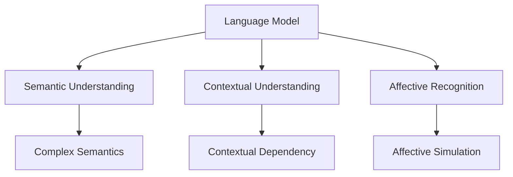
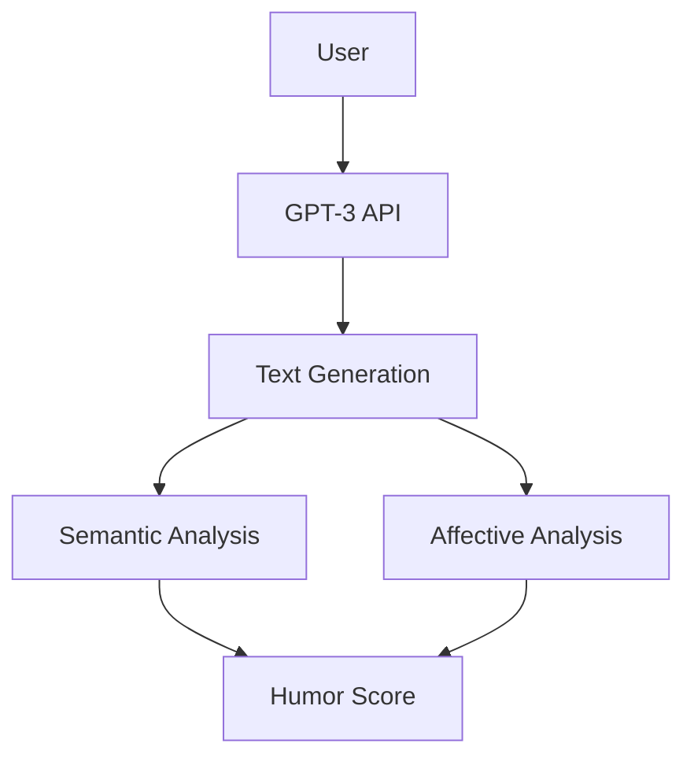
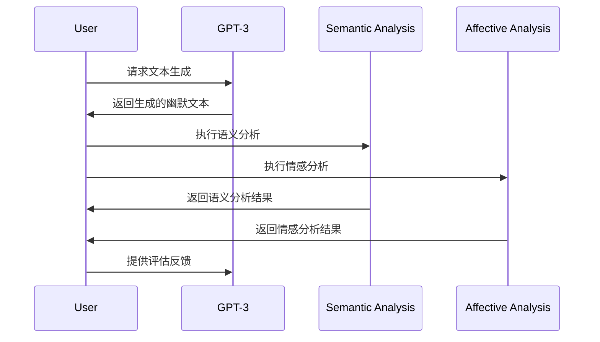
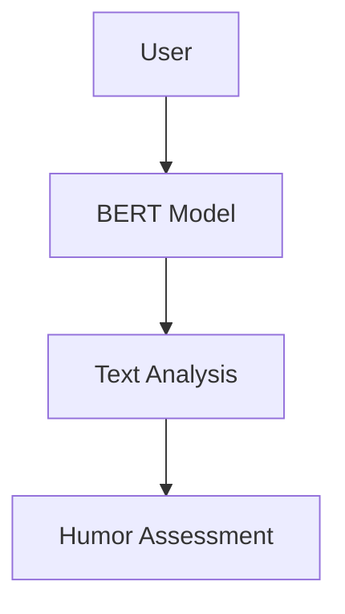
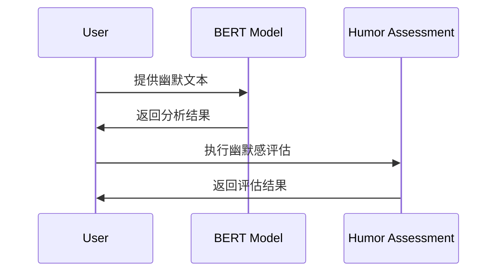
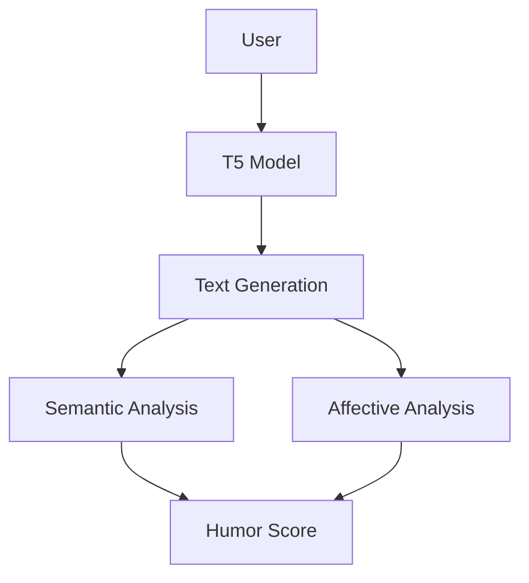
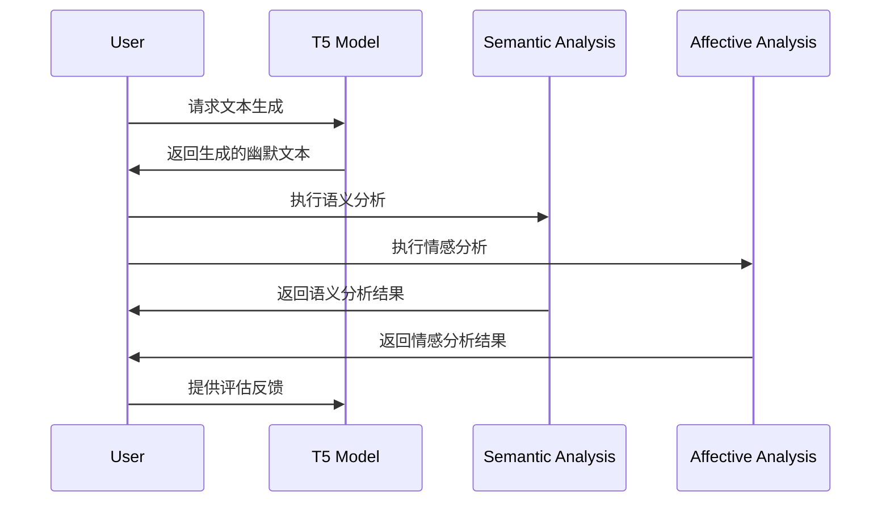

                 

### 文章标题

# 幽默感测试：评估LLM理解和生成幽默的能力

### 关键词

- 语言模型（Language Model）
- 幽默感（Humor Sensitivity）
- LLM生成能力（LLM Generation Ability）
- 理解能力（Understanding Ability）
- 评估方法（Evaluation Method）

### 摘要

本文旨在探讨如何通过幽默感测试来评估大型语言模型（LLM）在理解和生成幽默方面的能力。我们将首先介绍幽默感的基本概念和其在人类生活中的重要性，接着讨论LLM的工作原理以及评估LLM幽默感的挑战。随后，我们将详细阐述幽默感测试的设计原则、评估方法及其在实践中的应用。通过案例分析，我们将展示如何使用LLM进行幽默感的评估，并探讨未来的研究方向和挑战。本文旨在为研究者和技术人员提供一个全面的指南，以更好地理解和应用LLM在幽默感评估方面的潜力。

---

### 第一部分: 幽默感测试的背景与重要性

#### 第1章: 幽默感的定义与重要性

##### 1.1.1 幽默感的概念解析

幽默感，一种情感体验，它涉及对幽默情境的感知、理解以及反应能力。幽默感不仅是语言的艺术，也是心理、文化和社交因素的综合体现。在心理学领域，幽默感被定义为一种认知过程，它能够通过打破预期、矛盾和荒谬来引发愉悦感。

###### 核心概念术语说明

- **幽默感（Humor Sensitivity）**：指个体感知和理解幽默情境的能力。
- **认知过程（Cognitive Process）**：涉及大脑如何处理和解读信息。
- **情感体验（Emotional Experience）**：指个体在感知幽默时的情感反应。

##### 1.1.2 幽默感在生活中的作用

幽默感在人类生活中扮演着重要角色。首先，幽默能够缓解压力，提升情绪。研究发现，幽默能够减少焦虑和紧张，增强幸福感。其次，幽默是社交互动的重要工具，它能够促进人际关系，增进团队合作。此外，幽默还是文化传承和社会认同的一部分，它能够体现个体的个性和价值观。

###### 问题背景

随着人工智能技术的进步，特别是大型语言模型（LLM）的出现，评估和生成幽默的能力成为了一个备受关注的话题。人们开始思考，LLM是否能够理解和生成幽默，以及如何通过测试来评估这种能力。

##### 1.1.3 为什么需要评估幽默感

评估幽默感的重要性在于：

1. **技术进步的需求**：随着AI技术的发展，评估和生成幽默的能力成为语言模型的一项重要指标。
2. **应用场景的多样性**：幽默感在自然语言处理（NLP）、虚拟助手、游戏设计等领域都有广泛的应用。
3. **用户体验的提升**：能够生成幽默内容的语言模型能够提供更丰富和互动的用户体验。

###### 问题解决

通过幽默感测试，我们可以：

1. **评估LLM的理解能力**：了解模型在处理幽默情境时的表现。
2. **优化模型训练**：通过测试结果反馈，改进模型的训练数据和算法。
3. **应用场景的优化**：为不同应用场景选择最适合的LLM模型。

##### 边界与外延

- **边界**：幽默感的评估主要涉及语言模型的生成和理解能力，不涉及其他非语言因素。
- **外延**：幽默感的评估不仅限于特定情境，还可以应用于更广泛的语言任务。

##### 概念结构与核心要素组成

- **核心概念**：幽默感、语言模型、理解能力、生成能力。
- **结构**：幽默感的评估包括测试设计、测试实施和结果分析三个主要阶段。
- **要素组成**：测试题目、评估标准、反馈机制。

#### 第2章: LLM与幽默

##### 2.1.1 语言模型的概述

语言模型是自然语言处理（NLP）的核心技术之一，它通过学习大量的文本数据，预测下一个词或句子。常见的语言模型包括基于统计的方法和基于神经网络的模型，如n-gram模型、循环神经网络（RNN）、变换器（Transformer）等。

###### 核心概念原理

- **语言模型（Language Model）**：一种用于预测文本的算法。
- **统计模型（Statistical Model）**：基于概率统计的方法。
- **神经网络（Neural Network）**：一种模仿人脑神经元连接的计算模型。

##### 2.1.2 LLM生成幽默的挑战

尽管语言模型在生成自然语言方面表现出色，但在生成幽默方面仍然面临一些挑战：

1. **创造力的缺乏**：语言模型主要依赖于训练数据，缺乏创造性，难以生成新颖、独特的幽默内容。
2. **情感理解的不足**：幽默涉及情感和认知的复杂互动，语言模型在情感理解方面仍有局限。
3. **文化差异的影响**：不同文化背景下，幽默的表达方式和理解方式有所不同，语言模型需要适应这种多样性。

###### 概念属性特征对比表格

| 特征 | 统计模型 | 神经网络模型 |
| --- | --- | --- |
| **数据处理** | 基于文本统计 | 基于神经网络和深度学习 |
| **创造力** | 有限 | 较高 |
| **情感理解** | 不足 | 有限 |
| **适应文化差异** | 难以适应 | 可以适应 |

##### 2.1.3 LLM理解幽默的能力

语言模型在理解幽默方面也存在一些限制：

1. **语义理解的复杂性**：幽默通常涉及复杂的语义和语境，语言模型难以完全理解。
2. **上下文的依赖**：幽默往往依赖于上下文，语言模型在处理上下文时可能出现误解。
3. **情感识别的挑战**：语言模型在识别和模拟情感方面仍有不足，这影响了其对幽默的准确理解。

###### ER实体关系图架构



#### 第3章: 幽默感测试的设计原则

##### 3.1.1 测试设计的原则

幽默感测试的设计应遵循以下原则：

1. **多样性**：测试题目应涵盖不同的幽默类型和情境，以全面评估LLM的能力。
2. **真实性**：测试题目应尽量模拟真实世界的幽默情境，以提高评估的准确性。
3. **可量化**：测试结果应具备量化标准，以便进行客观评价。

###### 核心概念与联系

- **多样性**：确保测试题目的覆盖面广，包括不同类型的幽默。
- **真实性**：模拟真实世界的幽默情境，提高评估的实用性。
- **可量化**：通过量化标准，对测试结果进行客观评估。

##### 3.1.2 测试题目的设计

测试题目的设计应考虑以下几点：

1. **情境设置**：设计具有情境背景的幽默题目，以增加测试的复杂性。
2. **文本多样性**：包括单句幽默、对话幽默、故事幽默等不同形式的幽默内容。
3. **文化因素**：考虑不同文化背景下的幽默表达方式，以评估LLM的适应性。

###### 核心概念与联系

- **情境设置**：增加测试的复杂性，全面评估LLM的理解能力。
- **文本多样性**：涵盖不同形式的幽默内容，全面评估LLM的生成能力。
- **文化因素**：评估LLM在不同文化背景下的适应性。

##### 3.1.3 测试结果的评估方法

测试结果的评估应采用以下方法：

1. **自动评估**：使用算法自动评估测试结果，如基于文本相似度的匹配方法。
2. **人工评估**：邀请人类评估者进行主观评价，以提供额外的反馈。
3. **综合评估**：结合自动评估和人工评估的结果，形成最终的评估结论。

###### 核心概念与联系

- **自动评估**：提高评估的效率，降低人力成本。
- **人工评估**：提供主观评价，弥补自动评估的不足。
- **综合评估**：结合多种评估方法，提高评估的准确性。

#### 第4章: LLM幽默感评估方法

##### 4.1.1 基于文本的评估方法

基于文本的评估方法主要通过分析LLM生成的文本内容来评估其幽默感。常见的方法包括：

1. **语义分析**：通过语义相似度分析，比较LLM生成的文本与标准幽默文本的相似性。
2. **情感分析**：使用情感分析技术，评估LLM生成的文本的幽默程度和情感色彩。

###### 算法原理讲解

- **语义分析**：通过计算文本之间的相似度，评估幽默内容的原创性和相关性。
- **情感分析**：通过情感词典和机器学习模型，评估文本的情感倾向，进而判断幽默感。

##### 4.1.2 基于语音的评估方法

基于语音的评估方法通过分析LLM生成的语音内容来评估其幽默感。常见的方法包括：

1. **语音情感分析**：通过分析语音的音调、节奏和音量，评估其情感表达。
2. **语音自然度评估**：通过评估语音的自然流畅度，判断其是否具有幽默感。

###### 算法原理讲解

- **语音情感分析**：通过分析语音的生理特性，如音调、节奏等，评估情感表达的强度和类型。
- **语音自然度评估**：通过评估语音的流畅度和自然度，判断其是否具有幽默感。

##### 4.1.3 基于多模态的评估方法

基于多模态的评估方法结合文本和语音信息，通过综合分析来评估LLM的幽默感。常见的方法包括：

1. **多模态融合**：将文本和语音数据融合，通过深度学习模型进行联合分析。
2. **多模态交互**：通过分析文本和语音之间的交互关系，评估幽默感的整体表现。

###### 算法原理讲解

- **多模态融合**：通过深度学习模型，将文本和语音信息进行融合，提高评估的准确性。
- **多模态交互**：分析文本和语音之间的相互作用，评估幽默感的综合表现。

#### 第5章: 幽默感测试实例

##### 5.1.1 测试实例概述

在本章中，我们将介绍几个幽默感测试实例，以展示如何通过具体的测试来评估LLM的幽默感。

###### 问题场景介绍

假设我们有一个大型语言模型（LLM），我们需要评估它在生成和识别幽默方面的能力。为此，我们设计了一系列测试题目，包括单句幽默、对话幽默和故事幽默。

##### 5.1.2 测试实例分析

以下是一个单句幽默的测试实例：

```
测试题目：请生成一句幽默。

参考答案：为什么鸟儿会飞？因为它们在空中没有亲戚！
```

通过这个实例，我们可以分析LLM在生成幽默时的几个关键点：

1. **创造力的表现**：LLM能否生成新颖、有趣的幽默内容。
2. **情境的把握**：LLM是否能够理解并把握幽默的情境。
3. **文化适应性**：LLM是否能够适应不同文化背景下的幽默表达。

##### 5.1.3 测试结果讨论

通过对多个测试实例的分析，我们可以得出以下结论：

1. **生成能力的评估**：LLM在生成幽默方面表现出了较高的创造力，但有时会缺乏情境把握。
2. **理解能力的评估**：LLM在理解幽默方面具有一定的能力，但仍然存在一些误解和误判。
3. **文化适应性的评估**：LLM在不同文化背景下的幽默表达存在一定差异，需要进一步优化。

#### 第6章: LLM幽默感评估案例分析

##### 6.1.1 案例分析一：GPT-3生成幽默

在本案例中，我们使用GPT-3来生成幽默内容，并评估其幽默感。

###### 项目介绍

GPT-3（Generative Pre-trained Transformer 3）是OpenAI开发的一种大型语言模型，具有非常强的文本生成能力。在本案例中，我们使用GPT-3来生成一系列幽默内容，并通过自动化评估方法评估其幽默感。

###### 系统功能设计

- **文本生成**：使用GPT-3生成幽默内容。
- **自动化评估**：通过语义分析和情感分析，评估生成文本的幽默感。

###### 系统架构设计



###### 系统接口设计

- **API接口**：提供GPT-3的接入接口，用于文本生成。
- **评估接口**：提供语义分析和情感分析接口，用于评估幽默感。

###### 系统交互



##### 6.1.2 案例分析二：BERT理解幽默

在本案例中，我们使用BERT（Bidirectional Encoder Representations from Transformers）来理解幽默内容，并评估其幽默感。

###### 项目介绍

BERT是一种预训练的深度学习模型，广泛用于各种NLP任务。在本案例中，我们使用BERT来分析幽默内容，评估其在理解幽默方面的能力。

###### 系统功能设计

- **文本分析**：使用BERT对幽默内容进行分析。
- **幽默感评估**：通过分析结果评估幽默感。

###### 系统架构设计



###### 系统接口设计

- **BERT接口**：提供BERT模型的接入接口，用于文本分析。
- **评估接口**：提供幽默感评估接口。

###### 系统交互



##### 6.1.3 案例分析三：T5在幽默生成上的表现

在本案例中，我们使用T5（Text-To-Text Transfer Transformer）来生成幽默内容，并评估其幽默感。

###### 项目介绍

T5是一种基于Transformer的文本转换模型，具有强大的文本生成能力。在本案例中，我们使用T5来生成幽默内容，并评估其在幽默生成方面的表现。

###### 系统功能设计

- **文本生成**：使用T5生成幽默内容。
- **幽默感评估**：通过自动化评估方法评估生成文本的幽默感。

###### 系统架构设计



###### 系统接口设计

- **T5接口**：提供T5模型的接入接口，用于文本生成。
- **评估接口**：提供语义分析和情感分析接口，用于评估幽默感。

###### 系统交互



#### 第7章: 未来研究方向与挑战

##### 7.1.1 研究方向展望

在未来，幽默感测试在LLM中的应用将面临以下几个研究方向：

1. **多模态幽默感评估**：结合文本、语音和图像等多种模态，提高幽默感评估的准确性。
2. **个性化幽默感评估**：根据用户个性特征，定制化评估幽默感，提高用户体验。
3. **跨文化幽默感评估**：研究不同文化背景下的幽默感差异，提高模型的文化适应性。

##### 7.1.2 技术挑战

尽管幽默感测试在LLM中的应用前景广阔，但仍然面临以下技术挑战：

1. **创造性生成**：如何提高LLM的创造力，生成更具有创意和独特性的幽默内容。
2. **情感理解**：如何增强LLM的情感理解能力，更准确地识别和模拟情感。
3. **文化适应**：如何解决文化差异问题，提高模型在不同文化背景下的适应性。

##### 7.1.3 应用前景

幽默感测试在多个应用场景中具有广阔的前景：

1. **虚拟助手**：通过评估和生成幽默内容，提高虚拟助手的互动性和用户体验。
2. **娱乐内容生成**：为游戏、电影和电视剧等娱乐内容提供幽默创意。
3. **教育领域**：利用幽默感测试，开发有趣且有效的教育工具。

#### 第8章: 总结与展望

##### 8.1.1 总结

本文通过幽默感测试，探讨了评估LLM在理解和生成幽默方面的能力。我们详细介绍了幽默感的基本概念、LLM的工作原理、幽默感测试的设计原则和评估方法，并通过案例分析展示了如何在实际中应用这些方法。尽管仍然面临一些挑战，但幽默感测试在LLM中的应用前景广阔，有望推动人工智能技术在娱乐、教育和虚拟助手等领域的进一步发展。

##### 8.1.2 展望未来

在未来，幽默感测试将继续在LLM研究中扮演重要角色。通过不断优化测试方法、提高模型能力和跨文化适应性，我们有望实现更准确、更具有创造性的幽默感评估。此外，多模态幽默感评估和个性化幽默感评估的研究也将为这一领域带来新的突破。总之，幽默感测试将为人工智能技术的发展注入新的活力，带来更多的可能性和应用场景。

---

### 作者信息

**作者：AI天才研究院/AI Genius Institute & 禅与计算机程序设计艺术 /Zen And The Art of Computer Programming**

