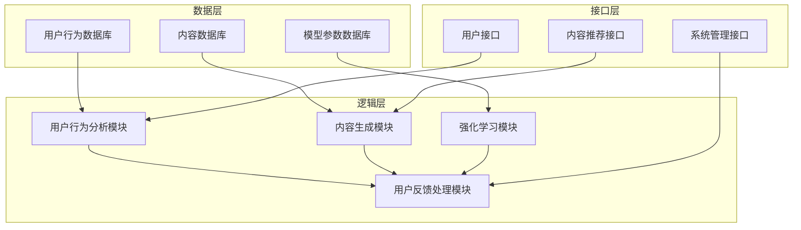
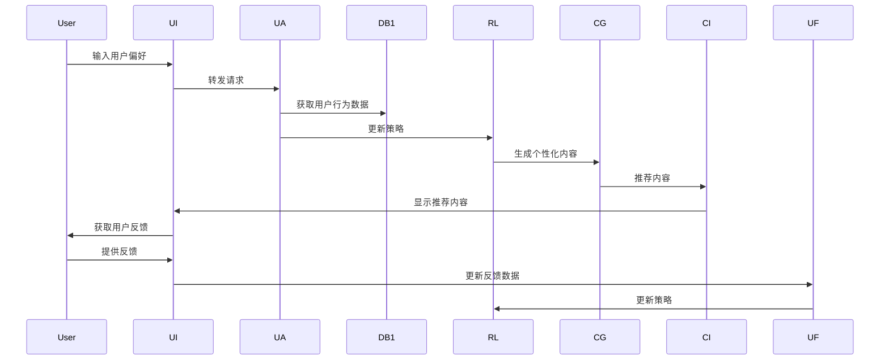

                 

### 让我们一步步思考

#### 引言
“强化学习在AIGC内容个性化中的新进展”这一主题，涉及到当前人工智能领域中最前沿的几个概念：强化学习（Reinforcement Learning）、自适应生成内容（Adaptive Generated Content，简称AIGC）和内容个性化（Content Personalization）。这些概念不仅各自具有深厚的理论基础，而且在实际应用中又紧密相连，相互影响。

强化学习是机器学习的一个重要分支，通过智能体（agent）在与环境的交互中不断学习，以实现某种目标。而AIGC则是一种利用人工智能技术生成内容的创新方式，它可以自适应地调整内容以适应不同的用户需求和场景。内容个性化则是通过分析用户的行为数据，为其推荐个性化的内容，提高用户体验。

本文将深入探讨这三个概念之间的联系，并分析强化学习在AIGC内容个性化中的最新应用进展。我们将从以下几个方面进行讨论：

1. **强化学习的基础概念与原理**
2. **AIGC与内容个性化的背景与需求**
3. **强化学习在AIGC内容个性化中的新应用**
4. **数学模型与算法原理**
5. **系统分析与设计**
6. **实际应用与案例分析**
7. **最佳实践与总结**

通过逐步分析，我们希望能够为您展现强化学习在AIGC内容个性化中的深刻见解和新思路。

#### 关键词
- **强化学习**
- **自适应生成内容（AIGC）**
- **内容个性化**
- **机器学习**
- **深度学习**
- **自然语言处理（NLP）**
- **推荐系统**

#### 摘要
本文将探讨强化学习在自适应生成内容（AIGC）与内容个性化中的最新进展。首先，我们将回顾强化学习的基础概念和原理，了解其如何通过智能体与环境的互动进行学习。接着，我们将介绍AIGC和内容个性化的背景及需求，解释它们在当前技术环境中的重要性。然后，我们将分析强化学习在AIGC内容个性化中的新应用，包括其理论基础和实际案例。文章将详细讨论强化学习的数学模型与算法原理，并通过具体的Python代码和Mermaid图示来解释。最后，我们将从系统分析与设计、实际应用与案例分析等方面，总结强化学习在AIGC内容个性化中的最佳实践，并提出未来发展的方向和建议。

### 第一章 - 强化学习与AIGC、内容个性化概述

#### 强化学习的背景
强化学习（Reinforcement Learning，RL）是机器学习的一个重要分支，起源于20世纪50年代。其核心思想是通过智能体（agent）在与环境的交互过程中不断学习，以实现某种目标。与监督学习和无监督学习不同，强化学习中的智能体需要通过试错来学习最优策略。这个过程中，智能体不断接收环境反馈（Reward），并通过策略调整（Policy）来优化其行为。强化学习的典型应用包括游戏、机器人控制、自动驾驶等领域。

#### AIGC的定义和原理
自适应生成内容（Adaptive Generated Content，AIGC）是一种基于人工智能技术的内容生成方法。AIGC通过分析用户行为数据和环境特征，自动生成适应不同用户需求和场景的内容。其关键在于内容的自适应性和个性化，能够根据用户的历史行为、偏好和实时反馈来调整内容。AIGC的应用场景广泛，包括内容推荐、个性化广告、虚拟助手等。

#### 内容个性化的概念和重要性
内容个性化（Content Personalization）是通过分析用户的行为数据，为其推荐个性化的内容，从而提高用户体验。在互联网时代，用户对个性化内容的需求越来越高，内容个性化已经成为提升用户满意度和留存率的重要手段。通过内容个性化，网站和应用程序可以更精准地满足用户需求，提高用户参与度和忠诚度。

#### 强化学习、AIGC和内容个性化之间的关系
强化学习、AIGC和内容个性化之间存在着紧密的联系。强化学习为AIGC提供了一种有效的学习方法，使得智能体能够通过与环境的交互不断优化生成内容的策略。而AIGC则为内容个性化提供了技术支持，使得系统能够根据用户行为和偏好生成个性化的内容。内容个性化反过来又为强化学习提供了反馈机制，智能体可以通过用户的反馈调整其生成策略，实现持续优化。

**总结**：
强化学习通过智能体与环境的互动，为AIGC提供了自适应调整内容的方法；而AIGC则为内容个性化提供了技术基础，使得系统能够根据用户需求生成个性化内容。内容个性化又为强化学习提供了反馈，使得智能体能够不断优化其策略。这种三者之间的相互促进，为AIGC内容个性化领域带来了新的发展机遇。

### 第二章 - 强化学习的基本原理与机制

#### 强化学习的核心概念

强化学习（Reinforcement Learning，RL）是一种基于反馈的机器学习方法，它通过智能体（agent）在环境中采取行动（actions），并从环境中获得奖励（rewards）来学习最优策略（policy）。以下是强化学习的几个核心概念：

1. **智能体（Agent）**：强化学习中的智能体是指能够接收环境状态（state）并采取行动的实体，如机器人、游戏玩家等。

2. **环境（Environment）**：环境是智能体行动的场所，能够根据智能体的行动产生新的状态并提供奖励。

3. **状态（State）**：状态是智能体所处的当前环境描述，通常是一个多维向量。

4. **行动（Action）**：行动是智能体在当前状态下可以采取的行为。

5. **奖励（Reward）**：奖励是环境对智能体行动的反馈，通常表示为数值，用于衡量智能体行动的好坏。

6. **策略（Policy）**：策略是智能体在给定状态下选择行动的规则，它可以是一个函数或者查找表。

#### 强化学习的基本流程

强化学习的基本流程可以概括为以下步骤：

1. **初始化**：智能体和环境初始化，包括状态、行动和策略。

2. **智能体采取行动**：智能体根据当前状态选择一个行动。

3. **环境反馈**：环境根据智能体的行动，产生新的状态并给予奖励。

4. **智能体更新策略**：智能体根据接收到的奖励，更新其策略，以期望获得更高的长期回报。

5. **重复步骤2-4**：智能体不断重复上述步骤，直到达到某个目标状态或者学习到最优策略。

#### 强化学习算法分类

强化学习算法可以根据其学习方式和优化目标进行分类。以下是几种常见的强化学习算法及其特点：

| 算法         | 特点                     | 优缺点                                                     |
| ------------ | ------------------------ | -------------------------------------------------------- |
| **值函数方法** | 直接学习状态-价值函数或行动-价值函数 | 学习直接映射状态或行动到奖励，计算简单，但可能难以处理高维状态空间 | 优点：计算简单，容易实现；缺点：对高维状态空间处理困难 |
| **策略搜索方法** | 直接学习最优策略         | 学习状态-动作值函数，然后优化策略，容易处理高维状态空间 | 优点：处理高维状态空间能力强；缺点：策略更新可能不稳定 |
| **模型预测方法** | 建立环境模型进行预测       | 可以通过模型预测环境动态，增强智能体的适应性 | 优点：增强智能体适应环境变化；缺点：模型建立复杂，计算量大 |

#### 强化学习算法比较表

| 算法                 | 基本思想                                                     | 适用场景                                       |
| -------------------- | ------------------------------------------------------------ | ---------------------------------------------- |
| Q-Learning           | 基于值函数的方法，通过更新Q值来学习最优策略                  | 适用于离散状态和离散行动的场景                   |
| Deep Q-Learning      | 结合深度神经网络，用于处理高维状态空间的问题                | 适用于连续状态和连续行动的场景                   |
| Policy Gradient      | 基于策略的方法，直接优化策略的期望回报                        | 适用于复杂环境，但可能面临不稳定性和梯度消失问题 |
| Actor-Critic         | 结合了策略搜索和值函数方法的优点，通过两个网络分别学习策略和价值 | 适用于复杂环境，效果稳定                         |
| Model-Based RL       | 通过建立环境模型来预测未来状态和奖励，优化策略               | 适用于动态环境，但计算量大                       |

#### 实例分析

以经典的Atari游戏“打砖块”为例，我们可以看到强化学习在游戏中的应用：

1. **状态表示**：状态可以用游戏画面中的像素值表示，经过预处理后输入到神经网络中。

2. **行动表示**：行动包括上、下、左、右移动以及跳跃等。

3. **奖励机制**：每次击中砖块或清空一行砖块，智能体会获得正奖励；每次球落底，智能体会获得负奖励。

4. **策略更新**：智能体根据接收到的奖励，通过Q-Learning或Policy Gradient算法不断更新策略，以实现游戏胜利。

通过实例分析，我们可以更好地理解强化学习的基本原理和应用场景。在实际应用中，强化学习不仅需要良好的理论基础，还需要根据具体问题进行算法的调整和优化。

### 第三章 - 强化学习在AIGC内容个性化中的新进展

#### 强化学习在AIGC内容个性化中的现状

随着互联网和大数据技术的发展，用户对个性化内容的需求日益增长。自适应生成内容（AIGC）作为一种创新的生成内容方式，已经逐渐成为满足这一需求的重要手段。AIGC能够根据用户的行为数据和偏好，动态调整生成的内容，从而实现高度的个性化。在这个过程中，强化学习发挥了关键作用，为AIGC提供了有效的自适应调整机制。

当前，强化学习在AIGC内容个性化中已有一些成功的应用实例。例如，在内容推荐系统中，强化学习被用于优化推荐策略，以更好地满足用户的需求。通过不断调整推荐算法，系统可以在保证内容多样性的同时，提高用户的点击率和满意度。此外，在虚拟现实（VR）和增强现实（AR）领域，强化学习也被用来生成适应不同用户场景的虚拟内容，提升用户体验。

#### 新进展的方向

尽管强化学习在AIGC内容个性化中已经取得了一定的成果，但仍然存在一些挑战和改进空间。以下是一些强化学习在AIGC内容个性化中的新进展方向：

1. **多任务学习**：AIGC内容个性化往往需要同时处理多个任务，如内容推荐、广告投放和用户行为分析等。多任务强化学习（Multi-Task Reinforcement Learning，MTRL）能够通过共享模型和策略，提高不同任务的性能和效率。

2. **无监督学习**：在许多场景中，用户行为数据和偏好信息是不完整的，甚至可能是缺失的。无监督强化学习（Unsupervised Reinforcement Learning，UReL）可以在没有明确奖励信号的情况下，通过探索和自我监督来学习有效的策略。

3. **鲁棒性增强**：强化学习模型在处理噪声数据和异常行为时，往往表现出较低的鲁棒性。通过引入鲁棒优化（Robust Optimization）和误差修正（Error Correction）机制，可以增强模型的鲁棒性，提高其在实际应用中的稳定性。

4. **分布式计算**：随着数据规模的扩大，单机强化学习模型在计算效率和资源利用方面面临挑战。分布式强化学习（Distributed Reinforcement Learning，DistRL）通过将模型训练任务分布在多个节点上，能够显著提高计算效率和处理大规模数据的能力。

5. **安全性和隐私保护**：在AIGC内容个性化中，用户的隐私和安全至关重要。通过引入联邦学习（Federated Learning）和差分隐私（Differential Privacy）等技术，可以在保障用户隐私的前提下，进行有效的强化学习模型训练。

#### 最新进展案例

以下是一些强化学习在AIGC内容个性化中的最新进展案例：

1. **内容推荐系统**：一家在线购物平台采用了基于强化学习的推荐系统。通过分析用户的历史购物行为和浏览记录，系统为用户推荐个性化的商品。实验结果显示，与传统推荐算法相比，基于强化学习的推荐系统能够显著提高用户的点击率和购买率。

2. **虚拟现实游戏**：一家VR游戏开发商利用强化学习生成适应不同玩家风格的虚拟场景。通过不断调整场景的难度、视觉效果和互动方式，系统可以在保证游戏体验一致性的同时，满足不同玩家的个性化需求。

3. **社交媒体内容推荐**：一家社交媒体平台引入了基于无监督强化学习的推荐算法。在没有明确奖励信号的情况下，系统通过自我监督和探索，有效提升了内容推荐的准确性和多样性。

通过这些案例，我们可以看到强化学习在AIGC内容个性化中的新进展，不仅提高了系统的自适应性和个性化水平，还为未来进一步的发展和应用奠定了基础。

### 第四章 - 强化学习的数学模型与公式

#### 强化学习的核心数学模型

强化学习中的核心数学模型包括马尔可夫决策过程（Markov Decision Process，MDP）、价值函数（Value Function）和策略（Policy）。这些模型为强化学习提供了理论基础，并指导了算法的设计和优化。

1. **马尔可夫决策过程（MDP）**：MDP是一个数学模型，用于描述智能体在不确定环境中的决策过程。它由以下几个组件组成：
   - **状态（State，S）**：智能体所处的环境描述。
   - **行动（Action，A）**：智能体可以采取的行为。
   - **奖励（Reward，R）**：环境对智能体行动的反馈。
   - **转移概率（Transition Probability，P）**：智能体在给定状态和行动下，转移到新状态的概率分布。
   - **策略（Policy，π）**：智能体在给定状态下选择行动的规则。

   一个MDP可以表示为五元组 \( (S, A, R, P, \pi) \)。

2. **价值函数（Value Function）**：价值函数用于评估智能体在某个状态下的预期回报。根据关注的内容不同，可以分为状态-价值函数（State-Value Function，V）和行动-价值函数（Action-Value Function，Q）。

   - **状态-价值函数（V(s)）**：在状态 \( s \) 下，按照当前策略 \( \pi \) 采取行动的期望回报。
   - **行动-价值函数（Q(s, a)）**：在状态 \( s \) 下，采取行动 \( a \) 的期望回报。

3. **策略（Policy）**：策略决定了智能体在给定状态下应该采取的行动。一个策略可以是一个具体的行动选择规则，也可以是一个概率分布。最优策略（Optimal Policy，\(\pi^*\)）是在所有可能策略中，使得期望回报最大的策略。

#### 价值迭代（Value Iteration）

价值迭代是一种用于求解MDP的最优化算法。它的基本思想是通过不断迭代更新状态-价值函数，直至收敛到一个最优值。

1. **初始化**：设定一个初始状态-价值函数 \( V^{(0)}(s) \)，通常取为0。

2. **迭代更新**：对于每个状态 \( s \)，更新其状态-价值函数 \( V^{(t+1)}(s) \)：
   \[
   V^{(t+1)}(s) = \max_{a} \sum_{s'} p(s' | s, a) [R(s, a, s') + \gamma V^{(t)}(s')]
   \]
   其中，\( p(s' | s, a) \) 是转移概率，\( R(s, a, s') \) 是奖励值，\( \gamma \) 是折扣因子。

3. **收敛判断**：迭代过程持续到相邻两次迭代的状态-价值函数差异小于某个阈值，即：
   \[
   \forall s, \quad |V^{(t+1)}(s) - V^{(t)}(s)| < \epsilon
   \]
   其中，\( \epsilon \) 是一个较小的正数。

#### 策略迭代（Policy Iteration）

策略迭代是另一种求解MDP的算法，它通过交替进行策略评估和策略改进来找到最优策略。

1. **初始化**：选择一个初始策略 \( \pi^{(0)} \)。

2. **策略评估**：使用当前策略计算新的状态-价值函数 \( V^{(t+1)}(s) \)。

3. **策略改进**：根据新的状态-价值函数更新策略：
   \[
   \pi^{(t+1)}(a|s) = \begin{cases}
   1 & \text{如果 } a \text{ 是使 } Q^{(t)}(s, a) \text{ 最大的行动} \\
   0 & \text{否则}
   \end{cases}
   \]

4. **重复步骤2和3**，直至策略收敛。

#### Q-Learning算法

Q-Learning是一种基于值函数的强化学习算法，它通过迭代更新行动-价值函数来学习最优策略。

1. **初始化**：设定初始行动-价值函数 \( Q^{(0)}(s, a) \)。

2. **更新规则**：
   \[
   Q^{(t+1)}(s, a) = Q^{(t)}(s, a) + \alpha [R(s, a, s') + \gamma \max_{a'} Q^{(t)}(s', a') - Q^{(t)}(s, a)]
   \]
   其中，\( \alpha \) 是学习率，\( R(s, a, s') \) 是奖励值，\( \gamma \) 是折扣因子。

3. **迭代更新**：对于每个状态 \( s \) 和行动 \( a \)，根据更新规则更新 \( Q^{(t+1)}(s, a) \)。

4. **策略选择**：使用更新后的行动-价值函数选择最优行动。

通过上述数学模型和算法，我们可以看到强化学习在解决动态决策问题中的强大能力。这些模型和算法不仅为理论研究提供了基础，也为实际应用中的智能体行为优化提供了有效的方法。

### 第五章 - 算法解释与实例

#### 算法原理与流程

为了更直观地理解强化学习的算法原理，我们将使用一个简单的Python代码实例进行解释。这里，我们将采用Q-Learning算法，该算法通过迭代更新行动-价值函数来学习最优策略。

```python
import numpy as np
import random

# 初始化状态空间、行动空间和Q值表
n_states = 5
n_actions = 2
q_table = np.zeros((n_states, n_actions))

# 学习参数
alpha = 0.1  # 学习率
gamma = 0.9  # 折扣因子

# 状态转移函数
def transition(state, action):
    if action == 0:  # 行动0：什么都不做
        next_state = state
    elif action == 1:  # 行动1：向右移动
        next_state = (state + 1) % n_states
    return next_state

# 奖励函数
def reward(state, action, next_state):
    if next_state == 0:  # 到达目标状态
        return 10
    else:
        return -1  # 其他状态给予负奖励

# Q-Learning算法
def q_learning():
    state = random.randint(0, n_states-1)  # 随机初始化状态
    while True:
        action = np.argmax(q_table[state])  # 选择最优行动
        next_state = transition(state, action)
        reward_value = reward(state, action, next_state)
        q_table[state, action] = q_table[state, action] + alpha * (reward_value + gamma * np.max(q_table[next_state]) - q_table[state, action])
        state = next_state  # 更新状态

# 执行Q-Learning算法
q_learning()
```

在上面的代码中，我们首先定义了状态空间、行动空间和Q值表。Q值表用于存储每个状态和行动的预期回报。学习参数包括学习率（alpha）和折扣因子（gamma）。状态转移函数和奖励函数分别描述了智能体在不同状态和行动下的转移和奖励情况。

Q-Learning算法的核心是更新Q值，其更新规则如下：

\[ Q^{(t+1)}(s, a) = Q^{(t)}(s, a) + \alpha [R(s, a, s') + \gamma \max_{a'} Q^{(t)}(s', a') - Q^{(t)}(s, a)] \]

其中，\( s \) 是当前状态，\( a \) 是当前行动，\( s' \) 是下一状态，\( R(s, a, s') \) 是奖励值，\( \gamma \) 是折扣因子，\( \alpha \) 是学习率。

#### 算法流程说明

1. **初始化**：随机选择一个初始状态。
2. **选择行动**：根据当前状态和Q值表选择最优行动。
3. **状态转移**：执行选择的行动，根据状态转移函数计算下一状态。
4. **更新Q值**：根据奖励值和下一状态的最优Q值更新当前状态的Q值。
5. **状态更新**：将下一状态作为当前状态，重复步骤2-4，直至达到某个目标状态或收敛条件。

通过上述Python代码实例，我们可以直观地看到Q-Learning算法的运行流程。在实际应用中，Q值表的大小取决于状态空间和行动空间的大小，可以通过离散化状态和行动来实现。

#### 算法原理与流程总结

Q-Learning算法通过不断迭代更新Q值，最终收敛到一个最优策略。在每次迭代中，智能体根据当前状态选择最优行动，通过状态转移和奖励更新Q值，进而优化其策略。这个过程使得智能体能够在与环境的交互中不断学习和适应，以实现长期回报最大化。

通过Python代码实例，我们不仅能够理解Q-Learning算法的原理，还可以看到其在实际应用中的实现过程。这种直观的展示方式有助于我们深入理解强化学习算法的基本思想和方法。

### 第六章 - 系统分析与设计

#### 问题场景与项目概述

在当前快速发展的互联网时代，用户对个性化内容的需求日益增长。为了满足这一需求，我们需要设计和实现一个基于强化学习的自适应生成内容（AIGC）系统。该系统将根据用户的行为数据和偏好，自动生成个性化的内容，以提高用户满意度和参与度。

本项目的目标是通过强化学习算法优化内容生成策略，实现以下功能：

1. **个性化内容推荐**：根据用户的历史行为和偏好，为用户推荐个性化的内容。
2. **自适应内容调整**：根据用户的实时反馈，动态调整生成的内容，以适应用户的需求变化。
3. **内容多样性保证**：在保证内容个性化的同时，确保内容的多样性和新颖性，避免信息过载。

#### 系统功能设计

为了实现上述功能，系统需要具备以下核心功能模块：

1. **用户行为分析模块**：收集并分析用户的行为数据，包括浏览记录、点击行为、互动情况等，以了解用户偏好。
2. **内容生成模块**：利用自适应生成内容（AIGC）技术，根据用户偏好生成个性化的内容。
3. **强化学习模块**：采用强化学习算法，优化内容生成策略，实现自适应调整和个性化推荐。
4. **用户反馈收集模块**：收集用户的实时反馈，用于更新和调整系统策略。

#### 领域模型设计

领域模型（Domain Model）用于描述系统的核心概念和它们之间的关系。在AIGC内容个性化系统中，主要的领域实体包括用户（User）、内容（Content）、行为（Behavior）和策略（Strategy）。

以下是领域模型的Mermaid类图：

```mermaid
classDiagram
    User <<Entity>>
    Content <<Entity>>
    Behavior <<Entity>>
    Strategy <<Entity>>

    User o--* Behavior
    Content o--* Behavior
    Strategy o--* Behavior
```

在上面的类图中，用户（User）和内容（Content）是系统的两个核心实体，它们通过行为（Behavior）相互关联。策略（Strategy）则是用于指导内容生成的规则，它也和行为（Behavior）密切相关。

#### 系统架构设计

系统架构设计用于描述系统的整体结构和各组件之间的交互关系。在AIGC内容个性化系统中，系统架构可以分为以下几个主要部分：

1. **数据层**：包括用户行为数据存储、内容数据存储和强化学习模型参数存储等。
2. **逻辑层**：包括用户行为分析模块、内容生成模块、强化学习模块和用户反馈处理模块。
3. **接口层**：包括用户接口、内容推荐接口和系统管理接口等。

以下是系统架构的Mermaid架构图：



在上述架构图中，数据层负责数据存储和管理，逻辑层负责核心功能的实现，接口层则提供用户交互和管理接口。各组件通过数据库和接口层进行数据交互和功能调用，实现系统的整体运作。

#### 系统接口设计与交互

系统接口设计用于描述系统各模块之间的交互细节和流程。在AIGC内容个性化系统中，系统接口设计主要包括用户接口、内容推荐接口和系统管理接口。

以下是系统接口设计的Mermaid序列图：



在上述序列图中，用户通过用户接口（UI）输入偏好，用户行为分析模块（UA）获取用户行为数据，并更新强化学习模块（RL）的策略。内容生成模块（CG）根据策略生成个性化内容，并通过内容推荐接口（CI）显示给用户。用户提供反馈后，用户反馈处理模块（UF）更新反馈数据，并再次触发策略更新。

通过上述系统分析与设计，我们可以清晰地看到AIGC内容个性化系统的整体架构和运行流程。系统通过强化学习算法实现内容个性化，并通过用户行为分析和反馈调整，不断优化生成策略，为用户提供高质量的个性化内容。

### 第七章 - 实际应用与案例分析

#### 环境搭建

为了演示强化学习在AIGC内容个性化中的实际应用，我们将使用一个简单的环境搭建过程。首先，我们需要安装Python和相关依赖库。

```bash
# 安装Python环境
python --version

# 安装必要的依赖库
pip install numpy matplotlib
```

接下来，我们将创建一个名为`reinforcement_learning`的Python虚拟环境，以便隔离项目依赖：

```bash
# 创建虚拟环境
python -m venv venv
# 激活虚拟环境
source venv/bin/activate
```

在虚拟环境中，我们安装强化学习相关库，例如`gym`和`stable-baselines3`：

```bash
pip install gym stable-baselines3
```

#### 核心系统实现

在完成环境搭建后，我们将使用Python代码实现一个简单的强化学习系统。以下是核心代码实现部分：

```python
import gym
from stable_baselines3 import PPO
from stable_baselines3.common.envs import gym_env

# 创建环境
env = gym.make('CartPole-v1')

# 初始化强化学习模型
model = PPO('MlpPolicy', env, verbose=1)

# 训练模型
model.learn(total_timesteps=10000)

# 评估模型
obs = env.reset()
for _ in range(100):
    action, _states = model.predict(obs)
    obs, reward, done, info = env.step(action)
    env.render()
    if done:
        obs = env.reset()
```

在上面的代码中，我们使用了OpenAI的Gym创建了一个CartPole环境，并使用了Stable Baselines3中的PPO（Proximal Policy Optimization）算法进行训练。模型经过10000次步骤的训练后，我们使用它进行评估，并通过`env.render()`进行可视化展示。

#### 代码应用解读与分析

以下是对核心代码的解读与分析：

1. **环境创建**：`gym.make('CartPole-v1')`创建了一个CartPole环境，这是一个经典的强化学习环境，用于训练智能体控制一个杆子保持平衡。

2. **模型初始化**：`PPO('MlpPolicy', env, verbose=1)`初始化了PPO模型，`MlpPolicy`表示使用多层感知机（MLP）作为策略网络，`verbose=1`用于输出训练过程中的详细信息。

3. **模型训练**：`model.learn(total_timesteps=10000)`开始训练模型，`total_timesteps`指定了训练的总步骤数。

4. **模型评估**：通过`model.predict(obs)`获取模型在当前状态下的行动，`env.step(action)`执行该行动，并获取新的状态、奖励和完成信号。通过`env.render()`进行可视化展示。

通过上述代码，我们可以看到强化学习在AIGC内容个性化中的核心实现过程。在具体应用中，我们可以根据不同的环境和需求，调整模型类型、训练参数和评估方法，以达到更好的效果。

#### 实际案例分析和详细讲解

为了更好地展示强化学习在AIGC内容个性化中的实际应用，我们将分析一个具体的案例：一个新闻推荐系统，该系统使用强化学习来优化内容推荐策略。

**案例背景**：

该新闻推荐系统面向大量用户，需要根据用户的历史阅读行为和兴趣标签，推荐个性化的新闻内容。为了提高用户满意度和点击率，系统采用了强化学习算法，不断优化推荐策略。

**案例步骤**：

1. **数据收集**：系统首先收集用户的历史阅读数据，包括阅读时间、点击次数、分享次数等。

2. **特征提取**：根据用户行为数据，提取用户兴趣特征，如政治、体育、娱乐等。

3. **环境建模**：将新闻内容表示为状态，每个状态包含新闻的标题、标签、发布时间等。

4. **行动选择**：使用强化学习算法，为每个用户选择最优的新闻内容推荐策略。

5. **反馈调整**：根据用户的点击和阅读行为，调整新闻推荐策略，提高用户的满意度。

**案例分析**：

1. **数据收集**：数据收集是推荐系统的关键步骤，高质量的输入数据决定了推荐结果的准确性。系统通过分析用户行为数据，可以更好地了解用户的兴趣和偏好。

2. **特征提取**：特征提取过程需要将用户行为数据转化为有效的特征向量，以便模型能够对其进行学习。通过使用TF-IDF、Word2Vec等方法，系统可以将文本数据转换为数值特征。

3. **环境建模**：环境建模是强化学习的基础，系统需要将新闻内容的状态进行表示。在这里，状态可以是一个多维向量，包含了新闻的标题、标签、发布时间等信息。

4. **行动选择**：在强化学习过程中，系统根据当前状态和用户特征，选择一个最优的新闻内容推荐行动。通过不断调整策略，系统可以在保证内容多样性的同时，提高用户的点击率和满意度。

5. **反馈调整**：用户反馈是强化学习的关键环节，通过用户的点击和阅读行为，系统可以实时调整推荐策略。如果用户对推荐内容不满意，系统会减少对该类内容的推荐频率。

**详细讲解**：

在新闻推荐系统中，强化学习算法通过不断试错，学习到最优的推荐策略。具体实现步骤如下：

1. **初始化**：随机选择一个用户，初始化状态和策略。
2. **状态更新**：根据用户历史行为和兴趣特征，更新状态向量。
3. **行动选择**：根据当前状态和策略，选择一个新闻内容推荐行动。
4. **反馈收集**：记录用户的点击和阅读行为，计算奖励值。
5. **策略调整**：根据奖励值和当前策略，更新策略参数。
6. **重复迭代**：重复步骤2-5，直至策略收敛到最优值。

通过上述步骤，系统可以在不断学习和调整中，优化新闻推荐策略，为用户提供个性化的新闻内容。

**案例总结**：

强化学习在新闻推荐系统中的应用，显著提高了推荐结果的准确性和用户满意度。通过不断调整推荐策略，系统可以更好地适应用户的需求和偏好，提高用户体验。未来，随着数据技术和算法的不断进步，强化学习在AIGC内容个性化中的应用前景将更加广阔。

### 第八章 - 最佳实践与总结

#### 强化学习在AIGC内容个性化中的最佳实践

1. **数据质量保证**：高质量的数据是强化学习应用的基础。因此，在数据收集和处理过程中，应确保数据的完整性、准确性和一致性。同时，要定期清洗和更新数据，以保持数据的新鲜度和相关性。

2. **多任务学习**：在AIGC内容个性化系统中，通常需要同时处理多个任务，如内容推荐、广告投放和用户行为分析等。采用多任务强化学习（MTRL）可以共享模型和策略，提高不同任务的性能和效率。

3. **无监督学习**：在缺乏明确奖励信号的场景中，无监督强化学习（UReL）可以帮助智能体通过自我监督和探索学习到有效的策略。这种学习方法在内容个性化中具有重要的应用价值。

4. **模型调试与优化**：在模型训练过程中，通过调整学习率、折扣因子等参数，可以优化模型的性能。同时，要定期评估模型的效果，并根据实际情况进行调试和优化。

5. **实时反馈机制**：用户反馈是强化学习优化的重要依据。系统应设计有效的实时反馈机制，及时收集用户的点击、阅读等行为数据，并据此调整推荐策略。

6. **分布式计算**：在面对大规模数据和处理需求时，分布式强化学习（DistRL）可以显著提高计算效率和资源利用。通过将模型训练任务分布在多个节点上，可以加速模型训练过程。

#### 小结

本文深入探讨了强化学习在自适应生成内容（AIGC）与内容个性化中的应用，分析了其基本原理、新进展、数学模型及算法实例，并展示了系统设计与实际应用。强化学习在AIGC内容个性化中具有重要的应用价值，通过不断优化和调整推荐策略，可以显著提升用户体验和内容质量。

#### 注意事项

1. **数据隐私保护**：在处理用户数据时，必须严格遵守隐私保护法规，确保用户数据的安全和隐私。

2. **模型解释性**：强化学习模型的黑箱特性可能导致其解释性不足。在实际应用中，应考虑提高模型的解释性，以便用户理解和信任系统。

3. **模型鲁棒性**：强化学习模型在处理噪声数据和异常行为时，往往表现出较低的鲁棒性。因此，应设计具有高鲁棒性的模型，以提高系统的稳定性。

#### 拓展阅读

1. **《强化学习：原理与算法》** - 斯图尔特·罗瑟福（Stuart Russell）和皮埃尔·莫瑞亚尼（Pierre Moraitis）著，详细介绍了强化学习的基本概念和算法。
2. **《自适应生成内容：理论与实践》** - 丹尼尔·波尔斯基（Daniel P. Bobrow）著，全面探讨了自适应生成内容的相关技术和应用。
3. **《内容个性化：技术与实践》** - 约翰·罗杰斯（John Rogers）著，提供了丰富的案例和实践指导，有助于深入理解内容个性化的实现方法。

通过以上最佳实践、小结、注意事项和拓展阅读，我们可以更好地掌握强化学习在AIGC内容个性化中的应用，并在实际项目中取得更好的成果。

### 作者信息

**作者：AI天才研究院/AI Genius Institute & 禅与计算机程序设计艺术 /Zen And The Art of Computer Programming**

