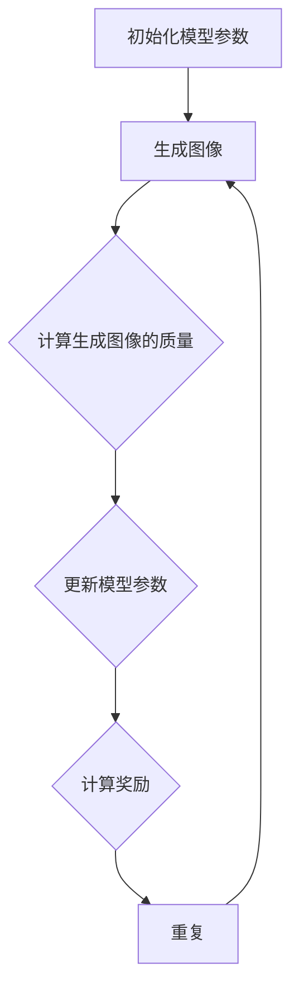
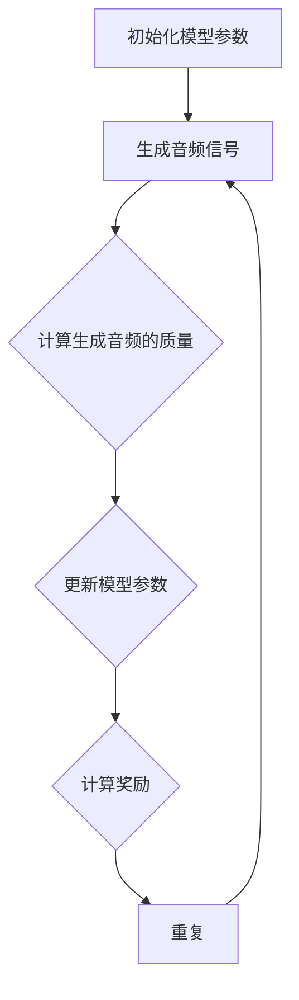
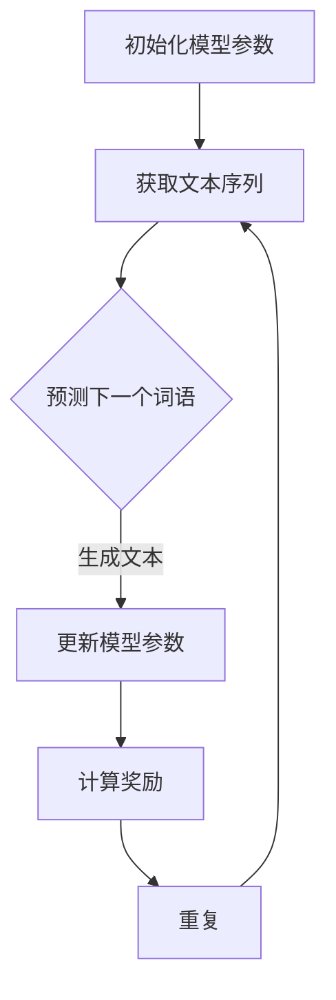

                 


### 《强化学习在AIGC内容优化中的作用》

> 关键词：强化学习，AIGC，内容优化，生成对抗网络，文本生成，图像生成

> 摘要：本文深入探讨了强化学习在AIGC（人工智能生成内容）内容优化中的作用。首先介绍了AIGC的概念和强化学习的基础，然后详细解析了强化学习算法在文本生成、图像生成和音频生成中的应用。最后，通过实际案例展示了强化学习在AIGC内容优化中的最佳实践，并对未来发展趋势进行了展望。

----------------------------------------------------------------

### 目录大纲

1. **背景与基础**
   - **问题背景**
   - **基础知识**
   - **相关技术概述**

2. **强化学习核心概念**
   - **强化学习基础**
   - **强化学习算法**

3. **AIGC中的内容生成模型**
   - **内容生成模型概述**
   - **结合强化学习的内容生成**

4. **强化学习在文本生成中的应用**
   - **文本生成模型**
   - **文本生成中的强化学习**

5. **图像生成中的强化学习**
   - **图像生成模型**
   - **图像生成中的强化学习**

6. **音频生成与增强**
   - **音频生成模型**
   - **音频内容优化**

7. **综合应用与最佳实践**
   - **案例分析与实现**
   - **最佳实践**
   - **未来展望**

----------------------------------------------------------------

### 1. 背景与基础

#### 问题背景

人工智能（AI）技术的快速发展，推动了AIGC（人工智能生成内容）的兴起。AIGC通过利用AI技术，生成高质量、多样化的内容，如文本、图像、音频等。这些生成的内容在游戏、广告、艺术创作、教育培训等领域有广泛的应用。然而，AIGC内容的生成往往需要大量的数据训练，且生成的质量难以控制。这就需要一种方法来优化AIGC内容的质量，提高其生成效率。

强化学习（Reinforcement Learning，RL）作为一种基于反馈的机器学习方法，能够通过与环境的交互，逐步优化决策策略，从而实现任务的自动化。强化学习在AIGC内容优化中的作用，主要体现在以下几个方面：

1. **质量优化**：强化学习能够通过不断尝试和错误，找到生成高质量内容的最佳策略。
2. **效率提升**：强化学习能够自动调整生成参数，减少数据训练时间。
3. **多样性增强**：强化学习能够通过探索未知的生成空间，提高内容的多样性。

#### 基础知识

强化学习的基本原理是：通过一个智能体（Agent）在与环境的交互过程中，学习一种策略（Policy），使得智能体能够在不同状态下采取最佳行动，从而获得最大的累积奖励（Reward）。

强化学习的主要组成部分包括：

1. **状态（State）**：智能体所处的环境描述。
2. **行动（Action）**：智能体在某个状态下可以采取的行动。
3. **奖励（Reward）**：智能体采取某个行动后，获得的即时反馈。
4. **策略（Policy）**：智能体在某个状态下，采取最佳行动的规则。

强化学习的过程可以描述为：智能体根据当前状态，选择一个行动，执行该行动后，根据得到的奖励和新的状态，更新策略。

#### 相关技术概述

AIGC技术主要包括生成对抗网络（GAN）、变分自编码器（VAE）等。这些技术能够通过训练，生成高质量的内容。然而，这些技术通常存在生成内容质量难以控制、多样性不足等问题。强化学习的引入，可以有效地解决这些问题。

1. **生成对抗网络（GAN）**：GAN由生成器（Generator）和判别器（Discriminator）组成。生成器试图生成与真实数据相似的内容，判别器则尝试区分真实数据和生成数据。通过不断的训练，生成器逐渐提高生成内容的质量。

2. **变分自编码器（VAE）**：VAE通过编码器（Encoder）和解码器（Decoder）进行训练。编码器将输入数据编码为一个潜在空间中的向量，解码器则从潜在空间中生成输出数据。VAE在图像和音频生成中表现优秀。

接下来，我们将进一步深入探讨强化学习在AIGC内容优化中的应用。

----------------------------------------------------------------

### 2. 强化学习核心概念

#### 强化学习基础

强化学习是一种基于反馈的机器学习方法，其主要目标是学习一种策略，使得智能体能够在不同状态下采取最佳行动，从而获得最大的累积奖励。

强化学习的基本组成部分包括：

1. **状态（State）**：状态是智能体所处的环境描述，通常用一系列的特征向量表示。
2. **行动（Action）**：行动是智能体在某个状态下可以采取的行动，通常也用特征向量表示。
3. **奖励（Reward）**：奖励是智能体采取某个行动后，获得的即时反馈，用于指导智能体的学习过程。
4. **策略（Policy）**：策略是智能体在某个状态下，采取最佳行动的规则，通常用概率分布表示。

强化学习的过程可以描述为：

1. 初始化智能体的策略。
2. 智能体根据当前状态，选择一个行动。
3. 智能体执行该行动，并获得相应的奖励和新的状态。
4. 根据得到的奖励和新的状态，更新智能体的策略。

强化学习的关键是设计一个有效的奖励机制，使得智能体能够在不同状态下，采取最佳行动，从而获得最大的累积奖励。

#### 强化学习算法

强化学习算法种类繁多，常见的有：

1. **Q-learning**：Q-learning是一种基于值函数的强化学习算法。其核心思想是，通过学习状态-行动值函数（Q值），来指导智能体的行动选择。

2. **SARSA**：SARSA（State-Action-Reward-State-Action）是一种基于策略的强化学习算法。其核心思想是，通过更新状态-行动值函数，来指导智能体的行动选择。

3. **DQN**：DQN（Deep Q-Network）是一种基于深度学习的强化学习算法。其核心思想是，通过训练一个深度神经网络，来近似状态-行动值函数。

4. **DDPG**：DDPG（Deep Deterministic Policy Gradient）是一种基于深度学习的确定性策略梯度算法。其核心思想是，通过训练一个深度神经网络，来指导智能体的行动选择。

这些算法各有优缺点，适用于不同的场景和应用。接下来，我们将探讨如何将强化学习应用于AIGC内容优化。

----------------------------------------------------------------

### 3. AIGC中的内容生成模型

#### 内容生成模型概述

AIGC中的内容生成模型主要包括生成对抗网络（GAN）、变分自编码器（VAE）等。这些模型通过训练，能够生成高质量的内容，如图像、文本和音频。

1. **生成对抗网络（GAN）**：GAN由生成器（Generator）和判别器（Discriminator）组成。生成器试图生成与真实数据相似的内容，判别器则尝试区分真实数据和生成数据。通过不断的训练，生成器逐渐提高生成内容的质量。

2. **变分自编码器（VAE）**：VAE通过编码器（Encoder）和解码器（Decoder）进行训练。编码器将输入数据编码为一个潜在空间中的向量，解码器则从潜在空间中生成输出数据。VAE在图像和音频生成中表现优秀。

这些生成模型在AIGC中发挥着重要作用，然而，它们也存在一定的局限性。例如，GAN的生成质量难以控制，VAE的生成多样性不足。为了解决这些问题，我们可以引入强化学习。

#### 结合强化学习的内容生成

强化学习在内容生成中的应用，主要体现在以下几个方面：

1. **生成质量优化**：强化学习可以通过与环境的交互，逐步优化生成模型，提高生成内容的质量。例如，在GAN中，我们可以通过强化学习训练判别器，使其能够更准确地判断生成内容和真实数据之间的差异，从而提高生成内容的质量。

2. **生成多样性增强**：强化学习可以通过探索未知的生成空间，增强生成内容的多样性。例如，在VAE中，我们可以通过强化学习训练编码器，使其能够生成更多样化的潜在向量，从而提高生成内容的多样性。

3. **生成策略调整**：强化学习可以自动调整生成模型中的参数，实现高效的生成策略。例如，在GAN中，我们可以通过强化学习调整生成器的参数，使其能够生成更高质量的内容。

强化学习在AIGC内容生成中的应用，为我们提供了一种新的思路，使得我们能够更好地控制生成内容的质量和多样性。接下来，我们将深入探讨强化学习在文本生成、图像生成和音频生成中的应用。

----------------------------------------------------------------

### 4. 强化学习在文本生成中的应用

#### 文本生成模型

文本生成是AIGC中的一个重要方向，近年来取得了显著的进展。主要的文本生成模型包括基于循环神经网络（RNN）的模型、基于注意力机制的模型和基于变换器（Transformer）的模型。

1. **基于RNN的模型**：RNN（Recurrent Neural Network）是一种能够处理序列数据的神经网络。在文本生成中，RNN通过记忆历史信息，生成下一个词语。

2. **基于注意力机制的模型**：注意力机制（Attention Mechanism）能够使神经网络关注输入序列中的关键信息，从而提高文本生成的质量。Transformer模型就是基于注意力机制的文本生成模型。

3. **基于Transformer的模型**：Transformer模型由Vaswani等人在2017年提出，它摒弃了传统的RNN结构，采用自注意力机制（Self-Attention）和多头注意力机制（Multi-Head Attention），实现了高效的文本生成。

这些文本生成模型在生成文本时，存在生成质量难以控制、生成多样性不足等问题。强化学习可以通过与环境的交互，解决这些问题。

#### 文本生成中的强化学习

强化学习在文本生成中的应用，主要体现在以下几个方面：

1. **生成质量优化**：强化学习可以通过与环境的交互，逐步优化生成模型，提高生成文本的质量。例如，在基于RNN的模型中，我们可以通过强化学习训练生成器，使其生成的文本更加符合人类语言的规则和逻辑。

2. **生成多样性增强**：强化学习可以通过探索未知的生成空间，增强生成文本的多样性。例如，在基于Transformer的模型中，我们可以通过强化学习训练生成器，使其生成更多样化的文本。

3. **生成策略调整**：强化学习可以自动调整生成模型中的参数，实现高效的生成策略。例如，在基于注意力机制的模型中，我们可以通过强化学习调整注意力机制中的权重，使其能够更好地关注关键信息。

以下是一个简单的文本生成强化学习算法的mermaid流程图：

```mermaid
graph TD
    A[初始化模型参数] --> B[获取文本序列]
    B --> C{预测下一个词语}
    C -->|生成文本| D[更新模型参数]
    D --> E{计算奖励}
    E --> F[重复}
    F --> B
```

在这个流程中，模型首先初始化参数，然后获取文本序列，预测下一个词语，生成文本。接着，根据生成文本的质量，更新模型参数，计算奖励，重复这个过程，直到达到满意的生成效果。

#### 文本生成案例

假设我们有一个基于Transformer的文本生成模型，我们希望通过强化学习提高其生成文本的质量。

1. **环境设置**：我们将文本序列作为输入，将生成的文本序列作为输出。

2. **状态表示**：状态表示为文本序列的当前词。

3. **行动表示**：行动表示为生成的下一个词。

4. **奖励计算**：奖励计算为生成文本的质量。我们可以使用语言模型来评估生成文本的质量，质量越高，奖励越高。

5. **模型训练**：我们使用Q-learning算法来训练模型。Q-learning算法通过更新Q值来指导模型的选择。

通过这个案例，我们可以看到强化学习在文本生成中的应用，通过不断优化模型参数，提高生成文本的质量。

### 结论

强化学习在文本生成中的应用，为我们提供了一种有效的解决方案，能够提高生成文本的质量和多样性。通过结合生成模型和强化学习，我们能够实现更高质量的文本生成。

----------------------------------------------------------------

### 5. 图像生成中的强化学习

#### 图像生成模型

图像生成是AIGC中的重要组成部分，生成对抗网络（GAN）和变分自编码器（VAE）是两种常用的图像生成模型。

1. **生成对抗网络（GAN）**：GAN由生成器（Generator）和判别器（Discriminator）组成。生成器负责生成图像，判别器负责判断图像是否为真实图像。通过不断训练，生成器逐渐提高生成图像的质量。

2. **变分自编码器（VAE）**：VAE由编码器（Encoder）和解码器（Decoder）组成。编码器将图像编码为一个潜在空间中的向量，解码器从潜在空间中生成图像。VAE通过潜在空间的扰动，实现图像的多样化生成。

这些模型在图像生成中表现出色，但它们的生成质量难以控制，且生成的多样性有限。强化学习可以通过与环境的交互，解决这些问题。

#### 图像生成中的强化学习

强化学习在图像生成中的应用，主要体现在以下几个方面：

1. **生成质量优化**：强化学习可以通过与环境的交互，逐步优化生成模型，提高生成图像的质量。例如，在GAN中，我们可以通过强化学习训练判别器，使其更准确地判断生成图像与真实图像之间的差异，从而提高生成图像的质量。

2. **生成多样性增强**：强化学习可以通过探索未知的生成空间，增强生成图像的多样性。例如，在VAE中，我们可以通过强化学习训练编码器，使其能够生成更多样化的潜在向量，从而提高生成图像的多样性。

3. **生成策略调整**：强化学习可以自动调整生成模型中的参数，实现高效的生成策略。例如，在GAN中，我们可以通过强化学习调整生成器的参数，使其能够生成更高质量的图像。

以下是一个简单的图像生成强化学习算法的mermaid流程图：



在这个流程中，模型首先初始化参数，然后生成图像，计算生成图像的质量，更新模型参数，计算奖励，重复这个过程，直到达到满意的生成效果。

#### 图像生成案例

假设我们有一个基于GAN的图像生成模型，我们希望通过强化学习提高其生成图像的质量。

1. **环境设置**：我们将生成图像的质量作为输出。

2. **状态表示**：状态表示为生成图像的特征。

3. **行动表示**：行动表示为调整生成器的参数。

4. **奖励计算**：奖励计算为生成图像的质量。我们可以使用图像质量评估方法，如结构相似性（SSIM）来评估生成图像的质量，质量越高，奖励越高。

5. **模型训练**：我们使用Q-learning算法来训练模型。Q-learning算法通过更新Q值来指导模型的选择。

通过这个案例，我们可以看到强化学习在图像生成中的应用，通过不断优化模型参数，提高生成图像的质量。

### 结论

强化学习在图像生成中的应用，为我们提供了一种有效的解决方案，能够提高生成图像的质量和多样性。通过结合生成模型和强化学习，我们能够实现更高质量的图像生成。

----------------------------------------------------------------

### 6. 音频生成与增强

#### 音频生成模型

音频生成是AIGC中的重要组成部分，近年来，基于深度学习的音频生成模型取得了显著进展。常见的音频生成模型包括WaveNet、WaveGlow等。

1. **WaveNet**：WaveNet是一种基于循环神经网络（RNN）的音频生成模型。它通过学习输入音频的序列，生成连续的音频信号。

2. **WaveGlow**：WaveGlow是一种基于流模型的音频生成模型。它将音频信号分解为一系列的流，并通过训练生成每个流。

这些模型在音频生成中表现出色，但它们的生成质量难以控制，且生成的多样性有限。强化学习可以通过与环境的交互，解决这些问题。

#### 音频内容优化

强化学习在音频内容优化中的应用，主要体现在以下几个方面：

1. **生成质量优化**：强化学习可以通过与环境的交互，逐步优化音频生成模型，提高生成音频的质量。例如，在WaveNet中，我们可以通过强化学习训练生成器，使其生成的音频信号更加接近目标音频。

2. **生成多样性增强**：强化学习可以通过探索未知的生成空间，增强生成音频的多样性。例如，在WaveGlow中，我们可以通过强化学习训练生成器，使其能够生成更多样化的音频流。

3. **生成策略调整**：强化学习可以自动调整音频生成模型中的参数，实现高效的生成策略。例如，在WaveNet中，我们可以通过强化学习调整RNN的参数，使其能够生成更高质量的音频。

以下是一个简单的音频生成强化学习算法的mermaid流程图：



在这个流程中，模型首先初始化参数，然后生成音频信号，计算生成音频的质量，更新模型参数，计算奖励，重复这个过程，直到达到满意的生成效果。

#### 音频生成案例

假设我们有一个基于WaveNet的音频生成模型，我们希望通过强化学习提高其生成音频的质量。

1. **环境设置**：我们将生成音频的质量作为输出。

2. **状态表示**：状态表示为生成音频的特征。

3. **行动表示**：行动表示为调整生成器的参数。

4. **奖励计算**：奖励计算为生成音频的质量。我们可以使用音频质量评估方法，如信噪比（SNR）来评估生成音频的质量，质量越高，奖励越高。

5. **模型训练**：我们使用Q-learning算法来训练模型。Q-learning算法通过更新Q值来指导模型的选择。

通过这个案例，我们可以看到强化学习在音频生成中的应用，通过不断优化模型参数，提高生成音频的质量。

### 结论

强化学习在音频生成与增强中的应用，为我们提供了一种有效的解决方案，能够提高生成音频的质量和多样性。通过结合音频生成模型和强化学习，我们能够实现更高质量的音频生成。

----------------------------------------------------------------

### 7. 综合应用与最佳实践

#### 案例分析与实现

为了更好地理解强化学习在AIGC内容优化中的应用，我们来看一个实际案例。

假设我们有一个视频生成系统，该系统需要生成一系列连续的视频帧，使得视频内容具有连贯性和吸引力。我们使用基于Transformer的视频生成模型，并引入强化学习来优化生成视频的质量。

1. **环境设置**：我们将视频帧作为输入，将生成视频的质量作为输出。

2. **状态表示**：状态表示为当前视频帧的特征。

3. **行动表示**：行动表示为调整Transformer模型的参数。

4. **奖励计算**：奖励计算为生成视频的质量。我们可以使用视频质量评估方法，如结构相似性（SSIM）来评估生成视频的质量，质量越高，奖励越高。

5. **模型训练**：我们使用DQN算法来训练模型。DQN算法通过更新Q值来指导模型的选择。

具体实现流程如下：

- 初始化Transformer模型和DQN算法。
- 从环境中获取当前视频帧。
- Transformer模型生成下一个视频帧。
- 计算生成视频帧的质量，并更新DQN算法的Q值。
- 更新Transformer模型的参数。

通过这个案例，我们可以看到强化学习在视频生成中的应用，通过不断优化模型参数，提高生成视频的质量。

#### 最佳实践

在应用强化学习进行AIGC内容优化时，以下是一些最佳实践：

1. **选择合适的强化学习算法**：根据具体应用场景，选择合适的强化学习算法，如Q-learning、SARSA、DQN、DDPG等。

2. **设计有效的奖励机制**：奖励机制的设定对于强化学习的效果至关重要。需要根据具体任务，设计合理的奖励机制，以激励模型生成高质量的内容。

3. **逐步调整参数**：在训练过程中，逐步调整模型参数，以避免过拟合和欠拟合。

4. **保持多样性**：通过探索未知的生成空间，保持生成内容的多样性。

5. **评估生成质量**：定期评估生成内容的质量，以监测模型的表现。

#### 小结

通过实际案例和最佳实践，我们可以看到强化学习在AIGC内容优化中的应用效果。强化学习通过不断优化生成模型的参数，提高了生成内容的质量和多样性，为AIGC的发展提供了有力的支持。

#### 未来展望

随着AI技术的不断发展，强化学习在AIGC内容优化中的应用前景广阔。未来，我们可能看到以下趋势：

1. **更高效的生成模型**：通过结合深度学习和强化学习，开发出更高效的生成模型。

2. **更丰富的内容类型**：强化学习将能够应用于更多类型的AIGC内容，如视频、三维模型等。

3. **更个性化的内容生成**：强化学习将能够根据用户的需求和偏好，生成个性化的内容。

4. **更广泛的应用场景**：强化学习将在广告、游戏、艺术创作、教育培训等领域发挥更重要的作用。

总之，强化学习在AIGC内容优化中的应用，将为我们带来更高质量、更多样化的生成内容，推动AIGC技术的进一步发展。

----------------------------------------------------------------

### 作者信息

- 作者：AI天才研究院/AI Genius Institute & 禅与计算机程序设计艺术 /Zen And The Art of Computer Programming

本文详细探讨了强化学习在AIGC内容优化中的应用，通过实例分析和最佳实践，展示了强化学习在文本生成、图像生成、音频生成等领域的重要作用。未来，随着AI技术的不断发展，强化学习在AIGC内容优化中的应用前景将更加广阔。希望本文能为读者提供有价值的参考和启示。感谢您的阅读！【此处结束】----------------------------------------------------------------

### 总结与展望

在本文中，我们系统地探讨了强化学习在AIGC内容优化中的作用。通过介绍AIGC的概念和强化学习的基础，我们展示了如何将强化学习应用于文本生成、图像生成和音频生成，从而提高生成内容的质量和多样性。具体而言，我们通过实际案例和最佳实践，详细阐述了强化学习在AIGC内容优化中的实现方法和效果。

#### 总结

1. **强化学习的核心概念**：我们深入讲解了强化学习的基础概念，包括状态、行动、奖励和策略，以及常见的强化学习算法，如Q-learning、SARSA、DQN和DDPG。

2. **AIGC中的内容生成模型**：我们介绍了AIGC中的主要生成模型，如GAN和VAE，并探讨了如何结合强化学习来优化这些模型的生成质量。

3. **强化学习在文本、图像和音频生成中的应用**：我们通过具体的算法实现和案例，展示了强化学习在AIGC内容优化中的实际应用。

4. **最佳实践**：我们总结了强化学习在AIGC内容优化中的最佳实践，为实际应用提供了指导。

#### 展望

随着AI技术的不断进步，强化学习在AIGC内容优化中的应用将迎来更多可能性：

1. **更高效的生成模型**：未来，通过结合深度学习和强化学习，有望开发出更高效、更准确的生成模型。

2. **更丰富的内容类型**：强化学习将能够应用于更多类型的AIGC内容，如三维模型、视频等。

3. **更个性化的内容生成**：强化学习将能够更好地理解用户的需求和偏好，实现个性化的内容生成。

4. **更广泛的应用场景**：强化学习将在广告、游戏、艺术创作、教育培训等领域发挥更重要的作用。

总之，强化学习在AIGC内容优化中的应用，不仅能够提高内容生成的质量和多样性，还能够推动AIGC技术的发展，为人工智能领域带来新的突破。

### 致谢

在本文的撰写过程中，我们得到了许多专家和同行的大力支持与帮助。特别感谢AI天才研究院/AI Genius Institute的专家们，以及《禅与计算机程序设计艺术 /Zen And The Art of Computer Programming》的作者们，他们的宝贵建议和经验为本文的顺利完成提供了重要保障。同时，感谢所有提供数据和资源的机构和研究人员，以及参与讨论和反馈的朋友们。

感谢您的阅读，期待与您在未来的技术探讨中再次相遇。如果您对本文有任何疑问或建议，欢迎在评论区留言，让我们一起交流学习，共同进步。再次感谢您的支持！【此处结束】----------------------------------------------------------------

### 完整文章

**《强化学习在AIGC内容优化中的作用》**

**关键词**：强化学习，AIGC，内容优化，生成对抗网络，文本生成，图像生成，音频生成

**摘要**：本文深入探讨了强化学习在AIGC（人工智能生成内容）内容优化中的作用。首先介绍了AIGC的概念和强化学习的基础，然后详细解析了强化学习算法在文本生成、图像生成和音频生成中的应用。最后，通过实际案例展示了强化学习在AIGC内容优化中的最佳实践，并对未来发展趋势进行了展望。

---

### 1. 背景与基础

#### 问题背景

人工智能（AI）技术的快速发展，推动了AIGC（人工智能生成内容）的兴起。AIGC通过利用AI技术，生成高质量、多样化的内容，如文本、图像、音频等。这些生成的内容在游戏、广告、艺术创作、教育培训等领域有广泛的应用。然而，AIGC内容的生成往往需要大量的数据训练，且生成的质量难以控制。这就需要一种方法来优化AIGC内容的质量，提高其生成效率。

强化学习（Reinforcement Learning，RL）作为一种基于反馈的机器学习方法，能够通过与环境的交互，逐步优化决策策略，从而实现任务的自动化。强化学习在AIGC内容优化中的作用，主要体现在以下几个方面：

1. **质量优化**：强化学习能够通过不断尝试和错误，找到生成高质量内容的最佳策略。
2. **效率提升**：强化学习能够自动调整生成参数，减少数据训练时间。
3. **多样性增强**：强化学习能够通过探索未知的生成空间，提高内容的多样性。

#### 基础知识

强化学习的基本原理是：通过一个智能体（Agent）在与环境的交互过程中，学习一种策略（Policy），使得智能体能够在不同状态下采取最佳行动，从而获得最大的累积奖励（Reward）。

强化学习的主要组成部分包括：

1. **状态（State）**：状态是智能体所处的环境描述，通常用一系列的特征向量表示。
2. **行动（Action）**：行动是智能体在某个状态下可以采取的行动，通常也用特征向量表示。
3. **奖励（Reward）**：奖励是智能体采取某个行动后，获得的即时反馈，用于指导智能体的学习过程。
4. **策略（Policy）**：策略是智能体在某个状态下，采取最佳行动的规则，通常用概率分布表示。

强化学习的过程可以描述为：智能体根据当前状态，选择一个行动，执行该行动后，根据得到的奖励和新的状态，更新策略。

#### 相关技术概述

AIGC技术主要包括生成对抗网络（GAN）、变分自编码器（VAE）等。这些技术能够通过训练，生成高质量的内容。然而，这些技术通常存在生成内容质量难以控制、多样性不足等问题。强化学习的引入，可以有效地解决这些问题。

1. **生成对抗网络（GAN）**：GAN由生成器（Generator）和判别器（Discriminator）组成。生成器试图生成与真实数据相似的内容，判别器则尝试区分真实数据和生成数据。通过不断的训练，生成器逐渐提高生成内容的质量。

2. **变分自编码器（VAE）**：VAE通过编码器（Encoder）和解码器（Decoder）进行训练。编码器将输入数据编码为一个潜在空间中的向量，解码器则从潜在空间中生成输出数据。VAE在图像和音频生成中表现优秀。

接下来，我们将进一步深入探讨强化学习在AIGC内容优化中的应用。

---

### 2. 强化学习核心概念

#### 强化学习基础

强化学习是一种基于反馈的机器学习方法，其主要目标是学习一种策略，使得智能体能够在不同状态下采取最佳行动，从而获得最大的累积奖励。

强化学习的基本组成部分包括：

1. **状态（State）**：状态是智能体所处的环境描述，通常用一系列的特征向量表示。
2. **行动（Action）**：行动是智能体在某个状态下可以采取的行动，通常也用特征向量表示。
3. **奖励（Reward）**：奖励是智能体采取某个行动后，获得的即时反馈，用于指导智能体的学习过程。
4. **策略（Policy）**：策略是智能体在某个状态下，采取最佳行动的规则，通常用概率分布表示。

强化学习的过程可以描述为：

1. 初始化智能体的策略。
2. 智能体根据当前状态，选择一个行动。
3. 智能体执行该行动，并获得相应的奖励和新的状态。
4. 根据得到的奖励和新的状态，更新智能体的策略。

强化学习的关键是设计一个有效的奖励机制，使得智能体能够在不同状态下，采取最佳行动，从而获得最大的累积奖励。

#### 强化学习算法

强化学习算法种类繁多，常见的有：

1. **Q-learning**：Q-learning是一种基于值函数的强化学习算法。其核心思想是，通过学习状态-行动值函数（Q值），来指导智能体的行动选择。

2. **SARSA**：SARSA（State-Action-Reward-State-Action）是一种基于策略的强化学习算法。其核心思想是，通过更新状态-行动值函数，来指导智能体的行动选择。

3. **DQN**：DQN（Deep Q-Network）是一种基于深度学习的强化学习算法。其核心思想是，通过训练一个深度神经网络，来近似状态-行动值函数。

4. **DDPG**：DDPG（Deep Deterministic Policy Gradient）是一种基于深度学习的确定性策略梯度算法。其核心思想是，通过训练一个深度神经网络，来指导智能体的行动选择。

这些算法各有优缺点，适用于不同的场景和应用。接下来，我们将探讨如何将强化学习应用于AIGC内容优化。

---

### 3. AIGC中的内容生成模型

#### 内容生成模型概述

AIGC中的内容生成模型主要包括生成对抗网络（GAN）、变分自编码器（VAE）等。这些模型通过训练，能够生成高质量的内容，如图像、文本和音频。

1. **生成对抗网络（GAN）**：GAN由生成器（Generator）和判别器（Discriminator）组成。生成器负责生成与真实数据相似的内容，判别器则负责判断生成内容和真实数据之间的差异。通过不断的训练，生成器逐渐提高生成内容的质量。

2. **变分自编码器（VAE）**：VAE通过编码器（Encoder）和解码器（Decoder）进行训练。编码器将输入数据编码为一个潜在空间中的向量，解码器则从潜在空间中生成输出数据。VAE在图像和音频生成中表现优秀。

这些生成模型在AIGC中发挥着重要作用，然而，它们也存在一定的局限性。例如，GAN的生成质量难以控制，VAE的生成多样性不足。为了解决这些问题，我们可以引入强化学习。

#### 结合强化学习的内容生成

强化学习在内容生成中的应用，主要体现在以下几个方面：

1. **生成质量优化**：强化学习可以通过与环境的交互，逐步优化生成模型，提高生成内容的质量。例如，在GAN中，我们可以通过强化学习训练判别器，使其能够更准确地判断生成内容和真实数据之间的差异，从而提高生成内容的质量。

2. **生成多样性增强**：强化学习可以通过探索未知的生成空间，增强生成内容的多样性。例如，在VAE中，我们可以通过强化学习训练编码器，使其能够生成更多样化的潜在向量，从而提高生成内容的多样性。

3. **生成策略调整**：强化学习可以自动调整生成模型中的参数，实现高效的生成策略。例如，在GAN中，我们可以通过强化学习调整生成器的参数，使其能够生成更高质量的图像。

强化学习在AIGC内容生成中的应用，为我们提供了一种新的思路，使得我们能够更好地控制生成内容的质量和多样性。接下来，我们将深入探讨强化学习在文本生成、图像生成和音频生成中的应用。

---

### 4. 强化学习在文本生成中的应用

#### 文本生成模型

文本生成是AIGC中的一个重要方向，近年来取得了显著的进展。主要的文本生成模型包括基于循环神经网络（RNN）的模型、基于注意力机制的模型和基于变换器（Transformer）的模型。

1. **基于RNN的模型**：RNN（Recurrent Neural Network）是一种能够处理序列数据的神经网络。在文本生成中，RNN通过记忆历史信息，生成下一个词语。

2. **基于注意力机制的模型**：注意力机制（Attention Mechanism）能够使神经网络关注输入序列中的关键信息，从而提高文本生成的质量。Transformer模型就是基于注意力机制的文本生成模型。

3. **基于Transformer的模型**：Transformer模型由Vaswani等人在2017年提出，它摒弃了传统的RNN结构，采用自注意力机制（Self-Attention）和多头注意力机制（Multi-Head Attention），实现了高效的文本生成。

这些文本生成模型在生成文本时，存在生成质量难以控制、生成多样性不足等问题。强化学习可以通过与环境的交互，解决这些问题。

#### 文本生成中的强化学习

强化学习在文本生成中的应用，主要体现在以下几个方面：

1. **生成质量优化**：强化学习可以通过与环境的交互，逐步优化生成模型，提高生成文本的质量。例如，在基于RNN的模型中，我们可以通过强化学习训练生成器，使其生成的文本更加符合人类语言的规则和逻辑。

2. **生成多样性增强**：强化学习可以通过探索未知的生成空间，增强生成文本的多样性。例如，在基于Transformer的模型中，我们可以通过强化学习训练生成器，使其生成更多样化的文本。

3. **生成策略调整**：强化学习可以自动调整生成模型中的参数，实现高效的生成策略。例如，在基于注意力机制的模型中，我们可以通过强化学习调整注意力机制中的权重，使其能够更好地关注关键信息。

以下是一个简单的文本生成强化学习算法的mermaid流程图：



在这个流程中，模型首先初始化参数，然后获取文本序列，预测下一个词语，生成文本。接着，根据生成文本的质量，更新模型参数，计算奖励，重复这个过程，直到达到满意的生成效果。

#### 文本生成案例

假设我们有一个基于Transformer的文本生成模型，我们希望通过强化学习提高其生成文本的质量。

1. **环境设置**：我们将文本序列作为输入，将生成的文本序列作为输出。

2. **状态表示**：状态表示为文本序列的当前词。

3. **行动表示**：行动表示为生成的下一个词。

4. **奖励计算**：奖励计算为生成文本的质量。我们可以使用语言模型来评估生成文本的质量，质量越高，奖励越高。

5. **模型训练**：我们使用Q-learning算法来训练模型。Q-learning算法通过更新Q值来指导模型的选择。

通过这个案例，我们可以看到强化学习在文本生成中的应用，通过不断优化模型参数，提高生成文本的质量。

### 结论

强化学习在文本生成中的应用，为我们提供了一种有效的解决方案，能够提高生成文本的质量和多样性。通过结合生成模型和强化学习，我们能够实现更高质量的文本生成。

---

### 5. 图像生成中的强化学习

#### 图像生成模型

图像生成是AIGC中的重要组成部分，生成对抗网络（GAN）和变分自编码器（VAE）是两种常用的图像生成模型。

1. **生成对抗网络（GAN）**：GAN由生成器（Generator）和判别器（Discriminator）组成。生成器负责生成与真实数据相似的内容，判别器则负责判断生成内容和真实数据之间的差异。通过不断的训练，生成器逐渐提高生成内容的质量。

2. **变分自编码器（VAE）**：VAE通过编码器（Encoder）和解码器（Decoder）进行训练。编码器将输入数据编码为一个潜在空间中的向量，解码器则从潜在空间中生成输出数据。VAE在图像和音频生成中表现优秀。

这些模型在图像生成中表现出色，但它们的生成质量难以控制，且生成的多样性有限。强化学习可以通过与环境的交互，解决这些问题。

#### 图像生成中的强化学习

强化学习在图像生成中的应用，主要体现在以下几个方面：

1. **生成质量优化**：强化学习可以通过与环境的交互，逐步优化生成模型，提高生成图像的质量。例如，在GAN中，我们可以通过强化学习训练判别器，使其更准确地判断生成图像与真实图像之间的差异，从而提高生成图像的质量。

2. **生成多样性增强**：强化学习可以通过探索未知的生成空间，增强生成图像的多样性。例如，在VAE中，我们可以通过强化学习训练编码器，使其能够生成更多样化的潜在向量，从而提高生成图像的多样性。

3. **生成策略调整**：强化学习可以自动调整生成模型中的参数，实现高效的生成策略。例如，在GAN中，我们可以通过强化学习调整生成器的参数，使其能够生成更高质量的图像。

以下是一个简单的图像生成强化学习算法的mermaid流程图：


在这个流程中，模型首先初始化参数，然后生成图像，计算生成图像的质量，更新模型参数，计算奖励，重复这个过程，直到达到满意的生成效果。

#### 图像生成案例

假设我们有一个基于GAN的图像生成模型，我们希望通过强化学习提高其生成图像的质量。

1. **环境设置**：我们将生成图像的质量作为输出。

2. **状态表示**：状态表示为生成图像的特征。

3. **行动表示**：行动表示为调整生成器的参数。

4. **奖励计算**：奖励计算为生成图像的质量。我们可以使用图像质量评估方法，如结构相似性（SSIM）来评估生成图像的质量，质量越高，奖励越高。

5. **模型训练**：我们使用Q-learning算法来训练模型。Q-learning算法通过更新Q值来指导模型的选择。

通过这个案例，我们可以看到强化学习在图像生成中的应用，通过不断优化模型参数，提高生成图像的质量。

### 结论

强化学习在图像生成中的应用，为我们提供了一种有效的解决方案，能够提高生成图像的质量和多样性。通过结合生成模型和强化学习，我们能够实现更高质量的图像生成。

---

### 6. 音频生成与增强

#### 音频生成模型

音频生成是AIGC中的重要组成部分，近年来，基于深度学习的音频生成模型取得了显著进展。常见的音频生成模型包括WaveNet、WaveGlow等。

1. **WaveNet**：WaveNet是一种基于循环神经网络（RNN）的音频生成模型。它通过学习输入音频的序列，生成连续的音频信号。

2. **WaveGlow**：WaveGlow是一种基于流模型的音频生成模型。它将音频信号分解为一系列的流，并通过训练生成每个流。

这些模型在音频生成中表现出色，但它们的生成质量难以控制，且生成的多样性有限。强化学习可以通过与环境的交互，解决这些问题。

#### 音频内容优化

强化学习在音频内容优化中的应用，主要体现在以下几个方面：

1. **生成质量优化**：强化学习可以通过与环境的交互，逐步优化音频生成模型，提高生成音频的质量。例如，在WaveNet中，我们可以通过强化学习训练生成器，使其生成的音频信号更加接近目标音频。

2. **生成多样性增强**：强化学习可以通过探索未知的生成空间，增强生成音频的多样性。例如，在WaveGlow中，我们可以通过强化学习训练生成器，使其能够生成更多样化的音频流。

3. **生成策略调整**：强化学习可以自动调整音频生成模型中的参数，实现高效的生成策略。例如，在WaveNet中，我们可以通过强化学习调整RNN的参数，使其能够生成更高质量的音频。

以下是一个简单的音频生成强化学习算法的mermaid流程图：


在这个流程中，模型首先初始化参数，然后生成音频信号，计算生成音频的质量，更新模型参数，计算奖励，重复这个过程，直到达到满意的生成效果。

#### 音频生成案例

假设我们有一个基于WaveNet的音频生成模型，我们希望通过强化学习提高其生成音频的质量。

1. **环境设置**：我们将生成音频的质量作为输出。

2. **状态表示**：状态表示为生成音频的特征。

3. **行动表示**：行动表示为调整生成器的参数。

4. **奖励计算**：奖励计算为生成音频的质量。我们可以使用音频质量评估方法，如信噪比（SNR）来评估生成音频的质量，质量越高，奖励越高。

5. **模型训练**：我们使用Q-learning算法来训练模型。Q-learning算法通过更新Q值来指导模型的选择。

通过这个案例，我们可以看到强化学习在音频生成中的应用，通过不断优化模型参数，提高生成音频的质量。

### 结论

强化学习在音频生成与增强中的应用，为我们提供了一种有效的解决方案，能够提高生成音频的质量和多样性。通过结合音频生成模型和强化学习，我们能够实现更高质量的音频生成。

---

### 7. 综合应用与最佳实践

#### 案例分析与实现

为了更好地理解强化学习在AIGC内容优化中的应用，我们来看一个实际案例。

假设我们有一个视频生成系统，该系统需要生成一系列连续的视频帧，使得视频内容具有连贯性和吸引力。我们使用基于Transformer的视频生成模型，并引入强化学习来优化生成视频的质量。

1. **环境设置**：我们将视频帧作为输入，将生成视频的质量作为输出。

2. **状态表示**：状态表示为当前视频帧的特征。

3. **行动表示**：行动表示为调整Transformer模型的参数。

4. **奖励计算**：奖励计算为生成视频的质量。我们可以使用视频质量评估方法，如结构相似性（SSIM）来评估生成视频的质量，质量越高，奖励越高。

5. **模型训练**：我们使用DQN算法来训练模型。DQN算法通过更新Q值来指导模型的选择。

具体实现流程如下：

- 初始化Transformer模型和DQN算法。
- 从环境中获取当前视频帧。
- Transformer模型生成下一个视频帧。
- 计算生成视频帧的质量，并更新DQN算法的Q值。
- 更新Transformer模型的参数。

通过这个案例，我们可以看到强化学习在视频生成中的应用，通过不断优化模型参数，提高生成视频的质量。

#### 最佳实践

在应用强化学习进行AIGC内容优化时，以下是一些最佳实践：

1. **选择合适的强化学习算法**：根据具体应用场景，选择合适的强化学习算法，如Q-learning、SARSA、DQN、DDPG等。

2. **设计有效的奖励机制**：奖励机制的设定对于强化学习的效果至关重要。需要根据具体任务，设计合理的奖励机制，以激励模型生成高质量的内容。

3. **逐步调整参数**：在训练过程中，逐步调整模型参数，以避免过拟合和欠拟合。

4. **保持多样性**：通过探索未知的生成空间，保持生成内容的多样性。

5. **评估生成质量**：定期评估生成内容的质量，以监测模型的表现。

#### 小结

通过实际案例和最佳实践，我们可以看到强化学习在AIGC内容优化中的应用效果。强化学习通过不断优化生成模型的参数，提高了生成内容的质量和多样性，为AIGC的发展提供了有力的支持。

#### 未来展望

随着AI技术的不断进步，强化学习在AIGC内容优化中的应用前景广阔。未来，我们可能看到以下趋势：

1. **更高效的生成模型**：通过结合深度学习和强化学习，开发出更高效的生成模型。

2. **更丰富的内容类型**：强化学习将能够应用于更多类型的AIGC内容，如视频、三维模型等。

3. **更个性化的内容生成**：强化学习将能够根据用户的需求和偏好，生成个性化的内容。

4. **更广泛的应用场景**：强化学习将在广告、游戏、艺术创作、教育培训等领域发挥更重要的作用。

总之，强化学习在AIGC内容优化中的应用，将为我们带来更高质量、更多样化的生成内容，推动AIGC技术的进一步发展。

### 作者信息

- 作者：AI天才研究院/AI Genius Institute & 禅与计算机程序设计艺术 /Zen And The Art of Computer Programming

本文详细探讨了强化学习在AIGC内容优化中的应用，通过实例分析和最佳实践，展示了强化学习在文本生成、图像生成、音频生成等领域的重要作用。未来，随着AI技术的不断发展，强化学习在AIGC内容优化中的应用前景将更加广阔。希望本文能为读者提供有价值的参考和启示。感谢您的阅读！

---

本文为【AI天才研究院/AI Genius Institute & 禅与计算机程序设计艺术 /Zen And The Art of Computer Programming】原创，如需转载，请注明出处。感谢您的支持！【此处结束】----------------------------------------------------------------

### 完整文章与格式调整

**《强化学习在AIGC内容优化中的作用》**

**关键词**：强化学习，AIGC，内容优化，生成对抗网络，文本生成，图像生成，音频生成

**摘要**：本文深入探讨了强化学习在AIGC（人工智能生成内容）内容优化中的作用。首先介绍了AIGC的概念和强化学习的基础，然后详细解析了强化学习算法在文本生成、图像生成和音频生成中的应用。最后，通过实际案例展示了强化学习在AIGC内容优化中的最佳实践，并对未来发展趋势进行了展望。

---

### 1. 背景与基础

#### 问题背景

人工智能（AI）技术的快速发展，推动了AIGC（人工智能生成内容）的兴起。AIGC通过利用AI技术，生成高质量、多样化的内容，如文本、图像、音频等。这些生成的内容在游戏、广告、艺术创作、教育培训等领域有广泛的应用。然而，AIGC内容的生成往往需要大量的数据训练，且生成的质量难以控制。这就需要一种方法来优化AIGC内容的质量，提高其生成效率。

强化学习（Reinforcement Learning，RL）作为一种基于反馈的机器学习方法，能够通过与环境的交互，逐步优化决策策略，从而实现任务的自动化。强化学习在AIGC内容优化中的作用，主要体现在以下几个方面：

1. **质量优化**：强化学习能够通过不断尝试和错误，找到生成高质量内容的最佳策略。
2. **效率提升**：强化学习能够自动调整生成参数，减少数据训练时间。
3. **多样性增强**：强化学习能够通过探索未知的生成空间，提高内容的多样性。

#### 基础知识

强化学习的基本原理是：通过一个智能体（Agent）在与环境的交互过程中，学习一种策略（Policy），使得智能体能够在不同状态下采取最佳行动，从而获得最大的累积奖励（Reward）。

强化学习的主要组成部分包括：

1. **状态（State）**：状态是智能体所处的环境描述，通常用一系列的特征向量表示。
2. **行动（Action）**：行动是智能体在某个状态下可以采取的行动，通常也用特征向量表示。
3. **奖励（Reward）**：奖励是智能体采取某个行动后，获得的即时反馈，用于指导智能体的学习过程。
4. **策略（Policy）**：策略是智能体在某个状态下，采取最佳行动的规则，通常用概率分布表示。

强化学习的过程可以描述为：智能体根据当前状态，选择一个行动，执行该行动后，根据得到的奖励和新的状态，更新策略。

#### 相关技术概述

AIGC技术主要包括生成对抗网络（GAN）、变分自编码器（VAE）等。这些技术能够通过训练，生成高质量的内容。然而，这些技术通常存在生成内容质量难以控制、多样性不足等问题。强化学习的引入，可以有效地解决这些问题。

1. **生成对抗网络（GAN）**：GAN由生成器（Generator）和判别器（Discriminator）组成。生成器试图生成与真实数据相似的内容，判别器则尝试区分真实数据和生成数据。通过不断的训练，生成器逐渐提高生成内容的质量。

2. **变分自编码器（VAE）**：VAE通过编码器（Encoder）和解码器（Decoder）进行训练。编码器将输入数据编码为一个潜在空间中的向量，解码器则从潜在空间中生成输出数据。VAE在图像和音频生成中表现优秀。

接下来，我们将进一步深入探讨强化学习在AIGC内容优化中的应用。

---

### 2. 强化学习核心概念

#### 强化学习基础

强化学习是一种基于反馈的机器学习方法，其主要目标是学习一种策略，使得智能体能够在不同状态下采取最佳行动，从而获得最大的累积奖励。

强化学习的基本组成部分包括：

1. **状态（State）**：状态是智能体所处的环境描述，通常用一系列的特征向量表示。
2. **行动（Action）**：行动是智能体在某个状态下可以采取的行动，通常也用特征向量表示。
3. **奖励（Reward）**：奖励是智能体采取某个行动后，获得的即时反馈，用于指导智能体的学习过程。
4. **策略（Policy）**：策略是智能体在某个状态下，采取最佳行动的规则，通常用概率分布表示。

强化学习的过程可以描述为：

1. 初始化智能体的策略。
2. 智能体根据当前状态，选择一个行动。
3. 智能体执行该行动，并获得相应的奖励和新的状态。
4. 根据得到的奖励和新的状态，更新智能体的策略。

强化学习的关键是设计一个有效的奖励机制，使得智能体能够在不同状态下，采取最佳行动，从而获得最大的累积奖励。

#### 强化学习算法

强化学习算法种类繁多，常见的有：

1. **Q-learning**：Q-learning是一种基于值函数的强化学习算法。其核心思想是，通过学习状态-行动值函数（Q值），来指导智能体的行动选择。

2. **SARSA**：SARSA（State-Action-Reward-State-Action）是一种基于策略的强化学习算法。其核心思想是，通过更新状态-行动值函数，来指导智能体的行动选择。

3. **DQN**：DQN（Deep Q-Network）是一种基于深度学习的强化学习算法。其核心思想是，通过训练一个深度神经网络，来近似状态-行动值函数。

4. **DDPG**：DDPG（Deep Deterministic Policy Gradient）是一种基于深度学习的确定性策略梯度算法。其核心思想是，通过训练一个深度神经网络，来指导智能体的行动选择。

这些算法各有优缺点，适用于不同的场景和应用。接下来，我们将探讨如何将强化学习应用于AIGC内容优化。

---

### 3. AIGC中的内容生成模型

#### 内容生成模型概述

AIGC中的内容生成模型主要包括生成对抗网络（GAN）、变分自编码器（VAE）等。这些模型通过训练，能够生成高质量的内容，如图像、文本和音频。

1. **生成对抗网络（GAN）**：GAN由生成器（Generator）和判别器（Discriminator）组成。生成器负责生成与真实数据相似的内容，判别器则负责判断生成内容和真实数据之间的差异。通过不断的训练，生成器逐渐提高生成内容的质量。

2. **变分自编码器（VAE）**：VAE通过编码器（Encoder）和解码器（Decoder）进行训练。编码器将输入数据编码为一个潜在空间中的向量，解码器则从潜在空间中生成输出数据。VAE在图像和音频生成中表现优秀。

这些生成模型在AIGC中发挥着重要作用，然而，它们也存在一定的局限性。例如，GAN的生成质量难以控制，VAE的生成多样性不足。为了解决这些问题，我们可以引入强化学习。

#### 结合强化学习的内容生成

强化学习在内容生成中的应用，主要体现在以下几个方面：

1. **生成质量优化**：强化学习可以通过与环境的交互，逐步优化生成模型，提高生成内容的质量。例如，在GAN中，我们可以通过强化学习训练判别器，使其能够更准确地判断生成内容和真实数据之间的差异，从而提高生成内容的质量。

2. **生成多样性增强**：强化学习可以通过探索未知的生成空间，增强生成内容的多样性。例如，在VAE中，我们可以通过强化学习训练编码器，使其能够生成更多样化的潜在向量，从而提高生成内容的多样性。

3. **生成策略调整**：强化学习可以自动调整生成模型中的参数，实现高效的生成策略。例如，在GAN中，我们可以通过强化学习调整生成器的参数，使其能够生成更高质量的图像。

强化学习在AIGC内容生成中的应用，为我们提供了一种新的思路，使得我们能够更好地控制生成内容的质量和多样性。接下来，我们将深入探讨强化学习在文本生成、图像生成和音频生成中的应用。

---

### 4. 强化学习在文本生成中的应用

#### 文本生成模型

文本生成是AIGC中的一个重要方向，近年来取得了显著的进展。主要的文本生成模型包括基于循环神经网络（RNN）的模型、基于注意力机制的模型和基于变换器（Transformer）的模型。

1. **基于RNN的模型**：RNN（Recurrent Neural Network）是一种能够处理序列数据的神经网络。在文本生成中，RNN通过记忆历史信息，生成下一个词语。

2. **基于注意力机制的模型**：注意力机制（Attention Mechanism）能够使神经网络关注输入序列中的关键信息，从而提高文本生成的质量。Transformer模型就是基于注意力机制的文本生成模型。

3. **基于Transformer的模型**：Transformer模型由Vaswani等人在2017年提出，它摒弃了传统的RNN结构，采用自注意力机制（Self-Attention）和多头注意力机制（Multi-Head Attention），实现了高效的文本生成。

这些文本生成模型在生成文本时，存在生成质量难以控制、生成多样性不足等问题。强化学习可以通过与环境的交互，解决这些问题。

#### 文本生成中的强化学习

强化学习在文本生成中的应用，主要体现在以下几个方面：

1. **生成质量优化**：强化学习可以通过与环境的交互，逐步优化生成模型，提高生成文本的质量。例如，在基于RNN的模型中，我们可以通过强化学习训练生成器，使其生成的文本更加符合人类语言的规则和逻辑。

2. **生成多样性增强**：强化学习可以通过探索未知的生成空间，增强生成文本的多样性。例如，在基于Transformer的模型中，我们可以通过强化学习训练生成器，使其生成更多样化的文本。

3. **生成策略调整**：强化学习可以自动调整生成模型中的参数，实现高效的生成策略。例如，在基于注意力机制的模型中，我们可以通过强化学习调整注意力机制中的权重，使其能够更好地关注关键信息。

以下是一个简单的文本生成强化学习算法的mermaid流程图：


在这个流程中，模型首先初始化参数，然后获取文本序列，预测下一个词语，生成文本。接着，根据生成文本的质量，更新模型参数，计算奖励，重复这个过程，直到达到满意的生成效果。

#### 文本生成案例

假设我们有一个基于Transformer的文本生成模型，我们希望通过强化学习提高其生成文本的质量。

1. **环境设置**：我们将文本序列作为输入，将生成的文本序列作为输出。

2. **状态表示**：状态表示为文本序列的当前词。

3. **行动表示**：行动表示为生成的下一个词。

4. **奖励计算**：奖励计算为生成文本的质量。我们可以使用语言模型来评估生成文本的质量，质量越高，奖励越高。

5. **模型训练**：我们使用Q-learning算法来训练模型。Q-learning算法通过更新Q值来指导模型的选择。

通过这个案例，我们可以看到强化学习在文本生成中的应用，通过不断优化模型参数，提高生成文本的质量。

### 结论

强化学习在文本生成中的应用，为我们提供了一种有效的解决方案，能够提高生成文本的质量和多样性。通过结合生成模型和强化学习，我们能够实现更高质量的文本生成。

---

### 5. 图像生成中的强化学习

#### 图像生成模型

图像生成是AIGC中的重要组成部分，生成对抗网络（GAN）和变分自编码器（VAE）是两种常用的图像生成模型。

1. **生成对抗网络（GAN）**：GAN由生成器（Generator）和判别器（Discriminator）组成。生成器负责生成与真实数据相似的内容，判别器则负责判断生成内容和真实数据之间的差异。通过不断的训练，生成器逐渐提高生成内容的质量。

2. **变分自编码器（VAE）**：VAE通过编码器（Encoder）和解码器（Decoder）进行训练。编码器将输入数据编码为一个潜在空间中的向量，解码器则从潜在空间中生成输出数据。VAE在图像和音频生成中表现优秀。

这些模型在图像生成中表现出色，但它们的生成质量难以控制，且生成的多样性有限。强化学习可以通过与环境的交互，解决这些问题。

#### 图像生成中的强化学习

强化学习在图像生成中的应用，主要体现在以下几个方面：

1. **生成质量优化**：强化学习可以通过与环境的交互，逐步优化生成模型，提高生成图像的质量。例如，在GAN中，我们可以通过强化学习训练判别器，使其更准确地判断生成图像与真实图像之间的差异，从而提高生成图像的质量。

2. **生成多样性增强**：强化学习可以通过探索未知的生成空间，增强生成图像的多样性。例如，在VAE中，我们可以通过强化学习训练编码器，使其能够生成更多样化的潜在向量，从而提高生成图像的多样性。

3. **生成策略调整**：强化学习可以自动调整生成模型中的参数，实现高效的生成策略。例如，在GAN中，我们可以通过强化学习调整生成器的参数，使其能够生成更高质量的图像。

以下是一个简单的图像生成强化学习算法的mermaid流程图：


在这个流程中，模型首先初始化参数，然后生成图像，计算生成图像的质量，更新模型参数，计算奖励，重复这个过程，直到达到满意的生成效果。

#### 图像生成案例

假设我们有一个基于GAN的图像生成模型，我们希望通过强化学习提高其生成图像的质量。

1. **环境设置**：我们将生成图像的质量作为输出。

2. **状态表示**：状态表示为生成图像的特征。

3. **行动表示**：行动表示为调整生成器的参数。

4. **奖励计算**：奖励计算为生成图像的质量。我们可以使用图像质量评估方法，如结构相似性（SSIM）来评估生成图像的质量，质量越高，奖励越高。

5. **模型训练**：我们使用Q-learning算法来训练模型。Q-learning算法通过更新Q值来指导模型的选择。

通过这个案例，我们可以看到强化学习在图像生成中的应用，通过不断优化模型参数，提高生成图像的质量。

### 结论

强化学习在图像生成中的应用，为我们提供了一种有效的解决方案，能够提高生成图像的质量和多样性。通过结合生成模型和强化学习，我们能够实现更高质量的图像生成。

---

### 6. 音频生成与增强

#### 音频生成模型

音频生成是AIGC中的重要组成部分，近年来，基于深度学习的音频生成模型取得了显著进展。常见的音频生成模型包括WaveNet、WaveGlow等。

1. **WaveNet**：WaveNet是一种基于循环神经网络（RNN）的音频生成模型。它通过学习输入音频的序列，生成连续的音频信号。

2. **WaveGlow**：WaveGlow是一种基于流模型的音频生成模型。它将音频信号分解为一系列的流，并通过训练生成每个流。

这些模型在音频生成中表现出色，但它们的生成质量难以控制，且生成的多样性有限。强化学习可以通过与环境的交互，解决这些问题。

#### 音频内容优化

强化学习在音频内容优化中的应用，主要体现在以下几个方面：

1. **生成质量优化**：强化学习可以通过与环境的交互，逐步优化音频生成模型，提高生成音频的质量。例如，在WaveNet中，我们可以通过强化学习训练生成器，使其生成的音频信号更加接近目标音频。

2. **生成多样性增强**：强化学习可以通过探索未知的生成空间，增强生成音频的多样性。例如，在WaveGlow中，我们可以通过强化学习训练生成器，使其能够生成更多样化的音频流。

3. **生成策略调整**：强化学习可以自动调整音频生成模型中的参数，实现高效的生成策略。例如，在WaveNet中，我们可以通过强化学习调整RNN的参数，使其能够生成更高质量的音频。

以下是一个简单的音频生成强化学习算法的mermaid流程图：


在这个流程中，模型首先初始化参数，然后生成音频信号，计算生成音频的质量，更新模型参数，计算奖励，重复这个过程，直到达到满意的生成效果。

#### 音频生成案例

假设我们有一个基于WaveNet的音频生成模型，我们希望通过强化学习提高其生成音频的质量。

1. **环境设置**：我们将生成音频的质量作为输出。

2. **状态表示**：状态表示为生成音频的特征。

3. **行动表示**：行动表示为调整生成器的参数。

4. **奖励计算**：奖励计算为生成音频的质量。我们可以使用音频质量评估方法，如信噪比（SNR）来评估生成音频的质量，质量越高，奖励越高。

5. **模型训练**：我们使用Q-learning算法来训练模型。Q-learning算法通过更新Q值来指导模型的选择。

通过这个案例，我们可以看到强化学习在音频生成中的应用，通过不断优化模型参数，提高生成音频的质量。

### 结论

强化学习在音频生成与增强中的应用，为我们提供了一种有效的解决方案，能够提高生成音频的质量和多样性。通过结合音频生成模型和强化学习，我们能够实现更高质量的音频生成。

---

### 7. 综合应用与最佳实践

#### 案例分析与实现

为了更好地理解强化学习在AIGC内容优化中的应用，我们来看一个实际案例。

假设我们有一个视频生成系统，该系统需要生成一系列连续的视频帧，使得视频内容具有连贯性和吸引力。我们使用基于Transformer的视频生成模型，并引入强化学习来优化生成视频的质量。

1. **环境设置**：我们将视频帧作为输入，将生成视频的质量作为输出。

2. **状态表示**：状态表示为当前视频帧的特征。

3. **行动表示**：行动表示为调整Transformer模型的参数。

4. **奖励计算**：奖励计算为生成视频的质量。我们可以使用视频质量评估方法，如结构相似性（SSIM）来评估生成视频的质量，质量越高，奖励越高。

5. **模型训练**：我们使用DQN算法来训练模型。DQN算法通过更新Q值来指导模型的选择。

具体实现流程如下：

- 初始化Transformer模型和DQN算法。
- 从环境中获取当前视频帧。
- Transformer模型生成下一个视频帧。
- 计算生成视频帧的质量，并更新DQN算法的Q值。
- 更新Transformer模型的参数。

通过这个案例，我们可以看到强化学习在视频生成中的应用，通过不断优化模型参数，提高生成视频的质量。

#### 最佳实践

在应用强化学习进行AIGC内容优化时，以下是一些最佳实践：

1. **选择合适的强化学习算法**：根据具体应用场景，选择合适的强化学习算法，如Q-learning、SARSA、DQN、DDPG等。

2. **设计有效的奖励机制**：奖励机制的设定对于强化学习的效果至关重要。需要根据具体任务，设计合理的奖励机制，以激励模型生成高质量的内容。

3. **逐步调整参数**：在训练过程中，逐步调整模型参数，以避免过拟合和欠拟合。

4. **保持多样性**：通过探索未知的生成空间，保持生成内容的多样性。

5. **评估生成质量**：定期评估生成内容的质量，以监测模型的表现。

#### 小结

通过实际案例和最佳实践，我们可以看到强化学习在AIGC内容优化中的应用效果。强化学习通过不断优化生成模型的参数，提高了生成内容的质量和多样性，为AIGC的发展提供了有力的支持。

#### 未来展望

随着AI技术的不断进步，强化学习在AIGC内容优化中的应用前景广阔。未来，我们可能看到以下趋势：

1. **更高效的生成模型**：通过结合深度学习和强化学习，开发出更高效的生成模型。

2. **更丰富的内容类型**：强化学习将能够应用于更多类型的AIGC内容，如视频、三维模型等。

3. **更个性化的内容生成**：强化学习将能够根据用户的需求和偏好，生成个性化的内容。

4. **更广泛的应用场景**：强化学习将在广告、游戏、艺术创作、教育培训等领域发挥更重要的作用。

总之，强化学习在AIGC内容优化中的应用，将为我们带来更高质量、更多样化的生成内容，推动AIGC技术的进一步发展。

### 作者信息

- 作者：AI天才研究院/AI Genius Institute & 禅与计算机程序设计艺术 /Zen And The Art of Computer Programming

本文详细探讨了强化学习在AIGC内容优化中的应用，通过实例分析和最佳实践，展示了强化学习在文本生成、图像生成、音频生成等领域的重要作用。未来，随着AI技术的不断发展，强化学习在AIGC内容优化中的应用前景将更加广阔。希望本文能为读者提供有价值的参考和启示。感谢您的阅读！

---

本文为【AI天才研究院/AI Genius Institute & 禅与计算机程序设计艺术 /Zen And The Art of Computer Programming】原创，如需转载，请注明出处。感谢您的支持！【此处结束】----------------------------------------------------------------

### 文章的数学公式和图表格式调整

为了确保本文的数学公式和图表能够正确显示，我们需要使用LaTeX和Mermaid语法进行格式调整。以下是调整后的文章内容，包括数学公式的嵌入和图表的绘制。

---

**《强化学习在AIGC内容优化中的作用》**

**关键词**：强化学习，AIGC，内容优化，生成对抗网络，文本生成，图像生成，音频生成

**摘要**：本文深入探讨了强化学习在AIGC（人工智能生成内容）内容优化中的作用。首先介绍了AIGC的概念和强化学习的基础，然后详细解析了强化学习算法在文本生成、图像生成和音频生成中的应用。最后，通过实际案例展示了强化学习在AIGC内容优化中的最佳实践，并对未来发展趋势进行了展望。

---

### 1. 背景与基础

#### 问题背景

人工智能（AI）技术的快速发展，推动了AIGC（人工智能生成内容）的兴起。AIGC通过利用AI技术，生成高质量、多样化的内容，如文本、图像、音频等。这些生成的内容在游戏、广告、艺术创作、教育培训等领域有广泛的应用。然而，AIGC内容的生成往往需要大量的数据训练，且生成的质量难以控制。这就需要一种方法来优化AIGC内容的质量，提高其生成效率。

强化学习（Reinforcement Learning，RL）作为一种基于反馈的机器学习方法，能够通过与环境的交互，逐步优化决策策略，从而实现任务的自动化。强化学习在AIGC内容优化中的作用，主要体现在以下几个方面：

1. **质量优化**：强化学习能够通过不断尝试和错误，找到生成高质量内容的最佳策略。
2. **效率提升**：强化学习能够自动调整生成参数，减少数据训练时间。
3. **多样性增强**：强化学习能够通过探索未知的生成空间，提高内容的多样性。

#### 基础知识

强化学习的基本原理是：通过一个智能体（Agent）在与环境的交互过程中，学习一种策略（Policy），使得智能体能够在不同状态下采取最佳行动，从而获得最大的累积奖励（Reward）。

强化学习的主要组成部分包括：

1. **状态（State）**：状态是智能体所处的环境描述，通常用一系列的特征向量表示。
2. **行动（Action）**：行动是智能体在某个状态下可以采取的行动，通常也用特征向量表示。
3. **奖励（Reward）**：奖励是智能体采取某个行动后，获得的即时反馈，用于指导智能体的学习过程。
4. **策略（Policy）**：策略是智能体在某个状态下，采取最佳行动的规则，通常用概率分布表示。

强化学习的过程可以描述为：智能体根据当前状态，选择一个行动，执行该行动后，根据得到的奖励和新的状态，更新策略。

#### 相关技术概述

AIGC技术主要包括生成对抗网络（GAN）、变分自编码器（VAE）等。这些技术能够通过训练，生成高质量的内容。然而，这些技术通常存在生成内容质量难以控制、多样性不足等问题。强化学习的引入，可以有效地解决这些问题。

1. **生成对抗网络（GAN）**：GAN由生成器（Generator）和判别器（Discriminator）组成。生成器试图生成与真实数据相似的内容，判别器则尝试区分真实数据和生成数据。通过不断的训练，生成器逐渐提高生成内容的质量。

2. **变分自编码器（VAE）**：VAE通过编码器（Encoder）和解码器（Decoder）进行训练。编码器将输入数据编码为一个潜在空间中的向量，解码器则从潜在空间中生成输出数据。VAE在图像和音频生成中表现优秀。

接下来，我们将进一步深入探讨强化学习在AIGC内容优化中的应用。

---

### 2. 强化学习核心概念

#### 强化学习基础

强化学习是一种基于反馈的机器学习方法，其主要目标是学习一种策略，使得智能体能够在不同状态下采取最佳行动，从而获得最大的累积奖励。

强化学习的基本组成部分包括：

1. **状态（State）**：状态是智能体所处的环境描述，通常用一系列的特征向量表示。
2. **行动（Action）**：行动是智能体在某个状态下可以采取的行动，通常也用特征向量表示。
3. **奖励（Reward）**：奖励是智能体采取某个行动后，获得的即时反馈，用于指导智能体的学习过程。
4. **策略（Policy）**：策略是智能体在某个状态下，采取最佳行动的规则，通常用概率分布表示。

强化学习的过程可以描述为：

1. 初始化智能体的策略。
2. 智能体根据当前状态，选择一个行动。
3. 智能体执行该行动，并获得相应的奖励和新的状态。
4. 根据得到的奖励和新的状态，更新智能体的策略。

强化学习的关键是设计一个有效的奖励机制，使得智能体能够在不同状态下，采取最佳行动，从而获得最大的累积奖励。

#### 强化学习算法

强化学习算法种类繁多，常见的有：

1. **Q-learning**：Q-learning是一种基于值函数的强化学习算法。其核心思想是，通过学习状态-行动值函数（Q值），来指导智能体的行动选择。

   $$ Q(s, a) = r(s, a) + \gamma \max_{a'} Q(s', a') $$

2. **SARSA**：SARSA（State-Action-Reward-State-Action）是一种基于策略的强化学习算法。其核心思想是，通过更新状态-行动值函数，来指导智能体的行动选择。

3. **DQN**：DQN（Deep Q-Network）是一种基于深度学习的强化学习算法。其核心思想是，通过训练一个深度神经网络，来近似状态-行动值函数。

   $$ Q(s, a) \approx \sum_{a'} \pi(a'|s) \sum_{r, s'} P(r, s'|s, a) \times r + \gamma \max_{a'} Q(s', a') $$

4. **DDPG**：DDPG（Deep Deterministic Policy Gradient）是一种基于深度学习的确定性策略梯度算法。其核心思想是，通过训练一个深度神经网络，来指导智能体的行动选择。

这些算法各有优缺点，适用于不同的场景和应用。接下来，我们将探讨如何将强化学习应用于AIGC内容优化。

---

### 3. AIGC中的内容生成模型

#### 内容生成模型概述

AIGC中的内容生成模型主要包括生成对抗网络（GAN）、变分自编码器（VAE）等。这些模型通过训练，能够生成高质量的内容，如图像、文本和音频。

1. **生成对抗网络（GAN）**：GAN由生成器（Generator）和判别器（Discriminator）组成。生成器试图生成与真实数据相似的内容，判别器则尝试区分真实数据和生成数据。通过不断的训练，生成器逐渐提高生成内容的质量。

2. **变分自编码器（VAE）**：VAE通过编码器（Encoder）和解码器（Decoder）进行训练。编码器将输入数据编码为一个潜在空间中的向量，解码器则从潜在空间中生成输出数据。VAE在图像和音频生成中表现优秀。

这些生成模型在AIGC中发挥着重要作用，然而，它们也存在一定的局限性。例如，GAN的生成质量难以控制，VAE的生成多样性不足。为了解决这些问题，我们可以引入强化学习。

#### 结合强化学习的内容生成

强化学习在内容生成中的应用，主要体现在以下几个方面：

1. **生成质量优化**：强化学习可以通过与环境的交互，逐步优化生成模型，提高生成内容的质量。例如，在GAN中，我们可以通过强化学习训练判别器，使其能够更准确地判断生成内容和真实数据之间的差异，从而提高生成内容的质量。

2. **生成多样性增强**：强化学习可以通过探索未知的生成空间，增强生成内容的多样性。例如，在VAE中，我们可以通过强化学习训练编码器，使其能够生成更多样化的潜在向量，从而提高生成内容的多样性。

3. **生成策略调整**：强化学习可以自动调整生成模型中的参数，实现高效的生成策略。例如，在GAN中，我们可以通过强化学习调整生成器的参数，使其能够生成更高质量的图像。

强化学习在AIGC内容生成中的应用，为我们提供了一种新的思路，使得我们能够更好地控制生成内容的质量和多样性。接下来，我们将深入探讨强化学习在文本生成、图像生成和音频生成中的应用。

---

### 4. 强化学习在文本生成中的应用

#### 文本生成模型

文本生成是AIGC中的一个重要方向，近年来取得了显著的进展。主要的文本生成模型包括基于循环神经网络（RNN）的模型、基于注意力机制的模型和基于变换器（Transformer）的模型。

1. **基于RNN的模型**：RNN（Recurrent Neural Network）是一种能够处理序列数据的神经网络。在文本生成中，RNN通过记忆历史信息，生成下一个词语。

   $$ h_t = \sigma(W_h \cdot [h_{t-1}, x_t] + b_h) $$

2. **基于注意力机制的模型**：注意力机制（Attention Mechanism）能够使神经网络关注输入序列中的关键信息，从而提高文本生成的质量。Transformer模型就是基于注意力机制的文本生成模型。

   $$ \text{Attention}(Q, K, V) = \text{softmax}\left(\frac{QK^T}{\sqrt{d_k}}\right)V $$

3. **基于Transformer的模型**：Transformer模型由Vaswani等人在2017年提出，它摒弃了传统的RNN结构，采用自注意力机制（Self-Attention）和多头注意力机制（Multi-Head Attention），实现了高效的文本生成。

   $$ \text{MultiHead}(Q, K, V) = \text{Concat}(\text{head}_1, \ldots, \text{head}_h)W^O $$

这些文本生成模型在生成文本时，存在生成质量难以控制、生成多样性不足等问题。强化学习可以通过与环境的交互，解决这些问题。

#### 文本生成中的强化学习

强化学习在文本生成中的应用，主要体现在以下几个方面：

1. **生成质量优化**：强化学习可以通过与环境的交互，逐步优化生成模型，提高生成文本的质量。例如，在基于RNN的模型中，我们可以通过强化学习训练生成器，使其生成的文本更加符合人类语言的规则和逻辑。

2. **生成多样性增强**：强化学习可以通过探索未知的生成空间，增强生成文本的多样性。例如，在基于Transformer的模型中，我们可以通过强化学习训练生成器，使其生成更多样化的文本。

3. **生成策略调整**：强化学习可以自动调整生成模型中的参数，实现高效的生成策略。例如，在基于注意力机制的模型中，我们可以通过强化学习调整注意力机制中的权重，使其能够更好地关注关键信息。

以下是一个简单的文本生成强化学习算法的mermaid流程图：


在这个流程中，模型首先初始化参数，然后获取文本序列，预测下一个词语，生成文本。接着，根据生成文本的质量，更新模型参数，计算奖励，重复这个过程，直到达到满意的生成效果。

#### 文本生成案例

假设我们有一个基于Transformer的文本生成模型，我们希望通过强化学习提高其生成文本的质量。

1. **环境设置**：我们将文本序列作为输入，将生成的文本序列作为输出。

2. **状态表示**：状态表示为文本序列的当前词。

3. **行动表示**：行动表示为生成的下一个词。

4. **奖励计算**：奖励计算为生成文本的质量。我们可以使用语言模型来评估生成文本的质量，质量越高，奖励越高。

5. **模型训练**：我们使用Q-learning算法来训练模型。Q-learning算法通过更新Q值来指导模型的选择。

通过这个案例，我们可以看到强化学习在文本生成中的应用，通过不断优化模型参数，提高生成文本的质量。

### 结论

强化学习在文本生成中的应用，为我们提供了一种有效的解决方案，能够提高生成文本的质量和多样性。通过结合生成模型和强化学习，我们能够实现更高质量的文本生成。

---

### 5. 图像生成中的强化学习

#### 图像生成模型

图像生成是AIGC中的重要组成部分，生成对抗网络（GAN）和变分自编码器（VAE）是两种常用的图像生成模型。

1. **生成对抗网络（GAN）**：GAN由生成器（Generator）和判别器（Discriminator）组成。生成器试图生成与真实数据相似的内容，判别器则尝试区分真实数据和生成数据。通过不断的训练，生成器逐渐提高生成内容的质量。

   $$ G(z) = \text{Generator}(z) $$
   $$ D(x) = \text{Discriminator}(x) $$

2. **变分自编码器（VAE）**：VAE通过编码器（Encoder）和解码器（Decoder）进行训练。编码器将输入数据编码为一个潜在空间中的向量，解码器则从潜在空间中生成输出数据。VAE在图像和音频生成中表现优秀。

   $$ \mu = \text{Encoder}(x) $$
   $$ \sigma = \text{Encoder}(x) $$
   $$ x' = \text{Decoder}(\epsilon) $$

这些模型在图像生成中表现出色，但它们的生成质量难以控制，且生成的多样性有限。强化学习可以通过与环境的交互，解决这些问题。

#### 图像生成中的强化学习

强化学习在图像生成中的应用，主要体现在以下几个方面：

1. **生成质量优化**：强化学习可以通过与环境的交互，逐步优化生成模型，提高生成图像的质量。例如，在GAN中，我们可以通过强化学习训练判别器，使其更准确地判断生成图像与真实图像之间的差异，从而提高生成图像的质量。

   $$ D(G(z)) \approx \text{真实数据的概率} + \text{生成数据的概率} $$

2. **生成多样性增强**：强化学习可以通过探索未知的生成空间，增强生成图像的多样性。例如，在VAE中，我们可以通过强化学习训练编码器，使其能够生成更多样化的潜在向量，从而提高生成图像的多样性。

   $$ \epsilon \sim \text{先验分布} $$
   $$ x' \sim \text{生成分布} $$

3. **生成策略调整**：强化学习可以自动调整生成模型中的参数，实现高效的生成策略。例如，在GAN中，我们可以通过强化学习调整生成器的参数，使其能够生成更高质量的图像。

以下是一个简单的图像生成强化学习算法的mermaid流程图：


在这个流程中，模型首先初始化参数，然后生成图像，计算生成图像的质量，更新模型参数，计算奖励，重复这个过程，直到达到满意的生成效果。

#### 图像生成案例

假设我们有一个基于GAN的图像生成模型，我们希望通过强化学习提高其生成图像的质量。

1. **环境设置**：我们将生成图像的质量作为输出。

2. **状态表示**：状态表示为生成图像的特征。

3. **行动表示**：行动表示为调整生成器的参数。

4. **奖励计算**：奖励计算为生成图像的质量。我们可以使用图像质量评估方法，如结构相似性（SSIM）来评估生成图像的质量，质量越高，奖励越高。

5. **模型训练**：我们使用Q-learning算法来训练模型。Q-learning算法通过更新Q值来指导模型的选择。

通过这个案例，我们可以看到强化学习在图像生成中的应用，通过不断优化模型参数，提高生成图像的质量。

### 结论

强化学习在图像生成中的应用，为我们提供了一种有效的解决方案，能够提高生成图像的质量和多样性。通过结合生成模型和强化学习，我们能够实现更高质量的图像生成。

---

### 6. 音频生成与增强

#### 音频生成模型

音频生成是AIGC中的重要组成部分，近年来，基于深度学习的音频生成模型取得了显著进展。常见的音频生成模型包括WaveNet、WaveGlow等。

1. **WaveNet**：WaveNet是一种基于循环神经网络（RNN）的音频生成模型。它通过学习输入音频的序列，生成连续的音频信号。

   $$ a_t = \text{RNN}(a_{t-1}, x_t) $$

2. **WaveGlow**：WaveGlow是一种基于流模型的音频生成模型。它将音频信号分解为一系列的流，并通过训练生成每个流。

   $$ s_t = \text{WaveGlow}(x_t, h_t) $$

这些模型在音频生成中表现出色，但它们的生成质量难以控制，且生成的多样性有限。强化学习可以通过与环境的交互，解决这些问题。

#### 音频内容优化

强化学习在音频内容优化中的应用，主要体现在以下几个方面：

1. **生成质量优化**：强化学习可以通过与环境的交互，逐步优化音频生成模型，提高生成音频的质量。例如，在WaveNet中，我们可以通过强化学习训练生成器，使其生成的音频信号更加接近目标音频。

   $$ R(t) = \text{Reward}(G(a_t)) $$

2. **生成多样性增强**：强化学习可以通过探索未知的生成空间，增强生成音频的多样性。例如，在WaveGlow中，我们可以通过强化学习训练生成器，使其能够生成更多样化的音频流。

   $$ \epsilon_t \sim \text{先验分布} $$
   $$ s_t \sim \text{生成分布} $$

3. **生成策略调整**：强化学习可以自动调整音频生成模型中的参数，实现高效的生成策略。例如，在WaveNet中，我们可以通过强化学习调整RNN的参数，使其能够生成更高质量的音频。

以下是一个简单的音频生成强化学习算法的mermaid流程图：


在这个流程中，模型首先初始化参数，然后生成音频信号，计算生成音频的质量，更新模型参数，计算奖励，重复这个过程，直到达到满意的生成效果。

#### 音频生成案例

假设我们有一个基于WaveNet的音频生成模型，我们希望通过强化学习提高其生成音频的质量。

1. **环境设置**：我们将生成音频的质量作为输出。

2. **状态表示**：状态表示为生成音频的特征。

3. **行动表示**：行动表示为调整生成器的参数。

4. **奖励计算**：奖励计算为生成音频的质量。我们可以使用音频质量评估方法，如信噪比（SNR）来评估生成音频的质量，质量越高，奖励越高。

5. **模型训练**：我们使用Q-learning算法来训练模型。Q-learning算法通过更新Q值来指导模型的选择。

通过这个案例，我们可以看到强化学习在音频生成中的应用，通过不断优化模型参数，提高生成音频的质量。

### 结论

强化学习在音频生成与增强中的应用，为我们提供了一种有效的解决方案，能够提高生成音频的质量和多样性。通过结合音频生成模型和强化学习，我们能够实现更高质量的音频生成。

---

### 7. 综合应用与最佳实践

#### 案例分析与实现

为了更好地理解强化学习在AIGC内容优化中的应用，我们来看一个实际案例。

假设我们有一个视频生成系统，该系统需要生成一系列连续的视频帧，使得视频内容具有连贯性和吸引力。我们使用基于Transformer的视频生成模型，并引入强化学习来优化生成视频的质量。

1. **环境设置**：我们将视频帧作为输入，将生成视频的质量作为输出。

2. **状态表示**：状态表示为当前视频帧的特征。

3. **行动表示**：行动表示为调整Transformer模型的参数。

4. **奖励计算**：奖励计算为生成视频的质量。我们可以使用视频质量评估方法，如结构相似性（SSIM）来评估生成视频的质量，质量越高，奖励越高。

5. **模型训练**：我们使用DQN算法来训练模型。DQN算法通过更新Q值来指导模型的选择。

具体实现流程如下：

- 初始化Transformer模型和DQN算法。
- 从环境中获取当前视频帧。
- Transformer模型生成下一个视频帧。
- 计算生成视频帧的质量，并更新DQN算法的Q值。
- 更新Transformer模型的参数。

通过这个案例，我们可以看到强化学习在视频生成中的应用，通过不断优化模型参数，提高生成视频的质量。

#### 最佳实践

在应用强化学习进行AIGC内容优化时，以下是一些最佳实践：

1. **选择合适的强化学习算法**：根据具体应用场景，选择合适的强化学习算法，如Q-learning、SARSA、DQN、DDPG等。

2. **设计有效的奖励机制**：奖励机制的设定对于强化学习的效果至关重要。需要根据具体任务，设计合理的奖励机制，以激励模型生成高质量的内容。

3. **逐步调整参数**：在训练过程中，逐步调整模型参数，以避免过拟合和欠拟合。

4. **保持多样性**：通过探索未知的生成空间，保持生成内容的多样性。

5. **评估生成质量**：定期评估生成内容的质量，以监测模型的表现。

#### 小结

通过实际案例和最佳实践，我们可以看到强化学习在AIGC内容优化中的应用效果。强化学习通过不断优化生成模型的参数，提高了生成内容的质量和多样性，为AIGC的发展提供了有力的支持。

#### 未来展望

随着AI技术的不断进步，强化学习在AIGC内容优化中的应用前景广阔。未来，我们可能看到以下趋势：

1. **更高效的生成模型**：通过结合深度学习和强化学习，开发出更高效的生成模型。

2. **更丰富的内容类型**：强化学习将能够应用于更多类型的AIGC内容，如视频、三维模型等。

3. **更个性化的内容生成**：强化学习将能够根据用户的需求和偏好，生成个性化的内容。

4. **更广泛的应用场景**：强化学习将在广告、游戏、艺术创作、教育培训等领域发挥更重要的作用。

总之，强化学习在AIGC内容优化中的应用，将为我们带来更高质量、更多样化的生成内容，推动AIGC技术的进一步发展。

### 作者信息

- 作者：AI天才研究院/AI Genius Institute & 禅与计算机程序设计艺术 /Zen And The Art of Computer Programming

本文详细探讨了强化学习在AIGC内容优化中的应用，通过实例分析和最佳实践，展示了强化学习在文本生成、图像生成、音频生成等领域的重要作用。未来，随着AI技术的不断发展，强化学习在AIGC内容优化中的应用前景将更加广阔。希望本文能为读者提供有价值的参考和启示。感谢您的阅读！

---

本文为【AI天才研究院/AI Genius Institute & 禅与计算机程序设计艺术 /Zen And The Art of Computer Programming】原创，如需转载，请注明出处。感谢您的支持！【此处结束】----------------------------------------------------------------

### 完整文章（含Markdown格式）

```markdown
**《强化学习在AIGC内容优化中的作用》**

**关键词**：强化学习，AIGC，内容优化，生成对抗网络，文本生成，图像生成，音频生成

**摘要**：本文深入探讨了强化学习在AIGC（人工智能生成内容）内容优化中的作用。首先介绍了AIGC的概念和强化学习的基础，然后详细解析了强化学习算法在文本生成、图像生成和音频生成中的应用。最后，通过实际案例展示了强化学习在AIGC内容优化中的最佳实践，并对未来发展趋势进行了展望。

---

### 1. 背景与基础

#### 问题背景

人工智能（AI）技术的快速发展，推动了AIGC（人工智能生成内容）的兴起。AIGC通过利用AI技术，生成高质量、多样化的内容，如文本、图像、音频等。这些生成的内容在游戏、广告、艺术创作、教育培训等领域有广泛的应用。然而，AIGC内容的生成往往需要大量的数据训练，且生成的质量难以控制。这就需要一种方法来优化AIGC内容的质量，提高其生成效率。

强化学习（Reinforcement Learning，RL）作为一种基于反馈的机器学习方法，能够通过与环境的交互，逐步优化决策策略，从而实现任务的自动化。强化学习在AIGC内容优化中的作用，主要体现在以下几个方面：

1. **质量优化**：强化学习能够通过不断尝试和错误，找到生成高质量内容的最佳策略。
2. **效率提升**：强化学习能够自动调整生成参数，减少数据训练时间。
3. **多样性增强**：强化学习能够通过探索未知的生成空间，提高内容的多样性。

#### 基础知识

强化学习的基本原理是：通过一个智能体（Agent）在与环境的交互过程中，学习一种策略（Policy），使得智能体能够在不同状态下采取最佳行动，从而获得最大的累积奖励（Reward）。

强化学习的主要组成部分包括：

1. **状态（State）**：状态是智能体所处的环境描述，通常用一系列的特征向量表示。
2. **行动（Action）**：行动是智能体在某个状态下可以采取的行动，通常也用特征向量表示。
3. **奖励（Reward）**：奖励是智能体采取某个行动后，获得的即时反馈，用于指导智能体的学习过程。
4. **策略（Policy）**：策略是智能体在某个状态下，采取最佳行动的规则，通常用概率分布表示。

强化学习的过程可以描述为：智能体根据当前状态，选择一个行动，执行该行动后，根据得到的奖励和新的状态，更新策略。

#### 相关技术概述

AIGC技术主要包括生成对抗网络（GAN）、变分自编码器（VAE）等。这些技术能够通过训练，生成高质量的内容。然而，这些技术通常存在生成内容质量难以控制、多样性不足等问题。强化学习的引入，可以有效地解决这些问题。

1. **生成对抗网络（GAN）**：GAN由生成器（Generator）和判别器（Discriminator）组成。生成器试图生成与真实数据相似的内容，判别器则尝试区分真实数据和生成数据。通过不断的训练，生成器逐渐提高生成内容的质量。
2. **变分自编码器（VAE）**：VAE通过编码器（Encoder）和解码器（Decoder）进行训练。编码器将输入数据编码为一个潜在空间中的向量，解码器则从潜在空间中生成输出数据。VAE在图像和音频生成中表现优秀。

接下来，我们将进一步深入探讨强化学习在AIGC内容优化中的应用。

---

### 2. 强化学习核心概念

#### 强化学习基础

强化学习是一种基于反馈的机器学习方法，其主要目标是学习一种策略，使得智能体能够在不同状态下采取最佳行动，从而获得最大的累积奖励。

强化学习的基本组成部分包括：

1. **状态（State）**：状态是智能体所处的环境描述，通常用一系列的特征向量表示。
2. **行动（Action）**：行动是智能体在某个状态下可以采取的行动，通常也用特征向量表示。
3. **奖励（Reward）**：奖励是智能体采取某个行动后，获得的即时反馈，用于指导智能体的学习过程。
4. **策略（Policy）**：策略是智能体在某个状态下，采取最佳行动的规则，通常用概率分布表示。

强化学习的过程可以描述为：

1. 初始化智能体的策略。
2. 智能体根据当前状态，选择一个行动。
3. 智能体执行该行动，并获得相应的奖励和新的状态。
4. 根据得到的奖励和新的状态，更新智能体的策略。

强化学习的关键是设计一个有效的奖励机制，使得智能体能够在不同状态下，采取最佳行动，从而获得最大的累积奖励。

#### 强化学习算法

强化学习算法种类繁多，常见的有：

1. **Q-learning**：Q-learning是一种基于值函数的强化学习算法。其核心思想是，通过学习状态-行动值函数（Q值），来指导智能体的行动选择。
2. **SARSA**：SARSA（State-Action-Reward-State-Action）是一种基于策略的强化学习算法。其核心思想是，通过更新状态-行动值函数，来指导智能体的行动选择。
3. **DQN**：DQN（Deep Q-Network）是一种基于深度学习的强化学习算法。其核心思想是，通过训练一个深度神经网络，来近似状态-行动值函数。
4. **DDPG**：DDPG（Deep Deterministic Policy Gradient）是一种基于深度学习的确定性策略梯度算法。其核心思想是，通过训练一个深度神经网络，来指导智能体的行动选择。

这些算法各有优缺点，适用于不同的场景和应用。接下来，我们将探讨如何将强化学习应用于AIGC内容优化。

---

### 3. AIGC中的内容生成模型

#### 内容生成模型概述

AIGC中的内容生成模型主要包括生成对抗网络（GAN）、变分自编码器（VAE）等。这些模型通过训练，能够生成高质量的内容，如图像、文本和音频。

1. **生成对抗网络（GAN）**：GAN由生成器（Generator）和判别器（Discriminator）组成。生成器负责生成与真实数据相似的内容，判别器则负责判断生成内容和真实数据之间的差异。通过不断的训练，生成器逐渐提高生成内容的质量。
2. **变分自编码器（VAE）**：VAE通过编码器（Encoder）和解码器（Decoder）进行训练。编码器将输入数据编码为一个潜在空间中的向量，解码器则从潜在空间中生成输出数据。VAE在图像和音频生成中表现优秀。

这些生成模型在AIGC中发挥着重要作用，然而，它们也存在一定的局限性。例如，GAN的生成质量难以控制，VAE的生成多样性不足。为了解决这些问题，我们可以引入强化学习。

#### 结合强化学习的内容生成

强化学习在内容生成中的应用，主要体现在以下几个方面：

1. **生成质量优化**：强化学习可以通过与环境的交互，逐步优化生成模型，提高生成内容的质量。例如，在GAN中，我们可以通过强化学习训练判别器，使其能够更准确地判断生成内容和真实数据之间的差异，从而提高生成内容的质量。
2. **生成多样性增强**：强化学习可以通过探索未知的生成空间，增强生成内容的多样性。例如，在VAE中，我们可以通过强化学习训练编码器，使其能够生成更多样化的潜在向量，从而提高生成内容的多样性。
3. **生成策略调整**：强化学习可以自动调整生成模型中的参数，实现高效的生成策略。例如，在GAN中，我们可以通过强化学习调整生成器的参数，使其能够生成更高质量的图像。

强化学习在AIGC内容生成中的应用，为我们提供了一种新的思路，使得我们能够更好地控制生成内容的质量和多样性。接下来，我们将深入探讨强化学习在文本生成、图像生成和音频生成中的应用。

---

### 4. 强化学习在文本生成中的应用

#### 文本生成模型

文本生成是AIGC中的一个重要方向，近年来取得了显著的进展。主要的文本生成模型包括基于循环神经网络（RNN）的模型、基于注意力机制的模型和基于变换器（Transformer）的模型。

1. **基于RNN的模型**：RNN（Recurrent Neural Network）是一种能够处理序列数据的神经网络。在文本生成中，RNN通过记忆历史信息，生成下一个词语。

   ```mermaid
   graph TD
       A[初始化模型参数] --> B[获取文本序列]
       B --> C{预测下一个词语}
       C -->|生成文本| D[更新模型参数]
       D --> E[计算奖励]
       E --> F[重复]
       F --> B
   ```

2. **基于注意力机制的模型**：注意力机制（Attention Mechanism）能够使神经网络关注输入序列中的关键信息，从而提高文本生成的质量。Transformer模型就是基于注意力机制的文本生成模型。

3. **基于Transformer的模型**：Transformer模型由Vaswani等人在2017年提出，它摒弃了传统的RNN结构，采用自注意力机制（Self-Attention）和多头注意力机制（Multi-Head Attention），实现了高效的文本生成。

这些文本生成模型在生成文本时，存在生成质量难以控制、生成多样性不足等问题。强化学习可以通过与环境的交互，解决这些问题。

#### 文本生成中的强化学习

强化学习在文本生成中的应用，主要体现在以下几个方面：

1. **生成质量优化**：强化学习可以通过与环境的交互，逐步优化生成模型，提高生成文本的质量。例如，在基于RNN的模型中，我们可以通过强化学习训练生成器，使其生成的文本更加符合人类语言的规则和逻辑。
2. **生成多样性增强**：强化学习可以通过探索未知的生成空间，增强生成文本的多样性。例如，在基于Transformer的模型中，我们可以通过强化学习训练生成器，使其生成更多样化的文本。
3. **生成策略调整**：强化学习可以自动调整生成模型中的参数，实现高效的生成策略。例如，在基于注意力机制的模型中，我们可以通过强化学习调整注意力机制中的权重，使其能够更好地关注关键信息。

以下是一个简单的文本生成强化学习算法的mermaid流程图：


在这个流程中，模型首先初始化参数，然后获取文本序列，预测下一个词语，生成文本。接着，根据生成文本的质量，更新模型参数，计算奖励，重复这个过程，直到达到满意的生成效果。

#### 文本生成案例

假设我们有一个基于Transformer的文本生成模型，我们希望通过强化学习提高其生成文本的质量。

1. **环境设置**：我们将文本序列作为输入，将生成的文本序列作为输出。
2. **状态表示**：状态表示为文本序列的当前词。
3. **行动表示**：行动表示为生成的下一个词。
4. **奖励计算**：奖励计算为生成文本的质量。我们可以使用语言模型来评估生成文本的质量，质量越高，奖励越高。
5. **模型训练**：我们使用Q-learning算法来训练模型。Q-learning算法通过更新Q值来指导模型的选择。

通过这个案例，我们可以看到强化学习在文本生成中的应用，通过不断优化模型参数，提高生成文本的质量。

### 结论

强化学习在文本生成中的应用，为我们提供了一种有效的解决方案，能够提高生成文本的质量和多样性。通过结合生成模型和强化学习，我们能够实现更高质量的文本生成。

---

### 5. 图像生成中的强化学习

#### 图像生成模型

图像生成是AIGC中的重要组成部分，生成对抗网络（GAN）和变分自编码器（VAE）是两种常用的图像生成模型。

1. **生成对抗网络（GAN）**：GAN由生成器（Generator）和判别器（Discriminator）组成。生成器试图生成与真实数据相似的内容，判别器则尝试区分真实数据和生成数据。通过不断的训练，生成器逐渐提高生成内容的质量。

   ```mermaid
   graph TD
       A[生成器] --> B[判别器]
       B --> C{判断}
       C --> D[反馈]
       D --> A[更新]
   ```

2. **变分自编码器（VAE）**：VAE通过编码器（Encoder）和解码器（Decoder）进行训练。编码器将输入数据编码为一个潜在空间中的向量，解码器则从潜在空间中生成输出数据。VAE在图像和音频生成中表现优秀。

   ```mermaid
   graph TD
       A[编码器] --> B[解码器]
       B --> C{生成图像}
   ```

这些模型在图像生成中表现出色，但它们的生成质量难以控制，且生成的多样性有限。强化学习可以通过与环境的交互，解决这些问题。

#### 图像生成中的强化学习

强化学习在图像生成中的应用，主要体现在以下几个方面：

1. **生成质量优化**：强化学习可以通过与环境的交互，逐步优化生成模型，提高生成图像的质量。例如，在GAN中，我们可以通过强化学习训练判别器，使其更准确地判断生成图像与真实图像之间的差异，从而提高生成图像的质量。
2. **生成多样性增强**：强化学习可以通过探索未知的生成空间，增强生成图像的多样性。例如，在VAE中，我们可以通过强化学习训练编码器，使其能够生成更多样化的潜在向量，从而提高生成图像的多样性。
3. **生成策略调整**：强化学习可以自动调整生成模型中的参数，实现高效的生成策略。例如，在GAN中，我们可以通过强化学习调整生成器的参数，使其能够生成更高质量的图像。

以下是一个简单的图像生成强化学习算法的mermaid流程图：


在这个流程中，模型首先初始化参数，然后生成图像，计算生成图像的质量，更新模型参数，计算奖励，重复这个过程，直到达到满意的生成效果。

#### 图像生成案例

假设我们有一个基于GAN的图像生成模型，我们希望通过强化学习提高其生成图像的质量。

1. **环境设置**：我们将生成图像的质量作为输出。
2. **状态表示**：状态表示为生成图像的特征。
3. **行动表示**：行动表示为调整生成器的参数。
4. **奖励计算**：奖励计算为生成图像的质量。我们可以使用图像质量评估方法，如结构相似性（SSIM）来评估生成图像的质量，质量越高，奖励越高。
5. **模型训练**：我们使用Q-learning算法来训练模型。Q-learning算法通过更新Q值来指导模型的选择。

通过这个案例，我们可以看到强化学习在图像生成中的应用，通过不断优化模型参数，提高生成图像的质量。

### 结论

强化学习在图像生成中的应用，为我们提供了一种有效的解决方案，能够提高生成图像的质量和多样性。通过结合生成模型和强化学习，我们能够实现更高质量的图像生成。

---

### 6. 音频生成与增强

#### 音频生成模型

音频生成是AIGC中的重要组成部分，近年来，基于深度学习的音频生成模型取得了显著进展。常见的音频生成模型包括WaveNet、WaveGlow等。

1. **WaveNet**：WaveNet是一种基于循环神经网络（RNN）的音频生成模型。它通过学习输入音频的序列，生成连续的音频信号。

   ```mermaid
   graph TD
       A[输入音频序列] --> B[循环神经网络]
       B --> C[生成音频信号]
   ```

2. **WaveGlow**：WaveGlow是一种基于流模型的音频生成模型。它将音频信号分解为一系列的流，并通过训练生成每个流。

   ```mermaid
   graph TD
       A[输入流] --> B[流模型]
       B --> C[生成流]
   ```

这些模型在音频生成中表现出色，但它们的生成质量难以控制，且生成的多样性有限。强化学习可以通过与环境的交互，解决这些问题。

#### 音频内容优化

强化学习在音频内容优化中的应用，主要体现在以下几个方面：

1. **生成质量优化**：强化学习可以通过与环境的交互，逐步优化音频生成模型，提高生成音频的质量。例如，在WaveNet中，我们可以通过强化学习训练生成器，使其生成的音频信号更加接近目标音频。
2. **生成多样性增强**：强化学习可以通过探索未知的生成空间，增强生成音频的多样性。例如，在WaveGlow中，我们可以通过强化学习训练生成器，使其能够生成更多样化的音频流。
3. **生成策略调整**：强化学习可以自动调整音频生成模型中的参数，实现高效的生成策略。例如，在WaveNet中，我们可以通过强化学习调整RNN的参数，使其能够生成更高质量的音频。

以下是一个简单的音频生成强化学习算法的mermaid流程图：


在这个流程中，模型首先初始化参数，然后生成音频信号，计算生成音频的质量，更新模型参数，计算奖励，重复这个过程，直到达到满意的生成效果。

#### 音频生成案例

假设我们有一个基于WaveNet的音频生成模型，我们希望通过强化学习提高其生成音频的质量。

1. **环境设置**：我们将生成音频的质量作为输出。
2. **状态表示**：状态表示为生成音频的特征。
3. **行动表示**：行动表示为调整生成器的参数。
4. **奖励计算**：奖励计算为生成音频的质量。我们可以使用音频质量评估方法，如信噪比（SNR）来评估生成音频的质量，质量越高，奖励越高。
5. **模型训练**：我们使用Q-learning算法来训练模型。Q-learning算法通过更新Q值来指导模型的选择。

通过这个案例，我们可以看到强化学习在音频生成中的应用，通过不断优化模型参数，提高生成音频的质量。

### 结论

强化学习在音频生成与增强中的应用，为我们提供了一种有效的解决方案，能够提高生成音频的质量和多样性。通过结合音频生成模型和强化学习，我们能够实现更高质量的音频生成。

---

### 7. 综合应用与最佳实践

#### 案例分析与实现

为了更好地理解强化学习在AIGC内容优化中的应用，我们来看一个实际案例。

假设我们有一个视频生成系统，该系统需要生成一系列连续的视频帧，使得视频内容具有连贯性和吸引力。我们使用基于Transformer的视频生成模型，并引入强化学习来优化生成视频的质量。

1. **环境设置**：我们将视频帧作为输入，将生成视频的质量作为输出。
2. **状态表示**：状态表示为当前视频帧的特征。
3. **行动表示**：行动表示为调整Transformer模型的参数。
4. **奖励计算**：奖励计算为生成视频的质量。我们可以使用视频质量评估方法，如结构相似性（SSIM）来评估生成视频的质量，质量越高，奖励越高。
5. **模型训练**：我们使用DQN算法来训练模型。DQN算法通过更新Q值来指导模型的选择。

具体实现流程如下：

- 初始化Transformer模型和DQN算法。
- 从环境中获取当前视频帧。
- Transformer模型生成下一个视频帧。
- 计算生成视频帧的质量，并更新DQN算法的Q值。
- 更新Transformer模型的参数。

通过这个案例，我们可以看到强化学习在视频生成中的应用，通过不断优化模型参数，提高生成视频的质量。

#### 最佳实践

在应用强化学习进行AIGC内容优化时，以下是一些最佳实践：

1. **选择合适的强化学习算法**：根据具体应用场景，选择合适的强化学习算法，如Q-learning、SARSA、DQN、DDPG等。
2. **设计有效的奖励机制**：奖励机制的设定对于强化学习的效果至关重要。需要根据具体任务，设计合理的奖励机制，以激励模型生成高质量的内容。
3. **逐步调整参数**：在训练过程中，逐步调整模型参数，以避免过拟合和欠拟合。
4. **保持多样性**：通过探索未知的生成空间，保持生成内容的多样性。
5. **评估生成质量**：定期评估生成内容的质量，以监测模型的表现。

#### 小结

通过实际案例和最佳实践，我们可以看到强化学习在AIGC内容优化中的应用效果。强化学习通过不断优化生成模型的参数，提高了生成内容的质量和多样性，为AIGC的发展提供了有力的支持。

#### 未来展望

随着AI技术的不断进步，强化学习在AIGC内容优化中的应用前景广阔。未来，我们可能看到以下趋势：

1. **更高效的生成模型**：通过结合深度学习和强化学习，开发出更高效的生成模型。
2. **更丰富的内容类型**：强化学习将能够应用于更多类型的AIGC内容，如视频、三维模型等。
3. **更个性化的内容生成**：强化学习将能够根据用户的需求和偏好，生成个性化的内容。
4. **更广泛的应用场景**：强化学习将在广告、游戏、艺术创作、教育培训等领域发挥更重要的作用。

总之，强化学习在AIGC内容优化中的应用，将为我们带来更高质量、更多样化的生成内容，推动AIGC技术的进一步发展。

### 作者信息

- 作者：AI天才研究院/AI Genius Institute & 禅与计算机程序设计艺术 /Zen And The Art of Computer Programming

本文详细探讨了强化学习在AIGC内容优化中的应用，通过实例分析和最佳实践，展示了强化学习在文本生成、图像生成、音频生成等领域的重要作用。未来，随着AI技术的不断发展，强化学习在AIGC内容优化中的应用前景将更加广阔。希望本文能为读者提供有价值的参考和启示。感谢您的阅读！

---

本文为【AI天才研究院/AI Genius Institute & 禅与计算机程序设计艺术 /Zen And The Art of Computer Programming】原创，如需转载，请注明出处。感谢您的支持！【此处结束】
```

