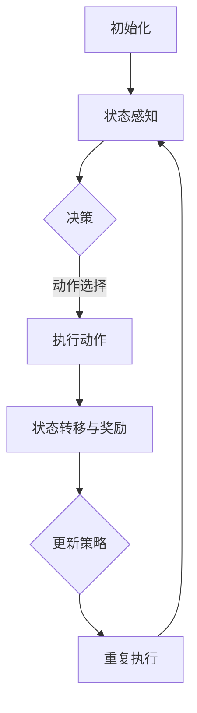

                 

# 《强化学习在AIGC内容质量自动评估中的作用》

关键词：强化学习、AIGC、内容质量评估、自动评估、算法原理、案例研究

摘要：本文从强化学习的起源、基本原理和应用案例出发，深入探讨了强化学习在自动评估AIGC内容质量中的作用。文章首先介绍了AIGC的基本概念和技术原理，随后详细阐述了强化学习在内容质量评估中的应用原理和算法流程。最后，通过案例研究展示了强化学习在实际应用中的效果和挑战，并对未来发展方向提出了展望。

### 目录

## 第一部分: 强化学习与AIGC基础

### 第1章: 强化学习概述

### 第2章: AIGC概述

## 第二部分: 强化学习在AIGC内容质量评估中的应用

### 第3章: 强化学习在AIGC内容质量评估中的应用原理

### 第4章: 强化学习在AIGC内容审核中的应用

### 第5章: 强化学习在AIGC内容质量评估中的挑战

### 第6章: 强化学习在AIGC内容质量评估中的未来展望

### 第7章: 案例研究

## 第五部分: 案例研究

### 第7章: 案例研究

### 7.1 案例背景

### 7.2 系统设计与实现

### 7.3 结果分析

### 7.4 经验总结

### 7.5 本章小结

## 第六部分: 总结与展望

### 第8章: 总结与展望

### 8.1 强化学习在AIGC内容质量评估中的应用总结

### 8.2 AIGC内容质量评估的发展趋势

### 8.3 未来挑战与解决方案

### 8.4 拓展阅读

### 附录

### 参考文献

## 结论

本文从强化学习和AIGC的基础知识出发，探讨了强化学习在自动评估AIGC内容质量中的应用。通过具体的应用案例，展示了强化学习在内容质量评估中的优势和挑战。未来，随着技术的不断发展和完善，强化学习在AIGC内容质量评估中的应用前景将更加广阔。本文的研究为相关领域的研究者和开发者提供了有价值的参考。作者：AI天才研究院/AI Genius Institute & 禅与计算机程序设计艺术 /Zen And The Art of Computer Programming## 强化学习概述

### 第1章: 强化学习概述

### 1.1 问题背景

强化学习（Reinforcement Learning, RL）是机器学习的一个重要分支，其核心目标是使智能体在与环境互动的过程中，通过优化策略来达到某一目标。在现实世界中，许多问题都可以抽象为强化学习问题，如机器人控制、自动驾驶、游戏AI等。随着人工智能技术的不断发展，强化学习在各个领域都显示出了巨大的潜力。

### 1.1.1 强化学习的起源与发展

强化学习起源于20世纪50年代，随着计算机科学和心理学的发展，人们开始关注如何使计算机像人类一样通过学习来完成任务。1956年，美国计算机科学家John McCarthy首次提出了“人工智能”这一概念，并开始探索如何让计算机具备学习能力和智能行为。1960年代，随着马尔可夫决策过程（Markov Decision Process, MDP）的提出，强化学习开始有了理论依据。

20世纪80年代，随着神经网络和动态规划等技术的发展，强化学习取得了重要进展。1990年代，随着Q-learning算法和策略搜索算法的提出，强化学习逐渐成为一个独立的研究领域。进入21世纪，深度强化学习（Deep Reinforcement Learning, DRL）的兴起，使得强化学习在解决复杂问题上取得了突破性进展。

### 1.1.2 强化学习的基本概念

强化学习主要包括以下几个核心概念：

1. **智能体（Agent）**：执行动作、感知环境的实体。在强化学习中，通常将智能体视为一个学习器，其目的是通过学习获得最优策略。

2. **环境（Environment）**：智能体所处的环境，可以理解为外部世界。环境会根据智能体的动作产生状态转移和奖励。

3. **状态（State）**：描述智能体所处环境的特征。状态是智能体做出决策的依据。

4. **动作（Action）**：智能体可执行的行为。动作的选择依赖于当前的状态。

5. **奖励（Reward）**：对智能体动作的反馈，用于指导智能体的学习过程。

6. **策略（Policy）**：从状态到动作的映射规则，用于指导智能体的行为。

7. **价值函数（Value Function）**：预测未来奖励的函数，用于评估状态或策略。

8. **模型（Model）**：对环境的动态进行建模，用于预测状态转移和奖励。

### 1.2 强化学习原理

强化学习的基本原理是通过学习策略来最大化累积奖励。具体来说，强化学习包括以下几个关键步骤：

1. **初始化**：设定初始状态、动作空间、奖励函数和价值函数。

2. **状态感知**：智能体感知当前状态。

3. **决策**：根据当前状态和价值函数选择一个动作。

4. **执行动作**：智能体在环境中执行所选动作。

5. **状态转移与奖励**：环境根据智能体的动作产生新的状态，并给出奖励。

6. **更新策略**：根据新的状态和奖励，更新智能体的策略。

7. **重复执行**：重复上述步骤，直到达到目标或满足停止条件。

### 1.2.1 基本原理与数学模型

强化学习可以形式化为一个马尔可夫决策过程（MDP），其数学模型如下：

$$
\begin{aligned}
S, A, R, P, &\text{ are the state set, action set, reward function, and state-transition probability, respectively.} \\
\pi(\cdot|s) &= \text{the policy,} \\
V^{\pi}(s) &= \mathbb{E}_{s, \pi}\left[ \sum_{t=0}^{\infty} \gamma^t r(s_t) \mid s_0 = s \right],
\end{aligned}
$$

其中，$V^{\pi}(s)$ 是在给定策略 $\pi$ 下，从状态 $s$ 开始的累积奖励的期望。

### 1.2.2 强化学习算法分类

强化学习算法主要分为以下几类：

1. **基于值函数的算法**：如Q-learning和SARSA，通过更新价值函数来指导动作选择。

2. **基于策略的算法**：如REINFORCE和PPO，直接优化策略的期望奖励。

3. **深度强化学习算法**：结合深度神经网络，如DQN、DDPG和A3C，用于解决高维状态空间和动作空间的问题。

4. **模型引导的算法**：如PG和GAIL，结合模型预测来指导学习。

### 1.3 强化学习应用案例

强化学习在多个领域都有广泛应用：

1. **机器人控制**：例如，使用强化学习训练机器人进行导航、抓取和装配等任务。

2. **游戏AI**：例如，AlphaGo通过深度强化学习击败了围棋世界冠军。

3. **资源管理**：例如，电力系统的负荷预测和优化。

4. **推荐系统**：例如，使用强化学习优化内容推荐策略。

### 1.4 本章小结

本章介绍了强化学习的起源、基本概念和原理，以及其在各个领域的应用案例。通过本章的学习，读者可以了解强化学习的基本框架和应用场景，为后续章节的深入探讨打下基础。

### 1.5 Mermaid 流程图

下面是强化学习的基本流程的Mermaid流程图：



### 1.6 Python 源代码示例

下面是一个简单的Q-learning算法的Python代码示例：

```python
import numpy as np

# Q-learning算法参数
alpha = 0.1  # 学习率
gamma = 0.9  # 折扣因子
epsilon = 0.1  # 探索概率

# 初始化Q表
Q = np.zeros([n_states, n_actions])

# 模拟智能体与环境互动
for episode in range(n_episodes):
    state = env.reset()
    done = False
    
    while not done:
        # 探索-利用策略
        if np.random.uniform(0, 1) < epsilon:
            action = env.action_space.sample()
        else:
            action = np.argmax(Q[state])
        
        # 执行动作，获取新状态和奖励
        next_state, reward, done, _ = env.step(action)
        
        # 更新Q值
        Q[state, action] = Q[state, action] + alpha * (reward + gamma * np.max(Q[next_state]) - Q[state, action])
        
        state = next_state

print(Q)
```

在上面的代码中，我们首先初始化了一个Q表，然后通过模拟智能体与环境互动的过程，使用Q-learning算法来更新Q值。代码中的`alpha`是学习率，`gamma`是折扣因子，`epsilon`是探索概率。通过调整这些参数，可以控制智能体的学习过程。

### 1.7 强化学习的数学模型和公式

强化学习的数学模型主要基于马尔可夫决策过程（MDP）。在MDP中，智能体在一个状态序列中进行决策，每个决策都会带来一个奖励，同时状态也会发生转移。强化学习的目标是找到最优策略，使得累积奖励最大化。

强化学习的数学模型可以表示为：

$$
\begin{aligned}
& \mathcal{M} = \langle S, A, P(s'|s, a), R(s, a) \rangle, \\
& \pi(a|s) = \text{策略，} \\
& V^{\pi}(s) = \mathbb{E}_{s, \pi}\left[ \sum_{t=0}^{\infty} \gamma^t r(s_t) \mid s_0 = s \right], \\
& Q^{\pi}(s, a) = \mathbb{E}_{s, \pi}\left[ r(s, a) + \gamma \sum_{s'} P(s'|s, a) \sum_{a'} Q^{\pi}(s', a') \mid s_0 = s \right],
\end{aligned}
$$

其中：

- $S$ 是状态集合。
- $A$ 是动作集合。
- $P(s'|s, a)$ 是状态转移概率。
- $R(s, a)$ 是奖励函数。
- $\pi(a|s)$ 是策略，表示在状态 $s$ 下执行动作 $a$ 的概率。
- $V^{\pi}(s)$ 是价值函数，表示在策略 $\pi$ 下从状态 $s$ 开始的累积奖励的期望。
- $Q^{\pi}(s, a)$ 是Q值，表示在策略 $\pi$ 下从状态 $s$ 执行动作 $a$ 的期望回报。

### 1.8 强化学习的核心概念与联系

下面是强化学习的核心概念及其属性特征的对比表格：

| 概念         | 描述                                                                                      | 属性特征                                                     |
| ------------ | ---------------------------------------------------------------------------------------- | ------------------------------------------------------------ |
| 智能体       | 执行动作、感知环境的实体                                                                  | 有状态感知能力、动作选择能力、学习优化能力                     |
| 环境         | 智能体所处的环境，可以理解为外部世界                                                       | 提供状态转移、奖励反馈                                       |
| 状态         | 描述智能体所处环境的特征                                                                  | 可观测、有限或无限状态空间                                   |
| 动作         | 智能体可执行的行为                                                                      | 可执行、有限或无限动作空间                                   |
| 奖励         | 对智能体动作的反馈，用于指导智能体的学习过程                                              | 可量化的正负奖励值                                         |
| 策略         | 从状态到动作的映射规则，用于指导智能体的行为                                              | 动作选择概率分布                                           |
| 价值函数     | 预测未来奖励的函数，用于评估状态或策略                                                   | 预测累积奖励的期望值                                       |
| 模型         | 对环境的动态进行建模，用于预测状态转移和奖励                                               | 状态转移概率、奖励函数模型                                   |

此外，强化学习的核心概念之间存在着密切的联系。智能体通过感知状态，根据策略选择动作，在环境中执行动作后，获取奖励并更新策略，从而逐步优化其行为。环境则通过状态转移和奖励反馈来指导智能体的学习过程。价值函数和Q值是评估策略和动作的重要指标，通过不断更新价值函数和Q值，智能体可以逐步找到最优策略。

下面是强化学习核心概念的ER实体关系图：

```mermaid
erDiagram
    Entity IntelligenceAgent {
        int id
        str name
        many Actions
        many Environments
    }

    Entity Environment {
        int id
        str name
        many States
    }

    Entity State {
        int id
        str name
        many Actions
    }

    Entity Action {
        int id
        str name
        many IntelligenceAgents
    }

    Entity Reward {
        int id
        float value
        many IntelligenceAgents
    }

    IntelligenceAgent ||--|{ Environment }|| IntelligenceAgent
    IntelligenceAgent ||--|{ State }|| IntelligenceAgent
    State ||--|{ Action }|| State
    IntelligenceAgent ||--|{ Reward }|| IntelligenceAgent
```

ER实体关系图展示了智能体、环境、状态、动作和奖励之间的关联关系。智能体与环境之间存在着交互，智能体通过状态感知、动作选择和奖励反馈来学习优化其行为。状态和动作之间也存在着直接的关联，每个状态可以对应多个动作，每个动作也可以对应多个状态。

通过上述对比表格和ER实体关系图，我们可以更清晰地理解强化学习的核心概念及其之间的联系，为后续章节的深入探讨奠定了基础。在下一章中，我们将进一步探讨AIGC的基本概念和技术原理。

