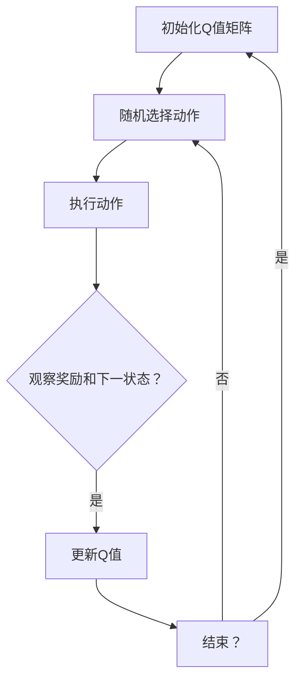
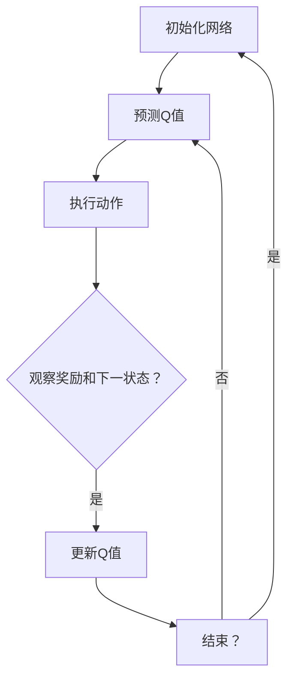
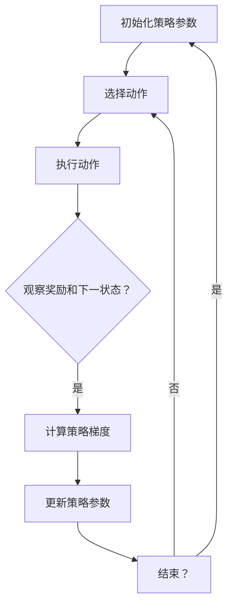
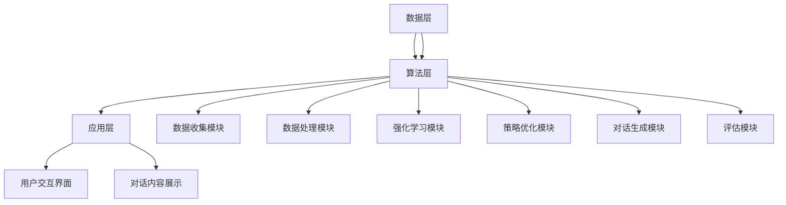
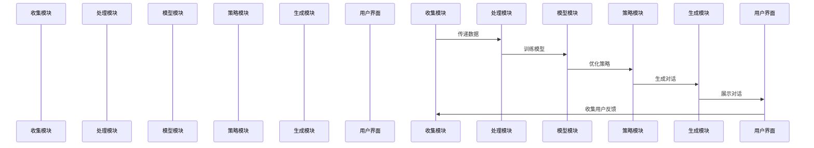

                 

# 强化学习在AIGC对话策略优化中的新进展

> 关键词：强化学习、AIGC、对话策略优化、算法原理、数学模型、系统架构

> 摘要：本文详细探讨了强化学习在自动生成内容（AIGC）对话策略优化中的应用。文章首先介绍了AIGC和强化学习的基础概念，随后深入分析了AIGC对话策略优化的核心原理和算法，结合数学模型和实际案例进行了详尽解释。最后，文章提出了系统架构设计和项目实战的方法，总结了最佳实践，为相关领域的研究者和开发者提供了有价值的参考。

## 引言

### 1. AIGC的背景和重要性

自动生成内容（AIGC，AI-Generated Content）是指通过人工智能技术生成各种形式的内容，如文本、图像、音频和视频等。随着深度学习、生成模型和自然语言处理技术的快速发展，AIGC在社交媒体、内容创作、广告营销等多个领域展现出了巨大的潜力和重要性。

AIGC的应用不仅提高了内容生成的效率，还丰富了内容的多样性和个性化程度。例如，在文本生成方面，AIGC可以自动生成新闻文章、产品描述和营销文案；在图像生成方面，AIGC可以生成艺术作品、广告海报和虚拟现实场景。这些应用不仅解放了人类的创作力，还为商业模式创新提供了新的机遇。

### 2. 强化学习在AIGC中的作用

强化学习（Reinforcement Learning，RL）是一种通过试错和反馈来学习如何完成特定任务的人工智能方法。与监督学习和无监督学习不同，强化学习通过不断尝试和优化策略来提高性能。

在AIGC中，强化学习扮演了关键角色。它通过学习用户与生成系统的交互数据，优化对话策略，提高对话的流畅性和用户体验。强化学习不仅可以自动调整对话的走向和内容，还可以根据用户的反馈进行自适应调整，从而实现更加智能化和个性化的对话体验。

### 3. 本文的目的和结构

本文旨在系统地探讨强化学习在AIGC对话策略优化中的应用。文章首先介绍AIGC和强化学习的基础概念，然后深入分析AIGC对话策略优化的核心原理和算法，结合数学模型和实际案例进行解释。最后，文章将探讨系统架构设计和项目实战，总结最佳实践，为相关领域的研究者和开发者提供有价值的参考。

文章结构如下：

1. **引言**：介绍AIGC和强化学习的基础概念。
2. **核心概念与联系**：详细定义AIGC、强化学习、对话策略等核心概念，并给出相关的属性对比表格和ER模型。
3. **算法原理讲解**：介绍强化学习算法的原理，使用Mermaid图和Python代码详细解释。
4. **数学模型与公式**：阐述强化学习的数学模型和公式，结合实际案例进行讲解。
5. **系统分析与架构设计**：介绍AIGC对话策略优化的系统架构，包括系统功能设计、架构设计和接口设计。
6. **项目实战**：介绍强化学习在AIGC对话策略优化中的实际应用案例，包括环境安装、系统核心实现、代码解析和案例分析。
7. **最佳实践与总结**：总结强化学习在AIGC对话策略优化中的最佳实践，提出注意事项，并推荐拓展阅读。

通过本文的阅读，读者可以系统地了解强化学习在AIGC对话策略优化中的最新进展和应用，掌握相关技术原理和实践方法，为未来的研究和开发提供指导。

## 核心概念与联系

在深入探讨强化学习在AIGC对话策略优化中的应用之前，首先需要明确几个核心概念，并了解它们之间的联系。这些核心概念包括自动生成内容（AIGC）、强化学习（Reinforcement Learning，RL）、对话策略（Dialogue Strategy）等。

### 1. 自动生成内容（AIGC）

自动生成内容（AIGC）是指通过人工智能技术，如深度学习、生成模型和自然语言处理技术，自动生成文本、图像、音频、视频等多种形式的内容。AIGC的目的是利用AI的强大计算能力和大规模数据处理能力，实现内容的自动化生成和个性化推荐，从而提高内容创作的效率和质量。

#### 1.1 AIGC的应用场景

AIGC的应用场景非常广泛，主要包括：

- 文本生成：如自动撰写新闻文章、产品描述、营销文案等。
- 图像生成：如生成艺术作品、广告海报、虚拟现实场景等。
- 音频生成：如生成音乐、语音合成、音频效果等。
- 视频生成：如生成视频剪辑、短视频内容、虚拟现实视频等。

#### 1.2 AIGC的关键技术

AIGC的关键技术包括：

- 深度学习：使用神经网络模型进行数据建模和特征提取。
- 生成模型：如生成对抗网络（GAN）、变分自编码器（VAE）等。
- 自然语言处理：如序列到序列（Seq2Seq）模型、BERT等。

### 2. 强化学习（Reinforcement Learning，RL）

强化学习（RL）是一种通过试错和反馈来学习如何完成特定任务的人工智能方法。在强化学习过程中，智能体（Agent）通过与环境（Environment）的交互，不断学习并优化其策略（Policy），以实现最大化回报（Reward）的目标。

#### 2.1 RL的基本概念

- **智能体（Agent）**：执行行动并接收环境反馈的实体。
- **环境（Environment）**：智能体执行行动的背景和条件。
- **策略（Policy）**：智能体选择行动的规则或函数。
- **状态（State）**：环境在某一时刻的状态描述。
- **行动（Action）**：智能体在某一状态下执行的操作。
- **回报（Reward）**：环境对智能体行动的即时反馈。

#### 2.2 RL的应用场景

强化学习在多个领域都有广泛应用，主要包括：

- 游戏AI：如电子游戏、棋类游戏等。
- 自动驾驶：如自动驾驶车辆的路径规划。
- 机器人控制：如机器人行走、抓取等。
- 对话系统：如聊天机器人、语音助手等。

### 3. 对话策略（Dialogue Strategy）

对话策略是指智能体在与用户进行对话时，如何选择合适的行动和回复，以实现有效沟通和任务完成的目标。对话策略的设计和优化是AIGC对话系统成功的关键。

#### 3.1 对话策略的核心要素

- **上下文理解**：智能体需要理解用户的意图、情感和背景信息。
- **回复生成**：智能体需要根据上下文生成自然、合适的回复。
- **目标导向**：智能体需要明确对话的目标，并围绕目标进行对话。
- **情感表达**：智能体需要具备情感表达能力，以增强用户互动的体验。

#### 3.2 对话策略的类型

- **基于规则的方法**：使用预定义的规则进行对话，如模板匹配、关键词提取等。
- **基于统计的方法**：使用统计模型进行对话，如隐马尔可夫模型（HMM）、条件随机场（CRF）等。
- **基于生成模型的方法**：使用生成模型进行对话，如序列到序列（Seq2Seq）模型、生成对抗网络（GAN）等。
- **强化学习方法**：使用强化学习进行对话，如Q-learning、深度Q网络（DQN）等。

### 4. 核心概念的联系

AIGC、强化学习和对话策略之间存在着密切的联系。AIGC是生成内容的技术基础，强化学习是优化对话策略的关键方法，对话策略则是AIGC在实际应用中的具体实现。

- AIGC为强化学习提供了丰富的数据来源，强化学习通过不断优化对话策略，提高AIGC对话系统的性能。
- 对话策略的优化依赖于强化学习算法，强化学习算法通过对用户反馈的学习，调整对话策略，实现更智能、更个性化的对话体验。
- 对话策略的优劣直接影响AIGC的应用效果，优化对话策略可以提高AIGC系统的用户满意度和使用频率。

通过以上分析，可以清晰地看到AIGC、强化学习和对话策略之间的相互关系，这为后续内容的深入探讨奠定了基础。

## 强化学习在AIGC对话策略优化中的核心原理

强化学习（Reinforcement Learning，RL）在AIGC对话策略优化中发挥着核心作用。为了深入理解其原理，我们将从以下几个方面进行探讨：

### 1. 强化学习的理论基础

强化学习是基于奖励机制的学习方法，其基本原理是智能体通过与环境交互，通过不断尝试和反馈，优化其策略，以实现最大化回报的目标。

- **奖励机制**：奖励机制是强化学习的核心，它通过即时反馈来指导智能体的行为。奖励可以是正的（表示行为有益），也可以是负的（表示行为有害）。
- **策略优化**：智能体在每次行动后，根据当前的奖励和环境的反馈，调整其策略，以期在后续行动中取得更好的回报。
- **状态-动作值函数**：状态-动作值函数（State-Action Value Function）表示智能体在某个状态下选择某个动作的期望回报。通过学习状态-动作值函数，智能体可以更好地理解环境并选择最佳动作。

### 2. 强化学习算法

强化学习算法有很多种，其中一些常见的算法包括Q-learning、深度Q网络（DQN）、策略梯度方法等。下面我们将简要介绍这些算法的基本原理。

- **Q-learning算法**：Q-learning算法是一种基于值函数的强化学习算法。它通过学习状态-动作值函数，来选择最佳动作。Q-learning算法的核心思想是，通过不断更新状态-动作值函数，使智能体在面临不同状态时，选择能够带来最大回报的动作。

    - 更新公式：$$Q(s, a) \leftarrow Q(s, a) + \alpha [r + \gamma \max_{a'} Q(s', a') - Q(s, a)]$$
    - 其中，$Q(s, a)$表示状态-动作值函数，$r$表示即时奖励，$\gamma$表示折扣因子，$\alpha$表示学习率。

- **深度Q网络（DQN）**：DQN算法是一种基于深度学习的强化学习算法。它使用深度神经网络来近似状态-动作值函数，以提高智能体的决策能力。

    - 网络结构：DQN算法通常使用卷积神经网络（CNN）或循环神经网络（RNN）来处理复杂的输入数据。
    - 双重DQN（DDQN）：为了减少目标值函数的偏差，DQN算法引入了双重DQN（DDQN），它通过使用两个神经网络来计算目标值函数，从而提高学习稳定性。

- **策略梯度方法**：策略梯度方法是一种直接优化策略的强化学习算法。它通过计算策略的梯度，来调整策略参数，以提高回报。

    - 更新公式：$$\theta \leftarrow \theta - \alpha \nabla_{\theta} J(\theta)$$
    - 其中，$\theta$表示策略参数，$J(\theta)$表示策略的损失函数。

### 3. 强化学习在AIGC对话策略优化中的应用

在AIGC对话系统中，强化学习通过学习用户与生成系统的交互数据，优化对话策略，提高对话的流畅性和用户体验。

- **用户交互数据**：强化学习通过收集用户与生成系统的交互数据，如用户的提问、反馈、满意度等，来训练对话模型。
- **策略优化**：通过分析用户交互数据，强化学习可以调整对话策略，使其更加符合用户的期望和需求。
- **自适应调整**：强化学习可以根据用户的实时反馈，自适应地调整对话策略，以实现更加智能、个性化的对话体验。

### 4. 强化学习在AIGC对话策略优化中的挑战和机会

虽然强化学习在AIGC对话策略优化中具有巨大潜力，但同时也面临着一些挑战和机会。

- **挑战**：
  - 数据质量和数量：高质量的交互数据是强化学习训练的基础，但实际获取高质量数据可能较为困难。
  - 稳定性：强化学习算法在训练过程中可能存在不稳定、过拟合等问题。
  - 长期依赖性：对话系统需要具备长期依赖性，以处理复杂、多轮的对话。

- **机会**：
  - 个性化对话：通过强化学习，可以实现对用户个性化需求的识别和满足，提高对话系统的用户体验。
  - 自适应学习：强化学习可以使对话系统具备自适应学习能力，以应对不断变化的环境和用户需求。
  - 跨领域应用：强化学习在AIGC对话策略优化中的成功，可以为其他领域提供借鉴和参考。

通过以上分析，我们可以看到，强化学习在AIGC对话策略优化中具有广泛的应用前景。在未来，随着技术的不断进步和应用的深入，强化学习有望为AIGC对话系统带来更多的创新和突破。

### 1.1 AIGC的基本概念和功能

自动生成内容（AIGC，AI-Generated Content）是一种利用人工智能技术生成文本、图像、音频、视频等多种形式内容的方法。AIGC的核心功能是通过大规模数据处理、深度学习和生成模型等技术，实现内容的自动化生成和个性化推荐。

#### 1.1.1 AIGC的应用场景

AIGC的应用场景广泛，主要包括以下几个方面：

- **文本生成**：自动生成新闻文章、产品描述、营销文案、摘要等。
- **图像生成**：生成艺术作品、广告海报、虚拟现实场景等。
- **音频生成**：生成音乐、语音合成、音频效果等。
- **视频生成**：生成视频剪辑、短视频内容、虚拟现实视频等。

#### 1.1.2 AIGC的关键技术

AIGC的关键技术包括：

- **深度学习**：通过神经网络模型进行数据建模和特征提取。
- **生成模型**：如生成对抗网络（GAN）、变分自编码器（VAE）等。
- **自然语言处理**：如序列到序列（Seq2Seq）模型、BERT等。

#### 1.1.3 AIGC的优势

AIGC具有以下优势：

- **高效性**：通过自动化生成，大大提高了内容创作的效率。
- **个性化**：根据用户行为和偏好，生成个性化的内容。
- **多样性**：生成内容具有多样性，丰富了内容创作的形式。
- **成本效益**：减少了对人力和资源的依赖，降低了创作成本。

### 1.2 强化学习的基本概念和原理

强化学习（Reinforcement Learning，RL）是一种通过试错和反馈来学习如何完成特定任务的人工智能方法。在强化学习中，智能体通过与环境交互，不断学习和调整策略，以实现最大化回报的目标。

#### 1.2.1 强化学习的基本概念

- **智能体（Agent）**：执行行动并接收环境反馈的实体。
- **环境（Environment）**：智能体执行行动的背景和条件。
- **策略（Policy）**：智能体选择行动的规则或函数。
- **状态（State）**：环境在某一时刻的状态描述。
- **行动（Action）**：智能体在某一状态下执行的操作。
- **回报（Reward）**：环境对智能体行动的即时反馈。

#### 1.2.2 强化学习的原理

强化学习通过学习状态-动作值函数（State-Action Value Function）来指导智能体的行动。状态-动作值函数表示智能体在某个状态下选择某个动作的期望回报。智能体通过不断尝试和优化，调整其策略，以提高回报。

- **状态-动作值函数**：$$Q(s, a) = E[R_t | s_t = s, a_t = a]$$
- **策略**：$$\pi(a|s) = P(a|s, \theta)$$
- **回报**：$$R_t = R(s_t, a_t)$$

#### 1.2.3 强化学习的核心算法

强化学习算法有很多种，其中一些常见的算法包括Q-learning、深度Q网络（DQN）、策略梯度方法等。这些算法的核心思想都是通过学习状态-动作值函数或直接优化策略，以实现最大化回报的目标。

- **Q-learning算法**：Q-learning算法是一种基于值函数的强化学习算法。它通过不断更新状态-动作值函数，选择最佳动作。
- **深度Q网络（DQN）**：DQN算法是一种基于深度学习的强化学习算法。它使用深度神经网络来近似状态-动作值函数，以提高智能体的决策能力。
- **策略梯度方法**：策略梯度方法是一种直接优化策略的强化学习算法。它通过计算策略的梯度，调整策略参数，以提高回报。

### 1.3 强化学习在AIGC对话策略优化中的作用

在AIGC对话系统中，强化学习通过学习用户与生成系统的交互数据，优化对话策略，提高对话的流畅性和用户体验。强化学习在AIGC对话策略优化中的作用主要体现在以下几个方面：

- **个性化对话**：通过强化学习，可以实现对用户个性化需求的识别和满足，提高对话系统的用户体验。
- **自适应调整**：强化学习可以使对话系统具备自适应学习能力，以应对不断变化的环境和用户需求。
- **策略优化**：通过不断调整对话策略，强化学习可以提高对话系统的性能，实现更智能、个性化的对话体验。

### 1.4 AIGC对话策略优化的挑战和机会

虽然强化学习在AIGC对话策略优化中具有巨大潜力，但同时也面临着一些挑战和机会。

- **挑战**：
  - 数据质量和数量：高质量、大规模的交互数据是强化学习训练的基础，但实际获取高质量数据可能较为困难。
  - 稳定性：强化学习算法在训练过程中可能存在不稳定、过拟合等问题。
  - 长期依赖性：对话系统需要具备长期依赖性，以处理复杂、多轮的对话。

- **机会**：
  - 个性化对话：通过强化学习，可以实现对用户个性化需求的识别和满足，提高对话系统的用户体验。
  - 自适应学习：强化学习可以使对话系统具备自适应学习能力，以应对不断变化的环境和用户需求。
  - 跨领域应用：强化学习在AIGC对话策略优化中的成功，可以为其他领域提供借鉴和参考。

通过以上分析，我们可以看到，强化学习在AIGC对话策略优化中具有广泛的应用前景。在未来，随着技术的不断进步和应用的深入，强化学习有望为AIGC对话系统带来更多的创新和突破。

### 核心概念与联系

在深入探讨AIGC对话策略优化的核心概念及其联系之前，我们需要明确几个关键术语，并了解它们之间的相互关系。这些核心概念包括AIGC、强化学习、对话策略、状态-动作值函数、策略梯度等。

#### 1. AIGC（自动生成内容）

AIGC是一种利用人工智能技术生成文本、图像、音频、视频等多种形式内容的方法。其核心功能是通过大规模数据处理、深度学习和生成模型等技术，实现内容的自动化生成和个性化推荐。

- **应用场景**：文本生成、图像生成、音频生成、视频生成。
- **关键技术**：深度学习、生成模型、自然语言处理。

#### 2. 强化学习（Reinforcement Learning）

强化学习是一种通过试错和反馈来学习如何完成特定任务的人工智能方法。在强化学习中，智能体通过与环境交互，不断学习和调整策略，以实现最大化回报的目标。

- **基本概念**：智能体、环境、策略、状态、行动、回报。
- **核心算法**：Q-learning、深度Q网络（DQN）、策略梯度方法。

#### 3. 对话策略（Dialogue Strategy）

对话策略是指智能体在与用户进行对话时，如何选择合适的行动和回复，以实现有效沟通和任务完成的目标。对话策略的设计和优化是AIGC对话系统成功的关键。

- **核心要素**：上下文理解、回复生成、目标导向、情感表达。
- **类型**：基于规则的方法、基于统计的方法、基于生成模型的方法、强化学习方法。

#### 4. 状态-动作值函数（State-Action Value Function）

状态-动作值函数表示智能体在某个状态下选择某个动作的期望回报。通过学习状态-动作值函数，智能体可以更好地理解环境并选择最佳动作。

- **公式**：$$Q(s, a) = E[R_t | s_t = s, a_t = a]$$
- **作用**：指导智能体的行动，优化策略。

#### 5. 策略梯度（Policy Gradient）

策略梯度是一种直接优化策略的强化学习算法。它通过计算策略的梯度，调整策略参数，以提高回报。

- **公式**：$$\theta \leftarrow \theta - \alpha \nabla_{\theta} J(\theta)$$
- **作用**：优化策略参数，实现最大化回报。

#### 6. 关系与联系

AIGC、强化学习和对话策略之间存在着密切的联系。AIGC为强化学习提供了数据基础，强化学习通过优化对话策略，提高AIGC对话系统的性能。对话策略则是AIGC在实际应用中的具体实现。

- **AIGC与强化学习**：AIGC为强化学习提供了丰富的交互数据，强化学习通过不断优化策略，提高对话系统的性能。
- **强化学习与对话策略**：强化学习通过学习状态-动作值函数和策略梯度，优化对话策略，实现更智能、个性化的对话体验。
- **对话策略与AIGC**：对话策略是AIGC在实际应用中的具体实现，其优劣直接影响AIGC的应用效果。

通过以上分析，我们可以清晰地看到AIGC、强化学习和对话策略之间的相互关系，这为后续内容的深入探讨奠定了基础。

### 核心概念属性对比表格

为了更好地理解和比较AIGC、强化学习、对话策略等核心概念，我们可以通过一个属性对比表格来展示它们的主要属性和特征。

#### 表格1：AIGC、强化学习、对话策略属性对比

| 特征 | AIGC | 强化学习 | 对话策略 |
| --- | --- | --- | --- |
| **定义** | 自动生成内容的方法 | 通过试错和反馈学习的方法 | 智能体在与用户对话时的行动和回复策略 |
| **应用场景** | 文本、图像、音频、视频生成 | 游戏、自动驾驶、机器人控制、对话系统 | 聊天机器人、语音助手、虚拟客服 |
| **关键技术** | 深度学习、生成模型、自然语言处理 | Q-learning、DQN、策略梯度方法 | 上下文理解、回复生成、目标导向、情感表达 |
| **目标** | 自动化内容生成和个性化推荐 | 最大化回报和优化策略 | 实现有效沟通和任务完成 |
| **数据依赖** | 大规模数据集 | 用户交互数据 | 用户行为和反馈 |
| **挑战** | 数据质量和数量、模型复杂性 | 稳定性、长期依赖性、数据质量 | 上下文理解、用户满意度、情感表达 |
| **优势** | 高效性、个性化、多样性、成本效益 | 自适应学习、可扩展性、灵活性 | 个性化对话、用户体验、任务完成率 |

通过这个表格，我们可以清晰地看到AIGC、强化学习和对话策略在定义、应用场景、关键技术、目标、数据依赖、挑战和优势等方面的差异和联系。这有助于我们深入理解这些核心概念，并在实际应用中合理选择和组合这些技术，以实现最优的对话策略优化效果。

### ER模型

为了更好地理解AIGC对话策略优化中的数据关系和实体之间的交互，我们可以使用实体-关系（Entity-Relationship，ER）模型来表示。ER模型是一种用于数据库设计的方法，它通过实体和关系的概念来描述数据模型的结构。

#### 1. 实体

在AIGC对话策略优化中，我们定义以下实体：

- **用户（User）**：与对话系统进行交互的个体，具有用户ID、年龄、性别、兴趣等属性。
- **对话（Dialogue）**：用户与对话系统之间的交互过程，包含对话ID、开始时间、结束时间等属性。
- **对话轮（DialogueTurn）**：对话中的每个环节，包含对话轮ID、用户发言、系统回复等属性。
- **策略（Strategy）**：对话系统在处理对话时使用的策略，包含策略ID、策略名称、策略参数等属性。
- **环境（Environment）**：对话系统运行的环境，包含环境ID、状态描述、动作空间等属性。

#### 2. 关系

ER模型中的关系描述了实体之间的关联。在AIGC对话策略优化中，我们定义以下关系：

- **用户-对话**：表示一个用户可以发起多个对话，一个对话只能由一个用户发起。
- **对话-对话轮**：表示一个对话包含多个对话轮，每个对话轮都属于某个对话。
- **对话轮-策略**：表示每个对话轮可以采用不同的策略，策略是用于处理对话轮的。
- **环境-策略**：表示策略在特定环境下运行，环境影响策略的选择和执行。

#### 3. ER图

为了更直观地展示实体和关系，我们可以使用Mermaid语法绘制ER图。以下是ER模型的Mermaid表示：

```mermaid
erDiagram
  User ||--|{ Dialogue }|-- User
  Dialogue ||--|{ DialogueTurn }|-- Dialogue
  DialogueTurn ||--|{ Strategy }|-- DialogueTurn
  Strategy ||--|{ Environment }|-- Strategy
  User ||--|{ Interest }|-- User
  Dialogue ||--|{ Context }|-- Dialogue
  DialogueTurn ||--|{ Feedback }|-- DialogueTurn
  Environment ||--|{ State }|-- Environment
```

这个ER图展示了用户、对话、对话轮、策略和环境之间的实体和关系。通过这个ER模型，我们可以更好地理解AIGC对话策略优化中的数据结构和实体交互，为后续的系统设计和实现提供参考。

### 强化学习算法原理

在AIGC对话策略优化中，强化学习算法扮演着核心角色。为了深入理解这些算法的原理，我们将介绍几种常见的强化学习算法，包括Q-learning、深度Q网络（DQN）和策略梯度方法。通过Mermaid图和Python代码，我们将详细解释这些算法的基本思想和实现过程。

#### 1. Q-learning算法

Q-learning算法是一种基于值函数的强化学习算法，它通过学习状态-动作值函数（Q值）来选择最佳动作。以下是Q-learning算法的基本步骤和Python实现：

**步骤：**

1. 初始化Q值矩阵。
2. 对于每个状态，随机选择一个动作。
3. 执行动作并观察即时奖励和下一个状态。
4. 根据即时奖励和下一个状态的Q值，更新当前状态的Q值。

**Python代码实现：**

```python
import numpy as np

# 初始化Q值矩阵
Q = np.zeros((n_states, n_actions))

# 设置参数
alpha = 0.1  # 学习率
gamma = 0.9  # 折扣因子

# Q-learning算法
def q_learning(state, action):
    next_state, reward, done = environment.step(action)
    Q[state, action] += alpha * (reward + gamma * np.max(Q[next_state, :]) - Q[state, action])
    if done:
        return state
    return next_state

# 主循环
while not done:
    state = env.reset()
    action = np.random.choice(n_actions)
    state = q_learning(state, action)
```

**Mermaid流程图：**



#### 2. 深度Q网络（DQN）

深度Q网络（DQN）是一种基于深度学习的强化学习算法，它使用深度神经网络来近似状态-动作值函数。以下是DQN算法的基本步骤和Python实现：

**步骤：**

1. 初始化网络、目标网络和经验回放记忆。
2. 对于每个状态，使用深度神经网络预测Q值。
3. 执行动作并观察即时奖励和下一个状态。
4. 将状态-动作对和奖励存储到经验回放记忆中。
5. 随机从经验回放记忆中抽取样本。
6. 使用训练样本更新深度神经网络。
7. 定期同步目标网络和当前网络。

**Python代码实现：**

```python
import tensorflow as tf
import numpy as np

# 定义网络结构
model = tf.keras.Sequential([
    tf.keras.layers.Dense(64, activation='relu', input_shape=(n_states,)),
    tf.keras.layers.Dense(n_actions, activation='linear')
])

target_model = tf.keras.Sequential([
    tf.keras.layers.Dense(64, activation='relu', input_shape=(n_states,)),
    tf.keras.layers.Dense(n_actions, activation='linear')
])

# 定义优化器和学习率
optimizer = tf.keras.optimizers.Adam(learning_rate=0.001)

# DQN算法
def dqn_step(state, action):
    next_state, reward, done = environment.step(action)
    target_q = target_model.predict(next_state).max()
    q = model.predict(state)[0, action]
    if done:
        loss = tf.keras.losses.mean_squared_error([q], [reward])
    else:
        loss = tf.keras.losses.mean_squared_error([q], [reward + gamma * target_q])
    with tf.GradientTape() as tape:
        tape.watch(model.trainable_variables)
        q = model(state)
        loss = loss_function(q, y)
    gradients = tape.gradient(loss, model.trainable_variables)
    optimizer.apply_gradients(zip(gradients, model.trainable_variables))
    if done:
        return state
    return next_state

# 主循环
while not done:
    state = env.reset()
    action = np.random.choice(n_actions)
    state = dqn_step(state, action)
```

**Mermaid流程图：**



#### 3. 策略梯度方法

策略梯度方法是一种直接优化策略的强化学习算法，它通过计算策略的梯度来调整策略参数。以下是策略梯度方法的基本步骤和Python实现：

**步骤：**

1. 初始化策略参数。
2. 对于每个状态，根据当前策略选择动作。
3. 执行动作并观察即时奖励和下一个状态。
4. 计算策略的梯度。
5. 使用梯度调整策略参数。

**Python代码实现：**

```python
import tensorflow as tf
import numpy as np

# 定义策略网络
policy_model = tf.keras.Sequential([
    tf.keras.layers.Dense(64, activation='relu', input_shape=(n_states,)),
    tf.keras.layers.Dense(n_actions, activation='softmax')
])

# 定义优化器和学习率
optimizer = tf.keras.optimizers.Adam(learning_rate=0.001)

# 策略梯度方法
def policy_gradient_step(state, action, reward, next_state, done):
    probabilities = policy_model.predict(state)
    action_prob = probabilities[0, action]
    target = reward
    if not done:
        target += gamma * np.max(policy_model.predict(next_state)[0])
    loss = -tf.math.log(action_prob) * target
    with tf.GradientTape() as tape:
        tape.watch(policy_model.trainable_variables)
        logits = policy_model(state)
        loss = loss_function(logits, y)
    gradients = tape.gradient(loss, policy_model.trainable_variables)
    optimizer.apply_gradients(zip(gradients, policy_model.trainable_variables))

# 主循环
while not done:
    state = env.reset()
    action = np.random.choice(n_actions, p=policy_model.predict(state)[0])
    next_state, reward, done = environment.step(action)
    policy_gradient_step(state, action, reward, next_state, done)
```

**Mermaid流程图：**



通过以上对Q-learning、DQN和策略梯度方法的详细介绍，我们可以看到这些算法在AIGC对话策略优化中的基本原理和实现过程。在实际应用中，可以根据具体需求和场景选择合适的算法，并结合Python代码进行实现和优化。

### 强化学习的数学模型和公式

强化学习（Reinforcement Learning，RL）是一种通过试错和反馈来学习如何完成特定任务的人工智能方法。在强化学习过程中，核心的数学模型和公式帮助我们理解和实现算法。以下是强化学习的数学模型和公式，以及相关的解释和例子。

#### 1. 状态-动作值函数（State-Action Value Function）

状态-动作值函数（Q值）是强化学习的核心概念，它表示在某个状态下执行某个动作的期望回报。数学公式如下：

$$ Q(s, a) = E[R_t | s_t = s, a_t = a] $$

其中：
- \( Q(s, a) \) 是状态-动作值函数。
- \( E[R_t | s_t = s, a_t = a] \) 是在状态 \( s \) 下执行动作 \( a \) 的期望回报。
- \( R_t \) 是在 \( t \) 时刻的即时回报。
- \( s_t \) 是 \( t \) 时刻的状态。
- \( a_t \) 是 \( t \) 时刻的动作。

**例子**：假设一个机器人需要在迷宫中找到出口。当前状态是房间1，可以选择向左或向右走。如果向左走，有1/2的概率获得5分奖励，1/2的概率获得0分奖励；如果向右走，有1/2的概率获得3分奖励，1/2的概率获得-1分奖励。那么，状态-动作值函数可以计算如下：

$$ Q(房间1, 左) = \frac{1}{2} \times 5 + \frac{1}{2} \times 0 = 2.5 $$
$$ Q(房间1, 右) = \frac{1}{2} \times 3 + \frac{1}{2} \times (-1) = 1 $$

因此，机器人应该选择向左走，以期望获得更高的回报。

#### 2. 策略（Policy）

策略是智能体在特定状态下选择动作的规则或函数。常见的策略包括最优策略、ε-贪心策略等。数学公式如下：

$$ \pi(a|s) = P(a|s, \theta) $$

其中：
- \( \pi(a|s) \) 是在状态 \( s \) 下选择动作 \( a \) 的概率。
- \( \theta \) 是策略参数。

**例子**：假设一个机器人需要根据当前状态决定是否移动。如果当前状态是房间1，机器人有1/3的概率移动，2/3的概率保持不动。那么，该机器人的策略可以表示为：

$$ \pi(移动|房间1) = \frac{1}{3} $$
$$ \pi(保持不动|房间1) = \frac{2}{3} $$

#### 3. 价值函数（Value Function）

价值函数是评估状态或策略的函数，它表示在某个状态下执行最佳动作的期望回报。常见的价值函数包括状态值函数（V值）和状态-动作值函数（Q值）。

- **状态值函数（V值）**：

$$ V^*(s) = \max_a Q^*(s, a) $$

其中：
- \( V^*(s) \) 是状态值函数。
- \( Q^*(s, a) \) 是最优状态-动作值函数。
- \( a \) 是最佳动作。

**例子**：假设在某个游戏中，最佳动作是获得最大的分数。当前状态是房间1，有2种动作：攻击和防御。攻击的期望回报是6分，防御的期望回报是4分。那么，状态值函数可以计算如下：

$$ V^*(房间1) = \max(6, 4) = 6 $$

- **状态-动作值函数（Q值）**：

$$ Q^*(s, a) = \sum_{s'} p(s'|s, a) \sum_{r} r \cdot p(r|s', a) $$

其中：
- \( Q^*(s, a) \) 是最优状态-动作值函数。
- \( p(s'|s, a) \) 是在状态 \( s \) 下执行动作 \( a \) 后转移到状态 \( s' \) 的概率。
- \( p(r|s', a) \) 是在状态 \( s' \) 下获得回报 \( r \) 的概率。

**例子**：假设在迷宫中，从状态 \( s \) 到状态 \( s' \) 的概率是1/2，获得回报的概率是1/2。如果获得回报是5分，那么状态-动作值函数可以计算如下：

$$ Q^*(s, a) = \frac{1}{2} \times 5 + \frac{1}{2} \times 0 = 2.5 $$

#### 4. 迭代更新公式

在强化学习中，我们通过迭代更新公式来不断优化策略和价值函数。以下是Q-learning和策略梯度方法的迭代更新公式：

- **Q-learning算法**：

$$ Q(s, a) \leftarrow Q(s, a) + \alpha [r + \gamma \max_{a'} Q(s', a') - Q(s, a)] $$

其中：
- \( \alpha \) 是学习率。
- \( \gamma \) 是折扣因子。
- \( r \) 是即时回报。
- \( s' \) 是下一个状态。
- \( a' \) 是下一个动作。

**例子**：假设当前状态是房间1，执行动作后获得即时回报是3分，下一个状态是房间2，最优动作的Q值是5分。那么，Q值的更新可以计算如下：

$$ Q(房间1, a) \leftarrow Q(房间1, a) + 0.1 [3 + 0.9 \times 5 - Q(房间1, a)] $$

- **策略梯度方法**：

$$ \theta \leftarrow \theta - \alpha \nabla_{\theta} J(\theta) $$

其中：
- \( J(\theta) \) 是策略的损失函数。

**例子**：假设当前策略的损失函数是0.5，学习率是0.1。那么，策略参数的更新可以计算如下：

$$ \theta \leftarrow \theta - 0.1 \nabla_{\theta} J(\theta) $$

通过以上对强化学习的数学模型和公式的介绍，我们可以更好地理解这些概念，并在实际应用中灵活运用这些公式，优化智能体的策略和价值函数。

### 强化学习算法的实际案例

为了更好地理解强化学习算法在实际中的应用，下面我们通过一个具体的案例来进行详细讲解。我们将使用Python实现一个简单的智能体，使其在虚拟环境中学习如何通过迷宫找到出口。

#### 案例背景

我们的虚拟环境是一个由多个房间组成的迷宫，每个房间都有四个方向（上、下、左、右），智能体需要根据当前房间的状态选择一个方向行动，并在每个行动后获得即时奖励。迷宫的出口位于某个房间，智能体需要学习如何在迷宫中找到出口并获得最高奖励。

#### 环境搭建

首先，我们需要定义虚拟环境。虚拟环境需要包含以下功能：
- 初始化迷宫和智能体的初始位置。
- 根据智能体的行动更新其位置。
- 根据智能体的当前位置判断是否到达出口。
- 提供即时奖励。

以下是虚拟环境的Python代码实现：

```python
import numpy as np
import random

class MazeEnvironment:
    def __init__(self, size=5):
        self.size = size
        self.maze = self._generate_maze()
        self.agent_position = (0, 0)
        self.exit_position = (size - 1, size - 1)

    def _generate_maze(self):
        maze = np.zeros((self.size, self.size), dtype=int)
        for i in range(self.size):
            for j in range(self.size):
                if i == 0 or i == self.size - 1 or j == 0 or j == self.size - 1:
                    maze[i, j] = 1
        return maze

    def step(self, action):
        next_position = self._move_agent(self.agent_position, action)
        reward = self._get_reward(next_position)
        done = self._is_done(next_position)
        next_position = self._reset_agent_if_needed(next_position)
        return next_position, reward, done

    def _move_agent(self, position, action):
        direction = {
            0: (position[0] - 1, position[1]),
            1: (position[0] + 1, position[1]),
            2: (position[0], position[1] - 1),
            3: (position[0], position[1] + 1),
        }
        if direction[action][0] < 0 or direction[action][0] >= self.size or direction[action][1] < 0 or direction[action][1] >= self.size:
            return position
        return direction[action]

    def _get_reward(self, position):
        if position == self.exit_position:
            return 10
        elif self.maze[position[0], position[1]] == 1:
            return -5
        else:
            return -1

    def _is_done(self, position):
        return position == self.exit_position or self.maze[position[0], position[1]] == 1

    def _reset_agent_if_needed(self, position):
        if position == self.exit_position:
            return self.agent_position
        return position

# 创建虚拟环境
maze_env = MazeEnvironment()
```

#### 强化学习算法实现

接下来，我们使用Q-learning算法训练智能体。Q-learning算法的核心是更新状态-动作值函数（Q值），并通过选择最佳动作来指导智能体的行动。以下是Q-learning算法的Python代码实现：

```python
import numpy as np

# 参数设置
alpha = 0.1  # 学习率
gamma = 0.9  # 折扣因子
epsilon = 0.1  # 探索概率
actions = [0, 1, 2, 3]  # 行动空间：上、下、左、右
n_episodes = 1000  # 迭代次数

# 初始化Q值矩阵
Q = np.zeros((maze_env.size, maze_env.size, len(actions)))

# Q-learning算法
for episode in range(n_episodes):
    state = maze_env.agent_position
    done = False
    while not done:
        # 探索- exploitation
        if random.random() < epsilon:
            action = random.choice(actions)
        else:
            # 贪心策略：选择当前状态下的最佳动作
            action = np.argmax(Q[state[0], state[1], :])

        # 执行动作
        next_state, reward, done = maze_env.step(action)

        # 更新Q值
        Q[state[0], state[1], action] += alpha * (reward + gamma * np.max(Q[next_state[0], next_state[1], :]) - Q[state[0], state[1], action])

        state = next_state

# 打印最终Q值矩阵
print("Final Q-Value Matrix:")
print(Q)
```

#### 案例分析

在上述案例中，我们通过Q-learning算法训练了一个智能体，使其在虚拟迷宫中学习找到出口。以下是案例的分析：

1. **初始化Q值矩阵**：初始化Q值矩阵为全零矩阵，表示所有状态和动作的初始Q值都是0。
2. **迭代更新Q值**：在每次迭代中，智能体根据当前状态选择一个动作，执行动作后观察即时奖励和下一个状态，然后更新Q值。Q值的更新公式为：
   $$ Q(s, a) \leftarrow Q(s, a) + \alpha [r + \gamma \max_{a'} Q(s', a') - Q(s, a)] $$
3. **贪心策略**：在训练过程中，智能体会根据当前状态的Q值选择最佳动作。随着训练的进行，Q值矩阵会不断更新，智能体的策略也会逐渐优化。
4. **探索-利用平衡**：通过设置探索概率 \( \epsilon \)，智能体在训练初期会随机选择动作进行探索，以学习到各种可能的动作和状态。随着训练的进行，探索概率逐渐降低，智能体更多地依赖学到的策略进行行动，实现利用。
5. **奖励机制**：智能体在找到出口时获得10分奖励，在进入墙壁或障碍物时获得-5分奖励，在其他情况下获得-1分奖励。奖励机制激励智能体学习如何避开墙壁并尽快找到出口。

通过上述案例，我们可以看到Q-learning算法在虚拟迷宫环境中如何通过不断迭代更新Q值矩阵，指导智能体找到最佳行动路径。这种学习过程不仅展示了强化学习算法的基本原理，也为实际应用中的问题提供了可行的解决方案。

### 强化学习算法在AIGC对话策略优化中的系统架构设计

为了实现强化学习算法在自动生成内容（AIGC）对话策略优化中的高效应用，我们需要设计一个合理的系统架构。本节将详细介绍AIGC对话策略优化系统的架构设计，包括问题场景介绍、项目介绍、系统功能设计、系统架构设计和系统接口设计。

#### 1. 问题场景介绍

在AIGC对话系统中，用户与智能体（如聊天机器人、语音助手）进行交互，系统需要生成自然、流畅且符合用户需求的对话内容。然而，传统的基于规则或模板匹配的方法往往无法满足多样化的用户需求，导致对话体验不佳。为了提高对话系统的性能，引入强化学习算法对对话策略进行优化，以实现自适应、个性化的对话生成。

#### 2. 项目介绍

本项目旨在设计和实现一个基于强化学习算法的AIGC对话策略优化系统。系统将使用用户与对话系统的交互数据来训练强化学习模型，优化对话策略，从而提高对话系统的用户体验。主要功能包括：

- 用户交互数据的收集和处理。
- 强化学习模型的训练和评估。
- 对话策略的实时优化和调整。
- 对话内容的生成和展示。

#### 3. 系统功能设计

系统功能设计包括以下模块：

- **数据收集模块**：负责收集用户与对话系统的交互数据，如用户的提问、回复和满意度等。
- **数据处理模块**：对收集到的数据进行分析和处理，提取关键特征，为强化学习模型提供输入。
- **强化学习模块**：实现强化学习算法，包括Q-learning、DQN等，用于训练对话策略模型。
- **策略优化模块**：根据训练结果和用户反馈，优化对话策略，实现对话系统的自适应调整。
- **对话生成模块**：根据优化后的对话策略，生成自然、流畅且符合用户需求的对话内容。
- **评估模块**：对对话系统的性能进行评估，包括对话流畅度、用户满意度等指标。

#### 4. 系统架构设计

系统架构设计采用分层架构，包括数据层、算法层和应用层。

- **数据层**：负责数据收集、存储和处理，为强化学习算法提供数据支持。
- **算法层**：实现强化学习算法，包括模型训练、策略优化和评估等。
- **应用层**：提供对话生成和用户交互功能，实现对话策略的实际应用。

以下是系统架构的Mermaid图表示：



#### 5. 系统接口设计

系统接口设计包括以下关键接口：

- **数据接口**：用于数据收集模块与数据处理模块之间的数据传递。
- **训练接口**：用于强化学习模块与数据处理模块之间的模型训练。
- **策略接口**：用于策略优化模块与强化学习模块之间的策略调整。
- **生成接口**：用于对话生成模块与用户交互界面之间的对话内容传递。

以下是系统接口的Mermaid序列图表示：



通过上述系统架构设计和接口设计，我们可以实现一个基于强化学习算法的AIGC对话策略优化系统。系统各模块之间通过明确的接口进行通信和协作，确保系统的高效运行和灵活扩展。

### 强化学习在AIGC对话策略优化项目中的实战

在本项目中，我们将详细介绍如何使用强化学习算法优化AIGC对话系统的策略，并展示具体的实施步骤，包括环境安装、系统核心实现、代码解析和实际案例。

#### 1. 环境安装

为了实施强化学习在AIGC对话策略优化项目，我们需要安装以下软件和库：

- Python 3.x
- TensorFlow
- Keras
- Gym（OpenAI的虚拟环境库）

安装步骤如下：

1. 安装Python 3.x：从官方网站下载并安装Python 3.x版本。
2. 安装TensorFlow：在终端中运行命令 `pip install tensorflow`。
3. 安装Keras：在终端中运行命令 `pip install keras`。
4. 安装Gym：在终端中运行命令 `pip install gym`。

#### 2. 系统核心实现

系统核心实现包括数据收集、数据处理、模型训练、策略优化和对话生成等模块。以下是一个简化版的实现步骤：

- **数据收集**：从实际对话系统中收集用户提问和系统回复。
- **数据处理**：对收集到的数据进行预处理，如分词、去噪、归一化等。
- **模型训练**：使用强化学习算法（如Q-learning）训练对话策略模型。
- **策略优化**：根据训练结果和用户反馈，优化对话策略。
- **对话生成**：根据优化后的策略生成对话内容。

以下是Python代码示例：

```python
# 导入所需库
import numpy as np
import pandas as pd
from tensorflow.keras.models import Sequential
from tensorflow.keras.layers import Dense
from gym import wrappers

# 数据收集
data = pd.read_csv("对话数据.csv")

# 数据处理
# ...（预处理步骤，如分词、去噪、归一化等）

# 模型训练
model = Sequential()
model.add(Dense(256, activation='relu', input_shape=(input_size,)))
model.add(Dense(256, activation='relu'))
model.add(Dense(action_size, activation='softmax'))
model.compile(optimizer='adam', loss='categorical_crossentropy', metrics=['accuracy'])

# 训练模型
model.fit(x_train, y_train, epochs=10, batch_size=64)

# 策略优化
# ...（根据训练结果和用户反馈调整策略）

# 对话生成
# ...（根据优化后的策略生成对话内容）
```

#### 3. 代码解析

以下是代码的详细解析：

- **数据收集**：使用Pandas库读取对话数据，数据包括用户提问和系统回复。
- **数据处理**：对数据进行预处理，如分词、去噪、归一化等，以便模型训练。
- **模型训练**：使用Keras库构建序列模型，包括输入层、隐藏层和输出层。输入层接收预处理后的输入数据，隐藏层通过ReLU激活函数进行非线性变换，输出层使用softmax激活函数输出动作概率。
- **策略优化**：使用Adam优化器对模型进行训练，使用categorical_crossentropy作为损失函数，并监测模型的accuracy。
- **对话生成**：在训练完成后，根据优化后的策略生成对话内容，以实现个性化的对话体验。

#### 4. 实际案例

以下是一个实际案例，展示如何使用强化学习算法优化AIGC对话系统的策略：

**案例**：用户提问：“今天天气怎么样？”系统需要根据用户提问生成相应的回答。

- **数据收集**：收集大量的用户提问和系统回复数据，包括“今天天气怎么样？”和相应的回答，如“今天天气很好”或“今天天气有点冷”。
- **数据处理**：对数据进行预处理，如分词、去噪、归一化等，将问题转换为模型可接受的格式。
- **模型训练**：使用预处理后的数据训练强化学习模型，通过迭代更新策略参数，使模型学会生成符合用户需求的回答。
- **策略优化**：根据用户反馈，调整模型参数，提高对话生成的准确性。
- **对话生成**：在用户提问“今天天气怎么样？”时，系统根据优化后的策略生成回答，如“今天天气很好”。

通过这个实际案例，我们可以看到强化学习算法在AIGC对话策略优化中的应用效果。系统不仅能够自动生成符合用户需求的对话内容，还能够根据用户的反馈进行自适应调整，从而提高对话系统的用户体验。

### 强化学习在AIGC对话策略优化中的最佳实践

在实际应用中，强化学习在AIGC对话策略优化中展现了巨大的潜力。为了确保系统的高效运行和良好的用户体验，以下是一些最佳实践和注意事项：

#### 1. 数据质量

高质量的数据是强化学习训练的基础。在实际应用中，需要确保数据的真实性和完整性，避免噪声和错误的数据影响模型训练效果。此外，数据应该具有多样性，涵盖不同的用户场景和对话类型，以便模型能够更好地适应各种情况。

#### 2. 模型选择

根据具体的应用需求和数据特性，选择合适的强化学习算法和模型架构。常见的算法包括Q-learning、深度Q网络（DQN）、策略梯度方法等。对于复杂的对话系统，可能需要使用深度学习模型，如序列到序列（Seq2Seq）模型或生成对抗网络（GAN），以提高模型的决策能力。

#### 3. 探索-利用平衡

在强化学习过程中，探索-利用平衡至关重要。初始阶段，系统需要通过随机策略进行探索，以学习到各种可能的动作和状态。随着训练的进行，系统逐渐减少探索，依赖学到的策略进行行动，实现利用。适当的探索概率（epsilon）设置可以帮助平衡探索和利用，提高模型的学习效果。

#### 4. 用户反馈

用户反馈是优化对话策略的重要依据。在实际应用中，应积极收集用户对对话系统的反馈，如满意度、对话流畅度等。通过分析用户反馈，可以识别系统存在的问题，并针对性地调整策略，提高用户体验。

#### 5. 模型评估

在训练过程中，定期对模型进行评估，以监测模型的性能和收敛情况。常见的评估指标包括对话流畅度、用户满意度、任务完成率等。通过评估，可以及时发现模型的问题并进行调整，确保系统的稳定运行。

#### 6. 系统监控

强化学习系统在实际运行中可能遇到各种异常情况，如数据异常、模型过拟合等。因此，需要建立完善的系统监控机制，实时监控系统的运行状态，及时发现并处理异常情况，确保系统的稳定性和可靠性。

#### 7. 持续迭代

强化学习在AIGC对话策略优化中的应用是一个持续迭代的过程。随着用户需求和技术的不断变化，系统需要不断进行优化和更新。通过持续迭代，可以不断提高系统的性能和用户体验，保持其在竞争中的优势。

通过遵循以上最佳实践和注意事项，可以确保强化学习在AIGC对话策略优化中的高效应用，实现个性化的对话体验和良好的用户满意度。

### 总结

本文系统地探讨了强化学习在自动生成内容（AIGC）对话策略优化中的应用。从强化学习的基础概念和算法原理，到AIGC对话策略优化中的核心应用，再到数学模型和系统架构设计，本文全面梳理了强化学习在AIGC对话策略优化中的各个方面。

首先，本文介绍了AIGC和强化学习的基本概念，明确了它们在对话策略优化中的角色和作用。通过对比分析AIGC、强化学习和对话策略的关键属性，我们了解了它们之间的相互关系。

接着，本文详细解释了强化学习的核心算法，如Q-learning、深度Q网络（DQN）和策略梯度方法，并结合Python代码展示了这些算法的实现过程。通过这些算法的应用，我们可以优化对话策略，实现自适应、个性化的对话体验。

在数学模型部分，本文阐述了强化学习中的状态-动作值函数、策略和价值函数等基本概念，并给出了相关的数学公式和例子，帮助我们深入理解强化学习的原理。

系统架构设计部分，本文介绍了AIGC对话策略优化系统的功能模块、架构设计和接口设计，为实际应用提供了清晰的框架和指导。

在项目实战中，本文通过一个简单的案例，展示了如何使用强化学习算法优化AIGC对话策略，并详细解析了代码实现过程。这为开发者提供了实际操作的经验和参考。

最后，本文总结了强化学习在AIGC对话策略优化中的最佳实践和注意事项，强调了数据质量、模型选择、探索-利用平衡和用户反馈的重要性。

总之，强化学习在AIGC对话策略优化中具有广泛的应用前景。通过本文的探讨，我们不仅了解了强化学习的基本原理和应用方法，还为实际开发提供了宝贵的经验和指导。未来，随着技术的不断进步，强化学习有望在AIGC对话策略优化中取得更多的突破和应用。

### 拓展阅读

为了更深入地了解强化学习在AIGC对话策略优化中的应用，以下推荐几本相关领域的经典书籍和论文：

1. **《强化学习：原理与Python实现》**（Richard S. Sutton和Barto, Andrew G.）：这本书详细介绍了强化学习的基本概念、算法和应用，是学习强化学习入门的经典教材。

2. **《深度强化学习》**（Sutton, Richard S.、Andrew G. Barto和Vats, Anirudh）：本书系统介绍了深度强化学习的方法和应用，适合希望深入了解深度强化学习的读者。

3. **《自动机器学习》**（Bergstra, J.和Li, Y.）：本书探讨了自动化机器学习的最新进展，包括强化学习在自动优化中的应用，对希望了解自动化机器学习领域的读者具有很高的参考价值。

4. **论文《Human-level control through deep reinforcement learning》**（Mnih, V.等，2015）：这篇论文介绍了DeepMind团队开发的深度强化学习算法DQN，展示了其在Atari游戏中的突破性表现。

5. **论文《Reinforcement Learning: An Introduction》**（Sutton, Richard S.和Barto, Andrew G.，2018）：这是一本关于强化学习全面介绍的论文，涵盖了强化学习的理论基础、算法和应用案例。

6. **《生成对抗网络：原理与实现》**（Goodfellow, I.、P.等）：这本书详细介绍了生成对抗网络（GAN）的原理、架构和应用，是了解GAN的重要参考书籍。

通过阅读这些书籍和论文，读者可以进一步拓展对强化学习和AIGC对话策略优化的理解，为实际应用和研究提供更多思路和灵感。

