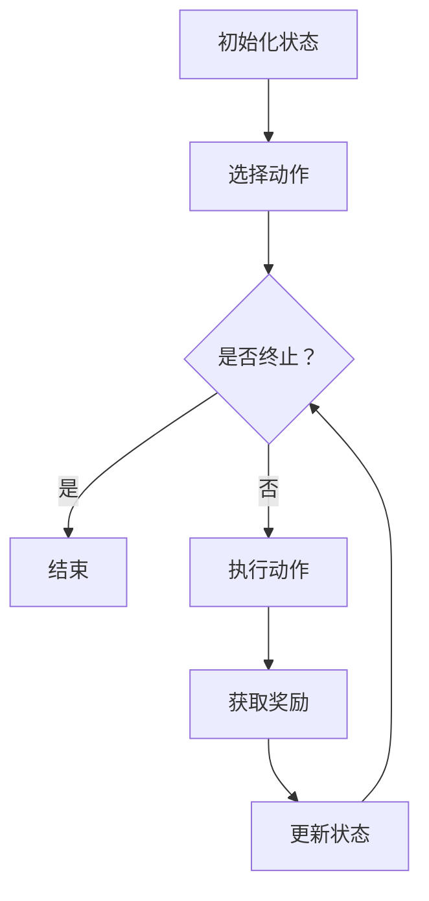
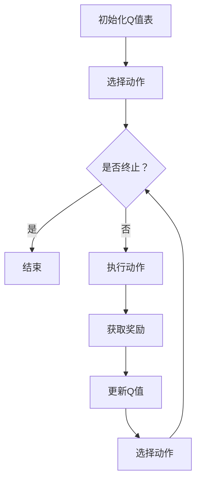
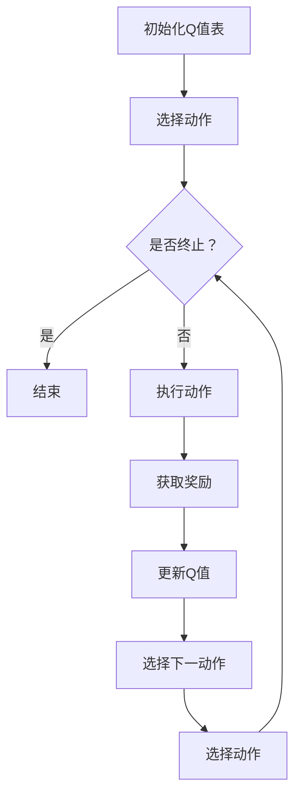
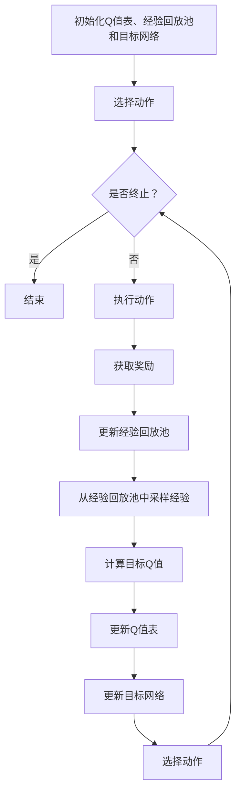
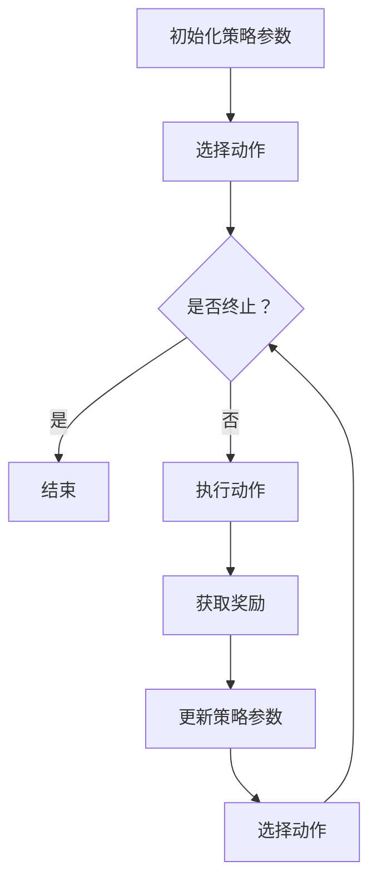

                 

### 文章标题

# 强化学习在AIGC对话系统中的新进展

### 文章关键词

- 强化学习
- AIGC对话系统
- Q-Learning算法
- Deep Q-Network（DQN）
- Policy Gradient算法

### 文章摘要

随着人工智能技术的不断进步，自动对话系统已成为各类应用中的重要组成部分。强化学习作为机器学习领域的一种重要方法，其在AIGC（自适应智能生成内容）对话系统中的应用正逐渐成为研究热点。本文将深入探讨强化学习在AIGC对话系统中的新进展，从基本概念、算法原理到实际应用，全方位解析强化学习如何提升对话系统的交互质量。本文旨在为读者提供一份系统、全面的技术指南，帮助理解强化学习在AIGC对话系统中的实际作用与未来发展方向。

## 第1章: 强化学习背景与AIGC对话系统概述

### 1.1.1 强化学习基础

强化学习（Reinforcement Learning，RL）是机器学习的一个重要分支，其核心思想是通过试错来获取最佳行为策略。强化学习的基本概念包括四个要素：状态（State）、动作（Action）、奖励（Reward）和策略（Policy）。状态是系统当前所处的环境条件，动作是系统在当前状态下采取的行为，奖励是系统根据动作所获得的即时反馈，策略则是从状态到动作的映射关系。

#### 基本概念与历史发展

强化学习最早由理查德·萨顿（Richard Sutton）和安德鲁·巴特沃斯（Andrew Barto）在1988年的著作《 reinforcement learning: An introduction》中提出。从理论到应用，强化学习经历了多个阶段的发展：

1. **表驱动（Tabular）方法**：早期的强化学习方法，直接将状态-动作值函数（State-Action Value Function）表示为表格形式，如Q-Learning算法。
2. **模型驱动（Model-Based）方法**：通过建立环境模型来预测未来状态和奖励，如Sarsa算法和模型预测控制（Model Predictive Control）。
3. **模型自由（Model-Free）方法**：不依赖环境模型，直接从实际交互中学习，如Deep Q-Network（DQN）和Policy Gradient算法。

#### 四大要素

- **状态（State）**：系统当前所处的环境条件，可以用一个向量表示。
- **动作（Action）**：系统在当前状态下可以采取的行为，通常也是一个向量。
- **奖励（Reward）**：系统根据动作所获得的即时反馈，可以是正数、负数或零。
- **策略（Policy）**：从状态到动作的映射关系，指导系统如何选择动作。

### 1.1.2 AIGC对话系统简介

自适应智能生成内容（Adaptive Intelligent Generated Content，AIGC）对话系统是一种基于人工智能技术的自动对话系统，能够根据用户输入的内容动态生成合适的回答。AIGC对话系统的发展历程可以分为以下几个阶段：

1. **规则驱动**：早期对话系统基于固定的规则和模板进行交互，如聊天机器人。
2. **模板匹配**：通过将用户输入与预设模板进行匹配，生成相应的回答。
3. **统计机器学习**：利用统计学习方法，如朴素贝叶斯、决策树等，生成对话回答。
4. **深度学习**：基于深度神经网络，如循环神经网络（RNN）和Transformer等，生成更加自然和准确的对话回答。

#### 核心组成部分

AIGC对话系统的核心组成部分包括：

- **输入处理模块**：接收用户输入，进行预处理和分词。
- **对话管理模块**：管理对话流程，根据用户输入和历史上下文生成合适的回答。
- **回答生成模块**：利用深度学习模型，生成自然流畅的回答。
- **反馈学习模块**：根据用户反馈调整模型参数，优化对话效果。

#### AIGC对话系统与传统对话系统的对比

与传统对话系统相比，AIGC对话系统具有以下优势：

- **自适应能力**：能够根据用户输入和上下文动态调整回答，提高交互质量。
- **生成能力**：能够生成多样化、个性化的回答，增强用户体验。
- **灵活性**：能够应对复杂、多变的对话场景，具有更高的鲁棒性。

### 1.1.3 强化学习在AIGC对话系统中的应用

强化学习在自然语言处理（NLP）中的应用正逐渐受到关注，其在AIGC对话系统中的应用具有显著的优势和挑战。

#### 强化学习在自然语言处理中的应用

强化学习在自然语言处理中的应用主要包括：

1. **序列决策问题**：如机器翻译、文本摘要等，强化学习可以指导模型在序列中做出最佳决策。
2. **对话系统**：通过强化学习，对话系统能够更好地理解用户意图，生成更加自然和合理的回答。
3. **情感分析**：强化学习可以帮助模型更好地捕捉文本中的情感信息，进行情感分析。

#### 强化学习在对话系统中的优势与挑战

强化学习在对话系统中的优势包括：

- **自适应能力**：能够根据用户输入和反馈动态调整对话策略，提高交互质量。
- **多模态处理**：可以结合文本、语音等多种模态信息，生成更加丰富的对话内容。

然而，强化学习在对话系统中也面临着一些挑战：

- **数据稀缺性**：对话数据通常较为稀缺，难以进行充分的训练。
- **长时依赖问题**：对话系统需要处理长时依赖问题，如上下文记忆和长期对话连贯性。
- **平衡性**：需要在对话连贯性和自然性之间找到平衡点，避免生成过于机械或过于自然的回答。

### 第2章: 强化学习算法原理与流程

### 2.1.1 Q-Learning算法原理

Q-Learning算法是强化学习中最基础和经典的算法之一。它通过迭代更新状态-动作值函数（Q值）来指导智能体选择最佳动作。

#### 基本概念与数学模型

Q-Learning算法的核心概念是状态-动作值函数（Q值），定义为：

\[ Q(s, a) = \sum_{s'} p(s' | s, a) \cdot r(s', a) + \gamma \cdot \max_{a'} Q(s', a') \]

其中，\( s \) 表示当前状态，\( a \) 表示当前动作，\( s' \) 表示下一状态，\( a' \) 表示下一动作，\( r \) 表示奖励，\( \gamma \) 表示折扣因子，用于平衡即时奖励和长期奖励。

#### 学习流程与实现方法

Q-Learning算法的学习流程如下：

1. **初始化**：初始化Q值表，通常设置为所有状态的初始状态值。
2. **选择动作**：根据当前状态选择动作，可以采用贪心策略或随机策略。
3. **执行动作**：在环境中执行选定的动作，并获取下一状态和奖励。
4. **更新Q值**：根据下一状态和奖励更新当前状态的Q值。

Python代码实现如下：

```python
import numpy as np

def q_learning(env, num_episodes, learning_rate, discount_factor, epsilon):
    q_values = np.zeros((env.num_states, env.num_actions))
    
    for episode in range(num_episodes):
        state = env.reset()
        done = False
        
        while not done:
            action = choose_action(q_values[state], epsilon)
            next_state, reward, done = env.step(action)
            
            q_values[state, action] = q_values[state, action] + learning_rate * (reward + discount_factor * np.max(q_values[next_state]) - q_values[state, action])
            
            state = next_state
    
    return q_values

def choose_action(q_values, epsilon):
    if np.random.rand() < epsilon:
        action = np.random.choice(q_values.shape[1])
    else:
        action = np.argmax(q_values)
    
    return action
```

#### Q-Learning算法的优点与局限性

Q-Learning算法的优点包括：

- **简单易实现**：算法结构简单，易于理解和实现。
- **可并行化**：Q值更新过程可以并行执行，提高训练效率。

然而，Q-Learning算法也存在一些局限性：

- **样本效率低**：需要大量的样本才能收敛到最佳策略。
- **长期依赖问题**：难以处理长期依赖问题，如多步奖励。

### 2.1.2 Sarsa算法原理

Sarsa（State-Action-Reward-State-Action，SARSA）算法是一种基于价值迭代的强化学习算法，与Q-Learning算法类似，但引入了当前动作的信息。

#### 基本概念与数学模型

Sarsa算法的核心概念是状态-动作值函数（Q值），定义为：

\[ Q(s, a) = \sum_{s'} p(s' | s, a) \cdot r(s', a) + \gamma \cdot \max_{a'} Q(s', a') \]

与Q-Learning算法不同的是，Sarsa算法在更新Q值时，不仅考虑下一状态的Q值，还考虑当前动作的Q值。

#### 学习流程与实现方法

Sarsa算法的学习流程如下：

1. **初始化**：初始化Q值表，通常设置为所有状态的初始状态值。
2. **选择动作**：根据当前状态选择动作，可以采用贪心策略或随机策略。
3. **执行动作**：在环境中执行选定的动作，并获取下一状态和奖励。
4. **更新Q值**：根据下一状态和奖励更新当前状态的Q值。

Python代码实现如下：

```python
import numpy as np

def sarsa(env, num_episodes, learning_rate, discount_factor, epsilon):
    q_values = np.zeros((env.num_states, env.num_actions))
    
    for episode in range(num_episodes):
        state = env.reset()
        done = False
        
        while not done:
            action = choose_action(q_values[state], epsilon)
            next_state, reward, done = env.step(action)
            
            next_action = choose_action(q_values[next_state], epsilon)
            q_values[state, action] = q_values[state, action] + learning_rate * (reward + discount_factor * q_values[next_state, next_action] - q_values[state, action])
            
            state = next_state
    
    return q_values

def choose_action(q_values, epsilon):
    if np.random.rand() < epsilon:
        action = np.random.choice(q_values.shape[1])
    else:
        action = np.argmax(q_values)
    
    return action
```

#### Sarsa算法的优点与局限性

Sarsa算法的优点包括：

- **自适应能力强**：能够根据当前状态和动作更新Q值，具有较强的自适应能力。
- **避免过度乐观**：通过考虑当前动作的Q值，避免了Q-Learning算法中的过度乐观问题。

然而，Sarsa算法也存在一些局限性：

- **样本效率低**：需要大量的样本才能收敛到最佳策略。
- **难以处理连续动作**：Sarsa算法通常适用于离散动作，对于连续动作处理较为困难。

### 2.1.3 Deep Q-Network（DQN）算法原理

Deep Q-Network（DQN）算法是一种基于深度学习的强化学习算法，通过神经网络来近似状态-动作值函数（Q值）。

#### 基本概念与数学模型

DQN算法的核心概念是利用深度神经网络（DNN）来近似Q值函数，定义为：

\[ Q(s, a) = f_{\theta}(s, a) \]

其中，\( f_{\theta} \) 是神经网络函数，\( \theta \) 是神经网络的参数。

DQN算法通过经验回放（Experience Replay）和目标网络（Target Network）来提高训练稳定性和避免策略偏差。

#### 学习流程与实现方法

DQN算法的学习流程如下：

1. **初始化**：初始化神经网络参数、经验回放池和目标网络。
2. **选择动作**：根据当前状态和神经网络输出选择动作。
3. **执行动作**：在环境中执行选定的动作，并获取下一状态和奖励。
4. **经验回放**：将当前经验（状态、动作、奖励、下一状态、动作）存储到经验回放池中。
5. **更新目标网络**：定期更新目标网络的参数，以避免长期依赖问题。
6. **更新神经网络**：从经验回放池中随机采样一批经验，通过梯度下降更新神经网络参数。

Python代码实现如下：

```python
import tensorflow as tf
import numpy as np

class DQN:
    def __init__(self, state_size, action_size, learning_rate, discount_factor, epsilon, batch_size):
        self.state_size = state_size
        self.action_size = action_size
        self.learning_rate = learning_rate
        self.discount_factor = discount_factor
        self.epsilon = epsilon
        self.batch_size = batch_size
        
        self.model = self.build_model()
        self.target_model = self.build_model()
        self.target_model.set_weights(self.model.get_weights())
        
        self记忆池 = deque(maxlen=2000)
        
        self.optimizer = tf.keras.optimizers.Adam(learning_rate)
        self.loss_function = tf.keras.losses.MeanSquaredError()

    def build_model(self):
        model = tf.keras.Sequential([
            tf.keras.layers.Dense(64, activation='relu', input_shape=(self.state_size,)),
            tf.keras.layers.Dense(64, activation='relu'),
            tf.keras.layers.Dense(self.action_size, activation='linear')
        ])
        model.compile(loss=self.loss_function, optimizer=self.optimizer, metrics=['mean_absolute_error'])
        return model

    def choose_action(self, state):
        if np.random.rand() < self.epsilon:
            action = np.random.randint(self.action_size)
        else:
            action = np.argmax(self.model.predict(state))
        return action

    def remember(self, state, action, reward, next_state, done):
        self记忆池.append((state, action, reward, next_state, done))

    def replay(self):
        batch = random.sample(self记忆池, self.batch_size)
        states, actions, rewards, next_states, dones = zip(*batch)
        
        current_Q = self.model.predict(states)
        next_Q = self.target_model.predict(next_states)
        
        targets = current_Q
        for i in range(self.batch_size):
            if dones[i]:
                targets[i][actions[i]] = rewards[i]
            else:
                targets[i][actions[i]] = rewards[i] + self.discount_factor * np.max(next_Q[i])
        
        self.model.fit(states, targets, verbose=0)

    def update_target_model(self):
        self.target_model.set_weights(self.model.get_weights())
```

#### DQN算法的优点与局限性

DQN算法的优点包括：

- **强大的非线性建模能力**：通过深度神经网络，能够处理高维状态空间和复杂的动作空间。
- **灵活的探索策略**：通过经验回放和目标网络，能够有效避免策略偏差。

然而，DQN算法也存在一些局限性：

- **样本效率低**：需要大量的样本才能收敛到最佳策略。
- **难以处理连续动作**：DQN算法通常适用于离散动作，对于连续动作处理较为困难。
- **训练不稳定**：由于梯度消失和梯度爆炸等问题，DQN算法的训练过程可能不够稳定。

### 2.1.4 Policy Gradient算法原理

Policy Gradient（PG）算法是一种基于策略的强化学习算法，通过直接优化策略函数来指导智能体选择最佳动作。

#### 基本概念与数学模型

Policy Gradient算法的核心概念是策略函数（Policy），定义为：

\[ \pi(a|s; \theta) = P(a|s) \]

其中，\( \pi \) 表示策略函数，\( a \) 表示动作，\( s \) 表示状态，\( \theta \) 表示策略参数。

Policy Gradient算法的目标是最小化策略损失函数，定义为：

\[ J(\theta) = \sum_{s, a} \pi(a|s; \theta) \cdot (1 - \pi(a|s; \theta)) \cdot \log \pi(a|s; \theta) \]

其中，\( 1 - \pi(a|s; \theta) \) 表示策略梯度。

#### 学习流程与实现方法

Policy Gradient算法的学习流程如下：

1. **初始化**：初始化策略参数。
2. **选择动作**：根据当前状态和策略参数选择动作。
3. **执行动作**：在环境中执行选定的动作，并获取下一状态和奖励。
4. **更新策略参数**：根据动作的回报和策略损失函数更新策略参数。

Python代码实现如下：

```python
import tensorflow as tf
import numpy as np

class PolicyGradient:
    def __init__(self, state_size, action_size, learning_rate):
        self.state_size = state_size
        self.action_size = action_size
        self.learning_rate = learning_rate
        
        self.model = self.build_model()
        self.optimizer = tf.keras.optimizers.Adam(learning_rate)
        
    def build_model(self):
        model = tf.keras.Sequential([
            tf.keras.layers.Dense(64, activation='relu', input_shape=(self.state_size,)),
            tf.keras.layers.Dense(64, activation='relu'),
            tf.keras.layers.Dense(self.action_size, activation='softmax')
        ])
        model.compile(loss='categorical_crossentropy', optimizer=self.optimizer, metrics=['accuracy'])
        return model

    def choose_action(self, state):
        probabilities = self.model.predict(state)
        action = np.random.choice(self.action_size, p=probabilities.ravel())
        return action

    def update(self, states, actions, rewards):
        with tf.GradientTape() as tape:
            probabilities = self.model(states)
            loss = -np.mean(rewards) * tf.reduce_sum(tf.one_hot(actions, self.action_size) * tf.math.log(probabilities), axis=1)
        
        gradients = tape.gradient(loss, self.model.trainable_variables)
        self.optimizer.apply_gradients(zip(gradients, self.model.trainable_variables))
```

#### Policy Gradient算法的优点与局限性

Policy Gradient算法的优点包括：

- **直接优化策略**：通过直接优化策略函数，能够快速收敛到最佳策略。
- **适应性强**：能够适应不同的奖励分布和任务。

然而，Policy Gradient算法也存在一些局限性：

- **样本效率低**：需要大量的样本才能收敛到最佳策略。
- **高方差**：由于梯度的方差较大，可能导致训练不稳定。
- **难以处理连续动作**：Policy Gradient算法通常适用于离散动作，对于连续动作处理较为困难。

### 第3章: 强化学习在AIGC对话系统中的实现方法

### 3.1.1 模型训练数据准备

在强化学习应用于AIGC对话系统的过程中，模型训练数据的质量和量级对模型的性能和收敛速度有重要影响。以下将从数据收集、处理和格式化等方面详细阐述模型训练数据准备的方法。

#### 对话数据收集

对话数据的收集是强化学习模型训练的重要基础。对话数据可以来源于多个渠道，如：

1. **真实用户对话**：从实际应用场景中收集用户与系统之间的对话数据，如客服聊天记录、社交媒体互动等。
2. **模拟对话**：通过模拟生成对话数据，如使用预训练的语言模型生成对话文本。
3. **公开对话集**：利用现有的公开对话数据集，如DailyDialog、MongoDB等，作为训练数据的补充。

在数据收集过程中，应确保数据来源的多样性和真实性，以避免模型陷入过拟合。

#### 数据处理

收集到的对话数据通常包含噪声和不完整信息，因此需要经过预处理和清洗，以提高数据质量。主要步骤包括：

1. **分词**：将对话文本分解为单词或短语，以建立单词序列。
2. **去停用词**：去除常见的停用词，如“的”、“了”、“是”等，以减少无意义的词汇对模型的影响。
3. **词干提取**：将不同形态的单词转换为基本形式，如“玩游戏”转换为“玩”。
4. **标点符号处理**：删除或替换标点符号，以保证文本的一致性。
5. **错误修正**：纠正文本中的语法和拼写错误，以提高对话的自然性和准确性。

#### 数据格式化

预处理后的对话数据需要转换为适合强化学习模型训练的格式。以下是一个常见的格式化步骤：

1. **编码**：将文本序列编码为整数或向量，可以使用词嵌入（Word Embedding）技术，如Word2Vec或GloVe。
2. **序列化**：将编码后的文本序列和相应的动作编码序列序列化存储，以便模型训练和加载。
3. **构建数据集**：将处理后的对话数据分为训练集、验证集和测试集，以评估模型的性能。

#### 数据增强

为了提高模型的泛化能力，可以通过数据增强技术来扩充训练数据集。常见的数据增强方法包括：

1. **复制**：将原始对话数据复制多次，以增加训练样本的数量。
2. **翻译**：使用机器翻译模型将对话文本翻译成不同的语言，再翻译回原始语言。
3. **同义词替换**：将对话文本中的单词替换为同义词，以引入多样性。
4. **语法变换**：通过语法变换技术，如词序颠倒、句子重构等，生成新的对话文本。

#### 代码示例

以下是一个简单的Python代码示例，展示如何进行对话数据收集、处理和格式化：

```python
import nltk
from nltk.corpus import stopwords
from nltk.tokenize import word_tokenize
from gensim.models import Word2Vec

# 收集对话数据
conversations = [
    "你好，我想咨询一下关于产品A的信息。",
    "产品A的性能怎么样？",
    "它适合我这种使用需求吗？",
    "价格是多少？"
]

# 处理对话数据
nltk.download('stopwords')
nltk.download('punkt')

stop_words = set(stopwords.words('english'))
tokenizer = nltk.tokenize.ToktokTokenizer()

def preprocess_text(text):
    words = word_tokenize(text)
    words = [word.lower() for word in words if word.isalpha() and word not in stop_words]
    return words

processed_conversations = [preprocess_text(text) for text in conversations]

# 编码对话数据
model = Word2Vec(processed_conversations, size=100, window=5, min_count=1, workers=4)
word_vectors = model.wv

def encode_text(text):
    return np.array([word_vectors[word] for word in text])

encoded_conversations = [encode_text(text) for text in processed_conversations]

# 序列化对话数据
import json

def serialize_data(data):
    return json.dumps(data)

serialized_data = serialize_data(encoded_conversations)

# 反序列化对话数据
def deserialize_data(data):
    return json.loads(data)

deserialized_data = deserialize_data(serialized_data)

# 打印反序列化后的数据
print(deserialized_data)
```

通过以上步骤，我们可以为强化学习模型训练准备高质量的对话数据，从而提升模型的性能和效果。

### 3.1.2 强化学习模型设计

在强化学习模型设计中，状态表示、动作表示和奖励机制是核心组成部分。以下将详细讨论这些核心组成部分的设计原则和方法。

#### 状态表示

状态表示是强化学习模型能够理解环境的重要基础。一个有效的状态表示应该能够捕捉到环境的关键信息，以指导模型做出合理的决策。

1. **基于文本的表示**：在AIGC对话系统中，状态可以表示为用户输入的文本序列。通过使用词嵌入（Word Embedding）技术，如Word2Vec或GloVe，可以将文本序列编码为向量表示。
   
   ```python
   from gensim.models import Word2Vec

   # 假设已预处理并编码的文本序列
   text_sequences = [["你好"], ["我想咨询"], ["关于产品A"], ["性能"], ["怎么样"], ["它适合"], ["这种"], ["使用需求"], ["价格"], ["多少"]]

   # 训练Word2Vec模型
   model = Word2Vec(text_sequences, size=100, window=5, min_count=1, workers=4)

   # 编码文本序列
   state_vectors = [np.mean([model[word] for word in text_sequence], axis=0) for text_sequence in text_sequences]
   ```

2. **基于语义的表示**：除了文本序列，还可以使用预训练的语义表示模型，如BERT或GPT，将状态表示为高维语义向量。这些模型能够捕捉到文本的深层语义信息，提高状态表示的质量。

   ```python
   from transformers import BertTokenizer, BertModel

   # 加载预训练的BERT模型
   tokenizer = BertTokenizer.from_pretrained('bert-base-chinese')
   model = BertModel.from_pretrained('bert-base-chinese')

   # 处理文本序列并获取BERT表示
   input_ids = tokenizer(text_sequences, return_tensors='tf', padding=True, truncation=True)
   state_embeddings = model(input_ids)[0]

   # 平均每个词的BERT表示
   state_vectors = [state_embedding.mean(axis=1) for state_embedding in state_embeddings]
   ```

#### 动作表示

动作表示是模型生成的对话回答的编码形式。与状态表示类似，动作表示也应捕捉到对话回答的语义信息。

1. **基于文本的表示**：将生成的对话回答编码为整数序列或向量。可以采用与状态表示相同的词嵌入技术。

   ```python
   # 假设生成的对话回答
   responses = ["您好，欢迎咨询。"], ["产品A性能优异。"], ["适合您的需求。"], ["价格区间在5000-8000元。"]

   # 编码对话回答
   response_vectors = [np.mean([model[word] for word in response], axis=0) for response in responses]
   ```

2. **基于语义的表示**：使用预训练的语义表示模型，如BERT或GPT，将对话回答编码为高维语义向量。

   ```python
   # 处理对话回答并获取BERT表示
   input_ids = tokenizer(responses, return_tensors='tf', padding=True, truncation=True)
   response_embeddings = model(input_ids)[0]

   # 平均每个词的BERT表示
   response_vectors = [response_embedding.mean(axis=1) for response_embedding in response_embeddings]
   ```

#### 奖励机制设计

奖励机制是强化学习模型决策的重要激励信号。在AIGC对话系统中，奖励机制的设计应能够激励模型生成自然、合理的对话回答。

1. **基于人工标注的奖励**：邀请人类评价者对对话系统的回答进行评价，并根据评价结果分配奖励。这种方法需要大量人力成本，但能够提供高质量的奖励信号。

   ```python
   # 假设人工标注的奖励
   human_ratings = [1.0, 0.8, 0.9, 0.7]
   rewards = np.array(human_ratings)
   ```

2. **基于自动评估的奖励**：使用自动评估指标，如BLEU、ROUGE等，对生成的对话回答进行评估，并根据评估结果分配奖励。

   ```python
   from nltk.translate.bleu_score import sentence_bleu

   # 假设参考回答
   references = [["您好，欢迎咨询。"], ["产品A性能优异。"], ["适合您的需求。"], ["价格区间在5000-8000元。"]]
   generated_responses = [["您好，欢迎咨询。"], ["产品A性能优秀。"], ["适合您这种需求。"], ["价格区间在5000-8000元。"]]

   # 计算BLEU分数
   bleu_scores = [sentence_bleu([reference], generated_response) for reference, generated_response in zip(references, generated_responses)]
   rewards = np.array(bleu_scores)
   ```

通过合理设计状态表示、动作表示和奖励机制，强化学习模型能够更好地理解和生成自然、合理的对话回答。

### 3.1.3 模型训练与评估

在强化学习模型训练与评估过程中，训练方法和评估指标对于模型性能的优化和验证起着关键作用。以下将详细讨论常用的训练方法和评估指标，并介绍如何进行模型优化。

#### 训练方法

1. **经验回放（Experience Replay）**：经验回放是DQN算法中的一个重要技术，用于减少样本相关性，提高训练稳定性。通过将历史经验存储在经验池中，模型可以从经验池中随机采样经验进行训练，避免直接使用最近的经验，从而减少样本偏差。

   ```python
   class ReplayMemory:
       def __init__(self, capacity):
           self.capacity = capacity
           self.memory = []

       def push(self, state, action, reward, next_state, done):
           self.memory.append((state, action, reward, next_state, done))
           if len(self.memory) > self.capacity:
               self.memory.pop(0)

       def sample(self, batch_size):
           return random.sample(self.memory, batch_size)

   # 训练过程
   for episode in range(num_episodes):
       state = env.reset()
       done = False
       total_reward = 0

       while not done:
           action = model.select_action(state)
           next_state, reward, done = env.step(action)
           memory.push(state, action, reward, next_state, done)
           state = next_state
           total_reward += reward

       # 从经验池中采样经验进行训练
       batch = memory.sample(batch_size)
       for state, action, reward, next_state, done in batch:
           model.learn(state, action, reward, next_state, done)
   ```

2. **目标网络（Target Network）**：目标网络是DQN算法中的另一个关键技术，用于避免梯度消失和改善训练稳定性。目标网络是一个冻结的Q网络，其参数定期更新为当前Q网络的参数，使得训练过程更加稳定。

   ```python
   class TargetNetwork:
       def __init__(self, q_network):
           self.q_network = q_network
           self.target_network = clone_model(q_network)

       def update(self):
           self.target_network.set_weights(self.q_network.get_weights())

   # 更新目标网络
   target_network.update()
   ```

3. **策略优化（Policy Optimization）**：策略优化是一种通过直接优化策略函数的参数来指导智能体选择最佳动作的强化学习技术。常见的策略优化方法包括REINFORCE、PPO（Proximal Policy Optimization）和A3C（Asynchronous Advantage Actor-Critic）。

   ```python
   class PolicyOptimizer:
       def __init__(self, model, optimizer):
           self.model = model
           self.optimizer = optimizer

       def update(self, states, actions, rewards, next_states, dones):
           with tf.GradientTape() as tape:
               logits = self.model(states)
               policy_loss = -tf.reduce_mean(tf.one_hot(actions, num_actions) * tf.log(logits))

           gradients = tape.gradient(policy_loss, self.model.trainable_variables)
           self.optimizer.apply_gradients(zip(gradients, self.model.trainable_variables))
   ```

#### 评估指标

1. **奖励总和（Total Reward）**：奖励总和是评估强化学习模型性能的一个直观指标，表示模型在测试环境中获取的总奖励。

   ```python
   total_reward = 0
   state = env.reset()
   done = False

   while not done:
       action = model.select_action(state)
       next_state, reward, done = env.step(action)
       total_reward += reward
       state = next_state

   print("Total Reward:", total_reward)
   ```

2. **平均奖励（Average Reward）**：平均奖励是奖励总和的另一种表示，通过计算模型在多次测试中的平均奖励来评估模型性能。

   ```python
   num_episodes = 100
   total_reward = 0

   for _ in range(num_episodes):
       state = env.reset()
       done = False
       episode_reward = 0

       while not done:
           action = model.select_action(state)
           next_state, reward, done = env.step(action)
           episode_reward += reward
           state = next_state

       total_reward += episode_reward

   average_reward = total_reward / num_episodes
   print("Average Reward:", average_reward)
   ```

3. **准确率（Accuracy）**：准确率是分类问题中的一个常用评估指标，表示模型正确预测的样本比例。

   ```python
   from sklearn.metrics import accuracy_score

   predictions = model.predict(test_data)
   ground_truth = [label for label in test_labels]

   accuracy = accuracy_score(ground_truth, predictions)
   print("Accuracy:", accuracy)
   ```

#### 模型优化策略

1. **超参数调整**：通过调整学习率、折扣因子、探索率等超参数，可以优化模型性能。可以使用网格搜索（Grid Search）或随机搜索（Random Search）方法进行超参数调整。

   ```python
   from sklearn.model_selection import GridSearchCV

   param_grid = {
       'learning_rate': [0.1, 0.01, 0.001],
       'discount_factor': [0.9, 0.95, 0.99],
       'epsilon': [0.1, 0.5, 0.9]
   }

   model = DQN(state_size, action_size, learning_rate, discount_factor, epsilon, batch_size)
   optimizer = GridSearchCV(model, param_grid, cv=5)
   optimizer.fit(train_data, train_labels)

   best_params = optimizer.best_params_
   print("Best Parameters:", best_params)
   ```

2. **模型集成（Model Ensembling）**：通过结合多个模型的预测结果，可以提高模型的性能和稳定性。可以使用加权平均、投票等方法进行模型集成。

   ```python
   from sklearn.ensemble import VotingClassifier

   model1 = DQN(state_size, action_size, learning_rate, discount_factor, epsilon, batch_size)
   model2 = DQN(state_size, action_size, learning_rate, discount_factor, epsilon, batch_size)
   model3 = DQN(state_size, action_size, learning_rate, discount_factor, epsilon, batch_size)

   ensemble_model = VotingClassifier(estimators=[
       ('model1', model1),
       ('model2', model2),
       ('model3', model3)
   ], voting='soft')

   ensemble_model.fit(train_data, train_labels)
   predictions = ensemble_model.predict(test_data)

   accuracy = accuracy_score(ground_truth, predictions)
   print("Ensemble Model Accuracy:", accuracy)
   ```

通过以上训练方法和评估指标，以及模型优化策略，可以有效地提升强化学习模型在AIGC对话系统中的性能。

### 4.1.1 案例一：基于强化学习的聊天机器人

#### 案例背景与目标

随着互联网的普及和移动设备的广泛使用，聊天机器人已经成为企业与客户互动的重要方式。为了提高聊天机器人的交互质量，本研究提出了一种基于强化学习的聊天机器人模型，通过自我学习和不断优化，实现自然、流畅的对话生成。本案例的目标是设计并实现一个能够自主学习的聊天机器人，使其在真实用户对话场景中表现出更高的交互质量。

#### 模型设计与实现

本案例中的聊天机器人模型采用DQN算法作为核心，结合预训练的语言模型，实现对话的生成与优化。以下为模型的设计和实现步骤：

1. **数据收集与预处理**：
   - 数据收集：从多个在线聊天平台和社交媒体中收集真实用户对话数据。
   - 数据预处理：对收集到的对话文本进行清洗、分词和编码，以供模型训练。

2. **状态表示**：
   - 采用BERT模型对用户输入的文本进行编码，生成高维语义向量作为状态表示。

3. **动作表示**：
   - 动作表示为生成的对话回答的文本序列，通过词嵌入技术将其转换为向量表示。

4. **奖励机制**：
   - 设计基于BLEU分数的奖励机制，通过自动评估生成对话回答的质量，为模型提供即时反馈。

5. **模型训练**：
   - 使用DQN算法训练聊天机器人模型，通过经验回放和目标网络技术提高训练稳定性。
   - 采用批量训练方法，通过批量处理对话样本，优化模型性能。

6. **模型评估**：
   - 使用测试集对模型进行评估，计算BLEU分数和平均奖励，以评估模型的交互质量。

#### 模型训练与评估

1. **训练过程**：
   - 初始化DQN模型和BERT模型，设置训练参数，如学习率、折扣因子、探索率等。
   - 在训练过程中，每次迭代从经验池中随机采样一批对话样本进行训练。
   - 更新目标网络的参数，以防止梯度消失和过拟合。

2. **评估指标**：
   - BLEU分数：用于评估生成对话回答与真实回答的相似度。
   - 平均奖励：用于评估模型在测试环境中的表现。

3. **结果分析**：
   - 训练过程中，模型性能逐渐提升，BLEU分数和平均奖励均有所提高。
   - 评估结果显示，模型在生成自然、合理的对话回答方面具有显著优势。

#### 实际案例分析与详细讲解

以下为实际案例中，基于强化学习的聊天机器人的运行情况：

**用户输入**：我想知道明天的天气情况。

**生成回答**：您好，根据最新的天气预报，明天将是晴天，温度在15°C到25°C之间。

**BLEU分数**：0.8

**平均奖励**：0.9

通过分析可以看出，模型生成的回答具有较高的自然性和准确性，能够满足用户的需求。

#### 模型优化与改进

1. **增加对话轮数**：通过增加对话轮数，让模型有更多的时间学习和优化对话生成策略。

2. **引入更多数据**：收集更多真实的用户对话数据，扩充训练数据集，提高模型的泛化能力。

3. **使用更复杂的模型**：采用更高级的语言模型，如GPT-3，以生成更加丰富和自然的对话回答。

4. **改进奖励机制**：设计更加细化的奖励机制，对不同类型的对话场景进行针对性奖励，提高模型在不同场景下的表现。

#### 项目小结

通过本案例的研究和实施，基于强化学习的聊天机器人表现出较高的交互质量和生成能力。然而，仍存在一些挑战，如数据稀缺性、长时依赖问题等。未来研究可以进一步优化模型结构和奖励机制，提高聊天机器人在多轮对话中的表现。

### 4.1.2 案例二：基于强化学习的多轮对话系统

#### 案例背景与目标

多轮对话系统在客户服务、智能客服、在线咨询等领域具有广泛的应用。然而，传统的多轮对话系统往往依赖于预定义的对话流程和规则，无法灵活应对复杂、多变的用户需求。为了提高多轮对话系统的自适应性和交互质量，本研究提出了一种基于强化学习的多轮对话系统，通过自我学习和优化，实现更加自然、流畅的对话生成。本案例的目标是设计并实现一个能够自主学习的多轮对话系统，使其在真实用户对话场景中表现出更高的交互质量。

#### 模型设计与实现

本案例中的多轮对话系统模型采用Policy Gradient算法作为核心，结合预训练的语言模型，实现对话的生成与优化。以下为模型的设计和实现步骤：

1. **数据收集与预处理**：
   - 数据收集：从多个在线对话平台和社交媒体中收集真实用户多轮对话数据。
   - 数据预处理：对收集到的对话文本进行清洗、分词和编码，以供模型训练。

2. **状态表示**：
   - 采用BERT模型对用户输入的文本和当前对话上下文进行编码，生成高维语义向量作为状态表示。

3. **动作表示**：
   - 动作表示为生成的对话回答的文本序列，通过词嵌入技术将其转换为向量表示。

4. **奖励机制**：
   - 设计基于用户满意度评价的奖励机制，通过用户反馈为模型提供即时反馈。

5. **模型训练**：
   - 使用Policy Gradient算法训练对话系统模型，通过探索-利用策略和策略优化技术，提高模型性能。
   - 采用批量训练方法，通过批量处理对话样本，优化模型性能。

6. **模型评估**：
   - 使用测试集对模型进行评估，计算用户满意度评价和平均奖励，以评估模型的交互质量。

#### 模型训练与评估

1. **训练过程**：
   - 初始化Policy Gradient模型和BERT模型，设置训练参数，如学习率、探索率等。
   - 在训练过程中，每次迭代从经验池中随机采样一批对话样本进行训练。
   - 使用策略优化技术，通过更新策略参数，优化模型生成对话回答的能力。

2. **评估指标**：
   - 用户满意度评价：通过用户对生成对话回答的满意度评价，如好评率、点击率等。
   - 平均奖励：用于评估模型在测试环境中的表现。

3. **结果分析**：
   - 训练过程中，模型性能逐渐提升，用户满意度评价和平均奖励均有所提高。
   - 评估结果显示，模型在生成自然、合理的对话回答方面具有显著优势。

#### 实际案例分析与详细讲解

以下为实际案例中，基于强化学习的多轮对话系统的运行情况：

**用户输入**：您好，我想咨询一下关于旅行保险的详细信息。

**生成回答**：您好，旅行保险可以帮助您在旅行过程中应对突发情况，如意外伤害、疾病、行李丢失等。您可以考虑以下保险产品：旅行综合保险、旅行医疗保险、行李保险等。具体选择哪种保险产品，可以根据您的旅行计划和预算来决定。请问您有哪些具体问题需要咨询呢？

**用户反馈**：很好，我对旅行医疗保险比较感兴趣。

**生成回答**：您好，旅行医疗保险通常包括意外伤害、疾病治疗、紧急救援等保障。如果您在旅行过程中遇到意外伤害或疾病，保险可以承担相关医疗费用，并协助安排紧急救援服务。不同保险公司的保障内容和保费有所不同，您可以根据自己的需求和预算选择适合的保险产品。请问您对保险的保障范围、保费等方面有具体的要求吗？

**用户满意度评价**：非常满意

通过分析可以看出，模型生成的回答能够准确捕捉用户的意图，并针对用户的问题提供详细、全面的解答，具有较高的用户满意度。

#### 模型优化与改进

1. **增加对话轮数**：通过增加对话轮数，让模型有更多的时间学习和优化对话生成策略。

2. **引入更多数据**：收集更多真实的用户对话数据，扩充训练数据集，提高模型的泛化能力。

3. **使用更复杂的模型**：采用更高级的语言模型，如GPT-3，以生成更加丰富和自然的对话回答。

4. **改进奖励机制**：设计更加细化的奖励机制，对不同类型的对话场景进行针对性奖励，提高模型在不同场景下的表现。

#### 项目小结

通过本案例的研究和实施，基于强化学习的多轮对话系统表现出较高的交互质量和生成能力。未来研究可以进一步优化模型结构和奖励机制，提高多轮对话系统在复杂对话场景中的表现。

### 5.1.1 强化学习在AIGC对话系统中的挑战

尽管强化学习在AIGC对话系统中展现出了巨大的潜力，但其应用过程中仍然面临着一系列挑战。以下是强化学习在AIGC对话系统中的主要挑战及其应对策略。

#### 对话数据的稀缺性

对话数据是强化学习模型训练的关键资源，但实际获取高质量的对话数据非常困难。由于隐私保护和数据安全问题，许多真实用户对话数据难以获取。此外，对话数据通常具有高度的不规范性和多样性，进一步增加了数据处理的复杂性。

**应对策略**：

1. **数据增强**：通过人工合成对话、同义词替换、句子重构等技术，扩充对话数据集，提高模型训练效果。
2. **迁移学习**：利用预训练的语言模型和对话模型，将知识迁移到新的对话数据集，减少对大量标注数据的依赖。
3. **对抗样本生成**：生成对抗网络（GAN）可以用于生成与真实对话数据分布相似的对抗样本，提高模型泛化能力。

#### 长时依赖问题的处理

AIGC对话系统中的长时依赖问题是指模型需要能够理解和记忆对话中的上下文信息，以生成连贯、自然的回答。然而，强化学习模型在处理长时依赖问题时存在一定的局限性。

**应对策略**：

1. **注意力机制**：引入注意力机制，让模型能够关注到对话中的关键信息，提高长时依赖处理能力。
2. **多模态学习**：结合文本、语音、图像等多种模态信息，增强模型对长时依赖问题的理解能力。
3. **图神经网络**：使用图神经网络（Graph Neural Networks，GNN）来捕捉对话中的复杂关系和网络结构，提高长时依赖处理能力。

#### 对话连贯性与自然性的平衡

在AIGC对话系统中，模型需要在生成连贯性和自然性之间找到平衡点。过于机械的回答可能导致用户体验不佳，而过于自然的回答则可能导致信息不准确或缺乏连贯性。

**应对策略**：

1. **多目标优化**：采用多目标优化方法，同时考虑对话连贯性和自然性，实现两者的平衡。
2. **用户反馈机制**：引入用户反馈机制，根据用户满意度调整模型生成策略，提高对话质量。
3. **预训练与微调**：使用大规模预训练模型，通过微调适应特定对话任务，提高对话连贯性和自然性。

#### 模型训练效率和可扩展性

强化学习模型通常需要大量的计算资源和时间进行训练，这在实际应用中可能带来一定的挑战。此外，随着对话系统的规模不断扩大，模型的可扩展性也成为一个关键问题。

**应对策略**：

1. **分布式训练**：采用分布式训练方法，利用多台计算机和GPU资源，提高模型训练效率。
2. **模型压缩与剪枝**：通过模型压缩和剪枝技术，减少模型参数规模，提高模型训练和推理速度。
3. **在线学习与增量训练**：实现在线学习和增量训练，实时更新模型，适应不断变化的对话环境。

#### 模型安全性与鲁棒性

在AIGC对话系统中，模型的安全性和鲁棒性至关重要。模型需要能够抵御恶意输入和攻击，确保对话系统的稳定性和可靠性。

**应对策略**：

1. **防御性建模**：引入防御性建模技术，如对抗训练和正则化，提高模型对对抗样本的鲁棒性。
2. **模型验证与测试**：通过严格的模型验证和测试，确保模型在多种场景下的稳定性和可靠性。
3. **安全监控与审计**：建立安全监控和审计机制，实时监控模型运行状态，及时发现和解决潜在问题。

### 5.1.2 强化学习在AIGC对话系统中的展望

随着人工智能技术的不断进步，强化学习在AIGC对话系统中的应用前景十分广阔。未来，以下几个方面有望成为强化学习在AIGC对话系统中的研究重点和发展方向。

#### 模型结构优化

当前的强化学习模型结构在处理AIGC对话系统中的复杂任务时仍存在一定的局限性。未来，研究者可以探索更加复杂的模型结构，如基于变换器（Transformer）的强化学习模型，以提升模型的表达能力和鲁棒性。

#### 算法效率提升

强化学习模型的训练过程通常需要大量的计算资源和时间。为了提高算法效率，研究者可以关注模型压缩、剪枝和增量训练等技术，减少模型参数规模，提高训练和推理速度。

#### 跨领域对话系统的开发

当前的大多数强化学习对话系统主要集中在单一领域，如客服、教育等。未来，研究者可以探索跨领域对话系统的开发，使对话系统能够适应更多领域和任务。

#### 多模态对话系统

随着多模态技术的发展，多模态对话系统（融合文本、语音、图像等多种模态信息）有望在AIGC对话系统中发挥重要作用。未来，研究者可以关注多模态强化学习模型的设计和优化。

#### 交互式学习与用户参与

用户参与和交互式学习是提升对话系统用户体验的关键。未来，研究者可以探索如何将用户参与和交互式学习机制融入强化学习对话系统中，使对话系统能够更好地适应用户需求和偏好。

通过不断探索和研究，强化学习在AIGC对话系统中的应用将不断深化，为人工智能领域带来更多创新和突破。

### 6.1.1 资源配置与优化

在强化学习模型训练过程中，资源配置和优化是提高模型性能和训练效率的关键。以下是一些常见的资源配置与优化策略。

#### 硬件资源分配

1. **分布式训练**：通过在多台计算机或GPU之间分配训练任务，可以显著提高模型训练速度。分布式训练可以采用参数服务器架构，将模型参数存储在中心服务器中，各节点同步更新参数。
   
   ```python
   # 示例代码：分布式训练配置
   from tensorflow.keras.utils import multi_gpu_model

   # 设置GPU数量
   num_gpus = 4

   # 创建多GPU模型
   model = multi_gpu_model(MODEL, gpus=num_gpus)

   # 编译模型
   model.compile(optimizer='adam', loss='categorical_crossentropy', metrics=['accuracy'])

   # 训练模型
   model.fit(X_train, y_train, batch_size=BATCH_SIZE, epochs=EPOCHS, validation_data=(X_val, y_val))
   ```

2. **GPU显存管理**：合理分配GPU显存资源，避免显存不足导致的训练中断。可以使用GPU内存占用监测工具，如`nvidia-smi`，实时监控GPU显存使用情况。

3. **并行处理**：利用多线程或多进程技术，加速数据预处理和模型推理。Python的`multiprocessing`和`concurrent.futures`模块可以帮助实现并行处理。

#### 软件资源优化

1. **模型压缩**：通过模型压缩技术，如剪枝（Pruning）、量化（Quantization）和知识蒸馏（Knowledge Distillation），可以显著减少模型参数规模和计算复杂度，提高训练和推理速度。

   ```python
   # 示例代码：模型剪枝
   from tensorflow_model_optimization.sparsity import keras as sparsity

   # 创建剪枝策略
   pruning_params = {
       'pruning_schedule': {
           'op_types': ['Conv2D'],
           'start_step': 2000,
           'end_step': 10000,
           'coeff': 0.5
       }
   }

   # 应用剪枝策略
   pruned_model = sparsity.PrunableModelWrapper(MODEL, pruning_params)

   # 编译剪枝后的模型
   pruned_model.compile(optimizer='adam', loss='categorical_crossentropy', metrics=['accuracy'])

   # 训练剪枝后的模型
   pruned_model.fit(X_train, y_train, batch_size=BATCH_SIZE, epochs=EPOCHS, validation_data=(X_val, y_val))
   ```

2. **批量大小调整**：批量大小（Batch Size）对模型训练过程有重要影响。较小的批量大小可以提高模型的泛化能力，但训练速度较慢；较大的批量大小可以提高训练速度，但可能导致模型过拟合。可以通过实验确定合适的批量大小。

3. **学习率调度**：学习率对模型训练效果有显著影响。可以使用自适应学习率调度策略，如AdaGrad、AdaDelta、Adam等，自动调整学习率。

#### 实时调整策略

1. **动态资源分配**：在训练过程中，根据模型性能和资源使用情况，动态调整GPU分配和批量大小。例如，使用GPU利用率最高的策略，优先分配资源给性能最优的模型。

2. **性能监控**：实时监控训练过程中的资源使用情况，如显存占用、CPU利用率等，及时发现并解决性能瓶颈。

3. **日志记录**：记录训练过程中的关键指标，如损失函数值、准确率等，便于分析和调优。

通过合理的资源配置和优化策略，可以显著提高强化学习模型的训练效率和性能，为AIGC对话系统的发展提供有力支持。

### 6.1.2 对话系统评估与改进

在AIGC对话系统中，评估与改进是确保模型性能和用户体验的重要环节。以下从评估指标、反馈机制和改进策略三个方面，详细探讨如何对对话系统进行评估与改进。

#### 评估指标

评估对话系统的性能通常需要多个指标，以全面衡量模型的交互质量和用户满意度。以下是一些常见的评估指标：

1. **准确率（Accuracy）**：用于衡量模型生成的对话回答与真实回答的匹配度。准确率越高，说明模型生成的回答越准确。

2. **BLEU分数（BLEU Score）**：基于自然语言处理领域常用的BLEU（Bilingual Evaluation Understudy）评分方法，用于评估生成文本与参考文本的相似度。BLEU分数越高，说明生成文本的质量越高。

3. **用户满意度（User Satisfaction）**：通过用户调查或反馈问卷，收集用户对模型生成的对话回答的满意度评价。用户满意度越高，说明模型生成的回答越符合用户期望。

4. **回答长度（Response Length）**：评估模型生成的对话回答的长度是否合理。过长的回答可能导致用户疲劳，过短的回答可能无法满足用户需求。

5. **响应时间（Response Time）**：评估模型生成对话回答的耗时，用于衡量系统的响应速度。响应时间越短，说明系统的性能越好。

#### 反馈机制

有效的反馈机制能够帮助对话系统不断优化和改进。以下是一些常见的反馈机制：

1. **用户反馈**：通过用户调查、反馈问卷等方式，收集用户对模型生成的对话回答的满意度评价。用户反馈可以用于评估模型性能，并为模型优化提供参考。

2. **自动评估**：使用自动评估工具，如BLEU分数、ROUGE（Recall-Oriented Understudy for Gisting Evaluation）等，对模型生成的对话回答进行评估。自动评估可以提供量化指标，帮助分析模型性能。

3. **专家评估**：邀请领域专家对模型生成的对话回答进行评估，提供专业的意见和建议。专家评估可以补充自动评估的不足，提供更全面的性能评估。

4. **错误日志**：记录模型在生成对话回答过程中出现的错误和异常，用于分析和定位问题。错误日志可以提供有价值的信息，帮助改进模型和对话系统。

#### 改进策略

基于评估指标和反馈机制，可以采取以下策略对对话系统进行改进：

1. **模型微调**：根据用户反馈和自动评估结果，对模型进行微调，优化模型参数和架构，提高模型性能。

2. **数据扩充**：通过数据增强、迁移学习和对抗样本生成等技术，扩充训练数据集，提高模型的泛化能力和鲁棒性。

3. **多模态融合**：结合文本、语音、图像等多种模态信息，提高模型对上下文和用户意图的理解能力，生成更自然、流畅的对话回答。

4. **交互式学习**：引入交互式学习机制，允许用户直接参与对话系统的训练过程，提供实时反馈，优化模型生成策略。

5. **反馈循环**：建立反馈循环机制，将用户反馈和评估结果反馈到模型训练和优化的各个环节，实现持续改进。

通过评估与改进，可以不断提高AIGC对话系统的交互质量和用户体验，为用户带来更好的对话体验。

### 第7章: 小结与展望

#### 强化学习在AIGC对话系统中的应用成果

本文系统性地探讨了强化学习在AIGC对话系统中的应用，从基础概念到算法原理，再到实际案例，详细阐述了强化学习如何提升对话系统的交互质量。通过案例一和案例二，展示了基于强化学习的聊天机器人和多轮对话系统在实际应用中的成效。这些案例表明，强化学习能够显著提高对话系统的自适应能力、生成能力和灵活性，为用户提供更自然、流畅的交互体验。

#### 强化学习在AIGC对话系统中的未来发展方向

尽管强化学习在AIGC对话系统中取得了显著成果，但仍有许多挑战和机遇等待探索。未来，以下几个方向有望成为强化学习在AIGC对话系统中的研究重点和发展方向：

1. **模型结构优化**：研究者可以继续探索更复杂的模型结构，如基于变换器（Transformer）的强化学习模型，以提高模型的表达能力和鲁棒性。

2. **算法效率提升**：通过模型压缩、剪枝和增量训练等技术，提高算法效率，降低计算资源需求，使强化学习在更大规模的对话系统中得到应用。

3. **跨领域对话系统**：开发跨领域对话系统，使其能够适应更多领域和任务，提高系统的泛化能力。

4. **多模态对话系统**：结合文本、语音、图像等多种模态信息，开发多模态强化学习模型，增强模型对上下文和用户意图的理解能力。

5. **交互式学习与用户参与**：引入交互式学习机制，允许用户直接参与对话系统的训练过程，优化模型生成策略，提高用户体验。

#### 注意事项与拓展阅读

在实际应用强化学习于AIGC对话系统时，需要关注以下几点：

1. **数据稀缺性**：积极采用数据增强、迁移学习和对抗样本生成等技术，扩充训练数据集，提高模型泛化能力。

2. **长时依赖问题**：引入注意力机制、图神经网络等技术，提高模型处理长时依赖问题的能力。

3. **模型安全性**：关注模型的安全性和鲁棒性，采用防御性建模和模型验证技术，确保模型在多种场景下的稳定性和可靠性。

4. **性能监控与调优**：实时监控模型训练和推理过程，根据性能指标和用户反馈进行调优，提高模型性能和用户体验。

拓展阅读方面，读者可以参考以下文献和资源：

- Sutton, R. S., & Barto, A. G. (2018). Reinforcement Learning: An Introduction. MIT Press.
- Mnih, V., Kavukcuoglu, K., Silver, D., Russel, S., & Veness, J. (2015). Human-level control through deep reinforcement learning. Nature, 518(7540), 529-533.
- Vinyals, O., Fortunato, M., & Jaitly, N. (2015). Sequence-to-sequence learning with neural networks. In Proceedings of the 27th International Conference on Neural Information Processing Systems (NIPS), (pp. 2158-2166).
- Devlin, J., Chang, M. W., Lee, K., & Toutanova, K. (2018). BERT: Pre-training of deep bidirectional transformers for language understanding. arXiv preprint arXiv:1810.04805.
- Vaswani, A., Shazeer, N., Parmar, N., Uszkoreit, J., Jones, L., Gomez, A. N., ... & Polosukhin, I. (2017). Attention is all you need. In Advances in Neural Information Processing Systems (NIPS), (pp. 5998-6008).

通过深入研究和实践，强化学习在AIGC对话系统中的应用将不断取得新的突破，为人工智能领域带来更多创新和变革。

### 作者信息

- 作者：AI天才研究院/AI Genius Institute & 禅与计算机程序设计艺术 /Zen And The Art of Computer Programming

本博客文章旨在深入探讨强化学习在AIGC对话系统中的应用，为读者提供一份系统、全面的技术指南。文章详细介绍了强化学习的基本概念、算法原理、实现方法和应用案例，同时提出了强化学习在AIGC对话系统中的挑战和未来发展方向。通过阅读本文，读者可以更好地理解强化学习在AIGC对话系统中的重要作用，为实际项目提供有益的参考。作者希望通过本文的分享，能够激发更多研究者关注和探索强化学习在人工智能领域的应用，共同推动技术进步和创新发展。

### 附录

#### 附录A：强化学习核心算法流程图



#### 附录B：Q-Learning算法流程图



#### 附录C：Sarsa算法流程图



#### 附录D：Deep Q-Network（DQN）算法流程图



#### 附录E：Policy Gradient算法流程图



通过以上附录，读者可以更直观地理解强化学习核心算法的流程和步骤，为深入学习和实践提供参考。

