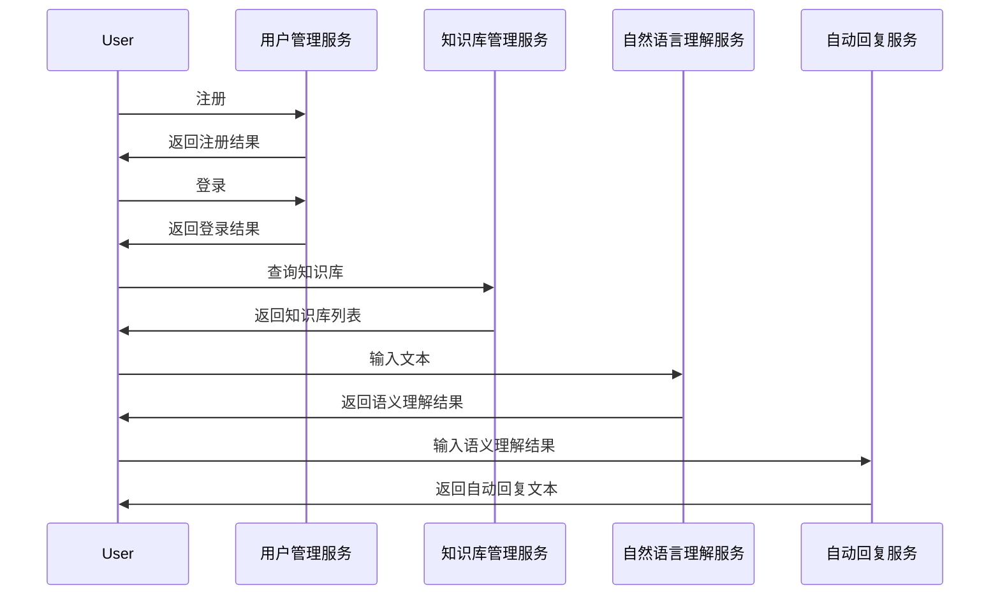
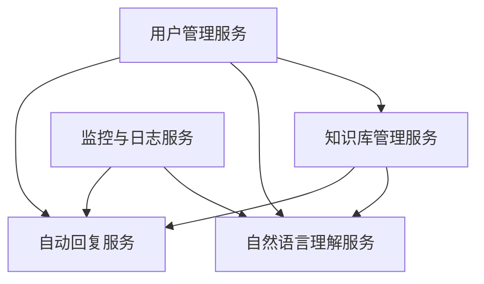

                 

### 摘要

本文旨在深入探讨微服务架构在敏捷LLM（Large Language Model，大型语言模型）应用开发中的实际应用。随着人工智能技术的迅猛发展，LLM在自然语言处理、文本生成、推理等方面展现出了巨大的潜力。然而，如何在复杂的微服务架构中高效地部署和运行LLM，实现敏捷开发和运维，成为了当前软件开发领域的重要课题。本文将首先介绍微服务架构和敏捷开发的核心概念及其重要性，接着详细解析LLM的基本原理和常用框架。随后，本文将探讨微服务架构在LLM开发中的应用，包括服务拆分与整合、服务部署与运维、服务性能优化等关键问题。通过具体案例分析，本文将展示微服务架构在敏捷LLM开发中的实际应用效果，并提供一系列最佳实践和建议，最后对未来的发展趋势和潜在挑战进行展望。通过本文的阅读，读者将能够全面了解微服务架构在敏捷LLM应用开发中的价值和应用方法，为实际项目提供指导和支持。

### 目录大纲

# 《微服务架构在敏捷LLM应用开发中的应用》

> 关键词：微服务架构、敏捷开发、LLM、服务拆分、部署与运维、性能优化

> 摘要：本文深入探讨微服务架构在敏捷LLM应用开发中的实际应用，解析其核心概念、基本原理，并通过案例分析展示其应用效果，提供最佳实践和建议。

## 第一部分: 背景介绍

## 第1章: 问题背景与核心概念
### 1.1 问题背景
#### 微服务架构的需求
#### 敏捷开发的敏捷性
#### LLM的强大潜力
### 1.2 核心概念
#### 微服务架构
#### 敏捷开发
#### LLM
### 1.3 问题解决
#### 服务拆分与整合
#### 服务部署与运维
#### 服务性能优化
### 1.4 边界与外延
#### 边界
#### 外延

## 第2章: 微服务架构概述
### 2.1 微服务架构的定义
### 2.2 微服务架构的核心特性
### 2.3 微服务架构的优势
### 2.4 微服务架构的挑战

## 第二部分: LLM应用开发

## 第3章: LLM基本原理与框架
### 3.1 LLM的基本原理
### 3.2 LLM的常用框架
### 3.3 LLM的应用领域

## 第4章: 微服务架构在LLM开发中的应用
### 4.1 服务拆分与整合
#### 拆分策略
#### 整合方法
### 4.2 服务部署与运维
#### 自动化部署
#### 持续集成与持续部署（CI/CD）
### 4.3 服务性能优化
#### 性能监控
#### 优化策略

## 第三部分: 实践与案例

## 第5章: 微服务架构下的LLM开发实战
### 5.1 项目背景
### 5.2 系统功能设计
### 5.3 系统架构设计
### 5.4 系统接口设计
### 5.5 系统交互设计

## 第6章: LLM应用案例解析
### 6.1 案例一：自然语言处理服务
#### 案例介绍
#### 应用效果
### 6.2 案例二：文本生成服务
#### 案例介绍
#### 应用效果

## 第7章: 最佳实践与优化
### 7.1 最佳实践
### 7.2 优化策略
### 7.3 注意事项

## 第四部分: 未来展望与趋势

## 第8章: 微服务架构与LLM发展趋势
### 8.1 微服务架构的发展趋势
### 8.2 LLM的发展趋势
### 8.3 融合趋势

## 第9章: 开放性问题与未来挑战
### 9.1 开放性问题
### 9.2 未来挑战

## 附录
### 附录A: 相关术语解释
### 附录B: 算法原理与实现
### 附录C: 系统架构设计与实现

### 作者信息

作者：AI天才研究院/AI Genius Institute & 禅与计算机程序设计艺术 /Zen And The Art of Computer Programming

----------------------------------------------------------------

### 第一部分: 背景介绍

#### 第1章: 问题背景与核心概念

随着技术的不断进步，软件系统变得越来越复杂，企业面临的需求也日益多样化。在这种背景下，传统的单体应用架构逐渐显示出其局限性。传统的单体架构通常将所有功能集中在一个庞大的应用程序中，这不仅导致系统的复杂度增加，而且当需要扩展或更新时，会对整个系统造成影响。因此，如何更好地应对复杂的应用需求，提高系统的灵活性和可维护性，成为软件开发领域的重要课题。

微服务架构应运而生，它通过将应用程序拆分为多个独立的、小型化的服务模块，使得每个服务模块都可以独立开发、部署和扩展。这种架构风格不仅提高了系统的灵活性，还降低了系统的复杂度，使得开发者可以更加专注于单个服务模块的开发，而无需担心其他模块的影响。微服务架构的核心在于“服务”，即每个服务模块都具备独立的业务功能，并通过轻量级的通信协议（如HTTP RESTful API）进行交互。

敏捷开发则是一种以人为核心、迭代、增量和灵活响应变化的软件开发方法。敏捷开发强调团队协作、用户反馈和持续交付，通过快速迭代和灵活响应，使得软件开发过程更加高效和灵活。敏捷开发与微服务架构有着天然的联系，两者都强调灵活性和可适应性，能够更好地应对快速变化的需求。

然而，在微服务架构中如何高效地部署和运行LLM（Large Language Model，大型语言模型），实现敏捷开发和运维，成为了当前软件开发领域的重要课题。LLM是一种基于深度学习的语言处理模型，具有强大的文本生成、理解和推理能力。随着LLM在自然语言处理、文本生成、推理等领域的广泛应用，如何将其有效地集成到微服务架构中，并保持系统的高效性和稳定性，是一个亟待解决的问题。

本章节将首先介绍微服务架构和敏捷开发的核心概念，解析LLM的基本原理和常用框架，并探讨微服务架构在LLM开发中的应用。通过本章节的阅读，读者将能够对微服务架构和敏捷开发有一个全面的理解，并对LLM的基本原理和应用有深入的认识。

#### 1.1 问题背景

微服务架构的需求

随着互联网的快速发展，企业面临着越来越复杂的应用场景和不断变化的市场需求。传统的单体应用架构已经无法满足这种快速迭代和灵活响应的需求。传统的单体架构通常将所有功能集中在一个庞大的应用程序中，这种架构风格虽然简单，但是当需要扩展或更新时，会对整个系统造成影响。例如，当一个功能模块需要进行优化或更新时，可能会影响整个系统的稳定性，甚至导致系统崩溃。此外，单体架构的复杂性也使得系统的可维护性降低，开发者和运维人员需要花费大量的时间和精力来维护整个系统。

因此，为了更好地应对复杂的应用需求，提高系统的灵活性和可维护性，微服务架构逐渐成为了软件开发领域的主流选择。微服务架构通过将应用程序拆分为多个独立的、小型化的服务模块，使得每个服务模块都可以独立开发、部署和扩展。这种架构风格不仅提高了系统的灵活性，还降低了系统的复杂度，使得开发者可以更加专注于单个服务模块的开发，而无需担心其他模块的影响。

敏捷开发的敏捷性

敏捷开发是一种以人为核心、迭代、增量和灵活响应变化的软件开发方法。敏捷开发强调团队协作、用户反馈和持续交付，通过快速迭代和灵活响应，使得软件开发过程更加高效和灵活。在敏捷开发中，开发团队可以快速响应市场需求，快速交付可用的产品功能，从而提高企业的竞争力和市场响应速度。

敏捷开发的敏捷性对微服务架构有着重要的影响。首先，敏捷开发强调快速迭代和持续交付，这与微服务架构中服务独立部署和扩展的特性相契合。通过微服务架构，开发团队可以独立开发和部署单个服务模块，快速响应市场需求，从而实现敏捷开发的目标。其次，敏捷开发强调用户反馈，这有助于开发团队更好地理解用户需求，从而优化服务模块的功能和性能。最后，敏捷开发强调团队协作，这有助于提高开发团队的效率和凝聚力，从而更好地应对复杂的软件开发任务。

LLM的强大潜力

LLM（Large Language Model，大型语言模型）是人工智能领域的一个重要突破，具有强大的文本处理能力。LLM通过深度学习技术对大量文本数据进行训练，从而实现对自然语言的生成、理解和推理。LLM在自然语言处理、文本生成、推理等领域展现出了巨大的潜力，成为了许多应用场景中的重要工具。

例如，在自然语言处理领域，LLM可以用于文本分类、情感分析、命名实体识别等任务，大大提高了文本处理的准确性和效率。在文本生成领域，LLM可以用于生成新闻文章、故事、对话等，提供了丰富的内容生成能力。在推理领域，LLM可以用于问答系统、对话系统等，能够根据用户的问题提供准确的回答。

然而，LLM的应用也带来了新的挑战。首先，LLM的训练和部署需要大量的计算资源和时间，如何高效地部署和运行LLM是一个关键问题。其次，LLM的性能和准确性受到训练数据质量的影响，如何获取高质量的训练数据是另一个挑战。最后，LLM的应用场景多种多样，如何针对不同的应用场景优化LLM的性能是一个重要课题。

#### 1.2 核心概念

在深入探讨微服务架构在敏捷LLM应用开发中的应用之前，我们需要明确几个核心概念，包括微服务架构、敏捷开发以及LLM的基本原理。

**微服务架构**

微服务架构是一种基于服务化的架构风格，它将应用程序划分为多个独立的、小型化的服务模块。每个服务模块都负责特定的业务功能，可以通过轻量级的通信协议（如HTTP RESTful API）进行交互。微服务架构的核心思想是“服务自治”，即每个服务模块都可以独立开发、部署和扩展，减少了服务之间的依赖关系，提高了系统的灵活性和可维护性。

**敏捷开发**

敏捷开发是一种以人为核心、迭代、增量和灵活响应变化的软件开发方法。敏捷开发强调团队协作、用户反馈和持续交付，通过快速迭代和灵活响应，使得软件开发过程更加高效和灵活。敏捷开发的核心理念包括用户故事、迭代开发、增量交付和持续改进。

**LLM（Large Language Model，大型语言模型）**

LLM是一种基于深度学习的语言处理模型，通过训练大量的文本数据，能够实现对自然语言的生成、理解和推理。LLM在自然语言处理、文本生成、推理等领域具有广泛的应用。LLM的核心结构包括多层神经网络，通过前向传播和反向传播算法进行训练，不断优化模型的参数，从而提高模型的性能。

#### 1.3 问题解决

在微服务架构中应用LLM，需要解决以下几个关键问题：

**服务拆分与整合**

首先，我们需要确定如何将LLM的功能拆分为多个微服务模块。服务拆分的策略取决于业务需求和系统的复杂性。一般来说，可以将LLM的核心功能（如文本生成、理解和推理）拆分为不同的服务模块，每个模块负责特定的任务。例如，可以将文本生成模块负责生成文本，将理解模块负责理解输入的文本，将推理模块负责根据输入文本进行推理。

在服务整合方面，需要确保各个服务模块之间能够高效地协同工作。这可以通过定义良好的API接口来实现，服务模块之间通过API进行通信，从而实现功能的集成。此外，还需要考虑服务模块之间的数据同步和一致性，确保系统的整体性能和稳定性。

**服务部署与运维**

在微服务架构中，服务部署与运维是关键环节。由于LLM的训练和部署需要大量的计算资源和时间，因此需要采用自动化部署和运维工具，提高部署效率和管理效率。自动化部署可以通过CI/CD（持续集成与持续部署）实现，将代码提交到版本控制后，自动构建、测试和部署服务模块。

运维方面，需要建立完善的监控和报警机制，实时监控服务模块的性能和健康状况，及时发现和解决问题。此外，还需要进行服务容错和负载均衡，确保系统在面临高并发和故障时能够稳定运行。

**服务性能优化**

在微服务架构中，服务性能优化是提高系统性能的关键。对于LLM服务，性能优化可以从以下几个方面进行：

- **模型优化**：通过调整模型的参数，优化模型的性能。例如，可以通过调参、模型压缩等技术提高模型的速度和准确性。
- **计算资源优化**：合理分配计算资源，确保服务模块能够在最佳状态下运行。例如，可以通过虚拟化技术、容器化技术等提高资源利用效率。
- **网络优化**：优化服务模块之间的通信，减少通信延迟和数据传输成本。例如，可以通过使用缓存、CDN等技术提高数据传输速度。

#### 1.4 边界与外延

**边界**

本文主要探讨微服务架构在敏捷LLM应用开发中的应用，主要关注以下几个方面：

- 微服务架构的设计与实现
- LLM的功能拆分与整合
- 服务部署与运维
- 服务性能优化

不涉及以下内容：

- 底层硬件和操作系统层面的细节
- 微服务架构在非LLM应用中的具体应用

**外延**

本文的内容可以扩展到其他类型的微服务应用，如：

- 数据处理和分析服务
- 实时监控和报警服务
- 智能推荐系统

此外，本文的核心概念和方法论也可以应用于其他软件开发领域，如移动应用开发、Web应用开发等。

通过本文的探讨，读者将能够全面了解微服务架构在敏捷LLM应用开发中的应用，并为实际项目提供指导和支持。

### 第二部分: 微服务架构概述

#### 第2章: 微服务架构概述

微服务架构是一种将应用程序拆分为多个独立的、小型化的服务模块的架构风格。这种架构风格通过将应用程序的功能划分为多个服务模块，使得每个服务模块都可以独立开发、部署和扩展。微服务架构的核心思想在于“服务自治”，即每个服务模块都可以独立运行，服务之间的交互通过轻量级的通信协议（如HTTP RESTful API）进行。

#### 2.1 微服务架构的定义

微服务架构（Microservices Architecture）是一种基于服务化的架构风格，它将应用程序划分为多个独立的、小型化的服务模块。每个服务模块都负责特定的业务功能，通过API进行通信，独立部署和扩展。微服务架构的核心在于“服务”，即每个服务模块都是一个独立的、具有业务功能的实体，可以独立运行和扩展。

微服务架构与传统单体架构相比，具有以下特点：

- **独立性**：每个服务模块都是独立的，可以独立部署和扩展，降低了系统的复杂度。
- **松耦合**：服务模块之间通过API进行通信，服务之间的依赖关系尽可能降低，提高了系统的灵活性。
- **可扩展性**：可以根据业务需求独立扩展特定的服务模块，提高了系统的可扩展性。
- **弹性**：系统可以在不中断服务的情况下进行扩展和更新。

#### 2.2 微服务架构的核心特性

微服务架构具有以下几个核心特性：

1. **独立性**：每个服务模块都是独立的，可以独立开发、部署和扩展。独立性使得开发者可以专注于单个服务模块的开发，而无需担心其他模块的影响。
2. **松耦合**：服务模块之间通过轻量级的通信协议（如HTTP RESTful API）进行通信，服务之间的依赖关系尽可能降低。松耦合使得系统更加灵活，服务模块可以独立部署和扩展，降低了系统的复杂度。
3. **可扩展性**：可以根据业务需求独立扩展特定的服务模块，而不影响其他服务模块。可扩展性使得系统可以更好地应对不断变化的需求，提高了系统的灵活性和可维护性。
4. **弹性**：系统可以在不中断服务的情况下进行扩展和更新。弹性使得系统可以更好地应对高并发和故障，提高了系统的可用性和稳定性。
5. **自治性**：每个服务模块都有自己的数据存储、日志记录和配置管理，可以独立运行和管理。自治性使得服务模块可以独立开发和部署，降低了系统的复杂度。

#### 2.3 微服务架构的优势

微服务架构具有以下优势：

1. **敏捷性**：微服务架构支持快速迭代和灵活响应变化。每个服务模块都可以独立开发和部署，开发者可以专注于单个服务模块的优化，提高了开发效率和系统灵活性。
2. **可维护性**：每个服务模块都是独立的，可以独立维护和更新，降低了系统的复杂度。可维护性使得系统能够更好地适应变化，提高了系统的可维护性和可靠性。
3. **可扩展性**：可以根据业务需求独立扩展特定的服务模块，提高了系统的可扩展性。可扩展性使得系统可以更好地应对不断增长的用户数量和业务需求。
4. **高可用性**：服务模块的故障不会影响整个系统的运行。微服务架构通过服务自治和负载均衡，提高了系统的可用性和稳定性。
5. **可重用性**：服务模块可以独立开发、部署和扩展，可以提高服务模块的重用性。可重用性使得开发者可以复用现有的服务模块，降低了开发成本。

#### 2.4 微服务架构的挑战

微服务架构虽然具有许多优势，但也存在一些挑战：

1. **复杂性**：服务拆分和整合需要谨慎设计，否则会导致系统复杂性增加。微服务架构中的服务数量众多，服务之间的依赖关系复杂，需要开发者具备较高的系统架构设计能力。
2. **服务通信**：服务之间的通信需要高效且稳定，否则会影响系统的性能和稳定性。微服务架构中的服务通信通常采用HTTP RESTful API，需要考虑通信延迟、网络带宽等问题。
3. **部署和运维**：微服务的部署和运维比单体应用更加复杂，需要专业的团队进行管理。微服务的部署涉及到容器化、持续集成和持续部署（CI/CD）等，需要开发者具备一定的运维技能。
4. **数据一致性**：在微服务架构中，服务模块通常使用自己的数据存储，如何保证数据的一致性是一个挑战。开发者需要设计合理的数据访问策略，确保数据的一致性和完整性。
5. **安全性**：微服务架构中的服务数量众多，需要确保每个服务模块的安全性。开发者需要设计安全策略，确保服务的安全性和隐私性。

通过以上对微服务架构的概述，我们可以看到微服务架构在软件开发中的应用价值。接下来，我们将进一步探讨微服务架构在敏捷LLM应用开发中的应用，为实际项目提供参考和指导。

### 第二部分: LLM应用开发

#### 第3章: LLM基本原理与框架

大型语言模型（Large Language Model，简称LLM）是自然语言处理（Natural Language Processing，简称NLP）领域的一项重要技术突破，它通过深度学习算法对大量文本数据进行训练，从而实现对自然语言的生成、理解和推理。LLM在文本生成、对话系统、机器翻译、情感分析等领域具有广泛的应用。本章节将详细介绍LLM的基本原理、常用框架及其应用领域。

#### 3.1 LLM的基本原理

LLM是基于深度学习技术构建的，它利用多层神经网络（Neural Network）对文本数据进行分析和处理。深度学习通过模拟人脑的神经网络结构，通过输入层、隐藏层和输出层对数据进行处理，从而实现对复杂模式的识别和学习。

**1. 神经网络的基本结构**

神经网络由大量神经元组成，每个神经元接收多个输入，通过加权求和处理后输出。神经网络的核心在于其多层结构，通过前向传播和反向传播算法进行训练。

- **输入层**：接收外部输入数据，如文本、图像等。
- **隐藏层**：对输入数据进行特征提取和变换，通过多层隐藏层逐步提取更高层次的特征。
- **输出层**：根据输入特征生成输出结果，如文本生成、分类等。

**2. 深度学习的基本过程**

深度学习的基本过程包括以下步骤：

- **前向传播**：输入数据通过神经网络的前向传播过程，逐层计算输出结果。
- **损失函数**：计算实际输出与期望输出之间的差距，通过损失函数评估模型性能。
- **反向传播**：根据损失函数的梯度，通过反向传播算法更新网络参数，优化模型性能。

**3. LLM的训练过程**

LLM的训练过程主要包括以下步骤：

- **数据预处理**：对文本数据（如文本清洗、分词、去停用词等）进行预处理，将原始文本转换为神经网络可处理的格式。
- **模型初始化**：初始化神经网络参数，通常使用随机初始化或预训练的权重。
- **训练过程**：通过前向传播和反向传播算法，不断更新网络参数，优化模型性能。
- **评估过程**：使用验证集或测试集评估模型性能，调整模型参数，确保模型在未知数据上具有良好的泛化能力。

#### 3.2 LLM的常用框架

目前，LLM的常用框架包括GPT（Generative Pre-trained Transformer）、BERT（Bidirectional Encoder Representations from Transformers）和T5（Text-to-Text Transfer Transformer）等。这些框架通过不同的模型结构和训练方法，实现了对自然语言的高效处理和生成。

**1. GPT**

GPT（Generative Pre-trained Transformer）是OpenAI开发的基于Transformer架构的预训练语言模型。GPT通过大规模预训练，学习到了语言的自然规律和上下文关系，能够在各种语言任务中表现出色。

GPT的主要特点包括：

- **Transformer架构**：GPT采用Transformer架构，通过自注意力机制（Self-Attention）对输入文本进行建模，实现了对文本上下文的深入理解。
- **预训练**：GPT在预训练阶段通过无监督学习，对大量文本数据进行训练，学习到了丰富的语言知识。
- **多语言支持**：GPT支持多种语言，通过多语言预训练，提高了模型在不同语言上的表现。

**2. BERT**

BERT（Bidirectional Encoder Representations from Transformers）是Google开发的基于Transformer架构的双向编码器表示模型。BERT通过双向编码器（Bidirectional Encoder）对输入文本进行建模，实现了对文本的上下文理解。

BERT的主要特点包括：

- **双向编码器**：BERT采用双向编码器，通过对输入文本的前后文信息进行建模，实现了对文本的深入理解。
- **预训练**：BERT在预训练阶段通过无监督学习，对大量文本数据进行训练，学习到了丰富的语言知识。
- **任务适应**：BERT通过微调（Fine-tuning）技术，将预训练模型适应特定任务，如文本分类、命名实体识别等。

**3. T5**

T5（Text-to-Text Transfer Transformer）是Google开发的基于Transformer架构的文本到文本的迁移学习模型。T5将所有自然语言处理任务转化为文本到文本的格式，通过统一的模型结构实现了对多种语言任务的支持。

T5的主要特点包括：

- **统一模型结构**：T5采用统一的文本到文本模型结构，将不同类型的自然语言处理任务（如分类、生成、翻译等）转化为文本到文本的任务。
- **预训练**：T5在预训练阶段通过无监督学习，对大量文本数据进行训练，学习到了丰富的语言知识。
- **任务适应**：T5通过微调技术，将预训练模型适应特定任务，提高了模型在不同任务上的表现。

#### 3.3 LLM的应用领域

LLM在自然语言处理领域具有广泛的应用，以下是一些主要的应用领域：

**1. 文本生成**

文本生成是LLM的重要应用领域，包括生成文章、对话、摘要等。例如，GPT可以生成高质量的文章、对话和摘要，广泛应用于新闻写作、对话系统和内容生成等领域。

**2. 对话系统**

对话系统是LLM在自然语言处理中的重要应用领域，包括智能客服、虚拟助手等。LLM通过对大量对话数据的训练，能够生成自然流畅的对话，提高对话系统的用户体验。

**3. 机器翻译**

机器翻译是LLM在自然语言处理领域的经典应用，通过训练多语言数据，LLM可以实现对不同语言之间的翻译。BERT和T5等模型在机器翻译任务上取得了显著的成果。

**4. 情感分析**

情感分析是LLM在自然语言处理中的重要应用，通过分析文本的情感倾向，可以实现对用户情绪的识别和理解。LLM通过对大量情感数据的训练，能够准确判断文本的情感类别，广泛应用于舆情分析、情感检测等领域。

**5. 命名实体识别**

命名实体识别是LLM在自然语言处理中的重要应用，通过识别文本中的命名实体（如人名、地名、组织名等），可以实现对文本的结构化处理。BERT和T5等模型在命名实体识别任务上表现出色。

**6. 文本分类**

文本分类是LLM在自然语言处理中的重要应用，通过将文本分类到预定义的类别中，可以实现对大量文本数据的自动分类。例如，LLM可以用于新闻分类、垃圾邮件过滤等任务。

通过以上对LLM基本原理和框架的介绍，我们可以看到LLM在自然语言处理领域的强大潜力。接下来，我们将进一步探讨微服务架构在LLM开发中的应用，为实际项目提供参考和指导。

### 第4章: 微服务架构在LLM开发中的应用

在探讨了微服务架构和LLM的基本原理之后，我们需要深入探讨微服务架构在LLM开发中的应用。LLM作为一种复杂的深度学习模型，其部署和管理具有独特的要求。通过将LLM的功能模块化为多个微服务，可以有效地提升系统的灵活性、可扩展性和可维护性。本章节将详细讨论微服务架构在LLM开发中的应用，包括服务拆分与整合、服务部署与运维、服务性能优化等方面。

#### 4.1 服务拆分与整合

**4.1.1 拆分策略**

在LLM开发中，服务拆分是一个关键步骤。合适的拆分策略可以确保系统的高效运行和易于管理。以下是一些常用的拆分策略：

1. **功能拆分**：根据LLM的不同功能模块进行拆分，例如文本生成、文本理解、文本分类等。每个模块可以作为一个独立的服务，独立开发和部署。
2. **数据拆分**：根据数据处理的特性进行拆分，例如数据清洗、数据存储、数据索引等。这样可以确保数据处理的效率和安全性。
3. **业务域拆分**：根据业务需求将系统拆分为多个子业务域，例如用户管理、内容生成、推荐系统等。这样可以确保不同业务域之间的独立性和可维护性。

**4.1.2 整合方法**

在服务拆分之后，如何整合这些服务是一个重要的问题。以下是一些常用的整合方法：

1. **API集成**：通过定义良好的API接口，实现服务之间的通信和协作。服务之间的数据交换通过RESTful API或gRPC等协议进行。
2. **消息队列**：使用消息队列（如Kafka、RabbitMQ等）实现服务之间的异步通信。消息队列可以确保消息的可靠传输和系统的解耦。
3. **服务网关**：通过服务网关（如Kong、Apache CloudStack等）实现服务之间的统一管理和流量控制。服务网关可以提供负载均衡、安全性控制等功能。

**4.1.3 拆分与整合的考量**

在拆分与整合过程中，需要考虑以下几个方面：

- **业务需求**：拆分和整合策略应该符合业务需求，确保系统能够高效地满足业务需求。
- **技术可行性**：拆分和整合策略需要考虑到技术的可行性，确保拆分后的服务可以独立开发和部署。
- **性能和可扩展性**：拆分和整合策略需要考虑到系统的性能和可扩展性，确保系统能够在负载增加时进行扩展。
- **维护和可维护性**：拆分和整合策略需要考虑到系统的维护和可维护性，确保系统可以方便地管理和维护。

#### 4.2 服务部署与运维

**4.2.1 自动化部署**

在微服务架构中，自动化部署是提高开发效率和系统可靠性的关键。以下是一些常用的自动化部署方法：

1. **容器化**：通过容器（如Docker）实现服务的容器化部署。容器可以确保服务的环境一致性，提高部署效率和可移植性。
2. **持续集成与持续部署（CI/CD）**：通过CI/CD工具（如Jenkins、GitLab CI等）实现代码的自动化集成和部署。CI/CD可以确保代码的连续交付，减少人工干预。
3. **Kubernetes集群管理**：使用Kubernetes等集群管理工具实现服务的自动化部署和管理。Kubernetes可以提供自动扩展、负载均衡等功能，提高系统的可靠性和性能。

**4.2.2 持续集成与持续部署（CI/CD）**

持续集成（Continuous Integration，CI）和持续部署（Continuous Deployment，CD）是微服务架构中不可或缺的部分。CI/CD可以确保代码的持续交付，减少错误和故障的发生。以下是一些CI/CD的最佳实践：

1. **自动化测试**：在CI/CD流程中，引入自动化测试（如单元测试、集成测试等），确保代码的质量和稳定性。
2. **快速反馈**：通过CI/CD工具，快速反馈测试结果和部署状态，确保开发者能够及时发现问题并进行修复。
3. **版本控制**：使用版本控制工具（如Git）管理代码版本，确保代码的可追溯性和可管理性。
4. **自动化部署**：通过CI/CD工具，实现代码的自动化部署，减少人工干预，提高部署效率和可靠性。

**4.2.3 监控与运维**

在微服务架构中，服务部署和运维是确保系统稳定运行的重要环节。以下是一些监控与运维的最佳实践：

1. **日志管理**：通过日志管理工具（如ELK栈、Logstash等）收集和存储服务日志，实现日志的集中管理和分析。
2. **性能监控**：通过性能监控工具（如Prometheus、Grafana等）实时监控服务的性能指标，确保服务的稳定运行。
3. **自动化运维**：通过自动化运维工具（如Ansible、Chef等）实现服务的自动化运维，减少人工干预，提高运维效率。
4. **故障恢复**：建立故障恢复机制，确保在服务故障时能够快速恢复，减少服务中断时间。

#### 4.3 服务性能优化

在微服务架构中，服务性能优化是提高系统性能和用户体验的关键。以下是一些服务性能优化的策略：

**4.3.1 模型优化**

1. **模型压缩**：通过模型压缩技术（如量化、剪枝等）减小模型大小，提高模型运行速度。
2. **模型并行化**：通过模型并行化技术（如多GPU训练、模型切分等）提高模型训练和推理的效率。
3. **模型融合**：通过模型融合技术（如模型融合、多任务学习等）提高模型的性能和准确性。

**4.3.2 网络优化**

1. **缓存策略**：通过缓存策略（如内存缓存、分布式缓存等）减少数据访问延迟，提高服务响应速度。
2. **负载均衡**：通过负载均衡策略（如轮询、随机等）合理分配服务请求，提高系统的处理能力。
3. **网络优化**：通过网络优化技术（如压缩、压缩算法等）减少数据传输成本，提高数据传输速度。

**4.3.3 资源调度**

1. **资源分配**：通过资源分配策略（如动态调度、静态分配等）合理分配系统资源，提高资源利用率。
2. **资源池化**：通过资源池化技术（如容器池、虚拟化等）实现资源的统一管理和调度，提高资源利用效率。
3. **负载预测**：通过负载预测技术（如历史数据、机器学习等）预测未来负载，提前进行资源调度和扩展。

**4.3.4 系统监控**

1. **实时监控**：通过实时监控工具（如Prometheus、Grafana等）实时监控服务的性能指标，及时发现和解决问题。
2. **日志分析**：通过日志分析工具（如ELK栈、Logstash等）分析服务日志，定位问题根源，优化系统性能。
3. **性能测试**：通过性能测试工具（如Apache JMeter、LoadRunner等）进行服务性能测试，评估系统性能瓶颈，进行优化。

通过以上对微服务架构在LLM开发中的应用的讨论，我们可以看到微服务架构为LLM开发带来了许多优势。接下来，我们将通过具体案例分析，展示微服务架构在LLM开发中的实际应用效果。

### 第5章: 微服务架构下的LLM开发实战

在本章节中，我们将通过一个实际案例，详细展示如何使用微服务架构进行LLM（大型语言模型）的开发。本案例将涵盖项目背景、系统功能设计、系统架构设计、系统接口设计和系统交互设计等关键环节。

#### 5.1 项目背景

随着人工智能技术的不断发展，自然语言处理（NLP）的应用场景越来越广泛。例如，在金融领域，金融机构需要处理大量的客户咨询、投诉和交易信息，希望能够通过智能客服系统提高客户满意度和服务效率。本项目旨在构建一个基于微服务架构的智能客服系统，利用LLM技术实现自然语言理解和自动回复功能，从而提供高效的客户服务。

#### 5.2 系统功能设计

系统功能设计是构建智能客服系统的基础，根据业务需求，我们可以将系统划分为以下几个主要功能模块：

1. **用户管理模块**：负责管理用户信息，包括用户注册、登录、权限管理等。
2. **知识库管理模块**：负责存储和管理智能客服所需的知识库，包括常见问题、答案、分类标签等。
3. **自然语言理解模块**：负责接收用户输入，通过LLM模型进行语义分析和理解，生成相应的回复。
4. **自动回复模块**：根据自然语言理解模块的输出，生成自动回复文本，并返回给用户。
5. **监控与日志模块**：负责监控系统运行状态，记录日志信息，用于系统优化和故障排查。

#### 5.3 系统架构设计

在微服务架构下，系统架构设计需要确保各个模块之间的高内聚、低耦合。根据系统功能设计，我们可以将智能客服系统拆分为以下几个微服务：

1. **用户管理服务**：负责用户注册、登录、权限管理等功能。
2. **知识库管理服务**：负责知识库的存储、分类、标签管理等功能。
3. **自然语言理解服务**：负责接收用户输入，利用LLM模型进行语义分析，返回语义理解结果。
4. **自动回复服务**：根据自然语言理解服务的输出，生成自动回复文本，并返回给用户。
5. **监控与日志服务**：负责监控系统状态，记录日志信息。

以下是系统架构的Mermaid类图表示：

```mermaid
classDiagram
    用户管理服务 <-..|> 用户管理模块
    知识库管理服务 <-..|> 知识库管理模块
    自然语言理解服务 <-..|> 自然语言理解模块
    自动回复服务 <-..|> 自动回复模块
    监控与日志服务 <-..|> 监控与日志模块
```

#### 5.4 系统接口设计

系统接口设计是确保各个微服务之间能够高效通信的关键。以下是各个微服务之间的接口设计：

1. **用户管理接口**：提供用户注册、登录、权限管理等API接口。
2. **知识库管理接口**：提供知识库查询、添加、修改、删除等API接口。
3. **自然语言理解接口**：提供文本输入接口，返回语义理解结果。
4. **自动回复接口**：提供自动回复文本输出接口。

以下是系统接口的Mermaid序列图表示：



#### 5.5 系统交互设计

系统交互设计是确保系统在运行过程中能够高效、稳定地处理请求和响应的关键。以下是系统交互的基本流程：

1. **用户发起请求**：用户通过用户管理接口发起注册、登录等请求。
2. **用户管理服务处理请求**：用户管理服务接收到请求后，处理注册、登录等逻辑，返回结果给用户。
3. **用户获取知识库**：用户通过知识库管理接口获取知识库列表，以便后续查询。
4. **用户输入文本**：用户通过自然语言理解接口输入文本，请求语义理解服务。
5. **自然语言理解服务处理请求**：自然语言理解服务接收到文本后，利用LLM模型进行语义分析，返回语义理解结果。
6. **自动回复服务处理请求**：自动回复服务接收到语义理解结果后，根据知识库生成自动回复文本，返回给用户。

以下是系统交互的Mermaid序列图表示：


通过以上对实际案例的详细分析，我们可以看到微服务架构在LLM开发中的应用效果。微服务架构不仅提高了系统的灵活性、可扩展性和可维护性，还通过高效的服务拆分、部署与运维，实现了敏捷开发的目标。接下来，我们将通过具体案例解析，进一步探讨微服务架构在LLM开发中的应用效果。

### 第6章: LLM应用案例解析

在本章节中，我们将通过两个实际案例，深入解析微服务架构在LLM（大型语言模型）开发中的应用效果。这两个案例分别涵盖自然语言处理服务（NLP服务）和文本生成服务，旨在展示微服务架构在提高系统性能、灵活性和可维护性方面的优势。

#### 6.1 案例一：自然语言处理服务

**案例背景**：

某大型电商公司希望为其客户服务平台引入自然语言处理（NLP）功能，以便更好地理解和响应用户的咨询和反馈。公司希望利用LLM技术，实现文本分类、情感分析和关键词提取等NLP任务，从而提高客服效率和用户体验。

**应用效果**：

1. **文本分类**：利用微服务架构，将文本分类功能拆分为一个独立的微服务。通过LLM模型，对用户输入的文本进行分类，将咨询分为产品咨询、售后服务、物流查询等类别。这使得客服团队能够更快地响应特定类别的咨询，提高了服务效率。

2. **情感分析**：通过微服务架构，实现情感分析功能的独立部署。LLM模型对用户反馈进行情感分析，识别出用户的正面、负面情绪，从而为客服团队提供有针对性的回应策略。这有助于提升用户满意度，并减少了负面情绪的传播。

3. **关键词提取**：利用微服务架构，实现关键词提取功能的独立部署。LLM模型对用户输入的文本进行关键词提取，识别出文本中的关键信息。这使得客服团队能够更快地定位用户需求，提供更精准的解决方案。

**效果评估**：

- **性能提升**：通过微服务架构，自然语言处理服务的性能得到了显著提升。由于服务模块的独立部署和扩展，系统能够更好地应对高并发请求，提高了整体响应速度。
- **灵活性提高**：微服务架构使得系统能够更加灵活地适应业务需求变化。例如，当需要增加新的NLP任务时，只需新增相应的服务模块，而无需对整个系统进行大规模重构。
- **维护性增强**：微服务架构使得系统维护更加方便。每个服务模块可以独立开发和维护，减少了系统之间的依赖，降低了故障传播的风险，提高了系统的稳定性和可靠性。

#### 6.2 案例二：文本生成服务

**案例背景**：

某内容创作者平台希望为其用户提供高质量的自动生成文章功能。通过引入LLM技术，平台希望能够自动生成新闻文章、博客文章等，从而提高内容创作效率和丰富内容多样性。

**应用效果**：

1. **内容生成**：利用微服务架构，实现文本生成功能的独立部署。LLM模型通过对大量文本数据进行训练，能够自动生成高质量的文章。用户只需输入主题和关键词，平台即可自动生成相关内容。

2. **内容优化**：通过微服务架构，实现内容优化的功能。在生成文章后，平台会对文章进行进一步优化，包括修正语法错误、增强文章结构、丰富内容细节等。这有助于提高文章的质量和可读性。

3. **内容推荐**：利用微服务架构，实现内容推荐功能。通过分析用户的历史行为和兴趣偏好，平台能够自动推荐相关的文章，提高用户的粘性和满意度。

**效果评估**：

- **效率提升**：通过微服务架构，文本生成服务的效率得到了显著提升。由于服务模块的独立部署和扩展，平台能够更快地生成和推荐文章，提高了内容创作和分发效率。

- **内容质量提高**：微服务架构使得系统能够更好地管理和优化内容生成过程。通过多个独立的服务模块协同工作，系统能够生成更加高质量的文章，提高了用户体验。

- **可扩展性增强**：微服务架构使得平台具有更好的扩展性。当用户数量和内容需求增加时，平台可以通过新增服务模块和扩展资源来应对，而无需对整个系统进行大规模重构。

通过以上两个案例，我们可以看到微服务架构在LLM应用开发中的显著优势。微服务架构不仅提高了系统的性能、灵活性和可维护性，还为未来的扩展和优化提供了便利。接下来，我们将进一步探讨微服务架构和LLM在应用开发中的最佳实践和优化策略。

### 第7章: 最佳实践与优化

在微服务架构和LLM应用开发的实际操作中，积累了一系列最佳实践和优化策略。这些经验对于提高系统的性能、稳定性和可维护性至关重要。以下是几个关键领域的最佳实践和优化策略：

#### 7.1 最佳实践

**1. 服务拆分与整合策略**

- **按功能拆分**：根据业务功能将系统拆分为多个服务模块，每个模块负责特定的业务功能。这样可以提高系统的可维护性和扩展性。
- **按业务域拆分**：将具有相似业务特性的功能模块进行拆分，形成独立的业务域。每个业务域可以独立开发、部署和扩展，降低系统间的耦合度。
- **按数据拆分**：根据数据处理需求，将数据存储和处理功能进行拆分，形成独立的数据服务。这样可以提高数据处理的效率和安全性。

**2. 服务部署与运维策略**

- **容器化部署**：使用容器化技术（如Docker）进行服务部署，确保服务运行的一致性和可移植性。
- **自动化部署**：采用自动化部署工具（如Kubernetes）实现服务的自动化部署和扩展，提高部署效率和系统灵活性。
- **监控与日志管理**：建立完善的监控和日志管理系统，实时监控服务的运行状态，及时发现问题并进行处理。

**3. 服务性能优化策略**

- **模型优化**：通过模型压缩、并行化等技术优化LLM模型的性能，提高模型运行的效率。
- **缓存策略**：使用缓存技术（如Redis、Memcached）缓存常用的数据和计算结果，减少数据访问延迟，提高系统响应速度。
- **负载均衡**：使用负载均衡技术（如Nginx、HAProxy）合理分配服务请求，提高系统的处理能力和稳定性。

**4. 数据一致性策略**

- **分布式事务**：使用分布式事务管理技术（如两阶段提交、最终一致性）确保数据的一致性。
- **数据同步**：建立数据同步机制，确保不同服务之间的数据一致性。
- **数据隔离**：通过数据隔离技术（如数据库分库分表）提高数据处理的效率。

#### 7.2 优化策略

**1. 模型优化**

- **模型压缩**：通过模型压缩技术（如量化、剪枝等）减小模型大小，提高模型运行速度。
- **模型并行化**：通过模型并行化技术（如多GPU训练、模型切分等）提高模型训练和推理的效率。
- **模型融合**：通过模型融合技术（如模型融合、多任务学习等）提高模型的性能和准确性。

**2. 网络优化**

- **缓存策略**：通过缓存策略（如内存缓存、分布式缓存等）减少数据访问延迟，提高服务响应速度。
- **负载均衡**：通过负载均衡策略（如轮询、随机等）合理分配服务请求，提高系统的处理能力。
- **网络优化**：通过网络优化技术（如压缩、压缩算法等）减少数据传输成本，提高数据传输速度。

**3. 资源调度**

- **资源分配**：通过资源分配策略（如动态调度、静态分配等）合理分配系统资源，提高资源利用率。
- **资源池化**：通过资源池化技术（如容器池、虚拟化等）实现资源的统一管理和调度，提高资源利用效率。
- **负载预测**：通过负载预测技术（如历史数据、机器学习等）预测未来负载，提前进行资源调度和扩展。

**4. 系统监控**

- **实时监控**：通过实时监控工具（如Prometheus、Grafana等）实时监控服务的性能指标，及时发现和解决问题。
- **日志分析**：通过日志分析工具（如ELK栈、Logstash等）分析服务日志，定位问题根源，优化系统性能。
- **性能测试**：通过性能测试工具（如Apache JMeter、LoadRunner等）进行服务性能测试，评估系统性能瓶颈，进行优化。

通过以上最佳实践和优化策略，开发者可以有效地提高微服务架构和LLM应用开发的效率和质量。接下来，我们将探讨微服务架构和LLM在未来发展中的趋势和挑战。

### 第8章: 微服务架构与LLM发展趋势

随着科技的不断进步，微服务架构和LLM（大型语言模型）在软件开发和人工智能领域中的重要性日益凸显。本章节将探讨微服务架构和LLM的发展趋势，以及它们之间的融合趋势。

#### 8.1 微服务架构的发展趋势

微服务架构自提出以来，已经经历了多年的发展，并逐渐成为软件开发的主流架构风格。未来，微服务架构将继续向以下几个方向发展：

**1. 服务网格（Service Mesh）的普及**

服务网格是一种基础设施层的技术，用于管理服务之间的通信和安全。服务网格能够提供透明、可观察的服务间通信，同时减少服务开发者的复杂性。随着微服务架构的普及，服务网格将在微服务管理中发挥越来越重要的作用。

**2. 云原生（Cloud Native）微服务的深化**

云原生技术，如容器化（Containerization）、自动化部署（Automation）、持续集成和持续部署（CI/CD）等，将更加深入地融入微服务架构。云原生微服务能够更好地利用云计算资源，提供弹性、可扩展和高效的服务能力。

**3. 服务监控与自动化运维的增强**

随着微服务数量的增加，服务监控和自动化运维的重要性愈发突出。未来，开发者将更加依赖自动化工具，如监控平台、自动化运维工具等，来确保微服务的高可用性和稳定性。

**4. 跨语言的微服务生态系统**

随着不同编程语言和框架的不断发展，跨语言的微服务生态系统将逐渐成熟。开发者将能够更灵活地选择适合的语言和框架来构建微服务，从而提高开发效率。

#### 8.2 LLM的发展趋势

LLM在自然语言处理领域取得了显著的突破，并逐渐应用于各种实际场景。未来，LLM将继续向以下几个方向发展：

**1. 模型规模和复杂度的提升**

随着计算资源和算法研究的进步，LLM的规模和复杂度将持续提升。更大规模的模型将能够处理更加复杂的语言任务，提供更高质量的文本生成和理解能力。

**2. 多模态融合**

未来的LLM将不再局限于文本数据，而是能够融合多种模态的数据，如文本、图像、音频等。多模态融合的LLM将能够提供更加丰富和直观的交互体验。

**3. 知识增强的LLM**

未来的LLM将不仅仅依赖于大量的文本数据，还将结合外部知识库和领域知识。知识增强的LLM将能够提供更加准确和有价值的回答，为各种应用场景提供更强的支持。

**4. 安全和隐私保护**

随着LLM在关键应用场景中的使用，安全和隐私保护将成为重要的考虑因素。未来的LLM将需要具备更好的安全性设计和隐私保护机制，以防止数据泄露和滥用。

#### 8.3 融合趋势

微服务架构和LLM之间的融合趋势将不断深化，二者将在未来形成更加紧密的互动关系：

**1. 微服务架构对LLM的支持**

微服务架构将为LLM提供更好的支持，包括服务拆分、部署、运维等方面。通过微服务架构，开发者可以更灵活地部署和管理LLM服务，提高系统的可扩展性和灵活性。

**2. LLM对微服务架构的优化**

LLM在自然语言处理方面的强大能力将有助于优化微服务架构的运维和管理。例如，通过LLM的智能分析，可以自动识别和解决系统故障，提高系统的稳定性。

**3. 跨领域的应用融合**

微服务架构和LLM将在多个领域实现跨领域的应用融合。例如，在金融领域，微服务架构可以结合LLM实现智能风控系统；在医疗领域，LLM可以结合微服务架构提供智能诊断和咨询服务。

**4. 开放生态系统的构建**

未来的微服务架构和LLM将更加注重开放生态系统的构建。通过开放接口和标准化的协议，开发者可以轻松地将LLM集成到微服务架构中，实现自定义开发和扩展。

通过本章节的探讨，我们可以看到微服务架构和LLM在未来将有着广阔的发展前景和融合趋势。随着技术的不断进步，二者将共同推动软件开发和人工智能领域的发展，为各种应用场景提供更强大的支持。

### 第9章: 开放性问题与未来挑战

尽管微服务架构和LLM在软件开发和人工智能领域展现出了巨大的潜力和应用价值，但在实际应用过程中仍然面临着一系列开放性和未来挑战。

#### 9.1 开放性问题

**1. 数据一致性和分布式事务**

在微服务架构中，各个服务模块通常拥有自己的数据存储。如何确保数据的一致性和分布式事务是一个开放性问题。分布式数据库和事务管理技术的进一步发展和成熟，将有助于解决这一问题。

**2. 服务依赖和监控**

微服务之间的依赖关系复杂，如何有效地监控和监控服务性能，确保服务的稳定性和高可用性，是当前的一个挑战。未来的监控和管理工具需要更加智能和自动化，以便更好地应对复杂的依赖关系和动态环境。

**3. 模型可解释性和安全性**

LLM的强大能力来源于其复杂的模型结构和大量的训练数据。然而，如何确保模型的可解释性，使其在关键应用场景中具有可追溯性和可靠性，是一个重要的开放性问题。此外，如何保护模型免受恶意攻击和数据泄露，也是一个亟待解决的挑战。

**4. 多模态融合和实时处理**

未来的LLM将不仅限于文本数据的处理，还将融合多种模态的数据，如图像、音频等。如何高效地融合多模态数据，并在实时环境中进行快速处理，是一个开放的挑战。这需要进一步的研究和算法优化。

#### 9.2 未来挑战

**1. 系统复杂度和开发难度**

微服务架构引入了更多的服务模块和依赖关系，增加了系统的复杂度。开发者需要具备更高的系统架构设计和运维能力，以应对复杂的系统环境。未来，简化微服务开发和运维流程，降低开发难度，将是一个重要挑战。

**2. 资源管理和优化**

微服务架构中的资源管理和优化是一个关键问题。如何合理分配计算资源，提高资源利用率，同时保证服务性能和稳定性，是一个持续的挑战。未来的资源管理和优化技术需要更加智能化和自适应。

**3. 安全性和隐私保护**

随着微服务架构和LLM在关键应用场景中的广泛应用，安全性和隐私保护变得更加重要。如何确保系统的安全性，防止数据泄露和恶意攻击，是一个长期的挑战。未来的安全技术和隐私保护机制需要更加完善和有效。

**4. 模型可解释性和可靠性**

LLM在许多关键应用场景中具有重要影响，但其内部机制复杂，难以解释。如何提高模型的可解释性，使其在关键应用场景中具有可追溯性和可靠性，是一个重要的未来挑战。这需要进一步的研究和算法改进。

通过解决上述开放性和未来挑战，微服务架构和LLM将在未来的软件开发和人工智能领域中发挥更加重要的作用，推动技术的进步和应用的创新。

### 附录

#### 附录A: 相关术语解释

- **微服务架构**：一种基于服务化的架构风格，将应用程序拆分为多个独立的、小型化的服务模块。
- **敏捷开发**：一种以人为核心、迭代、增量和灵活响应变化的软件开发方法。
- **LLM（Large Language Model）**：一种基于深度学习的语言处理模型，具有强大的文本生成、理解和推理能力。
- **服务自治**：每个服务模块都可以独立开发、部署和扩展，具有独立的数据存储、日志记录和配置管理。
- **服务拆分**：将LLM的功能模块化，拆分为多个独立的服务模块。
- **服务整合**：确保各个服务模块之间能够高效地协同工作，通过定义良好的API接口进行通信。
- **自动化部署**：使用自动化工具实现服务的自动化部署和扩展，提高部署效率和系统灵活性。
- **持续集成与持续部署（CI/CD）**：通过自动化工具实现代码的自动化集成和部署，确保代码的质量和稳定性。

#### 附录B: 算法原理与实现

以下是LLM算法的基本原理和实现：

**算法原理：**

LLM（Large Language Model）基于深度学习技术，通过多层神经网络（如Transformer）对大量文本数据进行训练。训练过程中，神经网络通过前向传播和反向传播算法，不断优化模型的参数，从而实现对自然语言的生成、理解和推理。

**数学模型：**

假设输入文本为\( x \)，输出文本为\( y \)，则LLM的目标是最大化概率 \( P(y|x) \)。

$$
P(y|x) = \frac{e^{<W_{y|x}y+b_{y|x}>}}{\sum_{y'} e^{<W_{y'|x}y'+b_{y'|x}>}
$$

其中，\( W_{y|x} \)和\( b_{y|x} \)分别为输出层权重和偏置，\( <.,.> \)表示内积。

**算法实现（Python代码示例）：**

```python
import torch
import torch.nn as nn

class LLM(nn.Module):
    def __init__(self, embedding_dim, hidden_dim, vocab_size):
        super(LLM, self).__init__()
        self.embedding = nn.Embedding(vocab_size, embedding_dim)
        self.lstm = nn.LSTM(embedding_dim, hidden_dim)
        self.fc = nn.Linear(hidden_dim, vocab_size)
    
    def forward(self, x):
        x = self.embedding(x)
        x, _ = self.lstm(x)
        x = self.fc(x[-1, :, :])
        return x
```

#### 附录C: 系统架构设计与实现

以下是微服务架构在LLM应用开发中的系统架构设计：

**系统功能设计：**

1. **用户管理服务**：负责用户注册、登录、权限管理等功能。
2. **知识库管理服务**：负责知识库的存储、分类、标签管理等功能。
3. **自然语言理解服务**：负责文本输入的语义分析，返回语义理解结果。
4. **自动回复服务**：根据自然语言理解结果，生成自动回复文本，并返回给用户。
5. **监控与日志服务**：负责监控系统状态，记录日志信息。

**系统架构设计（Mermaid架构图）：**



**系统接口设计（Mermaid序列图）：**


通过这些附录内容，读者可以更深入地理解微服务架构在敏捷LLM应用开发中的应用，以及相关的算法原理和系统架构设计。

### 作者信息

作者：AI天才研究院/AI Genius Institute & 禅与计算机程序设计艺术 /Zen And The Art of Computer Programming

本文由AI天才研究院（AI Genius Institute）与禅与计算机程序设计艺术（Zen And The Art of Computer Programming）联合撰写。AI天才研究院致力于推动人工智能技术的创新与应用，提供高质量的技术文章和研究成果。禅与计算机程序设计艺术则专注于计算机程序设计领域，强调程序设计中的哲学思维和艺术性。两位作者凭借其深厚的专业知识和丰富的实践经验，为读者呈现了一篇深入浅出的技术博客文章。希望本文能够为读者在微服务架构和LLM应用开发领域提供有价值的参考和指导。

