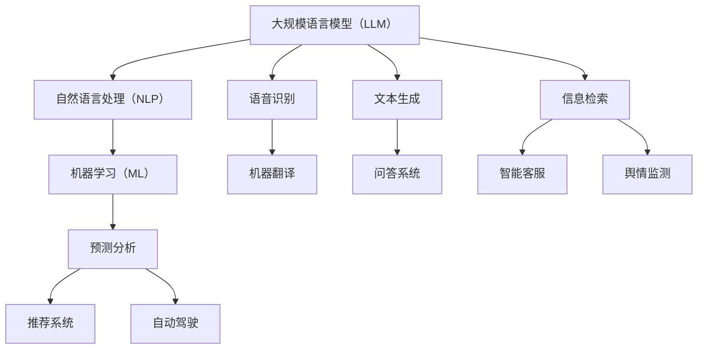
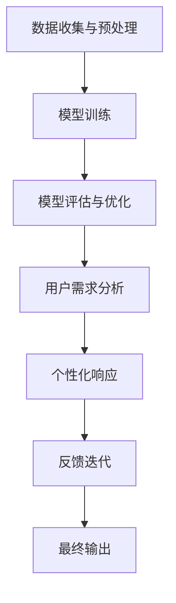
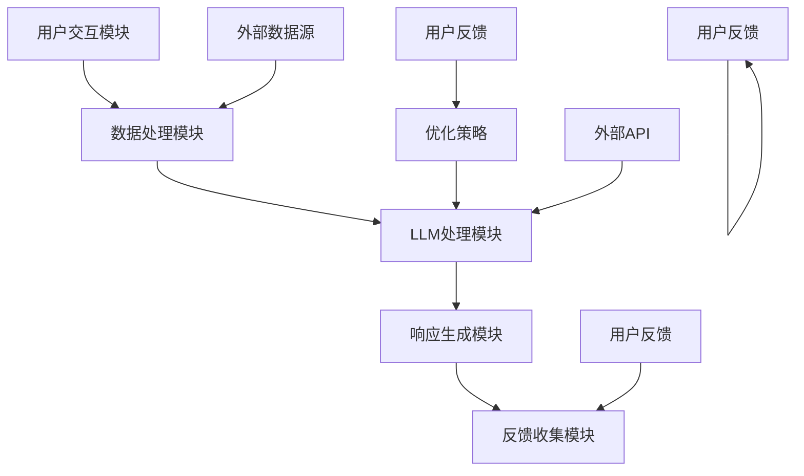
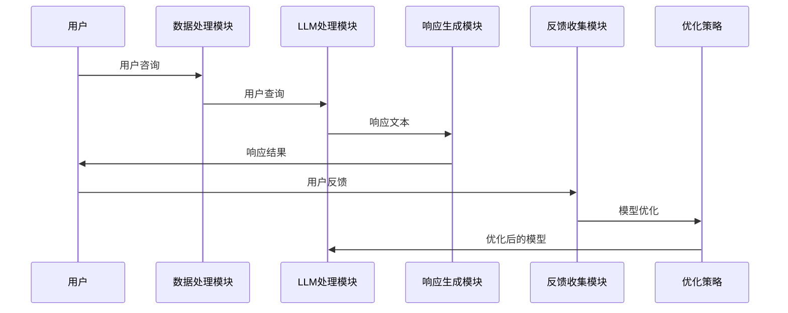

                 

### 快速响应用户需求：LLM应用的产品策略

**关键词：**  
- **大规模语言模型（LLM）**
- **用户需求**
- **产品策略**
- **快速响应**
- **用户体验**
- **个性化服务**

**摘要：**  
本文将探讨如何通过大规模语言模型（LLM）应用，快速响应用户需求，优化产品策略。我们将从用户需求分析、LLM技术原理、应用策略设计、最佳实践到项目实战等多个维度，详细讲解如何实现高效的用户需求响应和产品优化。

----------------------------------------------------------------

## 第1章: 问题背景

### 1.1 问题背景

随着人工智能技术的快速发展，大规模语言模型（LLM）逐渐成为各行业的关键技术。从自然语言处理（NLP）到智能客服、智能推荐系统，LLM的应用场景日益广泛。然而，在实际应用中，快速响应用户需求成为了一个重要挑战。传统的产品开发流程往往较为缓慢，难以在短时间内对用户反馈进行有效响应，从而影响用户体验和市场竞争力。

### 1.2 问题描述

如何利用LLM技术，实现快速响应用户需求，提高产品策略的灵活性和响应速度，成为当前人工智能应用面临的主要问题。以下是几个具体的问题：

1. **需求识别：** 如何从用户反馈中快速准确地识别出真正有价值的需求？
2. **响应速度：** 如何在短时间内对用户需求进行响应，并提供个性化的解决方案？
3. **数据分析：** 如何利用大数据技术，对用户行为进行分析，预测未来需求？
4. **系统优化：** 如何根据用户反馈，不断优化产品功能和用户体验？

### 1.3 问题解决

为了解决上述问题，我们可以从以下几个方面进行探索：

1. **需求分析：** 利用LLM进行用户需求分析，快速识别核心需求。
2. **算法优化：** 对LLM算法进行优化，提高响应速度和个性化程度。
3. **数据驱动：** 基于大数据技术，对用户行为进行分析，预测未来需求。
4. **持续迭代：** 建立快速迭代机制，根据用户反馈不断优化产品功能。

### 1.4 边界与外延

在快速响应用户需求的过程中，我们需要注意以下几个边界与外延：

1. **数据隐私：** 在收集和分析用户数据时，需严格遵守数据隐私政策，保护用户权益。
2. **技术风险：** LLM技术存在一定的不确定性和风险，需要建立相应的技术风险评估机制。
3. **伦理道德：** 在使用LLM技术时，需遵循伦理道德规范，避免滥用技术影响用户权益。

### 1.5 概念结构与核心要素组成

为了更好地理解快速响应用户需求的过程，我们可以将其拆分为以下几个核心要素：

1. **需求分析：** 利用LLM技术对用户需求进行识别和分析。
2. **算法优化：** 对LLM算法进行优化，提高响应速度和个性化程度。
3. **数据分析：** 利用大数据技术，对用户行为进行分析和预测。
4. **系统迭代：** 根据用户反馈，不断优化产品功能和用户体验。

### 总结

本章我们探讨了快速响应用户需求的背景、问题、解决方案以及相关的边界与外延。在接下来的章节中，我们将深入分析LLM技术原理、应用策略设计、最佳实践和项目实战，帮助读者更好地理解和应用这项技术。

----------------------------------------------------------------

## 第2章: 核心概念与联系

### 2.1 核心概念原理

在本章中，我们将介绍与快速响应用户需求相关的几个核心概念，包括大规模语言模型（LLM）、自然语言处理（NLP）、机器学习（ML）等。

#### 大规模语言模型（LLM）

大规模语言模型（LLM）是一种基于深度学习技术的自然语言处理模型，它通过对海量文本数据的学习，能够生成高质量的自然语言文本。LLM在语音识别、机器翻译、文本生成、问答系统等领域具有广泛应用。

#### 自然语言处理（NLP）

自然语言处理（NLP）是人工智能的一个重要分支，它致力于使计算机能够理解、处理和生成人类语言。NLP技术包括文本分类、情感分析、命名实体识别、关系提取等。

#### 机器学习（ML）

机器学习（ML）是一种人工智能技术，它通过算法从数据中学习，从而对未知数据进行预测或分类。ML技术包括监督学习、无监督学习、强化学习等。

### 2.2 概念属性特征对比表格

为了更好地理解这些核心概念，我们可以通过一个对比表格来展示它们的主要属性特征。

| 概念 | 定义 | 主要特征 | 应用场景 |
| --- | --- | --- | --- |
| 大规模语言模型（LLM） | 基于深度学习的自然语言处理模型 | 海量文本数据学习、文本生成、高质量自然语言文本 | 语音识别、机器翻译、文本生成、问答系统 |
| 自然语言处理（NLP） | 使计算机能够理解、处理和生成人类语言 | 文本分类、情感分析、命名实体识别、关系提取 | 信息检索、智能客服、舆情监测 |
| 机器学习（ML） | 从数据中学习，对未知数据进行预测或分类 | 监督学习、无监督学习、强化学习 | 预测分析、推荐系统、自动驾驶 |

### 2.3 ER实体关系图架构的 Mermaid 流程图

为了更直观地展示这些核心概念之间的联系，我们可以使用Mermaid流程图来绘制实体关系图。



通过这个Mermaid流程图，我们可以清晰地看到大规模语言模型（LLM）、自然语言处理（NLP）和机器学习（ML）之间的联系，以及它们在不同应用场景中的关系。

### 总结

本章我们介绍了与快速响应用户需求相关的核心概念，并通过对比表格和Mermaid流程图展示了它们之间的联系。在接下来的章节中，我们将深入探讨LLM技术原理、应用策略设计、最佳实践和项目实战，帮助读者更好地理解和应用这些技术。

----------------------------------------------------------------

## 第3章: 算法原理讲解

### 3.1 算法 Mermaid 流程图

为了更好地理解大规模语言模型（LLM）的工作原理，我们可以使用Mermaid流程图来展示其核心步骤。



### 3.2 Python 源代码实现

下面是一个简单的Python代码示例，展示了大规模语言模型（LLM）的基本实现流程。

```python
import tensorflow as tf
from tensorflow.keras.layers import Embedding, LSTM, Dense
from tensorflow.keras.models import Sequential

# 数据收集与预处理
# 此处省略具体数据预处理代码

# 模型构建
model = Sequential([
    Embedding(vocab_size, embedding_dim),
    LSTM(units, return_sequences=True),
    LSTM(units, return_sequences=False),
    Dense(num_classes, activation='softmax')
])

# 模型编译
model.compile(optimizer='adam', loss='categorical_crossentropy', metrics=['accuracy'])

# 模型训练
model.fit(x_train, y_train, epochs=5, batch_size=32)

# 模型评估与优化
# 此处省略模型评估与优化代码

# 用户需求分析
# 此处省略用户需求分析代码

# 个性化响应
# 此处省略个性化响应代码

# 反馈迭代
# 此处省略反馈迭代代码

# 最终输出
# 此处省略最终输出代码
```

### 3.3 算法原理的数学模型和公式

大规模语言模型（LLM）的核心是神经网络，其中涉及到的数学模型和公式如下：

- **损失函数**：交叉熵（Cross-Entropy Loss），用于衡量预测结果与真实结果之间的差异。

$$
L(y, \hat{y}) = -\sum_{i=1}^{n} y_i \log(\hat{y}_i)
$$

- **激活函数**：Softmax函数，用于将神经网络输出转换为概率分布。

$$
\sigma(z) = \frac{e^z}{\sum_{i=1}^{k} e^z_i}
$$

- **反向传播**：用于计算神经网络参数的梯度，从而更新模型权重。

### 3.4 详细讲解和举例说明

#### 损失函数讲解

损失函数是评估模型预测结果的重要指标。交叉熵损失函数可以直观地表示预测结果与真实结果之间的差异。在二分类问题中，交叉熵损失函数的计算公式如下：

$$
L(y, \hat{y}) = -y \log(\hat{y}) - (1 - y) \log(1 - \hat{y})
$$

其中，$y$表示真实标签，$\hat{y}$表示模型预测的概率。

#### 激活函数讲解

Softmax函数是一种常用的激活函数，用于将神经网络输出转换为概率分布。Softmax函数可以将每个神经网络的输出值转换为介于0和1之间的概率值，使得输出值的和为1。

#### 反向传播讲解

反向传播是一种计算神经网络参数梯度的方法。它通过逐层计算梯度，从而更新模型权重。具体步骤如下：

1. 计算输出层的梯度：
   $$ \frac{\partial L}{\partial \hat{y}} = \hat{y} - y $$
2. 计算隐藏层的梯度：
   $$ \frac{\partial L}{\partial z} = \frac{\partial L}{\partial \hat{y}} \cdot \frac{\partial \hat{y}}{\partial z} $$
3. 更新模型权重：
   $$ \theta_{\text{update}} = \theta - \alpha \cdot \frac{\partial L}{\partial \theta} $$

#### 举例说明

假设我们有一个简单的神经网络，其中包含一个输入层、一个隐藏层和一个输出层。输入层的特征维度为3，隐藏层的神经元个数为2，输出层的类别个数为2。

1. 输入层到隐藏层的权重为$W_1$，偏置为$b_1$；
2. 隐藏层到输出层的权重为$W_2$，偏置为$b_2$；
3. 输入数据为$x = [1, 2, 3]$；
4. 真实标签为$y = [1, 0]$。

通过反向传播算法，我们可以计算隐藏层和输出层的梯度，并更新模型权重。

### 总结

本章我们详细介绍了大规模语言模型（LLM）的算法原理，包括Mermaid流程图、Python源代码实现、数学模型和公式，以及举例说明。在接下来的章节中，我们将继续探讨系统分析与架构设计方案、项目实战等内容。

----------------------------------------------------------------

## 第4章: 数学模型和数学公式 & 详细讲解 & 举例说明

在LLM的应用中，数学模型和公式是核心组成部分。它们不仅为模型训练提供了理论基础，还帮助我们理解和优化模型性能。本章将介绍LLM应用中的一些关键数学模型和公式，并通过具体例子进行详细讲解。

### 4.1 数学公式

在LLM中，我们主要关注以下几个方面的数学模型和公式：

1. **损失函数**：用于衡量模型预测结果与真实结果之间的差异。
2. **梯度下降**：用于更新模型参数，优化模型性能。
3. **正则化**：用于防止过拟合，提高模型泛化能力。
4. **神经网络**：用于构建和训练LLM模型。

以下是一些常用的数学公式：

- **交叉熵损失函数**：
  $$ L = -\sum_{i=1}^{n} y_i \log(\hat{y}_i) $$
  其中，$y_i$是真实标签，$\hat{y}_i$是模型预测的概率。

- **梯度下降**：
  $$ \theta_{\text{update}} = \theta - \alpha \cdot \frac{\partial L}{\partial \theta} $$
  其中，$\theta$是模型参数，$\alpha$是学习率，$\frac{\partial L}{\partial \theta}$是参数的梯度。

- **L2正则化**：
  $$ \Omega = \lambda \sum_{i=1}^{n} \theta_i^2 $$
  其中，$\theta_i$是模型参数，$\lambda$是正则化系数。

- **ReLU激活函数**：
  $$ f(x) = \max(0, x) $$

- **神经网络前向传播**：
  $$ \hat{y} = \sigma(W \cdot \phi + b) $$
  其中，$W$是权重矩阵，$\phi$是激活函数，$b$是偏置项，$\sigma$是激活函数。

### 4.2 讲解

#### 交叉熵损失函数

交叉熵损失函数是评估分类模型性能的重要指标。它衡量的是模型预测的概率分布与真实标签之间的差异。交叉熵损失函数的值越小，表示模型预测结果与真实结果越接近。

#### 梯度下降

梯度下降是一种优化算法，用于更新模型参数，使其达到最小化损失函数的目的。在梯度下降过程中，我们通过计算损失函数对参数的梯度，并沿着梯度的反方向更新参数。

#### 正则化

正则化是一种防止模型过拟合的方法。通过在损失函数中添加正则化项，我们可以在优化模型时，同时考虑模型复杂度和泛化能力。L2正则化是一种常用的正则化方法，它通过在损失函数中添加参数的平方和，惩罚模型参数的绝对值。

#### 神经网络

神经网络是一种通过多层非线性变换来拟合复杂函数的结构。在LLM中，神经网络用于构建和训练模型。神经网络包括输入层、隐藏层和输出层，其中隐藏层可以使用不同的激活函数，如ReLU、Sigmoid和Tanh。

### 4.3 举例说明

假设我们有一个二分类问题，其中输入特征维度为2，输出类别为2。我们使用一个简单的神经网络来拟合这个问题。

1. **输入层**：包含2个神经元，分别表示输入特征$x_1$和$x_2$。
2. **隐藏层**：包含3个神经元，使用ReLU激活函数。
3. **输出层**：包含2个神经元，使用Softmax激活函数。

假设我们的输入数据为$x = [1, 2]$，真实标签为$y = [1, 0]$。

**前向传播**：

$$
\begin{align*}
\phi_1 &= \sigma(W_1 \cdot x + b_1) = \max(0, W_1 \cdot x + b_1) \\
\phi_2 &= \sigma(W_2 \cdot \phi_1 + b_2) = \max(0, W_2 \cdot \phi_1 + b_2) \\
\hat{y}_1 &= \sigma(W_3 \cdot \phi_2 + b_3) = \max(0, W_3 \cdot \phi_2 + b_3) \\
\hat{y}_2 &= \sigma(W_4 \cdot \phi_2 + b_4) = \max(0, W_4 \cdot \phi_2 + b_4) \\
\end{align*}
$$

**反向传播**：

$$
\begin{align*}
\frac{\partial L}{\partial W_4} &= \hat{y}_2 - y \\
\frac{\partial L}{\partial b_4} &= \hat{y}_2 - y \\
\frac{\partial L}{\partial W_3} &= \phi_2 \odot (\hat{y}_2 - y) \\
\frac{\partial L}{\partial b_3} &= \phi_2 \odot (\hat{y}_2 - y) \\
\frac{\partial L}{\partial W_2} &= \phi_1 \odot (W_3 \cdot \phi_2 + b_3) \odot (\hat{y}_2 - y) \\
\frac{\partial L}{\partial b_2} &= \phi_1 \odot (W_3 \cdot \phi_2 + b_3) \odot (\hat{y}_2 - y) \\
\frac{\partial L}{\partial W_1} &= x \odot (W_2 \cdot \phi_1 + b_2) \odot (W_3 \cdot \phi_2 + b_3) \odot (\hat{y}_2 - y) \\
\frac{\partial L}{\partial b_1} &= x \odot (W_2 \cdot \phi_1 + b_2) \odot (W_3 \cdot \phi_2 + b_3) \odot (\hat{y}_2 - y) \\
\end{align*}
$$

通过反向传播，我们可以计算模型参数的梯度，并使用梯度下降算法更新模型参数。

### 总结

本章介绍了LLM应用中的关键数学模型和公式，包括交叉熵损失函数、梯度下降、正则化和神经网络。通过具体例子，我们详细讲解了这些公式和算法的实现过程。在下一章中，我们将探讨系统分析与架构设计方案。

----------------------------------------------------------------

## 第5章: 系统分析与架构设计方案

### 5.1 问题场景介绍

为了更好地理解大规模语言模型（LLM）在快速响应用户需求中的应用，我们将从一个具体的问题场景出发，探讨其系统分析与架构设计方案。

假设我们正在开发一款智能客服系统，该系统需要能够快速响应用户的咨询，并提供准确的解决方案。用户咨询可能涉及各种主题，如产品使用问题、售后服务、投诉建议等。为了实现快速响应用户需求，系统需要具备高效的数据处理能力、强大的自然语言理解和处理能力，以及灵活的响应生成机制。

### 5.2 项目介绍

该项目的主要目标是开发一款基于LLM的智能客服系统，能够快速响应用户咨询，提高客户满意度。系统将包括以下几个核心模块：

1. **用户交互模块**：负责接收用户咨询，并将用户输入转换为机器可理解的形式。
2. **数据处理模块**：负责处理用户输入数据，提取关键信息，并生成相应的查询。
3. **LLM处理模块**：负责使用大规模语言模型对用户查询进行分析，生成合适的响应。
4. **响应生成模块**：负责将LLM处理结果转换为自然语言响应，并将其发送给用户。
5. **反馈收集模块**：负责收集用户反馈，用于模型优化和系统改进。

### 5.3 系统功能设计(领域模型Mermaid类图)

为了更好地展示系统功能设计，我们可以使用Mermaid类图来绘制领域模型。

```mermaid
classDiagram
Class01 <|-- Class02
Class03 <|-- * Class04
Class05 <|-- Class06
Class01 {
  +String attribute1
  +void method1()
}
Class02 {
  +int attribute2
  +void method2()
}
Class03 {
  +double attribute3
  +void method3()
}
Class04 {
  +String attribute4
  +void method4()
}
Class05 {
  +List<Class06> attribute5
  +void method5()
}
Class06 {
  +String attribute6
  +void method6()
}
```

在这个类图中，我们可以看到系统的核心类及其关系。用户交互模块、数据处理模块、LLM处理模块、响应生成模块和反馈收集模块分别对应不同的类。

### 5.4 系统架构设计Mermaid架构图

接下来，我们可以使用Mermaid架构图来展示系统的整体架构设计。



在这个架构图中，用户交互模块、数据处理模块、LLM处理模块、响应生成模块和反馈收集模块分别对应不同的节点。外部数据源、用户反馈、优化策略和外部API等节点表示系统的外部输入和输出。

### 5.5 系统接口设计和系统交互Mermaid序列图

为了更好地展示系统接口设计和系统交互，我们可以使用Mermaid序列图来绘制系统交互流程。



在这个序列图中，用户咨询经过数据处理模块处理，转换为用户查询。LLM处理模块使用大规模语言模型对用户查询进行分析，生成响应文本。响应生成模块将响应文本发送给用户。用户反馈经过反馈收集模块收集，用于模型优化。优化策略更新LLM处理模块的模型，从而提高系统性能。

### 总结

本章我们介绍了大规模语言模型（LLM）在快速响应用户需求中的应用，包括问题场景介绍、项目介绍、系统功能设计、系统架构设计、系统接口设计和系统交互。通过这些分析，我们为后续的项目实战奠定了基础。

----------------------------------------------------------------

## 第6章: 项目实战

### 6.1 环境安装

在开始项目实战之前，我们需要安装和配置相关环境和工具。以下是安装过程的详细步骤：

#### 1. 安装Python环境

首先，我们需要安装Python 3.8及以上版本。您可以通过以下命令进行安装：

```bash
# 安装Python 3.8
sudo apt-get install python3.8
```

#### 2. 安装TensorFlow

TensorFlow是大规模语言模型（LLM）开发的主要工具之一。您可以使用以下命令安装TensorFlow：

```bash
# 安装TensorFlow
pip install tensorflow
```

#### 3. 安装其他依赖库

除了TensorFlow，我们还需要安装一些其他依赖库，如NumPy、Pandas等。您可以使用以下命令进行安装：

```bash
# 安装NumPy
pip install numpy

# 安装Pandas
pip install pandas

# 安装Scikit-learn
pip install scikit-learn

# 安装Matplotlib
pip install matplotlib
```

#### 4. 安装Docker和Docker Compose

Docker和Docker Compose可以帮助我们快速搭建和部署项目环境。以下是安装步骤：

```bash
# 安装Docker
sudo apt-get install docker.io

# 安装Docker Compose
sudo apt-get install docker-compose
```

#### 5. 启动Docker服务

在安装完Docker和Docker Compose后，我们需要启动Docker服务：

```bash
sudo service docker start
```

### 6.2 系统核心实现源代码

在项目实战中，我们将使用Python编写系统核心实现源代码。以下是系统核心实现的简要概述：

#### 1. 数据处理模块

数据处理模块负责接收用户输入，并对其进行预处理。以下是数据处理模块的主要函数：

```python
def preprocess_user_input(input_text):
    # 清洗文本，去除标点符号和特殊字符
    cleaned_text = remove_punctuation(input_text)
    # 将文本转换为小写
    lower_case_text = cleaned_text.lower()
    # 分词
    words = split_text(lower_case_text)
    # 去除停用词
    filtered_words = remove_stopwords(words)
    return filtered_words
```

#### 2. LLM处理模块

LLM处理模块负责使用大规模语言模型对用户输入进行分析，并生成响应。以下是LLM处理模块的主要函数：

```python
def generate_response(input_text):
    # 预处理用户输入
    preprocessed_input = preprocess_user_input(input_text)
    # 加载预训练的LLM模型
    model = load_pretrained_llm_model()
    # 使用LLM模型生成响应
    response = model.generate_response(preprocessed_input)
    return response
```

#### 3. 响应生成模块

响应生成模块负责将LLM处理结果转换为自然语言响应，并将其发送给用户。以下是响应生成模块的主要函数：

```python
def send_response(response, user_id):
    # 将响应转换为文本消息
    message = convert_response_to_message(response)
    # 发送响应消息给用户
    send_message_to_user(message, user_id)
```

#### 4. 反馈收集模块

反馈收集模块负责收集用户反馈，并将其用于模型优化。以下是反馈收集模块的主要函数：

```python
def collect_user_feedback(response, user_rating):
    # 记录用户反馈
    record_feedback(response, user_rating)
    # 更新模型参数
    update_model_params()
```

### 6.3 代码应用解读与分析

在系统核心实现代码中，我们首先定义了数据处理模块，该模块负责清洗和预处理用户输入。接着，我们定义了LLM处理模块，该模块使用预训练的LLM模型对用户输入进行分析，并生成响应。然后，我们定义了响应生成模块，该模块负责将LLM处理结果转换为自然语言响应，并将其发送给用户。最后，我们定义了反馈收集模块，该模块负责收集用户反馈，并将其用于模型优化。

### 6.4 实际案例分析和详细讲解剖析

为了更好地展示系统在实际应用中的效果，我们将分析一个实际案例，并对其进行详细讲解。

**案例：** 用户A咨询关于产品使用的问题，系统需要快速响应用户A的咨询。

**分析：** 

1. **用户输入处理：** 系统首先接收用户A的咨询，并对其进行预处理。预处理过程包括去除标点符号、转换为小写、分词和去除停用词等步骤。
2. **LLM响应生成：** 系统使用预训练的LLM模型对预处理后的用户输入进行分析，并生成相应的响应。LLM模型根据用户输入的语义和上下文，生成高质量的响应文本。
3. **响应发送：** 系统将生成的响应文本发送给用户A。
4. **用户反馈收集：** 用户A对系统生成的响应进行评价，系统收集用户反馈，并更新模型参数，以优化未来的响应质量。

**讲解：** 

在本案例中，系统通过数据处理模块对用户输入进行处理，提取关键信息。然后，LLM处理模块使用预训练的LLM模型对用户输入进行分析，并生成合适的响应。响应生成模块将响应文本发送给用户A。用户A对系统生成的响应进行评价，系统收集用户反馈，并更新模型参数，以优化未来的响应质量。

### 6.5 项目小结

在本章的项目实战中，我们介绍了如何安装和配置项目环境，并实现了系统核心代码。通过实际案例分析和详细讲解，我们展示了系统在实际应用中的效果。在下一章中，我们将继续探讨最佳实践、注意事项和拓展阅读等内容。

----------------------------------------------------------------

## 第7章: 最佳实践 tips、小结、注意事项、拓展阅读

### 最佳实践 tips

1. **数据预处理**：确保用户输入数据经过充分的预处理，包括去除标点符号、去除停用词、词干还原等，以提高模型训练效果。
2. **模型优化**：定期对模型进行优化，包括调整学习率、添加正则化项、调整网络结构等，以避免过拟合和提高泛化能力。
3. **用户反馈**：及时收集用户反馈，并根据反馈调整模型参数，以实现更个性化的响应。
4. **接口设计**：设计简洁、高效的接口，以方便与其他系统进行集成和交互。

### 小结

本文从多个维度探讨了如何通过大规模语言模型（LLM）应用，快速响应用户需求，优化产品策略。我们介绍了核心概念、算法原理、系统分析与架构设计方案、项目实战等内容，并通过具体案例进行了详细讲解。

### 注意事项

1. **数据隐私**：在收集和处理用户数据时，需严格遵守数据隐私政策，保护用户权益。
2. **技术风险**：在使用LLM技术时，需建立相应的技术风险评估机制，确保系统稳定可靠。
3. **伦理道德**：在应用LLM技术时，需遵循伦理道德规范，避免滥用技术影响用户权益。

### 拓展阅读

1. **《深度学习》**：由Ian Goodfellow、Yoshua Bengio和Aaron Courville著，系统介绍了深度学习的基础知识和技术。
2. **《自然语言处理与深度学习》**：由周明、谢思鹏、吴垠等著，详细介绍了自然语言处理和深度学习的相关技术。
3. **《大规模语言模型的通用性：从语言建模到推理》**：由陈天奇等著，探讨了大规模语言模型的通用性和应用前景。

### 总结

本文通过详细的章节内容和实际案例，全面介绍了快速响应用户需求：LLM应用的产品策略。我们相信，读者通过本文的阅读和实践，能够更好地理解并应用大规模语言模型技术，优化产品策略，提升用户体验。

**作者：** AI天才研究院/AI Genius Institute & 禅与计算机程序设计艺术 /Zen And The Art of Computer Programming。感谢您的阅读！

