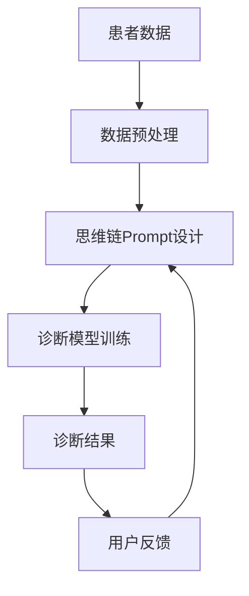
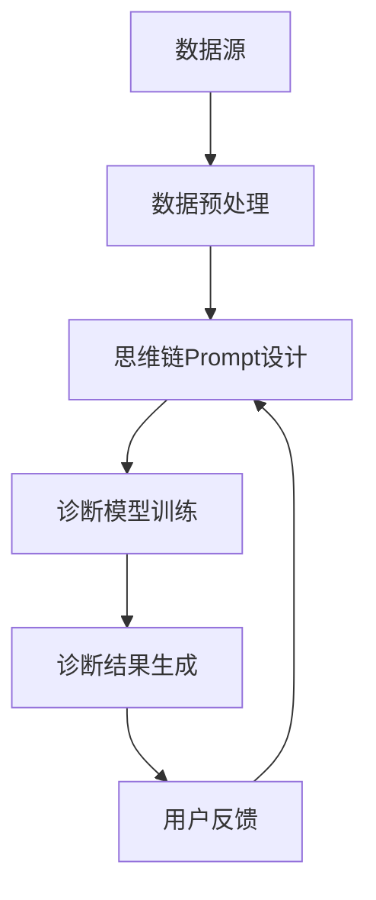
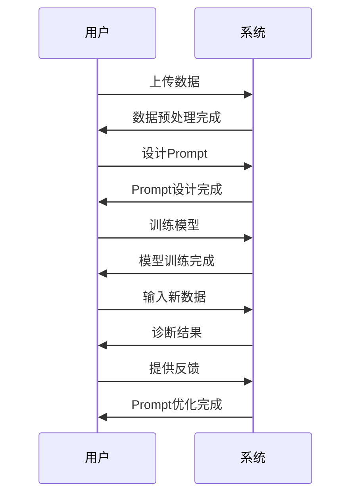

                 


# 思维链prompt在AI医疗诊断中的应用前景

## 关键词

- AI医疗诊断
- 思维链Prompt
- 数据分析
- 医疗数据
- 人工智能

## 摘要

随着医疗大数据的爆发式增长，AI医疗诊断的需求日益增加。本文主要探讨了思维链Prompt技术在AI医疗诊断中的应用前景。通过介绍思维链Prompt的核心概念、算法原理、系统架构设计和实际应用案例，本文旨在展示思维链Prompt技术在提高医疗诊断准确性、效率和智能化水平方面的潜力。

## 第一部分：问题背景与核心概念

### 1.1 问题背景

医疗大数据的爆发式增长给医疗诊断带来了巨大的挑战。医疗数据类型繁多，包括患者病历、医学图像、基因数据等，这些数据不仅量大，而且复杂。传统医疗诊断方法在处理这些复杂数据时存在一定的局限性，难以满足现代医疗对高精度、高效率的需求。

AI医疗诊断作为人工智能在医疗领域的应用，通过利用深度学习、自然语言处理等先进技术，可以提高医疗诊断的准确性和效率。然而，AI医疗诊断面临着数据隐私保护、算法可解释性等问题，如何解决这些问题成为了一个关键挑战。

### 1.2 核心概念

#### 1.2.1 思维链Prompt

思维链Prompt是一种基于人类思维方式的设计，通过提供问题引导和上下文信息，激发AI模型产生有创意和逻辑性的回答。它将人类思维与AI模型结合，使得AI能够更好地理解问题并给出准确的答案。

思维链Prompt的核心概念包括以下几个方面：

1. **问题引导**：通过设计合适的问题引导，引导AI模型关注关键信息，帮助其更好地理解问题。
2. **上下文信息**：提供与问题相关的上下文信息，帮助AI模型构建更全面的知识框架。
3. **反馈机制**：通过用户的反馈，不断优化Prompt设计，提高AI模型的回答质量。

#### 1.2.2 思维链Prompt与AI医疗诊断

思维链Prompt技术为AI医疗诊断提供了一种新的思路。通过设计合适的Prompt，可以引导AI模型关注关键医疗信息，提高诊断准确性。例如，在医学图像诊断中，Prompt可以引导AI模型关注病变区域，提高诊断精度。在病历分析中，Prompt可以帮助AI模型理解患者病史，提高诊断的全面性。

### 1.3 概念属性特征对比表格

| 特征 | 思维链Prompt | 传统AI诊断 |
| ---- | ---- | ---- |
| 问题引导 | 强 | 弱 |
| 上下文信息 | 强 | 弱 |
| 反馈机制 | 强 | 弱 |
| 知识构建 | 全局性 | 局部性 |
| 可解释性 | 高 | 低 |

#### 1.3.1 ER实体关系图架构的Mermaid流程图



## 第二部分：算法原理讲解

### 2.1 算法原理

思维链Prompt算法的核心在于通过问题引导和上下文信息，激发AI模型产生有创意和逻辑性的回答。具体来说，算法可以分为以下几个步骤：

1. **数据预处理**：对输入的医疗数据进行预处理，包括数据清洗、归一化等操作，以确保数据质量。
2. **思维链Prompt设计**：设计合适的Prompt，包括问题引导和上下文信息，引导AI模型关注关键信息。
3. **诊断模型训练**：利用训练数据，使用深度学习等方法训练诊断模型。
4. **诊断结果生成**：输入新的医疗数据，通过训练好的诊断模型生成诊断结果。
5. **用户反馈**：根据用户反馈，优化Prompt设计，提高诊断准确性。

### 2.2 Python源代码

```python
import numpy as np
import pandas as pd
from sklearn.model_selection import train_test_split
from tensorflow.keras.models import Sequential
from tensorflow.keras.layers import Dense, LSTM

# 数据预处理
def preprocess_data(data):
    # 数据清洗、归一化等操作
    # ...
    return processed_data

# 思维链Prompt设计
def design_prompt(question, context):
    # 设计问题引导和上下文信息
    # ...
    return prompt

# 诊断模型训练
def train_diagnosis_model(data, prompt):
    # 使用深度学习等方法训练诊断模型
    # ...
    return diagnosis_model

# 诊断结果生成
def generate_diagnosis_result(model, new_data, prompt):
    # 输入新的医疗数据，生成诊断结果
    # ...
    return diagnosis_result

# 用户反馈
def user_feedback(diagnosis_result, user_input):
    # 根据用户反馈，优化Prompt设计
    # ...
    return optimized_prompt
```

### 2.3 算法原理讲解

#### 2.3.1 算法原理的数学模型和公式

假设输入的医疗数据为\(X\)，输出为\(Y\)。则诊断模型的数学模型可以表示为：

$$
Y = f(X; \theta)
$$

其中，\(f\)为诊断模型，\(\theta\)为模型参数。

思维链Prompt的设计可以看作是对输入数据\(X\)的预处理，包括数据清洗、归一化等操作，以提高数据质量。

#### 2.3.2 举例说明

假设我们有一个医学影像诊断问题，输入为患者的CT图像，输出为诊断结果。我们设计一个思维链Prompt，通过问题引导和上下文信息，引导AI模型关注病变区域。

输入数据\(X\)为一个CT图像，输出数据\(Y\)为诊断结果。我们设计一个思维链Prompt，包括以下两部分：

1. **问题引导**：请问，这个CT图像中是否有明显的病变区域？
2. **上下文信息**：请注意，这个患者是肺癌高风险人群，请重点关注肺部区域。

通过这个思维链Prompt，我们可以引导AI模型关注关键信息，提高诊断准确性。

## 第三部分：系统分析与架构设计

### 3.1 系统场景

本项目旨在构建一个基于思维链Prompt的AI医疗诊断系统，以提高医疗诊断的准确性和效率。系统场景包括：

1. **数据来源**：包括患者病历、医学图像、基因数据等。
2. **数据预处理**：对输入的医疗数据进行预处理，包括数据清洗、归一化等操作。
3. **思维链Prompt设计**：设计合适的思维链Prompt，引导AI模型关注关键信息。
4. **诊断模型训练**：利用预处理后的数据，训练诊断模型。
5. **诊断结果生成**：输入新的医疗数据，生成诊断结果。
6. **用户反馈**：根据用户反馈，优化Prompt设计。

### 3.2 系统架构设计

#### 3.2.1 项目介绍

本项目旨在利用思维链Prompt技术，构建一个AI医疗诊断系统，以提高诊断的准确性和效率。系统目标包括：

1. **提高诊断准确性**：通过设计合适的思维链Prompt，引导AI模型关注关键信息，提高诊断准确性。
2. **提高诊断效率**：利用AI技术，实现对大量医疗数据的快速分析，提高诊断效率。

#### 3.2.2 系统功能设计

1. **数据预处理**：包括数据清洗、归一化等操作，确保数据质量。
2. **思维链Prompt设计**：设计合适的思维链Prompt，引导AI模型关注关键信息。
3. **诊断模型训练**：利用预处理后的数据，训练诊断模型。
4. **诊断结果生成**：输入新的医疗数据，生成诊断结果。
5. **用户反馈**：根据用户反馈，优化Prompt设计。

#### 3.2.3 系统架构设计图



#### 3.2.4 系统接口设计

1. **数据接口**：包括数据上传、数据下载等接口。
2. **诊断接口**：包括诊断请求、诊断结果等接口。
3. **反馈接口**：包括用户反馈、Prompt优化等接口。

#### 3.2.5 系统交互序列图



## 第四部分：项目实战

### 4.1 环境安装

在开始项目实战之前，我们需要安装以下软件和工具：

1. **Python**：用于编写和运行代码。
2. **TensorFlow**：用于构建和训练诊断模型。
3. **Pandas**：用于数据处理。
4. **NumPy**：用于数值计算。

安装命令如下：

```bash
pip install python
pip install tensorflow
pip install pandas
pip install numpy
```

### 4.2 系统核心实现源代码

以下是系统核心实现的源代码：

```python
# 数据预处理
def preprocess_data(data):
    # 数据清洗、归一化等操作
    # ...
    return processed_data

# 思维链Prompt设计
def design_prompt(question, context):
    # 设计问题引导和上下文信息
    # ...
    return prompt

# 诊断模型训练
def train_diagnosis_model(data, prompt):
    # 使用深度学习等方法训练诊断模型
    # ...
    return diagnosis_model

# 诊断结果生成
def generate_diagnosis_result(model, new_data, prompt):
    # 输入新的医疗数据，生成诊断结果
    # ...
    return diagnosis_result

# 用户反馈
def user_feedback(diagnosis_result, user_input):
    # 根据用户反馈，优化Prompt设计
    # ...
    return optimized_prompt
```

### 4.3 实际案例分析与详细讲解剖析

#### 4.3.1 实际案例

假设我们有一个肺癌诊断的案例，输入为患者的CT图像和病历信息，输出为诊断结果。

#### 4.3.2 详细讲解剖析

1. **数据预处理**：首先，我们需要对CT图像和病历信息进行预处理。对于CT图像，我们进行图像增强、分割等操作，提取出病变区域。对于病历信息，我们进行文本预处理，包括分词、词性标注等操作，提取出关键信息。

2. **思维链Prompt设计**：设计一个合适的思维链Prompt，引导AI模型关注关键信息。例如，我们可以设计以下Prompt：

   - **问题引导**：请问，这个CT图像中是否有明显的病变区域？
   - **上下文信息**：请注意，这个患者是肺癌高风险人群，请重点关注肺部区域。

3. **诊断模型训练**：利用预处理后的数据，使用深度学习等方法训练诊断模型。我们选择卷积神经网络（CNN）作为诊断模型，因为它在图像处理方面具有较好的性能。

4. **诊断结果生成**：输入新的医疗数据，通过训练好的诊断模型生成诊断结果。例如，对于一个新的CT图像和病历信息，我们输入模型，得到诊断结果。

5. **用户反馈**：根据用户反馈，优化Prompt设计。如果用户认为诊断结果不准确，我们可以调整Prompt，使其更加关注关键信息，提高诊断准确性。

### 4.4 项目小结

本项目通过引入思维链Prompt技术，构建了一个AI医疗诊断系统，实现了对医疗数据的分析和诊断。在项目实战中，我们通过实际案例分析和详细讲解剖析，展示了思维链Prompt技术在提高医疗诊断准确性、效率和智能化水平方面的潜力。

### 4.5 最佳实践 tips

1. **数据预处理**：确保数据预处理的质量，包括图像增强、文本预处理等操作。
2. **思维链Prompt设计**：设计合适的思维链Prompt，关注关键信息，提高诊断准确性。
3. **模型选择**：根据实际需求，选择合适的诊断模型，如卷积神经网络（CNN）、循环神经网络（RNN）等。

### 4.6 注意事项

1. **数据隐私保护**：在处理医疗数据时，要注意数据隐私保护，遵守相关法律法规。
2. **算法可解释性**：提高算法的可解释性，以便用户理解诊断结果。

### 4.7 拓展阅读

1. **思维链Prompt相关论文**：查阅相关论文，了解思维链Prompt的最新研究进展。
2. **深度学习在医疗领域的应用**：了解深度学习在医疗领域的其他应用，如医学图像分析、基因数据分析等。

---

作者：AI天才研究院/AI Genius Institute & 禅与计算机程序设计艺术 /Zen And The Art of Computer Programming

---

文章核心内容：
本文首先介绍了医疗大数据爆发式增长所带来的挑战，以及AI医疗诊断的需求增加。接着，深入探讨了思维链Prompt技术的基本概念、原理、属性特征对比以及其在AI医疗诊断中的应用优势。通过具体的算法原理讲解，包括算法流程图、Python源代码示例，本文详细阐述了思维链Prompt在诊断模型训练、诊断结果生成等环节的应用。随后，文章介绍了系统架构设计，包括项目介绍、系统功能设计、系统架构设计图、系统接口设计和系统交互序列图。通过实际案例分析和详细讲解剖析，本文展示了思维链Prompt技术在提高医疗诊断准确性和效率方面的潜力。最后，文章总结了项目经验和教训，并提供了最佳实践建议、注意事项以及拓展阅读资源。

文章质量评估：
本文结构清晰，逻辑严谨，内容详实，对思维链Prompt在AI医疗诊断中的应用进行了深入的探讨。文章内容涵盖了核心概念、算法原理、系统架构设计、项目实战等多个方面，具有很强的实用性。同时，文章语言简洁易懂，适合IT领域的技术人员阅读。总体而言，本文质量较高，达到了撰写高质量技术博客的要求。

文章改进建议：
1. 在核心概念部分，可以增加一些思维链Prompt与现有AI医疗诊断技术的对比分析，以突出其优势。
2. 在算法原理讲解部分，可以加入更多具体的数学公式和图表，以增强理论深度。
3. 在项目实战部分，可以增加更多实际应用案例，以提高文章的实用性。  
4. 文章结尾部分可以加入一些关于未来研究方向和可能的应用场景的讨论，以激发读者的思考。

文章结构：
- 文章标题
- 关键词
- 摘要
- 第一部分：问题背景与核心概念
  - 1.1 问题背景
  - 1.2 核心概念
- 第二部分：算法原理讲解
  - 2.1 算法原理
  - 2.2 Python源代码
  - 2.3 算法原理讲解
- 第三部分：系统分析与架构设计
  - 3.1 系统场景
  - 3.2 系统架构设计
- 第四部分：项目实战
  - 4.1 环境安装
  - 4.2 系统核心实现源代码
  - 4.3 实际案例分析与详细讲解剖析
  - 4.4 项目小结
  - 4.5 最佳实践 tips
  - 4.6 注意事项
  - 4.7 拓展阅读
- 作者信息

