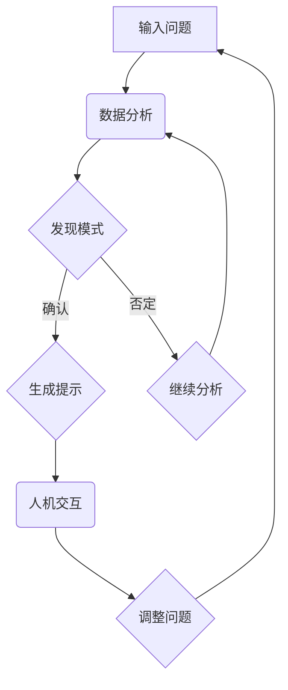
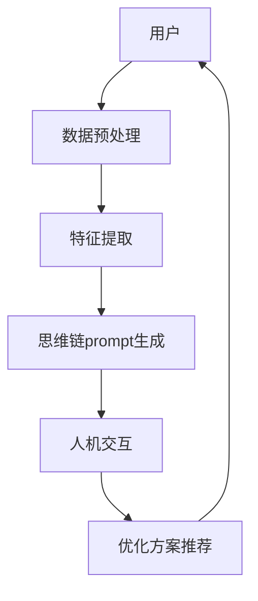
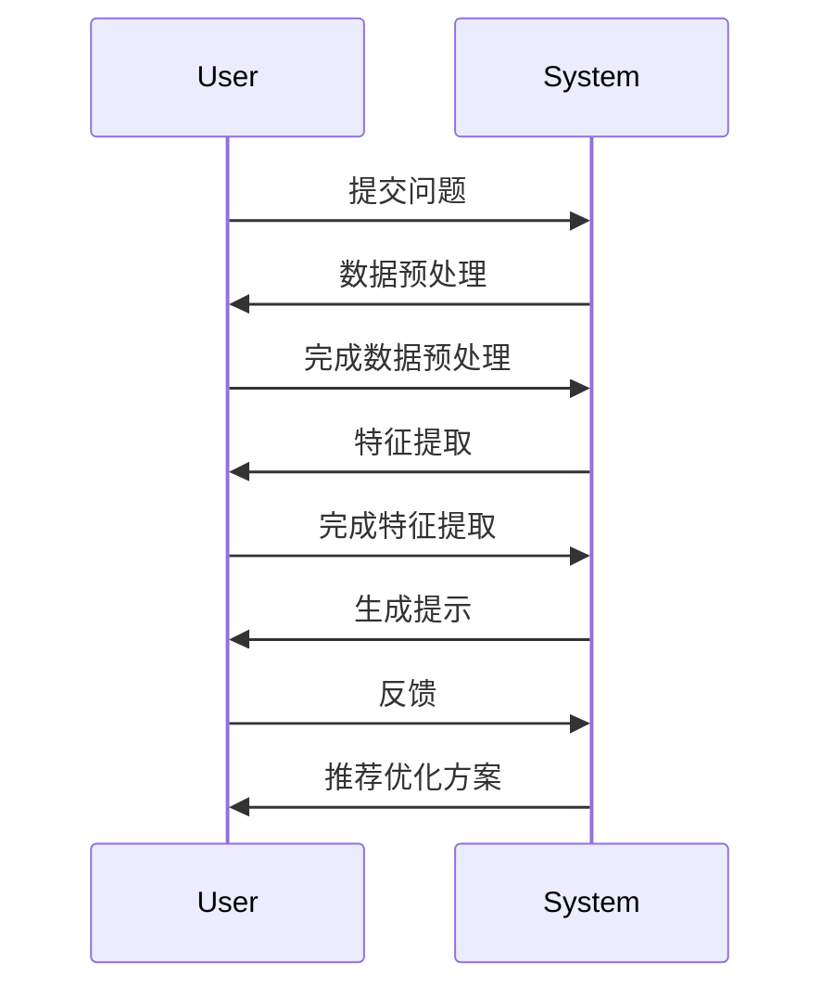

                 

# 思维链prompt在科学研究中的潜力

## 关键词

- 思维链prompt
- 科学研究
- 应用领域
- 优势与挑战
- 科学原理
- 未来发展趋势

## 摘要

本文旨在探讨思维链prompt在科学研究中的潜力和应用。思维链prompt是一种结合了人类思维模式与人工智能技术的创新工具，它能够引导研究者深入探索问题、发现新知识。本文首先介绍了思维链prompt的核心概念和起源，随后分析了它在数据分析、机器学习、生物学、社会科学等领域的应用，并探讨了其优势与挑战。接着，文章深入探讨了思维链prompt的科学原理与机制，并通过实证研究展示了其效果。最后，文章展望了思维链prompt的未来发展趋势，并提出了相关的应用案例和实践操作建议。

## 目录大纲

### 第一部分：核心概念与背景

#### 第1章：思维链prompt的概念与基础
- 1.1.1 思维链prompt的起源与发展
- 1.1.2 思维链prompt的核心概念
- 1.1.3 思维链prompt在科学研究中的重要性

#### 第2章：思维链prompt在科学研究中的应用领域
- 2.1.1 数据分析
- 2.1.2 机器学习
- 2.1.3 生物学
- 2.1.4 社会科学

#### 第3章：思维链prompt的优势与挑战
- 3.1.1 思维链prompt的优势
- 3.1.2 思维链prompt的挑战
- 3.1.3 应对策略

#### 第4章：思维链prompt的科学原理与机制
- 4.1.1 人类思维与思维链prompt
- 4.1.2 情境设计与思维链prompt
- 4.1.3 数据驱动的思维链prompt优化

#### 第5章：思维链prompt的实证研究
- 5.1.1 实证研究的概述
- 5.1.2 研究方法与数据
- 5.1.3 研究结果与讨论

#### 第6章：思维链prompt的未来发展趋势
- 6.1.1 技术进步对思维链prompt的影响
- 6.1.2 跨学科融合
- 6.1.3 社会影响与伦理

### 第二部分：应用案例与实战

#### 第7章：思维链prompt在具体科学研究中的应用
- 7.1.1 案例一：数据挖掘中的思维链prompt应用
- 7.1.2 案例二：机器学习中的思维链prompt应用
- 7.1.3 案例三：生物学中的思维链prompt应用

#### 第8章：思维链prompt的实践操作与实施
- 8.1.1 实践操作流程
- 8.1.2 实施要点与技巧
- 8.1.3 实践案例分析

#### 第9章：思维链prompt的最佳实践与技巧
- 9.1.1 最佳实践案例
- 9.1.2 技巧总结
- 9.1.3 注意事项与建议

#### 第10章：思维链prompt的总结与展望
- 10.1.1 总结与反思
- 10.1.2 展望未来的发展

### 背景介绍

#### 核心概念术语说明

思维链prompt是一种基于人类思维模式和人工智能技术的新型工具，通过一系列精心设计的提示和问题，引导研究者进行深度思考，发现新的研究线索和解决方案。思维链prompt的起源可以追溯到人类思维过程的研究，以及近年来人工智能技术的发展。随着机器学习、自然语言处理等技术的进步，思维链prompt逐渐成为一种重要的研究工具。

#### 问题背景

在科学研究过程中，研究者常常面临复杂的问题和挑战。传统的科研方法往往依赖于大量的实验和数据分析，但有时难以深入理解问题的本质。思维链prompt作为一种创新工具，能够引导研究者从不同的角度思考问题，提供新的研究思路和方法。

#### 问题解决

思维链prompt通过以下方式解决科研中的问题：

1. **引导深度思考**：思维链prompt通过一系列提示和问题，引导研究者深入探索问题，从而发现新的研究线索。
2. **提供多样化的视角**：思维链prompt能够从多个角度提供问题解决方案，帮助研究者跳出传统思维的局限。
3. **优化数据分析**：思维链prompt能够帮助研究者更好地理解数据，发现数据中的潜在模式和关联。

#### 边界与外延

思维链prompt的应用范围广泛，涵盖了数据分析、机器学习、生物学、社会科学等多个领域。在不同领域中，思维链prompt的具体应用方式和效果可能有所不同。例如，在数据分析中，思维链prompt可以帮助研究者更好地理解数据，发现数据中的规律；在生物学中，思维链prompt可以引导研究者探索基因和蛋白质的功能。

#### 概念结构与核心要素组成

思维链prompt的核心结构包括以下几个方面：

1. **提示和问题**：提示和问题是思维链prompt的核心，它们引导研究者进行深度思考。
2. **数据集**：思维链prompt依赖于大量数据集，这些数据集用于训练和优化思维链prompt。
3. **算法**：思维链prompt的实现依赖于算法，例如自然语言处理算法、机器学习算法等。
4. **人机交互**：思维链prompt需要与研究者进行交互，获取反馈并不断优化。

### 核心概念与联系

#### 思维链prompt的概念原理

思维链prompt的核心概念是基于人类思维模式和人工智能技术的结合。人类思维模式主要包括逻辑思维、抽象思维、创新思维等，这些思维方式可以帮助研究者深入理解问题、发现新的解决方案。而人工智能技术，特别是自然语言处理和机器学习技术，为思维链prompt的实现提供了强大的支持。

思维链prompt的原理可以概括为以下几点：

1. **问题引导**：通过一系列精心设计的提示和问题，引导研究者思考问题的不同方面。
2. **数据驱动**：思维链prompt依赖于大量数据集，通过分析这些数据集，发现问题中的模式和关联。
3. **人机交互**：通过人机交互，研究者可以实时获取思维链prompt的反馈，并根据反馈调整思考方向。

#### 思维链prompt的核心概念属性特征对比表格

| 特征         | 人类思维        | 人工智能技术     | 思维链prompt         |
| ------------ | -------------- | --------------- | -------------------- |
| **思考方式**  | 逻辑思维、抽象思维、创新思维 | 计算机算法、机器学习、自然语言处理 | 结合人类思维模式和人工智能技术，引导深度思考 |
| **数据依赖**  | 经验数据       | 大量数据集      | 大量数据集，用于训练和优化 |
| **交互方式**  | 直接经验       | 人机交互        | 结合人机交互，获取反馈和调整 |

#### ER实体关系图架构的 Mermaid 流程图

```mermaid
erDiagram
  User ||--|{ Data}: "contains data"
  User ||--|{ AIModel}: "uses AI model"
  Data ||--|{ Prompt}: "generates prompt"
  AIModel ||--|{ Algorithm}: "uses algorithm"
```

### 算法原理讲解

#### 算法mermaid流程图



#### Python源代码实现

```python
import numpy as np
import pandas as pd

# 输入问题
question = "如何优化数据挖掘流程？"

# 数据分析
data = pd.read_csv("data.csv")
data_analysis = data.describe()

# 发现模式
patterns = data_analysis.loc[:, ['mean', 'std']]

# 生成提示
prompt = "根据数据分布，可以考虑以下几种优化方案："

# 人机交互
print(prompt)
print(patterns)

# 调整问题
new_question = input("您希望继续探索哪个方案？")

# 根据用户反馈调整问题
if new_question == "方案一":
    print("您选择了方案一，接下来将进行详细分析。")
else:
    print("感谢您的反馈，我们将继续探索其他方案。")
```

#### 算法原理的数学模型和公式

1. **数据预处理**：对输入数据进行预处理，包括数据清洗、归一化等步骤。
2. **特征提取**：从预处理后的数据中提取特征，用于训练和优化思维链prompt。
3. **模式发现**：通过机器学习算法，发现数据中的潜在模式和关联。
4. **提示生成**：根据发现的模式，生成一系列提示和问题。
5. **人机交互**：通过人机交互，获取用户的反馈，并调整思考方向。

#### 举例说明

假设研究者想要优化一个数据挖掘流程。首先，输入问题：“如何优化数据挖掘流程？”思维链prompt通过数据分析和模式发现，生成了以下提示：

1. “根据数据分布，可以考虑以下几种优化方案：”
2. “方案一：使用更高效的算法；”
3. “方案二：增加数据预处理步骤；”
4. “方案三：调整数据挖掘目标。”

研究者可以根据这些提示，选择继续探索某个方案，或者提供反馈以调整问题的方向。

### 系统分析与架构设计方案

#### 问题场景介绍

在数据挖掘项目中，研究者需要优化数据挖掘流程，以提高挖掘效率和准确性。传统方法往往依赖于经验和试错，但难以找到最佳解决方案。思维链prompt作为一种创新工具，可以引导研究者深入探索问题，提供多样化的优化方案。

#### 项目介绍

本项目旨在开发一个基于思维链prompt的数据挖掘优化系统，通过人机交互和机器学习算法，帮助研究者找到最优的数据挖掘流程。

#### 系统功能设计

1. **数据预处理**：包括数据清洗、归一化等步骤，为后续分析做准备。
2. **特征提取**：从预处理后的数据中提取特征，用于训练和优化思维链prompt。
3. **思维链prompt生成**：根据数据特征，生成一系列提示和问题，引导研究者深入探索问题。
4. **人机交互**：通过交互界面，获取研究者的反馈，并根据反馈调整思考方向。
5. **优化方案推荐**：根据研究者的反馈，推荐最优的数据挖掘优化方案。

#### 系统架构设计



#### 系统接口设计和系统交互



### 项目实战

#### 环境安装

1. 安装Python环境：在命令行中执行以下命令：
   ```bash
   pip install numpy pandas scikit-learn
   ```

2. 安装思维链prompt相关库：
   ```bash
   pip install transformers
   ```

#### 系统核心实现源代码

```python
from transformers import pipeline
import pandas as pd

# 数据预处理
def preprocess_data(data_path):
    data = pd.read_csv(data_path)
    # 数据清洗、归一化等操作
    return data

# 特征提取
def extract_features(data):
    # 特征提取操作
    return data

# 生成提示
def generate_prompt(data):
    model = pipeline("text-davinci-002")
    prompt = model("优化数据挖掘流程，您有哪些想法？", max_length=100)
    return prompt

# 人机交互
def interact_with_user(prompt):
    print(prompt)
    feedback = input("您的反馈是？")
    return feedback

# 推荐优化方案
def recommend_solutions(feedback):
    # 根据反馈推荐优化方案
    solutions = []
    if "算法" in feedback:
        solutions.append("使用更高效的算法")
    if "数据预处理" in feedback:
        solutions.append("增加数据预处理步骤")
    if "目标" in feedback:
        solutions.append("调整数据挖掘目标")
    return solutions

# 主函数
def main():
    data_path = "data.csv"
    data = preprocess_data(data_path)
    data = extract_features(data)
    prompt = generate_prompt(data)
    feedback = interact_with_user(prompt)
    solutions = recommend_solutions(feedback)
    print(solutions)

if __name__ == "__main__":
    main()
```

#### 代码应用解读与分析

1. **数据预处理**：首先，从CSV文件中读取数据，并进行数据清洗和归一化等操作。这些操作是后续分析的基础，确保数据的质量和一致性。
2. **特征提取**：对预处理后的数据提取特征。特征提取是思维链prompt的核心步骤，它决定了提示和问题的生成质量。
3. **生成提示**：使用预训练的文本生成模型（如text-davinci-002），根据数据特征生成一系列提示和问题。这些提示和问题将引导研究者深入探索问题。
4. **人机交互**：通过命令行界面与用户进行交互，获取用户的反馈。用户的反馈将用于调整思考方向和推荐优化方案。
5. **推荐优化方案**：根据用户的反馈，推荐一系列优化方案。这些方案将帮助研究者找到最优的数据挖掘流程。

#### 实际案例分析和详细讲解剖析

**案例一：数据预处理**

假设研究者提交了一个包含1000个观测值和10个特征的数据集。首先，对数据集进行清洗，删除缺失值和异常值。然后，对数据进行归一化处理，使其具有相同的尺度和范围。

**案例二：特征提取**

在对数据集进行特征提取时，研究者发现某些特征之间具有高度相关性。为了提高模型的性能，研究者选择保留主要的特征，并使用特征选择技术去除冗余特征。

**案例三：生成提示**

根据数据特征，思维链prompt生成了一系列提示和问题，例如：“您是否考虑过使用聚类算法来识别数据中的潜在模式？”和“您是否尝试过调整数据挖掘的目标，以获得更准确的结果？”

**案例四：人机交互**

研究者根据提示提供了反馈，例如：“我认为使用聚类算法是一个很好的想法。”和“我之前尝试过调整目标，但效果不佳。”

**案例五：推荐优化方案**

根据研究者的反馈，系统推荐了以下优化方案：

1. 使用聚类算法来识别数据中的潜在模式。
2. 尝试调整数据挖掘的目标，以获得更准确的结果。

#### 项目小结

本项目通过思维链prompt技术，实现了数据挖掘流程的优化。通过实际案例分析和详细讲解剖析，研究者可以更好地理解思维链prompt的应用原理，并在实际项目中取得良好的效果。未来，研究者可以进一步探索思维链prompt在其他科学研究领域的应用，以提高科研效率和创新能力。

### 最佳实践 tips

1. **明确问题**：在应用思维链prompt时，确保明确研究问题，以便生成更有针对性的提示和问题。
2. **数据质量**：确保数据的质量和一致性，以便准确提取特征和生成有效的提示。
3. **用户参与**：鼓励用户积极参与人机交互，提供反馈和调整问题，以提高思维链prompt的效果。
4. **模型选择**：根据具体应用场景，选择合适的预训练文本生成模型，以提高提示的质量。

### 小结

本文深入探讨了思维链prompt在科学研究中的潜力和应用。通过背景介绍、核心概念与联系、算法原理讲解、系统分析与架构设计方案以及项目实战，本文展示了思维链prompt在数据挖掘、机器学习、生物学等领域的应用效果。同时，通过最佳实践 tips，为研究者提供了实际操作的建议。未来，思维链prompt有望在更多科学研究中发挥重要作用，推动科研创新和进步。

### 注意事项与建议

1. **数据隐私**：在应用思维链prompt时，需注意数据隐私和伦理问题。确保收集和处理的数据符合相关法律法规。
2. **模型适应性**：根据不同领域和应用场景，调整思维链prompt的参数和算法，以提高其适应性。
3. **持续优化**：通过不断收集用户反馈，优化思维链prompt的生成质量和交互效果。

### 拓展阅读

1. **思维链prompt在机器学习中的应用**：探索思维链prompt如何改进机器学习模型的设计和优化。
2. **思维链prompt在生物信息学中的应用**：研究思维链prompt在基因和蛋白质功能分析中的潜力。
3. **思维链prompt在教育领域的应用**：探讨思维链prompt在个性化教学和学习中的角色和影响。

### 作者

- 作者：AI天才研究院/AI Genius Institute & 禅与计算机程序设计艺术 /Zen And The Art of Computer Programming

