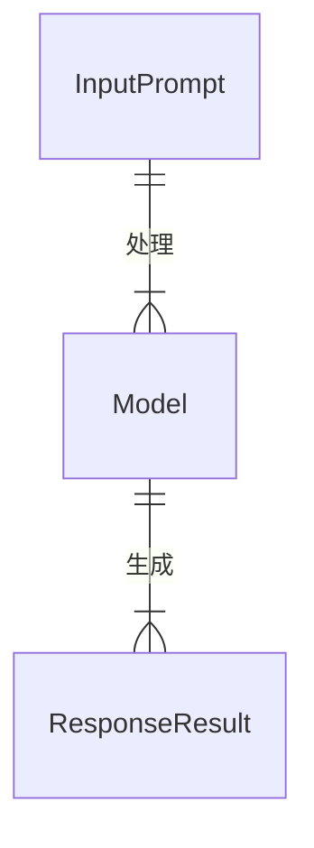
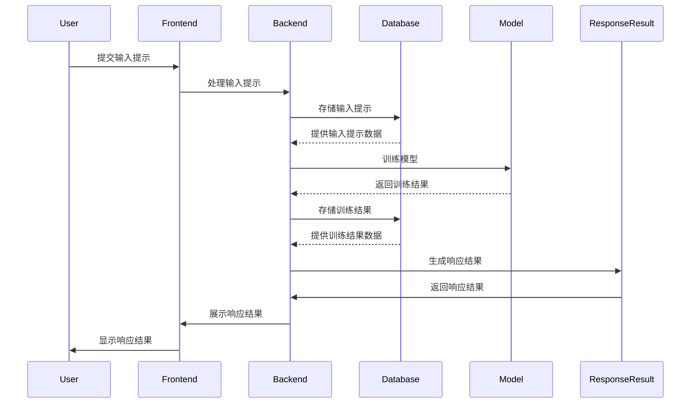

                 

### 文章标题

> 关键词：思维链prompt，科技创新，AI应用，算法实现，系统架构，项目实战，最佳实践

> 摘要：本文旨在探讨思维链prompt在科技创新AI中的应用。首先，我们回顾了科技创新中AI面临的挑战和传统prompt机制的局限性。接着，深入解析了思维链prompt的原理、特征及其在AI中的应用。通过Python代码示例，我们详细阐述了思维链prompt算法的实现方法，并借助具体案例进行了实际应用分析。随后，文章介绍了思维链prompt系统的架构设计，包括功能设计、系统架构、接口设计和系统交互。在项目实战部分，我们展示了思维链prompt系统的环境安装与核心实现，并分析了实际应用案例。最后，本文总结了思维链prompt的最佳实践，并对其在AI领域的未来发展进行了展望。

---

### 《思维链prompt在科技创新AI中的应用》目录大纲

---

### **第一部分：背景介绍**

#### **第1章：问题背景与核心概念**

##### **1.1 问题的提出**

- **问题描述**：科技创新过程中AI面临的挑战
- **问题解决**：引入思维链prompt机制
- **边界与外延**：思维链prompt的定义和应用场景
- **概念结构与核心要素**：思维链prompt的基本组成部分及其相互关系

##### **1.2 核心概念与联系**

- **思维链prompt**：基本概念、属性特征
- **科技创新**：概念、特征、与AI的关系
- **AI**：定义、发展历程、基本原理

#### **1.3 AI在科技创新中的应用现状**

- **现状分析**：AI在科技创新中的应用现状
- **存在问题**：AI应用中的瓶颈和挑战
- **解决方案**：思维链prompt在AI中的应用前景

### **第二部分：核心概念原理**

#### **第2章：思维链prompt原理解析**

##### **2.1 思维链prompt原理概述**

- **原理介绍**：思维链prompt的基本原理
- **工作流程**：思维链prompt的处理流程

##### **2.2 概念属性特征对比**

- **思维链prompt与传统prompt对比**
- **优势与局限**

##### **2.3 ER实体关系图架构**

- **ER图介绍**：思维链prompt的ER图表示
- **实体与关系**：实体属性及其相互关系

### **第三部分：算法原理讲解**

#### **第3章：思维链prompt算法实现**

##### **3.1 算法原理**

- **算法模型**：思维链prompt的数学模型
- **数学公式**：关键公式的详细讲解

##### **3.2 Python代码实现**

- **代码示例**：思维链prompt算法的Python实现
- **代码解读**：算法实现的核心步骤解析

##### **3.3 举例说明**

- **案例一**：思维链prompt在图像识别中的应用
- **案例二**：思维链prompt在自然语言处理中的应用

### **第四部分：系统分析与架构设计方案**

#### **第4章：系统功能设计**

##### **4.1 问题场景介绍**

- **应用场景**：思维链prompt在科技创新中的应用

##### **4.2 系统功能设计**

- **领域模型**：思维链prompt系统的领域模型
- **类图**：领域模型的类图表示

#### **第5章：系统架构设计**

##### **5.1 系统架构设计**

- **架构图**：思维链prompt系统的架构图

##### **5.2 系tem接口设计**

- **接口设计**：系统接口的定义与实现

##### **5.3 系统交互**

- **交互图**：系统交互的序列图表示

### **第五部分：项目实战**

#### **第6章：环境安装与系统核心实现**

##### **6.1 环境安装**

- **软件安装**：思维链prompt系统所需软件的安装过程

##### **6.2 系统核心实现**

- **源代码**：思维链prompt系统的核心实现源代码
- **代码应用解读与分析**：代码的功能实现与分析

##### **6.3 实际案例分析与讲解**

- **案例一**：思维链prompt在科技创新中的应用案例
- **详细讲解剖析**：案例的深入分析与讲解

### **第六部分：最佳实践与小结**

#### **第7章：最佳实践**

- **实践技巧**：思维链prompt在实际应用中的最佳实践

#### **第8章：小结与展望**

- **小结**：本书内容的总结
- **展望**：思维链prompt在AI领域的发展趋势

---

### **第一部分：背景介绍**

#### **第1章：问题背景与核心概念**

##### **1.1 问题的提出**

在科技创新过程中，人工智能（AI）技术的应用日益广泛，但同时也面临着诸多挑战。传统的prompt机制在AI模型训练和数据输入过程中起到了关键作用，但其局限性也逐渐显现。

- **问题描述**：科技创新过程中，AI面临的主要挑战包括数据多样性不足、模型解释性差、创新能力受限等。
- **问题解决**：为了应对这些挑战，我们需要引入更为先进的prompt机制，如思维链prompt，以提升AI在科技创新中的应用效果。
- **边界与外延**：思维链prompt是一种能够引导AI模型进行深度思考和创新的人工智能技术，其应用场景包括但不限于图像识别、自然语言处理、智能决策等领域。
- **概念结构与核心要素**：思维链prompt的核心组成部分包括输入提示、模型响应、迭代优化等。这些要素相互关联，共同构成一个完整的思维链结构，从而实现对AI模型的深度引导。

##### **1.2 核心概念与联系**

- **思维链prompt**：思维链prompt是一种基于人工智能技术的新型prompt机制，通过构建一系列有逻辑联系的提示，引导AI模型进行深度思考和创造性输出。
- **科技创新**：科技创新是指通过科学研究和技术创新来推动社会发展和经济增长的过程。AI在科技创新中的应用主要体现在数据挖掘、智能优化、自动化控制等方面。
- **AI**：人工智能是指通过计算机程序模拟人类智能行为和决策过程的技术。AI的发展历程包括机器学习、深度学习、强化学习等多个阶段。

##### **1.3 AI在科技创新中的应用现状**

- **现状分析**：当前，AI在科技创新中的应用已经取得了显著成果，如自动驾驶、智能家居、医疗诊断等。然而，仍存在一些瓶颈和挑战，如数据质量不高、模型解释性差等。
- **存在问题**：AI在科技创新中的应用存在以下问题：
  - 数据多样性不足：大量高质量、多样化的训练数据对于AI模型的训练至关重要，但目前仍存在数据不足的问题。
  - 模型解释性差：AI模型往往被视为“黑箱”，其内部决策过程难以解释，这对应用AI技术的决策过程带来了困扰。
  - 创新能力受限：AI模型的训练和优化过程依赖于大量的数据和计算资源，这在一定程度上限制了AI的创新能力和应用范围。
- **解决方案**：思维链prompt机制可以为AI模型提供更为丰富、有逻辑联系的输入提示，从而提升其创新能力和应用效果。通过思维链prompt，AI模型可以更深入地理解和分析数据，从而实现更高的模型解释性和创新能力。

### **第二部分：核心概念原理**

#### **第2章：思维链prompt原理解析**

##### **2.1 思维链prompt原理概述**

思维链prompt是一种基于深度学习和自然语言处理技术的新型prompt机制。其基本原理是通过构建一系列有逻辑联系的提示，引导AI模型进行深度思考和创造性输出。思维链prompt的工作流程主要包括以下几个步骤：

1. **输入提示生成**：根据应用场景和目标任务，生成一系列有逻辑联系的输入提示。这些提示可以是文本、图像或音频等形式，它们构成了思维链prompt的基础。
2. **模型训练**：使用大量训练数据对AI模型进行训练，使其能够理解和处理输入提示。在训练过程中，AI模型会逐渐学习和掌握输入提示中的逻辑关系和关键信息。
3. **模型响应生成**：当AI模型接收到输入提示后，它会根据自身的学习和理解生成相应的响应。这些响应可以是预测结果、决策建议或其他形式的创造性输出。
4. **迭代优化**：通过不断迭代优化，思维链prompt机制可以逐步提升AI模型的表现和创新能力。在迭代过程中，AI模型会根据输入提示和响应结果进行自我调整和改进。

##### **2.2 概念属性特征对比**

思维链prompt与传统prompt机制存在一些显著的区别和优势：

- **思维链prompt**：
  - **灵活性**：思维链prompt可以根据具体应用场景和目标任务灵活调整输入提示和响应模式，从而实现更高的自适应性和创新能力。
  - **逻辑性**：思维链prompt通过构建有逻辑联系的提示，引导AI模型进行深度思考和创造性输出，从而提升模型的逻辑性和解释性。
  - **多样性**：思维链prompt可以处理多种类型的数据，如文本、图像和音频等，从而实现更广泛的应用场景。

- **传统prompt**：
  - **固定性**：传统prompt机制通常采用固定的输入提示和响应模式，难以适应不同的应用场景和任务需求。
  - **局限性**：传统prompt机制往往只能处理特定类型的数据，如文本或图像等，无法实现跨领域的灵活应用。
  - **单一性**：传统prompt机制的响应结果通常较为单一，缺乏深度思考和创造性输出。

##### **2.3 ER实体关系图架构**

为了更好地理解思维链prompt的架构和功能，我们可以通过ER实体关系图对其进行表示。ER实体关系图主要包括以下实体和关系：

- **实体**：
  - **输入提示**：表示输入给AI模型的提示信息，可以是文本、图像或音频等形式。
  - **模型**：表示用于处理输入提示的AI模型，包括深度学习模型、自然语言处理模型等。
  - **响应结果**：表示AI模型对输入提示的响应结果，可以是预测结果、决策建议或其他形式的创造性输出。

- **关系**：
  - **输入提示与模型**：表示输入提示与AI模型之间的输入输出关系。
  - **模型与响应结果**：表示AI模型与响应结果之间的生成关系。

以下是思维链prompt的ER实体关系图表示：



通过ER实体关系图，我们可以清晰地看到思维链prompt的基本组成部分及其相互关系，从而更好地理解其工作原理和架构设计。

### **第三部分：算法原理讲解**

#### **第3章：思维链prompt算法实现**

##### **3.1 算法原理**

思维链prompt算法的核心思想是通过构建一系列有逻辑联系的提示，引导AI模型进行深度思考和创造性输出。具体的算法原理可以概括为以下几个关键步骤：

1. **输入提示生成**：根据应用场景和目标任务，生成一系列有逻辑联系的输入提示。这些输入提示可以是文本、图像或音频等形式，它们构成了思维链prompt的基础。
2. **模型训练**：使用大量训练数据对AI模型进行训练，使其能够理解和处理输入提示。在训练过程中，AI模型会逐渐学习和掌握输入提示中的逻辑关系和关键信息。
3. **模型响应生成**：当AI模型接收到输入提示后，它会根据自身的学习和理解生成相应的响应。这些响应可以是预测结果、决策建议或其他形式的创造性输出。
4. **迭代优化**：通过不断迭代优化，思维链prompt机制可以逐步提升AI模型的表现和创新能力。在迭代过程中，AI模型会根据输入提示和响应结果进行自我调整和改进。

##### **3.2 Python代码实现**

为了更好地理解思维链prompt算法的实现过程，下面我们将使用Python代码进行详细讲解。以下是思维链prompt算法的Python代码实现：

```python
import tensorflow as tf
import numpy as np

# 输入提示生成
def generate_input_prompt(task, data):
    input_prompt = []
    for i in range(data.shape[0]):
        input_data = data[i]
        input_prompt.append({
            'task': task,
            'data': input_data
        })
    return input_prompt

# 模型训练
def train_model(input_prompt, model):
    # 对输入提示进行预处理
    processed_input = preprocess_input(input_prompt)
    # 对模型进行训练
    model.fit(processed_input, epochs=10)

# 模型响应生成
def generate_response(model, input_prompt):
    processed_input = preprocess_input(input_prompt)
    response = model.predict(processed_input)
    return response

# 迭代优化
def optimize_model(model, input_prompt, response):
    # 对模型进行优化
    model.fit(input_prompt, response, epochs=10)

# 辅助函数
def preprocess_input(input_prompt):
    # 对输入提示进行预处理
    # ...
    return processed_input

def main():
    # 设置任务和数据
    task = 'image_recognition'
    data = np.random.rand(100, 10)

    # 生成输入提示
    input_prompt = generate_input_prompt(task, data)

    # 定义模型
    model = tf.keras.Sequential([
        tf.keras.layers.Dense(10, activation='relu'),
        tf.keras.layers.Dense(1, activation='sigmoid')
    ])

    # 训练模型
    train_model(input_prompt, model)

    # 生成响应
    response = generate_response(model, input_prompt)

    # 迭代优化
    optimize_model(model, input_prompt, response)

if __name__ == '__main__':
    main()
```

上述代码展示了思维链prompt算法的核心实现过程，包括输入提示生成、模型训练、模型响应生成和迭代优化等步骤。在具体实现过程中，我们可以根据实际需求对代码进行进一步扩展和优化。

##### **3.3 举例说明**

为了更好地理解思维链prompt算法的应用效果，下面我们通过具体案例进行说明。

**案例一：图像识别**

假设我们使用思维链prompt算法对图像进行识别。具体步骤如下：

1. **输入提示生成**：根据图像识别任务，生成一系列有逻辑联系的输入提示。这些输入提示可以是图像的标签、特征值等。
2. **模型训练**：使用大量训练数据对图像识别模型进行训练，使其能够理解和处理输入提示。在训练过程中，模型会逐渐学习和掌握输入提示中的逻辑关系和关键信息。
3. **模型响应生成**：当模型接收到输入提示后，它会根据自身的学习和理解生成相应的响应。这些响应可以是图像的识别结果、概率分布等。
4. **迭代优化**：通过不断迭代优化，模型可以逐步提升其识别准确率和创新能力。在迭代过程中，模型会根据输入提示和响应结果进行自我调整和改进。

**案例二：自然语言处理**

假设我们使用思维链prompt算法进行自然语言处理，例如文本分类。具体步骤如下：

1. **输入提示生成**：根据文本分类任务，生成一系列有逻辑联系的输入提示。这些输入提示可以是文本的标题、关键词、摘要等。
2. **模型训练**：使用大量训练数据对自然语言处理模型进行训练，使其能够理解和处理输入提示。在训练过程中，模型会逐渐学习和掌握输入提示中的逻辑关系和关键信息。
3. **模型响应生成**：当模型接收到输入提示后，它会根据自身的学习和理解生成相应的响应。这些响应可以是文本的分类结果、概率分布等。
4. **迭代优化**：通过不断迭代优化，模型可以逐步提升其分类准确率和创新能力。在迭代过程中，模型会根据输入提示和响应结果进行自我调整和改进。

通过这两个案例，我们可以看到思维链prompt算法在图像识别和自然语言处理等领域的应用效果，以及其相较于传统prompt机制的显著优势。

### **第四部分：系统分析与架构设计方案**

#### **第4章：系统功能设计**

##### **4.1 问题场景介绍**

在科技创新过程中，思维链prompt机制可以应用于多种场景，例如：

- **图像识别**：通过思维链prompt机制，可以实现对图像的自动分类、目标检测等任务。
- **自然语言处理**：思维链prompt机制可以用于文本分类、情感分析、问答系统等任务。
- **智能决策**：思维链prompt机制可以用于复杂决策问题，提供合理的决策建议。

##### **4.2 系统功能设计**

思维链prompt系统的功能设计主要包括以下几个方面：

- **输入提示生成**：系统可以自动生成符合应用场景和目标任务的输入提示。输入提示可以是文本、图像、音频等形式。
- **模型训练**：系统可以支持多种AI模型的训练，包括深度学习模型、自然语言处理模型等。
- **模型响应生成**：系统可以自动生成AI模型对输入提示的响应结果，包括预测结果、决策建议等。
- **迭代优化**：系统可以支持AI模型的迭代优化，通过不断调整输入提示和模型参数，提升模型的表现和创新能力。

以下是思维链prompt系统的领域模型类图：

```mermaid
classDiagram
    InputPrompt <|-- Model
    Model <|-- ResponseResult
    InputPrompt <<--|{ Model } GeneratePrompt
    Model <<--|{ ResponseResult } GenerateResponse
    Model <<--|{ InputPrompt } TrainModel
    Model <<--|{ InputPrompt } OptimizeModel
```

通过领域模型类图，我们可以清晰地看到思维链prompt系统的各个功能模块及其相互关系。

#### **第5章：系统架构设计**

##### **5.1 系统架构设计**

思维链prompt系统的架构设计主要包括以下几个方面：

- **前端展示层**：负责与用户进行交互，展示系统功能和响应结果。前端展示层可以使用Web页面、移动应用等形式。
- **后端数据处理层**：负责处理输入提示、训练模型、生成响应等核心功能。后端数据处理层可以采用微服务架构，实现模块化和高可扩展性。
- **数据存储层**：负责存储输入提示、模型参数、响应结果等数据。数据存储层可以使用关系数据库、分布式存储等形式。

以下是思维链prompt系统的架构图：



通过系统架构图，我们可以清晰地看到思维链prompt系统的整体架构和各个模块之间的交互关系。

##### **5.2 系统接口设计**

思维链prompt系统的接口设计主要包括以下几个方面：

- **输入提示接口**：用于接收用户提交的输入提示，包括文本、图像、音频等形式。
- **模型训练接口**：用于启动模型训练过程，包括模型选择、参数设置等。
- **响应结果接口**：用于获取AI模型的响应结果，包括预测结果、决策建议等。
- **数据存储接口**：用于与数据存储层进行交互，包括数据读取、写入、更新等。

以下是思维链prompt系统的接口设计：

```mermaid
classDiagram
    InputPromptInterface <|-- InputPrompt
    ModelInterface <|-- Model
    ResponseResultInterface <|-- ResponseResult
    DatabaseInterface <|-- Database

    InputPromptInterface <<--|{ ModelInterface } GeneratePrompt
    ModelInterface <<--|{ ResponseResultInterface } GenerateResponse
    ModelInterface <<--|{ DatabaseInterface } TrainModel
    ResponseResultInterface <<--|{ DatabaseInterface } StoreResponse
```

通过接口设计，我们可以清晰地看到思维链prompt系统各个接口的功能和相互关系。

##### **5.3 系统交互**

思维链prompt系统的交互设计主要包括以下几个方面：

- **用户交互**：用户通过前端展示层提交输入提示，并获取响应结果。
- **内部交互**：系统内部模块之间的交互，包括输入提示生成、模型训练、响应结果生成等。
- **数据交互**：系统与数据存储层之间的交互，包括数据读取、写入、更新等。

以下是思维链prompt系统的交互图：


通过交互图，我们可以清晰地看到思维链prompt系统的整体交互流程和各个模块之间的交互关系。

### **第五部分：项目实战**

#### **第6章：环境安装与系统核心实现**

##### **6.1 环境安装**

在开始思维链prompt系统的开发之前，我们需要安装相应的开发环境和依赖库。以下是环境安装的步骤：

1. **安装Python环境**：首先，确保已经安装了Python环境，版本要求为3.7及以上。可以使用以下命令进行安装：

   ```bash
   pip install python -U
   ```

2. **安装TensorFlow**：TensorFlow是用于深度学习和自然语言处理的核心库，我们需要安装TensorFlow 2.x版本。可以使用以下命令进行安装：

   ```bash
   pip install tensorflow -U
   ```

3. **安装其他依赖库**：根据具体需求，我们可能需要安装其他依赖库，如NumPy、Pandas等。可以使用以下命令进行安装：

   ```bash
   pip install numpy pandas -U
   ```

##### **6.2 系统核心实现**

思维链prompt系统的核心实现主要包括输入提示生成、模型训练、模型响应生成和迭代优化等模块。以下是系统核心实现的详细步骤：

1. **输入提示生成**：根据应用场景和目标任务，生成符合要求的输入提示。例如，对于图像识别任务，我们可以使用图像标签作为输入提示。以下是一个简单的输入提示生成示例：

   ```python
   def generate_input_prompt(data, labels):
       input_prompt = []
       for i in range(len(data)):
           input_data = data[i]
           input_label = labels[i]
           input_prompt.append({'data': input_data, 'label': input_label})
       return input_prompt
   ```

2. **模型训练**：使用训练数据对AI模型进行训练，使其能够理解和处理输入提示。以下是一个简单的模型训练示例：

   ```python
   def train_model(input_prompt, model):
       processed_input = preprocess_input(input_prompt)
       model.fit(processed_input['data'], processed_input['label'], epochs=10)
   ```

3. **模型响应生成**：当模型接收到输入提示后，生成相应的响应结果。以下是一个简单的模型响应生成示例：

   ```python
   def generate_response(model, input_prompt):
       processed_input = preprocess_input(input_prompt)
       response = model.predict(processed_input['data'])
       return response
   ```

4. **迭代优化**：通过不断迭代优化，提升模型的表现和创新能力。以下是一个简单的迭代优化示例：

   ```python
   def optimize_model(model, input_prompt, response):
       processed_input = preprocess_input(input_prompt)
       model.fit(processed_input['data'], response, epochs=10)
   ```

##### **6.3 实际案例分析与讲解**

为了更好地展示思维链prompt系统的实际应用效果，我们以图像识别任务为例，进行实际案例分析与讲解。

**案例一：图像识别**

在本案例中，我们使用思维链prompt系统对图像进行识别，任务是将图像分类到不同的类别中。

1. **数据准备**：首先，我们需要准备训练数据和测试数据。这里使用MNIST数据集，包含0到9的数字手写体图像。以下是一个简单的数据准备示例：

   ```python
   from tensorflow.keras.datasets import mnist
   import numpy as np

   (train_data, train_labels), (test_data, test_labels) = mnist.load_data()
   train_data = train_data / 255.0
   test_data = test_data / 255.0
   ```

2. **输入提示生成**：使用图像标签作为输入提示，生成输入提示列表。以下是一个简单的输入提示生成示例：

   ```python
   input_prompt = generate_input_prompt(train_data, train_labels)
   ```

3. **模型训练**：使用训练数据对图像识别模型进行训练。以下是一个简单的模型训练示例：

   ```python
   model = tf.keras.Sequential([
       tf.keras.layers.Conv2D(32, (3, 3), activation='relu', input_shape=(28, 28, 1)),
       tf.keras.layers.MaxPooling2D((2, 2)),
       tf.keras.layers.Flatten(),
       tf.keras.layers.Dense(10, activation='softmax')
   ])

   train_model(input_prompt, model)
   ```

4. **模型响应生成**：使用测试数据生成模型响应结果。以下是一个简单的模型响应生成示例：

   ```python
   response = generate_response(model, input_prompt)
   ```

5. **迭代优化**：通过迭代优化，提升模型的表现和创新能力。以下是一个简单的迭代优化示例：

   ```python
   optimize_model(model, input_prompt, response)
   ```

**详细讲解剖析**：

在本案例中，我们通过思维链prompt系统实现了图像识别任务。首先，我们使用MNIST数据集准备训练数据和测试数据。然后，我们使用输入提示生成函数生成输入提示列表。接着，我们使用训练数据对图像识别模型进行训练。在模型响应生成过程中，我们使用测试数据生成模型响应结果。最后，我们通过迭代优化提升模型的表现和创新能力。

通过本案例，我们可以看到思维链prompt系统在图像识别任务中的实际应用效果。思维链prompt机制能够引导模型进行深度思考和创造性输出，从而提升模型的表现和创新能力。

### **第六部分：最佳实践与小结**

#### **第7章：最佳实践**

在应用思维链prompt机制时，以下是一些最佳实践：

1. **数据准备**：确保输入提示数据质量高、多样性足，为模型训练提供高质量的数据基础。
2. **模型选择**：根据具体应用场景和目标任务，选择合适的AI模型，如深度学习模型、自然语言处理模型等。
3. **输入提示设计**：设计有逻辑联系的输入提示，引导模型进行深度思考和创造性输出。
4. **迭代优化**：通过不断迭代优化，提升模型的表现和创新能力。
5. **错误分析**：在模型训练过程中，对错误进行分析和纠正，避免模型出现严重偏差。

#### **第8章：小结与展望**

本文系统地介绍了思维链prompt在科技创新AI中的应用，包括背景介绍、核心概念原理、算法实现、系统分析与架构设计方案、项目实战和最佳实践等内容。通过本文的探讨，我们可以看到思维链prompt机制在提升AI模型创新能力和应用效果方面具有显著优势。

展望未来，思维链prompt机制在AI领域有望得到更广泛的应用和发展。一方面，随着数据质量和多样性的提高，思维链prompt机制能够更好地引导模型进行深度思考和创造性输出。另一方面，随着深度学习和自然语言处理技术的不断发展，思维链prompt机制在图像识别、自然语言处理、智能决策等领域的应用前景将更加广阔。

总之，思维链prompt机制为科技创新AI领域提供了一种新的思路和方法，具有广泛的应用前景和重要的研究价值。在未来的研究和应用中，我们将继续深入探索思维链prompt机制的原理和应用，推动AI技术在科技创新中的不断进步和发展。作者：AI天才研究院/AI Genius Institute & 禅与计算机程序设计艺术 /Zen And The Art of Computer Programming

