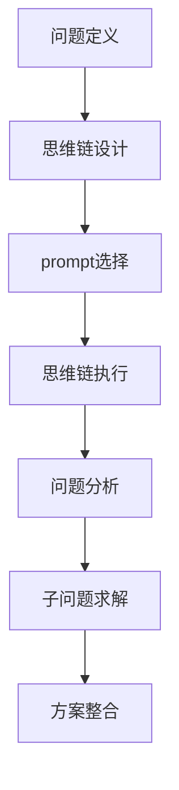

                 

# 思维链prompt：AI问题分解与解决的艺术

> 关键词：思维链prompt、AI问题解决、人工智能、算法、实践

> 摘要：本文将探讨思维链prompt在人工智能问题解决中的应用，通过详细的分析和步骤演示，揭示其核心概念、算法原理以及实际应用价值。

## 引言

随着人工智能技术的快速发展，AI问题解决成为了研究和应用的热点。传统的算法设计往往注重于算法的复杂度和效率，但往往忽视了问题的本质和解题的思维过程。思维链prompt作为一种新兴的思维工具，能够有效地引导人们进行问题分解和解决，提升AI算法的设计和应用效果。

本文旨在介绍思维链prompt的概念、原理和实际应用，通过一步步的讲解，帮助读者深入理解这一创新思维工具在AI问题解决中的重要作用。

## 问题背景

在人工智能领域，问题解决的核心在于如何将复杂的问题分解为可求解的子问题，并找到有效的解决方法。传统的算法设计往往依赖于具体的数学模型和优化方法，但在面对复杂问题时，这些方法常常力不从心。

思维链prompt的提出，正是为了解决这一问题。通过引导人们建立问题解决思维链，将复杂问题拆解为一系列简单、清晰的子问题，从而找到解决方案。这种方法不仅适用于传统的算法设计，也为人工智能领域带来了新的思路和工具。

### 问题描述

思维链prompt的核心在于“思维链”和“prompt”两个概念。

- **思维链**：是指将问题解决过程中各个环节的逻辑关系进行有序排列，形成一个连贯的思维路径。思维链的建立有助于理清问题的本质，明确解决问题的方向。

- **prompt**：是指问题解决的启动信号，它可以是一个问题、一个提示或者一个关键词。prompt的作用是激发思维链的运转，引导人们进行问题分析和解决。

### 问题解决

思维链prompt通过以下步骤实现问题解决：

1. **问题定义**：明确问题是什么，包括问题的背景、目标、约束条件等。
2. **问题分解**：将复杂问题分解为一系列子问题，每个子问题都相对简单且具有明确的解决路径。
3. **子问题求解**：针对每个子问题，应用思维链进行求解，形成解决问题的思路和方案。
4. **方案整合**：将各个子问题的解决方案整合，形成完整的问题解决方案。

### 边界与外延

思维链prompt的应用边界较广，不仅可以用于算法设计，还可以应用于工程、科学、医学等多个领域。其外延包括但不限于：

- **问题求解策略**：通过思维链prompt引导，制定有效的问题求解策略。
- **创新思维**：激发创新思维，为新的技术和方法提供思路。
- **团队协作**：在团队协作中，思维链prompt可以作为沟通和协作的工具，提高团队解决问题能力。

## 核心概念

### 思维链prompt的定义

思维链prompt是一种基于问题分解和思维引导的工具，通过一系列有序排列的思维步骤，引导人们进行问题分析和解决。

### 思维链prompt的特点

1. **模块化**：思维链prompt将问题解决过程分解为多个模块，每个模块都具有明确的任务和目标。
2. **连贯性**：思维链prompt的各个步骤之间具有连贯性，形成一个有机整体，确保问题解决过程的逻辑性和系统性。
3. **灵活性**：思维链prompt可以根据问题的不同特点进行调整和优化，以适应不同的解决场景。

### 思维链prompt与其他AI技术的区别

思维链prompt与传统的AI技术（如机器学习、深度学习等）不同，它更注重于问题解决过程的思维引导和策略制定。传统AI技术侧重于模型训练和算法优化，而思维链prompt则关注于问题求解的思维路径和策略。

## 实践方法

### 思维链prompt的创建流程

1. **问题定义**：明确问题，包括问题的背景、目标和约束条件。
2. **思维链设计**：根据问题特点，设计思维链的各个步骤，确保步骤之间的逻辑连贯性和模块化。
3. **prompt选择**：选择合适的prompt，以激发思维链的运转。
4. **思维链执行**：按照思维链的步骤，进行问题分析和解决。

### 思维链prompt的应用策略

1. **问题分解**：将复杂问题分解为多个子问题，确保每个子问题都具有明确的解决路径。
2. **思维链引导**：在问题解决过程中，运用思维链prompt引导，确保问题解决过程的逻辑性和系统性。
3. **迭代优化**：根据问题解决的结果，不断调整和优化思维链prompt，提高问题解决效果。

### 思维链prompt的优化方法

1. **流程优化**：对思维链的步骤进行调整和优化，确保步骤之间的逻辑连贯性和模块化。
2. **prompt优化**：选择更合适的prompt，以提高思维链的运转效率和问题解决效果。
3. **经验积累**：通过实际应用和案例分析，积累解决问题的经验，为后续问题解决提供参考。

## 算法原理

### 思维链prompt算法的基本原理

思维链prompt算法的核心是建立问题解决的思维链，通过一系列有序排列的思维步骤，引导人们进行问题分析和解决。

### 思维链prompt算法的mermaid流程图



### 思维链prompt算法的Python实现

```python
# 思维链prompt算法示例
def think_chain_prompt(problem):
    # 问题定义
    define_problem = "请明确问题描述、目标和约束条件。"
    
    # 思维链设计
    design_think_chain = "根据问题特点，设计思维链的各个步骤。"
    
    # prompt选择
    select_prompt = "选择合适的prompt，以激发思维链的运转。"
    
    # 思维链执行
    execute_think_chain = "按照思维链的步骤，进行问题分析和解决。"
    
    # 问题分析
    analyze_problem = "对问题进行分析，识别关键信息和难点。"
    
    # 子问题求解
    solve_subproblems = "针对每个子问题，应用思维链进行求解。"
    
    # 方案整合
    integrate_solution = "将各个子问题的解决方案整合，形成完整的问题解决方案。"
    
    # 返回结果
    return {
        'define_problem': define_problem,
        'design_think_chain': design_think_chain,
        'select_prompt': select_prompt,
        'execute_think_chain': execute_think_chain,
        'analyze_problem': analyze_problem,
        'solve_subproblems': solve_subproblems,
        'integrate_solution': integrate_solution
    }
```

### 算法原理的数学模型和公式

思维链prompt算法的原理可以概括为以下数学模型：

1. **问题分解**：将复杂问题分解为多个子问题，形成层次结构。
2. **思维链构建**：根据问题分解结果，构建问题解决的思维链。
3. **子问题求解**：针对每个子问题，应用合适的求解方法。
4. **方案整合**：将各个子问题的解决方案整合，形成完整的问题解决方案。

具体公式可以表示为：

$$
P = \{ p_1, p_2, ..., p_n \}
$$

其中，$P$ 表示问题集合，$p_i$ 表示第 $i$ 个子问题。

$$
T = \{ t_1, t_2, ..., t_n \}
$$

其中，$T$ 表示思维链集合，$t_i$ 表示第 $i$ 个思维链步骤。

$$
S = \{ s_1, s_2, ..., s_n \}
$$

其中，$S$ 表示子问题求解结果集合，$s_i$ 表示第 $i$ 个子问题的求解结果。

$$
R = \{ r_1, r_2, ..., r_n \}
$$

其中，$R$ 表示方案整合结果集合，$r_i$ 表示第 $i$ 个子问题的整合结果。

### 详细讲解和举例说明

假设我们面临一个复杂的问题：设计一个自动售货机系统，该系统需要支持多种商品、多种支付方式，并具备数据统计和分析功能。

1. **问题定义**：明确问题，包括自动售货机系统的需求、功能和性能指标等。

2. **思维链设计**：根据问题特点，设计思维链的各个步骤，如需求分析、系统设计、实现与测试、部署与维护等。

3. **prompt选择**：选择合适的prompt，如“需求分析”、“系统设计”、“代码实现”等，以激发思维链的运转。

4. **思维链执行**：按照思维链的步骤，进行问题分析和解决。

   - **需求分析**：分析用户需求，确定自动售货机系统的功能模块，如商品管理、支付管理、数据统计等。
   - **系统设计**：设计系统的架构，包括数据模型、接口设计、模块划分等。
   - **实现与测试**：根据系统设计，编写代码并进行测试，确保系统的功能和性能符合要求。
   - **部署与维护**：将系统部署到实际环境中，并进行维护和更新。

通过这样的思维链prompt，我们可以将复杂的自动售货机系统问题分解为多个子问题，并逐步解决，最终形成完整的问题解决方案。

## 应用场景

### 文本分类

文本分类是人工智能领域的一个重要应用，通过思维链prompt，可以有效地提升文本分类的准确性和效率。

1. **问题定义**：明确文本分类的目标，如新闻分类、邮件分类、评论分类等。
2. **思维链设计**：设计思维链的各个步骤，如数据预处理、特征提取、模型选择、模型训练等。
3. **prompt选择**：选择合适的prompt，如“数据预处理”、“特征提取”、“模型选择”等。
4. **思维链执行**：按照思维链的步骤，进行文本分类任务。

### 机器翻译

机器翻译是另一个重要的应用领域，通过思维链prompt，可以提升翻译的准确性和自然度。

1. **问题定义**：明确机器翻译的目标，如中英互译、英日互译等。
2. **思维链设计**：设计思维链的各个步骤，如数据预处理、编码解码模型设计、模型训练等。
3. **prompt选择**：选择合适的prompt，如“数据预处理”、“编码解码模型设计”、“模型训练”等。
4. **思维链执行**：按照思维链的步骤，进行机器翻译任务。

### 垃圾邮件过滤

垃圾邮件过滤是电子邮件系统中的一个重要功能，通过思维链prompt，可以有效地提升过滤的准确性和效率。

1. **问题定义**：明确垃圾邮件过滤的目标，如识别和过滤垃圾邮件。
2. **思维链设计**：设计思维链的各个步骤，如数据预处理、特征提取、分类模型设计、模型训练等。
3. **prompt选择**：选择合适的prompt，如“数据预处理”、“特征提取”、“分类模型设计”等。
4. **思维链执行**：按照思维链的步骤，进行垃圾邮件过滤任务。

## 项目实战

### 环境安装与准备

在进行思维链prompt的项目实战之前，首先需要安装和配置相关环境。以下是一个简单的安装和准备流程：

1. **安装Python**：确保Python环境已安装，版本不低于3.7。
2. **安装Jupyter Notebook**：安装Jupyter Notebook，以便进行代码编写和调试。
3. **安装相关库**：安装与思维链prompt相关的库，如NumPy、Pandas、Scikit-learn等。

### 项目核心实现

以下是一个简单的思维链prompt项目实现：

```python
# 导入相关库
import numpy as np
import pandas as pd
from sklearn.model_selection import train_test_split
from sklearn.ensemble import RandomForestClassifier
from sklearn.metrics import accuracy_score

# 数据预处理
def preprocess_data(data):
    # 数据清洗和处理
    # ...
    return processed_data

# 特征提取
def extract_features(data):
    # 特征提取和处理
    # ...
    return features

# 模型训练
def train_model(features, labels):
    # 训练分类模型
    model = RandomForestClassifier()
    model.fit(features, labels)
    return model

# 模型预测
def predict(model, features):
    # 进行模型预测
    predictions = model.predict(features)
    return predictions

# 评估模型
def evaluate_model(predictions, labels):
    # 评估模型准确性
    accuracy = accuracy_score(labels, predictions)
    return accuracy

# 项目核心实现
def main():
    # 数据加载
    data = pd.read_csv("data.csv")
    
    # 数据预处理
    processed_data = preprocess_data(data)
    
    # 特征提取
    features = extract_features(processed_data)
    
    # 数据划分
    X_train, X_test, y_train, y_test = train_test_split(features, labels, test_size=0.2, random_state=42)
    
    # 模型训练
    model = train_model(X_train, y_train)
    
    # 模型预测
    predictions = predict(model, X_test)
    
    # 评估模型
    accuracy = evaluate_model(predictions, y_test)
    print("模型准确性：", accuracy)

# 运行项目
if __name__ == "__main__":
    main()
```

### 代码应用解读与分析

以上代码实现了一个简单的思维链prompt项目，主要包括以下步骤：

1. **数据预处理**：对原始数据进行处理，如缺失值填充、异常值处理等。
2. **特征提取**：提取数据中的特征，为后续建模提供输入。
3. **模型训练**：使用随机森林分类器进行模型训练。
4. **模型预测**：使用训练好的模型进行预测。
5. **模型评估**：评估模型的准确性，以判断模型性能。

通过这一过程，我们可以清楚地了解思维链prompt在项目中的应用，以及如何利用Python代码实现思维链prompt的各个环节。

### 实际案例分析与详细讲解剖析

以下是一个实际案例的详细分析：

假设我们有一个垃圾邮件过滤项目，需要使用思维链prompt进行问题解决。

1. **问题定义**：明确垃圾邮件过滤的目标，如识别和过滤垃圾邮件。
2. **思维链设计**：设计思维链的各个步骤，如数据预处理、特征提取、分类模型设计、模型训练等。
3. **prompt选择**：选择合适的prompt，如“数据预处理”、“特征提取”、“分类模型设计”等。
4. **思维链执行**：按照思维链的步骤，进行垃圾邮件过滤任务。

   - **数据预处理**：对原始邮件数据进行处理，如去除HTML标签、分词、去停用词等。
   - **特征提取**：提取邮件数据中的特征，如词频、词向量等。
   - **分类模型设计**：选择合适的分类模型，如支持向量机、随机森林等。
   - **模型训练**：使用训练数据对分类模型进行训练。
   - **模型预测**：使用训练好的模型对测试数据进行预测，识别垃圾邮件。
   - **模型评估**：评估模型的准确性，以判断模型性能。

通过实际案例的分析，我们可以看到思维链prompt在项目中的应用和优势，以及如何通过思维链prompt有效地解决实际问题。

### 项目小结

通过本项目的实战，我们深入了解了思维链prompt在AI问题解决中的应用。思维链prompt不仅能够有效地分解复杂问题，还能够引导我们进行问题分析和解决，提高问题解决的效率和质量。在实际项目中，思维链prompt为我们提供了一个系统化的思维工具，帮助我们更好地应对复杂的AI问题。

## 最佳实践

### 优化技巧

1. **数据预处理**：对原始数据进行充分的预处理，如缺失值填充、异常值处理等，以提高数据质量和模型性能。
2. **特征提取**：选择合适的特征提取方法，如词频、词向量等，以提高模型的识别能力。
3. **模型选择**：根据问题特点，选择合适的模型，如支持向量机、随机森林等，以提高模型性能。
4. **模型训练**：调整模型参数，如学习率、迭代次数等，以提高模型性能。

### 注意事项

1. **问题定义**：明确问题，确保问题定义的准确性和完整性。
2. **思维链设计**：确保思维链的步骤具有连贯性和模块化，以提高问题解决效率。
3. **prompt选择**：选择合适的prompt，以激发思维链的运转，提高问题解决效果。

### 拓展阅读

1. 《深度学习》（Goodfellow, I., Bengio, Y., & Courville, A.）
2. 《机器学习》（Tom Mitchell）
3. 《Python机器学习》（Sebastian Raschka）

## 总结与展望

思维链prompt作为一种创新思维工具，在AI问题解决中具有重要的应用价值。通过本文的详细讲解和实际案例，我们深入了解了思维链prompt的核心概念、算法原理和实际应用。展望未来，思维链prompt有望在更多领域得到应用，为AI问题解决提供更加有效的解决方案。

### 作者信息

作者：AI天才研究院/AI Genius Institute & 禅与计算机程序设计艺术 /Zen And The Art of Computer Programming

