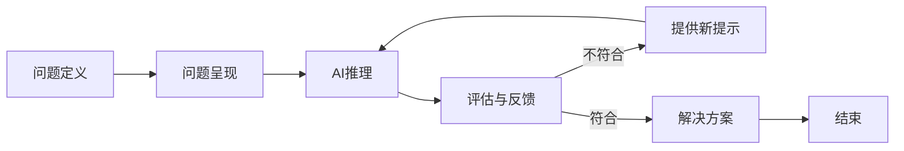
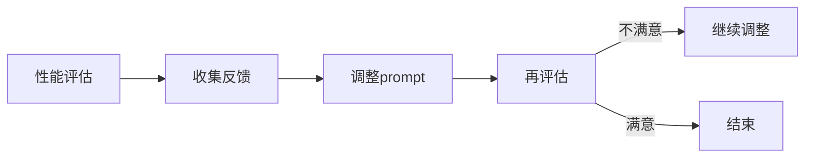

                 

### 引言与背景

近年来，随着深度学习和自然语言处理技术的飞速发展，人工智能（AI）已经逐渐渗透到我们生活的方方面面。从自动驾驶汽车到智能语音助手，从推荐系统到医疗诊断，AI正在不断改变着世界。然而，尽管AI在处理大量数据和执行重复性任务方面表现出色，但在理解复杂问题、进行推理和创新方面，AI仍然显得力不从心。这时，思维链prompt（Mind Prompt Chain）的概念应运而生，它旨在让AI像人类一样step-by-step地思考，从而更好地模拟人类的思维方式，提升AI的推理能力。

#### 思维链prompt的定义与作用

思维链prompt是一种交互式方法，通过向AI系统提供一系列逐步引导的问题和提示，引导AI进行逻辑推理和思考，从而模拟人类解决复杂问题的过程。思维链prompt的核心在于将复杂问题分解成一系列简单、可操作的步骤，通过逐步引导和反馈机制，帮助AI逐步构建解决方案。

思维链prompt的作用主要体现在以下几个方面：

1. **提升推理能力**：通过逐步引导，AI可以学习如何像人类一样推理，从而在面对复杂问题时能够更加灵活地应对。
2. **增强自主学习能力**：通过不断的反馈和调整，AI可以在实践中不断优化和改进自己的推理过程，从而实现自我提升。
3. **改善问题解决方法**：思维链prompt可以帮助AI发现问题的不同方面，从而探索出更多可能的解决方案。

#### AI思维链prompt的发展历程

AI思维链prompt并不是一个全新的概念，其发展可以追溯到人工智能早期的研究。以下是AI思维链prompt的发展历程：

1. **早期探索**：在20世纪60年代，AI研究人员开始尝试使用符号逻辑和规则系统来模拟人类的思维过程。这些方法虽然在一定程度上模拟了人类思维，但存在局限性，无法处理复杂的问题。
2. **知识表示与推理**：20世纪80年代，基于知识表示和推理的方法开始流行。这些方法通过建立知识库和推理规则，试图模拟人类的知识组织和推理过程。然而，由于知识表示的复杂性，这些方法在实际应用中面临诸多挑战。
3. **深度学习与强化学习**：随着深度学习和强化学习技术的发展，AI的推理能力得到了显著提升。现代AI系统可以通过大量的数据和自我学习，逐步提升推理能力。思维链prompt在这个阶段得到了新的发展，通过结合深度学习和强化学习技术，进一步优化了AI的推理过程。
4. **当前趋势**：近年来，随着自然语言处理技术的进步，思维链prompt的应用场景逐渐扩大。通过结合预训练模型和思维链prompt，AI可以在处理自然语言任务时表现出色。

#### 为什么让AI像人类一样step-by-step思考

让AI像人类一样step-by-step思考具有重要的意义。首先，这种方法可以帮助AI更好地理解复杂问题，从而提高问题的解决能力。其次，通过逐步引导和反馈机制，AI可以不断优化自己的推理过程，实现自我提升。最后，思维链prompt可以促进AI与其他领域的交叉融合，如医疗、金融、教育等，为这些领域带来新的突破。

总之，思维链prompt作为一种新兴的方法，为AI的发展提供了新的思路。通过逐步引导和模拟人类思维，AI有望在解决复杂问题方面取得更大的进展。在接下来的章节中，我们将深入探讨思维链prompt的核心原理、实际应用、构建方法以及未来发展趋势，希望为您带来新的启发和思考。让我们继续探索这一充满潜力的领域。### 思维链prompt的核心原理

思维链prompt的设计和实现离不开其核心原理的支持。理解这些原理不仅有助于我们更好地构建和优化思维链prompt，还能帮助我们更好地理解AI的推理过程。

#### Prompt设计的基本原则

思维链prompt的设计需要遵循一些基本原则，以确保其有效性和可操作性。以下是几个关键原则：

1. **逐步引导**：思维链prompt的设计应该逐步引导AI进行思考和推理。这要求我们在设计问题时，不仅要明确目标，还要将问题分解成一系列子问题，逐步引导AI进行解决。

2. **相关性**：设计问题时，应确保问题与AI的能力和目标紧密相关。相关性强的问题可以提高AI的推理效率，避免无意义的计算和尝试。

3. **多样性**：问题应具备多样性，以激发AI的不同思考路径。通过多样化的提问，可以探索AI在不同场景下的表现，从而发现其推理过程中的潜在问题和改进点。

4. **适应性**：思维链prompt应该能够根据AI的回答动态调整。AI在推理过程中可能会出现错误或困惑，此时prompt需要能够适应这些变化，提供新的引导和提示。

5. **反馈机制**：设计时应包含反馈机制，通过评估AI的回答，为下一步的推理提供指导。有效的反馈机制可以帮助AI不断优化推理过程，提高问题解决能力。

#### 思维链prompt的工作机制

思维链prompt的工作机制可以分为以下几个步骤：

1. **问题定义**：首先，明确需要解决的问题，并将其分解成一系列子问题。

2. **问题呈现**：将子问题以适当的形式呈现给AI，以便AI能够理解问题并开始推理。

3. **AI推理**：AI根据问题和提示进行推理，生成可能的答案或解决方案。

4. **评估与反馈**：评估AI的答案，如果不符合预期，则提供新的提示和问题，引导AI继续推理。

5. **迭代优化**：通过不断的迭代和优化，AI逐步提升推理能力，最终达到解决问题的目标。

以下是一个简化的思维链prompt工作机制的mermaid流程图：



#### Prompt设计与人类思维模式的联系

思维链prompt的设计不仅需要遵循技术原则，还应与人类思维模式相联系，以更好地模拟人类推理过程。以下是思维链prompt与人类思维模式的一些联系：

1. **模块化思维**：人类在解决问题时，往往会将问题分解成若干个模块，逐一解决。思维链prompt的设计也应采用模块化的思路，将复杂问题分解成简单子问题。

2. **联想思维**：人类在推理过程中，会通过联想和类比来探索不同的解决方案。思维链prompt可以通过多样化的提问，激发AI的联想思维，从而探索更多可能的解决方案。

3. **反思与调整**：人类在推理过程中，会不断地反思和调整思路，以优化问题解决方法。思维链prompt应包含反馈机制，允许AI在推理过程中进行反思和调整。

4. **情境感知**：人类在不同情境下，会采用不同的推理策略。思维链prompt的设计应考虑情境感知，根据不同的场景提供适当的引导和提示。

以下是一个ER实体关系图架构的Mermaid流程图，展示了思维链prompt设计中的实体及其关系：

```mermaid
erDiagram
    Problem ||--|{ SubProblem } SubProblem
    Prompt ||--|{ Answer } Answer
    AI ||--|{ Feedback } Feedback
    Feedback ||--|{ Prompt } Prompt
    SubProblem ||--|{ Solution } Solution
    Solution ||--|{ Problem } Problem
```

通过上述设计与人类思维模式的联系，我们可以更好地理解思维链prompt的工作原理，并在此基础上进行优化和创新。

总之，思维链prompt的核心原理不仅包括技术层面的设计原则和机制，还与人类思维模式密切相关。理解这些原理，有助于我们更有效地构建和优化思维链prompt，提升AI的推理能力。在接下来的章节中，我们将进一步探讨思维链prompt在实际应用中的表现，以及如何构建有效的思维链prompt。### 思维链prompt的实际应用

思维链prompt作为一种高效的推理引导方法，已经在多个领域得到了广泛应用。下面我们将探讨思维链prompt在自然语言处理、计算机视觉和强化学习等领域的具体应用，并分析其效果和优势。

#### 在自然语言处理中的应用

自然语言处理（NLP）是AI领域的一个重要分支，涉及文本的理解、生成和转换。思维链prompt在NLP中的应用主要体现在以下几个方面：

1. **文本生成**：通过思维链prompt，可以引导AI生成高质量的自然语言文本。例如，在写作辅助工具中，思维链prompt可以帮助AI逐步构建文章的框架和内容，从而生成连贯、逻辑清晰的文本。

2. **情感分析**：思维链prompt可以通过逐步引导，帮助AI理解文本的情感倾向。例如，在社交媒体分析中，思维链prompt可以引导AI识别并分析用户评论的情感，从而为品牌提供有价值的反馈。

3. **问答系统**：思维链prompt可以优化问答系统的回答质量。通过逐步引导，AI可以更好地理解用户的问题，并提供更准确、详细的回答。

一个典型的应用案例是OpenAI的GPT-3模型。GPT-3是一个基于大规模预训练的语言模型，通过思维链prompt，可以生成高质量的文本，并在各种NLP任务中表现出色。

#### 在计算机视觉中的应用

计算机视觉（CV）是AI领域的另一个重要分支，涉及图像和视频的分析和理解。思维链prompt在CV中的应用主要体现在以下几个方面：

1. **目标检测**：通过思维链prompt，可以引导AI识别图像中的目标。例如，在自动驾驶系统中，思维链prompt可以帮助AI逐步检测和识别道路上的车辆、行人等目标。

2. **图像分类**：思维链prompt可以引导AI对图像进行分类。例如，在医疗图像分析中，思维链prompt可以帮助AI逐步分析医学图像，并识别其中的病变区域。

3. **图像生成**：思维链prompt可以引导AI生成符合特定要求的图像。例如，在艺术创作中，思维链prompt可以帮助AI生成具有特定风格或主题的图像。

一个典型的应用案例是DeepMind的DQN模型。DQN是一个基于深度学习的强化学习模型，通过思维链prompt，可以训练AI进行目标检测和图像分类任务，并在这些任务中取得优异成绩。

#### 在强化学习中的应用

强化学习（RL）是一种通过试错和反馈机制进行学习的方法，广泛应用于游戏、机器人控制等领域。思维链prompt在强化学习中的应用主要体现在以下几个方面：

1. **策略优化**：通过思维链prompt，可以引导AI优化其策略。例如，在游戏AI中，思维链prompt可以帮助AI逐步优化其游戏策略，从而提高游戏表现。

2. **环境建模**：思维链prompt可以引导AI建立更准确的环境模型。例如，在自动驾驶系统中，思维链prompt可以帮助AI逐步理解道路环境，从而更准确地预测交通情况。

3. **决策制定**：思维链prompt可以引导AI在复杂环境中做出更好的决策。例如，在金融投资中，思维链prompt可以帮助AI逐步分析市场数据，并制定更科学的投资策略。

一个典型的应用案例是OpenAI的Dota2 AI。Dota2是一个复杂的多人在线游戏，OpenAI的Dota2 AI通过思维链prompt，可以在游戏中表现出色，击败了顶级人类玩家。

#### 应用效果与优势

思维链prompt在实际应用中取得了显著的效果，其主要优势体现在以下几个方面：

1. **提高推理能力**：通过逐步引导和反馈，思维链prompt可以显著提高AI的推理能力，使其在面对复杂问题时能够更灵活地应对。

2. **增强自主学习能力**：思维链prompt可以帮助AI不断优化推理过程，从而实现自我提升。

3. **改善问题解决方法**：通过多样化的提问，思维链prompt可以激发AI探索更多可能的解决方案，从而改善问题解决方法。

4. **降低训练成本**：思维链prompt可以有效地指导AI进行训练，从而降低训练成本，提高训练效率。

总之，思维链prompt在自然语言处理、计算机视觉和强化学习等领域的实际应用中取得了显著的效果，为AI的发展提供了新的思路。通过逐步引导和模拟人类思维，思维链prompt有望在更多领域发挥重要作用，推动AI技术的进一步发展。在接下来的章节中，我们将进一步探讨如何构建有效的思维链prompt，以提升AI的推理能力。### 构建有效的思维链prompt

构建有效的思维链prompt是提高AI推理能力的关键步骤。为了实现这一目标，我们需要从数据准备、prompt构建方法以及prompt评估与优化等方面进行详细探讨。

#### 数据准备与预处理

1. **数据收集**：首先，需要收集与目标问题相关的大量数据。这些数据可以是文本、图像、音频等多种形式。数据的质量和多样性对AI的学习效果至关重要。

2. **数据清洗**：收集到的数据可能包含噪音和不完整信息，因此需要进行清洗。数据清洗包括去除重复项、填补缺失值、去除无关信息等。

3. **数据预处理**：对清洗后的数据进行预处理，例如文本的分词、图像的缩放和裁剪、音频的降噪等。预处理步骤的目的是将数据转换为适合AI训练的形式。

#### Prompt的构建方法

1. **问题分解**：将复杂问题分解成一系列子问题。这有助于逐步引导AI进行推理，避免一次处理过多信息。

2. **逐步引导**：根据问题分解的结果，设计一系列逐步引导的问题。这些问题应具备层次性，逐步引导AI深入理解问题。

3. **反馈机制**：设计反馈机制，以便根据AI的回答进行动态调整。反馈机制可以包括正反馈、负反馈和调整提示等。

4. **多样性**：确保问题具有多样性，激发AI的不同思考路径。通过多样化的提问，可以探索AI在不同场景下的表现。

5. **适应性**：prompt应具备适应性，根据AI的回答动态调整问题。这有助于AI不断优化推理过程，提高问题解决能力。

以下是一个简单的思维链prompt构建流程的mermaid流程图：


#### Prompt评估与优化

1. **评估指标**：设计合适的评估指标，如准确率、召回率、F1分数等。这些指标可以用于衡量AI在特定问题上的表现。

2. **性能评估**：在实际应用中，对思维链prompt进行性能评估。这可以通过测试集上的实验来实现，以评估prompt在真实场景中的效果。

3. **优化方法**：根据评估结果，对prompt进行调整和优化。优化方法可以包括调整问题顺序、添加新的引导问题、改进反馈机制等。

4. **迭代优化**：通过不断的迭代和优化，逐步提升思维链prompt的效果。这需要反复进行评估和调整，以实现最佳效果。

以下是一个简单的思维链prompt评估与优化流程的mermaid流程图：



通过以上方法，我们可以构建出有效的思维链prompt，从而提升AI的推理能力。在接下来的章节中，我们将通过具体的案例分析，进一步探讨思维链prompt在实际应用中的效果和挑战。### 思维链prompt案例分析

在讨论了思维链prompt的基本原理和构建方法之后，让我们通过一些实际案例来分析其在各种应用场景中的效果、面临的挑战以及解决方案。这些案例将帮助我们更好地理解思维链prompt在实际应用中的表现，并为未来的研究提供启示。

#### 成功案例分析

**案例一：GPT-3在写作辅助中的应用**

OpenAI的GPT-3是一个基于思维链prompt的自然语言处理模型，广泛应用于写作辅助领域。通过思维链prompt，GPT-3可以生成高质量的文本，帮助用户撰写文章、邮件和报告。

**效果与优势**：

1. **文本生成能力**：GPT-3通过思维链prompt，可以生成逻辑清晰、连贯性强的文本，满足用户对写作质量的要求。
2. **灵活性与适应性**：思维链prompt的设计使得GPT-3能够根据用户的需求动态调整写作风格和内容，具有很高的适应性。
3. **减少重复劳动**：思维链prompt的使用减少了用户在构思和写作过程中需要花费的时间，提高了工作效率。

**挑战与问题**：

1. **数据依赖性**：GPT-3的表现高度依赖于训练数据的质量和多样性。如果训练数据存在偏差，可能会导致生成的文本出现问题。
2. **解释性不足**：GPT-3的生成文本虽然质量高，但其生成的文本缺乏解释性，用户难以理解文本生成的过程和逻辑。

**解决方案**：

1. **数据增强**：通过使用更丰富、多样化的训练数据，提高模型的鲁棒性和泛化能力。
2. **结合解释性模型**：在生成文本的同时，结合解释性模型，如LIME或SHAP，为用户解释文本生成的逻辑和依据。

**案例二：DQN在游戏AI中的应用**

DeepMind的DQN模型通过思维链prompt，在多种游戏中表现出色，尤其是在Atari游戏中的表现引起了广泛关注。

**效果与优势**：

1. **高策略优化能力**：DQN通过思维链prompt，可以逐步优化其游戏策略，实现高水平的游戏表现。
2. **自主学习能力**：思维链prompt帮助DQN在无需人工设定规则的情况下，自主学习和优化策略。
3. **适应性强**：DQN可以应用于多种不同的游戏场景，展示了良好的适应能力。

**挑战与问题**：

1. **训练时间较长**：DQN的训练过程需要大量的时间和计算资源，特别是在复杂游戏中。
2. **决策不稳定**：在某些情况下，DQN的决策可能不够稳定，需要进一步的优化。

**解决方案**：

1. **分布式训练**：通过分布式训练技术，提高训练效率，缩短训练时间。
2. **结合其他学习算法**：结合强化学习中的其他算法，如策略梯度或深度确定性策略梯度，以提高决策稳定性。

#### 挑战与问题分析

**挑战一：数据质量和多样性**

思维链prompt的效果高度依赖于训练数据的质量和多样性。如果数据存在偏差或不完整，可能导致AI在推理过程中出现错误。因此，确保数据的质量和多样性是思维链prompt应用中的一个关键挑战。

**挑战二：解释性和透明性**

尽管思维链prompt在提高AI的推理能力方面表现出色，但其生成的结果往往缺乏解释性。这对于用户理解和信任AI系统提出了挑战。因此，如何提高AI的解释性和透明性是另一个重要问题。

**挑战三：模型泛化能力**

思维链prompt的性能往往依赖于特定的应用场景。如何提高模型的泛化能力，使其能够适用于更广泛的问题场景，是一个亟待解决的问题。

#### 解决方案与未来展望

**解决方案**：

1. **数据增强与清洗**：通过数据增强和清洗技术，提高训练数据的质量和多样性。
2. **解释性模型**：结合解释性模型，如LIME或SHAP，为用户解释AI的推理过程。
3. **模型泛化能力**：通过迁移学习、多任务学习和元学习等技术，提高模型的泛化能力。

**未来展望**：

1. **跨领域应用**：思维链prompt有望在更多领域得到应用，如医学诊断、法律咨询等。
2. **自动化prompt生成**：开发自动化工具，实现prompt的自动生成和优化。
3. **伦理与安全**：在思维链prompt的应用过程中，需要关注伦理和安全问题，确保AI系统的可靠性和透明性。

通过以上案例分析，我们可以看到思维链prompt在实际应用中的潜力和挑战。未来，随着技术的不断进步，思维链prompt有望在更多领域发挥重要作用，为AI的发展注入新的活力。### 思维链prompt的未来发展趋势

随着人工智能技术的不断发展，思维链prompt作为一种创新的推理引导方法，也展示出广阔的发展前景。以下从技术趋势、行业应用前景以及社会与伦理问题三个方面，探讨思维链prompt的未来发展趋势。

#### 技术发展趋势

1. **深度学习和自然语言处理技术的融合**：未来，思维链prompt将进一步与深度学习和自然语言处理技术相结合，通过大规模预训练模型，如GPT-4或更大规模的模型，提升AI的推理能力。这种融合将使得思维链prompt在处理复杂任务时更加高效和准确。

2. **多模态融合**：随着多模态数据的日益普及，思维链prompt将扩展到融合文本、图像、音频等多种数据类型。通过多模态融合，AI将能够更全面地理解问题和场景，从而在更多领域发挥重要作用。

3. **自适应和个性化的思维链prompt**：未来的思维链prompt将更加注重自适应性和个性化。通过学习用户的偏好和行为模式，AI可以动态调整思维链prompt，提供更加符合用户需求的推理引导。

4. **强化学习与思维链prompt的融合**：强化学习与思维链prompt的结合，将进一步提升AI的决策能力。通过逐步引导和反馈机制，AI可以在复杂的决策环境中不断学习和优化，从而实现更高效的决策。

#### 行业应用前景

1. **医疗领域**：思维链prompt在医疗领域的应用前景广阔，包括疾病诊断、治疗方案推荐、健康风险评估等。通过思维链prompt，AI可以逐步分析患者的病历数据，提供个性化的医疗建议。

2. **金融领域**：在金融领域，思维链prompt可以帮助AI进行风险管理、投资决策和市场预测。通过逐步引导和反馈，AI可以更准确地分析市场数据，为金融机构提供有价值的参考。

3. **教育领域**：在教育领域，思维链prompt可以用于个性化学习辅导、教育内容生成和评估等。通过思维链prompt，AI可以针对学生的学习情况和需求，提供个性化的学习资源和建议。

4. **法律领域**：思维链prompt在法律领域的应用，包括案件分析、法律文本生成和智能咨询等。通过思维链prompt，AI可以逐步分析案件细节，提供专业的法律建议和文书服务。

#### 社会与伦理问题

1. **隐私保护**：随着思维链prompt在各个领域的应用，隐私保护成为了一个重要问题。如何确保用户数据的安全和隐私，防止数据泄露，是未来需要关注和解决的关键问题。

2. **透明性和解释性**：提高AI系统的透明性和解释性，使其能够为人类理解和信任，是思维链prompt发展的重要方向。通过开发更加透明和解释性强的模型，用户可以更好地理解AI的推理过程和决策依据。

3. **责任归属**：随着AI系统在更多领域的应用，如何确定AI的责任归属成为一个重要议题。未来，需要建立明确的法律法规和标准，明确AI系统在决策过程中的责任和权利。

4. **伦理道德问题**：思维链prompt的应用涉及伦理道德问题，如算法歧视、偏见等。未来，需要加强伦理道德研究，制定相应的伦理准则和规范，确保AI系统的公正性和公平性。

总之，思维链prompt作为人工智能领域的一项重要技术，具有广阔的发展前景。通过不断的技术创新和应用探索，思维链prompt有望在更多领域发挥重要作用，推动人工智能的进一步发展。同时，也需要关注和解决其在应用过程中可能出现的伦理和社会问题，确保AI技术的可持续发展。### 总结与展望

本文围绕思维链prompt的核心概念、原理和应用进行了深入探讨，通过逐步引导和模拟人类思维，展示了其在提升AI推理能力方面的巨大潜力。以下是本文的主要内容和结论：

1. **思维链prompt的基本概念**：思维链prompt是一种通过逐步引导和反馈机制，模拟人类思考过程的交互式方法。它通过分解复杂问题、提供逐步引导的问题和提示，帮助AI进行逻辑推理和思考。

2. **思维链prompt的核心原理**：思维链prompt的设计需要遵循逐步引导、相关性、多样性和适应性等基本原则。其工作机制包括问题定义、问题呈现、AI推理、评估与反馈以及迭代优化等步骤。

3. **思维链prompt的实际应用**：思维链prompt在自然语言处理、计算机视觉和强化学习等领域的实际应用中取得了显著效果，展示了其在文本生成、目标检测、图像分类和策略优化等方面的优势。

4. **构建有效的思维链prompt**：构建有效的思维链prompt需要从数据准备、prompt构建方法、评估与优化等方面进行细致设计。通过数据增强、反馈机制、多样性和适应性调整，可以提升思维链prompt的效果。

5. **案例分析**：通过成功案例分析，展示了思维链prompt在写作辅助和游戏AI等领域的应用效果和优势，同时也指出了其面临的挑战和问题，如数据依赖性、解释性不足和决策不稳定等。

6. **未来发展趋势**：思维链prompt在未来将继续与深度学习、自然语言处理、多模态融合等新技术相结合，在医疗、金融、教育、法律等领域发挥重要作用。同时，也需要关注隐私保护、透明性和解释性、责任归属和伦理道德等问题。

**展望与建议**：

1. **加强跨领域合作**：促进思维链prompt与其他领域的结合，如医疗、金融、教育等，推动AI在更多领域的应用。

2. **提升透明性和解释性**：通过开发更加透明和解释性强的模型，提高用户对AI推理过程和决策的理解和信任。

3. **加强数据安全与隐私保护**：确保用户数据的安全和隐私，防止数据泄露，建立数据安全保护机制。

4. **制定伦理准则和标准**：加强伦理道德研究，制定相应的伦理准则和标准，确保AI系统的公正性和公平性。

5. **持续技术创新**：推动思维链prompt相关技术的研究和开发，探索新的应用场景和优化方法，提高AI的推理能力和效率。

通过上述结论和建议，我们期望能够为读者提供对思维链prompt的深入理解和未来发展方向，推动人工智能技术的持续进步。### 阅读指南与进一步学习建议

对于希望深入了解思维链prompt的读者，以下是一些建议：

1. **基础阅读**：首先，建议读者从《深度学习》和《自然语言处理综合教程》等经典著作开始，了解深度学习和自然语言处理的基本概念和技术。

2. **进阶阅读**：对于已经具备一定基础的读者，可以阅读《强化学习》和《人工智能：一种现代方法》等书籍，进一步学习强化学习和AI的基本原理。

3. **案例分析**：通过阅读OpenAI和DeepMind等机构发布的论文和案例，了解思维链prompt在实际应用中的效果和优势。

4. **实践项目**：参与相关实践项目，如使用TensorFlow或PyTorch等框架实现思维链prompt，将理论知识应用于实际场景。

5. **在线课程**：参加Coursera、edX等平台上的相关课程，如“深度学习专项课程”和“自然语言处理专项课程”，系统地学习相关技术。

6. **学术论文**：关注顶级会议和期刊上的最新研究，如NeurIPS、ICLR和JMLR，了解思维链prompt的最新进展。

通过上述学习和实践，读者可以系统地掌握思维链prompt的相关知识，并在实际项目中应用，进一步提升自己的技术水平。### 作者信息

**作者：** AI天才研究院/AI Genius Institute & 禅与计算机程序设计艺术 /Zen And The Art of Computer Programming

