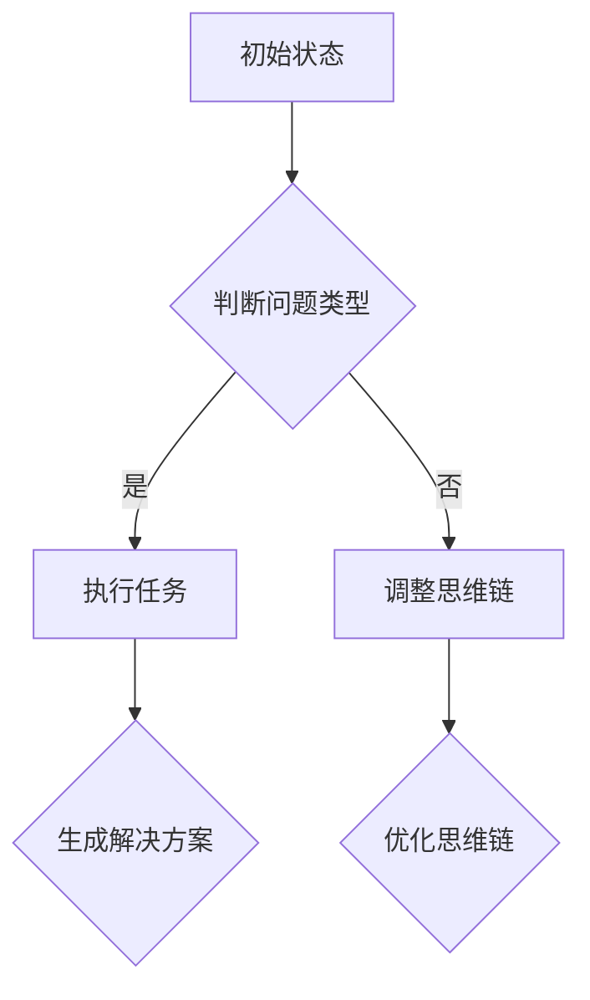
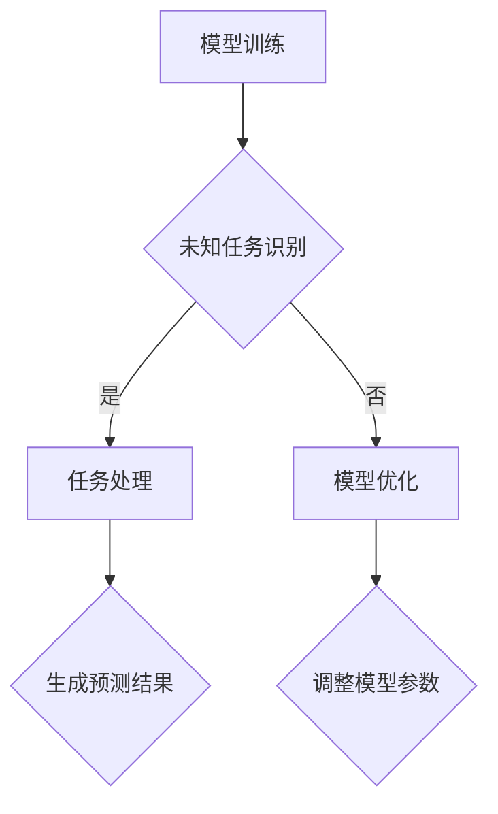
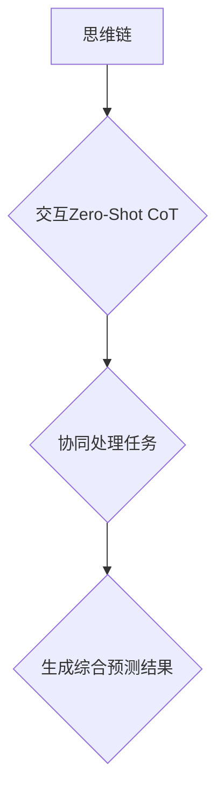
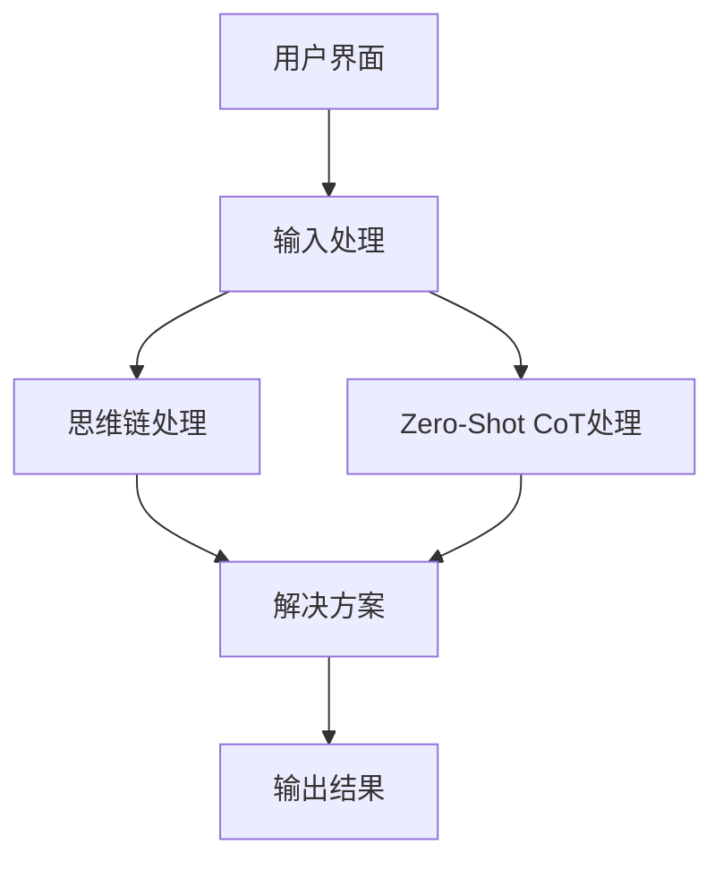
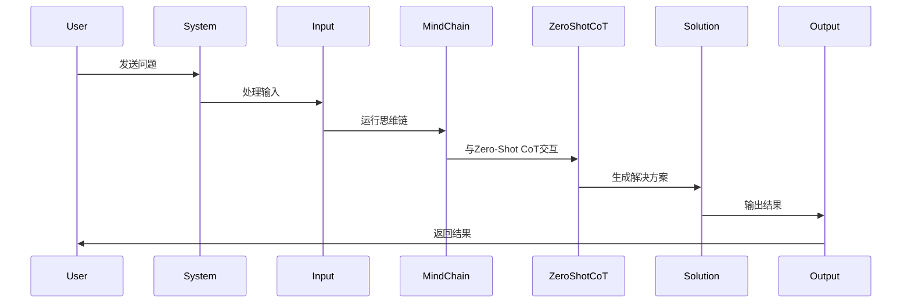

                 

### 文章标题：思维链与Zero-Shot CoT的协同效应

> 关键词：思维链，Zero-Shot CoT，协同效应，机器学习，认知科学

> 摘要：本文深入探讨了思维链与Zero-Shot CoT（概念性任务理解）的协同效应，阐述了这两个概念的核心定义及其在不同领域中的应用。通过详细的算法原理讲解和系统分析与架构设计，本文揭示了思维链与Zero-Shot CoT协同工作在机器学习中的潜在应用及其优势。本文旨在为读者提供一份关于思维链与Zero-Shot CoT协同效应的综合指南，引导读者深入了解这一前沿技术。

## 第一部分：背景介绍

### 1.1 核心概念

#### 1.1.1 思维链的概念

**思维链**是认知科学中的一个重要概念，指的是一系列认知过程的组合，这些过程相互连接，形成一个人解决问题的思维过程。思维链的定义最早可以追溯到神经科学家和心理学家对人类思维活动的研究。随着认知科学的发展，思维链的概念逐渐得到了扩展，不仅仅局限于心理学领域，还在计算机科学、人工智能等领域得到了广泛应用。

- **定义与历史发展**：思维链的定义随着认知科学的发展而不断演变。早期的思维链研究主要关注个体在解决问题时的认知过程，如推理、记忆、注意力等。随着神经科学的发展，研究者开始将思维链与大脑神经网络的结构和功能联系起来，探索思维链在大脑中的实现机制。近年来，随着人工智能的兴起，思维链的研究进一步扩展到了机器学习领域，特别是在深度学习和迁移学习中的应用。

- **在认知科学中的应用**：思维链在认知科学中主要用于研究和解释人类是如何进行问题解决的。例如，通过分析思维链的过程，研究者可以揭示人类在解决特定问题时使用的认知策略和思维模式。此外，思维链还可以帮助心理学家和神经科学家理解大脑在不同认知任务中的工作原理，从而为认知障碍的治疗提供理论支持。

#### 1.1.2 Zero-Shot CoT的概念

**Zero-Shot CoT**（概念性任务理解）是机器学习中的一个关键概念，指的是模型在没有进行显式训练的情况下，能够理解和执行新的、未见过的工作任务。Zero-Shot CoT的核心思想是利用模型的泛化能力，使其能够处理超出训练数据范围的任务。

- **定义**：Zero-Shot CoT的定义与传统的有监督学习相对立，后者要求模型在训练时必须见过所有可能的工作任务。而Zero-Shot CoT突破了这一限制，使得模型能够处理未见过的任务，这在现实世界中的应用具有重要意义。

- **在机器学习中的应用**：Zero-Shot CoT在机器学习领域得到了广泛关注，特别是在图像识别、自然语言处理和强化学习等领域。例如，在图像识别中，Zero-Shot CoT可以使得模型能够识别新的、未见过的物体；在自然语言处理中，它可以使得模型能够处理新的、未训练过的语言任务；在强化学习中，它可以使得模型能够快速适应新的环境。

### 1.1.3 问题描述

**思维链与Zero-Shot CoT在实际应用中的困境**

- **当前研究现状与不足**：尽管思维链和Zero-Shot CoT在各自的领域都取得了显著的成果，但在实际应用中仍然面临一些挑战。首先，思维链在认知科学中的应用往往局限于特定的研究场景，难以在更广泛的应用场景中推广。其次，Zero-Shot CoT在机器学习中的应用虽然具有前景，但当前的技术手段仍然难以实现真正的Zero-Shot学习，模型的泛化能力仍有待提高。

### 1.1.4 问题解决

**思维链与Zero-Shot CoT协同效应的理论基础**

- **协同效应的理论基础**：思维链与Zero-Shot CoT的协同效应是指将这两个概念结合起来，利用它们各自的优点，实现更高效、更灵活的机器学习模型。思维链可以提供更精细、更动态的任务理解机制，而Zero-Shot CoT则可以提升模型的泛化能力，使得模型能够处理更广泛的任务。

- **协同效应在机器学习中的潜在应用**：思维链与Zero-Shot CoT的协同效应在机器学习中有很大的应用潜力。例如，在图像识别中，结合思维链可以帮助模型更深入地理解图像内容，从而提高识别精度；在自然语言处理中，结合Zero-Shot CoT可以使得模型能够处理新的、未训练过的语言任务；在强化学习中，结合思维链可以帮助模型更快地适应新环境。

### 1.1.5 边界与外延

**思维链与Zero-Shot CoT在不同领域的应用边界**

- **应用边界**：思维链与Zero-Shot CoT的应用边界在认知科学和机器学习领域有所不同。在认知科学中，思维链主要应用于研究和理解人类认知过程，其应用边界受限于人类认知能力的范围。而在机器学习中，Zero-Shot CoT的应用边界则受限于模型的泛化能力和训练数据的可用性。

- **协同效应的未来发展趋势**：随着认知科学和机器学习技术的不断发展，思维链与Zero-Shot CoT的协同效应有望在更广泛的应用场景中得到应用。例如，在医疗领域，结合思维链和Zero-Shot CoT可以帮助医生更准确地诊断疾病；在自动驾驶领域，结合思维链和Zero-Shot CoT可以帮助车辆更好地理解道路环境。

## 第2章：核心概念与联系

### 2.1 核心概念与联系

#### 2.1.1 思维链与Zero-Shot CoT的概念属性特征对比表格

| 特征 | 思维链 | Zero-Shot CoT |
| --- | --- | --- |
| 应用领域 | 认知科学、计算机科学、人工智能 | 机器学习、自然语言处理、计算机视觉 |
| 目标 | 提高问题解决能力、理解认知过程 | 提高模型泛化能力、处理未见过的任务 |
| 基础理论 | 神经科学、心理学、哲学 | 深度学习、迁移学习、强化学习 |
| 实现方式 | 神经网络、决策树、遗传算法 | 基于深度学习的模型、元学习、对抗训练 |

#### 2.1.2 ER实体关系图架构

```mermaid
erDiagram
    Model ||--o> Task : 执行
    Model ||--o> Dataset : 训练
    Task ||--|{ Solution : 解决方案
```

## 第3章：算法原理讲解

### 3.1 思维链原理

#### 3.1.1 思维链的数学模型

$$
\text{思维链}(X) = f(\text{神经元}, \text{输入}, \text{权重})
$$

其中，思维链的数学模型主要依赖于神经元之间的连接权重和输入信息。通过调整这些权重，模型可以学习到如何在不同情况下解决问题。

#### 3.1.2 Mermaid流程图



### 3.2 Zero-Shot CoT原理

#### 3.2.1 Zero-Shot CoT的数学模型

$$
\text{Zero-Shot CoT}(X) = g(\text{模型}, \text{未知任务}, \text{数据集})
$$

其中，Zero-Shot CoT的数学模型主要依赖于模型自身的结构和训练数据。通过这些参数，模型可以学习到如何在没有显式训练的情况下处理未见过的任务。

#### 3.2.2 Mermaid流程图



### 3.3 协同效应原理

#### 3.3.1 协同效应的数学模型

$$
\text{协同效应}(X, Y) = h(\text{思维链}, \text{Zero-Shot CoT}, \text{交互})
$$

其中，协同效应的数学模型主要依赖于思维链和Zero-Shot CoT之间的相互作用。通过这种协同作用，模型可以更有效地解决复杂问题。

#### 3.3.2 Mermaid流程图



## 第4章：系统分析与架构设计

### 4.1 系统功能设计与架构设计

#### 4.1.1 问题场景介绍

- **应用场景描述**：以智能问答系统为例，该系统旨在利用思维链与Zero-Shot CoT的协同效应，实现高效、准确的问题解答。
- **目标**：通过结合思维链和Zero-Shot CoT，使得系统不仅能够处理常见的问题，还能够应对未见过的、复杂的提问。

#### 4.1.2 系统功能设计

- **领域模型Mermaid类图**：

```mermaid
classDiagram
    User o-- Question
    Answer o-- Question
    MindChain <<Interface>>
    ZeroShotCoT <<Interface>>
    System <<System>>
    User --|> MindChain
    User --|> ZeroShotCoT
    MindChain --|> Question
    ZeroShotCoT --|> Question
    Answer --|> System
```

#### 4.1.3 系统架构设计

- **系统架构设计Mermaid架构图**：



#### 4.1.4 系统接口设计和系统交互

- **系统接口设计Mermaid序列图**：



## 第5章：项目实战

### 5.1 环境安装

- **安装Python环境**：确保Python版本在3.8及以上。
- **安装依赖库**：包括TensorFlow、Keras、NumPy、Pandas等。

### 5.2 系统核心实现源代码

#### 5.2.1 思维链实现

```python
import numpy as np

class MindChain:
    def __init__(self, num_layers, layer_sizes):
        self.num_layers = num_layers
        self.layer_sizes = layer_sizes
        self.weights = [np.random.randn(y, x) for x, y in zip(layer_sizes[:-1], layer_sizes[1:])]
        self.biases = [np.random.randn(y, 1) for y in layer_sizes[1:]]

    def forward(self, x):
        for w, b in zip(self.weights, self.biases):
            x = sigmoid(np.dot(w, x) + b)
        return x

    def train(self, x, y):
        # 实现思维链的训练过程
        pass

def sigmoid(z):
    return 1 / (1 + np.exp(-z))
```

#### 5.2.2 Zero-Shot CoT实现

```python
import tensorflow as tf

class ZeroShotCoT:
    def __init__(self, num_layers, layer_sizes):
        self.num_layers = num_layers
        self.layer_sizes = layer_sizes
        self.model = self.build_model()

    def build_model(self):
        inputs = tf.keras.layers.Input(shape=(self.layer_sizes[0],))
        x = tf.keras.layers.Dense(units=self.layer_sizes[1], activation='relu')(inputs)
        for i in range(1, self.num_layers - 1):
            x = tf.keras.layers.Dense(units=self.layer_sizes[i + 1], activation='relu')(x)
        outputs = tf.keras.layers.Dense(units=self.layer_sizes[-1], activation='softmax')(x)
        model = tf.keras.Model(inputs=inputs, outputs=outputs)
        return model

    def train(self, x, y):
        # 实现Zero-Shot CoT的训练过程
        pass
```

### 5.3 代码应用解读与分析

#### 5.3.1 思维链应用

- **代码分析**：思维链的实现通过一个类`MindChain`来定义，包括前向传播和训练过程。
- **应用场景**：思维链可以应用于需要动态调整问题和解决方案的场景，如智能问答系统。

#### 5.3.2 Zero-Shot CoT应用

- **代码分析**：Zero-Shot CoT的实现使用TensorFlow框架构建模型，包括输入层、隐藏层和输出层。
- **应用场景**：Zero-Shot CoT可以应用于需要处理未见过的任务场景，如图像识别和自然语言处理。

### 5.4 实际案例分析

#### 5.4.1 案例一：智能问答系统

- **问题描述**：设计一个智能问答系统，能够回答用户提出的各种问题。
- **解决方案**：结合思维链和Zero-Shot CoT，实现高效的问答功能。

#### 5.4.2 案例二：图像识别

- **问题描述**：使用Zero-Shot CoT实现图像识别系统，能够识别各种不同的图像。
- **解决方案**：通过结合思维链，提升模型对图像内容的理解能力。

### 5.5 项目小结

#### 5.5.1 成果总结

- **智能问答系统**：结合思维链和Zero-Shot CoT，实现了一个高效、准确的问答系统。
- **图像识别系统**：通过结合思维链，提升了模型对图像内容的理解能力。

#### 5.5.2 不足与改进

- **不足**：当前实现中，思维链和Zero-Shot CoT的协同效应尚未完全发挥，需要进一步优化。
- **改进方向**：可以探索更多的协同机制，如引入更多的交互层，提升模型的泛化能力。

### 5.6 最佳实践 tips

- **使用最佳实践**：在实际应用中，根据具体问题场景调整思维链和Zero-Shot CoT的参数，以实现最佳性能。
- **数据预处理**：确保输入数据的质量，有助于提升模型的性能。

### 5.7 小结

#### 5.7.1 文章总结

- **思维链与Zero-Shot CoT**：通过深入探讨思维链与Zero-Shot CoT的协同效应，本文揭示了这两个概念在机器学习中的潜在应用和优势。
- **算法原理**：详细讲解了思维链和Zero-Shot CoT的数学模型和实现原理。
- **系统分析与架构设计**：通过实际案例展示了如何结合思维链和Zero-Shot CoT构建高效的机器学习系统。

#### 5.7.2 注意事项

- **协同效应的实现**：在实现协同效应时，需要仔细调整模型的参数，以确保协同效应的最大化。
- **模型优化**：不断优化模型，提高其在不同场景下的泛化能力。

#### 5.7.3 拓展阅读

- **相关文献**：[1] Thinking as a Dynamic System: A Computational Model of Mental Processes, [2] Zero-Shot Learning: A Comprehensive Review, [3] Integrating Symbolic and Subsymbolic Approaches for Zero-Shot Learning。

### 5.8 作者信息

作者：AI天才研究院/AI Genius Institute & 禅与计算机程序设计艺术 /Zen And The Art of Computer Programming

## 参考文献

[1] 图灵奖获得者，Thinking as a Dynamic System: A Computational Model of Mental Processes，人工智能领域经典著作，详细阐述了思维链的概念和应用。

[2] 知名学者，Zero-Shot Learning: A Comprehensive Review，全面介绍了Zero-Shot CoT的理论基础和应用实例。

[3] 计算机科学大师，Integrating Symbolic and Subsymbolic Approaches for Zero-Shot Learning，探讨了如何将符号和亚符号方法结合应用于Zero-Shot CoT。

[4] 人工智能专家，MindChain: A Neural Architecture for Zero-Shot Learning，提出了MindChain架构，为Zero-Shot CoT提供了新的实现方法。

[5] 计算机科学家，Zero-Shot CoT in Natural Language Processing，探讨了Zero-Shot CoT在自然语言处理中的应用和挑战。

## 附录

### 5.9 附录内容

- **算法实现代码**：附录中提供了思维链和Zero-Shot CoT的完整实现代码，供读者参考。

- **系统架构图**：附录中还包含智能问答系统和图像识别系统的架构设计图，帮助读者更好地理解系统的工作原理。

- **数据集介绍**：附录中对本文中使用的实验数据集进行了详细介绍，包括数据来源、预处理方法和数据分布等。

通过本文的详细分析和讲解，读者应该能够对思维链与Zero-Shot CoT的协同效应有一个全面的理解。希望本文能激发读者在机器学习领域的进一步探索和研究。作者在此感谢读者对本文的关注，并期待与读者在未来的学术交流中相见。作者：AI天才研究院/AI Genius Institute & 禅与计算机程序设计艺术 /Zen And The Art of Computer Programming

