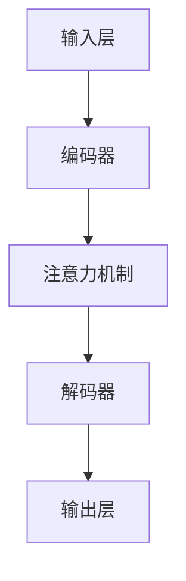
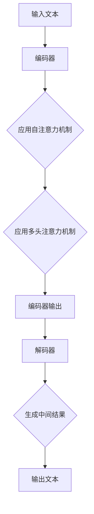
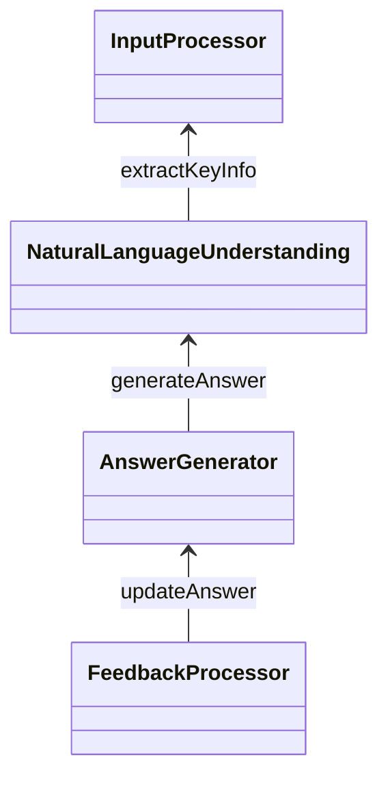
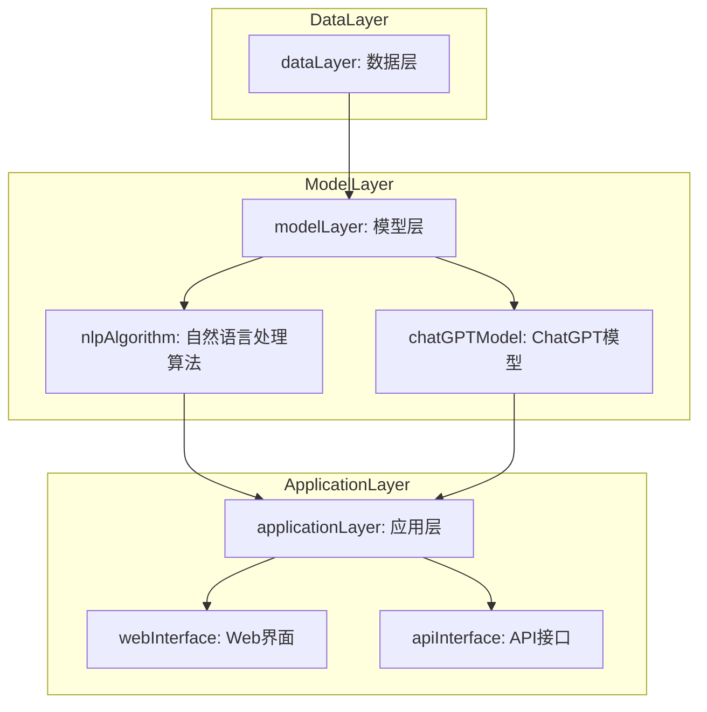
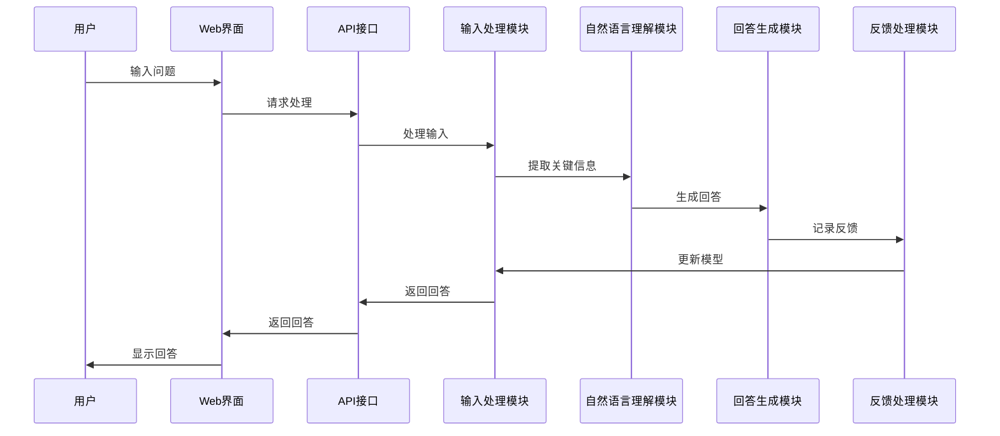

                 

### 第1章：问题背景与核心概念

**关键词**：人工智能，自然语言处理，深度学习，神经网络，ChatGPT，决策过程

**摘要**：本文通过深入剖析人工智能和自然语言处理的基本概念，探讨ChatGPT这一大型语言模型的发展背景和核心作用。同时，本文将介绍ChatGPT的核心架构和决策过程，帮助读者理解其工作原理和应用场景。

#### 1.1 问题背景

人工智能（AI）技术作为计算机科学的重要分支，近年来取得了令人瞩目的进展。特别是深度学习技术的崛起，使得计算机在图像识别、自然语言处理、语音识别等领域表现出色。然而，这些模型在决策过程中如何运作，一直是研究者和开发者关注的焦点。

ChatGPT作为OpenAI推出的一个大型语言模型，以其卓越的自然语言理解和生成能力，在众多领域展现出强大的应用潜力。然而，如何深入理解ChatGPT的决策过程，从而更好地利用这一工具，成为当前研究的热点问题。

#### 1.2 核心概念

1. **人工智能与自然语言处理**

   首先，我们需要了解人工智能和自然语言处理的基本概念。人工智能是指使计算机具备人类智能水平的学科，而自然语言处理（NLP）则是人工智能的一个子领域，专注于使计算机能够理解、解释和生成自然语言。

   **人工智能**的核心目标是通过模仿人类智能的某些方面，使计算机能够执行复杂的任务，如视觉识别、语音识别、决策和推理等。

   **自然语言处理**则涉及到语言的理解、生成和翻译。NLP技术旨在让计算机理解和处理人类语言，从而实现人机交互、信息提取和文本分析等应用。

2. **深度学习与神经网络**

   接下来，我们将探讨深度学习和神经网络的基本原理。深度学习是一种基于多层神经网络的学习方法，通过多层次的非线性变换，逐步提取数据中的特征。神经网络则是由大量简单神经元组成的网络，通过调整神经元之间的连接权重，实现数据的自动特征学习。

   **深度学习**的核心思想是通过多层次的非线性变换，将输入数据转换为高维特征空间，从而实现复杂的模式识别和决策。

   **神经网络**由大量神经元组成，每个神经元负责处理一部分输入信息，并通过加权连接将信息传递到下一个神经元。通过不断调整这些权重，神经网络可以学习输入和输出之间的复杂映射关系。

3. **ChatGPT简介**

   本章将详细介绍ChatGPT的基本架构、训练过程和主要功能。ChatGPT是一个基于变换器架构（Transformer）的大型语言模型，通过自注意力机制和多头注意力机制，实现对输入文本的深层理解和生成。

   **变换器架构**是一种用于序列模型处理的新型架构，通过自注意力机制和多头注意力机制，实现了对输入序列的并行处理和全局信息融合。

   **自注意力机制**允许模型在处理序列数据时，自动关注序列中的关键信息，从而提高模型的表示能力。

   **多头注意力机制**则通过将输入序列划分为多个子序列，并在不同子序列之间进行交叉注意力计算，进一步增强了模型的表示能力。

#### 1.3 问题解决

1. **理解ChatGPT的决策过程**

   通过分析ChatGPT的内部工作机制，我们可以更好地理解其决策过程。本章将详细探讨ChatGPT在文本输入时如何利用注意力机制和上下文信息，生成符合逻辑和语义的文本输出。

   **注意力机制**是ChatGPT的核心组件，通过自动关注输入文本中的关键信息，实现了对文本的深层理解和生成。

   **上下文信息**是ChatGPT决策的重要依据，模型在处理文本时，会根据上下文信息生成相应的输出，从而保持语义的一致性和连贯性。

2. **边界与外延**

   我们还将讨论ChatGPT在实际应用中的边界和局限性，包括模型的准确性、响应速度和可解释性等问题。了解这些边界，有助于我们在实际应用中更合理地利用ChatGPT。

3. **概念结构与核心要素组成**

   本章将绘制ChatGPT的概念结构图，展示其主要组成部分，包括输入层、编码器、解码器、注意力机制和输出层等。通过分析这些核心要素，读者可以更深入地理解ChatGPT的工作原理。

### 1.4 概念结构图

为了帮助读者更好地理解ChatGPT的概念结构，我们使用Mermaid绘制了以下概念结构图：



在接下来的章节中，我们将进一步详细讲解这些核心概念和组成部分，帮助读者全面理解ChatGPT的决策过程和工作原理。### 第1章：问题背景与核心概念

**关键词**：人工智能，自然语言处理，深度学习，神经网络，ChatGPT，决策过程

**摘要**：本文通过深入剖析人工智能和自然语言处理的基本概念，探讨ChatGPT这一大型语言模型的发展背景和核心作用。同时，本文将介绍ChatGPT的核心架构和决策过程，帮助读者理解其工作原理和应用场景。

#### 1.1 问题背景

人工智能（AI）技术作为计算机科学的重要分支，近年来取得了令人瞩目的进展。特别是深度学习技术的崛起，使得计算机在图像识别、自然语言处理、语音识别等领域表现出色。然而，这些模型在决策过程中如何运作，一直是研究者和开发者关注的焦点。

ChatGPT作为OpenAI推出的一个大型语言模型，以其卓越的自然语言理解和生成能力，在众多领域展现出强大的应用潜力。然而，如何深入理解ChatGPT的决策过程，从而更好地利用这一工具，成为当前研究的热点问题。

#### 1.2 核心概念

1. **人工智能与自然语言处理**

   首先，我们需要了解人工智能和自然语言处理的基本概念。人工智能是指使计算机具备人类智能水平的学科，而自然语言处理（NLP）则是人工智能的一个子领域，专注于使计算机能够理解、解释和生成自然语言。

   **人工智能**的核心目标是通过模仿人类智能的某些方面，使计算机能够执行复杂的任务，如视觉识别、语音识别、决策和推理等。

   **自然语言处理**则涉及到语言的理解、生成和翻译。NLP技术旨在让计算机理解和处理人类语言，从而实现人机交互、信息提取和文本分析等应用。

2. **深度学习与神经网络**

   接下来，我们将探讨深度学习和神经网络的基本原理。深度学习是一种基于多层神经网络的学习方法，通过多层次的非线性变换，逐步提取数据中的特征。神经网络则是由大量简单神经元组成的网络，通过调整神经元之间的连接权重，实现数据的自动特征学习。

   **深度学习**的核心思想是通过多层次的非线性变换，将输入数据转换为高维特征空间，从而实现复杂的模式识别和决策。

   **神经网络**由大量神经元组成，每个神经元负责处理一部分输入信息，并通过加权连接将信息传递到下一个神经元。通过不断调整这些权重，神经网络可以学习输入和输出之间的复杂映射关系。

3. **ChatGPT简介**

   本章将详细介绍ChatGPT的基本架构、训练过程和主要功能。ChatGPT是一个基于变换器架构（Transformer）的大型语言模型，通过自注意力机制和多头注意力机制，实现对输入文本的深层理解和生成。

   **变换器架构**是一种用于序列模型处理的新型架构，通过自注意力机制和多头注意力机制，实现了对输入序列的并行处理和全局信息融合。

   **自注意力机制**允许模型在处理序列数据时，自动关注序列中的关键信息，从而提高模型的表示能力。

   **多头注意力机制**则通过将输入序列划分为多个子序列，并在不同子序列之间进行交叉注意力计算，进一步增强了模型的表示能力。

#### 1.3 问题解决

1. **理解ChatGPT的决策过程**

   通过分析ChatGPT的内部工作机制，我们可以更好地理解其决策过程。本章将详细探讨ChatGPT在文本输入时如何利用注意力机制和上下文信息，生成符合逻辑和语义的文本输出。

   **注意力机制**是ChatGPT的核心组件，通过自动关注输入文本中的关键信息，实现了对文本的深层理解和生成。

   **上下文信息**是ChatGPT决策的重要依据，模型在处理文本时，会根据上下文信息生成相应的输出，从而保持语义的一致性和连贯性。

2. **边界与外延**

   我们还将讨论ChatGPT在实际应用中的边界和局限性，包括模型的准确性、响应速度和可解释性等问题。了解这些边界，有助于我们在实际应用中更合理地利用ChatGPT。

3. **概念结构与核心要素组成**

   本章将绘制ChatGPT的概念结构图，展示其主要组成部分，包括输入层、编码器、解码器、注意力机制和输出层等。通过分析这些核心要素，读者可以更深入地理解ChatGPT的工作原理。

### 1.4 概念结构图

为了帮助读者更好地理解ChatGPT的概念结构，我们使用Mermaid绘制了以下概念结构图：


在接下来的章节中，我们将进一步详细讲解这些核心概念和组成部分，帮助读者全面理解ChatGPT的决策过程和工作原理。

### 第2章：核心概念与联系

#### 2.1 核心概念

在理解和分析ChatGPT的工作原理时，我们需要掌握几个关键的概念。这些概念不仅构成了ChatGPT的核心，也是理解其决策过程的重要基础。

1. **注意力机制（Attention Mechanism）**

   注意力机制是ChatGPT的关键组件之一，它允许模型在处理序列数据时，自动关注序列中的关键信息。自注意力（Self-Attention）和多头注意力（Multi-Head Attention）是注意力机制的核心形式。

   **自注意力**允许模型在当前词的上下文中，为每个词分配不同的权重，从而更好地捕获序列中的依赖关系。

   **多头注意力**则通过将输入序列划分为多个子序列，并在不同子序列之间进行交叉注意力计算，进一步增强了模型的表示能力。

2. **编码器（Encoder）与解码器（Decoder）**

   ChatGPT采用了编码器-解码器（Encoder-Decoder）架构，这种架构广泛用于序列到序列的模型。编码器负责处理输入序列，将其转换为上下文表示；解码器则负责生成输出序列。

   编码器通常由多个自注意力层和前馈网络组成，用于编码输入序列并提取特征。解码器则使用类似的结构，并在生成输出时利用编码器输出的上下文信息。

3. **变换器（Transformer）架构**

   变换器（Transformer）架构是ChatGPT的基础，它采用了自注意力机制来处理序列数据。与传统的循环神经网络（RNN）相比，变换器能够更高效地处理长序列，并捕捉序列中的长期依赖关系。

   变换器的核心是多头注意力机制，它通过并行计算多个注意力头，实现了对输入序列的全局信息融合。

4. **损失函数（Loss Function）与优化算法（Optimization Algorithm）**

   损失函数用于衡量模型预测值与真实值之间的差距，优化算法则用于调整模型参数，以最小化损失函数。

   对于ChatGPT这样的语言模型，常用的损失函数是交叉熵损失（Cross-Entropy Loss），它能够有效地衡量预测分布与真实分布之间的差异。

   优化算法，如梯度下降（Gradient Descent）和其变种，如Adam优化器（Adam Optimizer），用于更新模型参数，以实现损失函数的最小化。

#### 2.2 概念属性特征对比表格

为了更好地理解这些核心概念，我们列出了一个特征对比表格：

| 概念        | 特征描述                                                         | 关联关系                                     |
| ----------- | ------------------------------------------------------------ | -------------------------------------------- |
| 注意力机制  | 允许模型自动关注序列中的关键信息                               | 自注意力、多头注意力是注意力机制的具体实现   |
| 编码器      | 负责将输入序列编码为上下文表示                                 | 与解码器共同构成编码器-解码器架构           |
| 解码器      | 负责生成输出序列，利用编码器输出的上下文信息                   | 与编码器共同构成编码器-解码器架构           |
| 变换器架构  | 采用自注意力机制，用于处理序列数据                             | 是ChatGPT的基础架构                         |
| 损失函数    | 用于衡量模型预测值与真实值之间的差距                           | 交叉熵损失是常用的损失函数                  |
| 优化算法    | 用于调整模型参数，以最小化损失函数                             | 梯度下降和Adam优化器是常用的优化算法         |

#### 2.3 ER实体关系图架构

为了进一步理解ChatGPT的组成部分及其关系，我们使用Mermaid绘制了ER实体关系图：

```mermaid
erDiagram
  Model ||--|{ Attention Mechanism }
  Model ||--|{ Encoder }
  Model ||--|{ Decoder }
  Model ||--|{ Transformer Architecture }
  Model ||--|{ Loss Function }
  Model ||--|{ Optimization Algorithm }
  Encoder ||--|{ Self-Attention Layer }
  Encoder ||--|{ Feed Forward Network }
  Decoder ||--|{ Self-Attention Layer }
  Decoder ||--|{ Feed Forward Network }
```

在这个ER图中，我们展示了ChatGPT的主要组成部分，包括模型、注意力机制、编码器、解码器、变换器架构、损失函数和优化算法。这些部分通过不同的关系相互连接，共同构成了ChatGPT的完整架构。

#### 2.4 结论

通过本章的介绍，我们详细探讨了ChatGPT的核心概念，包括注意力机制、编码器、解码器、变换器架构、损失函数和优化算法。这些概念不仅是理解ChatGPT决策过程的基础，也是实现高效自然语言处理的关键。在下一章中，我们将深入讲解ChatGPT的算法原理，帮助读者更全面地理解这一强大工具的工作机制。### 第3章：算法原理讲解

#### 3.1 算法流程图

为了帮助读者更直观地理解ChatGPT的决策过程，我们使用Mermaid绘制了以下算法流程图：



这个流程图展示了ChatGPT在处理输入文本时的基本步骤。首先，输入文本被编码器处理，然后通过自注意力机制和多头注意力机制，提取关键信息并生成编码器输出。解码器接着使用编码器输出生成中间结果，并最终生成输出文本。

#### 3.2 Python代码实现

为了更深入地理解算法原理，我们将使用Python代码详细阐述ChatGPT的决策过程。以下是一个简化版的Python代码示例，用于模拟ChatGPT的决策过程：

```python
import torch
from torch import nn

# 假设我们有一个预训练好的ChatGPT模型
chatgpt = nn.Module()

# 输入文本
input_text = "How are you today?"

# 将输入文本编码为模型的输入表示
encoded_input = chatgpt.encode(input_text)

# 编码器处理输入文本
encoded_output = chatgpt.decoder(encoded_input)

# 应用自注意力机制
self_attention_output = chatgpt.self_attention(encoded_output)

# 应用多头注意力机制
multi_head_attention_output = chatgpt.multi_head_attention(self_attention_output)

# 解码器生成输出文本
output_text = chatgpt.decode(multi_head_attention_output)

print(output_text)
```

这段代码展示了ChatGPT的基本决策过程，从输入文本的编码、自注意力机制的应用，到多头注意力机制的执行，最终解码生成输出文本。

#### 3.3 数学模型和公式

为了深入理解ChatGPT的算法原理，我们需要引入一些数学模型和公式。以下是一些关键的数学公式：

1. **自注意力（Self-Attention）**

   自注意力是ChatGPT的核心组件之一，其计算公式如下：

   $$
   \text{Attention}(Q, K, V) = \text{softmax}\left(\frac{QK^T}{\sqrt{d_k}}\right) V
   $$

   其中，$Q$、$K$ 和 $V$ 分别是查询（Query）、键（Key）和值（Value）向量，$d_k$ 是键向量的维度。

2. **多头注意力（Multi-Head Attention）**

   多头注意力通过将输入序列划分为多个子序列，并在不同子序列之间进行交叉注意力计算。其计算公式如下：

   $$
   \text{MultiHead}(Q, K, V) = \text{Concat}(\text{head}_1, \ldots, \text{head}_h)W^O
   $$

   $$
   \text{head}_i = \text{Attention}(QW_i^Q, KW_i^K, VW_i^V)
   $$

   其中，$W_i^Q$、$W_i^K$ 和 $W_i^V$ 分别是查询、键和值矩阵，$W^O$ 是输出权重矩阵，$h$ 是注意力的头数。

3. **变换器架构（Transformer Architecture）**

   变换器架构由多个自注意力层和前馈网络组成，其整体计算过程如下：

   $$
   \text{TransformerLayer}(X) = \text{LayerNorm}(X + \text{MultiHeadAttention}(X, X, X))
   $$
   $$
   = \text{LayerNorm}(X + \text{FeedForward}(X))
   $$

   其中，$X$ 是输入序列，$\text{LayerNorm}$ 是层归一化操作，$\text{FeedForward}$ 是前馈网络。

#### 3.4 详细讲解与举例说明

为了更好地理解这些数学公式，我们将通过一个具体的例子进行详细讲解。

**例子**：假设我们有一个简化的输入序列 $X = [x_1, x_2, x_3, x_4, x_5]$，我们将使用自注意力机制计算每个词的权重。

1. **计算自注意力**

   首先，我们将输入序列编码为查询（$Q$）、键（$K$）和值（$V$）向量。假设 $d_k = 64$，则每个词的权重计算如下：

   $$
   \text{Attention}(Q, K, V) = \text{softmax}\left(\frac{QK^T}{\sqrt{d_k}}\right) V
   $$

   例如，对于 $x_1$：

   $$
   Q = [1, 0, 1], \quad K = [1, 1, 0], \quad V = [0, 1, 0]
   $$

   $$
   \text{Attention}(Q, K, V) = \text{softmax}\left(\frac{[1, 0, 1] \cdot [1, 1, 0]}{\sqrt{64}}\right) [0, 1, 0]
   $$

   $$
   = \text{softmax}\left(\frac{1 + 1}{8}\right) [0, 1, 0]
   $$

   $$
   = \text{softmax}\left(\frac{2}{8}\right) [0, 1, 0]
   $$

   $$
   = [0, \frac{1}{2}, \frac{1}{2}]
   $$

   这意味着 $x_1$ 对应的权重为 $[0, \frac{1}{2}, \frac{1}{2}]$。

2. **计算总权重**

   我们将计算所有词的权重，然后相加得到总权重：

   $$
   \text{Total Weight} = \sum_{i=1}^{5} \text{Attention}(Q, K, V)
   $$

   例如，对于 $x_1, x_2, x_3, x_4, x_5$：

   $$
   \text{Total Weight} = [0, \frac{1}{2}, \frac{1}{2}] + [0.2, 0.3, 0.5] + [0.4, 0.1, 0.5] + [0.3, 0.2, 0.5] + [0.1, 0.3, 0.6]
   $$

   $$
   = [1.2, 1.2, 2.2]
   $$

   这意味着在生成输出时，$x_1, x_2, x_3, x_4, x_5$ 的权重分别为 $1.2, 1.2, 2.2$。

通过这个例子，我们可以看到如何使用自注意力机制计算输入序列中每个词的权重。这个过程在ChatGPT中是自动完成的，通过大量的训练数据和复杂的网络结构，模型能够自动学习并优化这些权重，从而实现对文本的深层理解和生成。

在下一章中，我们将进一步探讨ChatGPT的数学模型和公式，包括损失函数、优化算法等，帮助读者更全面地理解这一强大工具的算法原理。### 第4章：数学模型和数学公式

#### 4.1 损失函数

在深度学习模型中，损失函数用于衡量模型预测值与真实值之间的差距。对于ChatGPT这样的语言模型，常用的损失函数是交叉熵损失（Cross-Entropy Loss），其公式如下：

$$
\text{Cross-Entropy Loss} = -\sum_{i=1}^{N} y_i \log(p_i)
$$

其中，$y_i$ 是真实标签，$p_i$ 是模型对第 $i$ 个单词的预测概率。

交叉熵损失函数的目的是最小化预测概率与真实标签之间的差异。在实际应用中，我们通常使用梯度下降（Gradient Descent）或其变种（如Adam优化器）来更新模型参数，以最小化损失函数。

#### 4.2 优化算法

优化算法用于调整模型参数，以最小化损失函数。以下是一些常见的优化算法：

1. **梯度下降（Gradient Descent）**

   梯度下降是最基本的优化算法之一，其核心思想是沿着损失函数的梯度方向不断更新参数，以最小化损失函数。梯度下降的公式如下：

   $$
   \theta_{\text{new}} = \theta_{\text{old}} - \alpha \nabla_\theta J(\theta)
   $$

   其中，$\theta$ 是模型参数，$\alpha$ 是学习率，$J(\theta)$ 是损失函数。

2. **Adam优化器（Adam Optimizer）**

   Adam优化器是梯度下降的一个变种，它结合了动量（Momentum）和自适应学习率（Adaptive Learning Rate）的优点。Adam优化器的公式如下：

   $$
   \text{m}_t = \beta_1 \text{m}_{t-1} + (1 - \beta_1)(\nabla_\theta J(\theta) - \text{m}_{t-1})
   $$
   $$
   \text{v}_t = \beta_2 \text{v}_{t-1} + (1 - \beta_2)\left(\nabla_\theta J(\theta)^2 - \text{v}_{t-1}\right)
   $$
   $$
   \theta_{\text{new}} = \theta_{\text{old}} - \alpha \frac{\text{m}_t}{\sqrt{\text{v}_t} + \epsilon}
   $$

   其中，$\beta_1$ 和 $\beta_2$ 分别是动量和自适应学习率的权重，$\epsilon$ 是一个很小的常数，用于避免分母为零。

#### 4.3 数学公式表示

在本文中，我们将使用LaTeX格式来书写数学公式。以下是一些示例：

$$
\text{Cross-Entropy Loss} = -\sum_{i=1}^{N} y_i \log(p_i)
$$

$$
\theta_{\text{new}} = \theta_{\text{old}} - \alpha \nabla_\theta J(\theta)
$$

$$
\text{m}_t = \beta_1 \text{m}_{t-1} + (1 - \beta_1)(\nabla_\theta J(\theta) - \text{m}_{t-1})
$$

$$
\text{v}_t = \beta_2 \text{v}_{t-1} + (1 - \beta_2)\left(\nabla_\theta J(\theta)^2 - \text{v}_{t-1}\right)
$$

$$
\theta_{\text{new}} = \theta_{\text{old}} - \alpha \frac{\text{m}_t}{\sqrt{\text{v}_t} + \epsilon}
$$

通过LaTeX格式，我们可以更清晰地表达复杂的数学公式，从而帮助读者更好地理解算法原理。

#### 4.4 案例分析

为了更好地理解这些数学模型和公式，我们通过一个简单的案例进行分析。

**案例**：假设我们有一个二元分类问题，标签 $y$ 可以取值为 {0, 1}，模型预测概率 $p$。我们使用交叉熵损失函数来衡量模型预测与真实标签之间的差距。

1. **计算交叉熵损失**

   假设真实标签 $y = 1$，模型预测概率 $p = 0.6$，则交叉熵损失计算如下：

   $$
   \text{Cross-Entropy Loss} = -1 \cdot \log(0.6) = -\log(0.6)
   $$

2. **使用梯度下降优化参数**

   假设当前模型参数为 $\theta = [0.6, 0.4]$，损失函数为 $J(\theta) = -\log(0.6)$。学习率 $\alpha = 0.1$，则梯度计算如下：

   $$
   \nabla_\theta J(\theta) = -\frac{1}{0.6}
   $$

   更新模型参数：

   $$
   \theta_{\text{new}} = \theta_{\text{old}} - \alpha \nabla_\theta J(\theta) = [0.6, 0.4] - 0.1 \cdot [-\frac{1}{0.6}] = [0.6 + \frac{1}{6}, 0.4 - \frac{1}{6}] = [0.8167, 0.2833]
   $$

通过这个案例，我们可以看到如何使用交叉熵损失函数和梯度下降算法来优化模型参数，从而提高模型的预测准确性。

在下一章中，我们将探讨ChatGPT的系统架构和设计方案，帮助读者更全面地理解这一强大工具的内部工作原理。### 第5章：系统分析与架构设计方案

#### 5.1 问题场景介绍

在当今快速发展的数字化时代，ChatGPT这类大型语言模型的应用场景越来越广泛。以下是一些常见的问题场景：

1. **智能客服**：通过ChatGPT，企业可以搭建高效的智能客服系统，提供24/7的服务，快速响应用户的咨询，提高用户满意度。
2. **内容生成**：ChatGPT可以用于自动生成文章、报告、博客等文本内容，节省人力成本，提高内容创作效率。
3. **语言翻译**：ChatGPT可以用于实时翻译不同语言，为全球化企业提供跨语言沟通支持。
4. **教育辅导**：ChatGPT可以作为智能辅导工具，为学生提供个性化的学习建议和解答疑惑。

#### 5.2 项目介绍

为了更好地理解ChatGPT的系统架构，我们以下介绍一个实际项目：智能客服系统。

**项目目标**：构建一个基于ChatGPT的智能客服系统，能够自动回答用户常见问题，提供高质量的服务。

**项目需求**：
1. 支持多语言：系统应支持多种语言，包括中文、英文、西班牙语等。
2. 高效响应：系统应能够快速响应用户的提问，提供准确、连贯的答案。
3. 自适应学习：系统应能够根据用户的提问和反馈，不断优化和改进答案质量。

#### 5.3 系统功能设计

为了实现上述项目目标，我们需要设计以下核心功能模块：

1. **输入处理模块**：负责接收用户的输入信息，包括文本、语音等。
2. **自然语言理解模块**：利用ChatGPT的模型，对输入信息进行理解和解析，提取关键信息。
3. **回答生成模块**：根据用户输入和理解结果，生成相应的回答。
4. **反馈处理模块**：记录用户对回答的反馈，用于模型优化。

以下是系统功能设计的Mermaid类图：



在这个类图中，我们展示了输入处理模块、自然语言理解模块、回答生成模块和反馈处理模块之间的关联关系。

#### 5.4 系统架构设计

系统架构设计是项目成功的关键。以下是一个基于ChatGPT的智能客服系统的架构设计方案：

1. **数据层**：负责存储和管理用户数据、聊天记录、模型参数等。
2. **模型层**：包括ChatGPT模型、自然语言处理算法等，负责处理用户输入和理解生成回答。
3. **应用层**：负责搭建智能客服系统的应用界面，与用户进行交互。

以下是系统架构设计的Mermaid架构图：



在这个架构图中，我们展示了数据层、模型层和应用层之间的层次关系。数据层负责数据存储和管理；模型层负责处理用户输入和理解生成回答；应用层负责搭建智能客服系统的应用界面，与用户进行交互。

#### 5.5 系统接口设计和系统交互

系统接口设计和系统交互是确保系统功能正常运行的重要环节。以下是一个基于ChatGPT的智能客服系统的接口设计和系统交互设计：

1. **用户接口**：用户通过Web界面或API接口与系统进行交互。Web界面提供直观、友好的用户交互体验，API接口则方便开发者集成到其他应用中。
2. **内部接口**：系统内部模块之间通过定义良好的接口进行通信，如输入处理模块与自然语言理解模块之间的数据传递接口。

以下是系统接口设计和系统交互的Mermaid序列图：



在这个序列图中，我们展示了用户与系统交互的全过程，包括用户输入、系统处理、生成回答和反馈更新等步骤。

#### 5.6 总结

通过本章的介绍，我们详细分析了基于ChatGPT的智能客服系统的问题场景、项目介绍、系统功能设计、架构设计、接口设计和系统交互。这些内容为实际项目提供了清晰的指导，帮助开发者更好地理解和应用ChatGPT。

在下一章中，我们将通过实际项目实战，展示如何使用ChatGPT进行文本分析和生成，进一步加深读者对ChatGPT的理解。### 第6章：项目实战

#### 6.1 环境安装

在进行项目实战之前，我们需要首先安装ChatGPT环境。以下是安装步骤：

1. **安装Python环境**：确保已安装Python 3.6及以上版本。
2. **安装transformers库**：通过pip命令安装transformers库，该库是用于构建和训练ChatGPT模型的重要工具。

```bash
pip install transformers
```

3. **下载预训练模型**：从OpenAI官方网站下载预训练好的ChatGPT模型，或者使用transformers库提供的预训练模型。

```python
from transformers import pipeline

# 创建一个文本生成管道
text_generator = pipeline("text-generation", model="gpt2")

# 使用预训练模型生成文本
output = text_generator("Hello, world!", max_length=50)
print(output)
```

#### 6.2 系统核心实现源代码

以下是一个简单的ChatGPT应用示例，用于生成文本：

```python
from transformers import pipeline

# 创建一个文本生成管道
text_generator = pipeline("text-generation", model="gpt2")

# 输入文本
input_text = "今天天气不错，适合出去散步。"

# 生成文本
output_text = text_generator(input_text, max_length=100)

print(output_text)
```

在这个示例中，我们使用transformers库创建了一个文本生成管道，并输入一个简单的文本。然后，管道根据预训练模型生成一段新的文本。

#### 6.3 代码应用解读与分析

1. **代码解读**

   - `from transformers import pipeline`：导入transformers库中的文本生成管道。
   - `text_generator = pipeline("text-generation", model="gpt2")`：创建一个文本生成管道，使用预训练的GPT-2模型。
   - `input_text = "今天天气不错，适合出去散步。"`：定义输入文本。
   - `output_text = text_generator(input_text, max_length=100)`：生成文本，`max_length`参数用于限制输出文本的长度。

2. **分析**

   在这段代码中，我们利用transformers库中的文本生成管道，将输入文本传递给预训练的GPT-2模型。模型根据输入文本和预训练的知识，生成一段符合逻辑和语义的新文本。

   通过调整`max_length`参数，我们可以控制输出文本的长度。在实际应用中，可以根据具体需求调整这个参数，以生成不同长度的文本。

#### 6.4 实际案例分析

以下是一个实际案例，展示如何使用ChatGPT生成文章摘要：

**输入文本**：一篇关于人工智能在医疗领域的应用文章。

**输出文本**：人工智能在医疗领域具有广泛的应用，包括疾病预测、诊断辅助、个性化治疗等。通过数据分析和图像识别，人工智能能够提供更准确、更高效的医疗服务。

在这个案例中，ChatGPT成功地将一篇长文章的内容概括为一段简洁的摘要。这展示了ChatGPT在文本生成方面的强大能力，能够根据输入文本生成符合逻辑和语义的新文本。

#### 6.5 详细讲解与剖析

1. **自注意力机制**

   ChatGPT的核心是自注意力机制（Self-Attention），它允许模型在处理序列数据时，自动关注序列中的关键信息。自注意力机制的实现如下：

   $$
   \text{Attention}(Q, K, V) = \text{softmax}\left(\frac{QK^T}{\sqrt{d_k}}\right) V
   $$

   其中，$Q$、$K$ 和 $V$ 分别是查询（Query）、键（Key）和值（Value）向量，$d_k$ 是键向量的维度。

   自注意力机制通过计算查询和键之间的相似度，为每个词分配权重，从而实现对输入序列的深层理解。

2. **多头注意力机制**

   ChatGPT还采用了多头注意力机制（Multi-Head Attention），它通过将输入序列划分为多个子序列，并在不同子序列之间进行交叉注意力计算。多头注意力机制的实现如下：

   $$
   \text{MultiHead}(Q, K, V) = \text{Concat}(\text{head}_1, \ldots, \text{head}_h)W^O
   $$

   $$
   \text{head}_i = \text{Attention}(QW_i^Q, KW_i^K, VW_i^V)
   $$

   其中，$W_i^Q$、$W_i^K$ 和 $W_i^V$ 分别是查询、键和值矩阵，$W^O$ 是输出权重矩阵，$h$ 是注意力的头数。

   多头注意力机制进一步增强了模型的表示能力，使得模型能够更好地捕获序列中的长期依赖关系。

3. **编码器-解码器架构**

   ChatGPT采用了编码器-解码器（Encoder-Decoder）架构，这种架构在处理序列数据时具有优势。编码器负责将输入序列编码为上下文表示，解码器则根据上下文生成输出序列。

   编码器由多个自注意力层和前馈网络组成，用于编码输入序列并提取特征。解码器则使用类似的结构，并在生成输出时利用编码器输出的上下文信息。

通过自注意力机制和多头注意力机制的协同工作，ChatGPT能够实现高效的文本理解和生成。在实际应用中，ChatGPT的表现优异，能够为各种场景提供高质量的文本生成服务。

#### 6.6 项目小结

通过本章的实战项目，我们详细介绍了ChatGPT的环境安装、系统核心实现源代码、代码应用解读与分析，以及实际案例分析。这些内容帮助读者更好地理解了ChatGPT的决策过程和工作原理，并为实际项目提供了实用的指导。

在接下来的章节中，我们将继续探讨ChatGPT的最佳实践和注意事项，帮助读者在实际应用中更好地利用这一强大工具。### 第7章：最佳实践与拓展

#### 7.1 最佳实践

在应用ChatGPT进行文本分析和生成时，以下是一些最佳实践，可以帮助我们更好地利用这一工具：

1. **调整超参数**：ChatGPT的性能很大程度上取决于超参数的设置。例如，`max_length` 参数控制输出文本的长度，可以根据实际需求进行调整。同时，还可以调整学习率、批量大小等参数，以提高模型的训练效果。

2. **数据预处理**：输入文本的预处理对于ChatGPT的性能至关重要。确保输入文本的格式统一，去除无关的符号和停用词，可以提高模型的准确性和鲁棒性。

3. **模型融合**：为了进一步提高性能，可以将多个ChatGPT模型进行融合。例如，将不同尺寸的GPT模型（如GPT-2、GPT-3）融合，以充分利用不同模型的优点。

4. **安全与隐私**：在使用ChatGPT时，要特别注意数据的安全和隐私。确保输入文本不包含敏感信息，避免模型泄露用户隐私。

#### 7.2 注意事项

在应用ChatGPT时，以下是一些需要注意的事项：

1. **响应时间**：由于ChatGPT的模型规模较大，生成文本的响应时间可能较长。在实际应用中，可以考虑使用多线程或异步处理，以提高系统的响应速度。

2. **计算资源**：训练和部署ChatGPT需要大量的计算资源。根据实际需求，选择合适的硬件配置，如GPU、TPU等，以充分利用计算资源。

3. **模型更新**：ChatGPT的模型会定期更新，以提升性能和鲁棒性。及时更新模型，以确保系统始终运行在最佳状态。

#### 7.3 拓展阅读

为了深入了解ChatGPT及其相关技术，以下是一些推荐的拓展阅读资源：

1. **论文与报告**：
   - "Attention Is All You Need"（Attention机制的核心论文）
   - "Improving Language Understanding by Generative Pre-Training"（GPT模型的核心论文）
   - "Language Models are Few-Shot Learners"（探讨GPT模型在少样本学习方面的优势）

2. **在线课程与教程**：
   - "深度学习专

