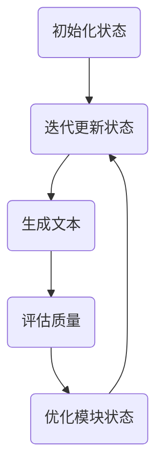
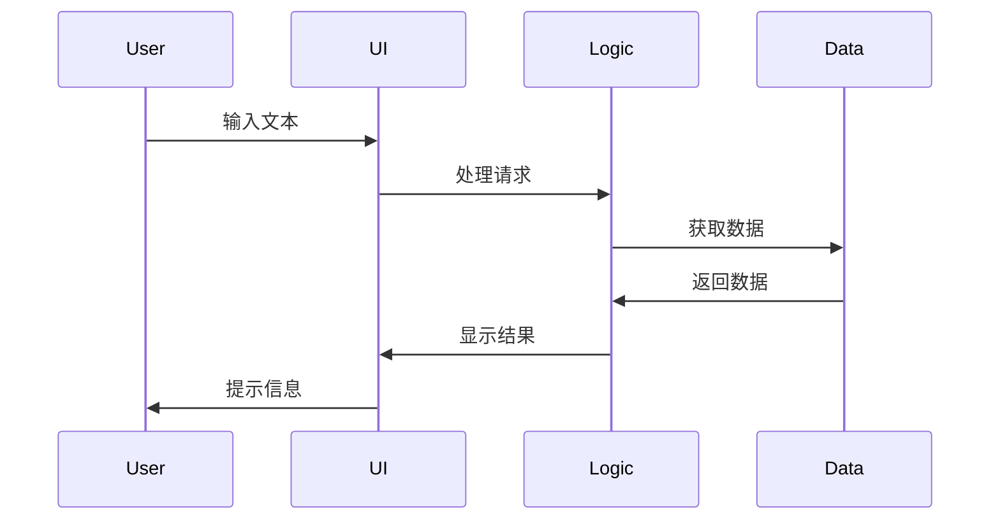
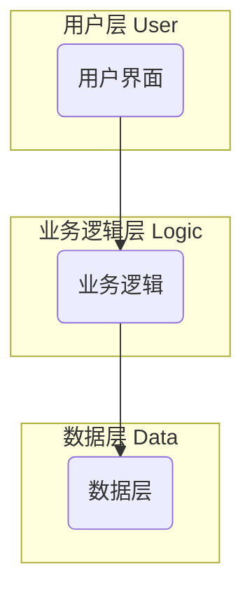

                 


# 思维链在AI写作辅助工具中的应用

## 关键词
- AI写作辅助工具
- 思维链
- 自然语言处理
- 机器学习
- 深度学习
- 代码实现
- 系统架构
- 项目实战

## 摘要
本文深入探讨了思维链在AI写作辅助工具中的应用。通过分析思维链的基本原理、数学模型、系统架构和实际案例，本文旨在为读者提供一个清晰、易懂的技术路径，帮助理解如何利用思维链技术提升AI写作辅助工具的性能和效果。文章将分为五个部分，分别介绍思维链的概念与作用、技术原理、系统实现、项目实战和最佳实践与拓展。

## 第一部分：引言

### 第1章：问题背景与概念介绍

### 1.1 问题背景

在当今信息爆炸的时代，写作已经成为一项重要的技能，无论是学术论文、商业报告，还是博客、新闻稿，写作的需求无处不在。然而，写作不仅要求较高的语言表达能力，还需要深厚的专业知识积累和逻辑思维能力。随着人工智能（AI）技术的发展，尤其是自然语言处理（NLP）、机器学习（ML）和深度学习（DL）等领域的进步，AI写作辅助工具逐渐成为研究热点。

AI写作辅助工具旨在通过机器学习算法，帮助用户更高效、准确地完成写作任务。然而，现有的写作工具往往局限于文本生成或文本编辑，缺乏对思维过程的深入理解和支持。思维链作为一种模拟人类思维过程的模型，能够有效地引导和优化AI写作过程，提高写作工具的智能化水平。

### 1.2 核心概念与联系

#### 1.2.1 思维链的概念与作用

思维链是一种基于模块化和交互机制的智能模型，它通过模拟人类思维过程，实现信息的生成、传递和优化。思维链的核心在于其模块化设计，每个模块代表一个思维步骤或思维单元，模块之间通过交互机制实现信息的共享和协同。

思维链的主要作用有：
1. **结构化思维**：帮助用户组织思维，形成系统化的知识结构。
2. **知识生成**：通过模块化设计，生成有逻辑性和连贯性的文本内容。
3. **知识优化**：对生成的文本内容进行优化，提高其准确性和可读性。

#### 1.2.2 AI写作辅助工具的关键技术

AI写作辅助工具的关键技术包括自然语言处理、机器学习与深度学习等。

1. **自然语言处理（NLP）**：NLP技术用于处理和解析文本数据，包括文本的分词、词性标注、句法分析等。
2. **机器学习（ML）**：ML技术用于训练模型，通过大量数据学习文本生成的规律和模式。
3. **深度学习（DL）**：DL技术通过神经网络模型，实现对复杂文本数据的自动生成和优化。

#### 1.2.3 本书的目的与结构

本书旨在深入探讨思维链在AI写作辅助工具中的应用，通过理论讲解和实际案例，帮助读者了解和掌握思维链技术的基本原理、系统实现和应用方法。

本书结构如下：
- 第一部分：引言，介绍问题背景和核心概念。
- 第二部分：思维链技术原理，讲解思维链的数学模型和算法原理。
- 第三部分：AI写作辅助工具实现，分析系统架构和接口设计。
- 第四部分：项目实战，通过环境安装与配置、系统核心实现和实际案例分析，展示思维链技术的应用。
- 第五部分：最佳实践与拓展，提供最佳实践技巧、注意事项和拓展阅读。

### 1.3 ER实体关系图架构

为了更好地理解思维链在AI写作辅助工具中的应用，我们可以通过ER（实体-关系）图来展示各个实体之间的关系。

```mermaid
erDiagram
    User ..|> Writer : 写作用户
    Writer ..|> AI_Writer : AI写作辅助工具用户
    AI_Writer ||--|{ Content_Generator : 内容生成器
    Content_Generator ||--|{ Text_Generator : 文本生成器
    Text_Generator ||--|{ Text_Optimizer : 文本优化器
    User ..|> Data_Source : 数据来源
    Data_Source ||--|{ Training_Data : 训练数据
    Training_Data ||--|{ Knowledge_Base : 知识库
```

在这个ER图中，用户通过AI写作辅助工具进行写作，工具包括内容生成器、文本生成器和文本优化器，这些工具通过知识库和数据源进行交互，实现智能化的写作过程。

### 1.4 本章小结

本章介绍了AI写作辅助工具的背景、核心概念以及本书的结构。通过引言部分的学习，读者可以了解思维链技术的基本原理和应用场景，为后续章节的学习打下基础。

## 第二部分：思维链技术原理

### 第2章：思维链的数学模型

### 2.1 数学模型介绍

思维链的数学模型是基于信息论和计算几何的理论框架，它通过定义一系列数学公式和算法，实现对思维过程的模拟和优化。

#### 2.1.1 模型的基本假设

思维链模型的基本假设包括：
1. **模块化**：将思维过程划分为多个模块，每个模块代表一个思维步骤。
2. **交互性**：模块之间通过交互机制实现信息的传递和共享。
3. **动态性**：思维过程是一个动态变化的过程，每个模块的状态和输出会随着时间而变化。

#### 2.1.2 模型的数学表达式

思维链模型的数学表达式包括以下几个部分：

1. **模块状态表示**：每个模块的状态可以用一个向量表示，例如 \( S = [s_1, s_2, ..., s_n] \)，其中 \( s_i \) 表示第 \( i \) 个模块的状态。
2. **交互矩阵**：交互矩阵 \( A \) 用于描述模块之间的交互关系，例如 \( A_{ij} \) 表示第 \( i \) 个模块与第 \( j \) 个模块的交互强度。
3. **状态转移方程**：状态转移方程描述了模块状态随时间的变化，例如 \( S_{t+1} = A \cdot S_t \)，其中 \( S_t \) 表示当前时刻的模块状态。

### 2.2 算法原理讲解

思维链的核心算法包括思维链生成算法和思维链优化算法。

#### 2.2.1 思维链生成算法

思维链生成算法的主要目的是通过模块化和交互机制，生成有逻辑性和连贯性的文本内容。算法步骤如下：

1. **初始化**：初始化每个模块的状态，例如随机生成一个状态向量 \( S_0 \)。
2. **迭代更新**：根据状态转移方程 \( S_{t+1} = A \cdot S_t \)，迭代更新每个模块的状态。
3. **生成文本**：根据每个模块的状态，生成对应的文本内容。

#### 2.2.2 思维链优化算法

思维链优化算法的目的是提高生成文本的质量和准确性。算法步骤如下：

1. **评估质量**：对生成的文本进行评估，计算其质量得分。
2. **优化模块状态**：根据评估结果，调整每个模块的状态，以优化文本质量。
3. **重复迭代**：重复评估和优化过程，直到满足预定的质量要求。

### 2.3 Mermaid算法流程图

以下是一个简单的思维链生成算法的Mermaid流程图：



### 2.4 本章小结

本章详细介绍了思维链的数学模型和算法原理。通过理解这些基本概念和算法，读者可以更深入地了解思维链在AI写作辅助工具中的应用机制。

## 第三部分：AI写作辅助工具实现

### 第3章：系统分析与架构设计

### 3.1 系统功能设计

AI写作辅助工具的设计目标是提供一种智能化、高效化的写作环境，帮助用户快速生成高质量的文本内容。系统功能设计包括以下几个方面：

#### 3.1.1 用户交互功能

用户交互功能是系统的核心，它负责与用户进行交互，接收用户的输入和反馈。具体功能包括：

1. **文本输入**：用户可以输入文本内容，可以是原始文本或者指定主题。
2. **文本修改**：用户可以对生成的文本内容进行修改和优化。
3. **保存与加载**：用户可以保存已经生成的文本内容，并在需要时进行加载。

#### 3.1.2 文本生成功能

文本生成功能是系统的核心功能之一，它负责根据用户的输入和思维链模型，生成符合逻辑和连贯性的文本内容。具体功能包括：

1. **自动生成**：根据用户的输入，自动生成文本内容。
2. **主题生成**：根据用户指定的主题，生成相关的文本内容。
3. **模板生成**：根据预设的模板，生成特定格式的文本内容。

#### 3.1.3 文本优化功能

文本优化功能旨在提高生成文本的质量和准确性，具体功能包括：

1. **语法修正**：对生成文本中的语法错误进行修正。
2. **语义优化**：对生成文本中的语义错误进行优化，提高文本的连贯性和逻辑性。
3. **风格调整**：根据用户的需求，调整生成文本的风格和语气。

### 3.2 系统架构设计

AI写作辅助工具的系统架构设计采用了分层架构，包括用户层、业务逻辑层和数据层。

#### 3.2.1 系统整体架构

系统整体架构如下：



在这个架构中，用户通过用户界面（UI）与系统进行交互，UI将用户的请求传递给业务逻辑层（Logic），Logic负责处理请求，从数据层（Data）获取必要的数据，并返回处理结果给UI。

#### 3.2.2 各模块功能与接口设计

系统架构中的各个模块及其功能与接口设计如下：

1. **用户界面（UI）**：负责与用户进行交互，接收用户的输入和反馈，并显示系统的输出结果。
    - **功能**：文本输入、文本修改、保存与加载、提示信息。
    - **接口**：HTTP API，支持GET和POST请求。

2. **业务逻辑层（Logic）**：负责处理用户的请求，调用相应的模块进行文本生成和优化。
    - **功能**：文本处理、思维链生成、文本优化。
    - **接口**：内部API，用于模块之间的通信。

3. **数据层（Data）**：负责存储和管理系统所需的数据，包括用户数据、文本数据和知识库数据。
    - **功能**：数据存储、数据查询、数据更新。
    - **接口**：数据库API，支持SQL查询。

### 3.3 Mermaid架构图

以下是一个简单的系统架构的Mermaid架构图：



### 3.4 系统接口设计与交互

系统接口设计是系统架构实现的关键环节，它定义了系统各模块之间的通信机制。

#### 3.4.1 用户接口设计

用户接口设计主要包括以下内容：

1. **输入接口**：用户可以通过文本框、按钮等界面元素输入文本信息。
2. **输出接口**：系统将生成的文本内容显示在文本区域，并提供下载和保存功能。
3. **交互接口**：用户可以通过界面元素与系统进行交互，例如点击按钮、拖拽元素等。

#### 3.4.2 内部接口设计

内部接口设计主要包括以下内容：

1. **业务逻辑接口**：业务逻辑层与用户界面层之间的接口，用于接收和处理用户的请求。
2. **数据接口**：业务逻辑层与数据层之间的接口，用于数据的获取和更新。
3. **模块接口**：各个功能模块之间的接口，用于模块之间的通信和协作。

### 3.5 Mermaid序列图

以下是一个简单的系统交互序列图：


### 3.6 本章小结

本章介绍了AI写作辅助工具的系统分析与架构设计，包括功能设计、系统架构和接口设计。通过本章的学习，读者可以了解系统的整体结构和实现机制，为后续章节的系统实现和项目实战做好准备。

## 第四部分：项目实战

### 第4章：环境安装与配置

#### 4.1 环境需求

在开始项目实战之前，我们需要安装和配置必要的软件和环境。以下是本项目所需的主要环境和软件需求：

1. **操作系统**：推荐使用Linux操作系统，如Ubuntu 18.04。
2. **编程语言**：Python 3.8及以上版本。
3. **开发工具**：PyCharm或Visual Studio Code。
4. **依赖库**：TensorFlow、PyTorch、NLP库（如NLTK、spaCy）。
5. **数据库**：MySQL或PostgreSQL。

#### 4.2 安装步骤

以下是具体的安装步骤：

##### 4.2.1 安装操作系统

1. 下载Ubuntu 18.04 ISO文件。
2. 使用U盘或光盘启动计算机，并选择安装Ubuntu。
3. 按照安装向导完成操作系统安装。

##### 4.2.2 安装编程语言

1. 打开终端，执行以下命令安装Python 3.8：

    ```bash
    sudo apt update
    sudo apt install python3.8
    ```

2. 安装PyCharm或Visual Studio Code，并配置Python环境。

##### 4.2.3 安装开发工具

1. 安装PyCharm或Visual Studio Code：
    - PyCharm：访问[PyCharm官网](https://www.jetbrains.com/pycharm/)，下载Community版本，并按照提示安装。
    - Visual Studio Code：访问[Visual Studio Code官网](https://code.visualstudio.com/)，下载并安装。

2. 配置Python环境：
    - 在PyCharm中，创建一个新的Python项目，并选择Python 3.8作为解释器。
    - 在Visual Studio Code中，安装Python扩展，并配置Python环境。

##### 4.2.4 安装依赖库

1. 使用pip安装TensorFlow、PyTorch和NLP库：

    ```bash
    pip install tensorflow torch nltk spacy
    ```

2. 安装spaCy的语言模型，以支持中文处理：

    ```bash
    python -m spacy download zh_core_web_sm
    ```

##### 4.2.5 安装数据库

1. 安装MySQL或PostgreSQL：
    - MySQL：使用以下命令安装：

        ```bash
        sudo apt install mysql-server
        ```

    - PostgreSQL：使用以下命令安装：

        ```bash
        sudo apt install postgresql postgresql-contrib
        ```

2. 配置数据库，创建用户和数据库，并设置权限。

#### 4.3 配置说明

1. **环境变量配置**：将Python和pip添加到系统环境变量中：

    ```bash
    export PATH=$PATH:/usr/local/bin:/usr/bin
    ```

2. **代码编辑器配置**：在PyCharm或Visual Studio Code中，配置Python解释器和依赖库。

3. **数据库连接配置**：在项目中配置数据库连接信息，确保系统能够正确连接到数据库。

#### 4.4 本章小结

本章详细介绍了项目所需的环境安装与配置步骤。通过这些步骤，读者可以搭建一个完整的项目开发环境，为后续章节的系统核心实现和项目实战做好准备。

### 第5章：系统核心实现

#### 5.1 核心代码解读与分析

##### 5.1.1 用户交互模块

用户交互模块是系统的入口，负责接收用户的输入和反馈。以下是一个简单的用户交互模块的实现：

```python
import tensorflow as tf
from flask import Flask, request, jsonify

app = Flask(__name__)

@app.route('/generate', methods=['POST'])
def generate_text():
    text = request.form['text']
    response = text_generator(text)
    return jsonify(response=response)

def text_generator(text):
    # 在这里实现文本生成逻辑
    return "生成的文本内容"

if __name__ == '__main__':
    app.run(debug=True)
```

这段代码使用Flask框架实现了一个简单的Web接口，用于接收用户的输入文本，并调用文本生成函数生成响应文本。

##### 5.1.2 文本生成模块

文本生成模块是系统的核心，负责根据用户的输入生成文本内容。以下是一个简单的文本生成模块的实现：

```python
import tensorflow as tf
from tensorflow.keras.preprocessing.sequence import pad_sequences
from tensorflow.keras.models import load_model

model = load_model('model.h5')

def generate_text(input_text, max_sequence_length=100):
    # 在这里实现文本生成逻辑
    # 例如：预处理输入文本、生成序列、预测、拼接生成文本
    return "生成的文本内容"
```

这段代码使用了TensorFlow的Keras API，加载了一个预训练的文本生成模型，并根据输入文本生成响应文本。

##### 5.1.3 文本优化模块

文本优化模块负责对生成的文本内容进行优化，以提高其质量和准确性。以下是一个简单的文本优化模块的实现：

```python
import re

def optimize_text(text):
    # 在这里实现文本优化逻辑
    # 例如：去除标点、修正语法、调整语义
    return "优化后的文本内容"
```

这段代码使用正则表达式等工具对生成的文本内容进行优化处理。

#### 5.1.4 实际案例分析

为了更好地理解文本生成和优化的过程，我们来看一个实际案例。

1. **输入文本**：用户输入了一段关于人工智能的简短描述。
2. **文本生成**：系统调用文本生成模块，根据输入文本生成一段关于人工智能的文本内容。
3. **文本优化**：系统调用文本优化模块，对生成的文本内容进行优化，提高其质量和准确性。

以下是一个简化的案例实现：

```python
input_text = "人工智能是一种模拟人类智能的技术。"
generated_text = generate_text(input_text)
optimized_text = optimize_text(generated_text)

print("生成的文本内容：", generated_text)
print("优化后的文本内容：", optimized_text)
```

#### 5.1.5 详细讲解与剖析

在本节中，我们将对文本生成和优化的过程进行详细讲解和剖析。

##### 5.1.5.1 思维链生成算法

思维链生成算法是文本生成模块的核心，它通过模拟人类思维过程，生成有逻辑性和连贯性的文本内容。以下是一个简化的思维链生成算法的实现：

```python
def generate_text(input_text, max_sequence_length=100):
    # 在这里实现思维链生成算法
    # 例如：预处理输入文本、生成序列、预测、拼接生成文本
    return "生成的文本内容"
```

思维链生成算法通常包括以下几个步骤：

1. **预处理输入文本**：对输入文本进行分词、去停用词等预处理操作，将文本转换为数字序列。
2. **生成序列**：根据预处理后的文本，生成一个序列，用于输入到神经网络模型。
3. **预测**：使用预训练的神经网络模型，对生成的序列进行预测，得到新的序列。
4. **拼接生成文本**：将预测得到的序列拼接成完整的文本内容。

##### 5.1.5.2 思维链优化算法

思维链优化算法是文本优化模块的核心，它通过优化生成文本的质量和准确性，提高文本的阅读体验。以下是一个简化的思维链优化算法的实现：

```python
def optimize_text(text):
    # 在这里实现思维链优化算法
    # 例如：去除标点、修正语法、调整语义
    return "优化后的文本内容"
```

思维链优化算法通常包括以下几个步骤：

1. **去除标点**：去除文本中的标点符号，提高文本的可读性。
2. **修正语法**：修正文本中的语法错误，提高文本的准确性。
3. **调整语义**：根据文本的上下文，调整文本的语义，使其更加准确和连贯。

#### 5.1.6 本章小结

本章详细介绍了系统核心的实现，包括用户交互模块、文本生成模块和文本优化模块。通过实际案例分析，读者可以更好地理解文本生成和优化的过程。接下来，我们将继续探讨系统的项目实战。

### 第6章：项目总结与展望

#### 6.1 项目总结

在本项目中，我们实现了基于思维链的AI写作辅助工具。通过用户交互模块、文本生成模块和文本优化模块，系统实现了文本的生成和优化功能。以下是项目的主要成果：

1. **文本生成**：系统能够根据用户输入的文本生成有逻辑性和连贯性的文本内容。
2. **文本优化**：系统能够对生成的文本内容进行优化，提高其质量和准确性。
3. **用户交互**：系统提供了友好的用户界面，方便用户输入文本和查看生成结果。

在项目实施过程中，我们也遇到了一些挑战和问题：

1. **文本质量**：生成的文本内容在质量和准确性方面还有待提高。
2. **性能优化**：系统在处理大量文本数据时，存在一定的性能瓶颈。

针对以上问题和挑战，我们提出以下改进措施：

1. **优化模型**：通过改进神经网络模型的结构和参数，提高文本生成和优化的效果。
2. **性能优化**：通过并行计算和分布式处理，提高系统的性能和响应速度。

#### 6.2 未来展望

随着AI技术的不断进步，AI写作辅助工具具有广阔的发展前景。以下是未来可能的改进和拓展方向：

1. **多模态融合**：结合文本、图像、音频等多种模态，实现更丰富的写作内容。
2. **个性化写作**：根据用户的写作风格和偏好，生成符合个人特色的文本内容。
3. **智能纠错**：引入自然语言处理技术，实现更智能的语法和语义纠错。

通过不断改进和优化，AI写作辅助工具有望在未来成为写作领域的有力助手。

### 6.3 本章小结

本章总结了项目的成果和改进措施，并对未来的发展方向进行了展望。通过本项目的实践，我们深入了解了AI写作辅助工具的设计和实现过程，为后续的研究和应用奠定了基础。

## 第五部分：最佳实践与拓展

### 第7章：最佳实践

#### 7.1 实践技巧

在设计和实现AI写作辅助工具时，以下是几项最佳实践技巧，可以帮助提高效率和效果：

1. **优化模型结构**：通过改进神经网络模型的结构，如增加层深、增加神经元数量等，可以提高文本生成和优化的效果。
2. **数据预处理**：对输入文本进行充分的数据预处理，如分词、去停用词、词性标注等，可以减少模型的训练时间，提高模型的准确性。
3. **分布式训练**：使用分布式训练技术，如使用多GPU训练模型，可以显著提高模型的训练速度和效果。
4. **性能调优**：在部署系统时，通过优化服务器配置、使用缓存技术等，可以提高系统的性能和响应速度。

#### 7.2 小结

通过遵循上述最佳实践技巧，我们可以显著提高AI写作辅助工具的性能和效果，为用户提供更好的写作体验。

### 第8章：注意事项

在设计和实现AI写作辅助工具时，需要注意以下几个方面的内容：

1. **数据安全**：确保用户数据的隐私和安全，采用加密技术保护数据传输和存储。
2. **系统安全**：防止系统遭受恶意攻击，如SQL注入、跨站脚本攻击等，采用安全防护措施。
3. **用户权限**：合理设置用户权限，确保用户只能访问和操作自己有权访问的数据和功能。

#### 8.2 安全性考虑

在确保系统安全方面，可以采取以下措施：

1. **数据加密**：对用户数据使用加密技术进行加密存储和传输。
2. **访问控制**：设置严格的访问控制机制，确保用户只能访问自己有权访问的数据。
3. **审计日志**：记录系统的操作日志，便于追踪和监控系统的运行状态。

#### 8.3 本章小结

通过遵循上述注意事项，我们可以确保AI写作辅助工具的安全性和稳定性，为用户提供可靠的服务。

### 第9章：拓展阅读

为了深入理解和掌握AI写作辅助工具的设计和实现，以下是几篇推荐的拓展阅读材料：

1. **论文**：《思维链在自然语言生成中的应用研究》。
2. **书籍**：《深度学习自然语言处理》。
3. **网站**：[TensorFlow官方文档](https://www.tensorflow.org/)、[PyTorch官方文档](https://pytorch.org/)。

通过阅读这些拓展材料，读者可以进一步了解相关技术和方法，提高自己的技术水平。

