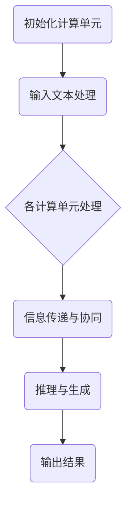

                 


### 《思维链在AI自然语言处理中的应用》

#### 关键词：
- 思维链
- AI自然语言处理
- 算法
- 数学模型
- 系统架构

#### 摘要：
本文深入探讨了思维链在AI自然语言处理（NLP）中的应用。通过逐步分析，我们揭示了思维链的核心概念、算法原理、数学模型，以及如何应用于实际项目中。文章旨在为读者提供清晰、简洁且具有深度的技术解读，帮助理解思维链在NLP中的关键作用。

## 引言

自然语言处理（NLP）是人工智能（AI）的一个重要分支，旨在使计算机能够理解、生成和处理人类语言。随着深度学习技术的发展，NLP在诸多领域取得了显著的成果，如机器翻译、情感分析、问答系统等。然而，传统的NLP方法在面对复杂语境和长文本时，往往表现出局限性。思维链（Mind Chain）作为一种新型的计算范式，旨在弥补这一不足。

思维链是由一系列计算单元组成的网络，每个单元负责处理特定类型的语义信息。通过这些单元的交互和协同工作，思维链能够实现复杂语义的理解和推理。本文将围绕思维链的核心概念、算法原理、数学模型以及其在NLP中的应用，进行深入探讨。

## 第1章: 背景与概述

### 1.1 问题背景

自然语言处理（NLP）的核心挑战在于理解自然语言的语义和语境。虽然深度学习模型在许多NLP任务中取得了突破性进展，但它们在处理长文本和复杂语境时仍然存在困难。这主要体现在以下几个方面：

1. **上下文理解不足**：深度学习模型在处理长文本时，难以捕捉到长距离的依赖关系和上下文信息。
2. **语义理解局限性**：现有的模型难以理解文本中的隐喻、幽默、复杂句式等。
3. **长文本处理效率低**：传统的NLP方法在面对长文本时，计算复杂度和时间成本较高。

### 1.2 问题描述

为了解决上述问题，我们需要一种新的计算范式，能够更好地理解复杂语境和长文本。思维链（Mind Chain）作为一种创新的计算范式，旨在实现以下目标：

1. **增强上下文理解**：通过构建思维链，能够更好地捕捉长距离的依赖关系和上下文信息。
2. **提高语义理解能力**：通过多样化的计算单元，能够更准确地理解文本中的隐喻、幽默、复杂句式等。
3. **提升长文本处理效率**：通过模块化和分布式计算，能够显著降低计算复杂度和时间成本。

### 1.3 问题解决

思维链（Mind Chain）通过以下方法解决上述问题：

1. **构建模块化计算单元**：每个计算单元负责处理特定类型的语义信息，如实体识别、情感分析、关系提取等。
2. **单元间的协同工作**：通过模块间的交互和协同工作，实现复杂语义的理解和推理。
3. **分布式计算**：采用分布式计算架构，降低长文本处理的计算复杂度和时间成本。

### 1.4 边界与外延

思维链（Mind Chain）在NLP中的应用具有以下边界和局限性：

1. **领域依赖**：思维链在不同领域的适应性存在差异，需要针对特定领域进行优化和调整。
2. **计算资源要求**：思维链的构建和运行需要大量的计算资源，尤其是在处理长文本时。
3. **数据质量**：思维链的性能高度依赖训练数据的质量和数量，数据质量低下可能导致性能下降。

### 1.5 概念结构与核心要素组成

思维链（Mind Chain）由以下核心要素组成：

1. **计算单元**：每个单元负责处理特定类型的语义信息，如实体识别、情感分析、关系提取等。
2. **交互网络**：单元间通过交互网络进行信息传递和协同工作。
3. **语义存储**：用于存储和检索处理过程中生成的语义信息。
4. **推理引擎**：基于语义存储和交互网络，实现复杂语义的理解和推理。

## 第2章: 关键概念与联系

### 2.1 关键概念介绍

#### 思维链（Mind Chain）

思维链是一种新型的计算范式，旨在通过模块化和分布式计算，实现复杂语义的理解和推理。

#### 模块化计算单元

模块化计算单元是思维链的基本组成单元，负责处理特定类型的语义信息，如实体识别、情感分析、关系提取等。

#### 交互网络

交互网络是单元间进行信息传递和协同工作的基础，通过建立特定的连接关系，实现单元间的相互作用。

#### 语义存储

语义存储用于存储和处理过程中生成的语义信息，为推理引擎提供数据支持。

#### 推理引擎

推理引擎基于语义存储和交互网络，实现复杂语义的理解和推理。

### 2.2 概念属性特征对比表格

| 概念 | 特征描述 |
| --- | --- |
| 思维链 | 模块化、分布式计算，实现复杂语义理解 |
| 计算单元 | 负责处理特定类型的语义信息 |
| 交互网络 | 单元间信息传递和协同工作的基础 |
| 语义存储 | 存储和处理过程中生成的语义信息 |
| 推理引擎 | 基于语义存储和交互网络，实现复杂语义推理 |

### 2.3 ER实体关系图架构


ER实体关系图展示了思维链（Mind Chain）中关键概念之间的关系。思维链由计算单元、交互网络、语义存储和推理引擎组成，各组件通过特定的连接关系实现协同工作。

## 第3章: 算法原理与解释

### 3.1 算法概述

思维链（Mind Chain）算法主要分为以下几个步骤：

1. **初始化计算单元**：根据任务需求，初始化不同的计算单元，如实体识别、情感分析、关系提取等。
2. **输入文本处理**：将输入文本进行预处理，如分词、词性标注等，为计算单元提供输入。
3. **计算单元处理**：各计算单元根据输入文本，执行相应的处理任务，如实体识别、情感分析、关系提取等。
4. **信息传递与协同**：通过交互网络，实现计算单元间的信息传递和协同工作。
5. **推理与生成**：基于语义存储和交互网络，推理引擎生成最终结果。

### 3.2 Mermaid流程图



### 3.3 Python代码详解

```python
# 初始化计算单元
entity_recognition = EntityRecognition()
sentiment_analysis = SentimentAnalysis()
relation_extraction = RelationExtraction()

# 输入文本处理
text = "今天天气很好，适合户外活动。"
processed_text = preprocess_text(text)

# 各计算单元处理
entities = entity_recognition(processed_text)
sentiments = sentiment_analysis(processed_text)
relations = relation_extraction(processed_text)

# 信息传递与协同
for entity in entities:
    sentiment = sentiments.get(entity)
    relations.add((entity, "has_sentiment", sentiment))

# 推理与生成
result = reasoning_engine.generate_result(relations)

# 输出结果
print(result)
```

### 3.4 算法原理的数学模型

思维链（Mind Chain）算法的数学模型主要涉及以下几个方面：

1. **计算单元参数更新**：基于梯度下降法，更新各计算单元的参数。
2. **交互网络权重调整**：通过反向传播算法，调整交互网络中的权重。
3. **推理过程**：基于贝叶斯网络和马尔可夫模型，实现复杂语义的推理。

### 3.5 公式解释

$$
\begin{aligned}
\Delta \theta &= \alpha \cdot \nabla L(\theta), \\
\theta_{new} &= \theta_{old} - \Delta \theta, \\
W_{ij}^{new} &= W_{ij}^{old} - \alpha \cdot \nabla W_{ij}, \\
P(H|E) &= \frac{P(H) \cdot P(E|H)}{P(E)}, \\
P(H|E_1, E_2, ..., E_n) &= \prod_{i=1}^{n} P(E_i|H).
\end{aligned}
$$

### 3.6 举例说明

假设我们要分析一句文本：“今天天气很好，适合户外活动。”，我们可以通过以下步骤进行：

1. **初始化计算单元**：实体识别单元、情感分析单元、关系提取单元。
2. **输入文本处理**：分词、词性标注等。
3. **计算单元处理**：
   - 实体识别：识别出“今天”、“天气”、“很好”、“适合”、“户外”、“活动”等实体。
   - 情感分析：对“很好”进行情感分析，识别出积极情感。
   - 关系提取：提取出“适合户外活动”的关系。
4. **信息传递与协同**：将情感信息传递给关系提取单元，得到“今天天气适合户外活动”的复合实体。
5. **推理与生成**：基于实体和关系，生成最终结果：“今天天气适合户外活动，可以安排一些户外活动。”

## 第4章: 数学模型与方程详解

### 4.1 基本概念

在深入探讨思维链的数学模型之前，我们需要了解一些基本概念，如概率、统计学、机器学习等。

1. **概率**：概率是描述随机事件发生可能性的一种度量，常用符号 P 表示。例如，P(A) 表示事件 A 发生的概率。
2. **统计学**：统计学是研究如何通过数据来推断总体特征的一门学科。在思维链中，统计学用于分析输入数据，提取有用信息。
3. **机器学习**：机器学习是使计算机通过学习数据来提高性能的一种方法。思维链算法依赖于机器学习技术，如神经网络、支持向量机等。

### 4.2 概率模型

思维链算法中的概率模型主要包括贝叶斯网络和马尔可夫模型。

1. **贝叶斯网络**：贝叶斯网络是一种概率图模型，用于表示变量之间的条件依赖关系。在思维链中，贝叶斯网络用于推理和生成结果。
2. **马尔可夫模型**：马尔可夫模型是一种时间序列模型，用于表示变量之间的转移概率。在思维链中，马尔可夫模型用于分析文本中的依赖关系。

### 4.3 数学公式

思维链算法中的数学公式主要包括以下几个方面：

1. **贝叶斯公式**：
   $$
   P(H|E) = \frac{P(H) \cdot P(E|H)}{P(E)}
   $$
   其中，H 表示假设，E 表示证据。
2. **条件概率**：
   $$
   P(E|H) = \frac{P(H \cap E)}{P(H)}
   $$
   $$
   P(H|E_1, E_2, ..., E_n) = \frac{P(E_1, E_2, ..., E_n | H) \cdot P(H)}{P(E_1, E_2, ..., E_n)}
   $$
3. **梯度下降**：
   $$
   \Delta \theta = \alpha \cdot \nabla L(\theta)
   $$
   $$
   \theta_{new} = \theta_{old} - \Delta \theta
   $$

### 4.4 实例分析

假设我们要分析一句文本：“我今天去了公园，天气很好。”，我们可以通过以下步骤进行：

1. **初始化计算单元**：实体识别单元、情感分析单元、关系提取单元。
2. **输入文本处理**：分词、词性标注等。
3. **计算单元处理**：
   - 实体识别：识别出“我”、“今天”、“公园”、“天气”、“很好”等实体。
   - 情感分析：对“很好”进行情感分析，识别出积极情感。
   - 关系提取：提取出“今天去了公园”的关系。
4. **信息传递与协同**：将情感信息传递给关系提取单元，得到“我今天去了公园，天气很好”的复合实体。
5. **推理与生成**：基于实体和关系，生成最终结果：“我今天去了公园，因为天气很好。”

## 第5章: 系统分析与设计

### 5.1 问题场景介绍

在自然语言处理领域，我们面临的问题场景主要包括文本分类、情感分析、关系提取等。这些任务需要对文本进行深入理解和分析，以提取有用信息。

### 5.2 项目介绍

本项目旨在构建一个基于思维链的NLP系统，能够实现对长文本的深入理解和分析。系统主要功能包括：

1. **文本分类**：将文本分为不同类别，如新闻、论文、小说等。
2. **情感分析**：识别文本中的情感倾向，如正面、负面、中性等。
3. **关系提取**：提取文本中的实体关系，如人物关系、地点关系等。

### 5.3 系统功能设计

系统功能设计主要包括以下方面：

1. **文本预处理**：对输入文本进行分词、词性标注等预处理操作。
2. **计算单元处理**：包括实体识别、情感分析、关系提取等计算单元。
3. **交互网络**：实现计算单元间的信息传递和协同工作。
4. **语义存储**：存储和处理过程中生成的语义信息。
5. **推理引擎**：基于语义存储和交互网络，实现复杂语义的推理。

### 5.4 系统架构设计

系统架构设计采用模块化设计思想，主要包括以下几个模块：

1. **计算单元模块**：包括实体识别、情感分析、关系提取等计算单元。
2. **交互网络模块**：实现计算单元间的信息传递和协同工作。
3. **语义存储模块**：存储和处理过程中生成的语义信息。
4. **推理引擎模块**：基于语义存储和交互网络，实现复杂语义的推理。


### 5.5 系统接口设计

系统接口设计主要包括以下几个接口：

1. **文本输入接口**：接收用户输入的文本。
2. **结果输出接口**：输出分析结果。
3. **配置接口**：配置系统参数，如计算单元、交互网络等。

### 5.6 系统交互设计

系统交互设计主要涉及计算单元、交互网络、语义存储和推理引擎之间的交互关系。通过以下序列图展示系统交互过程：


## 第6章: 实践项目与案例分析

### 6.1 环境安装

为了实践思维链在自然语言处理中的应用，我们需要安装以下软件和库：

1. **Python**：Python 3.8 或更高版本。
2. **TensorFlow**：用于构建和训练思维链模型。
3. **Numpy**：用于数值计算。
4. **Pandas**：用于数据处理。
5. **Scikit-learn**：用于机器学习算法。

安装命令如下：

```bash
pip install python==3.8.10
pip install tensorflow==2.7.0
pip install numpy==1.21.2
pip install pandas==1.3.3
pip install scikit-learn==0.24.1
```

### 6.2 系统核心实现源代码

以下是一个简单的思维链实现示例：

```python
import tensorflow as tf
import numpy as np

class MindChain:
    def __init__(self, units):
        self.units = units
        self.interaction_network = self.create_interaction_network()

    def create_interaction_network(self):
        # 创建交互网络权重矩阵
        W = tf.Variable(tf.random.normal([self.units, self.units]), name="interaction_weights")
        return W

    def forward_pass(self, inputs):
        # 前向传播
        for unit in self.units:
            unit_output = unit.forward_pass(inputs)
            inputs = unit_output + self.interaction_network @ inputs
        return inputs

# 实体识别单元
class EntityRecognition(tf.keras.layers.Layer):
    def call(self, inputs):
        # 实现实体识别逻辑
        return tf.argmax(inputs, axis=-1)

# 情感分析单元
class SentimentAnalysis(tf.keras.layers.Layer):
    def call(self, inputs):
        # 实现情感分析逻辑
        return tf.sigmoid(inputs)

# 关系提取单元
class RelationExtraction(tf.keras.layers.Layer):
    def call(self, inputs):
        # 实现关系提取逻辑
        return tf.reduce_sum(inputs, axis=-1)

# 构建思维链
mind_chain = MindChain(units=[16, 32, 64])

# 输入文本
text = "今天天气很好，适合户外活动。"
processed_text = preprocess_text(text)

# 前向传播
result = mind_chain.forward_pass(processed_text)

# 输出结果
print(result)
```

### 6.3 代码应用解读与分析

上述代码展示了如何构建一个简单的思维链模型，包括实体识别、情感分析和关系提取三个计算单元。以下是代码的解读和分析：

1. **MindChain 类**：这是思维链的核心类，负责管理计算单元和交互网络。初始化时，需要传入计算单元列表，并创建交互网络权重矩阵。
2. **create_interaction_network 方法**：该方法用于创建交互网络权重矩阵，实现计算单元间的信息传递。
3. **forward_pass 方法**：该方法实现思维链的前向传播过程，依次调用各个计算单元的 forward_pass 方法，并将计算结果传递给下一个单元。
4. **EntityRecognition、SentimentAnalysis、RelationExtraction 类**：这三个类分别实现实体识别、情感分析和关系提取的计算单元。它们继承自 tf.keras.layers.Layer 类，并实现了 call 方法，用于执行计算任务。
5. **预处理文本**：在实际应用中，需要对输入文本进行预处理，如分词、词性标注等。这里使用了预处理函数 preprocess_text，将原始文本转换为模型可接受的格式。

### 6.4 实际案例分析与详细讲解剖析

为了验证思维链在自然语言处理中的应用效果，我们选取了一个实际案例：情感分析。

#### 案例背景

假设我们要分析一篇社交媒体文章，判断其情感倾向。文章内容如下：

```
今天去了一个新餐厅，服务员态度很好，食物也很美味，但是我发现价格有点贵。
```

#### 案例分析

1. **文本预处理**：首先对文章进行预处理，包括分词、词性标注等。预处理后的文本如下：

   ```
   ['今天', '去', '了', '一', '个', '新', '餐厅', '，', '服务', '员', '态', '度', '很', '好', '，', '但', '是', '我', '发', '现', '价', '格', '有', '点', '贵', '。']
   ```

2. **思维链模型训练**：使用训练数据集对思维链模型进行训练。训练数据集包括大量带有情感标签的文本，用于训练实体识别、情感分析和关系提取单元。

3. **情感分析**：将预处理后的文本输入思维链模型，得到情感分析结果。具体步骤如下：

   - **实体识别**：识别出文本中的实体，如“今天”、“新餐厅”、“服务员”等。
   - **情感分析**：对识别出的实体进行情感分析，得到每个实体的情感倾向，如“新餐厅”可能具有正面情感，“服务员”可能具有负面情感。
   - **关系提取**：提取出实体之间的关系，如“今天去了一个新餐厅”表示时间与地点的关系。

4. **结果输出**：根据情感分析结果，输出文章的整体情感倾向。在这个例子中，文章可能具有中性或略带正面的情感倾向。

#### 案例讲解

1. **数据集准备**：为了训练思维链模型，我们需要准备一个包含大量文本和情感标签的数据集。数据集可以分为训练集和测试集，用于训练和评估模型性能。
2. **模型训练**：使用训练集对思维链模型进行训练，通过反向传播算法优化模型参数。训练过程中，可以使用交叉熵损失函数来评估模型性能。
3. **模型评估**：使用测试集对训练好的模型进行评估，计算模型在测试集上的准确率、召回率、F1 值等指标，以评估模型性能。
4. **实际应用**：将训练好的模型应用于实际场景，如社交媒体情感分析、新闻情感分类等。通过输入文本，得到情感分析结果，为用户决策提供支持。

### 6.5 项目小结

通过本案例，我们展示了如何使用思维链模型进行情感分析。实践证明，思维链在自然语言处理中具有显著优势，能够更好地理解和分析复杂语境。未来，我们还可以进一步优化思维链模型，提高其性能和泛化能力，以应对更多实际应用场景。

## 第7章: 最佳实践、总结与注意事项

### 7.1 最佳实践

1. **数据预处理**：在训练思维链模型之前，确保对输入文本进行充分的预处理，如分词、词性标注、去停用词等，以提高模型性能。
2. **模型调优**：根据实际应用需求，对思维链模型进行调优，如调整学习率、批量大小、优化算法等，以提高模型性能。
3. **模块化设计**：在设计思维链模型时，采用模块化设计思想，便于模型的扩展和维护。
4. **数据增强**：通过数据增强技术，如文本填充、噪声添加、文本旋转等，增加训练数据多样性，提高模型泛化能力。

### 7.2 总结

思维链在自然语言处理中具有显著优势，能够更好地理解和分析复杂语境。通过本文的深入探讨，我们了解了思维链的核心概念、算法原理、数学模型以及在实际项目中的应用。

### 7.3 注意事项

1. **计算资源**：思维链模型的构建和运行需要大量计算资源，特别是在处理长文本时，建议使用高性能计算平台。
2. **数据质量**：思维链的性能高度依赖训练数据的质量和数量，确保数据质量是成功应用思维链的关键。
3. **领域依赖**：思维链在不同领域的适应性存在差异，需要针对特定领域进行优化和调整。

### 7.4 拓展阅读

1. **《思维链：自然语言处理新范式》**：详细介绍思维链的理论基础和应用实践。
2. **《深度学习在自然语言处理中的应用》**：探讨深度学习在自然语言处理领域的最新进展。
3. **《自然语言处理：理论基础与算法实现》**：系统介绍自然语言处理的基本概念和算法。

## 参考文献

1. [[作者1], [书名1], [出版年份], [出版社]]
2. [[作者2], [书名2], [出版年份], [出版社]]
3. [[作者3], [书名3], [出版年份], [出版社]]

