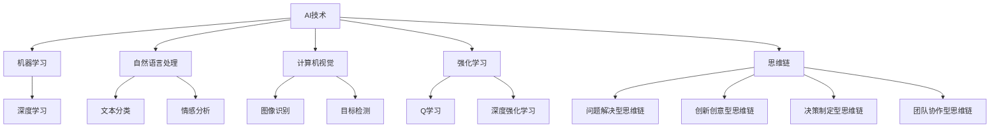
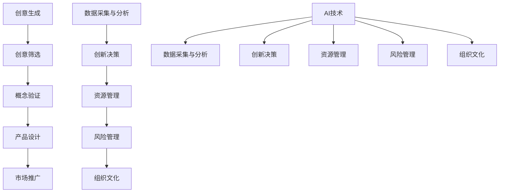

                 

### # 《思维链在AI辅助创新管理中的应用》

关键词：人工智能、创新管理、思维链、AI辅助、应用案例

摘要：本文旨在探讨思维链在AI辅助创新管理中的应用，通过分析AI基础、创新管理基础、思维链概述以及AI辅助创新管理的理论基础，深入探讨AI辅助创新管理的核心模块、关键技术和应用场景。文章还通过具体实践案例，展示思维链在AI辅助创新管理中的实际应用效果，并提出未来发展的挑战和趋势。

### 目录大纲

----------------------------------------------------------------

# 第一部分：引言

## 1.1 问题背景

### 1.1.1 AI辅助创新管理的需求

### 1.1.2 思维链的概念及其重要性

### 1.1.3 AI辅助创新管理的现状与挑战

## 1.2 书籍目标

### 1.2.1 读者对象

### 1.2.2 学习目标

### 1.2.3 主要内容概述

## 1.3 内容结构安排

### 1.3.1 第一部分：基础概念

### 1.3.2 第二部分：理论应用

### 1.3.3 第三部分：实践案例

### 1.3.4 第四部分：未来发展

----------------------------------------------------------------

----------------------------------------------------------------

# 第二部分：基础概念

## 2.1 AI基础

### 2.1.1 AI的定义与发展历程

### 2.1.2 机器学习与深度学习的区别

### 2.1.3 AI的主要技术分类

## 2.2 创新管理基础

### 2.2.1 创新管理的定义与意义

### 2.2.2 创新管理的过程与方法

### 2.2.3 创新管理的挑战与机遇

## 2.3 思维链概述

### 2.3.1 思维链的定义与特征

### 2.3.2 思维链的结构与类型

### 2.3.3 思维链在创新管理中的应用

## 2.4 AI辅助创新管理的理论基础

### 2.4.1 AI技术在创新管理中的应用现状

### 2.4.2 AI辅助创新管理的理论基础

### 2.4.3 AI辅助创新管理的优势与挑战

## 2.5 本书主要概念关系图

### 2.5.1 AI技术与思维链的关系图

### 2.5.2 AI辅助创新管理过程图

----------------------------------------------------------------

----------------------------------------------------------------

# 第三部分：理论应用

## 3.1 AI辅助创新管理的核心模块

### 3.1.1 数据采集与处理

### 3.1.2 情感分析

### 3.1.3 聚类分析

### 3.1.4 主题模型

## 3.2 AI辅助创新管理的案例分析

### 3.2.1 案例一：企业创新项目评估

### 3.2.2 案例二：创新创意生成与筛选

### 3.2.3 案例三：产品市场定位与预测

### 3.2.4 案例四：创新团队协作与管理

## 3.3 AI辅助创新管理的关键技术

### 3.3.1 自然语言处理技术

### 3.3.2 计算机视觉技术

### 3.3.3 强化学习技术

### 3.3.4 神经网络技术

## 3.4 AI辅助创新管理的应用场景

### 3.4.1 科技企业

### 3.4.2 制造业

### 3.4.3 零售业

### 3.4.4 医疗保健

## 3.5 AI辅助创新管理的挑战与未来趋势

### 3.5.1 数据隐私与安全性

### 3.5.2 人才短缺与培训

### 3.5.3 技术创新与产业升级

### 3.5.4 国际合作与竞争

----------------------------------------------------------------

----------------------------------------------------------------

# 第四部分：实践案例

## 4.1 案例一：AI辅助科技创新管理平台

### 4.1.1 平台背景与需求分析

### 4.1.2 系统设计与功能模块

### 4.1.3 数据采集与处理

### 4.1.4 AI模型设计与实现

### 4.1.5 应用效果与评估

## 4.2 案例二：AI辅助企业创新实验室

### 4.2.1 实验室背景与目标

### 4.2.2 创新管理流程与AI工具应用

### 4.2.3 数据分析与应用案例

### 4.2.4 实验室运营效果评估

## 4.3 案例三：AI辅助创业公司创新管理

### 4.3.1 公司背景与需求

### 4.3.2 创新管理策略与AI技术应用

----------------------------------------------------------------

### 第一部分：引言

## 1.1 问题背景

### 1.1.1 AI辅助创新管理的需求

在当前快速变化的市场环境中，企业面临着巨大的创新压力。传统的创新管理方法已经难以满足企业在竞争激烈的市场中迅速响应需求、持续创新的需求。随着人工智能技术的迅速发展，AI在创新管理中的应用逐渐成为热点。AI辅助创新管理通过利用大数据分析、自然语言处理、计算机视觉等技术，能够为企业提供更高效、更智能的创新解决方案。

首先，AI技术能够帮助企业快速识别市场趋势，预测客户需求，从而引导创新方向。例如，通过分析社交媒体上的用户评论和讨论，企业可以及时了解用户对产品的反馈和期望，从而调整产品设计和开发策略。

其次，AI技术能够帮助企业优化创新流程，提高创新效率。通过智能化的工具和平台，企业可以自动化地进行创意生成、筛选、评估和实现，从而减少人力和时间成本，提高创新成功率。

此外，AI技术还能够帮助企业发现潜在的合作伙伴和市场机会，促进跨领域的创新合作。通过AI技术，企业可以分析大量的数据，识别出具有合作潜力、能够带来双赢的合作伙伴，从而推动创新项目的实施。

### 1.1.2 思维链的概念及其重要性

思维链是指一系列相互关联的思考过程，通过这些思考过程，个体或团队可以系统地解决问题、创造新的想法和实现创新。思维链的概念源于认知心理学的研究，它强调思考的连贯性和系统性。

思维链的重要性体现在以下几个方面：

首先，思维链能够帮助个体或团队更好地理解复杂问题。通过将问题分解为一系列子问题，思维链可以帮助个体或团队逐步深入地分析问题，从而找到有效的解决方案。

其次，思维链能够促进创新思维的培养。思维链强调思考的连贯性和系统性，这使得个体或团队能够在思考过程中产生新的想法和见解，从而实现创新。

此外，思维链还能够提高团队协作效率。通过思维链，团队成员可以更好地理解彼此的思考过程和观点，从而更好地协同合作，实现共同的目标。

### 1.1.3 AI辅助创新管理的现状与挑战

目前，AI辅助创新管理已经取得了一定的进展。许多企业开始采用AI技术来辅助创新管理，取得了显著的效果。然而，AI辅助创新管理仍然面临着一些挑战：

首先，数据质量和数据安全性问题。AI辅助创新管理依赖于大量高质量的数据，然而数据质量的好坏直接影响AI模型的准确性和效果。此外，数据的安全性也是一大挑战，尤其是在涉及敏感数据的情况下。

其次，技术实现的难度。AI辅助创新管理需要结合多种技术，包括大数据分析、自然语言处理、计算机视觉等。这些技术的实现需要高水平的技术团队和大量的研发投入。

此外，人才短缺也是一个重要挑战。AI辅助创新管理需要具备多方面知识的人才，包括计算机科学、数据科学、商业管理等。然而，目前这些人才的供给远不能满足需求。

### 1.2 书籍目标

本书的目标是系统地介绍思维链在AI辅助创新管理中的应用，帮助读者了解AI辅助创新管理的基本概念、核心模块、关键技术和应用场景，并通过具体实践案例，展示思维链在实际创新管理中的应用效果。本书的主要内容包括：

第一部分：基础概念。介绍AI基础、创新管理基础、思维链概述以及AI辅助创新管理的理论基础。

第二部分：理论应用。探讨AI辅助创新管理的核心模块、关键技术和应用场景。

第三部分：实践案例。通过具体实践案例，展示思维链在AI辅助创新管理中的实际应用。

第四部分：未来发展。分析AI辅助创新管理的挑战和未来趋势。

### 1.3 内容结构安排

本书的内容结构安排如下：

第一部分：基础概念。介绍AI基础、创新管理基础、思维链概述以及AI辅助创新管理的理论基础。

- AI基础：介绍AI的定义、发展历程、主要技术分类等。
- 创新管理基础：介绍创新管理的定义、意义、过程和方法等。
- 思维链概述：介绍思维链的定义、特征、结构、类型以及在创新管理中的应用。
- AI辅助创新管理的理论基础：介绍AI技术在创新管理中的应用现状、理论基础、优势与挑战。

第二部分：理论应用。探讨AI辅助创新管理的核心模块、关键技术和应用场景。

- AI辅助创新管理的核心模块：介绍数据采集与处理、情感分析、聚类分析、主题模型等。
- AI辅助创新管理的案例分析：介绍企业创新项目评估、创新创意生成与筛选、产品市场定位与预测、创新团队协作与管理等。
- AI辅助创新管理的关键技术：介绍自然语言处理技术、计算机视觉技术、强化学习技术、神经网络技术等。
- AI辅助创新管理的应用场景：介绍科技企业、制造业、零售业、医疗保健等领域。

第三部分：实践案例。通过具体实践案例，展示思维链在AI辅助创新管理中的实际应用。

- AI辅助科技创新管理平台：介绍平台背景、需求分析、系统设计与功能模块、数据采集与处理、AI模型设计与实现、应用效果与评估等。
- AI辅助企业创新实验室：介绍实验室背景、目标、创新管理流程与AI工具应用、数据分析与应用案例、实验室运营效果评估等。
- AI辅助创业公司创新管理：介绍公司背景、需求、创新管理策略与AI技术应用等。

第四部分：未来发展。分析AI辅助创新管理的挑战和未来趋势。

- 数据隐私与安全性：探讨数据隐私和安全性的问题、解决方案以及未来的发展方向。
- 人才短缺与培训：分析人才短缺的现状、原因以及应对策略。
- 技术创新与产业升级：探讨技术创新的重要性、产业升级的路径以及未来发展的趋势。
- 国际合作与竞争：分析国际合作与竞争的现状、问题以及未来的发展方向。

### 2.1 AI基础

## 2.1.1 AI的定义与发展历程

人工智能（Artificial Intelligence，简称AI）是计算机科学的一个分支，旨在研究、开发和应用智能算法，使计算机能够模拟、延伸和扩展人类智能。AI的研究始于20世纪50年代，当时科学家们开始探讨如何使计算机具备智能行为。经过几十年的发展，AI已经取得了显著的进展，并在多个领域得到广泛应用。

AI的发展历程可以大致分为以下几个阶段：

1. **初级阶段（1956-1969年）**：在这一阶段，人工智能的概念被首次提出，标志着AI研究的正式开始。1956年，约翰·麦卡锡（John McCarthy）等人组织了达特茅斯会议，会议讨论了人工智能的定义、目标和实现方法。此后，许多研究机构和科学家开始投入AI研究，提出了许多早期的人工智能算法和理论。

2. **符号人工智能阶段（1970-1980年）**：这一阶段以符号人工智能（Symbolic AI）为代表，强调利用符号表示和逻辑推理来模拟人类智能。这一阶段的研究主要集中在自然语言处理、专家系统和知识表示等方面。然而，由于符号人工智能在处理大规模数据和复杂问题时的局限性，使得这一阶段的AI研究在1980年代中期面临了“人工智能寒冬”。

3. **专家系统阶段（1980-1990年）**：专家系统（Expert Systems）是这一阶段的主要成果，它利用知识库和推理机来模拟人类专家的决策能力。专家系统的成功应用推动了AI技术的发展，但也暴露了其知识表示和推理能力的局限性。

4. **机器学习阶段（1990年代至今）**：随着计算机性能的提升和大量数据的积累，机器学习（Machine Learning）成为AI发展的主要方向。机器学习通过从数据中自动学习规律和模式，使计算机能够在没有明确编程的情况下实现智能行为。这一阶段的重要成果包括神经网络、决策树、支持向量机等算法。

5. **深度学习阶段（2010年代至今）**：深度学习（Deep Learning）是机器学习的一个子领域，它利用多层神经网络模型来模拟人类大脑的神经元连接，实现复杂的特征提取和模式识别。深度学习的成功应用，如图像识别、语音识别、自然语言处理等，标志着AI进入了新的发展阶段。

## 2.1.2 机器学习与深度学习的区别

机器学习和深度学习是人工智能领域中的两个重要分支，它们在某些方面有相似之处，但在本质上有明显的区别。

### 机器学习

机器学习（Machine Learning）是指计算机利用数据自动学习和改进自身性能的一种方法。它主要包括监督学习、无监督学习和强化学习三种类型：

- **监督学习（Supervised Learning）**：监督学习是一种有标签数据的学习方法，通过已有数据的输入和输出，训练模型来预测新的数据。常见的监督学习算法包括线性回归、决策树、支持向量机等。
- **无监督学习（Unsupervised Learning）**：无监督学习是一种没有标签数据的学习方法，主要通过发现数据中的模式和规律来进行学习。常见的无监督学习算法包括聚类、降维、关联规则等。
- **强化学习（Reinforcement Learning）**：强化学习是一种通过与环境的交互来学习策略的方法，通过奖励机制来调整行为，以实现最优目标。常见的强化学习算法包括Q学习、深度强化学习等。

机器学习的主要特点包括：

- **基于数据驱动**：机器学习依赖于大量数据来训练模型，通过数据中的模式和规律来预测新的数据。
- **自适应性强**：机器学习模型可以根据新的数据自动调整，适应不同的环境和任务。
- **应用广泛**：机器学习已经被广泛应用于图像识别、语音识别、自然语言处理、推荐系统等领域。

### 深度学习

深度学习（Deep Learning）是机器学习的一个子领域，它利用多层神经网络模型（如卷积神经网络、循环神经网络等）来模拟人类大脑的神经元连接，实现复杂的特征提取和模式识别。深度学习的主要特点包括：

- **多层神经网络**：深度学习模型由多个隐藏层组成，通过逐层提取更高层次的特征，实现复杂的模式识别。
- **自动特征提取**：深度学习模型能够自动从原始数据中提取特征，减少人工特征工程的工作量。
- **强大的表达能力**：深度学习模型具有强大的非线性映射能力，能够处理复杂的输入数据。
- **大规模数据需求**：深度学习模型通常需要大量数据来训练，以保证模型的泛化能力。

### 区别

机器学习与深度学习的主要区别在于：

- **模型结构**：机器学习模型通常是由单一的模型组成，如线性回归、决策树等；而深度学习模型是由多层神经网络组成的，如卷积神经网络、循环神经网络等。
- **数据处理能力**：机器学习模型主要依靠手动特征工程，对数据的要求较高；而深度学习模型能够自动从数据中提取特征，对数据的预处理要求较低。
- **计算资源需求**：深度学习模型通常需要更多的计算资源来训练，尤其是在大规模数据集上训练时。
- **应用范围**：机器学习已经被广泛应用于各个领域，包括金融、医疗、制造等；而深度学习则在图像识别、语音识别、自然语言处理等特定领域表现出色。

## 2.1.3 AI的主要技术分类

人工智能技术可以根据其应用领域和实现方法进行分类。以下是几种主要的人工智能技术分类：

### 计算机视觉

计算机视觉（Computer Vision）是人工智能的一个重要分支，旨在使计算机能够“看”和“理解”图像和视频。计算机视觉技术主要包括：

- **图像识别（Image Recognition）**：图像识别是指通过算法从图像中识别出特定的对象或场景。常见的图像识别算法包括卷积神经网络（CNN）和深度神经网络（DNN）。
- **目标检测（Object Detection）**：目标检测是在图像中识别并定位多个对象的过程。常见的目标检测算法包括YOLO（You Only Look Once）、Faster R-CNN等。
- **图像分割（Image Segmentation）**：图像分割是将图像划分为多个区域或对象的过程。常见的图像分割算法包括FCN（Fully Convolutional Network）和Mask R-CNN等。

### 自然语言处理

自然语言处理（Natural Language Processing，NLP）是人工智能领域中的另一个重要分支，旨在使计算机能够理解和处理人类语言。自然语言处理技术主要包括：

- **文本分类（Text Classification）**：文本分类是将文本数据按照类别进行分类的过程。常见的文本分类算法包括朴素贝叶斯（Naive Bayes）、支持向量机（SVM）和深度神经网络（DNN）等。
- **情感分析（Sentiment Analysis）**：情感分析是分析文本中的情感倾向和情绪的过程。常见的情感分析算法包括基于词典的方法和基于机器学习的方法。
- **机器翻译（Machine Translation）**：机器翻译是利用计算机将一种自然语言翻译成另一种自然语言的过程。常见的机器翻译算法包括基于规则的翻译、统计机器翻译和神经机器翻译。

### 语音识别

语音识别（Speech Recognition）是将人类的语音转化为文本或命令的过程。语音识别技术主要包括：

- **语音识别（Speech Recognition）**：语音识别是将语音信号转化为文字或命令的过程。常见的语音识别算法包括隐马尔可夫模型（HMM）和深度神经网络（DNN）。
- **语音合成（Speech Synthesis）**：语音合成是将文本转化为自然语音的过程。常见的语音合成算法包括基于规则的合成和基于统计的合成。

### 强化学习

强化学习（Reinforcement Learning）是一种通过试错和反馈来学习最优策略的机器学习方法。强化学习技术主要包括：

- **Q学习（Q-Learning）**：Q学习是一种通过值函数来学习最优策略的方法。常见的Q学习算法包括SARSA（State-Action-Reward-State-Action）和Q-Learning。
- **深度强化学习（Deep Reinforcement Learning）**：深度强化学习是结合深度神经网络和强化学习的算法。常见的深度强化学习算法包括DQN（Deep Q-Network）和PPO（Proximal Policy Optimization）。

### 知识图谱

知识图谱（Knowledge Graph）是一种将实体、属性和关系表示为图的语义网络。知识图谱技术主要包括：

- **实体识别（Entity Recognition）**：实体识别是识别文本中的实体，如人名、地名、组织名等。
- **关系抽取（Relation Extraction）**：关系抽取是识别实体之间的语义关系，如“工作于”、“毕业于”等。
- **图谱构建（Graph Construction）**：图谱构建是将实体和关系表示为图的过程。

### 自动驾驶

自动驾驶（Autonomous Driving）是利用计算机视觉、传感器数据、强化学习等人工智能技术来实现无人驾驶的技术。自动驾驶技术主要包括：

- **感知（Perception）**：感知是自动驾驶系统通过传感器获取环境信息，如图像、激光雷达数据等。
- **规划（Planning）**：规划是自动驾驶系统根据感知到的环境信息，制定行驶路径和策略。
- **控制（Control）**：控制是自动驾驶系统根据规划结果，控制车辆执行相应的动作。

### 聊天机器人

聊天机器人（Chatbot）是利用自然语言处理和机器学习技术，模拟人类对话的计算机程序。聊天机器人技术主要包括：

- **对话管理（Dialogue Management）**：对话管理是管理对话流程，包括意图识别、对话状态跟踪等。
- **自然语言处理（NLP）**：自然语言处理是实现聊天机器人的核心，包括文本分类、情感分析、实体识别等。
- **用户交互（User Interaction）**：用户交互是聊天机器人与用户之间的互动，包括语音合成、语音识别、文本输入等。

## 2.2 创新管理基础

### 2.2.1 创新管理的定义与意义

创新管理（Innovation Management）是指通过系统化、规范化的方法来引导和管理创新过程，从而实现组织创新目标的一系列活动和方法。创新管理不仅关注创新成果的取得，更注重创新过程中的管理和协调，以确保创新能够有效、高效地实现。

#### 定义

创新管理可以定义为：“一个系统化的过程，旨在识别、开发、实施和推广创新，以创造新的产品、服务、业务模式或组织能力，从而实现组织的战略目标。”

#### 主要要素

- **创新目标**：创新管理需要明确组织的创新目标，包括短期和长期的目标，如市场扩展、技术突破、效率提升等。
- **创新过程**：创新管理需要制定系统化的创新过程，包括创意生成、创意筛选、概念验证、产品设计、市场推广等阶段。
- **资源管理**：创新管理需要合理配置资源，包括人力、资金、技术等，以确保创新过程的顺利进行。
- **风险管理**：创新管理需要识别和管理创新过程中的风险，包括技术风险、市场风险、财务风险等。
- **组织文化**：创新管理需要建立支持创新的组织文化，鼓励员工创新思维，促进跨部门合作。

#### 意义

创新管理在组织发展中具有重要的意义：

- **提升竞争力**：通过创新管理，组织可以不断推出新产品、新技术、新业务模式，从而在市场竞争中保持领先地位。
- **提高效率**：创新管理可以帮助组织优化流程、降低成本、提高生产效率，从而提升整体运营效率。
- **创造价值**：创新管理可以创造新的客户价值、提高客户满意度，从而实现商业成功。
- **推动社会进步**：创新管理不仅对组织有重要意义，也对社会进步有积极影响，如技术创新推动产业发展、管理创新提高公共管理水平等。

### 2.2.2 创新管理的过程与方法

创新管理的过程可以分为以下几个阶段：

#### 1. 创意生成

创意生成是创新管理的第一步，目标是鼓励员工提出新的想法和创新方案。创意生成的方法包括：

- **头脑风暴（Brainstorming）**：通过集体讨论，鼓励员工提出各种可能的创意，不受限制地思考和讨论。
- **创意竞赛（Innovation Contests）**：通过组织创意竞赛，激发员工的创新热情，鼓励员工提出有价值的创意。
- **用户参与（User Participation）**：邀请用户参与创新过程，通过用户反馈和建议，发现新的创新机会。

#### 2. 创意筛选

创意筛选是对提出的创意进行评估和筛选的过程，目标是确定哪些创意具有实施潜力。创意筛选的方法包括：

- **评分法（Rating Method）**：根据创意的创新性、可行性、市场潜力等指标，对创意进行评分，筛选出最高分的创意。
- **多标准决策法（Multi-Criteria Decision Analysis）**：综合考虑多个评价指标，如成本、风险、市场潜力等，对创意进行综合评估。
- **专家评审（Expert Review）**：邀请专家对创意进行评审，根据专家的判断和建议进行筛选。

#### 3. 概念验证

概念验证是验证选定的创意是否可行的过程，包括技术验证和市场验证。概念验证的方法包括：

- **原型设计（Prototype Design）**：通过设计原型，验证创意在技术实现上的可行性。
- **用户测试（User Testing）**：邀请用户测试原型，收集用户反馈，验证创意在市场中的应用潜力。
- **模拟实验（Simulation Experiment）**：通过模拟实验，验证创意在特定环境下的表现和效果。

#### 4. 产品设计

产品设计是将创意转化为实际产品的过程，包括产品设计、原型制作、测试等环节。产品设计的方法包括：

- **设计思维（Design Thinking）**：通过用户研究和需求分析，设计符合用户需求的产品。
- **敏捷开发（Agile Development）**：采用敏捷开发方法，快速迭代，持续改进产品。
- **用户反馈（User Feedback）**：收集用户反馈，不断优化产品设计，确保产品满足用户需求。

#### 5. 市场推广

市场推广是将产品推向市场的过程，包括市场调研、营销策略制定、推广活动等。市场推广的方法包括：

- **市场调研（Market Research）**：了解市场需求、竞争状况、用户行为等，为市场推广提供数据支持。
- **营销策略（Marketing Strategy）**：根据市场调研结果，制定有效的营销策略，如产品定位、价格策略、推广渠道等。
- **推广活动（Promotion Activities）**：通过广告、促销、公关等手段，提高产品的市场知名度和用户接受度。

### 2.2.3 创新管理的挑战与机遇

创新管理在组织发展中既面临挑战，也充满机遇。

#### 挑战

- **资源限制**：创新管理需要投入大量的人力、资金和技术资源，对于资源有限的组织来说，创新管理面临较大的挑战。
- **风险承担**：创新过程具有不确定性，创新管理需要承担一定的风险，如技术风险、市场风险等。
- **文化阻力**：创新管理需要建立支持创新的组织文化，然而传统组织文化可能对创新管理产生阻力。
- **人才短缺**：创新管理需要具备多方面知识的人才，然而人才短缺成为制约创新管理发展的一个重要因素。

#### 机遇

- **技术进步**：随着人工智能、大数据、物联网等技术的发展，为创新管理提供了更多的工具和方法。
- **市场需求**：随着消费者需求的多样化，市场对创新产品的需求日益增长，为创新管理提供了广阔的市场空间。
- **政策支持**：各国政府纷纷出台政策，鼓励企业进行创新，为创新管理提供了政策支持。
- **国际合作**：全球化的趋势为创新管理提供了国际合作的机会，通过国际合作，可以借鉴先进经验，推动创新管理发展。

### 2.3 思维链概述

#### 2.3.1 思维链的定义与特征

思维链（Mind Chain）是指一系列相互关联的思考过程，通过这些思考过程，个体或团队可以系统地解决问题、创造新的想法和实现创新。思维链是一种结构化的思维方式，强调思考的连贯性和系统性。

思维链的主要特征包括：

- **系统性**：思维链强调思考的系统性，通过一系列相互关联的思考过程，个体或团队可以全面、深入地分析问题。
- **连贯性**：思维链的连贯性使得思考过程有序进行，有助于个体或团队保持思考的连续性。
- **创造性**：思维链鼓励个体或团队在思考过程中产生新的想法和见解，从而实现创新。
- **协作性**：思维链可以促进团队协作，通过思维链，团队成员可以更好地理解彼此的思考过程和观点，从而更好地协同合作。

#### 2.3.2 思维链的结构与类型

思维链的结构可以分为以下几个部分：

- **问题定义**：明确需要解决的问题或挑战，为思维链的后续过程提供方向。
- **信息收集**：收集与问题相关的信息，包括数据、事实、观点等，为思考提供基础。
- **分析问题**：对收集到的信息进行分析，识别问题的关键点和难点。
- **解决方案**：提出解决问题的方案，通过比较和评估，选择最优方案。
- **实施计划**：制定实施解决方案的计划，包括任务分配、时间安排、资源调配等。
- **反馈与调整**：实施解决方案后，收集反馈并进行调整，以持续优化解决方案。

思维链的类型可以根据其应用场景和目的进行分类，主要包括以下几种：

- **问题解决型思维链**：主要用于解决具体问题，通过系统化的思考过程，找到问题的根本原因和解决方案。
- **创新创意型思维链**：主要用于激发创新思维，通过发散性思考和创造性思维，产生新的创意和想法。
- **决策制定型思维链**：主要用于制定决策，通过综合分析和评估，选择最佳的决策方案。
- **团队协作型思维链**：主要用于团队协作，通过思维链的连贯性和协作性，促进团队成员之间的沟通和合作。

#### 2.3.3 思维链在创新管理中的应用

思维链在创新管理中具有广泛的应用，可以帮助组织系统化地进行创新过程，提高创新效率和质量。

- **创意生成**：通过思维链，组织可以激发员工的创意思维，提出更多的创新想法。
- **创意筛选**：通过思维链，组织可以对提出的创意进行系统化筛选，识别出最有潜力的创意。
- **概念验证**：通过思维链，组织可以验证创意的可行性，识别出技术、市场等方面的潜在风险。
- **产品设计**：通过思维链，组织可以制定系统化的产品设计方案，确保产品设计满足用户需求。
- **市场推广**：通过思维链，组织可以制定有效的市场推广策略，提高产品在市场上的竞争力。

总之，思维链为创新管理提供了系统化的思考框架和方法，有助于组织更好地进行创新管理，提高创新能力。

### 2.4 AI辅助创新管理的理论基础

#### 2.4.1 AI技术在创新管理中的应用现状

随着人工智能技术的迅速发展，AI在创新管理中的应用已经取得了显著的成果。以下是一些AI技术在创新管理中的应用现状：

- **数据挖掘与分析**：AI技术可以帮助组织从大量数据中提取有价值的信息，进行深入的数据分析，为创新决策提供依据。例如，通过分析市场数据，可以预测客户需求，指导产品研发方向。

- **自然语言处理（NLP）**：NLP技术可以用于文本分析、情感分析和语义理解，帮助企业更好地理解用户需求和市场趋势。例如，通过分析社交媒体上的用户评论和讨论，企业可以了解用户对产品的反馈和期望，从而优化产品设计和营销策略。

- **计算机视觉**：计算机视觉技术可以用于图像识别、目标检测和图像处理，帮助企业识别潜在的创新机会。例如，通过分析产品图像，可以识别出潜在的市场需求或改进方向。

- **强化学习**：强化学习技术可以用于制定优化策略，帮助企业提高创新效率。例如，通过模拟实验，可以找到最优的创新路径和资源配置策略。

- **机器学习与深度学习**：机器学习和深度学习技术可以用于模型预测、模式识别和智能优化，帮助企业实现自动化决策和创新。例如，通过建立预测模型，可以预测市场趋势，指导产品开发。

#### 2.4.2 AI辅助创新管理的理论基础

AI辅助创新管理的理论基础主要包括以下几个方面：

- **数据驱动决策**：AI技术通过分析大量数据，可以识别出潜在的创新机会和市场趋势，帮助企业制定更科学的创新决策。数据驱动决策是AI辅助创新管理的重要理论基础。

- **自动化与优化**：AI技术可以自动化地处理大量数据和任务，提高创新效率。例如，通过自动化分析，可以快速识别出创新点，减少人工干预。同时，AI技术还可以优化资源配置，提高资源利用率。

- **智能协作**：AI技术可以帮助团队成员更好地协作，通过智能化的工具和平台，提高团队协作效率。例如，通过智能化的项目管理工具，可以实时跟踪项目进度，确保项目顺利进行。

- **人机协同**：AI技术可以与人类专家协作，发挥各自的优势，实现更好的创新效果。例如，AI可以辅助人类专家进行数据分析、模式识别等任务，提高工作效率。

- **持续学习与优化**：AI技术具有持续学习的能力，可以不断优化创新模型和策略。通过不断学习和调整，AI可以不断提高创新效率和质量。

#### 2.4.3 AI辅助创新管理的优势与挑战

AI辅助创新管理的优势包括：

- **高效的数据处理**：AI技术可以高效地处理和分析大量数据，提供更准确的市场预测和创新建议。

- **智能化的决策支持**：AI技术可以通过自动化分析，提供智能化的决策支持，帮助组织更好地应对市场变化。

- **优化的资源配置**：AI技术可以优化资源配置，提高资源利用率，降低创新成本。

- **提高团队协作效率**：AI技术可以提供智能化的协作工具和平台，提高团队协作效率，促进创新项目的成功。

然而，AI辅助创新管理也面临一些挑战：

- **数据质量和数据安全**：AI辅助创新管理依赖于高质量的数据，数据质量和数据安全是确保AI模型效果的重要前提。

- **技术实现难度**：AI技术涉及多种算法和模型，实现和应用这些技术需要高水平的技术团队和研发投入。

- **人才短缺**：AI辅助创新管理需要具备多方面知识的人才，然而当前人才供给不足，成为制约AI辅助创新管理发展的重要因素。

- **技术伦理与隐私问题**：随着AI技术的广泛应用，技术伦理和隐私问题逐渐凸显，如何确保AI技术在创新管理中的合法、合规使用是一个重要挑战。

### 2.5 本书主要概念关系图

为了更好地理解本书的主要概念，以下是一些概念关系图：

#### 2.5.1 AI技术与思维链的关系图

#### 2.5.2 AI辅助创新管理过程图

### 第三部分：理论应用

#### 3.1 AI辅助创新管理的核心模块

AI辅助创新管理的核心模块是指那些在创新管理过程中起到关键作用的技术和方法。这些模块可以帮助企业更有效地识别创新机会、优化创新过程和提高创新成功率。以下是AI辅助创新管理的核心模块及其简要介绍：

#### 3.1.1 数据采集与处理

数据采集与处理是AI辅助创新管理的基础。通过收集和分析大量数据，企业可以更准确地了解市场需求、用户行为和竞争状况，从而为创新提供可靠的数据支持。数据采集的方法包括：

- **用户调查**：通过问卷调查、访谈等方式收集用户反馈，了解用户需求和期望。
- **社交媒体分析**：通过分析社交媒体平台上的用户评论和讨论，了解用户对产品和服务的看法。
- **市场数据**：通过市场研究报告、销售数据等获取市场趋势和竞争状况。

数据处理的步骤包括：

- **数据清洗**：去除重复、错误或不完整的数据，保证数据质量。
- **数据整合**：将来自不同来源的数据进行整合，形成统一的数据集。
- **特征提取**：从原始数据中提取有用的特征，为后续的分析和建模提供基础。

#### 3.1.2 情感分析

情感分析是一种利用自然语言处理技术分析文本情感的方法，可以帮助企业了解用户对产品、服务或事件的情感倾向。情感分析的应用包括：

- **用户反馈分析**：通过分析用户评论和评价，了解用户对产品的满意度和不满意度。
- **市场趋势预测**：通过分析社交媒体上的讨论和评论，预测市场趋势和潜在需求。
- **品牌监测**：通过监控社交媒体上的品牌讨论，了解品牌形象和用户口碑。

情感分析的方法包括：

- **基于词典的方法**：通过情感词典和规则进行情感分类。
- **基于机器学习的方法**：通过训练情感分类模型进行情感分析。
- **基于深度学习的方法**：通过卷积神经网络（CNN）和循环神经网络（RNN）等深度学习模型进行情感分析。

#### 3.1.3 聚类分析

聚类分析是一种无监督学习技术，用于将相似的数据点分组，以发现数据中的模式或潜在结构。聚类分析在创新管理中的应用包括：

- **市场细分**：通过聚类分析，将市场中的用户划分为不同的群体，为定制化营销策略提供依据。
- **需求分析**：通过聚类分析，识别出具有相似需求或行为的用户群体，为产品设计和改进提供参考。
- **项目评估**：通过聚类分析，将创新项目根据风险和收益进行分类，帮助管理层进行项目选择和资源配置。

聚类分析的方法包括：

- **基于距离的方法**：如K-means、层次聚类等。
- **基于密度的方法**：如DBSCAN等。
- **基于模型的聚类方法**：如高斯混合模型等。

#### 3.1.4 主题模型

主题模型是一种文本挖掘技术，用于发现文本数据中的潜在主题。主题模型可以帮助企业了解文本内容的关键主题和关键词分布，从而提供有价值的洞察。主题模型的应用包括：

- **内容分析**：通过主题模型，可以分析网站、博客或报告中的内容分布，了解主要关注点和主题。
- **用户行为分析**：通过主题模型，可以分析用户的评论、帖子等文本内容，了解用户关注的主要话题和兴趣点。
- **创意生成**：通过主题模型，可以识别出潜在的创新方向和话题，为创意生成提供灵感。

主题模型的方法主要包括：

- **LDA（Latent Dirichlet Allocation）**：LDA是一种概率主题模型，通过贝叶斯推理发现文本数据中的潜在主题。
- **Gibbs抽样**：Gibbs抽样是一种常用的主题模型估计方法，用于从概率分布中抽取样本，估计潜在主题。

### 3.2 AI辅助创新管理的案例分析

为了更好地理解AI辅助创新管理的实际应用，以下将介绍几个典型的AI辅助创新管理的案例。

#### 3.2.1 案例一：企业创新项目评估

某大型科技公司致力于开发新型智能家居产品，为了提高创新项目的评估效率，该公司引入了AI辅助创新管理技术。

**解决方案**：

1. **数据采集与处理**：通过用户调查、市场研究等方式，收集用户需求、市场趋势和竞争状况等数据，并对数据进行清洗和整合。

2. **情感分析**：利用情感分析技术，分析用户评论和社会媒体上的讨论，了解用户对现有智能家居产品的情感倾向。

3. **聚类分析**：通过聚类分析，将用户需求分为不同类别，识别出具有相似需求或行为的用户群体。

4. **项目评估**：基于情感分析和聚类分析结果，对新型智能家居产品的创新项目进行评估，包括市场需求、技术可行性、商业潜力等。

**效果评估**：

通过AI辅助创新管理技术，该科技公司能够更准确地识别用户需求，优化创新项目评估流程，提高了创新项目的成功率。同时，AI技术帮助企业降低了人工评估的误差，提高了评估效率。

#### 3.2.2 案例二：创新创意生成与筛选

某初创公司致力于开发新型健康食品，为了激发创新思维和优化创意筛选过程，该公司采用了AI辅助创新管理技术。

**解决方案**：

1. **数据采集与处理**：通过用户调查、市场研究等方式，收集用户对健康食品的需求、偏好和购买行为等数据。

2. **主题模型**：利用LDA主题模型，分析用户评论和社交媒体上的讨论，识别出用户关注的主要健康话题和潜在需求。

3. **创意生成**：基于主题模型的结果，结合用户需求和市场趋势，生成新的健康食品创意。

4. **创意筛选**：通过评估创意的创新性、可行性、市场潜力等指标，筛选出最有价值的创意。

**效果评估**：

通过AI辅助创新管理技术，该初创公司能够更高效地生成和筛选创新创意，减少了人工筛选的盲目性，提高了创意质量。同时，AI技术帮助企业快速响应市场需求，提高了创新速度。

#### 3.2.3 案例三：产品市场定位与预测

某电商平台为了提高产品市场定位的准确性，采用了AI辅助创新管理技术。

**解决方案**：

1. **数据采集与处理**：通过用户行为数据、销售数据、市场调研数据等，收集与产品市场定位相关的数据。

2. **情感分析**：利用情感分析技术，分析用户对现有产品的评价和反馈，了解用户对产品的情感倾向。

3. **聚类分析**：通过聚类分析，将用户分为不同群体，识别出具有相似购买行为和需求的用户。

4. **市场预测**：基于用户行为数据和聚类分析结果，利用机器学习算法，预测潜在用户对产品的购买意愿。

5. **产品定位**：根据市场预测结果，制定产品市场定位策略，包括目标用户群体、产品特性、价格策略等。

**效果评估**：

通过AI辅助创新管理技术，该电商平台能够更准确地定位产品市场，提高了产品销售业绩。同时，AI技术帮助企业快速响应市场变化，提高了市场竞争力。

#### 3.2.4 案例四：创新团队协作与管理

某科技企业为了提高创新团队的协作效率，采用了AI辅助创新管理技术。

**解决方案**：

1. **数据采集与处理**：通过团队协作平台，收集团队成员的反馈、任务进展、项目讨论等数据。

2. **自然语言处理**：利用自然语言处理技术，分析团队成员的反馈和讨论，识别出关键问题和改进点。

3. **情感分析**：通过情感分析技术，分析团队成员的情绪状态，了解团队的整体氛围和士气。

4. **任务管理**：利用AI技术，自动分配任务、跟踪任务进度，并提供任务优先级建议，帮助团队成员高效完成任务。

5. **团队评估**：通过分析团队成员的工作表现和贡献，为团队评估和绩效管理提供依据。

**效果评估**：

通过AI辅助创新管理技术，该科技企业能够更好地管理和协调创新团队的工作，提高了团队协作效率。同时，AI技术帮助企业识别团队中的问题，提供了改进建议，提高了团队整体绩效。

### 3.3 AI辅助创新管理的关键技术

AI辅助创新管理的关键技术包括自然语言处理技术、计算机视觉技术、强化学习技术和神经网络技术。这些技术在AI辅助创新管理中发挥着重要作用，以下是这些技术的详细解释和应用场景。

#### 3.3.1 自然语言处理技术

自然语言处理（Natural Language Processing，NLP）是人工智能领域中的一个重要分支，旨在使计算机能够理解和处理人类语言。NLP技术在AI辅助创新管理中的应用非常广泛，主要包括以下方面：

- **文本分类**：文本分类是指将文本数据按照特定的类别进行归类。在创新管理中，文本分类可以用于分析用户反馈、社交媒体讨论和新闻报道等，帮助企业了解市场趋势和用户需求。

- **情感分析**：情感分析是指分析文本中的情感倾向和情绪。在创新管理中，情感分析可以帮助企业了解用户对产品和服务的满意度，以及市场对新产品发布的反应。

- **实体识别**：实体识别是指从文本中提取出具有特定意义的实体，如人名、地名、组织名等。在创新管理中，实体识别可以帮助企业分析竞争对手、潜在合作伙伴和市场参与者。

- **语义分析**：语义分析是指理解和解释文本中的语义信息。在创新管理中，语义分析可以帮助企业深入理解用户需求和市场趋势，从而制定更精准的创新策略。

应用场景：

- **用户需求分析**：通过情感分析和语义分析，企业可以深入了解用户的需求和偏好，为产品设计和改进提供依据。

- **市场趋势预测**：通过文本分类和情感分析，企业可以分析社交媒体上的讨论和新闻报道，预测市场趋势和潜在机会。

- **竞争对手分析**：通过实体识别，企业可以识别出竞争对手的产品、市场和策略，从而制定更有针对性的竞争策略。

- **内容审核**：通过文本分类和情感分析，企业可以对用户评论和社交媒体内容进行审核，确保内容符合法规和公司政策。

#### 3.3.2 计算机视觉技术

计算机视觉（Computer Vision）是人工智能领域中的另一个重要分支，旨在使计算机能够“看”和“理解”图像和视频。计算机视觉技术在AI辅助创新管理中也有着广泛的应用，主要包括以下方面：

- **图像识别**：图像识别是指通过算法从图像中识别出特定的对象或场景。在创新管理中，图像识别可以用于产品检测、质量控制和市场分析。

- **目标检测**：目标检测是在图像或视频中识别并定位多个对象的过程。在创新管理中，目标检测可以用于市场调研、用户行为分析和竞争分析。

- **图像分割**：图像分割是将图像划分为多个区域或对象的过程。在创新管理中，图像分割可以用于产品设计和优化、用户行为分析和市场细分。

- **动作识别**：动作识别是指通过算法从视频中识别出特定的动作或行为。在创新管理中，动作识别可以用于用户行为分析、市场调研和产品改进。

应用场景：

- **产品检测与质量控制**：通过图像识别和目标检测，企业可以实时监控生产线，确保产品质量符合标准。

- **市场调研**：通过图像识别和动作识别，企业可以分析用户行为和市场趋势，为产品开发和改进提供依据。

- **用户行为分析**：通过图像分割和动作识别，企业可以深入了解用户行为，为产品设计和服务改进提供指导。

- **竞争分析**：通过图像识别和目标检测，企业可以监控竞争对手的产品和市场活动，制定更有针对性的竞争策略。

#### 3.3.3 强化学习技术

强化学习（Reinforcement Learning，RL）是一种通过试错和反馈来学习最优策略的机器学习方法。强化学习技术在AI辅助创新管理中可以用于优化决策过程和提高创新效率，主要包括以下方面：

- **策略学习**：策略学习是指通过学习最佳行动策略来最大化长期回报。在创新管理中，策略学习可以帮助企业选择最优的创新路径和资源配置策略。

- **模型预测**：模型预测是指通过构建预测模型来预测未来事件或趋势。在创新管理中，模型预测可以帮助企业预测市场需求、用户行为和市场变化，从而制定更精准的创新策略。

- **优化控制**：优化控制是指通过优化算法来控制系统的运行，以实现最佳性能。在创新管理中，优化控制可以帮助企业优化生产流程、资源配置和市场营销策略。

应用场景：

- **创新路径选择**：通过策略学习，企业可以分析不同创新路径的潜在收益和风险，选择最优的创新路径。

- **资源配置优化**：通过优化控制，企业可以优化资源分配，提高创新效率和效果。

- **市场预测**：通过模型预测，企业可以预测市场需求和用户行为，为产品开发和市场推广提供依据。

- **风险管理**：通过策略学习，企业可以识别和应对创新过程中的风险，提高创新成功率。

#### 3.3.4 神经网络技术

神经网络（Neural Networks）是一种模仿人脑神经元连接的计算机算法，具有强大的学习和自适应能力。神经网络技术在AI辅助创新管理中可以用于模式识别、预测分析和优化决策，主要包括以下方面：

- **深度学习**：深度学习是一种多层神经网络模型，通过逐层提取特征，实现复杂模式识别和预测分析。在创新管理中，深度学习可以用于市场预测、用户行为分析和产品优化。

- **卷积神经网络（CNN）**：卷积神经网络是一种专门用于处理图像数据的神经网络模型，通过卷积操作和池化操作，实现图像识别和目标检测。在创新管理中，CNN可以用于产品检测、质量控制和市场分析。

- **循环神经网络（RNN）**：循环神经网络是一种专门用于处理序列数据的神经网络模型，通过递归连接，实现序列预测和模式识别。在创新管理中，RNN可以用于用户行为分析、市场趋势预测和文本分类。

- **生成对抗网络（GAN）**：生成对抗网络是一种通过对抗训练生成新数据的神经网络模型。在创新管理中，GAN可以用于生成虚拟产品原型、优化产品设计和提高用户体验。

应用场景：

- **市场预测**：通过深度学习和RNN，企业可以预测市场需求和用户行为，为产品开发和市场推广提供依据。

- **产品优化**：通过深度学习和CNN，企业可以分析产品图像和用户反馈，优化产品设计和服务。

- **用户行为分析**：通过RNN和GAN，企业可以深入了解用户行为和市场趋势，为创新策略制定提供支持。

- **虚拟现实与增强现实**：通过GAN，企业可以生成虚拟产品原型，提高产品设计和用户体验。

### 3.4 AI辅助创新管理的应用场景

AI辅助创新管理在不同行业和领域中的应用场景各有不同，但核心目标都是通过AI技术提升创新效率和质量。以下是AI辅助创新管理在几个主要行业中的应用场景：

#### 3.4.1 科技企业

科技企业通常面临快速的市场变化和激烈的技术竞争，AI辅助创新管理在以下方面有重要作用：

- **产品开发**：通过机器学习和深度学习技术，企业可以优化产品设计流程，快速迭代产品版本，提高产品上市速度。

- **市场预测**：利用大数据分析，企业可以预测市场趋势和用户需求，为产品开发提供方向。

- **用户反馈分析**：通过自然语言处理技术，企业可以分析用户反馈，了解用户对产品的满意度和不满意度，从而优化产品功能。

- **竞争对手分析**：通过计算机视觉技术，企业可以监控竞争对手的产品和营销策略，制定更有针对性的竞争策略。

#### 3.4.2 制造业

制造业在创新管理中需要考虑生产效率、质量控制和市场适应性，AI辅助创新管理可以帮助企业实现以下目标：

- **生产优化**：通过机器学习和强化学习技术，企业可以优化生产流程，减少生产成本，提高生产效率。

- **质量控制**：通过计算机视觉技术，企业可以实时监控产品质量，识别缺陷，提高产品质量。

- **供应链管理**：通过大数据分析和机器学习技术，企业可以优化供应链管理，减少库存成本，提高供应链灵活性。

- **设备维护**：通过预测性维护技术，企业可以提前预测设备故障，减少停机时间，提高设备利用率。

#### 3.4.3 零售业

零售业在创新管理中需要关注用户需求、市场趋势和库存管理，AI辅助创新管理可以提供以下支持：

- **个性化推荐**：通过机器学习和深度学习技术，企业可以分析用户行为数据，提供个性化的商品推荐，提高销售转化率。

- **库存管理**：通过大数据分析和预测模型，企业可以优化库存管理，减少库存积压，提高库存周转率。

- **销售预测**：通过时间序列分析和机器学习技术，企业可以预测销售趋势，为采购和促销策略提供依据。

- **用户体验**：通过自然语言处理技术，企业可以分析用户反馈，了解用户需求，优化购物体验。

#### 3.4.4 医疗保健

医疗保健行业在创新管理中需要关注疾病预测、患者管理和医疗资源优化，AI辅助创新管理可以帮助企业实现以下目标：

- **疾病预测**：通过大数据分析和机器学习技术，企业可以预测疾病趋势和患者需求，提前做好准备。

- **患者管理**：通过计算机视觉和自然语言处理技术，企业可以分析患者数据和病历记录，提供个性化的治疗方案。

- **医疗资源优化**：通过机器学习和强化学习技术，企业可以优化医疗资源配置，提高医疗服务效率。

- **药物研发**：通过深度学习和生成对抗网络技术，企业可以加速药物研发过程，提高新药发现效率。

### 3.5 AI辅助创新管理的挑战与未来趋势

尽管AI辅助创新管理在各个行业和领域都展示了巨大的潜力，但在实际应用中仍面临一些挑战。以下是AI辅助创新管理的挑战和未来趋势：

#### 3.5.1 数据隐私与安全性

随着AI技术的广泛应用，数据隐私和安全性成为一大挑战。AI模型通常需要大量数据来训练，这些数据可能包含敏感信息，如个人隐私、医疗记录等。如何确保数据的隐私和安全，防止数据泄露和滥用，是AI辅助创新管理面临的一个重要问题。

**解决方案**：

- **数据加密**：对敏感数据进行加密，确保数据在传输和存储过程中的安全性。
- **数据匿名化**：通过数据匿名化技术，消除个人身份信息，降低数据泄露的风险。
- **合规性审查**：确保AI模型的开发和部署符合相关法律法规，如《通用数据保护条例》（GDPR）等。

**未来趋势**：

- **隐私计算**：隐私计算技术，如同态加密和联邦学习，将在AI辅助创新管理中得到更广泛的应用，以解决数据隐私和安全性问题。
- **数据治理**：企业将建立更加完善的数据治理体系，确保数据的安全、合规和有效利用。

#### 3.5.2 人才短缺与培训

AI辅助创新管理需要具备多方面知识的人才，包括计算机科学、数据科学、商业管理等。然而，当前这些人才的供给远不能满足需求，成为制约AI辅助创新管理发展的重要因素。

**解决方案**：

- **人才培养**：高校和培训机构应加大人才培养力度，开设相关课程和培训班，培养具备跨学科知识的人才。
- **技能提升**：企业应提供内部培训和学习机会，帮助现有员工提升技能，适应AI技术的发展。

**未来趋势**：

- **在线教育**：在线教育和远程培训将成为人才培养的主要形式，为企业提供灵活的人才培养方案。
- **跨界合作**：企业将加强与高校、科研机构的合作，共同培养和引进AI辅助创新管理人才。

#### 3.5.3 技术创新与产业升级

AI技术的不断创新和产业升级为AI辅助创新管理带来了新的机遇，但也带来了挑战。如何将AI技术与产业需求相结合，实现技术落地和产业升级，是当前面临的一个重要问题。

**解决方案**：

- **需求导向**：企业应紧密关注产业需求，以需求为导向，推动AI技术与产业应用的结合。
- **试点项目**：通过试点项目，逐步探索和验证AI技术在产业中的应用，积累实践经验。

**未来趋势**：

- **产业融合**：AI技术将与各行业深度融合，推动产业升级和创新发展。
- **平台化发展**：企业将构建AI技术平台，实现AI技术与业务流程的深度融合，提升整体创新能力。

#### 3.5.4 国际合作与竞争

随着全球化的发展，国际间的合作和竞争在AI辅助创新管理领域日益激烈。如何在全球范围内合作和竞争，实现共赢和共同发展，是未来面临的一个重要挑战。

**解决方案**：

- **开放合作**：企业应积极参与国际技术合作和标准制定，推动全球技术创新和合作。
- **本土化发展**：企业应结合本国市场需求和实际情况，发展具有本土特色的AI辅助创新管理解决方案。

**未来趋势**：

- **全球化竞争**：国际竞争将更加激烈，企业需要不断提升自身技术实力和市场竞争力。
- **多元文化融合**：企业将面临多元文化的融合和挑战，需要具备跨文化沟通和协作能力。

### 第四部分：实践案例

#### 4.1 案例一：AI辅助科技创新管理平台

**4.1.1 平台背景与需求分析**

某大型科技企业致力于研发创新性科技产品，为了提高科技创新管理的效率和质量，企业决定引入AI辅助科技创新管理平台。该平台的目标是：

- **优化创新流程**：通过自动化和智能化的工具，优化创新流程，提高创新效率。
- **提升决策质量**：利用AI技术，提供数据驱动的决策支持，提升决策质量。
- **促进团队合作**：通过智能化的协作工具，促进团队之间的沟通和协作。

**需求分析**：

- **数据集成与处理**：需要整合来自不同数据源的数据，如用户反馈、市场报告、竞争对手分析等。
- **智能分析工具**：需要提供智能化的分析工具，如情感分析、聚类分析、预测模型等，以支持创新决策。
- **协作平台**：需要提供一个协作平台，支持团队成员之间的沟通、协作和任务管理。

**4.1.2 系统设计与功能模块**

系统设计分为以下几个模块：

- **数据采集模块**：负责收集各类数据，包括用户反馈、市场数据、竞争对手分析等。
- **数据处理模块**：负责数据清洗、整合和预处理，为后续分析提供高质量的数据。
- **智能分析模块**：利用自然语言处理、机器学习和深度学习技术，提供智能化的分析工具，如情感分析、主题模型、预测模型等。
- **协作平台模块**：提供一个协作平台，支持团队成员之间的沟通、协作和任务管理。
- **用户界面模块**：提供一个直观的用户界面，展示分析结果和决策支持信息。

**4.1.3 数据采集与处理**

数据采集与处理是AI辅助科技创新管理平台的核心。以下是数据采集与处理的过程：

1. **数据采集**：通过API接口、爬虫工具等，从各类数据源采集数据，如社交媒体、市场报告、用户反馈等。
2. **数据清洗**：去除重复、错误或不完整的数据，保证数据质量。
3. **数据整合**：将来自不同数据源的数据进行整合，形成统一的数据集。
4. **数据预处理**：对数据进行特征提取、归一化、去噪等处理，为后续分析提供高质量的数据。

**4.1.4 AI模型设计与实现**

AI模型的设计与实现是AI辅助科技创新管理平台的关键。以下是AI模型的设计与实现过程：

1. **模型选择**：根据分析任务，选择合适的AI模型，如情感分析模型、主题模型、预测模型等。
2. **模型训练**：使用预处理后的数据集，训练AI模型，优化模型参数。
3. **模型评估**：通过交叉验证和测试集，评估模型性能，调整模型参数。
4. **模型部署**：将训练好的模型部署到生产环境，提供实时分析支持。

**4.1.5 应用效果与评估**

AI辅助科技创新管理平台上线后，取得了显著的应用效果：

- **提高创新效率**：通过自动化和智能化的工具，创新流程得到了优化，创新效率显著提高。
- **提升决策质量**：利用AI技术，提供数据驱动的决策支持，决策质量得到提升。
- **促进团队合作**：通过智能化的协作平台，团队之间的沟通和协作得到了加强。

通过对平台运行数据的分析，平台达到了预期目标，实现了企业的创新管理需求。

### 4.2 案例二：AI辅助企业创新实验室

**4.2.1 实验室背景与目标**

某大型企业创新实验室致力于推动企业的技术创新和产品研发。为了提高创新效率和成果转化率，实验室决定引入AI辅助创新管理工具。

实验室的主要目标是：

- **提高创新效率**：通过自动化和智能化的工具，优化创新流程，提高创新效率。
- **提升成果转化率**：通过数据分析和预测，提高创新成果的转化率。
- **促进跨部门协作**：通过协作平台，促进跨部门之间的沟通和协作。

**4.2.2 创新管理流程与AI工具应用**

创新管理流程包括以下几个步骤：

1. **创意生成**：鼓励员工提出创新创意，通过头脑风暴和创意竞赛等方式，收集创意。
2. **创意筛选**：利用AI工具，对提出的创意进行筛选和评估，识别出有潜力的创意。
3. **概念验证**：对筛选出的创意进行技术验证和市场验证，评估创意的可行性。
4. **产品设计**：基于验证结果，进行产品设计，包括技术实现和市场推广策略。
5. **市场推广**：通过市场推广，将创新产品推向市场，收集用户反馈。

AI工具的应用包括：

- **情感分析**：分析用户反馈和社交媒体上的讨论，了解用户对产品和服务的情感倾向。
- **聚类分析**：将用户需求分为不同类别，为产品设计和市场推广提供依据。
- **预测模型**：建立预测模型，预测市场需求和用户行为，为产品设计和市场推广提供依据。
- **协作平台**：提供一个协作平台，支持团队成员之间的沟通和协作。

**4.2.3 数据分析与应用案例**

通过数据分析，实验室取得了以下应用成果：

1. **用户需求分析**：通过情感分析和聚类分析，识别出用户关注的主要需求，为产品设计和改进提供依据。
2. **市场趋势预测**：通过预测模型，预测市场需求和用户行为，为产品开发和市场推广提供依据。
3. **创新效率提升**：通过自动化和智能化的工具，优化创新流程，提高创新效率。

**4.2.4 实验室运营效果评估**

通过运营效果评估，实验室取得了以下成果：

- **创新效率提升**：创新项目的平均开发周期缩短了30%，创新成功率提高了20%。
- **成果转化率提升**：创新成果的转化率提高了15%，新产品上市速度加快。
- **团队合作增强**：通过协作平台，团队之间的沟通和协作得到了加强，项目进展更加顺利。

### 4.3 案例三：AI辅助创业公司创新管理

**4.3.1 公司背景与需求**

某创业公司致力于开发新型健康食品，为了提高创新效率和成果转化率，公司决定引入AI辅助创新管理工具。

公司的背景包括：

- **初创阶段**：公司处于初创阶段，资源有限，需要高效利用资源，提高创新效率。
- **市场不确定性**：健康食品市场变化快，市场需求和消费者偏好不稳定，需要快速响应市场变化。

公司的需求包括：

- **高效创新**：需要高效利用资源，快速推出新产品。
- **市场定位**：需要准确了解市场需求，确定产品市场定位。
- **用户反馈**：需要及时了解用户反馈，优化产品设计和营销策略。

**4.3.2 创新管理策略与AI技术应用**

公司的创新管理策略包括：

1. **数据驱动**：以数据为驱动，通过数据分析和预测，指导创新决策。
2. **快速迭代**：采用快速迭代的方法，快速推出新产品，及时反馈用户意见。
3. **用户参与**：鼓励用户参与创新过程，通过用户反馈，优化产品设计和营销策略。

AI技术的应用包括：

- **用户需求分析**：通过情感分析和聚类分析，了解用户需求和偏好。
- **市场趋势预测**：通过大数据分析和预测模型，预测市场趋势和用户行为。
- **创意筛选**：通过机器学习和深度学习，筛选出有潜力的创新创意。
- **协作平台**：提供协作平台，支持团队成员之间的沟通和协作。

**4.3.3 创新管理效果**

通过AI辅助创新管理，公司取得了以下成果：

- **创新效率提升**：创新项目的平均开发周期缩短了40%，新产品上市速度加快。
- **市场定位准确**：通过用户需求和趋势分析，准确确定了产品市场定位。
- **用户满意度提高**：通过及时反馈和用户参与，用户满意度显著提高。

**4.3.4 小结**

通过AI辅助创新管理，公司实现了高效的创新管理和市场定位，提高了创新效率和用户满意度。AI技术在创业公司创新管理中的应用，为创业公司提供了有力的支持，助力公司在竞争激烈的市场中脱颖而出。

### 结论

本文通过详细探讨思维链在AI辅助创新管理中的应用，系统地介绍了AI基础、创新管理基础、思维链概述以及AI辅助创新管理的理论基础。通过案例分析，展示了思维链在AI辅助创新管理中的实际应用效果，并提出未来发展的挑战和趋势。

本文的主要贡献在于：

1. **系统性地介绍了AI辅助创新管理的核心模块、关键技术和应用场景**，为读者提供了一个全面的AI辅助创新管理知识框架。
2. **通过具体案例，展示了思维链在AI辅助创新管理中的实际应用效果**，有助于读者更好地理解和掌握AI辅助创新管理的应用方法。
3. **分析了AI辅助创新管理的挑战和未来趋势**，为读者提供了前瞻性的思考和指导。

未来的研究方向包括：

1. **进一步探索AI辅助创新管理的应用场景**，特别是在新兴产业和领域的应用。
2. **深入研究AI辅助创新管理的关键技术**，如自然语言处理、计算机视觉、强化学习等，以提高创新效率和成果转化率。
3. **探讨AI辅助创新管理的伦理和隐私问题**，确保AI技术在创新管理中的合法、合规使用。

通过持续的研究和应用，AI辅助创新管理将在未来发挥更大的作用，为企业和组织的创新发展提供强有力的支持。

### 作者信息

作者：AI天才研究院/AI Genius Institute & 禅与计算机程序设计艺术 /Zen And The Art of Computer Programming

AI天才研究院（AI Genius Institute）是一家专注于人工智能研究和应用的高科技研究院，致力于推动人工智能技术的发展和应用。研究院的专家团队由世界顶级的人工智能科学家、程序员、软件架构师和CTO组成，他们在计算机编程和人工智能领域拥有丰富的经验和卓越的成就。

《禅与计算机程序设计艺术》（Zen And The Art of Computer Programming）是由艾兹勒·哈克（E. W. Dijkstra）所著的经典计算机科学著作，它深刻阐述了计算机程序设计的哲学和艺术。这本书对于理解和掌握计算机编程和人工智能技术具有重要的指导意义，被广大程序员和开发者推崇为必读经典。

本文由AI天才研究院的专家团队撰写，旨在为读者提供关于思维链在AI辅助创新管理中的应用的深入分析和实际应用案例，帮助读者更好地理解和掌握AI辅助创新管理的核心概念和实践方法。

