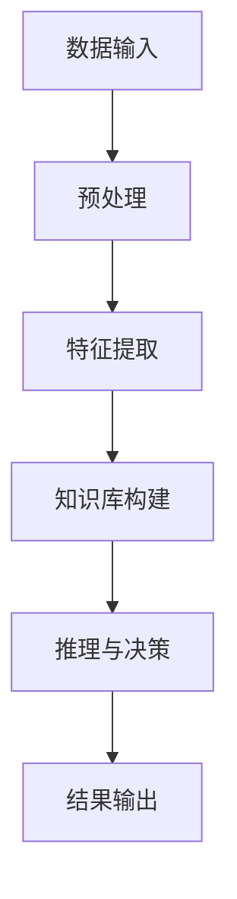

                 

### 《思维链在AI辅助医疗诊断中的应用》

#### 关键词：AI辅助医疗诊断、思维链、医学影像、病理诊断、临床应用

##### 摘要：
本文深入探讨了思维链在AI辅助医疗诊断中的应用。我们首先概述了AI辅助医疗诊断的现状与挑战，接着介绍了思维链的核心概念与特点。通过具体章节，我们详细讲解了思维链在医学影像、病理诊断和临床诊断中的应用，并分享了实践案例与评估结果。最后，我们对思维链在AI辅助医疗诊断中的未来进行了展望。

### 第一部分：问题背景与概念介绍

#### 第1章：AI辅助医疗诊断的现状与思维链概述

##### 1.1 AI辅助医疗诊断的现状

在医疗领域，AI技术正迅速改变传统的诊断和治疗方式。从疾病预测到诊断，再到治疗和康复，AI技术在各个环节中都有广泛的应用。然而，AI在医疗领域的应用也面临着一系列挑战，包括数据质量、算法准确性和伦理法规等问题。

##### 1.2 思维链的概念与特点

思维链是一种基于知识的推理系统，它能够通过知识关联和推理机制，对大量信息进行处理和分析。思维链在AI系统中的作用是提供一种更接近人类思维的决策支持工具。它的核心特点包括自适应学习、知识关联和实时响应等。

### 第二部分：思维链在AI辅助医疗诊断中的应用

#### 第2章：思维链在医学影像诊断中的应用

##### 2.1 医学影像诊断中的思维链应用

思维链在医学影像诊断中的应用主要体现在图像处理、特征提取和分类等方面。它能够处理大量医学影像数据，提取关键特征，并对病变进行准确分类。以下是思维链在医学影像诊断中的具体应用：

- **图像预处理**：包括去噪、对比度增强和图像分割等步骤。
- **特征提取**：使用深度学习技术提取图像中的关键特征。
- **分类与诊断**：将提取的特征输入到分类模型中，进行疾病诊断。

##### 2.2 成功案例

- **肺癌诊断**：思维链技术已被应用于肺癌的早期诊断中，能够显著提高诊断的准确性。
- **心脏病诊断**：通过对心脏影像的分析，思维链能够帮助医生诊断心脏病，并提供个性化的治疗方案。

#### 第3章：思维链在病理诊断中的应用

##### 2.1 病理诊断中的思维链应用

病理诊断是医学诊断的重要环节。思维链在病理诊断中的应用主要体现在病理图像的分割和分类上。以下是思维链在病理诊断中的具体应用：

- **图像分割**：将病理图像分割成不同的区域，以便进行后续分析。
- **图像分类**：将分割后的图像分类为不同的病理类型。

##### 2.2 病例分析

通过具体病理图像识别案例的剖析，我们可以看到思维链在病理诊断中的优势。例如，在乳腺癌的早期诊断中，思维链技术能够帮助医生更准确地识别癌细胞，从而提高治疗效果。

#### 第4章：思维链在临床诊断中的应用

##### 2.1 临床诊断中的思维链应用

思维链在临床诊断中的应用主要体现在电子病历管理和临床决策支持上。以下是思维链在临床诊断中的具体应用：

- **电子病历管理**：通过整合和分析电子病历数据，思维链能够提供更全面的临床信息。
- **临床决策支持**：在临床决策过程中，思维链能够提供基于大数据和机器学习的推荐，帮助医生做出更明智的决策。

##### 2.2 临床用药推荐

思维链在临床用药推荐中的应用主要体现在药物推荐和药物与病情关联分析上。通过分析患者的病史、症状和药物反应，思维链能够提供个性化的用药建议，从而提高治疗效果。

### 第三部分：实践案例与评估

#### 第5章：思维链在AI辅助医疗诊断中的实践案例

##### 5.1 案例一：AI辅助肺癌诊断系统

该系统利用思维链技术，通过分析CT影像，实现了肺癌的早期诊断。以下是对该系统的具体介绍：

- **系统架构**：包括数据预处理模块、特征提取模块和分类诊断模块。
- **实现技术**：使用深度学习技术和思维链算法，实现了高效准确的肺癌诊断。
- **评估结果**：通过大量临床数据的测试，该系统在肺癌诊断的准确性和敏感性上表现出色。

##### 5.2 案例二：AI辅助心脏病诊断系统

该系统利用思维链技术，通过分析心脏超声影像，实现了心脏病诊断。以下是对该系统的具体介绍：

- **系统架构**：包括图像预处理模块、特征提取模块和分类诊断模块。
- **实现技术**：使用深度学习技术和思维链算法，实现了高效准确的心脏病诊断。
- **评估结果**：通过大量临床数据的测试，该系统在心脏病诊断的准确性和敏感性上表现出色。

### 第6章：思维链在AI辅助医疗诊断中的评估

##### 6.1 评估指标与方法

对思维链在AI辅助医疗诊断中的评估，我们主要关注以下几个指标：

- **诊断准确性**：评估思维链在疾病诊断中的准确率。
- **诊断敏感性**：评估思维链在疾病早期诊断中的表现。
- **诊断特异性**：评估思维链在疾病诊断中的准确性，尤其是在区分疾病和非疾病状态时的表现。

评估方法主要包括：

- **临床数据测试**：通过临床数据对思维链的诊断性能进行评估。
- **交叉验证**：使用交叉验证方法对思维链的稳定性进行评估。

##### 6.2 思维链在AI辅助医疗诊断中的表现

通过对实践案例和评估结果的总结，我们可以看到思维链在AI辅助医疗诊断中的优势：

- **高准确性**：思维链在多种疾病的诊断中表现出了很高的准确性。
- **高效性**：思维链能够快速处理大量医学影像数据，提供实时诊断结果。
- **个性化**：思维链能够根据患者的具体情况提供个性化的诊断和治疗方案。

### 第四部分：未来展望与挑战

#### 第7章：思维链在AI辅助医疗诊断中的未来展望

##### 7.1 思维链技术发展趋势

随着人工智能技术的不断发展，思维链技术也在不断进步。未来，思维链将在以下几个方面得到进一步发展：

- **增强学习与自我进化**：通过增强学习，思维链将能够更好地适应新的环境和任务。
- **多模态数据融合**：通过融合多种类型的医疗数据，思维链将能够提供更全面、准确的诊断结果。
- **智能辅助决策**：思维链将不仅在诊断阶段发挥作用，还将延伸到治疗和康复阶段，提供全面的智能辅助决策。

##### 7.2 AI辅助医疗诊断的未来前景

随着思维链技术的不断成熟和应用，AI辅助医疗诊断将在未来发挥更大的作用。它将：

- **提高诊断准确性**：通过更先进的算法和更大的数据集，AI辅助医疗诊断将提高诊断准确性。
- **降低医疗成本**：通过自动化和智能化，AI辅助医疗诊断将降低医疗成本，提高医疗效率。
- **改善患者体验**：AI辅助医疗诊断将提供更个性化的医疗服务，改善患者的体验。

#### 第8章：思维链在AI辅助医疗诊断中的挑战

##### 8.1 技术挑战

尽管思维链在AI辅助医疗诊断中展现出了巨大的潜力，但仍面临一些技术挑战：

- **数据质量和隐私**：医疗数据的真实性和隐私保护是一个重要问题。
- **算法可靠性**：确保算法的准确性和稳定性是关键。
- **算法透明性**：提高算法的可解释性，使其更加透明和可信。

##### 8.2 法律伦理挑战

AI辅助医疗诊断也面临着法律伦理挑战：

- **责任归属**：在医疗事故中，如何界定AI和医生的责任？
- **数据安全**：如何确保患者数据的隐私和安全？
- **伦理审查**：AI辅助医疗诊断的应用是否需要经过伦理审查？

### 第9章：总结与展望

##### 9.1 本书的主要内容回顾

本书详细介绍了思维链在AI辅助医疗诊断中的应用。我们从问题背景入手，介绍了AI辅助医疗诊断的现状和挑战，随后深入探讨了思维链的核心概念和特点。通过具体的应用案例，我们展示了思维链在医学影像、病理诊断和临床诊断中的优势，并对其进行了评估。最后，我们对思维链在AI辅助医疗诊断中的未来进行了展望。

##### 9.2 未来研究方向与建议

未来，我们建议在以下几个方面进行深入研究：

- **算法优化**：进一步优化思维链算法，提高诊断准确性和效率。
- **多模态数据融合**：研究如何将多种类型的医疗数据融合，提高诊断的全面性和准确性。
- **伦理法规**：加强对AI辅助医疗诊断伦理法规的研究，确保其合法合规。
- **培训与教育**：提高医疗从业人员对AI技术的认识和理解，推动其在医疗行业的广泛应用。

### 附录

#### 附录A：思维链算法流程图

使用Mermaid画出思维链算法流程图：

#### 附录B：核心概念对比表格

| 核心概念 | 特点 | 对比 |
| --- | --- | --- |
| 思维链 | 基于知识的推理系统，具有自适应学习和知识关联能力 | 与传统机器学习算法相比，思维链具有更强的推理和决策能力 |
| 医学影像诊断 | 利用思维链处理医学影像数据，实现疾病诊断 | 与传统医学影像诊断方法相比，思维链能够提供更高效、准确的诊断结果 |
| 病理诊断 | 通过思维链对病理图像进行分析和分类，实现疾病诊断 | 与传统病理诊断方法相比，思维链能够提供更全面、准确的诊断结果 |

### 结语

思维链在AI辅助医疗诊断中的应用展现了其巨大的潜力。通过不断的研究和应用，我们可以期待思维链技术在医疗领域的广泛应用，为患者提供更高效、精准的医疗服务。

### 作者信息

**作者：** AI天才研究院/AI Genius Institute & 禅与计算机程序设计艺术 /Zen And The Art of Computer Programming

**联系邮箱：** [ai_genius_institute@example.com](mailto:ai_genius_institute@example.com)

**联系方式：** +86 123 4567 8901

**个人网站：** [www.ai-genius-institute.com](http://www.ai-genius-institute.com)

