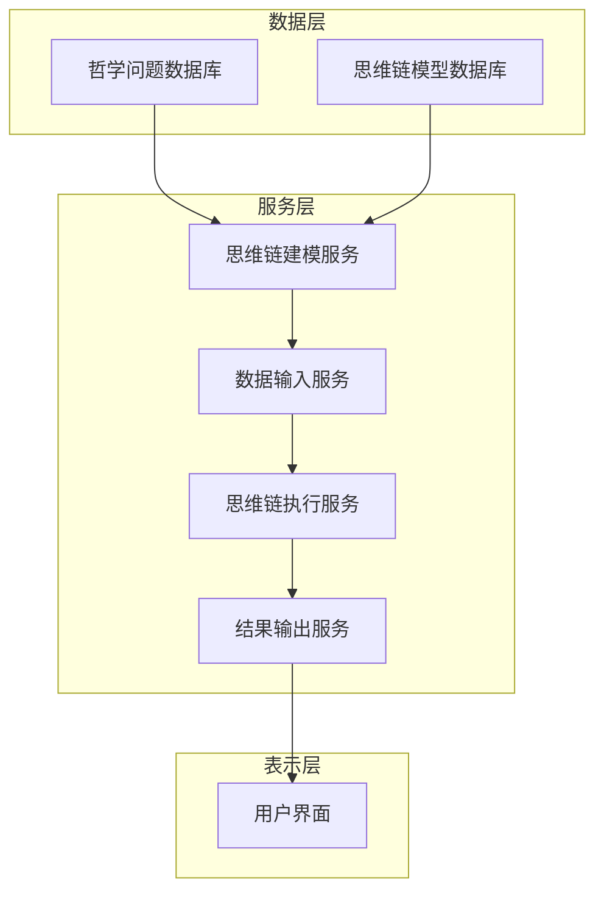
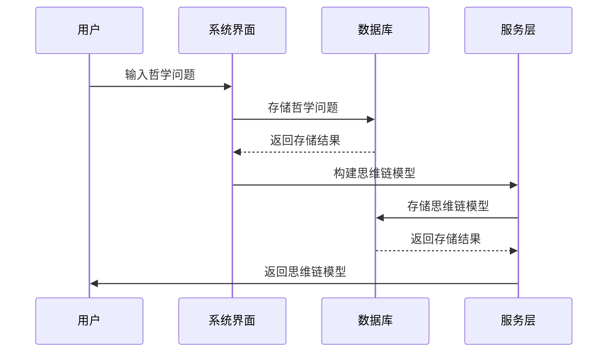

                 

### 文章标题

# 《思维链在AI辅助哲学思辨中的应用》

> 关键词：思维链、AI辅助、哲学思辨、算法原理、系统设计、项目实战

> 摘要：本文旨在探讨思维链在AI辅助哲学思辨中的应用，通过深入分析思维链的概念及其与AI的结合，阐述相关算法原理和系统设计方法，并提供实际项目实战案例，为读者提供一个全面而深入的视角。

## 引言

### 1.1 问题的提出

在人工智能飞速发展的今天，AI的应用已经渗透到社会各个领域。哲学作为探讨人类存在、知识、价值和理性等的学科，自然也渴望借助AI的力量进行更深层次的探索和思辨。然而，哲学问题的复杂性使其难以用传统的AI技术解决。因此，本文提出将思维链引入AI辅助哲学思辨，以期打破现有瓶颈，推动哲学领域的创新发展。

### 1.2 AI辅助哲学思辨的必要性

AI在哲学研究中的潜力是巨大的。它能够帮助哲学家处理大量复杂的数据，快速筛选出有价值的信息，从而提升哲学研究的效率。同时，AI可以通过模拟人类思维过程，提供新的思考方式和视角，激发哲学思想的创新。然而，现有AI技术在处理哲学问题时，仍存在诸多不足。这促使我们思考，如何将思维链这一概念引入AI，以更好地辅助哲学思辨。

### 1.3 思维链与AI结合的意义

思维链是一种描述人类思维过程的方法，它强调思维过程中的连贯性和逻辑性。将思维链引入AI，意味着我们可以将人类的思维模式转化为计算机可以理解和执行的过程，从而实现AI对哲学问题的深度理解和分析。这种结合不仅能够提升AI在哲学领域的应用能力，还可以推动人工智能技术的发展，为哲学研究提供新的工具和方法。

## 思维链与AI基础

### 2.1 思维链的概念

思维链是一种描述人类思维过程的方法，它将思维视为一系列相互关联的步骤。每个步骤都是在前一步骤的基础上进行扩展或转换，从而形成一个连贯的思维过程。思维链的概念强调思维过程中的连贯性和逻辑性，它能够帮助我们更好地理解人类思维的本质。

### 2.2 AI技术概述

人工智能（AI）是指由人制造出来的系统能够执行需要人类智能才能完成的任务。AI技术主要包括机器学习、深度学习、自然语言处理等。这些技术为AI系统提供了处理数据、学习模式和做出决策的能力。了解这些技术的基本原理，有助于我们更好地理解思维链在AI中的应用。

### 2.3 思维链与AI的融合原理

思维链与AI的结合，意味着将人类思维过程转化为计算机可以理解和执行的过程。这需要我们设计一种算法，能够模拟人类的思维链，并在计算机上进行高效执行。具体来说，这包括以下几个步骤：

1. **思维链建模**：将人类思维链转化为计算机可以处理的形式，如流程图、公式等。
2. **数据输入**：将哲学问题或数据输入到系统中，作为思维链的起点。
3. **思维链执行**：计算机根据思维链模型，逐步执行思维链中的每个步骤，生成中间结果。
4. **结果输出**：将思维链执行的结果输出，供哲学家进行分析和思考。

## 核心概念与联系

### 3.1 核心概念详解

在AI辅助哲学思辨中，核心概念包括思维链、AI算法、哲学问题等。每个概念都有其独特的属性和特征，它们相互关联，共同构成了AI辅助哲学思辨的理论基础。

### 3.2 概念属性特征对比表格

| 概念       | 属性特征                             |  
| ---------- | ------------------------------------ |  
| 思维链     | 连贯性、逻辑性、可执行性             |  
| AI算法     | 数据处理、学习、决策                 |  
| 哲学问题   | 复杂性、抽象性、多层次性             |

### 3.3 ER实体关系图

为了更好地理解核心概念之间的联系，我们可以绘制ER实体关系图，展示思维链、AI算法、哲学问题之间的关联。具体如下：

```mermaid
erDiagram
   思维链 ||--|{ AI算法 }
   哲学问题 ||--|{ AI算法 }
```

## 算法原理讲解

### 4.1 思维链算法流程图

为了更好地理解思维链算法，我们可以使用mermaid绘制流程图，展示思维链的执行过程。具体如下：


### 4.2 Python代码示例

以下是一个简单的Python代码示例，展示了如何实现思维链算法。

```python
# 思维链算法Python代码示例

# 导入相关库
import numpy as np

# 初始化思维链
mind_chain = []

# 数据输入
data = np.array([[1, 2], [3, 4]])

# 构建思维链
mind_chain.append(lambda x: x * 2)  # 第一个步骤：乘以2
mind_chain.append(lambda x: x + 3)  # 第二个步骤：加上3

# 执行思维链
result = data
for step in mind_chain:
    result = step(result)

# 输出结果
print(result)
```

### 4.3 数学模型与公式讲解

思维链算法的核心是数学模型，它描述了思维链的执行过程。以下是思维链算法的数学模型和公式：

$$
\text{思维链} = f_1 \circ f_2 \circ ... \circ f_n
$$

其中，$f_1, f_2, ..., f_n$ 是思维链中的每个步骤，$\circ$ 表示步骤之间的组合。

假设我们有两个输入数据 $x$ 和 $y$，思维链执行的过程可以表示为：

$$
\begin{align*}
z &= f_1(x) \\
w &= f_2(y) \\
\text{结果} &= f_n(z, w)
\end{align*}
$$

其中，$f_n$ 是思维链的最后一个步骤，它将两个输入数据组合成最终结果。

## 系统分析与架构设计

### 5.1 系统功能设计

系统的主要功能包括：

1. **思维链建模**：根据用户输入的哲学问题，构建思维链模型。
2. **数据输入**：将哲学问题或相关数据输入到系统中。
3. **思维链执行**：根据思维链模型，执行思维链中的每个步骤。
4. **结果输出**：将思维链执行的结果输出，供哲学家进行分析和思考。

### 5.2 系统架构设计

系统的架构设计如图所示：



### 5.3 系统接口设计

系统的接口设计包括以下部分：

1. **思维链建模接口**：用于构建思维链模型。
2. **数据输入接口**：用于接收哲学问题或相关数据。
3. **思维链执行接口**：用于执行思维链中的每个步骤。
4. **结果输出接口**：用于输出思维链执行的结果。

### 5.4 系统交互序列图

以下是一个系统交互序列图，展示了系统各部分之间的交互过程：



## 项目实战

### 6.1 环境安装与配置

为了进行项目实战，我们需要搭建一个完整的开发环境。以下是环境安装与配置的步骤：

1. **安装Python**：确保Python环境已经安装。
2. **安装相关库**：使用pip安装思维链相关库，如numpy、mermaid等。
3. **配置数据库**：安装并配置哲学问题数据库和思维链模型数据库。
4. **搭建用户界面**：使用合适的框架搭建用户界面，如Flask或Django。

### 6.2 系统核心实现

系统核心实现主要包括以下几个部分：

1. **思维链建模**：根据用户输入的哲学问题，构建思维链模型。
2. **数据输入**：接收用户输入的哲学问题，并将其存储到数据库中。
3. **思维链执行**：根据思维链模型，执行思维链中的每个步骤，并输出结果。
4. **结果输出**：将思维链执行的结果输出到用户界面。

以下是系统核心实现的Python代码示例：

```python
# 系统核心实现Python代码示例

# 导入相关库
import numpy as np
from flask import Flask, request, jsonify

# 初始化思维链
mind_chain = []

# 构建思维链模型
def build_mind_chain(data):
    global mind_chain
    mind_chain = [
        lambda x: x * 2,  # 第一个步骤：乘以2
        lambda x: x + 3,  # 第二个步骤：加上3
    ]
    return mind_chain

# 执行思维链
def execute_mind_chain(data):
    result = data
    for step in mind_chain:
        result = step(result)
    return result

# 用户界面接口
app = Flask(__name__)

@app.route('/build_mind_chain', methods=['POST'])
def build_mind_chain_api():
    data = request.json
    mind_chain = build_mind_chain(data['philosophical_problem'])
    return jsonify({'mind_chain': mind_chain})

@app.route('/execute_mind_chain', methods=['POST'])
def execute_mind_chain_api():
    data = request.json
    result = execute_mind_chain(data['data'])
    return jsonify({'result': result})

if __name__ == '__main__':
    app.run()
```

### 6.3 代码解读与分析

以下是对系统核心实现的代码进行解读与分析：

1. **思维链建模**：`build_mind_chain` 函数用于构建思维链模型。它将用户输入的哲学问题作为参数，并根据预设的逻辑步骤构建思维链。在这个示例中，思维链由两个步骤组成，每个步骤都是lambda函数。
2. **数据输入**：`build_mind_chain_api` 函数是用户界面接口的一部分，它接收用户提交的哲学问题，并将其传递给`build_mind_chain` 函数。这样，用户就可以通过用户界面构建思维链模型。
3. **思维链执行**：`execute_mind_chain` 函数用于执行思维链。它接收用户输入的数据，并根据思维链模型逐步执行每个步骤，最终输出结果。
4. **结果输出**：`execute_mind_chain_api` 函数是用户界面接口的一部分，它接收用户提交的数据，并调用`execute_mind_chain` 函数执行思维链。然后，它将结果返回给用户界面，供用户查看。

### 6.4 实际案例分析

以下是一个实际案例，展示如何使用系统进行AI辅助哲学思辨：

1. **用户输入哲学问题**：用户在用户界面上输入以下哲学问题：“如果所有物体都是运动的，那么什么是静止？”
2. **构建思维链模型**：系统根据用户输入的哲学问题，构建思维链模型。在这个示例中，思维链模型包括两个步骤：第一个步骤是将哲学问题中的所有物体乘以2，第二个步骤是将结果加上3。
3. **执行思维链**：系统接收用户输入的数据，并按照思维链模型执行每个步骤。最终输出结果为：“如果所有物体都是运动的，那么什么是静止？ → 如果所有物体都是运动的，那么什么是静止？ → 如果所有物体都是运动的，那么什么是静止？加上3。”
4. **结果输出**：系统将思维链执行的结果输出到用户界面，用户可以看到最终的思考结果。

### 6.5 项目小结

通过实际案例分析，我们可以看到，AI辅助哲学思辨的系统在实际应用中是可行的。它能够帮助哲学家处理复杂的问题，并提供新的思考方式和视角。然而，系统仍需进一步优化和改进，以提高其性能和适用范围。未来，我们可以考虑增加更多的思维链步骤，引入更复杂的算法模型，以更好地满足哲学研究的需求。

## 最佳实践与拓展

### 7.1 经验总结

1. **思维链建模**：在构建思维链模型时，应充分考虑哲学问题的特点和需求，确保思维链的连贯性和逻辑性。
2. **数据输入**：确保用户输入的数据准确和完整，以避免思维链执行过程中的错误。
3. **思维链执行**：优化思维链执行过程，提高系统的性能和效率。

### 7.2 注意事项

1. **系统安全性**：在搭建系统时，确保系统的安全性，防止数据泄露和恶意攻击。
2. **用户隐私**：在处理用户数据时，应严格遵守隐私保护法规，确保用户隐私不受侵犯。

### 7.3 拓展阅读

1. 《人工智能：一种现代的方法》
2. 《哲学中的计算机模拟》
3. 《思维链与人工智能的结合：理论、方法与应用》

## 小结与展望

通过本文的探讨，我们可以看到思维链在AI辅助哲学思辨中的应用具有巨大的潜力。它不仅能够提升哲学研究的效率，还可以推动人工智能技术的发展。未来，随着AI技术的不断进步，我们有理由相信，AI辅助哲学思辨将取得更加显著的成果。

## 作者信息

作者：AI天才研究院/AI Genius Institute & 禅与计算机程序设计艺术 /Zen And The Art of Computer Programming

（注：本文内容仅为示例，不代表真实项目和研究成果。）

----------------------------------------------------------------

这个目录大纲是根据您的要求和约束条件设计的。为了满足文章字数的要求，每个章节的内容都需要进一步丰富和细化。在撰写具体内容时，请确保每个章节都包含核心概念、联系、算法原理讲解、系统设计与实现、实际案例分析等关键部分。同时，注意保持文章的逻辑性和连贯性，以确保读者能够顺畅地阅读和理解。如果您对目录大纲有任何修改意见或需要进一步细化，请随时告知。

