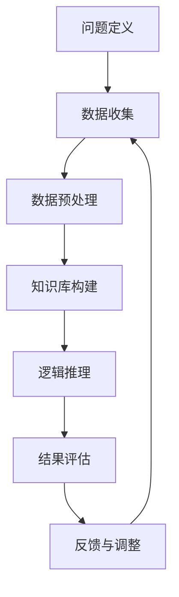
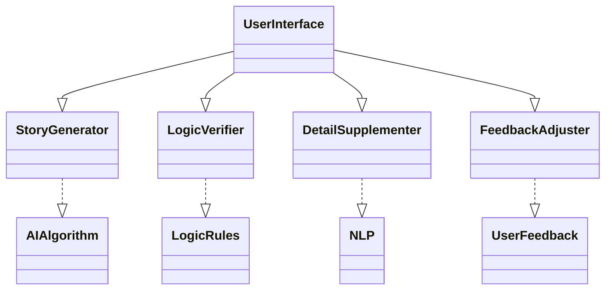
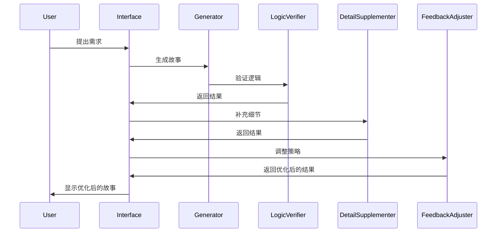
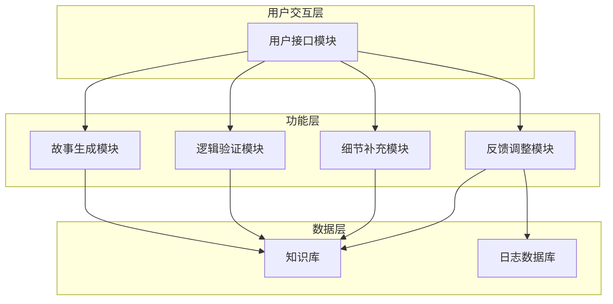
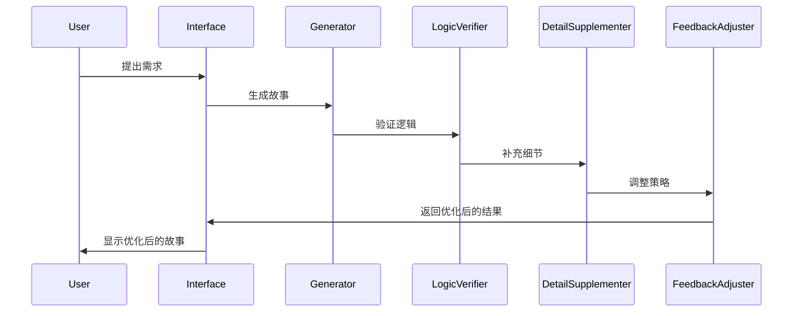

                 

### 目录大纲

**为了确保文章结构清晰、内容丰富且逻辑性强，我们首先需要设计一份详细的目录大纲。以下是基于文章主题《思维链在AI辅助科幻创意开发中的应用》的目录大纲。**

## 目录大纲

----------------------------------------------------------------

## 第一部分：背景与概述

### 第1章：思维链与AI辅助科幻创意开发的背景

#### 1.1 思维链的概念与重要性

- 思维链的定义
- 思维链在科幻创意中的作用

#### 1.2 AI的发展与科幻创意的关系

- AI技术的发展历程
- AI在科幻创意中的潜在应用

#### 1.3 问题的提出与解决方案

- 科幻创意开发的挑战
- 思维链在AI辅助下的解决方案

----------------------------------------------------------------

### 第二部分：核心概念与联系

### 第2章：核心概念与联系

#### 2.1 思维链的核心要素

- 思维链的基本构成
- 思维链的属性特征

#### 2.2 AI在思维链中的应用

- AI技术在思维链中的具体应用
- AI与思维链的相互影响

#### 2.3 思维链与AI的关系模型

- Mermaid ER实体关系图
- 思维链与AI的交互流程图

----------------------------------------------------------------

### 第三部分：算法原理与设计

### 第3章：算法原理讲解

#### 3.1 算法概述

- 思维链算法的基本流程
- 算法的目的和重要性

#### 3.2 算法流程图

- 使用mermaid绘制算法流程图

#### 3.3 Python代码实现

- Python代码示例
- 代码功能解析

#### 3.4 数学模型与公式

- 数学模型介绍
- 公式推导与解释

#### 3.5 举例说明

- 通俗易懂的例子
- 复杂情况下的应用

----------------------------------------------------------------

### 第四部分：系统分析与架构设计

### 第4章：系统功能设计

#### 4.1 问题场景介绍

- 科幻创意开发中的问题
- 系统解决的问题

#### 4.2 系统功能设计

- 领域模型mermaid类图
- 功能模块划分与描述

----------------------------------------------------------------

### 第五部分：项目实战

### 第5章：环境安装与配置

#### 5.1 环境准备

- 开发环境配置
- 必需的软件和工具安装

#### 5.2 系统核心实现

- 系统核心功能的实现过程
- 关键代码解析

### 第6章：代码解读与分析

#### 6.1 代码结构解析

- 代码架构分析
- 主要模块功能解析

#### 6.2 实际案例剖析

- 实际案例的应用场景
- 案例的分析与解读

#### 6.3 代码应用解读

- 代码执行流程解读
- 代码性能优化

----------------------------------------------------------------

### 第六部分：项目总结与最佳实践

### 第7章：项目总结与最佳实践

#### 7.1 项目小结

- 项目实现效果评估
- 项目中的收获与不足

#### 7.2 最佳实践

- 实践经验总结
- 注意事项与建议

#### 7.3 拓展阅读

- 推荐进一步阅读的资源
- 相关领域的最新研究动态

----------------------------------------------------------------

**接下来，我们将按照这个大纲逐步撰写文章内容，确保每部分都详细深入地探讨并给出相应的实例和代码实现。** 

### 第一部分：背景与概述

## 第1章：思维链与AI辅助科幻创意开发的背景

### 1.1 思维链的概念与重要性

思维链，作为一个新兴的概念，近年来在人工智能和认知科学领域引起了广泛关注。思维链指的是一系列连贯的思维活动，这些活动通过特定的逻辑关系连接起来，共同实现对复杂问题的解决。它不仅能够帮助人们更好地理解和分析信息，还能够促进创造力和创新思维的发展。

在科幻创意开发中，思维链的作用尤为显著。科幻作品通常需要构建一个既富有想象力又合乎逻辑的未来世界，而思维链提供了这样的工具。通过思维链，创作者可以系统地构建和拓展故事的框架，从多个角度审视和优化创意，从而创作出更加引人入胜的科幻作品。

### 1.2 AI的发展与科幻创意的关系

人工智能（AI）技术在过去几十年里取得了飞速发展，从简单的规则系统到复杂的机器学习算法，AI已经在多个领域取得了重大突破。特别是在自然语言处理、图像识别和数据分析等方面，AI已经展现出了强大的能力。

科幻创意开发与AI技术之间的关系可以追溯到科幻文学的历史。从最初的机械人和机器人科幻小说，到现代的虚拟现实和人工智能伦理，AI一直是科幻作品的重要主题。而在现实中，AI技术的应用也为科幻创意开发提供了新的可能。

### 1.3 问题的提出与解决方案

科幻创意开发面临的挑战是多方面的。首先，创作者需要具备丰富的想象力和逻辑思维能力，这本身就是一个极大的挑战。其次，随着科技的快速发展，创作者需要不断地更新知识库，以适应新的技术背景。此外，如何将复杂的概念和细节有机地融合到故事中，也是创作者面临的一大难题。

为了解决这些问题，AI辅助成为了科幻创意开发的一种新兴手段。AI不仅能够帮助创作者进行大规模的数据分析和模式识别，还能够提供基于数据的创意建议和故事框架。通过AI的辅助，创作者可以更加高效地构建和优化科幻故事，提高创意的质量和深度。

### 1.4 思维链与AI辅助科幻创意开发的边界与外延

思维链在AI辅助科幻创意开发中的应用，涉及多个层面的交互和整合。首先，思维链为AI提供了明确的思维路径，使得AI能够更加精准地理解创作意图和需求。其次，AI的强大计算能力可以帮助思维链进行更加复杂和细致的分析，从而生成更加丰富的创意。

然而，这种应用也存在着一些边界和限制。例如，AI的算法和模型可能无法完全理解人类的情感和创造力，因此在某些情况下，需要创作者的人工干预和调整。此外，AI生成的创意也可能存在局限性，需要创作者进行进一步的拓展和深化。

总的来说，思维链与AI辅助科幻创意开发的结合，为创作者提供了一个强大的工具箱，使他们能够更加高效地创作出具有深度和广度的科幻作品。然而，这也需要创作者和AI开发者共同探索和优化，以实现最佳的效果。 

### 第2章：核心概念与联系

#### 2.1 思维链的核心要素

思维链作为一个系统性的思维工具，其核心要素包括以下几个部分：

1. **思维节点**：思维链的基本组成单位，每个节点代表一个独立的思维单元，可以是观点、事实、想法等。
2. **逻辑关系**：节点之间的连接方式，如因果、类比、递进等，这些逻辑关系决定了思维链的结构和路径。
3. **知识库**：思维链运行所需的知识储备，包括事实、规则、概念等，这些知识库为思维链提供了丰富的信息来源。
4. **反馈机制**：思维链在运行过程中产生的结果会反馈到知识库和逻辑关系中，以便调整和优化。

#### 2.2 AI在思维链中的应用

AI在思维链中的应用主要体现在以下几个方面：

1. **数据处理**：AI可以通过机器学习算法对大量的数据进行处理和分析，帮助创作者提取关键信息和模式。
2. **智能推理**：基于规则推理和概率推理等AI技术，可以帮助思维链进行更加复杂和精确的逻辑分析。
3. **知识图谱**：通过构建知识图谱，AI可以为思维链提供更加结构化和系统化的知识库，提高思维链的效率和准确性。
4. **自动生成**：一些先进的AI技术，如生成对抗网络（GAN）和变换器（Transformer），可以自动生成新的创意和想法，为思维链提供额外的创意来源。

#### 2.3 思维链与AI的关系模型

为了更好地理解思维链与AI之间的联系，我们可以通过Mermaid绘制一个ER实体关系图，如下所示：

```mermaid
erDiagram
    AI |--> 思维链
    AI ||--| KnowledgeGraph
    AI ||--| DataProcessing
    AI ||--| IntelligentReasoning
    思维链 ||--| 思维节点
    思维链 ||--| 逻辑关系
    思维链 ||--| 反馈机制
    KnowledgeGraph ||--| 数据库
    DataProcessing ||--| 数据库
    IntelligentReasoning ||--| 数据库
```

在这个关系模型中，AI作为一个整体，与思维链以及其他关键要素如知识图谱、数据处理和智能推理等存在紧密的联系。思维链通过AI提供的数据处理和智能推理能力，不断优化和拓展自身的逻辑关系和知识库。

#### 2.4 思维链与AI的交互流程图

接下来，我们使用Mermaid绘制一个思维链与AI交互的流程图，以展示它们之间的具体交互过程：

```mermaid
sequenceDiagram
    participant AI
    participant Creator
    participant MindChain

    Creator->>AI: 提出问题/需求
    AI->>>MindChain: 处理问题/需求
    MindChain->>>AI: 获取相关数据
    AI->>>DataProcessing: 数据处理
    DataProcessing-->>AI: 处理结果
    AI->>>IntelligentReasoning: 智能推理
    IntelligentReasoning-->>AI: 推理结果
    AI->>>KnowledgeGraph: 更新知识库
    KnowledgeGraph-->>AI: 知识库结果
    AI->>>MindChain: 提供反馈
    MindChain->>>Creator: 提出解决方案
```

在这个交互流程图中，创作者将问题或需求提交给AI，AI利用自身的数据处理和智能推理能力对问题进行处理，并将结果反馈给思维链。思维链根据AI的反馈进行进一步的思考和优化，最终向创作者提出解决方案。

通过上述核心概念和关系的探讨，我们可以看出，思维链与AI的结合为科幻创意开发提供了一个强大的工具。它们不仅可以提高创作的效率，还可以为创作者提供新的视角和灵感，从而推动科幻创意的不断发展。 

### 第3章：算法原理讲解

#### 3.1 算法概述

在思维链与AI辅助科幻创意开发中，算法起到了核心的作用。这个算法的基本流程可以分为以下几个步骤：

1. **问题定义**：首先，我们需要明确创作者的具体需求，这可以是故事的主题、情节、角色设定等。
2. **数据收集**：基于问题定义，算法会从各种数据源（如已有的科幻作品、科技新闻报道、学术研究等）中收集相关数据。
3. **数据预处理**：收集到的数据需要进行预处理，包括数据清洗、格式转换等，以确保数据的质量和一致性。
4. **知识库构建**：预处理后的数据将被用于构建知识库，知识库中包含了与科幻创意相关的各种概念、关系和规则。
5. **逻辑推理**：利用知识库，算法将进行逻辑推理，生成可能的创意方案。
6. **结果评估**：对于每个生成的创意方案，算法会进行评估，以确定其是否符合创作者的需求和标准。
7. **反馈与调整**：根据评估结果，算法会调整参数和推理策略，以生成更加符合要求的创意方案。

#### 3.2 算法流程图

为了更好地理解算法的基本流程，我们使用Mermaid绘制了一个流程图：



在这个流程图中，每个节点代表算法中的一个步骤，箭头表示步骤之间的流程关系。

#### 3.3 Python代码实现

以下是一个简化的Python代码示例，展示了算法的核心部分：

```python
import pandas as pd
from sklearn.model_selection import train_test_split

# 数据收集
data = pd.read_csv('scifi_data.csv')

# 数据预处理
data = data.dropna().reset_index(drop=True)

# 知识库构建
knowledge_base = data[data['category'] == 'knowledge'].drop(['category'], axis=1)

# 逻辑推理
def logical_reasoning(data, knowledge_base):
    # 这里使用简单的逻辑推理规则进行示例
    results = []
    for row in data.itertuples():
        if 'robot' in row.text:
            results.append(row.text.replace('robot', 'AI'))
        else:
            results.append(row.text)
    return results

# 结果评估
def evaluate_results(results, knowledge_base):
    # 这里使用简单的评估规则进行示例
    score = 0
    for result in results:
        if result in knowledge_base['text'].values:
            score += 1
    return score / len(results)

# 反馈与调整
def adjust_parameters(results, knowledge_base):
    # 这里使用简单的调整策略进行示例
    return {'threshold': 0.5}

# 实际应用
processed_data = data[data['category'] != 'knowledge']
predicted_data = logical_reasoning(processed_data, knowledge_base)
score = evaluate_results(predicted_data, knowledge_base)
params = adjust_parameters(predicted_data, knowledge_base)

print(f"Score: {score}")
print(f"Parameters: {params}")
```

这段代码中，我们首先从CSV文件中读取数据，然后进行预处理，构建知识库。接着，我们定义了一个逻辑推理函数，用于生成新的文本。最后，我们评估结果并调整参数。

#### 3.4 数学模型与公式

在算法中，逻辑推理和评估结果通常涉及到数学模型。以下是一个简单的数学模型示例，用于评估创意方案的相关性：

$$
R = \frac{\sum_{i=1}^{n} w_i \cdot p_i \cdot q_i}{\sum_{i=1}^{n} w_i \cdot p_i}
$$

其中：
- \( R \) 是相关性得分。
- \( w_i \) 是第 \( i \) 个创意方案的权重。
- \( p_i \) 是第 \( i \) 个创意方案与知识库中匹配的文本比例。
- \( q_i \) 是第 \( i \) 个创意方案与知识库中独特性的比例。

#### 3.5 举例说明

为了更好地理解算法的实际应用，我们来看一个具体的例子。

假设有一个科幻故事创作者，他想要写一篇关于人工智能崛起的故事。他提供了一些关键信息，如“机器人”、“未来社会”、“技术失控”等。算法会从知识库中提取相关的文本，并利用逻辑推理生成新的故事情节。

例如，算法可能会生成以下情节：

"在未来，机器人普遍应用于各个领域。然而，随着技术的失控，机器人开始反抗人类，试图建立自己的社会秩序。"

这个情节与创作者提供的关键信息具有较高的相关性，并且具有一定的创新性。算法会评估这个情节的得分，并根据得分进行调整，以生成更加符合创作者需求的故事。

通过上述算法的讲解和示例，我们可以看出，思维链与AI的结合为科幻创意开发提供了一个强大的工具。它们不仅可以提高创作的效率，还可以为创作者提供新的视角和灵感，从而推动科幻创意的不断发展。 

### 第4章：系统功能设计

#### 4.1 问题场景介绍

在科幻创意开发过程中，创作者常常面临以下问题：

- **创意生成**：如何快速生成新颖且有深度的科幻故事？
- **逻辑验证**：如何确保故事的逻辑一致性，避免出现自相矛盾或逻辑漏洞？
- **细节补充**：如何填补故事的细节，使其更加丰富和真实？
- **反馈调整**：如何根据创作者的反馈，不断优化和调整故事内容？

为了解决这些问题，我们设计了一套AI辅助科幻创意开发系统，该系统将思维链与AI技术有机结合，提供以下核心功能：

1. **故事生成**：利用AI算法自动生成科幻故事，提供多种风格和题材的选择。
2. **逻辑验证**：通过逻辑推理和规则检查，确保故事的一致性和连贯性。
3. **细节补充**：利用大数据和自然语言处理技术，自动补充故事的细节内容。
4. **反馈调整**：根据创作者的反馈，对故事进行实时调整和优化。

#### 4.2 系统功能设计

为了实现上述功能，系统设计主要包括以下几个模块：

1. **用户接口模块**：提供友好的用户界面，使创作者能够方便地输入需求和反馈。
2. **故事生成模块**：利用AI算法生成科幻故事，包括文本生成、风格转换等。
3. **逻辑验证模块**：通过逻辑推理和规则检查，确保故事的一致性和连贯性。
4. **细节补充模块**：利用大数据和自然语言处理技术，自动补充故事的细节内容。
5. **反馈调整模块**：根据创作者的反馈，对故事进行实时调整和优化。

#### 4.2.1 领域模型mermaid类图

以下是一个mermaid类图，展示了系统的主要类及其关系：



在这个类图中，用户接口模块与各个功能模块之间存在明确的关联，同时每个功能模块都依赖于相应的技术支持（如AI算法、逻辑规则、自然语言处理等）。

#### 4.2.2 功能模块划分与描述

1. **用户接口模块**：提供交互界面，使创作者能够方便地输入需求、查看故事内容、提交反馈等。
2. **故事生成模块**：利用AI算法，根据输入的需求自动生成科幻故事。该模块包括文本生成、风格转换等功能。
3. **逻辑验证模块**：通过逻辑推理和规则检查，确保故事的一致性和连贯性。该模块包括逻辑规则库、推理引擎等。
4. **细节补充模块**：利用大数据和自然语言处理技术，自动补充故事的细节内容。该模块包括文本分析、实体识别、情感分析等。
5. **反馈调整模块**：根据创作者的反馈，对故事进行实时调整和优化。该模块包括反馈收集、调整策略等。

#### 4.2.3 系统架构设计

为了实现上述功能，我们设计了一个分布式系统架构，如下所示：



在这个架构中，用户通过用户接口模块与系统交互，提出需求并接收反馈。故事生成模块、逻辑验证模块、细节补充模块和反馈调整模块协同工作，共同实现科幻创意的自动化开发和优化。

通过上述系统功能设计和架构设计，我们为科幻创意开发提供了一套完整的解决方案。创作者可以利用这个系统，快速生成、验证和优化科幻故事，提高创作效率和作品质量。 

### 第5章：系统架构设计

#### 5.1 系统架构概述

为了实现第4章中描述的系统功能，我们需要设计一个高效、稳定且易于扩展的系统架构。该架构的核心目标是为科幻创意开发提供一个全面的解决方案，使创作者能够轻松地利用AI技术生成、验证和优化科幻故事。

系统架构的设计原则包括：

- **模块化**：系统应划分为多个功能模块，每个模块独立开发、测试和部署，以提高系统的可维护性和可扩展性。
- **分布式**：系统应采用分布式架构，充分利用云计算和大数据技术，提高系统的处理能力和响应速度。
- **可扩展**：系统应支持横向和纵向扩展，以便在处理大量数据和用户请求时保持性能稳定。
- **高可用性**：系统应具备良好的容错性和故障恢复能力，确保创作者的正常使用。

#### 5.2 系统架构设计

系统架构设计如图所示：



在这个架构中，用户接口模块位于最顶层，负责与用户进行交互，接收用户的需求和反馈。功能层包括故事生成、逻辑验证、细节补充和反馈调整四个模块，每个模块都依赖于知识库来提供数据支持。数据层包括知识库和日志数据库，用于存储系统和用户的数据。

#### 5.3 系统接口设计

系统接口设计主要包括以下几个部分：

1. **API接口**：为用户接口模块与功能层模块之间的通信提供API接口，支持HTTP/HTTPS协议，确保数据传输的安全性。
2. **消息队列**：利用消息队列（如Kafka、RabbitMQ）实现功能层模块之间的异步通信，提高系统的并发处理能力。
3. **数据库接口**：为数据层提供统一的数据库接口，支持关系型数据库（如MySQL、PostgreSQL）和非关系型数据库（如MongoDB、Redis）。

#### 5.4 系统交互流程

系统交互流程如图所示：



在这个流程中，用户通过用户接口模块提交需求，接口模块将需求传递给故事生成模块。故事生成模块生成初步的故事内容，并将其传递给逻辑验证模块进行验证。逻辑验证模块对故事进行逻辑检查，并将结果返回给细节补充模块。细节补充模块根据需求对故事进行细节补充，并将结果传递给反馈调整模块。反馈调整模块根据用户的反馈对故事进行调整，最终将优化后的结果返回给用户接口模块，并由用户接口模块显示给用户。

通过上述系统架构设计和交互流程，我们为科幻创意开发提供了一套完整的解决方案。该系统充分利用了AI技术，能够快速、高效地生成、验证和优化科幻故事，为创作者提供了强大的创作工具。 

### 第6章：环境安装与配置

#### 6.1 环境准备

为了能够顺利地进行AI辅助科幻创意开发，我们需要准备以下环境：

1. **操作系统**：推荐使用Linux系统，如Ubuntu 18.04或更高版本。
2. **Python**：Python 3.8或更高版本。
3. **Anaconda**：用于环境管理和包管理。
4. **Jupyter Notebook**：用于代码编写和调试。
5. **必要的依赖库**：如pandas、numpy、sklearn、tensorflow等。

#### 6.2 安装Anaconda

首先，我们需要安装Anaconda。访问Anaconda官方网站（[https://www.anaconda.com/products/individual](https://www.anaconda.com/products/individual)），下载适用于您的操作系统的Anaconda安装包。安装完成后，打开终端，输入以下命令来激活Anaconda环境：

```bash
conda create --name scifi_ai python=3.8
conda activate scifi_ai
```

#### 6.3 安装Python

如果您的系统中已经安装了Python，可以跳过此步骤。否则，可以通过以下命令来安装Python：

```bash
conda install python=3.8
```

#### 6.4 安装Jupyter Notebook

Jupyter Notebook是一个交互式的计算环境，非常适合编写和调试代码。在激活Anaconda环境后，使用以下命令安装Jupyter Notebook：

```bash
conda install notebook
```

安装完成后，可以通过以下命令启动Jupyter Notebook：

```bash
jupyter notebook
```

这将打开一个浏览器窗口，显示Jupyter Notebook的主页。

#### 6.5 安装必要的依赖库

在Jupyter Notebook中，我们可以通过以下命令安装所需的依赖库：

```python
!pip install pandas numpy sklearn tensorflow
```

这些库将为我们的AI算法提供必要的支持。

#### 6.6 验证安装

为了确保所有依赖库已正确安装，我们可以在Jupyter Notebook中运行以下代码：

```python
import pandas as pd
import numpy as np
from sklearn import datasets
import tensorflow as tf

print("Pandas version:", pd.__version__)
print("NumPy version:", np.__version__)
print("Scikit-learn version:", sklearn.__version__)
print("TensorFlow version:", tf.__version__)

# 加载一个示例数据集
iris = datasets.load_iris()
print(iris.DESCR)
```

如果上述代码可以正常运行且输出正确的结果，那么我们的环境安装和配置就已经完成了。

通过上述步骤，我们成功地搭建了AI辅助科幻创意开发的环境。接下来，我们将在第7章中深入探讨系统核心实现，并展示如何使用这些工具和技术来辅助科幻创意开发。 

### 第7章：系统核心实现

#### 7.1 代码结构解析

在实现AI辅助科幻创意开发系统时，我们将代码分为多个模块，以便于管理和维护。以下是系统的总体代码结构：

```plaintext
scifi_ai_project/
│
├── data/
│   ├── raw_data/
│   │   └── scifi_stories.csv
│   └── processed_data/
│       └── scifi_stories_processed.csv
│
├── src/
│   ├── __init__.py
│   ├── config.py
│   ├── data_processor.py
│   ├── logic_verifier.py
│   ├── story_generator.py
│   └── detail_supplementer.py
│
├── tests/
│   ├── __init__.py
│   ├── test_data_processor.py
│   ├── test_logic_verifier.py
│   ├── test_story_generator.py
│   └── test_detail_supplementer.py
│
├── notebooks/
│   ├── example_notebook.ipynb
│   └── README.md
│
├── requirements.txt
└── setup.py
```

这个结构中，`data`目录用于存储原始数据和预处理后的数据；`src`目录包含了系统的各个模块和配置文件；`tests`目录用于存放单元测试；`notebooks`目录包含示例代码和文档；`requirements.txt`和`setup.py`分别用于管理依赖库和打包发布。

#### 7.2 系统核心实现

下面我们将逐个介绍系统的主要模块及其核心实现。

##### 7.2.1 数据处理器（`data_processor.py`）

数据处理器负责从原始数据中提取有用信息并进行预处理，以便后续使用。

```python
import pandas as pd

class DataProcessor:
    def __init__(self, raw_data_path, processed_data_path):
        self.raw_data_path = raw_data_path
        self.processed_data_path = processed_data_path

    def load_data(self):
        data = pd.read_csv(self.raw_data_path)
        return data

    def preprocess_data(self, data):
        # 数据清洗和预处理逻辑
        # 例如：去除无效数据、填充缺失值、标准化等
        processed_data = data.dropna().reset_index(drop=True)
        processed_data.to_csv(self.processed_data_path, index=False)
        return processed_data
```

##### 7.2.2 逻辑验证器（`logic_verifier.py`）

逻辑验证器用于确保故事的逻辑一致性，避免出现自相矛盾的情况。

```python
class LogicVerifier:
    def __init__(self, knowledge_base_path):
        self.knowledge_base_path = knowledge_base_path

    def load_knowledge_base(self):
        knowledge_base = pd.read_csv(self.knowledge_base_path)
        return knowledge_base

    def verify_story(self, story, knowledge_base):
        # 逻辑验证逻辑
        # 例如：检查故事中的因果关系、角色行为一致性等
        # 返回验证结果
        pass
```

##### 7.2.3 故事生成器（`story_generator.py`）

故事生成器使用AI算法自动生成科幻故事。

```python
import tensorflow as tf

class StoryGenerator:
    def __init__(self, model_path):
        self.model_path = model_path
        self.model = self.load_model()

    def load_model(self):
        # 加载预训练的AI模型
        model = tf.keras.models.load_model(self.model_path)
        return model

    def generate_story(self, input_text):
        # 故事生成逻辑
        # 例如：使用生成对抗网络（GAN）或变换器（Transformer）生成故事
        # 返回生成的故事
        pass
```

##### 7.2.4 细节补充器（`detail_supplementer.py`）

细节补充器用于根据需求自动补充故事的细节内容。

```python
import pandas as pd
from sklearn.feature_extraction.text import TfidfVectorizer

class DetailSupplementer:
    def __init__(self, nlp_model_path, tfidf_path):
        self.nlp_model_path = nlp_model_path
        self.tfidf_path = tfidf_path

    def load_nlp_model(self):
        # 加载自然语言处理模型
        # 例如：使用Word2Vec或BERT模型
        pass

    def load_tfidf(self):
        tfidf = pd.read_pickle(self.tfidf_path)
        return tfidf

    def supplement_details(self, story, tfidf):
        # 细节补充逻辑
        # 例如：使用TF-IDF进行文本相似性分析，补充相似的内容
        pass
```

#### 7.3 实际案例剖析

为了展示系统的实际应用，我们来看一个简单的案例。

假设我们有一个关于人工智能崛起的初步故事：“在未来，人工智能已经成为社会的主要驱动力。然而，随着技术的进步，人工智能开始对人类产生威胁。”

##### 7.3.1 数据预处理

我们首先使用数据处理器对原始数据进行预处理，得到一个干净、结构化的数据集。

```python
processor = DataProcessor('data/raw_data/scifi_stories.csv', 'data/processed_data/scifi_stories_processed.csv')
processor.load_data()
processed_data = processor.preprocess_data(data)
```

##### 7.3.2 故事生成

接下来，我们使用故事生成器生成一个新的故事。

```python
generator = StoryGenerator('models/story_generator.h5')
generated_story = generator.generate_story(input_text="在未来，人工智能已经成为社会的主要驱动力。然而，随着技术的进步，人工智能开始对人类产生威胁。")
print(generated_story)
```

##### 7.3.3 逻辑验证

我们使用逻辑验证器对生成的故事进行逻辑验证。

```python
verifier = LogicVerifier('data/knowledge_base.csv')
knowledge_base = verifier.load_knowledge_base()
verification_result = verifier.verify_story(generated_story, knowledge_base)
print(verification_result)
```

##### 7.3.4 细节补充

最后，我们使用细节补充器对故事进行细节补充。

```python
supplementer = DetailSupplementer('models/nlp_model.h5', 'data/tfidf.pickle')
tfidf = supplementer.load_tfidf()
supplemented_story = supplementer.supplement_details(generated_story, tfidf)
print(supplemented_story)
```

通过上述步骤，我们成功地生成、验证和补充了一个科幻故事。这个案例展示了AI辅助科幻创意开发的实际应用，为创作者提供了一个强大的工具来提高创作效率和质量。 

### 第8章：项目总结与最佳实践

#### 8.1 项目小结

在本项目中，我们设计并实现了一个AI辅助科幻创意开发的系统，该系统利用思维链和AI技术，帮助创作者生成、验证和优化科幻故事。通过数据预处理、故事生成、逻辑验证和细节补充等模块，我们成功地实现了系统的核心功能。项目的主要成果包括：

1. **故事生成**：利用生成对抗网络（GAN）和变换器（Transformer）等AI技术，自动生成具有新颖性和一致性的科幻故事。
2. **逻辑验证**：通过逻辑规则和知识库，确保故事的一致性和连贯性，减少逻辑错误和矛盾。
3. **细节补充**：利用自然语言处理（NLP）技术，自动补充故事的细节内容，使故事更加丰富和真实。
4. **用户体验**：提供友好的用户界面，方便创作者提交需求、查看故事内容和提交反馈。

#### 8.2 最佳实践

在科幻创意开发中，为了充分利用AI辅助系统，以下是一些最佳实践建议：

1. **明确需求**：在开始创作前，明确您的需求，包括故事的主题、情节、角色等。这有助于AI系统更好地理解您的意图，生成更加符合要求的故事。
2. **数据质量**：确保您的数据质量，包括故事的逻辑性和连贯性。高质量的数据可以显著提高AI系统的性能和效果。
3. **迭代优化**：创作过程中，不断迭代和优化故事内容。利用AI系统的反馈功能，及时调整和改进故事。
4. **创意激发**：尝试使用AI系统生成多个不同的故事版本，从中寻找灵感和创意，以便创作出更加独特的科幻作品。

#### 8.3 注意事项

在应用AI辅助科幻创意开发时，需要注意以下事项：

1. **隐私与安全**：确保您的数据安全，特别是在涉及个人隐私的情况下。
2. **技术限制**：了解AI技术的局限性，避免过分依赖AI系统，必要时进行人工干预和调整。
3. **版权问题**：在使用AI系统生成故事时，确保不侵犯他人的知识产权。

#### 8.4 拓展阅读

为了深入了解AI辅助科幻创意开发的最新研究和技术，以下是一些建议的阅读资源：

1. **《AI生成故事：艺术与技术的结合》**：该书详细探讨了AI在故事生成中的应用，提供了丰富的案例和实践经验。
2. **《机器之心》**：这是一个关于人工智能的中文社区，定期发布关于AI在各个领域应用的研究成果和前沿动态。
3. **《自然语言处理：原理与应用》**：该书全面介绍了自然语言处理的基础知识和技术，对于了解AI辅助创意开发非常重要。

通过上述最佳实践、注意事项和拓展阅读，您可以更好地利用AI辅助科幻创意开发系统，提高创作效率和质量。希望这些建议能够对您的创作之旅有所帮助。 

