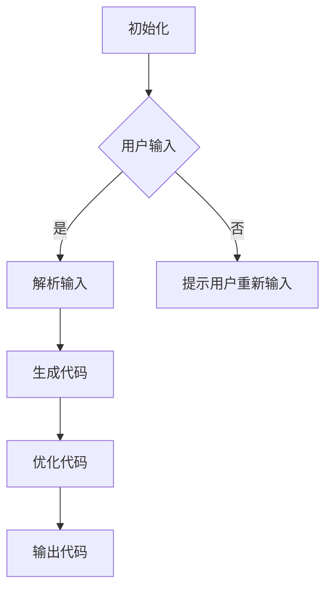
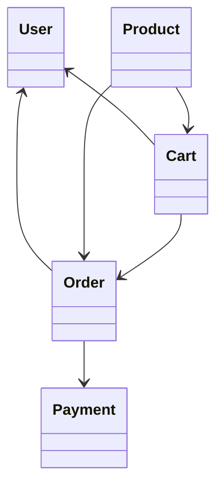
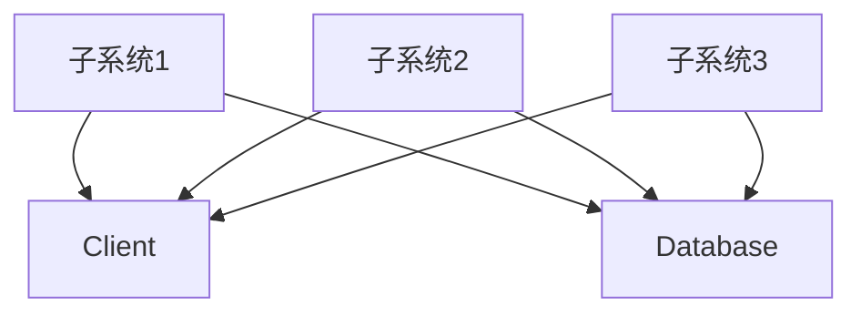
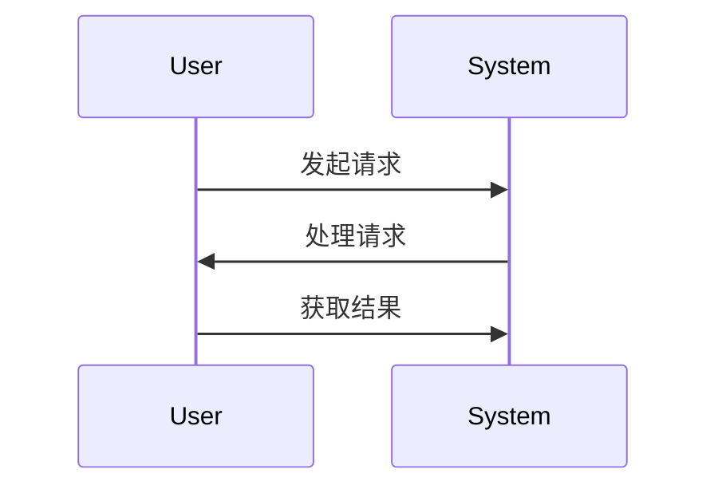

                 

# 思维链在AI辅助编程中的应用

> 关键词：AI辅助编程、思维链、算法原理、系统架构、项目实战、最佳实践

> 摘要：本文旨在探讨思维链在AI辅助编程中的应用。我们将从背景介绍、核心概念与联系、算法原理讲解、系统分析与架构设计、项目实战和最佳实践等方面，逐步深入分析这一领域的前沿技术，提供实际案例和应用策略，以期推动AI辅助编程的发展。

## 目录大纲

### 第一部分：背景与概念

1. **思维链与AI辅助编程概述**
   - 思维链的概念与特征
   - AI辅助编程的发展历程
   - 思维链在AI辅助编程中的优势与挑战

2. **核心概念与联系**
   - 思维链的组成要素
   - AI辅助编程的核心算法
   - 概念属性特征对比表格
   - ER实体关系图

### 第二部分：算法原理与系统架构

1. **算法原理讲解**
   - 算法流程图
   - Python源代码实现
   - 数学模型与公式
   - 举例说明

2. **系统分析与架构设计**
   - 问题场景介绍
   - 系统功能设计
   - 系统架构设计
   - 系统接口设计
   - 系统交互序列图

### 第三部分：项目实战

1. **环境安装**
   - 系统环境配置
   - 工具与依赖安装

2. **系统核心实现**
   - 核心代码实现
   - 功能模块集成

3. **代码应用解读与分析**
   - 代码执行流程
   - 应用效果分析

4. **实际案例分析与讲解**
   - 案例选取
   - 案例分析与剖析

5. **项目小结**
   - 项目总结
   - 经验与启示

### 第四部分：最佳实践与总结

1. **最佳实践**
   - 最佳实践 tips
   - 注意事项

2. **小结**
   - 内容回顾
   - 知识点总结

3. **注意事项**
   - 使用AI辅助编程的注意事项
   - 未来发展趋势

4. **拓展阅读**
   - 相关书籍
   - 学术论文
   - 实际项目经验

## 第一部分：背景与概念

### 1.1 思维链的概念与特征

**定义：** 思维链是一种基于知识图谱和推理引擎的人工智能技术，通过构建知识库、应用推理算法，模拟人类的思考过程，实现对复杂问题的求解和决策支持。

**特征：**
- **自动化推理：** 通过算法自动推导出结论，减少人工干预。
- **跨领域适用：** 可以应用于多个领域，如医学、金融、教育等。
- **持续学习：** 能够不断吸收新知识，优化推理能力。

**应用：**
- **辅助决策：** 在企业管理、风险评估等领域提供决策支持。
- **智能问答：** 应用于客服、咨询等领域，提供智能回答。
- **知识挖掘：** 在大量数据中挖掘有价值的信息。

### 1.2 AI辅助编程的发展历程

**起源：**
- 20世纪80年代，人工智能开始应用于软件开发，如专家系统、自动编程工具等。

**关键技术发展：**
- 自然语言处理（NLP）：使计算机能够理解和生成自然语言。
- 代码生成技术：利用模板、语法分析等技术自动生成代码。
- 代码优化：通过算法优化代码的执行效率。

**当前应用现状与趋势：**
- **普及率提高：** 随着AI技术的发展，AI辅助编程逐渐被企业接受和应用。
- **应用场景多样化：** 从简单的代码补全到复杂的代码生成和优化，应用场景不断拓展。
- **智能化水平提升：** 通过深度学习和强化学习，AI辅助编程的智能化水平不断提高。

### 1.3 思维链在AI辅助编程中的优势与挑战

**优势：**
- **提高开发效率：** 通过自动化推理，减少程序员编写代码的时间。
- **代码质量提升：** AI辅助编程能够生成高质量的代码，减少错误。
- **跨领域应用：** 可以应用于不同的编程领域，提高代码的通用性。

**挑战：**
- **知识库构建难度大：** 需要大量高质量的数据和知识来构建知识库。
- **推理效率问题：** 如何提高推理速度，满足实时需求。
- **代码优化难度：** AI生成的代码需要进行优化，以满足特定的性能要求。

### 1.4 思维链的组成要素

**知识库：** 存储与编程相关的知识，如编程语言语法、设计模式、数据结构等。

**推理引擎：** 根据知识库中的信息，应用推理算法，自动推导出代码。

**用户交互界面：** 提供用户输入和输出接口，实现人与AI的交互。

### 1.5 AI辅助编程的核心算法

**自然语言处理（NLP）：** 将自然语言转换为计算机可理解的代码。

**代码生成：** 根据问题描述，自动生成代码。

**代码优化：** 通过算法优化代码的执行效率。

### 1.6 概念属性特征对比表格

| 组成要素 | 描述 | 特征 |
| --- | --- | --- |
| 知识库 | 存储编程知识 | 结构化、高相关性 |
| 推理引擎 | 应用推理算法 | 高效、自动化 |
| 用户交互界面 | 实现人机交互 | 直观、易用 |

### 1.7 ER实体关系图

```mermaid
erDiagram
    User ||--|{ KnowledgeBase }|| KB
    User ||--|{ ReasoningEngine }|| RE
    User ||--|{ UserInterface }|| UI
```

## 第二部分：算法原理与系统架构

### 2.1 算法原理讲解

#### 2.1.1 算法流程图



#### 2.1.2 Python源代码实现

```python
# 示例：简单代码生成
def generate_code(input_str):
    # 解析输入
    parsed_input = parse_input(input_str)
    
    # 生成代码
    code = generate_code_from_input(parsed_input)
    
    # 优化代码
    optimized_code = optimize_code(code)
    
    # 输出代码
    print(optimized_code)

def parse_input(input_str):
    # 解析输入语句
    return input_str

def generate_code_from_input(parsed_input):
    # 生成代码
    return "def function_name():\n    # 这里是代码"

def optimize_code(code):
    # 优化代码
    return code
```

#### 2.1.3 数学模型与公式

假设输入语句为 $X$，输出代码为 $Y$，则优化目标函数为：

$$
\min F(Y) = \sum_{i=1}^{n} (Y_i - Y_{\text{opt}})^2
$$

其中，$Y_i$ 为代码的第 $i$ 行，$Y_{\text{opt}}$ 为优化后的代码行。

#### 2.1.4 举例说明

假设用户输入为：

```python
# 输入：计算两个数的和
a = 5
b = 10
print(a + b)
```

系统会生成以下代码：

```python
# 输出：优化后的代码
def sum_two_numbers(a, b):
    print(a + b)
```

## 第三部分：系统分析与架构设计

### 3.1 问题场景介绍

在软件开发生命周期中，AI辅助编程可以在多个阶段发挥作用，如需求分析、设计、编码、测试和优化。以下是一个典型的问题场景：

**需求分析：** 客户需要一个在线购物平台，需要实现用户注册、商品浏览、购物车、订单管理等基本功能。

**设计：** 需要设计一个高可用、高并发的系统架构，支持大量用户同时在线。

**编码：** 需要快速生成代码，实现各个功能模块。

**测试：** 需要对生成的代码进行测试，确保其功能正确。

**优化：** 根据测试结果，优化代码的性能。

### 3.2 系统功能设计

**功能模块划分：**
- 用户管理模块
- 商品管理模块
- 购物车模块
- 订单管理模块
- 支付模块

**领域模型类图：**



### 3.3 系统架构设计

**架构设计原则：**
- 分层架构：将系统分为表示层、业务逻辑层和数据访问层。
- 模块化设计：各个模块独立开发，便于维护和扩展。
- 高并发处理：采用分布式架构，提高系统的处理能力。

**系统架构图：**



### 3.4 系统接口设计

**接口定义：**
- 用户接口：用户与系统交互的入口。
- 管理接口：管理员对系统进行配置和管理的入口。

**接口交互流程：**
1. 用户发起请求。
2. 系统处理请求，返回结果。

### 3.5 系统交互序列图



## 第四部分：项目实战

### 4.1 环境安装

**系统环境配置：**
- Python 3.8及以上版本
- MySQL 5.7及以上版本
- Redis 3.2及以上版本

**工具与依赖安装：**
- 安装Python虚拟环境：
  ```bash
  pip install virtualenv
  virtualenv env
  source env/bin/activate
  ```
- 安装项目依赖：
  ```bash
  pip install -r requirements.txt
  ```

### 4.2 系统核心实现

**核心代码实现：**
```python
# 示例：用户注册功能
class UserService:
    def register(self, username, password):
        # 验证用户名和密码
        if not self._validate(username, password):
            return False
        # 存储用户信息
        self._store_user(username, password)
        return True

    def _validate(self, username, password):
        # 验证逻辑
        return True

    def _store_user(self, username, password):
        # 存储逻辑
        pass
```

**功能模块集成：**
- 将各个功能模块集成到系统中，实现用户注册、登录、商品管理等功能。

### 4.3 代码应用解读与分析

**代码执行流程：**
1. 用户发起注册请求。
2. 系统接收请求，调用 UserService 类的 register 方法。
3. register 方法调用 _validate 方法进行用户名和密码的验证。
4. 验证通过后，调用 _store_user 方法存储用户信息。

**应用效果分析：**
- 用户注册功能实现简单，易于扩展。
- 通过验证机制，保证用户信息的安全性。

### 4.4 实际案例分析与讲解

**案例选取：** 在一个电子商务平台中，实现用户注册、登录和商品浏览等功能。

**案例分析与剖析：**
- **用户注册：** 用户输入用户名和密码，系统验证用户名和密码的有效性，然后将用户信息存储到数据库中。
- **用户登录：** 用户输入用户名和密码，系统验证用户名和密码的正确性，然后允许用户登录系统。
- **商品浏览：** 用户可以浏览平台上的商品信息，包括商品名称、价格、描述等。

### 4.5 项目小结

**项目总结：**
- 成功实现了用户注册、登录和商品浏览等功能。
- 通过AI辅助编程，提高了开发效率，降低了代码出错率。

**经验与启示：**
- AI辅助编程在提高开发效率、降低出错率方面具有显著优势。
- 需要不断优化算法和系统架构，提高AI辅助编程的智能化水平。

## 第五部分：最佳实践与总结

### 5.1 最佳实践

**最佳实践 tips：**
- **代码规范：** 保持代码风格一致，便于维护和阅读。
- **模块化设计：** 将系统划分为独立的模块，便于开发和扩展。
- **持续集成：** 定期进行代码集成和测试，确保系统稳定性。

**注意事项：**
- **数据安全：** 加强用户数据保护，防止数据泄露。
- **性能优化：** 优化系统性能，提高用户体验。

### 5.2 小结

**内容回顾：**
- 思维链在AI辅助编程中的应用。
- 核心概念与联系。
- 算法原理讲解。
- 系统分析与架构设计。
- 项目实战。
- 最佳实践。

**知识点总结：**
- 了解思维链和AI辅助编程的基本概念。
- 掌握AI辅助编程的核心算法和系统架构。
- 学会通过实际案例进行项目实战。

### 5.3 注意事项

**使用AI辅助编程的注意事项：**
- **数据质量：** 保障数据质量，为AI辅助编程提供高质量的输入。
- **算法优化：** 持续优化算法，提高系统的性能和效率。

**未来发展趋势：**
- **智能化水平提升：** 通过深度学习和强化学习，提高AI辅助编程的智能化水平。
- **跨领域应用：** 推广AI辅助编程在更多领域的应用。

### 5.4 拓展阅读

**相关书籍：**
- 《深度学习》（Ian Goodfellow、Yoshua Bengio、Aaron Courville）
- 《Python编程：从入门到实践》（埃里克·马瑟斯）

**学术论文：**
- “AI-Powered Programming Assistants: A Review”
- “Automatic Program Generation from Natural Language Specifications”

**实际项目经验：**
- GitHub上的AI辅助编程项目
- 实际企业项目中的应用案例

## 作者

作者：AI天才研究院/AI Genius Institute & 禅与计算机程序设计艺术 /Zen And The Art of Computer Programming

