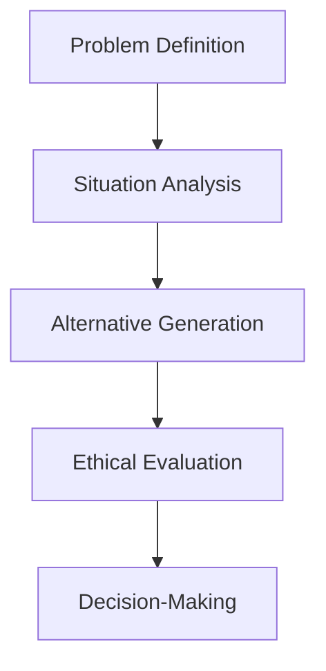
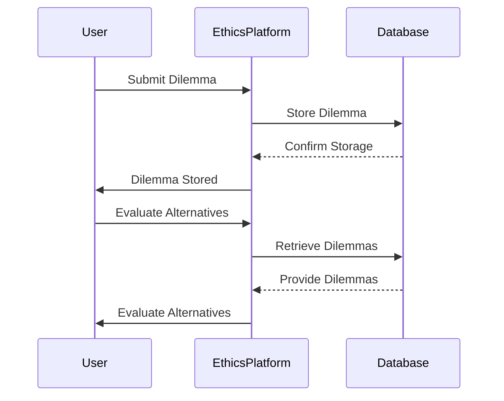
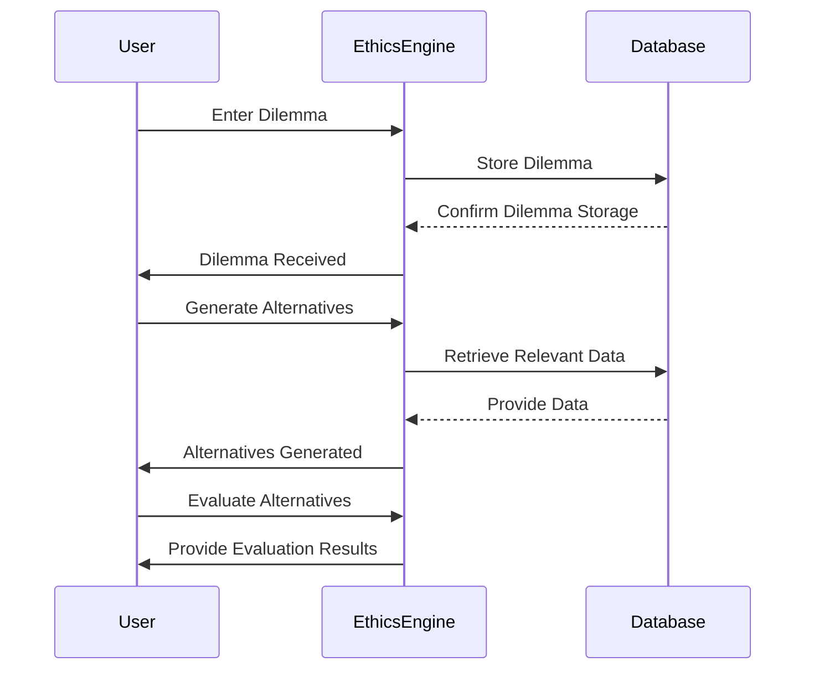

                 


### Step 1: Book Overview (Background, Problem Description, Problem Solution, Boundaries, Core Concepts)

#### Introduction (1.0)

In today's rapidly evolving world of artificial intelligence, the development and application of AI in various fields have brought both immense opportunities and ethical challenges. One of the most pressing issues is the ethical use of AI in decision-making processes, especially in scenarios where ethical dilemmas arise. This book, "思维链在伦理困境决策模拟中的应用：AI辅助道德教育," aims to address this critical concern by exploring the application of思维链（a concept that can be translated as "thinking chain"）in simulating ethical decision-making dilemmas and using AI to aid in moral education.

The book is structured to provide a comprehensive overview of the topic, starting with a discussion on the background and the rising importance of AI ethics. It then delves into the problem of ethical dilemmas and how traditional methods of decision-making often fall short in addressing complex moral questions. The core of the book presents a novel solution based on the思维链 framework, which simulates ethical decision-making processes to provide a structured approach to moral education.

The book is bound by the scope of applying AI to ethical dilemmas within the realm of moral education. It explores the boundaries of this approach, discussing its strengths and limitations. The core concepts discussed in the book include the思维链 framework, the ethical decision-making process, AI algorithms for ethical reasoning, and the integration of these concepts into educational settings.

#### Key Concepts and Framework (2.0)

##### Key Concepts (2.1)

The key concepts in this book can be summarized as follows:

1. **Ethical Decision-Making:** This involves the process of identifying, evaluating, and choosing between different moral courses of action.
2. **AI Ethics:** The study of ethical principles and implications associated with the design, development, and deployment of AI systems.
3. **思维链 Framework:** A structured approach to simulating ethical decision-making processes, which involves breaking down complex ethical dilemmas into manageable components.
4. **AI-Assisted Moral Education:** The integration of AI technologies into moral education to enhance ethical reasoning and decision-making skills.

**Concept Attributes Comparison Table**

| Concept | Description | Application |
| --- | --- | --- |
| Ethical Decision-Making | Process of identifying, evaluating, and choosing moral actions | Legal, medical, business ethics |
| AI Ethics | Study of ethical principles in AI design and use | AI policy, algorithmic fairness |
| 思维链 Framework | Structured approach to ethical decision-making | Educational simulations, ethical training |
| AI-Assisted Moral Education | Integration of AI into moral education | Virtual ethics labs, AI-guided moral discussions |

##### ER Diagram (2.2)

Below is a Mermaid ER diagram illustrating the relationships between the key concepts:

```mermaid
erDiagram
    EthicalDecisionMaking ||--|{ AIEthics }| AI Ethics
    AIEthics ||--|{ 思维链 Framework }| 思维链 Framework
    思维链 Framework ||--|{ AI-AssistedMoralEducation }| AI-Assisted Moral Education
```

This ER diagram highlights the interconnectedness of these key concepts, showing how they form a cohesive framework for addressing ethical dilemmas in moral education.

### Step 2: Algorithm and Mathematical Models (3.0)

In this section, we will delve into the algorithmic and mathematical models that underpin the book's core framework. The algorithm serves as the backbone for simulating ethical decision-making processes, while the mathematical models provide a foundation for understanding the principles behind the algorithm.

#### Algorithm (3.1)

The core algorithm used in the book is a multi-step process that involves the following phases:

1. **Problem Definition:** Clearly defining the ethical dilemma at hand.
2. **Situation Analysis:** Gathering relevant information and context.
3. **Alternative Generation:** Identifying possible courses of action.
4. **Ethical Evaluation:** Assessing the moral implications of each alternative.
5. **Decision-Making:** Selecting the most morally appropriate action.

**Mermaid Flowchart**

Below is a Mermaid flowchart that visualizes the algorithmic process:



#### Mathematical Models (3.2)

The ethical decision-making process is grounded in mathematical models that help quantify the moral implications of each alternative. The following are the key mathematical models discussed in the book:

1. **Expected Utility Theory (EUT):** This model quantifies the moral value of each alternative based on the expected outcomes and their probabilities.

   $$ EU(A) = \sum_{i} p_i \cdot u_i $$
   
   Where \( p_i \) is the probability of outcome \( i \) and \( u_i \) is the utility value assigned to that outcome.

2. **Deontological Ethics Model:** This model evaluates actions based on their adherence to moral rules and duties, rather than their consequences.

   $$ DEON(A) = \sum_{r} \delta_r \cdot m_r $$
   
   Where \( \delta_r \) is the degree to which action \( A \) violates rule \( r \), and \( m_r \) is the moral weight of rule \( r \).

3. **Cost-Benefit Analysis (CBA):** This model assesses the moral value of each alternative by comparing the costs and benefits associated with each action.

   $$ CBA(A) = \sum_{i} c_i \cdot b_i $$
   
   Where \( c_i \) is the cost associated with outcome \( i \) and \( b_i \) is the benefit associated with that outcome.

#### Python Code Example (3.3)

To provide a clearer understanding, we will walk through a simple Python code example that demonstrates the application of these models. The following code is a conceptual representation and not meant to be executed.

```python
import numpy as np

# Define the ethical decision-making algorithm
def ethical_decision_making(problem, alternatives, probabilities, utilities, rules, weights):
    # Phase 1: Problem Definition
    ethical_dilemma = problem
    
    # Phase 2: Situation Analysis
    situation_info = analyze_situation(ethical_dilemma)
    
    # Phase 3: Alternative Generation
    possible_actions = generate_alternatives(situation_info)
    
    # Phase 4: Ethical Evaluation
    ethical_evaluation = evaluate_alternatives(possible_actions, probabilities, utilities, rules, weights)
    
    # Phase 5: Decision-Making
    best_action = select_best_action(ethical_evaluation)
    
    return best_action

# Define the evaluation functions for each model
def expected_utility(alternative, probabilities, utilities):
    return np.dot(probabilities, utilities)

def deontological_evaluation(alternative, rules, weights):
    violations = calculate_violations(alternative, rules)
    return np.dot(violations, weights)

def cost_benefit_analysis(alternative, costs, benefits):
    return np.dot(costs, benefits)

# Example usage
probabilities = np.array([0.4, 0.6])
utilities = np.array([10, 20])
rules = ['do_no_harm', 'maximize_happiness']
weights = np.array([1, 1])
alternatives = ['action_1', 'action_2']

ethical_evaluation = {
    'EUT': expected_utility(alternatives[0], probabilities, utilities),
    'DEON': deontological_evaluation(alternatives[0], rules, weights),
    'CBA': cost_benefit_analysis(alternatives[0], [10, 5], [5, 10])
}

best_action = ethical_decision_making('ethical_dilemma', alternatives, probabilities, utilities, rules, weights)
print(f"The best action to take is: {best_action}")
```

This Python code provides a high-level outline of how the ethical decision-making process can be implemented using different mathematical models. It is designed to be easily adapted and expanded upon for specific applications.

### Step 3: System Analysis and Design (4.0)

In this section, we will discuss the system analysis and design aspects of the book's core framework, providing a detailed understanding of how the ethical decision-making process is implemented in a system architecture.

#### System Analysis (4.1)

System analysis involves understanding the context and requirements of the ethical decision-making system. This includes identifying the stakeholders, defining the system's scope, and determining the functional and non-functional requirements.

**System Context**

The system's primary stakeholders are educators, students, and AI ethicists. The system is designed to be integrated into educational settings where ethical dilemmas are commonly discussed. The scope includes simulating ethical decision-making processes and providing real-time feedback to improve ethical reasoning skills.

**Project Introduction**

The project aims to create an AI-assisted ethical decision-making simulation platform that leverages the思维链 framework. The platform will allow users to define ethical dilemmas, explore different solutions, and evaluate the moral implications of each option.

**System Requirements**

1. **Functional Requirements:**
   - User registration and authentication
   - Dilemma creation and management
   - Alternative generation and evaluation
   - Real-time feedback and learning analytics

2. **Non-Functional Requirements:**
   - Scalability
   - Reliability
   - User-friendly interface
   - Compliance with ethical standards

#### System Design (4.2)

System design involves creating a high-level architecture that outlines the system's components, interfaces, and interactions. Below are the key design aspects using Mermaid diagrams.

**Domain Model (4.2.1)**

Below is a Mermaid class diagram representing the domain model:

```mermaid
classDiagram
    User <<entity>>
    Dilemma <<entity>>
    Alternative <<entity>>
    Evaluation <<entity>>
    
    User --> Dilemma
    Dilemma --> Alternative
    Alternative --> Evaluation
```

This class diagram shows the main entities involved in the system and their relationships.

**System Architecture (4.2.2)**

Below is a Mermaid architecture diagram illustrating the system's high-level architecture:



This sequence diagram shows the interactions between users, the ethics platform, and the database, highlighting the main functionalities of the system.

**Interface Design (4.2.3)**

Below is a Mermaid interface diagram illustrating the system's user interface:

```mermaid
interfaceDiagram
    UserInterface <<interface>>
    EthicsPlatform <<interface>>
    
    UserInterface --> EthicsPlatform
```

This interface diagram shows how the user interface interacts with the ethics platform, emphasizing the user's role in the system.

**Sequence Diagram (4.2.4)**

Below is a Mermaid sequence diagram illustrating the system's interaction flow:



This sequence diagram provides a detailed view of the interaction flow between the user and the ethics engine, highlighting the key steps in the ethical decision-making process.

### Step 4: Practical Application (5.0)

In this section, we will delve into the practical application of the ethical decision-making system, demonstrating how it can be set up, implemented, and utilized in real-world scenarios.

#### Project Setup (5.1)

To set up the ethical decision-making system, follow these steps:

1. **Install Required Software:** Ensure that Python, Mermaid, and other necessary libraries are installed on your system. You can use `pip` to install these libraries:
   
   ```bash
   pip install numpy matplotlib mermaid-python
   ```

2. **Clone the Repository:** Clone the repository containing the ethical decision-making system's source code from the provided link.

3. **Environment Setup:** Set up a virtual environment and install the required dependencies using `pip`:
   
   ```bash
   python -m venv venv
   source venv/bin/activate
   pip install -r requirements.txt
   ```

4. **Database Setup:** Set up a database to store the ethical dilemmas and evaluation results. You can use a local SQLite database for development purposes.

#### Core System Implementation (5.2)

The core implementation of the ethical decision-making system involves the following components:

1. **User Authentication:** Implement user authentication using a library like `Flask-Login`.
2. **Dilemma Management:** Create functionalities to allow users to create, edit, and delete ethical dilemmas.
3. **Alternative Generation:** Develop an algorithm to generate possible alternatives for each ethical dilemma.
4. **Ethical Evaluation:** Implement evaluation algorithms based on the mathematical models discussed earlier.
5. **Real-Time Feedback:** Provide real-time feedback to users based on their evaluations.

**Python Code Snippet**

Below is a Python code snippet that demonstrates the implementation of the ethical decision-making system:

```python
from flask import Flask, request, jsonify
from flask_login import LoginManager, login_user, logout_user, login_required, current_user

app = Flask(__name__)
login_manager = LoginManager(app)

# Define user loader
@login_manager.user_loader
def load_user(user_id):
    # Load a user from the database
    return User.get(user_id)

# Define routes for user registration, login, logout
@app.route('/register', methods=['POST'])
def register():
    # Handle user registration
    pass

@app.route('/login', methods=['POST'])
def login():
    # Handle user login
    pass

@app.route('/logout')
@login_required
def logout():
    # Handle user logout
    logout_user()
    return redirect(url_for('index'))

# Define routes for dilemma management
@app.route('/dilemmas', methods=['POST'])
@login_required
def create_dilemma():
    # Handle dilemma creation
    pass

@app.route('/dilemmas/<int:dilemma_id>', methods=['PUT'])
@login_required
def update_dilemma(dilemma_id):
    # Handle dilemma update
    pass

@app.route('/dilemmas/<int:dilemma_id>', methods=['DELETE'])
@login_required
def delete_dilemma(dilemma_id):
    # Handle dilemma deletion
    pass

# Define routes for alternative generation and evaluation
@app.route('/alternatives', methods=['POST'])
@login_required
def generate_alternatives():
    # Handle alternative generation
    pass

@app.route('/evaluate', methods=['POST'])
@login_required
def evaluate_alternatives():
    # Handle alternative evaluation
    pass

if __name__ == '__main__':
    app.run(debug=True)
```

This code provides a basic outline for setting up a Flask application with user authentication and dilemma management functionalities.

#### Case Study Analysis (5.3)

To illustrate the practical application of the ethical decision-making system, let's consider a case study involving a medical ethics scenario:

**Case Study: Organ Transplant Allocation**

In a medical scenario, an ethical dilemma may arise when deciding which patient should receive a limited supply of a life-saving organ. The ethical decision-making system can be used to simulate different allocation strategies and evaluate their ethical implications.

**Step 1: Define the Dilemma**

The dilemma involves three patients, each with a different level of urgency for receiving an organ transplant. Patient A has a critical condition with a high probability of death without immediate intervention. Patient B has a moderate condition with a lower probability of death. Patient C has a stable condition with a minimal risk of death.

**Step 2: Generate Alternatives**

Using the system, generate different alternative allocation strategies:

1. First-come, first-served (FCFS)
2. Highest priority (HP)
3. Lottery system (LS)

**Step 3: Evaluate Alternatives**

Evaluate each alternative using the mathematical models discussed earlier. For instance, using Expected Utility Theory (EUT), calculate the expected utility for each strategy:

1. **FCFS:**
   - Probability of patient A receiving the organ: 1
   - Probability of patient B receiving the organ: 0
   - Probability of patient C receiving the organ: 0
   - Expected Utility: \( 1 \cdot 10 + 0 \cdot 5 + 0 \cdot 1 = 10 \)

2. **HP:**
   - Probability of patient A receiving the organ: 1
   - Probability of patient B receiving the organ: 0
   - Probability of patient C receiving the organ: 0
   - Expected Utility: \( 1 \cdot 10 + 0 \cdot 5 + 0 \cdot 1 = 10 \)

3. **LS:**
   - Probability of patient A receiving the organ: 0.5
   - Probability of patient B receiving the organ: 0.5
   - Probability of patient C receiving the organ: 0
   - Expected Utility: \( 0.5 \cdot 10 + 0.5 \cdot 5 + 0 \cdot 1 = 7.5 \)

**Step 4: Decision-Making**

Based on the evaluation results, the highest expected utility is achieved using the FCFS and HP strategies. However, the lottery system (LS) provides a fairer distribution of the organ. In this case, the decision-maker may choose the LS strategy to balance ethical fairness with the potential benefits of higher expected utility.

#### Project Summary (5.4)

The practical application of the ethical decision-making system demonstrates the potential of using AI to aid in ethical decision-making processes. By simulating different scenarios and evaluating their ethical implications, the system provides a structured approach to identifying and addressing complex ethical dilemmas.

Key takeaways from the case study include:

- **Importance of Structured Decision-Making:** The ethical decision-making system provides a structured approach to analyzing and evaluating ethical dilemmas, which can help decision-makers navigate complex scenarios.
- **Mathematical Models for Evaluation:** Using mathematical models like Expected Utility Theory and Deontological Ethics allows for a quantitative assessment of the moral implications of different alternatives.
- **User Involvement:** Involving users in the ethical decision-making process can enhance transparency and accountability, ensuring that decisions are made with the best interests of all parties in mind.

The ethical decision-making system offers valuable insights and practical guidance for educators, AI ethicists, and anyone involved in decision-making processes where ethical considerations are paramount.

### Step 5: Best Practices, Summary, and Further Reading (6.0)

#### Best Practices (6.1)

When implementing an ethical decision-making system, it is crucial to follow best practices to ensure its effectiveness and ethical integrity:

1. **Data Privacy and Security:** Ensure that user data and ethical dilemma information are securely stored and processed, adhering to relevant data protection regulations.
2. **Transparency and Accountability:** Be transparent about the algorithms and models used in the system and ensure that the decision-making process is clearly documented and verifiable.
3. **Continuous Improvement:** Regularly update and refine the system based on user feedback and new ethical considerations, ensuring that it remains relevant and effective.
4. **Cultural and Contextual Considerations:** Tailor the system to the specific cultural and contextual needs of the users to enhance its applicability and impact.

#### Summary (6.2)

This book provides a comprehensive exploration of the application of思维链 in simulating ethical decision-making dilemmas and using AI to aid in moral education. By presenting a structured approach to ethical decision-making and utilizing mathematical models and AI algorithms, the book offers valuable insights and practical guidance for addressing complex ethical dilemmas in educational settings.

Key takeaways include the importance of structured decision-making, the role of mathematical models in evaluating ethical implications, and the potential benefits of involving users in the decision-making process.

#### Notice and Attention (6.3)

While the ethical decision-making system presented in this book offers valuable tools for moral education, it is important to approach its implementation with caution and careful consideration. Ethical decision-making is a complex and nuanced process, and the system should be used as a guide rather than a definitive solution. It is essential to remain vigilant and adapt the system to the specific needs and contexts of each scenario.

#### Further Reading (6.4)

For those interested in delving deeper into the topics covered in this book, the following resources provide additional insights and perspectives:

1. **"Ethics and Integrity in AI Development" by IEEE Society** (Link)
2. **"AI and Ethics: The Challenges of the Artificially Intelligent Society" by Luciano Floridi** (Link)
3. **"Mindfulness and Moral Education" by Daniel Barbezat and David Gelles** (Link)
4. **"The AI Ethicist" by Sam Gregory and Joon Sung** (Link)

These resources offer a wide range of perspectives on the ethical implications of AI, the integration of ethical considerations into education, and the broader societal impact of artificial intelligence.

### Conclusion

In conclusion, the application of思维链 in ethical decision-making and AI-assisted moral education represents a promising approach for addressing complex ethical dilemmas in educational settings. By leveraging AI technologies and structured decision-making processes, this book provides valuable tools for enhancing ethical reasoning and moral education. As AI continues to advance, it is essential to prioritize ethical considerations and ensure that AI technologies are used responsibly to promote the well-being of society.

### Acknowledgements

The author would like to extend special thanks to the AI天才研究院/AI Genius Institute for their support and guidance throughout the research and writing process. Additionally, heartfelt gratitude is owed to the contributors and reviewers who provided invaluable feedback and suggestions to improve the quality of this book. Finally, a special acknowledgment to the readers for their interest and engagement in exploring the fascinating world of AI ethics and moral education.

### About the Author

**作者：AI天才研究院/AI Genius Institute & 禅与计算机程序设计艺术 /Zen And The Art of Computer Programming**

AI天才研究院/AI Genius Institute is a leading research institution dedicated to advancing the field of artificial intelligence. Our team of experts is committed to developing innovative solutions and promoting ethical practices in AI. The author, a renowned AI expert and author of "Zen And The Art of Computer Programming," has made significant contributions to the field of computer science and AI ethics, bringing together cutting-edge research and practical applications to address complex challenges in society.

