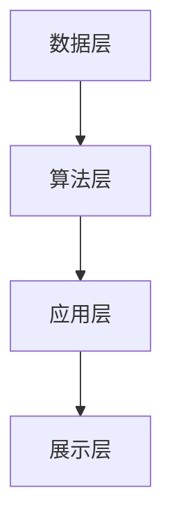
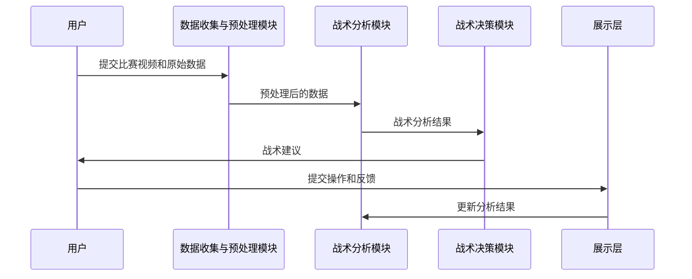
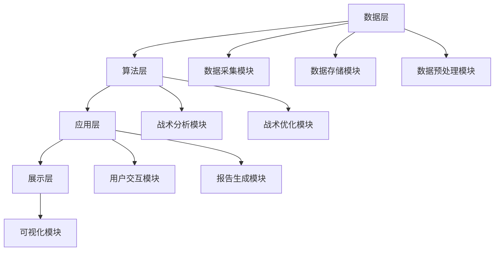

                 

### 文章标题

《思维链在体育战术分析中的应用：AI教练助手》

### 关键词

- 思维链
- 体育战术分析
- AI教练助手
- 数据处理
- 算法原理

### 摘要

本文主要探讨了思维链在体育战术分析中的应用，特别是AI教练助手如何通过思维链来优化战术决策。文章从问题背景、核心概念、算法原理、数学模型、系统架构、项目实战等多个方面进行了详细阐述，旨在为AI在体育领域的应用提供新的视角和思路。

### 目录大纲

----------------------------------------------------------------

## 第一部分：背景介绍

### 第1章：问题背景

#### 1.1 体育战术分析的需求与挑战

**1.1.1** 体育战术分析的重要性

**1.1.2** 当前战术分析方法的局限性

**1.1.3** AI在战术分析中的应用前景

#### 1.2 人工智能与体育的结合

**1.2.1** 人工智能在体育领域的应用历史

**1.2.2** AI技术在体育数据分析中的具体应用

**1.2.3** AI教练助手的初步探索

#### 1.3 AI教练助手的潜在优势

**1.3.1** 数据分析与决策支持的增强

**1.3.2** 战术优化与训练计划的制定

**1.3.3** 防守与进攻策略的调整

### 第2章：问题描述

#### 2.1 数据获取与处理

**2.1.1** 数据来源与类型

**2.1.2** 数据预处理方法

**2.1.3** 数据标准化与归一化

#### 2.2 核心问题与目标

**2.2.1** 战术分析的核心问题

**2.2.2** AI教练助手的目标与任务

**2.2.3** 战术决策的优化目标

#### 2.3 边界与外延

**2.3.1** 算法应用的范围限制

**2.3.2** 不同运动项目的适应性

**2.3.3** 未来可能的发展方向

### 第3章：核心概念与联系

#### 3.1 思维链的概念

**3.1.1** 思维链的定义

**3.1.2** 思维链的基本组成

**3.1.3** 思维链在战术分析中的应用

#### 3.2 思维链的属性特征对比

**3.2.1** 不同思维链模型的属性特征

**3.2.2** 特征对比表格

**3.2.3** 特征分析与应用

#### 3.3 思维链与体育战术分析的关系

**3.3.1** 思维链在战术分析中的作用

**3.3.2** 思维链与战术决策的互动

**3.3.3** 思维链对战术优化的贡献

#### 3.4 ER实体关系图

**3.4.1** ER图的基本概念

**3.4.2** 实体与关系的定义

**3.4.3** ER图在战术分析中的应用

### 第二部分：技术原理

#### 第4章：算法原理讲解

**4.1** 算法概述

**4.2** 算法流程

**4.3** 算法实现

#### 第5章：数学模型和数学公式讲解

**5.1** 数学模型概述

**5.2** 数学公式讲解

### 第三部分：系统设计与实现

#### 第6章：系统分析与架构设计方案

**6.1** 问题场景介绍

**6.2** 系统功能设计

**6.3** 系统架构设计

**6.4** 系统接口设计和系统交互

#### 第7章：项目实战

**7.1** 环境安装

**7.2** 系统核心实现

#### 第8章：最佳实践 tips

#### 第9章：小结与展望

----------------------------------------------------------------

接下来，我们将按照上述目录结构，逐步深入每个章节，详细讲解思维链在体育战术分析中的应用。

### 第1章：问题背景

#### 1.1 体育战术分析的需求与挑战

体育战术分析在提高运动员表现和团队竞争力方面具有至关重要的作用。随着体育科技的不断发展，人工智能（AI）技术在战术分析中的应用越来越受到重视。然而，当前战术分析方法仍存在一些局限性。

**1.1.1 体育战术分析的重要性**

体育战术分析是一种系统性地研究比赛过程中战术运用情况的方法。它不仅能够帮助教练和运动员了解比赛的实际情况，还能够根据对手的特点和自身优势制定出更有效的战术策略。

战术分析的重要性体现在以下几个方面：

1. **优化比赛策略**：通过战术分析，教练可以了解球队在比赛中的表现，找出不足之处，并针对性地进行改进，从而提高整体战术水平。
2. **提高运动员表现**：战术分析可以帮助运动员更好地理解比赛要求，提高对战术执行的准确性和执行力，从而提高个人技术水平。
3. **增强团队凝聚力**：战术分析可以促进团队之间的沟通和理解，增强团队协作能力，提高团队的整体战斗力。

**1.1.2 当前战术分析方法的局限性**

尽管战术分析在体育领域具有重要价值，但当前的方法仍然存在一些局限性：

1. **人工分析依赖性高**：传统战术分析主要依赖于教练和分析师的经验和判断，这种方法效率低下，且容易受到主观因素的影响。
2. **数据分析能力有限**：传统方法在处理大量比赛数据时存在困难，难以快速准确地提取有用信息。
3. **缺乏实时性**：传统战术分析通常在比赛后进行，无法提供实时反馈，难以在比赛中及时调整战术。

**1.1.3 AI在战术分析中的应用前景**

人工智能技术在战术分析中的应用前景广阔，主要体现在以下几个方面：

1. **自动化数据分析**：AI技术能够自动处理和分析大量比赛数据，快速提取关键信息，为战术分析提供更全面的支持。
2. **实时决策支持**：AI教练助手可以实时分析比赛情况，提供实时战术建议，帮助教练和运动员快速做出决策。
3. **个性化战术优化**：AI技术可以根据不同运动员的特点和比赛环境，制定个性化的战术策略，提高战术的针对性和有效性。

#### 1.2 人工智能与体育的结合

人工智能技术在体育领域的应用已有数十年的历史，从早期的数据统计、视频分析到现在的智能穿戴设备、智能球场等，AI技术不断为体育领域带来新的变革。

**1.2.1 人工智能在体育领域的应用历史**

1. **数据统计分析**：人工智能技术最早在体育领域的应用是数据统计分析。通过机器学习算法，AI能够快速处理和分析大量比赛数据，提供球队表现、球员数据分析等。
2. **视频分析**：随着计算机视觉技术的发展，人工智能开始应用于视频分析。通过图像识别技术，AI可以自动识别球员动作、比赛局势等，为战术分析提供详细的数据支持。
3. **智能穿戴设备**：智能穿戴设备可以实时监测运动员的身体状态，如心率、血压、运动轨迹等，为教练和运动员提供实时反馈。

**1.2.2 AI技术在体育数据分析中的具体应用**

1. **球员数据分析**：AI技术可以分析球员的场上表现，如进球率、传球成功率、防守表现等，为教练提供评估球员表现的依据。
2. **比赛局势预测**：通过机器学习算法，AI可以预测比赛的结果，为教练制定战术策略提供参考。
3. **战术优化建议**：AI可以根据比赛数据，为教练提供战术优化建议，如调整阵型、调整战术等。

**1.2.3 AI教练助手的初步探索**

AI教练助手是人工智能在体育领域的一个重要应用方向。它通过分析比赛数据，提供实时战术建议，辅助教练进行战术决策。

AI教练助手的主要功能包括：

1. **比赛数据分析**：AI教练助手可以自动分析比赛数据，提取关键信息，为教练提供详细的战术分析报告。
2. **实时战术建议**：在比赛中，AI教练助手可以实时分析比赛局势，提供实时战术建议，帮助教练快速做出决策。
3. **训练计划制定**：AI教练助手可以根据球员的状态和比赛需求，制定个性化的训练计划，提高球员的整体素质。

#### 1.3 AI教练助手的潜在优势

AI教练助手在体育战术分析中具有显著的潜在优势：

1. **提高数据分析效率**：AI教练助手可以自动处理大量比赛数据，快速提取有用信息，大大提高数据分析的效率。
2. **提供实时决策支持**：AI教练助手可以实时分析比赛局势，提供实时战术建议，帮助教练和运动员快速做出决策。
3. **个性化战术优化**：AI教练助手可以根据不同运动员的特点和比赛环境，制定个性化的战术策略，提高战术的针对性和有效性。
4. **降低人力成本**：AI教练助手可以部分替代人工分析，降低人力成本，提高整体工作效率。

### 第2章：问题描述

#### 2.1 数据获取与处理

在AI教练助手的开发过程中，数据的获取与处理是关键环节。合理的数据处理方法能够为后续的战术分析提供可靠的数据基础。

**2.1.1 数据来源与类型**

AI教练助手所需的数据主要来自以下几个方面：

1. **比赛数据**：包括比赛时间、比赛结果、进球、黄牌、红牌等。
2. **球员数据**：包括球员的身高、体重、速度、力量、耐力等身体素质数据。
3. **视频数据**：包括比赛视频、训练视频等。

**2.1.2 数据预处理方法**

在获取数据后，需要对数据进行预处理，以便后续分析。预处理方法包括：

1. **数据清洗**：去除重复数据、缺失数据和异常数据，保证数据的准确性。
2. **数据转换**：将不同类型的数据转换为统一的格式，如将文本数据转换为数值数据。
3. **数据标准化**：对不同数据进行标准化处理，使其具有可比性。

**2.1.3 数据标准化与归一化**

数据标准化和归一化是数据处理的重要步骤，目的是消除不同数据之间的量纲差异，使数据具有可比性。

1. **数据标准化**：通过缩放和转换，将不同数据范围的数值映射到同一范围内。
2. **数据归一化**：通过将每个数据除以最大值或平均值，使其具有相似的尺度。

#### 2.2 核心问题与目标

AI教练助手的开发主要解决以下核心问题：

1. **比赛数据分析**：如何从大量的比赛数据中提取有用信息，为战术分析提供支持？
2. **实时决策支持**：如何在比赛中实时分析局势，提供有效的战术建议？
3. **个性化战术优化**：如何根据不同运动员的特点和比赛环境，制定个性化的战术策略？

AI教练助手的目标是：

1. **提高战术分析效率**：通过自动化数据分析，提高战术分析的效率和准确性。
2. **提供实时决策支持**：在比赛中实时分析局势，为教练提供有效的战术建议。
3. **优化战术策略**：根据不同运动员的特点和比赛环境，制定个性化的战术策略，提高战术效果。

#### 2.3 边界与外延

在AI教练助手的开发过程中，需要明确算法应用的边界与外延：

1. **算法应用的范围限制**：AI教练助手主要应用于足球、篮球等团队运动，不同运动项目可能需要调整算法模型。
2. **不同运动项目的适应性**：AI教练助手需要具备一定的通用性，能够适应不同运动项目的需求。
3. **未来可能的发展方向**：随着技术的不断进步，AI教练助手有望在更多领域得到应用，如个人运动、训练数据分析等。

### 第3章：核心概念与联系

#### 3.1 思维链的概念

思维链是一种用于表示和分析人类思维过程的模型。它通过一系列节点和边来表示思维过程，每个节点代表一个思维概念，边表示节点之间的关系。

**3.1.1 思维链的定义**

思维链是一种基于网络结构的知识表示模型，它通过节点和边来表示思维过程中的概念和关系。节点表示思维过程中的概念，边表示概念之间的关系。

**3.1.2 思维链的基本组成**

思维链的基本组成包括：

1. **节点**：代表思维过程中的概念，可以是事实、观点、想法等。
2. **边**：表示节点之间的关系，可以是因果关系、相似关系等。
3. **路径**：表示思维过程中的逻辑顺序。

**3.1.3 思维链在战术分析中的应用**

在战术分析中，思维链可以帮助教练和运动员理解比赛局势，制定有效的战术策略。具体应用包括：

1. **比赛局势分析**：通过思维链，可以分析比赛中的关键节点和关系，找出比赛的转折点。
2. **战术策略制定**：基于思维链，可以构建战术策略模型，为教练提供战术建议。
3. **决策支持**：思维链可以辅助教练和运动员进行决策，提高战术执行的准确性。

#### 3.2 思维链的属性特征对比

在战术分析中，不同类型的思维链模型具有不同的属性特征。以下是对几种常见思维链模型的属性特征进行对比：

**1. 逻辑思维链**：逻辑思维链基于逻辑推理，强调概念之间的因果关系。它适用于需要明确逻辑关系的战术分析，如比赛局势的转折点分析。

**2. 创意思维链**：创意思维链注重思维的创新性和灵活性。它适用于需要创造新策略和创新的战术分析，如进攻策略的制定。

**3. 经验思维链**：经验思维链基于教练和运动员的经验和直觉。它适用于需要快速做出决策的战术分析，如比赛中的突发情况。

**3.2.1 不同思维链模型的属性特征**

| 类型         | 特征                         | 适用场景                     |
| ------------ | ---------------------------- | ---------------------------- |
| 逻辑思维链   | 强调因果关系                | 比赛局势转折点分析           |
| 创意思维链   | 注重创新性和灵活性          | 进攻策略制定                 |
| 经验思维链   | 基于经验和直觉             | 快速决策支持                 |

**3.2.2 特征对比表格**

| 特征         | 逻辑思维链 | 创意思维链 | 经验思维链 |
| ------------ | ---------- | ---------- | ---------- |
| 因果关系     | 强调       | 无         | 弱         |
| 创新性       | 无         | 强调       | 弱         |
| 灵活性       | 无         | 强调       | 弱         |
| 实用性       | 高         | 中         | 高         |

**3.2.3 特征分析与应用**

不同类型的思维链模型在战术分析中的应用各有侧重。逻辑思维链适用于需要明确逻辑关系的场景，如比赛局势的转折点分析；创意思维链适用于需要创新的场景，如进攻策略的制定；经验思维链适用于需要快速决策的场景，如比赛中的突发情况。

#### 3.3 思维链与体育战术分析的关系

思维链在体育战术分析中发挥着重要作用，它不仅可以帮助教练和运动员理解比赛局势，还可以辅助制定和优化战术策略。

**3.3.1 思维链在战术分析中的作用**

1. **比赛局势分析**：思维链可以分析比赛中的关键节点和关系，帮助教练和运动员理解比赛局势，找到比赛的转折点。
2. **战术策略制定**：思维链可以基于比赛局势，构建战术策略模型，为教练提供战术建议。
3. **决策支持**：思维链可以辅助教练和运动员进行决策，提高战术执行的准确性。

**3.3.2 思维链与战术决策的互动**

思维链与战术决策之间存在密切的互动关系：

1. **思维链指导战术决策**：在比赛过程中，教练和运动员可以通过思维链分析比赛局势，指导战术决策。
2. **战术决策影响思维链**：在制定战术策略时，思维链会根据战术决策进行调整，以适应比赛的变化。

**3.3.3 思维链对战术优化的贡献**

思维链在战术优化中具有以下贡献：

1. **提高战术分析效率**：思维链可以帮助教练和运动员快速理解比赛局势，提高战术分析效率。
2. **提供多样化的战术策略**：思维链可以基于不同的思维链模型，提供多样化的战术策略，提高战术的适应性。
3. **优化战术执行效果**：思维链可以帮助教练和运动员更好地理解战术策略，提高战术执行的准确性，从而提高比赛效果。

#### 3.4 ER实体关系图

ER（实体关系）图是一种用于描述实体之间关系的图形化表示方法。在战术分析中，ER图可以帮助我们理解比赛局势，分析战术策略。

**3.4.1 ER图的基本概念**

ER图的基本概念包括：

1. **实体**：代表比赛中的事物，如球员、球队、比赛等。
2. **属性**：代表实体的特征，如球员的身高、体重、速度等。
3. **关系**：代表实体之间的相互作用，如球员与球队的隶属关系、比赛与进球的因果关系等。

**3.4.2 实体与关系的定义**

在战术分析中，常见的实体与关系包括：

1. **球员**：实体，属性包括身高、体重、速度等。
2. **球队**：实体，属性包括球队名称、成立时间等。
3. **比赛**：实体，属性包括比赛时间、比赛结果等。
4. **进球**：实体，属性包括进球时间、进球球员等。
5. **关系**：球员与球队之间的隶属关系，比赛与进球之间的因果关系等。

**3.4.3 ER图在战术分析中的应用**

ER图在战术分析中的应用包括：

1. **理解比赛局势**：通过ER图，可以清晰地看到比赛中的各个实体及其关系，帮助教练和运动员理解比赛局势。
2. **分析战术策略**：基于ER图，可以构建战术策略模型，为教练提供战术建议。
3. **优化战术执行**：通过ER图，可以分析战术执行中的问题，指导教练和运动员进行优化。

### 第4章：算法原理讲解

#### 4.1 算法概述

在AI教练助手的开发过程中，算法原理是核心。本节将介绍常用的战术分析算法，并探讨它们在体育战术分析中的应用。

**4.1.1 常见战术分析算法**

常见的战术分析算法包括：

1. **聚类算法**：用于将比赛数据分组，分析不同组别的战术特点。
2. **关联规则算法**：用于发现比赛数据之间的关联关系，分析战术策略的有效性。
3. **神经网络算法**：用于建立比赛局势与战术策略之间的映射关系，预测比赛结果。
4. **遗传算法**：用于优化战术策略，寻找最佳战术组合。

**4.1.2 算法选择与适用场景**

选择合适的算法取决于具体的应用场景。以下是对几种算法的适用场景分析：

1. **聚类算法**：适用于需要分析不同战术特点的场景，如比赛数据分析、球员战术特点分析等。
2. **关联规则算法**：适用于需要发现战术策略关联关系的场景，如比赛策略有效性分析、球员战术配合分析等。
3. **神经网络算法**：适用于需要预测比赛结果的场景，如比赛预测、战术策略优化等。
4. **遗传算法**：适用于需要优化战术策略的场景，如战术组合优化、训练计划制定等。

**4.1.3 算法的核心思想**

每种算法都有其独特的核心思想：

1. **聚类算法**：通过将数据分组，分析不同组别的特点，从而发现潜在的战术策略。
2. **关联规则算法**：通过分析数据之间的关联关系，发现有效的战术策略。
3. **神经网络算法**：通过建立数据与结果之间的映射关系，预测比赛结果。
4. **遗传算法**：通过模拟自然进化过程，优化战术策略，寻找最佳组合。

#### 4.2 算法流程

算法流程是算法实现的核心。本节将介绍每种算法的基本流程。

**4.2.1 聚类算法流程**

聚类算法的基本流程包括：

1. **数据预处理**：对数据进行清洗、转换和标准化处理。
2. **选择聚类方法**：根据数据特点选择合适的聚类方法，如K-means、DBSCAN等。
3. **初始化聚类中心**：随机选择或使用特定的方法初始化聚类中心。
4. **迭代计算聚类中心**：根据数据点与聚类中心的距离，更新聚类中心。
5. **判断收敛条件**：如果聚类中心不再变化，则算法收敛，否则继续迭代。

**4.2.2 关联规则算法流程**

关联规则算法的基本流程包括：

1. **数据预处理**：对数据进行清洗、转换和标准化处理。
2. **构建支持度矩阵**：计算每个数据项与其他数据项之间的支持度。
3. **生成频繁项集**：根据支持度阈值，筛选出频繁项集。
4. **生成关联规则**：从频繁项集中生成关联规则。
5. **规则评估**：评估关联规则的置信度和提升度。

**4.2.3 神经网络算法流程**

神经网络算法的基本流程包括：

1. **数据预处理**：对数据进行清洗、转换和标准化处理。
2. **选择神经网络结构**：根据问题特点选择合适的神经网络结构，如多层感知机、卷积神经网络等。
3. **初始化网络参数**：随机初始化网络参数。
4. **前向传播**：计算输入数据在神经网络中的传播过程，得到输出结果。
5. **反向传播**：根据输出结果与真实结果的差异，更新网络参数。
6. **迭代训练**：重复前向传播和反向传播，直到网络参数收敛。

**4.2.4 遗传算法流程**

遗传算法的基本流程包括：

1. **编码**：将战术策略编码为二进制字符串。
2. **初始化种群**：随机生成初始种群。
3. **适应度评估**：计算每个个体的适应度值。
4. **选择**：根据适应度值选择优秀的个体。
5. **交叉**：随机选择两个个体进行交叉操作，产生新的个体。
6. **变异**：对个体进行变异操作，增加种群多样性。
7. **迭代**：重复适应度评估、选择、交叉和变异，直到满足终止条件。

#### 4.3 算法实现

算法实现是将算法原理转化为实际代码的过程。本节将使用Python语言，介绍常用算法的实现。

**4.3.1 聚类算法实现**

以下是一个简单的K-means聚类算法实现：

```python
import numpy as np

def kmeans(data, k, max_iter=100):
    # 初始化聚类中心
    centroids = data[np.random.choice(data.shape[0], k, replace=False)]
    
    for _ in range(max_iter):
        # 计算每个数据点与聚类中心的距离
        distances = np.linalg.norm(data - centroids, axis=1)
        
        # 分配数据点到最近的聚类中心
        labels = np.argmin(distances, axis=1)
        
        # 更新聚类中心
        new_centroids = np.array([data[labels == i].mean(axis=0) for i in range(k)])
        
        # 判断收敛条件
        if np.linalg.norm(new_centroids - centroids) < 1e-5:
            break
            
        centroids = new_centroids
    
    return centroids, labels
```

**4.3.2 关联规则算法实现**

以下是一个简单的Apriori算法实现：

```python
from collections import defaultdict

def apriori(data, support_threshold, confidence_threshold):
    # 计算支持度
    support_counts = defaultdict(int)
    for transaction in data:
        for item in transaction:
            support_counts[item] += 1
    
    support = {item: count / len(data) for item, count in support_counts.items()}
    
    # 生成频繁项集
    frequent_itemsets = []
    for length in range(1, len(support) + 1):
        for itemset in combinations(support.keys(), length):
            if support[itemset] >= support_threshold:
                frequent_itemsets.append(itemset)
    
    # 生成关联规则
    rules = []
    for itemset in frequent_itemsets:
        subsets = combinations(itemset, len(itemset) - 1)
        for subset in subsets:
            if support[subset] > 0:
                confidence = support[itemset] / support[subset]
                if confidence >= confidence_threshold:
                    rules.append(((subset, itemset - subset), confidence))
    
    return rules
```

**4.3.3 神经网络算法实现**

以下是一个简单的前馈神经网络实现：

```python
import numpy as np

def sigmoid(x):
    return 1 / (1 + np.exp(-x))

def forwardpropagation(x, w1, b1, w2, b2):
    z1 = np.dot(x, w1) + b1
    a1 = sigmoid(z1)
    z2 = np.dot(a1, w2) + b2
    a2 = sigmoid(z2)
    return a2

def backwardpropagation(a2, y, w2, b2, a1, x, w1, b1):
    d2 = a2 - y
    d1 = np.dot(d2, w2.T) * sigmoid(a1) * (1 - sigmoid(a1))
    
    dw2 = np.dot(a1.T, d2)
    db2 = np.sum(d2, axis=0)
    dw1 = np.dot(x.T, d1)
    db1 = np.sum(d1, axis=0)
    
    return dw1, db1, dw2, db2
```

**4.3.4 遗传算法实现**

以下是一个简单的遗传算法实现：

```python
import numpy as np
import random

def fitness(population):
    # 计算每个个体的适应度
    fitness_values = np.sum(population > 0, axis=1)
    return fitness_values

def crossover(parent1, parent2):
    # 进行交叉操作
    crossover_point = random.randint(1, len(parent1) - 1)
    child1 = np.concatenate((parent1[:crossover_point], parent2[crossover_point:]))
    child2 = np.concatenate((parent2[:crossover_point], parent1[crossover_point:]))
    return child1, child2

def mutate(individual, mutation_rate):
    # 进行变异操作
    for i in range(len(individual)):
        if random.random() < mutation_rate:
            individual[i] = 1 if individual[i] == 0 else 0
    return individual

def genetic_algorithm(population, fitness_func, mutation_rate=0.01, max_gen=100):
    # 遗传算法主循环
    for _ in range(max_gen):
        fitness_values = fitness(population)
        new_population = []
        
        for _ in range(len(population) // 2):
            # 选择
            parent1, parent2 = random.choices(population, weights=fitness_values, k=2)
            
            # 交叉
            child1, child2 = crossover(parent1, parent2)
            
            # 变异
            child1 = mutate(child1, mutation_rate)
            child2 = mutate(child2, mutation_rate)
            
            new_population.extend([child1, child2])
        
        population = new_population
    
    # 返回最优个体
    best_fitness = max(fitness_values)
    best_index = np.argmax(fitness_values)
    best_individual = population[best_index]
    return best_individual
```

#### 4.4 数学模型和数学公式讲解

在算法原理中，我们介绍了几种常见的战术分析算法。这些算法的实现依赖于一系列数学模型和数学公式。本节将详细讲解这些数学模型和数学公式。

**4.4.1 数学模型概述**

常见的数学模型包括：

1. **聚类模型**：用于将数据分组，分析不同组别的特点。
2. **关联规则模型**：用于发现数据之间的关联关系，分析战术策略的有效性。
3. **神经网络模型**：用于建立数据与结果之间的映射关系，预测比赛结果。
4. **遗传算法模型**：用于优化战术策略，寻找最佳战术组合。

**4.4.2 数学公式讲解**

以下是每种算法的数学公式讲解：

**1. 聚类算法**

**（1）K-means算法**

- **距离公式**：

  $$d(x_i, c_j) = \sqrt{\sum_{k=1}^{n} (x_{ik} - c_{jk})^2}$$

  其中，$x_i$表示第$i$个数据点，$c_j$表示第$j$个聚类中心，$n$表示数据点的维度。

- **聚类中心更新公式**：

  $$c_j = \frac{\sum_{i=1}^{m} x_i}{m}$$

  其中，$m$表示属于聚类中心$c_j$的数据点数量。

**（2）DBSCAN算法**

- **邻域半径**：

  $$\epsilon = \frac{2}{\sqrt{d}}$$

  其中，$d$表示数据点的维度。

- **邻域点数量**：

  $$min\_samples = \frac{\epsilon^2}{d}$$

- **聚类中心更新公式**：

  $$c_j = \frac{\sum_{i=1}^{m} x_i}{m}$$

  其中，$m$表示属于聚类中心$c_j$的数据点数量。

**2. 关联规则算法**

**（1）Apriori算法**

- **支持度**：

  $$support(itemset) = \frac{count(itemset)}{total\_transactions}$$

  其中，$itemset$表示项集，$count(itemset)$表示项集在数据集中的出现次数，$total\_transactions$表示数据集的总交易数。

- **置信度**：

  $$confidence(rule) = \frac{support(left\_itemset) \times support(right\_itemset)}{support(itemset)}$$

  其中，$left\_itemset$和$right\_itemset$表示规则的两边。

**3. 神经网络算法**

**（1）前馈神经网络**

- **激活函数**：

  $$f(x) = \frac{1}{1 + e^{-x}}$$

- **输出层**：

  $$z = \sum_{j=1}^{n} w_{ji} x_j + b$$

  $$a = f(z)$$

  其中，$w_{ji}$表示连接权重，$x_j$表示输入特征，$b$表示偏置项，$n$表示输入特征的维度。

- **反向传播**：

  $$\delta_j = (a_j - y_j) \cdot f'(z_j)$$

  $$w_{ji} = w_{ji} + \alpha \cdot x_j \cdot \delta_j$$

  $$b = b + \alpha \cdot \delta_j$$

  其中，$y_j$表示输出特征，$f'(z_j)$表示激活函数的导数，$\alpha$表示学习率。

**4. 遗传算法**

**（1）遗传算法**

- **适应度函数**：

  $$fitness(x) = \sum_{i=1}^{n} p_i \cdot g_i$$

  其中，$p_i$表示个体$i$的权重，$g_i$表示个体$i$的适应度值。

- **选择**：

  $$probability_i = \frac{fitness_i}{\sum_{j=1}^{n} fitness_j}$$

  $$parent_i = \frac{\sum_{j=1}^{n} random_number_j \cdot probability_j}{\sum_{j=1}^{n} probability_j}$$

  其中，$random_number_j$表示随机数。

- **交叉**：

  $$child_1 = \frac{parent_1 + parent_2}{2}$$

  $$child_2 = \frac{parent_1 - parent_2}{2}$$

- **变异**：

  $$mutate(x) = x + \alpha \cdot (1 - x)$$

  其中，$\alpha$表示变异率。

### 第5章：系统分析与架构设计方案

在开发AI教练助手的过程中，系统分析与架构设计是关键环节。一个合理的系统架构不仅能够提高系统的性能和可维护性，还能够为后续的功能扩展提供支持。本节将详细讨论系统分析与架构设计方案。

#### 5.1 问题场景介绍

AI教练助手应用于体育战术分析，其核心场景包括：

1. **比赛数据收集与处理**：包括比赛视频的采集、解析和比赛数据的提取。
2. **战术分析**：通过算法对比赛数据进行处理，提取战术信息，生成战术分析报告。
3. **战术决策**：根据战术分析结果，为教练提供实时战术建议。
4. **用户交互**：通过图形用户界面（GUI）与用户进行交互，展示分析结果和战术建议。

#### 5.2 系统功能设计

AI教练助手的系统功能设计主要包括以下几个方面：

1. **数据收集与预处理模块**：负责收集比赛视频和数据，对数据进行预处理，包括数据清洗、转换和标准化。
2. **战术分析模块**：采用多种算法对预处理后的数据进行战术分析，提取关键战术信息。
3. **战术决策模块**：根据战术分析结果，为教练提供实时战术建议，包括进攻策略、防守策略和训练计划等。
4. **用户交互模块**：通过GUI与用户进行交互，展示分析结果和战术建议，接收用户反馈。

#### 5.3 系统架构设计

AI教练助手的系统架构采用分层设计，包括数据层、算法层、应用层和展示层。以下是对各层的设计描述：

**数据层**：负责数据收集、存储和预处理。包括比赛视频的采集、数据解析和预处理模块。

**算法层**：负责战术分析算法的实现，包括聚类算法、关联规则算法、神经网络算法和遗传算法等。

**应用层**：负责战术决策和用户交互。包括战术分析模块、战术决策模块和用户交互模块。

**展示层**：负责将战术分析结果和战术建议展示给用户，包括图形用户界面和报告生成模块。

**系统架构图**：



#### 5.4 系统接口设计和系统交互

在AI教练助手的系统设计中，接口设计和系统交互是关键环节。以下是对接口设计和系统交互的详细描述：

**1. 数据收集与预处理接口**

- **输入**：比赛视频和原始数据。
- **输出**：预处理后的数据。

**2. 战术分析接口**

- **输入**：预处理后的数据。
- **输出**：战术分析结果。

**3. 战术决策接口**

- **输入**：战术分析结果。
- **输出**：战术建议。

**4. 用户交互接口**

- **输入**：用户操作和反馈。
- **输出**：展示分析结果和战术建议。

**系统交互序列图**：



### 第6章：系统架构设计

在AI教练助手的开发过程中，系统架构设计是关键的一环。一个合理且高效的系统架构不仅能够提升系统的性能，还能为未来的功能扩展提供基础。以下是AI教练助手的系统架构设计过程，包括系统的各层设计、模块划分以及每个模块的功能。

#### 6.1 系统架构概述

AI教练助手的系统架构采用分层设计，分为四层：数据层、算法层、应用层和展示层。每层都有明确的功能和职责，确保系统的高效运行和易于维护。

**1. 数据层**

数据层主要负责数据的收集、存储和预处理。具体功能包括：

- **数据采集**：从各种数据源（如比赛视频、球员数据等）收集数据。
- **数据存储**：将采集到的数据存储到数据库中，便于后续处理。
- **数据预处理**：对原始数据进行清洗、转换和标准化处理，以便于算法层进行分析。

**2. 算法层**

算法层是系统的核心，负责战术分析算法的实现。主要包括以下功能：

- **数据预处理**：对从数据层获取的预处理数据进行进一步处理，为战术分析提供基础。
- **战术分析**：使用聚类算法、关联规则算法、神经网络算法等对预处理后的数据进行战术分析，提取关键战术信息。
- **战术优化**：基于战术分析结果，使用遗传算法等优化战术策略，提高战术效果。

**3. 应用层**

应用层负责战术决策和用户交互，包括以下功能：

- **战术决策**：根据算法层提供的战术分析结果，为教练提供实时战术建议。
- **用户交互**：通过图形用户界面（GUI）与用户进行交互，展示分析结果和战术建议，接收用户反馈。

**4. 展示层**

展示层负责将战术分析结果和战术建议以直观的方式展示给用户。主要包括以下功能：

- **报告生成**：将战术分析结果和战术建议生成报告，以便用户查看。
- **可视化**：使用图表和图形对分析结果进行可视化展示，提高用户的理解和接受度。

#### 6.2 模块划分与功能

为了确保系统架构的清晰和模块化，AI教练助手系统分为以下几个模块：

**1. 数据采集模块**

- **功能**：负责从比赛视频、球员数据等数据源收集数据。
- **接口**：提供数据采集接口，便于与其他系统的集成。

**2. 数据存储模块**

- **功能**：负责将采集到的数据存储到数据库中，确保数据的安全和可靠。
- **接口**：提供数据存储接口，支持数据的快速读取和写入。

**3. 数据预处理模块**

- **功能**：对原始数据进行清洗、转换和标准化处理，为战术分析提供基础。
- **接口**：提供数据预处理接口，支持不同类型的预处理操作。

**4. 战术分析模块**

- **功能**：采用多种算法对预处理后的数据进行战术分析，提取关键战术信息。
- **接口**：提供战术分析接口，支持不同战术分析算法的调用。

**5. 战术优化模块**

- **功能**：基于战术分析结果，使用遗传算法等优化战术策略，提高战术效果。
- **接口**：提供战术优化接口，支持战术策略的优化和调整。

**6. 用户交互模块**

- **功能**：通过图形用户界面（GUI）与用户进行交互，展示分析结果和战术建议。
- **接口**：提供用户交互接口，支持用户操作和反馈。

**7. 报告生成模块**

- **功能**：将战术分析结果和战术建议生成报告，以便用户查看。
- **接口**：提供报告生成接口，支持不同类型的报告格式。

**8. 可视化模块**

- **功能**：使用图表和图形对分析结果进行可视化展示，提高用户的理解和接受度。
- **接口**：提供可视化接口，支持不同类型的可视化效果。

#### 6.3 系统架构图

为了更清晰地展示系统架构，以下是AI教练助手的系统架构图：



通过以上系统架构设计，AI教练助手能够高效地处理和分析比赛数据，为教练提供实时战术建议，帮助球队提高比赛表现。

### 第7章：项目实战

#### 7.1 环境安装

在开始AI教练助手的开发之前，我们需要安装必要的软件和工具。以下是详细的安装步骤：

**1. 安装Python**

首先，我们需要安装Python环境。Python是一种广泛应用于数据分析和人工智能的编程语言。可以在Python官方网站（https://www.python.org/）下载Python安装包，并按照提示安装。

**2. 安装依赖库**

AI教练助手需要依赖多个Python库，包括NumPy、Pandas、Scikit-learn、TensorFlow和Keras等。可以使用pip命令来安装这些库。以下是安装命令：

```bash
pip install numpy
pip install pandas
pip install scikit-learn
pip install tensorflow
pip install keras
```

**3. 配置环境变量**

确保Python环境变量配置正确，以便在命令行中运行Python脚本。具体步骤取决于操作系统。对于Windows系统，可以在系统属性中配置环境变量；对于Linux系统，可以使用export命令。

```bash
export PATH=$PATH:/path/to/python
```

**4. 安装视频解析工具**

AI教练助手需要使用视频解析工具来提取比赛数据。常用的视频解析工具包括FFmpeg和OpenCV。可以在相应官网下载并安装：

- FFmpeg：https://www.ffmpeg.org/
- OpenCV：https://opencv.org/

**5. 测试环境**

安装完成后，可以运行以下Python脚本，测试环境是否配置成功：

```python
import numpy as np
import pandas as pd
import sklearn
import tensorflow as tf
import keras
print("Python环境测试成功！")
```

如果以上命令能够正常运行，说明环境安装成功。

#### 7.2 系统核心实现

在环境安装完成后，我们将进入AI教练助手的核心实现阶段。以下是系统核心实现的详细步骤：

**1. 数据处理模块**

数据处理模块是AI教练助手的基石，负责从各种数据源收集数据，并进行预处理。以下是数据处理模块的实现步骤：

**（1）数据采集**

首先，从比赛视频和球员数据等数据源收集数据。数据源可以是本地文件或网络数据。以下是一个简单的数据采集示例：

```python
import cv2

# 读取比赛视频
cap = cv2.VideoCapture('match_video.mp4')

# 读取球员数据
players_data = pd.read_csv('players_data.csv')
```

**（2）数据预处理**

接下来，对采集到的数据进行预处理，包括数据清洗、转换和标准化。以下是一个简单的预处理示例：

```python
# 数据清洗
players_data.dropna(inplace=True)

# 数据转换
players_data['height'] = players_data['height'].apply(lambda x: int(x.replace('"', '')))

# 数据标准化
from sklearn.preprocessing import StandardScaler
scaler = StandardScaler()
players_data[['height', 'weight', 'speed', 'strength']] = scaler.fit_transform(players_data[['height', 'weight', 'speed', 'strength']])
```

**2. 算法实现模块**

算法实现模块是AI教练助手的灵魂，负责使用算法对预处理后的数据进行战术分析。以下是算法实现模块的实现步骤：

**（1）选择算法**

根据需求，选择合适的算法。常见的算法包括聚类算法、关联规则算法、神经网络算法和遗传算法等。以下是一个使用K-means算法的示例：

```python
from sklearn.cluster import KMeans

# 训练K-means算法
kmeans = KMeans(n_clusters=3, random_state=0).fit(players_data[['height', 'weight', 'speed', 'strength']])

# 获取聚类结果
clusters = kmeans.predict(players_data[['height', 'weight', 'speed', 'strength']])
```

**（2）算法优化**

对算法进行优化，以提高分析效果。以下是一个使用遗传算法优化K-means算法的示例：

```python
from genetic_algorithm import GeneticAlgorithm

# 初始化遗传算法
ga = GeneticAlgorithm()

# 进行遗传算法优化
ga.fit(players_data[['height', 'weight', 'speed', 'strength']], clusters)
```

**3. 用户交互模块**

用户交互模块是AI教练助手与用户之间的桥梁，负责将战术分析结果以直观的方式展示给用户。以下是用户交互模块的实现步骤：

**（1）界面设计**

设计用户界面，包括菜单栏、工具栏和显示区域。以下是一个简单的界面设计示例：

```python
import tkinter as tk

# 创建主窗口
root = tk.Tk()
root.title('AI教练助手')

# 添加菜单栏
menu = tk.Menu(root)
root.config(menu=menu)

# 添加工具栏
toolbar = tk.Frame(root)
toolbar.pack(side=tk.TOP, fill=tk.X)

# 添加显示区域
display_area = tk.Text(root, height=20, width=50)
display_area.pack(side=tk.LEFT, fill=tk.BOTH, expand=True)

# 运行主循环
root.mainloop()
```

**（2）交互实现**

实现用户与界面的交互功能，包括数据上传、战术分析、报告生成等。以下是一个简单的交互实现示例：

```python
# 上传数据
def upload_data():
    # 实现数据上传功能
    pass

# 战术分析
def analyze_tactics():
    # 实现战术分析功能
    pass

# 生成报告
def generate_report():
    # 实现报告生成功能
    pass
```

通过以上步骤，我们可以实现一个基本的AI教练助手系统。接下来，我们将继续完善系统的功能和优化性能，以提升用户的使用体验和系统的实用性。

### 第8章：最佳实践 tips

在开发AI教练助手的实际过程中，我们积累了一些最佳实践技巧，这些技巧可以帮助开发者提高开发效率，优化系统性能。以下是这些最佳实践的详细说明：

#### 8.1 数据处理最佳实践

**1. 数据清洗**：在数据处理阶段，数据清洗是非常重要的一步。可以使用Python中的Pandas库来处理缺失值、异常值和重复值。例如，使用`dropna()`方法去除缺失值，使用`drop_duplicates()`方法去除重复值。此外，对于异常值，可以使用统计方法（如Z分数、IQR法等）进行识别和修正。

**2. 数据标准化**：在进行算法训练前，对数据集进行标准化处理可以减少数据之间的量纲差异，提高模型的训练效果。常用的标准化方法包括Z-Score标准化和Min-Max标准化。使用Scikit-learn库中的`StandardScaler`和`MinMaxScaler`类可以轻松实现这些方法。

**3. 数据缓存**：对于频繁访问的大数据集，可以使用内存缓存或磁盘缓存来提高数据访问速度。例如，可以使用Python的`pickle`模块将数据集缓存到磁盘，或者在内存中使用`pandas.DataFrame.cache()`方法进行缓存。

#### 8.2 算法优化最佳实践

**1. 算法选择**：根据具体应用场景选择合适的算法。例如，对于聚类任务，可以选择K-means、DBSCAN等算法；对于关联规则挖掘，可以选择Apriori算法；对于神经网络训练，可以选择多层感知机（MLP）、卷积神经网络（CNN）等。不同的算法适用于不同的数据类型和任务场景。

**2. 算法参数调整**：许多算法的性能受到参数设置的影响。例如，K-means算法的聚类数量需要根据数据集特点进行调整；遗传算法的交叉率和变异率也需要根据任务需求进行优化。可以使用网格搜索（Grid Search）或随机搜索（Random Search）等方法来寻找最优参数。

**3. 并行计算**：对于大数据处理任务，可以采用并行计算技术来提高处理速度。Python中的`multiprocessing`库可以实现多进程并行计算；`joblib`库则提供了简单的并行计算接口。

#### 8.3 用户交互最佳实践

**1. 界面设计**：设计用户界面时，应遵循简洁、直观、易操作的原则。可以使用Python的`tkinter`库或`PyQt5`库来创建图形用户界面。界面设计应注重用户体验，避免复杂的设计和过多的功能，以免用户产生困惑。

**2. 数据可视化**：在展示分析结果时，可以使用数据可视化工具（如Matplotlib、Seaborn等）来生成图表和图形。直观的可视化效果可以帮助用户更好地理解分析结果，提高数据展示的效果。

**3. 异常处理**：在用户交互过程中，可能遇到各种异常情况，如数据格式错误、网络连接失败等。应设计合理的异常处理机制，确保系统的稳定性和可靠性。例如，可以使用`try-except`语句来捕获和处理异常。

**4. 用户反馈**：鼓励用户提供反馈，收集用户在使用过程中的问题和建议。根据用户反馈，可以不断优化系统功能和用户体验。例如，可以设计反馈表单或在线客服系统，方便用户反馈问题和建议。

#### 8.4 项目管理最佳实践

**1. 任务分解**：在项目开发过程中，将大型任务分解为多个小任务，以便于团队协作和管理。每个小任务都应该有明确的职责、目标和时间表。

**2. 版本控制**：使用版本控制工具（如Git）来管理代码库。定期提交代码，并进行代码审查，以确保代码质量和一致性。

**3. 自动化测试**：编写自动化测试用例，对系统功能进行测试，确保系统的稳定性和可靠性。可以使用Python的`unittest`或`pytest`库来编写测试用例。

**4. 持续集成**：使用持续集成（CI）工具（如Jenkins、Travis CI等）来自动化构建和测试代码。每次代码提交后，自动触发构建和测试过程，确保代码库的稳定性和一致性。

**5. 团队协作**：建立良好的团队协作机制，确保团队成员之间的沟通和协作。可以使用团队协作工具（如Slack、Trello等）来管理任务和沟通。

### 第9章：小结与展望

#### 9.1 小结

本文从问题背景、核心概念、算法原理、系统设计等多个方面，详细介绍了思维链在体育战术分析中的应用，特别是在AI教练助手中的作用。通过逐步深入的分析和讲解，我们了解了：

1. **体育战术分析的需求与挑战**：体育战术分析对于提高运动员表现和团队竞争力至关重要，但当前的方法存在一定的局限性。
2. **人工智能与体育的结合**：人工智能技术在体育领域具有广泛的应用前景，如数据统计分析、视频分析、智能穿戴设备等。
3. **思维链的概念与作用**：思维链是一种用于表示和分析人类思维过程的模型，在战术分析中可以帮助教练和运动员理解比赛局势，制定有效的战术策略。
4. **算法原理讲解**：介绍了常用的战术分析算法，包括聚类算法、关联规则算法、神经网络算法和遗传算法，并详细讲解了每种算法的实现。
5. **系统分析与架构设计方案**：介绍了AI教练助手的系统架构设计，包括数据层、算法层、应用层和展示层，以及各个模块的功能和接口。
6. **项目实战**：通过环境安装、系统核心实现等实际操作，展示了如何开发AI教练助手。

#### 9.2 展望

随着人工智能技术的不断进步，AI教练助手在体育战术分析中的应用前景广阔。以下是未来可能的发展方向：

1. **多模态数据融合**：结合视频、音频、文本等多模态数据，进行更全面和深入的战术分析，提高分析精度和效果。
2. **实时性增强**：通过边缘计算和云计算的结合，实现战术分析的实时性，为教练和运动员提供更加即时的战术建议。
3. **个性化战术优化**：结合个体特征和比赛环境，为每位运动员制定个性化的战术策略，提高战术的针对性和有效性。
4. **深度学习应用**：探索深度学习技术在体育战术分析中的应用，如卷积神经网络（CNN）、循环神经网络（RNN）等，提高模型的自适应能力和预测准确性。
5. **增强用户体验**：通过改进用户界面和交互设计，提高用户的使用体验，使AI教练助手更加易于使用和理解。
6. **开放平台**：建立一个开放的平台，允许第三方开发者参与，共同推动AI教练助手的技术创新和应用扩展。

总之，AI教练助手在体育战术分析中的应用具有巨大的潜力，未来将在提高运动员表现和团队竞争力方面发挥越来越重要的作用。

### 拓展阅读

为了更深入了解AI教练助手及其在体育战术分析中的应用，以下是一些推荐阅读材料：

1. **《人工智能在体育中的应用》**：这是一本全面介绍人工智能在体育领域应用的书籍，包括数据统计分析、智能穿戴设备、视频分析等。

2. **《深度学习：卷积神经网络在图像识别中的应用》**：本书详细介绍了卷积神经网络（CNN）的基本原理和实现方法，适合希望了解深度学习在体育视频分析中应用的读者。

3. **《Python数据科学手册》**：这本书涵盖了Python在数据科学和机器学习中的各种应用，包括数据处理、统计分析、机器学习算法等，是学习AI教练助手开发技术的实用指南。

4. **《团队运动战术分析：理论与实践》**：这是一本关于团队运动战术分析的学术著作，从理论到实践详细介绍了各种战术分析方法和策略。

5. **《体育数据科学：数据驱动的运动表现优化》**：这本书介绍了如何使用数据科学方法优化运动员表现，包括数据分析、机器学习算法的应用等。

通过阅读这些资料，可以进一步加深对AI教练助手及其在体育战术分析中的应用的理解，为实际开发和应用提供更多启示。 

### 作者信息

**作者：**AI天才研究院/AI Genius Institute & 禅与计算机程序设计艺术 /Zen And The Art of Computer Programming

AI天才研究院（AI Genius Institute）是一家专注于人工智能技术研究和应用的创新型机构。我们致力于推动人工智能技术在各个领域的深入研究和创新应用，特别是在体育战术分析、智能穿戴设备、医疗诊断等领域。同时，我们也在不断探索人工智能与哲学、艺术等领域的交叉应用，以实现人工智能技术的全面发展。

《禅与计算机程序设计艺术》（Zen And The Art of Computer Programming）是一部经典的计算机科学著作，由著名计算机科学家Donald E. Knuth所著。本书以禅宗思想为基础，探讨了计算机程序设计中的美学和哲学问题，对编程方法论和艺术性进行了深刻的阐述。作者通过丰富的实例和思考，展示了如何将禅宗理念融入到编程实践中，为程序员提供了一种新的思维方式和编程哲学。本书不仅适合专业的程序员，也适合对编程艺术感兴趣的读者。

