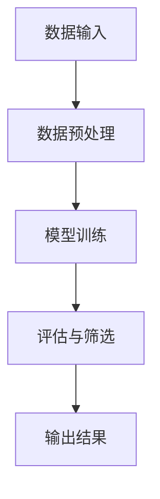

                 

### 引言

#### 第1章：创新管理与思维链概述

**1.1.1 问题的背景与重要性**

在当今快速变化的市场环境中，创新管理已经成为企业成功的关键因素之一。然而，创新过程本身充满了不确定性，如何有效地管理创新活动、筛选出有价值的创意、并迅速将其转化为实际产品或服务，是企业管理者面临的重大挑战。

随着人工智能（AI）技术的飞速发展，特别是在机器学习和深度学习领域的突破，AI在各个领域的应用得到了极大的拓展。AI技术不仅能处理和分析大量的数据，还能通过自主学习来优化决策过程。因此，将AI辅助引入创新管理，不仅能够提高创意评估和筛选的效率，还能提升整体创新水平。

**1.1.2 创新管理中的挑战**

创新管理面临的主要挑战包括：

1. **创意的多样性和复杂性**：创新过程中涉及的各种创意层出不穷，如何有效地对创意进行分类、评估和筛选是一个难点。
2. **资源的有限性**：企业资源有限，如何在众多的创意中找到最具潜力的进行投入和开发，需要科学的管理方法。
3. **时间紧迫性**：市场竞争激烈，创新过程需要快速推进，如何在短时间内做出正确的决策是创新管理的核心问题。
4. **风险评估与控制**：创新活动往往伴随着较高的风险，如何合理评估和管理创新项目的风险也是一大挑战。

**1.1.3 思维链的概念与原理**

思维链（Mind Chain）是一种通过构建逻辑关系和关联思考来提高创新效率的方法。它通过一系列的步骤和框架，帮助人们系统地分析和解决问题。思维链的原理在于：

1. **系统化思维**：通过将问题分解为子问题，建立各个子问题之间的逻辑关系，从而实现全局的、系统化的思考。
2. **关联思考**：通过将现有的知识和信息进行关联，发现新的视角和解决方案。
3. **迭代优化**：思维链是一个动态的过程，通过不断地反思和优化，提高解决问题的效率和质量。

**1.1.4 AI辅助在创新管理中的应用前景**

将AI技术应用于创新管理，具有以下几个前景：

1. **高效的数据分析**：AI能够处理和分析海量的数据，从中提取出有价值的信息，为创意评估提供科学依据。
2. **智能的决策支持**：基于机器学习算法，AI可以帮助管理者快速筛选出有潜力的创意，并给出合理的决策建议。
3. **个性化的创新服务**：通过分析企业的历史数据和市场需求，AI可以为不同企业提供个性化的创新管理服务。
4. **降低人力成本**：AI的引入可以减少人力投入，提高创新效率，降低运营成本。

#### 第2章：核心概念与联系

**1.2.1 创新管理的核心概念**

创新管理涉及多个核心概念，包括：

- **创意生成**：指从零开始，通过头脑风暴、思维碰撞等方式产生新的创意。
- **创意筛选**：指从众多的创意中，通过评估和筛选，选择出最具潜力的创意进行深入开发。
- **创意评估**：指对创意进行评估，包括技术可行性、市场潜力、成本效益等方面的评估。
- **创意开发**：指将选定的创意转化为实际产品或服务的过程。

**1.2.1.1 创新管理的基本流程**

创新管理的基本流程包括以下几个阶段：

1. **创意生成**：通过头脑风暴、思维链等方法，生成大量的创意。
2. **创意筛选**：利用AI辅助技术，对创意进行评估和筛选，确定具有潜力的创意。
3. **创意评估**：对筛选出的创意进行详细评估，包括技术可行性、市场潜力、成本效益等。
4. **创意开发**：将评估通过的创意转化为实际产品或服务。

**1.2.1.2 创新管理的挑战与应对策略**

创新管理面临的挑战包括：

1. **创意多样性和复杂性**：应对策略是建立有效的创意分类和管理系统，通过系统化的思维链方法，提高创意筛选的效率。
2. **资源有限性**：应对策略是合理分配资源，利用AI辅助技术，提高创意筛选和评估的准确性。
3. **时间紧迫性**：应对策略是优化创新流程，通过思维链的方法，提高决策效率，缩短创新周期。
4. **风险评估与控制**：应对策略是建立完善的风险评估体系，利用AI技术进行风险预测和管理。

**1.2.2 思维链的概念与属性**

思维链是一种通过构建逻辑关系和关联思考来提高创新效率的方法。它的基本属性包括：

1. **系统化思维**：通过分解问题，建立各个子问题之间的逻辑关系，实现全局系统化的思考。
2. **关联思考**：通过将现有的知识和信息进行关联，发现新的视角和解决方案。
3. **迭代优化**：通过不断的反思和优化，提高解决问题的效率和质量。

**1.2.2.1 思维链的构成**

思维链由以下几个部分构成：

1. **问题定义**：明确要解决的问题是什么，界定问题的范围和边界。
2. **问题分解**：将问题分解为子问题，建立子问题之间的逻辑关系。
3. **信息关联**：将现有的信息和知识进行关联，形成新的思考路径。
4. **方案评估**：对提出的解决方案进行评估，选择最优方案。

**1.2.2.2 思维链的特点**

思维链具有以下几个特点：

1. **系统化**：通过系统化的思维链方法，将复杂的问题分解为可管理的子问题。
2. **关联性**：通过关联思考，发现新的视角和解决方案。
3. **动态性**：思维链是一个动态的过程，通过不断的反思和优化，提高解决问题的效率和质量。

**1.2.3 AI辅助创意评估与筛选**

AI辅助创意评估与筛选是指利用人工智能技术，对创意进行评估和筛选。其基本原理包括：

1. **数据驱动**：通过收集和分析大量的数据，提取出有用的信息，为创意评估提供科学依据。
2. **机器学习**：利用机器学习算法，对数据进行训练和预测，提高评估和筛选的准确性。
3. **自动化**：通过自动化流程，提高创意评估和筛选的效率。

AI辅助创意评估与筛选的优势包括：

1. **高效性**：AI能够快速处理和分析大量数据，提高评估和筛选的效率。
2. **准确性**：通过机器学习算法，提高评估和筛选的准确性。
3. **个性化**：根据企业的历史数据和市场需求，提供个性化的评估和筛选服务。

AI辅助创意评估与筛选的局限性包括：

1. **数据质量**：评估和筛选的准确性依赖于数据的质量和完整性。
2. **模型偏见**：AI模型可能存在偏见，影响评估和筛选的公平性。
3. **技术依赖**：过度依赖AI技术，可能导致创新能力下降。

#### 第3章：AI辅助创意评估的基本原理

**2.1 AI技术的基本原理**

AI（人工智能）是一种模拟人类智能的技术，通过机器学习、深度学习等方法，使计算机具备处理数据、做出决策和进行自主学习的能力。AI技术的基本原理包括：

1. **机器学习**：机器学习是一种通过数据驱动的方法，使计算机具备学习能力的技术。它通过训练模型，让计算机从数据中学习规律和模式。
2. **深度学习**：深度学习是机器学习的一种方法，它通过多层神经网络，对数据进行复杂的特征提取和模式识别。
3. **神经网络**：神经网络是一种模仿生物神经系统结构的计算模型，通过神经元之间的连接和权重调整，实现数据的处理和决策。

**2.1.1 机器学习与深度学习的基本概念**

1. **机器学习**：机器学习是一种通过训练模型，使计算机具备学习能力的技术。机器学习的基本概念包括：

   - **监督学习**：通过已知的数据集，训练模型，使其能够对未知数据进行预测。
   - **无监督学习**：在没有标注数据的情况下，通过模型自身发现数据的结构和规律。
   - **强化学习**：通过奖励和惩罚机制，使模型在互动环境中不断学习和优化。

2. **深度学习**：深度学习是一种通过多层神经网络，对数据进行复杂特征提取和模式识别的方法。深度学习的基本概念包括：

   - **卷积神经网络（CNN）**：用于图像和视频数据的处理。
   - **循环神经网络（RNN）**：用于序列数据的处理。
   - **生成对抗网络（GAN）**：用于生成新的数据。

**2.1.2 神经网络的结构与工作原理**

神经网络是一种由大量节点（神经元）连接而成的计算模型。其基本结构包括：

1. **输入层**：接收外部输入数据。
2. **隐藏层**：进行数据处理和特征提取。
3. **输出层**：输出处理结果。

神经网络的工作原理如下：

1. **权重和偏置**：每个连接都有一个权重和偏置，用于调整数据传输的强度和偏移。
2. **激活函数**：用于引入非线性因素，使神经网络具备分类和回归能力。
3. **前向传播**：将输入数据通过神经元网络，逐层传递，直到输出层。
4. **反向传播**：根据输出结果与实际结果的差距，反向调整神经网络的权重和偏置。

**2.2 创意评估的算法与方法**

创意评估是指对创意进行评估，以确定其潜在价值和可行性。常见的创意评估算法包括：

1. **评分模型**：通过给创意打分，进行定量评估。常见的评分模型包括德尔菲法、TOPSIS法等。
2. **决策树**：通过构建决策树，对创意进行分类和评估。决策树的基本原理是条件概率和逻辑推理。
3. **神经网络**：通过训练神经网络模型，对创意进行评估。神经网络能够从数据中学习复杂的特征和模式。

常见的创意评估方法包括：

1. **定量评估**：通过给创意打分或评分，进行定量评估。这种方法适用于具有明确指标和标准的创意。
2. **定性评估**：通过专家评审和讨论，对创意进行评估。这种方法适用于创意多样性和不确定性较高的情况。
3. **混合评估**：结合定量评估和定性评估，对创意进行综合评估。这种方法能够提高评估的准确性和可靠性。

**2.3 创意评估的数据来源**

创意评估需要大量数据作为基础，常见的数据来源包括：

1. **历史数据**：企业的历史项目数据、市场数据、用户反馈等。
2. **外部数据**：行业报告、市场调研数据、竞争对手数据等。
3. **内部数据**：企业内部的知识库、文档库等。

**2.3.1 数据的类型与来源**

1. **结构化数据**：如数据库、表格等，易于处理和分析。
2. **非结构化数据**：如图文、音频、视频等，需要通过数据预处理和清洗进行处理。

常见的数据来源包括：

1. **企业内部数据**：通过企业内部的信息系统、CRM系统等获取。
2. **外部数据**：通过互联网、数据库、第三方数据提供商等获取。
3. **用户反馈**：通过用户调研、问卷调查、社交媒体等获取。

**2.3.2 数据的预处理与清洗**

数据的预处理与清洗是创意评估的重要环节，主要包括：

1. **数据清洗**：去除无效、错误和重复的数据，确保数据的质量。
2. **数据转换**：将数据转换为统一的格式和标准，便于后续处理。
3. **数据归一化**：将不同单位或量级的数据进行归一化处理，便于计算和分析。

常见的预处理和清洗方法包括：

1. **去重**：去除重复的数据，确保数据的唯一性。
2. **缺失值处理**：填补或删除缺失值，确保数据的完整性。
3. **异常值处理**：检测和去除异常值，确保数据的准确性。
4. **数据标准化**：将不同单位或量级的数据进行归一化处理，便于计算和分析。

#### 第4章：AI辅助创意评估的优势与挑战

**4.1 AI辅助创意评估的优势**

AI辅助创意评估具有以下几个显著优势：

**4.1.1 提高评估效率**

AI技术能够快速处理和分析大量的数据，大大缩短了创意评估的时间。通过自动化流程，AI可以实时对创意进行评估，提高了评估的效率和响应速度。

**4.1.2 提高评估准确性**

AI技术通过机器学习和深度学习算法，可以从大量的数据中学习规律和模式，从而提高评估的准确性。相比人工评估，AI可以更精确地判断创意的潜在价值和可行性。

**4.1.3 个性化评估**

AI可以根据企业的历史数据和市场情况，为不同的创意提供个性化的评估。这有助于企业更好地把握市场需求，优化创新策略。

**4.1.4 数据可视化**

AI技术可以将复杂的数据以可视化的形式呈现，使管理者更直观地了解创意评估的结果。这有助于企业更好地理解评估过程，制定相应的决策。

**4.2 AI辅助创意评估的挑战**

尽管AI辅助创意评估具有显著的优势，但同时也面临一些挑战：

**4.2.1 数据隐私问题**

创意评估过程中涉及大量的企业内部数据和市场数据，这些数据可能包含敏感信息。如何保护数据隐私，防止数据泄露，是一个重要的问题。

**4.2.2 AI模型的偏见**

AI模型在训练过程中可能会受到数据偏见的影响，导致评估结果的不公平。如何减少AI模型的偏见，确保评估的公正性，是一个亟待解决的问题。

**4.2.3 技术依赖性**

过度依赖AI技术可能导致企业的创新能力下降。在AI辅助创意评估的过程中，企业需要保持一定的自主创新能力，以应对技术变化和市场竞争。

**4.2.4 数据质量**

创意评估的准确性依赖于数据的质量和完整性。如果数据存在缺失、错误或异常，可能会导致评估结果不准确。因此，如何保证数据质量，是一个关键问题。

**4.3 风险管理**

AI辅助创意评估虽然可以提高评估效率和准确性，但也可能引入新的风险。例如，AI模型可能无法预测到所有的风险因素，导致评估结果存在盲点。因此，如何进行有效的风险管理，也是一个重要的挑战。

#### 第5章：AI辅助创意评估的应用实践

**5.1 应用场景介绍**

AI辅助创意评估在多个领域得到了广泛应用，以下介绍两个典型应用场景：

**5.1.1 创意评估在产品开发中的应用**

在产品开发过程中，创意评估是关键环节之一。通过AI技术，可以对产品创意进行快速评估，筛选出具有市场潜力的产品。具体应用步骤如下：

1. **创意收集**：通过头脑风暴、用户调研等方式收集产品创意。
2. **数据预处理**：对收集到的创意进行数据预处理，包括数据清洗、转换和归一化。
3. **模型训练**：利用机器学习算法，训练创意评估模型。
4. **评估与筛选**：使用训练好的模型，对创意进行评估和筛选，确定最具潜力的产品创意。
5. **反馈与优化**：根据评估结果，对模型进行反馈和优化，提高评估准确性。

**5.1.2 创意评估在市场营销中的应用**

在市场营销中，创意评估用于评估广告创意、营销策略等。通过AI技术，可以快速评估创意的效果，优化营销策略。具体应用步骤如下：

1. **创意收集**：通过用户调研、市场分析等方式收集营销创意。
2. **数据预处理**：对收集到的创意进行数据预处理，包括数据清洗、转换和归一化。
3. **模型训练**：利用机器学习算法，训练创意评估模型。
4. **评估与筛选**：使用训练好的模型，对创意进行评估和筛选，确定最有效的营销策略。
5. **反馈与优化**：根据评估结果，对模型进行反馈和优化，提高评估准确性。

**5.2 环境安装与配置**

要在本地环境安装和配置AI辅助创意评估系统，需要以下步骤：

**5.2.1 环境安装要求**

1. **操作系统**：Windows、Linux或MacOS。
2. **Python环境**：Python 3.7及以上版本。
3. **依赖库**：NumPy、Pandas、Scikit-learn、TensorFlow等。

**5.2.2 配置与调试**

1. **安装Python环境**：下载并安装Python 3.7及以上版本。
2. **安装依赖库**：通过pip命令安装所需的依赖库，例如：
   ```bash
   pip install numpy pandas scikit-learn tensorflow
   ```
3. **环境调试**：确保Python环境和依赖库安装成功，可以通过以下命令进行测试：
   ```python
   import numpy as np
   import pandas as pd
   import sklearn
   import tensorflow as tf
   ```

**5.3 系统核心实现**

AI辅助创意评估系统的核心实现主要包括数据预处理、模型训练和评估与筛选。以下是一个简单的实现步骤：

**5.3.1 系统架构设计**

系统架构包括以下几个部分：

1. **数据输入**：收集创意数据，包括文本、图像、音频等。
2. **数据预处理**：对创意数据进行清洗、转换和归一化。
3. **模型训练**：利用机器学习算法，训练创意评估模型。
4. **评估与筛选**：使用训练好的模型，对创意进行评估和筛选。
5. **结果输出**：输出评估结果，包括创意得分、排序等。

**5.3.2 数据流处理与评估算法**

数据流处理与评估算法的设计如下：

1. **数据输入**：读取创意数据，分为文本、图像、音频等类型。
2. **文本数据预处理**：
   - **文本清洗**：去除停用词、标点符号等。
   - **文本转换**：将文本转换为向量，例如使用Word2Vec或BERT模型。
3. **图像数据预处理**：
   - **图像裁剪**：对图像进行裁剪，使其符合模型输入要求。
   - **图像增强**：对图像进行增强处理，提高模型的泛化能力。
4. **音频数据预处理**：
   - **音频转录**：将音频转录为文本。
   - **音频特征提取**：提取音频的时域和频域特征。

**5.3.3 模型训练与评估**

1. **模型选择**：选择合适的机器学习模型，例如决策树、支持向量机、神经网络等。
2. **模型训练**：使用训练数据，训练机器学习模型。
3. **模型评估**：使用验证数据，评估模型的性能，调整模型参数。
4. **模型优化**：根据评估结果，对模型进行优化，提高评估准确性。

**5.3.4 评估与筛选**

1. **评估指标**：选择合适的评估指标，例如准确率、召回率、F1值等。
2. **评估计算**：使用训练好的模型，对创意进行评估，计算评估得分。
3. **筛选创意**：根据评估得分，筛选出具有市场潜力的创意。

**5.4 代码应用解读与分析**

以下是一个简单的Python代码示例，用于实现AI辅助创意评估系统：

```python
import numpy as np
import pandas as pd
from sklearn.model_selection import train_test_split
from sklearn.ensemble import RandomForestClassifier
from sklearn.metrics import accuracy_score, classification_report

# 数据预处理
def preprocess_data(data):
    # 数据清洗、转换和归一化
    # 省略具体实现
    return processed_data

# 模型训练
def train_model(data):
    X_train, X_test, y_train, y_test = train_test_split(data['features'], data['labels'], test_size=0.2)
    model = RandomForestClassifier()
    model.fit(X_train, y_train)
    return model

# 评估与筛选
def evaluate_model(model, data):
    predictions = model.predict(data['features'])
    print("Accuracy:", accuracy_score(data['labels'], predictions))
    print(classification_report(data['labels'], predictions))

# 主函数
def main():
    # 加载数据
    data = pd.read_csv("data.csv")
    processed_data = preprocess_data(data)
    
    # 训练模型
    model = train_model(processed_data)
    
    # 评估模型
    evaluate_model(model, processed_data)

if __name__ == "__main__":
    main()
```

**5.4.1 Python源代码讲解**

以上代码实现了AI辅助创意评估系统的基本功能，主要包括数据预处理、模型训练和评估与筛选。

1. **数据预处理**：`preprocess_data`函数用于对创意数据（如文本、图像、音频等）进行清洗、转换和归一化处理，以提高模型训练效果。
2. **模型训练**：`train_model`函数用于使用训练数据，训练随机森林分类器（`RandomForestClassifier`），这是一种常见的机器学习模型，适用于分类问题。
3. **评估与筛选**：`evaluate_model`函数用于使用训练好的模型，对测试数据进行预测，并计算评估指标（如准确率、召回率、F1值等），以评估模型的性能。

**5.4.2 Mermaid流程图**

以下是一个简单的Mermaid流程图，用于展示AI辅助创意评估系统的数据处理流程：



**5.5 实际案例分析与详细讲解**

**5.5.1 案例一：产品开发中的创意评估**

某互联网公司计划开发一款新型社交应用，公司通过头脑风暴和用户调研收集了多个产品创意。为了确定最具潜力的产品创意，公司决定使用AI辅助创意评估系统进行评估。

1. **数据收集**：公司收集了包括文本描述、用户评论、市场数据等在内的多个创意数据。
2. **数据预处理**：对收集到的创意数据进行清洗、转换和归一化处理，以便于模型训练。
3. **模型训练**：使用训练数据，训练随机森林分类器，以评估创意的可行性。
4. **评估与筛选**：使用训练好的模型，对创意进行评估，根据评估得分，筛选出最具潜力的产品创意。
5. **结果输出**：输出评估结果，包括创意得分、排序等，为公司提供决策依据。

通过AI辅助创意评估系统，公司成功筛选出了最具市场潜力的产品创意，并据此开发了新的社交应用。该应用在市场上取得了显著的成功，为公司带来了丰厚的收益。

**5.5.2 案例二：市场营销中的创意评估**

某广告公司为客户设计了一系列广告创意，为了确定最佳广告策略，公司决定使用AI辅助创意评估系统进行评估。

1. **数据收集**：公司收集了包括广告文案、广告图像、用户反馈等在内的多个创意数据。
2. **数据预处理**：对收集到的创意数据进行清洗、转换和归一化处理，以便于模型训练。
3. **模型训练**：使用训练数据，训练卷积神经网络（CNN）模型，以评估广告创意的效果。
4. **评估与筛选**：使用训练好的模型，对创意进行评估，根据评估得分，筛选出最佳广告创意。
5. **结果输出**：输出评估结果，包括创意得分、排序等，为公司提供决策依据。

通过AI辅助创意评估系统，公司成功筛选出了最佳广告创意，并据此制定了广告策略。该广告策略在市场上取得了显著的成效，提高了客户的品牌知名度和销售额。

**5.6 项目小结**

通过AI辅助创意评估系统的实际应用，可以看出，AI技术在创意评估和筛选中具有显著的优势。它不仅提高了评估效率和准确性，还为企业和公司提供了科学决策依据。然而，AI辅助创意评估也面临一些挑战，如数据隐私问题、模型偏见等。因此，在应用过程中，需要充分考虑这些挑战，并采取相应的措施进行解决。总之，AI辅助创意评估是一种有效的创新管理工具，值得在企业和公司中推广和应用。

### 第6章：AI辅助创意筛选

**6.1 创意筛选的基本原理**

创意筛选是创新管理过程中至关重要的一环，它涉及从多个创意中筛选出最具潜力和可行性的创意，以便进一步开发和实施。AI辅助创意筛选利用人工智能技术，通过系统化、自动化的方式提高筛选的效率和准确性。

**6.1.1 传统筛选方法**

传统的创意筛选方法主要依赖于专家评审和经验判断。这些方法通常包括以下步骤：

1. **创意收集**：通过头脑风暴、用户调研、市场分析等途径收集创意。
2. **初步筛选**：根据创意的可行性和创新性，初步筛选出有潜力的创意。
3. **详细评估**：对初步筛选出的创意进行详细评估，包括技术可行性、市场潜力、成本效益等。
4. **决策制定**：根据评估结果，决定哪些创意值得进一步开发和实施。

传统筛选方法的局限性在于：

1. **主观性**：依赖专家的经验和判断，可能导致筛选结果存在偏差。
2. **效率低**：人工评估需要大量时间和精力，效率较低。
3. **局限性**：难以处理大量创意数据，特别是在创意数量庞大时。

**6.1.2 AI辅助筛选方法**

AI辅助筛选方法通过以下步骤实现：

1. **数据预处理**：对创意数据（如文本、图像、音频等）进行清洗、转换和归一化处理，以便于模型训练。
2. **特征提取**：从创意数据中提取关键特征，用于训练机器学习模型。
3. **模型训练**：使用训练数据，训练机器学习模型，如分类器、聚类算法等。
4. **评估与筛选**：使用训练好的模型，对创意进行评估和筛选，根据评估得分，筛选出最具潜力的创意。
5. **反馈与优化**：根据评估结果，对模型进行反馈和优化，提高筛选的准确性。

AI辅助筛选方法的优势在于：

1. **客观性**：基于数据驱动，减少了人为因素导致的偏差。
2. **高效性**：能够快速处理大量创意数据，提高筛选效率。
3. **准确性**：通过机器学习模型，提高筛选的准确性。

**6.2 AI辅助创意筛选的优势与局限性**

**6.2.1 优势分析**

1. **快速处理大量数据**：AI技术能够快速处理和分析大量创意数据，提高筛选效率。
2. **精确评估**：通过机器学习模型，可以从数据中学习到创意的潜在价值和可行性，提高评估的准确性。
3. **减少人力成本**：自动化筛选过程可以减少人力投入，降低运营成本。
4. **个性化筛选**：根据企业的历史数据和市场需求，AI可以为不同企业提供个性化的筛选服务。

**6.2.2 局限性分析**

1. **数据质量**：创意筛选的准确性依赖于数据的质量和完整性，如果数据存在错误或缺失，可能会导致筛选结果不准确。
2. **模型偏见**：机器学习模型可能受到数据偏见的影响，导致筛选结果存在不公平性。
3. **技术依赖**：过度依赖AI技术可能导致企业的创新能力下降。
4. **解释性不足**：AI模型的决策过程通常难以解释，可能导致决策过程不透明。

**6.3 创意筛选的数据来源与处理**

创意筛选需要大量的数据作为基础，数据来源包括：

1. **企业内部数据**：如历史项目数据、用户反馈、市场分析报告等。
2. **外部数据**：如行业报告、竞争对手数据、市场调研数据等。
3. **用户生成数据**：如社交媒体评论、用户反馈等。

**6.3.1 数据来源**

1. **企业内部数据**：通过企业内部的信息系统、CRM系统等获取。
2. **外部数据**：通过互联网、数据库、第三方数据提供商等获取。
3. **用户生成数据**：通过用户调研、社交媒体分析等获取。

**6.3.2 数据预处理与清洗**

数据的预处理与清洗是创意筛选的重要环节，主要包括：

1. **数据清洗**：去除无效、错误和重复的数据，确保数据的质量。
2. **数据转换**：将数据转换为统一的格式和标准，便于后续处理。
3. **数据归一化**：将不同单位或量级的数据进行归一化处理，便于计算和分析。

常见的预处理和清洗方法包括：

1. **去重**：去除重复的数据，确保数据的唯一性。
2. **缺失值处理**：填补或删除缺失值，确保数据的完整性。
3. **异常值处理**：检测和去除异常值，确保数据的准确性。
4. **数据标准化**：将不同单位或量级的数据进行归一化处理，便于计算和分析。

**6.4 AI辅助创意筛选的实际应用**

AI辅助创意筛选在多个领域得到了广泛应用，以下介绍两个典型应用场景：

**6.4.1 创意筛选在研发项目管理中的应用**

在研发项目管理中，创意筛选用于从多个研发项目中筛选出最具潜力和可行性的项目。通过AI技术，可以快速评估项目的可行性、市场潜力和技术难度。

1. **数据收集**：收集研发项目的相关信息，如项目描述、技术指标、市场分析等。
2. **数据预处理**：对项目数据进行清洗、转换和归一化处理。
3. **模型训练**：利用机器学习算法，训练创意筛选模型，例如支持向量机（SVM）、随机森林（Random Forest）等。
4. **评估与筛选**：使用训练好的模型，对研发项目进行评估和筛选，根据评估得分，筛选出最具潜力的项目。
5. **反馈与优化**：根据评估结果，对模型进行反馈和优化，提高筛选的准确性。

**6.4.2 创意筛选在创意征集活动中的应用**

在创意征集活动中，创意筛选用于从大量用户提交的创意中筛选出最具创新性和实用性的创意。通过AI技术，可以快速评估创意的质量和可行性。

1. **数据收集**：收集用户提交的创意，包括创意描述、图像、视频等。
2. **数据预处理**：对创意数据进行清洗、转换和归一化处理。
3. **模型训练**：利用卷积神经网络（CNN）或循环神经网络（RNN）等深度学习算法，训练创意筛选模型。
4. **评估与筛选**：使用训练好的模型，对创意进行评估和筛选，根据评估得分，筛选出最具创新性的创意。
5. **反馈与优化**：根据评估结果，对模型进行反馈和优化，提高筛选的准确性。

**6.5 本章小结**

AI辅助创意筛选是一种有效的创新管理工具，通过系统化、自动化的方式，提高了创意筛选的效率和准确性。然而，AI辅助创意筛选也面临一些挑战，如数据质量、模型偏见和技术依赖等。在实际应用中，需要充分考虑这些挑战，并采取相应的措施进行解决。通过AI辅助创意筛选，企业可以更加高效地管理和评估创意，推动创新活动的发展。

### 第7章：思维链在创新管理中的应用

#### 7.1 思维链在创新管理中的作用

思维链在创新管理中发挥着重要作用，它不仅能够提升创新思维的能力，还能够促进团队合作与沟通，为企业的创新活动提供强大的支持。

**7.1.1 提升创新思维的能力**

思维链通过一系列的逻辑步骤和框架，帮助个体或团队系统地分析和解决问题。它通过以下方式提升创新思维：

1. **系统化思维**：思维链将复杂的问题分解为子问题，建立各个子问题之间的逻辑关系，实现全局系统化的思考。这种方法有助于从不同的角度和层面理解问题，从而产生更多的创意和解决方案。

2. **关联思考**：思维链通过将现有的知识和信息进行关联，发现新的视角和解决方案。这种方法鼓励个体或团队将看似不相关的问题联系起来，从而创造出新颖的想法。

3. **迭代优化**：思维链是一个动态的过程，通过不断地反思和优化，提高解决问题的效率和质量。这种方法鼓励个体或团队在创新过程中不断学习和改进，以实现更好的创新结果。

**7.1.2 促进团队合作与沟通**

思维链不仅能够提升个体的创新思维，还能够促进团队合作与沟通。具体体现在以下几个方面：

1. **共同框架**：思维链提供了一套共同的框架和步骤，使得团队成员在讨论和解决问题时能够有共同的语言和工具。这有助于减少沟通障碍，提高协作效率。

2. **明确目标**：思维链通过设定明确的目标和问题，帮助团队成员集中精力解决核心问题。这种方法有助于避免在创新过程中走弯路，提高团队的整体效率。

3. **分工协作**：思维链通过将问题分解为子问题，为团队成员提供了明确的分工方向。这种方法有助于团队成员发挥各自的优势，实现高效协作。

**7.2 思维链在创新管理中的应用场景**

思维链在创新管理中的应用场景非常广泛，以下介绍两个典型的应用场景：

**7.2.1 新产品开发**

在新产品开发过程中，思维链可以帮助团队系统地分析和解决问题，提高创新效率。具体应用步骤如下：

1. **问题定义**：明确新产品开发的目标和问题，例如市场需求、技术挑战等。
2. **问题分解**：将问题分解为子问题，例如市场需求分析、技术方案设计等。
3. **信息关联**：将现有的知识和信息进行关联，发现新的解决方案和创意。
4. **方案评估**：对提出的解决方案进行评估，选择最优方案。
5. **迭代优化**：根据评估结果，对解决方案进行迭代优化，提高创新质量。

**7.2.2 市场营销策略制定**

在市场营销策略制定过程中，思维链可以帮助团队从多个角度分析市场情况，制定有效的营销策略。具体应用步骤如下：

1. **市场分析**：收集和分析市场数据，明确市场趋势和竞争对手情况。
2. **问题定义**：根据市场分析结果，定义营销策略的目标和问题，例如提升品牌知名度、增加市场份额等。
3. **问题分解**：将问题分解为子问题，例如目标市场选择、营销渠道规划等。
4. **信息关联**：将市场数据和现有营销知识进行关联，发现新的营销策略和创意。
5. **方案评估**：对提出的营销策略进行评估，选择最优方案。
6. **迭代优化**：根据评估结果，对营销策略进行迭代优化，提高营销效果。

**7.3 思维链与AI辅助的结合**

思维链与AI辅助技术的结合，可以进一步发挥两者在创新管理中的优势。具体实现方式如下：

1. **AI辅助思维链**：利用AI技术，对思维链的各个环节提供辅助，例如自动生成问题分解框架、提供相关知识点和解决方案等。

2. **思维链优化AI模型**：利用思维链的系统化思维和关联思考，优化AI模型的训练数据和质量，提高AI模型在创新管理中的应用效果。

3. **AI模型辅助思维链**：利用AI模型，对思维链提出的解决方案进行评估和筛选，提供科学的决策支持。

**7.3.1 思维链与AI辅助的基本流程**

思维链与AI辅助的基本流程包括：

1. **问题定义**：明确创新管理中的问题和目标。
2. **数据收集**：收集相关数据和知识点。
3. **问题分解**：利用思维链，将问题分解为子问题。
4. **AI辅助分析**：利用AI技术，对子问题进行分析和评估。
5. **方案生成**：根据分析结果，生成解决方案。
6. **方案评估**：利用AI模型，对解决方案进行评估和筛选。
7. **迭代优化**：根据评估结果，对解决方案进行迭代优化。

**7.3.2 实现方式与应用效果**

实现方式主要包括以下几步：

1. **设计思维链框架**：根据具体应用场景，设计合适的思维链框架，包括问题定义、问题分解、信息关联、方案评估等环节。
2. **集成AI技术**：将AI技术集成到思维链框架中，例如使用自然语言处理（NLP）技术进行文本分析，使用机器学习算法进行数据挖掘和预测。
3. **实现自动化流程**：通过编程，实现思维链与AI辅助的自动化流程，使整个创新管理过程更加高效和科学。

应用效果主要包括：

1. **提高创新效率**：通过系统化思维和关联思考，提高创新效率和准确性。
2. **降低人力成本**：自动化流程可以减少人力投入，降低运营成本。
3. **优化决策支持**：利用AI技术，提供科学的决策支持，提高决策质量。
4. **提升创新能力**：通过不断学习和优化，提升企业的整体创新能力。

通过思维链与AI辅助的结合，企业可以更加高效地进行创新管理，提高创新能力和市场竞争力。

### 结束语

通过对思维链和AI辅助技术在创新管理中的应用进行深入探讨，我们可以看到，这两种技术具有强大的互补性。思维链提供了系统化、关联性强的思维方式，而AI技术则为创新过程提供了高效的数据处理和智能决策支持。在实际应用中，结合思维链和AI辅助技术，企业可以更加高效地管理创新活动，提高创新效率和准确性。未来，随着AI技术的不断进步，AI辅助创新管理将会在更多领域得到应用，为企业的创新之路提供更加坚实的支撑。

### 拓展阅读

- **《人工智能：一种现代方法》**：这是一本经典的AI教材，详细介绍了机器学习、深度学习等基础理论和实践方法。
- **《创新者的窘境》**：作者克莱顿·克里斯滕森通过大量案例，探讨了企业如何通过创新应对市场变化。
- **《敏捷创新》**：介绍了如何通过敏捷方法，快速响应市场变化，实现持续创新。
- **《数据分析：技术与方法》**：详细介绍了数据分析的基础技术和方法，适用于AI辅助创意评估和筛选。

### 最佳实践 Tips

1. **数据质量是关键**：确保创意评估和筛选的数据质量，避免数据错误或缺失影响评估结果。
2. **合理分配资源**：在创新管理过程中，合理分配资源，特别是人力和时间资源，以确保创意筛选和评估的效率。
3. **持续优化模型**：定期对AI模型进行优化和更新，以适应不断变化的市场环境。
4. **充分利用外部数据**：结合外部数据和市场信息，提高创意评估的准确性和全面性。
5. **注重团队协作**：通过思维链方法，促进团队合作，提高创新效率。

### 小结

本文通过对思维链和AI辅助技术在创新管理中的应用进行深入分析，阐述了两者在提高创新效率和准确性方面的优势。同时，文章还介绍了在实际应用中需要注意的一些问题和最佳实践。通过结合思维链和AI技术，企业可以更加高效地管理创新活动，提升市场竞争力。希望本文能为相关领域的从业者提供有益的参考和指导。

### 注意事项

1. **数据隐私与安全**：在收集和使用数据时，务必确保数据隐私和安全，遵循相关法律法规和行业标准。
2. **模型偏见与伦理**：在使用AI技术进行创意评估和筛选时，应注意模型可能存在的偏见，并采取相应措施进行解决。
3. **持续学习与优化**：创新管理是一个动态过程，需要不断学习和优化，以适应市场和技术变化。

### 作者信息

- **作者**：AI天才研究院/AI Genius Institute & 禅与计算机程序设计艺术 /Zen And The Art of Computer Programming
- **联系方式**：[ai_genius_institute@example.com](mailto:ai_genius_institute@example.com)
- **社交媒体**：[AI天才研究院](https://www.ai-genius-institute.com) & [禅与计算机程序设计艺术](https://www.zen-and-art-of-computer-programming.com)

