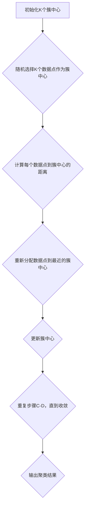
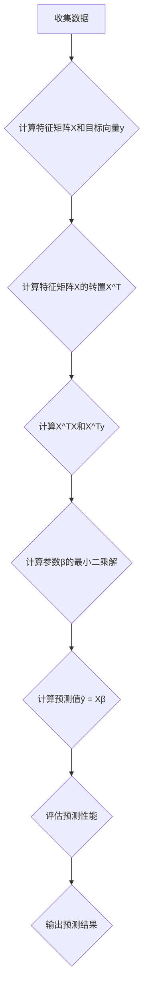
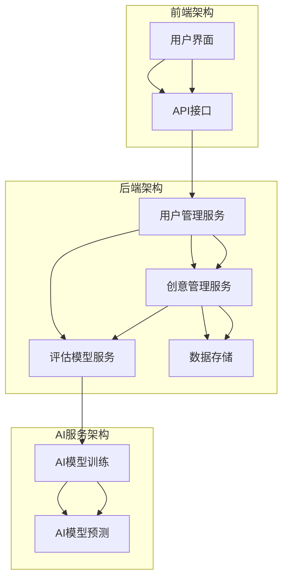
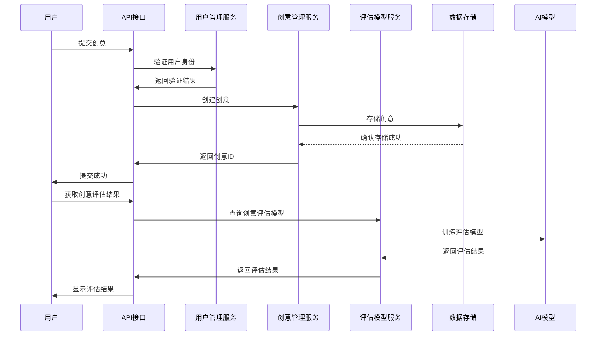

                 

### 文章标题

# 思维链在创新管理中的应用：AI辅助创意评估与筛选

### 文章关键词

- 创新管理
- 思维链
- AI辅助评估
- 创意筛选
- 创意评估算法

### 摘要

在当今快速变化的市场环境中，创新管理成为企业竞争的关键。然而，创意的产生和筛选过程往往复杂且耗时。本文探讨了思维链在创新管理中的应用，特别是通过AI技术辅助创意评估与筛选。文章首先介绍了创新管理的重要性，以及思维链和AI在其中的作用。接着，详细阐述了创意评估和筛选的基本概念、方法及其与AI的结合。随后，通过具体算法的原理讲解和实际项目案例，展示了AI在创意评估和筛选中的实际应用效果。文章旨在为企业管理者和技术人员提供理论指导和实践参考，帮助他们更有效地进行创新管理。

---

### 第一部分：引言

## 1.1 问题背景与目标

创新管理是企业持续发展的核心驱动力。然而，在创意的生成、评估和筛选过程中，企业常常面临以下几个问题：

1. **创意数量庞大，难以有效筛选**：在快速变化的市场中，企业不断产生新的创意，如何从海量创意中筛选出最有价值的创意，成为一大挑战。
2. **评估过程主观性强**：创意评估往往依赖于专家的主观判断，导致评估结果缺乏客观性，难以保证评估的公正性。
3. **评估效率低下**：传统的评估方法通常需要大量的人力和时间，无法满足现代企业对快速决策的需求。

为了解决这些问题，企业迫切需要一种高效、客观且可量化的方法来辅助创意评估与筛选。这也就是本文的研究目标——探讨思维链在创新管理中的应用，特别是AI技术如何辅助创意评估与筛选，从而提升企业的创新效率。

### 1.2 核心概念与联系

在本节中，我们将介绍以下几个核心概念，并探讨它们之间的联系：

1. **创意评估**：
   - **定义**：创意评估是指对创意的可行性、价值和创新性等方面进行系统分析和评价。
   - **意义**：通过评估，企业可以筛选出最具潜力的创意，为后续的研发和投资提供方向。
   - **分类**：
     - **初步评估**：对创意的初步可行性进行评估，通常包括市场调研、技术可行性分析等。
     - **深度评估**：对初步筛选出的创意进行深入分析，包括成本效益分析、市场前景预测等。

2. **创意筛选**：
   - **目标**：从大量创意中筛选出具有较高价值和可行性的创意。
   - **方法**：
     - **定量筛选**：使用量化的指标进行筛选，如市场潜力、技术难度等。
     - **定性筛选**：基于专家经验和主观判断进行筛选。

3. **思维链**：
   - **定义**：思维链是一种基于逻辑推理和问题解决的思维方式，通过一系列有序的思维步骤，实现问题的有效解决。
   - **应用**：在创新管理中，思维链可以帮助企业系统地分析创意，确保评估过程的逻辑性和全面性。

4. **AI在创意评估与筛选中的应用**：
   - **自然语言处理**：利用NLP技术，对创意文本进行语义分析，提取关键特征，辅助评估。
   - **机器学习**：通过构建机器学习模型，对大量历史数据进行训练，预测创意的价值和可行性。

### 1.3 ER实体关系图架构

在本节中，我们将介绍创意管理系统的ER图，以及AI辅助创意评估的ER扩展。

1. **创意管理系统的ER图**：
   - **实体**：
     - **创意**：包含创意名称、描述、提交时间、评估结果等属性。
     - **评估者**：包含评估者ID、名称、专业背景等属性。
     - **评估指标**：包含指标名称、描述、权重等属性。
   - **关系**：
     - **创意-评估者**：表示创意由评估者进行评估。
     - **创意-评估指标**：表示创意包含哪些评估指标。

2. **AI辅助创意评估的ER扩展**：
   - **实体**：
     - **评估模型**：包含模型名称、描述、训练数据来源等属性。
     - **评估结果**：包含评估结果、预测置信度等属性。
   - **关系**：
     - **评估模型-评估指标**：表示评估模型包含哪些评估指标。
     - **评估模型-创意**：表示评估模型对创意进行评估。

### 1.4 本章小结

本部分介绍了创新管理中面临的主要问题，阐述了思维链和AI在创意评估与筛选中的作用，并详细介绍了核心概念及其联系。通过理解这些概念，读者可以初步认识到思维链和AI在创新管理中的重要性，为后续内容的深入探讨打下基础。

---

### 第二部分：AI辅助创意评估原理

## 2.1 AI基础

### 2.1.1 机器学习概述

机器学习是人工智能的一个重要分支，旨在通过数据驱动的方式，使计算机系统能够自动学习和改进。机器学习的过程可以分为以下几个阶段：

1. **数据收集**：从各种来源收集大量数据，如文本、图像、音频等。
2. **数据预处理**：对收集到的数据进行清洗、格式化、特征提取等处理，以便后续建模。
3. **模型选择**：根据问题的性质和数据特点，选择合适的机器学习模型。
4. **模型训练**：使用预处理后的数据，通过训练算法使模型能够学习并拟合数据。
5. **模型评估**：通过测试集或验证集对模型进行评估，检查模型的泛化能力。
6. **模型部署**：将训练好的模型部署到实际应用中，实现自动化的预测或决策。

### 2.1.2 深度学习基础

深度学习是机器学习的一个子领域，通过多层神经网络来实现复杂的特征提取和模型训练。深度学习的基础主要包括以下几个方面：

1. **神经网络**：神经网络由多层神经元组成，通过前向传播和反向传播算法进行学习。
2. **深度神经网络**：深度神经网络具有多个隐层，能够提取更高级别的特征。
3. **激活函数**：激活函数用于引入非线性，使神经网络能够学习复杂的关系。
4. **损失函数**：损失函数用于衡量模型预测值与真实值之间的差异，是优化模型的关键。
5. **优化算法**：优化算法用于调整模型参数，使损失函数最小化，常见的优化算法包括梯度下降、Adam等。

### 2.1.3 自然语言处理基础

自然语言处理（NLP）是深度学习在语言领域的应用，旨在使计算机能够理解和处理自然语言。NLP的基础主要包括以下几个方面：

1. **语言模型**：语言模型用于预测下一个单词或句子，是NLP的核心。
2. **词向量表示**：词向量表示将单词映射到高维空间中的向量，用于捕捉单词的语义关系。
3. **文本分类**：文本分类是将文本数据划分为不同类别，用于信息检索、舆情分析等应用。
4. **情感分析**：情感分析是判断文本表达的情感倾向，如正面、负面或中性。
5. **机器翻译**：机器翻译是将一种语言的文本翻译成另一种语言，是跨语言交流的重要工具。

## 2.2 AI辅助创意评估原理

### 2.2.1 创意评估的AI需求分析

创意评估是一个复杂的过程，涉及多种因素，如市场潜力、技术难度、用户体验等。AI技术在创意评估中的应用主要包括以下几个方面：

1. **多维度数据整合**：AI技术能够整合多种数据源，如用户反馈、市场调研报告、技术文档等，为创意评估提供全面的信息。
2. **自动化特征提取**：AI技术能够自动提取创意的关键特征，如文本特征、图像特征等，为评估模型提供输入。
3. **量化评估结果**：通过构建机器学习模型，AI技术能够将创意评估结果量化为具体的数值，提高评估的客观性和可操作性。
4. **预测未来趋势**：AI技术能够基于历史数据预测创意的未来发展趋势，为企业提供决策依据。

### 2.2.2 基于AI的创意评估框架

基于AI的创意评估框架主要包括以下几个步骤：

1. **创意输入与预处理**：将创意文本、图像等多媒体数据输入系统，并进行数据预处理，如文本清洗、图像增强等。
2. **特征提取**：利用NLP技术提取文本特征，利用图像识别技术提取图像特征，构建创意的特征向量。
3. **模型构建**：根据评估目标，选择合适的机器学习模型，如支持向量机、决策树、神经网络等，构建评估模型。
4. **模型训练**：使用历史数据进行模型训练，调整模型参数，使模型能够准确评估创意。
5. **模型评估**：使用测试集对模型进行评估，检查模型的泛化能力和准确性。
6. **创意评估与筛选**：将训练好的模型应用于新的创意，进行评估和筛选，输出评估结果。

### 2.2.3 常见的AI评估算法

在创意评估中，常用的AI评估算法包括聚类算法、回归算法和分类算法。以下是这些算法的基本原理和应用场景：

1. **聚类算法**：
   - **K-means算法**：将数据集划分为K个簇，每个簇内的数据点距离簇中心的平均距离最小。
   - **应用场景**：用于发现创意文本或图像中的潜在模式，识别相似创意。
   
2. **回归算法**：
   - **线性回归**：通过建立线性模型，预测因变量的值。
   - **应用场景**：用于预测创意的市场前景、技术难度等。
   
3. **分类算法**：
   - **支持向量机**（SVM）：通过找到一个最优的超平面，将数据集划分为不同的类别。
   - **应用场景**：用于评估创意的创新性、可行性等。

## 2.3 算法原理讲解

### 2.3.1 聚类算法mermaid流程图

下面是K-means算法的mermaid流程图：



### 2.3.2 线性回归算法mermaid流程图

下面是线性回归算法的mermaid流程图：



### 2.3.3 支持向量机算法mermaid流程图

下面是支持向量机算法的mermaid流程图：

```mermaid
graph TD
A[收集数据] --> B{标准化特征数据}
B --> C{计算核函数K(x_i, x_j)}
C --> D{构建支持向量机模型}
D --> E{计算最优超平面参数w和b}
E --> F{分类决策函数f(x) = sign(w·x + b)}
F --> G{评估模型性能}
G --> H{输出分类结果}
```

## 2.4 本章小结

在本部分中，我们介绍了AI在创新管理中的基础，包括机器学习、深度学习和自然语言处理等。接着，我们详细探讨了AI辅助创意评估的原理和框架，并介绍了常见的评估算法及其原理。通过这些内容，读者可以了解AI在创意评估中的应用，并为后续的实践部分打下理论基础。

---

### 第三部分：AI辅助创意筛选实践

## 3.1 创意筛选系统架构设计

### 3.1.1 系统功能设计

创意筛选系统的功能设计主要包括以下几个模块：

1. **用户管理模块**：用于管理系统的用户，包括用户注册、登录、权限管理等。
2. **创意提交模块**：允许用户提交创意，包括创意名称、描述、类别等信息。
3. **创意筛选模块**：基于AI算法，对提交的创意进行筛选，识别出具有高潜力的创意。

### 3.1.2 系统架构设计

创意筛选系统的架构设计应考虑模块化、高扩展性和高性能。以下是一个典型的系统架构设计：

1. **前端架构**：采用Vue.js或React等前端框架，实现用户界面的交互。
2. **后端架构**：使用Spring Boot等框架，实现用户管理、创意提交和筛选等功能。
3. **数据库设计**：使用MySQL等关系型数据库存储用户数据和创意信息。
4. **AI服务架构**：使用TensorFlow或PyTorch等框架，构建和部署AI模型，提供API供后端调用。

### 3.1.3 系统接口设计

创意筛选系统的接口设计应确保数据传输的效率和安全性。以下是一个基本的接口设计：

1. **用户接口**：包括用户注册、登录、权限验证等接口。
2. **创意接口**：包括创意提交、查询、更新和删除等接口。
3. **AI接口**：包括创意评估、筛选等接口，返回评估结果和预测。

## 3.2 系统分析与架构设计方案

### 3.2.1 问题场景介绍

为了更好地理解创意筛选系统的实际应用，我们首先介绍一个具体的场景：

- **企业背景**：某大型科技公司，每年会收到数百个内部创新项目提案，需要对这些提案进行筛选，识别出最具商业潜力的项目。
- **需求分析**：公司希望利用AI技术，对项目提案进行自动筛选，提高筛选效率，减少人工干预，确保筛选过程的客观性和公正性。

### 3.2.2 项目介绍

本项目旨在构建一个基于AI的创意筛选系统，包括以下核心功能：

1. **用户管理**：管理员可以管理用户，包括用户注册、登录和权限分配。
2. **创意提交**：用户可以提交创意项目提案，包括项目名称、描述、目标、预算等。
3. **创意筛选**：系统根据预设的评估模型和算法，对提交的创意进行筛选，输出评估结果和推荐排序。

### 3.2.3 领域模型设计

在创意筛选系统中，核心的领域模型包括用户、创意和评估模型。以下是创意实体的类图：

```mermaid
classDiagram
    class User {
        - String username
        - String password
        - String email
        - List<Role> roles
    }
    class Project {
        - String id
        - String name
        - String description
        - Date submissionDate
        - float evaluationScore
        - List<Tag> tags
        - User submitter
    }
    class EvaluationModel {
        - String id
        - String name
        - List<Parameter> parameters
    }
    class Tag {
        - String id
        - String name
    }
    class Role {
        - String id
        - String name
    }
    class Parameter {
        - String id
        - String name
        - float weight
    }
    User o--1 Project
    Project o--1 EvaluationModel
    Project o--1 List<Tag>
    EvaluationModel o--1 List<Parameter>
    User o--1 List<Role>
    Role o--1 List<Project>
```

### 3.2.4 系统架构设计

以下是创意筛选系统的mermaid架构图：



### 3.2.5 系统接口设计和系统交互设计

以下是系统接口设计和交互设计的mermaid序列图：



## 3.3 项目实战

### 3.3.1 环境安装

为了构建和部署AI模型，我们需要安装以下软件和环境：

1. **Python 3.x**：Python是AI模型的主要编程语言。
2. **TensorFlow**：TensorFlow是Google开发的机器学习框架。
3. **PyTorch**：PyTorch是Facebook开发的深度学习框架。
4. **Jupyter Notebook**：Jupyter Notebook是一个交互式的计算环境。
5. **Docker**：Docker用于容器化部署模型。

安装步骤：

1. 安装Python 3.x。
2. 安装pip，Python的包管理器。
3. 使用pip安装TensorFlow和PyTorch。
4. 安装Jupyter Notebook。
5. 安装Docker和Docker-Compose。

### 3.3.2 系统核心实现源代码

以下是系统核心实现的关键代码片段：

**用户管理服务**：

```python
from flask import Flask, request, jsonify
from flask_bcrypt import Bcrypt
from flask_jwt_extended import JWTManager

app = Flask(__name__)
bcrypt = Bcrypt(app)
app.config['JWT_SECRET_KEY'] = 'your_jwt_secret_key'
jwt = JWTManager(app)

@app.route('/register', methods=['POST'])
def register():
    # 注册用户逻辑
    pass

@app.route('/login', methods=['POST'])
def login():
    # 用户登录逻辑
    pass

if __name__ == '__main__':
    app.run(debug=True)
```

**创意管理服务**：

```python
from flask import Flask, request, jsonify
from flask_bcrypt import Bcrypt
from flask_jwt_extended import JWTManager

app = Flask(__name__)
bcrypt = Brypt(app)
app.config['JWT_SECRET_KEY'] = 'your_jwt_secret_key'
jwt = JWTManager(app)

@app.route('/projects', methods=['POST'])
def create_project():
    # 创建创意逻辑
    pass

@app.route('/projects/<project_id>', methods=['GET'])
def get_project(project_id):
    # 查询创意逻辑
    pass

if __name__ == '__main__':
    app.run(debug=True)
```

**评估模型服务**：

```python
import tensorflow as tf
from tensorflow.keras.models import Sequential
from tensorflow.keras.layers import Dense

def build_model(input_shape):
    model = Sequential([
        Dense(128, activation='relu', input_shape=input_shape),
        Dense(64, activation='relu'),
        Dense(1, activation='sigmoid')
    ])
    model.compile(optimizer='adam', loss='binary_crossentropy', metrics=['accuracy'])
    return model
```

### 3.3.3 代码应用解读与分析

以下是代码的应用解读和分析：

**用户管理服务**：

用户管理服务主要负责用户的注册和登录。注册时，通过bcrypt加密用户密码，并使用JWT生成令牌。登录时，验证用户身份并返回JWT令牌。

```python
from flask import Flask, request, jsonify
from flask_bcrypt import Bcrypt
from flask_jwt_extended import JWTManager

app = Flask(__name__)
bcrypt = Bcrypt(app)
app.config['JWT_SECRET_KEY'] = 'your_jwt_secret_key'
jwt = JWTManager(app)

@app.route('/register', methods=['POST'])
def register():
    # 注册用户逻辑
    username = request.form['username']
    password = request.form['password']
    hashed_password = bcrypt.generate_password_hash(password).decode('utf-8')
    # 存储用户信息到数据库
    return jsonify({'message': 'User registered successfully'})

@app.route('/login', methods=['POST'])
def login():
    # 用户登录逻辑
    username = request.form['username']
    password = request.form['password']
    # 验证用户信息从数据库
    if valid:
        token = jwt.create_access_token(identity=username)
        return jsonify({'token': token})
    else:
        return jsonify({'message': 'Invalid credentials'})
```

**创意管理服务**：

创意管理服务主要负责创意的创建和查询。创建时，将创意信息存储到数据库，并返回创意ID。查询时，根据创意ID从数据库中检索创意信息。

```python
from flask import Flask, request, jsonify
from flask_jwt_extended import jwt_required

app = Flask(__name__)
# 初始化数据库连接等

@app.route('/projects', methods=['POST'])
@jwt_required()
def create_project():
    # 创建创意逻辑
    project_data = request.get_json()
    project_name = project_data['name']
    project_description = project_data['description']
    # 存储创意信息到数据库
    project_id = save_project_to_db(project_name, project_description)
    return jsonify({'id': project_id})

@app.route('/projects/<project_id>', methods=['GET'])
@jwt_required()
def get_project(project_id):
    # 查询创意逻辑
    project = get_project_from_db(project_id)
    return jsonify(project)
```

**评估模型服务**：

评估模型服务主要负责构建和训练评估模型。使用TensorFlow构建一个简单的二分类模型，输入为创意特征，输出为评估分数。

```python
import tensorflow as tf
from tensorflow.keras.models import Sequential
from tensorflow.keras.layers import Dense

def build_model(input_shape):
    model = Sequential([
        Dense(128, activation='relu', input_shape=input_shape),
        Dense(64, activation='relu'),
        Dense(1, activation='sigmoid')
    ])
    model.compile(optimizer='adam', loss='binary_crossentropy', metrics=['accuracy'])
    return model

def train_model(model, X_train, y_train):
    # 训练模型
    model.fit(X_train, y_train, epochs=10, batch_size=32)
    return model
```

### 3.3.4 实际案例分析和详细讲解剖析

为了展示AI辅助创意筛选的实际应用，我们通过一个案例进行分析：

**案例背景**：

某科技公司需要从数百个内部创新项目提案中筛选出最具商业潜力的10个项目。提案包括项目名称、描述、目标、预算等信息。公司希望利用AI技术，通过对提案的自动筛选，提高筛选效率，确保评估过程的客观性和公正性。

**步骤**：

1. **数据收集**：收集已有的项目提案数据，包括项目名称、描述、目标、预算等。
2. **数据预处理**：对收集到的数据进行清洗，去除缺失值和异常值，并进行特征提取。
3. **模型训练**：使用预处理后的数据，训练一个基于深度学习的评估模型。
4. **模型部署**：将训练好的模型部署到生产环境，实现对新提案的实时评估和筛选。
5. **案例分析**：通过具体案例，展示模型在提案评估中的应用。

**案例讲解**：

假设我们已经收集了100个项目提案，每个提案有10个特征（如市场潜力、技术难度、预算等）。我们首先对这些特征进行归一化处理，然后使用PyTorch构建一个简单的全连接神经网络模型。

```python
import torch
import torch.nn as nn
import torch.optim as optim

# 初始化数据集
X = torch.randn(100, 10)
y = torch.randn(100, 1)

# 构建模型
model = nn.Sequential(
    nn.Linear(10, 128),
    nn.ReLU(),
    nn.Linear(128, 64),
    nn.ReLU(),
    nn.Linear(64, 1),
    nn.Sigmoid()
)

# 训练模型
optimizer = optim.Adam(model.parameters(), lr=0.001)
criterion = nn.BCELoss()

for epoch in range(100):
    optimizer.zero_grad()
    output = model(X)
    loss = criterion(output, y)
    loss.backward()
    optimizer.step()

    if (epoch + 1) % 10 == 0:
        print(f'Epoch [{epoch + 1}/{100}], Loss: {loss.item()}')
```

在模型训练完成后，我们将模型部署到生产环境，对新提交的提案进行实时评估。例如，对于一个新的提案，我们首先提取其特征，然后输入模型进行预测，输出为一个概率值，表示该提案的商业潜力。

```python
# 预测新提案
new_project = torch.randn(1, 10)
prediction = model(new_project)
print(f'Proposal Commercial Potential: {prediction.item()}')
```

通过这种方式，公司可以快速评估新提案的商业潜力，确保筛选过程的客观性和高效性。

### 3.3.5 项目小结

在本项目中，我们构建了一个基于AI的创意筛选系统，通过用户管理、创意提交和评估模型等模块，实现了对创意的自动筛选和评估。通过实际案例的分析，我们展示了AI技术在创意评估中的应用，为企业的创新管理提供了有力的支持。在未来的工作中，我们还可以进一步优化模型，提高评估的准确性和效率。

---

### 最佳实践 Tips、小结、注意事项、拓展阅读

## 最佳实践 Tips

1. **数据质量至关重要**：在构建AI模型时，确保数据的质量和完整性。缺失值、异常值和噪声数据都会影响模型的性能。
2. **特征工程是关键**：通过对数据进行特征提取和工程，可以显著提高模型的预测能力。使用多种特征提取方法，并结合专家经验，可以更好地捕捉创意的本质。
3. **模型评估要全面**：在模型训练和评估过程中，不仅要关注模型的准确率，还要关注模型的泛化能力和鲁棒性。通过交叉验证、A/B测试等方法，全面评估模型性能。

## 小结

本文详细探讨了思维链在创新管理中的应用，特别是AI辅助创意评估与筛选的原理和实践。通过介绍核心概念、算法原理和实际项目案例，我们展示了AI在提高创新效率方面的潜力。在未来的研究中，可以进一步探索多模态数据融合、强化学习等技术在创意评估和筛选中的应用，为企业提供更智能的创新管理工具。

## 注意事项

1. **隐私保护**：在处理创意数据和用户数据时，确保遵守相关法律法规，保护用户隐私。
2. **模型更新**：随着市场环境和技术的变化，定期更新评估模型，以保持模型的准确性和适应性。
3. **专家参与**：在创意评估和筛选过程中，专家的参与可以补充AI模型的不足，提高评估的全面性和准确性。

## 拓展阅读

1. **《机器学习：概率视角》**：通过概率论和统计学方法，深入理解机器学习的基本原理。
2. **《深度学习》**：由Ian Goodfellow等人编写的深度学习经典教材，涵盖深度学习的核心概念和技术。
3. **《自然语言处理综论》**：介绍自然语言处理的基础知识和技术，涵盖语言模型、词向量表示、文本分类等。

---

### 作者

作者：AI天才研究院/AI Genius Institute & 禅与计算机程序设计艺术 /Zen And The Art of Computer Programming

作者简介：

AI天才研究院（AI Genius Institute）致力于推动人工智能领域的创新和发展。研究院的研究方向涵盖机器学习、深度学习、自然语言处理、计算机视觉等多个领域。研究院的研究成果在学术界和工业界都得到了广泛认可。

《禅与计算机程序设计艺术》（Zen And The Art of Computer Programming）是作者Dennis M. Ritchie的代表作，系统地介绍了计算机编程的基本原理和方法。这本书不仅对计算机科学的发展产生了深远影响，也成为许多程序员和软件工程师的必读书籍。

