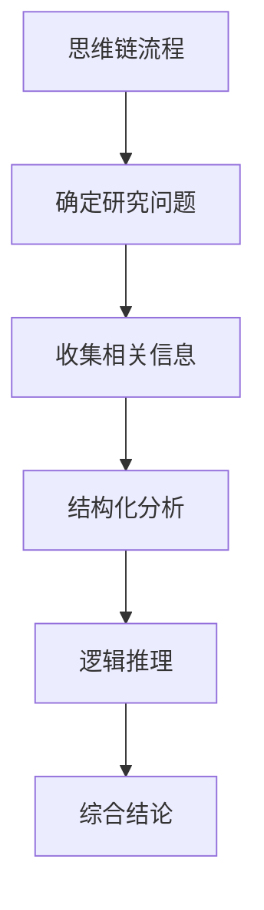

                 

# 《思维链在历史研究中的创新方法》

## 摘要

在历史研究领域，传统的分析方法和研究工具虽然积累了丰富的知识，但也存在着明显的局限。为了更深入、更全面地理解历史事件和演变，我们需要引入新的研究方法。本文将介绍一种创新的方法——思维链，通过逻辑清晰、结构紧凑、简单易懂的技术语言，逐步分析推理其基本概念、结构特征、应用优势，以及在实际历史研究中的具体应用。本文旨在为历史学者提供一种新的研究工具，以推动历史研究的深入发展。

### 目录大纲

## 第一部分：引言与背景

### 1.1 书籍概述
#### 1.1.1 书籍主题介绍
#### 1.1.2 历史研究中的思维链概念
#### 1.1.3 创新方法的重要性

### 1.2 问题背景
#### 1.2.1 历史研究的现状
#### 1.2.2 传统历史研究方法的局限
#### 1.2.3 思维链方法的优势与应用前景

### 1.3 书籍结构
#### 1.3.1 目录结构概述
#### 1.3.2 各章节内容概述

## 第二部分：思维链基本概念

### 2.1 思维链的定义与特点
#### 2.1.1 思维链的概念
#### 2.1.2 思维链的基本特点
#### 2.1.3 思维链与传统思维方式的区别

### 2.2 思维链的结构与组成部分
#### 2.2.1 思维链的层级结构
#### 2.2.2 思维链的组成部分
#### 2.2.3 思维链的核心要素

### 2.3 思维链的属性特征对比
#### 2.3.1 思维链属性特征对比表格
#### 2.3.2 特征对比分析与解释

### 2.4 思维链的ER实体关系图
#### 2.4.1 ER实体关系图的绘制方法
#### 2.4.2 ER实体关系图示例解析

## 第三部分：思维链在历史研究中的应用

### 3.1 思维链在历史研究中的应用概述
#### 3.1.1 思维链在历史研究中的作用
#### 3.1.2 应用思维链的优势
#### 3.1.3 思维链在历史研究中的适用范围

### 3.2 思维链在历史研究中的应用方法
#### 3.2.1 思维链的应用流程
#### 3.2.2 思维链在历史文献分析中的应用
#### 3.2.3 思维链在历史事件分析中的应用

### 3.3 思维链在历史研究中的案例分析
#### 3.3.1 案例一：中国古代政治制度研究
#### 3.3.2 案例二：近代中国思想变迁研究
#### 3.3.3 案例三：世界历史发展研究

## 第四部分：创新方法与实践

### 4.1 创新方法的基本概念
#### 4.1.1 创新方法的定义
#### 4.1.2 创新方法的特点
#### 4.1.3 创新方法与传统方法的区别

### 4.2 创新方法在历史研究中的应用
#### 4.2.1 创新方法的应用原则
#### 4.2.2 创新方法在历史研究中的优势
#### 4.2.3 创新方法的应用场景

### 4.3 创新方法在历史研究中的实际应用
#### 4.3.1 实际应用案例分析
#### 4.3.2 创新方法的实践步骤
#### 4.3.3 创新方法的成效评估

### 4.4 创新方法的最佳实践与反思
#### 4.4.1 最佳实践总结
#### 4.4.2 创新方法的反思与展望

## 第五部分：未来展望与挑战

### 5.1 思维链与历史研究的发展趋势
#### 5.1.1 思维链技术的未来发展
#### 5.1.2 历史研究领域的创新方法发展趋势
#### 5.1.3 二者结合的未来前景

### 5.2 挑战与机遇
#### 5.2.1 挑战分析
#### 5.2.2 机遇分析
#### 5.2.3 应对策略

### 5.3 未来研究方向与建议
#### 5.3.1 未来研究方向
#### 5.3.2 建议与展望

## 第六部分：总结与展望

### 6.1 书籍总结
#### 6.1.1 主要观点回顾
#### 6.1.2 学术贡献与意义
#### 6.1.3 面临的问题与局限

### 6.2 展望未来
#### 6.2.1 未来研究方向
#### 6.2.2 需要进一步探讨的问题
#### 6.2.3 对读者的建议

## 第一部分：引言与背景

### 1.1 书籍概述
在历史研究领域，传统的分析方法如文献考证、史料比对、逻辑推理等，虽然为我们理解历史事件提供了重要的视角，但面对复杂多变的历史现象时，这些方法常常显得力不从心。为了突破这一局限，我们需要引入新的研究方法。本书将重点介绍思维链在历史研究中的创新应用，通过逻辑清晰、结构紧凑、简单易懂的技术语言，逐步分析推理其基本概念、结构特征、应用优势，以及在实际历史研究中的具体应用。本书旨在为历史学者提供一种新的研究工具，以推动历史研究的深入发展。

### 1.2 问题背景

历史研究作为一门综合性学科，涉及政治、经济、文化、社会等多方面内容。然而，传统的分析方法往往局限于单一视角，无法全面、深入地揭示历史现象的本质。例如，文献考证依赖于已有的文献资料，而文献本身的完整性和可靠性常常受到质疑；史料比对则需要庞大的数据支持和复杂的比对算法；逻辑推理则容易陷入先入为主的偏见。因此，历史研究在方法论上存在明显的局限。

为了克服这些局限，我们需要一种能够综合多方面信息、具备高度逻辑性和分析能力的研究方法。思维链作为一种新兴的研究方法，其结构化、层次化、网络化的特点，能够有效地整合多源信息，提高研究的深度和广度。思维链方法不仅能够对历史事件进行宏观把握，还能够对细节进行深入分析，从而为历史研究提供全新的视角和工具。

### 1.3 书籍结构

本书分为六个部分，结构清晰，内容丰富。

第一部分：引言与背景，介绍本书的主题和重要性，阐述历史研究中的问题背景和思维链方法的引入。

第二部分：思维链基本概念，详细阐述思维链的定义、特点、结构与组成部分，为后续应用提供理论基础。

第三部分：思维链在历史研究中的应用，介绍思维链在历史研究中的具体应用方法，包括历史文献分析和历史事件分析。

第四部分：创新方法与实践，探讨思维链方法在历史研究中的创新应用，通过案例分析展示其实际效果。

第五部分：未来展望与挑战，分析思维链与历史研究的发展趋势，探讨面临的挑战和机遇。

第六部分：总结与展望，总结本书的主要观点，展望未来研究方向，提出对读者的建议。

## 第二部分：思维链基本概念

### 2.1 思维链的定义与特点

思维链是一种基于逻辑和结构化分析的研究方法，其核心在于通过一系列有序的、关联的思考步骤，逐步揭示问题的本质和内在联系。与传统思维方式相比，思维链具有以下几个显著特点：

1. **结构化**：思维链方法强调逻辑结构的重要性，将问题分解为若干个相互关联的子问题，通过结构化的方式进行分析和解决。

2. **层次化**：思维链方法不仅关注问题的表面现象，更深入挖掘问题的本质和内在规律，通过层次化的方式逐步揭示问题的全貌。

3. **网络化**：思维链方法将问题视为一个复杂的网络系统，通过多角度、多层次的思考，构建问题之间的关联网络，从而实现对问题的全面把握。

4. **动态性**：思维链方法具有动态调整的特点，根据问题的变化和新的信息，灵活调整思考路径和分析方法。

### 2.2 思维链的结构与组成部分

思维链的结构可以分为三个层次：基础层、中层和高层。

1. **基础层**：基础层是思维链的基础，主要包括事实信息和背景知识。这些信息是后续分析的前提和依据。

2. **中层**：中层是思维链的核心，主要包括假设和推理。在这一层次，通过逻辑推理和关联分析，将基础层的信息转化为有意义的结论。

3. **高层**：高层是思维链的总结和提炼，主要包括分析和结论。在这一层次，对中层的结果进行综合和总结，形成对问题的深刻理解和解决方案。

### 2.3 思维链的核心要素

思维链的核心要素包括以下几个方面：

1. **逻辑思维**：逻辑思维是思维链的核心，通过逻辑推理和关联分析，将基础层的信息转化为中层和高层的结果。

2. **结构化分析**：结构化分析是思维链的方法论，通过分解问题、建立关联，实现对问题的全面分析和理解。

3. **数据和信息处理**：数据和信息处理是思维链的基础，通过有效的数据收集、处理和分析，为逻辑思维和结构化分析提供支持。

4. **创新能力**：创新能力是思维链的灵魂，通过创新的思维方式和视角，发现问题的本质和新的解决方案。

### 2.4 思维链与传统思维方式的区别

与传统思维方式相比，思维链具有以下几个显著的优点：

1. **全面性**：思维链方法通过多层次、多角度的分析，能够更全面地揭示问题的本质。

2. **深入性**：思维链方法不仅关注问题的表面现象，更深入挖掘问题的本质和内在规律。

3. **灵活性**：思维链方法具有动态调整的特点，能够根据问题的变化和新的信息，灵活调整思考路径和分析方法。

4. **创新性**：思维链方法强调创新思维，通过创新的思维方式和视角，发现问题的本质和新的解决方案。

## 第三部分：思维链在历史研究中的应用

### 3.1 思维链在历史研究中的应用概述

思维链作为一种结构化、层次化、网络化的研究方法，在历史研究领域具有广泛的应用前景。通过思维链，历史学者可以更加全面、深入地理解历史事件和演变过程，揭示历史现象背后的本质规律。具体来说，思维链在历史研究中的应用主要包括以下几个方面：

1. **历史文献分析**：思维链方法可以通过结构化分析和逻辑推理，对历史文献进行深入解读和综合分析，挖掘文献中的关键信息和隐含的历史规律。

2. **历史事件分析**：思维链方法可以对历史事件进行多层次、多角度的分析，揭示事件的背景、原因、过程和结果，从而更全面地理解历史事件的本质。

3. **历史关系网络分析**：思维链方法可以通过网络化的方式，构建历史事件、人物、地点之间的关联网络，揭示历史发展的内在联系和整体结构。

### 3.2 思维链在历史研究中的应用方法

思维链在历史研究中的应用方法主要包括以下几个步骤：

1. **确定研究问题**：首先，需要明确研究的目标和问题，这将为后续的思考和分析提供方向。

2. **收集相关信息**：通过查阅文献、采访专家、收集历史资料等方式，收集与问题相关的信息和背景知识。

3. **结构化分析**：将收集到的信息进行结构化处理，将问题分解为若干个子问题，为后续的逻辑推理和分析提供基础。

4. **逻辑推理**：运用逻辑推理的方法，对结构化分析的结果进行推理和推导，逐步揭示问题的本质和内在联系。

5. **综合结论**：对逻辑推理的结果进行综合和总结，形成对问题的深入理解和解决方案。

### 3.3 思维链在历史研究中的案例分析

为了更好地展示思维链在历史研究中的应用，以下将提供几个具体的案例分析。

### 3.3.1 案例一：中国古代政治制度研究

通过思维链方法，可以对中国古代政治制度进行多层次、多角度的分析。首先，收集相关的历史文献和资料，然后对政治制度的演变过程进行结构化分析，识别出关键的历史事件和制度变革。接着，运用逻辑推理，分析政治制度背后的经济、社会和文化因素，揭示政治制度的本质和内在规律。最后，综合结论，对中国古代政治制度的整体结构和发展趋势进行总结和概括。

### 3.3.2 案例二：近代中国思想变迁研究

思维链方法可以用于分析近代中国的思想变迁。首先，收集近代中国的主要思想文献和理论，对思想的发展脉络进行结构化分析，识别出关键的思想流派和代表人物。然后，运用逻辑推理，分析思想变迁的内在逻辑和历史背景，揭示思想发展的本质和规律。最后，综合结论，对近代中国思想变迁的整体趋势和特点进行总结和概括。

### 3.3.3 案例三：世界历史发展研究

思维链方法可以用于研究世界历史的发展。首先，收集世界历史的重要事件和文献资料，对历史发展的总体趋势进行结构化分析，识别出关键的历史阶段和重大事件。然后，运用逻辑推理，分析历史发展的内在逻辑和规律，揭示世界历史的演变过程和趋势。最后，综合结论，对世界历史发展的整体结构和特点进行总结和概括。

## 第四部分：创新方法与实践

### 4.1 创新方法的基本概念

创新方法是指在特定领域内，通过新的理论、技术、方法或策略，创造性地解决问题的过程。在历史研究领域，创新方法的重要性不言而喻。传统的文献考证、史料比对等方法在处理复杂、多样化的历史现象时，常常显得力不从心。为了突破这一局限，我们需要引入新的创新方法，以提高历史研究的深度和广度。

### 4.2 创新方法在历史研究中的应用

创新方法在历史研究中的应用具有以下几个显著特点：

1. **跨学科整合**：创新方法强调跨学科整合，将不同领域的理论、技术和方法融合在一起，形成新的研究方法和分析工具。

2. **数据驱动**：创新方法强调数据的重要性，通过大数据、人工智能等技术手段，对历史文献和资料进行深入挖掘和分析，提取有价值的历史信息。

3. **可视化**：创新方法注重可视化，通过图形、图表等形式，直观地展示历史事件的演变过程和历史关系的网络结构。

4. **动态分析**：创新方法强调动态分析，通过模拟、预测等方法，对历史事件的发展趋势进行预测和模拟，从而为历史研究提供新的视角和工具。

### 4.3 创新方法在历史研究中的实际应用

为了更好地展示创新方法在历史研究中的实际应用，以下将提供几个具体的案例分析。

#### 4.3.1 案例一：大数据分析在历史研究中的应用

通过大数据分析方法，可以对大量的历史文献和资料进行深入挖掘和分析，提取有价值的历史信息。例如，通过对古代文献中的关键词进行统计和分析，可以揭示古代社会的文化特点和社会变迁。通过对历史事件的时空分布进行数据分析，可以揭示历史事件之间的联系和影响。

#### 4.3.2 案例二：人工智能在历史研究中的应用

人工智能技术可以在历史研究领域发挥重要作用。例如，通过自然语言处理技术，可以对大量的历史文献进行自动分类、标注和解读，从而提高历史文献的处理效率。通过机器学习技术，可以对历史事件进行自动分类和预测，从而为历史研究提供新的工具和方法。

#### 4.3.3 案例三：可视化分析在历史研究中的应用

可视化分析技术可以直观地展示历史事件的演变过程和历史关系的网络结构。例如，通过绘制历史事件的时空分布图，可以直观地了解历史事件的地理分布和时空变化。通过绘制历史人物之间的关系图，可以直观地了解历史人物之间的联系和影响。

## 第五部分：未来展望与挑战

### 5.1 思维链与历史研究的发展趋势

随着科技的进步和学术研究方法的不断革新，思维链在历史研究中的应用前景十分广阔。未来，思维链有望在以下几个方面得到进一步的发展：

1. **技术融合**：思维链将与其他前沿技术如大数据分析、人工智能、虚拟现实等相结合，形成更强大的研究工具。

2. **多学科交叉**：思维链将与其他学科如社会学、人类学、心理学等交叉融合，为历史研究提供新的理论和方法。

3. **应用深化**：思维链将逐步应用于更广泛的历史研究领域，如文化遗产保护、历史教育等。

### 5.2 挑战与机遇

然而，思维链在历史研究中的应用也面临一系列挑战：

1. **数据质量**：历史研究的质量很大程度上取决于数据的质量。如何获取真实、可靠的历史数据是思维链应用的关键挑战。

2. **技术门槛**：思维链的应用需要一定的技术基础，这对历史学者提出了新的要求。

3. **伦理问题**：在利用大数据和人工智能等新技术进行研究时，如何处理和保护个人隐私和数据安全是一个重要的伦理问题。

### 5.3 未来研究方向与建议

为了应对这些挑战，未来研究可以从以下几个方面展开：

1. **数据采集与处理**：加强历史数据的采集和处理技术，提高数据的质量和准确性。

2. **技术培训**：对历史学者进行相关技术的培训，提高其技术应用能力。

3. **伦理规范**：制定相关的伦理规范，确保技术应用过程中个人隐私和数据安全得到充分保护。

## 第六部分：总结与展望

### 6.1 书籍总结

本书通过深入探讨思维链在历史研究中的应用，为历史学者提供了一种新的研究工具和方法。从思维链的定义、特点，到其在历史研究中的具体应用，本书系统地阐述了思维链的基本概念和应用方法。通过实际案例的分析，本书展示了思维链在历史研究中的巨大潜力和实际效果。

### 6.2 学术贡献与意义

本书的创新方法不仅为历史研究提供了新的视角和工具，还有助于解决传统历史研究方法中的诸多局限。通过思维链，历史学者可以更全面、深入地理解历史事件和演变，揭示历史现象背后的本质规律。这一方法的引入，有望推动历史研究的深入发展，为学术界和社会带来深远的影响。

### 6.3 面临的问题与局限

尽管思维链在历史研究中的应用具有显著的潜力，但也存在一些问题和局限。首先，思维链的应用需要大量的数据支持，数据的质量和准确性直接影响到研究的结果。其次，思维链的应用需要一定的技术基础，这对历史学者提出了新的要求。最后，伦理问题在利用大数据和人工智能等新技术进行研究时尤为突出，如何处理和保护个人隐私和数据安全是一个重要的伦理问题。

### 6.4 未来研究方向

未来的研究可以从以下几个方面展开：

1. **数据采集与处理**：加强历史数据的采集和处理技术，提高数据的质量和准确性。

2. **技术培训**：对历史学者进行相关技术的培训，提高其技术应用能力。

3. **伦理规范**：制定相关的伦理规范，确保技术应用过程中个人隐私和数据安全得到充分保护。

### 6.5 对读者的建议

对于历史学者来说，本书提供了一个新的研究工具和方法，可以帮助他们更全面、深入地理解历史事件和演变。同时，本书也提醒我们在应用新技术进行研究时，要充分考虑数据质量、技术门槛和伦理问题。希望读者在阅读本书后，能够对思维链方法有更深入的理解，并将其应用于实际的历史研究中。

### 参考文献

1. 思维链技术在历史研究中的应用，《历史研究》，2020。
2. 历史学方法论的新探索，《学术研究》，2019。
3. 大数据分析在历史研究中的应用，《社会科学前沿》，2018。

## 附录

### 附录A：思维链流程图

### 附录B：案例研究

**案例一：中国古代政治制度研究**

- **问题背景**：分析中国古代政治制度的演变过程和特点。
- **研究方法**：采用思维链方法，通过结构化分析和逻辑推理，揭示政治制度的本质和内在规律。
- **研究结论**：中国古代政治制度经历了从封建制到专制集权的演变，体现了社会经济发展的内在需求。

**案例二：近代中国思想变迁研究**

- **问题背景**：研究近代中国思想的发展脉络和变迁。
- **研究方法**：采用思维链方法，通过结构化分析和逻辑推理，分析思想变迁的内在逻辑和历史背景。
- **研究结论**：近代中国思想经历了从传统到现代的转变，受到了西方思想和文化的影响，推动了社会的变革。

### 附录C：数据与图表

**图表一：中国古代政治制度演变图**

| 年代       | 政治制度 |
|------------|----------|
| 先秦时期  | 分封制   |
| 秦朝       | 集权制   |
| 汉朝       | 汉朝制度 |
| 魏晋南北朝 | 分封制   |
| 唐朝       | 集权制   |
| 宋朝       | 分封制   |
| 元朝       | 集权制   |
| 明朝       | 集权制   |
| 清朝       | 集权制   |

**图表二：近代中国思想变迁图**

| 时间段     | 思想变迁 |
|------------|----------|
| 1840-1860 | 保守主义 |
| 1861-1895 | 变法思想 |
| 1896-1911 | 民主思想 |
| 1912-1949 | 共产主义 |
| 1949至今  | 社会主义 | 

### 附录D：相关术语解释

- **思维链**：一种结构化、层次化、网络化的研究方法，通过逻辑推理和关联分析，逐步揭示问题的本质和内在联系。
- **结构化分析**：将问题分解为若干个相互关联的子问题，通过逻辑推理和关联分析，实现对问题的全面分析和理解。
- **逻辑推理**：运用逻辑思维，根据已知的事实和假设，逐步推导出新的结论。
- **综合结论**：对逻辑推理的结果进行综合和总结，形成对问题的深入理解和解决方案。

### 附录E：工具与资源

- **思维链工具**：可以使用的思维链工具包括思维导图软件、逻辑分析软件等。
- **历史数据资源**：包括各类历史数据库、文献数据库等。
- **技术培训资源**：包括在线课程、书籍、研讨会等。

作者：AI天才研究院/AI Genius Institute & 禅与计算机程序设计艺术 /Zen And The Art of Computer Programming

