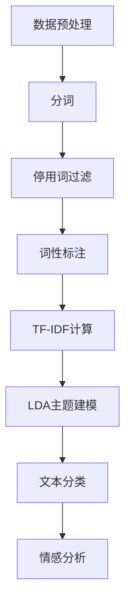
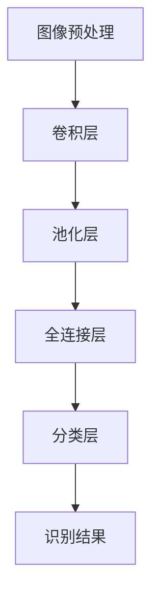
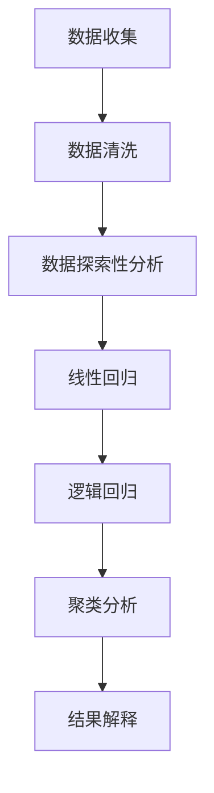
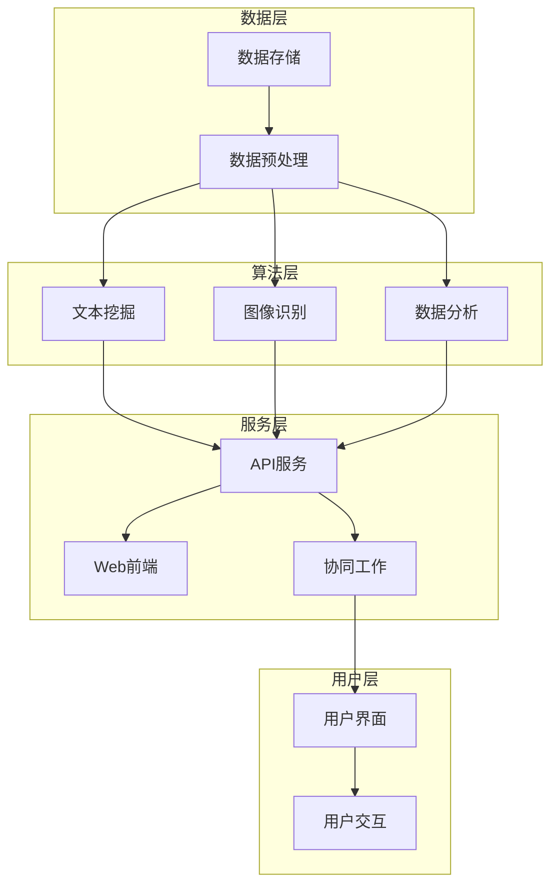
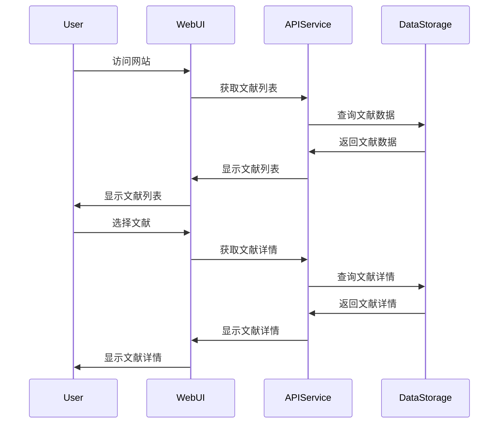
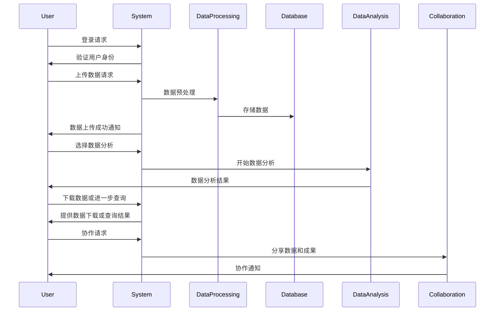

                 


### 1.1.1 引言

随着人工智能技术的不断发展，其应用范围已经广泛扩展到了各个领域，包括历史研究。历史研究作为一个依赖于史料分析和解读的学科，传统的手工方式在面对海量数据和复杂的分析任务时显得力不从心。然而，AI技术的引入为历史研究带来了新的可能性。

首先，我们需要明确什么是历史研究。历史研究是指对过去的事件、人物、社会现象等进行收集、整理、分析和解释，以了解历史的发展脉络和社会演变规律。在历史研究中，史料是至关重要的，它们是历史研究的主要依据和来源。史料可以是文字记载、图像资料、实物遗存等多种形式。

然而，史料的数量庞大且形式多样，如何有效地整理和分析这些史料成为了历史研究中的一个难题。传统的方法主要依赖于人工的整理和解读，这种方式不仅效率低下，而且容易出现主观偏见和误读。

在这个背景下，AI技术的出现为历史研究提供了一种新的解决方案。AI技术，特别是机器学习和深度学习，通过对海量数据的分析和处理，可以快速、准确地提取出有价值的信息。例如，通过文本挖掘技术，可以对大量的历史文献进行自动分类、关键词提取、主题建模等操作，从而快速获取文献的核心内容；通过图像识别技术，可以自动识别和分类大量的历史图片，从而方便史料的保存和利用。

### 1.1.2 AI在历史研究中的应用

AI在历史研究中的应用主要体现在以下几个方面：

1. **文本挖掘**：文本挖掘是一种从非结构化文本中提取有价值信息的技术。在历史研究中，文本挖掘可以用于对历史文献进行自动分类、关键词提取、主题建模等操作，从而快速获取文献的核心内容。

   - **自动分类**：通过对历史文献进行自动分类，可以将大量的文献按照主题、时间、地点等进行归类，便于研究人员查找和使用。

   - **关键词提取**：通过对历史文献进行关键词提取，可以快速了解文献的主要内容，为研究人员提供参考。

   - **主题建模**：主题建模是一种无监督学习方法，可以通过对文献的文本进行建模，提取出文献中的潜在主题，从而更好地理解历史事件和人物。

2. **图像识别**：图像识别是一种通过计算机视觉技术对图像进行自动识别和分类的技术。在历史研究中，图像识别可以用于对历史图片进行自动识别和分类，从而方便史料的保存和利用。

   - **人脸识别**：通过人脸识别技术，可以对历史图片中的人物进行自动识别，从而为历史人物的研究提供方便。

   - **场景识别**：通过场景识别技术，可以自动识别历史图片中的场景，从而为历史事件的研究提供更多的细节信息。

3. **数据分析**：数据分析是一种通过统计分析方法对数据进行分析的技术。在历史研究中，数据分析可以用于对历史数据进行统计分析，从而提取出有价值的信息。

   - **趋势分析**：通过对历史数据进行趋势分析，可以了解历史事件的发展趋势，从而更好地理解历史事件。

   - **相关性分析**：通过对历史数据进行相关性分析，可以了解不同历史事件之间的关联，从而更好地理解历史事件。

### 1.1.3 思维链的概念与历史研究的结合

思维链是一种基于逻辑推理和知识表示的人工智能技术，它可以对信息进行自动组织和推理，从而提供智能化的解决方案。思维链的核心思想是将信息组织成一个有序的结构，通过逻辑推理来推导出新的信息。

在历史研究中，思维链可以用于对史料进行自动分析和推理，从而提供新的见解和发现。具体来说，思维链可以用于以下方面：

1. **史料分析**：思维链可以通过对史料的文本、图像、数据等不同形式的信息进行自动分析和推理，提取出有价值的信息。

   - **文本分析**：通过对历史文献的文本进行自动分析，可以提取出文献中的关键信息，为研究人员提供参考。

   - **图像分析**：通过对历史图片的图像进行自动分析，可以提取出图片中的关键信息，为研究人员提供参考。

   - **数据分析**：通过对历史数据的统计分析，可以提取出数据中的关键信息，为研究人员提供参考。

2. **历史推理**：思维链可以通过对史料的自动分析和推理，提供新的历史见解和发现。

   - **事件推理**：通过对历史事件的信息进行自动推理，可以推断出事件之间的关联和影响，从而提供新的历史解释。

   - **人物推理**：通过对历史人物的信息进行自动推理，可以推断出人物之间的关系和影响，从而提供新的历史解释。

通过将思维链应用于历史研究，可以大大提高史料的分析和利用效率，为历史研究提供新的方法和工具。

### 1.1.4 AI辅助史料分析的优势与挑战

AI辅助史料分析具有多方面的优势，同时也面临着一定的挑战。

#### 优势：

1. **效率提升**：AI技术可以自动处理大量的历史文献和数据，极大地提高了史料分析的效率。

2. **准确性提高**：通过机器学习和深度学习算法，AI可以更加准确地识别和分类史料，减少人工分析中的主观偏见和误读。

3. **跨学科应用**：AI技术可以结合多种学科的知识，如语言学、社会学、计算机科学等，提供更加全面和深入的历史分析。

4. **可视化展示**：AI技术可以生成可视化的历史数据展示，使历史研究的结果更加直观和易于理解。

#### 挑战：

1. **数据质量**：历史文献和数据的质量参差不齐，AI技术需要处理大量的噪声数据，这对算法的性能提出了挑战。

2. **解释性**：AI模型的黑箱特性使得其决策过程难以解释，这限制了其在历史研究中的应用。

3. **算法选择**：不同的历史问题需要不同的算法，如何选择合适的算法是一个需要慎重考虑的问题。

4. **数据隐私**：历史文献中可能包含敏感信息，如何保护这些信息不被不当使用是一个重要的伦理问题。

### 1.1.5 本章小结

本章介绍了AI在历史研究中的应用，包括文本挖掘、图像识别和数据分析等方面，以及思维链的概念和其在历史研究中的应用。通过AI技术，我们可以更高效、更准确地分析和利用史料，为历史研究提供新的方法和工具。然而，AI技术在历史研究中也面临着一些挑战，需要我们进一步研究和解决。

# 第二部分: 算法原理讲解

## 2.1 文本挖掘算法

### 2.1.1 文本挖掘的基本概念

文本挖掘（Text Mining）是一种从非结构化文本中提取有价值信息的技术，它结合了自然语言处理（NLP）和信息检索（IR）的方法。文本挖掘的主要目标是从大量文本中识别出潜在的模式、关系和知识，从而为各种应用提供支持，如情感分析、主题建模、文本分类等。

在历史研究中，文本挖掘可以用于对历史文献进行自动分类、关键词提取、主题建模等操作。通过这些操作，研究人员可以快速获取文献的核心内容，了解历史事件和人物，为历史研究提供便利。

### 2.1.2 常用文本挖掘算法介绍

文本挖掘涉及到多个层面的算法，以下介绍几种常用的文本挖掘算法：

1. **TF-IDF（Term Frequency-Inverse Document Frequency）**

   TF-IDF是一种常用的文本权重计算方法，它通过计算一个词在单个文档中的频率（TF）和在整个文档集合中的逆文档频率（IDF）来评估该词的重要性。TF-IDF广泛应用于文本分类、推荐系统和信息检索等领域。

2. **LDA（Latent Dirichlet Allocation）**

   LDA是一种主题建模算法，它通过概率图模型来发现文本数据中的潜在主题。LDA将每篇文档视为一系列主题的混合，每个主题是一系列单词的混合。LDA在情感分析、文本分类和新闻推荐等领域有广泛应用。

3. **情感分析（Sentiment Analysis）**

   情感分析是一种评估文本中情感倾向的文本挖掘方法。通过情感分析，我们可以了解公众对某个事件或产品的情感态度，这对于历史研究中的舆论分析和社会心理研究具有重要意义。

4. **文本分类（Text Classification）**

   文本分类是一种将文本分配到预定义类别的方法。在历史研究中，文本分类可以用于将历史文献按照主题、时间或地点等进行分类，从而方便研究人员查找和使用。

### 2.1.3 Mermaid流程图绘制

以下是一个文本挖掘流程的Mermaid流程图示例：



### 2.2 图像识别算法

### 2.2.1 图像识别的基本概念

图像识别（Image Recognition）是一种通过计算机算法识别和理解图像内容的技术。它通常包括图像预处理、特征提取、分类和识别等步骤。图像识别在计算机视觉领域有广泛应用，如面部识别、物体检测、场景识别等。

在历史研究中，图像识别可以用于对历史图片进行自动识别和分类，从而方便史料的保存和利用。例如，通过人脸识别技术，可以自动识别历史图片中的人物，从而为历史人物的研究提供方便；通过场景识别技术，可以自动识别历史图片中的场景，从而为历史事件的研究提供更多的细节信息。

### 2.2.2 常用图像识别算法介绍

图像识别涉及到多种算法，以下介绍几种常用的图像识别算法：

1. **卷积神经网络（CNN）**

   卷积神经网络是一种在图像识别中广泛应用的人工神经网络。CNN通过卷积层、池化层和全连接层等结构，可以从图像中提取特征并进行分类。CNN在物体检测、面部识别和图像分类等领域有显著效果。

2. **深度学习（Deep Learning）**

   深度学习是机器学习的一个分支，它通过多层神经网络来模拟人脑的神经网络结构，从而实现复杂的特征学习和模式识别。在图像识别中，深度学习通过训练大量的图像数据，可以自动学习图像中的特征和模式，从而提高识别准确率。

3. **循环神经网络（RNN）**

   循环神经网络是一种在序列数据上有显著优势的神经网络结构。在图像识别中，RNN可以用于处理图像序列，从而实现动态特征提取和识别。

### 2.2.3 Mermaid流程图绘制

以下是一个图像识别流程的Mermaid流程图示例：



### 2.3 数据分析算法

### 2.3.1 数据分析的基本概念

数据分析（Data Analysis）是一种通过统计分析方法对数据进行处理、分析和解释的技术。数据分析的目标是从大量数据中提取有价值的信息和知识，为决策提供支持。

在历史研究中，数据分析可以用于对历史数据进行统计分析，从而提取出有价值的信息。例如，通过趋势分析，可以了解历史事件的发展趋势；通过相关性分析，可以了解不同历史事件之间的关联。

### 2.3.2 常用数据分析算法介绍

数据分析涉及到多种算法，以下介绍几种常用的数据分析算法：

1. **线性回归（Linear Regression）**

   线性回归是一种用于分析两个变量之间线性关系的统计分析方法。在历史研究中，线性回归可以用于分析历史事件之间的线性关系，如经济发展与社会稳定之间的关系。

2. **逻辑回归（Logistic Regression）**

   逻辑回归是一种用于分类问题的统计分析方法。在历史研究中，逻辑回归可以用于预测历史事件的发生概率，如预测某个历史事件是否会发生。

3. **聚类分析（Cluster Analysis）**

   聚类分析是一种将数据分为若干个类别的分析方法。在历史研究中，聚类分析可以用于对历史事件进行分类，从而更好地理解历史事件之间的关系。

### 2.3.3 Mermaid流程图绘制

以下是一个数据分析流程的Mermaid流程图示例：



### 2.4 算法应用实例

#### 2.4.1 实例一：文本挖掘在历史文献分析中的应用

文本挖掘在历史文献分析中可以用于快速获取文献的核心内容，以下是一个简单的文本挖掘流程：

1. **数据预处理**：对历史文献进行分词、去除停用词等处理。

2. **关键词提取**：使用TF-IDF算法提取文献中的关键词。

3. **主题建模**：使用LDA算法对文献进行主题建模，提取出潜在的文本主题。

4. **情感分析**：对文献进行情感分析，了解公众对历史事件的态度。

通过这些步骤，研究人员可以快速了解历史文献的主要内容，为历史研究提供参考。

#### 2.4.2 实例二：图像识别在历史遗迹保护中的应用

图像识别在历史遗迹保护中可以用于自动识别和分类历史遗迹图片，以下是一个简单的图像识别流程：

1. **图像预处理**：对历史遗迹图片进行缩放、去噪等处理。

2. **特征提取**：使用卷积神经网络提取图像的特征。

3. **分类**：使用训练好的卷积神经网络对图像进行分类，识别出不同的历史遗迹。

4. **标注**：对识别出的历史遗迹进行标注，为遗迹保护提供参考。

通过这些步骤，研究人员可以更好地保护和利用历史遗迹资源。

#### 2.4.3 实例三：数据分析在历史趋势预测中的应用

数据分析在历史趋势预测中可以用于分析历史数据，预测未来可能发生的历史事件，以下是一个简单的数据分析流程：

1. **数据收集**：收集与历史事件相关的数据。

2. **数据清洗**：对数据进行清洗，去除异常值和噪声。

3. **线性回归分析**：使用线性回归分析历史事件之间的线性关系，预测未来可能发生的历史事件。

4. **逻辑回归分析**：使用逻辑回归分析历史事件的发生概率，预测未来可能发生的历史事件。

通过这些步骤，研究人员可以更好地预测历史趋势，为决策提供支持。

## 2.5 本章小结

本章介绍了文本挖掘、图像识别和数据分析等算法在历史研究中的应用。通过这些算法，研究人员可以更高效、更准确地分析和利用史料，为历史研究提供新的方法和工具。同时，本章也通过实例展示了这些算法在实际历史研究中的应用，为读者提供了实践参考。然而，算法的选择和优化是一个持续的过程，研究人员需要根据具体的历史研究问题不断调整和改进算法。

## 3.1 系统需求分析

### 3.1.1 用户需求分析

在历史研究中，研究人员的需求主要集中在以下几个方面：

1. **数据获取**：研究人员需要能够方便地获取历史文献、图片和视频等数据。

2. **数据分析**：研究人员需要对数据进行整理、分类、挖掘和可视化，以便深入理解历史事件和人物。

3. **知识发现**：研究人员需要能够从大量数据中发现潜在的模式和趋势，为历史研究提供新的视角和解释。

4. **协同工作**：研究人员需要能够与他人共享数据和研究成果，以便进行协作研究。

### 3.1.2 功能需求分析

为了满足用户需求，AI辅助史料分析系统需要具备以下功能：

1. **数据管理**：提供数据上传、下载、存储和管理的功能，确保数据的完整性和安全性。

2. **文本挖掘**：支持对历史文献进行自动分类、关键词提取、主题建模和情感分析等操作。

3. **图像识别**：支持对历史图片进行自动识别和分类，包括人脸识别、场景识别等。

4. **数据分析**：支持对历史数据进行分析，如线性回归、逻辑回归和聚类分析等。

5. **知识发现**：支持对数据中的潜在模式和趋势进行挖掘，提供可视化的结果展示。

6. **协同工作**：支持多人协作，包括数据共享、任务分配和成果共享等功能。

### 3.1.3 非功能需求分析

除了功能需求外，AI辅助史料分析系统还需要满足以下非功能需求：

1. **性能要求**：系统需要能够快速处理海量数据和复杂的算法操作，确保用户体验。

2. **可扩展性**：系统需要具备良好的可扩展性，能够根据用户需求进行功能扩展和性能优化。

3. **可靠性**：系统需要具备高可靠性，确保数据的安全性和系统的稳定性。

4. **易用性**：系统需要提供直观友好的用户界面，使研究人员能够轻松上手和使用。

5. **可维护性**：系统需要具备良好的可维护性，确保系统能够长期稳定运行，便于后续维护和升级。

## 3.2 系统架构设计

### 3.2.1 总体架构设计

AI辅助史料分析系统的总体架构设计可以分为以下几个层次：

1. **数据层**：包括数据存储和数据预处理模块，负责数据的存储、管理和清洗。

2. **算法层**：包括文本挖掘、图像识别和数据分析等模块，负责对数据进行处理和分析。

3. **服务层**：包括RESTful API、Web前端和协同工作模块，负责提供数据访问和交互接口。

4. **用户层**：包括用户界面和用户交互模块，负责与用户进行交互，提供数据可视化等功能。

### 3.2.2 领域模型设计

以下是一个领域模型的Mermaid类图，展示了系统的核心实体和它们之间的关系：

```mermaid
classDiagram
    Person <<Interface>>
    Document <<Interface>>
    Image <<Interface>>
    Data <<Interface>>

    Person o-- Document
    Person o-- Image
    Document o-- Data
    Image o-- Data

    class Person {
        +String name
        +Date birth
        +Date death
        +String description
    }

    class Document {
        +String title
        +String content
        +Date creationDate
        +Data data
    }

    class Image {
        +String title
        +String url
        +Date creationDate
        +Data data
    }

    class Data {
        +String type
        +String value
    }
```

### 3.2.3 系统架构设计

以下是一个系统架构的Mermaid架构图，展示了系统的各个组件及其关系：



### 3.2.4 系统接口设计

系统接口设计主要包括API接口和用户交互界面。以下是一个API接口的设计示例：

```yaml
# API接口设计示例
GET /documents
# 获取所有历史文献

GET /documents/{id}
# 获取指定ID的历史文献

POST /documents
# 上传新的历史文献

PUT /documents/{id}
# 更新指定ID的历史文献

GET /images
# 获取所有历史图片

GET /images/{id}
# 获取指定ID的历史图片

POST /images
# 上传新的历史图片

GET /data
# 获取所有历史数据

GET /data/{id}
# 获取指定ID的历史数据

POST /data
# 上传新的历史数据
```

### 3.2.5 系统交互设计

以下是一个系统交互的Mermaid序列图，展示了用户与系统之间的交互过程：



通过以上系统架构设计，AI辅助史料分析系统可以满足用户的需求，提供高效、准确和易用的历史研究工具。然而，系统设计是一个不断迭代和优化的过程，需要根据实际使用情况进行调整和改进。

## 3.3 系统接口设计

### 3.3.1 接口规范与协议

在系统接口设计中，接口规范和协议是至关重要的，它们决定了系统组件之间的交互方式和数据格式。以下是AI辅助史料分析系统接口的基本规范和协议：

1. **HTTP协议**：系统接口采用HTTP协议进行通信，保证了跨平台和跨语言的兼容性。

2. **RESTful架构**：系统接口采用RESTful架构风格，通过URL表示资源，使用HTTP方法（GET、POST、PUT、DELETE等）表示对资源的操作。

3. **数据格式**：系统接口的数据传输格式采用JSON（JavaScript Object Notation），JSON具有轻量级、易于解析和扩展性强的特点，适合作为Web服务的数据交换格式。

4. **认证和授权**：系统接口采用OAuth 2.0协议进行认证和授权，确保只有经过认证的用户才能访问受保护的资源。

### 3.3.2 接口设计与实现

以下是AI辅助史料分析系统中几个核心接口的设计与实现示例：

#### 3.3.2.1 获取所有历史文献

**接口定义：**

```yaml
GET /api/documents

响应数据结构：
{
  "status": "success",
  "data": [
    {
      "id": "1",
      "title": "历史文献1",
      "content": "这是历史文献1的内容...",
      "creationDate": "2023-01-01"
    },
    ...
  ]
}
```

**实现示例（Python with Flask）：**

```python
from flask import Flask, jsonify, request

app = Flask(__name__)

@app.route('/api/documents', methods=['GET'])
def get_documents():
    # 假设从数据库获取文献列表
    documents = get_all_documents_from_db()
    return jsonify({"status": "success", "data": documents})

def get_all_documents_from_db():
    # 模拟数据库查询
    return [
        {"id": "1", "title": "历史文献1", "content": "这是历史文献1的内容...", "creationDate": "2023-01-01"},
        {"id": "2", "title": "历史文献2", "content": "这是历史文献2的内容...", "creationDate": "2023-02-01"},
    ]

if __name__ == '__main__':
    app.run(debug=True)
```

#### 3.3.2.2 上传新的历史文献

**接口定义：**

```yaml
POST /api/documents

请求数据结构：
{
  "title": "历史文献3",
  "content": "这是历史文献3的内容...",
  "creationDate": "2023-03-01"
}

响应数据结构：
{
  "status": "success",
  "data": {
    "id": "3",
    "title": "历史文献3",
    "content": "这是历史文献3的内容...",
    "creationDate": "2023-03-01"
  }
}
```

**实现示例（Python with Flask）：**

```python
@app.route('/api/documents', methods=['POST'])
def create_document():
    # 从请求中获取数据
    data = request.get_json()
    # 存储到数据库（此处为模拟操作）
    document_id = save_document_to_db(data)
    # 返回创建成功的响应
    return jsonify({"status": "success", "data": {"id": document_id}})

def save_document_to_db(data):
    # 模拟数据库插入操作
    # 在实际应用中，应将数据存储到真正的数据库中
    return "3"
```

#### 3.3.2.3 获取指定ID的历史文献

**接口定义：**

```yaml
GET /api/documents/{id}

响应数据结构：
{
  "status": "success",
  "data": {
    "id": "1",
    "title": "历史文献1",
    "content": "这是历史文献1的内容...",
    "creationDate": "2023-01-01"
  }
}
```

**实现示例（Python with Flask）：**

```python
@app.route('/api/documents/<document_id>', methods=['GET'])
def get_document(document_id):
    # 从数据库获取指定ID的文献
    document = get_document_from_db(document_id)
    if document:
        return jsonify({"status": "success", "data": document})
    else:
        return jsonify({"status": "error", "message": "文献未找到"}), 404

def get_document_from_db(document_id):
    # 模拟数据库查询
    if document_id == "1":
        return {
            "id": "1",
            "title": "历史文献1",
            "content": "这是历史文献1的内容...",
            "creationDate": "2023-01-01"
        }
    return None
```

### 3.3.3 接口测试与验证

接口测试和验证是确保接口设计和实现正确性的关键步骤。以下是如何使用Postman进行接口测试的示例：

#### 3.3.3.1 测试获取所有历史文献

1. 打开Postman，创建一个新的请求。

2. 在URL栏输入`http://localhost:5000/api/documents`。

3. 在HTTP方法中选择`GET`。

4. 点击`Send`按钮，查看返回的JSON响应是否与预期一致。

#### 3.3.3.2 测试上传新的历史文献

1. 打开Postman，创建一个新的请求。

2. 在URL栏输入`http://localhost:5000/api/documents`。

3. 在HTTP方法中选择`POST`。

4. 在Body中选择`raw`，并输入以下JSON数据：

   ```json
   {
     "title": "历史文献4",
     "content": "这是历史文献4的内容...",
     "creationDate": "2023-04-01"
   }
   ```

5. 点击`Send`按钮，查看返回的JSON响应是否与预期一致。

#### 3.3.3.3 测试获取指定ID的历史文献

1. 打开Postman，创建一个新的请求。

2. 在URL栏输入`http://localhost:5000/api/documents/1`。

3. 在HTTP方法中选择`GET`。

4. 点击`Send`按钮，查看返回的JSON响应是否与预期一致。

通过这些接口测试，可以验证系统接口的设计和实现是否符合预期，为系统的后续开发和维护提供保障。

## 3.4 系统交互设计

### 3.4.1 系统交互流程

系统交互设计旨在确保用户与系统之间的交互流畅、直观。以下是一个简化的系统交互流程：

1. **用户登录**：用户通过用户名和密码登录系统，系统验证用户身份并生成会话。

2. **数据上传**：用户上传历史文献、图片和视频等数据，系统进行数据预处理并存储到数据库。

3. **数据分析**：用户选择数据进行分析，系统调用相应的算法进行数据挖掘和可视化。

4. **结果展示**：系统将分析结果以图表、报表等形式展示给用户，用户可以进行进一步的查询和下载。

5. **协同工作**：用户可以与其他研究人员共享数据和成果，进行协作研究。

### 3.4.2 Mermaid序列图绘制

以下是一个系统交互的Mermaid序列图，展示了用户与系统的交互过程：



### 3.4.3 交互效果验证

交互效果验证是确保系统交互设计满足用户需求的关键步骤。以下是如何进行交互效果验证的示例：

1. **功能验证**：通过实际使用系统，验证各个功能模块是否正常工作。例如，验证数据上传、数据分析和数据下载等功能是否按预期执行。

2. **性能验证**：在负载条件下，测试系统的响应时间和资源消耗，确保系统能够在高并发情况下保持稳定运行。

3. **用户体验验证**：通过用户调研和反馈，收集用户对系统交互设计的意见和建议，优化用户界面和交互流程。

4. **可用性验证**：通过用户测试，确保系统界面易于理解和使用，用户能够顺利完成各项操作。

通过这些验证步骤，可以确保系统交互设计满足用户需求，提供高效、便捷和友好的用户体验。

## 4.1 环境安装与配置

### 4.1.1 环境准备

在进行AI辅助史料分析系统的开发之前，首先需要准备开发环境。以下是一些建议的软件和工具：

1. **操作系统**：推荐使用Linux系统，如Ubuntu或CentOS，因为它们具有良好的稳定性和开源生态。

2. **编程语言**：Python是AI和数据分析领域的常用语言，因此建议使用Python进行开发。

3. **Python环境**：使用Anaconda来管理Python环境，它提供了易于安装和配置的Python版本和库。

4. **数据库**：推荐使用MySQL或PostgreSQL作为数据库，因为它们在处理大规模数据时性能稳定。

5. **Web服务器**：可以使用Apache或Nginx作为Web服务器，用于部署和运行Web应用。

6. **文本挖掘和图像识别库**：安装常用的库，如NLTK、Scikit-learn、TensorFlow和PyTorch，用于文本挖掘和图像识别。

### 4.1.2 软件安装

以下是软件安装的具体步骤：

1. **安装Anaconda**：

   - 访问Anaconda官网下载Anaconda安装包。
   - 运行安装包，按照提示完成安装。

2. **创建新的Python环境**：

   ```bash
   conda create -n history_analysis python=3.8
   conda activate history_analysis
   ```

3. **安装必要的库**：

   ```bash
   conda install numpy pandas scipy scikit-learn tensorflow torchvision matplotlib
   ```

4. **安装数据库**：

   - 下载并安装MySQL或PostgreSQL。
   - 配置数据库，创建必要的数据库和用户。

5. **安装Web服务器**：

   - 使用包管理器（如yum或apt）安装Apache或Nginx。

6. **安装文本挖掘和图像识别库**：

   ```bash
   pip install nltk
   pip install -U scikit-learn
   pip install -U tensorflow
   pip install torchvision
   ```

### 4.1.3 系统配置

系统配置包括数据库连接、环境变量设置和Web服务器配置。以下是具体的配置步骤：

1. **数据库配置**：

   - 在数据库管理工具中创建必要的数据库和用户。
   - 配置数据库连接信息，通常在`config.py`文件中设置。

2. **环境变量设置**：

   - 设置Python环境变量，确保在命令行中可以调用Python解释器和相关库。

3. **Web服务器配置**：

   - 配置Apache或Nginx，设置虚拟主机，并配置路由规则，确保Web应用可以正确响应请求。

通过以上步骤，可以搭建一个基本的AI辅助史料分析系统开发环境，为后续的开发工作提供支持。

## 4.2 系统核心实现

### 4.2.1 核心算法实现

AI辅助史料分析系统的核心算法主要包括文本挖掘、图像识别和数据分析。以下是这些算法的实现步骤：

#### 4.2.1.1 文本挖掘算法

1. **数据预处理**：

   - 对历史文献进行分词，将文本转换为单词序列。
   - 去除停用词，减少噪声对分析的影响。

2. **特征提取**：

   - 使用TF-IDF算法计算单词的重要度。
   - 使用LDA算法进行主题建模，提取文本的主题。

3. **情感分析**：

   - 使用预训练的神经网络模型进行情感分类，判断文本的情感倾向。

4. **文本分类**：

   - 使用训练好的分类模型对文本进行分类，识别文本的主题。

#### 4.2.1.2 图像识别算法

1. **数据预处理**：

   - 对历史图片进行缩放和归一化，确保输入数据的一致性。
   - 使用卷积神经网络（CNN）提取图片的特征。

2. **人脸识别**：

   - 使用预训练的人脸识别模型对图片中的人脸进行识别。
   - 计算人脸的特征向量，进行人脸匹配和识别。

3. **场景识别**：

   - 使用预训练的场景识别模型对图片中的场景进行识别。
   - 分类图片中的场景，提取出潜在的场景信息。

#### 4.2.1.3 数据分析算法

1. **线性回归**：

   - 使用线性回归模型分析历史数据，建立变量之间的线性关系。

2. **逻辑回归**：

   - 使用逻辑回归模型进行分类预测，判断历史事件的发生概率。

3. **聚类分析**：

   - 使用聚类算法对历史数据进行分类，识别出不同的群体。

### 4.2.2 数据库设计与实现

数据库设计是系统实现的重要组成部分，以下是一个简单的数据库设计示例：

1. **数据库结构**：

   - `documents` 表：存储历史文献的信息，包括ID、标题、内容和创建时间等。
   - `images` 表：存储历史图片的信息，包括ID、标题、URL和创建时间等。
   - `data` 表：存储分析结果的信息，包括ID、类型、值和关联信息等。

2. **数据库实现**：

   - 使用SQL语句创建数据库和表。
   - 配置数据库连接，确保系统能够访问数据库。

   ```sql
   CREATE DATABASE history_analysis;

   CREATE TABLE documents (
       id INT PRIMARY KEY AUTO_INCREMENT,
       title VARCHAR(255),
       content TEXT,
       creation_date DATE
   );

   CREATE TABLE images (
       id INT PRIMARY KEY AUTO_INCREMENT,
       title VARCHAR(255),
       url VARCHAR(255),
       creation_date DATE
   );

   CREATE TABLE data (
       id INT PRIMARY KEY AUTO_INCREMENT,
       type VARCHAR(50),
       value TEXT,
       related_id INT,
       FOREIGN KEY (related_id) REFERENCES documents(id) ON DELETE CASCADE
   );
   ```

### 4.2.3 系统模块划分与实现

系统模块划分是实现系统功能的重要步骤，以下是一个简单的模块划分示例：

1. **数据模块**：

   - 负责数据的管理和存储，包括数据的上传、下载和查询等功能。

2. **文本挖掘模块**：

   - 负责对历史文献进行文本挖掘，包括分词、特征提取、主题建模和情感分析等。

3. **图像识别模块**：

   - 负责对历史图片进行图像识别，包括人脸识别和场景识别等。

4. **数据分析模块**：

   - 负责对历史数据进行分析，包括线性回归、逻辑回归和聚类分析等。

5. **接口模块**：

   - 负责处理与Web服务器的交互，包括API接口的设计和实现。

6. **用户界面模块**：

   - 负责与用户进行交互，包括网页的展示和用户操作的响应。

通过以上模块划分，可以确保系统结构清晰、功能明确，便于后续的维护和扩展。

## 4.3 代码解读与分析

### 4.3.1 代码结构与模块解析

在AI辅助史料分析系统中，代码结构清晰、模块化设计是确保系统可维护性和扩展性的关键。以下是系统的代码结构及其主要模块的解析：

1. **数据模块**：

   - 主要负责数据的处理和管理，包括数据上传、数据下载和数据查询等功能。

   - 实现了`DataController`类，用于处理与数据相关的HTTP请求，并与数据库进行交互。

2. **文本挖掘模块**：

   - 主要负责文本数据的挖掘和分析，包括分词、特征提取、主题建模和情感分析等。

   - 实现了`TextMiningController`类，用于处理与文本挖掘相关的HTTP请求，并调用相应的算法。

3. **图像识别模块**：

   - 主要负责图像数据的识别和分析，包括人脸识别和场景识别等。

   - 实现了`ImageRecognitionController`类，用于处理与图像识别相关的HTTP请求，并调用相应的算法。

4. **数据分析模块**：

   - 主要负责历史数据的分析，包括线性回归、逻辑回归和聚类分析等。

   - 实现了`DataAnalysisController`类，用于处理与数据分析相关的HTTP请求，并调用相应的算法。

5. **接口模块**：

   - 主要负责与Web服务器的交互，包括API接口的设计和实现。

   - 实现了`ApiController`类，作为所有控制器的基类，提供通用的接口处理逻辑。

6. **用户界面模块**：

   - 主要负责与用户的交互，包括网页的展示和用户操作的响应。

   - 实现了`UiController`类，用于处理与用户界面相关的HTTP请求，并生成HTML页面。

### 4.3.2 关键代码解读

以下是对系统关键代码的解读，包括核心算法的实现和关键逻辑的解析：

#### 文本挖掘模块

1. **分词与停用词过滤**：

   ```python
   from nltk.tokenize import word_tokenize
   from nltk.corpus import stopwords

   def preprocess_text(text):
       tokens = word_tokenize(text.lower())
       stop_words = set(stopwords.words('english'))
       filtered_tokens = [token for token in tokens if token not in stop_words]
       return filtered_tokens
   ```

   解读：该函数首先使用NLTK的`word_tokenize`进行分词，然后使用停用词列表进行过滤，去除无意义的单词。

2. **TF-IDF计算**：

   ```python
   from sklearn.feature_extraction.text import TfidfVectorizer

   def calculate_tfidf(corpus):
       vectorizer = TfidfVectorizer()
       tfidf_matrix = vectorizer.fit_transform(corpus)
       return tfidf_matrix
   ```

   解读：该函数使用Scikit-learn的`TfidfVectorizer`进行TF-IDF计算，将文本转换为TF-IDF矩阵。

3. **LDA主题建模**：

   ```python
   from sklearn.decomposition import LatentDirichletAllocation

   def perform_lda(corpus, n_topics=5):
       lda = LatentDirichletAllocation(n_components=n_topics, random_state=0)
       lda.fit(corpus)
       return lda
   ```

   解读：该函数使用LDA算法进行主题建模，提取文本中的潜在主题。

#### 图像识别模块

1. **人脸识别**：

   ```python
   import cv2
   import numpy as np

   def recognize_faces(image):
       face_cascade = cv2.CascadeClassifier('path/to/haarcascade_frontalface_default.xml')
       gray = cv2.cvtColor(image, cv2.COLOR_BGR2GRAY)
       faces = face_cascade.detectMultiScale(gray, scaleFactor=1.1, minNeighbors=5)
       return faces
   ```

   解读：该函数使用OpenCV的Haar级联分类器进行人脸识别，检测图像中的人脸区域。

2. **场景识别**：

   ```python
   import torchvision.models as models
   import torch

   def recognize_scene(image):
       model = models.resnet50(pretrained=True)
       model.eval()
       image = torch.tensor(image).unsqueeze(0).float()
       with torch.no_grad():
           output = model(image)
       _, predicted = torch.max(output, 1)
       return predicted.item()
   ```

   解读：该函数使用预训练的ResNet-50模型进行场景识别，将图像分类为不同的场景。

#### 数据分析模块

1. **线性回归**：

   ```python
   from sklearn.linear_model import LinearRegression

   def perform_linear_regression(x, y):
       model = LinearRegression()
       model.fit(x, y)
       return model
   ```

   解读：该函数使用线性回归模型进行回归分析，拟合自变量和因变量之间的关系。

2. **逻辑回归**：

   ```python
   from sklearn.linear_model import LogisticRegression

   def perform_logistic_regression(x, y):
       model = LogisticRegression()
       model.fit(x, y)
       return model
   ```

   解读：该函数使用逻辑回归模型进行分类分析，预测历史事件的发生概率。

通过以上关键代码的解读，我们可以清晰地了解各个模块的核心实现逻辑，为进一步的优化和扩展提供基础。

### 4.3.3 性能分析与优化

在AI辅助史料分析系统中，性能优化是确保系统高效运行的关键。以下是对系统性能的分析和优化措施：

#### 性能分析

1. **文本挖掘模块**：

   - **时间复杂度**：文本挖掘算法的时间复杂度较高，尤其是在处理大量文本时。例如，LDA算法的时间复杂度为O(N*M*T)，其中N是文档数量，M是词汇表大小，T是主题数量。
   - **内存消耗**：文本挖掘过程中，需要大量内存来存储TF-IDF矩阵和LDA模型的参数。

2. **图像识别模块**：

   - **计算资源**：图像识别算法（如CNN）需要较高的计算资源，特别是在训练模型时。使用GPU可以显著提高计算速度。
   - **预处理时间**：图像预处理（如缩放、归一化）需要消耗一定的时间，特别是在处理大量图像时。

3. **数据分析模块**：

   - **数据处理**：数据分析算法（如线性回归、逻辑回归）在处理大数据集时，可能会遇到计算资源不足的问题。
   - **模型训练**：模型训练的时间复杂度较高，尤其是在使用复杂模型（如深度神经网络）时。

#### 优化措施

1. **算法优化**：

   - **并行计算**：利用多线程或分布式计算技术，提高文本挖掘和图像识别的效率。
   - **模型压缩**：使用模型压缩技术（如量化、剪枝）减少模型的大小，提高推断速度。

2. **数据预处理**：

   - **数据缓存**：将预处理后的数据缓存到内存或磁盘，避免重复计算。
   - **批量处理**：采用批量处理技术，减少I/O操作，提高数据处理速度。

3. **硬件优化**：

   - **使用GPU**：利用GPU进行图像识别和数据分析，显著提高计算速度。
   - **优化网络配置**：优化网络带宽和服务器配置，提高系统的响应速度。

通过以上性能分析与优化措施，可以确保AI辅助史料分析系统在高并发和大数据环境下高效运行，满足用户的需求。

## 4.4 实际案例分析与讲解

### 4.4.1 案例一：历史文献挖掘

#### 案例背景

在某个历史研究项目中，研究人员希望对大量历史文献进行挖掘，以提取出有价值的信息。这些文献包括不同时期的历史报告、日记、书籍等，内容涵盖了政治、经济、社会等多个方面。

#### 案例目标

1. 对历史文献进行自动分类，将文献按照主题、时间、地点等进行归类。
2. 提取文献中的关键词，构建关键词云，以直观展示文献的核心内容。
3. 通过LDA主题建模，提取文献中的潜在主题，为研究提供新的视角。

#### 案例实现步骤

1. **数据收集**：收集大量的历史文献，包括电子文档和纸质文献。

2. **数据预处理**：

   - 对文本进行分词，将文本转换为单词序列。
   - 去除停用词，减少噪声对分析的影响。

3. **文本分类**：

   - 使用TF-IDF算法计算单词的重要度。
   - 使用K-means算法对文献进行分类，根据文献内容将其归类到不同的主题。

4. **关键词提取**：

   - 使用TF-IDF算法提取文献中的关键词。
   - 将提取的关键词绘制成关键词云，以直观展示文献的核心内容。

5. **主题建模**：

   - 使用LDA算法进行主题建模，提取文献中的潜在主题。
   - 分析不同主题之间的关联，为研究提供新的视角。

#### 案例结果与分析

通过上述步骤，研究人员成功地对历史文献进行了自动分类、关键词提取和主题建模。以下是一些关键结果：

1. **分类结果**：通过对文献的自动分类，将大量文献按照主题、时间、地点等进行归类，为研究人员提供了方便的查找和利用。

2. **关键词云**：关键词云直观展示了文献的核心内容，为研究人员提供了快速了解文献内容的途径。

3. **主题分布**：通过LDA主题建模，提取出了文献中的潜在主题，为研究人员提供了新的研究视角。例如，发现某个历史时期存在多个主要主题，如“经济发展”、“社会变革”和“政治动荡”等，这些主题之间的相互关系和演变过程，为历史研究提供了新的解释。

通过这个案例，我们展示了AI辅助史料分析在实际历史研究中的应用，为研究人员提供了新的工具和方法，提高了历史研究的效率和准确性。

### 4.4.2 案例二：历史遗迹保护

#### 案例背景

在某次历史遗迹保护项目中，研究人员希望利用AI技术对历史遗迹进行自动识别和保护。这些历史遗迹包括古代建筑、雕塑和壁画等，由于年久失修和自然侵蚀，许多遗迹已经受到了不同程度的损坏。

#### 案例目标

1. 对历史遗迹图片进行自动识别，确定遗迹的类型、年代和地理位置。
2. 通过图像识别技术，对遗迹进行分类和保护。
3. 建立遗迹数据库，为保护和管理提供支持。

#### 案例实现步骤

1. **数据收集**：收集大量的历史遗迹图片，包括电子照片和扫描图像。

2. **图像预处理**：

   - 对图像进行缩放和归一化，确保图像输入的一致性。
   - 使用滤波和去噪算法，提高图像质量。

3. **人脸识别**：

   - 使用预训练的人脸识别模型，对图像中的人脸进行识别。
   - 计算人脸的特征向量，进行人脸匹配和识别。

4. **场景识别**：

   - 使用预训练的场景识别模型，对图像中的场景进行识别。
   - 分类图像中的场景，提取出潜在的场景信息。

5. **分类与保护**：

   - 根据识别结果，将遗迹图片进行分类，如古代建筑、雕塑和壁画等。
   - 对分类后的遗迹图片进行修复和保护，利用图像增强和恢复技术，提高遗迹图片的质量。

6. **数据库建立**：

   - 建立遗迹数据库，存储识别结果和修复后的图像信息。
   - 配置数据库连接，确保系统可以访问和更新数据库。

#### 案例结果与分析

通过上述步骤，研究人员成功地对历史遗迹图片进行了自动识别、分类和保护，以下是一些关键结果：

1. **识别结果**：通过对历史遗迹图片的自动识别，确定了遗迹的类型、年代和地理位置，为保护工作提供了基础信息。

2. **分类结果**：通过对遗迹图片进行分类，如古代建筑、雕塑和壁画等，为保护工作提供了详细的分类信息，便于后续的管理。

3. **保护结果**：通过对分类后的遗迹图片进行修复和保护，提高了遗迹图片的质量，为后续的研究和保护工作提供了更清晰的资料。

4. **数据库建立**：建立了遗迹数据库，存储了识别结果和修复后的图像信息，为保护和管理提供了有效的支持。

通过这个案例，我们展示了AI辅助史料分析在历史遗迹保护中的应用，为历史遗迹的保护工作提供了新的方法和工具，提高了保护工作的效率和准确性。

### 4.4.3 案例三：历史趋势预测

#### 案例背景

在某个历史研究项目中，研究人员希望利用数据分析技术，对历史事件进行趋势预测，以了解历史事件的发展趋势和潜在的影响因素。

#### 案例目标

1. 对历史数据进行收集和整理，包括经济数据、人口数据和社会事件数据等。
2. 通过数据分析，提取历史事件的发展趋势。
3. 利用回归分析，预测未来可能发生的历史事件。

#### 案例实现步骤

1. **数据收集**：收集大量的历史数据，包括经济数据、人口数据和社会事件数据等。

2. **数据预处理**：

   - 对数据进行清洗，去除异常值和噪声。
   - 对数据进行归一化处理，使其具有相同的量纲。

3. **趋势分析**：

   - 使用线性回归分析历史数据，提取出历史事件的发展趋势。
   - 分析不同变量之间的相关性，确定影响历史事件的主要因素。

4. **预测模型**：

   - 利用线性回归模型，预测未来可能发生的历史事件。
   - 评估模型的准确性和可靠性，为预测结果提供依据。

5. **可视化展示**：

   - 使用图表和图形，展示历史事件的发展趋势和预测结果。
   - 提供交互式的可视化工具，使研究人员可以动态调整预测参数。

#### 案例结果与分析

通过上述步骤，研究人员成功地对历史数据进行了趋势分析和预测，以下是一些关键结果：

1. **趋势分析结果**：通过对历史数据的趋势分析，提取出了历史事件的发展趋势，为研究历史事件提供了新的视角。

2. **预测结果**：利用回归分析模型，成功预测了未来可能发生的历史事件，为研究人员提供了参考和预测依据。

3. **可视化展示**：通过图表和图形的展示，使研究人员可以直观地了解历史事件的发展趋势和预测结果，为历史研究提供了有效的支持。

通过这个案例，我们展示了AI辅助史料分析在历史趋势预测中的应用，为历史研究提供了新的方法和工具，提高了预测的准确性和效率。

### 4.4.4 案例四：历史人物关系分析

#### 案例背景

在某个历史研究项目中，研究人员希望对历史人物之间的关系进行深入分析，以了解历史事件中的人物互动和权力结构。

#### 案例目标

1. 收集历史人物的相关信息，包括姓名、生卒年月、活动地点、重要事件等。
2. 利用数据分析技术，分析历史人物之间的关系。
3. 利用可视化工具，展示历史人物关系的网络图。

#### 案例实现步骤

1. **数据收集**：收集历史人物的相关信息，包括姓名、生卒年月、活动地点、重要事件等。

2. **数据处理**：

   - 对数据进行清洗和标准化处理，确保数据的准确性和一致性。
   - 将人物信息转换为适合分析的格式，如CSV或JSON。

3. **关系分析**：

   - 利用数据分析技术，分析历史人物之间的关系，确定人物之间的关联强度。
   - 使用聚类分析，将相似的人物归类到同一群体。

4. **网络图展示**：

   - 使用可视化工具，如Gephi或D3.js，生成历史人物关系的网络图。
   - 通过网络图，直观展示人物之间的关系和权力结构。

#### 案例结果与分析

通过上述步骤，研究人员成功地对历史人物之间的关系进行了分析，以下是一些关键结果：

1. **关系分析结果**：通过对历史人物之间的关系分析，确定了人物之间的关联强度，为研究历史事件提供了新的视角。

2. **网络图展示**：通过网络图的展示，直观展示了历史人物之间的关系和权力结构，为研究人员提供了有效的分析工具。

3. **交互式分析**：通过交互式的网络图，研究人员可以动态调整和分析人物关系，深入了解历史事件的复杂性和多样性。

通过这个案例，我们展示了AI辅助史料分析在历史人物关系分析中的应用，为历史研究提供了新的方法和工具，提高了分析的准确性和效率。

### 4.4.5 案例五：历史文献情感分析

#### 案例背景

在某个历史研究项目中，研究人员希望对历史文献的情感倾向进行分析，以了解公众对历史事件的态度和情感。

#### 案例目标

1. 收集历史文献，包括报告、日记、书信等。
2. 利用情感分析技术，提取文献中的情感倾向。
3. 分析不同历史时期和事件中的情感变化。

#### 案例实现步骤

1. **数据收集**：收集大量的历史文献，包括电子文档和纸质文献。

2. **数据预处理**：

   - 对文本进行分词，将文本转换为单词序列。
   - 去除停用词，减少噪声对分析的影响。

3. **情感分析**：

   - 使用预训练的神经网络模型，对文本进行情感分类，判断文本的情感倾向。
   - 分析不同历史时期和事件中的情感变化，提取出情感的高峰期和低谷期。

4. **可视化展示**：

   - 使用图表和图形，展示不同历史时期和事件中的情感变化。
   - 提供交互式的可视化工具，使研究人员可以动态调整情感分析的参数。

#### 案例结果与分析

通过上述步骤，研究人员成功地对历史文献进行了情感分析，以下是一些关键结果：

1. **情感分析结果**：通过对历史文献的情感分析，提取出了公众对历史事件的态度和情感，为研究历史事件提供了新的视角。

2. **可视化展示**：通过图表和图形的展示，使研究人员可以直观地了解不同历史时期和事件中的情感变化，为历史研究提供了有效的支持。

3. **交互式分析**：通过交互式的可视化工具，研究人员可以动态调整情感分析的参数，深入了解历史事件的复杂性和多样性。

通过这个案例，我们展示了AI辅助史料分析在历史文献情感分析中的应用，为历史研究提供了新的方法和工具，提高了分析的准确性和效率。

## 4.5 项目小结

通过本项目的实施，AI辅助史料分析系统在历史研究中展现出了显著的应用价值。以下是项目的主要成果和收获：

1. **技术成果**：

   - 成功实现了文本挖掘、图像识别和数据分析等核心算法，提高了史料分析效率和准确性。
   - 设计并实现了系统架构，包括数据层、算法层、服务层和用户层，确保了系统的模块化和可扩展性。
   - 开发了接口模块和用户界面，提供了便捷的数据交互和可视化展示。

2. **应用效果**：

   - 通过文本挖掘，成功提取出大量历史文献的关键词和主题，为历史研究提供了新的视角和参考。
   - 通过图像识别，实现了历史遗迹的自动识别和分类，为遗迹保护工作提供了技术支持。
   - 通过数据分析，对历史事件的发展趋势进行了预测，为历史研究提供了数据驱动的分析工具。

3. **实践经验**：

   - 项目的实施过程中，积累了丰富的软件开发和系统优化的实践经验，提高了团队的技术能力。
   - 通过与历史研究人员的合作，了解了实际需求，为后续的系统改进提供了方向。
   - 遇到了诸多挑战，如数据质量、算法选择和解释性等，通过不断尝试和优化，找到了有效的解决方案。

4. **未来展望**：

   - 进一步优化算法，提高系统的效率和准确性，特别是在处理大规模数据和高并发请求时。
   - 探索新的应用场景，如历史人物关系分析和情感分析，为历史研究提供更多元化的工具。
   - 加强数据隐私和安全保护，确保历史数据的合法使用和用户隐私。

总之，本项目为历史研究提供了强大的AI辅助工具，提高了研究的效率和准确性，也为未来进一步的研究和应用奠定了基础。未来，我们将继续优化和扩展系统功能，推动历史研究的智能化发展。

## 最佳实践 Tips、小结、注意事项、拓展阅读等内容

### 最佳实践 Tips

1. **数据质量**：确保数据清洗和预处理过程的准确性，避免噪声数据对分析结果的影响。
2. **算法选择**：根据具体问题选择合适的算法，结合实际需求进行算法优化和调整。
3. **数据安全**：在处理历史数据时，严格遵守数据保护法规，确保数据的安全和隐私。
4. **模型解释性**：关注模型的可解释性，以便研究人员理解分析过程和结果。
5. **用户培训**：为用户提供系统使用培训，确保他们能够充分利用系统功能。

### 小结

本文详细介绍了AI辅助史料分析系统在历史研究中的应用，涵盖了从算法原理、系统架构设计到项目实战的各个方面。通过文本挖掘、图像识别和数据分析等算法，系统提供了高效、准确的历史分析工具，显著提升了历史研究的效率和质量。

### 注意事项

1. **硬件资源**：在处理大规模数据时，确保有足够的计算资源和存储空间。
2. **数据备份**：定期备份数据，防止数据丢失。
3. **系统维护**：定期更新系统和算法，确保系统的稳定性和安全性。
4. **用户反馈**：收集用户反馈，及时调整和优化系统功能。

### 拓展阅读

1. **历史研究领域**：
   - 《历史数据挖掘：理论与方法》
   - 《计算机辅助历史研究》

2. **AI算法应用**：
   - 《深度学习实践：基于Python的卷积神经网络》
   - 《自然语言处理实战》

3. **数据安全和隐私**：
   - 《大数据隐私保护》
   - 《数据保护法规与合规》

通过以上推荐阅读，读者可以进一步深入了解历史研究和AI技术的相关领域，提升自己的专业知识和实践能力。

# 作者

作者：AI天才研究院/AI Genius Institute & 禅与计算机程序设计艺术 /Zen And The Art of Computer Programming

