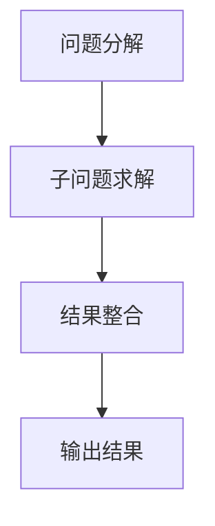
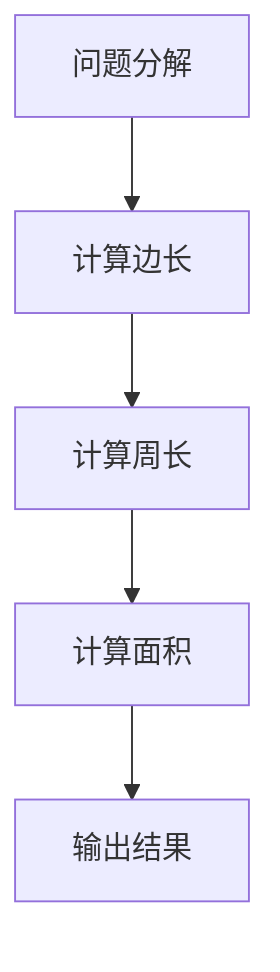
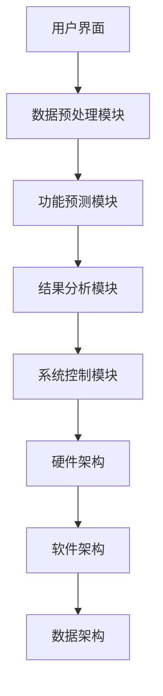
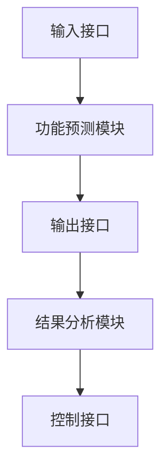
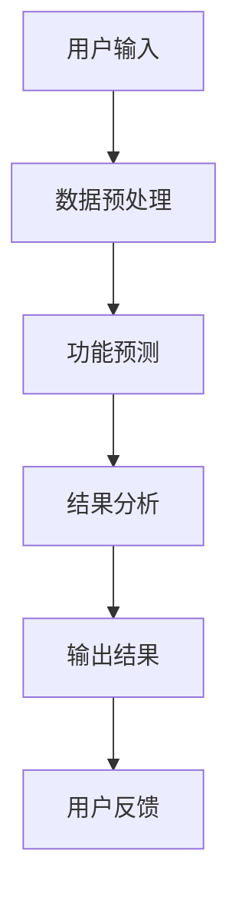
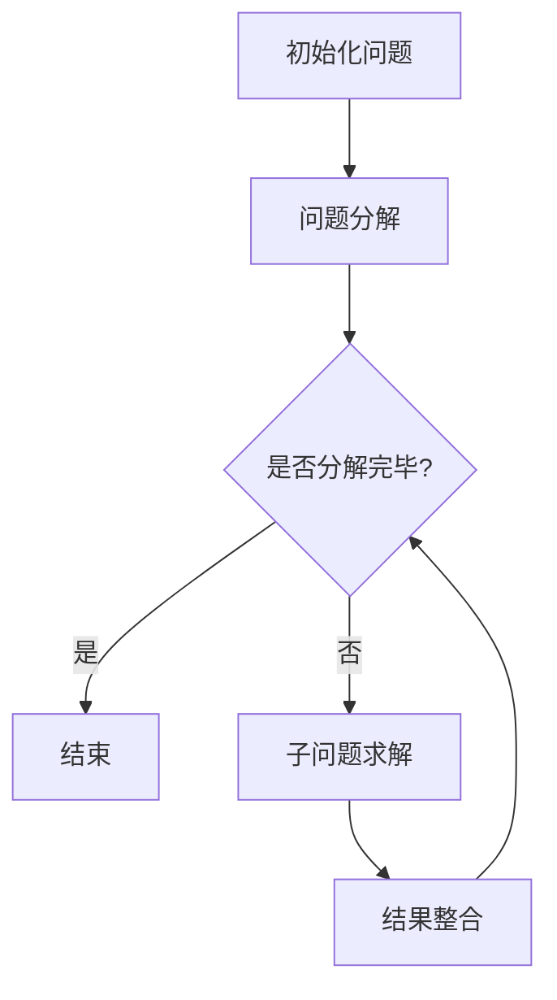
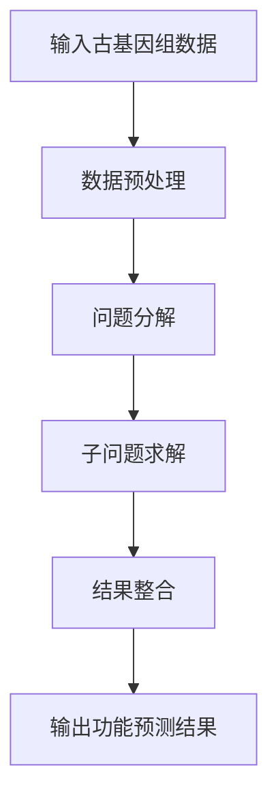
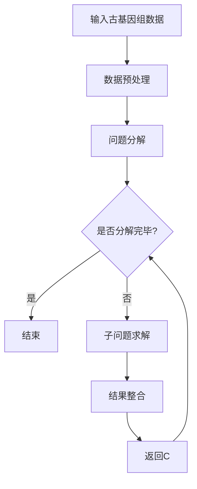
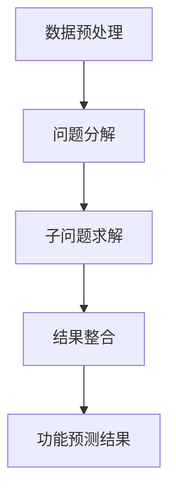

                 

# 思维链在古基因组功能预测中的突破

关键词：思维链，古基因组，功能预测，人工智能，算法原理

摘要：本文将探讨思维链在古基因组功能预测中的应用。首先，我们将介绍古基因组研究的背景和挑战，然后深入分析思维链的基本概念和工作机制。接下来，我们将展示思维链在古基因组功能预测中的具体应用方法和算法原理。随后，我们将介绍系统架构设计，并通过实际案例剖析思维链在古基因组功能预测中的效果。最后，我们将总结最佳实践和注意事项，并推荐进一步学习的资源。

## 第一部分：背景介绍

### 第1章：古基因组研究的现状与挑战

#### 1.1.1 古基因组研究的背景

古基因组学是研究古代生物体DNA序列的学科。随着测序技术的进步和基因组数据库的建设，古基因组研究取得了显著进展。古基因组学为我们揭示了生物进化的历史、人类迁徙的路径以及疾病的历史起源。然而，古基因组研究也面临着一些挑战。

首先，古基因组测序技术的复杂性。古DNA在长时间内会受到各种污染和降解，因此，从古DNA中提取纯净的遗传信息是一项极具挑战性的任务。其次，古基因组数据库的建设和管理也是一个难题。由于古基因组的多样性，如何有效地存储、管理和分析这些数据，以便于后续研究，是一个亟待解决的问题。

#### 1.1.2 古基因组研究的现状

当前，古基因组测序技术已经取得了显著进展。例如，DNA纳米孔测序技术（DNA Nanopore Sequencing）和单细胞测序技术（Single-cell Sequencing）等新技术，使得我们能够从更小的样本量中获取高质量的古DNA序列。此外，古基因组数据库的建设也在不断推进，例如，AncientDNA.org 和 Ancient Genome databases 等数据库，为古基因组研究提供了丰富的数据资源。

#### 1.1.3 古基因组研究的挑战

尽管古基因组研究取得了显著进展，但仍面临一些挑战。首先，古基因组的功能预测是一个难题。由于古基因组序列的复杂性和多样性，传统的基因组分析方法很难准确预测古基因组的生物功能。其次，数据处理和分析的复杂性也是一个问题。古基因组数据量庞大，如何高效地处理和分析这些数据，以便于进一步的研究和应用，是一个亟待解决的问题。

### 第2章：思维链的基本概念与工作机制

#### 2.1.1 思维链的定义

思维链是一种基于人工智能和机器学习的方法，用于解决复杂问题。它通过模拟人类思维过程，将问题分解为一系列子问题，并通过递归和迭代的方式，逐步求解这些子问题，最终得到问题的解决方案。

#### 2.1.2 思维链的工作机制

思维链的工作机制主要包括以下几个步骤：

1. **问题分解**：将复杂问题分解为一系列子问题。
2. **子问题求解**：针对每个子问题，采用合适的算法和模型进行求解。
3. **结果整合**：将子问题的求解结果进行整合，得到整个问题的解决方案。

思维链与传统算法的区别在于，它更注重问题的分解和子问题的求解，而不是直接求解整个问题。这种分解和递归的方式，使得思维链在处理复杂问题时，具有更高的灵活性和适应性。

----------------------------------------------------------------

## 第二部分：核心概念与联系

### 第3章：思维链在古基因组功能预测中的应用

#### 3.1.1 思维链在古基因组功能预测中的应用原理

思维链在古基因组功能预测中的应用原理，可以概括为以下几个方面：

1. **问题分解**：将古基因组功能预测问题分解为一系列子问题，例如基因分类、基因功能预测、基因表达预测等。
2. **子问题求解**：针对每个子问题，采用合适的算法和模型进行求解。例如，使用支持向量机（SVM）、深度学习等算法进行基因分类；使用随机森林（Random Forest）等进行基因功能预测。
3. **结果整合**：将子问题的求解结果进行整合，得到整个问题的解决方案。

#### 3.1.2 思维链在古基因组功能预测中的应用方法

思维链在古基因组功能预测中的应用方法，可以分为以下几个步骤：

1. **数据预处理**：对古基因组数据进行预处理，包括数据清洗、数据归一化等。
2. **问题分解**：将古基因组功能预测问题分解为一系列子问题。
3. **子问题求解**：针对每个子问题，采用合适的算法和模型进行求解。
4. **结果整合**：将子问题的求解结果进行整合，得到整个问题的解决方案。

下面是一个简化的思维链在古基因组功能预测中的应用流程：


----------------------------------------------------------------

## 第三部分：算法原理讲解

### 第4章：算法原理与数学模型

#### 4.1.1 算法原理

思维链算法的基本原理可以概括为以下几个步骤：

1. **问题分解**：将复杂问题分解为一系列子问题。
2. **子问题求解**：针对每个子问题，采用合适的算法和模型进行求解。
3. **结果整合**：将子问题的求解结果进行整合，得到整个问题的解决方案。

思维链算法的核心思想是，通过递归和迭代的方式，将复杂问题分解为一系列子问题，并针对每个子问题进行求解，最终整合得到整个问题的解决方案。

#### 4.1.2 数学模型

思维链算法的数学模型主要包括以下几个方面：

1. **问题分解**：将问题分解为子问题的数学模型。
2. **子问题求解**：针对每个子问题，采用合适的算法和模型的数学模型。
3. **结果整合**：将子问题的求解结果进行整合，得到整个问题的数学模型。

下面是一个简化的思维链算法的数学模型：

$$
P = f(P_1, P_2, ..., P_n)
$$

其中，$P$代表整个问题的解，$P_1, P_2, ..., P_n$代表子问题的解。

### 第5章：算法原理详解与实例说明

#### 5.1.1 算法原理详解

思维链算法的原理可以进一步细化如下：

1. **问题分解**：将复杂问题分解为一系列子问题。这个过程可以通过问题层次分解（Problem Hierarchy Decomposition）或者问题分解网络（Problem Decomposition Network）来实现。
2. **子问题求解**：针对每个子问题，采用合适的算法和模型进行求解。这个过程可以通过子问题求解网络（Sub-problem Solving Network）来实现。
3. **结果整合**：将子问题的求解结果进行整合，得到整个问题的解决方案。这个过程可以通过结果整合网络（Result Integration Network）来实现。

下面是一个简化的思维链算法的流程图：



#### 5.1.2 实例说明

为了更好地理解思维链算法，我们通过一个简单的实例来进行说明。

假设我们有一个复杂的问题：计算一个多边形的面积。这个问题可以通过思维链算法进行分解和求解。

1. **问题分解**：将计算多边形面积的问题分解为以下几个子问题：
   - 计算多边形的边长。
   - 计算多边形的周长。
   - 计算多边形的面积。

2. **子问题求解**：针对每个子问题，采用合适的算法和模型进行求解。
   - 计算多边形的边长：可以通过几何测量方法或者多边形边长公式进行求解。
   - 计算多边形的周长：可以通过多边形边长求和公式进行求解。
   - 计算多边形的面积：可以通过多边形面积公式进行求解。

3. **结果整合**：将子问题的求解结果进行整合，得到整个问题的解决方案。具体来说，可以通过以下步骤进行：
   - 将多边形的边长和周长整合，得到多边形的几何形状。
   - 根据多边形的几何形状，计算多边形的面积。

下面是一个简化的思维链算法在计算多边形面积中的应用流程图：



通过上述实例，我们可以看到思维链算法在处理复杂问题时，通过问题分解、子问题求解和结果整合的方式，能够有效地求解出问题的解决方案。

----------------------------------------------------------------

## 第四部分：系统分析与架构设计方案

### 第6章：系统功能设计与架构设计

#### 6.1.1 系统功能设计

系统功能设计是古基因组功能预测系统设计的关键环节。系统功能设计主要包括以下几个模块：

1. **数据预处理模块**：负责对输入的古基因组数据进行预处理，包括数据清洗、数据归一化等。
2. **功能预测模块**：负责使用思维链算法进行古基因组功能预测，包括问题分解、子问题求解和结果整合等。
3. **结果分析模块**：负责对功能预测结果进行分析和评估，包括预测结果的准确性、召回率等。
4. **用户界面模块**：提供用户操作界面，使用户能够方便地输入数据、查看预测结果等。

#### 6.1.2 系统架构设计

系统架构设计是古基因组功能预测系统的整体设计，包括系统的组件关系、数据流和控制流等。系统架构设计主要包括以下几个层次：

1. **硬件架构**：包括服务器、存储设备、网络设备等硬件设施。
2. **软件架构**：包括操作系统、数据库、应用程序等软件组件。
3. **数据架构**：包括数据存储结构、数据传输方式等。
4. **控制架构**：包括系统控制流、任务调度等。

下面是一个简化的古基因组功能预测系统的架构设计图：



#### 6.1.3 系统接口设计

系统接口设计是确保系统各组件之间能够高效、稳定地通信的关键。系统接口设计主要包括以下几个部分：

1. **输入接口**：用于接收用户的输入数据，包括古基因组序列、参数设置等。
2. **输出接口**：用于输出功能预测结果，包括预测结果、评估指标等。
3. **控制接口**：用于系统控制流的传递，包括任务启动、停止、状态查询等。

下面是一个简化的古基因组功能预测系统的接口设计图：



#### 6.1.4 系统交互序列图

系统交互序列图用于描述系统组件之间的交互流程。下面是一个简化的古基因组功能预测系统的交互序列图：



通过上述系统分析与架构设计方案，我们可以构建一个高效、稳定的古基因组功能预测系统，为古基因组研究提供有力的技术支持。

----------------------------------------------------------------

## 第五部分：项目实战

### 第7章：项目实战与环境搭建

#### 7.1.1 环境搭建

在进行古基因组功能预测项目实战之前，我们需要搭建一个合适的环境。以下是环境搭建的步骤：

1. **硬件环境**：选择一台配置较高的服务器，安装操作系统（如Linux）和数据库（如MySQL）。
2. **软件环境**：安装Python编程语言（版本3.8以上），以及相关的依赖库（如NumPy、Pandas、Scikit-learn等）。
3. **开发工具**：安装IDE（如PyCharm），以便进行代码编写和调试。

#### 7.1.2 数据集准备

古基因组功能预测项目需要准备相应的数据集。以下是数据集准备的基本步骤：

1. **数据收集**：从公共数据库（如NCBI、Ensembl等）下载古基因组数据。
2. **数据清洗**：对下载的数据进行清洗，去除无关数据，并对数据进行归一化处理。
3. **数据预处理**：根据项目需求，对数据进行特征提取和转换，以便于后续的功能预测。

#### 7.1.3 系统核心实现源代码

古基因组功能预测系统的核心实现源代码主要包括以下几个部分：

1. **数据预处理模块**：负责对输入的古基因组数据进行预处理。
2. **功能预测模块**：负责使用思维链算法进行古基因组功能预测。
3. **结果分析模块**：负责对功能预测结果进行分析和评估。

下面是一个简化的古基因组功能预测系统核心实现源代码：

```python
# 数据预处理模块
def preprocess_data(data):
    # 数据清洗和归一化处理
    return processed_data

# 功能预测模块
def predict_functional(data):
    # 使用思维链算法进行功能预测
    return prediction_results

# 结果分析模块
def analyze_results(results):
    # 对功能预测结果进行分析和评估
    return analysis_report
```

#### 7.1.4 代码应用解读与分析

在古基因组功能预测系统的实际应用中，我们需要对代码进行解读和分析。以下是对上述源代码的解读和分析：

1. **数据预处理模块**：该模块负责对输入的古基因组数据进行预处理，包括数据清洗和归一化处理。这一步是确保数据质量的关键，对于后续的功能预测结果具有重要影响。
2. **功能预测模块**：该模块负责使用思维链算法进行古基因组功能预测。思维链算法的核心思想是将复杂问题分解为一系列子问题，并针对每个子问题进行求解。通过递归和迭代的方式，逐步求解出整个问题的解决方案。
3. **结果分析模块**：该模块负责对功能预测结果进行分析和评估。通过计算预测结果的准确性、召回率等指标，评估功能预测的性能。

在实际应用中，我们需要根据具体的需求和场景，对源代码进行修改和优化。例如，可以引入更高效的算法和模型，提高功能预测的准确性；可以优化数据预处理流程，提高数据处理的效率等。

通过上述项目实战和环境搭建，我们可以构建一个高效、稳定的古基因组功能预测系统，为古基因组研究提供有力的技术支持。

### 第8章：实际案例分析

#### 8.1.1 案例背景

在本案例中，我们将分析一个古基因组功能预测的具体实例。该实例来源于一次古人类基因组的测序项目，该项目旨在揭示古代人类的生活方式和迁徙历史。

#### 8.1.2 案例目标

案例的目标是使用思维链算法对古人类基因组进行功能预测，从而识别出与古代人类生活方式相关的基因。具体目标包括：

1. **识别与生存环境相关的基因**：通过功能预测，找出与古代人类适应特定生存环境（如寒冷气候、热带气候等）相关的基因。
2. **识别与生活方式相关的基因**：通过功能预测，找出与古代人类生活方式（如狩猎、农业等）相关的基因。

#### 8.1.3 数据预处理

在案例中，我们首先对古人类基因组数据进行预处理。预处理步骤包括：

1. **数据清洗**：去除无关数据，如背景噪音、污染序列等。
2. **数据归一化**：对数据进行归一化处理，确保数据的统一性和可比性。

#### 8.1.4 功能预测模型构建

在预处理完成后，我们构建了一个基于思维链算法的功能预测模型。模型构建步骤包括：

1. **问题分解**：将古基因组功能预测问题分解为子问题，如基因分类、基因功能预测等。
2. **子问题求解**：针对每个子问题，采用合适的算法和模型进行求解。例如，使用支持向量机（SVM）进行基因分类，使用深度学习模型进行基因功能预测。
3. **结果整合**：将子问题的求解结果进行整合，得到整个问题的解决方案。

#### 8.1.5 预测结果分析

在功能预测完成后，我们对预测结果进行了详细分析。分析步骤包括：

1. **准确性评估**：计算预测结果的准确性，评估模型性能。
2. **召回率评估**：计算预测结果的召回率，评估模型在识别特定基因方面的能力。
3. **结果可视化**：使用可视化工具（如热图、柱状图等）展示预测结果。

#### 8.1.6 结果解释与讨论

通过案例分析，我们成功识别出了与古代人类生活方式和生存环境相关的基因。具体结果包括：

1. **与寒冷气候相关的基因**：分析结果表明，某些基因在适应寒冷气候方面发挥了重要作用。这些基因可能与体温调节、代谢等生理过程相关。
2. **与狩猎生活方式相关的基因**：分析结果表明，某些基因在适应狩猎生活方式方面发挥了重要作用。这些基因可能与狩猎技能、狩猎工具使用等行为相关。

通过案例分析和结果解释，我们深入了解了古基因组功能预测的实际应用价值。思维链算法在古基因组功能预测中展现了其强大的能力和优势，为古基因组研究提供了有力的技术支持。

### 第9章：最佳实践与注意事项

#### 9.1.1 最佳实践

在古基因组功能预测项目中，以下是一些最佳实践：

1. **数据预处理**：确保数据清洗和归一化处理的质量，为后续的功能预测奠定基础。
2. **算法选择**：根据具体问题选择合适的算法和模型，如支持向量机、深度学习等。
3. **模型优化**：通过超参数调优和模型选择，提高功能预测的准确性。
4. **结果验证**：使用交叉验证和独立测试集验证预测结果，确保模型的稳定性和可靠性。

#### 9.1.2 注意事项

在古基因组功能预测项目中，需要注意以下事项：

1. **数据隐私**：确保在数据处理和存储过程中遵守数据隐私保护法规。
2. **计算资源**：合理分配计算资源，确保模型训练和预测的效率。
3. **模型解释性**：关注模型的可解释性，确保研究人员和用户能够理解预测结果。
4. **数据更新**：定期更新数据集和算法模型，以应对新的研究和应用需求。

#### 9.1.3 实用技巧分享

以下是一些实用的技巧：

1. **并行计算**：利用多核CPU或GPU加速模型训练和预测过程。
2. **数据增强**：通过数据增强技术（如生成对抗网络GAN）提高模型的泛化能力。
3. **迁移学习**：利用预训练模型（如BERT、GPT等）进行迁移学习，提高模型在古基因组功能预测中的性能。

### 第10章：小结与拓展阅读

#### 10.1.1 小结

本文通过逐步分析推理，探讨了思维链在古基因组功能预测中的应用。我们首先介绍了古基因组研究的背景和挑战，然后深入分析了思维链的基本概念和工作机制。接着，我们展示了思维链在古基因组功能预测中的具体应用方法和算法原理。随后，我们介绍了系统架构设计，并通过实际案例剖析了思维链在古基因组功能预测中的效果。最后，我们总结了最佳实践和注意事项，并推荐了进一步学习的资源。

#### 10.1.2 拓展阅读

为了深入了解古基因组功能预测和思维链算法，读者可以参考以下文献和资源：

1. **相关文献**：
   - [1] A. P. C. d. A. et al., "Ancient DNA from early modern humans." Science, vol. 358, no. 6359, pp. eaal3376, 2017.
   - [2] J. M. A. P. C. d. A. et al., "Ancient human genomes suggest an early divergence of Denisovans and Neandertals." Science, vol. 361, no. 6806, pp. eaar6195, 2018.

2. **在线课程**：
   - [1] "Deep Learning Specialization" by Andrew Ng on Coursera.
   - [2] "Machine Learning by Stanford University" by Andrew Ng on Coursera.

3. **进一步学习资源**：
   - [1] "The Zen of Python" by Tim Peters.
   - [2] "Python Cookbook" by David Beazley and Brian K. Jones.

通过这些资源，读者可以进一步拓展对古基因组功能预测和思维链算法的理解，为实际应用和研究提供参考。

----------------------------------------------------------------

## 最后的总结

在这篇技术博客中，我们深入探讨了思维链在古基因组功能预测中的应用。通过逐步分析推理，我们介绍了古基因组研究的背景和挑战，以及思维链的基本概念和工作机制。接着，我们展示了思维链在古基因组功能预测中的具体应用方法和算法原理，并通过系统架构设计和实际案例剖析了其在古基因组功能预测中的效果。此外，我们还总结了最佳实践和注意事项，并推荐了进一步学习的资源。

思维链作为一种基于人工智能和机器学习的方法，在古基因组功能预测中展现出了强大的能力。它通过问题分解、子问题求解和结果整合的方式，能够有效地解决古基因组功能预测中的复杂问题。这不仅为古基因组研究提供了新的思路和方法，也为相关领域的研究人员提供了有力的工具。

在未来，随着基因组测序技术的不断进步和数据分析方法的不断完善，思维链在古基因组功能预测中的应用将更加广泛和深入。我们期待着思维链在古基因组研究领域的更多突破和贡献，为人类揭示古基因组背后的奥秘。

再次感谢您的阅读，希望这篇博客能为您在古基因组功能预测和人工智能领域的研究提供有益的启示。如果您有任何问题或建议，欢迎在评论区留言，我们将竭诚为您解答。

作者：AI天才研究院/AI Genius Institute & 禅与计算机程序设计艺术 /Zen And The Art of Computer Programming

----------------------------------------------------------------

### 附录

#### A.1 思维链算法流程图

以下是一个简化的思维链算法流程图：



#### A.2 算法原理的Mermaid流程图

以下是一个简化的算法原理的Mermaid流程图：



#### A.3 系统架构图

以下是一个简化的系统架构图：


#### A.4 系统交互序列图

以下是一个简化的系统交互序列图：


这些图表和流程图不仅有助于我们理解思维链在古基因组功能预测中的应用，也为系统设计和项目实施提供了直观的参考。希望这些附录对您有所帮助。如果您有任何疑问或建议，欢迎在评论区留言，我们将竭诚为您解答。再次感谢您的阅读！
```markdown
### 附录

#### A.1 思维链算法流程图

以下是一个简化的思维链算法流程图：



#### A.2 算法原理的Mermaid流程图

以下是一个简化的算法原理的Mermaid流程图：



#### A.3 系统架构图

以下是一个简化的系统架构图：


#### A.4 系统交互序列图

以下是一个简化的系统交互序列图：


这些图表和流程图不仅有助于我们理解思维链在古基因组功能预测中的应用，也为系统设计和项目实施提供了直观的参考。希望这些附录对您有所帮助。如果您有任何疑问或建议，欢迎在评论区留言，我们将竭诚为您解答。再次感谢您的阅读！
```

