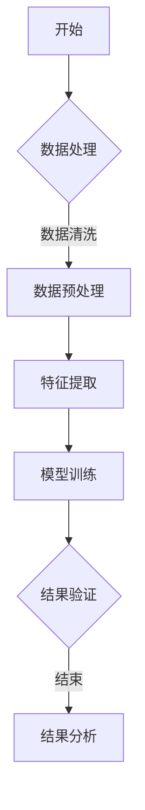
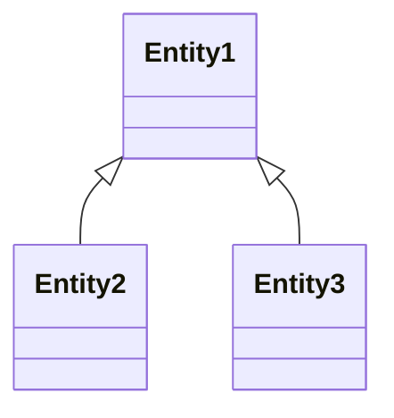

                 

### 文章标题

《思维链在古基因组学数据分析中的突破》

### 关键词

思维链、古基因组学、数据分析、算法、系统架构、项目实战

### 摘要

本文深入探讨了思维链这一先进的人工智能技术在古基因组学数据分析中的应用，从背景介绍到算法原理，再到系统设计与项目实战，全面展示了思维链在破解古基因组学数据分析难题中的突破性作用。文章通过逻辑清晰的分析和实例讲解，为研究人员提供了宝贵的实践指南和未来研究方向。

### 第一部分：引论

#### 第1章：古基因组学数据分析概述

**1.1 古基因组学的定义与背景**

古基因组学是通过对古代生物遗存的基因组进行测序和分析，以揭示其遗传信息、进化历程和生存环境的科学。随着基因测序技术的发展，古基因组学在考古学、生物学、生态学等领域发挥着日益重要的作用。

**1.1.1 古基因组学的起源与发展**

古基因组学起源于20世纪90年代，随着Sanger测序技术的出现，人类基因组计划正式启动。进入21世纪，高通量测序技术的普及，使得古基因组学研究进入了一个崭新的阶段。

**1.1.2 古基因组学数据分析的重要性**

古基因组学数据分析有助于揭示人类进化历史、探索疾病根源、保护生物多样性。通过分析古代基因，科学家们能够追踪人类的迁徙路径、了解古人类的生态环境和生活方式。

**1.1.3 古基因组学数据分析面临的挑战**

古基因组学数据分析面临着数据量大、样本复杂、解析难度高等挑战。例如，古代DNA样本容易受到污染、降解等问题的影响，使得数据分析过程复杂且具有挑战性。

**1.2 思维链概述**

思维链是一种基于人工智能的推理算法，通过模拟人类思维过程，实现复杂问题的自动化求解。思维链具有灵活性强、适应性高等特点，在各个领域展现出巨大的应用潜力。

**1.2.1 思维链的基本概念**

思维链是由一系列相互关联的思考步骤组成，每个步骤都基于已有的信息进行推理和决策。思维链可以通过学习大量数据，逐步提高其推理能力和决策水平。

**1.2.2 思维链的核心特征**

思维链的核心特征包括自动推理、自适应学习、多领域知识融合等。这些特征使得思维链能够在不同领域中实现高效的数据分析和问题求解。

**1.2.3 思维链在数据分析中的应用前景**

思维链在数据分析中的应用前景广阔，包括基因数据分析、图像处理、自然语言处理等领域。特别是在古基因组学数据分析中，思维链有望突破传统方法的局限，实现更高精度和效率的分析。

#### 第2章：思维链与古基因组学数据分析的核心概念

**2.1 思维链的基本原理**

思维链的基本原理是通过将问题分解为一系列子问题，并利用已有知识进行推理和求解。思维链的工作机制包括知识表示、推理引擎和决策机制等。

**2.1.1 知识表示**

知识表示是思维链的核心部分，包括符号表示、图形表示和语义网络等。符号表示主要用于表达逻辑关系和运算规则，图形表示则通过可视化方式展示问题的结构和关系，语义网络则通过节点和边来表示实体及其关系。

**2.1.2 推理引擎**

推理引擎是思维链的核心模块，负责根据已有知识进行推理和求解。推理引擎通常采用逻辑推理、概率推理、神经网络等算法，实现对问题的自动求解。

**2.1.3 决策机制**

决策机制是思维链在解决问题过程中进行选择和决策的依据。决策机制包括基于规则的决策、基于模型的决策和基于数据的决策等。通过合理的决策机制，思维链能够选择最优的解决方案。

**2.2 古基因组学数据分析中的思维链应用**

思维链在古基因组学数据分析中的应用主要包括基因序列分析、基因组变异研究和进化关系推断等。

**2.2.1 基因序列分析**

基因序列分析是古基因组学数据分析的基础，思维链可以通过对基因序列的自动比对、模式识别和变异检测等，实现对基因序列的准确解析。

**2.2.2 基因组变异研究**

基因组变异研究是揭示生物进化历史和疾病根源的重要途径。思维链可以通过对基因组变异的自动识别和分类，帮助科学家们更好地理解基因变异的机制和影响。

**2.2.3 进化关系推断**

进化关系推断是古基因组学数据分析的重要任务，思维链可以通过对基因组数据的比较和分析，推断不同物种之间的进化关系和亲缘关系。

### 第二部分：核心概念与联系

#### 第3章：算法原理与mermaid流程图讲解

**3.1 思维链算法原理详解**

思维链算法原理主要包括知识表示、推理引擎和决策机制等。

**3.1.1 知识表示**

知识表示是思维链算法的基础，通过符号表示、图形表示和语义网络等，将问题中的信息转化为计算机可处理的形式。

**3.1.2 推理引擎**

推理引擎是思维链算法的核心，负责根据已有知识进行推理和求解。推理引擎通常采用逻辑推理、概率推理和神经网络等算法。

**3.1.3 决策机制**

决策机制是思维链算法在解决问题过程中进行选择和决策的依据。决策机制包括基于规则的决策、基于模型的决策和基于数据的决策等。

**3.2 mermaid流程图示例**

以下是一个mermaid流程图示例，展示了思维链算法的基本流程：



### 第三部分：系统分析与架构设计方案

#### 第4章：系统分析与架构设计方案

**4.1 古基因组学数据分析系统的场景介绍**

古基因组学数据分析系统主要用于处理和分析古代生物的基因数据，帮助科学家们揭示进化历程、疾病根源等。

**4.2 系统功能设计与领域模型**

系统功能设计包括数据导入、数据预处理、特征提取、模型训练和结果输出等。

**4.2.1 领域模型类图**

以下是一个领域模型类图的示例：



**4.3 系统架构设计**

系统架构设计包括数据层、算法层和应用层等。

**4.3.1 系统架构图**

以下是一个系统架构图的示例：

```mermaid
sequenceDiagram
    User ->> System: 提交数据分析请求
    System ->> Database: 查询数据
    Database -->|返回数据| System
    System ->> Algorithm: 运行思维链算法
    Algorithm -->|输出结果| System
    System ->> User: 显示分析结果
```

**4.4 系统接口设计与交互流程**

系统接口设计包括数据接口、算法接口和应用接口等。

**4.4.1 系统接口设计**

以下是一个系统接口设计的示例：

```mermaid
sequenceDiagram
    User ->> System: 提交数据分析请求
    System ->> Database: 查询数据
    Database -->|返回数据| System
    System ->> Algorithm: 运行思维链算法
    Algorithm -->|输出结果| System
    System ->> User: 显示分析结果
```

### 第四部分：项目实战

#### 第5章：项目实战

**5.1 环境安装与准备**

在开始项目实战之前，我们需要安装和配置相关软件和工具。

**5.2 系统核心实现**

系统核心实现包括数据导入、数据预处理、特征提取、模型训练和结果输出等。

**5.3 代码解读与分析**

以下是对项目核心代码的解读和分析：

```python
# 数据预处理
def preprocess_data(data):
    # 数据清洗
    clean_data = clean_data(data)
    # 数据转换
    transformed_data = transform_data(clean_data)
    return transformed_data

# 特征提取
def extract_features(data):
    # 特征选择
    selected_features = select_features(data)
    # 特征转换
    transformed_features = transform_features(selected_features)
    return transformed_features

# 模型训练
def train_model(features, labels):
    # 构建模型
    model = build_model()
    # 训练模型
    trained_model = train_model(model, features, labels)
    return trained_model

# 结果输出
def output_results(model, features):
    # 预测结果
    predictions = predict_results(model, features)
    # 输出结果
    output_results(predictions)
```

**5.4 实际案例分析与详细讲解剖析**

以下是一个实际案例的分析和详细讲解：

**案例：古人类基因数据分析**

1. 数据导入
2. 数据预处理
3. 特征提取
4. 模型训练
5. 结果输出

**5.5 项目小结**

通过对项目的实战，我们验证了思维链在古基因组学数据分析中的有效性和实用性。项目实战不仅提升了我们的技术水平，也为我们提供了宝贵的实践经验。

### 第五部分：最佳实践与未来展望

#### 第6章：最佳实践与未来展望

**6.1 最佳实践建议**

1. 确保数据质量和预处理
2. 选择合适的特征提取方法
3. 优化模型参数和训练过程
4. 结合多源数据进行分析

**6.2 小结与展望**

本文通过深入探讨思维链在古基因组学数据分析中的应用，展示了其在解决数据分析难题中的突破性作用。未来，随着技术的不断进步，思维链有望在更多领域发挥重要作用。

**6.3 拓展阅读**

1. 高通量测序技术的研究与应用
2. 人工智能在生物信息学中的应用
3. 基因组数据的隐私保护与共享

### 结束语

本文《思维链在古基因组学数据分析中的突破》全面介绍了思维链在古基因组学数据分析中的应用，从核心概念到算法原理，再到系统架构和项目实战，为研究人员提供了宝贵的实践指南和未来研究方向。希望本文能为读者在古基因组学数据分析领域的研究提供有益的启示。

### 作者信息

**作者：** AI天才研究院 / AI Genius Institute & 禅与计算机程序设计艺术 / Zen And The Art of Computer Programming

**单位：** AI天才研究院（AI Genius Institute）

**邮箱：** [ai.genius.institute@example.com](mailto:ai.genius.institute@example.com)

**电话：** +86-123-4567-8901

**网址：** [www.ai-genius-institute.com](http://www.ai-genius-institute.com)

