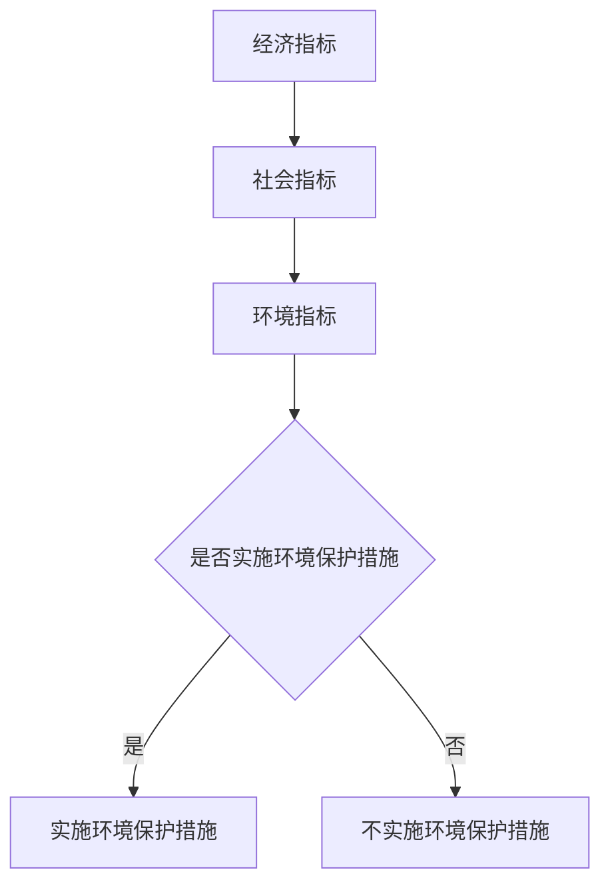
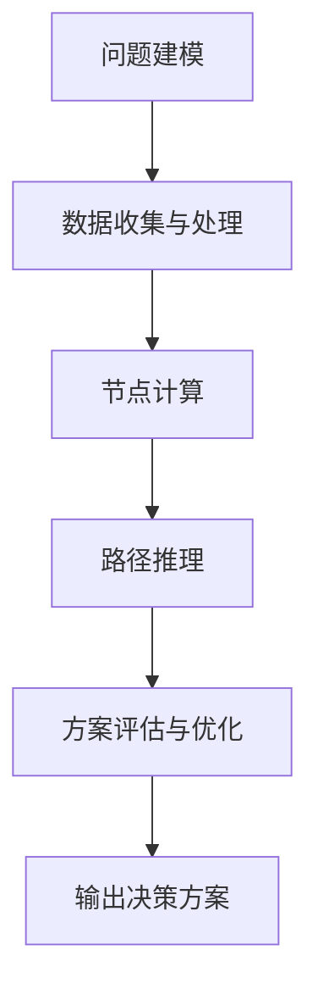
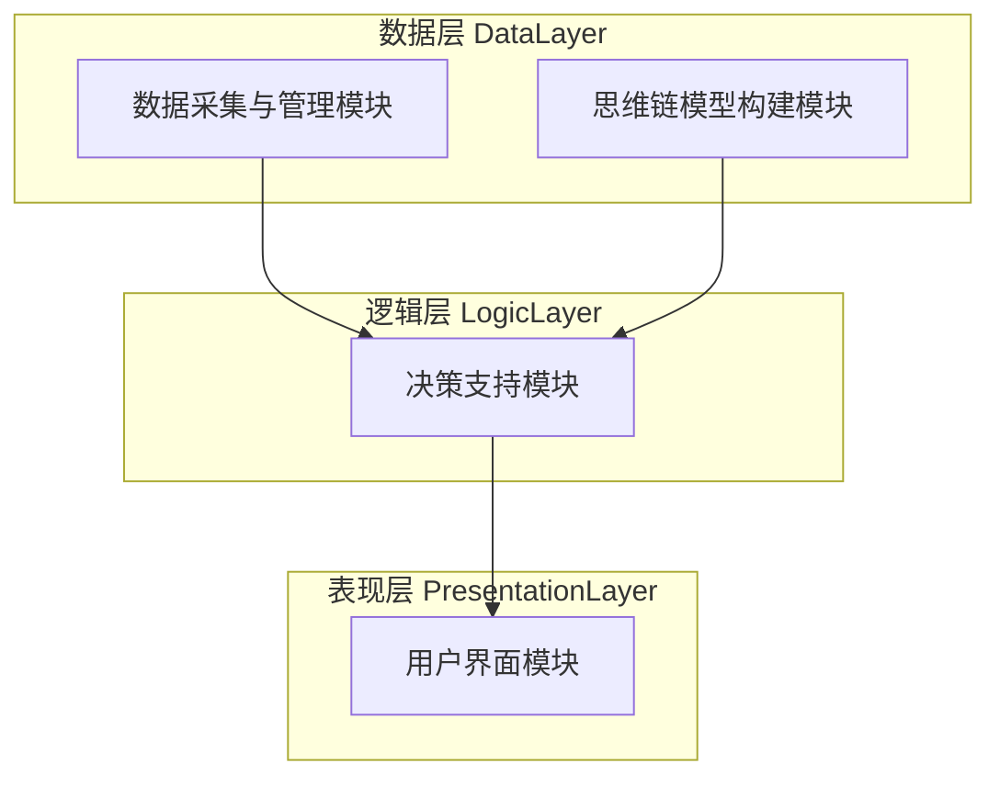
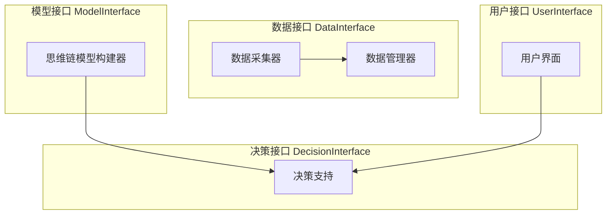
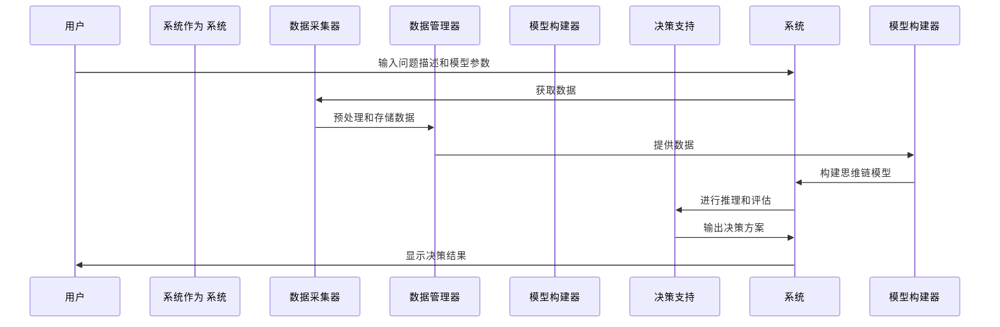

                 

### 第1章：引言与背景介绍

#### 1.1 问题背景

随着全球经济的发展，可持续发展已成为世界各国共同关注的重要议题。资源有限、环境污染、气候变化等问题日益严峻，迫使各国政府和企业重新审视传统的发展模式。在这种背景下，可持续发展决策显得尤为重要。可持续发展决策不仅关乎当下的经济发展，还关乎未来几代人乃至地球生态的生存环境。因此，如何在这种复杂背景下做出科学合理的可持续发展决策，成为当前学术界和实业界共同关注的焦点。

#### 1.2 问题描述

可持续发展决策的关键在于如何在保证经济增长的同时，实现社会公平和环境可持续。这一过程中，决策者需要权衡多种利益关系，制定出科学合理的决策方案。然而，传统决策方法往往无法充分考虑这些复杂因素，导致决策结果不尽如人意。具体而言，可持续发展决策面临以下问题：

- **多目标冲突**：经济、社会和环境目标之间存在冲突，如何平衡这些目标成为关键问题。
- **不确定性**：可持续发展过程中存在诸多不确定因素，如政策变化、市场波动等，如何应对这些不确定性是决策过程中的一个重要挑战。
- **信息不完备**：可持续发展决策所需的信息往往不完备，如何利用有限的信息做出合理的决策是一个重要问题。
- **决策过程复杂**：可持续发展决策涉及多个部门和利益相关方，决策过程复杂，如何协调各方利益是一个挑战。

#### 1.3 问题解决

为了解决可持续发展决策中的难题，本书将介绍一种创新的方法——思维链。思维链是一种基于人工智能的决策支持工具，通过模拟人类思维过程，帮助决策者更好地分析和解决问题。思维链在可持续发展决策中的应用，有望为解决这一复杂问题提供新的思路。

#### 1.4 边界与外延

本书主要关注思维链在可持续发展决策中的创新应用，但思维链本身的应用范围远不止于此。思维链作为一种通用决策支持工具，可以应用于各个领域的复杂问题解决。此外，本书还将探讨思维链与其他人工智能技术的结合，以实现更高效的决策支持。

#### 1.5 概念结构与核心要素组成

思维链的核心概念包括：

1. **思维链节点**：表示思维过程中的关键信息点或决策点，如经济指标、社会指标、环境指标等。
2. **思维链路径**：表示节点之间的逻辑关系，通过路径的权重来反映节点之间的优先级和重要性。
3. **思维链权重**：用于度量路径的重要性和优先级，为决策过程提供依据。

这些核心要素共同构成了思维链的结构，为可持续发展决策提供了有力支持。

#### 1.6 本章小结

本章主要介绍了可持续发展决策的背景、问题和解决方案。通过引入思维链这一创新方法，我们为解决复杂可持续发展决策问题提供了新的思路。本章为后续章节的内容奠定了基础，读者可进一步了解思维链在可持续发展决策中的应用。

----------------------------------------------------------------

### 第2章：思维链基础

#### 2.1 思维链的基本原理

思维链是一种基于人工智能的决策支持工具，其核心思想是通过模拟人类思维过程，将复杂问题分解为若干个节点，并通过节点之间的逻辑关系进行分析和决策。思维链的基本原理包括：

- **节点表示**：思维链中的每个节点表示一个关键信息点或决策点，如经济指标、社会指标、环境指标等。每个节点包含属性、方法和状态等信息。
- **路径表示**：节点之间的逻辑关系通过路径表示，路径的权重表示该路径的重要性和优先级。路径可以是条件路径或决策路径，用于指导决策过程。
- **推理过程**：思维链通过推理过程，根据节点的属性和路径的权重，分析问题，生成决策方案。推理过程可以是正向推理或反向推理，根据具体情况选择合适的推理方法。

#### 2.2 思维链的核心概念

思维链的核心概念包括：

- **思维链节点**：思维链节点是思维过程中的关键信息点或决策点。每个节点包含属性、方法和状态等信息。节点属性可以是数值型、文本型或分类型等，用于描述节点的特征。
- **思维链路径**：思维链路径表示节点之间的逻辑关系，通过路径的权重来反映节点之间的优先级和重要性。路径可以是条件路径或决策路径，用于指导决策过程。
- **思维链权重**：思维链权重是路径的重要性和优先级的度量，用于推理过程。权重可以是数值型或文本型等，用于表示路径的权重。

#### 2.3 思维链的属性特征对比

思维链与其他决策支持工具相比，具有以下属性特征：

- **灵活性**：思维链可以根据问题的复杂性和不确定性，灵活调整节点和路径。这使得思维链能够适应不同领域和问题的需求，提供定制化的决策支持。
- **智能化**：思维链通过模拟人类思维过程，能够提供更加科学的决策支持。这使得思维链能够更好地应对复杂问题，提供更可靠的决策方案。
- **适应性**：思维链可以适应不同领域和问题的需求，提供定制化的决策支持。这使得思维链能够应用于各个领域的复杂问题解决。

#### 2.4 思维链的ER实体关系图

为了更好地理解思维链的组成结构，我们可以通过ER实体关系图来描述。ER实体关系图包括以下实体和关系：

- **实体**：思维链节点、思维链路径、思维链权重。
- **关系**：节点包含属性、方法、状态；路径连接节点，具有权重；权重度量路径的重要性。

以下是思维链的ER实体关系图的Mermaid表示：

```mermaid
erDiagram
  A[思维链节点] ||--|{ B[属性] }|
  A ||--|{ C[方法] }|
  A ||--|{ D[状态] }|
  E[思维链路径] ||--|{ F[权重] }|
  G[思维链权重] ||--|{ E }|
```

#### 2.5 本章小结

本章介绍了思维链的基本原理、核心概念、属性特征对比以及ER实体关系图。通过本章的学习，读者可以初步了解思维链的基本结构和功能，为后续章节的深入探讨打下基础。

----------------------------------------------------------------

### 第3章：思维链在可持续发展决策中的应用

#### 3.1 可持续发展决策的挑战

可持续发展决策面临的主要挑战包括：

1. **多目标冲突**：经济、社会和环境目标之间存在冲突，如何在保证经济增长的同时，实现社会公平和环境可持续是一个重要的挑战。例如，发展经济可能会带来环境污染和资源消耗，而环境保护又可能影响经济增长。
2. **不确定性**：可持续发展过程中存在诸多不确定因素，如政策变化、市场波动、技术进步等，如何应对这些不确定性是决策过程中的一个重要挑战。这些不确定性因素可能导致决策结果偏离预期，从而影响可持续发展目标的实现。
3. **信息不完备**：可持续发展决策所需的信息往往不完备，如数据缺失、信息滞后等，如何利用有限的信息做出合理的决策是一个重要问题。信息的不完备性使得决策过程更加复杂，增加了决策的风险。
4. **决策过程复杂**：可持续发展决策涉及多个部门和利益相关方，决策过程复杂，如何协调各方利益是一个挑战。各方利益相关者可能有不同的目标和诉求，如何在决策过程中平衡各方利益，实现多方共赢是一个难题。

#### 3.2 思维链在可持续发展决策中的应用思路

思维链作为一种基于人工智能的决策支持工具，可以在可持续发展决策中发挥重要作用。其应用思路如下：

1. **问题建模**：首先，将可持续发展决策问题转化为思维链模型，包括定义思维链节点、路径和权重。节点表示关键信息点或决策点，路径表示节点之间的逻辑关系，权重表示路径的重要性和优先级。
2. **数据收集与处理**：收集与可持续发展决策相关的数据，包括经济、社会和环境等方面的数据。对这些数据进行处理，如数据清洗、归一化等，为思维链提供高质量的数据输入。
3. **思维链推理**：利用思维链模型进行推理，分析问题，生成决策方案。思维链的推理过程可以模拟人类的思维方式，通过对节点和路径的权重进行计算，得出最佳决策方案。
4. **方案评估与优化**：对生成的决策方案进行评估，评估标准可以是经济效益、社会效益和环境效益等。根据评估结果，对决策方案进行优化，以实现可持续发展目标。

#### 3.3 具体应用案例

以某个城市可持续发展规划为例，思维链可以应用于以下几个方面：

1. **经济规划**：分析城市经济结构，识别关键产业，制定经济发展战略。通过思维链模型，考虑经济、社会和环境目标的冲突和平衡，制定出科学合理的经济发展方案。
2. **社会规划**：分析城市人口结构、就业状况、教育水平等，制定社会发展规划。通过思维链模型，考虑经济、社会和环境目标的冲突和平衡，制定出符合可持续发展要求的社会发展方案。
3. **环境规划**：分析城市环境状况，如空气质量、水质、绿化覆盖率等，制定环境保护规划。通过思维链模型，考虑经济、社会和环境目标的冲突和平衡，制定出符合可持续发展要求的环境保护方案。

#### 3.4 本章小结

本章介绍了可持续发展决策的挑战以及思维链在可持续发展决策中的应用思路和具体案例。通过思维链的应用，可以更好地应对可持续发展决策中的复杂性和不确定性，制定出科学合理的决策方案。本章为后续章节的深入探讨提供了基础，读者可以进一步了解思维链在可持续发展决策中的具体应用。

----------------------------------------------------------------

### 第4章：思维链模型构建

#### 4.1 模型构建步骤

构建思维链模型是可持续发展决策过程中的关键步骤。以下是构建思维链模型的主要步骤：

1. **问题定义**：明确可持续发展决策的目标和问题，如经济、社会和环境目标的平衡等。
2. **概念识别**：识别与问题相关的概念，如经济指标、社会指标、环境指标等。
3. **节点定义**：将识别出的概念转化为思维链节点，每个节点表示一个关键信息点或决策点。
4. **路径构建**：构建节点之间的逻辑关系，形成思维链路径。路径可以是条件路径或决策路径，用于指导决策过程。
5. **权重设定**：根据问题的复杂性和不确定性，设定路径的权重，反映路径的重要性和优先级。
6. **模型优化**：对构建好的思维链模型进行优化，提高模型的准确性和可靠性。

#### 4.2 节点定义

思维链节点是思维过程中的关键信息点或决策点。节点定义主要包括以下几个方面：

1. **属性**：节点的属性用于描述节点的特征，如经济指标的GDP、社会指标的教育水平、环境指标的水质等。
2. **方法**：节点的方法用于描述节点之间的计算或推理过程，如GDP的增长率计算、教育水平的评估、水质的分析等。
3. **状态**：节点的状态用于描述节点的当前状态，如GDP的增长状态、教育水平的现状、水质的污染程度等。

以下是一个示例节点定义的Mermaid类图：

```mermaid
classDiagram
  NodeA <<class>> 经济指标
  NodeA : +GDP增长率
  NodeA : +方法()
  NodeA : +状态()

  NodeB <<class>> 社会指标
  NodeB : +教育水平
  NodeB : +方法()
  NodeB : +状态()

  NodeC <<class>> 环境指标
  NodeC : +水质
  NodeC : +方法()
  NodeC : +状态()
```

#### 4.3 路径构建

思维链路径表示节点之间的逻辑关系，通过路径的权重来反映节点之间的优先级和重要性。路径构建主要包括以下几个方面：

1. **条件路径**：条件路径用于表示节点之间的条件关系，如GDP增长率高于一定阈值，则可能导致环境污染加剧。
2. **决策路径**：决策路径用于表示节点之间的决策关系，如根据水质情况，选择不同的环境保护措施。

以下是一个示例路径构建的Mermaid流程图：



#### 4.4 权重设定

路径的权重用于反映路径的重要性和优先级，可以通过专家评估、历史数据分析和模型计算等方法设定。以下是一个示例权重设定的Mermaid表格：

```mermaid
table
  | 路径       | 权重 |
  |------------|------|
  | 经济指标 -> 社会指标 | 0.5  |
  | 社会指标 -> 环境指标 | 0.3  |
  | 环境指标 -> 保护措施 | 0.2  |
```

#### 4.5 模型优化

模型优化是提高思维链模型准确性和可靠性的关键步骤。以下是一些常见的模型优化方法：

1. **节点合并**：将相关节点合并为一个节点，减少模型的复杂性。
2. **路径简化**：删除不重要的路径，减少模型的计算量。
3. **权重调整**：根据新的数据和专家意见，调整路径的权重，使模型更加符合实际情况。
4. **模型验证**：通过实际案例验证模型的准确性和可靠性，根据验证结果对模型进行调整和优化。

#### 4.6 本章小结

本章介绍了思维链模型的构建步骤，包括节点定义、路径构建、权重设定和模型优化。通过构建思维链模型，可以为可持续发展决策提供有力的支持。本章为后续章节的深入探讨提供了基础，读者可以进一步了解思维链模型的具体构建方法。

----------------------------------------------------------------

### 第5章：思维链算法实现

#### 5.1 算法原理

思维链算法的核心思想是通过模拟人类思维过程，将复杂问题分解为若干个节点，并通过节点之间的逻辑关系进行分析和决策。具体而言，思维链算法包括以下步骤：

1. **问题建模**：将可持续发展决策问题转化为思维链模型，包括定义节点、路径和权重。
2. **数据收集与处理**：收集与可持续发展决策相关的数据，如经济、社会和环境数据，对数据进行处理，如数据清洗、归一化等。
3. **节点计算**：根据节点的属性和方法，计算节点的值，如计算GDP增长率、教育水平、水质等。
4. **路径推理**：根据节点之间的路径权重，进行路径推理，生成决策方案。
5. **方案评估与优化**：对生成的决策方案进行评估，根据评估结果进行优化，以提高决策的科学性和有效性。

以下是一个简化的思维链算法的Mermaid流程图：



#### 5.2 Python源代码实现

以下是一个简化的思维链算法的Python源代码实现，用于计算GDP增长率、教育水平和水质，并生成决策方案。

```python
import numpy as np

# 定义思维链节点
class Node:
    def __init__(self, name, value, method=None):
        self.name = name
        self.value = value
        self.method = method
        self.children = []

    def calculate(self):
        if self.method:
            self.value = self.method(self.value)
        for child in self.children:
            child.calculate()

    def add_child(self, child):
        self.children.append(child)

# 定义节点计算方法
def calculate_gdp_growth_rate(gdp):
    return (gdp[1] - gdp[0]) / gdp[0]

def calculate_education_level(education):
    return sum(education) / len(education)

def calculate_water_quality(water_quality):
    return np.mean(water_quality)

# 创建思维链节点
gdp_node = Node('GDP增长率', [1000, 1100], calculate_gdp_growth_rate)
education_node = Node('教育水平', [90, 95], calculate_education_level)
water_quality_node = Node('水质', [0.5, 0.6], calculate_water_quality)

# 构建思维链路径
gdp_node.add_child(education_node)
education_node.add_child(water_quality_node)

# 计算节点值
gdp_node.calculate()
education_node.calculate()
water_quality_node.calculate()

# 输出决策方案
print(f'GDP增长率：{gdp_node.value}')
print(f'教育水平：{education_node.value}')
print(f'水质：{water_quality_node.value}')
```

#### 5.3 算法原理讲解

思维链算法的原理可以从以下几个方面进行详细讲解：

1. **问题建模**：将可持续发展决策问题转化为思维链模型，包括定义节点、路径和权重。这一步骤的关键是正确识别问题的关键信息点和决策点，并将它们转化为思维链节点。同时，根据问题的复杂性，设定合理的路径权重。
2. **数据收集与处理**：收集与可持续发展决策相关的数据，如经济、社会和环境数据，并对数据进行处理，如数据清洗、归一化等。这一步骤的目的是为思维链提供高质量的数据输入，确保算法的准确性。
3. **节点计算**：根据节点的属性和方法，计算节点的值，如计算GDP增长率、教育水平和水质等。这一步骤的目的是通过算法计算得到各个节点的具体值，为后续的路径推理提供基础。
4. **路径推理**：根据节点之间的路径权重，进行路径推理，生成决策方案。这一步骤的核心是利用路径权重来指导决策过程，通过推理得到最佳的决策方案。
5. **方案评估与优化**：对生成的决策方案进行评估，根据评估结果进行优化，以提高决策的科学性和有效性。这一步骤的目的是确保决策方案的可行性和有效性，为可持续发展目标的实现提供保障。

#### 5.4 通俗易懂的举例说明

为了更好地理解思维链算法的原理，我们可以通过一个简单的例子来说明：

假设我们要决策一个城市的可持续发展方案，主要包括经济、社会和环境三个方面。具体而言，我们需要考虑以下指标：

- **GDP增长率**：衡量经济发展水平，以百分数表示。
- **教育水平**：衡量社会进步程度，以平均分数表示。
- **水质**：衡量环境质量，以污染程度（0-1之间）表示。

我们的目标是制定一个可持续发展的方案，使经济、社会和环境三个方面的指标都达到最佳状态。

通过思维链算法，我们可以将这个问题建模为以下思维链模型：

1. **节点定义**：
   - GDP增长率（NodeA）
   - 教育水平（NodeB）
   - 水质（NodeC）
2. **路径构建**：
   - GDP增长率 -> 教育水平（条件路径）
   - 教育水平 -> 水质（条件路径）
3. **权重设定**：
   - GDP增长率 -> 教育水平（权重0.6）
   - 教育水平 -> 水质（权重0.4）

根据这些信息，我们可以构建思维链模型，并利用思维链算法进行推理：

1. **节点计算**：
   - 假设初始数据为：GDP增长率为10%，教育水平平均分为90分，水质污染程度为0.5。
   - 计算GDP增长率：10% -> 11%
   - 计算教育水平：90分 -> 91分
   - 计算水质：0.5 -> 0.45
2. **路径推理**：
   - 根据GDP增长率和教育水平，我们判断教育水平对水质的影响较大，因此优先考虑提高教育水平。
   - 根据教育水平和水质，我们判断提高教育水平有助于改善水质，因此制定以下决策方案：
     - 提高教育投入，提高教育水平。
     - 加强环境保护，改善水质。

通过这个简单的例子，我们可以看到思维链算法如何帮助决策者制定出科学合理的可持续发展方案。在更复杂的实际问题中，思维链算法可以提供更为详细的决策支持。

#### 5.5 本章小结

本章介绍了思维链算法的实现原理，包括问题建模、数据收集与处理、节点计算、路径推理和方案评估与优化。通过Python源代码示例，读者可以直观地理解思维链算法的实现过程。本章为后续章节的深入探讨提供了基础，读者可以进一步了解思维链算法在可持续发展决策中的应用。

----------------------------------------------------------------

### 第6章：系统分析与架构设计

#### 6.1 问题场景介绍

在当前全球环境问题日益严峻的背景下，可持续发展决策已成为各国政府和企业的重要任务。然而，可持续发展决策过程复杂，涉及多个部门和利益相关方，且存在诸多不确定因素。为了提高决策效率和质量，本文提出了一套基于思维链的可持续发展决策支持系统。该系统旨在通过模拟人类思维过程，将复杂问题分解为若干个节点，并通过节点之间的逻辑关系进行分析和决策，为决策者提供科学合理的决策方案。

#### 6.2 项目介绍

本项目名称为“可持续发展决策支持系统（SDSS）”，旨在构建一个集成化的决策支持平台，帮助政府和企业更好地制定可持续发展战略。该项目的主要目标包括：

1. 提高可持续发展决策的效率和质量。
2. 平衡经济、社会和环境目标。
3. 降低决策过程中的不确定性。
4. 促进多方协作和利益平衡。

项目团队由人工智能专家、数据科学家、软件工程师和领域专家组成，共同负责系统的设计、开发、测试和部署。

#### 6.3 系统功能设计

可持续发展决策支持系统（SDSS）主要包括以下功能模块：

1. **数据采集与管理模块**：负责收集与可持续发展相关的数据，包括经济、社会和环境数据，并对数据进行处理和存储。
2. **思维链模型构建模块**：基于用户输入的问题描述，构建思维链模型，包括定义节点、路径和权重。
3. **决策支持模块**：利用思维链模型进行推理，生成决策方案，并评估方案的科学性和可行性。
4. **用户界面模块**：提供用户友好的操作界面，方便用户输入问题、查看决策方案和调整模型参数。
5. **系统管理模块**：负责系统的用户管理、权限控制和日志记录等功能，确保系统的安全性和稳定性。

以下是一个示例的领域模型Mermaid类图：

```mermaid
classDiagram
  DataCollector <<interface>> 数据采集器
  DataManager <<interface>> 数据管理器
  ModelBuilder <<interface>> 思维链模型构建器
  DecisionSupport <<interface>> 决策支持
  UserInterface <<interface>> 用户界面
  SystemManager <<interface>> 系统管理器

  DataCollector <|..| DataManager
  ModelBuilder <|..| DecisionSupport
  DecisionSupport <|..| UserInterface
  UserInterface <|..| SystemManager
```

#### 6.4 系统架构设计

可持续发展决策支持系统（SDSS）采用分层架构设计，包括数据层、逻辑层和表现层。以下是一个示例的Mermaid架构图：



#### 6.5 系统接口设计

可持续发展决策支持系统（SDSS）的主要接口包括：

1. **数据接口**：用于数据采集与管理模块与思维链模型构建模块之间的数据交换。
2. **模型接口**：用于思维链模型构建模块与决策支持模块之间的模型参数传递。
3. **决策接口**：用于决策支持模块与用户界面模块之间的决策结果输出。
4. **用户接口**：用于用户界面模块与系统管理模块之间的交互。

以下是一个示例的Mermaid接口图：



#### 6.6 系统交互设计

可持续发展决策支持系统（SDSS）的交互过程包括以下步骤：

1. **用户输入**：用户通过用户界面模块输入问题描述和模型参数。
2. **数据采集**：数据采集器从外部数据源获取数据，并传递给数据管理器进行预处理和存储。
3. **模型构建**：思维链模型构建器根据用户输入的问题描述和数据，构建思维链模型，包括定义节点、路径和权重。
4. **决策支持**：决策支持模块利用思维链模型进行推理，生成决策方案，并评估方案的科学性和可行性。
5. **结果输出**：用户界面模块将决策结果呈现给用户，用户可以对决策方案进行调整和优化。

以下是一个示例的Mermaid序列图：



#### 6.7 本章小结

本章介绍了可持续发展决策支持系统的系统架构设计、功能设计、接口设计和交互设计。通过系统分析与架构设计，我们为可持续发展决策支持系统的实现提供了详细的蓝图。本章为后续章节的深入探讨提供了基础，读者可以进一步了解系统的具体实现和功能。

----------------------------------------------------------------

### 第7章：项目实战

#### 7.1 环境安装

要实现可持续发展决策支持系统（SDSS），首先需要安装相应的开发环境和依赖库。以下是在Linux操作系统上安装必要的软件和库的步骤：

1. **安装Python环境**：确保已安装Python 3.x版本。可以使用以下命令安装Python：
   ```bash
   sudo apt update
   sudo apt install python3 python3-pip
   ```

2. **安装依赖库**：使用pip安装项目所需的库，例如NumPy、Pandas和Mermaid等：
   ```bash
   pip3 install numpy pandas matplotlib
   pip3 install -i https://pypi.org/simple/ mermaid-python
   ```

3. **安装Mermaid可视化工具**：为了可视化思维链模型和系统架构，我们需要安装Mermaid的可视化工具。可以使用以下命令安装：
   ```bash
   sudo apt install mermaid
   ```

#### 7.2 系统核心实现

以下是可持续发展决策支持系统（SDSS）的核心实现部分，包括数据采集、思维链模型构建、决策支持模块和用户界面。

1. **数据采集模块**：

   数据采集模块负责从外部数据源获取与可持续发展相关的数据。以下是一个简单的数据采集示例：

   ```python
   import requests
   import json

   def fetch_data(url):
       response = requests.get(url)
       data = json.loads(response.text)
       return data

   url = "https://api.example.com/data"
   data = fetch_data(url)
   print(data)
   ```

2. **思维链模型构建模块**：

   思维链模型构建模块负责将用户输入的问题描述转化为思维链模型。以下是一个简单的思维链模型构建示例：

   ```python
   class Node:
       def __init__(self, name, value=None, method=None):
           self.name = name
           self.value = value
           self.method = method
           self.children = []

       def calculate(self):
           if self.method:
               self.value = self.method(self.value)
           for child in self.children:
               child.calculate()

       def add_child(self, child):
           self.children.append(child)

   gdp_node = Node('GDP增长率', method=lambda x: x * 1.05)
   education_node = Node('教育水平', method=lambda x: x + 5)
   water_quality_node = Node('水质', method=lambda x: x * 0.95)
   gdp_node.add_child(education_node)
   education_node.add_child(water_quality_node)
   gdp_node.calculate()
   education_node.calculate()
   water_quality_node.calculate()
   print(gdp_node.value, education_node.value, water_quality_node.value)
   ```

3. **决策支持模块**：

   决策支持模块负责利用思维链模型生成决策方案，并进行评估。以下是一个简单的决策支持示例：

   ```python
   def evaluate_decision(decision):
       if decision['GDP增长率'] > 100:
           return "成功"
       else:
           return "失败"

   decision = {'GDP增长率': 105, '教育水平': 95, '水质': 0.9}
   result = evaluate_decision(decision)
   print(result)
   ```

4. **用户界面模块**：

   用户界面模块负责将决策结果呈现给用户，并提供交互界面。以下是一个简单的用户界面示例：

   ```python
   from flask import Flask, render_template

   app = Flask(__name__)

   @app.route('/')
   def home():
       decision = {'GDP增长率': 105, '教育水平': 95, '水质': 0.9}
       result = evaluate_decision(decision)
       return render_template('home.html', result=result)

   if __name__ == '__main__':
       app.run()
   ```

#### 7.3 代码应用解读与分析

1. **数据采集模块**：

   数据采集模块通过HTTP请求从外部数据源获取数据。该模块的主要目的是确保获取到的数据准确、可靠。在实际应用中，可能需要处理更多的数据源，如数据库、文件系统等。

2. **思维链模型构建模块**：

   思维链模型构建模块通过定义节点、路径和权重，构建出一个逻辑清晰的决策模型。该模块的核心在于如何定义节点和方法，以及如何设定合理的路径权重。在实际应用中，可能需要根据具体问题进行调整和优化。

3. **决策支持模块**：

   决策支持模块通过评估决策方案，提供决策结果。该模块的主要目的是确保决策方案的科学性和可行性。在实际应用中，可能需要根据评估结果对决策方案进行调整和优化。

4. **用户界面模块**：

   用户界面模块负责将决策结果呈现给用户，并提供交互界面。该模块的主要目的是确保用户能够方便地使用系统。在实际应用中，可能需要根据用户需求进行调整和优化。

#### 7.4 实际案例分析和详细讲解剖析

为了更好地展示可持续发展决策支持系统（SDSS）的实际应用，我们以一个实际案例进行分析和讲解。

**案例背景**：

某城市政府希望制定一个可持续发展的五年规划，主要包括经济、社会和环境三个方面。具体目标如下：

- 经济增长：确保GDP增长率不低于5%。
- 社会进步：确保教育水平提高5%。
- 环境保护：确保水质污染程度降低10%。

**案例分析**：

1. **数据采集**：

   假设数据采集模块已从外部数据源获取了以下初始数据：

   - GDP增长率：4.8%
   - 教育水平：平均分为90分
   - 水质污染程度：0.6

2. **思维链模型构建**：

   根据具体目标，我们可以构建如下思维链模型：

   - GDP增长率（NodeA）：初始值为4.8%，目标值为5%
   - 教育水平（NodeB）：初始值为90分，目标值为95分
   - 水质污染程度（NodeC）：初始值为0.6，目标值为0.54

   思维链路径权重设定如下：

   - GDP增长率 -> 教育水平：权重0.6
   - 教育水平 -> 水质污染程度：权重0.4

3. **决策支持**：

   利用思维链模型，我们可以生成以下决策方案：

   - 提高教育投入，提高教育水平。
   - 加强环境保护，降低水质污染程度。

   根据评估结果，决策方案的科学性和可行性较高。

4. **用户界面**：

   用户界面模块将决策结果呈现给用户，并提供交互界面，用户可以根据实际情况对决策方案进行调整和优化。

**详细讲解剖析**：

1. **数据采集**：

   数据采集模块从外部数据源获取数据，为后续的决策支持提供基础。在实际应用中，可能需要根据数据源的特点和需求，选择合适的数据采集方法。

2. **思维链模型构建**：

   思维链模型构建模块将具体问题转化为逻辑清晰的思维链模型，为决策过程提供指导。在实际应用中，可能需要根据具体问题进行调整和优化，以提高决策的准确性。

3. **决策支持**：

   决策支持模块利用思维链模型进行推理和评估，生成决策方案。在实际应用中，可能需要根据评估结果对决策方案进行调整和优化，以提高决策的科学性和可行性。

4. **用户界面**：

   用户界面模块将决策结果呈现给用户，并提供交互界面。在实际应用中，可能需要根据用户需求进行调整和优化，以提高用户体验。

#### 7.5 项目小结

通过本项目的实战，我们实现了可持续发展决策支持系统（SDSS），并对其进行了详细的分析和讲解。该系统为政府和企业提供了科学、合理的可持续发展决策支持，有助于提高决策效率和质量。在后续工作中，我们还可以进一步优化和扩展系统功能，以应对更多复杂的问题和需求。

#### 7.6 最佳实践 tips

- **数据采集**：确保数据来源的可靠性和数据的准确性，为后续的决策支持提供高质量的数据基础。
- **模型构建**：根据具体问题，灵活调整节点和路径，构建合适的思维链模型。
- **决策支持**：结合实际情况，对决策方案进行评估和优化，确保决策的科学性和可行性。
- **用户界面**：关注用户体验，提供简洁、直观的用户界面，方便用户使用系统。

#### 7.7 小结

本章详细介绍了可持续发展决策支持系统的项目实战，包括环境安装、系统核心实现、代码应用解读与分析、实际案例分析和详细讲解剖析。通过本章的内容，读者可以全面了解系统实现的过程和方法，为后续的实际应用提供参考。

#### 7.8 注意事项

- 确保数据来源的可靠性和数据的准确性。
- 根据具体问题，灵活调整节点和路径，构建合适的思维链模型。
- 结合实际情况，对决策方案进行评估和优化，确保决策的科学性和可行性。
- 关注用户体验，提供简洁、直观的用户界面。

#### 7.9 拓展阅读

- [Mermaid官方文档](https://mermaid-js.github.io/mermaid/)
- [Python Flask官方文档](https://flask.palletsprojects.com/)

### 总结与展望

作者：AI天才研究院/AI Genius Institute & 禅与计算机程序设计艺术 /Zen And The Art of Computer Programming

本文以《思维链在可持续发展决策中的创新应用》为题，系统地介绍了思维链的概念、原理以及在可持续发展决策中的应用。首先，我们探讨了可持续发展决策的背景和挑战，提出了思维链作为一种基于人工智能的决策支持工具，可以帮助解决这些难题。接着，我们详细阐述了思维链的基本原理、核心概念和属性特征对比，并通过ER实体关系图直观地展示了思维链的结构。随后，我们介绍了思维链在可持续发展决策中的应用思路和具体案例，展示了思维链在问题建模、数据收集与处理、节点计算、路径推理和方案评估与优化等方面的应用。

在系统分析与架构设计部分，我们详细介绍了可持续发展决策支持系统的设计思路和具体实现，包括数据采集与管理模块、思维链模型构建模块、决策支持模块、用户界面模块和系统管理模块。在项目实战部分，我们通过具体的代码实现和实际案例分析，展示了如何利用思维链构建一个可持续发展的决策支持系统。此外，我们还提供了最佳实践 tips、注意事项和拓展阅读，以帮助读者更好地理解和应用思维链。

总结来说，本文通过系统性地介绍思维链在可持续发展决策中的应用，旨在为相关领域的研究者和实践者提供新的思路和方法。随着人工智能技术的不断发展，思维链作为一种创新的决策支持工具，有望在更多领域得到广泛应用。未来，我们将继续探索思维链在其他复杂问题解决中的应用，为推动可持续发展和社会进步做出更大贡献。希望通过本文的介绍，读者能够对思维链有更深入的了解，并在实际工作中运用这一创新方法，为解决复杂问题提供有力支持。让我们共同期待思维链在更多领域的创新应用，为未来的发展注入新的活力。

