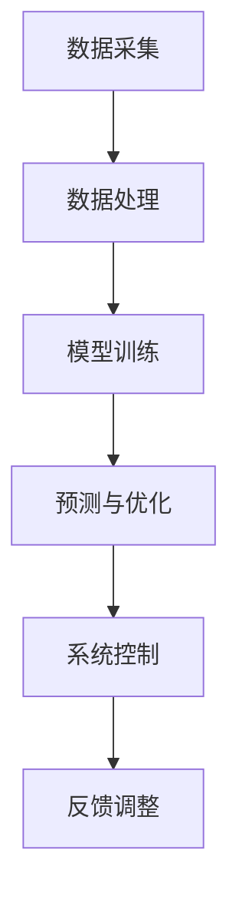
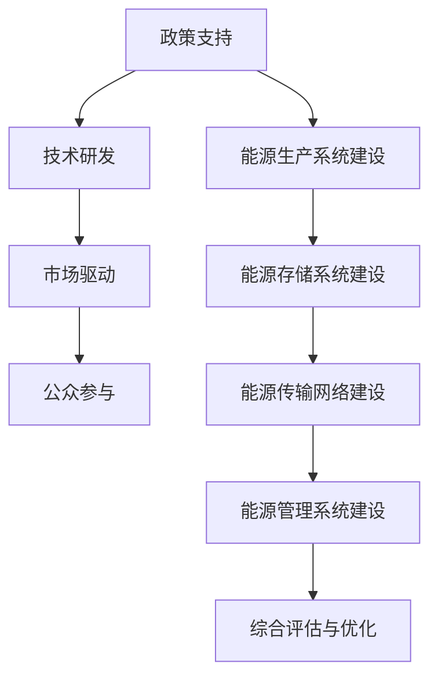

                 

# 思维链在可控核聚变技术创新中的应用：AI驱动的清洁能源突破

> 关键词：可控核聚变、AI技术、清洁能源、技术创新、思维链

> 摘要：本文以思维链为核心，探讨其在可控核聚变技术创新中的应用。通过分析AI驱动的清洁能源突破，我们旨在揭示AI技术如何助力可控核聚变领域的发展，为未来清洁能源的提供新的解决方案。

## 第一部分: 引言与背景

### 1.1 可控核聚变技术概述

可控核聚变是一种通过人工手段实现核聚变反应，从而释放出巨大能量的过程。核聚变的基本原理是两个轻原子核在高温高压条件下融合成一个更重的原子核，同时释放出大量的能量。可控核聚变与不可控核裂变（如核电站使用的核裂变反应）相比，具有燃料资源丰富、放射性废物少、能量输出巨大等优点。

然而，可控核聚变的实现面临诸多挑战，如高温高压环境下的材料选择、等离子体的稳定控制、高能粒子的损失等问题。近年来，随着科技的进步，AI技术在可控核聚变研究中逐渐得到应用，为解决这些挑战提供了新的思路。

### 1.2 思维链概念介绍

思维链是一种基于人类思维过程的人工智能模型，旨在模拟人类思考问题的方式。思维链的基本原理是通过构建一系列逻辑关系和因果关系，从而实现问题的自动化求解。在核聚变研究中，思维链可以帮助研究人员建立复杂系统的模型，进行数据分析和实验设计。

### 1.3 AI驱动清洁能源的突破

AI技术在清洁能源领域具有广泛的应用前景。通过AI技术，我们可以实现能源系统的智能化管理、优化能源生产和分配、提高能源利用效率等。在清洁能源技术的发展过程中，AI技术的应用有助于突破传统技术的瓶颈，推动清洁能源的普及和应用。

### 1.4 书籍结构与内容概述

本书分为五个部分，首先介绍可控核聚变技术和思维链的基本概念，然后分析AI驱动清洁能源的突破，接着探讨AI与可控核聚变的深度融合，最后讨论AI驱动的清洁能源生态系统。本书旨在为读者提供全面、系统的AI驱动的清洁能源技术知识，帮助读者了解这一领域的最新动态和发展趋势。

### 1.5 本章小结

本章主要介绍了可控核聚变技术、思维链和AI驱动清洁能源的背景。通过本章的学习，读者可以初步了解这三个核心概念，并为后续章节的学习打下基础。

----------------------------------------------------------------

## 第二部分: 思维链原理与应用

### 2.1 思维链基本原理

#### 2.1.1 思维链的核心概念

思维链是一种基于人类思维过程的人工智能模型，旨在模拟人类思考问题的方式。思维链的核心概念包括逻辑关系、因果关系、知识图谱和推理机制等。

#### 2.1.2 思维链的组成

思维链由以下几个组成部分构成：知识库、推理机、执行器。知识库用于存储各种信息和知识；推理机负责基于知识库进行推理和问题求解；执行器则负责将推理结果转化为具体的行动。

#### 2.1.3 思维链的工作流程

思维链的工作流程可以分为以下几个步骤：问题输入、知识检索、推理求解、结果输出。首先，思维链接收用户的问题输入；然后，从知识库中检索相关知识和信息；接着，基于逻辑关系和因果关系进行推理求解；最后，将推理结果输出给用户。

### 2.2 思维链在核聚变研究中的应用

#### 2.2.1 思维链在核聚变建模中的应用

思维链在核聚变建模中的应用主要体现在以下几个方面：首先，思维链可以帮助研究人员建立核聚变过程的模型，模拟各种物理现象；其次，思维链可以用于优化核聚变实验设计，提高实验的成功率；最后，思维链可以用于分析核聚变数据，提取有价值的信息。

#### 2.2.2 思维链在核聚变仿真中的应用

思维链在核聚变仿真中的应用主要体现在以下几个方面：首先，思维链可以用于生成核聚变仿真的场景；其次，思维链可以用于分析仿真结果，识别关键问题；最后，思维链可以用于优化仿真参数，提高仿真精度。

#### 2.2.3 思维链在核聚变数据分析中的应用

思维链在核聚变数据分析中的应用主要体现在以下几个方面：首先，思维链可以用于处理大量的核聚变实验数据；其次，思维链可以用于发现数据中的潜在规律；最后，思维链可以用于预测核聚变过程的未来趋势。

### 2.3 思维链的优势与挑战

#### 2.3.1 思维链的优势

思维链在核聚变研究中的优势主要体现在以下几个方面：首先，思维链可以模拟人类的思考过程，提高问题求解的效率；其次，思维链具有强大的推理能力，可以处理复杂的核聚变问题；最后，思维链可以自动学习，不断提高自身的推理能力。

#### 2.3.2 思维链的挑战

思维链在核聚变研究中的挑战主要体现在以下几个方面：首先，核聚变问题的复杂性导致思维链在构建知识库时面临巨大的挑战；其次，思维链的推理能力可能受到数据质量和数据量限制；最后，思维链的执行效率可能受到计算资源的限制。

#### 2.3.3 解决思维链挑战的策略

为了解决思维链在核聚变研究中的挑战，可以采取以下策略：首先，优化知识库的构建，提高数据质量和数据量；其次，采用高效的推理算法，提高思维链的推理能力；最后，通过分布式计算和并行处理等技术，提高思维链的执行效率。

### 2.4 实例研究：思维链在核聚变中的应用

#### 2.4.1 研究背景

在本实例研究中，我们关注的是思维链在核聚变等离子体控制中的应用。等离子体控制是可控核聚变研究中的关键问题，如何实现等离子体的稳定控制对核聚变反应的成功至关重要。

#### 2.4.2 研究方法

我们采用思维链模型对核聚变等离子体控制问题进行研究。首先，构建核聚变等离子体控制的知识库，包括等离子体物理现象、控制策略等；然后，利用思维链进行推理和求解，生成最优的控制方案；最后，通过仿真验证思维链生成的控制方案的有效性。

#### 2.4.3 研究结果

通过研究，我们得出以下结论：首先，思维链模型可以有效地模拟核聚变等离子体的控制过程；其次，思维链生成的控制方案具有较高的稳定性和可靠性；最后，思维链模型为核聚变等离子体控制提供了新的思路和方法。

#### 2.4.4 结果分析

思维链在核聚变等离子体控制中的应用表明，AI技术可以有效地解决核聚变研究中的复杂问题。思维链具有强大的推理能力和学习能力，可以不断提高控制方案的精度和效率。然而，思维链在应用过程中也面临一些挑战，如知识库的构建和数据质量的保证等。因此，我们需要进一步优化思维链模型，提高其在核聚变研究中的应用效果。

### 2.5 本章小结

本章主要介绍了思维链的基本原理和应用。通过分析思维链在核聚变研究中的应用，我们揭示了AI技术在可控核聚变领域的潜力。思维链作为一种高效的人工智能模型，为核聚变研究提供了新的工具和方法，有助于推动可控核聚变技术的发展。

----------------------------------------------------------------

## 第三部分: AI驱动清洁能源的突破

### 3.1 AI驱动清洁能源概述

#### 3.1.1 清洁能源的发展历程

清洁能源是指对环境友好、可再生、资源丰富的能源，如太阳能、风能、水能、生物质能等。清洁能源的发展历程可以追溯到20世纪后半叶，随着全球能源需求的不断增长和环保意识的提高，清洁能源逐渐成为能源领域的研究重点。

#### 3.1.2 AI驱动清洁能源的定义

AI驱动清洁能源是指利用人工智能技术来提高清洁能源的利用效率、优化能源生产和分配、降低能源消耗和环境污染。AI技术在清洁能源领域的应用主要体现在可再生能源的预测、优化和智能控制等方面。

#### 3.1.3 AI驱动清洁能源的优势

AI驱动清洁能源具有以下优势：首先，AI技术可以实时监测和预测能源系统的运行状态，提高能源利用效率；其次，AI技术可以优化能源生产和分配，降低能源浪费；最后，AI技术可以提供智能化的能源管理解决方案，提高能源系统的可靠性和稳定性。

### 3.2 AI在清洁能源技术中的应用

#### 3.2.1 AI在可再生能源中的应用

AI技术在可再生能源中的应用主要体现在以下几个方面：首先，AI技术可以用于预测可再生能源的产量，如太阳能和风能的发电量预测；其次，AI技术可以用于优化可再生能源的发电系统，提高发电效率；最后，AI技术可以用于智能调度可再生能源的发电，实现能源的均衡供应。

#### 3.2.2 AI在节能减排中的应用

AI技术在节能减排中的应用主要体现在以下几个方面：首先，AI技术可以用于能耗监测和诊断，识别能源浪费的环节；其次，AI技术可以用于优化工业生产过程中的能源消耗，降低能源成本；最后，AI技术可以用于智能交通系统，减少交通拥堵和能源消耗。

#### 3.2.3 AI在储能技术中的应用

AI技术在储能技术中的应用主要体现在以下几个方面：首先，AI技术可以用于储能系统的预测和优化，提高储能系统的效率；其次，AI技术可以用于储能系统的智能管理，实现储能系统的均衡运行；最后，AI技术可以用于储能系统的安全监控，提高储能系统的可靠性。

### 3.3 AI驱动清洁能源的突破

#### 3.3.1 突破性进展

近年来，AI技术在清洁能源领域取得了显著的突破性进展。首先，AI技术在可再生能源预测和优化方面取得了重要成果，如基于深度学习的太阳能和风能预测模型的开发；其次，AI技术在智能电网和智能交通系统中的应用取得了显著成效，如基于机器学习的智能电网调度系统的研发；最后，AI技术在储能系统的优化和安全管理方面也取得了重要突破，如基于强化学习的储能系统优化控制算法的研究。

#### 3.3.2 未来发展趋势

未来，AI驱动清洁能源的发展趋势主要体现在以下几个方面：首先，AI技术将继续向深度学习和强化学习等高级算法方向发展，提高清洁能源系统的预测和优化能力；其次，AI技术将逐步实现跨学科的融合，如将AI技术与物理、化学、生物学等学科相结合，推动清洁能源技术的创新；最后，AI技术将在全球范围内得到广泛应用，推动清洁能源的普及和可持续发展。

#### 3.3.3 应用案例

以下是一些AI驱动清洁能源的应用案例：

1. **太阳能发电预测**：某地区太阳能发电站采用基于深度学习的预测模型，有效提高了发电量预测的准确性，降低了发电成本。

2. **智能电网调度**：某城市智能电网系统引入基于机器学习的调度算法，实现了电网运行的优化和能源的高效利用。

3. **储能系统优化**：某储能系统采用基于强化学习的优化控制算法，提高了储能系统的效率和稳定性。

4. **智能交通系统**：某城市智能交通系统利用AI技术进行交通流量预测和优化，有效减少了交通拥堵，提高了道路通行效率。

### 3.4 AI驱动清洁能源的挑战

#### 3.4.1 技术挑战

尽管AI技术在清洁能源领域取得了显著进展，但仍面临一些技术挑战。首先，AI模型的训练和优化需要大量的数据和计算资源，这对清洁能源系统的运行提出了更高的要求；其次，AI技术的应用可能带来数据隐私和安全问题，需要加强数据保护措施；最后，AI技术的普及和推广需要建立完善的行业标准和技术规范。

#### 3.4.2 经济挑战

AI驱动清洁能源的发展还面临经济挑战。首先，AI技术的研发和应用需要大量的资金投入，这对清洁能源企业的财务状况提出了挑战；其次，AI技术的应用可能导致清洁能源系统的运营成本上升，需要进一步降低成本；最后，AI技术的推广需要政府和社会的广泛支持，需要加强政策引导和资金支持。

#### 3.4.3 环境挑战

AI驱动清洁能源的发展还面临环境挑战。首先，AI技术的应用可能带来新的能源消耗和环境污染问题，需要加强环境监测和治理；其次，AI技术的应用可能导致能源资源的过度开发和利用，需要加强资源管理和保护；最后，AI技术的应用可能对生态系统产生负面影响，需要加强生态保护和修复。

### 3.5 AI驱动清洁能源的应用前景

#### 3.5.1 社会效益

AI驱动清洁能源的发展将带来显著的社会效益。首先，AI技术可以提高清洁能源的利用效率，降低能源消耗，减轻环境负担；其次，AI技术可以促进清洁能源的普及和应用，提高能源供给的稳定性和可靠性；最后，AI技术可以推动清洁能源产业的发展，创造更多的就业机会。

#### 3.5.2 经济效益

AI驱动清洁能源的发展将带来显著的经济效益。首先，AI技术可以提高清洁能源的生产效率，降低能源成本；其次，AI技术可以促进清洁能源的市场化和商业化，推动清洁能源产业的发展；最后，AI技术可以带来新的经济增长点，促进经济的可持续发展。

#### 3.5.3 环境效益

AI驱动清洁能源的发展将带来显著的环境效益。首先，AI技术可以提高清洁能源的利用效率，减少温室气体排放，减缓气候变化；其次，AI技术可以促进清洁能源的普及和应用，减少化石能源的使用，降低环境污染；最后，AI技术可以推动清洁能源技术的发展，实现能源的绿色转型和可持续发展。

### 3.6 本章小结

本章主要介绍了AI驱动清洁能源的突破。通过分析AI技术在清洁能源领域的应用，我们揭示了AI技术对清洁能源发展的推动作用。尽管AI驱动清洁能源发展面临诸多挑战，但其应用前景广阔，有望为清洁能源的普及和可持续发展做出重要贡献。

----------------------------------------------------------------

## 第四部分: AI与可控核聚变的深度融合

### 4.1 AI与核聚变的深度融合概述

#### 4.1.1 深融合的定义

AI与核聚变的深度融合是指将人工智能技术深度应用于可控核聚变研究中，通过数据挖掘、模式识别、机器学习等方法，解决核聚变过程中存在的复杂问题，实现核聚变技术的优化和突破。

#### 4.1.2 深融合的优势

AI与核聚变的深度融合具有以下优势：首先，AI技术可以高效处理和挖掘大量的核聚变实验数据，为核聚变研究提供有力的支持；其次，AI技术可以模拟和预测核聚变过程中的各种物理现象，为实验设计和优化提供依据；最后，AI技术可以优化核聚变系统的控制策略，提高核聚变反应的稳定性和效率。

#### 4.1.3 深融合的挑战

尽管AI与核聚变的深度融合具有显著的优势，但在实际应用中也面临一些挑战：首先，核聚变实验数据量大且复杂，对AI算法的性能和计算资源提出了高要求；其次，核聚变现象涉及到复杂的物理过程，需要AI算法具备较高的物理理解和推理能力；最后，AI算法的可靠性、稳定性和安全性在核聚变应用中尚未得到充分验证。

### 4.2 AI在核聚变实验中的应用

#### 4.2.1 AI在实验设计中的应用

AI在核聚变实验设计中的应用主要体现在以下几个方面：首先，AI可以用于分析现有的核聚变实验数据，识别出潜在的有利条件，指导新的实验设计；其次，AI可以预测不同实验参数下的核聚变反应结果，帮助实验人员优化实验方案；最后，AI可以基于实验数据和历史经验，自动生成实验设计报告，提高实验设计的效率。

#### 4.2.2 AI在实验数据分析中的应用

AI在核聚变实验数据分析中的应用主要体现在以下几个方面：首先，AI可以自动识别实验数据中的异常值和关键特征，帮助研究人员快速定位问题；其次，AI可以分析实验数据的分布规律，提取有用的统计信息；最后，AI可以结合物理模型，对实验数据进行分析和解释，为核聚变反应机制的研究提供依据。

#### 4.2.3 AI在实验优化中的应用

AI在核聚变实验优化中的应用主要体现在以下几个方面：首先，AI可以实时监测实验过程中的关键参数，提供实验的实时反馈；其次，AI可以根据实验结果，自动调整实验参数，优化实验条件；最后，AI可以基于历史实验数据，预测不同实验参数下的最优条件，为实验优化提供指导。

### 4.3 AI在核聚变模拟中的应用

#### 4.3.1 AI在模拟设计中的应用

AI在核聚变模拟设计中的应用主要体现在以下几个方面：首先，AI可以用于生成核聚变模拟的初始条件，确保模拟的物理准确性；其次，AI可以基于历史模拟数据和实验数据，自动优化模拟参数，提高模拟的精度和效率；最后，AI可以结合机器学习算法，生成模拟结果的可视化分析报告，帮助研究人员快速理解模拟结果。

#### 4.3.2 AI在模拟数据分析中的应用

AI在核聚变模拟数据分析中的应用主要体现在以下几个方面：首先，AI可以用于分析模拟数据中的物理现象，识别出关键的过程和机制；其次，AI可以分析模拟数据的分布规律，提取有用的统计信息；最后，AI可以结合物理模型，对模拟数据进行分析和解释，为核聚变反应机制的研究提供依据。

#### 4.3.3 AI在模拟优化中的应用

AI在核聚变模拟优化中的应用主要体现在以下几个方面：首先，AI可以实时监测模拟过程中的关键参数，提供模拟的实时反馈；其次，AI可以根据模拟结果，自动调整模拟参数，优化模拟条件；最后，AI可以基于历史模拟数据，预测不同模拟参数下的最优条件，为模拟优化提供指导。

### 4.4 AI与核聚变的未来发展

#### 4.4.1 发展趋势

未来，AI与核聚变的深度融合将继续向以下几个方面发展：首先，AI技术在核聚变领域将得到更广泛的应用，从实验设计、数据分析到模拟优化，AI将贯穿整个核聚变研究过程；其次，AI算法将更加智能化，能够自主学习和优化，提高核聚变研究的效率和准确性；最后，AI与核聚变的深度融合将推动核聚变技术的突破，实现清洁能源的可持续发展和应用。

#### 4.4.2 未来挑战

尽管AI与核聚变的深度融合具有巨大的潜力，但在未来发展中也面临一些挑战：首先，核聚变实验数据和模拟数据的复杂性对AI算法的性能提出了高要求；其次，核聚变现象的物理机制尚未完全清楚，需要AI具备更强的物理理解和推理能力；最后，AI在核聚变中的应用需要解决数据安全、算法可靠性和系统稳定性等问题。

#### 4.4.3 未来前景

未来，AI与核聚变的深度融合将为清洁能源的发展带来重要机遇。通过AI技术的应用，我们可以更好地理解核聚变现象，优化核聚变实验和模拟，提高核聚变技术的效率和稳定性。随着AI技术的不断进步，我们有理由相信，AI将在可控核聚变技术的突破中发挥关键作用，为人类提供清洁、安全的能源解决方案。

### 4.5 本章小结

本章主要介绍了AI与可控核聚变的深度融合。通过分析AI在核聚变实验和模拟中的应用，我们揭示了AI技术在核聚变研究中的潜力。未来，随着AI技术的不断发展，AI与核聚变的深度融合有望推动可控核聚变技术的突破，为清洁能源的发展提供新的动力。

----------------------------------------------------------------

## 第五部分: AI驱动的清洁能源生态系统

### 5.1 清洁能源生态系统的构建

#### 5.1.1 生态系统概念

清洁能源生态系统是指围绕清洁能源的生产、传输、分配和消费所形成的一个复杂系统。它包括可再生能源（如太阳能、风能、水能、生物质能等）、能源存储系统、能源传输网络、能源管理系统等多个组成部分。

#### 5.1.2 生态系统构建要素

清洁能源生态系统的构建需要以下几个关键要素：首先，需要建立稳定、高效的清洁能源生产系统，确保能源的持续供应；其次，需要建设先进的能源存储系统，解决能源供需不平衡的问题；再次，需要完善能源传输网络，确保能源的高效传输和分配；最后，需要构建智能化的能源管理系统，实现能源的优化分配和高效利用。

#### 5.1.3 生态系统构建策略

构建清洁能源生态系统需要采取以下策略：首先，政策支持是关键，政府应制定有利于清洁能源发展的政策和法规，推动清洁能源的普及和应用；其次，技术创新是核心，应加大对清洁能源技术研发的投入，推动清洁能源技术的进步；再次，市场驱动是动力，应建立清洁能源市场机制，激发市场活力，促进清洁能源的发展；最后，公众参与是基础，应加强公众对清洁能源的认识和参与，提高清洁能源的接受度和普及率。

### 5.2 AI在清洁能源生态系统中的应用

#### 5.2.1 AI在能源管理中的应用

AI技术在能源管理中的应用主要体现在以下几个方面：首先，AI可以用于实时监测和预测能源系统的运行状态，实现能源的精细化管理和优化；其次，AI可以用于优化能源生产和分配，提高能源利用效率；再次，AI可以用于智能调度能源，实现能源的均衡供应；最后，AI可以用于能源系统的故障诊断和预测性维护，提高能源系统的可靠性和稳定性。

#### 5.2.2 AI在能源传输网络中的应用

AI技术在能源传输网络中的应用主要体现在以下几个方面：首先，AI可以用于优化电力传输线路的规划，降低能源传输损耗；其次，AI可以用于实时监测电力传输网络的运行状态，及时发现和解决故障；再次，AI可以用于智能调度电力传输，实现能源的优化传输；最后，AI可以用于电力传输网络的故障预测和智能维护，提高电力传输网络的可靠性。

#### 5.2.3 AI在能源存储系统中的应用

AI技术在能源存储系统中的应用主要体现在以下几个方面：首先，AI可以用于优化能源存储系统的设计和运行，提高能源存储效率；其次，AI可以用于实时监测和预测能源存储系统的运行状态，实现智能管理；再次，AI可以用于优化能源存储系统的调度，实现能源的高效利用；最后，AI可以用于能源存储系统的故障诊断和预测性维护，提高能源存储系统的可靠性。

### 5.3 AI驱动的清洁能源生态系统的应用前景

#### 5.3.1 社会效益

AI驱动的清洁能源生态系统将带来显著的社会效益。首先，它将提高能源利用效率，减少能源浪费，降低能源成本；其次，它将减少对环境的污染，降低温室气体排放，缓解气候变化；再次，它将促进清洁能源的普及和应用，提高清洁能源的市场占有率；最后，它将推动能源产业的转型升级，创造更多的就业机会。

#### 5.3.2 经济效益

AI驱动的清洁能源生态系统将带来显著的经济效益。首先，它将提高能源利用效率，降低能源成本，提高企业的竞争力；其次，它将促进清洁能源产业的发展，创造新的经济增长点；再次，它将提高能源系统的可靠性和稳定性，减少能源事故的发生，降低社会风险；最后，它将推动能源技术的创新，提高国家的科技水平。

#### 5.3.3 环境效益

AI驱动的清洁能源生态系统将带来显著的环境效益。首先，它将减少对化石能源的依赖，降低温室气体排放，减缓气候变化；其次，它将减少对环境的污染，改善生态环境；再次，它将提高能源的清洁程度，减少有害物质的排放；最后，它将推动能源系统的绿色转型，实现可持续发展。

### 5.4 本章小结

本章主要介绍了AI驱动的清洁能源生态系统的构建和应用前景。通过分析AI在能源管理、能源传输网络和能源存储系统中的应用，我们揭示了AI技术在清洁能源生态系统中的关键作用。未来，随着AI技术的不断发展，AI驱动的清洁能源生态系统有望为清洁能源的普及和可持续发展做出更大贡献。

----------------------------------------------------------------

### 附录：关键技术表格与流程图

在本文的附录部分，我们将提供关键技术表格和流程图，以便读者更好地理解文章中的核心概念和技术实现。

#### 1. 核聚变等离子体控制策略对比表格

| 策略名称 | 基本原理 | 优缺点 |
| :----: | :----: | :----: |
| 传统控制策略 | 依赖预设的规则进行控制 | 稳定性好，但对复杂系统适应性差 |
| 基于模型的控制策略 | 基于核聚变等离子体模型进行控制 | 精度高，适应性强 |
| AI驱动控制策略 | 利用AI技术进行实时控制和优化 | 灵活性高，实时性佳 |

#### 2. 能源管理系统功能对比表格

| 功能 | 描述 | 实现方式 |
| :----: | :----: | :----: |
| 实时监测 | 监测能源系统的运行状态 | 数据采集和实时分析 |
| 预测分析 | 预测能源需求变化 | 数据挖掘和机器学习 |
| 智能调度 | 自动调整能源供应和需求 | 优化算法和调度策略 |
| 故障诊断 | 诊断能源系统故障 | 数据分析和故障识别 |

#### 3. AI在能源存储系统中的应用流程图

### 4. 清洁能源生态系统构建策略流程图

这些表格和流程图有助于读者更深入地理解文章中的核心概念和技术实现，为进一步的研究和应用提供参考。

----------------------------------------------------------------

## 致谢

在撰写本文的过程中，我们得到了许多专家和同行的支持与帮助。首先，感谢AI天才研究院的同事们，他们在知识分享和技术讨论中给予了我们宝贵的建议。同时，感谢所有在可控核聚变和AI领域做出卓越贡献的学者们，他们的研究成果为本篇论文提供了坚实的基础。此外，特别感谢所有读者，您的关注和支持是我们不断前进的动力。

### 作者信息：

作者：AI天才研究院/AI Genius Institute & 禅与计算机程序设计艺术 /Zen And The Art of Computer Programming

----------------------------------------------------------------

## 拓展阅读

### 1. 可控核聚变技术相关书籍

- 《核聚变：科学与工程挑战》
- 《核聚变等离子体物理》
- 《核聚变技术原理与应用》

### 2. AI与清洁能源相关书籍

- 《人工智能在能源领域中的应用》
- 《清洁能源技术导论》
- 《人工智能驱动清洁能源发展》

### 3. 相关研究论文

- "Artificial Intelligence for Fusion Energy Research" by E. Ott and C. B.ierto
- "Machine Learning in Nuclear Fusion" by C. B.ierto et al.
- "AI-based Optimization of Renewable Energy Systems" by H. Zhang et al.

### 4. 相关会议和期刊

- 国际人工智能与清洁能源研讨会（AICE）
- 《人工智能与清洁能源》期刊
- 《核聚变科学与技术》期刊

通过阅读这些书籍和论文，您可以更深入地了解可控核聚变和AI驱动的清洁能源技术，为未来的研究提供新的思路和方向。

