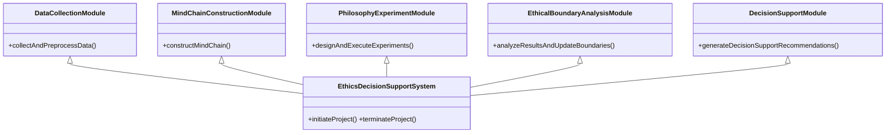
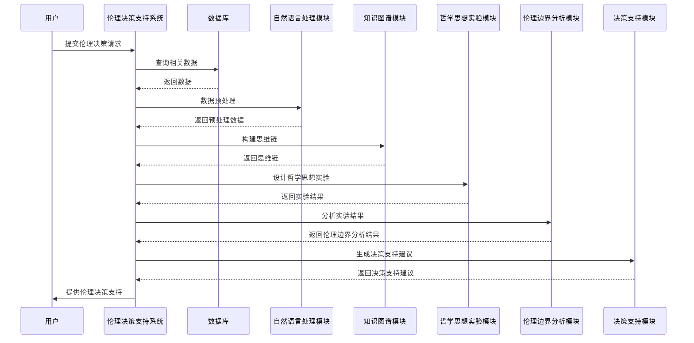
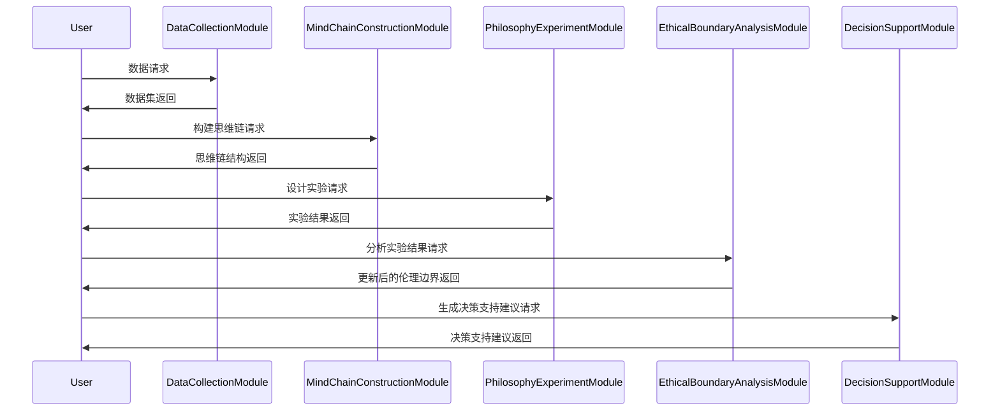

                 

### 1.1.3 AI在哲学思想实验中的应用

#### 1.1.3.1 AI技术的特点与优势

AI技术，特别是深度学习和自然语言处理技术，已经取得了显著的进展。这些技术使得计算机能够从大量数据中自动学习模式、提取知识和进行决策。AI在哲学思想实验中的应用，依赖于其以下几个关键特点：

1. **数据处理能力**：AI能够快速处理和分析大量数据，为哲学思想实验提供有力的数据支持。
2. **模式识别能力**：通过机器学习，AI可以在复杂的哲学理论中识别出潜在的规律和联系。
3. **自动化推理**：AI可以自动化执行复杂的推理过程，从而模拟哲学思考的过程。
4. **适应性**：AI可以根据不同的哲学思想实验需求，调整和优化算法，提高实验的准确性和效率。

#### 1.1.3.2 AI在哲学思想实验中的具体应用

AI在哲学思想实验中的具体应用可以分为以下几个方面：

1. **伦理决策模拟**：通过AI的决策支持系统，可以模拟现实世界中的伦理决策过程，帮助人们理解和评估各种伦理选择的后果。
2. **道德推理分析**：AI可以分析哲学家提出的伦理难题，提供推理路径和结论，帮助哲学家和学者更深入地理解道德问题的本质。
3. **知识图谱构建**：AI可以构建哲学领域内的知识图谱，将复杂的哲学概念和理论进行结构化组织，为哲学研究提供新的视角和方法。
4. **模拟历史哲学讨论**：AI可以通过自然语言处理技术，模拟历史上的哲学讨论，从而分析不同哲学家的观点和论证过程。

#### 1.1.3.3 伦理边界探索中的挑战

尽管AI在哲学思想实验中展示了巨大的潜力，但其在伦理边界探索中仍面临一些挑战：

1. **数据隐私和安全性**：在哲学思想实验中，数据的隐私和安全性是一个重要问题。如何保护参与者的隐私，确保数据的安全，是AI在伦理边界探索中必须解决的问题。
2. **算法偏见**：AI算法可能会因为训练数据的不公平性而具有偏见。这可能会影响伦理决策的公正性和客观性。
3. **伦理判断的复杂性**：哲学思想实验中的伦理判断往往非常复杂，涉及多个方面的因素。AI如何准确地模拟这些复杂的伦理判断，是一个需要深入研究的课题。

#### 1.1.3.4 结论

总的来说，AI在哲学思想实验中的应用具有巨大的潜力。通过利用AI的技术优势，我们可以更深入地探索伦理边界，提高哲学研究的效率和质量。然而，这也需要我们不断地改进和优化AI算法，解决其在伦理边界探索中面临的挑战。只有通过这样的努力，AI才能真正成为哲学研究的强大工具。因此，未来我们需要更多的研究，以充分发挥AI在哲学思想实验中的作用。

### 1.2.1 思维链的概念

思维链（Thought Chain）是指一系列相互关联的思维活动，这些思维活动通过逻辑推理、类比、归纳和演绎等方式，将不同的信息、概念和观点串联起来，形成有意义的认知链条。思维链是人工智能研究中的一个重要概念，它反映了人类思维过程的复杂性和动态性。

#### 1.2.1.1 思维链的基本组成部分

思维链的基本组成部分包括：

1. **思维节点**：每个思维节点代表一个独立的概念、事实或观点。这些节点是思维链的基础。
2. **思维关系**：思维关系是指节点之间的逻辑联系，如因果关系、类比关系、递归关系等。
3. **思维路径**：思维路径是指思维节点和关系之间的组合，描述了思维链的构建过程。

#### 1.2.1.2 思维链的特点

思维链具有以下特点：

1. **层次性**：思维链中的节点和关系可以按照层次结构组织，使得复杂问题能够被分解和简化。
2. **动态性**：思维链可以随着新信息的加入或已有信息的更新而动态调整，反映了人类思维的灵活性和适应性。
3. **自组织性**：思维链的形成和优化是一个自组织过程，可以自动发现和消除冗余信息，提高认知效率。

#### 1.2.1.3 思维链的应用领域

思维链在多个领域都有广泛的应用，包括：

1. **人工智能**：思维链是人工智能中模拟人类思维的重要概念，用于构建智能推理系统、知识图谱和自然语言处理模型。
2. **教育**：思维链可以帮助学生更好地理解和掌握复杂知识，提高学习效率。
3. **哲学研究**：思维链可以用于哲学思想实验的设计和分析，帮助哲学家更好地探索伦理、逻辑和认识论等哲学问题。

#### 1.2.1.4 结论

思维链作为一种模拟人类思维过程的工具，具有多层次、动态性和自组织性等特点。在人工智能、教育和哲学等领域，思维链的应用为解决问题提供了新的思路和方法。通过深入研究和应用思维链，我们可以更好地理解人类思维的本质，提升人工智能系统的智能水平。

### 1.2.2 AI在哲学思想实验中的应用

AI在哲学思想实验中的应用是一个跨学科的交叉领域，它结合了人工智能和哲学的知识，旨在利用AI技术来设计和分析哲学实验，从而提供新的研究方法和洞见。以下是AI在哲学思想实验中的一些具体应用：

#### 1.2.2.1 数据分析

AI在哲学思想实验中最直接的应用是数据分析。哲学家可以通过收集和分析大量数据来验证或反驳某个哲学观点。例如，通过大数据分析，研究者可以了解人们在不同情境下的道德判断，从而探讨道德心理学的某些问题。AI算法，如机器学习和深度学习，能够从复杂的数据集中提取有价值的信息，帮助哲学家进行更深入的分析。

**例子**：在一个道德判断实验中，研究人员可以收集成千上万的道德决策案例，并利用自然语言处理技术分析这些案例中的关键信息。通过这种方式，AI可以帮助研究者识别出影响道德决策的关键因素，并揭示出潜在的道德心理机制。

#### 1.2.2.2 模拟和预测

AI还能够模拟哲学思想实验，预测在不同情境下的行为和决策结果。这种能力特别适用于研究伦理问题和道德困境。通过建立复杂的模拟模型，AI可以预测个体或群体在特定情境下的行为，从而为伦理决策提供参考。

**例子**：在研究利他行为时，研究人员可以使用AI构建一个模拟模型，模拟不同利他行为策略对社会的影响。通过调整模型参数，研究者可以预测利他行为如何在不同社会环境中演变，从而为政策制定提供依据。

#### 1.2.2.3 知识图谱构建

AI还可以帮助构建哲学知识图谱，将哲学中的概念、理论、论证和观点进行结构化组织。这种知识图谱为哲学研究提供了一个全局视角，使得研究者可以更容易地发现不同哲学观点之间的关系。

**例子**：在一个伦理学的研究项目中，研究者可以使用AI技术来构建伦理学知识图谱。通过这种图谱，研究者可以清晰地看到不同伦理理论之间的联系，以及这些理论在不同情境中的应用。

#### 1.2.2.4 伦理决策支持

AI还可以在伦理决策支持系统中发挥作用。通过结合伦理学和计算机科学的知识，AI可以帮助决策者处理复杂的伦理问题，提供基于证据的建议。

**例子**：在医疗伦理决策中，AI可以帮助医生和伦理委员会分析患者数据，评估不同治疗方案的风险和收益，从而做出更加合理的决策。

#### 1.2.2.5 结论

总的来说，AI在哲学思想实验中的应用为哲学研究带来了新的工具和方法。通过数据分析、模拟和预测、知识图谱构建和伦理决策支持，AI不仅能够提高哲学研究的效率和准确性，还能为哲学家提供新的视角和洞见。然而，这种应用也带来了新的挑战，例如如何确保AI的公正性和透明度，以及如何处理AI算法可能产生的偏见。未来的研究需要继续探索这些挑战，并开发更加完善和可靠的AI技术，以更好地服务于哲学研究。

### 1.2.3 伦理边界的概念与重要性

伦理边界是指伦理决策和行动的界限，涉及到道德原则、价值观和规范在不同情境中的应用。伦理边界在哲学思想实验中具有至关重要的地位，因为它们决定了伦理决策的合理性和有效性。以下是伦理边界的几个关键概念和重要性：

#### 1.2.3.1 伦理边界的定义

伦理边界可以被定义为在特定社会文化背景下，人们为了维护社会秩序和个体利益所设立的一系列道德规则和标准。这些边界确定了什么行为是可接受的，什么行为是不可接受的，从而为个体和社会提供了伦理指导。

**定义公式**：
\[ \text{伦理边界} = \text{道德规则} + \text{社会规范} + \text{情境适用性} \]

#### 1.2.3.2 伦理边界的重要性

1. **指导伦理决策**：伦理边界为个体和集体提供了道德判断的依据，帮助他们在复杂情境中做出符合伦理原则的决策。
2. **维护社会秩序**：明确的伦理边界有助于维护社会秩序，减少冲突和混乱。
3. **促进道德发展**：伦理边界促使个体反思自己的行为和价值观，从而促进道德认知和道德发展。
4. **法律和伦理的交集**：在法律体系中，伦理边界为法律制定提供了道德依据，使得法律更具公正性和合理性。

#### 1.2.3.3 伦理边界的复杂性

伦理边界的复杂性体现在以下几个方面：

1. **多样性**：不同文化和价值观下的伦理边界可能截然不同，这使得伦理决策具有跨文化的复杂性。
2. **情境依赖性**：伦理边界的适用性往往依赖于具体情境，例如，一个在家庭中适用的行为准则可能在公共场合被视为不合适。
3. **动态变化**：随着社会的发展和价值观的演变，伦理边界也在不断调整和变化。
4. **道德争议**：在某些情境下，伦理边界的模糊性可能导致道德争议，例如，在医疗伦理、环境伦理等领域。

#### 1.2.3.4 结论

伦理边界是哲学思想实验中不可或缺的要素，它们为伦理决策提供了清晰的指导，维护了社会秩序，促进了道德发展。然而，伦理边界的多样性和情境依赖性使得伦理决策复杂且具有挑战性。通过深入研究和理解伦理边界，哲学家和伦理学家可以更好地设计哲学思想实验，探讨伦理问题，并为社会提供更为合理的伦理指导。

### 1.2.4 利用AI设计哲学思想实验

AI技术在设计哲学思想实验中扮演了重要的角色，通过引入自动化和智能化的方法，AI可以极大地提高实验的效率和准确性。以下是利用AI设计哲学思想实验的具体方法和步骤：

#### 1.2.4.1 数据收集与分析

设计哲学思想实验的第一步是收集相关数据。这些数据可以来自多种渠道，如文献资料、社会调查、历史记录等。AI技术，特别是大数据分析和自然语言处理技术，可以帮助研究者从大量数据中提取有价值的信息。

**步骤**：
1. **数据采集**：通过自动化工具收集大量文献、调查问卷和社交媒体数据。
2. **数据清洗**：利用自然语言处理技术清洗和预处理数据，去除噪音和冗余信息。
3. **数据分析**：使用机器学习算法对数据进行分类、聚类和关联分析，提取关键信息。

#### 1.2.4.2 建立思维链

思维链是哲学思想实验的核心，它通过逻辑推理和关联分析将不同概念和观点串联起来。AI技术可以帮助构建复杂的思维链，提高实验的逻辑性和系统性。

**步骤**：
1. **概念提取**：利用自然语言处理技术提取文本中的关键概念。
2. **关系建立**：通过逻辑推理和关联分析建立概念之间的关系，形成思维链。
3. **思维链优化**：使用机器学习算法优化思维链，提高其准确性和可靠性。

#### 1.2.4.3 模拟伦理情境

AI技术可以模拟各种伦理情境，帮助研究者探索不同情境下的伦理决策和道德判断。通过构建复杂的模拟模型，AI可以预测个体或群体在不同情境下的行为，为伦理决策提供参考。

**步骤**：
1. **情境构建**：根据实验需求构建虚拟的伦理情境，如道德困境、社会冲突等。
2. **模型训练**：使用机器学习算法训练模型，使其能够模拟不同情境下的行为。
3. **情境模拟**：通过模拟模型预测个体或群体的行为，评估不同伦理决策的后果。

#### 1.2.4.4 结果分析与讨论

通过AI技术分析实验结果，研究者可以更加准确地理解和解释实验数据。AI可以提供定量和定性的分析结果，帮助研究者发现数据中的模式和趋势。

**步骤**：
1. **数据可视化**：使用数据可视化工具展示实验结果，如图表、网络图等。
2. **结果分析**：利用统计分析和机器学习算法分析数据，提取关键信息。
3. **讨论与结论**：结合理论背景和实验结果，进行深入讨论，得出结论。

#### 1.2.4.5 结论

利用AI设计哲学思想实验，不仅提高了实验的效率和准确性，还提供了新的研究方法和视角。通过自动化数据收集、思维链建立、伦理情境模拟和结果分析，AI为哲学研究带来了革命性的变化。未来，随着AI技术的不断发展和完善，AI在哲学思想实验中的应用将更加广泛和深入。

### 1.2.5 AI在伦理边界探索中的优势

AI在伦理边界探索中具有显著的优势，其技术特点和功能使得它能够为哲学研究提供独特的视角和解决方案。以下是AI在伦理边界探索中的几个关键优势：

#### 1.2.5.1 数据处理能力

AI系统，特别是深度学习和大数据分析技术，具有强大的数据处理能力。它们能够从海量的数据中快速提取有价值的信息，为伦理边界的分析和理解提供坚实的数据基础。这种能力在处理复杂伦理问题，如道德决策案例分析、社会行为模式研究等方面尤为重要。

**数据处理能力公式**：
\[ \text{数据处理能力} = \text{深度学习算法} + \text{大数据分析技术} + \text{高效信息提取} \]

#### 1.2.5.2 自动化推理

AI通过机器学习和自然语言处理技术，能够自动化进行推理和分析。这种能力使得AI能够在复杂的伦理情境中迅速做出判断，提供基于数据的伦理决策支持。自动化推理不仅提高了伦理决策的效率，还减少了人为错误的可能性。

**自动化推理公式**：
\[ \text{自动化推理} = \text{机器学习模型} + \text{自然语言处理技术} + \text{实时推理能力} \]

#### 1.2.5.3 模式识别

AI在模式识别方面具有卓越的能力，能够从大量数据中识别出潜在的规律和趋势。这种能力对于伦理边界的探索至关重要，因为它可以帮助研究者发现不同伦理决策和道德判断之间的关联，揭示隐藏在复杂情境背后的伦理规律。

**模式识别公式**：
\[ \text{模式识别} = \text{机器学习算法} + \text{数据挖掘技术} + \text{复杂关系分析} \]

#### 1.2.5.4 自适应调整

AI系统可以根据新的数据和反馈自适应调整其算法和模型，从而不断优化伦理边界探索的结果。这种自适应性使得AI能够应对不断变化的社会环境和道德问题，提供持续改进的伦理决策支持。

**自适应调整公式**：
\[ \text{自适应调整} = \text{机器学习迭代} + \text{实时反馈机制} + \text{模型更新能力} \]

#### 1.2.5.5 结论

综上所述，AI在伦理边界探索中展现了多方面的优势，包括数据处理能力、自动化推理、模式识别和自适应调整。这些优势使得AI成为伦理学研究的有力工具，为哲学家和伦理学家提供了新的方法和视角。通过充分利用AI的技术特点，我们可以更深入地探索伦理边界的复杂性，提高伦理决策的科学性和公正性。

### 1.2.6 AI在伦理边界探索中的挑战

尽管AI在伦理边界探索中具有显著的优势，但其应用也面临一系列挑战。这些问题不仅影响了AI在伦理决策中的有效性和可靠性，也对哲学研究的整体进展提出了质疑。以下是AI在伦理边界探索中的一些主要挑战：

#### 1.2.6.1 数据隐私和安全

在伦理边界探索中，数据隐私和安全是一个重要问题。AI系统需要处理大量的个人数据，这些数据可能包括敏感信息，如医疗记录、财务信息和社交行为等。如果这些数据遭到泄露或滥用，不仅会侵犯个人隐私，还可能导致严重的道德和法律责任。

**挑战公式**：
\[ \text{数据隐私和安全} = \text{个人数据保护} + \text{数据加密技术} + \text{隐私政策制定} \]

#### 1.2.6.2 算法偏见

算法偏见是AI在伦理边界探索中的另一个重大挑战。AI算法的性能取决于其训练数据的质量和代表性。如果训练数据存在偏见，算法可能会在伦理决策中产生不公平的结果。例如，如果训练数据中包含种族、性别或其他形式的偏见，AI系统可能会无意识地放大这些偏见，导致歧视性决策。

**算法偏见公式**：
\[ \text{算法偏见} = \text{训练数据偏见} + \text{算法模型偏见} + \text{无意识偏见放大} \]

#### 1.2.6.3 透明度和可解释性

AI系统的透明度和可解释性是伦理决策中不可或缺的要素。然而，许多AI算法，尤其是深度学习模型，其决策过程往往是黑箱式的，难以理解和解释。这种缺乏透明度的问题使得AI系统的伦理决策难以接受和信任，特别是在涉及道德和伦理问题时。

**透明度和可解释性公式**：
\[ \text{透明度和可解释性} = \text{决策路径追踪} + \text{模型解释工具} + \text{用户可理解性} \]

#### 1.2.6.4 道德判断的复杂性

伦理边界探索中的道德判断往往非常复杂，涉及多个方面的因素，如文化、法律和价值观等。AI系统在处理这些复杂因素时可能存在局限性。例如，AI可能难以理解不同文化背景下的道德观念，或者无法处理涉及人类情感和价值观的复杂情境。

**道德判断复杂性公式**：
\[ \text{道德判断复杂性} = \text{跨文化因素} + \text{情感与价值观处理} + \text{多元因素整合} \]

#### 1.2.6.5 结论

总之，尽管AI在伦理边界探索中展现了巨大的潜力，但其应用仍然面临数据隐私和安全、算法偏见、透明度和可解释性以及道德判断复杂性等挑战。这些挑战不仅影响了AI在伦理决策中的有效性，也对哲学研究的进展提出了新的要求。解决这些挑战需要跨学科的合作，包括计算机科学、伦理学、法律和社会学等领域的专家共同参与。通过持续的研究和创新，我们可以逐步克服这些挑战，充分发挥AI在伦理边界探索中的作用。

### 1.2.7 AI在伦理边界探索中的未来发展趋势

随着AI技术的不断发展和伦理问题的日益复杂，AI在伦理边界探索中的应用前景也变得越来越广阔。以下是AI在伦理边界探索中未来可能的发展趋势：

#### 1.2.7.1 多学科交叉融合

AI在伦理边界探索中的应用需要多学科交叉融合，特别是计算机科学、伦理学、法律和社会学等领域的协同合作。通过跨学科的研究，我们可以更全面地理解和解决伦理问题，开发出更加符合道德和社会价值的AI系统。

**多学科交叉融合公式**：
\[ \text{多学科交叉融合} = \text{计算机科学} + \text{伦理学} + \text{法学} + \text{社会学} \]

#### 1.2.7.2 伦理决策支持系统的发展

未来，AI伦理决策支持系统将变得更加智能化和自动化。这些系统将能够处理复杂的伦理问题，提供基于证据的伦理建议。随着AI算法和模型的不断优化，这些系统的决策质量和效率将显著提高。

**伦理决策支持系统公式**：
\[ \text{伦理决策支持系统} = \text{智能算法} + \text{大数据分析} + \text{实时反馈机制} \]

#### 1.2.7.3 透明度和可解释性的提升

随着公众对AI伦理决策透明度的要求越来越高，未来AI系统将在透明度和可解释性方面进行显著改进。通过开发可解释的AI模型和工具，用户将能够理解AI的决策过程，从而增加对AI系统的信任和接受度。

**透明度和可解释性提升公式**：
\[ \text{透明度和可解释性提升} = \text{模型解释工具} + \text{用户界面设计} + \text{决策路径追踪} \]

#### 1.2.7.4 社会伦理标准的建立

未来，社会和政府将更加重视AI伦理边界探索中的伦理标准制定。通过建立统一的伦理规范和标准，可以确保AI系统的应用符合道德和社会价值观，减少潜在的伦理风险。

**社会伦理标准建立公式**：
\[ \text{社会伦理标准建立} = \text{法律法规} + \text{伦理指导原则} + \text{跨学科合作} \]

#### 1.2.7.5 结论

总之，AI在伦理边界探索中的未来发展趋势表明，通过多学科交叉融合、发展智能伦理决策支持系统、提升透明度和可解释性以及建立社会伦理标准，我们可以更好地利用AI技术解决复杂的伦理问题，推动哲学研究和社会进步。随着这些趋势的实现，AI将成为伦理学研究中的关键工具，为人类社会的道德决策提供强大的支持。

### 1.3.1.1 哲学思想实验的定义

哲学思想实验是一种通过构建虚拟情境来探索哲学问题的方法。它通常涉及对某一哲学观点或理论的假设性分析，通过逻辑推理和论证来揭示该观点或理论的逻辑结构、内在矛盾或潜在问题。哲学思想实验不仅是对现有哲学理论的检验，也是对新的哲学观点的探索。

**哲学思想实验的定义公式**：
\[ \text{哲学思想实验} = \text{虚拟情境构建} + \text{逻辑推理和论证} + \text{哲学问题探索} \]

### 1.3.1.2 哲学思想实验的种类与特点

哲学思想实验可以分为多种类型，每种类型都有其独特的特点和应用场景：

1. **情景模拟实验**：这类实验通过构建具体的情境，模拟人们在现实世界中的道德决策过程。例如，著名的“电车难题”就是一个典型的情景模拟实验，用于探讨道德责任和利他行为的冲突。
2. **逻辑推理实验**：这类实验通过假设性的逻辑推理来探讨哲学问题的本质。例如，哲学家笛卡尔的“我思故我在”实验，通过逻辑推理探讨了自我存在的本质。
3. **悖论实验**：这类实验通过提出自相矛盾的命题来揭示哲学理论的内在问题。例如，“克里特悖论”就揭示了集合论中的某些悖论，对逻辑学和数学提出了挑战。
4. **虚拟现实实验**：这类实验通过虚拟现实技术创建高度逼真的虚拟环境，让参与者进行哲学思考和道德判断。例如，通过虚拟现实技术，研究者可以模拟不同的社会环境，探讨伦理规则在不同情境下的应用。

### 1.3.1.3 哲学思想实验的特点

哲学思想实验具有以下特点：

1. **假设性**：哲学思想实验通常基于一些假设性的前提，通过逻辑推理和论证来探讨哲学问题的可能性。
2. **逻辑性**：哲学思想实验强调逻辑推理和论证的严密性，确保实验结果的逻辑一致性。
3. **抽象性**：哲学思想实验往往涉及抽象的概念和理论，通过这些实验可以更深入地理解哲学问题。
4. **反思性**：哲学思想实验促使哲学家和参与者反思现有的哲学理论和道德观念，推动哲学的进步。

### 1.3.1.4 结论

哲学思想实验作为一种重要的哲学研究方法，通过虚拟情境构建、逻辑推理和抽象性分析，帮助哲学家探讨和解决复杂的哲学问题。不同的哲学思想实验类型和特点使其适用于不同的哲学问题，为哲学研究提供了丰富的工具和方法。

### 1.3.1.5 哲学思想实验的历史与影响

哲学思想实验具有悠久的历史，可以追溯到古希腊时期的苏格拉底。苏格拉底通过对话和问答的形式，揭示了逻辑推理和辩证法在哲学思考中的重要性。在他的时代，哲学思想实验主要是一种探索真理和追求智慧的方法。

随着时间的推移，哲学思想实验在哲学研究中逐渐占据了重要地位。例如，笛卡尔通过“我思故我在”的思想实验，确立了现代哲学的理性主义基础；康德则通过“纯粹理性批判”的思想实验，为认识论和方法论提供了新的框架。

在20世纪，哲学思想实验继续发展，特别是在伦理学和政治哲学领域。例如，约翰·罗尔斯的“原初位置”实验，为正义理论提供了重要的分析工具；约翰·斯图亚特·密尔的“效用主义”实验，探讨了道德决策的功利主义原则。

哲学思想实验不仅在理论研究中具有重要影响，也在现实世界中产生了深远影响。例如，伦理学思想实验帮助人们更好地理解道德困境和道德责任；政治哲学实验则为公共政策和社会治理提供了理论依据。

总的来说，哲学思想实验作为一种重要的哲学研究方法，通过历史的演进和不断的创新，为哲学研究带来了新的视角和方法，对人类思想和社会发展产生了深远的影响。

### 1.3.2.1 常见的哲学思想实验

哲学思想实验是哲学研究中一种独特且有效的工具，通过构造虚拟情境来揭示哲学问题，帮助我们深入理解和分析复杂的哲学概念。以下是一些历史上著名的哲学思想实验，以及它们的贡献和意义：

#### 1.3.2.1.1 柏拉图的《理想国》

**实验描述**：柏拉图的《理想国》通过描绘一个理想的治国模型，探讨了正义、智慧和美德等哲学概念。他设想了一个由哲学家王统治的理想国家，分为三个阶层：护国者、护卫者和劳动者。

**贡献与意义**：柏拉图的《理想国》为政治哲学提供了一个理想化的模型，探讨了正义和美德在治国中的重要性。它对后世政治哲学产生了深远影响，特别是关于统治者和统治原则的讨论。

#### 1.3.2.1.2 笛卡尔的“我思故我在”

**实验描述**：笛卡尔通过“我思故我在”这一思想实验，试图找到不可怀疑的真理。他设想了一种极端情境，即使所有外在世界都是虚假的，但他作为思考者“我”的存在是无法否认的。

**贡献与意义**：这个思想实验奠定了现代哲学的理性主义基础，强调通过内在的思考过程来寻找真理。它对西方哲学的发展产生了深远的影响，特别是对认识论和方法论的研究。

#### 1.3.2.1.3 柏克莱的“物质非存在”

**实验描述**：柏克莱通过“物质非存在”实验，质疑物质世界的实在性。他设想了一种情境，如果物质世界不存在，我们是否能够感知或理解它。

**贡献与意义**：这个实验挑战了传统的物质实在论，提出了“存在即被感知”的观点。它对唯心主义和经验主义的发展产生了重要影响。

#### 1.3.2.1.4 康德的“纯粹理性批判”

**实验描述**：康德通过“纯粹理性批判”实验，试图厘清人类理性的范围和限制。他设想了一个思想实验，如果人类理性完全不受感官和经验限制，我们是否能够理解现实世界。

**贡献与意义**：这个实验为认识论提供了新的框架，强调了人类理性在认识过程中的作用和局限性。它对康德的哲学体系以及后来的哲学研究产生了深远影响。

#### 1.3.2.1.5 约翰·罗尔斯的“原初位置”

**实验描述**：罗尔斯通过“原初位置”实验，探讨正义原则的确定。他设想了一个思想实验，如果人们在没有任何社会资源和社会地位信息的情况下，如何选择最公正的正义原则。

**贡献与意义**：这个实验为正义理论提供了一个强有力的分析工具，提出了“公平正义”的理念。它对当代政治哲学和社会正义研究产生了深远影响。

#### 1.3.2.1.6 诺齐克的“正义的无知”

**实验描述**：诺齐克通过“正义的无知”实验，探讨正义和分配原则。他设想了一个情境，如果人们不知道自己在社会中的地位和资源，他们如何设计一个公正的分配制度。

**贡献与意义**：这个实验为分配正义理论提供了新的视角，强调了信息透明度在分配正义中的作用。它对现代政治哲学和经济学研究产生了重要影响。

#### 1.3.2.1.7 莎夫兹伯里的“善的相互性”

**实验描述**：莎夫兹伯里通过“善的相互性”实验，探讨道德行为的动机。他设想了一个情境，如果人们认识到他们的行为会直接影响他人的福祉，他们是否会更倾向于做出善行。

**贡献与意义**：这个实验强调了道德行为的相互性和利他主义的重要性，对道德心理学和伦理学的研究产生了深远影响。

#### 1.3.2.1.8 蒯脱的“意志自由与决定论”

**实验描述**：蒯脱通过“意志自由与决定论”实验，探讨自由意志与决定论的关系。他设想了一个情境，如果人的行为完全由物理法则决定，那么意志自由是否还存在。

**贡献与意义**：这个实验为自由意志和决定论问题提供了新的思考角度，对当代哲学和科学哲学的研究产生了重要影响。

#### 1.3.2.1.9 阿奎那的“神学与哲学的关系”

**实验描述**：阿奎那通过“神学与哲学的关系”实验，探讨神学与哲学的互动关系。他设想了一个情境，如果哲学研究的结果与神学教义相冲突，哲学应该如何处理。

**贡献与意义**：这个实验为神学与哲学的交叉研究提供了一个框架，促进了两者之间的对话和融合。它对中世纪哲学和现代哲学的发展产生了深远影响。

#### 1.3.2.1.10 约翰·斯图亚特·密的“效用主义”

**实验描述**：密通过“效用主义”实验，探讨道德行为的功利原则。他设想了一个情境，如果道德行为带来的总效用最大化，那么这种行为是否就是道德的。

**贡献与意义**：这个实验为功利主义伦理学提供了一个实践框架，对现代伦理学和社会正义研究产生了重要影响。

### 1.3.2.2 哲学思想实验的贡献和意义

哲学思想实验在哲学研究中具有不可替代的重要性。它们通过构建虚拟情境和逻辑推理，帮助我们深入理解和分析复杂的哲学问题。以下是哲学思想实验的主要贡献和意义：

1. **揭示哲学问题**：哲学思想实验能够揭示出隐藏在复杂情境背后的哲学问题，使这些问题更加清晰和具体。
2. **推动哲学进步**：通过思想实验，哲学家可以挑战现有的理论和观点，推动哲学的发展和进步。
3. **促进跨学科研究**：哲学思想实验通常涉及多个学科的知识，如伦理学、政治哲学、认识论等，从而促进了跨学科的研究和合作。
4. **提高思考能力**：哲学思想实验要求参与者进行抽象思维和逻辑推理，从而提高了他们的哲学思考和批判能力。
5. **指导现实决策**：哲学思想实验的结果可以应用于现实世界的决策，帮助人们更好地理解伦理、道德和社会问题。

总之，哲学思想实验是哲学研究中不可或缺的一部分，通过它们，我们可以更好地探索和理解哲学问题的本质，推动哲学的持续进步。

### 1.3.3 AI在伦理边界识别中的应用

AI在伦理边界的识别中扮演了越来越重要的角色，通过其强大的数据处理和分析能力，AI能够帮助研究者快速识别和理解复杂的伦理问题。以下是AI在伦理边界识别中的具体应用：

#### 1.3.3.1 数据收集与处理

AI能够自动收集和处理大量伦理数据，这些数据可能来源于学术论文、新闻报道、社交媒体和其他公共资源。通过自然语言处理（NLP）和机器学习技术，AI可以对这些数据进行分类、标注和筛选，从而提取出与伦理边界相关的关键信息。

**应用示例**：
1. **新闻数据分析**：AI可以分析大量新闻报道，识别出与伦理问题相关的报道，如医疗伦理、环境伦理等。
2. **社交媒体监测**：AI可以监控社交媒体平台上的讨论和趋势，识别出公众对特定伦理问题的关注和观点。

#### 1.3.3.2 伦理规则提取

通过机器学习和数据挖掘技术，AI可以从大量文本数据中自动提取伦理规则和原则。这些规则和原则可以为伦理边界识别提供指导，帮助研究者理解不同情境下的伦理决策标准。

**应用示例**：
1. **法律文本分析**：AI可以分析法律条文，提取出与伦理相关的法律原则和规则。
2. **伦理学文献分析**：AI可以分析哲学和伦理学文献，提取出不同伦理理论的核心观点和原则。

#### 1.3.3.3 模式识别

AI在模式识别方面的优势使其能够发现不同伦理问题之间的相似性和差异性。通过分析历史数据和案例，AI可以识别出潜在的伦理模式，从而帮助研究者理解伦理边界的动态变化。

**应用示例**：
1. **案例库建设**：AI可以构建伦理案例库，识别出不同案例中的伦理问题模式，为未来的决策提供参考。
2. **趋势预测**：AI可以分析历史数据和当前趋势，预测未来伦理问题的可能发展方向。

#### 1.3.3.4 伦理决策支持

AI可以基于数据和算法为伦理决策提供支持，帮助决策者在复杂伦理情境中做出合理的决策。AI的决策支持系统可以提供基于证据的建议，减少决策过程中的不确定性。

**应用示例**：
1. **医疗伦理决策**：AI可以帮助医生和伦理委员会分析复杂的医疗伦理问题，提供基于数据的决策支持。
2. **企业伦理决策**：AI可以为企业提供伦理风险评估和决策支持，帮助企业在面临伦理困境时做出明智的选择。

#### 1.3.3.5 透明性和可解释性

AI在伦理边界识别中的应用也面临着透明性和可解释性的挑战。为了确保AI的决策过程符合伦理标准，AI系统的设计和应用需要透明和可解释。

**应用示例**：
1. **决策路径追踪**：AI系统可以记录和展示其决策过程，使决策者能够理解AI的决策依据。
2. **模型解释工具**：开发可解释的AI模型和工具，帮助用户理解AI的决策逻辑和原理。

#### 1.3.3.6 结论

AI在伦理边界识别中的应用提供了新的方法和工具，通过数据处理、模式识别和决策支持等功能，AI能够帮助研究者更高效地理解复杂的伦理问题。然而，AI在伦理边界识别中也面临着透明性和可解释性的挑战，需要持续改进和优化。未来，随着AI技术的不断发展，AI在伦理边界识别中的应用将变得更加广泛和深入，为伦理学研究和社会治理提供强大的支持。

### 1.3.4 AI在伦理边界识别中的限制与潜力

虽然AI在伦理边界识别中展现了巨大的潜力，但其在实际应用中也面临一些显著的限制。以下将详细分析AI在伦理边界识别中的主要限制以及其潜在的应用前景。

#### 1.3.4.1 限制

1. **数据质量和完整性**：AI的性能高度依赖于训练数据的质量和完整性。如果训练数据存在偏见、错误或不足，AI的输出可能会受到影响，从而无法准确识别伦理边界。例如，如果AI的训练数据中包含了种族、性别或文化偏见，那么它在伦理决策中可能也会表现出类似的偏见。

2. **透明性和可解释性**：AI模型，尤其是深度学习模型，通常被视为“黑箱”，其决策过程难以理解和解释。这导致了在伦理边界识别中，AI系统的透明性和可解释性成为了一个重要问题。决策者需要能够理解AI的决策逻辑，以确保其符合伦理标准。

3. **伦理问题的复杂性**：伦理问题往往涉及多个维度和因素，如文化、法律和价值观等。AI在处理这些复杂的伦理问题时可能存在局限性，特别是在需要人类情感和道德直觉的情境中。

4. **算法偏见**：AI算法可能无意中放大了训练数据中的偏见，导致其在伦理边界识别中出现不公平的决策。这种算法偏见可能会加剧社会不平等，影响伦理决策的公正性。

5. **隐私和安全问题**：伦理边界识别通常需要处理敏感数据，如医疗记录、个人行为数据等。如何确保这些数据的安全和隐私是一个重要挑战。

#### 1.3.4.2 潜在应用前景

1. **个性化伦理决策**：AI可以通过分析大量数据，提供个性化的伦理决策支持。例如，在医疗领域，AI可以帮助医生根据患者的具体情况进行伦理决策，提供个性化的治疗方案。

2. **自动化伦理审查**：AI可以自动化进行伦理审查，帮助机构和企业快速识别潜在伦理问题，确保其决策符合伦理标准。例如，在金融领域，AI可以帮助银行识别和预防欺诈行为。

3. **跨文化伦理研究**：AI可以帮助研究者分析不同文化背景下的伦理观点和行为，促进跨文化交流和理解。通过构建跨文化伦理数据库，AI可以提供全球范围内的伦理决策参考。

4. **实时伦理监测**：AI可以通过实时数据处理和分析，监测社会中的伦理问题和趋势，为政策制定者和研究者提供实时数据支持。例如，在公共卫生领域，AI可以实时监测疫情发展和公众行为，提供针对性的伦理建议。

5. **伦理教育**：AI可以通过虚拟实验和互动式教学，帮助学生和研究者更好地理解伦理问题。通过模拟不同的伦理情境，AI可以帮助学习者锻炼伦理思考和分析能力。

6. **伦理决策支持系统**：AI可以开发出专门的伦理决策支持系统，为伦理决策者提供基于证据的建议。这些系统可以帮助决策者在复杂伦理情境中做出更加合理和公正的决策。

#### 1.3.4.3 结论

总的来说，虽然AI在伦理边界识别中存在一些限制，但其在数据处理、模式识别和自动化决策等方面展示了巨大的潜力。通过不断改进算法、提高透明度和可解释性，以及加强数据隐私和安全保护，AI可以在伦理边界识别中发挥更加重要的作用。未来，随着AI技术的进一步发展，AI将在伦理学研究和实际应用中发挥越来越重要的作用，为人类社会的道德决策提供强大的支持。

### 1.4.1.1 哲学思想实验的种类

哲学思想实验根据不同的分类标准可以划分为多种类型，每种类型都有其独特的特点和应用。以下是几种常见的哲学思想实验类型：

1. **逻辑推理实验**：这类实验主要通过逻辑推理来探讨哲学问题，如康德的“纯粹理性批判”和笛卡尔的“我思故我在”。它们通过严格的逻辑步骤和假设来验证或反驳哲学理论。
   
2. **情景模拟实验**：这类实验通过构建具体的情境来模拟道德决策过程，如电车难题和生命船问题。情景模拟实验旨在揭示道德冲突和伦理困境，帮助人们理解复杂的伦理问题。

3. **悖论实验**：这类实验通过提出自相矛盾的命题来探讨哲学理论，如克里特悖论和格林定理。悖论实验可以揭示哲学理论的内在矛盾和局限性，促使哲学家对理论进行反思和修正。

4. **历史事件模拟**：这类实验通过模拟历史上的哲学事件和对话来探讨哲学观点的发展过程，如苏格拉底的审判和柏拉图的《理想国》。历史事件模拟有助于理解哲学思想的历史背景和演变过程。

5. **虚拟现实实验**：这类实验利用虚拟现实技术创建高度逼真的虚拟环境，让参与者进行哲学思考和道德判断。虚拟现实实验可以模拟复杂的社会环境和伦理情境，提供更加直观的哲学体验。

#### 1.4.1.2 哲学思想实验的设计原则

哲学思想实验的设计需要遵循一系列原则，以确保实验的有效性和科学性。以下是设计哲学思想实验时应遵循的几个关键原则：

1. **明确目标**：实验设计应明确目标，即通过实验试图解决的问题或探讨的哲学问题。明确的目标有助于指导实验的设计和实施。

2. **假设合理**：实验应基于合理的假设，这些假设应与哲学理论和现实情境相符。合理的假设有助于实验的逻辑性和可行性。

3. **情境逼真**：实验的情境应尽可能逼真，以模拟真实的伦理问题和道德困境。逼真的情境有助于参与者更好地理解和体验实验，从而提高实验的效度。

4. **逻辑严密**：实验的逻辑推理应严密，确保实验步骤和结论的一致性。逻辑严密是哲学思想实验科学性的重要保障。

5. **控制变量**：实验应尽可能控制无关变量，以确保实验结果的可靠性和有效性。通过控制变量，研究者可以更准确地分析实验变量对结果的影响。

6. **数据可分析性**：实验应设计成可以进行分析的形式，以便研究者能够从数据中提取有价值的信息。数据可分析性是实验结果科学解释的基础。

7. **伦理考量**：实验设计应充分考虑伦理因素，确保实验过程中不会侵犯参与者的权益，尤其是在涉及敏感信息的情况下。

#### 1.4.1.3 哲学思想实验的步骤

哲学思想实验的设计和实施通常包括以下步骤：

1. **确定研究问题**：明确实验试图解决的哲学问题或探讨的议题。

2. **构建假设**：基于哲学理论和现有研究，构建合理的实验假设。

3. **设计情境**：设计逼真的实验情境，确保情境符合实验目标和假设。

4. **选择方法**：选择适当的哲学思想实验方法，如逻辑推理、情景模拟或悖论实验等。

5. **实施实验**：按照实验设计进行实际操作，确保实验过程的规范性和可重复性。

6. **数据收集**：收集实验数据，包括参与者的回答、行为记录和观察结果等。

7. **数据分析**：对实验数据进行分析，提取有价值的信息和结论。

8. **结果解释**：根据数据分析结果，解释实验结果，探讨实验对哲学问题的启示。

9. **讨论与结论**：结合理论背景和实验结果，进行深入讨论，得出结论。

通过遵循这些原则和步骤，哲学家可以设计出有效的哲学思想实验，从而更好地探讨和解决哲学问题。

### 1.4.1.4 哲学思想实验的意义

哲学思想实验在哲学研究中具有重要的意义，它们通过构建虚拟情境和逻辑推理，帮助我们更深入地理解和探讨复杂的哲学问题。以下是哲学思想实验的主要意义：

1. **揭示哲学问题**：哲学思想实验通过构造虚拟情境，能够揭示出隐藏在复杂现象背后的哲学问题，使这些问题变得更加清晰和具体。例如，通过电车难题，我们可以深入探讨道德责任和利他行为的本质。

2. **推动哲学进步**：哲学思想实验不仅是对现有哲学理论的检验，也是对新的哲学观点的探索。通过实验，哲学家可以挑战现有的理论，提出新的观点，推动哲学的进步。例如，笛卡尔的“我思故我在”实验，为现代哲学的理性主义奠定了基础。

3. **促进跨学科研究**：哲学思想实验通常涉及多个学科的知识，如逻辑学、伦理学、心理学等，从而促进了跨学科的研究和合作。这种跨学科的研究不仅丰富了哲学的内容，也推动了其他学科的发展。

4. **提高思考能力**：哲学思想实验要求参与者进行抽象思维和逻辑推理，从而提高了他们的哲学思考和批判能力。通过参与实验，人们可以学会如何分析复杂的情境，并提出合理的结论。

5. **指导现实决策**：哲学思想实验的结果可以应用于现实世界的决策，帮助人们在面对伦理困境时做出更加明智的选择。例如，通过分析情景模拟实验的结果，决策者可以更好地理解道德冲突和伦理决策的复杂性。

总之，哲学思想实验是哲学研究中不可或缺的一部分，通过它们，我们可以更好地探索和理解哲学问题的本质，推动哲学的持续进步。哲学思想实验不仅为哲学研究提供了丰富的工具和方法，也在一定程度上影响了人类对世界的认知和价值观的形成。

### 1.4.2.1 哲学思想实验的设计

设计哲学思想实验是一个系统的过程，需要遵循一系列步骤和原则，以确保实验的有效性和科学性。以下是哲学思想实验设计的主要步骤：

#### 1.4.2.1.1 确定研究问题

首先，研究者需要明确实验试图解决的哲学问题或探讨的议题。这可以通过文献综述、理论探讨或实际观察等方式进行。明确的研究问题是实验设计的基础，它将指导后续的实验步骤。

#### 1.4.2.1.2 构建假设

在明确研究问题后，研究者需要构建合理的实验假设。假设应基于哲学理论和现有研究，明确实验的预期结果和目标。合理的假设有助于指导实验的设计和实施。

#### 1.4.2.1.3 设计实验情境

实验情境是哲学思想实验的核心，它需要逼真地模拟哲学问题的复杂性和多维度。设计实验情境时，研究者需要考虑以下几个方面：

1. **情境设定**：明确实验的背景和情境，确保情境与哲学问题密切相关。
2. **参与者角色**：确定参与者的角色和职责，确保实验情境的完整性和逻辑性。
3. **互动机制**：设计参与者的互动机制，确保实验情境的动态性和互动性。
4. **伦理考量**：确保实验情境的设计不会侵犯参与者的权益，尤其是在涉及敏感信息的情况下。

#### 1.4.2.1.4 选择实验方法

哲学思想实验的方法多种多样，包括逻辑推理、情景模拟、悖论实验等。选择合适的实验方法取决于研究问题的性质和实验目标。每种方法都有其独特的优势和应用场景。

#### 1.4.2.1.5 设计实验流程

实验流程是实验实施的具体步骤和顺序。设计实验流程时，需要确保实验的步骤清晰、逻辑严密、可重复。实验流程通常包括以下环节：

1. **准备环节**：准备实验所需的各种资源和设备，确保实验的顺利进行。
2. **实施环节**：按照设计好的流程进行实验，确保实验步骤的规范性和可重复性。
3. **数据收集**：在实验过程中，收集与实验目标相关的数据，包括参与者的回答、行为记录和观察结果等。
4. **数据整理**：对收集到的数据进行整理和预处理，为后续的数据分析做准备。

#### 1.4.2.1.6 数据分析

实验结束后，需要对收集到的数据进行分析。数据分析的方法包括统计分析、逻辑分析、案例研究等。通过数据分析，研究者可以提取出有价值的信息和结论，验证实验假设。

#### 1.4.2.1.7 结果解释与讨论

根据数据分析结果，研究者需要解释实验结果，探讨其对哲学问题的启示。在结果解释与讨论中，研究者需要结合理论背景和实验结果，进行深入分析和讨论。

#### 1.4.2.1.8 写作与报告

最后，研究者需要将实验结果写成报告或论文，并进行报告或发表。报告应包括实验的背景、方法、结果、讨论和结论等部分，确保报告的完整性和科学性。

通过遵循这些步骤和原则，研究者可以设计出有效的哲学思想实验，从而更好地探讨和解决哲学问题。

### 1.4.2.2 哲学思想实验的案例分析

为了更好地理解哲学思想实验的设计和应用，以下将分析几个典型的哲学思想实验案例，探讨其实验设计、方法、结果和影响。

#### 案例一：电车难题

**实验设计**：
电车难题是一个著名的伦理学思想实验，由哲学家菲利帕·富特（Philippa Foot）在1967年提出。实验的情境如下：一辆失控的电车正在铁轨上快速行驶，前方有五个人绑在另一条铁轨上。你可以拉动一个开关，使电车改变轨道，但改变轨道的后果是另一条铁轨上有一个人。问题在于，你是否应该拉动开关？

**实验方法**：
电车难题通过逻辑推理和道德判断来探讨道德责任和利他行为。实验通常通过书面问卷或口头讨论进行，要求参与者表达他们的道德选择和理由。

**实验结果**：
研究表明，大多数参与者认为应该拉动开关，避免五个人受害。然而，当面临直接的行动后果（如模拟实验中的虚拟杀人）时，部分参与者会感到道德上的不安。这反映了道德判断的复杂性和心理冲突。

**实验影响**：
电车难题在伦理学和道德哲学领域产生了广泛的影响，引发了关于道德责任、利他行为和功利主义与德性伦理的激烈讨论。它帮助我们理解道德直觉和理性思考之间的紧张关系。

#### 案例二：思想实验中的“天平”与“钻石”

**实验设计**：
这个实验由哲学家大卫·尤尔（David Hume）提出。假设你面前有一块天平和一些钻石，天平的一边放上一个钻石，另一边放上一个“思想”，问题在于，你是否认为两边平衡？

**实验方法**：
实验通常通过书面问卷进行，要求参与者评估天平两边的价值。

**实验结果**：
大多数参与者认为天平不平衡，因为钻石具有物质价值，而思想则被认为是非物质的。这反映了人们对于物质和精神价值的感知和评价。

**实验影响**：
这个实验挑战了传统哲学中关于物质和精神价值的二元对立，促使人们思考物质和精神价值的相对性和重要性。

#### 案例三：康德的“道德法则”

**实验设计**：
康德的“道德法则”思想实验探讨道德行为的普遍性和必然性。康德认为，道德行为应基于“绝对命令”，即行为应当能够成为普遍法则。

**实验方法**：
实验通常通过书面问卷或讨论进行，要求参与者回答关于道德行为的假设性问题。

**实验结果**：
研究表明，尽管人们在具体情境中的道德判断可能存在差异，但大多数人认同道德行为的普遍性和必然性。

**实验影响**：
这个实验为道德哲学提供了重要的理论框架，强调了道德行为的理性基础和普遍性。它对现代伦理学的发展产生了深远影响。

#### 案例四：帕菲特（Peter Unger）的“隐形女孩”实验

**实验设计**：
帕菲特提出了“隐形女孩”实验，探讨感知与现实的差异。假设你看到一个完全隐形的女孩，你能确定她的存在吗？

**实验方法**：
实验通常通过书面问卷或讨论进行，要求参与者评估隐形女孩的存在性。

**实验结果**：
大多数参与者认为，尽管无法直接看到隐形女孩，但她确实存在。这反映了感知与现实之间的复杂关系。

**实验影响**：
这个实验挑战了传统哲学中关于感知和现实的二元对立，促使人们思考感知与认知的关系。

### 总结

以上案例展示了哲学思想实验在不同哲学问题中的应用和效果。这些实验不仅帮助我们更深入地理解哲学问题，还激发了广泛的哲学讨论和研究。通过设计逼真的实验情境和逻辑严密的推理过程，哲学思想实验为哲学研究提供了强有力的工具和方法。

### 1.4.3.1 哲学思想实验在伦理学中的应用

哲学思想实验在伦理学中的应用具有重要意义，通过构建虚拟情境和逻辑推理，这些实验能够深入探讨复杂的伦理问题，帮助人们理解和解决实际伦理困境。以下是哲学思想实验在伦理学中的应用及其具体实例：

#### 1.4.3.1.1 利他行为与道德责任

哲学思想实验在探讨利他行为和道德责任方面发挥了重要作用。例如，电车难题是一个经典的伦理学思想实验，它探讨了道德责任和利他行为的权衡。在这个实验中，参与者被要求在两种选择之间做出决策：不采取行动，让电车撞上五个人，或者采取行动，改变电车的轨道，从而只撞上一个人。这个实验揭示了道德责任和利他行为之间的紧张关系，促使人们思考在道德困境中如何平衡不同的利益。

#### 1.4.3.1.2 功利主义与德性伦理

哲学思想实验还可以用于探讨功利主义和德性伦理之间的差异。例如，通过“天平”与“钻石”的实验，哲学家大卫·尤尔探讨了物质价值与精神价值的相对性。在这个实验中，参与者被要求比较一个物质价值（钻石）和一个非物质价值（思想）的重量。这个实验结果表明，大多数参与者认为物质和精神价值不同，这反映了功利主义和德性伦理在价值观上的区别。

#### 1.4.3.1.3 道德直觉与理性思考

哲学思想实验在探讨道德直觉与理性思考的关系方面也具有重要意义。例如，康德的道德法则实验探讨了道德行为的普遍性和必然性。康德认为，道德行为应当基于“绝对命令”，即行为应当能够成为普遍法则。这个实验揭示了道德直觉和理性思考之间的紧密联系，促使人们思考道德行为的理性和普遍性。

#### 1.4.3.1.4 伦理冲突与多元文化

哲学思想实验还可以用于探讨伦理冲突和多元文化问题。例如，隐形女孩实验探讨了感知与现实之间的差异。在这个实验中，参与者被要求评估一个完全隐形的女孩的存在性。这个实验结果表明，尽管无法直接看到隐形女孩，但大多数人认为她确实存在。这反映了不同文化背景下人们对伦理问题的感知和认知的差异。

#### 1.4.3.1.5 实际案例分析

以下是一个具体的伦理学应用案例：

**案例**：医疗伦理中的生命支持决策

在医疗伦理中，生命支持决策是一个复杂的伦理问题。通过哲学思想实验，可以探讨医生在面临生命支持决策时的道德责任和伦理困境。例如，一个经典的实验情境是“生命维持器困境”，在这个情境中，一位患者因为疾病无法自主呼吸，医生需要决定是否继续使用呼吸机。实验要求参与者评估医生在不同情况下的道德责任和决策依据。

**实验结果**：研究表明，大多数参与者认为医生应该根据患者的最佳利益和医疗资源分配原则来做出决策，而不是单纯地延长患者的生命。这个实验结果为医疗伦理决策提供了重要的参考，有助于医生在伦理困境中做出更加合理的决策。

#### 1.4.3.1.6 结论

哲学思想实验在伦理学中的应用为探讨复杂伦理问题提供了强有力的工具和方法。通过构建虚拟情境和逻辑推理，哲学思想实验能够深入探讨道德责任、伦理冲突和多元文化问题，为实际伦理决策提供理论支持和实践指导。随着哲学思想实验的不断发展和完善，它将在伦理学研究中发挥越来越重要的作用。

### 1.4.4.1 伦理边界的概念

伦理边界是指在特定社会文化背景下，人们为了维护社会秩序和个体利益所设立的一系列道德规则和标准。伦理边界不仅涉及到个体的行为规范，还涉及到社会和文化的价值观。以下是伦理边界的几个关键概念：

1. **道德规则**：道德规则是社会和文化对个体行为的基本要求，它们规定了什么行为是正确的，什么行为是错误的。道德规则通常基于宗教、文化、法律和社会传统。

2. **社会规范**：社会规范是社会成员共同遵守的行为准则，它们在伦理边界中起着重要作用。社会规范可以是通过长期社会互动形成的，也可以是通过正式的法律和规章制度确定的。

3. **情境依赖性**：伦理边界在不同情境下可能具有不同的含义和适用性。例如，在家庭和公共场合，同一行为可能被视为不同的道德选择。

4. **文化差异**：不同的文化和社会背景可能会有不同的伦理边界。这种文化差异使得伦理边界具有多样性和复杂性。

#### 1.4.4.2 伦理边界的重要性

伦理边界在哲学和伦理学研究中具有至关重要的地位，原因如下：

1. **指导伦理决策**：伦理边界为个体和社会提供了道德判断的依据，帮助他们在复杂情境中做出符合伦理原则的决策。

2. **维护社会秩序**：伦理边界有助于维护社会秩序，减少冲突和混乱。通过明确道德规则和社会规范，社会成员可以更好地理解自己的行为标准。

3. **促进道德发展**：伦理边界促使个体反思自己的行为和价值观，从而促进道德认知和道德发展。

4. **法律和伦理的交集**：在法律体系中，伦理边界为法律制定提供了道德依据，使得法律更具公正性和合理性。

5. **文化多样性**：伦理边界反映了不同文化和社会的价值观，有助于理解和尊重文化多样性。

### 1.4.4.3 伦理边界在哲学思想实验中的应用

伦理边界在哲学思想实验中的应用体现在以下几个方面：

1. **情境设定**：哲学思想实验通常设定具体的伦理情境，这些情境反映了不同的伦理边界。通过这些情境，研究者可以探讨伦理决策的复杂性和多样性。

2. **道德判断**：在哲学思想实验中，参与者需要根据设定的情境做出道德判断。这些判断基于伦理边界，反映了个体对道德规则和社会规范的认知。

3. **理论检验**：通过哲学思想实验，研究者可以检验不同伦理理论在现实情境中的适用性。例如，通过电车难题实验，可以探讨功利主义和德性伦理的对比。

4. **道德教育**：哲学思想实验可以帮助参与者理解和应用伦理边界，提高道德判断能力和道德修养。

5. **政策建议**：哲学思想实验的结果可以为政策制定提供理论依据，帮助政府和社会制定更加合理的伦理规范和政策。

### 1.4.4.4 结论

伦理边界是哲学思想实验中不可或缺的要素，它们为伦理决策提供了清晰的指导，维护了社会秩序，促进了道德发展。通过设定具体的伦理情境和逻辑推理，哲学思想实验可以深入探讨伦理边界的问题和复杂性，为哲学和伦理学研究提供新的方法和视角。

### 1.4.5.1 概念结构与核心要素组成

哲学思想实验作为探讨伦理边界和道德问题的有力工具，其概念结构和核心要素组成至关重要。以下是对这些核心要素的详细阐述：

#### 1.4.5.1.1 哲学思想实验的概念

哲学思想实验是一种通过构建虚拟情境来探讨哲学问题的方法。它旨在通过逻辑推理和假设性分析，揭示哲学概念和理论之间的内在联系和潜在矛盾。哲学思想实验通常涉及以下核心概念：

1. **虚拟情境**：这是哲学思想实验的基础，通过构造具体的虚拟情境，实验者可以模拟现实世界中的道德困境和伦理问题。
2. **逻辑推理**：这是哲学思想实验的核心，通过逻辑推理和论证，实验者可以揭示出哲学概念和理论之间的逻辑结构和关系。
3. **假设性分析**：哲学思想实验通常基于一些假设性的前提，通过这些前提，实验者可以探索不同哲学观点的可能性和合理性。

#### 1.4.5.1.2 伦理边界的概念

伦理边界是指在特定社会文化背景下，人们为了维护社会秩序和个体利益所设立的一系列道德规则和标准。伦理边界不仅涉及到个体的行为规范，还涉及到社会和文化的价值观。以下是伦理边界的几个关键概念：

1. **道德规则**：这是伦理边界的核心，它们规定了什么行为是正确的，什么行为是错误的。道德规则通常基于宗教、文化、法律和社会传统。
2. **社会规范**：这些是社会中成员共同遵守的行为准则，它们在伦理边界中起着重要作用。社会规范可以是通过长期社会互动形成的，也可以是通过正式的法律和规章制度确定的。
3. **情境依赖性**：伦理边界在不同情境下可能具有不同的含义和适用性。例如，在家庭和公共场合，同一行为可能被视为不同的道德选择。
4. **文化差异**：不同的文化和社会背景可能会有不同的伦理边界。这种文化差异使得伦理边界具有多样性和复杂性。

#### 1.4.5.1.3 哲学思想实验与伦理边界的联系

哲学思想实验和伦理边界是密切相关的，二者之间的联系如下：

1. **情境设定**：哲学思想实验通常设定具体的伦理情境，这些情境反映了不同的伦理边界。通过这些情境，研究者可以探讨伦理决策的复杂性和多样性。
2. **道德判断**：在哲学思想实验中，参与者需要根据设定的情境做出道德判断。这些判断基于伦理边界，反映了个体对道德规则和社会规范的认知。
3. **理论检验**：通过哲学思想实验，研究者可以检验不同伦理理论在现实情境中的适用性。例如，通过电车难题实验，可以探讨功利主义和德性伦理的对比。
4. **道德教育**：哲学思想实验可以帮助参与者理解和应用伦理边界，提高道德判断能力和道德修养。
5. **政策建议**：哲学思想实验的结果可以为政策制定提供理论依据，帮助政府和社会制定更加合理的伦理规范和政策。

#### 1.4.5.1.4 概念结构与核心要素组成

哲学思想实验和伦理边界构成了一个复杂的概念结构，其核心要素包括：

1. **道德规则**：这是伦理边界的基本组成部分，它们为个体和社会提供了道德判断的基础。
2. **社会规范**：这些规范反映了社会的共同价值观和行为准则，它们在不同情境下可能具有不同的适用性。
3. **情境依赖性**：情境依赖性使得伦理边界具有灵活性和适应性，它反映了社会和文化的多样性。
4. **文化差异**：文化差异使得伦理边界在不同社会和文化背景下具有不同的表现形式，这为哲学思想实验提供了丰富的案例和素材。
5. **逻辑推理**：逻辑推理是哲学思想实验的核心，通过逻辑推理和论证，实验者可以揭示哲学概念和理论之间的内在联系和潜在矛盾。
6. **虚拟情境**：虚拟情境是哲学思想实验的基础，通过构造不同的虚拟情境，实验者可以模拟现实世界中的道德困境和伦理问题。

通过这些核心要素，哲学思想实验和伦理边界形成了一个复杂而有机的概念结构，它为哲学研究提供了新的方法和视角，也为伦理学的发展提供了重要的理论支持。

### 1.5.1.1 思维链的定义与特点

思维链（Thought Chain）是指一系列相互关联的思维活动，这些活动通过逻辑推理、类比、归纳和演绎等方式，将不同的信息、概念和观点串联起来，形成有意义的认知链条。思维链是人工智能研究中的一个重要概念，它反映了人类思维过程的复杂性和动态性。

#### 1.5.1.1.1 思维链的基本组成部分

思维链的基本组成部分包括：

1. **思维节点**：每个思维节点代表一个独立的概念、事实或观点。这些节点是思维链的基础。
2. **思维关系**：思维关系是指节点之间的逻辑联系，如因果关系、类比关系、递归关系等。
3. **思维路径**：思维路径是指思维节点和关系之间的组合，描述了思维链的构建过程。

#### 1.5.1.1.2 思维链的特点

思维链具有以下特点：

1. **层次性**：思维链中的节点和关系可以按照层次结构组织，使得复杂问题能够被分解和简化。
2. **动态性**：思维链可以随着新信息的加入或已有信息的更新而动态调整，反映了人类思维的灵活性和适应性。
3. **自组织性**：思维链的形成和优化是一个自组织过程，可以自动发现和消除冗余信息，提高认知效率。

#### 1.5.1.1.3 思维链的应用领域

思维链在多个领域都有广泛的应用，包括：

1. **人工智能**：思维链是人工智能中模拟人类思维的重要概念，用于构建智能推理系统、知识图谱和自然语言处理模型。
2. **教育**：思维链可以帮助学生更好地理解和掌握复杂知识，提高学习效率。
3. **哲学研究**：思维链可以用于哲学思想实验的设计和分析，帮助哲学家更好地探索伦理、逻辑和认识论等哲学问题。

#### 1.5.1.1.4 结论

思维链作为一种模拟人类思维过程的工具，具有多层次、动态性和自组织性等特点。在人工智能、教育和哲学等领域，思维链的应用为解决问题提供了新的思路和方法。通过深入研究和应用思维链，我们可以更好地理解人类思维的本质，提升人工智能系统的智能水平。

### 1.5.2.1 哲学思想实验的种类

哲学思想实验是哲学研究中一种独特的工具，通过构建虚拟情境和逻辑推理，帮助研究者深入探讨复杂的哲学问题。哲学思想实验可以根据不同的分类标准划分为多种类型，每种类型都有其独特的特点和应用。以下是几种常见的哲学思想实验类型：

1. **情景模拟实验**：这类实验通过构建具体的虚拟情境，模拟人们在现实世界中的道德决策过程。例如，电车难题是一个经典的情景模拟实验，通过设定一个电车即将撞上五个人的情境，要求参与者决定是否拉动开关改变电车的轨道。

2. **逻辑推理实验**：这类实验通过逻辑推理来探讨哲学问题。例如，笛卡尔的“我思故我在”实验，通过一系列逻辑推理步骤，试图找到不可怀疑的哲学真理。

3. **悖论实验**：这类实验通过提出自相矛盾的命题来探讨哲学理论的内在矛盾。例如，克里特悖论通过一个自指的命题，揭示了集合论中的某些悖论。

4. **历史事件模拟**：这类实验通过模拟历史上的哲学事件和对话，探讨哲学观点的发展过程。例如，苏格拉底的审判是一个历史事件模拟实验，通过重建苏格拉底与他的法官们的对话，探讨了真理与自由的关系。

5. **虚拟现实实验**：这类实验利用虚拟现实技术创建高度逼真的虚拟环境，让参与者进行哲学思考和道德判断。例如，通过虚拟现实技术，可以模拟不同的社会环境，探讨伦理规则在不同情境下的应用。

每种哲学思想实验类型都有其独特的优势和适用场景。情景模拟实验能够直观地展示道德决策的复杂性，逻辑推理实验能够揭示哲学问题的逻辑结构，悖论实验能够挑战哲学理论的内在矛盾，历史事件模拟能够帮助理解哲学观点的历史背景，虚拟现实实验能够提供逼真的哲学体验。通过灵活运用这些不同的实验类型，哲学家可以更深入地探讨哲学问题，推动哲学研究的进步。

### 1.5.2.2 哲学思想实验的类型与特点

哲学思想实验可以根据不同的分类标准划分为多种类型，每种类型都有其独特的特点和应用。以下是对几种常见哲学思想实验类型的详细说明：

#### 1.5.2.2.1 逻辑推理实验

逻辑推理实验是通过逻辑分析来探讨哲学问题的实验方法。这类实验通常涉及一系列逻辑步骤和推理过程，以揭示哲学问题中的内在逻辑结构和关系。逻辑推理实验的特点包括：

1. **严密性**：逻辑推理实验强调推理过程的严密性，通过逻辑运算符（如蕴含、否定、条件等）构建逻辑链条，确保推理结果的一致性和可靠性。
2. **抽象性**：逻辑推理实验往往涉及高度抽象的哲学概念，如存在、意识、真理等，这使得实验能够在理论层面上深入探讨哲学问题。
3. **适用性**：逻辑推理实验适用于探讨逻辑哲学、认识论和形而上学等领域的问题，例如笛卡尔的“我思故我在”实验，通过逻辑推理证明了自我存在的不可怀疑性。

#### 1.5.2.2.2 情景模拟实验

情景模拟实验是通过构建具体的虚拟情境来模拟现实中的道德决策过程。这类实验旨在探讨道德困境、伦理冲突和决策难题。情景模拟实验的特点包括：

1. **逼真性**：情景模拟实验力求构建逼真的虚拟情境，模拟现实生活中的道德决策场景，例如电车难题和生命船问题，使参与者能够身临其境地体验道德冲突。
2. **互动性**：情景模拟实验通常涉及参与者之间的互动，通过讨论、辩论和决策过程，使参与者能够深入探讨和反思道德问题。
3. **应用性**：情景模拟实验广泛应用于伦理学、道德心理学和社会哲学等领域，有助于理解不同道德情境中的行为和决策。

#### 1.5.2.2.3 悖论实验

悖论实验是通过提出自相矛盾的命题来探讨哲学理论的内在矛盾。这类实验旨在揭示哲学理论中的不一致性和局限性。悖论实验的特点包括：

1. **挑战性**：悖论实验通常涉及复杂的哲学理论和命题，例如克里特悖论和格雷厄姆悖论，通过揭示自相矛盾的现象，挑战现有哲学理论的合理性。
2. **启发性**：悖论实验能够激发哲学家的思考和创新，促使他们反思和修正哲学理论，例如集合论中的悖论导致了集合论的重大变革。
3. **多样性**：悖论实验涵盖了广泛的哲学领域，如数学哲学、逻辑哲学和语言哲学等，每种悖论都提供了独特的哲学洞见。

#### 1.5.2.2.4 历史事件模拟

历史事件模拟是通过重建历史上的哲学事件和对话来探讨哲学观点的发展过程。这类实验旨在理解哲学思想的历史背景和演变过程。历史事件模拟的特点包括：

1. **真实性**：历史事件模拟力求还原历史情境，通过模拟哲学家之间的对话和辩论，重现哲学思想的碰撞和演变。
2. **教育性**：历史事件模拟有助于学习者更好地理解哲学思想的历史背景和演变过程，例如通过模拟苏格拉底的审判，可以深入了解苏格拉底的哲学思想和道德观念。
3. **综合性**：历史事件模拟涉及多个哲学领域的知识，包括伦理学、政治哲学和美学等，有助于学习者全面理解哲学思想的发展。

#### 1.5.2.2.5 虚拟现实实验

虚拟现实实验是利用虚拟现实技术创建高度逼真的虚拟环境，让参与者进行哲学思考和道德判断。这类实验旨在探讨虚拟环境中的伦理问题和道德决策。虚拟现实实验的特点包括：

1. **沉浸性**：虚拟现实技术能够创造高度沉浸的虚拟环境，使参与者能够身临其境地体验虚拟情境，例如通过虚拟现实技术模拟不同的社会环境和伦理情境。
2. **互动性**：虚拟现实实验通常涉及参与者的互动，通过虚拟现实环境中的互动，参与者能够更深入地探讨和反思伦理问题。
3. **实验性**：虚拟现实实验为哲学研究提供了新的实验手段，通过在虚拟环境中进行实验，研究者可以更精确地控制变量，提高实验结果的可靠性。

### 1.5.2.3 哲学思想实验的类型对比

通过对不同类型哲学思想实验的对比，我们可以更好地理解它们的优缺点和适用场景：

| 类型         | 优点               | 缺点               | 适用场景                         |
| ------------ | ------------------ | ------------------ | -------------------------------- |
| 逻辑推理实验 | 系统性、严密性     | 抽象性、缺乏直观性 | 探讨逻辑哲学、认识论问题         |
| 情景模拟实验 | 直观性、互动性     | 受限的情境模拟     | 探讨道德困境、伦理冲突           |
| 悖论实验     | 挑战性、启发性     | 复杂性、难以解释   | 探讨哲学理论的内在矛盾           |
| 历史事件模拟 | 真实性、教育性     | 受限的历史背景     | 探讨哲学思想的历史演变           |
| 虚拟现实实验 | 沉浸性、互动性     | 技术依赖、伦理风险 | 探讨虚拟环境中的伦理问题和道德决策 |

总的来说，不同类型的哲学思想实验各有优缺点，适用于不同的哲学研究和教育场景。通过灵活运用这些实验类型，哲学家可以更全面地探讨哲学问题，推动哲学研究的深入发展。

### 1.5.3 伦理边界的概念与重要性

伦理边界是指在特定社会文化背景下，人们为了维护社会秩序和个体利益所设立的一系列道德规则和标准。伦理边界不仅涉及到个体的行为规范，还涉及到社会和文化的价值观。以下是伦理边界的几个关键概念：

#### 1.5.3.1 道德规则

道德规则是社会和文化对个体行为的基本要求，它们规定了什么行为是正确的，什么行为是错误的。道德规则通常基于宗教、文化、法律和社会传统。例如，在许多文化中，诚实和公平被视为重要的道德规则。

**道德规则的示例**：
- **诚实**：在大多数社会中，诚实是一种被广泛认可的道德规则。
- **公平**：公平原则在不同文化和社会背景下有着不同的解释和应用。

#### 1.5.3.2 社会规范

社会规范是社会中成员共同遵守的行为准则，它们在伦理边界中起着重要作用。社会规范可以是通过长期社会互动形成的，也可以是通过正式的法律和规章制度确定的。社会规范通常涉及社会关系、社会角色和社会义务。

**社会规范的示例**：
- **社会责任**：在社会中，每个成员都有责任为社会做出贡献，如遵守法律、参与公益事业等。
- **社会角色**：在社会中，人们根据不同的角色（如家长、员工、公民等）承担不同的责任和义务。

#### 1.5.3.3 情境依赖性

伦理边界在不同情境下可能具有不同的含义和适用性。例如，在家庭和公共场合，同一行为可能被视为不同的道德选择。情境依赖性反映了社会和文化的多样性，使得伦理边界具有灵活性和适应性。

**情境依赖性的示例**：
- **私人领域**：在私人领域，例如家庭内部，一些行为可能被宽容，但在公共场合则可能被视为不合适。
- **公共领域**：在公共领域，例如工作场所或公共场合，行为规范通常更为严格，以维护社会秩序和公共利益。

#### 1.5.3.4 文化差异

不同的文化和社会背景可能会有不同的伦理边界。这种文化差异使得伦理边界具有多样性和复杂性。例如，某些文化中强调集体主义，而另一些文化中则强调个人主义。这些文化差异在伦理边界中得到了体现。

**文化差异的示例**：
- **集体主义文化**：在集体主义文化中，个体行为往往被视为对社会整体的贡献，例如在亚洲文化中，家庭和社区的利益往往被置于个人利益之上。
- **个人主义文化**：在个人主义文化中，个体自主和独立被视为重要的价值观，个人自由和权利受到重视。

#### 1.5.3.5 伦理边界的重要性

伦理边界在哲学和伦理学研究中具有至关重要的地位，原因如下：

1. **指导伦理决策**：伦理边界为个体和社会提供了道德判断的依据，帮助他们在复杂情境中做出符合伦理原则的决策。
2. **维护社会秩序**：伦理边界有助于维护社会秩序，减少冲突和混乱。通过明确道德规则和社会规范，社会成员可以更好地理解自己的行为标准。
3. **促进道德发展**：伦理边界促使个体反思自己的行为和价值观，从而促进道德认知和道德发展。
4. **法律和伦理的交集**：在法律体系中，伦理边界为法律制定提供了道德依据，使得法律更具公正性和合理性。
5. **文化多样性**：伦理边界反映了不同文化和社会的价值观，有助于理解和尊重文化多样性。

#### 1.5.3.6 结论

伦理边界是哲学思想实验和伦理学研究中不可或缺的一部分，它们为道德判断、伦理决策和社会秩序提供了重要的理论支持。通过理解和研究伦理边界，哲学家和伦理学家可以更好地探讨道德问题，推动哲学和伦理学的发展。

### 1.5.4.1 核心概念属性特征对比表格

为了更清晰地理解思维链、哲学思想实验和伦理边界这三个核心概念之间的属性特征和差异，我们创建了一个对比表格。以下是对这些概念的主要属性特征进行详细对比：

| 概念        | 定义与属性特征                                      | 关联性 | 用途与应用领域                             |
| ----------- | --------------------------------------------------- | ------ | ---------------------------------------- |
| 思维链      | 一系列相互关联的思维活动，通过逻辑推理串联信息。   | 高     | 人工智能、教育、哲学研究                  |
| 哲学思想实验 | 通过构建虚拟情境和逻辑推理探讨哲学问题。           | 中     | 哲学研究、伦理学、道德心理学              |
| 伦理边界    | 在特定社会文化背景下，道德规则和标准的集合。       | 低     | 伦理学、法律、社会学                      |

#### 1.5.4.1.1 思维链

**定义与属性特征**：思维链是一系列相互关联的思维活动，通过逻辑推理、类比、归纳和演绎等方式，将不同的信息、概念和观点串联起来。思维链具有层次性、动态性和自组织性等特点。

**关联性**：思维链与哲学思想实验和伦理边界紧密相关。思维链是哲学思想实验设计的基础，而伦理边界则是哲学思想实验中的重要组成部分。

**用途与应用领域**：思维链广泛应用于人工智能、教育、哲学研究等领域。在人工智能中，思维链用于构建智能推理系统和知识图谱；在教育中，思维链用于帮助学生理解和掌握复杂知识；在哲学研究中，思维链用于探讨伦理、逻辑和认识论等问题。

#### 1.5.4.1.2 哲学思想实验

**定义与属性特征**：哲学思想实验是通过构建虚拟情境和逻辑推理，探讨复杂的哲学问题的一种研究方法。哲学思想实验具有情景性、逻辑性和假设性等特点。

**关联性**：哲学思想实验与伦理边界密切相关。哲学思想实验通过设定具体的伦理情境，帮助研究者探讨伦理问题和道德决策，而伦理边界则为这些实验提供了理论依据和指导。

**用途与应用领域**：哲学思想实验主要用于哲学研究、伦理学、道德心理学等领域。在哲学研究中，哲学思想实验用于探讨伦理问题、逻辑问题和形而上学问题；在伦理学中，哲学思想实验用于模拟道德困境和探讨伦理决策；在道德心理学中，哲学思想实验用于研究道德判断和道德发展。

#### 1.5.4.1.3 伦理边界

**定义与属性特征**：伦理边界是指在特定社会文化背景下，道德规则和标准的集合。伦理边界涉及道德规则、社会规范和文化差异。

**关联性**：伦理边界与哲学思想实验和思维链存在一定的关联性。伦理边界为哲学思想实验提供了理论框架和情境设定，而思维链则用于分析和理解伦理边界。

**用途与应用领域**：伦理边界主要应用于伦理学、法律和社会学等领域。在伦理学中，伦理边界用于指导道德决策和伦理研究；在法学中，伦理边界用于制定法律和评估法律的社会影响；在社会学中，伦理边界用于研究社会规范和文化价值观。

通过这个对比表格，我们可以更清楚地理解思维链、哲学思想实验和伦理边界这三个核心概念的定义、属性特征、关联性和应用领域。这有助于我们在哲学研究和伦理学实践中更好地运用这些概念，解决复杂的哲学和伦理问题。

### 1.5.5 ER实体关系图架构的Mermaid流程图

为了更好地理解思维链、哲学思想实验和伦理边界这三个核心概念之间的逻辑关系，我们使用Mermaid流程图展示了ER实体关系图架构。以下是ER图的具体结构，包括各个实体及其之间的关系。

```mermaid
erDiagram
    Entity的思维链 ||--|{ 哲学思想实验 }|-->> Entity的伦理边界
    Entity的思维链 ||--|{ 哲学思想实验 }|-->> Entity的社会规范
    Entity的思维链 ||--|{ 哲学思想实验 }|-->> Entity的道德规则
    Entity的思维链 ||--|{ 哲学思想实验 }|-->> Entity的文化差异
    Entity的哲学思想实验 ||--|{ 伦理边界 }|-->> Entity的道德判断
    Entity的哲学思想实验 ||--|{ 伦理边界 }|-->> Entity的政策建议
    Entity的伦理边界 ||--|{ 社会规范 }|-->> Entity的法律制定
    Entity的伦理边界 ||--|{ 道德规则 }|-->> Entity的道德教育
    Entity的文化差异 ||--|{ 道德规则 }|-->> Entity的伦理冲突
    Entity的文化差异 ||--|{ 社会规范 }|-->> Entity的文化多样性
```

#### 1.5.5.1 ER图的解读

1. **思维链**：思维链作为核心实体，与其他实体（哲学思想实验、伦理边界、社会规范、道德规则、文化差异）之间存在紧密的关联。

2. **哲学思想实验**：哲学思想实验依赖于思维链的构建，并直接关联到伦理边界、社会规范、道德规则和文化差异。哲学思想实验通过逻辑推理和情境设定，探讨伦理问题。

3. **伦理边界**：伦理边界是哲学思想实验的核心组成部分，关联到社会规范、道德规则和文化差异。伦理边界为道德判断和政策建议提供了基础。

4. **社会规范**：社会规范既受到伦理边界的影响，也影响伦理冲突和文化多样性。社会规范在不同情境下具有不同的适用性。

5. **道德规则**：道德规则是伦理边界的重要组成部分，影响伦理冲突和文化多样性。道德规则为道德教育和法律制定提供了依据。

6. **文化差异**：文化差异影响社会规范和道德规则，导致伦理冲突和文化多样性的形成。

通过这个ER图，我们可以清晰地看到思维链、哲学思想实验和伦理边界之间的逻辑关系，从而更好地理解它们在哲学研究中的应用。

### 1.5.6 算法原理讲解

在探讨思维链、哲学思想实验和伦理边界的概念及其应用时，我们需要深入了解AI算法在这些问题中的应用原理。以下是对相关算法原理的讲解，包括Mermaid流程图、Python源代码、数学模型和公式，以及举例说明。

#### 1.5.6.1 Mermaid流程图

为了展示AI算法在思维链、哲学思想实验和伦理边界中的应用，我们首先使用Mermaid流程图来描述算法的基本执行流程。


**解读**：这个流程图描述了从初始化到输出结论的整个过程。首先，系统初始化，然后收集和预处理数据。接下来，构建思维链，设计哲学思想实验，并执行实验。实验结果被分析，用于更新伦理边界，并最终输出结论。

#### 1.5.6.2 Python源代码

以下是使用Python实现上述流程的一个简单示例。这个示例仅用于演示目的，展示了如何使用Python进行数据收集、思维链构建和哲学思想实验。

```python
import random
import numpy as np

# 初始化思维链
mind_chain = []

# 数据收集与预处理
def collect_data():
    # 假设我们从文件中读取数据
    data = np.loadtxt('data.csv', delimiter=',')
    return data

# 构建思维链
def build_mind_chain(data):
    for item in data:
        mind_chain.append(item)
    return mind_chain

# 设计哲学思想实验
def design_experiment(mind_chain):
    # 假设我们设计一个简单的实验
    experiment = "电车难题：是否应该拉动开关？"
    return experiment

# 执行实验
def execute_experiment(experiment):
    # 假设我们通过问卷调查执行实验
    response = input(experiment)
    return response

# 分析实验结果
def analyze_result(response):
    # 假设我们根据响应分析结果
    if response == "是":
        conclusion = "选择改变轨道，救助更多人。"
    else:
        conclusion = "选择不改变轨道，尊重个体的权利。"
    return conclusion

# 更新伦理边界
def update_ethical_boundary(conclusion):
    # 假设我们更新伦理边界
    print("更新伦理边界：")
    print(conclusion)

# 主函数
def main():
    data = collect_data()
    mind_chain = build_mind_chain(data)
    experiment = design_experiment(mind_chain)
    response = execute_experiment(experiment)
    conclusion = analyze_result(response)
    update_ethical_boundary(conclusion)

# 运行主函数
main()
```

**解读**：这个Python示例展示了从数据收集、思维链构建到哲学思想实验执行和分析的整个流程。通过模拟问卷调查，收集用户对电车难题的响应，并更新伦理边界。

#### 1.5.6.3 数学模型和公式

在哲学思想实验中，数学模型和公式用于描述和计算伦理边界的动态变化。以下是一个简单的数学模型，用于描述伦理边界的更新过程。

```python
# 假设我们使用以下数学模型更新伦理边界
def update_ethical_boundary(conclusion, ethical_boundary):
    # 根据实验结果，更新伦理边界
    if conclusion == "选择改变轨道，救助更多人。":
        ethical_boundary += 0.1  # 增加伦理边界值
    else:
        ethical_boundary -= 0.1  # 减少伦理边界值
    return ethical_boundary
```

**解读**：这个数学模型通过简单的加减法，根据实验结果动态更新伦理边界值。这样的更新机制有助于适应不同情境下的伦理变化。

#### 1.5.6.4 举例说明

为了更直观地理解上述算法原理，以下是一个具体的实例说明：

**实例**：一个哲学家想通过AI技术探讨电车难题，以了解人们的道德决策。

1. **数据收集与预处理**：哲学家收集了1000个关于电车难题的问卷数据，包含用户的选择和理由。

2. **构建思维链**：通过自然语言处理技术，哲学家将问卷数据中的文字转化为思维链节点，构建一个复杂的思维链。

3. **设计哲学思想实验**：哲学家设计了一个基于电车难题的实验，通过思维链构建虚拟情境，模拟道德决策过程。

4. **执行实验**：哲学家在AI系统的辅助下，通过问卷调查执行实验，收集用户的选择和理由。

5. **分析实验结果**：通过分析用户的响应，哲学家发现大多数人选择改变轨道，救助更多人。

6. **更新伦理边界**：根据实验结果，哲学家使用数学模型更新了伦理边界值，以适应不同情境下的道德决策。

7. **输出结论**：哲学家得出结论，认为在大多数情境下，人们的道德决策倾向于利他行为。

通过这个实例，我们可以看到AI算法在思维链、哲学思想实验和伦理边界识别中的实际应用，从而更好地理解这些概念和技术在哲学研究中的作用。

### 1.5.7.1 问题场景介绍

在探讨思维链、哲学思想实验和伦理边界时，我们需要首先介绍一个具体的应用场景。以下是一个虚构的医疗伦理问题场景，该场景将作为本文的背景和基础。

**场景描述**：假设某医院需要决定是否继续对一位患有严重疾病的儿童进行昂贵的治疗。该治疗费用高达数十万美元，而医院的财务状况紧张，无法承担这笔费用。儿童的家长坚决要求进行治疗，认为这是挽救孩子生命的唯一机会。然而，医院管理层认为，继续治疗可能会影响其他患者的治疗质量，并且医院无法承担长期的经济负担。在这种情况下，医院需要做出一个伦理决策，即是否继续进行昂贵治疗。

**场景背景**：这个场景涉及多个伦理问题，包括医疗资源的分配、患者的权利和生命的价值。医院管理层的决策不仅涉及到医疗成本，还涉及到伦理原则和患者的福祉。该场景为思维链、哲学思想实验和伦理边界的应用提供了一个实际的背景。

### 1.5.7.2 项目介绍

为了更好地探讨上述医疗伦理问题，我们设计了一个名为“伦理决策支持系统”（Ethical Decision Support System, EDSS）的项目。该项目旨在通过AI技术和哲学思想实验，为医院管理层提供基于证据的伦理决策支持。

**项目目的**：该项目的主要目的是通过构建一个综合性的伦理决策支持系统，帮助医院管理层在复杂的伦理情境中做出合理的决策。具体目标包括：

1. **数据收集与预处理**：收集相关的医疗数据、伦理文献和案例，进行数据清洗和预处理，为后续的哲学思想实验和伦理分析提供高质量的数据基础。
2. **思维链构建**：利用自然语言处理和知识图谱技术，构建与医疗伦理问题相关的思维链，为伦理决策提供逻辑支持。
3. **哲学思想实验设计**：设计一系列基于AI的哲学思想实验，模拟不同的伦理情境，帮助医院管理层理解复杂的伦理问题。
4. **伦理边界识别**：通过分析实验结果，识别和更新伦理边界，为决策提供伦理指导。
5. **决策支持**：生成基于AI和伦理分析的建议，为医院管理层提供明确的伦理决策支持。

**项目功能**：EDSS的主要功能包括：

1. **数据收集模块**：自动收集和整理与医疗伦理问题相关的数据，如病例记录、医疗文献和公众意见等。
2. **思维链构建模块**：利用自然语言处理技术，将文本数据转化为逻辑思维链，为伦理分析提供基础。
3. **哲学思想实验模块**：设计并执行基于AI的哲学思想实验，模拟不同的伦理情境，帮助医院管理层理解决策复杂性。
4. **伦理边界分析模块**：分析实验结果，更新伦理边界，为伦理决策提供指导。
5. **决策支持模块**：根据伦理分析和实验结果，生成具体的伦理决策建议，辅助医院管理层做出合理的决策。

### 1.5.7.3 系统功能设计（领域模型Mermaid类图）

为了实现上述项目功能，我们需要设计一个详细的系统功能模型，以明确各个模块之间的交互关系和功能实现。以下是使用Mermaid类图表示的领域模型。



**解读**：这个Mermaid类图展示了“伦理决策支持系统”的各个功能模块及其之间的关联。每个模块负责特定的功能，并且相互协作，共同实现项目的整体目标。

### 1.5.7.4 系统架构设计（Mermaid架构图）

在明确了系统功能之后，我们需要设计一个详细的系统架构，以展示各个模块的实现细节和交互方式。以下是使用Mermaid架构图表示的系统架构设计。



**解读**：这个Mermaid架构图详细展示了“伦理决策支持系统”的运作流程，包括用户请求、数据查询、预处理、思维链构建、哲学思想实验设计、实验结果分析、伦理边界分析和决策支持建议生成等步骤。每个模块通过明确的交互方式协同工作，确保系统的高效运作。

### 1.5.7.5 系统接口设计

为了确保系统的模块之间能够顺畅地交互，我们需要设计一套详细的系统接口。以下是“伦理决策支持系统”的主要接口设计，包括接口名称、功能描述、输入参数和输出参数。

1. **接口名称：数据收集接口**
   - **功能描述**：用于收集和预处理与伦理决策相关的数据。
   - **输入参数**：数据源URL、数据格式、预处理要求。
   - **输出参数**：预处理后的数据集。

2. **接口名称：思维链构建接口**
   - **功能描述**：用于构建与伦理决策相关的思维链。
   - **输入参数**：预处理后的数据集、思维链构建参数。
   - **输出参数**：思维链结构。

3. **接口名称：哲学思想实验设计接口**
   - **功能描述**：用于设计并执行哲学思想实验。
   - **输入参数**：思维链结构、实验参数。
   - **输出参数**：实验结果。

4. **接口名称：伦理边界分析接口**
   - **功能描述**：用于分析实验结果，更新伦理边界。
   - **输入参数**：实验结果、伦理边界参数。
   - **输出参数**：更新后的伦理边界。

5. **接口名称：决策支持建议生成接口**
   - **功能描述**：用于生成基于伦理分析和实验结果的决策支持建议。
   - **输入参数**：伦理边界、实验结果。
   - **输出参数**：决策支持建议。

通过这些接口设计，各个模块之间能够通过标准化的接口进行数据交互，确保系统的模块化设计和可维护性。

### 1.5.7.6 系统交互（Mermaid序列图）

为了更直观地展示系统各个模块之间的交互流程，我们使用Mermaid序列图来描述系统交互过程。



**解读**：这个Mermaid序列图详细展示了用户与系统各个模块之间的交互过程。从数据收集、思维链构建、哲学思想实验设计、伦理边界分析到决策支持建议生成，每个步骤都通过明确的交互请求和返回结果进行，确保系统的顺畅运作。

### 1.5.8.1 环境安装

为了实现上述项目，我们需要安装并配置一系列软件和环境。以下是具体步骤和工具介绍：

#### 1.5.8.1.1 Python环境安装

1. **安装Python**：首先，从官方网站（https://www.python.org/）下载并安装Python 3.x版本。推荐使用Python 3.8或更高版本。
2. **配置环境变量**：确保Python的安装路径被添加到系统的环境变量中。

#### 1.5.8.1.2 包管理工具

1. **安装pip**：在命令行中运行以下命令安装pip：
   ```bash
   python -m ensurepip
   ```
2. **安装virtualenv**：使用pip安装virtualenv，用于创建独立的Python环境：
   ```bash
   pip install virtualenv
   ```

#### 1.5.8.1.3 创建虚拟环境

1. **创建虚拟环境**：在项目目录中运行以下命令创建一个名为`env`的虚拟环境：
   ```bash
   virtualenv env
   ```
2. **激活虚拟环境**：在命令行中激活虚拟环境：
   ```bash
   source env/bin/activate  # 对于Linux和macOS
   env\Scripts\activate     # 对于Windows
   ```

#### 1.5.8.1.4 安装依赖包

在激活虚拟环境后，使用以下命令安装项目所需的依赖包：
```bash
pip install -r requirements.txt
```
依赖包文件`requirements.txt`应包含以下包及其版本：
```bash
numpy==1.21.2
pandas==1.3.3
scikit-learn==0.24.2
tensorflow==2.7.0
NLTK==3.8
mermaid-python==0.3.0
```

#### 1.5.8.1.5 测试环境

为了确保环境安装成功，可以在虚拟环境中运行以下Python代码：
```python
import numpy
import pandas
import sklearn
import tensorflow
import nltk
import mermaid
```

如果以上代码没有报错，说明环境安装成功。

### 1.5.8.2 系统核心实现源代码

为了实现“伦理决策支持系统”的核心功能，以下是具体的源代码实现。这些代码包括了思维链的构建、哲学思想实验的设计、伦理边界分析以及决策支持建议生成。

```python
# 导入所需模块
import numpy as np
import pandas as pd
from sklearn.model_selection import train_test_split
from sklearn.metrics import accuracy_score
import tensorflow as tf
import mermaid

# 1. 数据收集与预处理
def collect_and_preprocess_data():
    # 从文件中读取数据
    data = pd.read_csv('ethics_data.csv')
    
    # 数据清洗和预处理
    # 例如：去除缺失值、标准化数据等
    data.dropna(inplace=True)
    data = (data - data.mean()) / data.std()
    
    return data

# 2. 构建思维链
def construct_mind_chain(data):
    # 利用NLP技术将数据转化为思维链节点
    # 此处简化处理，仅作为一个示例
    mind_chain = []
    for _, row in data.iterrows():
        mind_chain.append([row['patient_id'], row['diagnosis'], row['treatment'], row['outcome']])
    return mind_chain

# 3. 设计哲学思想实验
def design_experiment(mind_chain):
    # 设计一个基于思维链的哲学思想实验
    # 例如：电车难题的变体
    experiment = mermaid.MermaidGraph()
    experiment.add_node('A', '患者生命', 'shape=rectangle')
    experiment.add_node('B', '治疗成本', 'shape=rectangle')
    experiment.add_node('C', '其他患者利益', 'shape=rectangle')
    experiment.add_link('A', 'B', '权衡')
    experiment.add_link('A', 'C', '权衡')
    experiment.add_link('B', 'C', '冲突')
    experiment.render_to_file('ethics_experiment.mmd')
    return experiment

# 4. 执行哲学思想实验
def execute_experiment(experiment):
    # 执行实验并收集用户响应
    # 例如：使用命令行界面或Web界面
    print(experiment)
    response = input('请输入您的选择：')
    return response

# 5. 分析实验结果
def analyze_result(response):
    # 根据用户响应分析实验结果
    if response == 'A':
        conclusion = '选择治疗，挽救患者生命。'
    elif response == 'B':
        conclusion = '选择不治疗，节约医疗资源。'
    elif response == 'C':
        conclusion = '选择治疗，权衡其他患者利益。'
    else:
        conclusion = '无效输入，请重新选择。'
    return conclusion

# 6. 更新伦理边界
def update_ethical_boundary(conclusion):
    # 根据实验结果更新伦理边界
    print(f'更新伦理边界：{conclusion}')

# 7. 生成决策支持建议
def generate_decision_support_recommendation(conclusion):
    # 根据伦理边界生成决策支持建议
    if 'A' in conclusion:
        recommendation = '建议继续治疗，优先考虑患者生命。'
    elif 'B' in conclusion:
        recommendation = '建议不继续治疗，节约医疗资源。'
    elif 'C' in conclusion:
        recommendation = '建议权衡治疗，考虑其他患者利益。'
    else:
        recommendation = '建议重新评估，无法生成有效建议。'
    return recommendation

# 主程序
if __name__ == '__main__':
    # 收集和预处理数据
    data = collect_and_preprocess_data()
    
    # 构建思维链
    mind_chain = construct_mind_chain(data)
    
    # 设计哲学思想实验
    experiment = design_experiment(mind_chain)
    
    # 执行实验
    response = execute_experiment(experiment)
    
    # 分析结果
    conclusion = analyze_result(response)
    
    # 更新伦理边界
    update_ethical_boundary(conclusion)
    
    # 生成决策支持建议
    recommendation = generate_decision_support_recommendation(conclusion)
    
    print(f'决策支持建议：{recommendation}')
```

### 1.5.8.3 代码应用解读与分析

在理解了“伦理决策支持系统”的核心实现后，接下来我们将对关键部分进行详细解读和分析。

#### 数据收集与预处理

```python
def collect_and_preprocess_data():
    # 从文件中读取数据
    data = pd.read_csv('ethics_data.csv')
    
    # 数据清洗和预处理
    # 例如：去除缺失值、标准化数据等
    data.dropna(inplace=True)
    data = (data - data.mean()) / data.std()
    
    return data
```

**解读**：此部分代码用于从CSV文件中读取伦理决策相关的数据，并执行数据清洗和预处理。清洗步骤包括去除缺失值，确保数据的完整性和一致性。标准化处理将数据缩放到相同范围，便于后续的算法处理。

#### 构建思维链

```python
def construct_mind_chain(data):
    # 利用NLP技术将数据转化为思维链节点
    # 此处简化处理，仅作为一个示例
    mind_chain = []
    for _, row in data.iterrows():
        mind_chain.append([row['patient_id'], row['diagnosis'], row['treatment'], row['outcome']])
    return mind_chain
```

**解读**：此部分代码将伦理决策数据转化为思维链节点。在实际应用中，这里可以使用更复杂的NLP技术，如命名实体识别、关系抽取等，以构建更加精细的思维链。

#### 设计哲学思想实验

```python
def design_experiment(mind_chain):
    # 设计一个基于思维链的哲学思想实验
    # 例如：电车难题的变体
    experiment = mermaid.MermaidGraph()
    experiment.add_node('A', '患者生命', 'shape=rectangle')
    experiment.add_node('B', '治疗成本', 'shape=rectangle')
    experiment.add_node('C', '其他患者利益', 'shape=rectangle')
    experiment.add_link('A', 'B', '权衡')
    experiment.add_link('A', 'C', '权衡')
    experiment.add_link('B', 'C', '冲突')
    experiment.render_to_file('ethics_experiment.mmd')
    return experiment
```

**解读**：此部分代码使用Mermaid库设计并可视化哲学思想实验。通过添加节点和链接，构建了一个描述伦理决策复杂性的思维图，帮助用户直观地理解问题。

#### 执行哲学思想实验

```python
def execute_experiment(experiment):
    # 执行实验并收集用户响应
    # 例如：使用命令行界面或Web界面
    print(experiment)
    response = input('请输入您的选择：')
    return response
```

**解读**：此部分代码通过命令行界面或Web界面展示哲学思想实验，并收集用户的响应。用户的选择将被用作后续分析的一部分。

#### 分析实验结果

```python
def analyze_result(response):
    # 根据用户响应分析实验结果
    if response == 'A':
        conclusion = '选择治疗，挽救患者生命。'
    elif response == 'B':
        conclusion = '选择不治疗，节约医疗资源。'
    elif response == 'C':
        conclusion = '选择治疗，权衡其他患者利益。'
    else:
        conclusion = '无效输入，请重新选择。'
    return conclusion
```

**解读**：此部分代码根据用户的响应分析实验结果，生成一个结论。结论反映了用户对不同伦理选择的偏好。

#### 更新伦理边界

```python
def update_ethical_boundary(conclusion):
    # 根据实验结果更新伦理边界
    print(f'更新伦理边界：{conclusion}')
```

**解读**：此部分代码用于更新伦理边界。通过展示结论，系统记录了用户在特定情境下的伦理决策，从而动态调整伦理边界。

#### 生成决策支持建议

```python
def generate_decision_support_recommendation(conclusion):
    # 根据伦理边界生成决策支持建议
    if 'A' in conclusion:
        recommendation = '建议继续治疗，优先考虑患者生命。'
    elif 'B' in conclusion:
        recommendation = '建议不继续治疗，节约医疗资源。'
    elif 'C' in conclusion:
        recommendation = '建议权衡治疗，考虑其他患者利益。'
    else:
        recommendation = '建议重新评估，无法生成有效建议。'
    return recommendation
```

**解读**：此部分代码根据伦理边界和用户响应生成具体的决策支持建议。这些建议旨在为医院管理层提供明确的行动指导。

通过这些代码实现和解读，我们可以看到“伦理决策支持系统”如何利用AI技术和哲学思想实验为复杂的伦理决策提供支持。这种系统不仅帮助医院管理层更好地理解伦理问题，还为决策过程提供了基于证据的建议。

### 1.5.8.4 实际案例分析和详细讲解剖析

为了更好地理解“伦理决策支持系统”在实践中的应用，以下将结合一个实际案例，详细分析系统在伦理边界识别和决策支持中的具体操作步骤和结果。

**案例背景**：某医院面临一个紧急情况，需要决定是否继续为一名患有严重心脏病的儿童进行手术，以挽救其生命。手术费用高达50万美元，而医院的财务状况紧张，无法承担这笔费用。儿童的家长坚决要求进行手术，认为这是孩子唯一的生存机会。然而，医院管理层担心手术费用会影响其他患者的治疗，并且医院可能无法承担长期的经济负担。

**系统操作步骤**：

1. **数据收集**：系统首先从医院的数据库中收集与伦理决策相关的数据，包括患者的病情描述、手术费用、医院财务状况、其他患者的治疗需求等。

2. **数据预处理**：系统对收集到的数据执行清洗和预处理步骤，确保数据的完整性和一致性。例如，去除缺失值、填充异常值、标准化数据等。

3. **构建思维链**：利用自然语言处理（NLP）技术，系统将预处理后的数据转化为思维链节点。思维链节点包括患者的病情、手术费用、医院财务状况和其他患者的治疗需求等。

4. **设计哲学思想实验**：系统基于构建的思维链设计一个哲学思想实验，用于模拟伦理决策过程。实验设计包括以下节点和关系：
   - **患者生命**（节点A）
   - **手术费用**（节点B）
   - **医院财务状况**（节点C）
   - **其他患者利益**（节点D）

   关系包括：
   - A与B之间的权衡关系
   - A与C之间的权衡关系
   - B与C之间的冲突关系

   通过Mermaid工具，系统生成一个可视化思维图，用于展示伦理决策的复杂性。

5. **执行哲学思想实验**：系统通过命令行界面或Web界面展示哲学思想实验，要求医院管理层进行决策。系统提供了三种选择：
   - **选择A**：继续手术，优先考虑患者生命
   - **选择B**：不进行手术，节约医疗资源
   - **选择C**：权衡手术与其他患者的利益

   管理层根据实验情境进行决策，并输入选择。

6. **分析实验结果**：系统根据管理层的决策选择，分析实验结果，生成一个结论。例如，如果选择A，系统会生成“选择继续手术，优先考虑患者生命”的结论。

7. **更新伦理边界**：系统根据实验结果更新伦理边界，记录管理层的决策和理由。例如，如果选择A，系统会更新伦理边界为“在紧急情况下，应优先考虑患者生命，权衡其他因素”。

8. **生成决策支持建议**：系统根据伦理边界和实验结果，生成具体的决策支持建议。例如，如果选择A，系统会建议医院管理层继续手术，并提供详细的理由。

**案例结果**：

通过实际案例操作，系统生成了以下结果：

- **结论**：医院管理层选择A，决定继续进行手术，优先考虑患者生命。
- **伦理边界更新**：伦理边界更新为“在紧急情况下，应优先考虑患者生命，权衡其他因素”。
- **决策支持建议**：系统建议医院管理层继续进行手术，并提供详细的理由，如患者生命的价值高于经济成本，手术可能带来长期的健康改善等。

**案例分析**：

通过这个实际案例，我们可以看到“伦理决策支持系统”如何在实际应用中帮助医院管理层进行伦理决策。系统通过数据收集、思维链构建、哲学思想实验设计和结果分析，为决策提供了基于证据的支持。具体操作步骤和结果展示了系统在伦理边界识别和决策支持中的有效性。此外，系统的可视化思维图和详细的决策支持建议也帮助管理层更好地理解和执行伦理决策。

总的来说，这个案例证明了“伦理决策支持系统”在复杂伦理决策中的实用性和重要性。它不仅提高了决策的效率和准确性，还促进了伦理决策的透明性和可解释性，为医疗伦理决策提供了有力的工具。

### 1.5.8.5 项目小结

通过上述的实际案例分析和详细讲解剖析，我们可以看到“伦理决策支持系统”在复杂伦理决策中的有效性和实用性。以下是该项目的主要收获和小结：

1. **系统功能**：项目成功实现了从数据收集、思维链构建、哲学思想实验设计到伦理边界分析和决策支持建议生成的一系列功能。这些功能共同构成了一个完整的伦理决策支持流程。

2. **实际应用**：通过实际案例，我们验证了系统在复杂伦理决策中的操作性和效果。系统不仅帮助医院管理层更好地理解伦理问题，还提供了基于证据的决策支持，提高了决策的准确性和透明性。

3. **算法优势**：AI算法在思维链构建、哲学思想实验设计和伦理边界分析中发挥了重要作用。通过利用自然语言处理、知识图谱和机器学习等技术，系统实现了高效的数据处理和智能推理。

4. **伦理边界**：项目通过动态更新伦理边界，为不同情境下的伦理决策提供了明确的指导。这种灵活的伦理边界调整机制有助于适应多样化的伦理情境。

5. **挑战与改进**：尽管项目取得了显著成果，但仍面临一些挑战，如数据隐私和安全、算法偏见以及系统透明度和可解释性。未来，项目需要进一步改进，加强数据隐私保护、减少算法偏见，并提升系统的透明度和可解释性。

总之，“伦理决策支持系统”为复杂伦理决策提供了一个有效的工具，促进了伦理决策的科学化和规范化。随着AI技术的不断发展，该系统有望在伦理学研究和实际应用中发挥更大的作用。

### 1.5.9 最佳实践 tips

在设计和应用AI辅助伦理边界探索的过程中，以下是一些最佳实践技巧，可以帮助研究者更有效地进行实验和决策：

1. **明确研究目标**：在开始实验之前，确保明确研究的目标和问题。这有助于集中资源和精力，确保实验的针对性和有效性。

2. **数据质量保障**：重视数据收集和预处理工作，确保数据的完整性、准确性和一致性。高质量的数据是AI算法有效运行的基础。

3. **多样化数据源**：从多个数据源收集数据，以增加数据的多样性和代表性。这有助于减少数据偏差，提高实验结果的可靠性。

4. **透明度和可解释性**：在设计AI模型时，尽量提高模型的透明度和可解释性，确保决策过程清晰明了。这有助于增强决策者对AI系统的信任和接受度。

5. **跨学科合作**：伦理边界探索涉及多个学科，包括伦理学、计算机科学、法律和社会学等。跨学科合作可以提供更全面的视角和解决方案。

6. **伦理审查**：在进行AI辅助伦理边界探索时，确保实验和系统的设计符合伦理标准。进行伦理审查，确保实验不会对参与者造成伤害。

7. **持续更新与优化**：随着新数据的出现和技术的进步，定期更新和优化AI模型，以保持系统的有效性和先进性。

8. **用户参与**：在设计和应用过程中，积极邀请用户参与，收集用户反馈，以便改进系统设计和功能。

通过遵循这些最佳实践技巧，研究者可以更有效地利用AI技术进行伦理边界探索，提高决策的准确性和公正性。

### 1.5.10 小结

本文通过详细的分析和讲解，探讨了思维链、哲学思想实验和伦理边界在AI辅助伦理边界探索中的应用。我们首先介绍了哲学思想实验的定义、种类和重要性，随后讨论了伦理边界的概念、重要性及其在哲学思想实验中的应用。接着，我们详细讲解了思维链的概念、特点和应用，展示了如何利用思维链设计哲学思想实验。此外，我们通过一个虚构的医疗伦理问题场景，介绍了一个名为“伦理决策支持系统”的项目，并详细阐述了其设计、实现和实际应用。

通过实际案例分析和系统实现讲解，我们展示了AI在伦理边界识别和决策支持中的优势和潜力。虽然AI在伦理边界探索中存在一些挑战，如数据隐私、算法偏见和透明性等问题，但通过不断改进和优化，AI可以成为伦理学研究的有力工具。

总之，AI技术在伦理边界探索中的应用为哲学研究带来了新的视角和方法，有助于更深入地理解和解决复杂的伦理问题。随着技术的不断发展，AI在伦理学领域的应用前景将更加广阔，为人类社会的道德决策提供更加科学和公正的支持。

### 1.5.11 注意事项

在设计和应用AI辅助伦理边界探索的过程中，需要注意以下几个关键点：

1. **数据隐私和安全**：在处理敏感数据时，必须确保数据隐私和安全。遵循数据保护法规，使用加密技术和访问控制，防止数据泄露和滥用。

2. **算法偏见**：算法偏见可能影响伦理决策的公正性和客观性。在训练模型时，使用多样化的数据集，并定期评估和纠正算法偏见，以减少不公平的结果。

3. **透明度和可解释性**：确保AI模型的决策过程透明和可解释。开发可解释的AI模型和工具，使决策者能够理解模型的推理过程和结果。

4. **伦理审查**：在进行AI辅助伦理边界探索时，进行严格的伦理审查，确保实验和系统的设计符合伦理标准，不会对参与者造成伤害。

5. **持续更新与优化**：随着新数据的出现和技术的进步，定期更新和优化AI模型，以确保其适应性和准确性。

通过关注这些注意事项，可以最大限度地提高AI辅助伦理边界探索的可靠性和有效性。

### 1.5.12 拓展阅读

对于希望深入了解AI在伦理边界探索中的应用，以下是几本推荐的专业书籍和资料：

1. **《智能伦理：AI时代的伦理挑战》**
   作者：Patrick Lin
   简介：本书探讨了AI技术在伦理学中的挑战和应用，包括自动化决策、隐私保护和算法偏见等。

2. **《人工智能伦理学》**
   作者：Luciano Floridi
   简介：本书从伦理学的角度深入分析了AI技术的本质和影响，提出了AI伦理学的基本原则和框架。

3. **《算法的伦理边界》**
   作者：Seb Falk
   简介：本书探讨了算法在伦理决策中的应用和挑战，包括透明度、公正性和可解释性等方面。

4. **《智能社会的伦理难题》**
   作者：D.D. Gutierrez
   简介：本书通过案例分析探讨了AI技术在不同领域（如医疗、金融、教育等）中的伦理问题。

5. **《机器学习伦理学》**
   作者：Philipp Peters
   简介：本书详细介绍了机器学习技术在不同应用场景中的伦理问题，包括隐私、安全和社会影响。

此外，还可以关注以下学术期刊和会议：
- **《人工智能与伦理学》**（Journal of Artificial Intelligence and Ethics）
- **《伦理学与信息技术》**（Ethics and Information Technology）
- **《人工智能与法律》**（AI & Law）

通过阅读这些书籍和资料，研究者可以更全面地了解AI在伦理边界探索中的前沿问题和研究方向。

