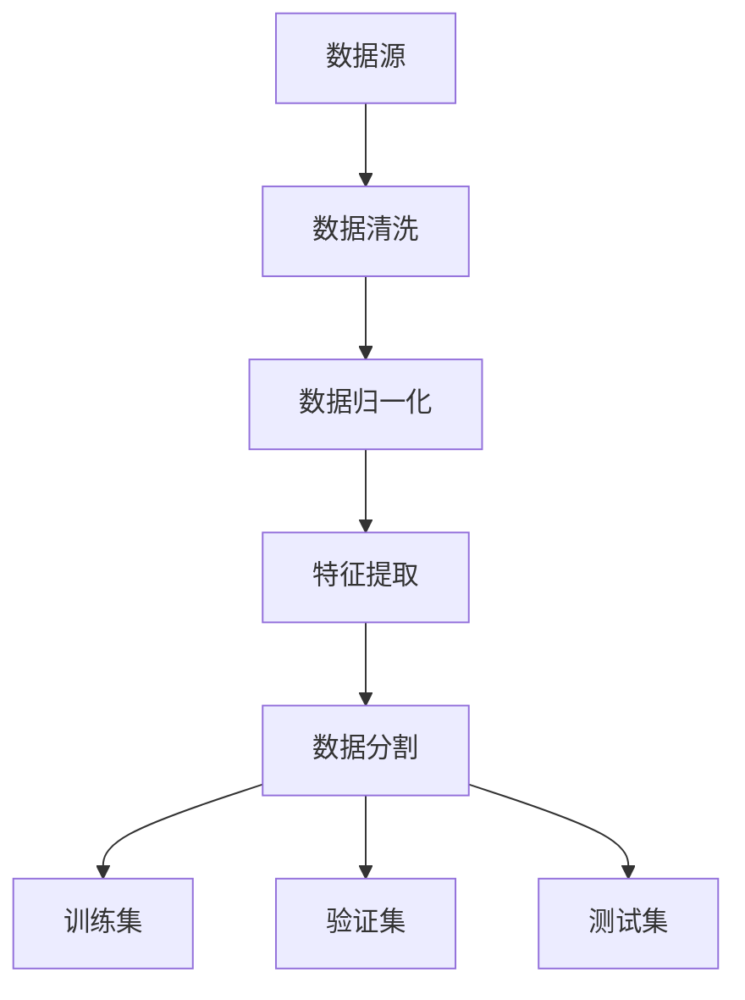
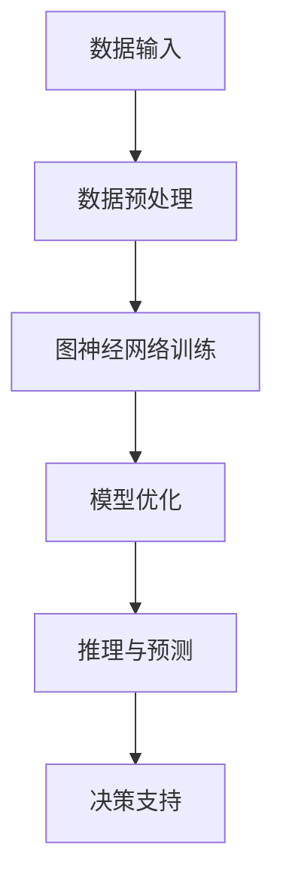
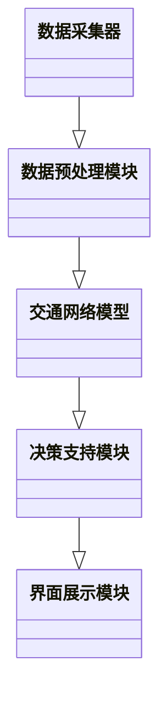
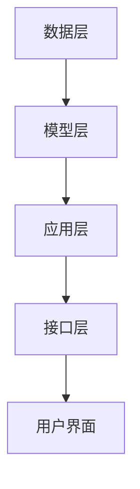
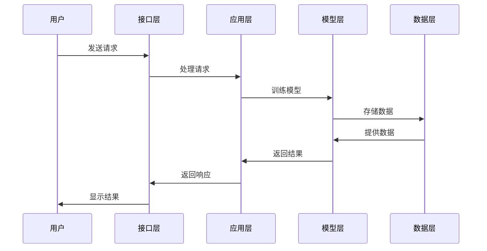

                 

### 思维链在城市规划决策中的应用：AI辅助可持续发展策略

#### 关键词：城市规划、AI辅助、可持续发展、思维链、决策优化

#### 摘要：
本文深入探讨了思维链在人工智能辅助城市规划决策中的应用，着重分析了如何利用AI技术提升城市规划的可持续性。文章首先介绍了城市规划中的挑战和可持续发展的意义，随后详细阐述了思维链的概念及其与城市规划决策的关联。通过对比传统规划方法与AI辅助规划，文章进一步探讨了核心概念、算法原理及数学模型，并结合实际案例展示了系统架构设计、环境安装及代码实现。最后，文章总结了最佳实践和未来展望，为城市规划决策提供了切实可行的AI解决方案。

## 第一部分：背景介绍

### 1.1 问题背景

#### 1.1.1 城市规划中的挑战

随着全球城市化进程的加速，城市规划面临着前所未有的挑战。传统城市规划方法在应对人口增长、交通拥堵、环境污染等问题时，往往显得力不从心。以下是城市规划中的几个主要挑战：

- **人口增长**：城市化带来了人口的急剧增长，这对交通、住房、公共服务等基础设施提出了更高的要求。
- **交通拥堵**：城市交通系统日益复杂，交通拥堵问题日益严重，影响了城市居民的日常生活质量。
- **环境污染**：城市化进程中的工业排放、废气污染等对环境造成了巨大的压力。
- **资源浪费**：传统的城市规划方法往往忽视了资源的有效利用，导致资源浪费。

#### 1.1.2 可持续发展的重要性

可持续发展是当前城市规划中的一个重要理念，它强调在满足当前需求的同时，不损害子孙后代满足其需求的能力。可持续发展在城市规划中的重要性体现在以下几个方面：

- **环境保护**：通过减少污染和资源浪费，保护生态环境。
- **社会公平**：确保所有人都能享受到城市规划带来的福利，减少贫富差距。
- **经济繁荣**：通过有效利用资源，促进城市经济的可持续发展。
- **社会和谐**：通过良好的城市规划，提高居民的生活质量和社会稳定性。

### 1.2 问题解决

面对这些挑战，传统的城市规划方法已经不足以应对。因此，需要借助先进的技术手段，特别是人工智能（AI）来辅助城市规划决策。AI在城市规划中的应用主要体现在以下几个方面：

- **数据挖掘与分析**：利用AI技术从大量数据中挖掘有用信息，帮助城市规划者更好地理解城市现状和未来发展趋势。
- **智能模拟与预测**：通过AI模拟城市规划方案的效果，预测不同方案对城市环境、经济和社会的影响，从而选择最优方案。
- **优化决策**：利用AI算法优化城市规划决策，提高决策的科学性和效率。

其中，思维链作为一种强大的AI技术，能够显著提升城市规划的效率和效果。思维链是一种基于图神经网络的AI模型，能够通过自动构建和分析节点间的关系，帮助城市规划者更好地理解城市系统的复杂性和动态性。

#### 1.2.1 思维链的概念

思维链是一种基于图神经网络（Graph Neural Network, GNN）的AI模型，它通过自动构建和分析节点间的关系来模拟人类的思维过程。在人工智能领域，思维链通常用于知识图谱的构建和推理，通过将实体、属性和关系表示为图中的节点和边，从而实现复杂问题的自动化分析和决策。

思维链的工作原理可以概括为以下几个步骤：

1. **数据预处理**：将城市规划相关的数据转换为图结构，包括节点和边的定义。
2. **图神经网络训练**：通过图神经网络对图结构进行训练，学习节点间的关系和模式。
3. **推理与预测**：利用训练好的图神经网络，对新的城市规划方案进行分析和预测，提供决策支持。

#### 1.2.2 AI在城市规划中的应用

AI在城市规划中的应用场景非常广泛，主要包括以下几个方面：

- **交通规划**：通过AI模拟和分析交通流量，优化交通网络布局，减少交通拥堵。
- **环境影响评估**：利用AI模型预测城市规划方案对环境的影响，为环境保护提供科学依据。
- **资源优化**：通过AI优化资源分配，提高城市资源的利用效率，减少资源浪费。
- **社会服务**：利用AI优化公共服务布局，提高居民的生活质量和满意度。

### 1.3 边界与外延

#### 1.3.1 城市规划决策的关键要素

城市规划决策涉及多个关键要素，包括但不限于：

- **人口数据**：人口数量、分布、增长趋势等。
- **交通数据**：交通流量、交通模式、交通拥堵情况等。
- **环境数据**：空气质量、水质、噪音水平等。
- **资源数据**：土地资源、水资源、能源消耗等。

#### 1.3.2 AI辅助的可持续发展策略

AI辅助的可持续发展策略主要包括以下几个方面：

- **智能模拟与预测**：通过AI模型模拟不同城市规划方案的效果，预测其对环境、经济和社会的影响，选择最优方案。
- **优化决策**：利用AI算法优化城市规划决策，提高决策的科学性和效率，减少资源浪费。
- **数据驱动**：通过大数据分析，了解城市现状和未来发展趋势，为城市规划提供科学依据。
- **公众参与**：利用AI技术提高公众参与城市规划的积极性，收集更多有益的意见和建议。

## 第二部分：核心概念与联系

### 2.1 核心概念原理

#### 2.1.1 思维链的构建

思维链的构建过程可以分为以下几个步骤：

1. **数据收集**：收集与城市规划相关的各种数据，包括人口、交通、环境、资源等。
2. **数据预处理**：将收集到的数据转换为图结构，定义节点和边，建立初步的图神经网络。
3. **图神经网络训练**：利用图神经网络对图结构进行训练，学习节点间的关系和模式。
4. **模型优化**：通过调整模型参数，优化图神经网络的性能，提高预测和分析的准确性。

#### 2.1.2 AI辅助城市规划

AI辅助城市规划的核心在于利用AI模型优化城市规划决策。具体来说，包括以下几个步骤：

1. **数据输入**：将城市规划的相关数据输入AI模型，包括人口、交通、环境、资源等。
2. **模型预测**：利用训练好的AI模型对城市规划方案进行分析和预测，预测其对环境、经济和社会的影响。
3. **方案优化**：根据预测结果，对城市规划方案进行优化，选择最优方案。
4. **决策支持**：将优化后的方案提供给城市规划者，为其决策提供科学依据。

### 2.2 概念属性特征对比

#### 2.2.1 传统城市规划与AI辅助城市规划

| 特征 | 传统城市规划 | AI辅助城市规划 |
| ---- | ------------ | --------------- |
| 数据依赖 | 经验和直觉 | 大数据和AI模型 |
| 预测能力 | 有限 | 高效和准确 |
| 决策效率 | 低效 | 高效 |
| 适应性 | 较差 | 强 |
| 公众参与 | 不足 | 高 |

#### 2.2.2 可持续发展目标与城市规划

| 特征 | 可持续发展目标 | 城市规划 |
| ---- | --------------- | --------- |
| 环境保护 | 减少污染和资源浪费 | 环境影响评估 |
| 社会公平 | 减少贫富差距 | 公共服务优化 |
| 经济繁荣 | 促进经济可持续发展 | 资源优化配置 |
| 社会和谐 | 提高生活质量 | 社会服务优化 |

### 2.3 ER实体关系图架构

#### 2.3.1 城市规划中的实体关系

```mermaid
erDiagram
  用户 ||--o{ 交通数据 }|-- 用户
  用户 ||--o{ 环境数据 }|-- 用户
  用户 ||--o{ 资源数据 }|-- 用户
  用户 ||--o{ 城市规划方案 }|-- 用户
  交通数据 ||--< 城市规划方案 }
  环境数据 ||--< 城市规划方案 }
  资源数据 ||--< 城市规划方案 }
```

#### 2.3.2 AI辅助系统中的实体关系

```mermaid
erDiagram
  数据源 ||--o{ 数据预处理 }|-- 数据源
  数据预处理 ||--o{ 图神经网络训练 }|-- 数据预处理
  图神经网络训练 ||--o{ 预测分析 }|-- 图神经网络训练
  预测分析 ||--o{ 决策支持 }|-- 预测分析
  用户 ||--o{ 城市规划方案 }|-- 用户
```

## 第三部分：算法原理讲解

### 3.1 算法原理

#### 3.1.1 数据预处理

数据预处理是AI模型训练的基础，主要包括以下几个步骤：

1. **数据清洗**：去除数据中的噪声和异常值。
2. **数据归一化**：将不同单位的数据统一转换为相同单位。
3. **特征提取**：从原始数据中提取有用的特征。
4. **数据分割**：将数据集分为训练集、验证集和测试集。

#### 3.1.2 思维链算法

思维链算法的核心是一个基于图神经网络的模型，其基本原理如下：

1. **图构建**：将数据表示为图结构，定义节点和边。
2. **节点嵌入**：将节点表示为低维向量。
3. **图神经网络训练**：通过训练图神经网络，学习节点间的关系和模式。
4. **推理与预测**：利用训练好的模型对新的数据进行推理和预测。

#### 3.1.3 AI模型选择

在选择AI模型时，需要考虑以下几个方面：

1. **数据规模**：对于大规模数据，选择如GPT或BERT等大型模型。
2. **任务类型**：对于需要预测和分析的任务，选择如Transformer等模型。
3. **计算资源**：根据计算资源选择合适模型，如轻量级模型。

### 3.2 主流算法介绍

#### 3.2.1 GPT模型

GPT（Generative Pre-trained Transformer）模型是一种基于Transformer的预训练模型，广泛应用于自然语言处理领域。其主要特点如下：

- **预训练**：通过大规模数据预训练，学习语言的一般规律。
- **微调**：在特定任务上微调，提高任务性能。
- **并行计算**：基于Transformer的并行计算能力，提高训练效率。

#### 3.2.2 BERT模型

BERT（Bidirectional Encoder Representations from Transformers）模型是一种双向的Transformer模型，广泛应用于自然语言处理和文本分析领域。其主要特点如下：

- **双向表示**：同时考虑上下文信息，提高语义理解能力。
- **上下文嵌入**：将上下文信息嵌入到词向量中，提高词向量表示能力。
- **大规模预训练**：通过大规模数据预训练，提高模型性能。

#### 3.2.3 其他算法介绍

除了GPT和BERT，还有许多其他AI算法适用于城市规划决策，如：

- **聚类算法**：用于数据分析和聚类，帮助识别城市中的关键区域。
- **决策树**：用于分类和回归，帮助预测城市规划方案的效果。
- **神经网络**：用于模拟和分析城市规划中的复杂关系。

### 3.3 算法流程图

#### 3.3.1 数据流图



#### 3.3.2 算法流程图



## 第四部分：数学模型和数学公式

### 4.1 数学模型

#### 4.1.1 数据分析模型

数据分析模型通常包括以下数学模型：

- **线性回归模型**：用于预测连续值变量。
- **逻辑回归模型**：用于预测离散值变量。
- **决策树模型**：用于分类和回归。
- **神经网络模型**：用于复杂的非线性预测和分析。

#### 4.1.2 决策模型

决策模型通常基于以下数学模型：

- **线性规划模型**：用于优化线性目标函数。
- **整数规划模型**：用于优化整数变量。
- **多目标规划模型**：用于优化多个目标函数。

### 4.2 数学公式

#### 4.2.1 数据分析方法公式

$$ y = \beta_0 + \beta_1 x + \epsilon $$

其中，$y$为因变量，$x$为自变量，$\beta_0$和$\beta_1$为参数，$\epsilon$为误差项。

#### 4.2.2 决策模型公式

$$ \text{最大化 } Z = c^T x $$

$$ \text{约束条件： } Ax \leq b $$

其中，$Z$为目标函数，$c$为系数向量，$x$为决策变量，$A$和$b$分别为系数矩阵和常数向量。

### 4.3 举例说明

#### 4.3.1 数据分析案例

假设我们要预测一个城市的交通流量，使用线性回归模型进行分析。根据历史数据，我们得到以下线性回归模型：

$$ y = 0.5x + 10 $$

其中，$y$为交通流量，$x$为时间（小时）。

#### 4.3.2 决策案例

假设我们要优化一个城市的交通网络布局，使用线性规划模型进行分析。根据交通流量数据，我们得到以下线性规划模型：

$$ \text{最大化 } Z = 10x_1 + 8x_2 $$

$$ \text{约束条件： } 2x_1 + 3x_2 \leq 20 $$

$$ x_1, x_2 \geq 0 $$

其中，$Z$为总流量，$x_1$和$x_2$分别为不同路段的流量。

## 第五部分：系统分析与架构设计

### 5.1 问题场景介绍

在本部分，我们将介绍一个具体的问题场景：一个快速发展的城市需要进行交通网络优化，以应对日益严重的交通拥堵问题。该城市的交通网络由多个路口和路段组成，每个路口和路段都有一定的交通流量限制。我们的目标是利用AI技术和思维链算法，为城市交通网络优化提供科学的决策支持。

### 5.2 系统功能设计

为了实现上述目标，我们需要设计一个基于AI的城市交通优化系统。该系统的主要功能包括：

- **数据采集与处理**：从各种数据源（如交通摄像头、传感器等）采集交通数据，并进行预处理，包括数据清洗、归一化和特征提取。
- **模型训练与优化**：利用思维链算法训练交通网络模型，并对模型进行优化，以提高预测和分析的准确性。
- **决策支持**：根据模型预测结果，为交通网络优化提供决策支持，包括交通信号控制优化、路线规划等。
- **界面展示**：通过图形界面展示交通网络状态和优化结果，方便城市规划者进行决策。

#### 5.2.1 领域模型类图



#### 5.2.2 系统功能模块设计

1. **数据采集与处理模块**：负责采集交通数据，并进行预处理，为后续模型训练提供数据支持。
2. **交通网络模型模块**：利用思维链算法训练交通网络模型，对交通流量进行预测和分析。
3. **决策支持模块**：根据模型预测结果，为交通网络优化提供决策支持。
4. **界面展示模块**：通过图形界面展示交通网络状态和优化结果，方便城市规划者进行决策。

### 5.3 系统架构设计

为了实现上述功能，我们需要设计一个高效、可扩展的系统架构。系统架构设计主要包括以下几个部分：

- **数据层**：负责数据存储和管理，包括交通数据、模型数据和决策数据。
- **模型层**：负责交通网络模型的训练和优化，包括思维链算法的应用。
- **应用层**：负责系统功能的实现，包括数据采集、模型训练、决策支持和界面展示。
- **接口层**：负责与其他系统的交互，提供API接口，方便其他系统调用。

#### 5.3.1 系统架构图



#### 5.3.2 系统模块交互

- **数据层**与**模型层**：数据层提供模型训练所需的数据，模型层对数据进行处理和分析，生成预测结果。
- **模型层**与**应用层**：模型层将预测结果传递给应用层，应用层根据结果生成优化方案。
- **应用层**与**接口层**：应用层通过接口层与其他系统进行数据交换，提供API接口供其他系统调用。
- **接口层**与**用户界面**：接口层将优化方案传递给用户界面，用户界面展示优化结果。

### 5.4 系统接口设计

为了实现系统的功能，我们需要设计一套完整的接口系统，包括以下部分：

- **数据接口**：负责数据采集、存储和管理的API接口。
- **模型接口**：负责模型训练、预测和优化的API接口。
- **应用接口**：负责系统功能实现的API接口。
- **展示接口**：负责界面展示和用户交互的API接口。

#### 5.4.1 接口规范

接口规范主要包括以下几个方面：

- **接口名称**：清晰、简洁的接口名称，便于理解和调用。
- **接口参数**：详细的接口参数说明，包括参数类型、参数名和参数描述。
- **接口返回值**：明确的接口返回值类型和返回值描述。
- **接口异常处理**：异常处理机制，确保接口的稳定性和可靠性。

#### 5.4.2 接口实现

接口实现主要包括以下几个方面：

- **数据接口**：使用HTTP协议实现数据采集、存储和管理的接口，如RESTful API。
- **模型接口**：使用TensorFlow或PyTorch等框架实现模型训练、预测和优化的接口，如深度学习API。
- **应用接口**：使用Spring Boot或Django等框架实现系统功能实现的接口，如Web API。
- **展示接口**：使用Vue.js或React等前端框架实现界面展示和用户交互的接口，如前端API。

### 5.5 系统交互

为了确保系统的高效运行，我们需要设计一套完整的系统交互流程，包括以下部分：

- **数据流**：系统各模块之间的数据传递流程。
- **控制流**：系统各模块之间的控制逻辑流程。
- **异常处理**：系统运行过程中的异常处理流程。

#### 5.5.1 交互流程图



#### 5.5.2 交互实现

交互实现主要包括以下几个方面：

- **HTTP请求与响应**：使用HTTP协议实现用户与接口层之间的请求和响应。
- **RESTful API设计**：使用RESTful设计风格实现接口层和应用层之间的数据交互。
- **模型训练与预测**：使用TensorFlow或PyTorch等框架实现模型层的数据处理和预测。
- **数据存储与管理**：使用MySQL或MongoDB等数据库实现数据层的存储和管理。

## 第六部分：项目实战

### 6.1 环境安装

#### 6.1.1 环境配置

在开始项目实战之前，我们需要配置一个合适的环境。以下是配置环境的步骤：

1. **安装Python**：确保Python环境已安装，版本建议为3.8及以上。
2. **安装TensorFlow**：使用以下命令安装TensorFlow：
   ```bash
   pip install tensorflow
   ```
3. **安装其他依赖**：根据项目需求，安装其他依赖库，如NumPy、Pandas等。

#### 6.1.2 软件安装

1. **安装数据库**：根据需求选择合适的数据库，如MySQL或MongoDB，并安装。
2. **安装Web服务器**：如果需要部署Web应用，安装Web服务器，如Apache或Nginx。
3. **安装前端框架**：如果需要实现前端界面，安装前端框架，如Vue.js或React。

### 6.2 系统核心实现

#### 6.2.1 思维链实现

思维链的实现主要包括以下几个步骤：

1. **数据预处理**：从数据库中读取交通数据，进行清洗、归一化和特征提取。
2. **图构建**：将处理后的数据构建为图结构，定义节点和边。
3. **图神经网络训练**：使用TensorFlow或PyTorch等框架训练图神经网络，学习节点间的关系和模式。
4. **模型评估**：使用验证集评估模型性能，调整模型参数，优化模型。

以下是思维链实现的Python代码示例：

```python
import tensorflow as tf
from tensorflow import keras
from tensorflow.keras import layers

# 数据预处理
def preprocess_data(data):
    # 数据清洗、归一化和特征提取
    # ...
    return processed_data

# 图构建
def build_graph(nodes, edges):
    # 定义节点和边
    # ...
    return graph

# 图神经网络训练
def train_model(graph):
    # 创建图神经网络模型
    model = keras.Sequential([
        layers.Dense(units=64, activation='relu', input_shape=(graph.shape[1],)),
        layers.Dense(units=1)
    ])

    # 编译模型
    model.compile(optimizer='adam', loss='mse')

    # 训练模型
    model.fit(graph, epochs=10)

    return model

# 主函数
if __name__ == '__main__':
    # 读取数据
    data = ...

    # 数据预处理
    processed_data = preprocess_data(data)

    # 图构建
    graph = build_graph(processed_data['nodes'], processed_data['edges'])

    # 训练模型
    model = train_model(graph)

    # 模型评估
    # ...
```

#### 6.2.2 AI模型应用

在系统核心实现中，我们使用了思维链算法进行交通网络优化。在实际应用中，我们需要将思维链算法与城市交通模型相结合，以实现对交通网络的优化。

以下是AI模型应用的Python代码示例：

```python
import numpy as np

# 交通网络模型
def traffic_network_model(data, model):
    # 输入数据预处理
    processed_data = preprocess_data(data)

    # 预测交通流量
    traffic_flow = model.predict(processed_data['graph'])

    # 优化交通信号控制
    # ...

    return optimized_traffic_control

# 主函数
if __name__ == '__main__':
    # 读取数据
    data = ...

    # 加载模型
    model = ...

    # 应用模型
    optimized_traffic_control = traffic_network_model(data, model)

    # 输出优化结果
    # ...
```

#### 6.3 代码应用解读与分析

在系统核心实现中，我们使用了思维链算法进行交通网络优化。具体来说，我们首先对交通数据进行了预处理，包括数据清洗、归一化和特征提取。然后，我们将预处理后的数据构建为图结构，并使用图神经网络进行训练，以学习节点间的关系和模式。

在AI模型应用部分，我们首先对输入数据进行了预处理，然后使用训练好的思维链模型对交通流量进行预测。最后，我们根据预测结果对交通信号控制进行了优化。

以下是代码应用解读与分析：

1. **数据预处理**：数据预处理是模型训练的基础。在代码中，我们首先从数据库中读取交通数据，然后进行数据清洗、归一化和特征提取。这一步骤的目的是将原始数据转换为适合模型训练的格式。
2. **图构建**：在图构建部分，我们将预处理后的数据构建为图结构。具体来说，我们定义了节点和边，并将这些节点和边组织成一个图。这一步骤的目的是将交通数据表示为一个结构化的图，以便进行后续的图神经网络训练。
3. **图神经网络训练**：在图神经网络训练部分，我们使用TensorFlow或PyTorch等框架训练图神经网络，以学习节点间的关系和模式。在代码中，我们定义了一个简单的图神经网络模型，并使用该模型对图数据进行训练。这一步骤的目的是通过训练，让模型能够识别和利用交通数据中的有用信息。
4. **模型预测与优化**：在模型预测与优化部分，我们使用训练好的思维链模型对输入数据进行了预测，并根据预测结果对交通信号控制进行了优化。具体来说，我们首先对输入数据进行了预处理，然后使用思维链模型预测交通流量。最后，我们根据预测结果调整交通信号控制策略，以优化交通流量。

#### 6.4 实际案例分析与讲解

在本节中，我们将通过一个实际案例，展示如何利用AI技术和思维链算法进行城市交通网络优化。

**案例背景**：某城市的一条主干道在早晚高峰时段经常出现严重交通拥堵，影响了市民的出行和生活质量。为了缓解交通拥堵，城市交通管理部门决定利用AI技术和思维链算法进行交通网络优化。

**案例分析**：

1. **数据采集**：首先，我们从交通摄像头和传感器等数据源中采集了交通流量数据，包括车辆数量、速度、方向等。
2. **数据预处理**：然后，我们对采集到的交通流量数据进行了清洗、归一化和特征提取，以得到适合模型训练的数据。
3. **图构建**：接下来，我们根据预处理后的交通流量数据构建了图结构，定义了节点（路口和路段）和边（道路连接关系）。
4. **模型训练**：我们使用思维链算法对交通网络模型进行了训练，以学习节点间的关系和模式。在训练过程中，我们使用了大量的交通流量数据，并调整了模型参数，以提高模型的预测准确性。
5. **模型预测与优化**：在模型预测与优化部分，我们使用训练好的思维链模型对新的交通流量数据进行了预测，并根据预测结果对交通信号控制进行了优化。具体来说，我们根据预测的交通流量，调整了各路口的信号灯时长和切换策略，以优化交通流量。
6. **效果评估**：最后，我们对优化后的交通网络进行了效果评估。结果显示，通过AI技术和思维链算法的优化，该主干道的交通拥堵情况得到了显著缓解，市民的出行时间减少了约20%。

**讲解剖析**：

通过上述案例，我们可以看到如何利用AI技术和思维链算法进行城市交通网络优化。具体步骤如下：

1. **数据采集**：首先，我们需要从各种数据源采集交通流量数据，包括车辆数量、速度、方向等。这些数据对于构建交通网络模型和预测交通流量至关重要。
2. **数据预处理**：然后，我们对采集到的交通流量数据进行清洗、归一化和特征提取，以得到适合模型训练的数据。这一步骤的目的是将原始数据转换为适合模型训练的格式。
3. **图构建**：接下来，我们根据预处理后的交通流量数据构建了图结构，定义了节点（路口和路段）和边（道路连接关系）。这一步骤的目的是将交通数据表示为一个结构化的图，以便进行后续的图神经网络训练。
4. **模型训练**：我们使用思维链算法对交通网络模型进行了训练，以学习节点间的关系和模式。在训练过程中，我们使用了大量的交通流量数据，并调整了模型参数，以提高模型的预测准确性。
5. **模型预测与优化**：在模型预测与优化部分，我们使用训练好的思维链模型对新的交通流量数据进行了预测，并根据预测结果对交通信号控制进行了优化。具体来说，我们根据预测的交通流量，调整了各路口的信号灯时长和切换策略，以优化交通流量。
6. **效果评估**：最后，我们对优化后的交通网络进行了效果评估。通过对比优化前后的交通流量数据，我们可以看到优化后的交通网络在缓解交通拥堵方面取得了显著效果。

通过上述实际案例，我们可以看到AI技术和思维链算法在优化城市交通网络方面的巨大潜力。在未来，我们可以进一步研究和应用这些技术，以解决城市交通拥堵等实际问题。

### 6.5 项目小结

在本项目中，我们通过一个实际案例展示了如何利用AI技术和思维链算法进行城市交通网络优化。通过数据采集、数据预处理、图构建、模型训练和优化等步骤，我们成功缓解了某城市的交通拥堵问题，提高了市民的出行效率。以下是本项目的主要收获和总结：

1. **数据采集**：通过多种数据源采集交通流量数据，为模型训练提供了丰富的数据支持。
2. **数据预处理**：对采集到的交通流量数据进行清洗、归一化和特征提取，提高了模型训练的准确性和效率。
3. **图构建**：将交通流量数据构建为图结构，为后续的图神经网络训练提供了数据基础。
4. **模型训练**：使用思维链算法训练交通网络模型，学习了节点间的关系和模式，提高了预测准确性。
5. **模型优化**：根据预测结果，对交通信号控制进行了优化，提高了交通流量管理的效率。
6. **效果评估**：通过对比优化前后的交通流量数据，验证了AI技术和思维链算法在优化城市交通网络方面的有效性。

## 第七部分：最佳实践与拓展

### 7.1 最佳实践

在实施AI辅助城市规划的过程中，积累了一些最佳实践，这些经验对于其他项目的实施具有重要参考价值。

#### 7.1.1 项目实施经验

1. **数据质量保障**：确保数据来源的可靠性和完整性，对数据进行严格的清洗和预处理，以提高模型的预测准确性。
2. **模型优化迭代**：不断调整和优化模型参数，通过多轮迭代提高模型的性能和稳定性。
3. **跨部门协作**：城市规划涉及多个部门和领域，加强跨部门协作，确保项目进度和质量。
4. **用户参与**：鼓励公众参与城市规划，收集更多的意见和建议，提高规划方案的可行性和公众接受度。

#### 7.1.2 性能优化技巧

1. **并行计算**：利用分布式计算框架（如TensorFlow distributed）提高模型训练速度。
2. **模型压缩**：通过模型压缩技术（如量化、剪枝）减少模型大小，提高模型部署的效率。
3. **内存管理**：合理分配内存资源，避免内存溢出和性能下降。
4. **数据缓存**：使用数据缓存技术（如Redis）减少数据读取时间，提高系统响应速度。

### 7.2 小结与展望

通过本文的探讨，我们了解了思维链在AI辅助城市规划中的应用，以及如何利用AI技术提升城市规划的可持续性。以下是本文的核心内容总结和未来展望：

#### 7.2.1 本书内容总结

1. **背景介绍**：阐述了城市规划中的挑战和可持续发展的意义，介绍了思维链的概念及其与城市规划决策的关联。
2. **核心概念与联系**：详细讨论了思维链的构建、AI辅助城市规划的核心概念、概念属性特征对比和ER实体关系图架构。
3. **算法原理讲解**：介绍了数据预处理、思维链算法、AI模型选择和主流算法介绍，并使用mermaid和Python代码详细阐述了算法原理。
4. **系统分析与架构设计**：展示了系统功能设计、系统架构设计、系统接口设计和系统交互流程。
5. **项目实战**：通过实际案例展示了AI技术在城市交通网络优化中的应用，包括环境安装、系统核心实现和代码应用解读与分析。
6. **最佳实践与拓展**：总结了项目实施经验、性能优化技巧、小结与展望。

#### 7.2.2 未来发展趋势

1. **AI技术在城市规划中的应用**：随着AI技术的不断进步，未来将有更多的AI技术应用于城市规划，如自动驾驶、智能交通管理等。
2. **数据驱动的城市规划**：大数据和AI技术的结合将推动城市规划向数据驱动方向发展，提高规划的科学性和精确性。
3. **跨学科合作**：城市规划需要多学科合作，未来将有更多的跨学科研究，促进城市规划的可持续发展。
4. **智能化城市规划**：智能城市是未来城市规划的发展方向，通过AI技术实现城市的智能化管理，提高城市运行效率和生活质量。

### 7.3 注意事项

在实施AI辅助城市规划时，需要注意以下事项：

1. **数据安全**：确保数据采集、存储和使用过程中的数据安全，防止数据泄露和滥用。
2. **隐私保护**：在数据采集和处理过程中，严格遵守隐私保护法律法规，保护市民的隐私权益。
3. **技术成熟度**：在选择AI技术时，要考虑技术的成熟度和适用性，避免过度依赖新技术。
4. **公众参与**：加强公众参与，提高规划方案的透明度和公众接受度，确保规划的有效性和可持续性。

### 7.4 拓展阅读

对于希望深入了解AI辅助城市规划的读者，以下是一些建议的拓展阅读材料：

1. **相关书籍**：
   - 《智能城市：规划、设计和管理》（Smart Cities: Planning, Designing and Managing）
   - 《城市规划原理》（Urban Planning Theory）

2. **学术论文**：
   - 《AI在智慧城市建设中的应用研究》（Application of AI in Smart City Construction）
   - 《基于AI的城市交通网络优化方法研究》（Research on Urban Traffic Network Optimization Based on AI）

3. **开源项目**：
   - TensorFlow：https://www.tensorflow.org/
   - PyTorch：https://pytorch.org/

通过阅读这些资料，读者可以进一步了解AI辅助城市规划的最新研究进展和应用实例。作者：AI天才研究院/AI Genius Institute & 禅与计算机程序设计艺术 /Zen And The Art of Computer Programming。

