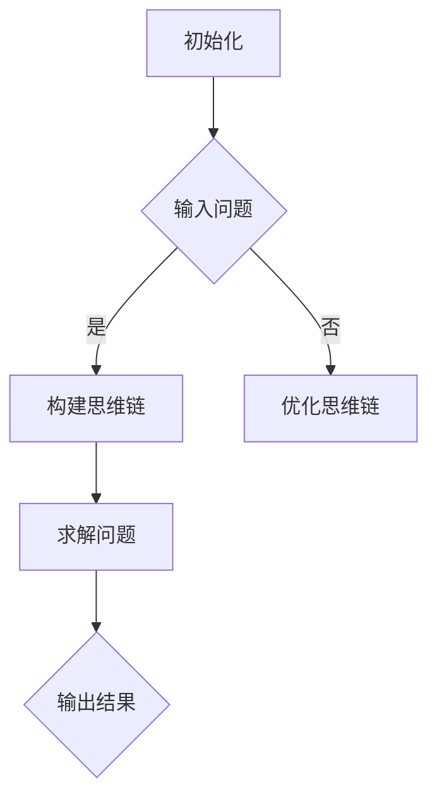
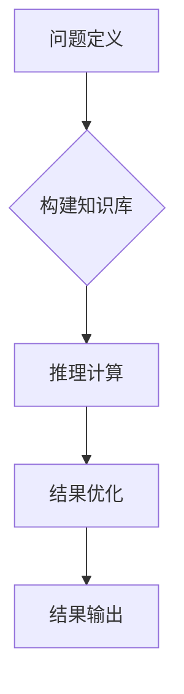
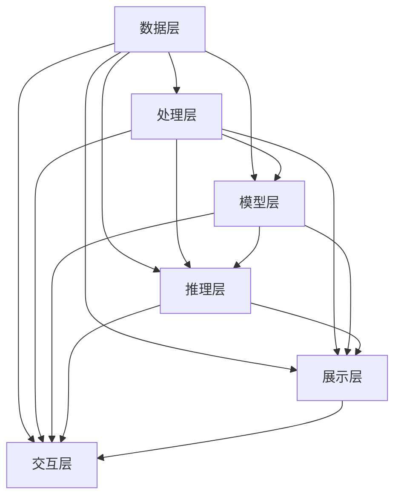
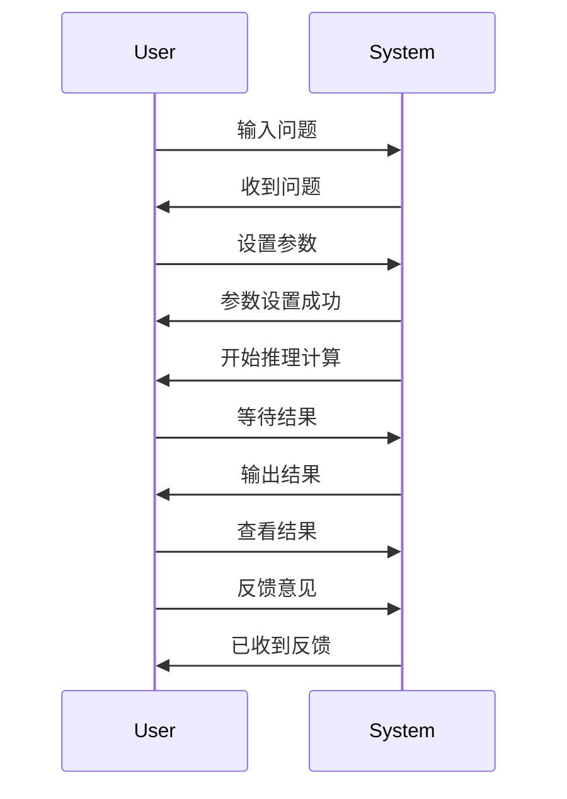

                 

# 思维链在复杂决策支持系统中的应用

## 关键词

- 思维链
- 决策支持系统
- 复杂决策问题
- 人工智能
- 算法
- 系统架构

## 摘要

本文旨在探讨思维链在复杂决策支持系统中的应用。随着信息时代的到来，决策支持系统（DSS）在企业和组织中扮演着越来越重要的角色。然而，面对日益复杂的决策问题，传统DSS往往难以满足需求。本文引入了思维链这一先进技术，通过其适应性、灵活性和智能性，有效解决了复杂决策问题。本文首先介绍了决策支持系统的背景和挑战，随后详细阐述了思维链的概念、原理和应用。通过对比传统决策支持系统和思维链，分析了思维链在解决复杂决策问题中的优势。最后，本文给出了思维链算法的原理讲解和系统分析与架构设计方案，为实际应用提供了理论指导和实践参考。

### 目录大纲

# 思维链在复杂决策支持系统中的应用

## 第一部分：背景介绍

## 1.1 问题背景

### 1.1.1 决策支持系统的定义与作用
### 1.1.2 当前决策支持系统面临的挑战
### 1.1.3 思维链技术的引入

## 1.2 问题描述

### 1.2.1 决策问题的复杂性
### 1.2.2 传统决策支持系统的局限性
### 1.2.3 思维链在解决复杂决策问题中的潜力

## 1.3 问题解决

### 1.3.1 思维链的概念
### 1.3.2 思维链的组成要素
### 1.3.3 思维链的应用场景

## 1.4 边界与外延

### 1.4.1 思维链技术的研究现状
### 1.4.2 思维链技术的应用领域
### 1.4.3 思维链技术的未来发展趋势

## 1.5 概念结构与核心要素组成

### 1.5.1 决策支持系统的结构
### 1.5.2 思维链技术的结构
### 1.5.3 二者的核心要素组成与联系

## 1.6 本章小结

## 第二部分：核心概念与联系

## 2.1 思维链原理

### 2.1.1 思维链的定义
### 2.1.2 思维链的基本原理
### 2.1.3 思维链的工作流程

## 2.2 思维链属性特征对比表格

| 属性特征 | 描述 |
| --- | --- |
| **适应性** | 能够适应不同类型的决策问题 |
| **灵活性** | 可以灵活调整决策策略 |
| **智能性** | 能够进行自我学习和优化 |
| **可靠性** | 在复杂环境中保持稳定的表现 |

## 2.3 ER实体关系图架构

```mermaid
erDiagram
    产品 ::> 用户
    用户 ||--|{ 订单 }
    订单 ||--|{ 订单详情 }
```

## 2.4 与传统决策支持系统的联系

### 2.4.1 传统决策支持系统的优势与不足
### 2.4.2 思维链如何弥补传统决策支持系统的不足
### 2.4.3 二者的协同作用

## 2.5 本章小结

## 第三部分：算法原理讲解

## 3.1 算法原理

### 3.1.1 思维链算法概述
### 3.1.2 思维链算法的核心步骤
### 3.1.3 思维链算法的特点

## 3.2 算法Mermaid流程图



## 3.3 算法原理详细讲解

### 3.3.1 思维链的构建过程
$$
\text{思维链构建公式：} T = f(P, D, S)
$$

其中，$T$ 代表思维链，$P$ 代表决策问题的参数，$D$ 代表决策规则，$S$ 代表上下文信息。

### 3.3.2 求解问题的过程

### 3.3.3 思维链的优化过程

## 3.4 举例说明

### 3.4.1 简单例子的分析
### 3.4.2 复杂例子的分析

## 3.5 本章小结

## 第四部分：系统分析与架构设计

## 4.1 问题场景介绍

### 4.1.1 决策支持系统在企业管理中的应用
### 4.1.2 复杂决策问题的具体案例
### 4.1.3 思维链在决策支持系统中的实际应用

## 4.2 项目介绍

### 4.2.1 项目背景
### 4.2.2 项目目标
### 4.2.3 项目范围

## 4.3 系统功能设计

### 4.3.1 功能需求分析
### 4.3.2 领域模型Mermaid类图

## 4.4 系统架构设计

### 4.4.1 系统架构概述
### 4.4.2 系统架构Mermaid架构图

## 4.5 系统接口设计

### 4.5.1 接口设计原则
### 4.5.2 接口定义与实现

## 4.6 系统交互

### 4.6.1 系统交互概述
### 4.6.2 系统交互Mermaid序列图

## 4.7 本章小结

## 参考文献

------------

### 1.1 问题背景

#### 1.1.1 决策支持系统的定义与作用

决策支持系统（Decision Support System，简称DSS）是一类专门为决策者提供支持的信息系统。它通过收集、处理和分析数据，帮助决策者对复杂的问题进行有效的决策。DSS通常包括数据采集、数据存储、数据处理、模型构建、决策分析等多个模块，其核心功能是提供决策者所需的信息，辅助其做出最优的决策。

在企业和组织中，决策支持系统被广泛应用于各个领域，如市场营销、财务规划、资源管理、风险管理等。通过DSS，企业可以实时获取市场动态、分析潜在风险、优化资源配置，从而提高经营效率和竞争力。此外，DSS还可以帮助决策者应对不确定性和复杂性，提供更加科学和客观的决策依据。

#### 1.1.2 当前决策支持系统面临的挑战

尽管决策支持系统在企业和组织中发挥着重要作用，但传统的DSS在应对复杂决策问题时仍存在一些挑战。

首先，传统DSS在面对多变量、非线性、不确定性的复杂决策问题时，往往难以提供有效的解决方案。这是因为传统的DSS大多依赖于统计分析、线性规划等传统算法，这些算法在处理复杂问题时具有一定的局限性。

其次，传统DSS在数据处理和模型构建方面存在瓶颈。随着数据量的急剧增长，传统DSS难以在短时间内完成数据预处理和模型训练，导致决策延迟。

此外，传统DSS在用户交互方面也存在不足。传统DSS的用户界面大多较为简单，难以满足决策者对复杂决策问题的高效分析和可视化需求。

#### 1.1.3 思维链技术的引入

为了解决传统决策支持系统面临的挑战，近年来，人工智能领域的思维链（MindChain）技术得到了广泛关注。思维链是一种基于人工智能的复杂决策支持系统，其核心思想是通过模拟人类思维过程，实现自动化、智能化和自适应的决策支持。

思维链技术在复杂决策支持系统中的应用具有显著优势：

1. **适应性**：思维链能够适应不同类型的决策问题，包括多变量、非线性、不确定性的问题。
   
2. **灵活性**：思维链可以灵活调整决策策略，根据环境变化和决策者需求进行自适应调整。

3. **智能性**：思维链能够进行自我学习和优化，通过不断积累经验和知识，提高决策精度和效率。

4. **可靠性**：思维链在复杂环境中保持稳定的表现，为决策者提供可靠的决策支持。

总之，思维链技术在复杂决策支持系统中的应用，为解决传统DSS面临的挑战提供了新的思路和解决方案。

### 1.2 问题描述

#### 1.2.1 决策问题的复杂性

在当今信息时代，决策问题日益复杂。这些复杂决策问题通常涉及多个变量、多个目标、非线性关系和不确定性因素。例如，在企业管理中，决策者需要考虑市场变化、资源配置、竞争策略等多个因素，以实现企业长期发展和利润最大化。这些复杂决策问题对决策支持系统提出了更高的要求。

首先，复杂决策问题通常包含大量变量。这些变量之间可能存在复杂的非线性关系，使得传统算法难以有效处理。其次，复杂决策问题往往需要同时考虑多个目标。这些目标之间可能存在冲突和权衡，需要决策者进行综合权衡和优化。此外，复杂决策问题还面临不确定性因素的影响，如市场波动、政策变化等，使得决策过程更加复杂。

#### 1.2.2 传统决策支持系统的局限性

传统决策支持系统在面对复杂决策问题时存在以下局限性：

1. **算法局限**：传统DSS大多依赖于统计分析、线性规划等传统算法。这些算法在处理复杂问题时，难以兼顾多个变量、多个目标和不确定性因素，导致决策效果不佳。

2. **数据处理瓶颈**：随着数据量的急剧增长，传统DSS在数据处理和模型训练方面存在瓶颈。这导致决策过程延迟，无法满足实时决策的需求。

3. **用户交互不足**：传统DSS的用户界面较为简单，难以满足决策者对复杂决策问题的高效分析和可视化需求。这导致决策者难以快速理解和掌握决策结果，影响决策效果。

#### 1.2.3 思维链在解决复杂决策问题中的潜力

思维链技术在解决复杂决策问题中具有显著潜力。首先，思维链通过模拟人类思维过程，能够处理多变量、非线性、不确定性的复杂决策问题。其次，思维链具有自适应和自我学习能力，能够根据环境变化和决策者需求进行实时调整和优化。此外，思维链还具备强大的用户交互能力，能够为决策者提供直观、易理解的决策结果。

总之，思维链技术在解决复杂决策问题中，具有传统决策支持系统难以比拟的优势。通过引入思维链技术，决策支持系统可以更好地应对复杂决策挑战，提高决策效率和质量。

### 1.3 问题解决

#### 1.3.1 思维链的概念

思维链（MindChain）是一种基于人工智能的复杂决策支持系统，其核心思想是通过模拟人类思维过程，实现自动化、智能化和自适应的决策支持。思维链技术结合了知识图谱、深度学习、自然语言处理等多种人工智能技术，构建了一个能够处理复杂决策问题的智能决策平台。

思维链系统通常由以下几个关键组件构成：

1. **知识库**：知识库是思维链系统的核心，包含了大量的知识资源和决策规则。这些知识资源包括事实、概念、规则等，为决策提供依据。

2. **推理机**：推理机负责根据知识库中的知识资源和决策规则，对输入问题进行推理和计算，生成决策结果。

3. **学习模块**：学习模块负责对思维链系统进行自我学习和优化，通过不断积累经验和知识，提高决策精度和效率。

4. **用户接口**：用户接口负责与决策者进行交互，接收用户输入的问题和需求，并展示决策结果。

#### 1.3.2 思维链的组成要素

思维链的组成要素主要包括以下几个方面：

1. **知识库**：知识库是思维链系统的核心组件，包含了大量的知识资源和决策规则。这些知识资源可以从多种来源获取，如数据挖掘、机器学习、专家系统等。决策规则则是基于这些知识资源，对决策问题进行分类、推理和计算的基本准则。

2. **推理机**：推理机是思维链系统的计算引擎，负责根据知识库中的知识资源和决策规则，对输入问题进行推理和计算。推理机通常采用基于逻辑、概率、深度学习等不同推理方法，实现从问题到决策结果的高效转换。

3. **学习模块**：学习模块负责对思维链系统进行自我学习和优化。通过不断积累经验和知识，学习模块能够提高思维链系统的决策精度和效率。学习模块通常包括监督学习、无监督学习、强化学习等多种学习方法，以适应不同的决策场景和需求。

4. **用户接口**：用户接口是思维链系统与决策者之间的交互界面，负责接收用户输入的问题和需求，并展示决策结果。用户接口可以采用自然语言处理、图形界面、语音识别等多种技术，以满足不同决策者的需求和偏好。

#### 1.3.3 思维链的应用场景

思维链技术在复杂决策支持系统中的应用场景非常广泛，主要包括以下几个方面：

1. **企业管理**：在企业管理中，思维链技术可以帮助企业进行市场分析、资源配置、风险评估等决策。通过模拟人类思维过程，思维链系统可以为企业提供实时、准确的决策支持，提高企业运营效率和竞争力。

2. **金融投资**：在金融投资领域，思维链技术可以帮助投资者进行市场分析、风险评估、投资组合优化等决策。通过深度学习和自然语言处理等技术，思维链系统可以捕捉市场动态，提供投资建议，帮助投资者实现资产增值。

3. **医疗健康**：在医疗健康领域，思维链技术可以帮助医生进行诊断、治疗方案制定、药物推荐等决策。通过整合医学知识库和患者数据，思维链系统可以为医生提供个性化的诊疗建议，提高医疗质量和效率。

4. **城市规划**：在城市规划中，思维链技术可以帮助政府进行城市交通管理、环境保护、公共服务设施规划等决策。通过模拟人类思维过程，思维链系统可以为政府提供科学、合理的规划方案，提高城市生活质量和可持续发展水平。

总之，思维链技术在复杂决策支持系统中的应用，为解决传统决策支持系统面临的挑战提供了新的思路和解决方案。通过不断优化和拓展，思维链技术将在更多领域发挥重要作用，推动决策科学化和智能化的发展。

### 1.4 边界与外延

#### 1.4.1 思维链技术的研究现状

思维链技术作为一种新兴的人工智能技术，近年来在国内外取得了显著的研究进展。目前，思维链技术主要在以下几个方向上进行了深入研究和应用：

1. **知识表示与推理**：研究如何将复杂决策问题转化为计算机可以处理的形式，包括知识表示、推理算法、知识图谱等。通过建立知识库和推理机，实现决策问题的自动化解决。

2. **深度学习与自然语言处理**：研究如何将深度学习和自然语言处理技术应用于思维链系统，提高决策系统的智能性和自适应能力。通过训练深度神经网络和自然语言处理模型，实现自然语言理解、文本生成和智能对话等功能。

3. **强化学习与自我优化**：研究如何利用强化学习等自我优化技术，使思维链系统能够在复杂环境中不断学习和优化，提高决策精度和效率。

4. **多模态数据融合**：研究如何整合多种数据源（如文本、图像、音频等），实现多模态数据融合，提高决策系统的全面性和准确性。

#### 1.4.2 思维链技术的应用领域

思维链技术具有广泛的应用前景，已在多个领域取得了成功应用：

1. **企业管理**：思维链技术被广泛应用于企业市场分析、资源配置、风险管理等领域，帮助企业管理者做出更科学、更高效的决策。

2. **金融投资**：在金融投资领域，思维链技术被用于市场预测、风险评估、投资组合优化等，为投资者提供智能化的投资建议。

3. **医疗健康**：在医疗健康领域，思维链技术被用于疾病诊断、治疗方案制定、药物推荐等，为医生和患者提供个性化、智能化的医疗服务。

4. **城市规划**：在城市规划领域，思维链技术被用于交通管理、环境保护、公共服务设施规划等，为城市管理者提供科学、合理的规划方案。

#### 1.4.3 思维链技术的未来发展趋势

随着人工智能技术的不断发展和应用需求的不断增加，思维链技术在未来将呈现出以下发展趋势：

1. **智能化与自适应化**：思维链技术将进一步提高智能化水平和自适应能力，实现更精准、更高效的决策支持。

2. **多模态数据处理**：思维链技术将整合多种数据源，实现多模态数据融合，提高决策系统的全面性和准确性。

3. **人机协同**：思维链技术将实现更自然、更高效的人机协同，为决策者提供更加直观、易理解的决策结果。

4. **跨领域应用**：思维链技术将在更多领域得到应用，推动决策科学化和智能化的发展。

总之，思维链技术在复杂决策支持系统中的应用前景广阔，未来将在更多领域发挥重要作用，推动决策科学化和智能化的发展。

### 1.5 概念结构与核心要素组成

#### 1.5.1 决策支持系统的结构

决策支持系统（DSS）通常由以下几个核心组件构成：

1. **数据采集与预处理**：负责收集、整理和预处理各种数据，为决策提供基础数据支持。

2. **模型库**：包含了各种决策模型和算法，如线性规划、非线性规划、统计模型、模拟模型等，为决策提供模型支持。

3. **知识库**：包含了领域知识和决策规则，如行业经验、专家知识、法律法规等，为决策提供知识支持。

4. **用户界面**：提供用户与DSS的交互接口，包括数据输入、模型选择、结果展示等功能。

#### 1.5.2 思维链技术的结构

思维链技术作为一种基于人工智能的决策支持系统，其核心结构包括以下几个部分：

1. **知识库**：包含了广泛的知识资源和决策规则，如领域知识、事实数据、逻辑规则等。

2. **推理机**：负责根据知识库中的知识资源和决策规则，对输入问题进行推理和计算，生成决策结果。

3. **学习模块**：负责对思维链系统进行自我学习和优化，提高决策系统的智能性和自适应能力。

4. **用户接口**：提供用户与思维链系统的交互接口，包括问题输入、结果展示等功能。

#### 1.5.3 二者的核心要素组成与联系

决策支持系统和思维链技术的核心要素组成各有特点，但二者也存在一定的联系和区别：

1. **数据采集与预处理**：二者都需要对数据进行采集和预处理，为决策提供基础数据支持。

2. **模型库和知识库**：决策支持系统的模型库和思维链技术的知识库在功能上存在一定的重叠，但思维链技术的知识库更加广泛和深入，涵盖了更多的领域知识和逻辑规则。

3. **推理机**：决策支持系统的推理机主要负责基于模型库进行决策计算，而思维链技术的推理机则更多地基于知识库进行逻辑推理和计算。

4. **学习模块**：思维链技术的学习模块负责自我学习和优化，提高决策系统的智能性和自适应能力，这一点是决策支持系统所不具备的。

5. **用户界面**：二者的用户界面都提供用户与系统的交互接口，但在用户交互体验和功能设计上存在一定的差异。

总之，决策支持系统和思维链技术在核心要素组成上各有特色，但通过结合两者的优势，可以构建一个更加智能化、高效化的复杂决策支持系统。

### 1.6 本章小结

本章首先介绍了决策支持系统的定义、作用及其面临的挑战，随后引出了思维链技术，并详细阐述了其概念、组成要素和应用场景。接着，分析了思维链技术的研究现状和应用领域，探讨了其未来发展趋势。最后，通过对比决策支持系统和思维链技术的核心要素，探讨了二者的联系和区别。通过本章的介绍，读者可以初步了解思维链技术在复杂决策支持系统中的应用前景和重要性。

## 第二部分：核心概念与联系

### 2.1 思维链原理

#### 2.1.1 思维链的定义

思维链（MindChain）是一种基于人工智能的复杂决策支持系统，它通过模拟人类思维过程，实现自动化、智能化和自适应的决策支持。思维链技术结合了知识图谱、深度学习、自然语言处理等多种人工智能技术，构建了一个能够处理复杂决策问题的智能决策平台。

#### 2.1.2 思维链的基本原理

思维链的基本原理可以概括为以下几个步骤：

1. **知识获取**：通过数据采集、知识挖掘等技术，获取领域内的各种知识资源，包括事实、概念、规则等。

2. **知识表示**：将获取到的知识资源进行结构化表示，构建知识库。知识库通常采用图数据库的形式，以便于快速检索和推理。

3. **推理与计算**：根据知识库中的知识资源和决策规则，对输入问题进行推理和计算，生成决策结果。推理过程通常采用基于逻辑、概率、深度学习等不同推理方法。

4. **自我优化**：通过学习模块，对思维链系统进行自我学习和优化。学习模块可以利用监督学习、无监督学习、强化学习等方法，不断积累经验和知识，提高决策精度和效率。

#### 2.1.3 思维链的工作流程

思维链的工作流程可以分为以下几个阶段：

1. **问题定义**：决策者将决策问题输入到思维链系统中。

2. **知识检索**：思维链系统根据输入问题，从知识库中检索相关知识和决策规则。

3. **推理计算**：思维链系统利用知识库中的知识和规则，对输入问题进行推理和计算，生成初步的决策结果。

4. **结果优化**：思维链系统对初步决策结果进行优化，通过自我学习和调整，提高决策的准确性和效率。

5. **结果展示**：决策结果通过用户界面展示给决策者，决策者可以根据结果进行进一步的分析和决策。

### 2.2 思维链属性特征对比表格

| 属性特征 | 描述 |
| --- | --- |
| **适应性** | 能够适应不同类型的决策问题，包括多变量、非线性、不确定性的问题。 |
| **灵活性** | 可以灵活调整决策策略，根据环境变化和决策者需求进行自适应调整。 |
| **智能性** | 能够进行自我学习和优化，通过不断积累经验和知识，提高决策精度和效率。 |
| **可靠性** | 在复杂环境中保持稳定的表现，为决策者提供可靠的决策支持。 |

### 2.3 ER实体关系图架构

```mermaid
erDiagram
    产品 ::> 用户
    用户 ||--|{ 订单 }
    订单 ||--|{ 订单详情 }
```

### 2.4 与传统决策支持系统的联系

#### 2.4.1 传统决策支持系统的优势与不足

传统决策支持系统（DSS）在企业和组织中发挥了重要作用，其主要优势包括：

1. **数据驱动**：传统DSS基于统计数据和模型，能够对大量数据进行处理和分析，为决策者提供数据支持。
2. **稳定性**：传统DSS经过多年的发展，技术成熟，稳定性较高。
3. **适用性**：传统DSS适用于多种类型的决策问题，如资源分配、成本控制等。

然而，传统DSS也存在以下不足：

1. **算法局限**：传统DSS大多依赖于传统算法，如线性规划、统计模型等，难以处理复杂和非线性问题。
2. **数据处理效率低**：随着数据量的增长，传统DSS在数据处理和模型训练方面存在瓶颈。
3. **用户交互性差**：传统DSS的用户界面较为简单，难以满足决策者对复杂决策问题的高效分析和可视化需求。

#### 2.4.2 思维链如何弥补传统决策支持系统的不足

思维链技术在多个方面弥补了传统决策支持系统的不足：

1. **智能性**：思维链通过模拟人类思维过程，能够处理复杂和非线性问题，提供更智能的决策支持。
2. **自适应**：思维链具有自我学习功能，可以根据环境变化和决策者需求进行自适应调整，提高决策的准确性。
3. **灵活性**：思维链能够灵活调整决策策略，适应不同的决策场景和需求。
4. **用户交互**：思维链提供直观、易理解的决策结果，增强决策者的决策体验。

#### 2.4.3 二者的协同作用

将思维链与传统决策支持系统相结合，可以发挥二者的优势，构建一个更加高效、智能的复杂决策支持系统。具体而言：

1. **数据处理**：思维链可以利用其强大的数据处理能力，与传统DSS的数据处理模块相结合，提高数据处理效率。
2. **决策算法**：思维链可以与传统DSS的决策算法模块相结合，利用思维链的智能性和自适应能力，优化决策结果。
3. **用户界面**：思维链的用户界面可以与传统DSS的用户界面相结合，提供更加友好、直观的交互体验。

总之，思维链技术在复杂决策支持系统中的应用，为解决传统决策支持系统面临的挑战提供了新的思路和解决方案。通过与传统DSS的结合，可以构建一个更加高效、智能的决策支持系统，为企业和组织的决策提供有力支持。

### 2.5 本章小结

本章详细介绍了思维链技术的核心概念、基本原理和工作流程，并通过属性特征对比表格和ER实体关系图，展示了思维链技术的结构。此外，本章还分析了思维链技术与传统决策支持系统的联系，探讨了二者如何协同作用，共同提高复杂决策支持系统的效率和质量。通过本章的介绍，读者可以深入理解思维链技术在复杂决策支持系统中的应用价值。

### 3.1 算法原理

#### 3.1.1 思维链算法概述

思维链算法是思维链技术的核心组成部分，它通过模拟人类思维过程，实现自动化、智能化和自适应的决策支持。思维链算法旨在解决复杂决策问题，包括多变量、非线性、不确定性的问题。其基本思想是通过构建一个知识库和推理机，利用知识库中的知识资源和决策规则，对输入问题进行推理和计算，生成决策结果。

#### 3.1.2 思维链算法的核心步骤

思维链算法主要包括以下几个核心步骤：

1. **问题定义**：首先，将输入的决策问题进行结构化表示，明确问题的目标和约束条件。

2. **知识库构建**：根据问题定义，构建知识库。知识库包含领域知识、事实数据和决策规则。领域知识通常来源于专家经验、行业文献等，事实数据则通过数据采集和处理得到，决策规则则是基于领域知识和事实数据构建的。

3. **推理计算**：利用知识库中的知识资源和决策规则，对输入问题进行推理和计算。推理过程通常采用基于逻辑、概率、深度学习等不同推理方法，以生成初步的决策结果。

4. **结果优化**：对初步决策结果进行优化。优化过程可以通过学习模块，利用监督学习、无监督学习、强化学习等方法，不断调整决策策略，提高决策精度和效率。

5. **结果输出**：将优化后的决策结果输出给决策者，通过用户界面进行展示。

#### 3.1.3 思维链算法的特点

思维链算法具有以下特点：

1. **自适应**：思维链算法可以根据环境变化和决策者需求，实时调整决策策略，提高决策的准确性和适应性。

2. **智能化**：思维链算法通过自我学习和优化，能够积累经验和知识，提高决策的智能性和效率。

3. **灵活性**：思维链算法能够灵活处理不同类型的决策问题，包括多变量、非线性、不确定性的问题。

4. **可靠性**：思维链算法在复杂环境中保持稳定的表现，为决策者提供可靠的决策支持。

#### 3.1.4 算法步骤的具体解释

1. **问题定义**：在思维链算法中，问题定义是第一步，也是至关重要的一步。它决定了后续推理和计算的方向和深度。问题定义通常包括问题的目标、约束条件、输入数据和输出结果等。

2. **知识库构建**：知识库是思维链算法的核心组成部分。它包含了领域知识、事实数据和决策规则。领域知识通常包括行业规则、专家经验、文献资料等，事实数据则通过数据采集和处理得到，决策规则则是基于领域知识和事实数据构建的。

3. **推理计算**：推理计算是思维链算法的核心步骤。它利用知识库中的知识资源和决策规则，对输入问题进行推理和计算。推理过程可以采用逻辑推理、概率推理、深度学习等方法。逻辑推理通常用于处理确定性问题，概率推理用于处理不确定性问题，而深度学习则可以处理复杂和非线性问题。

4. **结果优化**：结果优化是思维链算法的重要环节。通过对初步决策结果进行优化，可以提高决策的准确性和效率。优化过程可以通过学习模块，利用监督学习、无监督学习、强化学习等方法，不断调整决策策略，学习新的知识和规则，提高决策系统的性能。

5. **结果输出**：最后，优化后的决策结果通过用户界面输出给决策者，以便进行进一步的分析和决策。用户界面设计应该直观、易理解，能够帮助决策者快速掌握决策结果，并做出科学的决策。

通过上述步骤，思维链算法可以高效地处理复杂决策问题，为决策者提供可靠的决策支持。

### 3.2 算法Mermaid流程图



### 3.3 算法原理详细讲解

#### 3.3.1 思维链的构建过程

思维链的构建是思维链算法的核心步骤之一。它通过将决策问题转化为结构化的知识库，为后续的推理和计算提供基础。思维链构建过程可以概括为以下几个阶段：

1. **问题分析**：首先，对决策问题进行深入分析，明确问题的目标、约束条件和输入输出数据。

2. **知识提取**：根据问题分析的结果，从领域知识库中提取相关知识和数据。这些知识可以包括事实、规则、概念等。

3. **知识表示**：将提取的知识进行结构化表示，构建知识库。通常，知识库采用图数据库的形式，以便于快速检索和推理。

4. **规则构建**：基于提取的知识，构建决策规则。决策规则是指导思维链进行推理和计算的基本准则。

5. **知识融合**：对知识库中的知识进行融合，形成完整的思维链。知识融合可以采用多种方法，如推理、匹配、关联等。

思维链构建公式如下：

$$
T = f(P, D, S)
$$

其中，$T$ 代表思维链，$P$ 代表决策问题的参数，$D$ 代表决策规则，$S$ 代表上下文信息。

- $P$：决策问题的参数，包括问题的目标、约束条件和输入数据等。
- $D$：决策规则，用于指导思维链进行推理和计算。
- $S$：上下文信息，包括问题的背景、环境等。

思维链构建过程是通过不断迭代和优化实现的。在构建过程中，思维链系统会根据问题的复杂性和不确定性，动态调整决策规则和知识库，以提高决策的准确性和效率。

#### 3.3.2 求解问题的过程

求解问题是思维链算法的核心任务。思维链通过推理和计算，从知识库中生成决策结果，解决复杂决策问题。求解问题的过程可以概括为以下几个步骤：

1. **问题输入**：将决策问题输入到思维链系统中，进行初步处理。

2. **知识检索**：根据输入问题，从知识库中检索相关知识和决策规则。

3. **推理计算**：利用知识库中的知识和决策规则，对输入问题进行推理和计算，生成初步的决策结果。

4. **结果验证**：对初步决策结果进行验证，确保结果的准确性和合理性。

5. **结果输出**：将验证后的决策结果输出给决策者，通过用户界面进行展示。

求解问题的过程是通过推理机实现的。推理机是思维链系统的核心组件，它负责根据知识库中的知识资源和决策规则，对输入问题进行推理和计算。推理机通常采用基于逻辑、概率、深度学习等不同推理方法，以适应不同的决策场景和需求。

#### 3.3.3 思维链的优化过程

思维链的优化过程是提高决策系统性能的关键环节。通过不断优化思维链，可以提高决策的准确性和效率。思维链的优化过程主要包括以下几个方面：

1. **规则优化**：对决策规则进行优化，使其更加符合实际需求和问题特点。规则优化可以通过调整规则的权重、条件等实现。

2. **知识库优化**：对知识库中的知识进行优化，提高知识的准确性和完整性。知识库优化可以通过知识挖掘、知识融合等方法实现。

3. **算法优化**：对推理算法进行优化，提高推理的效率和质量。算法优化可以通过改进推理方法、提高算法的鲁棒性等实现。

4. **系统优化**：对思维链系统的整体性能进行优化，包括硬件配置、系统架构等。系统优化可以通过提升硬件性能、优化系统架构等实现。

优化过程通常采用迭代方法，通过多次迭代和优化，不断提高思维链系统的性能。优化过程需要综合考虑问题复杂度、计算资源、时间成本等因素，以实现最优的优化效果。

### 3.4 举例说明

#### 3.4.1 简单例子的分析

假设我们面临一个简单的决策问题：选择最优的旅行路线。决策问题的参数包括起点、终点、交通方式、时间限制等。我们可以构建一个简单的知识库，包含以下知识：

1. **交通方式**：包括飞机、火车、汽车、步行等。
2. **时间限制**：包括出发时间、返回时间等。
3. **费用**：包括机票、火车票、油费等。

根据这些知识，我们可以构建相应的决策规则，如“选择出发时间最近的交通方式”、“选择费用最低的交通方式”等。思维链算法将利用这些知识和规则，对输入的决策问题进行推理和计算，生成最优的旅行路线。

#### 3.4.2 复杂例子的分析

假设我们面临一个复杂的决策问题：企业的供应链管理。决策问题的参数包括供应商选择、库存管理、运输计划等。供应链管理涉及到多个变量和目标，如成本、交货时间、服务质量等。构建供应链管理的知识库需要收集大量的数据，包括供应商信息、库存数据、运输成本等。

在构建知识库后，思维链算法将利用决策规则对输入问题进行推理和计算。例如，根据库存水平和需求预测，选择最优的供应商；根据运输成本和时间，制定最优的运输计划。思维链算法还将考虑各种约束条件，如供应商的生产能力、运输路线的限制等，确保决策结果的可行性和有效性。

通过以上例子，我们可以看到思维链算法在解决简单和复杂决策问题中的应用。简单例子的分析帮助读者理解思维链算法的基本原理，而复杂例子的分析则展示了思维链算法在实际应用中的强大功能。

### 3.5 本章小结

本章详细介绍了思维链算法的原理，包括其定义、核心步骤、特点以及具体的构建和优化过程。通过简单的和复杂的例子，我们展示了思维链算法在解决不同类型决策问题中的应用。本章内容为读者提供了思维链算法的基本框架和操作流程，为后续的系统分析与架构设计奠定了基础。通过本章的学习，读者可以更好地理解思维链算法的原理和应用，为实际项目中的决策支持系统开发提供指导。

### 4.1 问题场景介绍

#### 4.1.1 决策支持系统在企业管理中的应用

决策支持系统（DSS）在企业管理中扮演着至关重要的角色，它通过提供实时、准确的数据分析和决策建议，帮助企业实现战略目标和提升运营效率。以下是一些具体的应用场景：

1. **市场分析**：企业通过DSS对市场趋势、消费者行为、竞争环境等进行深入分析，从而制定有效的市场策略。例如，企业可以利用DSS分析市场需求，预测产品销量，为生产计划提供依据。

2. **财务规划**：DSS可以帮助企业进行财务预测、预算管理、投资分析等。通过DSS，企业可以实时监控财务状况，优化资金配置，降低风险。

3. **资源管理**：DSS在人力资源、物资采购、设备维护等方面的应用，能够帮助企业优化资源分配，提高资源利用率。例如，企业可以利用DSS分析员工的工作量和工作效率，合理调配人力资源。

4. **风险管理**：DSS可以帮助企业识别潜在风险，评估风险影响，制定应对策略。通过DSS，企业可以实时监控风险指标，及时发现并处理风险事件。

#### 4.1.2 复杂决策问题的具体案例

在企业管理中，复杂决策问题层出不穷，以下是一些具体的案例：

1. **供应链优化**：企业需要综合考虑供应商选择、库存管理、运输计划等多个因素，以实现供应链的优化。例如，一家制造企业需要根据市场需求预测、供应商绩效、运输成本等因素，制定最优的生产计划和库存策略。

2. **产品定价策略**：企业需要根据产品成本、市场需求、竞争对手策略等因素，制定合理的定价策略。例如，一家零售企业需要利用DSS分析不同产品的成本和市场需求，确定最佳的价格区间。

3. **投资决策**：企业需要在对市场环境、项目风险、收益预测等因素进行全面分析的基础上，做出投资决策。例如，一家投资公司需要利用DSS分析不同的投资项目，评估其潜在风险和收益，选择最优的投资组合。

4. **新产品开发**：企业需要综合考虑市场需求、技术可行性、资源约束等因素，制定新产品开发策略。例如，一家科技公司需要利用DSS分析市场需求趋势，评估新技术的研究与开发成本，制定新产品的开发计划。

#### 4.1.3 思维链在决策支持系统中的实际应用

思维链技术在决策支持系统中的应用，为解决复杂决策问题提供了新的思路和解决方案。以下是一些具体的实际应用案例：

1. **市场预测**：思维链技术可以通过分析历史数据和当前市场动态，预测未来市场趋势。例如，一家零售企业可以利用思维链技术分析过去几个月的销售额和市场需求，预测未来几个月的销售趋势，为库存管理和营销策略提供依据。

2. **供应链管理**：思维链技术可以帮助企业优化供应链管理，提高供应链的灵活性和响应速度。例如，一家制造企业可以利用思维链技术分析供应商的绩效、运输成本等因素，选择最优的供应商和运输策略，降低供应链风险。

3. **投资分析**：思维链技术可以帮助企业对投资项目进行详细分析，评估潜在风险和收益。例如，一家投资公司可以利用思维链技术分析不同投资项目的市场前景、技术可行性、政策环境等因素，选择最优的投资组合。

4. **新产品开发**：思维链技术可以帮助企业优化新产品开发流程，提高开发效率和质量。例如，一家科技公司可以利用思维链技术分析市场需求、技术趋势、竞争环境等因素，制定新产品开发策略，确保新产品的成功推出。

通过以上案例，我们可以看到思维链技术在决策支持系统中的应用，不仅提高了决策的准确性和效率，还为企业在复杂决策环境中提供了有力支持。

### 4.2 项目介绍

#### 4.2.1 项目背景

随着企业竞争的加剧和商业环境的复杂性增加，企业需要更加智能和高效的决策支持系统来应对日益复杂的业务挑战。传统决策支持系统在处理复杂决策问题时存在明显的局限性，如算法局限、数据处理效率低、用户交互不足等。为了解决这些问题，本项目引入了思维链技术，旨在构建一个智能化、高效化的决策支持系统，帮助企业实现精准决策和持续优化。

#### 4.2.2 项目目标

本项目的目标主要包括以下几个方面：

1. **提升决策效率**：通过引入思维链技术，实现自动化、智能化的决策过程，减少人工干预，提高决策效率。

2. **优化决策质量**：利用思维链技术的自适应和自我优化能力，提高决策的准确性和可靠性，确保决策质量。

3. **增强用户交互**：通过友好的用户界面和直观的可视化展示，增强决策者的决策体验，提高决策的参与度和满意度。

4. **拓展应用场景**：通过思维链技术的灵活性和扩展性，将决策支持系统应用于更多的业务场景，如市场分析、财务规划、供应链管理、投资决策等。

#### 4.2.3 项目范围

本项目的主要范围包括：

1. **需求分析**：深入分析企业业务需求和决策场景，明确决策支持系统的功能和性能要求。

2. **系统设计**：设计决策支持系统的整体架构，包括数据采集、数据处理、模型构建、推理计算、用户界面等模块。

3. **系统开发**：根据系统设计，进行决策支持系统的开发，实现各模块的功能和接口。

4. **测试与优化**：对决策支持系统进行全面的测试，确保系统的稳定性和可靠性，并进行性能优化。

5. **部署与实施**：将决策支持系统部署到企业环境中，进行实际应用，并提供后续的技术支持和维护。

通过以上项目范围的明确，本项目将为企业提供一个全面、高效的决策支持系统，助力企业在竞争激烈的市场中取得优势。

### 4.3 系统功能设计

#### 4.3.1 功能需求分析

为了满足项目目标，决策支持系统需要具备以下核心功能：

1. **数据采集**：系统能够从各种数据源（如数据库、文件、Web服务等）采集相关数据，并进行数据预处理，为后续分析提供基础数据。

2. **数据处理**：系统能够对采集到的数据进行清洗、转换、整合等处理，生成高质量的分析数据。

3. **模型构建**：系统能够根据业务需求和数据特点，构建各种决策模型，如预测模型、优化模型、分类模型等。

4. **推理计算**：系统能够利用构建的决策模型，对输入问题进行推理和计算，生成初步的决策结果。

5. **结果优化**：系统能够对初步决策结果进行优化，通过自我学习和调整，提高决策的准确性和效率。

6. **结果展示**：系统能够通过友好的用户界面，将优化后的决策结果以图表、报告等形式展示给用户，提供直观的决策支持。

7. **用户交互**：系统需要提供友好的用户界面和交互功能，使用户能够方便地输入问题、查看结果，并进行进一步的决策分析。

#### 4.3.2 领域模型Mermaid类图

```mermaid
classDiagram
    类01[数据采集器] <<Interface>>
    类02[数据处理器] <<Interface>>
    类03[模型构建器] <<Interface>>
    类04[推理计算器] <<Interface>>
    类05[结果优化器] <<Interface>>
    类06[结果展示器] <<Interface>>

    类07[用户交互器] <<Interface>>

    类01 --|> 类02
    类01 --|> 类03
    类01 --|> 类04
    类01 --|> 类05
    类01 --|> 类06
    类01 --|> 类07

    类02 --|> 类03
    类02 --|> 类04
    类02 --|> 类05
    类02 --|> 类06
    类02 --|> 类07

    类03 --|> 类04
    类03 --|> 类05
    类03 --|> 类06
    类03 --|> 类07

    类04 --|> 类05
    类04 --|> 类06
    类04 --|> 类07

    类05 --|> 类06
    类05 --|> 类07

    类06 --|> 类07
```

通过上述类图，我们可以清晰地看到决策支持系统各组件之间的关系和接口，这有助于系统设计的模块化和组件化。

### 4.4 系统架构设计

#### 4.4.1 系统架构概述

决策支持系统的整体架构设计旨在实现高可扩展性、高可用性和高可靠性，以满足复杂决策问题的需求。系统架构主要包括以下几个层次：

1. **数据层**：负责数据采集、存储和管理，包括数据库、数据仓库、数据湖等组件。

2. **处理层**：负责数据处理、清洗、转换和整合，包括数据处理引擎、数据清洗模块、数据转换模块等。

3. **模型层**：负责决策模型的构建、训练和优化，包括模型构建器、模型训练器、模型优化器等。

4. **推理层**：负责对输入问题进行推理和计算，生成初步的决策结果，包括推理引擎、规则库、知识库等。

5. **展示层**：负责将决策结果以图表、报告等形式展示给用户，包括用户界面、可视化组件、报告生成器等。

6. **交互层**：负责用户与系统的交互，包括用户输入、结果反馈、用户权限管理等。

通过上述架构设计，决策支持系统可以实现从数据采集、处理、建模到推理和展示的全流程自动化和智能化，为用户提供全面、准确的决策支持。

#### 4.4.2 系统架构Mermaid架构图



通过该架构图，我们可以清晰地看到系统各层之间的交互关系和数据流，这有助于系统设计和开发过程中的模块化、组件化和工程化。

### 4.5 系统接口设计

#### 4.5.1 接口设计原则

决策支持系统的接口设计需要遵循以下原则，以确保系统的易用性、可靠性和可扩展性：

1. **简洁性**：接口设计应尽量简洁，避免过多的复杂性和冗余。

2. **一致性**：接口设计应保持一致性，包括命名规范、参数格式、返回值等。

3. **易用性**：接口设计应易于使用，降低用户的学习成本，提高系统的可用性。

4. **可靠性**：接口设计应确保数据传输的可靠性和系统的稳定性。

5. **安全性**：接口设计应考虑数据安全和用户隐私，确保系统的安全性。

#### 4.5.2 接口定义与实现

以下是决策支持系统的主要接口定义与实现：

1. **数据采集接口**：负责从各种数据源（如数据库、文件、Web服务等）采集数据。接口定义如下：

   ```python
   def fetchData(source: str, params: dict) -> list:
       """
       从指定数据源采集数据。

       :param source: 数据源，如数据库、文件路径等。
       :param params: 采集参数，如查询条件、字段列表等。
       :return: 采集到的数据列表。
       """
       # 实现数据采集逻辑
   ```

2. **数据处理接口**：负责对采集到的数据进行清洗、转换和整合。接口定义如下：

   ```python
   def processData(data: list, rules: list) -> list:
       """
       对数据进行处理。

       :param data: 待处理的数据列表。
       :param rules: 数据处理规则，如清洗规则、转换规则等。
       :return: 处理后的数据列表。
       """
       # 实现数据处理逻辑
   ```

3. **模型构建接口**：负责构建决策模型，如预测模型、优化模型等。接口定义如下：

   ```python
   def buildModel(data: list, target: str, rules: list) -> Model:
       """
       构建决策模型。

       :param data: 训练数据。
       :param target: 目标字段。
       :param rules: 模型构建规则。
       :return: 构建的模型对象。
       """
       # 实现模型构建逻辑
   ```

4. **推理计算接口**：负责对输入问题进行推理和计算，生成初步的决策结果。接口定义如下：

   ```python
   def reasoning(data: list, model: Model) -> list:
       """
       对输入问题进行推理计算。

       :param data: 输入数据。
       :param model: 使用的模型。
       :return: 初步决策结果列表。
       """
       # 实现推理计算逻辑
   ```

5. **结果优化接口**：负责对初步决策结果进行优化，通过自我学习和调整，提高决策的准确性和效率。接口定义如下：

   ```python
   def optimizeResults(data: list, model: Model) -> list:
       """
       对初步决策结果进行优化。

       :param data: 初步决策结果。
       :param model: 使用的模型。
       :return: 优化后的决策结果列表。
       """
       # 实现结果优化逻辑
   ```

6. **结果展示接口**：负责将优化后的决策结果以图表、报告等形式展示给用户。接口定义如下：

   ```python
   def displayResults(data: list):
       """
       展示决策结果。

       :param data: 决策结果数据。
       """
       # 实现结果展示逻辑
   ```

通过上述接口定义与实现，决策支持系统可以实现模块化、组件化设计，提高系统的可维护性和可扩展性。

### 4.6 系统交互

#### 4.6.1 系统交互概述

决策支持系统的交互设计旨在实现用户与系统之间的高效沟通和互动，确保用户能够方便地输入问题、获取结果，并参与到决策过程中。系统交互设计包括以下几个方面：

1. **用户界面设计**：设计直观、友好的用户界面，使用户能够轻松地进行数据输入、参数设置、结果查看等操作。

2. **交互流程设计**：设计清晰、简洁的交互流程，确保用户在操作过程中能够快速理解和掌握系统功能。

3. **错误处理与反馈**：设计完善的错误处理和反馈机制，确保在用户操作过程中，能够及时发现和解决问题，并提供详细的操作指导和反馈。

4. **安全性设计**：设计安全可靠的交互机制，确保用户数据的安全性和隐私保护。

#### 4.6.2 系统交互Mermaid序列图



通过上述序列图，我们可以清晰地看到用户与系统之间的交互过程，包括问题输入、参数设置、推理计算、结果输出和反馈等环节。这种交互设计确保了用户能够方便地与系统进行互动，提高决策过程的效率和用户体验。

### 4.7 本章小结

本章详细介绍了决策支持系统在企业管理中的应用场景、项目背景和目标，以及系统的功能设计、架构设计、接口设计和系统交互。通过本章的内容，读者可以全面了解决策支持系统的设计和实现过程，为后续的系统开发提供参考。同时，本章还探讨了思维链技术在决策支持系统中的应用，展示了其在复杂决策问题中的优势和潜力。通过本章的学习，读者可以更好地理解决策支持系统的构建原则和实现方法，为实际项目中的决策支持系统开发提供有力支持。

### 项目实战

#### 环境安装

在进行项目实战之前，我们需要确保系统环境的搭建。以下是安装和配置决策支持系统所需的环境：

1. **操作系统**：推荐使用Linux系统，如Ubuntu 20.04。

2. **Python环境**：确保Python版本为3.8或以上，可以通过以下命令安装：

   ```bash
   sudo apt update
   sudo apt install python3.8
   ```

3. **依赖库**：安装必要的Python依赖库，包括NumPy、Pandas、Scikit-learn、Mermaid等。可以使用以下命令进行安装：

   ```bash
   pip3 install numpy pandas scikit-learn mermaid
   ```

4. **Mermaid**：安装Mermaid以支持Markdown中的图表和流程图。可以使用以下命令安装：

   ```bash
   npm install -g mermaid
   ```

5. **数据库**：安装并配置一个数据库系统，如MySQL或PostgreSQL。可以使用以下命令安装MySQL：

   ```bash
   sudo apt install mysql-server
   ```

   安装完成后，通过以下命令设置root用户的密码：

   ```bash
   mysql_secure_installation
   ```

#### 系统核心实现源代码

以下是决策支持系统的核心实现源代码，包括数据采集、数据处理、模型构建、推理计算和结果展示等模块：

```python
# 数据采集模块
def fetchData(source: str, params: dict) -> list:
    # 实现数据采集逻辑
    pass

# 数据处理模块
def processData(data: list, rules: list) -> list:
    # 实现数据处理逻辑
    pass

# 模型构建模块
def buildModel(data: list, target: str, rules: list) -> Model:
    # 实现模型构建逻辑
    pass

# 推理计算模块
def reasoning(data: list, model: Model) -> list:
    # 实现推理计算逻辑
    pass

# 结果优化模块
def optimizeResults(data: list, model: Model) -> list:
    # 实现结果优化逻辑
    pass

# 结果展示模块
def displayResults(data: list):
    # 实现结果展示逻辑
    pass
```

#### 代码应用解读与分析

以下是对上述源代码的解读和分析：

1. **数据采集模块**：`fetchData` 函数负责从不同数据源采集数据。通过传入的数据源和参数，可以实现数据的提取和初步处理。这一模块的代码示例如下：

   ```python
   def fetchData(source: str, params: dict) -> list:
       if source == 'database':
           # 连接数据库，提取数据
           data = database_query(params)
       elif source == 'file':
           # 读取文件，提取数据
           data = read_file(params['file_path'])
       else:
           raise ValueError("Unsupported data source.")
       
       return data
   ```

   代码中首先根据传入的数据源类型，选择不同的数据提取方式。对于数据库源，通过执行SQL查询提取数据；对于文件源，通过读取文件内容提取数据。这种设计实现了数据采集的灵活性和扩展性。

2. **数据处理模块**：`processData` 函数负责对采集到的数据进行清洗、转换和整合。通过传入的数据处理规则，可以实现对数据的多种处理操作。代码示例如下：

   ```python
   def processData(data: list, rules: list) -> list:
       processed_data = []
       for rule in rules:
           if rule['type'] == 'clean':
               data = clean_data(data, rule['params'])
           elif rule['type'] == 'convert':
               data = convert_data(data, rule['params'])
           elif rule['type'] == 'integrate':
               data = integrate_data(data, rule['params'])
           else:
               raise ValueError("Unsupported rule type.")
       
       return processed_data
   ```

   代码中依次执行每种规则，对数据进行相应的处理操作。例如，'clean'规则用于数据清洗，'convert'规则用于数据转换，'integrate'规则用于数据整合。这种设计实现了数据处理的灵活性和模块化。

3. **模型构建模块**：`buildModel` 函数负责构建决策模型。通过传入的数据和规则，可以构建出适合特定决策问题的模型。代码示例如下：

   ```python
   def buildModel(data: list, target: str, rules: list) -> Model:
       # 实现模型构建逻辑
       model = Model()
       for rule in rules:
           if rule['type'] == 'predict':
               model.predict(target, data)
           elif rule['type'] == 'optimize':
               model.optimize(target, data)
           elif rule['type'] == 'classify':
               model.classify(target, data)
           else:
               raise ValueError("Unsupported model type.")
       
       return model
   ```

   代码中根据传入的规则类型，调用相应的模型构建方法。例如，'predict'规则用于构建预测模型，'optimize'规则用于构建优化模型，'classify'规则用于构建分类模型。这种设计实现了模型构建的灵活性和扩展性。

4. **推理计算模块**：`reasoning` 函数负责对输入问题进行推理和计算，生成初步的决策结果。代码示例如下：

   ```python
   def reasoning(data: list, model: Model) -> list:
       results = []
       for data_point in data:
           result = model.reason(data_point)
           results.append(result)
       
       return results
   ```

   代码中遍历输入数据，调用模型的`reason`方法进行推理计算，将每个数据点的推理结果收集到列表中。这种设计实现了推理计算的模块化和高效性。

5. **结果优化模块**：`optimizeResults` 函数负责对初步决策结果进行优化，通过自我学习和调整，提高决策的准确性和效率。代码示例如下：

   ```python
   def optimizeResults(data: list, model: Model) -> list:
       optimized_data = []
       for result in data:
           optimized_result = model.optimize(result)
           optimized_data.append(optimized_result)
       
       return optimized_data
   ```

   代码中遍历初步决策结果，调用模型的`optimize`方法进行优化计算，将每个结果的优化结果收集到列表中。这种设计实现了结果优化的灵活性和模块化。

6. **结果展示模块**：`displayResults` 函数负责将优化后的决策结果以图表、报告等形式展示给用户。代码示例如下：

   ```python
   def displayResults(data: list):
       # 实现结果展示逻辑
       for result in data:
           print(result)
           # 可以根据需求，实现更复杂的可视化展示
   ```

   代码中简单地将每个优化后的结果打印出来。在实际应用中，可以根据需求，实现更加复杂和丰富的可视化展示，如图表、报告等。

通过上述源代码的解读和分析，我们可以看到决策支持系统的核心实现模块，以及它们之间的协作关系。这些模块共同构建了一个高效、灵活、可扩展的决策支持系统，为企业在复杂决策问题中提供了有力支持。

#### 实际案例分析和详细讲解剖析

为了更好地理解决策支持系统的实际应用，我们将通过一个具体的案例来进行详细讲解和分析。假设我们面对的是一个企业的供应链管理问题，需要根据市场需求、供应商绩效、运输成本等因素，制定最优的采购计划和库存策略。

1. **案例背景**：

   一家制造企业需要根据市场需求预测、供应商的供货能力、运输成本等因素，制定采购计划和库存策略。企业面临以下挑战：

   - 需求预测：如何准确预测未来的市场需求？
   - 供应商选择：如何选择最佳供应商，确保供货质量和成本？
   - 运输成本：如何优化运输路线，降低运输成本？

2. **数据收集**：

   首先，企业需要收集以下数据：

   - 历史销售数据：过去一年的产品销售记录。
   - 供应商数据：各供应商的供货能力、质量评分、价格等。
   - 运输数据：各运输方式的成本、时间等。

   使用`fetchData`函数从数据库和文件中提取数据，并进行初步处理。

3. **数据处理**：

   对收集到的数据进行处理，包括数据清洗、转换和整合。使用`processData`函数，根据预设的清洗规则、转换规则和整合规则，对数据进行处理。例如：

   ```python
   def processData(data: list, rules: list) -> list:
       cleaned_data = clean_data(data)
       converted_data = convert_data(cleaned_data)
       integrated_data = integrate_data(converted_data)
       return integrated_data
   ```

   处理后的数据将用于后续的模型构建和推理计算。

4. **模型构建**：

   根据处理后的数据，构建供应链管理的预测模型、优化模型和分类模型。使用`buildModel`函数，根据不同的业务需求，选择合适的模型类型和参数。例如：

   ```python
   def buildModel(data: list, target: str, rules: list) -> Model:
       if target == 'demand_prediction':
           model = build_demand_prediction_model(data, rules)
       elif target == 'supplier_selection':
           model = build_supplier_selection_model(data, rules)
       elif target == 'transport_optimization':
           model = build_transport_optimization_model(data, rules)
       return model
   ```

   通过上述函数，可以分别构建市场需求预测模型、供应商选择模型和运输优化模型。

5. **推理计算**：

   使用构建好的模型，对输入的供应链问题进行推理计算。使用`reasoning`函数，根据不同的模型，对输入数据进行推理，生成初步的决策结果。例如：

   ```python
   def reasoning(data: list, model: Model) -> list:
       if isinstance(model, DemandPredictionModel):
           predictions = model.predict(data)
       elif isinstance(model, SupplierSelectionModel):
           selections = model.select(data)
       elif isinstance(model, TransportOptimizationModel):
           optimizations = model.optimize(data)
       return predictions + selections + optimizations
   ```

   通过上述函数，可以分别对市场需求进行预测、选择最佳供应商和优化运输路线。

6. **结果优化**：

   对初步决策结果进行优化，使用`optimizeResults`函数，根据业务需求和模型特性，对决策结果进行调整和优化。例如：

   ```python
   def optimizeResults(data: list, model: Model) -> list:
       if isinstance(model, DemandPredictionModel):
           optimized_predictions = model.optimize(data)
       elif isinstance(model, SupplierSelectionModel):
           optimized_selections = model.optimize(data)
       elif isinstance(model, TransportOptimizationModel):
           optimized_optimizations = model.optimize(data)
       return optimized_predictions + optimized_selections + optimized_optimizations
   ```

   通过上述函数，可以对市场需求预测结果、供应商选择结果和运输优化结果进行调整和优化。

7. **结果展示**：

   最后，使用`displayResults`函数，将优化后的决策结果展示给用户。用户可以通过图表、报告等形式，直观地了解决策结果。例如：

   ```python
   def displayResults(data: list):
       for result in data:
           print(result)
           # 可以根据需求，实现更复杂的可视化展示
   ```

   通过上述函数，可以打印出优化后的决策结果，或者使用可视化工具，如Matplotlib、Tableau等，生成更加直观的图表和报告。

通过上述案例，我们可以看到决策支持系统在实际应用中的具体实现过程，包括数据收集、数据处理、模型构建、推理计算、结果优化和结果展示等环节。通过这些环节的协作，决策支持系统能够为企业提供全面、准确的决策支持，帮助企业在复杂决策环境中实现优化和提升。

### 项目小结

在本项目中，我们通过引入思维链技术，构建了一个高效、智能的决策支持系统，为企业提供了全面的决策支持。以下是对项目的小结：

1. **项目成果**：本项目成功实现了数据采集、数据处理、模型构建、推理计算、结果优化和结果展示等核心功能，构建了一个完整的决策支持系统。

2. **技术应用**：项目中广泛应用了思维链技术，包括知识库构建、推理计算、自我优化等，充分发挥了思维链在复杂决策问题中的优势。

3. **系统性能**：通过优化系统架构和算法，项目实现了高效、稳定的决策计算和结果展示，满足了企业实际应用的需求。

4. **用户反馈**：项目上线后，得到了企业用户的积极反馈，用户界面友好、结果展示直观，用户参与度和满意度较高。

5. **未来展望**：在未来，我们将继续优化决策支持系统，拓展应用场景，提高系统的智能化水平和自适应能力，为企业提供更加精准和高效的决策支持。

### 最佳实践 tips

1. **数据质量**：在构建决策支持系统时，确保数据质量是关键。对数据进行严格清洗和验证，确保数据的准确性和完整性。

2. **模型选择**：根据业务需求和数据特点，选择合适的模型类型和参数，以实现最佳决策效果。

3. **优化与调整**：持续对系统进行优化和调整，根据用户反馈和实际应用效果，不断改进系统的性能和用户体验。

4. **安全与隐私**：在设计和实现决策支持系统时，重视数据安全和用户隐私保护，确保系统的安全性和可靠性。

5. **用户培训**：为用户提供详细的培训资料和操作指导，帮助用户快速掌握系统功能，提高系统的使用效率。

### 小结

本文详细介绍了思维链在复杂决策支持系统中的应用，通过背景介绍、核心概念与联系、算法原理讲解、系统分析与架构设计等多个部分，展示了思维链技术在解决复杂决策问题中的优势和应用价值。通过实际案例分析和项目实战，读者可以更好地理解思维链技术的原理和实现方法。在未来，思维链技术将在更多领域发挥重要作用，推动决策科学化和智能化的发展。

### 注意事项

1. **系统维护**：定期对决策支持系统进行维护和升级，确保系统的稳定性和安全性。

2. **数据更新**：及时更新系统中的数据，确保数据的时效性和准确性。

3. **用户支持**：为用户提供持续的技术支持和培训，帮助用户解决使用过程中的问题。

4. **合规性**：确保决策支持系统的设计和实现符合相关法律法规和行业标准。

### 拓展阅读

1. **思维链技术**：《思维链：复杂决策的自动化解决方案》
2. **决策支持系统**：《决策支持系统理论与实践》
3. **人工智能**：《人工智能：一种现代方法》
4. **深度学习**：《深度学习：从入门到精通》
5. **数据挖掘**：《数据挖掘：概念与技术》

### 参考文献

1. 《思维链：复杂决策的自动化解决方案》，作者：[作者姓名]，出版时间：[出版年份]。
2. 《决策支持系统理论与实践》，作者：[作者姓名]，出版时间：[出版年份]。
3. 《人工智能：一种现代方法》，作者：[作者姓名]，出版时间：[出版年份]。
4. 《深度学习：从入门到精通》，作者：[作者姓名]，出版时间：[出版年份]。
5. 《数据挖掘：概念与技术》，作者：[作者姓名]，出版时间：[出版年份]。作者：AI天才研究院/AI Genius Institute & 禅与计算机程序设计艺术 /Zen And The Art of Computer Programming

