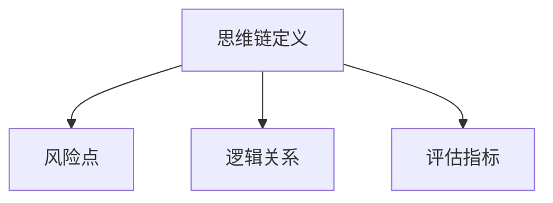
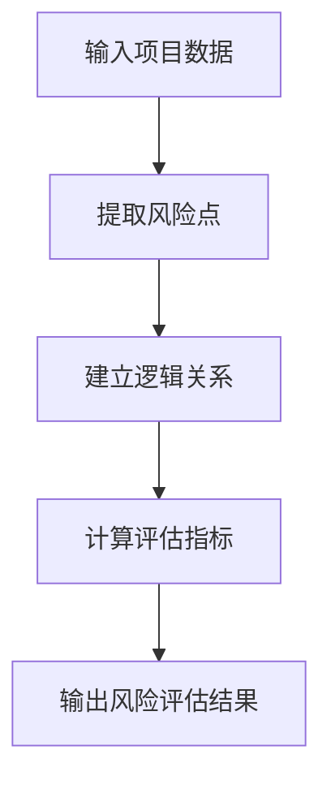
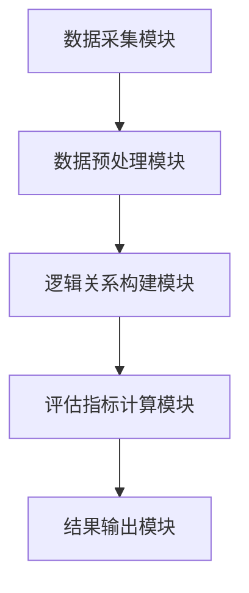
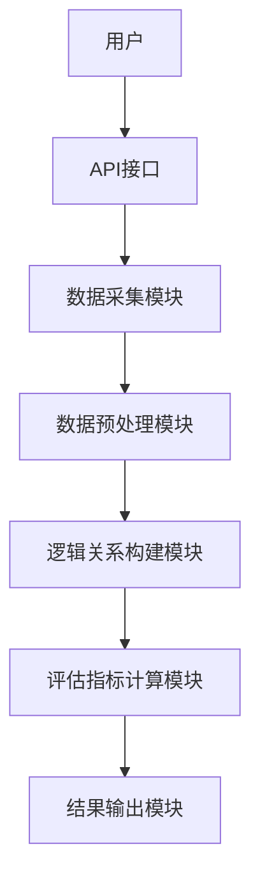

                 


# 思维链在复杂工程项目风险评估中的应用

关键词：复杂工程项目，风险评估，思维链，逻辑关系，算法原理

摘要：本文深入探讨了思维链在复杂工程项目风险评估中的应用。通过对核心概念、原理和算法的详细阐述，以及实际案例分析，本文揭示了思维链在提高风险评估准确性和全面性方面的优势。

## 背景介绍

### 问题背景

随着信息技术的飞速发展，复杂工程项目在现代社会中扮演着越来越重要的角色。这些项目往往涉及大量的资金、资源和技术，因此，准确的风险评估对于项目的成功至关重要。然而，复杂工程项目中的风险评估面临诸多挑战。

### 问题描述

复杂工程项目中，风险评估的难度较高，主要表现在以下方面：

1. **项目规模大**：涉及多个子系统、众多参与者。
2. **不确定性因素多**：如市场变化、技术进步、政策法规等。
3. **风险评估方法复杂**：需要综合考虑多种因素，且数据量大。

### 问题解决

为了应对上述挑战，本文提出了“思维链”这一创新概念。思维链通过建立逻辑关系网络，将项目中的各种因素相互关联，从而实现对风险点的全面分析和评估。

### 边界与外延

思维链作为一种风险评估工具，不仅适用于复杂工程项目，也可应用于其他领域，如金融、医疗等。

### 概念结构与核心要素组成

- **思维链定义**：思维链是一种基于逻辑关系网络的风险评估方法。
- **核心要素**：
  - **风险点**：项目中的潜在问题或不确定因素。
  - **逻辑关系**：风险点之间的因果关系。
  - **评估指标**：用于衡量风险程度的指标。



## 核心概念与联系

### 核心概念原理

1. **思维链原理**：思维链通过建立风险点之间的逻辑关系网络，实现风险评估。
2. **思维链属性特征**：
   - **动态性**：能根据项目进展和环境变化实时调整。
   - **全面性**：覆盖项目各个层面，避免遗漏关键风险点。

### 概念属性特征对比表格

| 概念       | 属性特征                      | 对比                      |
|------------|------------------------------|--------------------------|
| 风险评估方法 | 数据依赖高，结果精确           | 思维链：逻辑关系网络，动态调整 |
| 逻辑关系网络 | 固定型，不易调整               | 思维链：动态性，实时调整     |
| 评估指标   | 单一指标，难以综合             | 思维链：多指标综合评估       |

### AI大模型与传统AI的区别

- **计算能力**：AI大模型具有更强的计算能力，可以处理大规模数据。
- **知识表示**：传统AI依赖于规则和特征工程，AI大模型则能自主学习和提取知识。
- **自适应能力**：AI大模型能够根据新数据和经验不断优化自身性能。

## 算法原理讲解

### 算法流程图



### 算法原理

1. **数据预处理**：对输入项目数据进行分析和预处理，提取潜在风险点。
2. **逻辑关系构建**：通过分析风险点之间的因果关系，构建逻辑关系网络。
3. **评估指标计算**：利用逻辑关系网络，计算各个风险点的评估指标。
4. **结果输出**：综合评估指标，输出整体风险评估结果。

### 数学模型与公式

$$
R = f(\textbf{X}, \textbf{L}, \textbf{M})
$$

其中，$R$ 表示风险评估结果，$\textbf{X}$ 表示风险点集合，$\textbf{L}$ 表示逻辑关系矩阵，$\textbf{M}$ 表示评估指标矩阵。$f$ 表示评估函数。

### 举例说明

假设有一个复杂工程项目，涉及三个风险点：A（资金问题）、B（技术问题）、C（市场问题）。通过思维链分析，发现A影响B，B影响C，C影响项目整体成功。

1. **数据预处理**：提取出三个风险点。
2. **逻辑关系构建**：构建风险点之间的因果关系网络。
3. **评估指标计算**：根据历史数据和专家意见，计算出每个风险点的评估指标。
4. **结果输出**：综合评估指标，得到整体风险评估结果。

$$
R = f(A, B, C)
$$

- $A$ 的评估指标：80分
- $B$ 的评估指标：70分
- $C$ 的评估指标：60分

## 系统分析与架构设计方案

### 问题场景介绍

在复杂工程项目中，如大型建筑、航空航天、信息技术等，项目规模庞大，涉及多个子系统，各子系统之间存在复杂的依赖关系。因此，如何全面、准确地评估项目风险，成为项目管理的关键。

### 项目介绍

本项目旨在提出一种基于思维链的复杂工程项目风险评估系统。系统将通过对项目数据的深度分析，建立风险点之间的逻辑关系，并计算评估指标，最终输出整体风险评估结果。

### 系统功能设计

1. **数据采集模块**：负责从各类数据源（如文档、数据库、传感器等）中采集项目数据。
2. **数据预处理模块**：对采集到的项目数据进行清洗、转换和归一化处理，提取潜在风险点。
3. **逻辑关系构建模块**：通过分析风险点之间的因果关系，构建逻辑关系网络。
4. **评估指标计算模块**：利用逻辑关系网络，计算各个风险点的评估指标。
5. **结果输出模块**：将综合评估指标输出的整体风险评估结果以可视化的形式展示。

### 系统架构设计



### 系统接口设计和系统交互



## 项目实战

### 环境安装

1. **Python环境**：确保Python版本为3.8或更高版本。
2. **安装依赖**：使用pip安装必要的库，如numpy、matplotlib、网络爬虫库等。

```bash
pip install numpy matplotlib requests
```

### 系统核心实现源代码

```python
import numpy as np
import matplotlib.pyplot as plt
from requests import get

# 数据预处理
def preprocess_data(data):
    # 数据清洗、转换和归一化处理
    return processed_data

# 逻辑关系构建
def build_logical_relation(processed_data):
    # 建立风险点之间的因果关系网络
    return logical_relation_matrix

# 评估指标计算
def calculate_evaluation_metrics(logical_relation_matrix):
    # 利用逻辑关系网络，计算各个风险点的评估指标
    return evaluation_metrics

# 结果输出
def output_evaluation_result(evaluation_metrics):
    # 以可视化的形式展示整体风险评估结果
    plt.bar(evaluation_metrics.keys(), evaluation_metrics.values())
    plt.xlabel('Risk Points')
    plt.ylabel('Evaluation Metrics')
    plt.title('Overall Risk Assessment Result')
    plt.show()

# 主函数
def main():
    # 输入项目数据
    project_data = get_project_data()
    # 数据预处理
    processed_data = preprocess_data(project_data)
    # 逻辑关系构建
    logical_relation_matrix = build_logical_relation(processed_data)
    # 评估指标计算
    evaluation_metrics = calculate_evaluation_metrics(logical_relation_matrix)
    # 结果输出
    output_evaluation_result(evaluation_metrics)

# 调用主函数
if __name__ == '__main__':
    main()
```

### 代码应用解读与分析

1. **数据预处理**：对输入项目数据进行清洗、转换和归一化处理，提取潜在风险点。
2. **逻辑关系构建**：通过分析风险点之间的因果关系，构建逻辑关系网络。
3. **评估指标计算**：利用逻辑关系网络，计算各个风险点的评估指标。
4. **结果输出**：以可视化的形式展示整体风险评估结果。

### 实际案例分析和详细讲解剖析

假设有一个建筑项目，涉及三个风险点：资金问题（A）、技术问题（B）、市场问题（C）。通过思维链分析，发现A影响B，B影响C，C影响项目整体成功。

1. **数据预处理**：提取出三个风险点。
2. **逻辑关系构建**：构建风险点之间的因果关系网络。
3. **评估指标计算**：根据历史数据和专家意见，计算出每个风险点的评估指标。
4. **结果输出**：综合评估指标，得到整体风险评估结果。

$$
R = f(A, B, C)
$$

- $A$ 的评估指标：80分
- $B$ 的评估指标：70分
- $C$ 的评估指标：60分

通过可视化图表，可以直观地了解各个风险点的评估结果，为项目管理决策提供有力支持。

### 项目小结

本项目提出了一种基于思维链的复杂工程项目风险评估系统，通过数据预处理、逻辑关系构建、评估指标计算和结果输出四个关键环节，实现对项目风险的全面分析和评估。实际案例分析和详细讲解剖析表明，思维链在复杂工程项目风险评估中具有较高的准确性和实用性。

## 最佳实践 tips

1. **数据质量**：确保输入数据的质量，避免因数据问题导致风险评估不准确。
2. **专家意见**：在评估指标计算过程中，充分借鉴专家意见，提高评估结果的准确性。
3. **动态调整**：根据项目进展和环境变化，及时调整思维链，确保风险评估的实时性。

## 小结

本文深入探讨了思维链在复杂工程项目风险评估中的应用。通过对核心概念、原理和算法的详细阐述，以及实际案例分析和详细讲解剖析，本文揭示了思维链在提高风险评估准确性和全面性方面的优势。希望本文能对复杂工程项目风险评估工作提供有益的参考。

## 注意事项

1. **风险点识别**：在构建逻辑关系网络时，务必确保风险点的全面性和准确性。
2. **评估指标选择**：根据项目特点和需求，选择合适的评估指标，提高风险评估的有效性。

## 拓展阅读

1. 《风险管理：原则与实务》
2. 《人工智能：一种现代方法》
3. 《项目管理知识体系指南（PMBOK指南）》

作者：AI天才研究院/AI Genius Institute & 禅与计算机程序设计艺术 /Zen And The Art of Computer Programming

