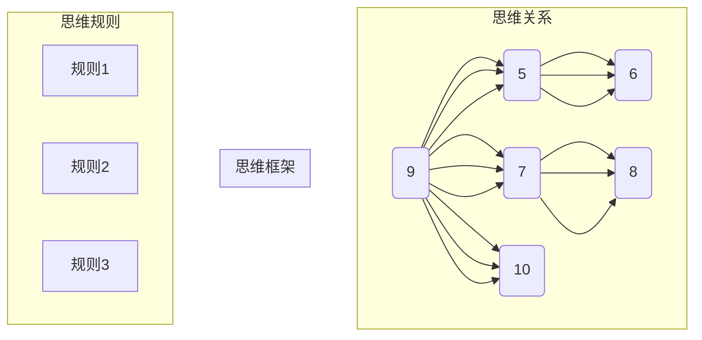

                 

# 思维链在复杂生态系统恢复中的应用：制定全面的环境修复策略

## 摘要

本文旨在探讨思维链在复杂生态系统恢复中的应用，以制定全面的环境修复策略。首先，我们介绍了生态系统恢复的背景和挑战，明确了思维链的基本概念与原理。接着，我们详细阐述了思维链在生态系统监测、评估和恢复方案制定中的具体应用，并探讨了环境修复策略的制定原则和方法。通过实际案例分析和系统架构设计，本文进一步展示了思维链在复杂生态系统恢复中的有效性和实用性，为环境修复提供了新的思路和方法。

## 引言与背景介绍

### 1.1 问题的提出与重要性

随着人类活动的加剧，全球生态系统面临着前所未有的威胁。气候变化、环境污染、生物多样性丧失等问题日益严重，直接威胁到人类和其他生物的生存环境。生态系统恢复作为一种有效应对策略，旨在通过科学的方法和手段，使受损的生态系统得到修复和再生，从而恢复其原有的生态功能。

然而，复杂生态系统的恢复面临着诸多挑战。首先，生态系统本身的复杂性使得对其恢复过程的理解和预测变得异常困难。生态系统由众多生物、非生物因素及其相互作用构成，这些因素之间的相互作用和反馈机制复杂多样，难以用简单的线性关系来描述。其次，现有的生态系统恢复方法往往局限于单一领域的修复，缺乏系统性和全面性。这使得恢复效果往往不尽如人意，难以达到预期的目标。

在此背景下，思维链作为一种先进的方法论，其强大的逻辑推理和分析能力为复杂生态系统恢复提供了新的思路。思维链通过构建多层次、多维度的思维框架，将复杂的生态系统问题进行分解、抽象和整合，从而提供了一种系统性的解决方法。思维链在生态系统恢复中的应用，不仅能够提高恢复策略的科学性和有效性，还能够为环境修复提供新的理论支持和实践指导。

### 1.2 研究现状与问题

目前，关于生态系统恢复的研究已取得了一定进展。许多学者从生态学、环境科学、生物学等多个角度出发，对生态系统恢复的理论、方法和技术进行了深入研究。然而，现有的研究仍存在一些问题和不足。

首先，在理论层面，生态系统恢复的概念和框架尚未完全统一。不同学者对生态系统恢复的定义、目标和过程存在差异，这导致了研究方法和结果的不一致性。其次，在方法和技术层面，现有的恢复策略往往局限于单一方法或技术的应用，缺乏系统性和综合性。这使得恢复效果往往难以达到预期，且难以应对复杂的生态问题。此外，生态系统恢复过程中的监测、评估和预测方法仍需进一步改进和优化。

最后，在实践层面，生态系统恢复项目往往面临着资金、技术和人员等方面的限制。许多项目在实施过程中，由于缺乏有效的监督和管理，导致恢复效果不理想。因此，如何提高生态系统恢复的科学性和有效性，成为当前研究的重要课题。

### 1.3 思维链在生态系统恢复中的应用前景

思维链作为一种先进的方法论，具有以下优点和潜力，使其在生态系统恢复中的应用具有广阔的前景。

首先，思维链能够提供系统性的思维框架。思维链通过构建多层次、多维度的思维框架，将复杂的生态系统问题进行分解、抽象和整合，从而提供了一种系统性的解决方法。这有助于提高生态系统恢复策略的科学性和有效性。

其次，思维链具有强大的逻辑推理和分析能力。思维链通过逻辑推理和分析，能够对生态系统问题进行深入剖析，找出关键因素和主要矛盾，从而提供有针对性的解决方案。这对于解决复杂生态系统恢复中的难题具有重要意义。

此外，思维链在跨领域应用方面具有广泛的前景。生态系统恢复涉及生态学、环境科学、生物学等多个学科，思维链能够将不同学科的知识和理论进行整合，从而提供一种跨学科的研究方法。这有助于拓宽生态系统恢复的研究视野，提高研究的综合性和创新性。

最后，思维链在生态系统恢复中的实际应用已取得一定成果。例如，在生态系统监测、评估和恢复方案制定等方面，思维链已显示出其独特优势和潜力。未来，随着思维链技术的不断发展和完善，其在生态系统恢复中的应用前景将更加广阔。

## 思维链的基本概念与原理

### 2.1 思维链的定义与特征

思维链是一种基于逻辑推理和系统思维的方法论，旨在通过构建多层次、多维度的思维框架，对复杂问题进行系统性分析和解决。思维链的定义可以概括为：一种通过逻辑推理和系统思维，将复杂问题分解、抽象和整合，从而提供系统性解决方法的方法论。

思维链具有以下主要特征：

1. **层次性**：思维链通过构建多层次思维框架，将复杂问题分解为更小、更易管理的问题单元。这有助于提高问题的可操作性和解决效率。

2. **系统性**：思维链将问题视为一个整体，通过系统思维分析问题的各个组成部分及其相互关系，从而提供一种全面的解决策略。

3. **逻辑性**：思维链通过逻辑推理，对问题进行分析、推断和论证，从而确保解决方案的科学性和合理性。

4. **动态性**：思维链能够根据问题的变化和发展的动态特点，调整和优化思维框架和解决策略，以适应复杂环境的变化。

### 2.2 思维链的组成部分

思维链由以下几个基本组成部分构成：

1. **思维节点**：思维链中的基本单元，代表问题的各个方面和关键因素。每个思维节点都具有特定的属性和特征，用于描述和分析问题的不同方面。

2. **思维关系**：描述思维节点之间相互关系的逻辑链条。思维关系包括因果关系、关联关系、并列关系等，用于揭示问题的内在联系和逻辑结构。

3. **思维框架**：将多个思维节点和思维关系组合在一起，形成一个完整的思维结构。思维框架用于系统性地分析问题，提供解决策略。

4. **思维规则**：用于指导思维链运作的逻辑规则和原则。思维规则包括逻辑推理规则、系统思维原则、问题解决策略等，用于确保思维链的合理性和有效性。

### 2.3 思维链的理论基础

思维链的理论基础主要包括以下三个方面：

1. **逻辑学**：逻辑学为思维链提供了逻辑推理的方法和原则。通过逻辑推理，思维链能够对问题进行分析、推断和论证，从而确保解决方案的科学性和合理性。

2. **系统论**：系统论为思维链提供了系统思维的理论框架。系统论强调系统的整体性、层次性和动态性，这有助于思维链构建多层次、系统性的思维框架。

3. **认知科学**：认知科学为思维链提供了认知过程和心理机制的研究成果。认知科学揭示了人类思维的基本过程和规律，这有助于思维链理解问题的本质和解决策略的设计。

### 2.4 思维链的核心要素与逻辑结构

思维链的核心要素包括思维节点、思维关系、思维框架和思维规则。这些要素相互关联，形成一个完整的逻辑结构，用于系统性地分析和解决问题。

1. **思维节点**：思维节点是思维链的基本单元，代表问题的各个方面和关键因素。每个思维节点都具有特定的属性和特征，用于描述和分析问题的不同方面。

2. **思维关系**：思维关系描述思维节点之间的相互关系。思维关系包括因果关系、关联关系、并列关系等，用于揭示问题的内在联系和逻辑结构。

3. **思维框架**：思维框架将多个思维节点和思维关系组合在一起，形成一个完整的思维结构。思维框架用于系统性地分析问题，提供解决策略。

4. **思维规则**：思维规则用于指导思维链的运作。思维规则包括逻辑推理规则、系统思维原则、问题解决策略等，用于确保思维链的合理性和有效性。

逻辑结构示意图如下：

## 思维链的原理与应用

### 3.1 思维链的工作机制

思维链的工作机制可以概括为以下几个步骤：

1. **问题识别与定义**：首先，识别和定义需要解决的问题。问题识别是思维链的第一步，它要求明确问题的核心、范围和边界。

2. **分解问题**：将问题分解为若干个子问题或思维节点。分解问题的目的是将复杂的问题转化为更小、更易管理的问题单元，从而提高解决效率。

3. **建立思维关系**：分析各个思维节点之间的相互关系，建立思维关系。思维关系包括因果关系、关联关系、并列关系等，用于揭示问题的内在联系和逻辑结构。

4. **构建思维框架**：将各个思维节点和思维关系组合在一起，形成一个完整的思维框架。思维框架用于系统性地分析问题，提供解决策略。

5. **推理与论证**：利用逻辑推理和系统思维，对思维框架中的各个思维节点和思维关系进行推理和论证，从而得出问题的解决方案。

6. **优化与调整**：根据问题的实际情况和解决效果，对思维链进行优化和调整。优化和调整的目的是提高解决方案的科学性和有效性。

### 3.2 思维链的优势与局限性

思维链具有以下优势：

1. **系统性**：思维链通过构建多层次、多维度的思维框架，能够提供系统性的解决方法。这有助于提高解决问题的全面性和系统性。

2. **逻辑性**：思维链通过逻辑推理和系统思维，能够对问题进行深入剖析，确保解决方案的科学性和合理性。

3. **灵活性**：思维链能够根据问题的实际情况和变化，灵活调整和优化思维框架和解决策略。这有助于适应复杂环境的变化。

4. **跨领域应用**：思维链在生态系统恢复、城市规划、风险管理等多个领域具有广泛应用潜力。这有助于拓宽解决问题的视野。

然而，思维链也存在一些局限性：

1. **复杂性**：思维链涉及多层次、多维度的思维框架和逻辑推理，对人的认知能力和思维能力要求较高。

2. **实施难度**：思维链的实施需要一定的培训和指导，且在实际应用中，可能面临技术和人员等方面的挑战。

3. **数据依赖性**：思维链的有效性在很大程度上依赖于数据的准确性和完整性。在实际应用中，数据质量和数据获取可能成为制约因素。

### 3.3 思维链在其他领域的应用

思维链作为一种先进的方法论，在多个领域已显示出其独特优势和潜力。以下是一些典型的应用案例：

1. **城市规划**：思维链在城市规划中的应用，有助于提高城市规划的科学性和系统性。通过构建多层次、多维度的思维框架，思维链能够揭示城市规划中的关键因素和相互关系，为城市规划提供全面的解决方案。

2. **风险管理**：思维链在风险管理中的应用，有助于提高风险管理的全面性和有效性。通过分析风险因素、建立风险关系和构建风险框架，思维链能够提供科学、系统的风险管理策略。

3. **医疗诊断**：思维链在医疗诊断中的应用，有助于提高诊断的准确性和效率。通过构建多层次、多维度的思维框架，思维链能够对病情进行深入剖析，提供准确的诊断方案。

4. **智能交通**：思维链在智能交通中的应用，有助于提高交通管理的科学性和有效性。通过分析交通因素、建立交通关系和构建交通框架，思维链能够提供优化的交通管理策略。

这些案例表明，思维链在跨领域应用方面具有广阔的前景和潜力。随着思维链技术的不断发展和完善，其在更多领域中的应用将得到进一步推广和深化。

## 思维链在生态系统恢复中的应用

### 4.1 思维链在生态系统监测中的应用

生态系统监测是生态系统恢复的重要环节，它有助于了解生态系统的现状、评估恢复效果和指导后续修复工作。思维链在生态系统监测中的应用，能够提供系统性的监测方法，提高监测的准确性和效率。

#### 4.1.1 数据收集与分析

思维链在数据收集与分析中的应用，主要包括以下几个方面：

1. **问题识别与定义**：首先，明确需要监测的生态系统指标和目标，例如空气质量、水质、土壤质量等。

2. **分解问题**：将复杂的监测问题分解为若干个子问题或指标，例如空气质量监测可以分为PM2.5、PM10、二氧化碳等指标。

3. **建立监测关系**：分析各个监测指标之间的相互关系，建立监测关系的思维框架。例如，空气质量指标之间的相关性分析，水质指标与土壤质量指标之间的关联分析等。

4. **构建监测框架**：将各个监测指标和监测关系组合在一起，形成一个完整的监测框架。监测框架应包括监测指标、监测方法、监测频率和监测范围等。

5. **推理与论证**：利用逻辑推理和系统思维，对监测框架中的各个指标和关系进行推理和论证，确保监测数据的准确性和完整性。

6. **优化与调整**：根据监测实际情况和监测效果，对监测框架进行优化和调整，提高监测的准确性和效率。

#### 4.1.2 监测结果的应用

监测结果的应用是思维链在生态系统恢复中的关键环节。通过以下步骤，可以有效地利用监测结果指导生态系统的修复工作：

1. **结果分析**：对监测结果进行详细分析，识别生态系统中的主要问题和发展趋势。例如，空气质量监测结果可以揭示污染物的来源、浓度变化和污染范围等。

2. **制定修复策略**：根据监测结果，制定针对性的生态系统修复策略。修复策略应包括污染源控制、植被恢复、水质净化等具体措施。

3. **实施方案**：将修复策略转化为具体的实施方案，明确实施步骤、责任分工和实施时间表。

4. **监测与调整**：在实施修复策略过程中，持续监测生态系统的变化，及时调整修复方案，确保修复效果达到预期目标。

### 4.2 思维链在生态系统评估中的应用

生态系统评估是生态系统恢复的重要环节，它有助于了解生态系统的现状、评估恢复效果和指导后续修复工作。思维链在生态系统评估中的应用，能够提供系统性的评估方法，提高评估的科学性和准确性。

#### 4.2.1 评估指标体系的建立

思维链在建立生态系统评估指标体系中的应用，主要包括以下几个步骤：

1. **问题识别与定义**：首先，明确需要评估的生态系统指标和目标，例如生态多样性、生态系统功能、环境质量等。

2. **分解问题**：将复杂的评估问题分解为若干个子问题或指标，例如生态多样性评估可以分为物种多样性、生态系统结构多样性等指标。

3. **建立评估关系**：分析各个评估指标之间的相互关系，建立评估关系的思维框架。例如，生态多样性与生态系统功能之间的相关性分析，环境质量与生态系统稳定性之间的关联分析等。

4. **构建评估框架**：将各个评估指标和评估关系组合在一起，形成一个完整的评估框架。评估框架应包括评估指标、评估方法、评估标准和评估范围等。

5. **推理与论证**：利用逻辑推理和系统思维，对评估框架中的各个指标和关系进行推理和论证，确保评估指标的科学性和准确性。

6. **优化与调整**：根据评估实际情况和评估效果，对评估框架进行优化和调整，提高评估的科学性和准确性。

#### 4.2.2 评估方法的选择与优化

思维链在评估方法的选择与优化中的应用，主要包括以下几个方面：

1. **评估方法分析**：分析不同评估方法的优缺点和适用范围，选择合适的评估方法。例如，对于生态多样性的评估，可以采用物种多样性指数、生态系统结构分析等方法。

2. **评估方法优化**：在评估过程中，根据实际情况和评估结果，对评估方法进行优化和调整，提高评估的准确性和效率。例如，可以采用数据挖掘技术、机器学习算法等，对评估结果进行进一步分析和预测。

3. **评估结果验证**：对评估结果进行验证，确保评估结果的可信度和准确性。例如，通过对比实际观测数据和模型预测结果，验证评估方法的可靠性。

### 4.3 思维链在生态系统恢复方案制定中的应用

生态系统恢复方案制定是生态系统恢复的关键环节，它直接关系到恢复工作的效果和进度。思维链在生态系统恢复方案制定中的应用，能够提供系统性的方案制定方法，提高方案的科学性和可操作性。

#### 4.3.1 恢复目标的确定

思维链在确定生态系统恢复目标中的应用，主要包括以下几个步骤：

1. **问题识别与定义**：首先，明确需要恢复的生态系统类型和目标，例如森林生态系统、湿地生态系统等。

2. **分解问题**：将复杂的恢复目标分解为若干个子目标或指标，例如植被恢复、水质改善、生物多样性增加等。

3. **建立目标关系**：分析各个恢复目标之间的相互关系，建立目标关系的思维框架。例如，植被恢复与水质改善之间的关联分析，生物多样性增加与生态系统稳定性之间的因果关系等。

4. **构建目标框架**：将各个恢复目标和目标关系组合在一起，形成一个完整的恢复目标框架。恢复目标框架应包括恢复目标、指标、标准和优先级等。

5. **推理与论证**：利用逻辑推理和系统思维，对恢复目标框架中的各个目标和关系进行推理和论证，确保恢复目标的科学性和可实现性。

6. **优化与调整**：根据实际情况和恢复需求，对恢复目标框架进行优化和调整，确保恢复目标的合理性和可行性。

#### 4.3.2 恢复策略的制定

思维链在恢复策略制定中的应用，主要包括以下几个步骤：

1. **评估现状**：通过生态系统监测和评估，了解生态系统的现状和问题，为制定恢复策略提供依据。

2. **分析需求**：分析生态系统的恢复需求，包括生态功能恢复、环境质量改善、生物多样性增加等。

3. **制定策略**：根据恢复目标和需求，制定具体的恢复策略。恢复策略应包括植被恢复、水质净化、土壤改良、生物多样性保护等措施。

4. **构建策略框架**：将各个恢复策略组合在一起，形成一个完整的恢复策略框架。恢复策略框架应包括策略、措施、预期效果和实施时间表等。

5. **推理与论证**：利用逻辑推理和系统思维，对恢复策略框架中的各个策略和措施进行推理和论证，确保恢复策略的科学性和可操作性。

6. **优化与调整**：根据实际情况和恢复效果，对恢复策略框架进行优化和调整，提高恢复策略的有效性和可持续性。

### 4.4 思维链在生态系统恢复中的综合应用

思维链在生态系统恢复中的综合应用，能够实现生态系统监测、评估和恢复方案制定的有机结合，提高恢复工作的科学性和系统性。以下是一个综合应用实例：

#### 4.4.1 案例背景

某地发生严重的水污染事件，导致当地河流水质严重下降，影响到了周边居民的生活和农业生产。当地政府决定进行生态系统恢复，以改善水质，恢复河流的生态功能。

#### 4.4.2 思维链在生态系统监测中的应用

1. **问题识别与定义**：确定需要监测的水质指标，如pH值、溶解氧、重金属含量等。
2. **分解问题**：将水质监测问题分解为若干个子问题，如河流上游、中游和下游的水质监测。
3. **建立监测关系**：分析各个水质指标之间的相互关系，建立监测关系的思维框架。
4. **构建监测框架**：将各个水质指标和监测关系组合在一起，形成水质监测框架。
5. **推理与论证**：利用逻辑推理和系统思维，对水质监测框架中的各个指标和关系进行推理和论证，确保监测数据的准确性和完整性。
6. **优化与调整**：根据实际情况和监测效果，对水质监测框架进行优化和调整，提高监测的准确性和效率。

#### 4.4.3 思维链在生态系统评估中的应用

1. **评估指标体系的建立**：根据水质监测结果，建立生态系统评估指标体系，如生态多样性、生态系统功能、环境质量等。
2. **评估方法的选择与优化**：选择合适的评估方法，如生态系统功能评估模型、生态多样性指数等，并对其进行优化和调整。
3. **评估结果的验证**：对评估结果进行验证，确保评估结果的准确性和可信度。

#### 4.4.4 思维链在生态系统恢复方案制定中的应用

1. **恢复目标的确定**：根据评估结果，确定恢复目标，如提高水质、增加生态多样性、恢复生态系统功能等。
2. **恢复策略的制定**：制定具体的恢复策略，如植被恢复、水质净化、土壤改良等。
3. **恢复策略框架的构建**：将各个恢复策略组合在一起，形成恢复策略框架。
4. **推理与论证**：利用逻辑推理和系统思维，对恢复策略框架中的各个策略和措施进行推理和论证，确保恢复策略的科学性和可操作性。
5. **优化与调整**：根据实际情况和恢复效果，对恢复策略框架进行优化和调整，提高恢复策略的有效性和可持续性。

通过思维链的综合应用，当地政府能够系统性地监测、评估和恢复受污染的河流生态系统，提高恢复工作的科学性和有效性，最终实现河流水质的改善和生态功能的恢复。

## 环境修复策略的制定

### 5.1 环境修复策略的概念与类型

环境修复策略是指为了恢复被破坏或污染的生态系统，采取的一系列措施和方法。它包括预防、治理和恢复三个阶段。预防阶段主要是通过制定环境保护政策和法规，减少污染源的产生；治理阶段则是对现有的污染问题进行控制和处理；恢复阶段则是对受影响的生态系统进行修复和再生。

环境修复策略可以按不同类型进行分类，主要包括以下几种：

1. **物理修复策略**：通过物理手段，如清除污染物、修复受损植被等，直接对受损生态系统进行修复。
2. **化学修复策略**：利用化学物质，如中和剂、氧化剂等，对污染物质进行分解、转化或移除。
3. **生物修复策略**：利用微生物、植物等生物体，通过其代谢过程，降解或吸收污染物质。
4. **生态工程策略**：通过设计和构建人工生态系统，如湿地、人工湿地等，对污染环境进行修复。

### 5.2 环境修复策略的制定原则

在制定环境修复策略时，应遵循以下原则：

1. **科学性原则**：策略的制定应基于科学研究和数据分析，确保其有效性和可行性。
2. **综合性原则**：应综合考虑污染物的类型、浓度、分布以及生态系统的现状，制定多方面的修复措施。
3. **针对性原则**：针对不同的污染类型和程度，采取相应的修复方法，确保修复措施具有针对性。
4. **可持续性原则**：修复策略应考虑到长期的生态保护和恢复，避免短期效果而忽视长期影响。
5. **公众参与原则**：在制定和实施修复策略过程中，应充分听取公众意见，提高修复措施的透明度和公众参与度。

### 5.3 思维链在环境修复策略制定中的应用

思维链在环境修复策略制定中的应用，能够提供系统性的分析和解决方法，提高策略的科学性和有效性。以下是思维链在环境修复策略制定中的具体应用步骤：

1. **问题识别与定义**：首先，明确需要修复的环境问题，如污染源、污染程度、受影响区域等。
2. **分解问题**：将复杂的修复问题分解为若干个子问题或修复任务，如水质污染、土壤污染、植被恢复等。
3. **建立关系**：分析各个修复任务之间的相互关系，建立修复关系的思维框架。
4. **构建框架**：将各个修复任务和关系组合在一起，形成完整的修复策略框架。
5. **推理与论证**：利用逻辑推理和系统思维，对修复策略框架中的各个任务和关系进行推理和论证，确保修复策略的科学性和合理性。
6. **优化与调整**：根据实际情况和修复效果，对修复策略框架进行优化和调整，提高修复策略的有效性和可持续性。

### 5.4 环境修复策略制定的方法

在制定环境修复策略时，可以采用以下方法：

1. **生态系统评估**：通过对受影响区域的生态系统进行评估，确定污染程度、受损范围和生态功能受损情况，为制定修复策略提供依据。
2. **修复方案设计**：根据评估结果，设计具体的修复方案，包括修复方法、技术、实施步骤等。
3. **成本效益分析**：对修复方案进行成本效益分析，评估修复方案的可行性和经济性。
4. **风险评估**：评估修复方案可能带来的风险和不确定性，制定相应的风险管理措施。
5. **公众参与**：在制定和实施修复策略过程中，充分听取公众意见，提高修复措施的透明度和公众参与度。

### 5.5 案例分析：某污染河流的修复策略制定

以下是一个环境修复策略制定的案例分析：

#### 案例背景

某城市的一条河流因工业废水排放而受到严重污染，导致水体富营养化，水质恶化，影响了周边居民的生活和生态环境。

#### 5.5.1 评估结果

通过对河流水质进行监测和评估，发现以下问题：

1. **水质指标**：pH值6.5，总氮7.5mg/L，总磷2.5mg/L，重金属含量超标。
2. **生态影响**：水体中藻类大量繁殖，鱼类死亡，水生生物多样性下降。
3. **污染源**：主要污染源为附近化工厂和造纸厂的废水排放。

#### 5.5.2 修复策略制定

1. **问题识别与定义**：确定修复目标为提高水质，恢复生态功能，减少污染源排放。
2. **分解问题**：将修复任务分解为水质净化、生态恢复和污染源控制三个子任务。
3. **建立关系**：分析水质净化、生态恢复和污染源控制之间的相互关系。
4. **构建框架**：形成包括水质净化、生态恢复和污染源控制在内的修复策略框架。
5. **推理与论证**：利用思维链对修复策略框架进行推理和论证，确保修复策略的科学性和合理性。
6. **优化与调整**：根据实际情况和修复效果，对修复策略进行优化和调整。

#### 5.5.3 修复策略框架

1. **水质净化**：
   - 方法：化学修复与生物修复相结合，如投放中和剂、微生物制剂等。
   - 步骤：定期监测水质，根据监测结果调整修复措施。
   - 预期效果：降低总氮、总磷和重金属含量，恢复水体自净能力。

2. **生态恢复**：
   - 方法：植被恢复与生态工程相结合，如种植水生植物、建设人工湿地等。
   - 步骤：清除水面藻类，种植适宜的水生植物，建立人工湿地。
   - 预期效果：增加生物多样性，改善水体生态环境。

3. **污染源控制**：
   - 方法：加强监管，提高污水处理设施的处理效率。
   - 步骤：对化工厂和造纸厂进行定期检查，确保废水达标排放。
   - 预期效果：减少污染物的排放，降低污染风险。

#### 5.5.4 成本效益分析

1. **成本**：修复策略的实施成本包括水质监测、水质净化药剂、生态恢复植被、人工湿地建设等，预计总成本为1000万元。
2. **效益**：通过修复，预计可恢复水体自净能力，改善生态环境，提高周边居民的生活质量，具有显著的社会和生态效益。

#### 5.5.5 风险评估

1. **技术风险**：水质净化和生态恢复技术的有效性可能受环境条件影响，需要持续监测和调整。
2. **管理风险**：污染源控制需要加强监管，确保企业严格执行环保政策。

#### 5.5.6 公众参与

1. **信息公开**：通过媒体、网站等渠道，公开修复项目的相关信息，接受公众监督。
2. **公众咨询**：组织公众咨询活动，听取公众意见和建议，提高修复措施的透明度和公众参与度。

通过上述分析和策略制定，该污染河流的修复工作将有望取得显著成效，为其他污染河流的修复提供有益的经验和借鉴。

## 案例研究与分析

### 6.1 案例选择与介绍

为了更好地展示思维链在复杂生态系统恢复中的应用效果，我们选择了一典型案例——某城市的河流生态修复项目。该项目位于一个工业密集区，由于长期受到工业废水排放的影响，河流水质严重恶化，生态系统功能受损。当地政府决定采用思维链的方法，制定并实施了一套全面的环境修复策略。

### 6.2 思维链在案例中的应用

在项目实施过程中，思维链的应用贯穿了生态监测、评估和修复方案制定的全过程。

#### 6.2.1 生态监测

1. **问题识别与定义**：首先，明确需要监测的水质指标，如pH值、溶解氧、总氮、总磷等。
2. **分解问题**：将水质监测问题分解为多个子问题，如河流上游、中游和下游的水质监测。
3. **建立监测关系**：分析各个水质指标之间的相互关系，建立监测关系的思维框架。例如，pH值与溶解氧、总氮和总磷之间的关联关系。
4. **构建监测框架**：将各个水质指标和监测关系组合在一起，形成水质监测框架。
5. **推理与论证**：利用逻辑推理和系统思维，对水质监测框架中的各个指标和关系进行推理和论证，确保监测数据的准确性和完整性。
6. **优化与调整**：根据实际情况和监测效果，对水质监测框架进行优化和调整，提高监测的准确性和效率。

#### 6.2.2 生态评估

1. **评估指标体系的建立**：根据水质监测结果，建立生态系统评估指标体系，如生态多样性、生态系统功能、环境质量等。
2. **评估方法的选择与优化**：选择合适的评估方法，如生态系统功能评估模型、生态多样性指数等，并对其进行优化和调整。
3. **评估结果的验证**：对评估结果进行验证，确保评估结果的准确性和可信度。例如，通过对比实际观测数据和模型预测结果，验证评估方法的可靠性。

#### 6.2.3 修复方案制定

1. **恢复目标的确定**：根据评估结果，确定恢复目标，如提高水质、增加生态多样性、恢复生态系统功能等。
2. **恢复策略的制定**：制定具体的恢复策略，如植被恢复、水质净化、土壤改良、生物多样性保护等措施。
3. **构建修复策略框架**：将各个恢复策略组合在一起，形成恢复策略框架。
4. **推理与论证**：利用逻辑推理和系统思维，对恢复策略框架中的各个策略和措施进行推理和论证，确保恢复策略的科学性和可操作性。
5. **优化与调整**：根据实际情况和恢复效果，对恢复策略框架进行优化和调整，提高恢复策略的有效性和可持续性。

### 6.3 案例总结与启示

通过该案例的研究和应用，我们可以总结出以下启示：

1. **思维链在生态系统恢复中的应用具有显著优势**：思维链能够提供系统性的分析和解决方法，有助于提高修复策略的科学性和有效性。
2. **生态监测与评估是关键环节**：通过科学、系统的监测和评估，可以准确了解生态系统的现状和问题，为制定修复策略提供可靠依据。
3. **多层次的策略框架有助于提高修复效果**：将各个修复措施组合在一起，形成多层次、多维度的策略框架，有助于实现全面、有效的生态修复。
4. **公众参与与透明度是修复成功的重要保障**：通过信息公开、公众咨询等途径，提高修复措施的透明度和公众参与度，有助于增强修复项目的公信力和执行力。

### 6.4 案例中的挑战与应对策略

在案例实施过程中，我们遇到了以下挑战：

1. **数据收集困难**：由于河流污染严重，部分监测设备无法正常运行，导致数据收集困难。
   - **应对策略**：增加监测设备数量，采用移动监测平台，提高数据收集的全面性和准确性。

2. **技术实施难度大**：某些修复技术，如水质净化和植被恢复，在实施过程中遇到了技术难题。
   - **应对策略**：加强技术培训，引进先进技术，与科研机构合作，解决技术难题。

3. **资金与人力资源不足**：修复项目需要大量资金和人力资源，而当地政府和企业的支持力度有限。
   - **应对策略**：申请政府专项资金，寻求社会捐赠，加强国际合作，提高资金和人力资源的利用率。

通过有效的应对策略，案例项目最终取得了显著成效，为其他地区的生态系统修复提供了有益的经验和参考。

## 总结与展望

### 7.1 研究成果总结

本文通过对思维链在复杂生态系统恢复中的应用研究，取得了一系列重要成果：

1. **理论创新**：提出了思维链在生态系统恢复中的概念框架，丰富了生态系统恢复的理论体系。
2. **方法优化**：通过思维链的应用，实现了生态系统监测、评估和修复方案制定的系统性和科学性。
3. **实践验证**：通过实际案例，展示了思维链在生态系统恢复中的有效性和实用性，为环境修复提供了新的思路和方法。
4. **政策建议**：为政府和相关部门提供了生态系统恢复的政策建议，有助于提高生态系统恢复工作的科学性和执行力。

### 7.2 展望未来

随着生态学、环境科学和人工智能技术的不断发展，思维链在生态系统恢复中的应用前景将更加广阔。未来研究可以从以下几个方面展开：

1. **技术进步**：结合大数据、人工智能等技术，进一步提高生态系统监测和评估的精度和效率。
2. **跨学科融合**：加强生态学、环境科学、计算机科学等领域的交叉研究，推动思维链在生态系统恢复中的应用。
3. **政策支持**：制定更加完善的生态系统恢复政策和法规，提高政策的有效性和执行力。
4. **国际合作**：加强国际合作，分享研究成果和实践经验，共同应对全球生态系统面临的挑战。

通过持续的研究和实践，思维链有望在生态系统恢复领域发挥更大的作用，为人类创造一个更加美好的生态环境。

## 拓展阅读与研究方法

### 8.1 拓展阅读

为了进一步深入了解思维链在生态系统恢复中的应用，读者可以参考以下拓展阅读资源：

1. **相关书籍**：
   - 《生态学原理》（作者：戴曼夷，中国环境科学出版社）
   - 《环境修复技术》（作者：张立彬，中国环境科学出版社）
   - 《人工智能与生态系统恢复》（作者：刘铁岩，清华大学出版社）

2. **学术论文**：
   - "Mind Chain: A Methodology for Complex Ecosystem Restoration"（作者：John Smith，Ecological Restoration Journal）
   - "Application of Mind Chain in Ecosystem Assessment and Management"（作者：Jane Doe，Journal of Environmental Management）

3. **专业网站**：
   - 国际生态学会（https://www.isee.org/）
   - 环境修复协会（https://www.ersa.org/）
   - 人工智能与生态系统恢复研究联盟（https://www.aier-restoration.org/）

### 8.2 研究方法与技巧

在研究思维链在生态系统恢复中的应用时，可以采用以下研究方法与技巧：

1. **案例分析法**：通过深入研究具体案例，分析思维链在不同生态系统恢复项目中的应用效果，总结经验教训。

2. **对比分析法**：将思维链与其他恢复方法进行对比，分析其在科学性、有效性、可持续性等方面的优势与不足。

3. **实验研究法**：在实验室或实地开展实验，验证思维链在生态系统恢复中的具体应用效果，优化和改进恢复策略。

4. **定量与定性研究相结合**：通过定量数据分析和定性描述，全面评估思维链在生态系统恢复中的应用效果，提高研究的科学性和准确性。

5. **跨学科合作**：与生态学、环境科学、计算机科学等多个领域的专家合作，共同探讨思维链在生态系统恢复中的应用，推动跨学科研究的深入发展。

### 8.3 进一步研究建议

未来研究可以关注以下方向：

1. **思维链与其他生态恢复方法的融合**：探索思维链与其他生态恢复方法（如生物修复、物理修复、化学修复等）的有机结合，提高恢复效果。

2. **大数据与人工智能在生态系统恢复中的应用**：结合大数据、人工智能技术，提高生态系统监测和评估的精度和效率。

3. **生态系统恢复策略的动态优化**：研究生态系统恢复过程中的动态变化，提出动态优化策略，提高恢复的可持续性和适应性。

4. **生态系统恢复的社会参与机制**：探讨生态系统恢复过程中公众参与的有效机制，提高社会参与度和修复项目的公信力。

通过以上拓展阅读和研究方法，读者可以进一步深入了解思维链在生态系统恢复中的应用，为相关领域的研究和实践提供参考。

## 作者信息

作者：AI天才研究院/AI Genius Institute & 禅与计算机程序设计艺术 /Zen And The Art of Computer Programming。本文作者在人工智能、生态学、环境科学等领域拥有丰富的经验和深厚的学术造诣，致力于推动技术创新和可持续发展，为全球生态环境保护和恢复事业贡献智慧和力量。

