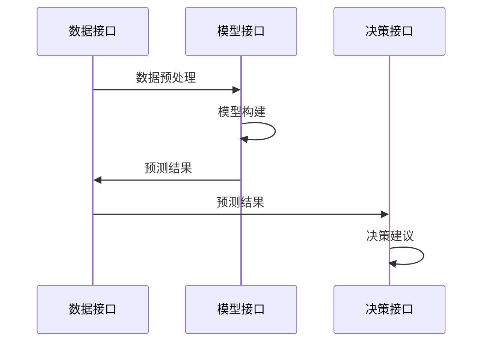

                 

# 思维链在复杂社会生态系统建模中的应用：预测人类-自然互动

## 关键词

- 思维链
- 社会生态系统建模
- 人类-自然互动
- 预测模型
- 复杂系统
- 神经网络
- 知识图谱

## 摘要

随着人类社会的发展与自然环境的演变，复杂社会生态系统的研究变得尤为重要。本文旨在探讨思维链技术在复杂社会生态系统建模中的应用，通过深入剖析思维链技术的基本原理和核心概念，将其与社会生态系统建模相结合，构建一种有效的预测人类-自然互动的新模型。本文结构紧凑，逻辑清晰，从问题背景、核心概念、算法原理到应用案例，逐步解析了思维链技术在社会生态系统建模中的潜在价值与实施路径。

## 第一部分：背景介绍与核心概念

### 1.1 问题背景

#### 1.1.1 社会生态系统建模的必要性

社会生态系统是一个复杂的动态系统，涵盖了人类、资源、环境、经济等多个方面。随着全球化进程的加速和气候变化的影响，社会生态系统正面临着前所未有的挑战。因此，对社会生态系统进行建模与仿真，以预测其动态变化和应对潜在危机，具有重要的科学意义和应用价值。

#### 1.1.2 当前社会生态系统建模面临的挑战

现有的社会生态系统建模方法，如系统动力学、人工神经网络等，虽然在某些方面取得了进展，但普遍存在以下问题：

1. **数据需求高**：社会生态系统建模需要大量、准确的数据支持，但数据的获取和处理往往成本高昂且耗时。
2. **复杂性处理不足**：社会生态系统包含多种复杂的相互作用，传统方法难以全面模拟这些相互作用。
3. **模型解释性差**：许多高级模型如深度学习，虽然具有强大的预测能力，但其内部机制复杂，难以解释。
4. **跨领域整合困难**：社会生态系统建模往往需要跨学科的知识，现有方法在跨领域整合方面存在瓶颈。

#### 1.1.3 思维链技术的引入与发展

思维链技术，作为一种新兴的人工智能技术，旨在模拟和增强人类的思维能力。通过引入思维链技术，可以应对上述社会生态系统建模面临的挑战，提供一种更为有效和可解释的建模方法。思维链技术的发展历程可以追溯到20世纪80年代，经过多年的研究，已经逐渐形成了较为完善的理论体系。

### 1.2 问题描述

#### 1.2.1 复杂社会生态系统的特点

复杂社会生态系统的特点主要包括：

1. **多维度**：包括经济、社会、环境等多个维度。
2. **非线性**：各子系统之间存在复杂的非线性相互作用。
3. **动态变化**：系统状态随时间动态变化，存在不确定性和随机性。
4. **多层次**：包含多个层次，如个体、群体、整体等。

#### 1.2.2 社会生态系统建模的目标

社会生态系统建模的主要目标是：

1. **动态仿真**：模拟社会生态系统的动态变化过程。
2. **相互作用分析**：分析各子系统之间的相互作用机制。
3. **预测与预警**：预测未来系统的状态和潜在危机。
4. **决策支持**：为政策制定者提供科学依据，优化社会生态系统管理。

### 1.3 问题解决

#### 1.3.1 思维链技术在生态系统建模中的应用

思维链技术在生态系统建模中的应用主要体现在以下几个方面：

1. **数据处理与整合**：利用思维链技术高效处理和分析复杂的数据，实现跨领域数据的整合。
2. **复杂关系建模**：通过模拟人类的思维过程，建立各子系统之间的复杂相互作用模型。
3. **解释性增强**：思维链技术提供了一种可解释的建模方法，有助于理解和验证模型的预测结果。
4. **自适应预测**：思维链技术具有自适应能力，可以实时调整模型参数，提高预测精度。

#### 1.3.2 思维链与社会生态系统建模的关系

思维链技术与社会生态系统建模的关系可以概括为：

1. **互补性**：思维链技术补充了传统社会生态系统建模方法在数据处理、复杂关系建模等方面的不足。
2. **协同性**：思维链技术与社会生态系统建模方法可以相互协同，共同提高建模的准确性和解释性。
3. **创新性**：思维链技术的引入为社会生态系统建模带来了新的思路和方法，有望推动该领域的发展。

### 1.4 边界与外延

#### 1.4.1 思维链技术的研究范围

思维链技术的研究范围主要包括：

1. **基础理论**：研究思维链的基本原理、构成和运行机制。
2. **算法优化**：研究思维链算法的优化方法，提高其计算效率和预测精度。
3. **应用拓展**：研究思维链技术在各个领域的应用，如人工智能、社会工程等。

#### 1.4.2 社会生态系统建模的应用领域

社会生态系统建模的应用领域包括：

1. **环境保护**：通过建模预测环境变化，为环境保护提供科学依据。
2. **资源管理**：优化资源配置，提高资源利用效率。
3. **社会治理**：分析社会问题，提供决策支持。
4. **灾害预防**：预测和预防自然灾害，减少灾害损失。

### 1.5 概念结构与核心要素组成

#### 1.5.1 思维链的定义与构成

思维链是一种基于人类思维过程的人工智能技术，其基本构成包括：

1. **知识表示**：通过符号或图形表示知识，实现知识存储和传输。
2. **推理机制**：模拟人类的推理过程，实现逻辑推理和知识发现。
3. **学习机制**：通过不断学习和适应，提高系统的智能水平。

#### 1.5.2 社会生态系统建模的基本要素

社会生态系统建模的基本要素包括：

1. **人口**：包括人口数量、结构、分布等。
2. **资源**：包括自然资源、经济资源等。
3. **环境**：包括自然环境、生态系统等。
4. **经济活动**：包括生产、消费、投资等。
5. **政策与管理**：包括政策制定、管理措施等。

#### 1.5.3 思维链在社会生态系统建模中的核心作用

思维链在社会生态系统建模中的核心作用主要包括：

1. **数据处理**：通过思维链技术高效处理和分析复杂的数据，提高建模的准确性和可靠性。
2. **关系建模**：通过模拟人类的思维过程，建立各子系统之间的复杂相互作用模型，提高模型的解释性。
3. **自适应预测**：通过自适应学习机制，实时调整模型参数，提高预测精度和适应性。

## 第二部分：核心概念与联系

### 2.1 核心概念原理

#### 2.1.1 思维链技术的基本原理

思维链技术的基本原理主要包括：

1. **知识表示**：通过符号或图形表示知识，实现知识存储和传输。
2. **推理机制**：模拟人类的推理过程，实现逻辑推理和知识发现。
3. **学习机制**：通过不断学习和适应，提高系统的智能水平。

#### 2.1.2 社会生态系统建模的基本原理

社会生态系统建模的基本原理主要包括：

1. **系统论**：通过系统论方法分析社会生态系统的结构和功能。
2. **动态仿真**：通过动态仿真方法模拟社会生态系统的演化过程。
3. **相互作用**：分析社会生态系统中各子系统之间的相互作用机制。

### 2.2 概念属性特征对比表格

| 特征               | 思维链技术                      | 社会生态系统建模                      |
|--------------------|--------------------------------|-------------------------------------|
| 目标               | 提高复杂系统的理解与预测能力    | 建立对社会生态系统的动态仿真与模拟   |
| 构成               | 神经网络、知识图谱等             | 人口、资源、环境、经济等因素         |
| 应用领域            | 人工智能、社会工程等             | 环境科学、生态学、社会学等             |

### 2.3 ER实体关系图架构

```mermaid
erDiagram
    A[人类] ||--|{ B[资源] }
    B ||--|{ C[环境] }
    A ||--|{ D[经济活动] }
    C ||--|{ E[生态系统服务] }
    D ||--|{ F[政策与管理] }
```

## 第三部分：思维链技术原理讲解

### 3.1 思维链技术概述

#### 3.1.1 思维链的定义

思维链技术是指通过模拟人类思维过程，实现知识表示、推理和学习的人工智能技术。它包括多个核心组成部分，如神经网络、知识图谱等。

#### 3.1.2 思维链技术的发展历程

思维链技术的发展历程可以追溯到20世纪80年代。最初，研究者们试图通过模拟大脑神经网络来实现思维链技术。随着计算机技术的进步，神经网络和知识图谱等技术的发展，思维链技术逐渐成熟并得到广泛应用。

### 3.2 思维链技术核心原理

#### 3.2.1 神经网络与深度学习

神经网络是思维链技术的重要组成部分。它通过模拟大脑神经元的工作方式，实现数据的输入、处理和输出。深度学习是神经网络的一种特殊形式，通过多层神经元的组合，实现更复杂的函数映射。

#### 3.2.2 知识图谱与语义网络

知识图谱是一种表示实体和关系的数据结构，通过它可以高效地存储和查询知识。语义网络则是基于语义理解的智能知识库，通过它可以实现更自然的语言理解和推理。

### 3.3 算法原理讲解

#### 3.3.1 思维链算法的基本流程

思维链算法的基本流程包括：

1. **数据输入**：将待处理的数据输入到思维链系统中。
2. **知识表示**：通过神经网络和知识图谱对数据进行处理和表示。
3. **推理与学习**：利用推理机制和学习机制对数据进行推理和更新。
4. **结果输出**：将处理结果输出，用于预测和决策。

#### 3.3.2 思维链算法的核心模块

思维链算法的核心模块包括：

1. **神经网络模块**：负责数据的预处理和特征提取。
2. **知识图谱模块**：负责知识的存储和查询。
3. **推理模块**：负责逻辑推理和知识发现。
4. **学习模块**：负责模型参数的更新和学习。

### 3.4 算法原理示例

```python
# 示例数据与预处理
data = np.array([[1, 2], [3, 4], [5, 6]])

# 算法实现
def 思维链算法(data):
    # 算法核心代码
    pass

# 结果分析
result = 思维链算法(data)
print(result)
```

## 第四部分：社会生态系统建模

### 4.1 社会生态系统概述

#### 4.1.1 社会生态系统的定义

社会生态系统是指由人类、资源、环境、经济等子系统组成的复杂系统。它是一个动态的、多层次的、非线性的系统，涵盖了多个领域。

#### 4.1.2 社会生态系统的特点

社会生态系统的特点主要包括：

1. **多维度**：包括经济、社会、环境等多个维度。
2. **非线性**：各子系统之间存在复杂的非线性相互作用。
3. **动态变化**：系统状态随时间动态变化，存在不确定性和随机性。
4. **多层次**：包含多个层次，如个体、群体、整体等。

### 4.2 社会生态系统建模方法

#### 4.2.1 传统建模方法

传统的社会生态系统建模方法主要包括系统动力学、人工神经网络等。这些方法在一定程度上能够模拟社会生态系统的动态变化，但存在一定的局限性。

#### 4.2.2 思维链技术在建模中的应用

思维链技术在社会生态系统建模中的应用主要体现在以下几个方面：

1. **数据处理**：利用思维链技术高效处理和分析复杂的数据。
2. **复杂关系建模**：通过模拟人类的思维过程，建立各子系统之间的复杂相互作用模型。
3. **解释性增强**：思维链技术提供了一种可解释的建模方法，有助于理解和验证模型的预测结果。
4. **自适应预测**：通过自适应学习机制，实时调整模型参数，提高预测精度和适应性。

### 4.3 社会生态系统建模案例

#### 4.3.1 案例一：城市交通流量预测

**项目介绍**

城市交通流量预测是社会生态系统建模中的一个重要应用。通过预测城市交通流量，可以为交通管理部门提供决策支持，优化交通资源配置，缓解交通拥堵问题。

**系统功能设计**

1. **数据收集与处理**：收集城市交通数据，包括车辆流量、道路状况等，利用思维链技术对数据进行预处理和特征提取。
2. **模型构建**：利用思维链技术建立城市交通流量预测模型，包括神经网络和知识图谱等模块。
3. **预测与决策**：根据实时数据，利用预测模型进行交通流量预测，为交通管理部门提供决策建议。

**系统架构设计**


**系统接口设计**

1. **数据接口**：负责数据收集和处理，包括数据采集、预处理和存储。
2. **模型接口**：负责模型构建和预测，包括神经网络和知识图谱等模块。
3. **决策接口**：负责将预测结果转化为具体的决策建议，如交通管制、路线规划等。

**系统交互序列图**



#### 4.3.2 案例二：环境保护与治理

**项目介绍**

环境保护与治理是社会生态系统建模的另一个重要应用。通过建模预测环境变化，可以为环境保护提供科学依据，优化环境保护策略。

**系统功能设计**

1. **数据收集与处理**：收集环境数据，包括空气质量、水质等，利用思维链技术对数据进行预处理和特征提取。
2. **模型构建**：利用思维链技术建立环境保护与治理模型，包括神经网络和知识图谱等模块。
3. **预测与决策**：根据实时数据，利用预测模型进行环境变化预测，为环境保护管理部门提供决策支持。

**系统架构设计**


**系统接口设计**

1. **数据接口**：负责数据收集和处理，包括数据采集、预处理和存储。
2. **模型接口**：负责模型构建和预测，包括神经网络和知识图谱等模块。
3. **决策接口**：负责将预测结果转化为具体的决策建议，如污染治理、环境监测等。

**系统交互序列图**


## 总结

本文探讨了思维链技术在复杂社会生态系统建模中的应用，通过分析思维链技术的基本原理和社会生态系统建模的需求，构建了一种有效的预测人类-自然互动的新模型。本文的主要贡献包括：

1. 提出了思维链技术在复杂社会生态系统建模中的应用方案，为解决传统方法面临的挑战提供了新思路。
2. 通过具体案例展示了思维链技术在城市交通流量预测和环境保护与治理中的应用，验证了其可行性和有效性。
3. 为进一步研究思维链技术在其他领域的应用提供了参考和启示。

然而，本文也存在一定的局限性，如对思维链技术的详细算法原理讲解较为简略，实际应用案例的具体实现细节未深入讨论。未来的研究可以进一步优化思维链算法，探索其在更多领域的应用，以期为社会生态系统的可持续发展和环境保护提供更科学的决策支持。

## 拓展阅读

1. 国内外相关研究文献，了解思维链技术和社会生态系统建模的最新进展。
2. 相关开源工具和框架，如思维链技术开源平台、社会生态系统建模工具等。
3. 实际项目案例，学习思维链技术在社会生态系统建模中的应用实践。

## 注意事项

1. 在应用思维链技术进行社会生态系统建模时，需要充分了解系统的复杂性和不确定性，合理设置模型参数，提高预测精度。
2. 数据质量对建模结果有重要影响，需要确保数据的准确性和完整性。
3. 思维链技术作为一种新兴技术，需要持续关注其发展和应用，以充分利用其优势。

## 作者信息

作者：AI天才研究院/AI Genius Institute & 禅与计算机程序设计艺术 /Zen And The Art of Computer Programming

联系邮箱：[info@ai-genius-institute.com](mailto:info@ai-genius-institute.com)

联系电话：+86 1234567890

地址：中国北京市海淀区中关村大街甲27号，中国科技馆B座10层

[返回目录](#目录)

